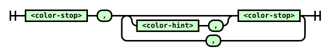

Attribution and reformatting notice added for Surgeist on 2026-10-09

This reformatted document accompanies Surgeist as software implementation support. The original English document at the source URL remains authoritative; this copy is not a new technical specification. Added labels and representation notes are non-normative. W3C is not responsible for content absent from the original, and this copy may contain formatting or hypertext errors.

This software or document includes material copied from or derived from [CSS Images Module Level 4](https://www.w3.org/TR/2025/WD-css-images-4-20250930/).

Original copyright notice: Copyright © 2025 World Wide Web Consortium . W3C ® liability , trademark and permissive document license rules apply.

License: [W3C Software and Document License, 2023 version](../licenses/w3c/software-license-2023.txt). Changes are format conversion, visible semantic labels, and passive SVG/TeX representations as detailed in the [conversion report](CONVERSION-REPORT.md). Original source text, status, authorship, and legal notices remain below.

# Source provenance

Title: CSS Images Module Level 4

Source snapshot: https://www.w3.org/TR/2025/WD-css-images-4-20250930/

Snapshot SHA-256: 2784dc56db1089852bddff8fff55c18a66b409310a9b99d36a20a42bf702fb0f

Conversion: offline format conversion of the exact stored HTML; not a new specification or summary. Publication versions remain distinct. Source fragment identifiers are preserved as short HTML anchors. Original copyright and licensing text/links are retained where present in the source.

Representation notes:
- 1 inline SVG diagrams are retained as local passive SVG assets, with original geometry and visible source diagram text. Supporting assets are not reference documents.
- Source row-header labels in readable Markdown tables are bold; native HTML th/scope accessibility semantics are not expressible in GFM. Field/Definition headings, where used, are added non-normative presentation labels.
- Small semantic emphasis/subscript/superscript HTML is retained to avoid GFM intraword-delimiter and subscript rendering defects; website layout HTML is not retained.
- Canonically unstable or combining Unicode characters and escape-sensitive punctuation are shielded as numeric entities in prose/semantic inline HTML. Literal source code stays literal.
- Existing external image/media URLs are resolved against the pinned source. Assets are not downloaded or availability-tested; image-only formulas/diagrams still require their source resources.

---

# <a id="title"></a>CSS Images Module Level 4

[Copyright](https://www.w3.org/policies/#copyright) © 2025 [World Wide Web Consortium](https://www.w3.org/). W3C<sup>®</sup> [liability](https://www.w3.org/policies/#Legal_Disclaimer), [trademark](https://www.w3.org/policies/#W3C_Trademarks) and [permissive document license](https://www.w3.org/copyright/software-license/) rules apply.

## <a id="abstract"></a>Abstract

<a id="ref-for-typedef-image"></a>

<a id="ref-for-funcdef-image"></a>

<a id="ref-for-funcdef-element"></a>

This module contains the features of CSS level 4 relating to the [\<image\>](#typedef-image) type and replaced elements. It includes and extends the functionality of CSS level 2 [\[CSS2\]](#biblio-css2) and in the previous level of this specification [\[css-images-3\]](#biblio-css-images-3). The main extensions compared to "CSS Images Module Level 3" \[css-images-3\] are several additions to the <a id="ref-for-typedef-image①"></a>\<image\> type, such as the [image()](#funcdef-image) notation, the [element()](#funcdef-element) notation, and conic gradients. This level is currently maintained as a diff spec over the level 3 module.

[CSS](https://www.w3.org/TR/CSS/) is a language for describing the rendering of structured documents (such as HTML and XML) on screen, on paper, etc.

## <a id="sotd"></a>Status of this document

<em>This section describes the status of this document at the time of its publication.&#xA;&#x9;A list of current W3C publications&#xA;&#x9;and the latest revision of this technical report&#xA;&#x9;can be found in the <a href="https://www.w3.org/TR/">W3C standards and drafts index.</a></em>

This document was published by the [CSS Working Group](https://www.w3.org/groups/wg/css) as a <strong>Working Draft</strong> using the [Recommendation track](https://www.w3.org/policies/process/20250818/#recs-and-notes). Publication as a Working Draft does not imply endorsement by W3C and its Members.

This is a draft document and may be updated, replaced or obsoleted by other documents at any time. It is inappropriate to cite this document as other than a work in progress.

Please send feedback by [filing issues in GitHub](https://github.com/w3c/csswg-drafts/issues) (preferred), including the spec code “css-images” in the title, like this: “\[css-images\] <i>…summary of comment…</i>”. All issues and comments are [archived](https://lists.w3.org/Archives/Public/public-css-archive/). Alternately, feedback can be sent to the ([archived](https://lists.w3.org/Archives/Public/www-style/)) public mailing list [www-style@w3.org](mailto:www-style@w3.org?Subject=%5Bcss-images%5D%20PUT%20SUBJECT%20HERE).

<a id="w3c_process_revision"></a>

This document is governed by the [18 August 2025 W3C Process Document](https://www.w3.org/policies/process/20250818/).

This document was produced by a group operating under the [W3C Patent Policy](https://www.w3.org/policies/patent-policy/20200915/). W3C maintains a [public list of any patent disclosures](https://www.w3.org/groups/wg/css/ipr) made in connection with the deliverables of the group; that page also includes instructions for disclosing a patent. An individual who has actual knowledge of a patent that the individual believes contains [Essential Claim(s)](https://www.w3.org/policies/patent-policy/20200915/#def-essential) must disclose the information in accordance with [section 6 of the W3C Patent Policy](https://www.w3.org/policies/patent-policy/20200915/#sec-Disclosure).

## <a id="intro"></a>1. Introduction

<em>This section is not normative.</em>

This module introduces additional ways of representing 2D images, for example as [a URL with color fallback](#image-notation), as [conic gradients](#conic-gradients), or as the [rendering of another element in the document](#element-notation).

### <a id="values"></a>1.1. Value Definitions

This specification follows the [CSS property definition conventions](https://www.w3.org/TR/CSS2/about.html#property-defs) from [\[CSS2\]](#biblio-css2) using the [value definition syntax](https://www.w3.org/TR/css-values-3/#value-defs) from [\[CSS-VALUES-3\]](#biblio-css-values-3). Value types not defined in this specification are defined in CSS Values &#x26; Units \[CSS-VALUES-3\]. Combination with other CSS modules may expand the definitions of these value types.

<a id="ref-for-css-wide-keywords"></a>

In addition to the property-specific values listed in their definitions, all properties defined in this specification also accept the [CSS-wide keywords](https://www.w3.org/TR/css-values-4/#css-wide-keywords) as their property value. For readability they have not been repeated explicitly.

<a id="ref-for-typedef-image②"></a>

## <a id="image-values"></a>2. 2D Image Values: the [\<image\>](#typedef-image) type

<a id="ref-for-typedef-image③"></a>

The [\<image\>](#typedef-image) value type denotes a 2D image. It can be a [url reference](#url-notation), [image notation](#image-notation), or [gradient notation](#gradients). Its syntax is:

<a id="typedef-image"></a>

<a id="ref-for-url-value"></a>

<a id="ref-for-comb-one"></a>

<a id="ref-for-funcdef-image①"></a>

<a id="ref-for-comb-one①"></a>

<a id="ref-for-funcdef-image-set"></a>

<a id="ref-for-comb-one②"></a>

<a id="ref-for-funcdef-cross-fade"></a>

<a id="ref-for-comb-one③"></a>

<a id="ref-for-funcdef-element①"></a>

<a id="ref-for-comb-one④"></a>

<a id="ref-for-typedef-gradient"></a>

```text
<image> = <url> | <image()> | <image-set()> | <cross-fade()> | <element()> | <gradient>
```
<a id="ref-for-typedef-image④"></a>

<a id="ref-for-propdef-background-image"></a>

<a id="ref-for-propdef-list-style-image"></a>

<a id="ref-for-propdef-cursor"></a>

<a id="ref-for-url-value①"></a>

An [\<image\>](#typedef-image) can be used in many CSS properties, including the [background-image](https://www.w3.org/TR/css-backgrounds-3/#propdef-background-image), [list-style-image](https://www.w3.org/TR/css-lists-3/#propdef-list-style-image), [cursor](https://www.w3.org/TR/css-ui-4/#propdef-cursor) properties [\[CSS2\]](#biblio-css2) (where it replaces the [\<url\>](https://www.w3.org/TR/css-values-4/#url-value) component in the property’s value).

<a id="ref-for-url-value②"></a>

<a id="ref-for-valdef-color-transparent"></a>

<a id="ref-for-natural-dimensions"></a>

<a id="ref-for-invalid-image"></a>

<a id="ref-for-propdef-list-style-image①"></a>

<a id="ref-for-valdef-list-style-type-none"></a>

<a id="ref-for-propdef-list-style-type"></a>

In some cases an image is invalid, such as a [\<url\>](https://www.w3.org/TR/css-values-4/#url-value) pointing to a resource that is not a valid image format or that has failed to load. An <a id="invalid-image"></a>invalid image is rendered as a solid-color [transparent](https://www.w3.org/TR/css-color-4/#valdef-color-transparent) image with no [natural dimensions](https://www.w3.org/TR/css-images-3/#natural-dimensions). However, [invalid images](#invalid-image) can trigger error-handling clauses in some contexts. For example, an <a id="ref-for-invalid-image①"></a>invalid image in [list-style-image](https://www.w3.org/TR/css-lists-3/#propdef-list-style-image) it is treated as [none](https://www.w3.org/TR/css-lists-3/#valdef-list-style-type-none), allowing the [list-style-type](https://www.w3.org/TR/css-lists-3/#propdef-list-style-type) to render in its place. [\[CSS2\]](#biblio-css2)

<a id="ref-for-loading-image"></a>

<a id="ref-for-invalid-image②"></a>

<a id="ref-for-valdef-color-transparent①"></a>

<a id="ref-for-natural-dimensions①"></a>

While an image is loading, is a <a id="loading-image"></a>loading image. [Loading images](#loading-image) are <em>not</em> [invalid images](#invalid-image), but have similar behavior: they are rendered as a solid-color [transparent](https://www.w3.org/TR/css-color-4/#valdef-color-transparent) image with no [natural dimensions](https://www.w3.org/TR/css-images-3/#natural-dimensions), and may trigger fallback rendering in contexts that offer it, but must not trigger loading of fallback resources. Alternately, if a <a id="ref-for-loading-image①"></a>loading image happens to be replacing an already-loaded image (for example due to changes in the document or style sheet) and the UA is tracking this information, it may continue to render the already-loaded image in place of the <a id="ref-for-loading-image②"></a>loading image.

<a id="ref-for-natural-dimensions②"></a>

<a id="ref-for-loading-image③"></a>

Partially-loaded images (whose [natural dimensions](https://www.w3.org/TR/css-images-3/#natural-dimensions) are known, but whose image data is not fully loaded) may be either treated as [loading images](#loading-image) or as loaded images rendered with partial data. For example, a UA may render an interlaced GIF in place as soon as its first pass of pixel data has loaded or even as soon as the image header (which contains sizing data) has parsed and refresh the rendering as more data loads; or it may wait until the entire image has loaded before using it.

<a id="ref-for-computed-value"></a>

<a id="ref-for-typedef-image⑤"></a>

<a id="ref-for-specified-value"></a>

<a id="ref-for-url-value③"></a>

<a id="ref-for-typedef-color"></a>

<a id="ref-for-length-value"></a>

A <a id="computed-image"></a>[computed](https://www.w3.org/TR/css-cascade-5/#computed-value) [\<image\>](#typedef-image) value is the [specified value](https://www.w3.org/TR/css-cascade-5/#specified-value) with any [\<url\>](https://www.w3.org/TR/css-values-4/#url-value)s, [\<color\>](https://www.w3.org/TR/css-color-5/#typedef-color)s, and [\<length\>](https://www.w3.org/TR/css-values-4/#length-value)s computed.

### <a id="image-file-formats"></a>2.1. Image File Formats

<a id="ref-for-typedef-image⑥"></a>

At minimum, the UA must support the following image file formats when referenced from an [\<image\>](#typedef-image) value, for all the properties in which using <a id="ref-for-typedef-image⑦"></a>\<image\> is valid:

- PNG, as specified in [\[PNG\]](#biblio-png)

- SVG, as specified in [\[SVG11\]](#biblio-svg11), using the [secure static mode](https://www.w3.org/TR/svg-integration/#secure-static-mode) (See [\[SVG-INTEGRATION\]](#biblio-svg-integration))

- <a id="ref-for-typedef-image⑧"></a>

  If the UA supports animated [\<image\>](#typedef-image)s, SVG, as specified in [\[SVG11\]](#biblio-svg11), using the [secure animated mode](https://www.w3.org/TR/svg-integration/#secure-animated-mode) (See [\[SVG-INTEGRATION\]](#biblio-svg-integration))

The UA may support other file formats as well.

<a id="ref-for-funcdef-url"></a>

### <a id="url-notation"></a>2.2. Image References: the [url()](https://www.w3.org/TR/css-values-4/#funcdef-url) notation

> <strong data-conversion-semantic="note">Note</strong>
>
> Note: No change from [\[css-images-3\]](#biblio-css-images-3).

### <a id="fetching-images"></a>2.3. Fetching External Images

<a id="ref-for-url-value④"></a>

<a id="ref-for-fetch-a-style-resource"></a>

<a id="ref-for-concept-response"></a>

To <a id="fetch-an-external-image-for-a-stylesheet"></a>fetch an external image for a stylesheet, given a [\<url\>](https://www.w3.org/TR/css-values-4/#url-value) <var>url</var> and a CSS style declaration <var>declaration</var>, [fetch a style resource](https://www.w3.org/TR/css-values-4/#fetch-a-style-resource) given <var>url</var>, with ruleOrDeclaration being <var>declaration</var>, destination "image", CORS mode "no-cors", and processResponse being the following steps given [response](https://fetch.spec.whatwg.org/#concept-response) <var>res</var> and null, failure or a byte stream <var>byteStream</var>: If <var>byteStream</var> is a byte stream, load the image from the byte stream.

<a id="ref-for-funcdef-image-set①"></a>

### <a id="image-set-notation"></a>2.4. Resolution/Type Negotiation: the [image-set()](#funcdef-image-set) notation

Delivering the most appropriate image resolution for a user’s device can be a difficult task. Ideally, images should be in the same resolution as the device they’re being viewed in, which can vary between users. However, other factors can factor into the decision of which image to send; for example, if the user is on a slow mobile connection, they may prefer to receive lower-res images rather than waiting for a large proper-res image to load. The <a id="funcdef-image-set"></a>image-set() function allows an author to ignore most of these issues, simply providing multiple resolutions of an image and letting the UA decide which is most appropriate in a given situation.

> <strong data-conversion-semantic="issue">Issue</strong>
>
> <a id="issue-86c01534"></a> This solution assumes that resolution is a proxy for filesize, and therefore doesn’t appropriately handle multi-resolution sets of vector images, or mixing vector images with raster ones (e.g. for icons). For example, use a vector for high-res, pixel-optimized bitmap for low-res, and same vector again for low-bandwidth (because it’s much smaller, even though it’s higher resolution).

<a id="ref-for-funcdef-image-set②"></a>

The syntax for [image-set()](#funcdef-image-set) is:

<a id="ref-for-funcdef-image-set③"></a>

<a id="ref-for-typedef-image-set-option"></a>

<a id="ref-for-mult-comma"></a>

<a id="typedef-image-set-option"></a>

<a id="ref-for-typedef-image⑨"></a>

<a id="ref-for-comb-one⑤"></a>

<a id="ref-for-string-value"></a>

<a id="ref-for-resolution-value"></a>

<a id="ref-for-comb-any"></a>

<a id="ref-for-string-value①"></a>

<a id="ref-for-mult-opt"></a>

```text
<image-set()> = image-set( <image-set-option># )
<image-set-option> = [ <image> | <string> ]
                     [ <resolution> || type(<string>) ]?
```
<a id="ref-for-the-picture-element"></a>

> <strong data-conversion-semantic="issue">Issue</strong>
>
> <a id="issue-372ac642"></a> We should add "w" and "h" dimensions as a possibility to match the functionality of HTML’s [picture](https://html.spec.whatwg.org/multipage/embedded-content.html#the-picture-element).

<a id="ref-for-string-value②"></a>

<a id="ref-for-funcdef-image-set④"></a>

<a id="ref-for-url-value⑤"></a>

Each [\<string\>](https://www.w3.org/TR/css-values-4/#string-value) inside [image-set()](#funcdef-image-set) represents a [\<url\>](https://www.w3.org/TR/css-values-4/#url-value).

<a id="ref-for-funcdef-image-set⑤"></a>

<a id="ref-for-typedef-image①⓪"></a>

The [image-set()](#funcdef-image-set) function can not be nested inside of itself, either directly or indirectly (as an argument to another [\<image\>](#typedef-image) type).

<a id="ref-for-typedef-image-set-option①"></a>

<a id="ref-for-funcdef-image-set⑥"></a>

Each [\<image-set-option\>](#typedef-image-set-option) defines a possible image for the [image-set()](#funcdef-image-set) function to represent, composed of three parts:

- <a id="ref-for-funcdef-linear-gradient"></a>

  An image reference (required). This can be a URL, or a CSS generated image, such as a [linear-gradient()](https://www.w3.org/TR/css-images-4/#funcdef-linear-gradient).

- <a id="ref-for-resolution-value①"></a>

  <a id="ref-for-typedef-image-set-option②"></a>

  <a id="ref-for---natural-resolution"></a>

  A [\<resolution\>](https://www.w3.org/TR/css-values-4/#resolution-value) (optional). This is used to help the UA decide which [\<image-set-option\>](#typedef-image-set-option) to choose. If the image reference is for a raster image, it also specifies the image’s [natural resolution](#--natural-resolution), overriding any other source of data that might supply a <a id="ref-for---natural-resolution①"></a>natural resolution.

  <a id="ref-for-typedef-image-set-option③"></a>

  <a id="ref-for---natural-resolution②"></a>

  If not specified, it behaves as 1x for the purpose of selecting which [\<image-set-option\>](#typedef-image-set-option) to use. It also <em>defaults</em> the image’s [natural resolution](#--natural-resolution) to 1x, but if some other source of data supplies a <a id="ref-for---natural-resolution③"></a>natural resolution, that resolution must be honored instead.

- <a id="ref-for-string-value③"></a>

  <a id="ref-for-string-value④"></a>

  A <a id="funcdef-image-set-type"></a>type( [\<string\>](https://www.w3.org/TR/css-values-4/#string-value) ) function (optional), specifying the image’s MIME type in the [\<string\>](https://www.w3.org/TR/css-values-4/#string-value).

  <a id="ref-for-string-value⑤"></a>

  <a id="ref-for-valid-mime-type"></a>

  <a id="ref-for-typedef-image-set-option④"></a>

  <a id="ref-for-funcdef-image-set⑦"></a>

  If the [\<string\>](https://www.w3.org/TR/css-values-4/#string-value), when parsed as a [valid MIME type string](https://mimesniff.spec.whatwg.org/#valid-mime-type), is either not valid, or is valid but doesn’t specify a supported image format, the [\<image-set-option\>](#typedef-image-set-option) does not define a valid option. (This has no effect on the validity of the [image-set()](#funcdef-image-set) function.)

  <a id="ref-for-typedef-image-set-option⑤"></a>

  It does not have any effect on the image itself; an [\<image-set-option\>](#typedef-image-set-option) like `url("picture.png") 1x type("image/jpeg")` is valid, and if chosen will display the linked PNG image, even though it was declared to be a JPEG.

  <a id="ref-for-typedef-image-set-option⑥"></a>

  If not specified, it has no effect on the [\<image-set-option\>](#typedef-image-set-option).

Tests

- [image-set-all-options-invalid.html](https://wpt.fyi/results/css/css-images/image-set/image-set-all-options-invalid.html) [(live test)](http://wpt.live/css/css-images/image-set/image-set-all-options-invalid.html) [(source)](https://github.com/web-platform-tests/wpt/blob/master/css/css-images/image-set/image-set-all-options-invalid.html)
- [image-set-calc-x-rendering-2.html](https://wpt.fyi/results/css/css-images/image-set/image-set-calc-x-rendering-2.html) [(live test)](http://wpt.live/css/css-images/image-set/image-set-calc-x-rendering-2.html) [(source)](https://github.com/web-platform-tests/wpt/blob/master/css/css-images/image-set/image-set-calc-x-rendering-2.html)
- [image-set-calc-x-rendering.html](https://wpt.fyi/results/css/css-images/image-set/image-set-calc-x-rendering.html) [(live test)](http://wpt.live/css/css-images/image-set/image-set-calc-x-rendering.html) [(source)](https://github.com/web-platform-tests/wpt/blob/master/css/css-images/image-set/image-set-calc-x-rendering.html)
- [image-set-computed.sub.html](https://wpt.fyi/results/css/css-images/image-set/image-set-computed.sub.html) [(live test)](http://wpt.live/css/css-images/image-set/image-set-computed.sub.html) [(source)](https://github.com/web-platform-tests/wpt/blob/master/css/css-images/image-set/image-set-computed.sub.html)
- [image-set-conic-gradient-rendering.html](https://wpt.fyi/results/css/css-images/image-set/image-set-conic-gradient-rendering.html) [(live test)](http://wpt.live/css/css-images/image-set/image-set-conic-gradient-rendering.html) [(source)](https://github.com/web-platform-tests/wpt/blob/master/css/css-images/image-set/image-set-conic-gradient-rendering.html)
- [image-set-content-rendering.html](https://wpt.fyi/results/css/css-images/image-set/image-set-content-rendering.html) [(live test)](http://wpt.live/css/css-images/image-set/image-set-content-rendering.html) [(source)](https://github.com/web-platform-tests/wpt/blob/master/css/css-images/image-set/image-set-content-rendering.html)
- [image-set-dpcm-rendering.html](https://wpt.fyi/results/css/css-images/image-set/image-set-dpcm-rendering.html) [(live test)](http://wpt.live/css/css-images/image-set/image-set-dpcm-rendering.html) [(source)](https://github.com/web-platform-tests/wpt/blob/master/css/css-images/image-set/image-set-dpcm-rendering.html)
- [image-set-dpi-rendering-2.html](https://wpt.fyi/results/css/css-images/image-set/image-set-dpi-rendering-2.html) [(live test)](http://wpt.live/css/css-images/image-set/image-set-dpi-rendering-2.html) [(source)](https://github.com/web-platform-tests/wpt/blob/master/css/css-images/image-set/image-set-dpi-rendering-2.html)
- [image-set-dpi-rendering.html](https://wpt.fyi/results/css/css-images/image-set/image-set-dpi-rendering.html) [(live test)](http://wpt.live/css/css-images/image-set/image-set-dpi-rendering.html) [(source)](https://github.com/web-platform-tests/wpt/blob/master/css/css-images/image-set/image-set-dpi-rendering.html)
- [image-set-dppx-rendering.html](https://wpt.fyi/results/css/css-images/image-set/image-set-dppx-rendering.html) [(live test)](http://wpt.live/css/css-images/image-set/image-set-dppx-rendering.html) [(source)](https://github.com/web-platform-tests/wpt/blob/master/css/css-images/image-set/image-set-dppx-rendering.html)
- [image-set-empty-url-rendering.html](https://wpt.fyi/results/css/css-images/image-set/image-set-empty-url-rendering.html) [(live test)](http://wpt.live/css/css-images/image-set/image-set-empty-url-rendering.html) [(source)](https://github.com/web-platform-tests/wpt/blob/master/css/css-images/image-set/image-set-empty-url-rendering.html)
- [image-set-first-match-rendering.html](https://wpt.fyi/results/css/css-images/image-set/image-set-first-match-rendering.html) [(live test)](http://wpt.live/css/css-images/image-set/image-set-first-match-rendering.html) [(source)](https://github.com/web-platform-tests/wpt/blob/master/css/css-images/image-set/image-set-first-match-rendering.html)
- [image-set-linear-gradient-rendering.html](https://wpt.fyi/results/css/css-images/image-set/image-set-linear-gradient-rendering.html) [(live test)](http://wpt.live/css/css-images/image-set/image-set-linear-gradient-rendering.html) [(source)](https://github.com/web-platform-tests/wpt/blob/master/css/css-images/image-set/image-set-linear-gradient-rendering.html)
- [image-set-negative-resolution-rendering-2.html](https://wpt.fyi/results/css/css-images/image-set/image-set-negative-resolution-rendering-2.html) [(live test)](http://wpt.live/css/css-images/image-set/image-set-negative-resolution-rendering-2.html) [(source)](https://github.com/web-platform-tests/wpt/blob/master/css/css-images/image-set/image-set-negative-resolution-rendering-2.html)
- [image-set-negative-resolution-rendering-3.html](https://wpt.fyi/results/css/css-images/image-set/image-set-negative-resolution-rendering-3.html) [(live test)](http://wpt.live/css/css-images/image-set/image-set-negative-resolution-rendering-3.html) [(source)](https://github.com/web-platform-tests/wpt/blob/master/css/css-images/image-set/image-set-negative-resolution-rendering-3.html)
- [image-set-negative-resolution-rendering.html](https://wpt.fyi/results/css/css-images/image-set/image-set-negative-resolution-rendering.html) [(live test)](http://wpt.live/css/css-images/image-set/image-set-negative-resolution-rendering.html) [(source)](https://github.com/web-platform-tests/wpt/blob/master/css/css-images/image-set/image-set-negative-resolution-rendering.html)
- [image-set-no-res-rendering-2.html](https://wpt.fyi/results/css/css-images/image-set/image-set-no-res-rendering-2.html) [(live test)](http://wpt.live/css/css-images/image-set/image-set-no-res-rendering-2.html) [(source)](https://github.com/web-platform-tests/wpt/blob/master/css/css-images/image-set/image-set-no-res-rendering-2.html)
- [image-set-no-res-rendering.html](https://wpt.fyi/results/css/css-images/image-set/image-set-no-res-rendering.html) [(live test)](http://wpt.live/css/css-images/image-set/image-set-no-res-rendering.html) [(source)](https://github.com/web-platform-tests/wpt/blob/master/css/css-images/image-set/image-set-no-res-rendering.html)
- [image-set-no-url-rendering.html](https://wpt.fyi/results/css/css-images/image-set/image-set-no-url-rendering.html) [(live test)](http://wpt.live/css/css-images/image-set/image-set-no-url-rendering.html) [(source)](https://github.com/web-platform-tests/wpt/blob/master/css/css-images/image-set/image-set-no-url-rendering.html)
- [image-set-parsing.html](https://wpt.fyi/results/css/css-images/image-set/image-set-parsing.html) [(live test)](http://wpt.live/css/css-images/image-set/image-set-parsing.html) [(source)](https://github.com/web-platform-tests/wpt/blob/master/css/css-images/image-set/image-set-parsing.html)
- [image-set-radial-gradient-rendering.html](https://wpt.fyi/results/css/css-images/image-set/image-set-radial-gradient-rendering.html) [(live test)](http://wpt.live/css/css-images/image-set/image-set-radial-gradient-rendering.html) [(source)](https://github.com/web-platform-tests/wpt/blob/master/css/css-images/image-set/image-set-radial-gradient-rendering.html)
- [image-set-rendering-2.html](https://wpt.fyi/results/css/css-images/image-set/image-set-rendering-2.html) [(live test)](http://wpt.live/css/css-images/image-set/image-set-rendering-2.html) [(source)](https://github.com/web-platform-tests/wpt/blob/master/css/css-images/image-set/image-set-rendering-2.html)
- [image-set-rendering.html](https://wpt.fyi/results/css/css-images/image-set/image-set-rendering.html) [(live test)](http://wpt.live/css/css-images/image-set/image-set-rendering.html) [(source)](https://github.com/web-platform-tests/wpt/blob/master/css/css-images/image-set/image-set-rendering.html)
- [image-set-repeating-conic-gradient-rendering.html](https://wpt.fyi/results/css/css-images/image-set/image-set-repeating-conic-gradient-rendering.html) [(live test)](http://wpt.live/css/css-images/image-set/image-set-repeating-conic-gradient-rendering.html) [(source)](https://github.com/web-platform-tests/wpt/blob/master/css/css-images/image-set/image-set-repeating-conic-gradient-rendering.html)
- [image-set-repeating-linear-gradient-rendering.html](https://wpt.fyi/results/css/css-images/image-set/image-set-repeating-linear-gradient-rendering.html) [(live test)](http://wpt.live/css/css-images/image-set/image-set-repeating-linear-gradient-rendering.html) [(source)](https://github.com/web-platform-tests/wpt/blob/master/css/css-images/image-set/image-set-repeating-linear-gradient-rendering.html)
- [image-set-repeating-radial-gradient-rendering.html](https://wpt.fyi/results/css/css-images/image-set/image-set-repeating-radial-gradient-rendering.html) [(live test)](http://wpt.live/css/css-images/image-set/image-set-repeating-radial-gradient-rendering.html) [(source)](https://github.com/web-platform-tests/wpt/blob/master/css/css-images/image-set/image-set-repeating-radial-gradient-rendering.html)
- [image-set-resolution-001.html](https://wpt.fyi/results/css/css-images/image-set/image-set-resolution-001.html) [(live test)](http://wpt.live/css/css-images/image-set/image-set-resolution-001.html) [(source)](https://github.com/web-platform-tests/wpt/blob/master/css/css-images/image-set/image-set-resolution-001.html)
- [image-set-resolution-002.html](https://wpt.fyi/results/css/css-images/image-set/image-set-resolution-002.html) [(live test)](http://wpt.live/css/css-images/image-set/image-set-resolution-002.html) [(source)](https://github.com/web-platform-tests/wpt/blob/master/css/css-images/image-set/image-set-resolution-002.html)
- [image-set-resolution-003.html](https://wpt.fyi/results/css/css-images/image-set/image-set-resolution-003.html) [(live test)](http://wpt.live/css/css-images/image-set/image-set-resolution-003.html) [(source)](https://github.com/web-platform-tests/wpt/blob/master/css/css-images/image-set/image-set-resolution-003.html)
- [image-set-type-first-match-rendering.html](https://wpt.fyi/results/css/css-images/image-set/image-set-type-first-match-rendering.html) [(live test)](http://wpt.live/css/css-images/image-set/image-set-type-first-match-rendering.html) [(source)](https://github.com/web-platform-tests/wpt/blob/master/css/css-images/image-set/image-set-type-first-match-rendering.html)
- [image-set-type-rendering-2.html](https://wpt.fyi/results/css/css-images/image-set/image-set-type-rendering-2.html) [(live test)](http://wpt.live/css/css-images/image-set/image-set-type-rendering-2.html) [(source)](https://github.com/web-platform-tests/wpt/blob/master/css/css-images/image-set/image-set-type-rendering-2.html)
- [image-set-type-rendering-3.html](https://wpt.fyi/results/css/css-images/image-set/image-set-type-rendering-3.html) [(live test)](http://wpt.live/css/css-images/image-set/image-set-type-rendering-3.html) [(source)](https://github.com/web-platform-tests/wpt/blob/master/css/css-images/image-set/image-set-type-rendering-3.html)
- [image-set-type-rendering.html](https://wpt.fyi/results/css/css-images/image-set/image-set-type-rendering.html) [(live test)](http://wpt.live/css/css-images/image-set/image-set-type-rendering.html) [(source)](https://github.com/web-platform-tests/wpt/blob/master/css/css-images/image-set/image-set-type-rendering.html)
- [image-set-type-skip-unsupported-rendering.html](https://wpt.fyi/results/css/css-images/image-set/image-set-type-skip-unsupported-rendering.html) [(live test)](http://wpt.live/css/css-images/image-set/image-set-type-skip-unsupported-rendering.html) [(source)](https://github.com/web-platform-tests/wpt/blob/master/css/css-images/image-set/image-set-type-skip-unsupported-rendering.html)
- [image-set-type-unsupported-rendering-2.html](https://wpt.fyi/results/css/css-images/image-set/image-set-type-unsupported-rendering-2.html) [(live test)](http://wpt.live/css/css-images/image-set/image-set-type-unsupported-rendering-2.html) [(source)](https://github.com/web-platform-tests/wpt/blob/master/css/css-images/image-set/image-set-type-unsupported-rendering-2.html)
- [image-set-type-unsupported-rendering.html](https://wpt.fyi/results/css/css-images/image-set/image-set-type-unsupported-rendering.html) [(live test)](http://wpt.live/css/css-images/image-set/image-set-type-unsupported-rendering.html) [(source)](https://github.com/web-platform-tests/wpt/blob/master/css/css-images/image-set/image-set-type-unsupported-rendering.html)
- [image-set-unordered-res-rendering.html](https://wpt.fyi/results/css/css-images/image-set/image-set-unordered-res-rendering.html) [(live test)](http://wpt.live/css/css-images/image-set/image-set-unordered-res-rendering.html) [(source)](https://github.com/web-platform-tests/wpt/blob/master/css/css-images/image-set/image-set-unordered-res-rendering.html)
- [image-set-zero-resolution-rendering-2.html](https://wpt.fyi/results/css/css-images/image-set/image-set-zero-resolution-rendering-2.html) [(live test)](http://wpt.live/css/css-images/image-set/image-set-zero-resolution-rendering-2.html) [(source)](https://github.com/web-platform-tests/wpt/blob/master/css/css-images/image-set/image-set-zero-resolution-rendering-2.html)
- [image-set-zero-resolution-rendering.html](https://wpt.fyi/results/css/css-images/image-set/image-set-zero-resolution-rendering.html) [(live test)](http://wpt.live/css/css-images/image-set/image-set-zero-resolution-rendering.html) [(source)](https://github.com/web-platform-tests/wpt/blob/master/css/css-images/image-set/image-set-zero-resolution-rendering.html)

<a id="ref-for-funcdef-image-set⑧"></a>

<a id="ref-for-typedef-image-set-option⑦"></a>

An [image-set()](#funcdef-image-set) function contains a list of one or more [\<image-set-option\>](#typedef-image-set-option)s, and must select only one of them to determine what image it will represent:

1.  <a id="ref-for-typedef-image-set-option⑧"></a>

    <a id="ref-for-funcdef-image-set-type"></a>

    First, remove any [\<image-set-option\>](#typedef-image-set-option)s from the list that specify an unknown or unsupported MIME type in their [type()](#funcdef-image-set-type) value.

2.  <a id="ref-for-typedef-image-set-option⑨"></a>

    <a id="ref-for-resolution-value②"></a>

    Second, remove any [\<image-set-option\>](#typedef-image-set-option)s from the list that have the same [\<resolution\>](https://www.w3.org/TR/css-values-4/#resolution-value) as a previous option in the list.

3.  <a id="ref-for-typedef-image-set-option①⓪"></a>

    <a id="ref-for-invalid-image③"></a>

    If there are no [\<image-set-option\>](#typedef-image-set-option) left at this point, the function represents an [invalid image](#invalid-image).

4.  <a id="ref-for-typedef-image-set-option①①"></a>

    Finally, among the remaining [\<image-set-option\>](#typedef-image-set-option)s, make a UA-specific choice of which to load, based on whatever criteria deemed relevant (such as the resolution of the display, connection speed, etc).

5.  <a id="ref-for-funcdef-image-set⑨"></a>

    <a id="ref-for-typedef-image①①"></a>

    <a id="ref-for-typedef-image-set-option①②"></a>

    The [image-set()](#funcdef-image-set) function then represents the [\<image\>](#typedef-image) of the chosen [\<image-set-option\>](#typedef-image-set-option).

<a id="ref-for-typedef-image-set-option①③"></a>

<a id="ref-for-funcdef-image-set①⓪"></a>

UAs <strong>may</strong> change which [\<image-set-option\>](#typedef-image-set-option) they wish to use for a given [image-set()](#funcdef-image-set) over the lifetime of the page, if the criteria used to determine which option to choose change significantly enough to make it worthwhile in the UA’s estimation.

<a id="ref-for-funcdef-image-set①①"></a>

> <strong data-conversion-semantic="example">Example</strong>
>
> <a id="ex-image-set"></a> This example shows how to use [image-set()](#funcdef-image-set) to provide an image in three versions: a "normal" version, a "high-res" version, and an extra-high resolution version for use in high-quality printing (as printers can have <em>extremely</em> high resolution):
>
> ```text
> background-image: image-set( "foo.png" 1x,
>                              "foo-2x.png" 2x,
>                              "foo-print.png" 600dpi );
> ```
<a id="ref-for-funcdef-image-set-type①"></a>

> <strong data-conversion-semantic="example">Example</strong>
>
> <a id="ex-image-set-type"></a> This example shows use of the [type()](#funcdef-image-set-type) function to serve multiple versions of the same image in both new, higher-quality formats, and older, more widely-supported formats:
>
> ```text
> background-image: image-set( "foo.avif" type("image/avif"),
>                              "foo.jpg" type("image/jpeg") );
> ```
>
> Note that the AVIF image is given first; since both images have the same resolution (defaulting to 1x since it’s unspecified), the JPEG image, coming second, is automatically dropped in UAs that support AVIF images.
>
> In older UAs, however, the AVIF image is ignored (because the UA knows it doesn’t support `"image/avif"` files), and so the JPEG is chosen instead.

> <strong data-conversion-semantic="example">Example</strong>
>
> <a id="eximage-set-multi-resolution"></a> Raster images can be mixed with vector images, or even CSS generated images.
>
> <a id="ref-for-funcdef-linear-gradient①"></a>
>
> For example, in this code snippet a high-resolution image with subtle details is used on screens that can do it justice, while an ordinary CSS [linear-gradient()](https://www.w3.org/TR/css-images-4/#funcdef-linear-gradient) is used instead for low-resolution situations:
>
> ```text
> background-image: image-set( linear-gradient(cornflowerblue, white) 1x,
>                              url("detailed-gradient.png") 3x );
> ```
<a id="ref-for-funcdef-image②"></a>

### <a id="image-notation"></a>2.5. Image Fallbacks and Annotations: the [image()](#funcdef-image) notation

<a id="ref-for-funcdef-image③"></a>

The [image()](#funcdef-image) function allows an author to:

- use [media fragments](https://www.w3.org/TR/media-frags/) to clip out a portion of an image

- use a solid color as an image

- fallback to a solid-color image, when the image at the specified url can’t be downloaded or decoded

- automatically respect the image orientation specified in the image’s metadata

<a id="ref-for-funcdef-image④"></a>

The [image()](#funcdef-image) notation is defined as:

<a id="funcdef-image"></a>

<a id="ref-for-typedef-image-tags"></a>

<a id="ref-for-mult-opt①"></a>

<a id="ref-for-typedef-image-src"></a>

<a id="ref-for-mult-opt②"></a>

<a id="ref-for-comb-comma"></a>

<a id="ref-for-typedef-color①"></a>

<a id="ref-for-mult-opt③"></a>

<a id="ref-for-mult-req"></a>

<a id="typedef-image-tags"></a>

<a id="ref-for-comb-one⑥"></a>

<a id="typedef-image-src"></a>

<a id="ref-for-url-value⑥"></a>

<a id="ref-for-comb-one⑦"></a>

<a id="ref-for-string-value⑥"></a>

```text
image() = image( <image-tags>? [ <image-src>? , <color>? ]! )
<image-tags> = [ ltr | rtl ]
<image-src> = [ <url> | <string> ]
```
<a id="ref-for-string-value⑦"></a>

<a id="ref-for-funcdef-image⑤"></a>

<a id="ref-for-url-value⑦"></a>

A [\<string\>](https://www.w3.org/TR/css-values-4/#string-value) used in [image()](#funcdef-image) represents a [\<url\>](https://www.w3.org/TR/css-values-4/#url-value). As usual for URLs in CSS, relative URLs are resolved to an absolute URL (as described in Values &#x26; Units [\[CSS-VALUES-3\]](#biblio-css-values-3)) when a specified <a id="ref-for-funcdef-image⑥"></a>image() value is computed.

If the image has an orientation specified in its metadata, such as EXIF, the UA must rotate or flip the image to correctly orient it as the metadata specifies.

#### <a id="image-fallbacks"></a>2.5.1. Image Fallbacks

<a id="ref-for-typedef-color②"></a>

<a id="ref-for-funcdef-image⑦"></a>

<a id="ref-for-invalid-image④"></a>

<a id="ref-for-loading-image④"></a>

If both a URL and a [\<color\>](https://www.w3.org/TR/css-color-5/#typedef-color) are specified in [image()](#funcdef-image), then whenever the URL represents an [invalid image](#invalid-image) or [loading image](#loading-image), the <a id="ref-for-funcdef-image⑧"></a>image() function renders as if the URL were not specified at all; it generates a solid-color image as specified in [§ 2.5.3 Solid-color Images](#color-images).

<a id="ref-for-typedef-color③"></a>

<a id="ref-for-invalid-image⑤"></a>

<a id="ref-for-loading-image⑤"></a>

<a id="ref-for-funcdef-image⑨"></a>

If just a URL is specified (no [\<color\>](https://www.w3.org/TR/css-color-5/#typedef-color)) and it represents an [invalid image](#invalid-image) or [loading image](#loading-image), the [image()](#funcdef-image) function represents the same.

Tests

- [css-image-fallbacks-and-annotations.html](https://wpt.fyi/results/css/css-images/css-image-fallbacks-and-annotations.html) [(live test)](http://wpt.live/css/css-images/css-image-fallbacks-and-annotations.html) [(source)](https://github.com/web-platform-tests/wpt/blob/master/css/css-images/css-image-fallbacks-and-annotations.html)
- [css-image-fallbacks-and-annotations002.html](https://wpt.fyi/results/css/css-images/css-image-fallbacks-and-annotations002.html) [(live test)](http://wpt.live/css/css-images/css-image-fallbacks-and-annotations002.html) [(source)](https://github.com/web-platform-tests/wpt/blob/master/css/css-images/css-image-fallbacks-and-annotations002.html)
- [css-image-fallbacks-and-annotations003.html](https://wpt.fyi/results/css/css-images/css-image-fallbacks-and-annotations003.html) [(live test)](http://wpt.live/css/css-images/css-image-fallbacks-and-annotations003.html) [(source)](https://github.com/web-platform-tests/wpt/blob/master/css/css-images/css-image-fallbacks-and-annotations003.html)
- [css-image-fallbacks-and-annotations004.html](https://wpt.fyi/results/css/css-images/css-image-fallbacks-and-annotations004.html) [(live test)](http://wpt.live/css/css-images/css-image-fallbacks-and-annotations004.html) [(source)](https://github.com/web-platform-tests/wpt/blob/master/css/css-images/css-image-fallbacks-and-annotations004.html)
- [css-image-fallbacks-and-annotations005.html](https://wpt.fyi/results/css/css-images/css-image-fallbacks-and-annotations005.html) [(live test)](http://wpt.live/css/css-images/css-image-fallbacks-and-annotations005.html) [(source)](https://github.com/web-platform-tests/wpt/blob/master/css/css-images/css-image-fallbacks-and-annotations005.html)

> <strong data-conversion-semantic="example">Example</strong>
>
> <a id="ex-fallback"></a> The fallback color can be used to ensure that text is still readable even when the image fails to load. For example, the following legacy code works fine if the image is rectangular and has no transparency:
>
> ```css
> body      { color: black; background: white; }
> p.special { color: white; background: url("dark.png") black; }
> ```
>
> <a id="ref-for-funcdef-image①⓪"></a>
>
> When the image doesn’t load, the background color is still there to ensure that the white text is readable. However, if the image has some transparency, the black will be visible behind it, which is probably not desired. The [image()](#funcdef-image) function addresses this:
>
> ```css
> body      { color: black; background: white; }
> p.special { color: white; background: image("dark.png", black); }
> ```
>
> Now, the black won’t show at all if the image loads, but if for whatever reason the image fails, it’ll pop in and prevent the white text from being set against a white background.

#### <a id="image-fragments"></a>2.5.2. Image Fragments

<a id="ref-for-funcdef-image①①"></a>

When a URL specified in [image()](#funcdef-image) represents a portion of a resource (e.g. by the use of [media fragment identifiers](https://www.w3.org/TR/media-frags/#naming-space)) that portion is clipped out of its context and used as a standalone image.

> <strong data-conversion-semantic="example">Example</strong>
>
> <a id="ex-image-fragment"></a> For example, given the following image and CSS:
>
> [![\[9 circles, with 0 to 8 eighths filled in\]](https://www.w3.org/TR/2025/WD-css-images-4-20250930/images/sprites.svg)](https://www.w3.org/TR/2025/WD-css-images-4-20250930/images/sprites.svg)
>
> ```css
> background-image: image('sprites.svg#xywh=40,0,20,20')
> ```
>
> ...the background of the element will be the portion of the image that starts at (40px,0px) and is 20px wide and tall, which is just the circle with a quarter filled in.

<a id="ref-for-funcdef-image①②"></a>

So that authors can take advantage of CSS’s forwards-compatible parsing rules to provide a fallback for image slices, implementations that support the [image()](#funcdef-image) notation <em>must</em> support the `xywh=#,#,#,#` form of media fragment identifiers for images specified via <a id="ref-for-funcdef-image①③"></a>image(). [\[MEDIA-FRAGS\]](#biblio-media-frags)

<a id="ref-for-funcdef-url①"></a>

> <strong data-conversion-semantic="example">Example</strong>
>
> <a id="ex-image-fragment-fallback"></a> Note that image fragments can also be used with the [url()](https://www.w3.org/TR/css-values-4/#funcdef-url) notation. However, a legacy UA that doesn’t understand the media fragments notation will ignore the fragment and simply display the entirety of the image.
>
> <a id="ref-for-funcdef-image①④"></a>
>
> Since the [image()](#funcdef-image) notation requires UAs to support media fragments, authors can take advantage of CSS’s forward-compatible parsing rules to provide a fallback when using an image fragment URL:
>
> ```css
> background-image: url('swirl.png'); /* old UAs */
> background-image: image('sprites.png#xywh=10,30,60,20'); /* new UAs */
> ```
<a id="ref-for-invalid-image⑥"></a>

If a URL uses a fragment identifier syntax that the implementation does not understand, or does not consider valid for that type of image, the URL must be treated as representing an [invalid image](#invalid-image).

<a id="ref-for-funcdef-image①⑤"></a>

> <strong data-conversion-semantic="note">Note</strong>
>
> Note: This error-handling is limited to [image()](#funcdef-image), and not in the definition of URL, for legacy compat reasons.

#### <a id="color-images"></a>2.5.3. Solid-color Images

<a id="ref-for-funcdef-image①⑥"></a>

<a id="ref-for-typedef-color④"></a>

<a id="ref-for-natural-dimensions③"></a>

If the [image()](#funcdef-image) function is specified with only a [\<color\>](https://www.w3.org/TR/css-color-5/#typedef-color) argument (no URL), it represents a solid-color image of the specified color with no [natural dimensions](https://www.w3.org/TR/css-images-3/#natural-dimensions).

> <strong data-conversion-semantic="example">Example</strong>
>
> <a id="ex-solid-color"></a> For example, one can use this as a simple way to "tint" a background image, by overlaying a partially-transparent color over the top of the other image:
>
> ```css
> background-image: image(rgba(0,0,255,.5)), url("bg-image.png");
> ```
>
> <a id="ref-for-propdef-background-color"></a>
>
> [background-color](https://www.w3.org/TR/css-backgrounds-3/#propdef-background-color) does not work for this, as the solid color it generates always lies <em>beneath</em> all the background images.

#### <a id="bidi-images"></a>2.5.4. Bidi-sensitive Images

Before listing any `<image-src>s`, the author may specify a directionality for the image, similar to adding a `dir` attribute to an element in HTML. If a directional image is used on or in an element with opposite [direction](https://www.w3.org/TR/CSS21/visuren.html#propdef-direction), the image must be flipped in the inline direction (as if it was transformed by, e.g., `scaleX(-1)`, if the inline direction is the X axis).

> <strong data-conversion-semantic="note">Note</strong>
>
> Note: Absent this declaration, images default to no directionality at all, and thus don’t care about the directionality of the surrounding element.

> <strong data-conversion-semantic="example">Example</strong>
>
> <a id="ex-image-directionality"></a> A list may use an arrow for a bullet that points into the content. If the list can contain both LTR and RTL text, though, the bullet may be on the left or the right, and an image designed to point into the text on one side will point out of the text on the other side. This can be fixed with code like:
>
> ```html
> <ul style="list-style-image: image(ltr 'arrow.png');">
>   <li dir='ltr'>My bullet is on the left!</li>
>   <li dir='rtl'>MY BULLET IS ON THE RIGHT!</li>
> </ul>
> ```
>
> This should render something like:
>
> ```html
> ⇒ My bullet is on the left!
>   !THGIR EHT NO SI TELLUB YM ⇐
> ```
>
> In LTR list items, the image will be used as-is. In the RTL list items, however, it will be flipped in the inline direction, so it still points into the content.

<a id="ref-for-funcdef-cross-fade①"></a>

### <a id="cross-fade-function"></a>2.6. Combining images: the [cross-fade()](#funcdef-cross-fade) notation

<a id="ref-for-funcdef-cross-fade②"></a>

When transitioning between images, CSS requires a way to explicitly refer to the intermediate image that is a combination of the start and end images. This is accomplished with the [cross-fade()](#funcdef-cross-fade) function, which indicates the two images to be combined and how far along in the transition the combination is.

<a id="ref-for-funcdef-cross-fade③"></a>

> <strong data-conversion-semantic="note">Note</strong>
>
> Note: Authors can also use the [cross-fade()](#funcdef-cross-fade) function for many simple image manipulations, such as tinting an image with a solid color or highlighting a particular area of the page by combining an image with a radial gradient.

<a id="ref-for-funcdef-cross-fade④"></a>

The syntax for [cross-fade()](#funcdef-cross-fade) is defined as:

<a id="funcdef-cross-fade"></a>

<a id="ref-for-typedef-cf-image"></a>

<a id="ref-for-mult-comma①"></a>

<a id="typedef-cf-image"></a>

<a id="ref-for-typedef-image①②"></a>

<a id="ref-for-comb-one⑧"></a>

<a id="ref-for-typedef-color⑤"></a>

<a id="ref-for-comb-all"></a>

<a id="ref-for-percentage-value"></a>

<a id="ref-for-mult-opt④"></a>

```text
cross-fade() = cross-fade( <cf-image># )
<cf-image> = [ <image> | <color> ] && <percentage [0,100]>? 
```
The function represents an image generated by combining one or more images.

<a id="ref-for-percentage-value①"></a>

The [\<percentage\>](https://www.w3.org/TR/css-values-4/#percentage-value) represents how much of each image is retained when it is blended with the other images. The <a id="ref-for-percentage-value②"></a>\<percentage\> must be between 0% and 100% inclusive; any other value is invalid.

If any percentages are omitted, all the specified percentages are summed together and subtracted from 100%, the result is floored at 0%, then divided equally between all images with omitted percentages at computed-value time.

> <strong data-conversion-semantic="note">Note</strong>
>
> While this is not reflected in the computed value, when all the arguments’ percentages sum to greater than 100%, the sizing/painting details effectively rescale them so that they sum to exactly 100%.
>
> <a id="ref-for-valdef-color-transparent②"></a>
>
> On the other hand, when the sum is less than 100%, the sizing/painting details effectively act like there’s an additional [transparent](https://www.w3.org/TR/css-color-4/#valdef-color-transparent) argument, with its percentage set to the remaining value necessary to make the sum equal 100%.

<a id="ref-for-typedef-color⑥"></a>

If a [\<color\>](https://www.w3.org/TR/css-color-5/#typedef-color) is provided, it represents a solid-color image with “automatic” dimensions (it doesn’t participate in the sizing of the result image at all; see details in the sizing details below).

Tests

- [cross-fade-basic.html](https://wpt.fyi/results/css/css-images/cross-fade-basic.html) [(live test)](http://wpt.live/css/css-images/cross-fade-basic.html) [(source)](https://github.com/web-platform-tests/wpt/blob/master/css/css-images/cross-fade-basic.html)
- [cross-fade-computed-value.html](https://wpt.fyi/results/css/css-images/cross-fade-computed-value.html) [(live test)](http://wpt.live/css/css-images/cross-fade-computed-value.html) [(source)](https://github.com/web-platform-tests/wpt/blob/master/css/css-images/cross-fade-computed-value.html)
- [cross-fade-legacy-crash.html](https://wpt.fyi/results/css/css-images/cross-fade-legacy-crash.html) [(live test)](http://wpt.live/css/css-images/cross-fade-legacy-crash.html) [(source)](https://github.com/web-platform-tests/wpt/blob/master/css/css-images/cross-fade-legacy-crash.html)
- [cross-fade-legacy-2-crash.html](https://wpt.fyi/results/css/css-images/cross-fade-legacy-2-crash.html) [(live test)](http://wpt.live/css/css-images/cross-fade-legacy-2-crash.html) [(source)](https://github.com/web-platform-tests/wpt/blob/master/css/css-images/cross-fade-legacy-2-crash.html)
- [cross-fade-natural-size.html](https://wpt.fyi/results/css/css-images/cross-fade-natural-size.html) [(live test)](http://wpt.live/css/css-images/cross-fade-natural-size.html) [(source)](https://github.com/web-platform-tests/wpt/blob/master/css/css-images/cross-fade-natural-size.html)
- [cross-fade-premultiplied-alpha.html](https://wpt.fyi/results/css/css-images/cross-fade-premultiplied-alpha.html) [(live test)](http://wpt.live/css/css-images/cross-fade-premultiplied-alpha.html) [(source)](https://github.com/web-platform-tests/wpt/blob/master/css/css-images/cross-fade-premultiplied-alpha.html)
- [cross-fade-target-alpha.html](https://wpt.fyi/results/css/css-images/cross-fade-target-alpha.html) [(live test)](http://wpt.live/css/css-images/cross-fade-target-alpha.html) [(source)](https://github.com/web-platform-tests/wpt/blob/master/css/css-images/cross-fade-target-alpha.html)

<a id="ref-for-funcdef-cross-fade⑤"></a>

#### <a id="cross-fade-sizing"></a>2.6.1. [cross-fade()](#funcdef-cross-fade) Sizing

<a id="ref-for-funcdef-cross-fade⑥"></a>

<a id="ref-for-typedef-image①③"></a>

<a id="ref-for-typedef-color⑦"></a>

The dimensions of the image represented by a [cross-fade()](#funcdef-cross-fade) are a weighted average of dimensions of the [\<image\>](#typedef-image) arguments to the function; the [\<color\>](https://www.w3.org/TR/css-color-5/#typedef-color) arguments have no effect. They are calculated as follows:

<a id="ref-for-natural-dimensions④"></a>

To determine the <a id="natural-dimensions-of-a-cross-fade"></a>[natural dimensions](https://www.w3.org/TR/css-images-3/#natural-dimensions) of a cross-fade():

1.  <a id="ref-for-normalize-mix-percentages"></a>

    [Normalize mix percentages](https://drafts.csswg.org/css-values-5/#normalize-mix-percentages) from the function’s arguments, and let <var>args</var> and <var>leftover</var> be the result.

2.  <a id="ref-for-natural-dimensions⑤"></a>

    If <var>leftover</var> is 100%, return no [natural dimensions](https://www.w3.org/TR/css-images-3/#natural-dimensions).

3.  Let <var>images</var> be an empty list.

4.  <a id="ref-for-typedef-cf-image①"></a>

    For each [\<cf-image\>](#typedef-cf-image) <var>argument</var> of the function’s arguments:

    1.  <a id="ref-for-typedef-image①④"></a>

        <a id="ref-for-iteration-continue"></a>

        If <var>argument</var> is not an [\<image\>](#typedef-image), or is an <a id="ref-for-typedef-image①⑤"></a>\<image\> with no natural dimensions, [continue](https://infra.spec.whatwg.org/#iteration-continue).

    2.  <a id="ref-for-tuple"></a>

        Let <var>item</var> be a [tuple](https://infra.spec.whatwg.org/#tuple) consisting of a width, a height, and a percentage.

    3.  <a id="ref-for-object-size-negotiation"></a>

        <a id="ref-for-typedef-image①⑥"></a>

        <a id="ref-for-funcdef-cross-fade⑦"></a>

        <a id="ref-for-concrete-object-size"></a>

        Run the [object size negotiation](https://www.w3.org/TR/css-images-3/#object-size-negotiation) algorithm for the [\<image\>](#typedef-image), as appropriate for the context in which the [cross-fade()](#funcdef-cross-fade) appears, and set <var>item</var>’s width and height to the width and height of the resulting [concrete object size](https://www.w3.org/TR/css-images-3/#concrete-object-size).

    4.  Set <var>item</var>’s percentage to the <var>argument</var>’s percentage.

5.  <a id="ref-for-natural-dimensions⑥"></a>

    If <var>images</var> is empty, return no [natural dimensions](https://www.w3.org/TR/css-images-3/#natural-dimensions).

6.  <a id="ref-for-natural-width"></a>

    <a id="ref-for-natural-height"></a>

    Return a [natural width](https://www.w3.org/TR/css-images-3/#natural-width) and [natural height](https://www.w3.org/TR/css-images-3/#natural-height) that are weighted averages of the width and height of each item in <var>images</var>, according to their corresponding percentages.

    > <strong data-conversion-semantic="note">Note</strong>
    >
    > Note: The percentages might sum to a value less than 100%, so a naive weighted-averaging process might need to normalize them first.

<a id="ref-for-funcdef-cross-fade⑧"></a>

#### <a id="cross-fade-painting"></a>2.6.2. [cross-fade()](#funcdef-cross-fade) Painting

<a id="ref-for-funcdef-cross-fade⑨"></a>

The image represented by a [cross-fade()](#funcdef-cross-fade) is a weighted average of the input arguments to the function, calculated as follows:

To determine the <a id="appearance-of-a-cross-fade"></a>appearance of a cross-fade():

1.  <a id="ref-for-normalize-mix-percentages①"></a>

    [Normalize mix percentages](https://drafts.csswg.org/css-values-5/#normalize-mix-percentages) from the function’s arguments, and let <var>args</var> and <var>leftover</var> be the result.

2.  Let <var>images</var> be an empty list.

3.  <a id="ref-for-tuple①"></a>

    <a id="ref-for-concrete-object-size①"></a>

    <a id="ref-for-funcdef-cross-fade①⓪"></a>

    <a id="ref-for-natural-dimensions-of-a-cross-fade"></a>

    Let <var>size</var> be a [tuple](https://infra.spec.whatwg.org/#tuple) of width and height, initialized to the result of finding the [concrete object size](https://www.w3.org/TR/css-images-3/#concrete-object-size) of the [cross-fade()](#funcdef-cross-fade) function (using the [natural dimensions of a cross-fade()](#natural-dimensions-of-a-cross-fade)).

4.  <a id="ref-for-funcdef-cross-fade①①"></a>

    For each <var>argument</var> of the [cross-fade()](#funcdef-cross-fade) function:

    1.  <a id="ref-for-tuple②"></a>

        Let <var>item</var> be a [tuple](https://infra.spec.whatwg.org/#tuple) consisting of an image and a percentage.

    2.  <a id="ref-for-typedef-image①⑦"></a>

        <a id="ref-for-typedef-color⑧"></a>

        If <var>argument</var> has an [\<image\>](#typedef-image), rescale it to <var>size</var>’s width and height and set <var>item</var>’s image to the result. Otherwise, <var>argument</var> has a [\<color\>](https://www.w3.org/TR/css-color-5/#typedef-color); set <var>item</var>’s image to a solid-color image of the <a id="ref-for-typedef-color⑨"></a>\<color\>, with <var>size</var>’s dimensions.

    3.  Set <var>item</var>’s percentage to the <var>argument</var>’s percentage.

5.  <a id="ref-for-tuple③"></a>

    If <var>leftover</var> is greater than 0%, append a [tuple](https://infra.spec.whatwg.org/#tuple) to <var>images</var> consisting of a solid-color transparent-black image with <var>size</var>’s dimensions, and a percentage equal to <var>leftover</var>.

6.  <a id="ref-for-list-iterate"></a>

    Let <var>final image</var> be an image with <var>size</var>’s dimensions, and every pixel being the weighted linear average of the corresponding pixels of [each](https://infra.spec.whatwg.org/#list-iterate) <var>item</var>’s image in <var>images</var>, weighted according to the <var>item</var>’s percentage. (Average both the color channels and the alpha channel of the pixels.) For the purpose of this calculation, each pixel’s color must be in pre-multiplied sRGB.

    > <strong data-conversion-semantic="note">Note</strong>
    >
    > Details on the above operation
    > This is applying an N-way Porter-Duff `dissolve` operation to the source images. Wikipedia defines `dissolve` as a stochastic operation, with the result pixels independently randomly chosen from the source images’ corresponding pixels according to their source images’ weights, but as pixels shrink to infinitely small, this converges to doing color-averaging in pre-multiplied color space.
    >
    > In particular, this means that \`cross-fade(white 50%, transparent 50%)\` will produce a partially-transparent solid white image. (Rather than a partially-transparent gray, which is what you’d get if you averaged the opaque white and transparent black pixels in non-premultiplied space.)
    >
    > As converting to pre-multiplied does entail some loss of precision, and graphics libraries may or may not support this operation natively, as per usual any method can be used so long as it achieves the specified effect.
    >
    > For example, one can instead rebalance the percentages according to the alphas of each pixel, then do the color-channel averages in non-premultiplied space. E.g., to render cross-fade(rgb(255 0 0 / 1) 40%, rgb(0 255 0 / .5) 20%, rgb(0 0 255 / 0) 40%), rebalancing the percentages according to the 1 / .5 / 0 alphas would produce 40% / 10% / 0% (which renormalizes to 80% / 20% / 0%), at which point you can average the raw color channel values and end up with an rgb(204 51 0 / .5) image. (Note that the alpha channel is still averaged using the original percentages, not the rebalanced ones.)

7.  Return <var>final image</var>.

<a id="ref-for-funcdef-cross-fade①②"></a>

#### <a id="cross-fade-complex"></a>2.6.3. Simplifying Complex [cross-fade()](#funcdef-cross-fade)

> <strong data-conversion-semantic="issue">Issue</strong>
>
> <a id="issue-efd818cb"></a> Per WG resolution, define a notion of "equality" for images, and combine "same" images at computed-value time, summing their percentages.

<a id="ref-for-funcdef-cross-fade①③"></a>

> <strong data-conversion-semantic="issue">Issue</strong>
>
> <a id="issue-84499f31"></a> Per WG resolution, simplify directly-nested [cross-fade()](#funcdef-cross-fade) at computed-value time by just distributing the percentage and flattening; cross-fade(A 10%, cross-fade(B 30%, C 70%) 90%) becomes cross-fade(A 10%, B 27%, C 63%).

<a id="ref-for-funcdef-element②"></a>

### <a id="element-notation"></a>2.7. Using Elements as Images: the [element()](#funcdef-element) notation

<a id="ref-for-funcdef-element③"></a>

The [element()](#funcdef-element) function allows an author to use an element in the document as an image. As the referenced element changes appearance, the image changes as well. This can be used, for example, to create live previews of the next/previous slide in a slideshow, or to reference a canvas element for a fancy generated gradient or even an animated background.

<a id="ref-for-funcdef-element④"></a>

> <strong data-conversion-semantic="note">Note</strong>
>
> Note: The [element()](#funcdef-element) function only reproduces the <em>appearance</em> of the referenced element, not the actual content and its structure. Authors should only use this for decorative purposes, and must not use <a id="ref-for-funcdef-element⑤"></a>element() to reproduce an element with significant content across the page. Instead, just insert multiple copies of the element into the document.

<a id="ref-for-funcdef-element⑥"></a>

The syntax for [element()](#funcdef-element) is:

<a id="funcdef-element"></a>

<a id="ref-for-typedef-id-selector"></a>

```text
element() = element( <id-selector> )
```
<a id="ref-for-typedef-id-selector①"></a>

where [\<id-selector\>](https://www.w3.org/TR/selectors-4/#typedef-id-selector) is an ID selector [\[SELECT\]](#biblio-select).

> <strong data-conversion-semantic="issue">Issue</strong>
>
> <a id="issue-734aa3f2"></a> Do we need to be able to refer to elements in external documents (such as SVG paint servers)? Or is it enough to just use url() for this?

> <strong data-conversion-semantic="issue">Issue</strong>
>
> <a id="issue-2c656975"></a> This name conflicts with a somewhat similar function in GCPM. This needs to be resolved somehow.

> <strong data-conversion-semantic="issue">Issue</strong>
>
> <a id="issue-e85fd299"></a> Want the ability to do "reflections" of an element, either as a background-image on the element or in a pseudo-element. This needs to be specially-handled to avoid triggering the cycle-detection.

> <strong data-conversion-semantic="issue">Issue</strong>
>
> <a id="issue-1b39a877"></a> When we have overflow:paged, how can we address a single page in the view?

<a id="ref-for-funcdef-element⑦"></a>

<a id="ref-for-dom-css-elementsources"></a>

The [element()](#funcdef-element) function references the element matched by its argument. The ID is first looked up in the [elementSources](#dom-css-elementsources) map, as described in that section. If it’s not found, it’s then matched against the document. If multiple elements are matched, the function references the first such element.

<a id="ref-for-funcdef-element⑧"></a>

The image represented by the [element()](#funcdef-element) function can vary based on whether the element is visible in the document:

<a id="ref-for-x43"></a>

<a id="ref-for-element-not-rendered"></a>

an [element that is rendered](#element-not-rendered), is not a descendant of a replaced element, and generates a [stacking context](https://www.w3.org/TR/CSS2/visuren.html#x43)

<a id="ref-for-natural-size"></a>

The function represents an image with its [natural size](https://www.w3.org/TR/css-images-3/#natural-size) equal to the <a id="decorated-bounding-box"></a>decorated bounding box of the referenced element:

- <a id="ref-for-decorated-bounding-box"></a>

  for an element rendered using a CSS rendering model, the [decorated bounding box](#decorated-bounding-box) is the smallest axis-aligned rectangle that contains the [border image areas](https://www.w3.org/TR/2011/CR-css3-background-20110215/#border-image-area) of all the fragments of the principal box

- for an element rendered using the SVG rendering model, [the decorated bounding box is defined by SVG](https://www.w3.org/TR/SVGTiny12/intro.html#TermDecoratedBoundingBox)

<a id="ref-for-decorated-bounding-box①"></a>

> <strong data-conversion-semantic="note">Note</strong>
>
> Note: Because images clip anything outside their bounds by default, this means that decorations that extend outside the [decorated bounding box](#decorated-bounding-box), like box shadows, may be clipped.

<a id="ref-for-valdef-color-transparent③"></a>

<a id="ref-for-decorated-bounding-box②"></a>

The image is constructed by rendering the referenced element and its descendants (at the same size that they would be in the document) over an infinite [transparent](https://www.w3.org/TR/css-color-4/#valdef-color-transparent) canvas, positioned so that the edges of the [decorated bounding box](#decorated-bounding-box) are flush with the edges of the image.

> <strong data-conversion-semantic="issue">Issue</strong>
>
> <a id="issue-ed057ccb"></a> Requiring some degree of stacking context on the element appears to be required for an efficient implementation. Do we need a full stacking context, or just a pseudo-stacking context? Should it need to be a stacking context normally, or can we just render it as a stacking context when rendering it to element()?

If the referenced element has a transform applied to it or an ancestor, the transform must be ignored when rendering the element as an image. [\[CSS3-TRANSFORMS\]](#biblio-css3-transforms)

<a id="ref-for-decorated-bounding-box③"></a>

If the referenced element is broken across pages, the element is displayed as if the page content areas were joined flush in the pagination direction, with pages' edges corresponding to the initial containing block’s start edge aligned. <strong data-conversion-semantic="note">Note:</strong> Elements broken across lines or columns are just rendered with their [decorated bounding box](#decorated-bounding-box).

Implementations may either re-use existing bitmap data generated for the referenced element or regenerate the display of the element to maximize quality at the image’s size (for example, if the implementation detects that the referenced element is an SVG fragment); in the latter case, the layout of the referenced element in the image must not be changed by the regeneration process. That is, the image must look identical to the referenced element, modulo rasterization quality.

> <strong data-conversion-semantic="example">Example</strong>
>
> <a id="ex-element-reuse"></a>
>
> <a id="ref-for-the-p-element"></a>
>
> As a somewhat silly example, a <code><a href="https://html.spec.whatwg.org/multipage/grouping-content.html#the-p-element">p</a></code> element can be reused as a background elsewhere in the document:
>
> ```html
> <style>
> #src { color: white; background: lime; width: 300px; height: 40px; position: relative; }
> #dst { color: black; background: element(#src); padding: 20px; margin: 20px 0; }
> </style>
> <p id='src'>I’m an ordinary element!</p>
> <p id='dst'>I’m using the previous element as my background!</p>
> ```
>
> 

<a id="ref-for-paint-source"></a>

<a id="ref-for-element-not-rendered①"></a>

an [element that is not rendered](#element-not-rendered), but which provides a [paint source](#paint-source)

<a id="ref-for-paint-source①"></a>

<a id="ref-for-natural-dimensions⑦"></a>

The function represents an image with the [natural dimensions](https://www.w3.org/TR/css-images-3/#natural-dimensions) and appearance of the [paint source](#paint-source). The host language defines the size and appearance of paint sources.

<a id="ref-for-funcdef-element⑨"></a>

> <strong data-conversion-semantic="example">Example</strong>
>
> <a id="ex-element-not-rendered-ref"></a> For example, the [element()](#funcdef-element) function can reference an SVG `<pattern>` element in an HTML document:
>
> ```html
> <!DOCTYPE html>
> <svg>
>   <defs>
>     <pattern id='pattern1'>
>       <path d='...'>
>     </pattern>
>   </defs>
> </svg>
> <p style="background: element(#pattern1)">
>   I’m using the pattern as a background!
>   If the pattern is changed or animated,
>   my background will be updated too!
> </p>
> ```
>
> <a id="ref-for-canvas"></a>
>
> <a id="ref-for-the-img-element"></a>
>
> <a id="ref-for-video"></a>
>
> HTML also defines that a handful of elements, such as <code><a href="https://html.spec.whatwg.org/multipage/canvas.html#canvas">canvas</a></code>, <code><a href="https://html.spec.whatwg.org/multipage/embedded-content.html#the-img-element">img</a></code>, and <code><a href="https://html.spec.whatwg.org/multipage/media.html#video">video</a></code>, provide a paint source. This means that CSS can, for example, reference a canvas that’s being drawn into, but not displayed in the page:
>
> ```html
> <!DOCTYPE html>
> <script>
>   var canvas = document.querySelector('#animated-bullet');
>   canvas.width = 20; canvas.height = 20;
>   drawAnimation(canvas);
> </script>
> <canvas id='animated-bullet' style='display:none'></canvas>
> <ul style="list-style-image: element(#animated-bullet);">
>   <li>I’m using the canvas as a bullet!</li>
>   <li>So am I!</li>
>   <li>As the canvas is changed over time with Javascript,
>       we’ll all update our bullet image with it!</li>
> </ul>
> ```
anything else

<a id="ref-for-invalid-image⑦"></a>

The function represents an [invalid image](#invalid-image).

> <strong data-conversion-semantic="example">Example</strong>
>
> <a id="ex-invalid-image"></a>
>
> <a id="ref-for-funcdef-element①⓪"></a>
>
> For example, all of the following [element()](#funcdef-element) uses will result in a transparent background:
>
> ```html
> <!DOCTYPE html>
> <p id='one' style="display:none; position: relative;">one</p>
> <iframe src="http://example.com">
>   <p id='two' style="position: relative;">I’m fallback content!</p>
> </iframe>
> <ul>
>   <li style="background: element(#one);">
>     A display:none element isn’t rendered, and a P element
>     doesn’t provide a paint source.
>   </li>
>   <li style="background: element(#two);">
>     The descendants of a replaced element like an IFRAME
>     can’t be used in element() either.
>   </li>
>   <li style="background: element(#three);">
>     There’s no element with an id of "three", so this also
>     gets rendered as a transparent image.
>   </li>
> </ul>
> ```
An element is <a id="element-not-rendered"></a>not rendered if it does not have an associated box. This can happen, for example, if the element or an ancestor is display:none. Host languages may define additional ways in which an element can be considered not rendered; for example, in SVG, any descendant of a `<defs>` element is considered to be not rendered.

> <strong data-conversion-semantic="example">Example</strong>
>
> <a id="ex-element-preview"></a>
>
> <a id="ref-for-funcdef-element①①"></a>
>
> The [element()](#funcdef-element) function can be put to many uses. For example, it can be used to show a preview of the previous or next slide in a slideshow:
>
> ```html
> <!DOCTYPE html>
> <script>
> function navigateSlides() {
>   var currentSlide = ...;
>   document.querySelector('#prev-slide').id = '';
>   document.querySelector('#next-slide').id = '';
>   currentSlide.previousElementSibling.id = 'prev-slide';
>   currentSlide.nextElementSibling.id = 'next-slide';
> }
> </script>
> <style>
> .slide {
>   /* Need to be a stacking context to be element()-able. */
>   position: relative;
> }
> #prev-preview, #next-preview {
>   position: fixed;
>   ...
> }
> #prev-preview { background: element(#prev-slide); }
> #next-preview { background: element(#next-slide); }
> </style>
> <a id='prev-preview'>Previous Slide</a>
> <a id='next-preview'>Next Slide</a>
> <section class='slide'>...</section>
> <section class='slide current-slide'>...</section>
> ...
> ```
>
> <a id="ref-for-funcdef-element①②"></a>
>
> In this example, the `navigateSlides` function updates the ids of the next and previous slides, which are then displayed in small floating boxes alongside the slides. Since you can’t interact with the slides through the [element()](#funcdef-element) function (it’s just an image), you could even use `click` handlers on the preview boxes to help navigate through the page.

#### <a id="paint-sources"></a>2.7.1.  Paint Sources

<a id="ref-for-concrete-object-size②"></a>

<a id="ref-for-element-not-rendered②"></a>

Host languages may define that some elements provide a <a id="paint-source"></a>paint source. Paint sources have an intrinsic appearance and can obtain a [concrete object size](https://www.w3.org/TR/css-images-3/#concrete-object-size) without having to do layout or rendering, and so may be used as images even when they’re [not rendered](#element-not-rendered).

<a id="ref-for-the-img-element①"></a>

<a id="ref-for-video①"></a>

<a id="ref-for-canvas①"></a>

In HTML, the <code><a href="https://html.spec.whatwg.org/multipage/embedded-content.html#the-img-element">img</a></code>, <code><a href="https://html.spec.whatwg.org/multipage/media.html#video">video</a></code>, and <code><a href="https://html.spec.whatwg.org/multipage/canvas.html#canvas">canvas</a></code> elements provide paint sources.

In SVG, any element that provides a [paint server](https://www.w3.org/TR/SVG/pservers.html) provides a paint source. <strong data-conversion-semantic="note">Note:</strong> Note: In SVG1.1, the `<linearGradient>`, `<radialGradient>`, and `<pattern>` elements provide paint sources. They are drawn as described in the spec, with the coordinate systems defined as follows:

objectBoundingBox  
<a id="ref-for-concrete-object-size③"></a>

The coordinate system has its origin at the top left corner of the rectangle defined by the [concrete object size](https://www.w3.org/TR/css-images-3/#concrete-object-size) that it’s being drawn into, and the same width and height as the <a id="ref-for-concrete-object-size④"></a>concrete object size. A single [user coordinate](https://www.w3.org/TR/SVG/coords.html#Units) is the width and height of the <a id="ref-for-concrete-object-size⑤"></a>concrete object size.

userSpaceOnUse  
<a id="ref-for-px"></a>

<a id="ref-for-concrete-object-size⑥"></a>

The coordinate system has its origin at the top left corner of the rectangle defined by the [concrete object size](https://www.w3.org/TR/css-images-3/#concrete-object-size) that it’s being drawn into, and the same width and height as the <a id="ref-for-concrete-object-size⑦"></a>concrete object size. [User coordinates](https://www.w3.org/TR/SVG/coords.html#Units) are sized equivalently to the CSS [px](https://www.w3.org/TR/css-values-4/#px) unit.

> <strong data-conversion-semantic="note">Note</strong>
>
> Note: It is expected that a future version of this module will define ways to refer to paint sources in external documents, or ones that are created solely by script and never inserted into a document at all.

#### <a id="elementsources"></a>2.7.2.  Using Out-Of-Document Sources: the `ElementSources` interface

<a id="ref-for-funcdef-element①③"></a>

<a id="ref-for-paint-source②"></a>

<a id="ref-for-canvas②"></a>

The [element()](#funcdef-element) function normally selects elements within a document, but elements that provide a [paint source](#paint-source) don’t necessarily need to be in-document. For example, an HTML <code><a href="https://html.spec.whatwg.org/multipage/canvas.html#canvas">canvas</a></code> element can be created, maintained, and drawn into entirely in script, with no need for it to be inserted into the document directly.

<a id="ref-for-dom-css-elementsources①"></a>

All that’s needed is a way to refer to the element, as an ID selector cannot select elements outside of the document. The [elementSources](#dom-css-elementsources) Map object provides this.

<a id="ref-for-namespacedef-css"></a>

<a id="ref-for-SameObject"></a>

<a id="ref-for-idl-any"></a>

<a id="dom-css-elementsources"></a>

```text
partial namespace CSS {
  [SameObject] readonly attribute any elementSources;
};
```
Tests

- [idlharness.html](https://wpt.fyi/results/css/css-images/idlharness.html) [(live test)](http://wpt.live/css/css-images/idlharness.html) [(source)](https://github.com/web-platform-tests/wpt/blob/master/css/css-images/idlharness.html)

<a id="ref-for-dom-css-elementsources②"></a>

<a id="ref-for-paint-source③"></a>

<a id="ref-for-funcdef-element①④"></a>

Any entries in the [elementSources](#dom-css-elementsources) map with a string key and a value that is an object providing a [paint source](#paint-source) are made available to the [element()](#funcdef-element) function.

<a id="ref-for-funcdef-element①⑤"></a>

<a id="ref-for-typedef-id-selector②"></a>

<a id="ref-for-dom-css-elementsources③"></a>

Whenever [element()](#funcdef-element) uses an [\<id-selector\>](https://www.w3.org/TR/selectors-4/#typedef-id-selector), the ID’s value (without the leading `#` character) is first looked up in the [elementSources](#dom-css-elementsources) map:

- <a id="ref-for-funcdef-element①⑥"></a>

  <a id="ref-for-paint-source④"></a>

  If it’s found, and the object associated with it provides a [paint source](#paint-source), the [element()](#funcdef-element) function represents that paint source.

- <a id="ref-for-invalid-image⑧"></a>

  <a id="ref-for-funcdef-element①⑦"></a>

  <a id="ref-for-paint-source⑤"></a>

  If it’s found, but the object associated with it <em>doesn’t</em> provide a [paint source](#paint-source), the [element()](#funcdef-element) function represent an [invalid image](#invalid-image).

- If the ID isn’t found in the map at all, it’s then looked for in the document as normal.

<a id="ref-for-identifier-value"></a>

> <strong data-conversion-semantic="issue">Issue</strong>
>
> <a id="issue-049385d0"></a> This reuse of the ID selector matches Moz behavior. I’m trying to avoid slapping a [\<custom-ident\>](https://www.w3.org/TR/css-values-4/#identifier-value) right in the beginning of the grammar, as that eats too much syntax-space. Another possibility, though, is to start the value with a language-defined keyword <em>followed by</em> a <a id="ref-for-identifier-value①"></a>\<custom-ident\>, like element(external fancy) or something. Naming suggestions welcome.

> <strong data-conversion-semantic="example">Example</strong>
>
> <a id="ex-external-canvas"></a> For example, fancy animating backgrounds can be done with an external canvas:
>
> ```html
> <script>
> var bg = document.createElement('canvas');
> bg.height = 200;
> bg.width = 1000;
> drawFancyBackground(bg);
> CSS.elementSources.set('fancy', bg);
> </script>
> <style>
> h1 {
>   background-image: element(#fancy);
> }
> </style>
> ```
>
> As the "fancy" canvas is drawn into and animated, the backgrounds of all the H1 elements will automatically update in tandem.
>
> <a id="ref-for-dom-css-elementsources④"></a>
>
> Note that the [elementSources](#dom-css-elementsources) map is consulted <em>before</em> the document to match the ID selector, so even if there’s an element in the document that would match \#fancy, the backgrounds will still predictably come from the <a id="ref-for-dom-css-elementsources⑤"></a>elementSources value instead.

#### <a id="element-cycles"></a>2.7.3.  Cycle Detection

<a id="ref-for-funcdef-element①⑧"></a>

The [element()](#funcdef-element) function can produce nonsensical circular relationships, such as an element using itself as its own background. These relationships can be easily and reliably detected and resolved, however, by keeping track of a dependency graph and using common cycle-detection algorithms.

The dependency graph consists of edges such that:

- every element depends on its children

- <a id="ref-for-funcdef-element①⑨"></a>

  for any element A with a property using the [element()](#funcdef-element) function pointing to an element B, A depends on B

- if a host language defines a way for elements to refer to the rendering of other elements, the referencing element depends on the referenced element. For example, in SVG, a `<use>` element depends on the element it referenced.

<a id="ref-for-funcdef-element②⓪"></a>

<a id="ref-for-invalid-image⑨"></a>

If the graph contains a cycle, any [element()](#funcdef-element) functions participating in the cycle are [invalid images](#invalid-image).

## <a id="gradients"></a>3.  Gradients

<a id="ref-for-typedef-gradient①"></a>

A gradient is an image that smoothly fades from one color to another. These are commonly used for subtle shading in background images, buttons, and many other things. The <a id="gradient-function"></a>gradient functions described in this section allow an author to specify such an image in a terse syntax, so that the UA can generate the image automatically when rendering the page. The syntax of a [\<gradient\>](#typedef-gradient) is:

<a id="typedef-gradient"></a>

<a id="ref-for-funcdef-linear-gradient②"></a>

<a id="ref-for-comb-one⑨"></a>

<a id="ref-for-funcdef-repeating-linear-gradient"></a>

<a id="ref-for-comb-one①⓪"></a>

<a id="ref-for-funcdef-radial-gradient"></a>

<a id="ref-for-comb-one①①"></a>

<a id="ref-for-funcdef-repeating-radial-gradient"></a>

<a id="ref-for-comb-one①②"></a>

<a id="ref-for-funcdef-conic-gradient"></a>

<a id="ref-for-comb-one①③"></a>

<a id="ref-for-funcdef-repeating-conic-gradient"></a>

```text
<gradient> = [
  <linear-gradient()> | <repeating-linear-gradient()> |
  <radial-gradient()> | <repeating-radial-gradient()> |
  <conic-gradient()>  | <repeating-conic-gradient()> ]
```
> <strong data-conversion-semantic="example">Example</strong>
>
> <a id="ex-gradients-are-images"></a>
>
> <a id="ref-for-typedef-image①⑧"></a>
>
> As with the other [\<image\>](#typedef-image) types defined in this specification, gradients can be used in any property that accepts images. For example:
>
> - `background: linear-gradient(white, gray);`
> - `list-style-image: radial-gradient(circle, #006, #00a 90%, #0000af 100%, white 100%)`

<a id="ref-for-concrete-object-size⑧"></a>

<a id="ref-for-natural-dimensions⑧"></a>

A gradient is drawn into a box with the dimensions of the [concrete object size](https://www.w3.org/TR/css-images-3/#concrete-object-size), referred to as the <a id="gradient-box"></a>gradient box. However, the gradient itself has no [natural dimensions](https://www.w3.org/TR/css-images-3/#natural-dimensions).

Tests

- [gradients-with-border.html](https://wpt.fyi/results/css/css-images/gradients-with-border.html) [(live test)](http://wpt.live/css/css-images/gradients-with-border.html) [(source)](https://github.com/web-platform-tests/wpt/blob/master/css/css-images/gradients-with-border.html)

<a id="ref-for-gradient-box"></a>

<a id="ref-for-propdef-background-size"></a>

<a id="ref-for-propdef-list-style-image②"></a>

<a id="ref-for-default-object-size"></a>

> <strong data-conversion-semantic="example">Example</strong>
>
> <a id="ex-default-gradient-box"></a> For example, if you use a gradient as a background, by default the gradient will draw into a [gradient box](#gradient-box) the size of the element’s padding box. If [background-size](https://www.w3.org/TR/css-backgrounds-3/#propdef-background-size) is explicitly set to a value such as 100px 200px, then the <a id="ref-for-gradient-box①"></a>gradient box will be 100px wide and 200px tall. Similarly, for a gradient used as a [list-style-image](https://www.w3.org/TR/css-lists-3/#propdef-list-style-image), the box would be a 1em square, which is the [default object size](https://www.w3.org/TR/css-images-3/#default-object-size) for that property.

<a id="ref-for-gradient-line"></a>

Gradients are specified by defining the <a id="starting-point"></a>starting point and <a id="ending-point"></a>ending point of a <a id="gradient-line"></a>gradient line (which, depending on the type of gradient, may be technically a line, or a ray, or a spiral), and then specifying colors at points along this line. The colors are smoothly blended to fill in the rest of the line, and then each type of gradient defines how to use the color of the [gradient line](#gradient-line) to produce the actual gradient.

<a id="ref-for-funcdef-linear-gradient③"></a>

### <a id="linear-gradients"></a>3.1. Linear Gradients: the [linear-gradient()](https://www.w3.org/TR/css-images-4/#funcdef-linear-gradient) notation

<a id="ref-for-color-interpolation-method"></a>

<a id="ref-for-funcdef-linear-gradient④"></a>

<a id="ref-for-funcdef-repeating-linear-gradient①"></a>

This level adds a [\<color-interpolation-method\>](https://www.w3.org/TR/css-color-4/#color-interpolation-method) argument to [linear-gradient()](https://www.w3.org/TR/css-images-4/#funcdef-linear-gradient) and [repeating-linear-gradient()](#funcdef-repeating-linear-gradient), indicating the color space and path to use when interpolating colors on the gradient line. See [CSS Color 4 §  12. Color Interpolation](https://www.w3.org/TR/css-color-4/#interpolation).

<a id="typedef-linear-gradient-syntax"></a>

<a id="ref-for-angle-value"></a>

<a id="ref-for-comb-one①④"></a>

<a id="ref-for-zero-value"></a>

<a id="ref-for-comb-one①⑤"></a>

<a id="ref-for-typedef-side-or-corner"></a>

<a id="ref-for-comb-any①"></a>

<a id="ref-for-color-interpolation-method①"></a>

<a id="ref-for-mult-opt⑤"></a>

<a id="ref-for-comb-comma①"></a>

<a id="ref-for-typedef-color-stop-list"></a>

<a id="typedef-side-or-corner"></a>

<a id="ref-for-comb-one①⑥"></a>

<a id="ref-for-comb-any②"></a>

<a id="ref-for-comb-one①⑦"></a>

```text
<linear-gradient-syntax> =
  [ [ <angle> | <zero> | to <side-or-corner> ] || <color-interpolation-method> ]? ,
  <color-stop-list>
<side-or-corner> = [left | right] || [top | bottom]
```
Tests

- [color-stop-currentcolor.html](https://wpt.fyi/results/css/css-images/color-stop-currentcolor.html) [(live test)](http://wpt.live/css/css-images/color-stop-currentcolor.html) [(source)](https://github.com/web-platform-tests/wpt/blob/master/css/css-images/color-stop-currentcolor.html)
- [gradient-border-box.html](https://wpt.fyi/results/css/css-images/gradient-border-box.html) [(live test)](http://wpt.live/css/css-images/gradient-border-box.html) [(source)](https://github.com/web-platform-tests/wpt/blob/master/css/css-images/gradient-border-box.html)
- [gradient-button.html](https://wpt.fyi/results/css/css-images/gradient-button.html) [(live test)](http://wpt.live/css/css-images/gradient-button.html) [(source)](https://github.com/web-platform-tests/wpt/blob/master/css/css-images/gradient-button.html)
- [gradient-content-box.html](https://wpt.fyi/results/css/css-images/gradient-content-box.html) [(live test)](http://wpt.live/css/css-images/gradient-content-box.html) [(source)](https://github.com/web-platform-tests/wpt/blob/master/css/css-images/gradient-content-box.html)
- [linear-gradient-1.html](https://wpt.fyi/results/css/css-images/linear-gradient-1.html) [(live test)](http://wpt.live/css/css-images/linear-gradient-1.html) [(source)](https://github.com/web-platform-tests/wpt/blob/master/css/css-images/linear-gradient-1.html)
- [linear-gradient-2.html](https://wpt.fyi/results/css/css-images/linear-gradient-2.html) [(live test)](http://wpt.live/css/css-images/linear-gradient-2.html) [(source)](https://github.com/web-platform-tests/wpt/blob/master/css/css-images/linear-gradient-2.html)
- [linear-gradient-body-sibling-index.html](https://wpt.fyi/results/css/css-images/linear-gradient-body-sibling-index.html) [(live test)](http://wpt.live/css/css-images/linear-gradient-body-sibling-index.html) [(source)](https://github.com/web-platform-tests/wpt/blob/master/css/css-images/linear-gradient-body-sibling-index.html)
- [linear-gradient-calc-em-units.html](https://wpt.fyi/results/css/css-images/linear-gradient-calc-em-units.html) [(live test)](http://wpt.live/css/css-images/linear-gradient-calc-em-units.html) [(source)](https://github.com/web-platform-tests/wpt/blob/master/css/css-images/linear-gradient-calc-em-units.html)
- [linear-gradient-non-square.html](https://wpt.fyi/results/css/css-images/linear-gradient-non-square.html) [(live test)](http://wpt.live/css/css-images/linear-gradient-non-square.html) [(source)](https://github.com/web-platform-tests/wpt/blob/master/css/css-images/linear-gradient-non-square.html)
- [linear-gradient-sibling-index.html](https://wpt.fyi/results/css/css-images/linear-gradient-sibling-index.html) [(live test)](http://wpt.live/css/css-images/linear-gradient-sibling-index.html) [(source)](https://github.com/web-platform-tests/wpt/blob/master/css/css-images/linear-gradient-sibling-index.html)
- [multiple-position-color-stop-linear-2.html](https://wpt.fyi/results/css/css-images/multiple-position-color-stop-linear-2.html) [(live test)](http://wpt.live/css/css-images/multiple-position-color-stop-linear-2.html) [(source)](https://github.com/web-platform-tests/wpt/blob/master/css/css-images/multiple-position-color-stop-linear-2.html)
- [multiple-position-color-stop-linear.html](https://wpt.fyi/results/css/css-images/multiple-position-color-stop-linear.html) [(live test)](http://wpt.live/css/css-images/multiple-position-color-stop-linear.html) [(source)](https://github.com/web-platform-tests/wpt/blob/master/css/css-images/multiple-position-color-stop-linear.html)
- [normalization-linear-2.html](https://wpt.fyi/results/css/css-images/normalization-linear-2.html) [(live test)](http://wpt.live/css/css-images/normalization-linear-2.html) [(source)](https://github.com/web-platform-tests/wpt/blob/master/css/css-images/normalization-linear-2.html)
- [normalization-linear-degenerate.html](https://wpt.fyi/results/css/css-images/normalization-linear-degenerate.html) [(live test)](http://wpt.live/css/css-images/normalization-linear-degenerate.html) [(source)](https://github.com/web-platform-tests/wpt/blob/master/css/css-images/normalization-linear-degenerate.html)
- [normalization-linear.html](https://wpt.fyi/results/css/css-images/normalization-linear.html) [(live test)](http://wpt.live/css/css-images/normalization-linear.html) [(source)](https://github.com/web-platform-tests/wpt/blob/master/css/css-images/normalization-linear.html)
- [tiled-gradients.html](https://wpt.fyi/results/css/css-images/tiled-gradients.html) [(live test)](http://wpt.live/css/css-images/tiled-gradients.html) [(source)](https://github.com/web-platform-tests/wpt/blob/master/css/css-images/tiled-gradients.html)
- [color-stops-parsing.html](https://wpt.fyi/results/css/css-images/gradient/color-stops-parsing.html) [(live test)](http://wpt.live/css/css-images/gradient/color-stops-parsing.html) [(source)](https://github.com/web-platform-tests/wpt/blob/master/css/css-images/gradient/color-stops-parsing.html)
- [linear-gradient-relative-currentcolor-stop.html](https://wpt.fyi/results/css/css-images/gradient/linear-gradient-relative-currentcolor-stop.html) [(live test)](http://wpt.live/css/css-images/gradient/linear-gradient-relative-currentcolor-stop.html) [(source)](https://github.com/web-platform-tests/wpt/blob/master/css/css-images/gradient/linear-gradient-relative-currentcolor-stop.html)
- [gradient-single-stop-001.html](https://wpt.fyi/results/css/css-images/gradient/gradient-single-stop-001.html) [(live test)](http://wpt.live/css/css-images/gradient/gradient-single-stop-001.html) [(source)](https://github.com/web-platform-tests/wpt/blob/master/css/css-images/gradient/gradient-single-stop-001.html)
- [gradient-single-stop-002.html](https://wpt.fyi/results/css/css-images/gradient/gradient-single-stop-002.html) [(live test)](http://wpt.live/css/css-images/gradient/gradient-single-stop-002.html) [(source)](https://github.com/web-platform-tests/wpt/blob/master/css/css-images/gradient/gradient-single-stop-002.html)
- [gradient-single-stop-003.html](https://wpt.fyi/results/css/css-images/gradient/gradient-single-stop-003.html) [(live test)](http://wpt.live/css/css-images/gradient/gradient-single-stop-003.html) [(source)](https://github.com/web-platform-tests/wpt/blob/master/css/css-images/gradient/gradient-single-stop-003.html)
- [gradient-single-stop-004.html](https://wpt.fyi/results/css/css-images/gradient/gradient-single-stop-004.html) [(live test)](http://wpt.live/css/css-images/gradient/gradient-single-stop-004.html) [(source)](https://github.com/web-platform-tests/wpt/blob/master/css/css-images/gradient/gradient-single-stop-004.html)
- [gradient-single-stop-005.html](https://wpt.fyi/results/css/css-images/gradient/gradient-single-stop-005.html) [(live test)](http://wpt.live/css/css-images/gradient/gradient-single-stop-005.html) [(source)](https://github.com/web-platform-tests/wpt/blob/master/css/css-images/gradient/gradient-single-stop-005.html)
- [gradient-single-stop-006.html](https://wpt.fyi/results/css/css-images/gradient/gradient-single-stop-006.html) [(live test)](http://wpt.live/css/css-images/gradient/gradient-single-stop-006.html) [(source)](https://github.com/web-platform-tests/wpt/blob/master/css/css-images/gradient/gradient-single-stop-006.html)
- [gradient-single-stop-007.html](https://wpt.fyi/results/css/css-images/gradient/gradient-single-stop-007.html) [(live test)](http://wpt.live/css/css-images/gradient/gradient-single-stop-007.html) [(source)](https://github.com/web-platform-tests/wpt/blob/master/css/css-images/gradient/gradient-single-stop-007.html)
- [gradient-single-stop-008.html](https://wpt.fyi/results/css/css-images/gradient/gradient-single-stop-008.html) [(live test)](http://wpt.live/css/css-images/gradient/gradient-single-stop-008.html) [(source)](https://github.com/web-platform-tests/wpt/blob/master/css/css-images/gradient/gradient-single-stop-008.html)
- [gradient-single-stop-longer-hue-hsl-002.html](https://wpt.fyi/results/css/css-images/gradient/gradient-single-stop-longer-hue-hsl-002.html) [(live test)](http://wpt.live/css/css-images/gradient/gradient-single-stop-longer-hue-hsl-002.html) [(source)](https://github.com/web-platform-tests/wpt/blob/master/css/css-images/gradient/gradient-single-stop-longer-hue-hsl-002.html)
- [gradient-single-stop-longer-hue-hsl.html](https://wpt.fyi/results/css/css-images/gradient/gradient-single-stop-longer-hue-hsl.html) [(live test)](http://wpt.live/css/css-images/gradient/gradient-single-stop-longer-hue-hsl.html) [(source)](https://github.com/web-platform-tests/wpt/blob/master/css/css-images/gradient/gradient-single-stop-longer-hue-hsl.html)
- [gradient-single-stop-longer-hue-oklch.html](https://wpt.fyi/results/css/css-images/gradient/gradient-single-stop-longer-hue-oklch.html) [(live test)](http://wpt.live/css/css-images/gradient/gradient-single-stop-longer-hue-oklch.html) [(source)](https://github.com/web-platform-tests/wpt/blob/master/css/css-images/gradient/gradient-single-stop-longer-hue-oklch.html)
- [gradient-single-stop-none-interpolation.html](https://wpt.fyi/results/css/css-images/gradient/gradient-single-stop-none-interpolation.html) [(live test)](http://wpt.live/css/css-images/gradient/gradient-single-stop-none-interpolation.html) [(source)](https://github.com/web-platform-tests/wpt/blob/master/css/css-images/gradient/gradient-single-stop-none-interpolation.html)
- [gradient-interpolation-method-computed.html](https://wpt.fyi/results/css/css-images/parsing/gradient-interpolation-method-computed.html) [(live test)](http://wpt.live/css/css-images/parsing/gradient-interpolation-method-computed.html) [(source)](https://github.com/web-platform-tests/wpt/blob/master/css/css-images/parsing/gradient-interpolation-method-computed.html)
- [gradient-interpolation-method-invalid.html](https://wpt.fyi/results/css/css-images/parsing/gradient-interpolation-method-invalid.html) [(live test)](http://wpt.live/css/css-images/parsing/gradient-interpolation-method-invalid.html) [(source)](https://github.com/web-platform-tests/wpt/blob/master/css/css-images/parsing/gradient-interpolation-method-invalid.html)
- [gradient-interpolation-method-valid.html](https://wpt.fyi/results/css/css-images/parsing/gradient-interpolation-method-valid.html) [(live test)](http://wpt.live/css/css-images/parsing/gradient-interpolation-method-valid.html) [(source)](https://github.com/web-platform-tests/wpt/blob/master/css/css-images/parsing/gradient-interpolation-method-valid.html)
- [gradient-position-invalid.html](https://wpt.fyi/results/css/css-images/parsing/gradient-position-invalid.html) [(live test)](http://wpt.live/css/css-images/parsing/gradient-position-invalid.html) [(source)](https://github.com/web-platform-tests/wpt/blob/master/css/css-images/parsing/gradient-position-invalid.html)
- [gradient-position-valid.html](https://wpt.fyi/results/css/css-images/parsing/gradient-position-valid.html) [(live test)](http://wpt.live/css/css-images/parsing/gradient-position-valid.html) [(source)](https://github.com/web-platform-tests/wpt/blob/master/css/css-images/parsing/gradient-position-valid.html)

#### <a id="color-interpolation"></a>3.1.1. Effects of color space on interpolation: examples

<em>This section is non-normative.</em>

The effect of colorspace on interpolation can be significant.

> <strong data-conversion-semantic="example">Example</strong>
>
> <a id="ex-colorspaces-srgb-lab-oklab"></a> In this example, a linear gradient between the same pair of colors \#f01 and \#081 is drawn in three different colorspaces. The middle gradient uses gamma-encoded sRGB, which was the only choice in CSS Images 3; the result is clearly too dark at the midpoint. The upper gradient uses CIE Lab, giving a more perceptually uniform result; while the lower gradient uses Oklab, which here gives almost the same result as CIE Lab.
>
> - `linear-gradient(in lab to right, #F01, #081)`
> - `linear-gradient(in srgb to right, #F01, #081)`
> - `linear-gradient(in Oklab to right, #F01, #081)`
>
> 

> <strong data-conversion-semantic="example">Example</strong>
>
> <a id="ex-colorspaces-blue-white"></a> In this example, a linear gradient between the same pair of colors white and \#01E is drawn in three different colorspaces. The middle gradient uses gamma-encoded sRGB, the result is again too dark at the midpoint, is a little desaturated, and has a slight purplish cast. The upper gradient uses CIE Lab, which avoids the too-dark midpoint but has a significant purple cast; while the lower gradient uses Oklab, giving a more perceptually uniform result with no purple cast at all.
>
> - `linear-gradient(in lab to right, white, #01E)`
> - `linear-gradient(in srgb to right, white, #01E)`
> - `linear-gradient(in Oklab to right, white, #01E)`
>
> 

> <strong data-conversion-semantic="example">Example</strong>
>
> <a id="ex-hue-nonlinearity"></a> In this example, a linear gradient between the same pair of colors \#44C and \#795 is drawn in three different colorspaces. This demonstrates that the hue non-linearity of CIE Lab affects all bulueish colors, not just the gradient from saturated primary blue to white. The middle gradient uses gamma-encoded sRGB, the result is again too dark at the midpoint, and has a slight purplish cast. The upper gradient uses CIE Lab, which avoids the too-dark midpoint but has a significant purple cast; while the lower gradient uses Oklab, again giving a more perceptually uniform result with no purple cast at all.
>
> - `linear-gradient(in lab to right, #44C, #795)`
> - `linear-gradient(in srgb to right, #44C, #795)`
> - `linear-gradient(in Oklab to right, #44C, #795)`
>
> 

Choosing a polar, rather than rectangular, colorspace for gradient interpolation avoids desaturation if the hues of the color stops are far apart. Interpolating in a polar colorspaces is inherently chroma-preserving, although it is easy for the intermediate colors to fall out of gamut; they will then be gamut mapped to bring them back into gamut.

> <strong data-conversion-semantic="example">Example</strong>
>
> <a id="ex-colorspaces-rectangular-polar"></a> In this example, a linear gradient between the same pair of colors \#A37 and \#595 is drawn in five different colorspaces, two of them polar. From top to bottom: CIE LCH, CIE Lab, sRGB, Oklab, Oklch.
>
> The rectangular spaces have a greyish midpoint, while the intermediate colors in the polar spaces follow a curved, chroma-preserving path.
>
> - `linear-gradient(in lch to right, #A37, #595)`
> - `linear-gradient(in lab to right, #A37, #595)`
> - `linear-gradient(in srgb to right, #A37, #595)`
> - `linear-gradient(in Oklab to right, #A37, #595)`
> - `linear-gradient(in oklch to right, #A37, #595)`
>
> 

<a id="ref-for-funcdef-radial-gradient①"></a>

### <a id="radial-gradients"></a>3.2. Radial Gradients: the [radial-gradient()](https://www.w3.org/TR/css-images-4/#funcdef-radial-gradient) notation

<a id="ref-for-color-interpolation-method②"></a>

#### <a id="radial-color-interpolation"></a>3.2.1.  Adding [\<color-interpolation-method\>](https://www.w3.org/TR/css-color-4/#color-interpolation-method)

<a id="ref-for-color-interpolation-method③"></a>

<a id="ref-for-funcdef-radial-gradient②"></a>

<a id="ref-for-funcdef-repeating-radial-gradient①"></a>

This level adds a [\<color-interpolation-method\>](https://www.w3.org/TR/css-color-4/#color-interpolation-method) argument to [radial-gradient()](https://www.w3.org/TR/css-images-4/#funcdef-radial-gradient) and [repeating-radial-gradient()](#funcdef-repeating-radial-gradient), indicating the color space and path to use when interpolating colors on the gradient line. See [CSS Color 4 §  12. Color Interpolation](https://www.w3.org/TR/css-color-4/#interpolation).

<a id="typedef-radial-gradient-syntax"></a>

<a id="ref-for-typedef-radial-shape"></a>

<a id="ref-for-comb-any③"></a>

<a id="ref-for-typedef-radial-size"></a>

<a id="ref-for-mult-opt⑥"></a>

<a id="ref-for-typedef-position"></a>

<a id="ref-for-mult-opt⑦"></a>

<a id="ref-for-comb-any④"></a>

<a id="ref-for-color-interpolation-method④"></a>

<a id="ref-for-mult-opt⑧"></a>

<a id="ref-for-comb-comma②"></a>

<a id="ref-for-typedef-color-stop-list①"></a>

```text
<radial-gradient-syntax> =
  [ [ [ <radial-shape> || <radial-size> ]? [ at <position> ]? ] || <color-interpolation-method>]? ,
  <color-stop-list>
```
Tests

- [empty-radial-gradient-crash.html](https://wpt.fyi/results/css/css-images/empty-radial-gradient-crash.html) [(live test)](http://wpt.live/css/css-images/empty-radial-gradient-crash.html) [(source)](https://github.com/web-platform-tests/wpt/blob/master/css/css-images/empty-radial-gradient-crash.html)
- [infinite-radial-gradient-refcrash.html](https://wpt.fyi/results/css/css-images/infinite-radial-gradient-refcrash.html) [(live test)](http://wpt.live/css/css-images/infinite-radial-gradient-refcrash.html) [(source)](https://github.com/web-platform-tests/wpt/blob/master/css/css-images/infinite-radial-gradient-refcrash.html)
- [multiple-position-color-stop-radial-2.html](https://wpt.fyi/results/css/css-images/multiple-position-color-stop-radial-2.html) [(live test)](http://wpt.live/css/css-images/multiple-position-color-stop-radial-2.html) [(source)](https://github.com/web-platform-tests/wpt/blob/master/css/css-images/multiple-position-color-stop-radial-2.html)
- [multiple-position-color-stop-radial.html](https://wpt.fyi/results/css/css-images/multiple-position-color-stop-radial.html) [(live test)](http://wpt.live/css/css-images/multiple-position-color-stop-radial.html) [(source)](https://github.com/web-platform-tests/wpt/blob/master/css/css-images/multiple-position-color-stop-radial.html)
- [normalization-radial-2.html](https://wpt.fyi/results/css/css-images/normalization-radial-2.html) [(live test)](http://wpt.live/css/css-images/normalization-radial-2.html) [(source)](https://github.com/web-platform-tests/wpt/blob/master/css/css-images/normalization-radial-2.html)
- [normalization-radial-3.html](https://wpt.fyi/results/css/css-images/normalization-radial-3.html) [(live test)](http://wpt.live/css/css-images/normalization-radial-3.html) [(source)](https://github.com/web-platform-tests/wpt/blob/master/css/css-images/normalization-radial-3.html)
- [normalization-radial-4.html](https://wpt.fyi/results/css/css-images/normalization-radial-4.html) [(live test)](http://wpt.live/css/css-images/normalization-radial-4.html) [(source)](https://github.com/web-platform-tests/wpt/blob/master/css/css-images/normalization-radial-4.html)
- [normalization-radial-degenerate.html](https://wpt.fyi/results/css/css-images/normalization-radial-degenerate.html) [(live test)](http://wpt.live/css/css-images/normalization-radial-degenerate.html) [(source)](https://github.com/web-platform-tests/wpt/blob/master/css/css-images/normalization-radial-degenerate.html)
- [normalization-radial.html](https://wpt.fyi/results/css/css-images/normalization-radial.html) [(live test)](http://wpt.live/css/css-images/normalization-radial.html) [(source)](https://github.com/web-platform-tests/wpt/blob/master/css/css-images/normalization-radial.html)
- [radial-gradient-container-relative-units-001.html](https://wpt.fyi/results/css/css-images/radial-gradient-container-relative-units-001.html) [(live test)](http://wpt.live/css/css-images/radial-gradient-container-relative-units-001.html) [(source)](https://github.com/web-platform-tests/wpt/blob/master/css/css-images/radial-gradient-container-relative-units-001.html)
- [radial-gradient-container-relative-units-002.html](https://wpt.fyi/results/css/css-images/radial-gradient-container-relative-units-002.html) [(live test)](http://wpt.live/css/css-images/radial-gradient-container-relative-units-002.html) [(source)](https://github.com/web-platform-tests/wpt/blob/master/css/css-images/radial-gradient-container-relative-units-002.html)
- [radial-gradient-container-relative-units-003.html](https://wpt.fyi/results/css/css-images/radial-gradient-container-relative-units-003.html) [(live test)](http://wpt.live/css/css-images/radial-gradient-container-relative-units-003.html) [(source)](https://github.com/web-platform-tests/wpt/blob/master/css/css-images/radial-gradient-container-relative-units-003.html)
- [radial-gradient-container-relative-units-004.html](https://wpt.fyi/results/css/css-images/radial-gradient-container-relative-units-004.html) [(live test)](http://wpt.live/css/css-images/radial-gradient-container-relative-units-004.html) [(source)](https://github.com/web-platform-tests/wpt/blob/master/css/css-images/radial-gradient-container-relative-units-004.html)
- [radial-gradient-transition-hint-crash.html](https://wpt.fyi/results/css/css-images/radial-gradient-transition-hint-crash.html) [(live test)](http://wpt.live/css/css-images/radial-gradient-transition-hint-crash.html) [(source)](https://github.com/web-platform-tests/wpt/blob/master/css/css-images/radial-gradient-transition-hint-crash.html)
- [tiled-radial-gradients.html](https://wpt.fyi/results/css/css-images/tiled-radial-gradients.html) [(live test)](http://wpt.live/css/css-images/tiled-radial-gradients.html) [(source)](https://github.com/web-platform-tests/wpt/blob/master/css/css-images/tiled-radial-gradients.html)
- [color-stops-parsing.html](https://wpt.fyi/results/css/css-images/gradient/color-stops-parsing.html) [(live test)](http://wpt.live/css/css-images/gradient/color-stops-parsing.html) [(source)](https://github.com/web-platform-tests/wpt/blob/master/css/css-images/gradient/color-stops-parsing.html)
- [gradient-interpolation-method-computed.html](https://wpt.fyi/results/css/css-images/parsing/gradient-interpolation-method-computed.html) [(live test)](http://wpt.live/css/css-images/parsing/gradient-interpolation-method-computed.html) [(source)](https://github.com/web-platform-tests/wpt/blob/master/css/css-images/parsing/gradient-interpolation-method-computed.html)
- [gradient-interpolation-method-invalid.html](https://wpt.fyi/results/css/css-images/parsing/gradient-interpolation-method-invalid.html) [(live test)](http://wpt.live/css/css-images/parsing/gradient-interpolation-method-invalid.html) [(source)](https://github.com/web-platform-tests/wpt/blob/master/css/css-images/parsing/gradient-interpolation-method-invalid.html)
- [gradient-interpolation-method-valid.html](https://wpt.fyi/results/css/css-images/parsing/gradient-interpolation-method-valid.html) [(live test)](http://wpt.live/css/css-images/parsing/gradient-interpolation-method-valid.html) [(source)](https://github.com/web-platform-tests/wpt/blob/master/css/css-images/parsing/gradient-interpolation-method-valid.html)
- [gradient-position-invalid.html](https://wpt.fyi/results/css/css-images/parsing/gradient-position-invalid.html) [(live test)](http://wpt.live/css/css-images/parsing/gradient-position-invalid.html) [(source)](https://github.com/web-platform-tests/wpt/blob/master/css/css-images/parsing/gradient-position-invalid.html)
- [gradient-position-valid.html](https://wpt.fyi/results/css/css-images/parsing/gradient-position-valid.html) [(live test)](http://wpt.live/css/css-images/parsing/gradient-position-valid.html) [(source)](https://github.com/web-platform-tests/wpt/blob/master/css/css-images/parsing/gradient-position-valid.html)

> <strong data-conversion-semantic="example">Example</strong>
>
> <a id="ex-colorspaces-differ"></a> In this example, a radial gradient between the same pair of colors color(display-p3 0.918 0.2 0.161) and \#081 is drawn in three different colorspaces. Notice that the color stops do not all need to be in the same colorspace. The middle gradient uses gamma-encoded sRGB, the result is clearly too dark at the midpoint. The upper gradient uses CIE Lab, giving a more perceptually uniform result; while the lower gradient uses Oklab, which here gives almost the same result as CIE Lab.
>
> - `radial-gradient(in lab farthest-side at left bottom, color(display-p3 0.918 0.2 0.161), #081)`
> - `radial-gradient(in srgb farthest-side at left bottom, color(display-p3 0.918 0.2 0.161), #081)`
> - `radial-gradient(in Oklab farthest-side at left bottom, color(display-p3 0.918 0.2 0.161), #081)`
>
> 

<a id="ref-for-typedef-radial-size①"></a>

#### <a id="radial-size"></a>3.2.2.  Expanding [\<radial-size\>](https://www.w3.org/TR/css-images-3/#typedef-radial-size)

<a id="ref-for-typedef-radial-size②"></a>

<a id="ref-for-funcdef-basic-shape-circle"></a>

<a id="ref-for-funcdef-basic-shape-ellipse"></a>

<a id="ref-for-typedef-basic-shape"></a>

This level extends the [\<radial-size\>](https://www.w3.org/TR/css-images-3/#typedef-radial-size) options to include the additions from the [circle()](https://www.w3.org/TR/css-shapes-1/#funcdef-basic-shape-circle) and [ellipse()](https://www.w3.org/TR/css-shapes-1/#funcdef-basic-shape-ellipse) [\<basic-shape\>](https://www.w3.org/TR/css-shapes-1/#typedef-basic-shape) values:

<a id="ref-for-typedef-radial-size③"></a>

<a id="ref-for-typedef-radial-extent"></a>

<a id="ref-for-mult-num-range"></a>

<a id="ref-for-comb-one①⑧"></a>

<a id="ref-for-typedef-length-percentage"></a>

<a id="ref-for-mult-num-range①"></a>

```text
<radial-size> = <radial-extent>{1,2} | <length-percentage [0,∞]>{1,2}
```
<a id="ref-for-typedef-radial-shape①"></a>

Two-component values remain invalid when specifying circle as the [\<radial-shape\>](https://www.w3.org/TR/css-images-3/#typedef-radial-shape), and otherwise indicate the horizontal (first) and vertical (second) radii of the ellipse.

<a id="ref-for-percentage-value③"></a>

<a id="ref-for-gradient-box②"></a>

For circle, a [\<percentage\>](https://www.w3.org/TR/css-values-4/#percentage-value) value is resolved against the “scaled diagonal” of the [gradient box](#gradient-box)’s width and height: `sqrt(width² + height²)/sqrt(2)`.

<a id="ref-for-funcdef-conic-gradient①"></a>

### <a id="conic-gradients"></a>3.3.  Conic Gradients: the [conic-gradient()](#funcdef-conic-gradient) notation

A conic gradient starts by specifying the center of a circle, similar to radial gradients, except that conic gradient color-stops are placed <em>around</em> the circumference of the circle, rather than on a line emerging from the center, causing the color to smoothly transition as you spin around the center, rather than as you progress outward from the center.

<a id="ref-for-length-value①"></a>

<a id="ref-for-angle-value①"></a>

A conic gradient is specified by indicating a rotation angle, the center of the gradient, and then specifying a list of color-stops. Unlike linear and radial gradients, whose color-stops are placed by specifying a [\<length\>](https://www.w3.org/TR/css-values-4/#length-value), the color-stops of a conic gradient are specified with an [\<angle\>](https://www.w3.org/TR/css-values-4/#angle-value). Rays are then drawn emerging from the center and pointing in all directions, with the color of each ray equal to the color of the gradient-line where they intersect it.

> <strong data-conversion-semantic="note">Note</strong>
>
> Note: These gradients are called "conic" or "conical" because, if the color stops are chosen to be significantly lighter on one side than the other, it produces a pattern that looks like a cone observed from above. They are also known as "angle" gradients in some contexts, since they are produced by varying the rotation angle of a ray.

> <strong data-conversion-semantic="example">Example</strong>
>
> <a id="ex-simple-conic"></a>
>
> ![\[An image showing a box with a background shading gradually clockwise from white to black, starting from the top. A gradient circle is shown, and the colors at 0 and 216 degrees respectively.\]](https://www.w3.org/TR/2025/WD-css-images-4-20250930/images/conic-diagram.png)
>
> This example visually illustrates how conic-gradient(at 25% 30%, white, black 60%) would be drawn. Note that since color stop positions always resolve to angles, the only effect of the at 25% 30% is a 2D translation of the gradient, i.e. it does not affect how the gradient is drawn.

<a id="ref-for-funcdef-conic-gradient②"></a>

#### <a id="conic-gradient-syntax"></a>3.3.1.  [conic-gradient()](#funcdef-conic-gradient) Syntax

The syntax for a conic gradient is:

<a id="funcdef-conic-gradient"></a>

<a id="ref-for-typedef-conic-gradient-syntax"></a>

<a id="typedef-conic-gradient-syntax"></a>

<a id="ref-for-angle-value②"></a>

<a id="ref-for-comb-one①⑨"></a>

<a id="ref-for-zero-value①"></a>

<a id="ref-for-mult-opt⑨"></a>

<a id="ref-for-typedef-position①"></a>

<a id="ref-for-mult-opt①⓪"></a>

<a id="ref-for-comb-any⑤"></a>

<a id="ref-for-color-interpolation-method⑤"></a>

<a id="ref-for-mult-opt①①"></a>

<a id="ref-for-comb-comma③"></a>

<a id="ref-for-typedef-angular-color-stop-list"></a>

```text
conic-gradient() = conic-gradient( [ <conic-gradient-syntax> ] )
<conic-gradient-syntax> =
  [ [ [ from [ <angle> | <zero> ] ]? [ at <position> ]? ] || <color-interpolation-method> ]? ,
  <angular-color-stop-list>
```
The arguments are defined as follows:

<a id="ref-for-zero-value②"></a>

<a id="ref-for-angle-value③"></a>

<a id="valdef-conic-gradient-angle--zero"></a>[\<angle\>](https://www.w3.org/TR/css-values-4/#angle-value) \| [\<zero\>](https://www.w3.org/TR/css-values-4/#zero-value)

<a id="ref-for-angle-value④"></a>

The entire gradient is rotated by this angle. If omitted, defaults to 0deg. The unit identifier may be omitted if the [\<angle\>](https://www.w3.org/TR/css-values-4/#angle-value) is zero.

<a id="ref-for-typedef-position②"></a>

<a id="valdef-conic-gradient-position"></a>[\<position\>](https://www.w3.org/TR/css-values-5/#typedef-position)

<a id="ref-for-valdef-background-position-center"></a>

<a id="ref-for-gradient-box③"></a>

<a id="ref-for-propdef-background-position"></a>

<a id="ref-for-typedef-position③"></a>

Determines the <a id="conic-gradient-gradient-center"></a>gradient center of the gradient. The [\<position\>](https://www.w3.org/TR/css-values-5/#typedef-position) value type (which is also used for [background-position](https://www.w3.org/TR/css-backgrounds-3/#propdef-background-position)) is defined in [\[CSS-VALUES-3\]](#biblio-css-values-3), and is resolved using the center-point as the object area and the [gradient box](#gradient-box) as the positioning area. If this argument is omitted, it defaults to [center](https://www.w3.org/TR/css-backgrounds-3/#valdef-background-position-center).

> <strong data-conversion-semantic="issue">Issue</strong>
>
> <a id="issue-c602e287"></a> Usually in conic gradients the sharp transition at 0deg is undesirable, which is typically avoided by making sure the first and last color stops are the same color. Perhaps it would be useful to have a keyword for automatically achieving this.

> <strong data-conversion-semantic="issue">Issue</strong>
>
> <a id="issue-e52a09ba"></a> Would a radius (inner &#x26; outer) for clipping the gradient be useful? If so, we could also support lengths in color stop positions, since we now have a specific radius.

> <strong data-conversion-semantic="issue">Issue</strong>
>
> <a id="issue-51674aed"></a> Are elliptical conic gradients useful? Do graphics libraries support them?

Tests

- [conic-gradient-001.html](https://wpt.fyi/results/css/css-images/gradient/conic-gradient-001.html) [(live test)](http://wpt.live/css/css-images/gradient/conic-gradient-001.html) [(source)](https://github.com/web-platform-tests/wpt/blob/master/css/css-images/gradient/conic-gradient-001.html)
- [conic-gradient-angle-negative.html](https://wpt.fyi/results/css/css-images/conic-gradient-angle-negative.html) [(live test)](http://wpt.live/css/css-images/conic-gradient-angle-negative.html) [(source)](https://github.com/web-platform-tests/wpt/blob/master/css/css-images/conic-gradient-angle-negative.html)
- [conic-gradient-angle.html](https://wpt.fyi/results/css/css-images/conic-gradient-angle.html) [(live test)](http://wpt.live/css/css-images/conic-gradient-angle.html) [(source)](https://github.com/web-platform-tests/wpt/blob/master/css/css-images/conic-gradient-angle.html)
- [conic-gradient-center.html](https://wpt.fyi/results/css/css-images/conic-gradient-center.html) [(live test)](http://wpt.live/css/css-images/conic-gradient-center.html) [(source)](https://github.com/web-platform-tests/wpt/blob/master/css/css-images/conic-gradient-center.html)
- [repeating-conic-gradient.html](https://wpt.fyi/results/css/css-images/repeating-conic-gradient.html) [(live test)](http://wpt.live/css/css-images/repeating-conic-gradient.html) [(source)](https://github.com/web-platform-tests/wpt/blob/master/css/css-images/repeating-conic-gradient.html)
- [tiled-conic-gradients.html](https://wpt.fyi/results/css/css-images/tiled-conic-gradients.html) [(live test)](http://wpt.live/css/css-images/tiled-conic-gradients.html) [(source)](https://github.com/web-platform-tests/wpt/blob/master/css/css-images/tiled-conic-gradients.html)
- [multiple-position-color-stop-conic-2.html](https://wpt.fyi/results/css/css-images/multiple-position-color-stop-conic-2.html) [(live test)](http://wpt.live/css/css-images/multiple-position-color-stop-conic-2.html) [(source)](https://github.com/web-platform-tests/wpt/blob/master/css/css-images/multiple-position-color-stop-conic-2.html)
- [multiple-position-color-stop-conic.html](https://wpt.fyi/results/css/css-images/multiple-position-color-stop-conic.html) [(live test)](http://wpt.live/css/css-images/multiple-position-color-stop-conic.html) [(source)](https://github.com/web-platform-tests/wpt/blob/master/css/css-images/multiple-position-color-stop-conic.html)
- [normalization-conic-2.html](https://wpt.fyi/results/css/css-images/normalization-conic-2.html) [(live test)](http://wpt.live/css/css-images/normalization-conic-2.html) [(source)](https://github.com/web-platform-tests/wpt/blob/master/css/css-images/normalization-conic-2.html)
- [normalization-conic-degenerate.html](https://wpt.fyi/results/css/css-images/normalization-conic-degenerate.html) [(live test)](http://wpt.live/css/css-images/normalization-conic-degenerate.html) [(source)](https://github.com/web-platform-tests/wpt/blob/master/css/css-images/normalization-conic-degenerate.html)
- [normalization-conic.html](https://wpt.fyi/results/css/css-images/normalization-conic.html) [(live test)](http://wpt.live/css/css-images/normalization-conic.html) [(source)](https://github.com/web-platform-tests/wpt/blob/master/css/css-images/normalization-conic.html)
- [out-of-range-color-stop-conic.html](https://wpt.fyi/results/css/css-images/out-of-range-color-stop-conic.html) [(live test)](http://wpt.live/css/css-images/out-of-range-color-stop-conic.html) [(source)](https://github.com/web-platform-tests/wpt/blob/master/css/css-images/out-of-range-color-stop-conic.html)
- [tiled-conic-gradients.html](https://wpt.fyi/results/css/css-images/tiled-conic-gradients.html) [(live test)](http://wpt.live/css/css-images/tiled-conic-gradients.html) [(source)](https://github.com/web-platform-tests/wpt/blob/master/css/css-images/tiled-conic-gradients.html)
- [color-stops-parsing.html](https://wpt.fyi/results/css/css-images/gradient/color-stops-parsing.html) [(live test)](http://wpt.live/css/css-images/gradient/color-stops-parsing.html) [(source)](https://github.com/web-platform-tests/wpt/blob/master/css/css-images/gradient/color-stops-parsing.html)
- [gradient-interpolation-method-computed.html](https://wpt.fyi/results/css/css-images/parsing/gradient-interpolation-method-computed.html) [(live test)](http://wpt.live/css/css-images/parsing/gradient-interpolation-method-computed.html) [(source)](https://github.com/web-platform-tests/wpt/blob/master/css/css-images/parsing/gradient-interpolation-method-computed.html)
- [gradient-interpolation-method-invalid.html](https://wpt.fyi/results/css/css-images/parsing/gradient-interpolation-method-invalid.html) [(live test)](http://wpt.live/css/css-images/parsing/gradient-interpolation-method-invalid.html) [(source)](https://github.com/web-platform-tests/wpt/blob/master/css/css-images/parsing/gradient-interpolation-method-invalid.html)
- [gradient-interpolation-method-valid.html](https://wpt.fyi/results/css/css-images/parsing/gradient-interpolation-method-valid.html) [(live test)](http://wpt.live/css/css-images/parsing/gradient-interpolation-method-valid.html) [(source)](https://github.com/web-platform-tests/wpt/blob/master/css/css-images/parsing/gradient-interpolation-method-valid.html)
- [gradient-position-invalid.html](https://wpt.fyi/results/css/css-images/parsing/gradient-position-invalid.html) [(live test)](http://wpt.live/css/css-images/parsing/gradient-position-invalid.html) [(source)](https://github.com/web-platform-tests/wpt/blob/master/css/css-images/parsing/gradient-position-invalid.html)
- [gradient-position-valid.html](https://wpt.fyi/results/css/css-images/parsing/gradient-position-valid.html) [(live test)](http://wpt.live/css/css-images/parsing/gradient-position-valid.html) [(source)](https://github.com/web-platform-tests/wpt/blob/master/css/css-images/parsing/gradient-position-valid.html)

#### <a id="conic-color-stops"></a>3.3.2.  Placing Color Stops

<a id="ref-for-gradient-line①"></a>

<a id="ref-for-conic-gradient-gradient-center"></a>

Color stops are placed on a [gradient line](#gradient-line) that curves around the [gradient center](#conic-gradient-gradient-center) in a circle, with both the 0% and 100% locations at 0deg. Just like linear gradients, 0deg points to the top of the page, and increasing angles correspond to clockwise movement around the circle.

> <strong data-conversion-semantic="note">Note</strong>
>
> Note: It may be more helpful to think of the gradient line as forming a spiral, where only the segment from 0deg to 360deg is rendered. This avoids any confusion about "overlap" when you have angles outside of the rendered region.

A color-stop can be placed at a location before 0% or after 100%; though these regions are never directly consulted for rendering, color stops placed there can affect the color of color-stops within the rendered region through interpolation or repetition (see [repeating gradients](#repeating-gradients)). For example, conic-gradient(red -50%, yellow 150%) produces a conic gradient that starts with a reddish-orange color at 0deg (specifically, \#f50), and transitions to an orangish-yellow color at 360deg (specifically, \#fa0).

<a id="ref-for-gradient-line②"></a>

The color of the gradient at any point is determined by first finding the unique ray anchored at the center of the gradient that passes through the given point. The point’s color is then the color of the [gradient line](#gradient-line) at the location where this ray intersects it.

#### <a id="conic-gradient-examples"></a>3.3.3.  Conic Gradient Examples

<a id="ref-for-funcdef-conic-gradient③"></a>

All of the following [conic-gradient()](#funcdef-conic-gradient) examples are presumed to be applied to a box that is 300px wide and 200px tall, unless otherwise specified.

> <strong data-conversion-semantic="example">Example</strong>
>
> <a id="ex-conic-syntax"></a> Below are various ways of specifying the same basic conic gradient:
>
> ```css
> background: conic-gradient(#f06, gold);
> background: conic-gradient(at 50% 50%, #f06, gold);
> background: conic-gradient(from 0deg, #f06, gold);
> background: conic-gradient(from 0deg at center, #f06, gold);
> background: conic-gradient(#f06 0%, gold 100%);
> background: conic-gradient(#f06 0deg, gold 1turn);
> ```
>
> 

> <strong data-conversion-semantic="example">Example</strong>
>
> <a id="ex-conic-angles"></a> Below are various ways of specifying the same basic conic gradient. This demonstrates how even though color stops with angles outside \[0deg, 360deg) are not directly painted, they can still affect the color of the painted part of the gradient.
>
> ```css
> background: conic-gradient(white -50%, black 150%);
> background: conic-gradient(white -180deg, black 540deg);
> background: conic-gradient(hsl(0,0%,75%), hsl(0,0%,25%));
> ```
>
> 

> <strong data-conversion-semantic="example">Example</strong>
>
> <a id="ex-conic-rotated"></a> Below are two different ways of specifying the same rotated conic gradient, one with a rotation angle and one without:
>
> ```css
> background: conic-gradient(from 45deg, white, black, white);
> background: conic-gradient(hsl(0,0%,75%), white 45deg, black 225deg, hsl(0,0%,75%));
> ```
>
> 
>
> Note that offsetting every color stop by the rotation angle instead would not work and produces an entirely different gradient:
>
> ```text
> background: conic-gradient(white 45deg, black 225deg, white 405deg);
> ```
>
> 

> <strong data-conversion-semantic="example">Example</strong>
>
> <a id="ex-hsl-wheel"></a> A conic gradient with a radial gradient overlaid on it, to draw a hue &#x26; saturation wheel:
>
> ```css
> background: radial-gradient(closest-side, gray, transparent),
>             conic-gradient(red, magenta, blue, aqua, lime, yellow, red);
> border-radius: 50%;
> width: 200px; height: 200px;
> ```
>
> You can also achieve the same effect using "longer" hue interpolation. This is more concise and makes it easy to switch to other color spaces.
>
> ```css
> background: radial-gradient(closest-side, gray, transparent),
>             conic-gradient(in hsl longer hue, red 0 100%);
> transform: scaleX(-1);
> border-radius: 50%;
> width: 200px; height: 200px;
> ```
>
> 

> <strong data-conversion-semantic="example">Example</strong>
>
> <a id="ex-conic-pie"></a> A conic gradient used to draw a simple pie chart. The 0deg color stop positions will be fixed up to be equal to the position of the color stop before them. This will produce infinitesimal (invisible) transitions between the color stops with different colors, effectively producing solid color segments.
>
> ```css
> background: conic-gradient(yellowgreen 40%, gold 0deg 75%, #f06 0deg);
> border-radius: 50%;
> width: 200px; height: 200px;
> ```
>
> 

<a id="ref-for-funcdef-repeating-linear-gradient②"></a>

<a id="ref-for-funcdef-repeating-radial-gradient②"></a>

<a id="ref-for-funcdef-repeating-conic-gradient①"></a>

### <a id="repeating-gradients"></a>3.4.  Repeating Gradients: the [repeating-linear-gradient()](#funcdef-repeating-linear-gradient), [repeating-radial-gradient()](#funcdef-repeating-radial-gradient), and [repeating-conic-gradient()](#funcdef-repeating-conic-gradient) notations

<a id="ref-for-funcdef-linear-gradient⑤"></a>

<a id="ref-for-funcdef-radial-gradient③"></a>

<a id="ref-for-funcdef-conic-gradient④"></a>

In addition to [linear-gradient()](https://www.w3.org/TR/css-images-4/#funcdef-linear-gradient), [radial-gradient()](https://www.w3.org/TR/css-images-4/#funcdef-radial-gradient), and [conic-gradient()](#funcdef-conic-gradient), this specification defines <a id="funcdef-repeating-linear-gradient"></a>repeating-linear-gradient(), <a id="funcdef-repeating-radial-gradient"></a>repeating-radial-gradient(), and <a id="funcdef-repeating-conic-gradient"></a>repeating-conic-gradient() values. These notations take the same values and are interpreted the same as their respective non-repeating siblings defined previously.

<a id="ref-for-funcdef-repeating-conic-gradient②"></a>

<a id="ref-for-typedef-conic-gradient-syntax①"></a>

<a id="ref-for-funcdef-repeating-linear-gradient③"></a>

<a id="ref-for-typedef-linear-gradient-syntax"></a>

<a id="ref-for-funcdef-repeating-radial-gradient③"></a>

<a id="ref-for-typedef-radial-gradient-syntax"></a>

```text
<repeating-conic-gradient()> = repeating-conic-gradient( [ <conic-gradient-syntax> ] )
<repeating-linear-gradient()> = repeating-linear-gradient( [ <linear-gradient-syntax> ] )
<repeating-radial-gradient()> = repeating-radial-gradient( [ <radial-gradient-syntax> ] )
```
Tests

- [gradient-content-box.html](https://wpt.fyi/results/css/css-images/gradient-content-box.html) [(live test)](http://wpt.live/css/css-images/gradient-content-box.html) [(source)](https://github.com/web-platform-tests/wpt/blob/master/css/css-images/gradient-content-box.html)
- [color-stops-parsing.html](https://wpt.fyi/results/css/css-images/gradient/color-stops-parsing.html) [(live test)](http://wpt.live/css/css-images/gradient/color-stops-parsing.html) [(source)](https://github.com/web-platform-tests/wpt/blob/master/css/css-images/gradient/color-stops-parsing.html)
- [repeating-gradient-hsl-and-oklch.html](https://wpt.fyi/results/css/css-images/gradient/repeating-gradient-hsl-and-oklch.html) [(live test)](http://wpt.live/css/css-images/gradient/repeating-gradient-hsl-and-oklch.html) [(source)](https://github.com/web-platform-tests/wpt/blob/master/css/css-images/gradient/repeating-gradient-hsl-and-oklch.html)

> <strong data-conversion-semantic="example">Example</strong>
>
> <a id="ex-conic-repeat"></a> Basic repeating conic gradient:
>
> ```text
> background: repeating-conic-gradient(gold, #f06 20deg);
> ```
>
> 

> <strong data-conversion-semantic="example">Example</strong>
>
> <a id="ex-gradient-starburst"></a> Repeating color stops with abrupt transitions creates a starburst-type background:
>
> ```css
> background: repeating-conic-gradient(
>                 hsla(0,0%,100%,.2) 0deg 15deg,
>                 hsla(0,0%,100%,0) 0deg 30deg
>             ) #0ac;
> ```
>
> 

> <strong data-conversion-semantic="example">Example</strong>
>
> <a id="ex-checkerboards"></a> Here repeating color stops with abrupt transitions are used to create a checkerboard:
>
> ```css
> background: repeating-conic-gradient(black 0deg 25%, white 0deg 50%);
> background-size: 60px 60px;
> ```
>
> 
>
> The same checkerboard can be created via non-repeating conic gradients:
>
> ```css
> background: conic-gradient(black 25%, white 0deg 50%, black 0deg 75%, white 0deg);
> background-size: 60px 60px;
> ```
### <a id="gradient-colors"></a>3.5. Defining Gradient Color

<a id="ref-for-typedef-color①⓪"></a>

<a id="ref-for-gradient-line③"></a>

<a id="ref-for-color-stop"></a>

<a id="ref-for-gradient-function"></a>

<a id="ref-for-starting-point"></a>

<a id="ref-for-ending-point"></a>

The colors in gradients are specified using <a id="color-stop"></a>color stops (a [\<color\>](https://www.w3.org/TR/css-color-5/#typedef-color) and a corresponding position on the [gradient line](#gradient-line)) and <a id="color-transition-hint"></a>color transition hints (a position between two [color stops](#color-stop) representing the halfway point in the color transition) which are placed on the <a id="ref-for-gradient-line④"></a>gradient line, defining the color at every point of the line. (Each [gradient function](#gradient-function) defines the shape and length of the <a id="ref-for-gradient-line⑤"></a>gradient line, along with its [starting point](#starting-point) and [ending point](#ending-point); see above.)

<a id="ref-for-gradient-line⑥"></a>

Colors throughout the gradient field are then determined by tying them to specific points along the [gradient line](#gradient-line) as specified by the gradient function. UAs may “dither” gradient colors slightly (randomly alternate individual pixels with nearby colors on the gradient line) to effect a smoother gradient.

#### <a id="color-stop-syntax"></a>3.5.1.  Color Stop Lists

<a id="ref-for-color-stop①"></a>

<a id="ref-for-color-transition-hint"></a>

[Color stops](#color-stop) and [transition hints](#color-transition-hint) are specified in a <a id="color-stop-list"></a>color stop list, which is a list of one or more <a id="ref-for-color-stop②"></a>color stops interleaved with optional <a id="ref-for-color-transition-hint①"></a>transition hints:

<a id="typedef-color-stop-list"></a>

<a id="ref-for-typedef-linear-color-stop"></a>

<a id="ref-for-comb-comma④"></a>

<a id="ref-for-typedef-linear-color-hint"></a>

<a id="ref-for-mult-opt①②"></a>

<a id="ref-for-comb-comma⑤"></a>

<a id="ref-for-typedef-linear-color-stop①"></a>

<a id="ref-for-mult-comma②"></a>

<a id="ref-for-mult-opt①③"></a>

<a id="typedef-linear-color-stop"></a>

<a id="ref-for-typedef-color①①"></a>

<a id="ref-for-typedef-color-stop-length"></a>

<a id="ref-for-mult-opt①④"></a>

<a id="typedef-linear-color-hint"></a>

<a id="ref-for-typedef-length-percentage①"></a>

<a id="typedef-color-stop-length"></a>

<a id="ref-for-typedef-length-percentage②"></a>

<a id="ref-for-mult-num-range②"></a>

<a id="typedef-angular-color-stop-list"></a>

<a id="ref-for-typedef-angular-color-stop"></a>

<a id="ref-for-comb-comma⑥"></a>

<a id="ref-for-typedef-angular-color-hint"></a>

<a id="ref-for-mult-opt①⑤"></a>

<a id="ref-for-comb-comma⑦"></a>

<a id="ref-for-typedef-angular-color-stop①"></a>

<a id="ref-for-mult-comma③"></a>

<a id="ref-for-mult-opt①⑥"></a>

<a id="typedef-angular-color-stop"></a>

<a id="ref-for-typedef-color①②"></a>

<a id="ref-for-typedef-color-stop-angle"></a>

<a id="ref-for-mult-opt①⑦"></a>

<a id="typedef-angular-color-hint"></a>

<a id="ref-for-typedef-angle-percentage"></a>

<a id="ref-for-comb-one②⓪"></a>

<a id="ref-for-zero-value③"></a>

<a id="typedef-color-stop-angle"></a>

<a id="ref-for-typedef-angle-percentage①"></a>

<a id="ref-for-comb-one②①"></a>

<a id="ref-for-zero-value④"></a>

<a id="ref-for-mult-num-range③"></a>

<a id="typedef-color-stop"></a>

<a id="ref-for-typedef-color-stop-length①"></a>

<a id="ref-for-comb-one②②"></a>

<a id="ref-for-typedef-color-stop-angle①"></a>

```text
<color-stop-list> =
  <linear-color-stop> , [ <linear-color-hint>? , <linear-color-stop> ]#?
<linear-color-stop> = <color> <color-stop-length>?
<linear-color-hint> = <length-percentage>
<color-stop-length> = <length-percentage>{1,2}

<angular-color-stop-list> =
  <angular-color-stop> , [ <angular-color-hint>? , <angular-color-stop> ]#?
<angular-color-stop> = <color> <color-stop-angle>?
<angular-color-hint> = <angle-percentage> | <zero>
<color-stop-angle> = [ <angle-percentage> | <zero> ]{1,2}

<color-stop> = <color-stop-length> | <color-stop-angle>
```
Tests

- [color-stops-parsing.html](https://wpt.fyi/results/css/css-images/gradient/color-stops-parsing.html) [(live test)](http://wpt.live/css/css-images/gradient/color-stops-parsing.html) [(source)](https://github.com/web-platform-tests/wpt/blob/master/css/css-images/gradient/color-stops-parsing.html)
- [gradient-single-stop-001.html](https://wpt.fyi/results/css/css-images/gradient/gradient-single-stop-001.html) [(live test)](http://wpt.live/css/css-images/gradient/gradient-single-stop-001.html) [(source)](https://github.com/web-platform-tests/wpt/blob/master/css/css-images/gradient/gradient-single-stop-001.html)
- [gradient-single-stop-002.html](https://wpt.fyi/results/css/css-images/gradient/gradient-single-stop-002.html) [(live test)](http://wpt.live/css/css-images/gradient/gradient-single-stop-002.html) [(source)](https://github.com/web-platform-tests/wpt/blob/master/css/css-images/gradient/gradient-single-stop-002.html)
- [gradient-single-stop-003.html](https://wpt.fyi/results/css/css-images/gradient/gradient-single-stop-003.html) [(live test)](http://wpt.live/css/css-images/gradient/gradient-single-stop-003.html) [(source)](https://github.com/web-platform-tests/wpt/blob/master/css/css-images/gradient/gradient-single-stop-003.html)
- [gradient-single-stop-004.html](https://wpt.fyi/results/css/css-images/gradient/gradient-single-stop-004.html) [(live test)](http://wpt.live/css/css-images/gradient/gradient-single-stop-004.html) [(source)](https://github.com/web-platform-tests/wpt/blob/master/css/css-images/gradient/gradient-single-stop-004.html)
- [gradient-single-stop-005.html](https://wpt.fyi/results/css/css-images/gradient/gradient-single-stop-005.html) [(live test)](http://wpt.live/css/css-images/gradient/gradient-single-stop-005.html) [(source)](https://github.com/web-platform-tests/wpt/blob/master/css/css-images/gradient/gradient-single-stop-005.html)
- [gradient-single-stop-006.html](https://wpt.fyi/results/css/css-images/gradient/gradient-single-stop-006.html) [(live test)](http://wpt.live/css/css-images/gradient/gradient-single-stop-006.html) [(source)](https://github.com/web-platform-tests/wpt/blob/master/css/css-images/gradient/gradient-single-stop-006.html)
- [gradient-single-stop-007.html](https://wpt.fyi/results/css/css-images/gradient/gradient-single-stop-007.html) [(live test)](http://wpt.live/css/css-images/gradient/gradient-single-stop-007.html) [(source)](https://github.com/web-platform-tests/wpt/blob/master/css/css-images/gradient/gradient-single-stop-007.html)
- [gradient-single-stop-008.html](https://wpt.fyi/results/css/css-images/gradient/gradient-single-stop-008.html) [(live test)](http://wpt.live/css/css-images/gradient/gradient-single-stop-008.html) [(source)](https://github.com/web-platform-tests/wpt/blob/master/css/css-images/gradient/gradient-single-stop-008.html)
- [gradient-single-stop-longer-hue-hsl-002.html](https://wpt.fyi/results/css/css-images/gradient/gradient-single-stop-longer-hue-hsl-002.html) [(live test)](http://wpt.live/css/css-images/gradient/gradient-single-stop-longer-hue-hsl-002.html) [(source)](https://github.com/web-platform-tests/wpt/blob/master/css/css-images/gradient/gradient-single-stop-longer-hue-hsl-002.html)
- [gradient-single-stop-longer-hue-hsl.html](https://wpt.fyi/results/css/css-images/gradient/gradient-single-stop-longer-hue-hsl.html) [(live test)](http://wpt.live/css/css-images/gradient/gradient-single-stop-longer-hue-hsl.html) [(source)](https://github.com/web-platform-tests/wpt/blob/master/css/css-images/gradient/gradient-single-stop-longer-hue-hsl.html)
- [gradient-single-stop-longer-hue-oklch.html](https://wpt.fyi/results/css/css-images/gradient/gradient-single-stop-longer-hue-oklch.html) [(live test)](http://wpt.live/css/css-images/gradient/gradient-single-stop-longer-hue-oklch.html) [(source)](https://github.com/web-platform-tests/wpt/blob/master/css/css-images/gradient/gradient-single-stop-longer-hue-oklch.html)
- [gradient-single-stop-none-interpolation.html](https://wpt.fyi/results/css/css-images/gradient/gradient-single-stop-none-interpolation.html) [(live test)](http://wpt.live/css/css-images/gradient/gradient-single-stop-none-interpolation.html) [(source)](https://github.com/web-platform-tests/wpt/blob/master/css/css-images/gradient/gradient-single-stop-none-interpolation.html)

<a id="ref-for-typedef-color-stop-list②"></a>

<a id="ref-for-typedef-angular-color-stop-list①"></a>

<a id="ref-for-length-value②"></a>

<a id="ref-for-angle-value⑤"></a>

> <strong data-conversion-semantic="note">Note</strong>
>
> Note that [\<color-stop-list\>](#typedef-color-stop-list) and [\<angular-color-stop-list\>](#typedef-angular-color-stop-list) are exactly identical in structure, they just differ on whether they accept [\<length\>](https://www.w3.org/TR/css-values-4/#length-value)s or [\<angle\>](https://www.w3.org/TR/css-values-4/#angle-value)s for specifying the position of the stops and hints.
>
> Visualized with a railroad diagram, both of them follow this pattern:
>
> 
>
> Diagram text: \<color-stop\> , \<color-hint\> , \<color-stop\> ,

<a id="ref-for-color-stop③"></a>

A [color stop](#color-stop) with two positions is equivalent to specifying two <a id="ref-for-color-stop④"></a>color stops with the same color, one for each position.

<a id="ref-for-color-interpolation-method⑥"></a>

> <strong data-conversion-semantic="note">Note</strong>
>
> Note: Usually, this results in a solid-color "stripe" between the two positions, but using a longer [\<color-interpolation-method\>](https://www.w3.org/TR/css-color-4/#color-interpolation-method) will instead create a "rainbow" between the two positions.

<a id="ref-for-gradient-line⑦"></a>

<a id="ref-for-starting-point①"></a>

<a id="ref-for-ending-point①"></a>

Percentages are resolved against the length of the [gradient line](#gradient-line) between the [starting point](#starting-point) and [ending point](#ending-point), with 0% being at the starting point and 100% being at the ending point. Lengths are measured along the <a id="ref-for-gradient-line⑧"></a>gradient line from the <a id="ref-for-starting-point②"></a>starting point in the direction of the <a id="ref-for-ending-point②"></a>ending point.

<a id="ref-for-color-stop⑤"></a>

<a id="ref-for-color-transition-hint②"></a>

<a id="ref-for-starting-point③"></a>

<a id="ref-for-ending-point③"></a>

<a id="ref-for-gradient-line⑨"></a>

[Color stop](#color-stop) and [transition hint](#color-transition-hint) positions are usually placed between the [starting point](#starting-point) and [ending point](#ending-point), but that’s not required: the gradient line extends infinitely in both directions, and positions can be specified anywhere on the [gradient line](#gradient-line).

<a id="ref-for-color-stop⑥"></a>

<a id="ref-for-color-stop-list"></a>

<a id="ref-for-gradient-line①⓪"></a>

<a id="ref-for-starting-point④"></a>

<a id="ref-for-ending-point④"></a>

When the position of a [color stop](#color-stop) is omitted, it is automatically assigned a position. The first or last <a id="ref-for-color-stop⑦"></a>color stop in the [color stop list](#color-stop-list) is assigned the [gradient line’s](#gradient-line) [starting point](#starting-point) or [ending point](#ending-point) (respectively). Otherwise, it’s assigned the position halfway between the two surrounding stops. If multiple stops in a row lack a position, they space themselves out equally between the surrounding positioned stops. See [§ 3.5.3 Color Stop “Fixup”](#color-stop-fixup) for details.

#### <a id="coloring-gradient-line"></a>3.5.2.  Coloring the Gradient Line

<a id="ref-for-color-stop⑧"></a>

<a id="ref-for-gradient-line①①"></a>

<a id="ref-for-color-interpolation-method⑦"></a>

At each [color stop](#color-stop) position, the [gradient line](#gradient-line) is the color of the <a id="ref-for-color-stop⑨"></a>color stop. Before the first <a id="ref-for-color-stop①⓪"></a>color stop, the <a id="ref-for-gradient-line①②"></a>gradient line is the color of the first <a id="ref-for-color-stop①①"></a>color stop, and after the last <a id="ref-for-color-stop①②"></a>color stop, the <a id="ref-for-gradient-line①③"></a>gradient line is the color of the last <a id="ref-for-color-stop①③"></a>color stop. Between each pair of <a id="ref-for-color-stop①④"></a>color stops, the <a id="ref-for-gradient-line①④"></a>gradient line’s color is interpolated between the colors of the two <a id="ref-for-color-stop①⑤"></a>color stops, with the interpolation taking place in the specified color space, with missing components handled as defined in [CSS Color 4 § 12.2 Interpolating with Missing Components](https://www.w3.org/TR/css-color-4/#interpolation-missing), hue interpolation as defined in [CSS Color 4 § 12.4 Hue Interpolation](https://www.w3.org/TR/css-color-4/#hue-interpolation), and using premultiplied alpha, as defined in [CSS Color 4 § 12.3 Interpolating with Alpha](https://www.w3.org/TR/css-color-4/#interpolation-alpha). If no [\<color-interpolation-method\>](https://www.w3.org/TR/css-color-4/#color-interpolation-method) is specified in the gradient function, the color space used for gradient interpolation is the default interpolation color space, Oklab, as defined in [\[css-color-4\]](#biblio-css-color-4).

<a id="ref-for-color-interpolation-method⑧"></a>

> <strong data-conversion-semantic="note">Note</strong>
>
> Note: The [\<color-interpolation-method\>](https://www.w3.org/TR/css-color-4/#color-interpolation-method) only affects the colors <em>between</em> stops. The color before the first and after the last stop is equal to the first/last stop, <em>regardless</em> of the interpolation method.

Tests

- [gradients-with-transparent.html](https://wpt.fyi/results/css/css-images/gradients-with-transparent.html) [(live test)](http://wpt.live/css/css-images/gradients-with-transparent.html) [(source)](https://github.com/web-platform-tests/wpt/blob/master/css/css-images/gradients-with-transparent.html)
- [gradient-analogous-missing-components-001.html](https://wpt.fyi/results/css/css-images/gradient/gradient-analogous-missing-components-001.html) [(live test)](http://wpt.live/css/css-images/gradient/gradient-analogous-missing-components-001.html) [(source)](https://github.com/web-platform-tests/wpt/blob/master/css/css-images/gradient/gradient-analogous-missing-components-001.html)
- [gradient-analogous-missing-components-002.html](https://wpt.fyi/results/css/css-images/gradient/gradient-analogous-missing-components-002.html) [(live test)](http://wpt.live/css/css-images/gradient/gradient-analogous-missing-components-002.html) [(source)](https://github.com/web-platform-tests/wpt/blob/master/css/css-images/gradient/gradient-analogous-missing-components-002.html)
- [gradient-analogous-missing-components-003.html](https://wpt.fyi/results/css/css-images/gradient/gradient-analogous-missing-components-003.html) [(live test)](http://wpt.live/css/css-images/gradient/gradient-analogous-missing-components-003.html) [(source)](https://github.com/web-platform-tests/wpt/blob/master/css/css-images/gradient/gradient-analogous-missing-components-003.html)
- [gradient-analogous-missing-components-004.html](https://wpt.fyi/results/css/css-images/gradient/gradient-analogous-missing-components-004.html) [(live test)](http://wpt.live/css/css-images/gradient/gradient-analogous-missing-components-004.html) [(source)](https://github.com/web-platform-tests/wpt/blob/master/css/css-images/gradient/gradient-analogous-missing-components-004.html)
- [css-color-4-colors-default-to-oklab-gradient.html](https://wpt.fyi/results/css/css-images/gradient/css-color-4-colors-default-to-oklab-gradient.html) [(live test)](http://wpt.live/css/css-images/gradient/css-color-4-colors-default-to-oklab-gradient.html) [(source)](https://github.com/web-platform-tests/wpt/blob/master/css/css-images/gradient/css-color-4-colors-default-to-oklab-gradient.html)
- [gradient-decreasing-hue-hsl.html](https://wpt.fyi/results/css/css-images/gradient/gradient-decreasing-hue-hsl.html) [(live test)](http://wpt.live/css/css-images/gradient/gradient-decreasing-hue-hsl.html) [(source)](https://github.com/web-platform-tests/wpt/blob/master/css/css-images/gradient/gradient-decreasing-hue-hsl.html)
- [gradient-decreasing-hue-lch.html](https://wpt.fyi/results/css/css-images/gradient/gradient-decreasing-hue-lch.html) [(live test)](http://wpt.live/css/css-images/gradient/gradient-decreasing-hue-lch.html) [(source)](https://github.com/web-platform-tests/wpt/blob/master/css/css-images/gradient/gradient-decreasing-hue-lch.html)
- [gradient-eval-predefined-color-spaces.html](https://wpt.fyi/results/css/css-images/gradient/gradient-eval-predefined-color-spaces.html) [(live test)](http://wpt.live/css/css-images/gradient/gradient-eval-predefined-color-spaces.html) [(source)](https://github.com/web-platform-tests/wpt/blob/master/css/css-images/gradient/gradient-eval-predefined-color-spaces.html)
- [gradient-eval-001.html](https://wpt.fyi/results/css/css-images/gradient/gradient-eval-001.html) [(live test)](http://wpt.live/css/css-images/gradient/gradient-eval-001.html) [(source)](https://github.com/web-platform-tests/wpt/blob/master/css/css-images/gradient/gradient-eval-001.html)
- [gradient-eval-002.html](https://wpt.fyi/results/css/css-images/gradient/gradient-eval-002.html) [(live test)](http://wpt.live/css/css-images/gradient/gradient-eval-002.html) [(source)](https://github.com/web-platform-tests/wpt/blob/master/css/css-images/gradient/gradient-eval-002.html)
- [gradient-eval-003.html](https://wpt.fyi/results/css/css-images/gradient/gradient-eval-003.html) [(live test)](http://wpt.live/css/css-images/gradient/gradient-eval-003.html) [(source)](https://github.com/web-platform-tests/wpt/blob/master/css/css-images/gradient/gradient-eval-003.html)
- [gradient-eval-004.html](https://wpt.fyi/results/css/css-images/gradient/gradient-eval-004.html) [(live test)](http://wpt.live/css/css-images/gradient/gradient-eval-004.html) [(source)](https://github.com/web-platform-tests/wpt/blob/master/css/css-images/gradient/gradient-eval-004.html)
- [gradient-eval-005.html](https://wpt.fyi/results/css/css-images/gradient/gradient-eval-005.html) [(live test)](http://wpt.live/css/css-images/gradient/gradient-eval-005.html) [(source)](https://github.com/web-platform-tests/wpt/blob/master/css/css-images/gradient/gradient-eval-005.html)
- [gradient-eval-006.html](https://wpt.fyi/results/css/css-images/gradient/gradient-eval-006.html) [(live test)](http://wpt.live/css/css-images/gradient/gradient-eval-006.html) [(source)](https://github.com/web-platform-tests/wpt/blob/master/css/css-images/gradient/gradient-eval-006.html)
- [gradient-eval-007.html](https://wpt.fyi/results/css/css-images/gradient/gradient-eval-007.html) [(live test)](http://wpt.live/css/css-images/gradient/gradient-eval-007.html) [(source)](https://github.com/web-platform-tests/wpt/blob/master/css/css-images/gradient/gradient-eval-007.html)
- [gradient-eval-008.html](https://wpt.fyi/results/css/css-images/gradient/gradient-eval-008.html) [(live test)](http://wpt.live/css/css-images/gradient/gradient-eval-008.html) [(source)](https://github.com/web-platform-tests/wpt/blob/master/css/css-images/gradient/gradient-eval-008.html)
- [gradient-eval-009.html](https://wpt.fyi/results/css/css-images/gradient/gradient-eval-009.html) [(live test)](http://wpt.live/css/css-images/gradient/gradient-eval-009.html) [(source)](https://github.com/web-platform-tests/wpt/blob/master/css/css-images/gradient/gradient-eval-009.html)
- gradient-eval-010.html (visual test) [(source)](https://github.com/web-platform-tests/wpt/blob/master/css/css-images/gradient/gradient-eval-010.html)
- [gradient-none-interpolation.html](https://wpt.fyi/results/css/css-images/gradient/gradient-none-interpolation.html) [(live test)](http://wpt.live/css/css-images/gradient/gradient-none-interpolation.html) [(source)](https://github.com/web-platform-tests/wpt/blob/master/css/css-images/gradient/gradient-none-interpolation.html)
- [gradient-to-transparent.html](https://wpt.fyi/results/css/css-images/gradient/gradient-to-transparent.html) [(live test)](http://wpt.live/css/css-images/gradient/gradient-to-transparent.html) [(source)](https://github.com/web-platform-tests/wpt/blob/master/css/css-images/gradient/gradient-to-transparent.html)
- [legacy-color-gradient.html](https://wpt.fyi/results/css/css-images/gradient/legacy-color-gradient.html) [(live test)](http://wpt.live/css/css-images/gradient/legacy-color-gradient.html) [(source)](https://github.com/web-platform-tests/wpt/blob/master/css/css-images/gradient/legacy-color-gradient.html)
- [oklab-gradient.html](https://wpt.fyi/results/css/css-images/gradient/oklab-gradient.html) [(live test)](http://wpt.live/css/css-images/gradient/oklab-gradient.html) [(source)](https://github.com/web-platform-tests/wpt/blob/master/css/css-images/gradient/oklab-gradient.html)
- [srgb-gradient.html](https://wpt.fyi/results/css/css-images/gradient/srgb-gradient.html) [(live test)](http://wpt.live/css/css-images/gradient/srgb-gradient.html) [(source)](https://github.com/web-platform-tests/wpt/blob/master/css/css-images/gradient/srgb-gradient.html)
- [srgb-linear-gradient.html](https://wpt.fyi/results/css/css-images/gradient/srgb-linear-gradient.html) [(live test)](http://wpt.live/css/css-images/gradient/srgb-linear-gradient.html) [(source)](https://github.com/web-platform-tests/wpt/blob/master/css/css-images/gradient/srgb-linear-gradient.html)
- [xyz-gradient.html](https://wpt.fyi/results/css/css-images/gradient/xyz-gradient.html) [(live test)](http://wpt.live/css/css-images/gradient/xyz-gradient.html) [(source)](https://github.com/web-platform-tests/wpt/blob/master/css/css-images/gradient/xyz-gradient.html)
- [color-scheme-dependent-color-stops.html](https://wpt.fyi/results/css/css-images/gradient/color-scheme-dependent-color-stops.html) [(live test)](http://wpt.live/css/css-images/gradient/color-scheme-dependent-color-stops.html) [(source)](https://github.com/web-platform-tests/wpt/blob/master/css/css-images/gradient/color-scheme-dependent-color-stops.html)
- [gradient-hue-direction.html](https://wpt.fyi/results/css/css-images/gradient/gradient-hue-direction.html) [(live test)](http://wpt.live/css/css-images/gradient/gradient-hue-direction.html) [(source)](https://github.com/web-platform-tests/wpt/blob/master/css/css-images/gradient/gradient-hue-direction.html)
- [gradient-increasing-hue-hsl.html](https://wpt.fyi/results/css/css-images/gradient/gradient-increasing-hue-hsl.html) [(live test)](http://wpt.live/css/css-images/gradient/gradient-increasing-hue-hsl.html) [(source)](https://github.com/web-platform-tests/wpt/blob/master/css/css-images/gradient/gradient-increasing-hue-hsl.html)
- [gradient-increasing-hue-lch.html](https://wpt.fyi/results/css/css-images/gradient/gradient-increasing-hue-lch.html) [(live test)](http://wpt.live/css/css-images/gradient/gradient-increasing-hue-lch.html) [(source)](https://github.com/web-platform-tests/wpt/blob/master/css/css-images/gradient/gradient-increasing-hue-lch.html)
- [gradient-infinity-001.html](https://wpt.fyi/results/css/css-images/gradient/gradient-infinity-001.html) [(live test)](http://wpt.live/css/css-images/gradient/gradient-infinity-001.html) [(source)](https://github.com/web-platform-tests/wpt/blob/master/css/css-images/gradient/gradient-infinity-001.html)
- [gradient-infinity-002.html](https://wpt.fyi/results/css/css-images/gradient/gradient-infinity-002.html) [(live test)](http://wpt.live/css/css-images/gradient/gradient-infinity-002.html) [(source)](https://github.com/web-platform-tests/wpt/blob/master/css/css-images/gradient/gradient-infinity-002.html)
- [gradient-infinity-003.html](https://wpt.fyi/results/css/css-images/gradient/gradient-infinity-003.html) [(live test)](http://wpt.live/css/css-images/gradient/gradient-infinity-003.html) [(source)](https://github.com/web-platform-tests/wpt/blob/master/css/css-images/gradient/gradient-infinity-003.html)
- [gradient-longer-hue-hsl-001.html](https://wpt.fyi/results/css/css-images/gradient/gradient-longer-hue-hsl-001.html) [(live test)](http://wpt.live/css/css-images/gradient/gradient-longer-hue-hsl-001.html) [(source)](https://github.com/web-platform-tests/wpt/blob/master/css/css-images/gradient/gradient-longer-hue-hsl-001.html)
- [gradient-longer-hue-hsl-002.html](https://wpt.fyi/results/css/css-images/gradient/gradient-longer-hue-hsl-002.html) [(live test)](http://wpt.live/css/css-images/gradient/gradient-longer-hue-hsl-002.html) [(source)](https://github.com/web-platform-tests/wpt/blob/master/css/css-images/gradient/gradient-longer-hue-hsl-002.html)
- [gradient-longer-hue-hsl-003.html](https://wpt.fyi/results/css/css-images/gradient/gradient-longer-hue-hsl-003.html) [(live test)](http://wpt.live/css/css-images/gradient/gradient-longer-hue-hsl-003.html) [(source)](https://github.com/web-platform-tests/wpt/blob/master/css/css-images/gradient/gradient-longer-hue-hsl-003.html)
- [gradient-longer-hue-hsl-004.html](https://wpt.fyi/results/css/css-images/gradient/gradient-longer-hue-hsl-004.html) [(live test)](http://wpt.live/css/css-images/gradient/gradient-longer-hue-hsl-004.html) [(source)](https://github.com/web-platform-tests/wpt/blob/master/css/css-images/gradient/gradient-longer-hue-hsl-004.html)
- [gradient-longer-hue-hsl-005.html](https://wpt.fyi/results/css/css-images/gradient/gradient-longer-hue-hsl-005.html) [(live test)](http://wpt.live/css/css-images/gradient/gradient-longer-hue-hsl-005.html) [(source)](https://github.com/web-platform-tests/wpt/blob/master/css/css-images/gradient/gradient-longer-hue-hsl-005.html)
- [gradient-longer-hue-hsl-006.html](https://wpt.fyi/results/css/css-images/gradient/gradient-longer-hue-hsl-006.html) [(live test)](http://wpt.live/css/css-images/gradient/gradient-longer-hue-hsl-006.html) [(source)](https://github.com/web-platform-tests/wpt/blob/master/css/css-images/gradient/gradient-longer-hue-hsl-006.html)
- [gradient-longer-hue-hsl-007.html](https://wpt.fyi/results/css/css-images/gradient/gradient-longer-hue-hsl-007.html) [(live test)](http://wpt.live/css/css-images/gradient/gradient-longer-hue-hsl-007.html) [(source)](https://github.com/web-platform-tests/wpt/blob/master/css/css-images/gradient/gradient-longer-hue-hsl-007.html)
- [gradient-longer-hue-hsl-008.html](https://wpt.fyi/results/css/css-images/gradient/gradient-longer-hue-hsl-008.html) [(live test)](http://wpt.live/css/css-images/gradient/gradient-longer-hue-hsl-008.html) [(source)](https://github.com/web-platform-tests/wpt/blob/master/css/css-images/gradient/gradient-longer-hue-hsl-008.html)
- [gradient-longer-hue-hsl-009.html](https://wpt.fyi/results/css/css-images/gradient/gradient-longer-hue-hsl-009.html) [(live test)](http://wpt.live/css/css-images/gradient/gradient-longer-hue-hsl-009.html) [(source)](https://github.com/web-platform-tests/wpt/blob/master/css/css-images/gradient/gradient-longer-hue-hsl-009.html)
- [gradient-longer-hue-hsl-010.html](https://wpt.fyi/results/css/css-images/gradient/gradient-longer-hue-hsl-010.html) [(live test)](http://wpt.live/css/css-images/gradient/gradient-longer-hue-hsl-010.html) [(source)](https://github.com/web-platform-tests/wpt/blob/master/css/css-images/gradient/gradient-longer-hue-hsl-010.html)
- [gradient-longer-hue-hsl-011.html](https://wpt.fyi/results/css/css-images/gradient/gradient-longer-hue-hsl-011.html) [(live test)](http://wpt.live/css/css-images/gradient/gradient-longer-hue-hsl-011.html) [(source)](https://github.com/web-platform-tests/wpt/blob/master/css/css-images/gradient/gradient-longer-hue-hsl-011.html)
- [gradient-longer-hue-hsl-012.html](https://wpt.fyi/results/css/css-images/gradient/gradient-longer-hue-hsl-012.html) [(live test)](http://wpt.live/css/css-images/gradient/gradient-longer-hue-hsl-012.html) [(source)](https://github.com/web-platform-tests/wpt/blob/master/css/css-images/gradient/gradient-longer-hue-hsl-012.html)
- [gradient-longer-hue-hsl-013.html](https://wpt.fyi/results/css/css-images/gradient/gradient-longer-hue-hsl-013.html) [(live test)](http://wpt.live/css/css-images/gradient/gradient-longer-hue-hsl-013.html) [(source)](https://github.com/web-platform-tests/wpt/blob/master/css/css-images/gradient/gradient-longer-hue-hsl-013.html)
- [gradient-longer-hue-lch-001.html](https://wpt.fyi/results/css/css-images/gradient/gradient-longer-hue-lch-001.html) [(live test)](http://wpt.live/css/css-images/gradient/gradient-longer-hue-lch-001.html) [(source)](https://github.com/web-platform-tests/wpt/blob/master/css/css-images/gradient/gradient-longer-hue-lch-001.html)
- [gradient-longer-hue-lch-002.html](https://wpt.fyi/results/css/css-images/gradient/gradient-longer-hue-lch-002.html) [(live test)](http://wpt.live/css/css-images/gradient/gradient-longer-hue-lch-002.html) [(source)](https://github.com/web-platform-tests/wpt/blob/master/css/css-images/gradient/gradient-longer-hue-lch-002.html)
- [gradient-longer-hue-lch-003.html](https://wpt.fyi/results/css/css-images/gradient/gradient-longer-hue-lch-003.html) [(live test)](http://wpt.live/css/css-images/gradient/gradient-longer-hue-lch-003.html) [(source)](https://github.com/web-platform-tests/wpt/blob/master/css/css-images/gradient/gradient-longer-hue-lch-003.html)
- [gradient-longer-hue-lch-004.html](https://wpt.fyi/results/css/css-images/gradient/gradient-longer-hue-lch-004.html) [(live test)](http://wpt.live/css/css-images/gradient/gradient-longer-hue-lch-004.html) [(source)](https://github.com/web-platform-tests/wpt/blob/master/css/css-images/gradient/gradient-longer-hue-lch-004.html)
- [gradient-longer-hue-lch-005.html](https://wpt.fyi/results/css/css-images/gradient/gradient-longer-hue-lch-005.html) [(live test)](http://wpt.live/css/css-images/gradient/gradient-longer-hue-lch-005.html) [(source)](https://github.com/web-platform-tests/wpt/blob/master/css/css-images/gradient/gradient-longer-hue-lch-005.html)
- [gradient-longer-hue-lch-006.html](https://wpt.fyi/results/css/css-images/gradient/gradient-longer-hue-lch-006.html) [(live test)](http://wpt.live/css/css-images/gradient/gradient-longer-hue-lch-006.html) [(source)](https://github.com/web-platform-tests/wpt/blob/master/css/css-images/gradient/gradient-longer-hue-lch-006.html)
- [gradient-longer-hue-lch-007.html](https://wpt.fyi/results/css/css-images/gradient/gradient-longer-hue-lch-007.html) [(live test)](http://wpt.live/css/css-images/gradient/gradient-longer-hue-lch-007.html) [(source)](https://github.com/web-platform-tests/wpt/blob/master/css/css-images/gradient/gradient-longer-hue-lch-007.html)
- [gradient-longer-hue-lch-008.html](https://wpt.fyi/results/css/css-images/gradient/gradient-longer-hue-lch-008.html) [(live test)](http://wpt.live/css/css-images/gradient/gradient-longer-hue-lch-008.html) [(source)](https://github.com/web-platform-tests/wpt/blob/master/css/css-images/gradient/gradient-longer-hue-lch-008.html)
- [gradient-longer-hue-lch-009.html](https://wpt.fyi/results/css/css-images/gradient/gradient-longer-hue-lch-009.html) [(live test)](http://wpt.live/css/css-images/gradient/gradient-longer-hue-lch-009.html) [(source)](https://github.com/web-platform-tests/wpt/blob/master/css/css-images/gradient/gradient-longer-hue-lch-009.html)
- [gradient-longer-hue-lch-010.html](https://wpt.fyi/results/css/css-images/gradient/gradient-longer-hue-lch-010.html) [(live test)](http://wpt.live/css/css-images/gradient/gradient-longer-hue-lch-010.html) [(source)](https://github.com/web-platform-tests/wpt/blob/master/css/css-images/gradient/gradient-longer-hue-lch-010.html)
- [gradient-longer-hue-lch-011.html](https://wpt.fyi/results/css/css-images/gradient/gradient-longer-hue-lch-011.html) [(live test)](http://wpt.live/css/css-images/gradient/gradient-longer-hue-lch-011.html) [(source)](https://github.com/web-platform-tests/wpt/blob/master/css/css-images/gradient/gradient-longer-hue-lch-011.html)
- [gradient-longer-hue-lch-012.html](https://wpt.fyi/results/css/css-images/gradient/gradient-longer-hue-lch-012.html) [(live test)](http://wpt.live/css/css-images/gradient/gradient-longer-hue-lch-012.html) [(source)](https://github.com/web-platform-tests/wpt/blob/master/css/css-images/gradient/gradient-longer-hue-lch-012.html)
- [gradient-powerless-hue-hsl.html](https://wpt.fyi/results/css/css-images/gradient/gradient-powerless-hue-hsl.html) [(live test)](http://wpt.live/css/css-images/gradient/gradient-powerless-hue-hsl.html) [(source)](https://github.com/web-platform-tests/wpt/blob/master/css/css-images/gradient/gradient-powerless-hue-hsl.html)
- [gradient-powerless-hue-hwb.html](https://wpt.fyi/results/css/css-images/gradient/gradient-powerless-hue-hwb.html) [(live test)](http://wpt.live/css/css-images/gradient/gradient-powerless-hue-hwb.html) [(source)](https://github.com/web-platform-tests/wpt/blob/master/css/css-images/gradient/gradient-powerless-hue-hwb.html)
- [gradient-powerless-hue-lch.html](https://wpt.fyi/results/css/css-images/gradient/gradient-powerless-hue-lch.html) [(live test)](http://wpt.live/css/css-images/gradient/gradient-powerless-hue-lch.html) [(source)](https://github.com/web-platform-tests/wpt/blob/master/css/css-images/gradient/gradient-powerless-hue-lch.html)
- [gradient-powerless-hue-oklch.html](https://wpt.fyi/results/css/css-images/gradient/gradient-powerless-hue-oklch.html) [(live test)](http://wpt.live/css/css-images/gradient/gradient-powerless-hue-oklch.html) [(source)](https://github.com/web-platform-tests/wpt/blob/master/css/css-images/gradient/gradient-powerless-hue-oklch.html)

> <strong data-conversion-semantic="example">Example</strong>
>
> <a id="ex-missing-hue"></a> For example, given the following gradient definition:
>
> ```css
> linear-gradient(in oklch, red, #888, green)
> ```
>
> the conversion of the neutral \#888 to oklch gives a missing hue component: oklch(0.6268 0 none)
>
> and thus, in the first gradient segment, the hue is taken from red, which is oklch(0.628 0.2577 29.234); while in the second segment it is taken from green, which is oklch(0.5198 0.1769 142.5)

<a id="ref-for-color-stop①⑥"></a>

By default, this interpolation is linear—​at 25%, 50%, or 75% of the distance between two [color stops](#color-stop), the color is a 25%, 50%, or 75% blend of the colors of the two stops.

<a id="ref-for-color-transition-hint③"></a>

<a id="ref-for-color-stop①⑦"></a>

However, if a [transition hint](#color-transition-hint) was provided between two [color stops](#color-stop), the interpolation is non-linear, and controlled by the hint:

1.  <a id="ref-for-color-stop①⑧"></a>

    <a id="ref-for-color-transition-hint④"></a>

    Determine the location of the [transition hint](#color-transition-hint) as a percentage of the distance between the two [color stops](#color-stop), denoted as a number between 0 and 1, where 0 indicates the hint is placed right on the first <a id="ref-for-color-stop①⑨"></a>color stop, and 1 indicates the hint is placed right on the second <a id="ref-for-color-stop②⓪"></a>color stop. Let this percentage be <var>H</var>.

2.  <a id="ref-for-color-stop②①"></a>

    For any given point between the two color stops, determine the point’s location as a percentage of the distance between the two [color stops](#color-stop), in the same way as the previous step. Let this percentage be <var>P</var>.

3.  Let <var>C</var>, the color weighting at that point, be equal to <code><var><c->P</c-></var><sup><c->log</c-><sub><var><c->H</c-></var></sub><c->(</c-><c->.5</c-><c->)</c-></sup></code>.

4.  <a id="ref-for-color-stop②②"></a>

    The color at that point is then a linear blend between the colors of the two [color stops](#color-stop), blending <code><c->(</c-><c->1</c->&#x20;-&#x20;<var>C</var><c->)</c-></code> of the first stop and <var>C</var> of the second stop.

<a id="ref-for-color-transition-hint⑤"></a>

> <strong data-conversion-semantic="note">Note</strong>
>
> Note: The [transition hint](#color-transition-hint) specifies where the “halfway color”—​the 50% blend between the colors of the two surrounding color stops—​should be placed. When the hint is exactly halfway between the two surrounding color stops, the above interpolation algorithm happens to produce the ordinary linear interpolation. If the hint is placed anywhere else, it produces a smooth exponential curve between the surrounding color stops, with the “halfway color” occurring exactly where the hint specifies.

<a id="ref-for-color-transition-hint⑥"></a>

<a id="ref-for-color-stop②③"></a>

> <strong data-conversion-semantic="example">Example</strong>
>
> <a id="ex-transition-hints"></a> Here an example of a linear gradient without [transition hint](#color-transition-hint) (top) compared to one with a transition hint between the red and blue [color stops](#color-stop) (bottom).
>
> 
>
> Top - Without transition hint (falling back to the default halfway transition hint):
>
> ```css
> background: linear-gradient(to right, red 0%, blue 100%);
> ```
>
> Bottom - With transition hint:
>
> ```css
> background: linear-gradient(to right, red 0%, 25%, blue 100%);
> ```
<a id="ref-for-color-stop②④"></a>

If multiple [color stops](#color-stop) have the same position, they produce an infinitesimal transition from the one specified first in the list to the one specified last. In effect, the color suddenly changes at that position rather than smoothly transitioning.

#### <a id="color-stop-fixup"></a>3.5.3.  Color Stop “Fixup”

<a id="ref-for-used-value"></a>

<a id="ref-for-color-stop②⑤"></a>

When resolving the [used](https://www.w3.org/TR/css-cascade-5/#used-value) positions of each [color stop](#color-stop), the following steps must be applied <em>in order</em>:

1.  <a id="ref-for-color-stop②⑥"></a>

    If the first [color stop](#color-stop) does not have a position, set its position to 0%.

2.  <a id="ref-for-color-stop②⑦"></a>

    If the last [color stop](#color-stop) does not have a position, set its position to 100%.

3.  <a id="ref-for-color-transition-hint⑦"></a>

    <a id="ref-for-color-stop②⑧"></a>

    If a [color stop](#color-stop) or [transition hint](#color-transition-hint) has a position that is less than the specified position of any <a id="ref-for-color-stop②⑨"></a>color stop or <a id="ref-for-color-transition-hint⑧"></a>transition hint before it in the list, set its position to be equal to the largest specified position of any <a id="ref-for-color-stop③⓪"></a>color stop or <a id="ref-for-color-transition-hint⑨"></a>transition hint before it.

4.  <a id="ref-for-color-stop③①"></a>

    If any [color stop](#color-stop) still does not have a position, then, for each run of adjacent <a id="ref-for-color-stop③②"></a>color stops without positions, set their positions so that they are evenly spaced between the preceding and following <a id="ref-for-color-stop③③"></a>color stops with positions.

<a id="ref-for-color-stop③④"></a>

<a id="ref-for-color-transition-hint①⓪"></a>

After applying these rules, all [color stops](#color-stop) and [transition hints](#color-transition-hint) will have a definite position and color and they will be in ascending order.

Tests

- [gradient-move-stops.html](https://wpt.fyi/results/css/css-images/gradient-move-stops.html) [(live test)](http://wpt.live/css/css-images/gradient-move-stops.html) [(source)](https://github.com/web-platform-tests/wpt/blob/master/css/css-images/gradient-move-stops.html)
- [gradient-nan-crash.html](https://wpt.fyi/results/css/css-images/gradient-nan-crash.html) [(live test)](http://wpt.live/css/css-images/gradient-nan-crash.html) [(source)](https://github.com/web-platform-tests/wpt/blob/master/css/css-images/gradient-nan-crash.html)
- [gradient-refcrash.html](https://wpt.fyi/results/css/css-images/gradient-refcrash.html) [(live test)](http://wpt.live/css/css-images/gradient-refcrash.html) [(source)](https://github.com/web-platform-tests/wpt/blob/master/css/css-images/gradient-refcrash.html)

<a id="ref-for-color-stop③⑤"></a>

<a id="ref-for-propdef-background-image①"></a>

> <strong data-conversion-semantic="note">Note</strong>
>
> Note: It is recommended that authors exercise caution when mixing different types of units, such as px, em, or %, as this can cause a [color stop](#color-stop) to unintentionally try to move before an earlier one. For example, the rule [background-image: linear-gradient(yellow 100px, blue 50%)](https://www.w3.org/TR/css-backgrounds-3/#propdef-background-image) wouldn’t trigger any fix-up while the background area is at least 200px tall. If it was 150px tall, however, the blue <a id="ref-for-color-stop③⑥"></a>color stop’s position would be equivalent to 75px, which precedes the yellow <a id="ref-for-color-stop③⑦"></a>color stop, and would be corrected to a position of 100px. Additionally, since the relative ordering of such color stops cannot be determined without performing layout, they will not interpolate smoothly in [animations](https://www.w3.org/TR/css-animations/) or [transitions](https://www.w3.org/TR/css-transitions/).

> <strong data-conversion-semantic="example">Example</strong>
>
> <a id="ex-gradient-fixup"></a> Below are several pairs of gradients. The latter of each pair is a manually “fixed-up” version of the former, obtained by applying the above rules. For each pair, both gradients will render identically. <strong data-conversion-semantic="note">Note:</strong> The numbers in each arrow specify which fixup steps are invoked in the transformation.
>
> ```text
> 1. linear-gradient(red, white 20%, blue)
>    =1=>
>    linear-gradient(red 0%, white 20%, blue 100%)
> 
> 2. linear-gradient(red 40%, white, black, blue)
>    =1,3=>
>    linear-gradient(red 40%, white 60%, black 80%, blue 100%)
> 
> 3. linear-gradient(red -50%, white, blue)
>    =1,3=>
>    linear-gradient(red -50%, white 25%, blue 100%)
> 
> 4. linear-gradient(red -50px, white, blue)
>    =1,3=>
>    linear-gradient(red -50px, white calc(-25px + 50%), blue 100%)
> 
> 5. linear-gradient(red 20px, white 0px, blue 40px)
>    =2=>
>    linear-gradient(red 20px, white 20px, blue 40px)
> 
> 6. linear-gradient(red, white -50%, black 150%, blue)
>    =1,2=>
>    linear-gradient(red 0%, white 0%, black 150%, blue 150%)
> 
> 7. linear-gradient(red 80px, white 0px, black, blue 100px)
>    =2,3=>
>    linear-gradient(red 80px, white 80px, black 90px, blue 100px)
> ```
<a id="ref-for-typedef-image-1d"></a>

<a id="ref-for-funcdef-stripes"></a>

## <a id="stripes"></a>4. 1D Image Values: the [\<image-1D\>](#typedef-image-1d) type and [stripes()](#funcdef-stripes) notation

<a id="ref-for-typedef-image①⑨"></a>

<a id="ref-for-typedef-color①③"></a>

<a id="ref-for-typedef-image-1d①"></a>

<a id="ref-for-1d-image"></a>

<a id="ref-for-funcdef-stripes①"></a>

<a id="ref-for-functional-notation"></a>

While [\<image\>](#typedef-image) values represent a 2-dimensional (2D) image, and [\<color\>](https://www.w3.org/TR/css-color-5/#typedef-color) can be thought of as a 0-dimensional (0D) image (unvarying in either axis), some contexts require a <a id="1d-image"></a>1-dimensional (1D) image, which specifies colors along an abstract, directionless, single-axis <a id="paint-line"></a>paint line. The <a id="typedef-image-1d"></a>[\<image-1D\>](#typedef-image-1d) type represents such [1D images](#1d-image), including the [stripes()](#funcdef-stripes) [functional notation](https://www.w3.org/TR/css-values-4/#functional-notation):

<a id="ref-for-funcdef-stripes②"></a>

<a id="ref-for-funcdef-stripes③"></a>

<a id="ref-for-typedef-color-stripe"></a>

<a id="ref-for-mult-comma④"></a>

<a id="ref-for-typedef-color-stripe①"></a>

<a id="ref-for-typedef-color①④"></a>

<a id="ref-for-comb-all①"></a>

<a id="ref-for-typedef-length-percentage③"></a>

<a id="ref-for-comb-one②③"></a>

<a id="ref-for-typedef-flex"></a>

<a id="ref-for-mult-opt①⑧"></a>

```text
<image-1D> = <stripes()>
<stripes()> = stripes( <color-stripe># )
<color-stripe> = <color> && [ <length-percentage> | <flex> ]?
```
<a id="ref-for-1d-image①"></a>

<a id="ref-for-paint-line"></a>

The <a id="funcdef-stripes"></a>stripes() function defines a [1D image](#1d-image) as a comma-separated list of colored stripes, each placed end-to-end on the [paint line](#paint-line) in the order given.

<a id="ref-for-typedef-color-stripe②"></a>

<a id="ref-for-typedef-color①⑤"></a>

Each <a id="typedef-color-stripe"></a>[\<color-stripe\>](#typedef-color-stripe) entry defines a solid-color stripe with the specified [\<color\>](https://www.w3.org/TR/css-color-5/#typedef-color) and thickness. If the thickness is omitted, it defaults to 1fr. Thickness values are interpreted as follows:

<a id="ref-for-percentage-value④"></a>

<a id="valdef-stripes-percentage-0-100"></a>[\<percentage \[0,100\]\>](https://www.w3.org/TR/css-values-4/#percentage-value)

Percentage thicknesses are relative to the <var>total width</var>. Only values between 0% and 100% (inclusive) are valid.

<a id="ref-for-length-value③"></a>

<a id="valdef-stripes-length-0"></a>[\<length \[0,∞\]\>](https://www.w3.org/TR/css-values-4/#length-value)

Negative length values are invalid.

<a id="ref-for-typedef-flex①"></a>

<a id="valdef-stripes-flex"></a>[\<flex\>](https://www.w3.org/TR/css-grid-2/#typedef-flex)

<a id="ref-for-typedef-flex②"></a>

A [\<flex\>](https://www.w3.org/TR/css-grid-2/#typedef-flex) is evaluated as a fraction of the <var>total width</var> relative to the total sum of <a id="ref-for-typedef-flex③"></a>\<flex\> entries in the function, after subtracting the thickness of any non-<a id="ref-for-typedef-flex④"></a>\<flex\> entries (flooring the subtraction result at zero). If the sum of <a id="ref-for-typedef-flex⑤"></a>\<flex\> values is less than 1fr, the result of the subtraction is multiplied by the sum’s value before being distributed.

<a id="ref-for-funcdef-stripes④"></a>

<a id="ref-for-paint-line①"></a>

<a id="ref-for-transparent-black"></a>

<a id="ref-for-valdef-color-transparent④"></a>

The <var>total width</var> is defined by the context in which the [stripes()](#funcdef-stripes) function is used. If the sum of the stripes is smaller than the <var>total width</var>, the [paint line](#paint-line) is [transparent black](https://www.w3.org/TR/css-color-4/#transparent-black) for its remaining length, as if a final [transparent](https://www.w3.org/TR/css-color-4/#valdef-color-transparent) argument were given. If the sum is larger, any stripes or portions beyond the <var>total width</var> are truncated.

> <strong data-conversion-semantic="example">Example</strong>
>
> <a id="ex-stripes-total-width"></a> For example, stripes(red 1fr, green 2fr, blue 100px) with a <var>total width</var> of 400px will result in a 100px red stripe and 200px green stripe, giving red 1 share and green 2 shares of the 300px remaining after subtracting blue’s 100px from the 400px total.
>
> 
>
> <a id="ref-for-typedef-flex⑥"></a>
>
> On the other hand, stripes(red .1fr, green .2fr, blue 100px) with a <var>total width</var> of 400px will instead give a 30px red stripe and 60px green stripe, followed by 100px of blue and then 210px of transparent. The 300px of leftover space is multiplied by .3, the value of the sum of the [\<flex\>](https://www.w3.org/TR/css-grid-2/#typedef-flex) values, to obtain only 90px, which is then distributed in the 1:2 ratio dictated by the <a id="ref-for-typedef-flex⑦"></a>\<flex\> values.
>
> 
>
> <a id="ref-for-flex-layout"></a>
>
> <a id="ref-for-typedef-flex⑧"></a>
>
> (This is similar to how [flex layout](https://www.w3.org/TR/css-flexbox-1/#flex-layout) deals with small [\<flex\>](https://www.w3.org/TR/css-grid-2/#typedef-flex) sums on a line, and ensures smoothly continuous behavior as the <a id="ref-for-typedef-flex⑨"></a>\<flex\> values approach zero.)

<a id="ref-for-computed-value①"></a>

<a id="ref-for-computed-color"></a>

<a id="ref-for-typedef-flex①⓪"></a>

<a id="ref-for-typedef-length-percentage④"></a>

The [computed value](https://www.w3.org/TR/css-cascade-5/#computed-value) of this function is an ordered list of stripes, each given as a [computed color](https://www.w3.org/TR/css-color-4/#computed-color) and a thickness represented either a [\<flex\>](https://www.w3.org/TR/css-grid-2/#typedef-flex) value or a computed [\<length-percentage\>](https://www.w3.org/TR/css-values-4/#typedef-length-percentage) value.

## <a id="sizing"></a>5. Sizing Images and Objects in CSS

<a id="ref-for-propdef-object-fit"></a>

### <a id="the-object-fit"></a>5.1. Sizing Objects: the [object-fit](#propdef-object-fit) property


| Field               | Definition                                                                                                                                                                                                                       |
|---------------------|----------------------------------------------------------------------------------------------------------------------------------------------------------------------------------------------------------------------------------|
| <strong>Name:&#xA;      </strong> | <a id="propdef-object-fit"></a>object-fit                                                                                                                                                                                                    |
| <strong><a href="https://www.w3.org/TR/css-values/#value-defs">Value:</a>&#xA;      </strong> | <a id="ref-for-comb-any⑥"></a><a id="ref-for-comb-one②④"></a>fill [\|](https://www.w3.org/TR/css-values-4/#comb-one) none <a id="ref-for-comb-one②⑤"></a>\| \[contain <a id="ref-for-comb-one②⑥"></a>\| cover\] [\|\|](https://www.w3.org/TR/css-values-4/#comb-any) scale-down |
| <strong><a href="https://www.w3.org/TR/css-cascade/#initial-values">Initial:</a>&#xA;      </strong> | fill                                                                                                                                                                                                                             |
| <strong><a href="https://www.w3.org/TR/css-cascade/#applies-to">Applies to:</a>&#xA;      </strong> | replaced elements                                                                                                                                                                                                                |
| <strong><a href="https://www.w3.org/TR/css-cascade/#inherited-property">Inherited:</a>&#xA;      </strong> | no                                                                                                                                                                                                                               |
| <strong><a href="https://www.w3.org/TR/css-values/#percentages">Percentages:</a>&#xA;      </strong> | n/a                                                                                                                                                                                                                              |
| <strong><a href="https://www.w3.org/TR/css-cascade/#computed">Computed value:</a>&#xA;      </strong> | specified keyword(s)                                                                                                                                                                                                             |
| <strong><a href="https://www.w3.org/TR/cssom/#serializing-css-values">Canonical order:</a>&#xA;      </strong> | per grammar                                                                                                                                                                                                                      |
| <strong><a href="https://www.w3.org/TR/web-animations/#animation-type">Animation type:</a>&#xA;      </strong> | discrete                                                                                                                                                                                                                         |


<a id="ref-for-propdef-object-fit①"></a>

The [object-fit](#propdef-object-fit) property specifies how the contents of a replaced element should be fitted to the box established by its used height and width.

<a id="valdef-object-fit-fill"></a>fill  
<a id="ref-for-concrete-object-size⑨"></a>

The replaced content is sized to fill the element’s content box: the object’s [concrete object size](https://www.w3.org/TR/css-images-3/#concrete-object-size) is the element’s used width and height.

<a id="valdef-object-fit-none"></a>none  
<a id="ref-for-default-object-size①"></a>

<a id="ref-for-default-sizing-algorithm"></a>

<a id="ref-for-concrete-object-size①⓪"></a>

The replaced content is not resized to fit inside the element’s content box: determine the object’s [concrete object size](https://www.w3.org/TR/css-images-3/#concrete-object-size) using the [default sizing algorithm](https://www.w3.org/TR/css-images-3/#default-sizing-algorithm) with no specified size, and a [default object size](https://www.w3.org/TR/css-images-3/#default-object-size) equal to the replaced element’s used width and height.

<a id="valdef-object-fit-contain"></a>contain  
<a id="ref-for-contain-constraint"></a>

<a id="ref-for-concrete-object-size①①"></a>

The replaced content is sized to maintain its aspect ratio while fitting within the element’s content box: its [concrete object size](https://www.w3.org/TR/css-images-3/#concrete-object-size) is resolved as a [contain constraint](https://www.w3.org/TR/css-images-3/#contain-constraint) against the element’s used width and height.

<a id="ref-for-valdef-object-fit-scale-down"></a>

<a id="ref-for-valdef-object-fit-none"></a>

<a id="ref-for-valdef-object-fit-contain"></a>

<a id="ref-for-concrete-object-size①②"></a>

If the [scale-down](#valdef-object-fit-scale-down) flag is used, size the content as if [none](#valdef-object-fit-none) or [contain](#valdef-object-fit-contain) were specified, whichever would result in a smaller [concrete object size](https://www.w3.org/TR/css-images-3/#concrete-object-size).

<a id="ref-for-valdef-object-fit-none①"></a>

<a id="ref-for-valdef-object-fit-contain①"></a>

<a id="ref-for-natural-aspect-ratio"></a>

> <strong data-conversion-semantic="note">Note</strong>
>
> Note: Both [none](#valdef-object-fit-none) and [contain](#valdef-object-fit-contain) respect the content’s [natural aspect ratio](https://www.w3.org/TR/css-images-3/#natural-aspect-ratio), so the concept of "smaller" is well-defined.

<a id="valdef-object-fit-cover"></a>cover  
<a id="ref-for-cover-constraint"></a>

<a id="ref-for-concrete-object-size①③"></a>

The replaced content is sized to maintain its aspect ratio while filling the element’s entire content box: its [concrete object size](https://www.w3.org/TR/css-images-3/#concrete-object-size) is resolved as a [cover constraint](https://www.w3.org/TR/css-images-3/#cover-constraint) against the element’s used width and height.

<a id="ref-for-valdef-object-fit-scale-down①"></a>

<a id="ref-for-valdef-object-fit-none②"></a>

<a id="ref-for-valdef-object-fit-cover"></a>

<a id="ref-for-concrete-object-size①④"></a>

If the [scale-down](#valdef-object-fit-scale-down) flag is used, size the content as if [none](#valdef-object-fit-none) or [cover](#valdef-object-fit-cover) were specified, whichever would result in a smaller [concrete object size](https://www.w3.org/TR/css-images-3/#concrete-object-size).

<a id="ref-for-valdef-object-fit-none③"></a>

<a id="ref-for-valdef-object-fit-cover①"></a>

<a id="ref-for-natural-aspect-ratio①"></a>

> <strong data-conversion-semantic="note">Note</strong>
>
> Note: Both [none](#valdef-object-fit-none) and [cover](#valdef-object-fit-cover) respect the content’s [natural aspect ratio](https://www.w3.org/TR/css-images-3/#natural-aspect-ratio), so the concept of "smaller" is well-defined.

<a id="valdef-object-fit-scale-down"></a>scale-down  
Equivalent to contain scale-down.

Tests

- [inheritance.html](https://wpt.fyi/results/css/css-images/inheritance.html) [(live test)](http://wpt.live/css/css-images/inheritance.html) [(source)](https://github.com/web-platform-tests/wpt/blob/master/css/css-images/inheritance.html)
- [object-fit-contain-png-001c.html](https://wpt.fyi/results/css/css-images/object-fit-contain-png-001c.html) [(live test)](http://wpt.live/css/css-images/object-fit-contain-png-001c.html) [(source)](https://github.com/web-platform-tests/wpt/blob/master/css/css-images/object-fit-contain-png-001c.html)
- [object-fit-contain-png-001e.html](https://wpt.fyi/results/css/css-images/object-fit-contain-png-001e.html) [(live test)](http://wpt.live/css/css-images/object-fit-contain-png-001e.html) [(source)](https://github.com/web-platform-tests/wpt/blob/master/css/css-images/object-fit-contain-png-001e.html)
- [object-fit-contain-png-001i.html](https://wpt.fyi/results/css/css-images/object-fit-contain-png-001i.html) [(live test)](http://wpt.live/css/css-images/object-fit-contain-png-001i.html) [(source)](https://github.com/web-platform-tests/wpt/blob/master/css/css-images/object-fit-contain-png-001i.html)
- [object-fit-contain-png-001o.html](https://wpt.fyi/results/css/css-images/object-fit-contain-png-001o.html) [(live test)](http://wpt.live/css/css-images/object-fit-contain-png-001o.html) [(source)](https://github.com/web-platform-tests/wpt/blob/master/css/css-images/object-fit-contain-png-001o.html)
- [object-fit-contain-png-001p.html](https://wpt.fyi/results/css/css-images/object-fit-contain-png-001p.html) [(live test)](http://wpt.live/css/css-images/object-fit-contain-png-001p.html) [(source)](https://github.com/web-platform-tests/wpt/blob/master/css/css-images/object-fit-contain-png-001p.html)
- [object-fit-contain-png-002c.html](https://wpt.fyi/results/css/css-images/object-fit-contain-png-002c.html) [(live test)](http://wpt.live/css/css-images/object-fit-contain-png-002c.html) [(source)](https://github.com/web-platform-tests/wpt/blob/master/css/css-images/object-fit-contain-png-002c.html)
- [object-fit-contain-png-002e.html](https://wpt.fyi/results/css/css-images/object-fit-contain-png-002e.html) [(live test)](http://wpt.live/css/css-images/object-fit-contain-png-002e.html) [(source)](https://github.com/web-platform-tests/wpt/blob/master/css/css-images/object-fit-contain-png-002e.html)
- [object-fit-contain-png-002i.html](https://wpt.fyi/results/css/css-images/object-fit-contain-png-002i.html) [(live test)](http://wpt.live/css/css-images/object-fit-contain-png-002i.html) [(source)](https://github.com/web-platform-tests/wpt/blob/master/css/css-images/object-fit-contain-png-002i.html)
- [object-fit-contain-png-002o.html](https://wpt.fyi/results/css/css-images/object-fit-contain-png-002o.html) [(live test)](http://wpt.live/css/css-images/object-fit-contain-png-002o.html) [(source)](https://github.com/web-platform-tests/wpt/blob/master/css/css-images/object-fit-contain-png-002o.html)
- [object-fit-contain-png-002p.html](https://wpt.fyi/results/css/css-images/object-fit-contain-png-002p.html) [(live test)](http://wpt.live/css/css-images/object-fit-contain-png-002p.html) [(source)](https://github.com/web-platform-tests/wpt/blob/master/css/css-images/object-fit-contain-png-002p.html)
- [object-fit-contain-svg-001e.html](https://wpt.fyi/results/css/css-images/object-fit-contain-svg-001e.html) [(live test)](http://wpt.live/css/css-images/object-fit-contain-svg-001e.html) [(source)](https://github.com/web-platform-tests/wpt/blob/master/css/css-images/object-fit-contain-svg-001e.html)
- [object-fit-contain-svg-001i.html](https://wpt.fyi/results/css/css-images/object-fit-contain-svg-001i.html) [(live test)](http://wpt.live/css/css-images/object-fit-contain-svg-001i.html) [(source)](https://github.com/web-platform-tests/wpt/blob/master/css/css-images/object-fit-contain-svg-001i.html)
- [object-fit-contain-svg-001o.html](https://wpt.fyi/results/css/css-images/object-fit-contain-svg-001o.html) [(live test)](http://wpt.live/css/css-images/object-fit-contain-svg-001o.html) [(source)](https://github.com/web-platform-tests/wpt/blob/master/css/css-images/object-fit-contain-svg-001o.html)
- [object-fit-contain-svg-001p.html](https://wpt.fyi/results/css/css-images/object-fit-contain-svg-001p.html) [(live test)](http://wpt.live/css/css-images/object-fit-contain-svg-001p.html) [(source)](https://github.com/web-platform-tests/wpt/blob/master/css/css-images/object-fit-contain-svg-001p.html)
- [object-fit-contain-svg-002e.html](https://wpt.fyi/results/css/css-images/object-fit-contain-svg-002e.html) [(live test)](http://wpt.live/css/css-images/object-fit-contain-svg-002e.html) [(source)](https://github.com/web-platform-tests/wpt/blob/master/css/css-images/object-fit-contain-svg-002e.html)
- [object-fit-contain-svg-002i.html](https://wpt.fyi/results/css/css-images/object-fit-contain-svg-002i.html) [(live test)](http://wpt.live/css/css-images/object-fit-contain-svg-002i.html) [(source)](https://github.com/web-platform-tests/wpt/blob/master/css/css-images/object-fit-contain-svg-002i.html)
- [object-fit-contain-svg-002o.html](https://wpt.fyi/results/css/css-images/object-fit-contain-svg-002o.html) [(live test)](http://wpt.live/css/css-images/object-fit-contain-svg-002o.html) [(source)](https://github.com/web-platform-tests/wpt/blob/master/css/css-images/object-fit-contain-svg-002o.html)
- [object-fit-contain-svg-002p.html](https://wpt.fyi/results/css/css-images/object-fit-contain-svg-002p.html) [(live test)](http://wpt.live/css/css-images/object-fit-contain-svg-002p.html) [(source)](https://github.com/web-platform-tests/wpt/blob/master/css/css-images/object-fit-contain-svg-002p.html)
- [object-fit-contain-svg-003e.html](https://wpt.fyi/results/css/css-images/object-fit-contain-svg-003e.html) [(live test)](http://wpt.live/css/css-images/object-fit-contain-svg-003e.html) [(source)](https://github.com/web-platform-tests/wpt/blob/master/css/css-images/object-fit-contain-svg-003e.html)
- [object-fit-contain-svg-003i.html](https://wpt.fyi/results/css/css-images/object-fit-contain-svg-003i.html) [(live test)](http://wpt.live/css/css-images/object-fit-contain-svg-003i.html) [(source)](https://github.com/web-platform-tests/wpt/blob/master/css/css-images/object-fit-contain-svg-003i.html)
- [object-fit-contain-svg-003o.html](https://wpt.fyi/results/css/css-images/object-fit-contain-svg-003o.html) [(live test)](http://wpt.live/css/css-images/object-fit-contain-svg-003o.html) [(source)](https://github.com/web-platform-tests/wpt/blob/master/css/css-images/object-fit-contain-svg-003o.html)
- [object-fit-contain-svg-003p.html](https://wpt.fyi/results/css/css-images/object-fit-contain-svg-003p.html) [(live test)](http://wpt.live/css/css-images/object-fit-contain-svg-003p.html) [(source)](https://github.com/web-platform-tests/wpt/blob/master/css/css-images/object-fit-contain-svg-003p.html)
- [object-fit-contain-svg-004e.html](https://wpt.fyi/results/css/css-images/object-fit-contain-svg-004e.html) [(live test)](http://wpt.live/css/css-images/object-fit-contain-svg-004e.html) [(source)](https://github.com/web-platform-tests/wpt/blob/master/css/css-images/object-fit-contain-svg-004e.html)
- [object-fit-contain-svg-004i.html](https://wpt.fyi/results/css/css-images/object-fit-contain-svg-004i.html) [(live test)](http://wpt.live/css/css-images/object-fit-contain-svg-004i.html) [(source)](https://github.com/web-platform-tests/wpt/blob/master/css/css-images/object-fit-contain-svg-004i.html)
- [object-fit-contain-svg-004o.html](https://wpt.fyi/results/css/css-images/object-fit-contain-svg-004o.html) [(live test)](http://wpt.live/css/css-images/object-fit-contain-svg-004o.html) [(source)](https://github.com/web-platform-tests/wpt/blob/master/css/css-images/object-fit-contain-svg-004o.html)
- [object-fit-contain-svg-004p.html](https://wpt.fyi/results/css/css-images/object-fit-contain-svg-004p.html) [(live test)](http://wpt.live/css/css-images/object-fit-contain-svg-004p.html) [(source)](https://github.com/web-platform-tests/wpt/blob/master/css/css-images/object-fit-contain-svg-004p.html)
- [object-fit-contain-svg-005e.html](https://wpt.fyi/results/css/css-images/object-fit-contain-svg-005e.html) [(live test)](http://wpt.live/css/css-images/object-fit-contain-svg-005e.html) [(source)](https://github.com/web-platform-tests/wpt/blob/master/css/css-images/object-fit-contain-svg-005e.html)
- [object-fit-contain-svg-005i.html](https://wpt.fyi/results/css/css-images/object-fit-contain-svg-005i.html) [(live test)](http://wpt.live/css/css-images/object-fit-contain-svg-005i.html) [(source)](https://github.com/web-platform-tests/wpt/blob/master/css/css-images/object-fit-contain-svg-005i.html)
- [object-fit-contain-svg-005o.html](https://wpt.fyi/results/css/css-images/object-fit-contain-svg-005o.html) [(live test)](http://wpt.live/css/css-images/object-fit-contain-svg-005o.html) [(source)](https://github.com/web-platform-tests/wpt/blob/master/css/css-images/object-fit-contain-svg-005o.html)
- [object-fit-contain-svg-005p.html](https://wpt.fyi/results/css/css-images/object-fit-contain-svg-005p.html) [(live test)](http://wpt.live/css/css-images/object-fit-contain-svg-005p.html) [(source)](https://github.com/web-platform-tests/wpt/blob/master/css/css-images/object-fit-contain-svg-005p.html)
- [object-fit-contain-svg-006e.html](https://wpt.fyi/results/css/css-images/object-fit-contain-svg-006e.html) [(live test)](http://wpt.live/css/css-images/object-fit-contain-svg-006e.html) [(source)](https://github.com/web-platform-tests/wpt/blob/master/css/css-images/object-fit-contain-svg-006e.html)
- [object-fit-contain-svg-006i.html](https://wpt.fyi/results/css/css-images/object-fit-contain-svg-006i.html) [(live test)](http://wpt.live/css/css-images/object-fit-contain-svg-006i.html) [(source)](https://github.com/web-platform-tests/wpt/blob/master/css/css-images/object-fit-contain-svg-006i.html)
- [object-fit-contain-svg-006o.html](https://wpt.fyi/results/css/css-images/object-fit-contain-svg-006o.html) [(live test)](http://wpt.live/css/css-images/object-fit-contain-svg-006o.html) [(source)](https://github.com/web-platform-tests/wpt/blob/master/css/css-images/object-fit-contain-svg-006o.html)
- [object-fit-contain-svg-006p.html](https://wpt.fyi/results/css/css-images/object-fit-contain-svg-006p.html) [(live test)](http://wpt.live/css/css-images/object-fit-contain-svg-006p.html) [(source)](https://github.com/web-platform-tests/wpt/blob/master/css/css-images/object-fit-contain-svg-006p.html)
- [object-fit-cover-png-001c.html](https://wpt.fyi/results/css/css-images/object-fit-cover-png-001c.html) [(live test)](http://wpt.live/css/css-images/object-fit-cover-png-001c.html) [(source)](https://github.com/web-platform-tests/wpt/blob/master/css/css-images/object-fit-cover-png-001c.html)
- [object-fit-cover-png-001e.html](https://wpt.fyi/results/css/css-images/object-fit-cover-png-001e.html) [(live test)](http://wpt.live/css/css-images/object-fit-cover-png-001e.html) [(source)](https://github.com/web-platform-tests/wpt/blob/master/css/css-images/object-fit-cover-png-001e.html)
- [object-fit-cover-png-001i.html](https://wpt.fyi/results/css/css-images/object-fit-cover-png-001i.html) [(live test)](http://wpt.live/css/css-images/object-fit-cover-png-001i.html) [(source)](https://github.com/web-platform-tests/wpt/blob/master/css/css-images/object-fit-cover-png-001i.html)
- [object-fit-cover-png-001o.html](https://wpt.fyi/results/css/css-images/object-fit-cover-png-001o.html) [(live test)](http://wpt.live/css/css-images/object-fit-cover-png-001o.html) [(source)](https://github.com/web-platform-tests/wpt/blob/master/css/css-images/object-fit-cover-png-001o.html)
- [object-fit-cover-png-001p.html](https://wpt.fyi/results/css/css-images/object-fit-cover-png-001p.html) [(live test)](http://wpt.live/css/css-images/object-fit-cover-png-001p.html) [(source)](https://github.com/web-platform-tests/wpt/blob/master/css/css-images/object-fit-cover-png-001p.html)
- [object-fit-cover-png-002c.html](https://wpt.fyi/results/css/css-images/object-fit-cover-png-002c.html) [(live test)](http://wpt.live/css/css-images/object-fit-cover-png-002c.html) [(source)](https://github.com/web-platform-tests/wpt/blob/master/css/css-images/object-fit-cover-png-002c.html)
- [object-fit-cover-png-002e.html](https://wpt.fyi/results/css/css-images/object-fit-cover-png-002e.html) [(live test)](http://wpt.live/css/css-images/object-fit-cover-png-002e.html) [(source)](https://github.com/web-platform-tests/wpt/blob/master/css/css-images/object-fit-cover-png-002e.html)
- [object-fit-cover-png-002i.html](https://wpt.fyi/results/css/css-images/object-fit-cover-png-002i.html) [(live test)](http://wpt.live/css/css-images/object-fit-cover-png-002i.html) [(source)](https://github.com/web-platform-tests/wpt/blob/master/css/css-images/object-fit-cover-png-002i.html)
- [object-fit-cover-png-002o.html](https://wpt.fyi/results/css/css-images/object-fit-cover-png-002o.html) [(live test)](http://wpt.live/css/css-images/object-fit-cover-png-002o.html) [(source)](https://github.com/web-platform-tests/wpt/blob/master/css/css-images/object-fit-cover-png-002o.html)
- [object-fit-cover-png-002p.html](https://wpt.fyi/results/css/css-images/object-fit-cover-png-002p.html) [(live test)](http://wpt.live/css/css-images/object-fit-cover-png-002p.html) [(source)](https://github.com/web-platform-tests/wpt/blob/master/css/css-images/object-fit-cover-png-002p.html)
- [object-fit-cover-svg-001e.html](https://wpt.fyi/results/css/css-images/object-fit-cover-svg-001e.html) [(live test)](http://wpt.live/css/css-images/object-fit-cover-svg-001e.html) [(source)](https://github.com/web-platform-tests/wpt/blob/master/css/css-images/object-fit-cover-svg-001e.html)
- [object-fit-cover-svg-001i.html](https://wpt.fyi/results/css/css-images/object-fit-cover-svg-001i.html) [(live test)](http://wpt.live/css/css-images/object-fit-cover-svg-001i.html) [(source)](https://github.com/web-platform-tests/wpt/blob/master/css/css-images/object-fit-cover-svg-001i.html)
- [object-fit-cover-svg-001o.html](https://wpt.fyi/results/css/css-images/object-fit-cover-svg-001o.html) [(live test)](http://wpt.live/css/css-images/object-fit-cover-svg-001o.html) [(source)](https://github.com/web-platform-tests/wpt/blob/master/css/css-images/object-fit-cover-svg-001o.html)
- [object-fit-cover-svg-001p.html](https://wpt.fyi/results/css/css-images/object-fit-cover-svg-001p.html) [(live test)](http://wpt.live/css/css-images/object-fit-cover-svg-001p.html) [(source)](https://github.com/web-platform-tests/wpt/blob/master/css/css-images/object-fit-cover-svg-001p.html)
- [object-fit-cover-svg-002e.html](https://wpt.fyi/results/css/css-images/object-fit-cover-svg-002e.html) [(live test)](http://wpt.live/css/css-images/object-fit-cover-svg-002e.html) [(source)](https://github.com/web-platform-tests/wpt/blob/master/css/css-images/object-fit-cover-svg-002e.html)
- [object-fit-cover-svg-002i.html](https://wpt.fyi/results/css/css-images/object-fit-cover-svg-002i.html) [(live test)](http://wpt.live/css/css-images/object-fit-cover-svg-002i.html) [(source)](https://github.com/web-platform-tests/wpt/blob/master/css/css-images/object-fit-cover-svg-002i.html)
- [object-fit-cover-svg-002o.html](https://wpt.fyi/results/css/css-images/object-fit-cover-svg-002o.html) [(live test)](http://wpt.live/css/css-images/object-fit-cover-svg-002o.html) [(source)](https://github.com/web-platform-tests/wpt/blob/master/css/css-images/object-fit-cover-svg-002o.html)
- [object-fit-cover-svg-002p.html](https://wpt.fyi/results/css/css-images/object-fit-cover-svg-002p.html) [(live test)](http://wpt.live/css/css-images/object-fit-cover-svg-002p.html) [(source)](https://github.com/web-platform-tests/wpt/blob/master/css/css-images/object-fit-cover-svg-002p.html)
- [object-fit-cover-svg-003e.html](https://wpt.fyi/results/css/css-images/object-fit-cover-svg-003e.html) [(live test)](http://wpt.live/css/css-images/object-fit-cover-svg-003e.html) [(source)](https://github.com/web-platform-tests/wpt/blob/master/css/css-images/object-fit-cover-svg-003e.html)
- [object-fit-cover-svg-003i.html](https://wpt.fyi/results/css/css-images/object-fit-cover-svg-003i.html) [(live test)](http://wpt.live/css/css-images/object-fit-cover-svg-003i.html) [(source)](https://github.com/web-platform-tests/wpt/blob/master/css/css-images/object-fit-cover-svg-003i.html)
- [object-fit-cover-svg-003o.html](https://wpt.fyi/results/css/css-images/object-fit-cover-svg-003o.html) [(live test)](http://wpt.live/css/css-images/object-fit-cover-svg-003o.html) [(source)](https://github.com/web-platform-tests/wpt/blob/master/css/css-images/object-fit-cover-svg-003o.html)
- [object-fit-cover-svg-003p.html](https://wpt.fyi/results/css/css-images/object-fit-cover-svg-003p.html) [(live test)](http://wpt.live/css/css-images/object-fit-cover-svg-003p.html) [(source)](https://github.com/web-platform-tests/wpt/blob/master/css/css-images/object-fit-cover-svg-003p.html)
- [object-fit-cover-svg-004e.html](https://wpt.fyi/results/css/css-images/object-fit-cover-svg-004e.html) [(live test)](http://wpt.live/css/css-images/object-fit-cover-svg-004e.html) [(source)](https://github.com/web-platform-tests/wpt/blob/master/css/css-images/object-fit-cover-svg-004e.html)
- [object-fit-cover-svg-004i.html](https://wpt.fyi/results/css/css-images/object-fit-cover-svg-004i.html) [(live test)](http://wpt.live/css/css-images/object-fit-cover-svg-004i.html) [(source)](https://github.com/web-platform-tests/wpt/blob/master/css/css-images/object-fit-cover-svg-004i.html)
- [object-fit-cover-svg-004o.html](https://wpt.fyi/results/css/css-images/object-fit-cover-svg-004o.html) [(live test)](http://wpt.live/css/css-images/object-fit-cover-svg-004o.html) [(source)](https://github.com/web-platform-tests/wpt/blob/master/css/css-images/object-fit-cover-svg-004o.html)
- [object-fit-cover-svg-004p.html](https://wpt.fyi/results/css/css-images/object-fit-cover-svg-004p.html) [(live test)](http://wpt.live/css/css-images/object-fit-cover-svg-004p.html) [(source)](https://github.com/web-platform-tests/wpt/blob/master/css/css-images/object-fit-cover-svg-004p.html)
- [object-fit-cover-svg-005e.html](https://wpt.fyi/results/css/css-images/object-fit-cover-svg-005e.html) [(live test)](http://wpt.live/css/css-images/object-fit-cover-svg-005e.html) [(source)](https://github.com/web-platform-tests/wpt/blob/master/css/css-images/object-fit-cover-svg-005e.html)
- [object-fit-cover-svg-005i.html](https://wpt.fyi/results/css/css-images/object-fit-cover-svg-005i.html) [(live test)](http://wpt.live/css/css-images/object-fit-cover-svg-005i.html) [(source)](https://github.com/web-platform-tests/wpt/blob/master/css/css-images/object-fit-cover-svg-005i.html)
- [object-fit-cover-svg-005o.html](https://wpt.fyi/results/css/css-images/object-fit-cover-svg-005o.html) [(live test)](http://wpt.live/css/css-images/object-fit-cover-svg-005o.html) [(source)](https://github.com/web-platform-tests/wpt/blob/master/css/css-images/object-fit-cover-svg-005o.html)
- [object-fit-cover-svg-005p.html](https://wpt.fyi/results/css/css-images/object-fit-cover-svg-005p.html) [(live test)](http://wpt.live/css/css-images/object-fit-cover-svg-005p.html) [(source)](https://github.com/web-platform-tests/wpt/blob/master/css/css-images/object-fit-cover-svg-005p.html)
- [object-fit-cover-svg-006e.html](https://wpt.fyi/results/css/css-images/object-fit-cover-svg-006e.html) [(live test)](http://wpt.live/css/css-images/object-fit-cover-svg-006e.html) [(source)](https://github.com/web-platform-tests/wpt/blob/master/css/css-images/object-fit-cover-svg-006e.html)
- [object-fit-cover-svg-006i.html](https://wpt.fyi/results/css/css-images/object-fit-cover-svg-006i.html) [(live test)](http://wpt.live/css/css-images/object-fit-cover-svg-006i.html) [(source)](https://github.com/web-platform-tests/wpt/blob/master/css/css-images/object-fit-cover-svg-006i.html)
- [object-fit-cover-svg-006o.html](https://wpt.fyi/results/css/css-images/object-fit-cover-svg-006o.html) [(live test)](http://wpt.live/css/css-images/object-fit-cover-svg-006o.html) [(source)](https://github.com/web-platform-tests/wpt/blob/master/css/css-images/object-fit-cover-svg-006o.html)
- [object-fit-cover-svg-006p.html](https://wpt.fyi/results/css/css-images/object-fit-cover-svg-006p.html) [(live test)](http://wpt.live/css/css-images/object-fit-cover-svg-006p.html) [(source)](https://github.com/web-platform-tests/wpt/blob/master/css/css-images/object-fit-cover-svg-006p.html)
- [object-fit-dyn-aspect-ratio-001.html](https://wpt.fyi/results/css/css-images/object-fit-dyn-aspect-ratio-001.html) [(live test)](http://wpt.live/css/css-images/object-fit-dyn-aspect-ratio-001.html) [(source)](https://github.com/web-platform-tests/wpt/blob/master/css/css-images/object-fit-dyn-aspect-ratio-001.html)
- [object-fit-dyn-aspect-ratio-002.html](https://wpt.fyi/results/css/css-images/object-fit-dyn-aspect-ratio-002.html) [(live test)](http://wpt.live/css/css-images/object-fit-dyn-aspect-ratio-002.html) [(source)](https://github.com/web-platform-tests/wpt/blob/master/css/css-images/object-fit-dyn-aspect-ratio-002.html)
- [object-fit-fill-png-001c.html](https://wpt.fyi/results/css/css-images/object-fit-fill-png-001c.html) [(live test)](http://wpt.live/css/css-images/object-fit-fill-png-001c.html) [(source)](https://github.com/web-platform-tests/wpt/blob/master/css/css-images/object-fit-fill-png-001c.html)
- [object-fit-fill-png-001e.html](https://wpt.fyi/results/css/css-images/object-fit-fill-png-001e.html) [(live test)](http://wpt.live/css/css-images/object-fit-fill-png-001e.html) [(source)](https://github.com/web-platform-tests/wpt/blob/master/css/css-images/object-fit-fill-png-001e.html)
- [object-fit-fill-png-001i.html](https://wpt.fyi/results/css/css-images/object-fit-fill-png-001i.html) [(live test)](http://wpt.live/css/css-images/object-fit-fill-png-001i.html) [(source)](https://github.com/web-platform-tests/wpt/blob/master/css/css-images/object-fit-fill-png-001i.html)
- [object-fit-fill-png-001o.html](https://wpt.fyi/results/css/css-images/object-fit-fill-png-001o.html) [(live test)](http://wpt.live/css/css-images/object-fit-fill-png-001o.html) [(source)](https://github.com/web-platform-tests/wpt/blob/master/css/css-images/object-fit-fill-png-001o.html)
- [object-fit-fill-png-001p.html](https://wpt.fyi/results/css/css-images/object-fit-fill-png-001p.html) [(live test)](http://wpt.live/css/css-images/object-fit-fill-png-001p.html) [(source)](https://github.com/web-platform-tests/wpt/blob/master/css/css-images/object-fit-fill-png-001p.html)
- [object-fit-fill-png-002c.html](https://wpt.fyi/results/css/css-images/object-fit-fill-png-002c.html) [(live test)](http://wpt.live/css/css-images/object-fit-fill-png-002c.html) [(source)](https://github.com/web-platform-tests/wpt/blob/master/css/css-images/object-fit-fill-png-002c.html)
- [object-fit-fill-png-002e.html](https://wpt.fyi/results/css/css-images/object-fit-fill-png-002e.html) [(live test)](http://wpt.live/css/css-images/object-fit-fill-png-002e.html) [(source)](https://github.com/web-platform-tests/wpt/blob/master/css/css-images/object-fit-fill-png-002e.html)
- [object-fit-fill-png-002i.html](https://wpt.fyi/results/css/css-images/object-fit-fill-png-002i.html) [(live test)](http://wpt.live/css/css-images/object-fit-fill-png-002i.html) [(source)](https://github.com/web-platform-tests/wpt/blob/master/css/css-images/object-fit-fill-png-002i.html)
- [object-fit-fill-png-002o.html](https://wpt.fyi/results/css/css-images/object-fit-fill-png-002o.html) [(live test)](http://wpt.live/css/css-images/object-fit-fill-png-002o.html) [(source)](https://github.com/web-platform-tests/wpt/blob/master/css/css-images/object-fit-fill-png-002o.html)
- [object-fit-fill-png-002p.html](https://wpt.fyi/results/css/css-images/object-fit-fill-png-002p.html) [(live test)](http://wpt.live/css/css-images/object-fit-fill-png-002p.html) [(source)](https://github.com/web-platform-tests/wpt/blob/master/css/css-images/object-fit-fill-png-002p.html)
- [object-fit-fill-svg-001e.html](https://wpt.fyi/results/css/css-images/object-fit-fill-svg-001e.html) [(live test)](http://wpt.live/css/css-images/object-fit-fill-svg-001e.html) [(source)](https://github.com/web-platform-tests/wpt/blob/master/css/css-images/object-fit-fill-svg-001e.html)
- [object-fit-fill-svg-001i.html](https://wpt.fyi/results/css/css-images/object-fit-fill-svg-001i.html) [(live test)](http://wpt.live/css/css-images/object-fit-fill-svg-001i.html) [(source)](https://github.com/web-platform-tests/wpt/blob/master/css/css-images/object-fit-fill-svg-001i.html)
- [object-fit-fill-svg-001o.html](https://wpt.fyi/results/css/css-images/object-fit-fill-svg-001o.html) [(live test)](http://wpt.live/css/css-images/object-fit-fill-svg-001o.html) [(source)](https://github.com/web-platform-tests/wpt/blob/master/css/css-images/object-fit-fill-svg-001o.html)
- [object-fit-fill-svg-001p.html](https://wpt.fyi/results/css/css-images/object-fit-fill-svg-001p.html) [(live test)](http://wpt.live/css/css-images/object-fit-fill-svg-001p.html) [(source)](https://github.com/web-platform-tests/wpt/blob/master/css/css-images/object-fit-fill-svg-001p.html)
- [object-fit-fill-svg-002e.html](https://wpt.fyi/results/css/css-images/object-fit-fill-svg-002e.html) [(live test)](http://wpt.live/css/css-images/object-fit-fill-svg-002e.html) [(source)](https://github.com/web-platform-tests/wpt/blob/master/css/css-images/object-fit-fill-svg-002e.html)
- [object-fit-fill-svg-002i.html](https://wpt.fyi/results/css/css-images/object-fit-fill-svg-002i.html) [(live test)](http://wpt.live/css/css-images/object-fit-fill-svg-002i.html) [(source)](https://github.com/web-platform-tests/wpt/blob/master/css/css-images/object-fit-fill-svg-002i.html)
- [object-fit-fill-svg-002o.html](https://wpt.fyi/results/css/css-images/object-fit-fill-svg-002o.html) [(live test)](http://wpt.live/css/css-images/object-fit-fill-svg-002o.html) [(source)](https://github.com/web-platform-tests/wpt/blob/master/css/css-images/object-fit-fill-svg-002o.html)
- [object-fit-fill-svg-002p.html](https://wpt.fyi/results/css/css-images/object-fit-fill-svg-002p.html) [(live test)](http://wpt.live/css/css-images/object-fit-fill-svg-002p.html) [(source)](https://github.com/web-platform-tests/wpt/blob/master/css/css-images/object-fit-fill-svg-002p.html)
- [object-fit-fill-svg-003e.html](https://wpt.fyi/results/css/css-images/object-fit-fill-svg-003e.html) [(live test)](http://wpt.live/css/css-images/object-fit-fill-svg-003e.html) [(source)](https://github.com/web-platform-tests/wpt/blob/master/css/css-images/object-fit-fill-svg-003e.html)
- [object-fit-fill-svg-003i.html](https://wpt.fyi/results/css/css-images/object-fit-fill-svg-003i.html) [(live test)](http://wpt.live/css/css-images/object-fit-fill-svg-003i.html) [(source)](https://github.com/web-platform-tests/wpt/blob/master/css/css-images/object-fit-fill-svg-003i.html)
- [object-fit-fill-svg-003o.html](https://wpt.fyi/results/css/css-images/object-fit-fill-svg-003o.html) [(live test)](http://wpt.live/css/css-images/object-fit-fill-svg-003o.html) [(source)](https://github.com/web-platform-tests/wpt/blob/master/css/css-images/object-fit-fill-svg-003o.html)
- [object-fit-fill-svg-003p.html](https://wpt.fyi/results/css/css-images/object-fit-fill-svg-003p.html) [(live test)](http://wpt.live/css/css-images/object-fit-fill-svg-003p.html) [(source)](https://github.com/web-platform-tests/wpt/blob/master/css/css-images/object-fit-fill-svg-003p.html)
- [object-fit-fill-svg-004e.html](https://wpt.fyi/results/css/css-images/object-fit-fill-svg-004e.html) [(live test)](http://wpt.live/css/css-images/object-fit-fill-svg-004e.html) [(source)](https://github.com/web-platform-tests/wpt/blob/master/css/css-images/object-fit-fill-svg-004e.html)
- [object-fit-fill-svg-004i.html](https://wpt.fyi/results/css/css-images/object-fit-fill-svg-004i.html) [(live test)](http://wpt.live/css/css-images/object-fit-fill-svg-004i.html) [(source)](https://github.com/web-platform-tests/wpt/blob/master/css/css-images/object-fit-fill-svg-004i.html)
- [object-fit-fill-svg-004o.html](https://wpt.fyi/results/css/css-images/object-fit-fill-svg-004o.html) [(live test)](http://wpt.live/css/css-images/object-fit-fill-svg-004o.html) [(source)](https://github.com/web-platform-tests/wpt/blob/master/css/css-images/object-fit-fill-svg-004o.html)
- [object-fit-fill-svg-004p.html](https://wpt.fyi/results/css/css-images/object-fit-fill-svg-004p.html) [(live test)](http://wpt.live/css/css-images/object-fit-fill-svg-004p.html) [(source)](https://github.com/web-platform-tests/wpt/blob/master/css/css-images/object-fit-fill-svg-004p.html)
- [object-fit-fill-svg-005e.html](https://wpt.fyi/results/css/css-images/object-fit-fill-svg-005e.html) [(live test)](http://wpt.live/css/css-images/object-fit-fill-svg-005e.html) [(source)](https://github.com/web-platform-tests/wpt/blob/master/css/css-images/object-fit-fill-svg-005e.html)
- [object-fit-fill-svg-005i.html](https://wpt.fyi/results/css/css-images/object-fit-fill-svg-005i.html) [(live test)](http://wpt.live/css/css-images/object-fit-fill-svg-005i.html) [(source)](https://github.com/web-platform-tests/wpt/blob/master/css/css-images/object-fit-fill-svg-005i.html)
- [object-fit-fill-svg-005o.html](https://wpt.fyi/results/css/css-images/object-fit-fill-svg-005o.html) [(live test)](http://wpt.live/css/css-images/object-fit-fill-svg-005o.html) [(source)](https://github.com/web-platform-tests/wpt/blob/master/css/css-images/object-fit-fill-svg-005o.html)
- [object-fit-fill-svg-005p.html](https://wpt.fyi/results/css/css-images/object-fit-fill-svg-005p.html) [(live test)](http://wpt.live/css/css-images/object-fit-fill-svg-005p.html) [(source)](https://github.com/web-platform-tests/wpt/blob/master/css/css-images/object-fit-fill-svg-005p.html)
- [object-fit-fill-svg-006e.html](https://wpt.fyi/results/css/css-images/object-fit-fill-svg-006e.html) [(live test)](http://wpt.live/css/css-images/object-fit-fill-svg-006e.html) [(source)](https://github.com/web-platform-tests/wpt/blob/master/css/css-images/object-fit-fill-svg-006e.html)
- [object-fit-fill-svg-006i.html](https://wpt.fyi/results/css/css-images/object-fit-fill-svg-006i.html) [(live test)](http://wpt.live/css/css-images/object-fit-fill-svg-006i.html) [(source)](https://github.com/web-platform-tests/wpt/blob/master/css/css-images/object-fit-fill-svg-006i.html)
- [object-fit-fill-svg-006o.html](https://wpt.fyi/results/css/css-images/object-fit-fill-svg-006o.html) [(live test)](http://wpt.live/css/css-images/object-fit-fill-svg-006o.html) [(source)](https://github.com/web-platform-tests/wpt/blob/master/css/css-images/object-fit-fill-svg-006o.html)
- [object-fit-fill-svg-006p.html](https://wpt.fyi/results/css/css-images/object-fit-fill-svg-006p.html) [(live test)](http://wpt.live/css/css-images/object-fit-fill-svg-006p.html) [(source)](https://github.com/web-platform-tests/wpt/blob/master/css/css-images/object-fit-fill-svg-006p.html)
- [object-fit-none-png-001c.html](https://wpt.fyi/results/css/css-images/object-fit-none-png-001c.html) [(live test)](http://wpt.live/css/css-images/object-fit-none-png-001c.html) [(source)](https://github.com/web-platform-tests/wpt/blob/master/css/css-images/object-fit-none-png-001c.html)
- [object-fit-none-png-001e.html](https://wpt.fyi/results/css/css-images/object-fit-none-png-001e.html) [(live test)](http://wpt.live/css/css-images/object-fit-none-png-001e.html) [(source)](https://github.com/web-platform-tests/wpt/blob/master/css/css-images/object-fit-none-png-001e.html)
- [object-fit-none-png-001i.html](https://wpt.fyi/results/css/css-images/object-fit-none-png-001i.html) [(live test)](http://wpt.live/css/css-images/object-fit-none-png-001i.html) [(source)](https://github.com/web-platform-tests/wpt/blob/master/css/css-images/object-fit-none-png-001i.html)
- [object-fit-none-png-001o.html](https://wpt.fyi/results/css/css-images/object-fit-none-png-001o.html) [(live test)](http://wpt.live/css/css-images/object-fit-none-png-001o.html) [(source)](https://github.com/web-platform-tests/wpt/blob/master/css/css-images/object-fit-none-png-001o.html)
- [object-fit-none-png-001p.html](https://wpt.fyi/results/css/css-images/object-fit-none-png-001p.html) [(live test)](http://wpt.live/css/css-images/object-fit-none-png-001p.html) [(source)](https://github.com/web-platform-tests/wpt/blob/master/css/css-images/object-fit-none-png-001p.html)
- [object-fit-none-png-002c.html](https://wpt.fyi/results/css/css-images/object-fit-none-png-002c.html) [(live test)](http://wpt.live/css/css-images/object-fit-none-png-002c.html) [(source)](https://github.com/web-platform-tests/wpt/blob/master/css/css-images/object-fit-none-png-002c.html)
- [object-fit-none-png-002e.html](https://wpt.fyi/results/css/css-images/object-fit-none-png-002e.html) [(live test)](http://wpt.live/css/css-images/object-fit-none-png-002e.html) [(source)](https://github.com/web-platform-tests/wpt/blob/master/css/css-images/object-fit-none-png-002e.html)
- [object-fit-none-png-002i.html](https://wpt.fyi/results/css/css-images/object-fit-none-png-002i.html) [(live test)](http://wpt.live/css/css-images/object-fit-none-png-002i.html) [(source)](https://github.com/web-platform-tests/wpt/blob/master/css/css-images/object-fit-none-png-002i.html)
- [object-fit-none-png-002o.html](https://wpt.fyi/results/css/css-images/object-fit-none-png-002o.html) [(live test)](http://wpt.live/css/css-images/object-fit-none-png-002o.html) [(source)](https://github.com/web-platform-tests/wpt/blob/master/css/css-images/object-fit-none-png-002o.html)
- [object-fit-none-png-002p.html](https://wpt.fyi/results/css/css-images/object-fit-none-png-002p.html) [(live test)](http://wpt.live/css/css-images/object-fit-none-png-002p.html) [(source)](https://github.com/web-platform-tests/wpt/blob/master/css/css-images/object-fit-none-png-002p.html)
- [object-fit-none-svg-001e.html](https://wpt.fyi/results/css/css-images/object-fit-none-svg-001e.html) [(live test)](http://wpt.live/css/css-images/object-fit-none-svg-001e.html) [(source)](https://github.com/web-platform-tests/wpt/blob/master/css/css-images/object-fit-none-svg-001e.html)
- [object-fit-none-svg-001i.html](https://wpt.fyi/results/css/css-images/object-fit-none-svg-001i.html) [(live test)](http://wpt.live/css/css-images/object-fit-none-svg-001i.html) [(source)](https://github.com/web-platform-tests/wpt/blob/master/css/css-images/object-fit-none-svg-001i.html)
- [object-fit-none-svg-001o.html](https://wpt.fyi/results/css/css-images/object-fit-none-svg-001o.html) [(live test)](http://wpt.live/css/css-images/object-fit-none-svg-001o.html) [(source)](https://github.com/web-platform-tests/wpt/blob/master/css/css-images/object-fit-none-svg-001o.html)
- [object-fit-none-svg-001p.html](https://wpt.fyi/results/css/css-images/object-fit-none-svg-001p.html) [(live test)](http://wpt.live/css/css-images/object-fit-none-svg-001p.html) [(source)](https://github.com/web-platform-tests/wpt/blob/master/css/css-images/object-fit-none-svg-001p.html)
- [object-fit-none-svg-002e.html](https://wpt.fyi/results/css/css-images/object-fit-none-svg-002e.html) [(live test)](http://wpt.live/css/css-images/object-fit-none-svg-002e.html) [(source)](https://github.com/web-platform-tests/wpt/blob/master/css/css-images/object-fit-none-svg-002e.html)
- [object-fit-none-svg-002i.html](https://wpt.fyi/results/css/css-images/object-fit-none-svg-002i.html) [(live test)](http://wpt.live/css/css-images/object-fit-none-svg-002i.html) [(source)](https://github.com/web-platform-tests/wpt/blob/master/css/css-images/object-fit-none-svg-002i.html)
- [object-fit-none-svg-002o.html](https://wpt.fyi/results/css/css-images/object-fit-none-svg-002o.html) [(live test)](http://wpt.live/css/css-images/object-fit-none-svg-002o.html) [(source)](https://github.com/web-platform-tests/wpt/blob/master/css/css-images/object-fit-none-svg-002o.html)
- [object-fit-none-svg-002p.html](https://wpt.fyi/results/css/css-images/object-fit-none-svg-002p.html) [(live test)](http://wpt.live/css/css-images/object-fit-none-svg-002p.html) [(source)](https://github.com/web-platform-tests/wpt/blob/master/css/css-images/object-fit-none-svg-002p.html)
- [object-fit-none-svg-003e.html](https://wpt.fyi/results/css/css-images/object-fit-none-svg-003e.html) [(live test)](http://wpt.live/css/css-images/object-fit-none-svg-003e.html) [(source)](https://github.com/web-platform-tests/wpt/blob/master/css/css-images/object-fit-none-svg-003e.html)
- [object-fit-none-svg-003i.html](https://wpt.fyi/results/css/css-images/object-fit-none-svg-003i.html) [(live test)](http://wpt.live/css/css-images/object-fit-none-svg-003i.html) [(source)](https://github.com/web-platform-tests/wpt/blob/master/css/css-images/object-fit-none-svg-003i.html)
- [object-fit-none-svg-003o.html](https://wpt.fyi/results/css/css-images/object-fit-none-svg-003o.html) [(live test)](http://wpt.live/css/css-images/object-fit-none-svg-003o.html) [(source)](https://github.com/web-platform-tests/wpt/blob/master/css/css-images/object-fit-none-svg-003o.html)
- [object-fit-none-svg-003p.html](https://wpt.fyi/results/css/css-images/object-fit-none-svg-003p.html) [(live test)](http://wpt.live/css/css-images/object-fit-none-svg-003p.html) [(source)](https://github.com/web-platform-tests/wpt/blob/master/css/css-images/object-fit-none-svg-003p.html)
- [object-fit-none-svg-004e.html](https://wpt.fyi/results/css/css-images/object-fit-none-svg-004e.html) [(live test)](http://wpt.live/css/css-images/object-fit-none-svg-004e.html) [(source)](https://github.com/web-platform-tests/wpt/blob/master/css/css-images/object-fit-none-svg-004e.html)
- [object-fit-none-svg-004i.html](https://wpt.fyi/results/css/css-images/object-fit-none-svg-004i.html) [(live test)](http://wpt.live/css/css-images/object-fit-none-svg-004i.html) [(source)](https://github.com/web-platform-tests/wpt/blob/master/css/css-images/object-fit-none-svg-004i.html)
- [object-fit-none-svg-004o.html](https://wpt.fyi/results/css/css-images/object-fit-none-svg-004o.html) [(live test)](http://wpt.live/css/css-images/object-fit-none-svg-004o.html) [(source)](https://github.com/web-platform-tests/wpt/blob/master/css/css-images/object-fit-none-svg-004o.html)
- [object-fit-none-svg-004p.html](https://wpt.fyi/results/css/css-images/object-fit-none-svg-004p.html) [(live test)](http://wpt.live/css/css-images/object-fit-none-svg-004p.html) [(source)](https://github.com/web-platform-tests/wpt/blob/master/css/css-images/object-fit-none-svg-004p.html)
- [object-fit-none-svg-005e.html](https://wpt.fyi/results/css/css-images/object-fit-none-svg-005e.html) [(live test)](http://wpt.live/css/css-images/object-fit-none-svg-005e.html) [(source)](https://github.com/web-platform-tests/wpt/blob/master/css/css-images/object-fit-none-svg-005e.html)
- [object-fit-none-svg-005i.html](https://wpt.fyi/results/css/css-images/object-fit-none-svg-005i.html) [(live test)](http://wpt.live/css/css-images/object-fit-none-svg-005i.html) [(source)](https://github.com/web-platform-tests/wpt/blob/master/css/css-images/object-fit-none-svg-005i.html)
- [object-fit-none-svg-005o.html](https://wpt.fyi/results/css/css-images/object-fit-none-svg-005o.html) [(live test)](http://wpt.live/css/css-images/object-fit-none-svg-005o.html) [(source)](https://github.com/web-platform-tests/wpt/blob/master/css/css-images/object-fit-none-svg-005o.html)
- [object-fit-none-svg-005p.html](https://wpt.fyi/results/css/css-images/object-fit-none-svg-005p.html) [(live test)](http://wpt.live/css/css-images/object-fit-none-svg-005p.html) [(source)](https://github.com/web-platform-tests/wpt/blob/master/css/css-images/object-fit-none-svg-005p.html)
- [object-fit-none-svg-006e.html](https://wpt.fyi/results/css/css-images/object-fit-none-svg-006e.html) [(live test)](http://wpt.live/css/css-images/object-fit-none-svg-006e.html) [(source)](https://github.com/web-platform-tests/wpt/blob/master/css/css-images/object-fit-none-svg-006e.html)
- [object-fit-none-svg-006i.html](https://wpt.fyi/results/css/css-images/object-fit-none-svg-006i.html) [(live test)](http://wpt.live/css/css-images/object-fit-none-svg-006i.html) [(source)](https://github.com/web-platform-tests/wpt/blob/master/css/css-images/object-fit-none-svg-006i.html)
- [object-fit-none-svg-006o.html](https://wpt.fyi/results/css/css-images/object-fit-none-svg-006o.html) [(live test)](http://wpt.live/css/css-images/object-fit-none-svg-006o.html) [(source)](https://github.com/web-platform-tests/wpt/blob/master/css/css-images/object-fit-none-svg-006o.html)
- [object-fit-none-svg-006p.html](https://wpt.fyi/results/css/css-images/object-fit-none-svg-006p.html) [(live test)](http://wpt.live/css/css-images/object-fit-none-svg-006p.html) [(source)](https://github.com/web-platform-tests/wpt/blob/master/css/css-images/object-fit-none-svg-006p.html)
- [object-fit-scale-down-png-001c.html](https://wpt.fyi/results/css/css-images/object-fit-scale-down-png-001c.html) [(live test)](http://wpt.live/css/css-images/object-fit-scale-down-png-001c.html) [(source)](https://github.com/web-platform-tests/wpt/blob/master/css/css-images/object-fit-scale-down-png-001c.html)
- [object-fit-scale-down-png-001e.html](https://wpt.fyi/results/css/css-images/object-fit-scale-down-png-001e.html) [(live test)](http://wpt.live/css/css-images/object-fit-scale-down-png-001e.html) [(source)](https://github.com/web-platform-tests/wpt/blob/master/css/css-images/object-fit-scale-down-png-001e.html)
- [object-fit-scale-down-png-001i.html](https://wpt.fyi/results/css/css-images/object-fit-scale-down-png-001i.html) [(live test)](http://wpt.live/css/css-images/object-fit-scale-down-png-001i.html) [(source)](https://github.com/web-platform-tests/wpt/blob/master/css/css-images/object-fit-scale-down-png-001i.html)
- [object-fit-scale-down-png-001o.html](https://wpt.fyi/results/css/css-images/object-fit-scale-down-png-001o.html) [(live test)](http://wpt.live/css/css-images/object-fit-scale-down-png-001o.html) [(source)](https://github.com/web-platform-tests/wpt/blob/master/css/css-images/object-fit-scale-down-png-001o.html)
- [object-fit-scale-down-png-001p.html](https://wpt.fyi/results/css/css-images/object-fit-scale-down-png-001p.html) [(live test)](http://wpt.live/css/css-images/object-fit-scale-down-png-001p.html) [(source)](https://github.com/web-platform-tests/wpt/blob/master/css/css-images/object-fit-scale-down-png-001p.html)
- [object-fit-scale-down-png-002c.html](https://wpt.fyi/results/css/css-images/object-fit-scale-down-png-002c.html) [(live test)](http://wpt.live/css/css-images/object-fit-scale-down-png-002c.html) [(source)](https://github.com/web-platform-tests/wpt/blob/master/css/css-images/object-fit-scale-down-png-002c.html)
- [object-fit-scale-down-png-002e.html](https://wpt.fyi/results/css/css-images/object-fit-scale-down-png-002e.html) [(live test)](http://wpt.live/css/css-images/object-fit-scale-down-png-002e.html) [(source)](https://github.com/web-platform-tests/wpt/blob/master/css/css-images/object-fit-scale-down-png-002e.html)
- [object-fit-scale-down-png-002i.html](https://wpt.fyi/results/css/css-images/object-fit-scale-down-png-002i.html) [(live test)](http://wpt.live/css/css-images/object-fit-scale-down-png-002i.html) [(source)](https://github.com/web-platform-tests/wpt/blob/master/css/css-images/object-fit-scale-down-png-002i.html)
- [object-fit-scale-down-png-002o.html](https://wpt.fyi/results/css/css-images/object-fit-scale-down-png-002o.html) [(live test)](http://wpt.live/css/css-images/object-fit-scale-down-png-002o.html) [(source)](https://github.com/web-platform-tests/wpt/blob/master/css/css-images/object-fit-scale-down-png-002o.html)
- [object-fit-scale-down-png-002p.html](https://wpt.fyi/results/css/css-images/object-fit-scale-down-png-002p.html) [(live test)](http://wpt.live/css/css-images/object-fit-scale-down-png-002p.html) [(source)](https://github.com/web-platform-tests/wpt/blob/master/css/css-images/object-fit-scale-down-png-002p.html)
- [object-fit-scale-down-svg-001e.html](https://wpt.fyi/results/css/css-images/object-fit-scale-down-svg-001e.html) [(live test)](http://wpt.live/css/css-images/object-fit-scale-down-svg-001e.html) [(source)](https://github.com/web-platform-tests/wpt/blob/master/css/css-images/object-fit-scale-down-svg-001e.html)
- [object-fit-scale-down-svg-001i.html](https://wpt.fyi/results/css/css-images/object-fit-scale-down-svg-001i.html) [(live test)](http://wpt.live/css/css-images/object-fit-scale-down-svg-001i.html) [(source)](https://github.com/web-platform-tests/wpt/blob/master/css/css-images/object-fit-scale-down-svg-001i.html)
- [object-fit-scale-down-svg-001o.html](https://wpt.fyi/results/css/css-images/object-fit-scale-down-svg-001o.html) [(live test)](http://wpt.live/css/css-images/object-fit-scale-down-svg-001o.html) [(source)](https://github.com/web-platform-tests/wpt/blob/master/css/css-images/object-fit-scale-down-svg-001o.html)
- [object-fit-scale-down-svg-001p.html](https://wpt.fyi/results/css/css-images/object-fit-scale-down-svg-001p.html) [(live test)](http://wpt.live/css/css-images/object-fit-scale-down-svg-001p.html) [(source)](https://github.com/web-platform-tests/wpt/blob/master/css/css-images/object-fit-scale-down-svg-001p.html)
- [object-fit-scale-down-svg-002e.html](https://wpt.fyi/results/css/css-images/object-fit-scale-down-svg-002e.html) [(live test)](http://wpt.live/css/css-images/object-fit-scale-down-svg-002e.html) [(source)](https://github.com/web-platform-tests/wpt/blob/master/css/css-images/object-fit-scale-down-svg-002e.html)
- [object-fit-scale-down-svg-002i.html](https://wpt.fyi/results/css/css-images/object-fit-scale-down-svg-002i.html) [(live test)](http://wpt.live/css/css-images/object-fit-scale-down-svg-002i.html) [(source)](https://github.com/web-platform-tests/wpt/blob/master/css/css-images/object-fit-scale-down-svg-002i.html)
- [object-fit-scale-down-svg-002o.html](https://wpt.fyi/results/css/css-images/object-fit-scale-down-svg-002o.html) [(live test)](http://wpt.live/css/css-images/object-fit-scale-down-svg-002o.html) [(source)](https://github.com/web-platform-tests/wpt/blob/master/css/css-images/object-fit-scale-down-svg-002o.html)
- [object-fit-scale-down-svg-002p.html](https://wpt.fyi/results/css/css-images/object-fit-scale-down-svg-002p.html) [(live test)](http://wpt.live/css/css-images/object-fit-scale-down-svg-002p.html) [(source)](https://github.com/web-platform-tests/wpt/blob/master/css/css-images/object-fit-scale-down-svg-002p.html)
- [object-fit-scale-down-svg-003e.html](https://wpt.fyi/results/css/css-images/object-fit-scale-down-svg-003e.html) [(live test)](http://wpt.live/css/css-images/object-fit-scale-down-svg-003e.html) [(source)](https://github.com/web-platform-tests/wpt/blob/master/css/css-images/object-fit-scale-down-svg-003e.html)
- [object-fit-scale-down-svg-003i.html](https://wpt.fyi/results/css/css-images/object-fit-scale-down-svg-003i.html) [(live test)](http://wpt.live/css/css-images/object-fit-scale-down-svg-003i.html) [(source)](https://github.com/web-platform-tests/wpt/blob/master/css/css-images/object-fit-scale-down-svg-003i.html)
- [object-fit-scale-down-svg-003o.html](https://wpt.fyi/results/css/css-images/object-fit-scale-down-svg-003o.html) [(live test)](http://wpt.live/css/css-images/object-fit-scale-down-svg-003o.html) [(source)](https://github.com/web-platform-tests/wpt/blob/master/css/css-images/object-fit-scale-down-svg-003o.html)
- [object-fit-scale-down-svg-003p.html](https://wpt.fyi/results/css/css-images/object-fit-scale-down-svg-003p.html) [(live test)](http://wpt.live/css/css-images/object-fit-scale-down-svg-003p.html) [(source)](https://github.com/web-platform-tests/wpt/blob/master/css/css-images/object-fit-scale-down-svg-003p.html)
- [object-fit-scale-down-svg-004e.html](https://wpt.fyi/results/css/css-images/object-fit-scale-down-svg-004e.html) [(live test)](http://wpt.live/css/css-images/object-fit-scale-down-svg-004e.html) [(source)](https://github.com/web-platform-tests/wpt/blob/master/css/css-images/object-fit-scale-down-svg-004e.html)
- [object-fit-scale-down-svg-004i.html](https://wpt.fyi/results/css/css-images/object-fit-scale-down-svg-004i.html) [(live test)](http://wpt.live/css/css-images/object-fit-scale-down-svg-004i.html) [(source)](https://github.com/web-platform-tests/wpt/blob/master/css/css-images/object-fit-scale-down-svg-004i.html)
- [object-fit-scale-down-svg-004o.html](https://wpt.fyi/results/css/css-images/object-fit-scale-down-svg-004o.html) [(live test)](http://wpt.live/css/css-images/object-fit-scale-down-svg-004o.html) [(source)](https://github.com/web-platform-tests/wpt/blob/master/css/css-images/object-fit-scale-down-svg-004o.html)
- [object-fit-scale-down-svg-004p.html](https://wpt.fyi/results/css/css-images/object-fit-scale-down-svg-004p.html) [(live test)](http://wpt.live/css/css-images/object-fit-scale-down-svg-004p.html) [(source)](https://github.com/web-platform-tests/wpt/blob/master/css/css-images/object-fit-scale-down-svg-004p.html)
- [object-fit-scale-down-svg-005e.html](https://wpt.fyi/results/css/css-images/object-fit-scale-down-svg-005e.html) [(live test)](http://wpt.live/css/css-images/object-fit-scale-down-svg-005e.html) [(source)](https://github.com/web-platform-tests/wpt/blob/master/css/css-images/object-fit-scale-down-svg-005e.html)
- [object-fit-scale-down-svg-005i.html](https://wpt.fyi/results/css/css-images/object-fit-scale-down-svg-005i.html) [(live test)](http://wpt.live/css/css-images/object-fit-scale-down-svg-005i.html) [(source)](https://github.com/web-platform-tests/wpt/blob/master/css/css-images/object-fit-scale-down-svg-005i.html)
- [object-fit-scale-down-svg-005o.html](https://wpt.fyi/results/css/css-images/object-fit-scale-down-svg-005o.html) [(live test)](http://wpt.live/css/css-images/object-fit-scale-down-svg-005o.html) [(source)](https://github.com/web-platform-tests/wpt/blob/master/css/css-images/object-fit-scale-down-svg-005o.html)
- [object-fit-scale-down-svg-005p.html](https://wpt.fyi/results/css/css-images/object-fit-scale-down-svg-005p.html) [(live test)](http://wpt.live/css/css-images/object-fit-scale-down-svg-005p.html) [(source)](https://github.com/web-platform-tests/wpt/blob/master/css/css-images/object-fit-scale-down-svg-005p.html)
- [object-fit-scale-down-svg-006e.html](https://wpt.fyi/results/css/css-images/object-fit-scale-down-svg-006e.html) [(live test)](http://wpt.live/css/css-images/object-fit-scale-down-svg-006e.html) [(source)](https://github.com/web-platform-tests/wpt/blob/master/css/css-images/object-fit-scale-down-svg-006e.html)
- [object-fit-scale-down-svg-006i.html](https://wpt.fyi/results/css/css-images/object-fit-scale-down-svg-006i.html) [(live test)](http://wpt.live/css/css-images/object-fit-scale-down-svg-006i.html) [(source)](https://github.com/web-platform-tests/wpt/blob/master/css/css-images/object-fit-scale-down-svg-006i.html)
- [object-fit-scale-down-svg-006o.html](https://wpt.fyi/results/css/css-images/object-fit-scale-down-svg-006o.html) [(live test)](http://wpt.live/css/css-images/object-fit-scale-down-svg-006o.html) [(source)](https://github.com/web-platform-tests/wpt/blob/master/css/css-images/object-fit-scale-down-svg-006o.html)
- [object-fit-scale-down-svg-006p.html](https://wpt.fyi/results/css/css-images/object-fit-scale-down-svg-006p.html) [(live test)](http://wpt.live/css/css-images/object-fit-scale-down-svg-006p.html) [(source)](https://github.com/web-platform-tests/wpt/blob/master/css/css-images/object-fit-scale-down-svg-006p.html)
- [object-fit-computed.html](https://wpt.fyi/results/css/css-images/parsing/object-fit-computed.html) [(live test)](http://wpt.live/css/css-images/parsing/object-fit-computed.html) [(source)](https://github.com/web-platform-tests/wpt/blob/master/css/css-images/parsing/object-fit-computed.html)
- [object-fit-invalid.html](https://wpt.fyi/results/css/css-images/parsing/object-fit-invalid.html) [(live test)](http://wpt.live/css/css-images/parsing/object-fit-invalid.html) [(source)](https://github.com/web-platform-tests/wpt/blob/master/css/css-images/parsing/object-fit-invalid.html)
- [object-fit-valid.html](https://wpt.fyi/results/css/css-images/parsing/object-fit-valid.html) [(live test)](http://wpt.live/css/css-images/parsing/object-fit-valid.html) [(source)](https://github.com/web-platform-tests/wpt/blob/master/css/css-images/parsing/object-fit-valid.html)

<a id="ref-for-propdef-object-position"></a>

If the content does not completely fill the replaced element’s content box, the unfilled space shows the replaced element’s background. Since replaced elements always clip their contents to the content box, the content will never overflow. See the [object-position](https://www.w3.org/TR/css-images-3/#propdef-object-position) property for positioning the object with respect to the content box.


<a id="ref-for-propdef-object-fit②"></a>

<a id="ref-for-propdef-object-position①"></a>

<a id="ref-for-valdef-object-fit-scale-down②"></a>

<a id="ref-for-valdef-object-fit-contain②"></a>

<a id="ref-for-valdef-object-fit-none④"></a>

An example showing how four of the values of [object-fit](#propdef-object-fit) cause the replaced element (blue figure) to be scaled to fit its height/width box (shown with a green background), using the initial value for [object-position](https://www.w3.org/TR/css-images-3/#propdef-object-position). In this case, [scale-down](#valdef-object-fit-scale-down) and scale-down contain would look identical to [contain](#valdef-object-fit-contain), and scale-down cover would look identical to [none](#valdef-object-fit-none).

<a id="ref-for-propdef-object-fit③"></a>

> <strong data-conversion-semantic="note">Note</strong>
>
> Note: The [object-fit](#propdef-object-fit) property has similar semantics to the `fit` attribute in [\[SMIL10\]](#biblio-smil10) and the \<meetOrSlice\> parameter on the [`preserveAspectRatio` attribute](https://www.w3.org/TR/SVG11/coords.html#PreserveAspectRatioAttribute) in [\[SVG11\]](#biblio-svg11).

<a id="ref-for-object-size-negotiation①"></a>

<a id="ref-for-concrete-object-size①⑤"></a>

> <strong data-conversion-semantic="note">Note</strong>
>
> Note: Per the [object size negotiation](https://www.w3.org/TR/css-images-3/#object-size-negotiation) algorithm, the [concrete object size](https://www.w3.org/TR/css-images-3/#concrete-object-size) (or, in this case, the size of the content) does not directly scale the object itself - it is merely passed to the object as information about the size of the visible canvas. How to then draw into that size is up to the image format. In particular, raster images always scale to the given size, while SVG uses the given size as the size of the "SVG Viewport" (a term defined by SVG) and then uses the values of several attributes on the root `<svg>` element to determine how to draw itself.

## <a id="image-processing"></a>6. Image Processing

<a id="ref-for-propdef-image-resolution"></a>

### <a id="the-image-resolution"></a>6.1. Overriding Image Resolutions: the [image-resolution](#propdef-image-resolution) property

<a id="ref-for-px①"></a>

<a id="ref-for-propdef-image-resolution①"></a>

The <a id="image-resolution"></a>image resolution is defined as the number of image pixels per unit length, e.g., pixels per inch. Some image formats can record information about the resolution of images. This information can be helpful when determining the actual size of the image in the formatting process. However, the information can also be wrong, in which case it should be ignored. By default, CSS assumes a resolution of one image pixel per CSS [px](https://www.w3.org/TR/css-values-4/#px) unit; however, the [image-resolution](#propdef-image-resolution) property allows using some other resolution.


| Field               | Definition                                                                                                                                                                                                                                                                                                                                                    |
|---------------------|---------------------------------------------------------------------------------------------------------------------------------------------------------------------------------------------------------------------------------------------------------------------------------------------------------------------------------------------------------------|
| <strong>Name:&#xA;      </strong> | <a id="propdef-image-resolution"></a>image-resolution                                                                                                                                                                                                                                                                                                                           |
| <strong><a href="https://www.w3.org/TR/css-values/#value-defs">Value:</a>&#xA;      </strong> | <a id="ref-for-mult-opt①⑨"></a><a id="ref-for-comb-all②"></a><a id="ref-for-resolution-value③"></a><a id="ref-for-comb-any⑦"></a>\[ from-image [\|\|](https://www.w3.org/TR/css-values-4/#comb-any) [\<resolution\>](https://www.w3.org/TR/css-values-4/#resolution-value) \] [&#x26;&#x26;](https://www.w3.org/TR/css-values-4/#comb-all) snap[?](https://www.w3.org/TR/css-values-4/#mult-opt) |
| <strong><a href="https://www.w3.org/TR/css-cascade/#initial-values">Initial:</a>&#xA;      </strong> | 1dppx                                                                                                                                                                                                                                                                                                                                                         |
| <strong><a href="https://www.w3.org/TR/css-cascade/#applies-to">Applies to:</a>&#xA;      </strong> | [all elements](https://www.w3.org/TR/css-pseudo/#generated-content)                                                                                                                                                                                                                                                                                           |
| <strong><a href="https://www.w3.org/TR/css-cascade/#inherited-property">Inherited:</a>&#xA;      </strong> | yes                                                                                                                                                                                                                                                                                                                                                           |
| <strong><a href="https://www.w3.org/TR/css-values/#percentages">Percentages:</a>&#xA;      </strong> | n/a                                                                                                                                                                                                                                                                                                                                                           |
| <strong><a href="https://www.w3.org/TR/css-cascade/#computed">Computed value:</a>&#xA;      </strong> | <a id="ref-for-valdef-image-resolution-snap"></a><a id="ref-for-resolution-value④"></a>specified keyword(s) and/or [\<resolution\>](https://www.w3.org/TR/css-values-4/#resolution-value) (possibly adjusted for [snap](#valdef-image-resolution-snap), see below)                                                                                                                                             |
| <strong><a href="https://www.w3.org/TR/cssom/#serializing-css-values">Canonical order:</a>&#xA;      </strong> | per grammar                                                                                                                                                                                                                                                                                                                                                   |
| <strong><a href="https://www.w3.org/TR/web-animations/#animation-type">Animation type:</a>&#xA;      </strong> | discrete                                                                                                                                                                                                                                                                                                                                                      |


<a id="ref-for-funcdef-image-set①②"></a>

<a id="ref-for---natural-resolution④"></a>

> <strong data-conversion-semantic="issue">Issue</strong>
>
> <a id="issue-b0a6fceb"></a> The [image-set()](#funcdef-image-set) notation can alter the [natural resolution](#--natural-resolution) of an image, which ideally would be automatically honored without having to set this property. How should we best address this? Change the initial value to auto, meaning "1dppx, unless CSS says otherwise"? Say that image-resolution has no effect on images whose resolution was set by something else in CSS? Or somehow wordsmithing <a id="ref-for-funcdef-image-set①③"></a>image-set() in some way such that it always produces 1dppx images somehow?

<a id="ref-for-propdef-image-resolution②"></a>

<a id="ref-for-preferred-resolution"></a>

<a id="ref-for-propdef-background-image②"></a>

<a id="ref-for-natural-dimensions⑨"></a>

The [image-resolution](#propdef-image-resolution) property specifies the [preferred resolution](#preferred-resolution) of all raster images used in or on the element. It affects both content images (e.g. replaced elements and generated content) and decorative images (such as [background-image](https://www.w3.org/TR/css-backgrounds-3/#propdef-background-image)). The <a id="preferred-resolution"></a>preferred resolution of an image is used to determine the image’s [natural dimensions](https://www.w3.org/TR/css-images-3/#natural-dimensions). Values have the following meanings:

<a id="ref-for-resolution-value⑤"></a>

<a id="valdef-image-resolution-resolution"></a>[\<resolution\>](https://www.w3.org/TR/css-values-4/#resolution-value)

<a id="ref-for-preferred-resolution①"></a>

Specifies the [preferred resolution](#preferred-resolution) explicitly. A "dot" in this case corresponds to a single image pixel.

<a id="valdef-image-resolution-from-image"></a>from-image

<a id="ref-for-preferred-resolution②"></a>

The image’s [preferred resolution](#preferred-resolution) is taken as that specified by the image format (the <a id="--natural-resolution"></a>natural resolution). If the image does not specify its own resolution, the explicitly specified resolution is used (if given), else it defaults to 1dppx.

> <strong data-conversion-semantic="note">Note</strong>
>
> Note: [CSS Images 3 § 2.1.2 Image Metadata](https://www.w3.org/TR/css-images-3/#url-metadata) imposes some restrictions on what metadata can be used.

<a id="valdef-image-resolution-snap"></a>snap

<a id="ref-for---natural-resolution⑤"></a>

<a id="ref-for-resolution-value⑥"></a>

If the "snap" keyword is provided, the computed [\<resolution\>](https://www.w3.org/TR/css-values-4/#resolution-value) (if any) is the specified resolution rounded to the nearest value that would map one image pixel to an integer number of device pixels. If the resolution is taken from the image, then the used [natural resolution](#--natural-resolution) is the image’s native resolution similarly adjusted.

<a id="ref-for---natural-resolution⑥"></a>

As vector formats such as SVG do not have a [natural resolution](#--natural-resolution), this property has no effect on vector images.

<a id="ref-for-propdef-image-resolution③"></a>

> <strong data-conversion-semantic="example">Example</strong>
>
> <a id="ex-image-resolution"></a> Printers tend to have substantially higher resolution than computer monitors; due to this, an image that looks fine on the screen may look pixelated when printed out. The [image-resolution](#propdef-image-resolution) property can be used to embed a high-resolution image into the document and maintain an appropriate size, ensuring attractive display both on screen and on paper:
>
> ```css
> img.high-res {
>   image-resolution: 300dpi;
> }
> ```
>
> With this set, an image meant to be 5 inches wide at 300dpi will actually display as 5in wide; without this set, the image would display as approximately 15.6in wide since the image is 15000 image pixels across, and by default CSS displays 96 image pixels per inch.

<a id="ref-for-px②"></a>

> <strong data-conversion-semantic="example">Example</strong>
>
> <a id="ex-resolution-from-image"></a> Some image formats can encode the image resolution into the image data. This rule specifies that the UA should use the image resolution found in the image itself, falling back to 1 image pixel per CSS [px](https://www.w3.org/TR/css-values-4/#px) unit.
>
> ```css
> img { image-resolution: from-image }
> ```
>
> These rules both specify that the UA should use the image resolution found in the image itself, but if the image has no resolution, the resolution is set to 300dpi instead of the default 1dppx.
>
> ```css
> img { image-resolution: from-image 300dpi }
> img { image-resolution: 300dpi from-image }
> ```
> <strong data-conversion-semantic="example">Example</strong>
>
> <a id="ex-resolution-300"></a> Using this rule, the image resolution is set to 300dpi. (The resolution in the image, if any, is ignored.)
>
> ```css
> img { image-resolution: 300dpi }
> ```
>
> This rule, on the other hand, if used when the screen’s resolution is 96dpi, would instead render the image at 288dpi (so that 3 image pixels map to 1 device pixel):
>
> ```css
> img { image-resolution: 300dpi snap; }
> ```
>
> <a id="ref-for-valdef-image-resolution-snap①"></a>
>
> The [snap](#valdef-image-resolution-snap) keyword can also be used when the resolution is taken from the image:
>
> ```css
> img { image-resolution: snap from-image; }
> ```
>
> An image declaring itself as 300dpi will, in the situation above, display at 288dpi (3 image pixels per device pixel) whereas an image declaring 72dpi will render at 96dpi (1 image pixel per device pixel).

## <a id="interpolation"></a>7. Interpolation

This section describes how to interpolate between new value types defined in this specification, for use with modules such as CSS Transitions and CSS Animations.

If an algorithm below simply states that two values should be "interpolated" or "transitioned" without further details, then the value should be interpolated as described by the Transitions spec. Otherwise, the algorithm may reference a variable <var>t</var> in its detailed description of the interpolation. This is a number which starts at 0% and goes to 100%, and is set to a value that represents the progress through the transition, based on the duration of the transition, the elapsed time, and the timing function in use. For example, with a linear timing function and a 1s duration, after .3s <var>t</var> is equal to 30%.

<a id="ref-for-typedef-image②⓪"></a>

### <a id="interpolating-images"></a>7.1. Interpolating [\<image\>](#typedef-image)

All images can be interpolated, though some special types of images (like some gradients) have their own special interpolation rules. In general terms, images are interpolated by scaling them to the size of the <var>start image</var> and cross-fading the two while they transition to the size of the <var>end image</var>.

In specific terms, at each point in the interpolation the image is equal to <code><c->cross-fade</c-><c->(</c->&#x20;<c->(</c-><c->100</c-><c->%</c->&#x20;-&#x20;<var>t</var><c->)</c->&#x20;<var>start&#x20;image</var><c->,</c->&#x20;<var>end&#x20;image</var><c->)</c-></code>.

> <strong data-conversion-semantic="issue">Issue</strong>
>
> <a id="issue-d366087c"></a> Special-case interpolating to/from no image, like "background-image: url(foo);" to "background-image: none;".

### <a id="interpolating-image-combinations"></a>7.2. Interpolating cross-fade()

<a id="ref-for-funcdef-cross-fade①④"></a>

The three components of [cross-fade()](#funcdef-cross-fade) are interpolated independently. Note this may result in nested <a id="ref-for-funcdef-cross-fade①⑤"></a>cross-fade() notations.

<a id="ref-for-typedef-gradient②"></a>

### <a id="interpolating-gradients"></a>7.3. Interpolating [\<gradient\>](#typedef-gradient)

> <strong data-conversion-semantic="issue">Issue</strong>
>
> <a id="issue-f1783900"></a> This section needs review and improvement. In particular, I believe the handling of linear-gradient() is incomplete - I think we want to specifically interpolate the "length" of the gradient line (the distance between 0% and 100%) between the starting and ending positions explicitly, so it doesn’t grow and then shrink over a single animation.

Gradient images can be interpolated directly in CSS transitions and animations, smoothly animating from one gradient to another. There are only a few restrictions on what gradients are allowed to be interpolated:

1.  <a id="ref-for-funcdef-linear-gradient⑥"></a>

    <a id="ref-for-funcdef-radial-gradient④"></a>

    <a id="ref-for-funcdef-repeating-linear-gradient④"></a>

    Both the starting and ending gradient must be expressed with the same function. (For example, you can transition from a [linear-gradient()](https://www.w3.org/TR/css-images-4/#funcdef-linear-gradient) to a <a id="ref-for-funcdef-linear-gradient⑦"></a>linear-gradient(), but not from a <a id="ref-for-funcdef-linear-gradient⑧"></a>linear-gradient() to a [radial-gradient()](https://www.w3.org/TR/css-images-4/#funcdef-radial-gradient) or a [repeating-linear-gradient()](#funcdef-repeating-linear-gradient).)

2.  <a id="ref-for-typedef-color-stop"></a>

    Both the starting and ending gradient must have the same number of [\<color-stop\>](#typedef-color-stop)s. For this purpose, all repeating gradients are considered to have infinite color stops, and thus all repeating gradients match in this respect.

3.  <a id="ref-for-length-value④"></a>

    <a id="ref-for-percentage-value⑤"></a>

    Neither gradient uses a combination of [\<length\>](https://www.w3.org/TR/css-values-4/#length-value) and [\<percentage\>](https://www.w3.org/TR/css-values-4/#percentage-value) color stops.

<a id="ref-for-funcdef-cross-fade①⑥"></a>

If the two gradients satisfy all of those constraints, they must be interpolated as described below. If they fail the third one only, they must be abruptly transitioned at 50% (unless otherwise specified by a future specification). If they fail either of the first two constraints, they must be interpolated using [cross-fade()](#funcdef-cross-fade) as for generic images.

> <strong data-conversion-semantic="note">Note</strong>
>
> Note: The abrupt transition at 50% is so that content will not rely on cross-fading, and smarter interpolation rules can be added for this case in the future.

1.  Convert both the start and end gradients to their explicit forms:

    For linear gradients:  
    - <a id="ref-for-angle-value⑥"></a>

      If the direction is specified as an [\<angle\>](https://www.w3.org/TR/css-values-4/#angle-value), it is already in its explicit form.

    - <a id="ref-for-angle-value⑦"></a>

      Otherwise, change its direction to an [\<angle\>](https://www.w3.org/TR/css-values-4/#angle-value) in \[0deg,360deg) that would produce an equivalent rendering.

      If both the start and end gradients had their direction specified with keywords, and the absolute difference between the angles their directions mapped to is greater than 180deg, add 360deg to the direction of the gradient with the smaller angle. <strong data-conversion-semantic="note">Note:</strong> This ensures that a transition from, for example, "to left" (270deg) to "to top" (0deg) rotates the gradient a quarter-turn clockwise, as expected, rather than rotating three-quarters of a turn counter-clockwise.

    For radial gradients:  
    - <a id="ref-for-length-value⑤"></a>

      <a id="ref-for-percentage-value⑥"></a>

      If the size is specified as two [\<length\>](https://www.w3.org/TR/css-values-4/#length-value)s or [\<percentage\>](https://www.w3.org/TR/css-values-4/#percentage-value)s, it is already in its explicit form.

    - <a id="ref-for-length-value⑥"></a>

      <a id="ref-for-typedef-radial-shape②"></a>

      <a id="ref-for-valdef-radial-shape-circle"></a>

      <a id="ref-for-valdef-radial-shape-ellipse"></a>

      Otherwise, the size must be changed to a pair of [\<length\>](https://www.w3.org/TR/css-values-4/#length-value)s that would produce an equivalent ending-shape. If the [\<radial-shape\>](https://www.w3.org/TR/css-images-3/#typedef-radial-shape) was specified as [circle](https://www.w3.org/TR/css-images-3/#valdef-radial-shape-circle), change it to [ellipse](https://www.w3.org/TR/css-images-3/#valdef-radial-shape-ellipse).

2.  Interpolate each component and color-stop of the gradients independently. For linear gradients, the only component is the angle. For radial gradients, the components are the horizontal and vertical position of the center and the horizontal and vertical axis lengths.

3.  To interpolate a color-stop, first match each color-stop in the start gradient to the corresponding color-stop at the same index in the end gradient. For repeating gradients, the first specified color-stop in the start and end gradients are considered to be at the same index, and all other color-stops following and preceding are indexed appropriately, repeating and shifting each gradient’s list of color-stops as needed. Then, for each pair of color-stops, interpolate the position and color independently.

<a id="ref-for-funcdef-stripes⑤"></a>

### <a id="interpolating-stripes"></a>7.4. Interpolating [stripes()](#funcdef-stripes)

<a id="ref-for-funcdef-stripes⑥"></a>

Similar to gradients, two [stripes()](#funcdef-stripes) can be interpolated, allowing for smooth animations from one image to another. There are only a few restrictions on what <a id="ref-for-funcdef-stripes⑦"></a>stripes() are allowed to be interpolated:

1.  <a id="ref-for-typedef-color-stripe③"></a>

    Both the starting and ending image must have the same number of [\<color-stripe\>](#typedef-color-stripe)s.

2.  <a id="ref-for-typedef-length-percentage⑤"></a>

    <a id="ref-for-typedef-flex①①"></a>

    Each pair of interpolated thicknesses must be of the same type, i.e. both must either be of type [\<length-percentage\>](https://www.w3.org/TR/css-values-4/#typedef-length-percentage), or [\<flex\>](https://www.w3.org/TR/css-grid-2/#typedef-flex).

<a id="ref-for-funcdef-cross-fade①⑦"></a>

If the two images satisfy both constraints, they must be interpolated as described below. If they fail the second one only, they must be abruptly transitioned at 50% (unless otherwise specified by a future specification). If they fail the first constraint, they must be interpolated using [cross-fade()](#funcdef-cross-fade) as for generic images.

> <strong data-conversion-semantic="note">Note</strong>
>
> Note: The abrupt transition at 50% is so that content will not rely on cross-fading, and smarter interpolation rules can be added for this case in the future.

1.  Interpolate each component and stripe of the images independently.

2.  To interpolate a stripe, first match each stripe in the start image to the corresponding stripe at the same index in the end image. Then, for each pair of stripes, interpolate the thickness and color independently.

## <a id="serialization"></a>8. Serialization

This section describes the serialization of all new properties and value types introduced in this specification, for the purpose of interfacing with the CSS Object Model [\[CSSOM\]](#biblio-cssom).

To serialize any function defined in this module, serialize it per its individual grammar, in the order its grammar is written in, omitting components when possible without changing the meaning, joining space-separated tokens with a single space, and following each serialized comma with a single space.

<a id="ref-for-funcdef-cross-fade①⑧"></a>

<a id="ref-for-percentage-value⑦"></a>

For [cross-fade()](#funcdef-cross-fade), always serialize the [\<percentage\>](https://www.w3.org/TR/css-values-4/#percentage-value).

> <strong data-conversion-semantic="example">Example</strong>
>
> <a id="ex-serialize-gradient"></a> For example, a gradient specified as:
>
> ```text
> Linear-Gradient( to bottom, red 0%,yellow,black 100px)
> ```
>
> must serialize as:
>
> ```text
> linear-gradient(rgb(255, 0, 0), rgb(255, 255, 0), rgb(0, 0, 0) 100px)
> ```
## <a id="deprecated"></a> Appendix A: Deprecated Features and Aliases

<a id="ref-for-funcdef-image-set①④"></a>

Implementations must accept <a id="funcdef--webkit-image-set"></a>-webkit-image-set() as a parse-time alias of [image-set()](#funcdef-image-set). (It’s a valid value, with identical arguments to <a id="ref-for-funcdef-image-set①⑤"></a>image-set(), and is turned into <a id="ref-for-funcdef-image-set①⑥"></a>image-set() during parsing.)

## <a id="privacy"></a>9. Privacy Considerations

> <strong data-conversion-semantic="note">Note</strong>
>
> Note: No change from [\[css-images-3\]](#biblio-css-images-3).

## <a id="security"></a>10. Security Considerations

> <strong data-conversion-semantic="note">Note</strong>
>
> Note: No change from [\[css-images-3\]](#biblio-css-images-3).

## <a id="changes"></a>11. Changes

### <a id="changes-20230217"></a> Changes Since the [17 February 2023](https://www.w3.org/TR/2023/WD-css-images-4-20230217/) Working Draft

- Cleaned up the use of fetching external URLs for style resources ([Issue 12065](https://github.com/w3c/csswg-drafts/issues/12065), [Issue 12068](https://github.com/w3c/csswg-drafts/issues/12068), [Issue 12086](https://github.com/w3c/csswg-drafts/issues/12086), [Issue 12147](https://github.com/w3c/csswg-drafts/issues/12147))

- Made cross-fade() accept 1+ arguments ([Issue 11530](https://github.com/w3c/csswg-drafts/issues/11530))

- Allowed \>zero\> for angular color stop/hint

- Explicitly allowed \>zero\> for gradient rotation

- Fixed note about double positions making a stripe. Added note about color before/after the stop lists. ([Issue 11381](https://github.com/w3c/csswg-drafts/issues/11381))

- Separated the first and last stop fixing into separate steps, so it’s clearer what happens with a single stop ([Issue 10092](https://github.com/w3c/csswg-drafts/issues/10092))

- Allow just one color stop ([Issue 10092](https://github.com/w3c/csswg-drafts/issues/10092))

- Made cross-fade() have same order as color-mix() ([Issue 9405](https://github.com/w3c/csswg-drafts/issues/9405))

- Added example images for the stripes() function ([PR 9749](https://github.com/w3c/csswg-drafts/pull/9749))

- <a id="ref-for-percentage-value⑧"></a>

  <a id="ref-for-typedef-radial-extent①"></a>

  <a id="ref-for-funcdef-radial-gradient⑤"></a>

  <a id="ref-for-funcdef-basic-shape-circle①"></a>

  <a id="ref-for-funcdef-basic-shape-ellipse①"></a>

  <a id="ref-for-typedef-basic-shape①"></a>

  Added [\<percentage\>](https://www.w3.org/TR/css-values-4/#percentage-value) values to radial-gradient(circle), and dual [\<radial-extent\>](https://www.w3.org/TR/css-images-3/#typedef-radial-extent) values to radial-gradient(ellipse) to make [radial-gradient()](https://www.w3.org/TR/css-images-4/#funcdef-radial-gradient) consistent with the [circle()](https://www.w3.org/TR/css-shapes-1/#funcdef-basic-shape-circle) and [ellipse()](https://www.w3.org/TR/css-shapes-1/#funcdef-basic-shape-ellipse) [\<basic-shape\>](https://www.w3.org/TR/css-shapes-1/#typedef-basic-shape)s. ([Issue 824](https://github.com/w3c/csswg-drafts/issues/824))

- Added example of missing hues when interpolating with neutrals ([Issue 4928](https://github.com/w3c/csswg-drafts/issues/4928))

- Explicitly linked to CSS Color 4 hue interpolation, and handling of missing components ([Issue 4928](https://github.com/w3c/csswg-drafts/issues/4928))

- Allowed omitting resolution/type in image-set()

- Applied fix from [PR \#8021](https://github.com/w3c/csswg-drafts/pull/8021) to gradient definitions in CSS Images 4 ([Issue 9147](https://github.com/w3c/csswg-drafts/pull/9147))

- Made explicit what the default interpolation color space is. ([Issue 7947](https://github.com/w3c/csswg-drafts/issues/7948))

- Fixed duplicate repeating gradient definitions ([Issue 8797](https://github.com/w3c/csswg-drafts/pull/8797))

- Added basic syntax of repeating gradient types ([Issue 8775](https://github.com/w3c/csswg-drafts/pull/8775))

- Fixed interpolation of stripes() with different types ([Issue 8614](https://github.com/w3c/csswg-drafts/pull/8614))

- Added url request modifiers to enable request parameters ([PR 8222](https://github.com/w3c/csswg-drafts/pull/8222))

- Specified that image-set() is an invalid image if you remove all the options. ([Issue 8266](https://github.com/w3c/csswg-drafts/issues/8266))

### <a id="changes-20170413"></a> Changes Since the [13 April 2017](https://www.w3.org/TR/2017/WD-css-images-4-20170413/) Working Draft

- Major editorial rewrite of [§ 3.5 Defining Gradient Color](#gradient-colors).

- <a id="ref-for-typedef-image-1d②"></a>

  <a id="ref-for-funcdef-stripes⑧"></a>

  Added new [\<image-1D\>](#typedef-image-1d) data type and [stripes()](#funcdef-stripes) function. ([Issue 2532](https://github.com/w3c/csswg-drafts/issues/2532))

- <a id="ref-for-color-interpolation-method⑨"></a>

  Added [\<color-interpolation-method\>](https://www.w3.org/TR/css-color-4/#color-interpolation-method) to all gradient functions. (Issues [6094](https://github.com/w3c/csswg-drafts/issues/6094), [6667](https://github.com/w3c/csswg-drafts/issues/6667))

- <a id="ref-for-propdef-object-view-box"></a>

  Added new [object-view-box](https://drafts.csswg.org/css-images-5/#propdef-object-view-box) property. ([Issue 7058](https://github.com/w3c/csswg-drafts/issues/7058))

- <a id="ref-for-funcdef-image-set①⑦"></a>

  Pulled definition of [image-set()](#funcdef-image-set) from [\[css-images-3\]](#biblio-css-images-3) and:

  - <a id="ref-for-funcdef-image-set-type②"></a>

    <a id="ref-for-funcdef-image-set①⑧"></a>

    Added [type()](#funcdef-image-set-type) to [image-set()](#funcdef-image-set). ([Issue 656](https://github.com/w3c/csswg-drafts/issues/656))

  - <a id="ref-for-funcdef--webkit-image-set"></a>

    Added the [-webkit-image-set()](#funcdef--webkit-image-set) compatibility alias. ([Issue 6285](https://github.com/w3c/csswg-drafts/issues/6285))

- <a id="ref-for-funcdef-cross-fade①⑨"></a>

  Pulled definition of [cross-fade()](#funcdef-cross-fade) from [\[css-images-3\]](#biblio-css-images-3) and:

  - <a id="ref-for-funcdef-cross-fade②⓪"></a>

    Clarified that [cross-fade()](#funcdef-cross-fade) takes 1+ arguments.

  - Updated to allow mixing colors as well as images.

  - Defined sizing and painting of the new function arguments in detail.

  - <a id="ref-for-funcdef-cross-fade②①"></a>

    Fixed incorrect definition of [cross-fade()](#funcdef-cross-fade) image blending.

  - Add issue about computation planned simplification and comparison. ([Issue 2852](https://github.com/w3c/csswg-drafts/issues/2852))

  ([Minutes](https://lists.w3.org/Archives/Public/www-style/2018Jul/0024.html), [Changeset](https://github.com/w3c/csswg-drafts/commit/ab20b4cbccf41db8e61850f58b2f1c1afc6ec66a))

- Pulled [interpolation](#interpolation) and [serialization](#serialization) of images from [\[css-images-3\]](#biblio-css-images-3).

- Defined that image metadata placed after the image data should be ignored, see [CSS Images 3 § 2.1.2 Image Metadata](https://www.w3.org/TR/css-images-3/#url-metadata). ([Issue 4929](https://github.com/w3c/csswg-drafts/issues/4929))

- Defined image loading. ([Issue 1984](https://github.com/w3c/csswg-drafts/issues/1984))

  - <a id="ref-for-loading-image⑥"></a>

    Copied definition of [loading image](#loading-image) from [\[css-images-3\]](#biblio-css-images-3).

  - <a id="ref-for-funcdef-image①⑦"></a>

    Integrated loading and error handling into [image()](#funcdef-image) behavior.

  - Explicitly allow UA to render the old image while a new image loads in to replace another.

  - Properly defined [§ 2.3 Fetching External Images](#fetching-images). ([Issue 562](https://github.com/w3c/csswg-drafts/issues/562), [Pull Request 6715](https://github.com/w3c/csswg-drafts/pull/6715))

- <a id="ref-for-namespacedef-css①"></a>

  Updated <code><a href="https://www.w3.org/TR/cssom-1/#namespacedef-css">CSS</a></code> interface to a namespace. ([Issue 437](https://github.com/w3c/csswg-drafts/pull/437))

- <a id="ref-for-angle-value⑧"></a>

  <a id="ref-for-funcdef-conic-gradient⑤"></a>

  Allowed unitless zero to represent [\<angle\>](https://www.w3.org/TR/css-values-4/#angle-value) values in [conic-gradient()](#funcdef-conic-gradient). ([Issue 1162](https://github.com/w3c/csswg-drafts/issues/1162), [Changes](https://github.com/w3c/csswg-drafts/commit/edb0b3090bdd73abb765023475e58afe52c701b9))

- <a id="ref-for-valdef-object-fit-scale-down③"></a>

  <a id="ref-for-propdef-object-fit④"></a>

  Allowed [scale-down](#valdef-object-fit-scale-down) to be combined with other values in [object-fit](#propdef-object-fit). ([Issue 1578](https://github.com/w3c/csswg-drafts/issues/1578))

- <a id="ref-for-funcdef-element②①"></a>

  <a id="ref-for-typedef-image②①"></a>

  Added missing [\<element()\>](#funcdef-element) to [\<image\>](#typedef-image) data type. ([issue 5170](https://github.com/w3c/csswg-drafts/issues/5170))

- Fixed `elementSources` IDL definition.

- Fixed grammar error requiring color stop positions to be mandatory. ([Issue 1334](https://github.com/w3c/csswg-drafts/issues/1334))

- Updated property definition tables to:

  - Align “Computed Value” and “Animation Type” lines across modules, tighten wording, and correct errors.

  - <a id="ref-for-css-bracketed-range-notation"></a>

    Use the new [CSS bracketed range notation](https://www.w3.org/TR/css-values-4/#css-bracketed-range-notation) where appropriate.

  - Drop “Media” lines.

- <a id="ref-for-natural-dimensions①⓪"></a>

  <a id="ref-for-intrinsic-size"></a>

  Renamed “intrinsic dimensions” to [natural dimensions](https://www.w3.org/TR/css-images-3/#natural-dimensions) to avoid confusion with [intrinsic sizes](https://www.w3.org/TR/css-sizing-3/#intrinsic-size). ([Issue 4961](https://github.com/w3c/csswg-drafts/issues/4961))

- <a id="ref-for-typedef-image②②"></a>

  Copied over definition of computed [\<image\>](#typedef-image) from [\[css-images-3\]](#biblio-css-images-3). ([Issue 4042](https://github.com/w3c/csswg-drafts/issues/4042))

- Explicitly allowed dithering in gradients. ([Issue 4793](https://github.com/w3c/csswg-drafts/issues/4793))

- Assorted markup fixes, corrections to property syntaxes, inline issues, spelling corrections, example fixes and improvements, and minor editorial refinements.

- Shortened module title.

### <a id="changes-20120911"></a> Changes Since the [11 September 2012 Working Draft](https://www.w3.org/TR/2012/WD-css4-images-20120911/)

- Added [color interpolation hints](#color-stop-syntax)

- Added the [two location syntax](#color-stop-syntax) for gradient color stops

- Added start angles to [conic gradients](#conic-gradients)

- The position(s) of a color stop can now come before the color

- Text that is identical to [\[css-images-3\]](#biblio-css-images-3) has been replaced with a reference to \[css-images-3\].

- <a id="ref-for-funcdef--webkit-image-set①"></a>

  Added the [-webkit-image-set()](#funcdef--webkit-image-set) alias.

### <a id="changes-3"></a> Changes Since Level 3

- <a id="ref-for-funcdef-image①⑧"></a>

  Added the [image()](#funcdef-image) notation (deferred from Level 3)

- <a id="ref-for-propdef-image-resolution④"></a>

  Added the [image-resolution](#propdef-image-resolution) property (deferred from Level 3)

- <a id="ref-for-funcdef-element②②"></a>

  Added the [element()](#funcdef-element) notation (deferred from Level 3)

- Added [conic gradients](#conic-gradients)

- Added \<color-interpolation-method\> to all gradient functions

## <a id="w3c-conformance"></a> Conformance

### <a id="w3c-conventions"></a> Document conventions

Conformance requirements are expressed with a combination of descriptive assertions and RFC 2119 terminology. The key words “MUST”, “MUST NOT”, “REQUIRED”, “SHALL”, “SHALL NOT”, “SHOULD”, “SHOULD NOT”, “RECOMMENDED”, “MAY”, and “OPTIONAL” in the normative parts of this document are to be interpreted as described in RFC 2119. However, for readability, these words do not appear in all uppercase letters in this specification.

All of the text of this specification is normative except sections explicitly marked as non-normative, examples, and notes. [\[RFC2119\]](#biblio-rfc2119)

Examples in this specification are introduced with the words “for example” or are set apart from the normative text with `class="example"`, like this:

> <strong data-conversion-semantic="example">Example</strong>
>
> <a id="w3c-example"></a>
>
> This is an example of an informative example.

Informative notes begin with the word “Note” and are set apart from the normative text with `class="note"`, like this:

> <strong data-conversion-semantic="note">Note</strong>
>
> Note, this is an informative note.

Advisements are normative sections styled to evoke special attention and are set apart from other normative text with `<strong class="advisement">`, like this: <strong data-conversion-semantic="advisement">Advisement:</strong> <strong> UAs MUST provide an accessible alternative. </strong>

Tests

Tests relating to the content of this specification may be documented in “Tests” blocks like this one. Any such block is non-normative.

------------------------------------------------------------------------

### <a id="w3c-conformance-classes"></a> Conformance classes

Conformance to this specification is defined for three conformance classes:

style sheet  
A [CSS style sheet](https://www.w3.org/TR/CSS21/conform.html#style-sheet).

renderer  
A [UA](https://www.w3.org/TR/CSS21/conform.html#user-agent) that interprets the semantics of a style sheet and renders documents that use them.

authoring tool  
A [UA](https://www.w3.org/TR/CSS21/conform.html#user-agent) that writes a style sheet.

A style sheet is conformant to this specification if all of its statements that use syntax defined in this module are valid according to the generic CSS grammar and the individual grammars of each feature defined in this module.

A renderer is conformant to this specification if, in addition to interpreting the style sheet as defined by the appropriate specifications, it supports all the features defined by this specification by parsing them correctly and rendering the document accordingly. However, the inability of a UA to correctly render a document due to limitations of the device does not make the UA non-conformant. (For example, a UA is not required to render color on a monochrome monitor.)

An authoring tool is conformant to this specification if it writes style sheets that are syntactically correct according to the generic CSS grammar and the individual grammars of each feature in this module, and meet all other conformance requirements of style sheets as described in this module.

### <a id="w3c-partial"></a> Partial implementations

So that authors can exploit the forward-compatible parsing rules to assign fallback values, CSS renderers <strong>must</strong> treat as invalid (and [ignore as appropriate](https://www.w3.org/TR/CSS21/conform.html#ignore)) any at-rules, properties, property values, keywords, and other syntactic constructs for which they have no usable level of support. In particular, user agents <strong>must not</strong> selectively ignore unsupported component values and honor supported values in a single multi-value property declaration: if any value is considered invalid (as unsupported values must be), CSS requires that the entire declaration be ignored.

#### <a id="w3c-conform-future-proofing"></a> Implementations of Unstable and Proprietary Features

To avoid clashes with future stable CSS features, the CSSWG recommends [following best practices](https://www.w3.org/TR/CSS/#future-proofing) for the implementation of [unstable](https://www.w3.org/TR/CSS/#unstable) features and [proprietary extensions](https://www.w3.org/TR/CSS/#proprietary-extension) to CSS.

### <a id="w3c-testing"></a> Non-experimental implementations

Once a specification reaches the Candidate Recommendation stage, non-experimental implementations are possible, and implementors should release an unprefixed implementation of any CR-level feature they can demonstrate to be correctly implemented according to spec.

To establish and maintain the interoperability of CSS across implementations, the CSS Working Group requests that non-experimental CSS renderers submit an implementation report (and, if necessary, the testcases used for that implementation report) to the W3C before releasing an unprefixed implementation of any CSS features. Testcases submitted to W3C are subject to review and correction by the CSS Working Group.

Further information on submitting testcases and implementation reports can be found from on the CSS Working Group’s website at [https&#x3A;&#x2F;&#x2F;www&#x2E;w3&#x2E;org&#x2F;Style&#x2F;CSS&#x2F;Test&#x2F;](https://www.w3.org/Style/CSS/Test/)&#x2E; Questions should be directed to the [public-css-testsuite@w3.org](https://lists.w3.org/Archives/Public/public-css-testsuite) mailing list.

## <a id="index"></a>Index

### <a id="index-defined-here"></a>Terms defined by this specification

- [1D image](#1d-image), in § 4
- [1-dimensional image](#1d-image), in § 4
- [\<angle\> \| \<zero\>](#valdef-conic-gradient-angle--zero), in § 3.3.1
- [\<angular-color-hint\>](#typedef-angular-color-hint), in § 3.5.1
- [\<angular-color-stop\>](#typedef-angular-color-stop), in § 3.5.1
- [\<angular-color-stop-list\>](#typedef-angular-color-stop-list), in § 3.5.1
- [appearance of a cross-fade()](#appearance-of-a-cross-fade), in § 2.6.2
- [\<cf-image\>](#typedef-cf-image), in § 2.6
- [\<color-stop\>](#typedef-color-stop), in § 3.5.1
- [color stop](#color-stop), in § 3.5
- [\<color-stop-angle\>](#typedef-color-stop-angle), in § 3.5.1
- [\<color-stop-length\>](#typedef-color-stop-length), in § 3.5.1
- [\<color-stop-list\>](#typedef-color-stop-list), in § 3.5.1
- [color stop list](#color-stop-list), in § 3.5.1
- [\<color-stripe\>](#typedef-color-stripe), in § 4
- [color transition hint](#color-transition-hint), in § 3.5
- [computed \<image\>](#computed-image), in § 2
- [conic-gradient()](#funcdef-conic-gradient), in § 3.3.1
- [\<conic-gradient-syntax\>](#typedef-conic-gradient-syntax), in § 3.3.1
- [contain](#valdef-object-fit-contain), in § 5.1
- [cover](#valdef-object-fit-cover), in § 5.1
- [cross-fade()](#funcdef-cross-fade), in § 2.6
- [decorated bounding box](#decorated-bounding-box), in § 2.7
- [element()](#funcdef-element), in § 2.7
- [element-not-rendered](#element-not-rendered), in § 2.7
- [elementSources](#dom-css-elementsources), in § 2.7.2
- [ending point](#ending-point), in § 3
- [fetch an external image for a stylesheet](#fetch-an-external-image-for-a-stylesheet), in § 2.3
- [fill](#valdef-object-fit-fill), in § 5.1
- [\<flex\>](#valdef-stripes-flex), in § 4
- [from-image](#valdef-image-resolution-from-image), in § 6.1
- [\<gradient\>](#typedef-gradient), in § 3
- [gradient box](#gradient-box), in § 3
- [gradient center](#conic-gradient-gradient-center), in § 3.3.1
- [gradient function](#gradient-function), in § 3
- [gradient line](#gradient-line), in § 3
- [\<image\>](#typedef-image), in § 2
- [image()](#funcdef-image), in § 2.5
- [\<image-1D\>](#typedef-image-1d), in § 4
- [image resolution](#image-resolution), in § 6.1
- [image-resolution](#propdef-image-resolution), in § 6.1
- [image-set()](#funcdef-image-set), in § 2.4
- [\<image-set-option\>](#typedef-image-set-option), in § 2.4
- [\<image-src\>](#typedef-image-src), in § 2.5
- [\<image-tags\>](#typedef-image-tags), in § 2.5
- [invalid image](#invalid-image), in § 2
- [\<length \[0,∞\]\>](#valdef-stripes-length-0), in § 4
- [\<linear-color-hint\>](#typedef-linear-color-hint), in § 3.5.1
- [\<linear-color-stop\>](#typedef-linear-color-stop), in § 3.5.1
- [\<linear-gradient-syntax\>](#typedef-linear-gradient-syntax), in § 3.1
- [loading image](#loading-image), in § 2
- [natural dimensions of a cross-fade()](#natural-dimensions-of-a-cross-fade), in § 2.6.1
- [natural resolution](#--natural-resolution), in § 6.1
- [none](#valdef-object-fit-none), in § 5.1
- [object-fit](#propdef-object-fit), in § 5.1
- [one-dimensional image](#1d-image), in § 4
- [paint line](#paint-line), in § 4
- [paint source](#paint-source), in § 2.7.1
- [\<percentage \[0,100\]\>](#valdef-stripes-percentage-0-100), in § 4
- [\<position\>](#valdef-conic-gradient-position), in § 3.3.1
- [preferred resolution](#preferred-resolution), in § 6.1
- [\<radial-gradient-syntax\>](#typedef-radial-gradient-syntax), in § 3.2.1
- [repeating-conic-gradient()](#funcdef-repeating-conic-gradient), in § 3.4
- [repeating-linear-gradient()](#funcdef-repeating-linear-gradient), in § 3.4
- [repeating-radial-gradient()](#funcdef-repeating-radial-gradient), in § 3.4
- [\<resolution\>](#valdef-image-resolution-resolution), in § 6.1
- [scale-down](#valdef-object-fit-scale-down), in § 5.1
- [\<side-or-corner\>](#typedef-side-or-corner), in § 3.1
- [snap](#valdef-image-resolution-snap), in § 6.1
- [starting point](#starting-point), in § 3
- [stripes()](#funcdef-stripes), in § 4
- [transition hint](#color-transition-hint), in § 3.5
- [type()](#funcdef-image-set-type), in § 2.4
- [valid image](#invalid-image), in § 2
- [-webkit-image-set()](#funcdef--webkit-image-set), in § Unnumbered section

### <a id="index-defined-elsewhere"></a>Terms defined by reference

- \[CSS-BACKGROUNDS-3\] defines the following terms:
  - <a id="2754893b"></a>background-color
  - <a id="5ced56d0"></a>background-image
  - <a id="f2249e38"></a>background-position
  - <a id="dbdacf0d"></a>background-size
  - <a id="44e4312c"></a>center
- \[CSS-CASCADE-5\] defines the following terms:
  - <a id="8c8e51b4"></a>computed value
  - <a id="d5e08d9c"></a>specified value
  - <a id="1a2b1083"></a>used value
- \[CSS-COLOR-4\] defines the following terms:
  - <a id="ce249736"></a>\<color-interpolation-method\>
  - <a id="d9eff5b3"></a>computed color
  - <a id="96e27c16"></a>transparent
  - <a id="f3614b7c"></a>transparent black
- \[CSS-COLOR-5\] defines the following terms:
  - <a id="d04b6986"></a>\<color\>
- \[CSS-FLEXBOX-1\] defines the following terms:
  - <a id="07e702cf"></a>flex layout
- \[CSS-GRID-2\] defines the following terms:
  - <a id="b1382fd7"></a>\<flex\>
- \[CSS-IMAGES-3\] defines the following terms:
  - <a id="d4613dad"></a>\<radial-extent\>
  - <a id="9af66e74"></a>\<radial-shape\>
  - <a id="55774cdb"></a>\<radial-size\>
  - <a id="f50dd699"></a>circle
  - <a id="e9e2f325"></a>concrete object size
  - <a id="2b880f34"></a>contain constraint
  - <a id="4776ec93"></a>cover constraint
  - <a id="c82a1380"></a>default object size
  - <a id="af7c36a6"></a>default sizing algorithm
  - <a id="d4bf504d"></a>ellipse
  - <a id="ffedca23"></a>natural aspect ratio
  - <a id="487e1aa9"></a>natural dimension
  - <a id="b9cef6bf"></a>natural height
  - <a id="c0cc78c8"></a>natural size
  - <a id="24ae9eec"></a>natural width
  - <a id="8d81a949"></a>object size negotiation
  - <a id="534310cb"></a>object-position
- \[CSS-IMAGES-4\] defines the following terms:
  - <a id="dcb1125e"></a>linear-gradient()
  - <a id="a0ecc690"></a>radial-gradient()
- \[CSS-IMAGES-5\] defines the following terms:
  - <a id="cb25aab3"></a>object-view-box
- \[CSS-LISTS-3\] defines the following terms:
  - <a id="237f9b49"></a>list-style-image
  - <a id="d065f190"></a>list-style-type
  - <a id="32dc2011"></a>none
- \[CSS-SHAPES-1\] defines the following terms:
  - <a id="bff39085"></a>\<basic-shape\>
  - <a id="69f26c74"></a>circle()
  - <a id="4ab9aaee"></a>ellipse()
- \[CSS-SIZING-3\] defines the following terms:
  - <a id="3ade8b07"></a>intrinsic size
- \[CSS-UI-4\] defines the following terms:
  - <a id="5b085f76"></a>cursor
- \[CSS-VALUES-4\] defines the following terms:
  - <a id="81b3af3e"></a>!
  - <a id="c297b070"></a>\#
  - <a id="bdb4e757"></a>&#x26;&#x26;
  - <a id="8cd4f032"></a>,
  - <a id="cf951e6c"></a>\<angle-percentage\>
  - <a id="d7e1d67b"></a>\<angle\>
  - <a id="a0144f62"></a>\<custom-ident\>
  - <a id="4fd7e54f"></a>\<length-percentage\>
  - <a id="98ddb9b0"></a>\<length\>
  - <a id="128295ac"></a>\<percentage\>
  - <a id="9108b09d"></a>\<resolution\>
  - <a id="1d798932"></a>\<string\>
  - <a id="699488a8"></a>\<url\>
  - <a id="0d2fad98"></a>\<zero\>
  - <a id="d4441b24"></a>?
  - <a id="99261030"></a>CSS bracketed range notation
  - <a id="8a110a7b"></a>CSS-wide keywords
  - <a id="24ecd148"></a>fetch a style resource
  - <a id="de901111"></a>functional notation
  - <a id="20730c34"></a>px
  - <a id="3fa441fa"></a>url()
  - <a id="3bafef5e"></a>{A,B}
  - <a id="4eb9d37e"></a>\|
  - <a id="a0336d84"></a>\|\|
- \[CSS-VALUES-5\] defines the following terms:
  - <a id="3df4be2e"></a>\<position\>
  - <a id="8093bfd3"></a>normalize mix percentages
- \[CSS2\] defines the following terms:
  - <a id="b8c9eb8a"></a>stacking context
- \[CSSOM\] defines the following terms:
  - <a id="839bfab4"></a>CSS
- \[FETCH\] defines the following terms:
  - <a id="ee7bba09"></a>response
- \[HTML\] defines the following terms:
  - <a id="0fc40460"></a>canvas
  - <a id="f0811ff8"></a>img
  - <a id="b80d76a2"></a>p
  - <a id="29399d44"></a>picture
  - <a id="aa7bbf63"></a>video
- \[INFRA\] defines the following terms:
  - <a id="f937b7b6"></a>continue
  - <a id="16d07e10"></a>for each
  - <a id="0e8de730"></a>tuple
- \[MIMESNIFF\] defines the following terms:
  - <a id="1b04994c"></a>valid MIME type string
- \[SELECTORS-4\] defines the following terms:
  - <a id="c237b63f"></a>\<id-selector\>
- \[WEBIDL\] defines the following terms:
  - <a id="a5c91173"></a>SameObject
  - <a id="6c6b1005"></a>any

## <a id="references"></a>References

### <a id="normative"></a>Normative References

<a id="biblio-css-backgrounds-3"></a>\[CSS-BACKGROUNDS-3\]  
Elika Etemad; Brad Kemper. [CSS Backgrounds and Borders Module Level 3](https://www.w3.org/TR/css-backgrounds-3/). 11 March 2024. CRD. URL: [https&#x3A;&#x2F;&#x2F;www&#x2E;w3&#x2E;org&#x2F;TR&#x2F;css-backgrounds-3&#x2F;](https://www.w3.org/TR/css-backgrounds-3/)

<a id="biblio-css-cascade-5"></a>\[CSS-CASCADE-5\]  
Elika Etemad; Miriam Suzanne; Tab Atkins Jr.. [CSS Cascading and Inheritance Level 5](https://www.w3.org/TR/css-cascade-5/). 13 January 2022. CR. URL: [https&#x3A;&#x2F;&#x2F;www&#x2E;w3&#x2E;org&#x2F;TR&#x2F;css-cascade-5&#x2F;](https://www.w3.org/TR/css-cascade-5/)

<a id="biblio-css-color-4"></a>\[CSS-COLOR-4\]  
Chris Lilley; Tab Atkins Jr.; Lea Verou. [CSS Color Module Level 4](https://www.w3.org/TR/css-color-4/). 24 April 2025. CRD. URL: [https&#x3A;&#x2F;&#x2F;www&#x2E;w3&#x2E;org&#x2F;TR&#x2F;css-color-4&#x2F;](https://www.w3.org/TR/css-color-4/)

<a id="biblio-css-color-5"></a>\[CSS-COLOR-5\]  
Chris Lilley; et al. [CSS Color Module Level 5](https://www.w3.org/TR/css-color-5/). 18 March 2025. WD. URL: [https&#x3A;&#x2F;&#x2F;www&#x2E;w3&#x2E;org&#x2F;TR&#x2F;css-color-5&#x2F;](https://www.w3.org/TR/css-color-5/)

<a id="biblio-css-grid-2"></a>\[CSS-GRID-2\]  
Tab Atkins Jr.; et al. [CSS Grid Layout Module Level 2](https://www.w3.org/TR/css-grid-2/). 26 March 2025. CRD. URL: [https&#x3A;&#x2F;&#x2F;www&#x2E;w3&#x2E;org&#x2F;TR&#x2F;css-grid-2&#x2F;](https://www.w3.org/TR/css-grid-2/)

<a id="biblio-css-images-3"></a>\[CSS-IMAGES-3\]  
Tab Atkins Jr.; Elika Etemad; Lea Verou. [CSS Images Module Level 3](https://www.w3.org/TR/css-images-3/). 18 December 2023. CRD. URL: [https&#x3A;&#x2F;&#x2F;www&#x2E;w3&#x2E;org&#x2F;TR&#x2F;css-images-3&#x2F;](https://www.w3.org/TR/css-images-3/)

<a id="biblio-css-images-4"></a>\[CSS-IMAGES-4\]  
Tab Atkins Jr.; Elika Etemad; Lea Verou. [CSS Images Module Level 4](https://www.w3.org/TR/css-images-4/). 17 February 2023. WD. URL: [https&#x3A;&#x2F;&#x2F;www&#x2E;w3&#x2E;org&#x2F;TR&#x2F;css-images-4&#x2F;](https://www.w3.org/TR/css-images-4/)

<a id="biblio-css-images-5"></a>\[CSS-IMAGES-5\]  
[CSS Images Module Level 5](https://drafts.csswg.org/css-images-5/). Editor's Draft. URL: [https&#x3A;&#x2F;&#x2F;drafts&#x2E;csswg&#x2E;org&#x2F;css-images-5&#x2F;](https://drafts.csswg.org/css-images-5/)

<a id="biblio-css-lists-3"></a>\[CSS-LISTS-3\]  
Elika Etemad; Tab Atkins Jr.. [CSS Lists and Counters Module Level 3](https://www.w3.org/TR/css-lists-3/). 17 November 2020. WD. URL: [https&#x3A;&#x2F;&#x2F;www&#x2E;w3&#x2E;org&#x2F;TR&#x2F;css-lists-3&#x2F;](https://www.w3.org/TR/css-lists-3/)

<a id="biblio-css-shapes-1"></a>\[CSS-SHAPES-1\]  
Alan Stearns; Rossen Atanassov; Noam Rosenthal. [CSS Shapes Module Level 1](https://www.w3.org/TR/css-shapes-1/). 12 June 2025. CRD. URL: [https&#x3A;&#x2F;&#x2F;www&#x2E;w3&#x2E;org&#x2F;TR&#x2F;css-shapes-1&#x2F;](https://www.w3.org/TR/css-shapes-1/)

<a id="biblio-css-sizing-3"></a>\[CSS-SIZING-3\]  
Tab Atkins Jr.; Elika Etemad. [CSS Box Sizing Module Level 3](https://www.w3.org/TR/css-sizing-3/). 17 December 2021. WD. URL: [https&#x3A;&#x2F;&#x2F;www&#x2E;w3&#x2E;org&#x2F;TR&#x2F;css-sizing-3&#x2F;](https://www.w3.org/TR/css-sizing-3/)

<a id="biblio-css-ui-4"></a>\[CSS-UI-4\]  
Florian Rivoal. [CSS Basic User Interface Module Level 4](https://www.w3.org/TR/css-ui-4/). 16 March 2021. WD. URL: [https&#x3A;&#x2F;&#x2F;www&#x2E;w3&#x2E;org&#x2F;TR&#x2F;css-ui-4&#x2F;](https://www.w3.org/TR/css-ui-4/)

<a id="biblio-css-values-3"></a>\[CSS-VALUES-3\]  
Tab Atkins Jr.; Elika Etemad. [CSS Values and Units Module Level 3](https://www.w3.org/TR/css-values-3/). 22 March 2024. CRD. URL: [https&#x3A;&#x2F;&#x2F;www&#x2E;w3&#x2E;org&#x2F;TR&#x2F;css-values-3&#x2F;](https://www.w3.org/TR/css-values-3/)

<a id="biblio-css-values-4"></a>\[CSS-VALUES-4\]  
Tab Atkins Jr.; Elika Etemad. [CSS Values and Units Module Level 4](https://www.w3.org/TR/css-values-4/). 12 March 2024. WD. URL: [https&#x3A;&#x2F;&#x2F;www&#x2E;w3&#x2E;org&#x2F;TR&#x2F;css-values-4&#x2F;](https://www.w3.org/TR/css-values-4/)

<a id="biblio-css-values-5"></a>\[CSS-VALUES-5\]  
Tab Atkins Jr.; Elika Etemad; Miriam Suzanne. [CSS Values and Units Module Level 5](https://www.w3.org/TR/css-values-5/). 11 November 2024. WD. URL: [https&#x3A;&#x2F;&#x2F;www&#x2E;w3&#x2E;org&#x2F;TR&#x2F;css-values-5&#x2F;](https://www.w3.org/TR/css-values-5/)

<a id="biblio-css2"></a>\[CSS2\]  
Bert Bos; et al. [Cascading Style Sheets Level 2 Revision 1 (CSS 2.1) Specification](https://www.w3.org/TR/CSS2/). 7 June 2011. REC. URL: [https&#x3A;&#x2F;&#x2F;www&#x2E;w3&#x2E;org&#x2F;TR&#x2F;CSS2&#x2F;](https://www.w3.org/TR/CSS2/)

<a id="biblio-css3-transforms"></a>\[CSS3-TRANSFORMS\]  
Simon Fraser; et al. [CSS Transforms Module Level 1](https://www.w3.org/TR/css-transforms-1/). 14 February 2019. CR. URL: [https&#x3A;&#x2F;&#x2F;www&#x2E;w3&#x2E;org&#x2F;TR&#x2F;css-transforms-1&#x2F;](https://www.w3.org/TR/css-transforms-1/)

<a id="biblio-cssom"></a>\[CSSOM\]  
Daniel Glazman; Emilio Cobos Álvarez. [CSS Object Model (CSSOM)](https://www.w3.org/TR/cssom-1/). 26 August 2021. WD. URL: [https&#x3A;&#x2F;&#x2F;www&#x2E;w3&#x2E;org&#x2F;TR&#x2F;cssom-1&#x2F;](https://www.w3.org/TR/cssom-1/)

<a id="biblio-fetch"></a>\[FETCH\]  
Anne van Kesteren. [Fetch Standard](https://fetch.spec.whatwg.org/). Living Standard. URL: [https&#x3A;&#x2F;&#x2F;fetch&#x2E;spec&#x2E;whatwg&#x2E;org&#x2F;](https://fetch.spec.whatwg.org/)

<a id="biblio-html"></a>\[HTML\]  
Anne van Kesteren; et al. [HTML Standard](https://html.spec.whatwg.org/multipage/). Living Standard. URL: [https&#x3A;&#x2F;&#x2F;html&#x2E;spec&#x2E;whatwg&#x2E;org&#x2F;multipage&#x2F;](https://html.spec.whatwg.org/multipage/)

<a id="biblio-infra"></a>\[INFRA\]  
Anne van Kesteren; Domenic Denicola. [Infra Standard](https://infra.spec.whatwg.org/). Living Standard. URL: [https&#x3A;&#x2F;&#x2F;infra&#x2E;spec&#x2E;whatwg&#x2E;org&#x2F;](https://infra.spec.whatwg.org/)

<a id="biblio-media-frags"></a>\[MEDIA-FRAGS\]  
Raphaël Troncy; et al. [Media Fragments URI 1.0 (basic)](https://www.w3.org/TR/media-frags/). 25 September 2012. REC. URL: [https&#x3A;&#x2F;&#x2F;www&#x2E;w3&#x2E;org&#x2F;TR&#x2F;media-frags&#x2F;](https://www.w3.org/TR/media-frags/)

<a id="biblio-mimesniff"></a>\[MIMESNIFF\]  
Gordon P. Hemsley. [MIME Sniffing Standard](https://mimesniff.spec.whatwg.org/). Living Standard. URL: [https&#x3A;&#x2F;&#x2F;mimesniff&#x2E;spec&#x2E;whatwg&#x2E;org&#x2F;](https://mimesniff.spec.whatwg.org/)

<a id="biblio-png"></a>\[PNG\]  
Chris Lilley; et al. [Portable Network Graphics (PNG) Specification (Third Edition)](https://www.w3.org/TR/png-3/). 24 June 2025. REC. URL: [https&#x3A;&#x2F;&#x2F;www&#x2E;w3&#x2E;org&#x2F;TR&#x2F;png-3&#x2F;](https://www.w3.org/TR/png-3/)

<a id="biblio-rfc2119"></a>\[RFC2119\]  
S. Bradner. [Key words for use in RFCs to Indicate Requirement Levels](https://datatracker.ietf.org/doc/html/rfc2119). March 1997. Best Current Practice. URL: [https&#x3A;&#x2F;&#x2F;datatracker&#x2E;ietf&#x2E;org&#x2F;doc&#x2F;html&#x2F;rfc2119](https://datatracker.ietf.org/doc/html/rfc2119)

<a id="biblio-select"></a>\[SELECT\]  
Tantek Çelik; et al. [Selectors Level 3](https://www.w3.org/TR/selectors-3/). 6 November 2018. REC. URL: [https&#x3A;&#x2F;&#x2F;www&#x2E;w3&#x2E;org&#x2F;TR&#x2F;selectors-3&#x2F;](https://www.w3.org/TR/selectors-3/)

<a id="biblio-selectors-4"></a>\[SELECTORS-4\]  
Elika Etemad; Tab Atkins Jr.. [Selectors Level 4](https://www.w3.org/TR/selectors-4/). 11 November 2022. WD. URL: [https&#x3A;&#x2F;&#x2F;www&#x2E;w3&#x2E;org&#x2F;TR&#x2F;selectors-4&#x2F;](https://www.w3.org/TR/selectors-4/)

<a id="biblio-svg-integration"></a>\[SVG-INTEGRATION\]  
Cameron McCormack; Doug Schepers; Dirk Schulze. [SVG Integration](https://www.w3.org/TR/svg-integration/). 17 April 2014. FPWD. URL: [https&#x3A;&#x2F;&#x2F;www&#x2E;w3&#x2E;org&#x2F;TR&#x2F;svg-integration&#x2F;](https://www.w3.org/TR/svg-integration/)

<a id="biblio-svg11"></a>\[SVG11\]  
Erik Dahlström; et al. [Scalable Vector Graphics (SVG) 1.1 (Second Edition)](https://www.w3.org/TR/SVG11/). 16 August 2011. REC. URL: [https&#x3A;&#x2F;&#x2F;www&#x2E;w3&#x2E;org&#x2F;TR&#x2F;SVG11&#x2F;](https://www.w3.org/TR/SVG11/)

<a id="biblio-webidl"></a>\[WEBIDL\]  
Edgar Chen; Timothy Gu. [Web IDL Standard](https://webidl.spec.whatwg.org/). Living Standard. URL: [https&#x3A;&#x2F;&#x2F;webidl&#x2E;spec&#x2E;whatwg&#x2E;org&#x2F;](https://webidl.spec.whatwg.org/)

### <a id="informative"></a>Informative References

<a id="biblio-css-flexbox-1"></a>\[CSS-FLEXBOX-1\]  
Tab Atkins Jr.; et al. [CSS Flexible Box Layout Module Level 1](https://www.w3.org/TR/css-flexbox-1/). 19 November 2018. CR. URL: [https&#x3A;&#x2F;&#x2F;www&#x2E;w3&#x2E;org&#x2F;TR&#x2F;css-flexbox-1&#x2F;](https://www.w3.org/TR/css-flexbox-1/)

<a id="biblio-smil10"></a>\[SMIL10\]  
Philipp Hoschka. [Synchronized Multimedia Integration Language (SMIL) 1.0 Specification](https://www.w3.org/TR/1998/REC-smil-19980615/). 15 June 1998. REC. URL: [https&#x3A;&#x2F;&#x2F;www&#x2E;w3&#x2E;org&#x2F;TR&#x2F;1998&#x2F;REC-smil-19980615&#x2F;](https://www.w3.org/TR/1998/REC-smil-19980615/)

## <a id="property-index"></a>Property Index


| Name                | Value                                                                     | Initial | Applies to        | Inh. | %ages | Anim­ation type | Canonical order | Com­puted value                                                                     |
|---------------------|---------------------------------------------------------------------------|---------|-------------------|------|-------|----------------|-----------------|------------------------------------------------------------------------------------|
| <strong><span><a id="ref-for-propdef-image-resolution⑤"></a></span><a href="#propdef-image-resolution">image-resolution</a>&#xA;      </strong> | \[ from-image \|\| \<resolution\> \] &#x26;&#x26; snap? | 1dppx   | all elements      | yes  | n/a   | discrete       | per grammar     | specified keyword(s) and/or \<resolution\> (possibly adjusted for snap, see below) |
| <strong><span><a id="ref-for-propdef-object-fit⑤"></a></span><a href="#propdef-object-fit">object-fit</a>&#xA;      </strong> | fill \| none \| \[contain \| cover\] \|\| scale-down                      | fill    | replaced elements | no   | n/a   | discrete       | per grammar     | specified keyword(s)                                                               |


## <a id="idl-index"></a>IDL Index

```text
partial namespace CSS {
  [SameObject] readonly attribute any elementSources;
};

```
## <a id="issues-index"></a>Issues Index

> <strong data-conversion-semantic="issue">Issue</strong>
>
> This solution assumes that resolution is a proxy for filesize, and therefore doesn’t appropriately handle multi-resolution sets of vector images, or mixing vector images with raster ones (e.g. for icons). For example, use a vector for high-res, pixel-optimized bitmap for low-res, and same vector again for low-bandwidth (because it’s much smaller, even though it’s higher resolution). [↵](#issue-86c01534)

> <strong data-conversion-semantic="issue">Issue</strong>
>
> We should add "w" and "h" dimensions as a possibility to match the functionality of HTML’s [picture](https://html.spec.whatwg.org/multipage/embedded-content.html#the-picture-element). [↵](#issue-372ac642)

> <strong data-conversion-semantic="issue">Issue</strong>
>
> Per WG resolution, define a notion of "equality" for images, and combine "same" images at computed-value time, summing their percentages. [↵](#issue-efd818cb)

> <strong data-conversion-semantic="issue">Issue</strong>
>
> Per WG resolution, simplify directly-nested [cross-fade()](#funcdef-cross-fade) at computed-value time by just distributing the percentage and flattening; cross-fade(A 10%, cross-fade(B 30%, C 70%) 90%) becomes cross-fade(A 10%, B 27%, C 63%). [↵](#issue-84499f31)

> <strong data-conversion-semantic="issue">Issue</strong>
>
> Do we need to be able to refer to elements in external documents (such as SVG paint servers)? Or is it enough to just use url() for this? [↵](#issue-734aa3f2)

> <strong data-conversion-semantic="issue">Issue</strong>
>
> This name conflicts with a somewhat similar function in GCPM. This needs to be resolved somehow. [↵](#issue-2c656975)

> <strong data-conversion-semantic="issue">Issue</strong>
>
> Want the ability to do "reflections" of an element, either as a background-image on the element or in a pseudo-element. This needs to be specially-handled to avoid triggering the cycle-detection. [↵](#issue-e85fd299)

> <strong data-conversion-semantic="issue">Issue</strong>
>
> When we have overflow:paged, how can we address a single page in the view? [↵](#issue-1b39a877)

> <strong data-conversion-semantic="issue">Issue</strong>
>
> Requiring some degree of stacking context on the element appears to be required for an efficient implementation. Do we need a full stacking context, or just a pseudo-stacking context? Should it need to be a stacking context normally, or can we just render it as a stacking context when rendering it to element()? [↵](#issue-ed057ccb)

> <strong data-conversion-semantic="issue">Issue</strong>
>
> This reuse of the ID selector matches Moz behavior. I’m trying to avoid slapping a [\<custom-ident\>](https://www.w3.org/TR/css-values-4/#identifier-value) right in the beginning of the grammar, as that eats too much syntax-space. Another possibility, though, is to start the value with a language-defined keyword <em>followed by</em> a \<custom-ident\>, like element(external fancy) or something. Naming suggestions welcome. [↵](#issue-049385d0)

> <strong data-conversion-semantic="issue">Issue</strong>
>
> Usually in conic gradients the sharp transition at 0deg is undesirable, which is typically avoided by making sure the first and last color stops are the same color. Perhaps it would be useful to have a keyword for automatically achieving this. [↵](#issue-c602e287)

> <strong data-conversion-semantic="issue">Issue</strong>
>
> Would a radius (inner &#x26; outer) for clipping the gradient be useful? If so, we could also support lengths in color stop positions, since we now have a specific radius. [↵](#issue-e52a09ba)

> <strong data-conversion-semantic="issue">Issue</strong>
>
> Are elliptical conic gradients useful? Do graphics libraries support them? [↵](#issue-51674aed)

> <strong data-conversion-semantic="issue">Issue</strong>
>
> The [image-set()](#funcdef-image-set) notation can alter the [natural resolution](#--natural-resolution) of an image, which ideally would be automatically honored without having to set this property. How should we best address this? Change the initial value to auto, meaning "1dppx, unless CSS says otherwise"? Say that image-resolution has no effect on images whose resolution was set by something else in CSS? Or somehow wordsmithing image-set() in some way such that it always produces 1dppx images somehow? [↵](#issue-b0a6fceb)

> <strong data-conversion-semantic="issue">Issue</strong>
>
> Special-case interpolating to/from no image, like "background-image: url(foo);" to "background-image: none;". [↵](#issue-d366087c)

> <strong data-conversion-semantic="issue">Issue</strong>
>
> This section needs review and improvement. In particular, I believe the handling of linear-gradient() is incomplete - I think we want to specifically interpolate the "length" of the gradient line (the distance between 0% and 100%) between the starting and ending positions explicitly, so it doesn’t grow and then shrink over a single animation. [↵](#issue-f1783900)

CanIUse

<b>Support:</b>Android BrowserNoneBaidu BrowserNoneBlackberry BrowserNoneChromeNoneChrome for AndroidNoneEdgeNoneFirefoxNoneFirefox for AndroidNoneIENoneIE MobileNoneKaiOS BrowserNoneOperaNoneOpera MiniNoneOpera MobileNoneQQ BrowserNoneSafari10+Safari on iOS10.0+Samsung InternetNoneUC Browser for AndroidNone

Source: [caniuse.com](https://caniuse.com/#feat=css-cross-fade) as of 2025-09-16

CanIUse

<b>Support:</b>Android BrowserNoneBaidu BrowserNoneBlackberry BrowserNoneChromeNoneChrome for AndroidNoneEdgeNoneFirefoxNoneFirefox for AndroidNoneIENoneIE MobileNoneKaiOS BrowserNoneOperaNoneOpera MiniNoneOpera MobileNoneQQ BrowserNoneSafariNoneSafari on iOSNoneSamsung InternetNoneUC Browser for AndroidNone

Source: [caniuse.com](https://caniuse.com/#feat=css-element-function) as of 2025-09-16
