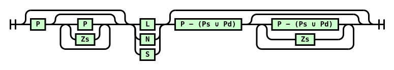

Attribution and reformatting notice added for Surgeist on 2026-10-03

This reformatted document accompanies Surgeist as software implementation support. The original English document at the source URL remains authoritative; this copy is not a new technical specification. Added labels and representation notes are non-normative. W3C is not responsible for content absent from the original, and this copy may contain formatting or hypertext errors.

This software or document includes material copied from or derived from [CSS Pseudo-Elements Module Level 4](https://www.w3.org/TR/2025/WD-css-pseudo-4-20250627/).

Original copyright notice: Copyright © 2025 World Wide Web Consortium. W3C® liability, trademark and permissive document license rules apply.

License: [W3C Software and Document License, 2023 version](../licenses/w3c/software-license-2023.txt). Changes are format conversion, visible semantic labels, local exact-snapshot links, and passive SVG/TeX representations as detailed in the [conversion report](CONVERSION-REPORT.md). Original source text, status, authorship, and legal notices remain below.

# Source provenance

Title: CSS Pseudo-Elements Module Level 4

Source snapshot: https://www.w3.org/TR/2025/WD-css-pseudo-4-20250627/

Snapshot SHA-256: f983c087cb9e408fe0696976eeba6d5bc36120b62019e77114ee6b274b74db2e

Conversion: offline format conversion of the exact stored HTML; not a new specification or summary. Publication versions remain distinct. Source fragment identifiers are preserved as short HTML anchors. Original copyright and licensing text/links are retained where present in the source.

Representation notes:
- 1 inline SVG diagrams are retained as local passive SVG assets, with original geometry and visible source diagram text. Supporting assets are not reference documents.
- Small semantic emphasis/subscript/superscript HTML is retained to avoid GFM intraword-delimiter and subscript rendering defects; website layout HTML is not retained.
- Canonically unstable or combining Unicode characters and escape-sensitive punctuation are shielded as numeric entities in prose/semantic inline HTML. Literal source code stays literal.
- Existing external image/media URLs are resolved against the pinned source. Assets are not downloaded or availability-tested; image-only formulas/diagrams still require their source resources.

---

# <a id="title"></a>CSS Pseudo-Elements Module Level 4

[Copyright](https://www.w3.org/policies/#copyright) © 2025 [World Wide Web Consortium](https://www.w3.org/). W3C<sup>®</sup> [liability](https://www.w3.org/policies/#Legal_Disclaimer), [trademark](https://www.w3.org/policies/#W3C_Trademarks) and [permissive document license](https://www.w3.org/copyright/software-license/) rules apply.

## <a id="abstract"></a>Abstract

This CSS module defines pseudo-elements, abstract elements that represent portions of the CSS render tree that can be selected and styled.

[CSS](https://www.w3.org/TR/CSS/) is a language for describing the rendering of structured documents (such as HTML and XML) on screen, on paper, etc.

## <a id="sotd"></a>Status of this document

<em>This section describes the status of this document at the time of its publication.
	A list of current W3C publications
	and the latest revision of this technical report
	can be found in the <a href="https://www.w3.org/TR/">W3C standards and drafts index at https&#58;//www&#46;w3&#46;org/TR/.</a></em>

This document was published by the [CSS Working Group](https://www.w3.org/groups/wg/css) as a <strong>Working Draft</strong> using the [Recommendation track](https://www.w3.org/policies/process/20231103/#recs-and-notes). Publication as a Working Draft does not imply endorsement by W3C and its Members.

This is a draft document and may be updated, replaced or obsoleted by other documents at any time. It is inappropriate to cite this document as other than work in progress.

Please send feedback by [filing issues in GitHub](https://github.com/w3c/csswg-drafts/issues) (preferred), including the spec code “css-pseudo” in the title, like this: “\[css-pseudo\] <i>…summary of comment…</i>”. All issues and comments are [archived](https://lists.w3.org/Archives/Public/public-css-archive/). Alternately, feedback can be sent to the ([archived](https://lists.w3.org/Archives/Public/www-style/)) public mailing list [www-style@w3.org](mailto:www-style@w3.org?Subject=%5Bcss-pseudo%5D%20PUT%20SUBJECT%20HERE).

<a id="w3c_process_revision"></a>

This document is governed by the [03 November 2023 W3C Process Document](https://www.w3.org/policies/process/20231103/).

This document was produced by a group operating under the [W3C Patent Policy](https://www.w3.org/policies/patent-policy/20200915/). W3C maintains a [public list of any patent disclosures](https://www.w3.org/groups/wg/css/ipr) made in connection with the deliverables of the group; that page also includes instructions for disclosing a patent. An individual who has actual knowledge of a patent which the individual believes contains [Essential Claim(s)](https://www.w3.org/policies/patent-policy/20200915/#def-essential) must disclose the information in accordance with [section 6 of the W3C Patent Policy](https://www.w3.org/policies/patent-policy/20200915/#sec-Disclosure).

The following features are at-risk, and may be dropped during the CR period:

- <a id="ref-for-selectordef-first-letter"></a>

  <a id="ref-for-selectordef-first-letter-postfix"></a>

  <a id="ref-for-selectordef-first-letter-prefix"></a>

  the [::prefix](#selectordef-first-letter-prefix) and [::postfix](https://www.w3.org/TR/css-pseudo-4/#selectordef-first-letter-postfix) sub-elements of [::first-letter](#selectordef-first-letter)

“At-risk” is a W3C Process term-of-art, and does not necessarily imply that the feature is in danger of being dropped or delayed. It means that the WG believes the feature may have difficulty being interoperably implemented in a timely manner, and marking it as such allows the WG to drop the feature if necessary when transitioning to the Proposed Rec stage, without having to publish a new Candidate Rec without the feature first.

## <a id="intro"></a>1. Introduction

<em>This section is informative.</em>

<a id="ref-for-x22"></a>

<a id="ref-for-selectordef-first-line"></a>

[Pseudo-elements](https://www.w3.org/TR/CSS2/selector.html#x22) represent abstract elements of the document beyond those elements explicitly created by the document language. Since they are not restricted to fitting into the document tree, they can be used to select and style portions of the document that do not necessarily map to the document’s tree structure. For instance, the [::first-line](#selectordef-first-line) pseudo-element can select content on the first formatted line of an element <em>after</em> text wrapping, allowing just that line to be styled differently from the rest of the paragraph.

<a id="ref-for-originating-element"></a>

<a id="ref-for-x15"></a>

Each pseudo-element is associated with an [originating element](https://www.w3.org/TR/selectors-4/#originating-element) and has syntax of the form ::name-of-pseudo. This module defines the pseudo-elements that exist in CSS and how they can be styled. For more information on pseudo-elements in general, and on their syntax and interaction with other [selectors](https://www.w3.org/TR/CSS2/syndata.html#x15), see [\[SELECTORS-4\]](#biblio-selectors-4).

> <strong data-conversion-semantic="note">Note</strong>
>
> Note: As a reminder, pseudo-elements cannot be chained together unless explicitly allowed. For example, ::marker::before is not allowed; but ::before::marker is.

## <a id="typographic-pseudos"></a>2.  Typographic Pseudo-elements

<a id="ref-for-selectordef-first-line①"></a>

### <a id="first-line-pseudo"></a>2.1.  First-Line Text: the [::first-line](#selectordef-first-line) pseudo-element

<a id="ref-for-pseudo-element"></a>

<a id="ref-for-first-formatted-line"></a>

<a id="ref-for-originating-element①"></a>

The <a id="selectordef-first-line"></a>::first-line [pseudo-element](https://www.w3.org/TR/selectors-4/#pseudo-element) represents the contents of the [first formatted line](#first-formatted-line) of its [originating element](https://www.w3.org/TR/selectors-4/#originating-element).

Tests

- [first-line-allowed-properties.html](https://wpt.fyi/results/css/css-pseudo/first-line-allowed-properties.html) [(live test)](http://wpt.live/css/css-pseudo/first-line-allowed-properties.html) [(source)](https://github.com/web-platform-tests/wpt/blob/master/css/css-pseudo/first-line-allowed-properties.html)
- [first-line-and-marker.html](https://wpt.fyi/results/css/css-pseudo/first-line-and-marker.html) [(live test)](http://wpt.live/css/css-pseudo/first-line-and-marker.html) [(source)](https://github.com/web-platform-tests/wpt/blob/master/css/css-pseudo/first-line-and-marker.html)
- [first-line-and-placeholder.html](https://wpt.fyi/results/css/css-pseudo/first-line-and-placeholder.html) [(live test)](http://wpt.live/css/css-pseudo/first-line-and-placeholder.html) [(source)](https://github.com/web-platform-tests/wpt/blob/master/css/css-pseudo/first-line-and-placeholder.html)
- [first-line-change-inline-color-nested.html](https://wpt.fyi/results/css/css-pseudo/first-line-change-inline-color-nested.html) [(live test)](http://wpt.live/css/css-pseudo/first-line-change-inline-color-nested.html) [(source)](https://github.com/web-platform-tests/wpt/blob/master/css/css-pseudo/first-line-change-inline-color-nested.html)
- [first-line-change-inline-color.html](https://wpt.fyi/results/css/css-pseudo/first-line-change-inline-color.html) [(live test)](http://wpt.live/css/css-pseudo/first-line-change-inline-color.html) [(source)](https://github.com/web-platform-tests/wpt/blob/master/css/css-pseudo/first-line-change-inline-color.html)
- [first-line-first-letter-insert-crash.html](https://wpt.fyi/results/css/css-pseudo/first-line-first-letter-insert-crash.html) [(live test)](http://wpt.live/css/css-pseudo/first-line-first-letter-insert-crash.html) [(source)](https://github.com/web-platform-tests/wpt/blob/master/css/css-pseudo/first-line-first-letter-insert-crash.html)
- [first-line-float-mapped-attribute-crash.html](https://wpt.fyi/results/css/css-pseudo/first-line-float-mapped-attribute-crash.html) [(live test)](http://wpt.live/css/css-pseudo/first-line-float-mapped-attribute-crash.html) [(source)](https://github.com/web-platform-tests/wpt/blob/master/css/css-pseudo/first-line-float-mapped-attribute-crash.html)
- [first-line-inherited-no-transition.html](https://wpt.fyi/results/css/css-pseudo/first-line-inherited-no-transition.html) [(live test)](http://wpt.live/css/css-pseudo/first-line-inherited-no-transition.html) [(source)](https://github.com/web-platform-tests/wpt/blob/master/css/css-pseudo/first-line-inherited-no-transition.html)
- [first-line-inherited-transition-crash.html](https://wpt.fyi/results/css/css-pseudo/first-line-inherited-transition-crash.html) [(live test)](http://wpt.live/css/css-pseudo/first-line-inherited-transition-crash.html) [(source)](https://github.com/web-platform-tests/wpt/blob/master/css/css-pseudo/first-line-inherited-transition-crash.html)
- [first-line-inherited-with-transition.html](https://wpt.fyi/results/css/css-pseudo/first-line-inherited-with-transition.html) [(live test)](http://wpt.live/css/css-pseudo/first-line-inherited-with-transition.html) [(source)](https://github.com/web-platform-tests/wpt/blob/master/css/css-pseudo/first-line-inherited-with-transition.html)
- [first-line-input-image-crash.html](https://wpt.fyi/results/css/css-pseudo/first-line-input-image-crash.html) [(live test)](http://wpt.live/css/css-pseudo/first-line-input-image-crash.html) [(source)](https://github.com/web-platform-tests/wpt/blob/master/css/css-pseudo/first-line-input-image-crash.html)
- [first-line-line-height-001.html](https://wpt.fyi/results/css/css-pseudo/first-line-line-height-001.html) [(live test)](http://wpt.live/css/css-pseudo/first-line-line-height-001.html) [(source)](https://github.com/web-platform-tests/wpt/blob/master/css/css-pseudo/first-line-line-height-001.html)
- [first-line-line-height-002.html](https://wpt.fyi/results/css/css-pseudo/first-line-line-height-002.html) [(live test)](http://wpt.live/css/css-pseudo/first-line-line-height-002.html) [(source)](https://github.com/web-platform-tests/wpt/blob/master/css/css-pseudo/first-line-line-height-002.html)
- [first-line-nested-gcs.html](https://wpt.fyi/results/css/css-pseudo/first-line-nested-gcs.html) [(live test)](http://wpt.live/css/css-pseudo/first-line-nested-gcs.html) [(source)](https://github.com/web-platform-tests/wpt/blob/master/css/css-pseudo/first-line-nested-gcs.html)
- [first-line-on-ancestor-block.html](https://wpt.fyi/results/css/css-pseudo/first-line-on-ancestor-block.html) [(live test)](http://wpt.live/css/css-pseudo/first-line-on-ancestor-block.html) [(source)](https://github.com/web-platform-tests/wpt/blob/master/css/css-pseudo/first-line-on-ancestor-block.html)
- [first-line-opacity-001-ref.html](https://wpt.fyi/results/css/css-pseudo/first-line-opacity-001-ref.html) [(live test)](http://wpt.live/css/css-pseudo/first-line-opacity-001-ref.html) [(source)](https://github.com/web-platform-tests/wpt/blob/master/css/css-pseudo/first-line-opacity-001-ref.html)
- [first-line-opacity-001.html](https://wpt.fyi/results/css/css-pseudo/first-line-opacity-001.html) [(live test)](http://wpt.live/css/css-pseudo/first-line-opacity-001.html) [(source)](https://github.com/web-platform-tests/wpt/blob/master/css/css-pseudo/first-line-opacity-001.html)
- [first-line-replaced-001.html](https://wpt.fyi/results/css/css-pseudo/first-line-replaced-001.html) [(live test)](http://wpt.live/css/css-pseudo/first-line-replaced-001.html) [(source)](https://github.com/web-platform-tests/wpt/blob/master/css/css-pseudo/first-line-replaced-001.html)
- [first-line-with-before-after.html](https://wpt.fyi/results/css/css-pseudo/first-line-with-before-after.html) [(live test)](http://wpt.live/css/css-pseudo/first-line-with-before-after.html) [(source)](https://github.com/web-platform-tests/wpt/blob/master/css/css-pseudo/first-line-with-before-after.html)
- [first-line-with-inline-block-before.html](https://wpt.fyi/results/css/css-pseudo/first-line-with-inline-block-before.html) [(live test)](http://wpt.live/css/css-pseudo/first-line-with-inline-block-before.html) [(source)](https://github.com/web-platform-tests/wpt/blob/master/css/css-pseudo/first-line-with-inline-block-before.html)
- [first-line-with-inline-block.html](https://wpt.fyi/results/css/css-pseudo/first-line-with-inline-block.html) [(live test)](http://wpt.live/css/css-pseudo/first-line-with-inline-block.html) [(source)](https://github.com/web-platform-tests/wpt/blob/master/css/css-pseudo/first-line-with-inline-block.html)
- [first-line-with-out-of-flow-and-nested-div.html](https://wpt.fyi/results/css/css-pseudo/first-line-with-out-of-flow-and-nested-div.html) [(live test)](http://wpt.live/css/css-pseudo/first-line-with-out-of-flow-and-nested-div.html) [(source)](https://github.com/web-platform-tests/wpt/blob/master/css/css-pseudo/first-line-with-out-of-flow-and-nested-div.html)
- [first-line-with-out-of-flow-and-nested-span.html](https://wpt.fyi/results/css/css-pseudo/first-line-with-out-of-flow-and-nested-span.html) [(live test)](http://wpt.live/css/css-pseudo/first-line-with-out-of-flow-and-nested-span.html) [(source)](https://github.com/web-platform-tests/wpt/blob/master/css/css-pseudo/first-line-with-out-of-flow-and-nested-span.html)
- [first-line-with-out-of-flow.html](https://wpt.fyi/results/css/css-pseudo/first-line-with-out-of-flow.html) [(live test)](http://wpt.live/css/css-pseudo/first-line-with-out-of-flow.html) [(source)](https://github.com/web-platform-tests/wpt/blob/master/css/css-pseudo/first-line-with-out-of-flow.html)

> <strong data-conversion-semantic="example">Example</strong>
>
> <a id="example-fb83f35a"></a> The rule below means “change the letters of the first line of every `p` element to uppercase”:
>
> ```css
> p::first-line { text-transform: uppercase }
> ```
>
> The selector p::first-line does not match any real document element. It instead matches a pseudo-element that the user agent will automatically insert at the beginning of every `p` element.

> <strong data-conversion-semantic="note">Note</strong>
>
> Note: Note that the length of the first line depends on a number of factors, including the width of the page, the font size, etc.

> <strong data-conversion-semantic="example">Example</strong>
>
> <a id="first-line-example"></a> For example, given an ordinary HTML [\[HTML5\]](#biblio-html5) paragraph such as:
>
> ```markup
> <P>This is a somewhat long HTML paragraph
> that will be broken into several lines.
> The first line will be styled
> by the ‘::first-line’ pseudo-element.
> The other lines will be treated
> as ordinary lines in the paragraph.</P>
> ```
>
> Depending on the width of the element, its lines might be broken as follows:
>
> ```text
> THIS IS A SOMEWHAT LONG HTML PARAGRAPH THAT
> will be broken into several lines. The first
> line will be styled by the ‘::first-line’
> pseudo-element. The other lines will be 
> treated as ordinary lines in the paragraph.
> ```
>
> or alternately as follows:
>
> ```text
> THIS IS A SOMEWHAT LONG
> HTML paragraph that will
> be broken into several
> lines. The first line will
> be styled by the
> ‘::first-line’ pseudo-
> element. The other lines
> will be treated as ordinary
> lines in the paragraph.
> ```
#### <a id="first-text-line"></a>2.1.1.  Finding the First Formatted Line

<a id="ref-for-selectordef-first-line②"></a>

<a id="ref-for-block-container"></a>

In CSS, the [::first-line](#selectordef-first-line) pseudo-element can only have an effect when attached to a [block container](https://www.w3.org/TR/css-display-4/#block-container):

- <a id="ref-for-block-container①"></a>

  <a id="ref-for-inline-formatting-context"></a>

  <a id="ref-for-inline-level"></a>

  <a id="ref-for-line-box"></a>

  The <a id="first-formatted-line"></a>first formatted line of a [block container](https://www.w3.org/TR/css-display-4/#block-container) that establishes an [inline formatting context](https://www.w3.org/TR/css-display-4/#inline-formatting-context) represents the [inline-level](https://www.w3.org/TR/css-display-4/#inline-level) content of its first [line box](https://www.w3.org/TR/css-inline-3/#line-box).

- <a id="ref-for-first-formatted-line①"></a>

  <a id="ref-for-block-container②"></a>

  <a id="ref-for-multi-column-container"></a>

  <a id="ref-for-block-level"></a>

  <a id="ref-for-table-wrapper-box"></a>

  <a id="ref-for-in-flow"></a>

  The [first formatted line](#first-formatted-line) of a [block container](https://www.w3.org/TR/css-display-4/#block-container) or [multi-column container](https://www.w3.org/TR/css-multicol-2/#multi-column-container) that contains [block-level](https://www.w3.org/TR/css-display-4/#block-level) content (and is not a [table wrapper box](https://www.w3.org/TR/css-tables-3/#table-wrapper-box)) is the <a id="ref-for-first-formatted-line②"></a>first formatted line of its first [in-flow](https://www.w3.org/TR/css-display-4/#in-flow) <a id="ref-for-block-level①"></a>block-level child. If no such line exists, it has no <a id="ref-for-first-formatted-line③"></a>first formatted line.

<a id="ref-for-first-formatted-line④"></a>

> <strong data-conversion-semantic="note">Note</strong>
>
> Note: The [first formatted line](#first-formatted-line) can be an empty line. For example, the first line of the `p` in `<p><br>First…` doesn’t contain any letters. Thus the word “First” is not on the first formatted line, and will not be affected by p::first-line.

<a id="ref-for-block-container③"></a>

<a id="ref-for-block-formatting-context"></a>

> <strong data-conversion-semantic="note">Note</strong>
>
> Note: The first line of a [block container](https://www.w3.org/TR/css-display-4/#block-container) that does not itself participate in a [block formatting context](https://www.w3.org/TR/css-display-4/#block-formatting-context) cannot be the first formatted line of an ancestor element. Thus, in `<DIV><P STYLE="display: inline-block">Hello<BR>Goodbye</P> etcetera</DIV>` the first formatted line of the `DIV` is not the line “Hello”, but rather the line that contains that entire inline block.

<a id="ref-for-first-formatted-line⑤"></a>

<a id="ref-for-selectordef-first-line③"></a>

<a id="ref-for-originating-element②"></a>

<a id="ref-for-inline-level①"></a>

<a id="ref-for-root-inline-box"></a>

<a id="ref-for-pseudo-element①"></a>

When a [first formatted line](#first-formatted-line) is represented by multiple [::first-line](#selectordef-first-line) pseudo-elements, they are nested in the same order as their [originating elements](https://www.w3.org/TR/selectors-4/#originating-element). The [inline-level](https://www.w3.org/TR/css-display-4/#inline-level) contents of this line—​including its [root inline box](https://www.w3.org/TR/css-inline-3/#root-inline-box) fragment—​are nested within the innermost <a id="ref-for-selectordef-first-line④"></a>::first-line [pseudo-element](https://www.w3.org/TR/selectors-4/#pseudo-element).

> <strong data-conversion-semantic="example">Example</strong>
>
> <a id="example-7499991d"></a> Consider the following markup:
>
> ```markup
> <DIV>
>   <P>First paragraph</P>
>   <P>Second paragraph</P>
> </DIV>
> ```
>
> <a id="ref-for-fictional-tag-sequence"></a>
>
> <a id="ref-for-selectordef-first-line⑤"></a>
>
> If we assume a [fictional tag sequence](#fictional-tag-sequence) to represent the elements’ [::first-line](#selectordef-first-line) pseudo elements, it would be something like:
>
> ```markup
> <DIV>
>   <P><DIV::first-line><P::first-line>First paragraph</P::first-line></DIV::first-line></P>
>   <P><P::first-line>Second paragraph</P::first-line></P>
> </DIV>
> ```
<a id="ref-for-selectordef-first-line⑥"></a>

#### <a id="first-line-styling"></a>2.1.2.  Styling the [::first-line](#selectordef-first-line) Pseudo-element

<a id="ref-for-selectordef-first-line⑦"></a>

<a id="ref-for-inline-level-box"></a>

The [::first-line](#selectordef-first-line) pseudo-element’s generated box behaves similar to that of an [inline-level box](https://www.w3.org/TR/css-display-4/#inline-level-box), but with certain restrictions. The following CSS properties apply to a <a id="ref-for-selectordef-first-line⑧"></a>::first-line pseudo-element:

- all font properties (see [\[CSS-FONTS-4\]](#biblio-css-fonts-4))

- <a id="ref-for-propdef-opacity"></a>

  <a id="ref-for-propdef-color"></a>

  the [color](https://www.w3.org/TR/css-color-4/#propdef-color) and [opacity](https://www.w3.org/TR/css-color-4/#propdef-opacity) properties (see [\[CSS-COLOR-4\]](#biblio-css-color-4))

- all background properties (see [\[CSS-BACKGROUNDS-3\]](#biblio-css-backgrounds-3))

- any typesetting properties that apply to inline elements (see [\[CSS-TEXT-4\]](#biblio-css-text-4))

- all text decoration properties (see [\[CSS-TEXT-DECOR-4\]](#biblio-css-text-decor-4))

- <a id="ref-for-propdef-ruby-position"></a>

  the [ruby-position](https://www.w3.org/TR/css-ruby-1/#propdef-ruby-position) property (see [\[CSS-RUBY-1\]](#biblio-css-ruby-1))

- any inline layout properties that apply to inline elements (see [\[CSS-INLINE-3\]](#biblio-css-inline-3))

- <a id="ref-for-selectordef-first-line⑨"></a>

  any other properties defined to apply to [::first-line](#selectordef-first-line) by their respective specifications

User agents may apply other properties as well except for the following excluded properties:

- <a id="ref-for-propdef-writing-mode"></a>

  [writing-mode](https://www.w3.org/TR/css-writing-modes-4/#propdef-writing-mode)

- <a id="ref-for-propdef-direction"></a>

  [direction](https://www.w3.org/TR/css-writing-modes-3/#propdef-direction)

- <a id="ref-for-propdef-text-orientation"></a>

  [text-orientation](https://www.w3.org/TR/css-writing-modes-4/#propdef-text-orientation)

<a id="ref-for-propdef-line-height"></a>

<a id="ref-for-selectordef-first-line①⓪"></a>

<a id="ref-for-root-inline-box①"></a>

> <strong data-conversion-semantic="note">Note</strong>
>
> Note: Setting [line-height](https://www.w3.org/TR/CSS2/visudet.html#propdef-line-height) on [::first-line](#selectordef-first-line) inherits to the fragment of the [root inline box](https://www.w3.org/TR/css-inline-3/#root-inline-box) that wraps the contents of the first line, and therefore can both increase and decrease the height of the first line box.

<a id="ref-for-selectordef-first-line①①"></a>

#### <a id="first-line-inheritance"></a>2.1.3.  Inheritance and the [::first-line](#selectordef-first-line) Pseudo-element

<a id="ref-for-inheritance"></a>

<a id="ref-for-box-fragment"></a>

<a id="ref-for-inherited-property"></a>

<a id="ref-for-selectordef-first-line①②"></a>

<a id="ref-for-custom-property"></a>

During CSS [inheritance](https://www.w3.org/TR/css-cascade-5/#inheritance), the [fragment](https://www.w3.org/TR/css-break-4/#box-fragment) of a child that occurs on the first line inherits any standard [inherited properties](https://www.w3.org/TR/css-cascade-5/#inherited-property)—​except the properties excluded above—​from the [::first-line](#selectordef-first-line) pseudo-element. For all other properties, including all [custom properties](https://www.w3.org/TR/css-variables-1/#custom-property) [\[CSS-VARIABLES-1\]](#biblio-css-variables-1), inheritance is from the non-pseudo parent. (The portion of a child element that does not occur on the first line always inherits from the non-pseudo parent.)

<a id="ref-for-inheritance①"></a>

<a id="ref-for-selectordef-first-line①③"></a>

> <strong data-conversion-semantic="example">Example</strong>
>
> <a id="example-62ec3857"></a> In the common case (of standard inherited CSS properties), [inheritance](https://www.w3.org/TR/css-cascade-5/#inheritance) into and from a [::first-line](#selectordef-first-line) pseudo-element can be understood by writing out a <a id="fictional-tag-sequence"></a>fictional tag sequence to represent <a id="ref-for-selectordef-first-line①④"></a>::first-line. Consider the [earlier example](#first-line-example); in case of the first rendering, the fictional tag sequence would be:
>
> ```markup
> <P><p::first-line>This is a somewhat long HTML paragraph
> that</p::first-line> will be broken into several lines.
> The first line will be styled
> by the ‘::first-line’ pseudo-element.
> The other lines will be treated
> as ordinary lines in the paragraph.</p>
> ```
>
> And in the case of the second rendering:
>
> ```markup
> <p><p::first-line>This is a somewhat long</p::first-line> HTML paragraph
> that will be broken into several lines.
> The first line will be styled
> by the ‘::first-line’ pseudo-element.
> The other lines will be treated
> as ordinary lines in the paragraph.</p>
> ```
<a id="ref-for-fictional-tag-sequence①"></a>

> <strong data-conversion-semantic="example">Example</strong>
>
> <a id="example-fce77ea8"></a> If a pseudo-element breaks up a real element, the effect can often be described by a [fictional tag sequence](#fictional-tag-sequence) that closes and then re-opens the element. Suppose we mark up the earlier example with a `span` element encompassing the first sentence:
>
> ```markup
> <p><span>This is a somewhat long HTML paragraph
> that will be broken into several lines.</span>
> The first line will be styled
> by the ‘::first-line’ pseudo-element.
> The other lines will be treated
> as ordinary lines in the paragraph.</p>
> ```
>
> <a id="ref-for-fictional-tag-sequence②"></a>
>
> The effect of the first rendering would be similar to the following [fictional tag sequence](#fictional-tag-sequence):
>
> ```markup
> <p><p::first-line><span>This is a somewhat long HTML paragraph
> that</span></p::first-line><span> will be broken into several lines.</span>
> The first line will be styled
> by the ‘::first-line’ pseudo-element.
> The other lines will be treated
> as ordinary lines in the paragraph.</p>
> ```
<a id="ref-for-selectordef-first-letter①"></a>

<a id="ref-for-selectordef-first-letter-prefix①"></a>

<a id="ref-for-selectordef-first-letter-suffix"></a>

### <a id="first-letter-pseudo"></a>2.2.  First-Letter Text: [::first-letter](#selectordef-first-letter) pseudo-element and its [::prefix](#selectordef-first-letter-prefix) and [::suffix](#selectordef-first-letter-suffix) children

Tests

- [first-letter-001.html](https://wpt.fyi/results/css/css-pseudo/first-letter-001.html) [(live test)](http://wpt.live/css/css-pseudo/first-letter-001.html) [(source)](https://github.com/web-platform-tests/wpt/blob/master/css/css-pseudo/first-letter-001.html)
- [first-letter-002.html](https://wpt.fyi/results/css/css-pseudo/first-letter-002.html) [(live test)](http://wpt.live/css/css-pseudo/first-letter-002.html) [(source)](https://github.com/web-platform-tests/wpt/blob/master/css/css-pseudo/first-letter-002.html)
- [first-letter-003.html](https://wpt.fyi/results/css/css-pseudo/first-letter-003.html) [(live test)](http://wpt.live/css/css-pseudo/first-letter-003.html) [(source)](https://github.com/web-platform-tests/wpt/blob/master/css/css-pseudo/first-letter-003.html)
- [first-letter-004.html](https://wpt.fyi/results/css/css-pseudo/first-letter-004.html) [(live test)](http://wpt.live/css/css-pseudo/first-letter-004.html) [(source)](https://github.com/web-platform-tests/wpt/blob/master/css/css-pseudo/first-letter-004.html)
- [first-letter-005.html](https://wpt.fyi/results/css/css-pseudo/first-letter-005.html) [(live test)](http://wpt.live/css/css-pseudo/first-letter-005.html) [(source)](https://github.com/web-platform-tests/wpt/blob/master/css/css-pseudo/first-letter-005.html)
- [first-letter-allowed-properties.html](https://wpt.fyi/results/css/css-pseudo/first-letter-allowed-properties.html) [(live test)](http://wpt.live/css/css-pseudo/first-letter-allowed-properties.html) [(source)](https://github.com/web-platform-tests/wpt/blob/master/css/css-pseudo/first-letter-allowed-properties.html)
- [first-letter-and-sibling-display-change.html](https://wpt.fyi/results/css/css-pseudo/first-letter-and-sibling-display-change.html) [(live test)](http://wpt.live/css/css-pseudo/first-letter-and-sibling-display-change.html) [(source)](https://github.com/web-platform-tests/wpt/blob/master/css/css-pseudo/first-letter-and-sibling-display-change.html)
- [first-letter-and-whitespace.html](https://wpt.fyi/results/css/css-pseudo/first-letter-and-whitespace.html) [(live test)](http://wpt.live/css/css-pseudo/first-letter-and-whitespace.html) [(source)](https://github.com/web-platform-tests/wpt/blob/master/css/css-pseudo/first-letter-and-whitespace.html)
- [first-letter-background-image-dynamic.html](https://wpt.fyi/results/css/css-pseudo/first-letter-background-image-dynamic.html) [(live test)](http://wpt.live/css/css-pseudo/first-letter-background-image-dynamic.html) [(source)](https://github.com/web-platform-tests/wpt/blob/master/css/css-pseudo/first-letter-background-image-dynamic.html)
- [first-letter-background-image.html](https://wpt.fyi/results/css/css-pseudo/first-letter-background-image.html) [(live test)](http://wpt.live/css/css-pseudo/first-letter-background-image.html) [(source)](https://github.com/web-platform-tests/wpt/blob/master/css/css-pseudo/first-letter-background-image.html)
- [first-letter-bidi-pre-crash.html](https://wpt.fyi/results/css/css-pseudo/first-letter-bidi-pre-crash.html) [(live test)](http://wpt.live/css/css-pseudo/first-letter-bidi-pre-crash.html) [(source)](https://github.com/web-platform-tests/wpt/blob/master/css/css-pseudo/first-letter-bidi-pre-crash.html)
- [first-letter-block-to-inline.html](https://wpt.fyi/results/css/css-pseudo/first-letter-block-to-inline.html) [(live test)](http://wpt.live/css/css-pseudo/first-letter-block-to-inline.html) [(source)](https://github.com/web-platform-tests/wpt/blob/master/css/css-pseudo/first-letter-block-to-inline.html)
- [first-letter-crash.html](https://wpt.fyi/results/css/css-pseudo/first-letter-crash.html) [(live test)](http://wpt.live/css/css-pseudo/first-letter-crash.html) [(source)](https://github.com/web-platform-tests/wpt/blob/master/css/css-pseudo/first-letter-crash.html)
- [first-letter-digraph.html](https://wpt.fyi/results/css/css-pseudo/first-letter-digraph.html) [(live test)](http://wpt.live/css/css-pseudo/first-letter-digraph.html) [(source)](https://github.com/web-platform-tests/wpt/blob/master/css/css-pseudo/first-letter-digraph.html)
- [first-letter-exclude-block-child-marker.html](https://wpt.fyi/results/css/css-pseudo/first-letter-exclude-block-child-marker.html) [(live test)](http://wpt.live/css/css-pseudo/first-letter-exclude-block-child-marker.html) [(source)](https://github.com/web-platform-tests/wpt/blob/master/css/css-pseudo/first-letter-exclude-block-child-marker.html)
- [first-letter-exclude-inline-child-marker.html](https://wpt.fyi/results/css/css-pseudo/first-letter-exclude-inline-child-marker.html) [(live test)](http://wpt.live/css/css-pseudo/first-letter-exclude-inline-child-marker.html) [(source)](https://github.com/web-platform-tests/wpt/blob/master/css/css-pseudo/first-letter-exclude-inline-child-marker.html)
- [first-letter-exclude-inline-marker.html](https://wpt.fyi/results/css/css-pseudo/first-letter-exclude-inline-marker.html) [(live test)](http://wpt.live/css/css-pseudo/first-letter-exclude-inline-marker.html) [(source)](https://github.com/web-platform-tests/wpt/blob/master/css/css-pseudo/first-letter-exclude-inline-marker.html)
- [first-letter-hi-001.html](https://wpt.fyi/results/css/css-pseudo/first-letter-hi-001.html) [(live test)](http://wpt.live/css/css-pseudo/first-letter-hi-001.html) [(source)](https://github.com/web-platform-tests/wpt/blob/master/css/css-pseudo/first-letter-hi-001.html)
- [first-letter-hi-002.html](https://wpt.fyi/results/css/css-pseudo/first-letter-hi-002.html) [(live test)](http://wpt.live/css/css-pseudo/first-letter-hi-002.html) [(source)](https://github.com/web-platform-tests/wpt/blob/master/css/css-pseudo/first-letter-hi-002.html)
- [first-letter-list-item-dynamic-001.html](https://wpt.fyi/results/css/css-pseudo/first-letter-list-item-dynamic-001.html) [(live test)](http://wpt.live/css/css-pseudo/first-letter-list-item-dynamic-001.html) [(source)](https://github.com/web-platform-tests/wpt/blob/master/css/css-pseudo/first-letter-list-item-dynamic-001.html)
- [first-letter-of-html-root-refcrash.html](https://wpt.fyi/results/css/css-pseudo/first-letter-of-html-root-refcrash.html) [(live test)](http://wpt.live/css/css-pseudo/first-letter-of-html-root-refcrash.html) [(source)](https://github.com/web-platform-tests/wpt/blob/master/css/css-pseudo/first-letter-of-html-root-refcrash.html)
- [first-letter-opacity-001-ref.html](https://wpt.fyi/results/css/css-pseudo/first-letter-opacity-001-ref.html) [(live test)](http://wpt.live/css/css-pseudo/first-letter-opacity-001-ref.html) [(source)](https://github.com/web-platform-tests/wpt/blob/master/css/css-pseudo/first-letter-opacity-001-ref.html)
- [first-letter-opacity-001.html](https://wpt.fyi/results/css/css-pseudo/first-letter-opacity-001.html) [(live test)](http://wpt.live/css/css-pseudo/first-letter-opacity-001.html) [(source)](https://github.com/web-platform-tests/wpt/blob/master/css/css-pseudo/first-letter-opacity-001.html)
- [first-letter-opacity-float-001.html](https://wpt.fyi/results/css/css-pseudo/first-letter-opacity-float-001.html) [(live test)](http://wpt.live/css/css-pseudo/first-letter-opacity-float-001.html) [(source)](https://github.com/web-platform-tests/wpt/blob/master/css/css-pseudo/first-letter-opacity-float-001.html)
- [first-letter-punctuation-and-space.html](https://wpt.fyi/results/css/css-pseudo/first-letter-punctuation-and-space.html) [(live test)](http://wpt.live/css/css-pseudo/first-letter-punctuation-and-space.html) [(source)](https://github.com/web-platform-tests/wpt/blob/master/css/css-pseudo/first-letter-punctuation-and-space.html)
- [first-letter-punctuation-dynamic.html](https://wpt.fyi/results/css/css-pseudo/first-letter-punctuation-dynamic.html) [(live test)](http://wpt.live/css/css-pseudo/first-letter-punctuation-dynamic.html) [(source)](https://github.com/web-platform-tests/wpt/blob/master/css/css-pseudo/first-letter-punctuation-dynamic.html)
- [first-letter-skip-empty-span-nested.html](https://wpt.fyi/results/css/css-pseudo/first-letter-skip-empty-span-nested.html) [(live test)](http://wpt.live/css/css-pseudo/first-letter-skip-empty-span-nested.html) [(source)](https://github.com/web-platform-tests/wpt/blob/master/css/css-pseudo/first-letter-skip-empty-span-nested.html)
- [first-letter-skip-empty-span.html](https://wpt.fyi/results/css/css-pseudo/first-letter-skip-empty-span.html) [(live test)](http://wpt.live/css/css-pseudo/first-letter-skip-empty-span.html) [(source)](https://github.com/web-platform-tests/wpt/blob/master/css/css-pseudo/first-letter-skip-empty-span.html)
- [first-letter-skip-marker.html](https://wpt.fyi/results/css/css-pseudo/first-letter-skip-marker.html) [(live test)](http://wpt.live/css/css-pseudo/first-letter-skip-marker.html) [(source)](https://github.com/web-platform-tests/wpt/blob/master/css/css-pseudo/first-letter-skip-marker.html)
- [first-letter-text-and-display-change.html](https://wpt.fyi/results/css/css-pseudo/first-letter-text-and-display-change.html) [(live test)](http://wpt.live/css/css-pseudo/first-letter-text-and-display-change.html) [(source)](https://github.com/web-platform-tests/wpt/blob/master/css/css-pseudo/first-letter-text-and-display-change.html)
- [first-letter-width-2.html](https://wpt.fyi/results/css/css-pseudo/first-letter-width-2.html) [(live test)](http://wpt.live/css/css-pseudo/first-letter-width-2.html) [(source)](https://github.com/web-platform-tests/wpt/blob/master/css/css-pseudo/first-letter-width-2.html)
- [first-letter-width.html](https://wpt.fyi/results/css/css-pseudo/first-letter-width.html) [(live test)](http://wpt.live/css/css-pseudo/first-letter-width.html) [(source)](https://github.com/web-platform-tests/wpt/blob/master/css/css-pseudo/first-letter-width.html)
- [first-letter-with-before-after.html](https://wpt.fyi/results/css/css-pseudo/first-letter-with-before-after.html) [(live test)](http://wpt.live/css/css-pseudo/first-letter-with-before-after.html) [(source)](https://github.com/web-platform-tests/wpt/blob/master/css/css-pseudo/first-letter-with-before-after.html)
- [first-letter-with-preceding-new-line.html](https://wpt.fyi/results/css/css-pseudo/first-letter-with-preceding-new-line.html) [(live test)](http://wpt.live/css/css-pseudo/first-letter-with-preceding-new-line.html) [(source)](https://github.com/web-platform-tests/wpt/blob/master/css/css-pseudo/first-letter-with-preceding-new-line.html)
- [first-letter-with-quote.html](https://wpt.fyi/results/css/css-pseudo/first-letter-with-quote.html) [(live test)](http://wpt.live/css/css-pseudo/first-letter-with-quote.html) [(source)](https://github.com/web-platform-tests/wpt/blob/master/css/css-pseudo/first-letter-with-quote.html)
- [first-letter-with-span.html](https://wpt.fyi/results/css/css-pseudo/first-letter-with-span.html) [(live test)](http://wpt.live/css/css-pseudo/first-letter-with-span.html) [(source)](https://github.com/web-platform-tests/wpt/blob/master/css/css-pseudo/first-letter-with-span.html)


<a id="ref-for-pseudo-element②"></a>

<a id="ref-for-typographic-character-unit"></a>

<a id="ref-for-first-formatted-line⑥"></a>

<a id="ref-for-originating-element③"></a>

<a id="ref-for-selectordef-first-letter②"></a>

The <a id="selectordef-first-letter"></a>::first-letter [pseudo-element](https://www.w3.org/TR/selectors-4/#pseudo-element) represents the first Letter, Number, or Symbol (Unicode category `L*`, `N*`, or `S*`) [typographic character unit](https://www.w3.org/TR/css-text-4/#typographic-character-unit) on the [first formatted line](#first-formatted-line) of its [originating element](https://www.w3.org/TR/selectors-4/#originating-element) (the <a id="first-letter"></a>first letter) as well as its associated punctuation. Collectively, this text is the <a id="first-letter-text"></a>first-letter text. The [::first-letter](#selectordef-first-letter) pseudo-element can be used to create “initial caps” and “drop caps”, which are common typographic effects.

<a id="ref-for-propdef-initial-letter"></a>

> <strong data-conversion-semantic="example">Example</strong>
>
> <a id="example-2abd34c5"></a> For example, the following rule creates a 2-line drop-letter on every paragraph following a level-2 header, using the [initial-letter](https://www.w3.org/TR/css-inline-3/#propdef-initial-letter) property defined in [\[CSS-INLINE-3\]](#biblio-css-inline-3):
>
> ```css
> h2 + p::first-letter { initial-letter: 3; }
> ```
<a id="ref-for-first-letter"></a>

> <strong data-conversion-semantic="note">Note</strong>
>
> Note: The [first letter](#first-letter) may in fact be a digit, e.g., the “6” in “67 million dollars is a lot of money.”

<a id="ref-for-first-letter①"></a>

<a id="ref-for-sub-pseudo-element"></a>

<a id="ref-for-selectordef-first-letter③"></a>

<a id="ref-for-pseudo-element③"></a>

To allow independent styling of the [first letter](#first-letter) itself and its adjacent punctuation, associated preceding punctuation is represented by the <a id="selectordef-first-letter-prefix"></a>::prefix [sub-pseudo-element](https://www.w3.org/TR/selectors-4/#sub-pseudo-element) of the [::first-letter](#selectordef-first-letter) [pseudo-element](https://www.w3.org/TR/selectors-4/#pseudo-element) (::first-letter::prefix); and associated following punctuation is represented by the <a id="selectordef-first-letter-suffix"></a>::suffix <a id="ref-for-sub-pseudo-element①"></a>sub-pseudo-element of the <a id="ref-for-selectordef-first-letter④"></a>::first-letter <a id="ref-for-pseudo-element④"></a>pseudo-element (::first-letter::suffix). See [§ 2.2.1 First Letters and Associated Punctuation](#first-letter-pattern), below.

#### <a id="first-letter-pattern"></a>2.2.1.  First Letters and Associated Punctuation

<a id="ref-for-typographic-character-unit①"></a>

<a id="ref-for-selectordef-first-letter⑤"></a>

<a id="ref-for-first-letter②"></a>

<a id="ref-for-containing-block"></a>

<a id="ref-for-content-language"></a>

As explained in [CSS Text 3 § 1.4 Characters and Letters](https://www.w3.org/TR/css-text-3/#characters), a [typographic character unit](https://www.w3.org/TR/css-text-4/#typographic-character-unit) can include more than one Unicode codepoint. For example, combining characters must be kept with their base character. Also, languages may have additional rules about how to treat certain letter combinations. In Dutch, for example, if the letter combination "ij" appears at the beginning of an element, both letters should be considered within the [::first-letter](#selectordef-first-letter) pseudo-element. [\[UAX29\]](#biblio-uax29) When selecting the [first letter](#first-letter), the UA should tailor its definition of <a id="ref-for-typographic-character-unit②"></a>typographic character unit to reflect the first-letter traditions of the <a id="ref-for-selectordef-first-letter⑥"></a>::first-letter pseudo-element’s <em><a href="https://www.w3.org/TR/css-display-4/#containing-block">containing block</a></em>’s [content language](https://www.w3.org/TR/css-text-4/#content-language).

<a id="ref-for-first-letter-text"></a>

<a id="ref-for-selectordef-first-letter⑦"></a>

Preceding and following punctuation must also be included as part of the [first-letter text](#first-letter-text) in the [::first-letter](#selectordef-first-letter) pseudo-element as follows:

- <a id="ref-for-first-letter③"></a>

  All punctuation—​i.e, characters that belong to the Punctuation (`P*`) Unicode general category [\[UAX44\]](#biblio-uax44)—​that precedes the [first letter](#first-letter), as well as any intervening typographic space—​characters belonging to the `Zs` Unicode general category \[UAX44\] <em>other than</em> U+3000 IDEOGRAPHIC SPACE.

- <a id="ref-for-word-separator"></a>

  <a id="ref-for-first-letter④"></a>

  Any punctuation other than opening punctuation and dashes—​i.e. characters that belong to the Punctuation (`P*`) Unicode general category, excluding Open Punctuation (`Ps`) and Dash Punctuation (`Pd`)—​that follows the [first letter](#first-letter), as well as any intervening typographic space—​characters belonging to the `Zs` Unicode general category [\[UAX44\]](#biblio-uax44) <em>other than</em> U+3000 IDEOGRAPHIC SPACE or a [word separator](https://drafts.csswg.org/css-text-4/#word-separator).

<a id="ref-for-first-letter-text①"></a>

<a id="ref-for-typographic-character-unit③"></a>

> <strong data-conversion-semantic="note">Note</strong>
>
> Informally, the [first-letter text](#first-letter-text)’s pattern here can be roughly (ignoring the exclusions from `Zs`) represented as a “regular expression” `  (P (Zs|P)*)? (L|N|S) ((Zs|P−(Ps|Pd))* (P−(Ps|Pd))? `—​or, alternatively, `  ([P] [Zs P]*)? [L N S] ([Zs [P--[Ps Pd]]]* [P--[Ps Pd]])? `—​where the Unicode category abbreviation represents the set of all [typographic character units](https://www.w3.org/TR/css-text-4/#typographic-character-unit) belonging to that category.
>
> 
>
> Diagram text: P P Zs L N S P − (Ps ∪ Pd) P − (Ps ∪ Pd) Zs

<a id="ref-for-typographic-character-unit④"></a>

See [CSS Text 3 § 1.4 Characters and Letters](https://www.w3.org/TR/css-text-3/#characters) and [CSS Text 3 § E Characters and Properties](https://www.w3.org/TR/css-text-3/#character-properties) for more information on [typographic character units](https://www.w3.org/TR/css-text-4/#typographic-character-unit) and their Unicode properties. [\[CSS-TEXT-3\]](#biblio-css-text-3)

#### <a id="first-letter-application"></a>2.2.2.  Finding the First-Letter Text

<a id="ref-for-selectordef-first-line①⑤"></a>

<a id="ref-for-selectordef-first-letter⑧"></a>

<a id="ref-for-block-container④"></a>

<a id="ref-for-first-letter-text②"></a>

<a id="ref-for-inline-level②"></a>

<a id="ref-for-inline-formatting-context①"></a>

<a id="ref-for-originating-element④"></a>

<a id="ref-for-first-formatted-line⑦"></a>

As with [::first-line](#selectordef-first-line), the [::first-letter](#selectordef-first-letter) pseudo-element can only have an effect when attached to a [block container](https://www.w3.org/TR/css-display-4/#block-container). Its [first-letter text](#first-letter-text) is the first such [inline-level content](https://www.w3.org/TR/css-display-4/#inline-level) participating in the [inline formatting context](https://www.w3.org/TR/css-display-4/#inline-formatting-context) of its [originating element](https://www.w3.org/TR/selectors-4/#originating-element)’s [first formatted line](#first-formatted-line), if it is not preceded by any other in-flow content (such as images or inline tables) on its line.

<a id="ref-for-marker"></a>

<a id="ref-for-selectordef-before"></a>

<a id="ref-for-selectordef-after"></a>

<a id="ref-for-first-letter-text③"></a>

For this purpose, any [marker boxes](https://www.w3.org/TR/css-lists-3/#marker) are ignored, as if they were out-of-flow. However, if an element has in-flow [::before](#selectordef-before) or [::after](#selectordef-after) content, the [first-letter text](#first-letter-text) is selected from the content of the element <em>including</em> that generated content.

> <strong data-conversion-semantic="example">Example</strong>
>
> <a id="example-179a5087"></a> Example: After the rule `p::before {content: "Note: "}`, the selector p::first-letter matches the "N" of "Note".

<a id="ref-for-first-letter-text④"></a>

<a id="ref-for-selectordef-first-letter⑨"></a>

If no qualifying text exists, then there is no [first-letter text](#first-letter-text) and no [::first-letter](#selectordef-first-letter) pseudo-element.

<a id="ref-for-first-formatted-line⑧"></a>

<a id="ref-for-selectordef-first-letter①⓪"></a>

> <strong data-conversion-semantic="note">Note</strong>
>
> Note: When the [first formatted line](#first-formatted-line) is empty, [::first-letter](#selectordef-first-letter) will not match anything. For example, in this HTML fragment: `<p><br>First...` the first line doesn’t contain any letters, so <a id="ref-for-selectordef-first-letter①①"></a>::first-letter doesn’t match anything. In particular, it does not match the “F” of “First”, which is on the second line.

<a id="ref-for-selectordef-first-line①⑥"></a>

<a id="ref-for-first-letter-text⑤"></a>

<a id="ref-for-block-container⑤"></a>

<a id="ref-for-block-formatting-context①"></a>

<a id="ref-for-first-letter⑤"></a>

> <strong data-conversion-semantic="note">Note</strong>
>
> Note: As with [::first-line](#selectordef-first-line), the [first-letter text](#first-letter-text) of a [block container](https://www.w3.org/TR/css-display-4/#block-container) that does not participate in a [block formatting context](https://www.w3.org/TR/css-display-4/#block-formatting-context) cannot be the <a id="ref-for-first-letter-text⑥"></a>first-letter text of an ancestor element. Thus, in `<DIV><P STYLE="display: inline-block">Hello<BR>Goodbye</P> etcetera</DIV>` the [first letter](#first-letter) of the `DIV` is not the letter “H”. In fact, the `DIV` doesn’t have a <a id="ref-for-first-letter⑥"></a>first letter.

<a id="ref-for-first-letter-text⑦"></a>

<a id="ref-for-selectordef-first-letter①②"></a>

<a id="ref-for-pseudo-element⑤"></a>

Any portion of the [first-letter text](#first-letter-text) that is wrapped to the next line no longer forms part of the [::first-letter](#selectordef-first-letter) [pseudo-element](https://www.w3.org/TR/selectors-4/#pseudo-element).

#### <a id="first-letter-tree"></a>2.2.3.  Inheritance and Box Tree Structure of the First-Letter Pseudo-elements

<a id="ref-for-selectordef-first-letter①③"></a>

<a id="ref-for-first-letter-text⑧"></a>

<a id="ref-for-originating-element⑤"></a>

<a id="ref-for-inheritance②"></a>

The [::first-letter](#selectordef-first-letter) pseudo-element is wrapped immediately around the [first-letter text](#first-letter-text) it represents, even if that text is in a descendant. When a <a id="ref-for-first-letter-text⑨"></a>first-letter text is represented by multiple <a id="ref-for-selectordef-first-letter①④"></a>::first-letter pseudo-elements, they are nested in the same order as their [originating elements](https://www.w3.org/TR/selectors-4/#originating-element). [Inheritance](https://www.w3.org/TR/css-cascade-5/#inheritance) behaves accordingly.

> <strong data-conversion-semantic="example">Example</strong>
>
> <a id="example-fd33f595"></a> Consider the following markup:
>
> ```markup
> <div>
>   <p><span>The first few words</span>
>   and the rest of the paragraph.
> </div>
> ```
>
> <a id="ref-for-fictional-tag-sequence③"></a>
>
> <a id="ref-for-selectordef-first-letter①⑤"></a>
>
> If we assume a [fictional tag sequence](#fictional-tag-sequence) to represent the elements’ [::first-letter](#selectordef-first-letter) pseudo-elements, it would be something like:
>
> ```text
> <div>
>   <p><span><div::first-letter><p::first-letter>T</…></…>he first few words</span>
>   and the rest of the paragraph.
> </div>
> ```
<a id="ref-for-x22①"></a>

<a id="ref-for-selectordef-first-letter①⑥"></a>

If any ::first-letter::prefix or ::first-letter::suffix [pseudo-elements](https://www.w3.org/TR/CSS2/selector.html#x22) exist, they are nested within the innermost [::first-letter](#selectordef-first-letter), and otherwise interpreted similar to <a id="ref-for-selectordef-first-letter①⑦"></a>::first-letter itself.

> <strong data-conversion-semantic="example">Example</strong>
>
> <a id="example-af9bfeee"></a> Consider the following markup:
>
> ```markup
> <div>
>   <p><span>“The first few words</span>
>   and the rest of the quotation.
> </div>
> ```
>
> <a id="ref-for-fictional-tag-sequence④"></a>
>
> <a id="ref-for-selectordef-first-letter①⑧"></a>
>
> If we assume a [fictional tag sequence](#fictional-tag-sequence) to represent the elements’ [::first-letter](#selectordef-first-letter) pseudo-elements, it would be something like:
>
> ```text
> <div>
>   <p><span><div::first-letter><p::first-letter><div::first-letter::prefix><p::first-letter::prefix>“</…></…>T</…></…>he first few words</span>
>   and the rest of the paragraph.
> </div>
> ```
<a id="ref-for-first-letter-text①⓪"></a>

<a id="ref-for-selectordef-first-letter①⑨"></a>

<a id="ref-for-selectordef-first-letter-prefix②"></a>

<a id="ref-for-selectordef-first-letter-suffix①"></a>

<a id="ref-for-list-item"></a>

<a id="ref-for-marker①"></a>

<a id="ref-for-propdef-list-style-position"></a>

If the characters that would form the [first-letter text](#first-letter-text) are not all in the same element (as the `‘T` in `<p>‘<em>T...`), the user agent may create the [::first-letter](#selectordef-first-letter) pseudo-element (and its [::prefix](#selectordef-first-letter-prefix) or [::suffix](#selectordef-first-letter-suffix) sub-elements, if any) from one of the elements, or all elements, or simply not create the pseudo-element(s). Additionally, if the <a id="ref-for-first-letter-text①①"></a>first-letter text is not at the start of the line (for example due to bidirectional reordering, or due to a [list item](https://www.w3.org/TR/css-lists-3/#list-item) [marker](https://www.w3.org/TR/css-lists-3/#marker) with [list-style-position: inside](https://www.w3.org/TR/css-lists-3/#propdef-list-style-position)), then the user agent is not required to create the pseudo-element(s).

<a id="ref-for-selectordef-first-letter②⓪"></a>

<a id="ref-for-selectordef-first-line①⑦"></a>

<a id="ref-for-inline-box"></a>

A [::first-letter](#selectordef-first-letter) pseudo-element is contained within any [::first-line](#selectordef-first-line) pseudo-elements, and thus inherits (potentially indirectly) from <a id="ref-for-selectordef-first-line①⑧"></a>::first-line, the same as any [inline box](https://www.w3.org/TR/css-display-4/#inline-box) on the same line.

#### <a id="first-letter-styling"></a>2.2.4.  Styling the First-Letter Pseudo-elements

<a id="ref-for-selectordef-first-letter②①"></a>

<a id="ref-for-pseudo-element⑥"></a>

<a id="ref-for-selectordef-first-letter-prefix③"></a>

<a id="ref-for-selectordef-first-letter-suffix②"></a>

<a id="ref-for-inline-box①"></a>

In CSS a [::first-letter](#selectordef-first-letter) [pseudo-element](https://www.w3.org/TR/selectors-4/#pseudo-element) (and its [::prefix](#selectordef-first-letter-prefix) and [::suffix](#selectordef-first-letter-suffix) sub-elements) is similar to an [inline box](https://www.w3.org/TR/css-display-4/#inline-box). The following properties apply to <a id="ref-for-selectordef-first-letter②②"></a>::first-letter, ::first-letter::prefix, and ::first-letter::suffix pseudo-elements:

- all font properties (see [\[CSS-FONTS-4\]](#biblio-css-fonts-4))

- <a id="ref-for-propdef-opacity①"></a>

  <a id="ref-for-propdef-color①"></a>

  the [color](https://www.w3.org/TR/css-color-4/#propdef-color) and [opacity](https://www.w3.org/TR/css-color-4/#propdef-opacity) properties (see [\[CSS-COLOR-4\]](#biblio-css-color-4))

- all background properties (see [\[CSS-BACKGROUNDS-4\]](#biblio-css-backgrounds-4))

- any typesetting properties that apply to inline elements (see [\[CSS-TEXT-4\]](#biblio-css-text-4))

- all text decoration properties (see [\[CSS-TEXT-DECOR-4\]](#biblio-css-text-decor-4))

- any inline layout properties that apply to inline elements (see [\[CSS-INLINE-3\]](#biblio-css-inline-3))

- margin and padding properties (see [\[CSS22\]](#biblio-css22))

- <a id="ref-for-propdef-box-shadow"></a>

  border properties and [box-shadow](https://www.w3.org/TR/css-backgrounds-3/#propdef-box-shadow) (see [\[CSS-BACKGROUNDS-4\]](#biblio-css-backgrounds-4))

- <a id="ref-for-selectordef-first-letter②③"></a>

  any other properties defined to apply to [::first-letter](#selectordef-first-letter) by their respective specifications

<a id="ref-for-selectordef-first-letter②④"></a>

<a id="ref-for-first-letter-text①②"></a>

User agents may apply other properties as well. However, in no case may the application of such unlisted properties to [::first-letter](#selectordef-first-letter) change what [first-letter text](#first-letter-text) is represented by that <a id="ref-for-selectordef-first-letter②⑤"></a>::first-letter.

<a id="ref-for-propdef-initial-letter①"></a>

> <strong data-conversion-semantic="note">Note</strong>
>
> Note: In previous levels of CSS, user agents were allowed to choose a line height, width, and height based on the shape of the letter, to approximate font sizes; and to take the glyph outline into account when performing layout. The possibility of such loosely-defined magic has been intentionally removed, as it proved to be a poor solution for the intended use case (drop caps and raised caps), yet caused interoperability problems. See [initial-letter](https://www.w3.org/TR/css-inline-3/#propdef-initial-letter) in [\[CSS-INLINE-3\]](#biblio-css-inline-3) for explicitly handling drop caps and raised caps.

## <a id="highlight-pseudos"></a>3.  Highlight Pseudo-elements

<a id="ref-for-selectordef-selection"></a>

<a id="ref-for-selectordef-search-text"></a>

<a id="ref-for-selectordef-target-text"></a>

<a id="ref-for-selectordef-spelling-error"></a>

<a id="ref-for-selectordef-grammar-error"></a>

<a id="ref-for-selectordef-highlight-custom-ident"></a>

### <a id="highlight-selectors"></a>3.1.  Selecting Highlighted Content: the [::selection](#selectordef-selection), [::search-text](#selectordef-search-text), [::target-text](#selectordef-target-text), [::spelling-error](#selectordef-spelling-error), [::grammar-error](#selectordef-grammar-error), and [::highlight()](#selectordef-highlight-custom-ident) pseudo-elements

Tests

- [grammar-spelling-errors-001.html](https://wpt.fyi/results/css/css-pseudo/grammar-spelling-errors-001.html) [(live test)](http://wpt.live/css/css-pseudo/grammar-spelling-errors-001.html) [(source)](https://github.com/web-platform-tests/wpt/blob/master/css/css-pseudo/grammar-spelling-errors-001.html)
- [grammar-spelling-errors-002.html](https://wpt.fyi/results/css/css-pseudo/grammar-spelling-errors-002.html) [(live test)](http://wpt.live/css/css-pseudo/grammar-spelling-errors-002.html) [(source)](https://github.com/web-platform-tests/wpt/blob/master/css/css-pseudo/grammar-spelling-errors-002.html)
- [cascade-highlight-001.html](https://wpt.fyi/results/css/css-pseudo/highlight-cascade/cascade-highlight-001.html) [(live test)](http://wpt.live/css/css-pseudo/highlight-cascade/cascade-highlight-001.html) [(source)](https://github.com/web-platform-tests/wpt/blob/master/css/css-pseudo/highlight-cascade/cascade-highlight-001.html)
- [cascade-highlight-002.html](https://wpt.fyi/results/css/css-pseudo/highlight-cascade/cascade-highlight-002.html) [(live test)](http://wpt.live/css/css-pseudo/highlight-cascade/cascade-highlight-002.html) [(source)](https://github.com/web-platform-tests/wpt/blob/master/css/css-pseudo/highlight-cascade/cascade-highlight-002.html)
- [cascade-highlight-004.html](https://wpt.fyi/results/css/css-pseudo/highlight-cascade/cascade-highlight-004.html) [(live test)](http://wpt.live/css/css-pseudo/highlight-cascade/cascade-highlight-004.html) [(source)](https://github.com/web-platform-tests/wpt/blob/master/css/css-pseudo/highlight-cascade/cascade-highlight-004.html)
- [cascade-highlight-005.html](https://wpt.fyi/results/css/css-pseudo/highlight-cascade/cascade-highlight-005.html) [(live test)](http://wpt.live/css/css-pseudo/highlight-cascade/cascade-highlight-005.html) [(source)](https://github.com/web-platform-tests/wpt/blob/master/css/css-pseudo/highlight-cascade/cascade-highlight-005.html)
- [highlight-cascade-001.html](https://wpt.fyi/results/css/css-pseudo/highlight-cascade/highlight-cascade-001.html) [(live test)](http://wpt.live/css/css-pseudo/highlight-cascade/highlight-cascade-001.html) [(source)](https://github.com/web-platform-tests/wpt/blob/master/css/css-pseudo/highlight-cascade/highlight-cascade-001.html)
- [highlight-cascade-003.html](https://wpt.fyi/results/css/css-pseudo/highlight-cascade/highlight-cascade-003.html) [(live test)](http://wpt.live/css/css-pseudo/highlight-cascade/highlight-cascade-003.html) [(source)](https://github.com/web-platform-tests/wpt/blob/master/css/css-pseudo/highlight-cascade/highlight-cascade-003.html)
- [highlight-cascade-004.html](https://wpt.fyi/results/css/css-pseudo/highlight-cascade/highlight-cascade-004.html) [(live test)](http://wpt.live/css/css-pseudo/highlight-cascade/highlight-cascade-004.html) [(source)](https://github.com/web-platform-tests/wpt/blob/master/css/css-pseudo/highlight-cascade/highlight-cascade-004.html)
- [highlight-cascade-005.html](https://wpt.fyi/results/css/css-pseudo/highlight-cascade/highlight-cascade-005.html) [(live test)](http://wpt.live/css/css-pseudo/highlight-cascade/highlight-cascade-005.html) [(source)](https://github.com/web-platform-tests/wpt/blob/master/css/css-pseudo/highlight-cascade/highlight-cascade-005.html)
- [highlight-cascade-006.xhtml](https://wpt.fyi/results/css/css-pseudo/highlight-cascade/highlight-cascade-006.xhtml) [(live test)](http://wpt.live/css/css-pseudo/highlight-cascade/highlight-cascade-006.xhtml) [(source)](https://github.com/web-platform-tests/wpt/blob/master/css/css-pseudo/highlight-cascade/highlight-cascade-006.xhtml)
- [highlight-cascade-007.html](https://wpt.fyi/results/css/css-pseudo/highlight-cascade/highlight-cascade-007.html) [(live test)](http://wpt.live/css/css-pseudo/highlight-cascade/highlight-cascade-007.html) [(source)](https://github.com/web-platform-tests/wpt/blob/master/css/css-pseudo/highlight-cascade/highlight-cascade-007.html)
- [highlight-cascade-008.html](https://wpt.fyi/results/css/css-pseudo/highlight-cascade/highlight-cascade-008.html) [(live test)](http://wpt.live/css/css-pseudo/highlight-cascade/highlight-cascade-008.html) [(source)](https://github.com/web-platform-tests/wpt/blob/master/css/css-pseudo/highlight-cascade/highlight-cascade-008.html)
- [highlight-cascade-009.html](https://wpt.fyi/results/css/css-pseudo/highlight-cascade/highlight-cascade-009.html) [(live test)](http://wpt.live/css/css-pseudo/highlight-cascade/highlight-cascade-009.html) [(source)](https://github.com/web-platform-tests/wpt/blob/master/css/css-pseudo/highlight-cascade/highlight-cascade-009.html)
- [highlight-currentcolor-computed-inheritance.html](https://wpt.fyi/results/css/css-pseudo/highlight-cascade/highlight-currentcolor-computed-inheritance.html) [(live test)](http://wpt.live/css/css-pseudo/highlight-cascade/highlight-currentcolor-computed-inheritance.html) [(source)](https://github.com/web-platform-tests/wpt/blob/master/css/css-pseudo/highlight-cascade/highlight-currentcolor-computed-inheritance.html)
- [highlight-currentcolor-computed-visited.html](https://wpt.fyi/results/css/css-pseudo/highlight-cascade/highlight-currentcolor-computed-visited.html) [(live test)](http://wpt.live/css/css-pseudo/highlight-cascade/highlight-currentcolor-computed-visited.html) [(source)](https://github.com/web-platform-tests/wpt/blob/master/css/css-pseudo/highlight-cascade/highlight-currentcolor-computed-visited.html)
- [highlight-currentcolor-computed.html](https://wpt.fyi/results/css/css-pseudo/highlight-cascade/highlight-currentcolor-computed.html) [(live test)](http://wpt.live/css/css-pseudo/highlight-cascade/highlight-currentcolor-computed.html) [(source)](https://github.com/web-platform-tests/wpt/blob/master/css/css-pseudo/highlight-cascade/highlight-currentcolor-computed.html)
- [highlight-currentcolor-painting-properties-001.html](https://wpt.fyi/results/css/css-pseudo/highlight-cascade/highlight-currentcolor-painting-properties-001.html) [(live test)](http://wpt.live/css/css-pseudo/highlight-cascade/highlight-currentcolor-painting-properties-001.html) [(source)](https://github.com/web-platform-tests/wpt/blob/master/css/css-pseudo/highlight-cascade/highlight-currentcolor-painting-properties-001.html)
- [highlight-currentcolor-painting-properties-002.html](https://wpt.fyi/results/css/css-pseudo/highlight-cascade/highlight-currentcolor-painting-properties-002.html) [(live test)](http://wpt.live/css/css-pseudo/highlight-cascade/highlight-currentcolor-painting-properties-002.html) [(source)](https://github.com/web-platform-tests/wpt/blob/master/css/css-pseudo/highlight-cascade/highlight-currentcolor-painting-properties-002.html)
- [highlight-currentcolor-painting-text-shadow-001.html](https://wpt.fyi/results/css/css-pseudo/highlight-cascade/highlight-currentcolor-painting-text-shadow-001.html) [(live test)](http://wpt.live/css/css-pseudo/highlight-cascade/highlight-currentcolor-painting-text-shadow-001.html) [(source)](https://github.com/web-platform-tests/wpt/blob/master/css/css-pseudo/highlight-cascade/highlight-currentcolor-painting-text-shadow-001.html)
- [highlight-currentcolor-painting-text-shadow-002.html](https://wpt.fyi/results/css/css-pseudo/highlight-cascade/highlight-currentcolor-painting-text-shadow-002.html) [(live test)](http://wpt.live/css/css-pseudo/highlight-cascade/highlight-currentcolor-painting-text-shadow-002.html) [(source)](https://github.com/web-platform-tests/wpt/blob/master/css/css-pseudo/highlight-cascade/highlight-currentcolor-painting-text-shadow-002.html)
- [highlight-currentcolor-root-explicit-default-001.html](https://wpt.fyi/results/css/css-pseudo/highlight-cascade/highlight-currentcolor-root-explicit-default-001.html) [(live test)](http://wpt.live/css/css-pseudo/highlight-cascade/highlight-currentcolor-root-explicit-default-001.html) [(source)](https://github.com/web-platform-tests/wpt/blob/master/css/css-pseudo/highlight-cascade/highlight-currentcolor-root-explicit-default-001.html)
- [highlight-currentcolor-root-explicit-default-002.html](https://wpt.fyi/results/css/css-pseudo/highlight-cascade/highlight-currentcolor-root-explicit-default-002.html) [(live test)](http://wpt.live/css/css-pseudo/highlight-cascade/highlight-currentcolor-root-explicit-default-002.html) [(source)](https://github.com/web-platform-tests/wpt/blob/master/css/css-pseudo/highlight-cascade/highlight-currentcolor-root-explicit-default-002.html)
- [highlight-currentcolor-root-implicit-default-001.html](https://wpt.fyi/results/css/css-pseudo/highlight-cascade/highlight-currentcolor-root-implicit-default-001.html) [(live test)](http://wpt.live/css/css-pseudo/highlight-cascade/highlight-currentcolor-root-implicit-default-001.html) [(source)](https://github.com/web-platform-tests/wpt/blob/master/css/css-pseudo/highlight-cascade/highlight-currentcolor-root-implicit-default-001.html)
- [highlight-currentcolor-root-implicit-default-002.html](https://wpt.fyi/results/css/css-pseudo/highlight-cascade/highlight-currentcolor-root-implicit-default-002.html) [(live test)](http://wpt.live/css/css-pseudo/highlight-cascade/highlight-currentcolor-root-implicit-default-002.html) [(source)](https://github.com/web-platform-tests/wpt/blob/master/css/css-pseudo/highlight-cascade/highlight-currentcolor-root-implicit-default-002.html)
- [highlight-pseudos-computed.html](https://wpt.fyi/results/css/css-pseudo/highlight-cascade/highlight-pseudos-computed.html) [(live test)](http://wpt.live/css/css-pseudo/highlight-cascade/highlight-pseudos-computed.html) [(source)](https://github.com/web-platform-tests/wpt/blob/master/css/css-pseudo/highlight-cascade/highlight-pseudos-computed.html)
- [highlight-pseudos-inheritance-computed-001.html](https://wpt.fyi/results/css/css-pseudo/highlight-cascade/highlight-pseudos-inheritance-computed-001.html) [(live test)](http://wpt.live/css/css-pseudo/highlight-cascade/highlight-pseudos-inheritance-computed-001.html) [(source)](https://github.com/web-platform-tests/wpt/blob/master/css/css-pseudo/highlight-cascade/highlight-pseudos-inheritance-computed-001.html)
- [highlight-pseudos-visited-computed-001.html](https://wpt.fyi/results/css/css-pseudo/highlight-cascade/highlight-pseudos-visited-computed-001.html) [(live test)](http://wpt.live/css/css-pseudo/highlight-cascade/highlight-pseudos-visited-computed-001.html) [(source)](https://github.com/web-platform-tests/wpt/blob/master/css/css-pseudo/highlight-cascade/highlight-pseudos-visited-computed-001.html)
- [highlight-custom-properties-dynamic-001.html](https://wpt.fyi/results/css/css-pseudo/highlight-custom-properties-dynamic-001.html) [(live test)](http://wpt.live/css/css-pseudo/highlight-custom-properties-dynamic-001.html) [(source)](https://github.com/web-platform-tests/wpt/blob/master/css/css-pseudo/highlight-custom-properties-dynamic-001.html)
- [highlight-painting-005-crash.html](https://wpt.fyi/results/css/css-pseudo/highlight-painting-005-crash.html) [(live test)](http://wpt.live/css/css-pseudo/highlight-painting-005-crash.html) [(source)](https://github.com/web-platform-tests/wpt/blob/master/css/css-pseudo/highlight-painting-005-crash.html)
- [highlight-painting-currentcolor-001.html](https://wpt.fyi/results/css/css-pseudo/highlight-painting-currentcolor-001.html) [(live test)](http://wpt.live/css/css-pseudo/highlight-painting-currentcolor-001.html) [(source)](https://github.com/web-platform-tests/wpt/blob/master/css/css-pseudo/highlight-painting-currentcolor-001.html)
- [highlight-painting-currentcolor-001a.html](https://wpt.fyi/results/css/css-pseudo/highlight-painting-currentcolor-001a.html) [(live test)](http://wpt.live/css/css-pseudo/highlight-painting-currentcolor-001a.html) [(source)](https://github.com/web-platform-tests/wpt/blob/master/css/css-pseudo/highlight-painting-currentcolor-001a.html)
- [highlight-painting-currentcolor-002.html](https://wpt.fyi/results/css/css-pseudo/highlight-painting-currentcolor-002.html) [(live test)](http://wpt.live/css/css-pseudo/highlight-painting-currentcolor-002.html) [(source)](https://github.com/web-platform-tests/wpt/blob/master/css/css-pseudo/highlight-painting-currentcolor-002.html)
- [highlight-painting-currentcolor-002a.html](https://wpt.fyi/results/css/css-pseudo/highlight-painting-currentcolor-002a.html) [(live test)](http://wpt.live/css/css-pseudo/highlight-painting-currentcolor-002a.html) [(source)](https://github.com/web-platform-tests/wpt/blob/master/css/css-pseudo/highlight-painting-currentcolor-002a.html)
- [highlight-painting-currentcolor-002b.html](https://wpt.fyi/results/css/css-pseudo/highlight-painting-currentcolor-002b.html) [(live test)](http://wpt.live/css/css-pseudo/highlight-painting-currentcolor-002b.html) [(source)](https://github.com/web-platform-tests/wpt/blob/master/css/css-pseudo/highlight-painting-currentcolor-002b.html)
- [highlight-painting-currentcolor-003.html](https://wpt.fyi/results/css/css-pseudo/highlight-painting-currentcolor-003.html) [(live test)](http://wpt.live/css/css-pseudo/highlight-painting-currentcolor-003.html) [(source)](https://github.com/web-platform-tests/wpt/blob/master/css/css-pseudo/highlight-painting-currentcolor-003.html)
- [highlight-painting-currentcolor-003a.html](https://wpt.fyi/results/css/css-pseudo/highlight-painting-currentcolor-003a.html) [(live test)](http://wpt.live/css/css-pseudo/highlight-painting-currentcolor-003a.html) [(source)](https://github.com/web-platform-tests/wpt/blob/master/css/css-pseudo/highlight-painting-currentcolor-003a.html)
- [highlight-painting-currentcolor-003b.html](https://wpt.fyi/results/css/css-pseudo/highlight-painting-currentcolor-003b.html) [(live test)](http://wpt.live/css/css-pseudo/highlight-painting-currentcolor-003b.html) [(source)](https://github.com/web-platform-tests/wpt/blob/master/css/css-pseudo/highlight-painting-currentcolor-003b.html)
- [highlight-painting-currentcolor-004.html](https://wpt.fyi/results/css/css-pseudo/highlight-painting-currentcolor-004.html) [(live test)](http://wpt.live/css/css-pseudo/highlight-painting-currentcolor-004.html) [(source)](https://github.com/web-platform-tests/wpt/blob/master/css/css-pseudo/highlight-painting-currentcolor-004.html)
- [highlight-painting-currentcolor-004a.html](https://wpt.fyi/results/css/css-pseudo/highlight-painting-currentcolor-004a.html) [(live test)](http://wpt.live/css/css-pseudo/highlight-painting-currentcolor-004a.html) [(source)](https://github.com/web-platform-tests/wpt/blob/master/css/css-pseudo/highlight-painting-currentcolor-004a.html)
- [highlight-painting-currentcolor-004b.html](https://wpt.fyi/results/css/css-pseudo/highlight-painting-currentcolor-004b.html) [(live test)](http://wpt.live/css/css-pseudo/highlight-painting-currentcolor-004b.html) [(source)](https://github.com/web-platform-tests/wpt/blob/master/css/css-pseudo/highlight-painting-currentcolor-004b.html)
- [highlight-painting-currentcolor-005.html](https://wpt.fyi/results/css/css-pseudo/highlight-painting-currentcolor-005.html) [(live test)](http://wpt.live/css/css-pseudo/highlight-painting-currentcolor-005.html) [(source)](https://github.com/web-platform-tests/wpt/blob/master/css/css-pseudo/highlight-painting-currentcolor-005.html)
- [highlight-painting-shadows-horizontal.html](https://wpt.fyi/results/css/css-pseudo/highlight-painting-shadows-horizontal.html) [(live test)](http://wpt.live/css/css-pseudo/highlight-painting-shadows-horizontal.html) [(source)](https://github.com/web-platform-tests/wpt/blob/master/css/css-pseudo/highlight-painting-shadows-horizontal.html)
- [highlight-painting-shadows-vertical.html](https://wpt.fyi/results/css/css-pseudo/highlight-painting-shadows-vertical.html) [(live test)](http://wpt.live/css/css-pseudo/highlight-painting-shadows-vertical.html) [(source)](https://github.com/web-platform-tests/wpt/blob/master/css/css-pseudo/highlight-painting-shadows-vertical.html)
- [highlight-painting-soft-hyphens-001.html](https://wpt.fyi/results/css/css-pseudo/highlight-painting-soft-hyphens-001.html) [(live test)](http://wpt.live/css/css-pseudo/highlight-painting-soft-hyphens-001.html) [(source)](https://github.com/web-platform-tests/wpt/blob/master/css/css-pseudo/highlight-painting-soft-hyphens-001.html)
- [highlight-painting-soft-hyphens-002-crash.html](https://wpt.fyi/results/css/css-pseudo/highlight-painting-soft-hyphens-002-crash.html) [(live test)](http://wpt.live/css/css-pseudo/highlight-painting-soft-hyphens-002-crash.html) [(source)](https://github.com/web-platform-tests/wpt/blob/master/css/css-pseudo/highlight-painting-soft-hyphens-002-crash.html)
- [highlight-styling-001.html](https://wpt.fyi/results/css/css-pseudo/highlight-styling-001.html) [(live test)](http://wpt.live/css/css-pseudo/highlight-styling-001.html) [(source)](https://github.com/web-platform-tests/wpt/blob/master/css/css-pseudo/highlight-styling-001.html)
- [highlight-styling-002.html](https://wpt.fyi/results/css/css-pseudo/highlight-styling-002.html) [(live test)](http://wpt.live/css/css-pseudo/highlight-styling-002.html) [(source)](https://github.com/web-platform-tests/wpt/blob/master/css/css-pseudo/highlight-styling-002.html)
- [highlight-pseudos.html](https://wpt.fyi/results/css/css-pseudo/parsing/highlight-pseudos.html) [(live test)](http://wpt.live/css/css-pseudo/parsing/highlight-pseudos.html) [(source)](https://github.com/web-platform-tests/wpt/blob/master/css/css-pseudo/parsing/highlight-pseudos.html)

<a id="ref-for-highlight-pseudo-element"></a>

The <a id="highlight-pseudo-element"></a>highlight pseudo-elements represent portions of a document that have been given a particular status and are typically styled differently to indicate that status to the user. For example, selected portions of the document are typically highlighted (given alternate background and foreground colors, or a color wash) to indicate their selected status. The following [highlight pseudo-elements](#highlight-pseudo-element) are defined:

<a id="selectordef-selection"></a>::selection

<a id="ref-for-selectordef-selection①"></a>

The [::selection](#selectordef-selection) pseudo-element represents the portion of a document that has been selected as the target or object of some possible future user-agent operation(s). It applies, for example, to selected text within an editable text field, which would be copied by a copy operation or replaced by a paste operation.

Tests

- active-selection-001-manual.html (manual test) [(source)](https://github.com/web-platform-tests/wpt/blob/master/css/css-pseudo/active-selection-001-manual.html)
- active-selection-002-manual.html (manual test) [(source)](https://github.com/web-platform-tests/wpt/blob/master/css/css-pseudo/active-selection-002-manual.html)
- active-selection-004-manual.html (manual test) [(source)](https://github.com/web-platform-tests/wpt/blob/master/css/css-pseudo/active-selection-004-manual.html)
- [active-selection-011.html](https://wpt.fyi/results/css/css-pseudo/active-selection-011.html) [(live test)](http://wpt.live/css/css-pseudo/active-selection-011.html) [(source)](https://github.com/web-platform-tests/wpt/blob/master/css/css-pseudo/active-selection-011.html)
- [active-selection-012.html](https://wpt.fyi/results/css/css-pseudo/active-selection-012.html) [(live test)](http://wpt.live/css/css-pseudo/active-selection-012.html) [(source)](https://github.com/web-platform-tests/wpt/blob/master/css/css-pseudo/active-selection-012.html)
- [active-selection-014.html](https://wpt.fyi/results/css/css-pseudo/active-selection-014.html) [(live test)](http://wpt.live/css/css-pseudo/active-selection-014.html) [(source)](https://github.com/web-platform-tests/wpt/blob/master/css/css-pseudo/active-selection-014.html)
- [active-selection-016.html](https://wpt.fyi/results/css/css-pseudo/active-selection-016.html) [(live test)](http://wpt.live/css/css-pseudo/active-selection-016.html) [(source)](https://github.com/web-platform-tests/wpt/blob/master/css/css-pseudo/active-selection-016.html)
- [active-selection-018.html](https://wpt.fyi/results/css/css-pseudo/active-selection-018.html) [(live test)](http://wpt.live/css/css-pseudo/active-selection-018.html) [(source)](https://github.com/web-platform-tests/wpt/blob/master/css/css-pseudo/active-selection-018.html)
- [active-selection-025.html](https://wpt.fyi/results/css/css-pseudo/active-selection-025.html) [(live test)](http://wpt.live/css/css-pseudo/active-selection-025.html) [(source)](https://github.com/web-platform-tests/wpt/blob/master/css/css-pseudo/active-selection-025.html)
- [active-selection-027.html](https://wpt.fyi/results/css/css-pseudo/active-selection-027.html) [(live test)](http://wpt.live/css/css-pseudo/active-selection-027.html) [(source)](https://github.com/web-platform-tests/wpt/blob/master/css/css-pseudo/active-selection-027.html)
- [active-selection-056.html](https://wpt.fyi/results/css/css-pseudo/active-selection-056.html) [(live test)](http://wpt.live/css/css-pseudo/active-selection-056.html) [(source)](https://github.com/web-platform-tests/wpt/blob/master/css/css-pseudo/active-selection-056.html)
- [active-selection-057.html](https://wpt.fyi/results/css/css-pseudo/active-selection-057.html) [(live test)](http://wpt.live/css/css-pseudo/active-selection-057.html) [(source)](https://github.com/web-platform-tests/wpt/blob/master/css/css-pseudo/active-selection-057.html)
- [active-selection-063.html](https://wpt.fyi/results/css/css-pseudo/active-selection-063.html) [(live test)](http://wpt.live/css/css-pseudo/active-selection-063.html) [(source)](https://github.com/web-platform-tests/wpt/blob/master/css/css-pseudo/active-selection-063.html)
- [selection-background-color-001.html](https://wpt.fyi/results/css/css-pseudo/selection-background-color-001.html) [(live test)](http://wpt.live/css/css-pseudo/selection-background-color-001.html) [(source)](https://github.com/web-platform-tests/wpt/blob/master/css/css-pseudo/selection-background-color-001.html)
- [selection-link-001.html](https://wpt.fyi/results/css/css-pseudo/selection-link-001.html) [(live test)](http://wpt.live/css/css-pseudo/selection-link-001.html) [(source)](https://github.com/web-platform-tests/wpt/blob/master/css/css-pseudo/selection-link-001.html)
- [selection-link-002.html](https://wpt.fyi/results/css/css-pseudo/selection-link-002.html) [(live test)](http://wpt.live/css/css-pseudo/selection-link-002.html) [(source)](https://github.com/web-platform-tests/wpt/blob/master/css/css-pseudo/selection-link-002.html)
- [selection-link-003.html](https://wpt.fyi/results/css/css-pseudo/selection-link-003.html) [(live test)](http://wpt.live/css/css-pseudo/selection-link-003.html) [(source)](https://github.com/web-platform-tests/wpt/blob/master/css/css-pseudo/selection-link-003.html)
- [selection-over-highlight-001.html](https://wpt.fyi/results/css/css-pseudo/selection-over-highlight-001.html) [(live test)](http://wpt.live/css/css-pseudo/selection-over-highlight-001.html) [(source)](https://github.com/web-platform-tests/wpt/blob/master/css/css-pseudo/selection-over-highlight-001.html)
- [selection-universal-shadow-dom.html](https://wpt.fyi/results/css/css-pseudo/selection-universal-shadow-dom.html) [(live test)](http://wpt.live/css/css-pseudo/selection-universal-shadow-dom.html) [(source)](https://github.com/web-platform-tests/wpt/blob/master/css/css-pseudo/selection-universal-shadow-dom.html)
- [selection-contenteditable-011.html](https://wpt.fyi/results/css/css-pseudo/selection-contenteditable-011.html) [(live test)](http://wpt.live/css/css-pseudo/selection-contenteditable-011.html) [(source)](https://github.com/web-platform-tests/wpt/blob/master/css/css-pseudo/selection-contenteditable-011.html)
- [selection-input-011.html](https://wpt.fyi/results/css/css-pseudo/selection-input-011.html) [(live test)](http://wpt.live/css/css-pseudo/selection-input-011.html) [(source)](https://github.com/web-platform-tests/wpt/blob/master/css/css-pseudo/selection-input-011.html)
- [selection-textarea-011.html](https://wpt.fyi/results/css/css-pseudo/selection-textarea-011.html) [(live test)](http://wpt.live/css/css-pseudo/selection-textarea-011.html) [(source)](https://github.com/web-platform-tests/wpt/blob/master/css/css-pseudo/selection-textarea-011.html)
- [textpath-selection-011.html](https://wpt.fyi/results/css/css-pseudo/textpath-selection-011.html) [(live test)](http://wpt.live/css/css-pseudo/textpath-selection-011.html) [(source)](https://github.com/web-platform-tests/wpt/blob/master/css/css-pseudo/textpath-selection-011.html)

<a id="selectordef-search-text"></a>::search-text

<a id="ref-for-highlight-pseudo-element①"></a>

<a id="ref-for-selectordef-search-text①"></a>

The [::search-text](#selectordef-search-text) pseudo-element represents text identified by the user agent’s find-in-page feature. Since not all UAs style matched text in ways expressible with the [highlight pseudo-elements](#highlight-pseudo-element), this pseudo-element is optional to implement.

<a id="ref-for-current-pseudo"></a>

<a id="ref-for-pseudo-class"></a>

<a id="ref-for-selectordef-search-text②"></a>

<a id="ref-for-past-pseudo"></a>

<a id="ref-for-future-pseudo"></a>

<a id="ref-for-x23"></a>

The [:current](https://www.w3.org/TR/selectors-4/#current-pseudo) [pseudo-class](https://www.w3.org/TR/selectors-4/#pseudo-class) (but not ::current()) may be combined with [::search-text](#selectordef-search-text) to represent the currently focused match instance. The [:past](https://www.w3.org/TR/selectors-4/#past-pseudo) and [:future](https://www.w3.org/TR/selectors-4/#future-pseudo) [pseudo-classes](https://www.w3.org/TR/CSS2/selector.html#x23) are reserved for analogous use in the future. Any unsupported combination of these pseudo-classes with <a id="ref-for-selectordef-search-text③"></a>::search-text <em>must</em> be treated as invalid.

<a id="selectordef-target-text"></a>::target-text

<a id="ref-for-concept-url-fragment"></a>

<a id="ref-for-selectordef-target-text①"></a>

The [::target-text](#selectordef-target-text) pseudo-element represents text directly targeted by the document URL’s [fragment](https://url.spec.whatwg.org/#concept-url-fragment), if any.

<a id="ref-for-concept-url-fragment①"></a>

<a id="ref-for-target-pseudo"></a>

<a id="ref-for-selectordef-target-text②"></a>

> <strong data-conversion-semantic="note">Note</strong>
>
> Note: When a [URL fragment](https://url.spec.whatwg.org/#concept-url-fragment) targets an element, the [:target](https://www.w3.org/TR/selectors-4/#target-pseudo) pseudo-element can be used to select it, but [::target-text](#selectordef-target-text) does not match anything. It only matches text that is itself targeted by the \[<a id="ref-for-concept-url-fragment②"></a>fragment\].

Tests

- [target-text-001.html](https://wpt.fyi/results/css/css-pseudo/target-text-001.html) [(live test)](http://wpt.live/css/css-pseudo/target-text-001.html) [(source)](https://github.com/web-platform-tests/wpt/blob/master/css/css-pseudo/target-text-001.html)
- [target-text-002.html](https://wpt.fyi/results/css/css-pseudo/target-text-002.html) [(live test)](http://wpt.live/css/css-pseudo/target-text-002.html) [(source)](https://github.com/web-platform-tests/wpt/blob/master/css/css-pseudo/target-text-002.html)
- [target-text-003.html](https://wpt.fyi/results/css/css-pseudo/target-text-003.html) [(live test)](http://wpt.live/css/css-pseudo/target-text-003.html) [(source)](https://github.com/web-platform-tests/wpt/blob/master/css/css-pseudo/target-text-003.html)
- [target-text-004.html](https://wpt.fyi/results/css/css-pseudo/target-text-004.html) [(live test)](http://wpt.live/css/css-pseudo/target-text-004.html) [(source)](https://github.com/web-platform-tests/wpt/blob/master/css/css-pseudo/target-text-004.html)
- [target-text-005.html](https://wpt.fyi/results/css/css-pseudo/target-text-005.html) [(live test)](http://wpt.live/css/css-pseudo/target-text-005.html) [(source)](https://github.com/web-platform-tests/wpt/blob/master/css/css-pseudo/target-text-005.html)
- [target-text-006.html](https://wpt.fyi/results/css/css-pseudo/target-text-006.html) [(live test)](http://wpt.live/css/css-pseudo/target-text-006.html) [(source)](https://github.com/web-platform-tests/wpt/blob/master/css/css-pseudo/target-text-006.html)
- [target-text-007.html](https://wpt.fyi/results/css/css-pseudo/target-text-007.html) [(live test)](http://wpt.live/css/css-pseudo/target-text-007.html) [(source)](https://github.com/web-platform-tests/wpt/blob/master/css/css-pseudo/target-text-007.html)
- [target-text-008.html](https://wpt.fyi/results/css/css-pseudo/target-text-008.html) [(live test)](http://wpt.live/css/css-pseudo/target-text-008.html) [(source)](https://github.com/web-platform-tests/wpt/blob/master/css/css-pseudo/target-text-008.html)
- [target-text-009.html](https://wpt.fyi/results/css/css-pseudo/target-text-009.html) [(live test)](http://wpt.live/css/css-pseudo/target-text-009.html) [(source)](https://github.com/web-platform-tests/wpt/blob/master/css/css-pseudo/target-text-009.html)
- [target-text-010.html](https://wpt.fyi/results/css/css-pseudo/target-text-010.html) [(live test)](http://wpt.live/css/css-pseudo/target-text-010.html) [(source)](https://github.com/web-platform-tests/wpt/blob/master/css/css-pseudo/target-text-010.html)
- [target-text-dynamic-001.html](https://wpt.fyi/results/css/css-pseudo/target-text-dynamic-001.html) [(live test)](http://wpt.live/css/css-pseudo/target-text-dynamic-001.html) [(source)](https://github.com/web-platform-tests/wpt/blob/master/css/css-pseudo/target-text-dynamic-001.html)
- [target-text-dynamic-002.html](https://wpt.fyi/results/css/css-pseudo/target-text-dynamic-002.html) [(live test)](http://wpt.live/css/css-pseudo/target-text-dynamic-002.html) [(source)](https://github.com/web-platform-tests/wpt/blob/master/css/css-pseudo/target-text-dynamic-002.html)
- [target-text-dynamic-003.html](https://wpt.fyi/results/css/css-pseudo/target-text-dynamic-003.html) [(live test)](http://wpt.live/css/css-pseudo/target-text-dynamic-003.html) [(source)](https://github.com/web-platform-tests/wpt/blob/master/css/css-pseudo/target-text-dynamic-003.html)
- [target-text-dynamic-004.html](https://wpt.fyi/results/css/css-pseudo/target-text-dynamic-004.html) [(live test)](http://wpt.live/css/css-pseudo/target-text-dynamic-004.html) [(source)](https://github.com/web-platform-tests/wpt/blob/master/css/css-pseudo/target-text-dynamic-004.html)
- [target-text-shadow-horizontal.html](https://wpt.fyi/results/css/css-pseudo/target-text-shadow-horizontal.html) [(live test)](http://wpt.live/css/css-pseudo/target-text-shadow-horizontal.html) [(source)](https://github.com/web-platform-tests/wpt/blob/master/css/css-pseudo/target-text-shadow-horizontal.html)
- [target-text-shadow-vertical.html](https://wpt.fyi/results/css/css-pseudo/target-text-shadow-vertical.html) [(live test)](http://wpt.live/css/css-pseudo/target-text-shadow-vertical.html) [(source)](https://github.com/web-platform-tests/wpt/blob/master/css/css-pseudo/target-text-shadow-vertical.html)
- [target-text-text-decoration-001.html](https://wpt.fyi/results/css/css-pseudo/target-text-text-decoration-001.html) [(live test)](http://wpt.live/css/css-pseudo/target-text-text-decoration-001.html) [(source)](https://github.com/web-platform-tests/wpt/blob/master/css/css-pseudo/target-text-text-decoration-001.html)

<a id="selectordef-spelling-error"></a>::spelling-error

<a id="ref-for-selectordef-spelling-error①"></a>

The [::spelling-error](#selectordef-spelling-error) pseudo-element represents a portion of text that has been flagged by the user agent as misspelled.

Tests

- [spelling-error-001.html](https://wpt.fyi/results/css/css-pseudo/spelling-error-001.html) [(live test)](http://wpt.live/css/css-pseudo/spelling-error-001.html) [(source)](https://github.com/web-platform-tests/wpt/blob/master/css/css-pseudo/spelling-error-001.html)
- spelling-error-002-manual.html (manual test) [(source)](https://github.com/web-platform-tests/wpt/blob/master/css/css-pseudo/spelling-error-002-manual.html)
- spelling-error-003-manual.html (manual test) [(source)](https://github.com/web-platform-tests/wpt/blob/master/css/css-pseudo/spelling-error-003-manual.html)
- [spelling-error-004-crash.html](https://wpt.fyi/results/css/css-pseudo/spelling-error-004-crash.html) [(live test)](http://wpt.live/css/css-pseudo/spelling-error-004-crash.html) [(source)](https://github.com/web-platform-tests/wpt/blob/master/css/css-pseudo/spelling-error-004-crash.html)
- [spelling-error-005-crash.html](https://wpt.fyi/results/css/css-pseudo/spelling-error-005-crash.html) [(live test)](http://wpt.live/css/css-pseudo/spelling-error-005-crash.html) [(source)](https://github.com/web-platform-tests/wpt/blob/master/css/css-pseudo/spelling-error-005-crash.html)
- [spelling-error-006.html](https://wpt.fyi/results/css/css-pseudo/spelling-error-006.html) [(live test)](http://wpt.live/css/css-pseudo/spelling-error-006.html) [(source)](https://github.com/web-platform-tests/wpt/blob/master/css/css-pseudo/spelling-error-006.html)

<a id="selectordef-grammar-error"></a>::grammar-error

<a id="ref-for-selectordef-grammar-error①"></a>

The [::grammar-error](#selectordef-grammar-error) pseudo-element represents a portion of text that has been flagged by the user agent as grammatically incorrect.

Tests

- [grammar-error-001.html](https://wpt.fyi/results/css/css-pseudo/grammar-error-001.html) [(live test)](http://wpt.live/css/css-pseudo/grammar-error-001.html) [(source)](https://github.com/web-platform-tests/wpt/blob/master/css/css-pseudo/grammar-error-001.html)
- grammar-error-002-manual.html (manual test) [(source)](https://github.com/web-platform-tests/wpt/blob/master/css/css-pseudo/grammar-error-002-manual.html)
- grammar-error-003-manual.html (manual test) [(source)](https://github.com/web-platform-tests/wpt/blob/master/css/css-pseudo/grammar-error-003-manual.html)

<a id="ref-for-identifier-value"></a>

<a id="selectordef-highlight-custom-ident"></a>::highlight([\<custom-ident\>](https://www.w3.org/TR/css-values-4/#identifier-value))

<a id="ref-for-identifier-value①"></a>

<a id="ref-for-custom-highlight-name"></a>

<a id="ref-for-custom-highlight"></a>

<a id="ref-for-functional-pseudo-element"></a>

<a id="ref-for-selectordef-highlight-custom-ident①"></a>

The [::highlight()](#selectordef-highlight-custom-ident) [functional pseudo-element](https://drafts.csswg.org/selectors-4/#functional-pseudo-element) represents the portion of the document associated with the [custom highlight](https://drafts.csswg.org/css-highlight-api-1/#custom-highlight) identified by the given [custom highlight name](https://drafts.csswg.org/css-highlight-api-1/#custom-highlight-name). The [\<custom-ident\>](https://www.w3.org/TR/css-values-4/#identifier-value) argument is required. See [\[CSS-HIGHLIGHT-API-1\]](#biblio-css-highlight-api-1) for details.

<a id="ref-for-highlight-pseudo-element②"></a>

The [highlight pseudo-elements](#highlight-pseudo-element) do not necessarily fit into the element tree, and can arbitrarily cross element boundaries without honoring its nesting structure.

### <a id="highlight-styling"></a>3.2.  Styling Highlights

<a id="ref-for-highlight-pseudo-element③"></a>

<a id="ref-for-highlight-overlay"></a>

The [highlight pseudo-elements](#highlight-pseudo-element) can only be styled by a limited set of properties that do not affect layout and can be applied performantly in a highly dynamic environment—​and additionally (to ensure interoperability) whose rendering within the [required area](#highlight-bounds) is not dependent on the exact (UA-determined) bounds of the [highlight overlay](#highlight-overlay).

<a id="ref-for-highlight-pseudo-element④"></a>

The following properties apply to the [highlight pseudo-elements](#highlight-pseudo-element):

- <a id="ref-for-propdef-color②"></a>

  [color](https://www.w3.org/TR/css-color-4/#propdef-color)

  Tests
  - active-selection-001-manual.html (manual test) [(source)](https://github.com/web-platform-tests/wpt/blob/master/css/css-pseudo/active-selection-001-manual.html)
  - [active-selection-011.html](https://wpt.fyi/results/css/css-pseudo/active-selection-011.html) [(live test)](http://wpt.live/css/css-pseudo/active-selection-011.html) [(source)](https://github.com/web-platform-tests/wpt/blob/master/css/css-pseudo/active-selection-011.html)
  - [active-selection-016.html](https://wpt.fyi/results/css/css-pseudo/active-selection-016.html) [(live test)](http://wpt.live/css/css-pseudo/active-selection-016.html) [(source)](https://github.com/web-platform-tests/wpt/blob/master/css/css-pseudo/active-selection-016.html)
  - [active-selection-018.html](https://wpt.fyi/results/css/css-pseudo/active-selection-018.html) [(live test)](http://wpt.live/css/css-pseudo/active-selection-018.html) [(source)](https://github.com/web-platform-tests/wpt/blob/master/css/css-pseudo/active-selection-018.html)

- <a id="ref-for-propdef-background-color"></a>

  [background-color](https://www.w3.org/TR/css-backgrounds-3/#propdef-background-color)

  Tests
  - active-selection-002-manual.html (manual test) [(source)](https://github.com/web-platform-tests/wpt/blob/master/css/css-pseudo/active-selection-002-manual.html)
  - [active-selection-012.html](https://wpt.fyi/results/css/css-pseudo/active-selection-012.html) [(live test)](http://wpt.live/css/css-pseudo/active-selection-012.html) [(source)](https://github.com/web-platform-tests/wpt/blob/master/css/css-pseudo/active-selection-012.html)
  - [active-selection-031.html](https://wpt.fyi/results/css/css-pseudo/active-selection-031.html) [(live test)](http://wpt.live/css/css-pseudo/active-selection-031.html) [(source)](https://github.com/web-platform-tests/wpt/blob/master/css/css-pseudo/active-selection-031.html)

- <a id="ref-for-propdef-text-underline-offset"></a>

  <a id="ref-for-propdef-text-underline-position"></a>

  <a id="ref-for-propdef-text-decoration"></a>

  [text-decoration](https://www.w3.org/TR/css-text-decor-4/#propdef-text-decoration) and its associated properties (including [text-underline-position](https://www.w3.org/TR/css-text-decor-4/#propdef-text-underline-position) and [text-underline-offset](https://www.w3.org/TR/css-text-decor-4/#propdef-text-underline-offset))

  Tests
  - active-selection-004-manual.html (manual test) [(source)](https://github.com/web-platform-tests/wpt/blob/master/css/css-pseudo/active-selection-004-manual.html)
  - [active-selection-014.html](https://wpt.fyi/results/css/css-pseudo/active-selection-014.html) [(live test)](http://wpt.live/css/css-pseudo/active-selection-014.html) [(source)](https://github.com/web-platform-tests/wpt/blob/master/css/css-pseudo/active-selection-014.html)
  - [active-selection-021.html](https://wpt.fyi/results/css/css-pseudo/active-selection-021.html) [(live test)](http://wpt.live/css/css-pseudo/active-selection-021.html) [(source)](https://github.com/web-platform-tests/wpt/blob/master/css/css-pseudo/active-selection-021.html)
  - [grammar-error-001.html](https://wpt.fyi/results/css/css-pseudo/grammar-error-001.html) [(live test)](http://wpt.live/css/css-pseudo/grammar-error-001.html) [(source)](https://github.com/web-platform-tests/wpt/blob/master/css/css-pseudo/grammar-error-001.html)
  - grammar-error-002-manual.html (manual test) [(source)](https://github.com/web-platform-tests/wpt/blob/master/css/css-pseudo/grammar-error-002-manual.html)
  - grammar-error-003-manual.html (manual test) [(source)](https://github.com/web-platform-tests/wpt/blob/master/css/css-pseudo/grammar-error-003-manual.html)
  - [spelling-error-001.html](https://wpt.fyi/results/css/css-pseudo/spelling-error-001.html) [(live test)](http://wpt.live/css/css-pseudo/spelling-error-001.html) [(source)](https://github.com/web-platform-tests/wpt/blob/master/css/css-pseudo/spelling-error-001.html)
  - spelling-error-002-manual.html (manual test) [(source)](https://github.com/web-platform-tests/wpt/blob/master/css/css-pseudo/spelling-error-002-manual.html)
  - spelling-error-003-manual.html (manual test) [(source)](https://github.com/web-platform-tests/wpt/blob/master/css/css-pseudo/spelling-error-003-manual.html)

- <a id="ref-for-propdef-text-shadow"></a>

  [text-shadow](https://www.w3.org/TR/css-text-decor-4/#propdef-text-shadow)

  Tests
  - [marker-text-shadow.html](https://wpt.fyi/results/css/css-pseudo/marker-text-shadow.html) [(live test)](http://wpt.live/css/css-pseudo/marker-text-shadow.html) [(source)](https://github.com/web-platform-tests/wpt/blob/master/css/css-pseudo/marker-text-shadow.html)

- <a id="ref-for-propdef-stroke-width"></a>

  <a id="ref-for-propdef-fill-color"></a>

  <a id="ref-for-propdef-stroke-color"></a>

  [stroke-color](https://www.w3.org/TR/fill-stroke-3/#propdef-stroke-color), [fill-color](https://www.w3.org/TR/fill-stroke-3/#propdef-fill-color), and [stroke-width](https://www.w3.org/TR/fill-stroke-3/#propdef-stroke-width)

  Tests
  - [textpath-selection-011.html](https://wpt.fyi/results/css/css-pseudo/textpath-selection-011.html) [(live test)](http://wpt.live/css/css-pseudo/textpath-selection-011.html) [(source)](https://github.com/web-platform-tests/wpt/blob/master/css/css-pseudo/textpath-selection-011.html)

- <a id="ref-for-custom-property①"></a>

  [custom properties](https://www.w3.org/TR/css-variables-1/#custom-property) [\[CSS-VARIABLES-1\]](#biblio-css-variables-1)

> <strong data-conversion-semantic="issue">Issue</strong>
>
> <a id="issue-6ca196f5"></a> Are there any other properties that should be included here?

<a id="ref-for-propdef-color③"></a>

<a id="ref-for-propdef-background-color①"></a>

> <strong data-conversion-semantic="note">Note</strong>
>
> Note: Historically (and at the time of writing) only [color](https://www.w3.org/TR/css-color-4/#propdef-color) and [background-color](https://www.w3.org/TR/css-backgrounds-3/#propdef-background-color) have been interoperably supported.

<a id="ref-for-propdef-color④"></a>

<a id="ref-for-propdef-text-emphasis"></a>

<a id="ref-for-originating-element⑥"></a>

> <strong data-conversion-semantic="note">Note</strong>
>
> Note: The [color](https://www.w3.org/TR/css-color-4/#propdef-color) property sets the color of both the text and all line decorations (underline, overline, line-through) and emphasis marks ([text-emphasis](https://www.w3.org/TR/css-text-decor-4/#propdef-text-emphasis)) applied to the text by the [originating element](https://www.w3.org/TR/selectors-4/#originating-element) and its ancestors and descendants.

<a id="ref-for-computed-value"></a>

<a id="ref-for-originating-element⑦"></a>

<a id="ref-for-highlight-pseudo-element⑤"></a>

For any properties not listed above, but which are required to resolve the values of applicable properties, their [computed values](https://www.w3.org/TR/css-cascade-5/#computed-value) are copied from those of the [originating element](https://www.w3.org/TR/selectors-4/#originating-element), ignoring any values specified on the [highlight pseudo-element](#highlight-pseudo-element) itself. For example:

- <a id="ref-for-typedef-system-color"></a>

  <a id="ref-for-propdef-color-scheme"></a>

  <a id="ref-for-forced-colors-mode"></a>

  <a id="ref-for-propdef-forced-color-adjust"></a>

  [forced-color-adjust](https://www.w3.org/TR/css-color-adjust-1/#propdef-forced-color-adjust) (used in [forced colors mode](https://www.w3.org/TR/css-color-adjust-1/#forced-colors-mode) to resolve colors) and [color-scheme](https://www.w3.org/TR/css-color-adjust-1/#propdef-color-scheme) (used to resolve [\<system-color\>](https://www.w3.org/TR/css-color-4/#typedef-system-color) values)

- <a id="ref-for-font-relative-length"></a>

  <a id="ref-for-em"></a>

  <a id="ref-for-propdef-font-family"></a>

  <a id="ref-for-propdef-font-size"></a>

  [font-size](https://www.w3.org/TR/css-fonts-4/#propdef-font-size), [font-family](https://www.w3.org/TR/css-fonts-4/#propdef-font-family), etc. (used to resolve [em](https://www.w3.org/TR/css-values-4/#em) and other [font-relative lengths](https://www.w3.org/TR/css-values-4/#font-relative-length)).

- <a id="ref-for-lh"></a>

  <a id="ref-for-propdef-line-height①"></a>

  [line-height](https://www.w3.org/TR/CSS2/visudet.html#propdef-line-height) (used to resolve [lh](https://www.w3.org/TR/css-values-4/#lh) units)

- <a id="ref-for-funcdef-var"></a>

  <a id="ref-for-custom-property②"></a>

  [custom properties](https://www.w3.org/TR/css-variables-1/#custom-property) [\[CSS-VARIABLES-1\]](#biblio-css-variables-1) (used in [var()](https://www.w3.org/TR/css-variables-1/#funcdef-var) substitutions)

<a id="ref-for-highlight-pseudo-element⑥"></a>

<a id="ref-for-cascade-origin-author"></a>

If, for a given [highlight pseudo-element](#highlight-pseudo-element), there are colors specified in the [author origin](https://www.w3.org/TR/css-cascade-5/#cascade-origin-author), those colors must be respected as specified; i.e. the UA must not apply any extra processing (such as using semi-transparent washes). However if there are no colors in the <a id="ref-for-cascade-origin-author①"></a>author origin, the UA may apply additional color processing.

> <strong data-conversion-semantic="note">Note</strong>
>
> Note: This is to ensure that color contrast is preserved across all user agents interpreting a given author stylesheet.

<a id="ref-for-propdef--webkit-text-fill-color"></a>

<a id="ref-for-highlight-pseudo-element⑦"></a>

Vendor-prefixed properties such as [-webkit-text-fill-color](https://compat.spec.whatwg.org/#propdef--webkit-text-fill-color) are not applicable to the [highlight pseudo-elements](#highlight-pseudo-element).

### <a id="highlight-ua-styles"></a>3.3.  Default UA Styles

The following additions are recommended for the default UA stylesheet:

```css
/* Represent default spelling/grammar error styling in an adjustable way */
:root::spelling-error { text-decoration: spelling-error; }
:root::grammar-error  { text-decoration: grammar-error; }
```
<a id="ref-for-highlight-pseudo-element⑧"></a>

<a id="ref-for-propdef-color⑤"></a>

<a id="ref-for-propdef-background-color②"></a>

<a id="ref-for-selectordef-selection②"></a>

<a id="ref-for-valdef-color-highlighttext"></a>

<a id="ref-for-valdef-color-highlight"></a>

<a id="ref-for-selectordef-target-text③"></a>

<a id="ref-for-valdef-color-marktext"></a>

<a id="ref-for-valdef-color-mark"></a>

Some [highlight pseudo-elements](#highlight-pseudo-element) should have <a id="paired-default-highlight-colors"></a>paired default highlight colors—​a default [color](https://www.w3.org/TR/css-color-4/#propdef-color) and [background-color](https://www.w3.org/TR/css-backgrounds-3/#propdef-background-color) provided by the UA that are either used or overridden together, see [§ 3.3.1 Paired Defaults](#paired-defaults). For [::selection](#selectordef-selection) they should correspond to [HighlightText](https://www.w3.org/TR/css-color-4/#valdef-color-highlighttext) and [Highlight](https://www.w3.org/TR/css-color-4/#valdef-color-highlight), while for [::target-text](#selectordef-target-text) they should correspond to [MarkText](https://www.w3.org/TR/css-color-4/#valdef-color-marktext) and [Mark](https://www.w3.org/TR/css-color-4/#valdef-color-mark).

UAs may apply additional effects to enhance the presentation of highlighted content, for example dimming content other than the highlighted text or transitioning out a highlight style based on user interactions or timing. These are not controlled by CSS.

> <strong data-conversion-semantic="issue">Issue</strong>
>
> <a id="issue-c10df75c"></a> UA tweaks to the presentation of highlights in ways that <em>are</em> controlled by CSS are currently under discussion in [Issue 6853](https://github.com/w3c/csswg-drafts/issues/6853).

#### <a id="paired-defaults"></a>3.3.1.  Paired Defaults

<a id="ref-for-paired-default-highlight-colors"></a>

<a id="ref-for-used-value"></a>

<a id="ref-for-propdef-color⑥"></a>

<a id="ref-for-propdef-background-color③"></a>

<a id="ref-for-cascaded-value"></a>

<a id="ref-for-cascade-origin-author②"></a>

<a id="ref-for-valdef-all-revert"></a>

<a id="ref-for-valdef-all-revert-layer"></a>

<a id="ref-for-origin"></a>

For compatibility reasons, [paired default highlight colors](#paired-default-highlight-colors) must only be [used](https://www.w3.org/TR/css-cascade-5/#used-value) when neither [color](https://www.w3.org/TR/css-color-4/#propdef-color) nor [background-color](https://www.w3.org/TR/css-backgrounds-3/#propdef-background-color) yield a [cascaded value](https://www.w3.org/TR/css-cascade-5/#cascaded-value) from the [author origin](https://www.w3.org/TR/css-cascade-5/#cascade-origin-author) (or inherit their value from the author origin). When a highlight color is [revert](https://www.w3.org/TR/css-cascade-5/#valdef-all-revert) or [revert-layer](https://www.w3.org/TR/css-cascade-5/#valdef-all-revert-layer), the origin <em>after</em> rolling back the cascade determines the <a id="ref-for-cascaded-value①"></a>cascaded value’s [origin](https://www.w3.org/TR/css-cascade-6/#origin).

<a id="ref-for-propdef-fill-color①"></a>

<a id="ref-for-propdef-stroke-color①"></a>

> <strong data-conversion-semantic="note">Note</strong>
>
> Note: Because this rule is for compatibility reasons, it does not apply to other similar properties like [fill-color](https://www.w3.org/TR/fill-stroke-3/#propdef-fill-color) or [stroke-color](https://www.w3.org/TR/fill-stroke-3/#propdef-stroke-color).

> <strong data-conversion-semantic="example">Example</strong>
>
> <a id="example-e46c5169"></a> For example, given the following markup:
>
> ```markup
> <p>Highlight this <em>and this</em>.</p>
> ```
>
> <a id="ref-for-propdef-background-color④"></a>
>
> <a id="ref-for-selectordef-selection③"></a>
>
> Any of the following rules would suppress the default [background-color](https://www.w3.org/TR/css-backgrounds-3/#propdef-background-color) for [::selection](#selectordef-selection) in the `<em>` element if given by the author:
>
> ```css
> em::selection { color: initial; }
> em::selection { color: inherit; }
> em::selection { color: unset; }
> em::selection { color: green; }
> p::selection { color: green; }
> ```
Tests

- [highlight-paired-cascade-001.html](https://wpt.fyi/results/css/css-pseudo/highlight-cascade/highlight-paired-cascade-001.html) [(live test)](http://wpt.live/css/css-pseudo/highlight-cascade/highlight-paired-cascade-001.html) [(source)](https://github.com/web-platform-tests/wpt/blob/master/css/css-pseudo/highlight-cascade/highlight-paired-cascade-001.html)
- [highlight-paired-cascade-002.html](https://wpt.fyi/results/css/css-pseudo/highlight-cascade/highlight-paired-cascade-002.html) [(live test)](http://wpt.live/css/css-pseudo/highlight-cascade/highlight-paired-cascade-002.html) [(source)](https://github.com/web-platform-tests/wpt/blob/master/css/css-pseudo/highlight-cascade/highlight-paired-cascade-002.html)
- [highlight-paired-cascade-003.html](https://wpt.fyi/results/css/css-pseudo/highlight-cascade/highlight-paired-cascade-003.html) [(live test)](http://wpt.live/css/css-pseudo/highlight-cascade/highlight-paired-cascade-003.html) [(source)](https://github.com/web-platform-tests/wpt/blob/master/css/css-pseudo/highlight-cascade/highlight-paired-cascade-003.html)
- [highlight-paired-cascade-004.html](https://wpt.fyi/results/css/css-pseudo/highlight-cascade/highlight-paired-cascade-004.html) [(live test)](http://wpt.live/css/css-pseudo/highlight-cascade/highlight-paired-cascade-004.html) [(source)](https://github.com/web-platform-tests/wpt/blob/master/css/css-pseudo/highlight-cascade/highlight-paired-cascade-004.html)
- [highlight-paired-cascade-005.html](https://wpt.fyi/results/css/css-pseudo/highlight-cascade/highlight-paired-cascade-005.html) [(live test)](http://wpt.live/css/css-pseudo/highlight-cascade/highlight-paired-cascade-005.html) [(source)](https://github.com/web-platform-tests/wpt/blob/master/css/css-pseudo/highlight-cascade/highlight-paired-cascade-005.html)
- [highlight-paired-cascade-006.html](https://wpt.fyi/results/css/css-pseudo/highlight-cascade/highlight-paired-cascade-006.html) [(live test)](http://wpt.live/css/css-pseudo/highlight-cascade/highlight-paired-cascade-006.html) [(source)](https://github.com/web-platform-tests/wpt/blob/master/css/css-pseudo/highlight-cascade/highlight-paired-cascade-006.html)

### <a id="highlight-bounds"></a>3.4.  Area of a Highlight

<a id="ref-for-highlight-pseudo-element⑨"></a>

For each type of highlighting (see [§ 3.1 Selecting Highlighted Content: the ::selection, ::search-text, ::target-text, ::spelling-error, ::grammar-error, and ::highlight() pseudo-elements](#highlight-selectors)) there exists a single <a id="highlight-overlay"></a>highlight overlay for the entire document, the active portions of which are represented by the corresponding [highlight pseudo-element](#highlight-pseudo-element). Each box owns the piece of the overlay corresponding to any text or replaced content directly contained by the box.

- For text, the corresponding overlay must cover at least the entire em box and may extend further above/below the em box to the line box edges. Spacing between two characters may also be part of the overlay area, in which case it belongs to the innermost element that contains both characters and is selected when both characters are selected.
  Tests
  - [selection-intercharacter-011.html](https://wpt.fyi/results/css/css-pseudo/selection-intercharacter-011.html) [(live test)](http://wpt.live/css/css-pseudo/selection-intercharacter-011.html) [(source)](https://github.com/web-platform-tests/wpt/blob/master/css/css-pseudo/selection-intercharacter-011.html)
  - [selection-intercharacter-012.html](https://wpt.fyi/results/css/css-pseudo/selection-intercharacter-012.html) [(live test)](http://wpt.live/css/css-pseudo/selection-intercharacter-012.html) [(source)](https://github.com/web-platform-tests/wpt/blob/master/css/css-pseudo/selection-intercharacter-012.html)

- For replaced content, the associated overlay must cover at least the entire replaced object, and may extend outward to include the element’s entire content box.
  Tests
  - [active-selection-043.html](https://wpt.fyi/results/css/css-pseudo/active-selection-043.html) [(live test)](http://wpt.live/css/css-pseudo/active-selection-043.html) [(source)](https://github.com/web-platform-tests/wpt/blob/master/css/css-pseudo/active-selection-043.html)

- The overlay may also include other areas within the border-box of an element; in this case, those areas belong to the innermost such element that contains the area.

- <a id="ref-for-line-box①"></a>

  <a id="ref-for-block-axis"></a>

  <a id="ref-for-inline-level-box①"></a>

  For an [inline-level box](https://www.w3.org/TR/css-display-4/#inline-level-box), the overlay may extend outside its border edges in the [block axis](https://www.w3.org/TR/css-writing-modes-4/#block-axis) as far as the edges of its [line box](https://www.w3.org/TR/css-inline-3/#line-box).

> <strong data-conversion-semantic="issue">Issue</strong>
>
> <a id="issue-13b80e20"></a> See [F2F minutes](https://lists.w3.org/Archives/Public/www-style/2008Nov/0022.html), [dbaron’s message](https://lists.w3.org/Archives/Public/www-style/2008Oct/0268.html), [Daniel’s thread](https://lists.w3.org/Archives/Public/www-style/2010May/0247.html), [Gecko notes](https://lists.w3.org/Archives/Public/www-style/2010May/0261.html), [Opera notes](https://lists.w3.org/Archives/Public/www-style/2010May/0366.html), [Webkit notes](https://lists.w3.org/Archives/Public/www-style/2010May/0280.html)

> <strong data-conversion-semantic="issue">Issue</strong>
>
> <a id="issue-271a1b90"></a> Not sure if this is the correct way of describing the way things work.

### <a id="highlight-cascade"></a>3.5.  Cascading and Per-Element Highlight Styles

<a id="ref-for-highlight-overlay①"></a>

<a id="ref-for-highlight-pseudo-element①⓪"></a>

<a id="ref-for-originating-element⑧"></a>

Each element draws its own active portions of the [highlight overlays](#highlight-overlay), which receives the styles specified by the corresponding [highlight pseudo-element](#highlight-pseudo-element) styles for which that element is the [originating element](https://www.w3.org/TR/selectors-4/#originating-element). When multiple styles conflict, the winning style is determined by the cascade.

<a id="ref-for-valdef-all-inherit"></a>

<a id="ref-for-valdef-all-unset"></a>

<a id="ref-for-specified-value"></a>

<a id="ref-for-highlight-pseudo-element①①"></a>

<a id="ref-for-originating-element⑨"></a>

<a id="ref-for-inherited-property①"></a>

When any supported property is not given a value by the cascade, or given a value of [inherit](https://www.w3.org/TR/css-cascade-5/#valdef-all-inherit) or [unset](https://www.w3.org/TR/css-cascade-5/#valdef-all-unset), its [specified value](https://www.w3.org/TR/css-cascade-5/#specified-value) is determined by inheritance from the corresponding [highlight pseudo-element](#highlight-pseudo-element) of its [originating element](https://www.w3.org/TR/selectors-4/#originating-element)’s parent element. This occurs regardless of whether that property is an [inherited property](https://www.w3.org/TR/css-cascade-5/#inherited-property).

<a id="ref-for-highlight-pseudo-element①②"></a>

<a id="ref-for-root-element"></a>

<a id="ref-for-propdef-color⑦"></a>

<a id="ref-for-valdef-color-currentcolor"></a>

<a id="ref-for-initial-value"></a>

Additionally, for [highlight pseudo-elements](#highlight-pseudo-element) originating from the [root element](https://www.w3.org/TR/css-display-4/#root-element) the inherited value of [color](https://www.w3.org/TR/css-color-4/#propdef-color) is [currentColor](https://www.w3.org/TR/css-color-4/#valdef-color-currentcolor), not the [initial value](https://www.w3.org/TR/css-cascade-5/#initial-value).

<a id="ref-for-custom-property③"></a>

<a id="ref-for-originating-element①⓪"></a>

<a id="ref-for-css-inheritance"></a>

All [custom properties](https://www.w3.org/TR/css-variables-1/#custom-property) inherit from the [originating element](https://www.w3.org/TR/selectors-4/#originating-element), regardless of whether that property is a <a id="ref-for-custom-property④"></a>custom property that is registered to [inherit](https://drafts.csswg.org/css-cascade-5/#css-inheritance) or not.

Tests

- [active-selection-051.html](https://wpt.fyi/results/css/css-pseudo/active-selection-051.html) [(live test)](http://wpt.live/css/css-pseudo/active-selection-051.html) [(source)](https://github.com/web-platform-tests/wpt/blob/master/css/css-pseudo/active-selection-051.html)
- [active-selection-052.html](https://wpt.fyi/results/css/css-pseudo/active-selection-052.html) [(live test)](http://wpt.live/css/css-pseudo/active-selection-052.html) [(source)](https://github.com/web-platform-tests/wpt/blob/master/css/css-pseudo/active-selection-052.html)
- [active-selection-053.html](https://wpt.fyi/results/css/css-pseudo/active-selection-053.html) [(live test)](http://wpt.live/css/css-pseudo/active-selection-053.html) [(source)](https://github.com/web-platform-tests/wpt/blob/master/css/css-pseudo/active-selection-053.html)
- [active-selection-054.html](https://wpt.fyi/results/css/css-pseudo/active-selection-054.html) [(live test)](http://wpt.live/css/css-pseudo/active-selection-054.html) [(source)](https://github.com/web-platform-tests/wpt/blob/master/css/css-pseudo/active-selection-054.html)
- [cascade-highlight-004.html](https://wpt.fyi/results/css/css-pseudo/highlight-cascade/cascade-highlight-004.html) [(live test)](http://wpt.live/css/css-pseudo/highlight-cascade/cascade-highlight-004.html) [(source)](https://github.com/web-platform-tests/wpt/blob/master/css/css-pseudo/highlight-cascade/cascade-highlight-004.html)

> <strong data-conversion-semantic="example">Example</strong>
>
> <a id="example-c35bf49a"></a> For example, if the following rules were applied:
>
> ```css
> p::selection      { color: yellow; background: green; }
> p > em::selection { color: orange; }
> em::selection     { color:    red; }
> ```
>
> to the following markup:
>
> ```markup
> <p>Highlight this <em>and this</em>.</p>
> ```
>
> The selection highlight would be green throughout, with yellow text outside the `<em>` element and orange text inside it.

Tests

- [cascade-highlight-001.html](https://wpt.fyi/results/css/css-pseudo/highlight-cascade/cascade-highlight-001.html) [(live test)](http://wpt.live/css/css-pseudo/highlight-cascade/cascade-highlight-001.html) [(source)](https://github.com/web-platform-tests/wpt/blob/master/css/css-pseudo/highlight-cascade/cascade-highlight-001.html)

<a id="ref-for-selectordef-selection④"></a>

> <strong data-conversion-semantic="advisement">Advisement</strong>
>
> Authors wanting multiple selections styles should use <strong><span>:root::selection</span></strong> for their document-wide selection style, since this will allow clean overriding in descendants. [::selection](#selectordef-selection) alone applies to every element in the tree, overriding the more specific styles of any ancestors.

> <strong data-conversion-semantic="example">Example</strong>
>
> <a id="example-97480f68"></a> For example, if an author specified
>
> ```css
> ::selection          { background: blue; }
> p.warning::selection { background:  red; }
> ```
>
> and the document included
>
> ```markup
> <p class="warning">Some <strong>very important information</strong></p>
> ```
>
> <a id="ref-for-selectordef-selection⑤"></a>
>
> <a id="ref-for-x"></a>
>
> The highlight would be blue over “very important information” because the `<strong>` element´s [::selection](#selectordef-selection) also matches the ::selection { background: blue; } rule. (Remember that [\*](https://www.w3.org/TR/selectors-3/#x) is implied when a tag selector is missing.) The style rules that would give the intended behavior (red highlight within `p.warning`, blue elsewhere) are
>
> ```css
> :root::selection     { background: blue; }
> p.warning::selection { background:  red; }
> ```
Tests

- [cascade-highlight-002.html](https://wpt.fyi/results/css/css-pseudo/highlight-cascade/cascade-highlight-002.html) [(live test)](http://wpt.live/css/css-pseudo/highlight-cascade/cascade-highlight-002.html) [(source)](https://github.com/web-platform-tests/wpt/blob/master/css/css-pseudo/highlight-cascade/cascade-highlight-002.html)

<a id="ref-for-custom-property⑤"></a>

The following example demonstrates the inheritance of [custom properties](https://www.w3.org/TR/css-variables-1/#custom-property).

> <strong data-conversion-semantic="example">Example</strong>
>
> <a id="example-6d7bbf04"></a> For example, if an author specified
>
> ```css
> :root {
>    --background-color: green;
>    --decoration-thickness: 10px;
>    --decoration-color: purple;
>  }
>  ::selection {
>    --decoration-thickness: 1px;
>    --decoration-color: green;
>  }
>  div::selection {
>    --decoration-color: blue;
>    background-color: var(--background-color, red);
>    text-decoration-line: underline;
>    text-decoration-style: line;
>    text-decoration-thickness: var(--decoration-thickness, 5px);
>    text-decoration-color: var(--decoration-color, red);
>  }
> ```
>
> <a id="ref-for-selectordef-selection⑥"></a>
>
> <a id="ref-for-the-div-element"></a>
>
> <a id="ref-for-originating-element①①"></a>
>
> The universal [::selection](#selectordef-selection) uses the user-agent’s default styling because it only defines custom properties, with no properties that influence the appearance. A div’s selection highlight would apply a green background to the selected content, with a 10px thick blue underline. Since --background-color and --decoration-thickness custom properties are not specified on the div::selection peudo-element, they are inherited from its originating <code><a href="https://html.spec.whatwg.org/multipage/grouping-content.html#the-div-element">div</a></code> element, which itself inherits the custom properties from the root. However since --decoration-color is specified on the div::selection itself, its value from the [originating element](https://www.w3.org/TR/selectors-4/#originating-element) is not used.

> <strong data-conversion-semantic="note">Note</strong>
>
> Note: This behavior allows control of selection with custom properties in a way that is compatible with pre-existing implementations.

### <a id="highlight-painting"></a>3.6.  Painting the Highlight

Tests

- [active-selection-014.html](https://wpt.fyi/results/css/css-pseudo/active-selection-014.html) [(live test)](http://wpt.live/css/css-pseudo/active-selection-014.html) [(source)](https://github.com/web-platform-tests/wpt/blob/master/css/css-pseudo/active-selection-014.html)
- [active-selection-041.html](https://wpt.fyi/results/css/css-pseudo/active-selection-041.html) [(live test)](http://wpt.live/css/css-pseudo/active-selection-041.html) [(source)](https://github.com/web-platform-tests/wpt/blob/master/css/css-pseudo/active-selection-041.html)
- [active-selection-045.html](https://wpt.fyi/results/css/css-pseudo/active-selection-045.html) [(live test)](http://wpt.live/css/css-pseudo/active-selection-045.html) [(source)](https://github.com/web-platform-tests/wpt/blob/master/css/css-pseudo/active-selection-045.html)
- [highlight-painting-001.html](https://wpt.fyi/results/css/css-pseudo/highlight-painting-001.html) [(live test)](http://wpt.live/css/css-pseudo/highlight-painting-001.html) [(source)](https://github.com/web-platform-tests/wpt/blob/master/css/css-pseudo/highlight-painting-001.html)
- [highlight-painting-002.html](https://wpt.fyi/results/css/css-pseudo/highlight-painting-002.html) [(live test)](http://wpt.live/css/css-pseudo/highlight-painting-002.html) [(source)](https://github.com/web-platform-tests/wpt/blob/master/css/css-pseudo/highlight-painting-002.html)
- [highlight-painting-003.html](https://wpt.fyi/results/css/css-pseudo/highlight-painting-003.html) [(live test)](http://wpt.live/css/css-pseudo/highlight-painting-003.html) [(source)](https://github.com/web-platform-tests/wpt/blob/master/css/css-pseudo/highlight-painting-003.html)
- [highlight-painting-004.html](https://wpt.fyi/results/css/css-pseudo/highlight-painting-004.html) [(live test)](http://wpt.live/css/css-pseudo/highlight-painting-004.html) [(source)](https://github.com/web-platform-tests/wpt/blob/master/css/css-pseudo/highlight-painting-004.html)

#### <a id="highlight-backgrounds"></a>3.6.1.  Backgrounds

<a id="ref-for-highlight-pseudo-element①③"></a>

<a id="ref-for-highlight-overlay②"></a>

<a id="ref-for-selectordef-selection⑦"></a>

<a id="ref-for-selectordef-target-text④"></a>

<a id="ref-for-selectordef-spelling-error②"></a>

<a id="ref-for-selectordef-grammar-error②"></a>

<a id="ref-for-selectordef-search-text④"></a>

Each [highlight pseudo-element](#highlight-pseudo-element) draws its background over the corresponding portion of the [highlight overlay](#highlight-overlay), painting it immediately below any positioned descendants (i.e. just before step 8 in [CSS2.2§E.2](https://www.w3.org/TR/CSS22/zindex.html#painting-order)). The [::selection](#selectordef-selection) overlay is drawn over the [::target-text](#selectordef-target-text) overlay which is drawn over the [::spelling-error](#selectordef-spelling-error) overlay which is drawn over the [::grammar-error](#selectordef-grammar-error) overlay which is drawn over the ::highlight overlays. The [::search-text](#selectordef-search-text) overlay is drawn directly over or below the :selection overlay depending on the UA, and drawn over all other overlays.

Tests

- [selection-overlay-and-grammar-001.html](https://wpt.fyi/results/css/css-pseudo/selection-overlay-and-grammar-001.html) [(live test)](http://wpt.live/css/css-pseudo/selection-overlay-and-grammar-001.html) [(source)](https://github.com/web-platform-tests/wpt/blob/master/css/css-pseudo/selection-overlay-and-grammar-001.html)
- [selection-overlay-and-spelling-001.html](https://wpt.fyi/results/css/css-pseudo/selection-overlay-and-spelling-001.html) [(live test)](http://wpt.live/css/css-pseudo/selection-overlay-and-spelling-001.html) [(source)](https://github.com/web-platform-tests/wpt/blob/master/css/css-pseudo/selection-overlay-and-spelling-001.html)
- [highlight-z-index-001.html](https://wpt.fyi/results/css/css-pseudo/highlight-z-index-001.html) [(live test)](http://wpt.live/css/css-pseudo/highlight-z-index-001.html) [(source)](https://github.com/web-platform-tests/wpt/blob/master/css/css-pseudo/highlight-z-index-001.html)
- [highlight-z-index-002.html](https://wpt.fyi/results/css/css-pseudo/highlight-z-index-002.html) [(live test)](http://wpt.live/css/css-pseudo/highlight-z-index-002.html) [(source)](https://github.com/web-platform-tests/wpt/blob/master/css/css-pseudo/highlight-z-index-002.html)
- [selection-background-painting-order.html](https://wpt.fyi/results/css/css-pseudo/selection-background-painting-order.html) [(live test)](http://wpt.live/css/css-pseudo/selection-background-painting-order.html) [(source)](https://github.com/web-platform-tests/wpt/blob/master/css/css-pseudo/selection-background-painting-order.html)

#### <a id="highlight-shadows"></a>3.6.2.  Shadows

<a id="ref-for-propdef-text-shadow①"></a>

<a id="ref-for-highlight-pseudo-element①④"></a>

<a id="ref-for-highlight-overlay③"></a>

Any [text-shadow](https://www.w3.org/TR/css-text-decor-4/#propdef-text-shadow) applying to a [highlight pseudo-element](#highlight-pseudo-element) is drawn over its corresponding [highlight overlay](#highlight-overlay) background. Such text shadows also stack over each other (and over any original <a id="ref-for-propdef-text-shadow②"></a>text-shadow applied to the text and its decorations, which continues to apply).

<a id="ref-for-highlight-overlay④"></a>

> <strong data-conversion-semantic="note">Note</strong>
>
> Note: Since each [highlight overlay](#highlight-overlay) background is drawn over any shadows belonging to the layer(s) below, a <a id="ref-for-highlight-overlay⑤"></a>highlight overlay background can obscure lower-level shadows.

#### <a id="highlight-text"></a>3.6.3.  Text and Text Decorations

<a id="ref-for-highlight-pseudo-element①⑤"></a>

<a id="ref-for-highlight-overlay⑥"></a>

<a id="ref-for-propdef-color⑧"></a>

A [highlight pseudo-element](#highlight-pseudo-element) suppresses the normal drawing of any associated text, and the text decorations (other than shadows) that had been applied to that text. Instead the topmost active [highlight overlay](#highlight-overlay) redraws that text (and those decorations) over all the <a id="ref-for-highlight-overlay⑦"></a>highlight overlay backgrounds using that highlight’s own [color](https://www.w3.org/TR/css-color-4/#propdef-color).

> <strong data-conversion-semantic="note">Note</strong>
>
> Note: This means that unlike shadows, line decorations and emphasis marks won’t be obscured by any highlight overlay backgrounds that are drawn for the associated text.

<a id="ref-for-valdef-color-currentcolor①"></a>

<a id="ref-for-highlight-pseudo-element①⑥"></a>

<a id="ref-for-propdef-color⑨"></a>

<a id="ref-for-originating-element①②"></a>

<a id="ref-for-pseudo-element⑦"></a>

<a id="ref-for-selectordef-first-line①⑨"></a>

<a id="ref-for-selectordef-first-letter②⑥"></a>

For this purpose, [currentColor](https://www.w3.org/TR/css-color-4/#valdef-color-currentcolor) on a [highlight pseudo-element](#highlight-pseudo-element)’s [color](https://www.w3.org/TR/css-color-4/#propdef-color) property represents the <a id="ref-for-propdef-color①⓪"></a>color of the next <em>active</em> <a id="ref-for-highlight-pseudo-element①⑦"></a>highlight pseudo-element layer below, falling back finally to the colors that would otherwise have been used (those applied by the [originating element](https://www.w3.org/TR/selectors-4/#originating-element) or an intervening [pseudo-element](https://www.w3.org/TR/selectors-4/#pseudo-element) such as [::first-line](#selectordef-first-line) or [::first-letter](#selectordef-first-letter)).

<a id="ref-for-propdef-color①①"></a>

<a id="ref-for-valdef-color-currentcolor②"></a>

> <strong data-conversion-semantic="note">Note</strong>
>
> Note: The element’s own text decorations (both [line decorations](https://www.w3.org/TR/css-text-decor/#line-decoration) and [emphasis marks](https://www.w3.org/TR/css-text-decor/#emphasis-marks)) are thus drawn in the pseudo-element’s own [color](https://www.w3.org/TR/css-color-4/#propdef-color) when that is not [currentColor](https://www.w3.org/TR/css-color-4/#valdef-color-currentcolor), regardless of their original color or fill specifications.

<a id="ref-for-highlight-pseudo-element①⑧"></a>

<a id="ref-for-selectordef-selection⑧"></a>

Any text decorations introduced by each [highlight pseudo-element](#highlight-pseudo-element) are stacked in the same order as their backgrounds over the text’s original decorations and are all drawn, each decoration in its own color. The normal painting order applies, so as per [CSS2 Appendix E](https://www.w3.org/TR/CSS2/zindex.html#painting-order), all underlines are drawn below overlines which are drawn below the text which is drawn below any line-throughs. However, text decorations applied by [::selection](#selectordef-selection) may instead all be drawn along with the text as a topmost set of layers above all other decorations.

<a id="ref-for-selectordef-selection⑨"></a>

<a id="ref-for-selectordef-target-text⑤"></a>

> <strong data-conversion-semantic="example">Example</strong>
>
> <a id="example-92591876"></a> For example, assuming the original text has an underline and a strike-through, that [::selection](#selectordef-selection) applies an underline and [::target-text](#selectordef-target-text) applies both overline and strike-through, the following are both conformant painting orders:
>
> 1.  original underline
>
> 2.  <a id="ref-for-selectordef-selection①⓪"></a>
>
>     [::selection](#selectordef-selection) underline
>
> 3.  <a id="ref-for-selectordef-target-text⑥"></a>
>
>     [::target-text](#selectordef-target-text) overline
>
> 4.  <a id="ref-for-selectordef-selection①①"></a>
>
>     [::selection](#selectordef-selection)-colored text
>
> 5.  original strike-through
>
> 6.  <a id="ref-for-selectordef-target-text⑦"></a>
>
>     [::target-text](#selectordef-target-text) strike-through
>
> <!-- -->
>
> 1.  original underline
>
> 2.  <a id="ref-for-selectordef-target-text⑧"></a>
>
>     [::target-text](#selectordef-target-text) overline
>
> 3.  original strike-through
>
> 4.  <a id="ref-for-selectordef-target-text⑨"></a>
>
>     [::target-text](#selectordef-target-text) strike-through
>
> 5.  <a id="ref-for-selectordef-selection①②"></a>
>
>     [::selection](#selectordef-selection) underline
>
> 6.  <a id="ref-for-selectordef-selection①③"></a>
>
>     [::selection](#selectordef-selection)-colored text

<a id="ref-for-highlight-pseudo-element①⑨"></a>

<a id="ref-for-originating-element①③"></a>

<a id="ref-for-inheritance③"></a>

[Line decorations](https://www.w3.org/TR/css-text-decor/#line-decoration) introduced by [highlight pseudo-elements](#highlight-pseudo-element) apply only to the text associated with their [originating element](https://www.w3.org/TR/selectors-4/#originating-element), and are not propagated to descendants except via property [inheritance](https://www.w3.org/TR/css-cascade-5/#inheritance) (as described [above](#highlight-cascade)).

<a id="ref-for-out-of-flow"></a>

<a id="ref-for-inline-block"></a>

> <strong data-conversion-semantic="note">Note</strong>
>
> Note: Unlike the originating element’s own decorations, decorations declared on a highlight pseudo-element propagate to [out-of-flow elements](https://www.w3.org/TR/css-display-4/#out-of-flow) and [inline blocks](https://www.w3.org/TR/css-display-4/#inline-block), with thickness and position varying between descendants.

Tests

- [selection-originating-underline-order.html](https://wpt.fyi/results/css/css-pseudo/selection-originating-underline-order.html) [(live test)](http://wpt.live/css/css-pseudo/selection-originating-underline-order.html) [(source)](https://github.com/web-platform-tests/wpt/blob/master/css/css-pseudo/selection-originating-underline-order.html)
- [selection-originating-decoration-color.html](https://wpt.fyi/results/css/css-pseudo/selection-originating-decoration-color.html) [(live test)](http://wpt.live/css/css-pseudo/selection-originating-decoration-color.html) [(source)](https://github.com/web-platform-tests/wpt/blob/master/css/css-pseudo/selection-originating-decoration-color.html)
- [selection-originating-strikethrough-order.html](https://wpt.fyi/results/css/css-pseudo/selection-originating-strikethrough-order.html) [(live test)](http://wpt.live/css/css-pseudo/selection-originating-strikethrough-order.html) [(source)](https://github.com/web-platform-tests/wpt/blob/master/css/css-pseudo/selection-originating-strikethrough-order.html)

#### <a id="highlight-replaced"></a>3.6.4.  Replaced Elements

<a id="ref-for-propdef-color①②"></a>

<a id="ref-for-propdef-background-color⑤"></a>

<a id="ref-for-valdef-color-transparent"></a>

For non-replaced content, the UA must honor the [color](https://www.w3.org/TR/css-color-4/#propdef-color) and [background-color](https://www.w3.org/TR/css-backgrounds-3/#propdef-background-color) (including their alpha channels) as specified. However, for replaced content, the UA should create a semi-transparent wash to coat the content so that it can show through the selection. This wash should be of the specified <a id="ref-for-propdef-background-color⑥"></a>background-color if that is not [transparent](https://www.w3.org/TR/css-color-4/#valdef-color-transparent), else of the specified <a id="ref-for-propdef-color①③"></a>color; however the UA may adjust the alpha channel.

Tests

- [selection-paint-image.html](https://wpt.fyi/results/css/css-pseudo/selection-paint-image.html) [(live test)](http://wpt.live/css/css-pseudo/selection-paint-image.html) [(source)](https://github.com/web-platform-tests/wpt/blob/master/css/css-pseudo/selection-paint-image.html)

### <a id="highlight-security"></a>3.7.  Security Considerations for Highlighting

<a id="ref-for-selectordef-spelling-error③"></a>

<a id="ref-for-selectordef-grammar-error③"></a>

Because the styling of spelling and grammar errors can leak information about the contents of a user’s dictionary (which can include the user’s name and even includes the contents of their address book!) UAs that implement [::spelling-error](#selectordef-spelling-error) and [::grammar-error](#selectordef-grammar-error) must prevent pages from being able to read the styling of such highlighted segments.

## <a id="treelike"></a>4.  Tree-Abiding Pseudo-elements

<a id="ref-for-inheritance④"></a>

<a id="ref-for-originating-element①④"></a>

<a id="ref-for-initial-value①"></a>

<a id="ref-for-fully-styleable"></a>

<a id="tree-abiding"></a>Tree-abiding pseudo-elements always fit within the box tree. They [inherit](https://www.w3.org/TR/css-cascade-5/#inheritance) any inheritable properties from their [originating element](https://www.w3.org/TR/selectors-4/#originating-element); non-inheritable properties take their [initial values](https://www.w3.org/TR/css-cascade-5/#initial-value) as usual. [\[CSS-CASCADE-4\]](#biblio-css-cascade-4) A subset of these are the <a id="fully-styleable"></a>fully styleable pseudo-elements; all properties that apply to a real element also apply to a [fully styleable pseudo-element](#fully-styleable).

Tests

- [tree-abiding-pseudo-elements.html](https://wpt.fyi/results/css/css-pseudo/parsing/tree-abiding-pseudo-elements.html) [(live test)](http://wpt.live/css/css-pseudo/parsing/tree-abiding-pseudo-elements.html) [(source)](https://github.com/web-platform-tests/wpt/blob/master/css/css-pseudo/parsing/tree-abiding-pseudo-elements.html)

<a id="ref-for-selectordef-before①"></a>

<a id="ref-for-selectordef-after①"></a>

### <a id="generated-content"></a>4.1.  Generated Content Pseudo-elements: [::before](#selectordef-before) and [::after](#selectordef-after)

<a id="ref-for-propdef-content"></a>

<a id="ref-for-valdef-content-none"></a>

<a id="ref-for-originating-element①⑤"></a>

When their computed [content](https://www.w3.org/TR/css-content-3/#propdef-content) value is not [none](https://www.w3.org/TR/css-content-3/#valdef-content-none), these pseudo-elements generate boxes as if they were immediate children of their [originating element](https://www.w3.org/TR/selectors-4/#originating-element), with content as specified by <a id="ref-for-propdef-content①"></a>content.

<a id="selectordef-before"></a>::before  
<a id="ref-for-originating-element①⑥"></a>

Represents a styleable child pseudo-element immediately before the [originating element](https://www.w3.org/TR/selectors-4/#originating-element)’s actual content.

<a id="selectordef-after"></a>::after  
<a id="ref-for-originating-element①⑦"></a>

Represents a styleable child pseudo-element immediately after the [originating element](https://www.w3.org/TR/selectors-4/#originating-element)’s actual content.

Tests

- [before-after-dynamic-custom-property-001.html](https://wpt.fyi/results/css/css-pseudo/before-after-dynamic-custom-property-001.html) [(live test)](http://wpt.live/css/css-pseudo/before-after-dynamic-custom-property-001.html) [(source)](https://github.com/web-platform-tests/wpt/blob/master/css/css-pseudo/before-after-dynamic-custom-property-001.html)
- [before-dynamic-display-none.html](https://wpt.fyi/results/css/css-pseudo/before-dynamic-display-none.html) [(live test)](http://wpt.live/css/css-pseudo/before-dynamic-display-none.html) [(source)](https://github.com/web-platform-tests/wpt/blob/master/css/css-pseudo/before-dynamic-display-none.html)
- [before-in-display-none-thcrash.html](https://wpt.fyi/results/css/css-pseudo/before-in-display-none-thcrash.html) [(live test)](http://wpt.live/css/css-pseudo/before-in-display-none-thcrash.html) [(source)](https://github.com/web-platform-tests/wpt/blob/master/css/css-pseudo/before-in-display-none-thcrash.html)

<a id="ref-for-selectordef-before②"></a>

<a id="ref-for-selectordef-after②"></a>

<a id="ref-for-fully-styleable①"></a>

Both [::before](#selectordef-before) and [::after](#selectordef-after) are [fully styleable pseudo-elements](#fully-styleable): there is no restriction on what properties apply to them.

> <strong data-conversion-semantic="example">Example</strong>
>
> <a id="example-1db24d2c"></a> For example, the following rule inserts the string “Note: ” before the content of every `<p>` element whose `class` attribute has the value `note`:
>
> ```css
> p.note::before { content: "Note: " }
> ```
>
> <a id="ref-for-propdef-display"></a>
>
> <a id="ref-for-valdef-display-inline"></a>
>
> Since the initial value of [display](https://www.w3.org/TR/css-display-4/#propdef-display) is [inline](https://www.w3.org/TR/css-display-4/#valdef-display-inline), this will generate an inline box. Like other inline children of `<p>`, it will participate in `<p>`’s inline formatting context, potentially sharing a line with other content.

<a id="ref-for-selectordef-before③"></a>

<a id="ref-for-selectordef-after③"></a>

<a id="ref-for-selectordef-first-line②⓪"></a>

<a id="ref-for-selectordef-first-letter②⑦"></a>

<a id="ref-for-originating-element①⑧"></a>

<a id="ref-for-selectordef-after④"></a>

<a id="ref-for-replaced-element"></a>

As with the content of regular elements, the generated content of [::before](#selectordef-before) and [:after](https://drafts.csswg.org/css2/#selectordef-after) pseudo-elements can form part of any [::first-line](#selectordef-first-line) and [::first-letter](#selectordef-first-letter) pseudo-elements applied to its [originating element](https://www.w3.org/TR/selectors-4/#originating-element). Also as with regular child elements, the <a id="ref-for-selectordef-before④"></a>::before and [::after](#selectordef-after) pseudo-elements are suppressed when their parent, the <a id="ref-for-originating-element①⑨"></a>originating element, is [replaced](https://www.w3.org/TR/css-display-4/#replaced-element).

<a id="ref-for-selectordef-marker"></a>

### <a id="marker-pseudo"></a>4.2.  List Markers: the [::marker](#selectordef-marker) pseudo-element

<a id="ref-for-marker②"></a>

<a id="ref-for-list-item①"></a>

The <a id="selectordef-marker"></a>::marker pseudo-element represents the automatically generated [marker box](https://www.w3.org/TR/css-lists-3/#marker) of a [list item](https://www.w3.org/TR/css-lists-3/#list-item). (See [\[CSS-DISPLAY-3\]](#biblio-css-display-3) and [\[CSS-LISTS-3\]](#biblio-css-lists-3).)

Tests

- [marker-and-other-pseudo-elements.html](https://wpt.fyi/results/css/css-pseudo/marker-and-other-pseudo-elements.html) [(live test)](http://wpt.live/css/css-pseudo/marker-and-other-pseudo-elements.html) [(source)](https://github.com/web-platform-tests/wpt/blob/master/css/css-pseudo/marker-and-other-pseudo-elements.html)
- [marker-animate-002.html](https://wpt.fyi/results/css/css-pseudo/marker-animate-002.html) [(live test)](http://wpt.live/css/css-pseudo/marker-animate-002.html) [(source)](https://github.com/web-platform-tests/wpt/blob/master/css/css-pseudo/marker-animate-002.html)
- [marker-animate.html](https://wpt.fyi/results/css/css-pseudo/marker-animate.html) [(live test)](http://wpt.live/css/css-pseudo/marker-animate.html) [(source)](https://github.com/web-platform-tests/wpt/blob/master/css/css-pseudo/marker-animate.html)
- [marker-color.html](https://wpt.fyi/results/css/css-pseudo/marker-color.html) [(live test)](http://wpt.live/css/css-pseudo/marker-color.html) [(source)](https://github.com/web-platform-tests/wpt/blob/master/css/css-pseudo/marker-color.html)
- [marker-computed-content.html](https://wpt.fyi/results/css/css-pseudo/marker-computed-content.html) [(live test)](http://wpt.live/css/css-pseudo/marker-computed-content.html) [(source)](https://github.com/web-platform-tests/wpt/blob/master/css/css-pseudo/marker-computed-content.html)
- [marker-computed-size.html](https://wpt.fyi/results/css/css-pseudo/marker-computed-size.html) [(live test)](http://wpt.live/css/css-pseudo/marker-computed-size.html) [(source)](https://github.com/web-platform-tests/wpt/blob/master/css/css-pseudo/marker-computed-size.html)
- [marker-content-001.html](https://wpt.fyi/results/css/css-pseudo/marker-content-001.html) [(live test)](http://wpt.live/css/css-pseudo/marker-content-001.html) [(source)](https://github.com/web-platform-tests/wpt/blob/master/css/css-pseudo/marker-content-001.html)
- [marker-content-001b.html](https://wpt.fyi/results/css/css-pseudo/marker-content-001b.html) [(live test)](http://wpt.live/css/css-pseudo/marker-content-001b.html) [(source)](https://github.com/web-platform-tests/wpt/blob/master/css/css-pseudo/marker-content-001b.html)
- [marker-content-001c.html](https://wpt.fyi/results/css/css-pseudo/marker-content-001c.html) [(live test)](http://wpt.live/css/css-pseudo/marker-content-001c.html) [(source)](https://github.com/web-platform-tests/wpt/blob/master/css/css-pseudo/marker-content-001c.html)
- [marker-content-002.html](https://wpt.fyi/results/css/css-pseudo/marker-content-002.html) [(live test)](http://wpt.live/css/css-pseudo/marker-content-002.html) [(source)](https://github.com/web-platform-tests/wpt/blob/master/css/css-pseudo/marker-content-002.html)
- [marker-content-003.html](https://wpt.fyi/results/css/css-pseudo/marker-content-003.html) [(live test)](http://wpt.live/css/css-pseudo/marker-content-003.html) [(source)](https://github.com/web-platform-tests/wpt/blob/master/css/css-pseudo/marker-content-003.html)
- [marker-content-003b.html](https://wpt.fyi/results/css/css-pseudo/marker-content-003b.html) [(live test)](http://wpt.live/css/css-pseudo/marker-content-003b.html) [(source)](https://github.com/web-platform-tests/wpt/blob/master/css/css-pseudo/marker-content-003b.html)
- [marker-content-004.html](https://wpt.fyi/results/css/css-pseudo/marker-content-004.html) [(live test)](http://wpt.live/css/css-pseudo/marker-content-004.html) [(source)](https://github.com/web-platform-tests/wpt/blob/master/css/css-pseudo/marker-content-004.html)
- [marker-content-005.html](https://wpt.fyi/results/css/css-pseudo/marker-content-005.html) [(live test)](http://wpt.live/css/css-pseudo/marker-content-005.html) [(source)](https://github.com/web-platform-tests/wpt/blob/master/css/css-pseudo/marker-content-005.html)
- [marker-content-006.html](https://wpt.fyi/results/css/css-pseudo/marker-content-006.html) [(live test)](http://wpt.live/css/css-pseudo/marker-content-006.html) [(source)](https://github.com/web-platform-tests/wpt/blob/master/css/css-pseudo/marker-content-006.html)
- [marker-content-010.html](https://wpt.fyi/results/css/css-pseudo/marker-content-010.html) [(live test)](http://wpt.live/css/css-pseudo/marker-content-010.html) [(source)](https://github.com/web-platform-tests/wpt/blob/master/css/css-pseudo/marker-content-010.html)
- [marker-content-012.html](https://wpt.fyi/results/css/css-pseudo/marker-content-012.html) [(live test)](http://wpt.live/css/css-pseudo/marker-content-012.html) [(source)](https://github.com/web-platform-tests/wpt/blob/master/css/css-pseudo/marker-content-012.html)
- [marker-content-013.html](https://wpt.fyi/results/css/css-pseudo/marker-content-013.html) [(live test)](http://wpt.live/css/css-pseudo/marker-content-013.html) [(source)](https://github.com/web-platform-tests/wpt/blob/master/css/css-pseudo/marker-content-013.html)
- [marker-content-014.html](https://wpt.fyi/results/css/css-pseudo/marker-content-014.html) [(live test)](http://wpt.live/css/css-pseudo/marker-content-014.html) [(source)](https://github.com/web-platform-tests/wpt/blob/master/css/css-pseudo/marker-content-014.html)
- [marker-content-015.html](https://wpt.fyi/results/css/css-pseudo/marker-content-015.html) [(live test)](http://wpt.live/css/css-pseudo/marker-content-015.html) [(source)](https://github.com/web-platform-tests/wpt/blob/master/css/css-pseudo/marker-content-015.html)
- [marker-content-016.html](https://wpt.fyi/results/css/css-pseudo/marker-content-016.html) [(live test)](http://wpt.live/css/css-pseudo/marker-content-016.html) [(source)](https://github.com/web-platform-tests/wpt/blob/master/css/css-pseudo/marker-content-016.html)
- [marker-content-017.html](https://wpt.fyi/results/css/css-pseudo/marker-content-017.html) [(live test)](http://wpt.live/css/css-pseudo/marker-content-017.html) [(source)](https://github.com/web-platform-tests/wpt/blob/master/css/css-pseudo/marker-content-017.html)
- [marker-content-018.html](https://wpt.fyi/results/css/css-pseudo/marker-content-018.html) [(live test)](http://wpt.live/css/css-pseudo/marker-content-018.html) [(source)](https://github.com/web-platform-tests/wpt/blob/master/css/css-pseudo/marker-content-018.html)
- [marker-content-019.html](https://wpt.fyi/results/css/css-pseudo/marker-content-019.html) [(live test)](http://wpt.live/css/css-pseudo/marker-content-019.html) [(source)](https://github.com/web-platform-tests/wpt/blob/master/css/css-pseudo/marker-content-019.html)
- [marker-content-020.html](https://wpt.fyi/results/css/css-pseudo/marker-content-020.html) [(live test)](http://wpt.live/css/css-pseudo/marker-content-020.html) [(source)](https://github.com/web-platform-tests/wpt/blob/master/css/css-pseudo/marker-content-020.html)
- [marker-content-021.html](https://wpt.fyi/results/css/css-pseudo/marker-content-021.html) [(live test)](http://wpt.live/css/css-pseudo/marker-content-021.html) [(source)](https://github.com/web-platform-tests/wpt/blob/master/css/css-pseudo/marker-content-021.html)
- [marker-content-022.html](https://wpt.fyi/results/css/css-pseudo/marker-content-022.html) [(live test)](http://wpt.live/css/css-pseudo/marker-content-022.html) [(source)](https://github.com/web-platform-tests/wpt/blob/master/css/css-pseudo/marker-content-022.html)
- [marker-content-023.html](https://wpt.fyi/results/css/css-pseudo/marker-content-023.html) [(live test)](http://wpt.live/css/css-pseudo/marker-content-023.html) [(source)](https://github.com/web-platform-tests/wpt/blob/master/css/css-pseudo/marker-content-023.html)
- [marker-content-024.html](https://wpt.fyi/results/css/css-pseudo/marker-content-024.html) [(live test)](http://wpt.live/css/css-pseudo/marker-content-024.html) [(source)](https://github.com/web-platform-tests/wpt/blob/master/css/css-pseudo/marker-content-024.html)
- [marker-default-styles.html](https://wpt.fyi/results/css/css-pseudo/marker-default-styles.html) [(live test)](http://wpt.live/css/css-pseudo/marker-default-styles.html) [(source)](https://github.com/web-platform-tests/wpt/blob/master/css/css-pseudo/marker-default-styles.html)
- [marker-display-computed.html](https://wpt.fyi/results/css/css-pseudo/marker-display-computed.html) [(live test)](http://wpt.live/css/css-pseudo/marker-display-computed.html) [(source)](https://github.com/web-platform-tests/wpt/blob/master/css/css-pseudo/marker-display-computed.html)
- [marker-display-dynamic-001.html](https://wpt.fyi/results/css/css-pseudo/marker-display-dynamic-001.html) [(live test)](http://wpt.live/css/css-pseudo/marker-display-dynamic-001.html) [(source)](https://github.com/web-platform-tests/wpt/blob/master/css/css-pseudo/marker-display-dynamic-001.html)
- [marker-font-properties.html](https://wpt.fyi/results/css/css-pseudo/marker-font-properties.html) [(live test)](http://wpt.live/css/css-pseudo/marker-font-properties.html) [(source)](https://github.com/web-platform-tests/wpt/blob/master/css/css-pseudo/marker-font-properties.html)
- [marker-font-variant-numeric-default-ref.html](https://wpt.fyi/results/css/css-pseudo/marker-font-variant-numeric-default-ref.html) [(live test)](http://wpt.live/css/css-pseudo/marker-font-variant-numeric-default-ref.html) [(source)](https://github.com/web-platform-tests/wpt/blob/master/css/css-pseudo/marker-font-variant-numeric-default-ref.html)
- [marker-font-variant-numeric-default.html](https://wpt.fyi/results/css/css-pseudo/marker-font-variant-numeric-default.html) [(live test)](http://wpt.live/css/css-pseudo/marker-font-variant-numeric-default.html) [(source)](https://github.com/web-platform-tests/wpt/blob/master/css/css-pseudo/marker-font-variant-numeric-default.html)
- [marker-font-variant-numeric-normal-ref.html](https://wpt.fyi/results/css/css-pseudo/marker-font-variant-numeric-normal-ref.html) [(live test)](http://wpt.live/css/css-pseudo/marker-font-variant-numeric-normal-ref.html) [(source)](https://github.com/web-platform-tests/wpt/blob/master/css/css-pseudo/marker-font-variant-numeric-normal-ref.html)
- [marker-font-variant-numeric-normal.html](https://wpt.fyi/results/css/css-pseudo/marker-font-variant-numeric-normal.html) [(live test)](http://wpt.live/css/css-pseudo/marker-font-variant-numeric-normal.html) [(source)](https://github.com/web-platform-tests/wpt/blob/master/css/css-pseudo/marker-font-variant-numeric-normal.html)
- [marker-hit-testing.html](https://wpt.fyi/results/css/css-pseudo/marker-hit-testing.html) [(live test)](http://wpt.live/css/css-pseudo/marker-hit-testing.html) [(source)](https://github.com/web-platform-tests/wpt/blob/master/css/css-pseudo/marker-hit-testing.html)
- [marker-hyphens.html](https://wpt.fyi/results/css/css-pseudo/marker-hyphens.html) [(live test)](http://wpt.live/css/css-pseudo/marker-hyphens.html) [(source)](https://github.com/web-platform-tests/wpt/blob/master/css/css-pseudo/marker-hyphens.html)
- [marker-inherit-line-height.html](https://wpt.fyi/results/css/css-pseudo/marker-inherit-line-height.html) [(live test)](http://wpt.live/css/css-pseudo/marker-inherit-line-height.html) [(source)](https://github.com/web-platform-tests/wpt/blob/master/css/css-pseudo/marker-inherit-line-height.html)
- [marker-inherit-values.html](https://wpt.fyi/results/css/css-pseudo/marker-inherit-values.html) [(live test)](http://wpt.live/css/css-pseudo/marker-inherit-values.html) [(source)](https://github.com/web-platform-tests/wpt/blob/master/css/css-pseudo/marker-inherit-values.html)
- [marker-intrinsic-contribution-001.html](https://wpt.fyi/results/css/css-pseudo/marker-intrinsic-contribution-001.html) [(live test)](http://wpt.live/css/css-pseudo/marker-intrinsic-contribution-001.html) [(source)](https://github.com/web-platform-tests/wpt/blob/master/css/css-pseudo/marker-intrinsic-contribution-001.html)
- [marker-intrinsic-contribution-002.html](https://wpt.fyi/results/css/css-pseudo/marker-intrinsic-contribution-002.html) [(live test)](http://wpt.live/css/css-pseudo/marker-intrinsic-contribution-002.html) [(source)](https://github.com/web-platform-tests/wpt/blob/master/css/css-pseudo/marker-intrinsic-contribution-002.html)
- [marker-letter-spacing.html](https://wpt.fyi/results/css/css-pseudo/marker-letter-spacing.html) [(live test)](http://wpt.live/css/css-pseudo/marker-letter-spacing.html) [(source)](https://github.com/web-platform-tests/wpt/blob/master/css/css-pseudo/marker-letter-spacing.html)
- [marker-line-break.html](https://wpt.fyi/results/css/css-pseudo/marker-line-break.html) [(live test)](http://wpt.live/css/css-pseudo/marker-line-break.html) [(source)](https://github.com/web-platform-tests/wpt/blob/master/css/css-pseudo/marker-line-break.html)
- [marker-line-height.html](https://wpt.fyi/results/css/css-pseudo/marker-line-height.html) [(live test)](http://wpt.live/css/css-pseudo/marker-line-height.html) [(source)](https://github.com/web-platform-tests/wpt/blob/master/css/css-pseudo/marker-line-height.html)
- [marker-list-style-position.html](https://wpt.fyi/results/css/css-pseudo/marker-list-style-position.html) [(live test)](http://wpt.live/css/css-pseudo/marker-list-style-position.html) [(source)](https://github.com/web-platform-tests/wpt/blob/master/css/css-pseudo/marker-list-style-position.html)
- [marker-overflow-wrap.html](https://wpt.fyi/results/css/css-pseudo/marker-overflow-wrap.html) [(live test)](http://wpt.live/css/css-pseudo/marker-overflow-wrap.html) [(source)](https://github.com/web-platform-tests/wpt/blob/master/css/css-pseudo/marker-overflow-wrap.html)
- [marker-reverted-styles.html](https://wpt.fyi/results/css/css-pseudo/marker-reverted-styles.html) [(live test)](http://wpt.live/css/css-pseudo/marker-reverted-styles.html) [(source)](https://github.com/web-platform-tests/wpt/blob/master/css/css-pseudo/marker-reverted-styles.html)
- [marker-tab-size.html](https://wpt.fyi/results/css/css-pseudo/marker-tab-size.html) [(live test)](http://wpt.live/css/css-pseudo/marker-tab-size.html) [(source)](https://github.com/web-platform-tests/wpt/blob/master/css/css-pseudo/marker-tab-size.html)
- [marker-text-align-001.html](https://wpt.fyi/results/css/css-pseudo/marker-text-align-001.html) [(live test)](http://wpt.live/css/css-pseudo/marker-text-align-001.html) [(source)](https://github.com/web-platform-tests/wpt/blob/master/css/css-pseudo/marker-text-align-001.html)
- [marker-text-align-002.html](https://wpt.fyi/results/css/css-pseudo/marker-text-align-002.html) [(live test)](http://wpt.live/css/css-pseudo/marker-text-align-002.html) [(source)](https://github.com/web-platform-tests/wpt/blob/master/css/css-pseudo/marker-text-align-002.html)
- [marker-text-align-003.html](https://wpt.fyi/results/css/css-pseudo/marker-text-align-003.html) [(live test)](http://wpt.live/css/css-pseudo/marker-text-align-003.html) [(source)](https://github.com/web-platform-tests/wpt/blob/master/css/css-pseudo/marker-text-align-003.html)
- [marker-text-combine-upright.html](https://wpt.fyi/results/css/css-pseudo/marker-text-combine-upright.html) [(live test)](http://wpt.live/css/css-pseudo/marker-text-combine-upright.html) [(source)](https://github.com/web-platform-tests/wpt/blob/master/css/css-pseudo/marker-text-combine-upright.html)
- [marker-text-decoration-skip-ink.html](https://wpt.fyi/results/css/css-pseudo/marker-text-decoration-skip-ink.html) [(live test)](http://wpt.live/css/css-pseudo/marker-text-decoration-skip-ink.html) [(source)](https://github.com/web-platform-tests/wpt/blob/master/css/css-pseudo/marker-text-decoration-skip-ink.html)
- [marker-text-emphasis.html](https://wpt.fyi/results/css/css-pseudo/marker-text-emphasis.html) [(live test)](http://wpt.live/css/css-pseudo/marker-text-emphasis.html) [(source)](https://github.com/web-platform-tests/wpt/blob/master/css/css-pseudo/marker-text-emphasis.html)
- [marker-text-transform-default.html](https://wpt.fyi/results/css/css-pseudo/marker-text-transform-default.html) [(live test)](http://wpt.live/css/css-pseudo/marker-text-transform-default.html) [(source)](https://github.com/web-platform-tests/wpt/blob/master/css/css-pseudo/marker-text-transform-default.html)
- [marker-text-transform-dynamic.html](https://wpt.fyi/results/css/css-pseudo/marker-text-transform-dynamic.html) [(live test)](http://wpt.live/css/css-pseudo/marker-text-transform-dynamic.html) [(source)](https://github.com/web-platform-tests/wpt/blob/master/css/css-pseudo/marker-text-transform-dynamic.html)
- [marker-text-transform-uppercase.html](https://wpt.fyi/results/css/css-pseudo/marker-text-transform-uppercase.html) [(live test)](http://wpt.live/css/css-pseudo/marker-text-transform-uppercase.html) [(source)](https://github.com/web-platform-tests/wpt/blob/master/css/css-pseudo/marker-text-transform-uppercase.html)
- [marker-unicode-bidi-default-ref.html](https://wpt.fyi/results/css/css-pseudo/marker-unicode-bidi-default-ref.html) [(live test)](http://wpt.live/css/css-pseudo/marker-unicode-bidi-default-ref.html) [(source)](https://github.com/web-platform-tests/wpt/blob/master/css/css-pseudo/marker-unicode-bidi-default-ref.html)
- [marker-unicode-bidi-default.html](https://wpt.fyi/results/css/css-pseudo/marker-unicode-bidi-default.html) [(live test)](http://wpt.live/css/css-pseudo/marker-unicode-bidi-default.html) [(source)](https://github.com/web-platform-tests/wpt/blob/master/css/css-pseudo/marker-unicode-bidi-default.html)
- [marker-unicode-bidi-normal-ref.html](https://wpt.fyi/results/css/css-pseudo/marker-unicode-bidi-normal-ref.html) [(live test)](http://wpt.live/css/css-pseudo/marker-unicode-bidi-normal-ref.html) [(source)](https://github.com/web-platform-tests/wpt/blob/master/css/css-pseudo/marker-unicode-bidi-normal-ref.html)
- [marker-unicode-bidi-normal.html](https://wpt.fyi/results/css/css-pseudo/marker-unicode-bidi-normal.html) [(live test)](http://wpt.live/css/css-pseudo/marker-unicode-bidi-normal.html) [(source)](https://github.com/web-platform-tests/wpt/blob/master/css/css-pseudo/marker-unicode-bidi-normal.html)
- [marker-variable-computed-style.html](https://wpt.fyi/results/css/css-pseudo/marker-variable-computed-style.html) [(live test)](http://wpt.live/css/css-pseudo/marker-variable-computed-style.html) [(source)](https://github.com/web-platform-tests/wpt/blob/master/css/css-pseudo/marker-variable-computed-style.html)
- [marker-variable.html](https://wpt.fyi/results/css/css-pseudo/marker-variable.html) [(live test)](http://wpt.live/css/css-pseudo/marker-variable.html) [(source)](https://github.com/web-platform-tests/wpt/blob/master/css/css-pseudo/marker-variable.html)
- [marker-word-break.html](https://wpt.fyi/results/css/css-pseudo/marker-word-break.html) [(live test)](http://wpt.live/css/css-pseudo/marker-word-break.html) [(source)](https://github.com/web-platform-tests/wpt/blob/master/css/css-pseudo/marker-word-break.html)
- [marker-word-spacing.html](https://wpt.fyi/results/css/css-pseudo/marker-word-spacing.html) [(live test)](http://wpt.live/css/css-pseudo/marker-word-spacing.html) [(source)](https://github.com/web-platform-tests/wpt/blob/master/css/css-pseudo/marker-word-spacing.html)
- [outside-marker-paint-order.html](https://wpt.fyi/results/css/css-pseudo/outside-marker-paint-order.html) [(live test)](http://wpt.live/css/css-pseudo/outside-marker-paint-order.html) [(source)](https://github.com/web-platform-tests/wpt/blob/master/css/css-pseudo/outside-marker-paint-order.html)
- [marker-supported-properties-in-animation.html](https://wpt.fyi/results/css/css-pseudo/parsing/marker-supported-properties-in-animation.html) [(live test)](http://wpt.live/css/css-pseudo/parsing/marker-supported-properties-in-animation.html) [(source)](https://github.com/web-platform-tests/wpt/blob/master/css/css-pseudo/parsing/marker-supported-properties-in-animation.html)
- [marker-supported-properties.html](https://wpt.fyi/results/css/css-pseudo/parsing/marker-supported-properties.html) [(live test)](http://wpt.live/css/css-pseudo/parsing/marker-supported-properties.html) [(source)](https://github.com/web-platform-tests/wpt/blob/master/css/css-pseudo/parsing/marker-supported-properties.html)

<a id="ref-for-selectordef-marker①"></a>

<a id="ref-for-selectordef-first-letter②⑧"></a>

The contents of a [::marker](#selectordef-marker) are ignored (not selected) by [::first-letter](#selectordef-first-letter).

<a id="ref-for-selectordef-marker②"></a>

<a id="ref-for-selectordef-first-line②①"></a>

> <strong data-conversion-semantic="issue">Issue</strong>
>
> <a id="issue-c80e7017"></a> Interaction of [::marker](#selectordef-marker) and [::first-line](#selectordef-first-line) is currently under discussion in [Issue 4506](https://github.com/w3c/csswg-drafts/issues/4506).

<a id="ref-for-selectordef-marker③"></a>

<a id="ref-for-tree-abiding"></a>

<a id="ref-for-fully-styleable②"></a>

[::marker](#selectordef-marker) is a [tree-abiding pseudo-element](#tree-abiding), but is not [fully styleable](#fully-styleable); only a limited set of properties can be used on the <a id="ref-for-selectordef-marker④"></a>::marker pseudo-element. This list is defined in [CSS Lists 3 § 3.1.1 Properties Applying to ::marker](https://www.w3.org/TR/css-lists-3/#marker-properties).

<a id="ref-for-marker③"></a>

<a id="ref-for-selectordef-before⑤"></a>

<a id="ref-for-selectordef-after⑤"></a>

<a id="ref-for-list-item②"></a>

<a id="ref-for-propdef-display①"></a>

<a id="ref-for-selectordef-marker⑤"></a>

<a id="ref-for-valdef-display-list-item"></a>

The ::before::marker or ::after::marker selectors are valid and can be used to represent the [marker boxes](https://www.w3.org/TR/css-lists-3/#marker) of [::before](#selectordef-before) or [::after](#selectordef-after) pseudo-elements that happen to be [list items](https://www.w3.org/TR/css-lists-3/#list-item). However ::marker::marker is invalid, and the computed value of [display](https://www.w3.org/TR/css-display-4/#propdef-display) on [::marker](#selectordef-marker) always loses any [list-item](https://www.w3.org/TR/css-display-4/#valdef-display-list-item) aspect.

<a id="ref-for-selectordef-marker⑥"></a>

<a id="ref-for-selectordef-first-letter-prefix④"></a>

<a id="ref-for-selectordef-first-letter-suffix③"></a>

> <strong data-conversion-semantic="issue">Issue</strong>
>
> <a id="issue-00545711"></a> Should [::marker](#selectordef-marker) also have [::prefix](#selectordef-first-letter-prefix) and [::suffix](#selectordef-first-letter-suffix) sub-elements?

<a id="ref-for-selectordef-placeholder"></a>

### <a id="placeholder-pseudo"></a>4.3.  Placeholder Input: the [::placeholder](#selectordef-placeholder) pseudo-element

<a id="ref-for-tree-abiding①"></a>

The <a id="selectordef-placeholder"></a>::placeholder pseudo-element represents placeholder text in an input field: text that represents the input and provides a hint to the user on how to fill out the form. For example, a date-input field might have the placeholder text “YYYY/MM/DD” to clarify that numeric dates are to be entered in year-month-day order. It is a [tree-abiding pseudo-element](#tree-abiding).

Tests

- [placeholder-as-multicol-crash.html](https://wpt.fyi/results/css/css-pseudo/placeholder-as-multicol-crash.html) [(live test)](http://wpt.live/css/css-pseudo/placeholder-as-multicol-crash.html) [(source)](https://github.com/web-platform-tests/wpt/blob/master/css/css-pseudo/placeholder-as-multicol-crash.html)
- [placeholder-excluded-properties.html](https://wpt.fyi/results/css/css-pseudo/placeholder-excluded-properties.html) [(live test)](http://wpt.live/css/css-pseudo/placeholder-excluded-properties.html) [(source)](https://github.com/web-platform-tests/wpt/blob/master/css/css-pseudo/placeholder-excluded-properties.html)
- [placeholder-inherit.html](https://wpt.fyi/results/css/css-pseudo/placeholder-inherit.html) [(live test)](http://wpt.live/css/css-pseudo/placeholder-inherit.html) [(source)](https://github.com/web-platform-tests/wpt/blob/master/css/css-pseudo/placeholder-inherit.html)
- [placeholder-input-dynamic-crash.html](https://wpt.fyi/results/css/css-pseudo/placeholder-input-dynamic-crash.html) [(live test)](http://wpt.live/css/css-pseudo/placeholder-input-dynamic-crash.html) [(source)](https://github.com/web-platform-tests/wpt/blob/master/css/css-pseudo/placeholder-input-dynamic-crash.html)
- [placeholder-input-number.html](https://wpt.fyi/results/css/css-pseudo/placeholder-input-number.html) [(live test)](http://wpt.live/css/css-pseudo/placeholder-input-number.html) [(source)](https://github.com/web-platform-tests/wpt/blob/master/css/css-pseudo/placeholder-input-number.html)

<a id="ref-for-attr-input-placeholder"></a>

<a id="ref-for-the-input-element"></a>

<a id="ref-for-the-textarea-element"></a>

<a id="ref-for-selectordef-placeholder①"></a>

<a id="ref-for-pseudo-element⑧"></a>

> <strong data-conversion-semantic="example">Example</strong>
>
> <a id="example-60211a7d"></a> For example, according to the semantics of [\[HTML\]](#biblio-html) the <code><a href="https://html.spec.whatwg.org/multipage/input.html#attr-input-placeholder">placeholder</a></code> attribute on the <code><a href="https://html.spec.whatwg.org/multipage/input.html#the-input-element">input</a></code> and <code><a href="https://html.spec.whatwg.org/multipage/form-elements.html#the-textarea-element">textarea</a></code> elements provide placeholder text. The [::placeholder](#selectordef-placeholder) [pseudo-element](https://www.w3.org/TR/selectors-4/#pseudo-element) represents such text when it is displayed.

<a id="ref-for-placeholder-shown-pseudo"></a>

<a id="ref-for-selectordef-placeholder②"></a>

> <strong data-conversion-semantic="note">Note</strong>
>
> Note: There also exists a [:placeholder-shown](https://www.w3.org/TR/selectors-4/#placeholder-shown-pseudo) pseudo-<em>class</em>, which applies to (real) elements while they are showing placeholder text, and can be used to style such elements specially. [::placeholder](#selectordef-placeholder) specifically represents the placeholder <em>text</em>, and is thus relatively limited in its abilities.

<a id="ref-for-selectordef-first-line②②"></a>

<a id="ref-for-selectordef-placeholder③"></a>

All properties that apply to the [::first-line](#selectordef-first-line) pseudo-element also apply to the [::placeholder](#selectordef-placeholder) pseudo-element, except those defined in [\[CSS-INLINE-3\]](#biblio-css-inline-3).

In interactive media, placeholder text is often hidden once the user has entered input; however this is not a requirement, and both the input value and the placeholder text may be visible simultaneously. The exact behavior is UA-defined. Note that in static media (such as print) placeholder text will be present even after the user has entered input.

<a id="ref-for-propdef-text-align"></a>

> <strong data-conversion-semantic="issue">Issue</strong>
>
> <a id="issue-1631f2fa"></a> Authors seem to want [text-align](https://www.w3.org/TR/css-text-3/#propdef-text-align) on the list of supported properties. See e.g. [comments here](https://css-tricks.com/almanac/selectors/p/placeholder/).

<a id="ref-for-selectordef-placeholder④"></a>

> <strong data-conversion-semantic="note">Note</strong>
>
> Note: It’s been requested that [::placeholder](#selectordef-placeholder) also refer to a placeholder which has a corresponding element in the element tree. It’s not clear how this should work, but it may be worth doing. See [Issue 2417](https://github.com/w3c/csswg-drafts/issues/2517).

## <a id="element-like"></a>5. <a id="part-like"></a> Element-backed Pseudo-Elements

The <a id="element-backed"></a>element-backed pseudo-elements, interact with most CSS and other platform features as if they were real elements (and, in fact, often <em>are</em> real elements that are not otherwise selectable).

<a id="ref-for-tree-abiding②"></a>

<a id="ref-for-fully-styleable③"></a>

<a id="ref-for-originating-element②⓪"></a>

<a id="ref-for-selectordef-part"></a>

Element-backed pseudo-elements are always [tree-abiding](#tree-abiding). Unless otherwise specified, they are [fully styleable](#fully-styleable) and inherit from their [originating element](https://www.w3.org/TR/selectors-4/#originating-element), just like standard <a id="ref-for-tree-abiding③"></a>tree-abiding pseudo-elements; but they can be defined to inherit from another element instead. (For example, [::part()](https://www.w3.org/TR/css-shadow-parts-1/#selectordef-part) inherits from the parent of the element it represents in the shadow tree.)

<a id="ref-for-x23①"></a>

<a id="ref-for-x22②"></a>

<a id="ref-for-element-backed"></a>

<a id="ref-for-x11"></a>

All [pseudo-classes](https://www.w3.org/TR/CSS2/selector.html#x23) and [pseudo-elements](https://www.w3.org/TR/CSS2/selector.html#x22) are syntactically allowed after an [element-backed pseudo-element](#element-backed) (such as x-button::part(label):hover or x-button::part(label)::before), just as if the pseudo-element were a [type selector](https://www.w3.org/TR/CSS2/selector.html#x11); but some are disallowed from matching:

- <a id="ref-for-structural-pseudo-classes"></a>

  <a id="ref-for-has-pseudo"></a>

  <a id="ref-for-scope-pseudo"></a>

  <a id="ref-for-selectordef-host0"></a>

  <a id="ref-for-selectordef-host"></a>

  <a id="ref-for-selectordef-host-context"></a>

  The [structural pseudo-classes](https://drafts.csswg.org/selectors-4/#structural-pseudo-classes), [:has()](https://www.w3.org/TR/selectors-4/#has-pseudo) pseudo-class, [:scope](https://www.w3.org/TR/selectors-4/#scope-pseudo) pseudo-class, and [:host](https://www.w3.org/TR/css-scoping-1/#selectordef-host0)/[:host()](https://www.w3.org/TR/css-scoping-1/#selectordef-host)/[:host-context()](https://www.w3.org/TR/css-scoping-1/#selectordef-host-context) pseudo-classes never match.

- <a id="ref-for-selectordef-part①"></a>

  <a id="ref-for-element-backed①"></a>

  [::part()](https://www.w3.org/TR/css-shadow-parts-1/#selectordef-part) never matches. (Other [element-backed pseudo-elements](#element-backed) can, however.)

<a id="ref-for-element-backed②"></a>

<a id="ref-for-tree-abiding④"></a>

An [element-backed pseudo-element](#element-backed) can define itself as representing a real element (possibly one not accessible in the current tree). If it does so, all pseudo-classes and pseudo-elements not otherwise disallowed (see above) match as they would on that real element. If it does not do so, it must define which pseudo-classes it matches and when; however, unless otherwise specified, any pseudo-classes allowed on [tree-abiding pseudo-elements](#tree-abiding) are always allowed on <a id="ref-for-element-backed③"></a>element-backed pseudo-elements.

<a id="ref-for-selectordef-file-selector-button"></a>

### <a id="file-selector-button-pseudo"></a>5.1.  File Selector Button: the [::file-selector-button](#selectordef-file-selector-button) pseudo-element

The <a id="selectordef-file-selector-button"></a>::file-selector-button pseudo-element targets the \<button\> inside an \<input\> element with `type=file`, if the UA renders such a button.

Tests

- [file-selector-button-001.html](https://wpt.fyi/results/css/css-pseudo/file-selector-button-001.html) [(live test)](http://wpt.live/css/css-pseudo/file-selector-button-001.html) [(source)](https://github.com/web-platform-tests/wpt/blob/master/css/css-pseudo/file-selector-button-001.html)
- [file-selector-button-after-part.html](https://wpt.fyi/results/css/css-pseudo/file-selector-button-after-part.html) [(live test)](http://wpt.live/css/css-pseudo/file-selector-button-after-part.html) [(source)](https://github.com/web-platform-tests/wpt/blob/master/css/css-pseudo/file-selector-button-after-part.html)
- [file-selector-button-display-none-overflow-crash.html](https://wpt.fyi/results/css/css-pseudo/file-selector-button-display-none-overflow-crash.html) [(live test)](http://wpt.live/css/css-pseudo/file-selector-button-display-none-overflow-crash.html) [(source)](https://github.com/web-platform-tests/wpt/blob/master/css/css-pseudo/file-selector-button-display-none-overflow-crash.html)
- [file-selector-button-display-toggle-crash.html](https://wpt.fyi/results/css/css-pseudo/file-selector-button-display-toggle-crash.html) [(live test)](http://wpt.live/css/css-pseudo/file-selector-button-display-toggle-crash.html) [(source)](https://github.com/web-platform-tests/wpt/blob/master/css/css-pseudo/file-selector-button-display-toggle-crash.html)
- [file-selector-button-float.html](https://wpt.fyi/results/css/css-pseudo/file-selector-button-float.html) [(live test)](http://wpt.live/css/css-pseudo/file-selector-button-float.html) [(source)](https://github.com/web-platform-tests/wpt/blob/master/css/css-pseudo/file-selector-button-float.html)
- [file-selector-button-inherit.html](https://wpt.fyi/results/css/css-pseudo/file-selector-button-inherit.html) [(live test)](http://wpt.live/css/css-pseudo/file-selector-button-inherit.html) [(source)](https://github.com/web-platform-tests/wpt/blob/master/css/css-pseudo/file-selector-button-inherit.html)

<a id="ref-for-selectordef-file-selector-button①"></a>

There is no restriction on which properties apply to the [::file-selector-button](#selectordef-file-selector-button) pseudo-element.

> <strong data-conversion-semantic="example">Example</strong>
>
> <a id="file-selector-button-example"></a> For example, the following example should show a green border around the file selector button:
>
> ```css
> ::file-selector-button { border: 3px solid green }
> ```
<a id="ref-for-selectordef-details-content"></a>

### <a id="details-content-pseudo"></a>5.2.  Expandable contents of details element: the [::details-content](#selectordef-details-content) pseudo-element

<a id="ref-for-the-details-element"></a>

<a id="ref-for-element-backed④"></a>

The <a id="selectordef-details-content"></a>::details-content pseudo-element targets the additional information in a a <code><a href="https://html.spec.whatwg.org/multipage/interactive-elements.html#the-details-element">details</a></code> element that can be expanded or collapsed. It is an [element-backed pseudo-element](#element-backed).

Tests

details element

------------------------------------------------------------------------

<a id="ref-for-selectordef-details-content①"></a>

There is no restriction on which properties apply to the [::details-content](#selectordef-details-content) pseudo-element.

<a id="ref-for-the-details-element①"></a>

> <strong data-conversion-semantic="example">Example</strong>
>
> <a id="details-content-example"></a> For example, the following example would animate the opacity of the additional information when the <code><a href="https://html.spec.whatwg.org/multipage/interactive-elements.html#the-details-element">details</a></code> element opens:
>
> ```css
> details::details-content {
>   opacity: 0;
>   transition: content-visibility 300ms allow-discrete, opacity 300ms;
> }
> 
> details[open]::details-content {
>   opacity: 1;
> }
> ```
## <a id="interactions"></a>6.  Overlapping Pseudo-element Interactions

> <strong data-conversion-semantic="example">Example</strong>
>
> <a id="overlapping-example"></a> Recall that
>
> - <a id="ref-for-selectordef-after⑥"></a>
>
>   <a id="ref-for-selectordef-before⑥"></a>
>
>   the contents of [::before](#selectordef-before) and [::after](#selectordef-after) are selected exactly as if they were normal elements in the document source tree
>
> - <a id="ref-for-selectordef-first-letter②⑨"></a>
>
>   the [::first-letter](#selectordef-first-letter) boundaries are tightly wrapped around the first letter text, and <a id="ref-for-selectordef-first-letter③⓪"></a>::first-letter is constrained to exist solely on the first formatted line.
>
> - <a id="ref-for-selectordef-first-line②③"></a>
>
>   the [::first-line](#selectordef-first-line) start is inserted just inside the containing block’s element boundary, and its end after the close of all content on the line
>
> The following CSS and HTML example illustrates how overlapping pseudo-elements interact:
>
> ```html
> <style>
> p { color: red; font-size: 12pt }
> p::first-letter { color: green; font-size: 200% }
> p::first-line { color: blue }
> </style>
> 
> <p>Some text that ends up on two lines</p>
> ```
>
> The first letter of each P element will be green with a font size of ’24pt'. The rest of the first formatted line will be blue while the rest of the paragraph will be red.
>
> <a id="ref-for-fictional-tag-sequence⑤"></a>
>
> Assuming that a line break will occur before the word "ends", the [fictional tag sequence](#fictional-tag-sequence) for this fragment might be:
>
> ```html
> <p>
>   <p::first-line>
>     <p::first-letter>
>       S
>     </p::first-letter>
>     ome text that
>   </p::first-line>
>   ends up on two lines
> </p>
> ```
## <a id="cssom"></a>7.  Additions to the CSS Object Model

Tests

- [idlharness.html](https://wpt.fyi/results/css/css-pseudo/idlharness.html) [(live test)](http://wpt.live/css/css-pseudo/idlharness.html) [(source)](https://github.com/web-platform-tests/wpt/blob/master/css/css-pseudo/idlharness.html)

<a id="ref-for-csspseudoelement"></a>

### <a id="CSSPseudoElement-interface"></a>7.1.  <code><a href="#csspseudoelement">CSSPseudoElement</a></code> Interface

<a id="ref-for-csspseudoelement①"></a>

The <code><a href="#csspseudoelement">CSSPseudoElement</a></code> interface allows pseudo-elements to be event targets.

<a id="ref-for-Exposed"></a>

<a id="csspseudoelement"></a>

<a id="ref-for-eventtarget"></a>

<a id="ref-for-cssomstring"></a>

<a id="ref-for-dom-csspseudoelement-type"></a>

<a id="ref-for-element"></a>

<a id="ref-for-dom-csspseudoelement-element"></a>

<a id="ref-for-element①"></a>

<a id="ref-for-csspseudoelement②"></a>

<a id="ref-for-dom-csspseudoelement-parent"></a>

<a id="ref-for-csspseudoelement③"></a>

<a id="dom-csspseudoelement-pseudo"></a>

<a id="ref-for-cssomstring①"></a>

<a id="dom-csspseudoelement-pseudo-type-type"></a>

```text
[Exposed=Window]
interface CSSPseudoElement : EventTarget {
    readonly attribute CSSOMString type;
    readonly attribute Element element;
    readonly attribute (Element or CSSPseudoElement) parent;
    CSSPseudoElement? pseudo(CSSOMString type);
};
```
> <strong data-conversion-semantic="issue">Issue</strong>
>
> <a id="issue-22d457b7"></a> This interface is under design development, and this draft is looking for feedback more than implementation. The CSSWG would particularly appreciate hearing about use cases and problems.

The <a id="dom-csspseudoelement-type"></a>`type` attribute is a string representing the type of the pseudo-element. This can be one of the following values:

`"::before"`  
<a id="ref-for-selectordef-before⑦"></a>

Represents the [::before](#selectordef-before) pseudo-element.

`"::after"`  
<a id="ref-for-selectordef-after⑦"></a>

Represents the [::after](#selectordef-after) pseudo-element.

`"::marker"`  
<a id="ref-for-selectordef-marker⑦"></a>

Represents the [::marker](#selectordef-marker) pseudo-element.

<a id="ref-for-ultimate-originating-element"></a>

<a id="ref-for-pseudo-element⑨"></a>

The <a id="dom-csspseudoelement-element"></a>`element` attribute is the [ultimate originating element](https://www.w3.org/TR/selectors-4/#ultimate-originating-element) of the [pseudo-element](https://www.w3.org/TR/selectors-4/#pseudo-element).

<a id="ref-for-originating-element②①"></a>

<a id="ref-for-dom-csspseudoelement-parent①"></a>

<a id="ref-for-dom-csspseudoelement-element①"></a>

<a id="ref-for-element②"></a>

<a id="ref-for-sub-pseudo-element②"></a>

<a id="ref-for-dom-csspseudoelement-parent②"></a>

<a id="ref-for-csspseudoelement④"></a>

<a id="ref-for-dom-csspseudoelement-element②"></a>

<a id="ref-for-element③"></a>

The <a id="dom-csspseudoelement-parent"></a>`parent` attribute is the [originating element](https://www.w3.org/TR/selectors-4/#originating-element) of the pseudo-element. For most pseudo-elements <code><a href="#dom-csspseudoelement-parent">parent</a></code> and <code><a href="#dom-csspseudoelement-element">element</a></code> will return the same <code><a href="https://dom.spec.whatwg.org/#element">Element</a></code>; for [sub-pseudo-elements](https://www.w3.org/TR/selectors-4/#sub-pseudo-element), <code><a href="#dom-csspseudoelement-parent">parent</a></code> will return a <code><a href="#csspseudoelement">CSSPseudoElement</a></code> while <code><a href="#dom-csspseudoelement-element">element</a></code> returns an <code><a href="https://dom.spec.whatwg.org/#element">Element</a></code>.

<a id="ref-for-csspseudoelement⑤"></a>

<a id="ref-for-sub-pseudo-element③"></a>

<a id="ref-for-dom-element-pseudo"></a>

The <a id="dom-csspseudoelement-pseudo-type"></a>`pseudo(type)` method returns the <code><a href="#csspseudoelement">CSSPseudoElement</a></code> interface representing the [sub-pseudo-element](https://www.w3.org/TR/selectors-4/#sub-pseudo-element) referenced in its argument, if such a <a id="ref-for-sub-pseudo-element④"></a>sub-pseudo-element could exist and would be valid, and null otherwise. See <code><a href="#dom-element-pseudo">pseudo()</a></code> below.

<a id="ref-for-cssstyledeclaration"></a>

> <strong data-conversion-semantic="note">Note</strong>
>
> Note: This interface may be extended in the future to other pseudo-element types and/or to allow setting style information through a <code><a href="https://www.w3.org/TR/cssom-1/#cssstyledeclaration">CSSStyleDeclaration</a></code> `style` attribute. The current functionality is limited to that which is needed to support [\[web-animations-1\]](#biblio-web-animations-1).

<a id="ref-for-dom-element-pseudo①"></a>

<a id="ref-for-element④"></a>

### <a id="window-interface"></a>7.2.  <code><a href="#dom-element-pseudo">pseudo()</a></code> method of the <code><a href="https://dom.spec.whatwg.org/#element">Element</a></code> interface

<a id="ref-for-element⑤"></a>

A new method is added to the <code><a href="https://dom.spec.whatwg.org/#element">Element</a></code> interface to retrieve pseudo-elements created by a given element for a given type:

<a id="ref-for-element⑥"></a>

<a id="ref-for-csspseudoelement⑥"></a>

<a id="ref-for-dom-element-pseudo②"></a>

<a id="ref-for-cssomstring②"></a>

<a id="dom-element-pseudo-type-type"></a>

```text
partial interface Element {
  CSSPseudoElement? pseudo(CSSOMString type);
};
```
<a id="ref-for-csspseudoelement⑦"></a>

<a id="ref-for-dom-element-pseudo-type-type"></a>

The <a id="dom-element-pseudo"></a>`pseudo(CSSOMString type)` method is used to retrieve the <code><a href="#csspseudoelement">CSSPseudoElement</a></code> instance of the type matching <code><a href="#dom-element-pseudo-type-type">type</a></code> associated with the element. When it is called, execute the following steps:

1.  <a id="ref-for-css-parse-something-according-to-a-css-grammar"></a>

    <a id="ref-for-dom-element-pseudo-type-type①"></a>

    <a id="ref-for-typedef-pseudo-element-selector"></a>

    [Parse](https://www.w3.org/TR/css-syntax-3/#css-parse-something-according-to-a-css-grammar) the <code><a href="#dom-element-pseudo-type-type">type</a></code> argument as a [\<pseudo-element-selector\>](https://www.w3.org/TR/selectors-4/#typedef-pseudo-element-selector), and let <var>type</var> be the result.

2.  If <var>type</var> is failure, return null.

3.  <a id="ref-for-csspseudoelement⑧"></a>

    <a id="ref-for-this"></a>

    <a id="ref-for-originating-element②②"></a>

    Otherwise, return the <code><a href="#csspseudoelement">CSSPseudoElement</a></code> object representing the pseudo-element that would match the selector <var>type</var> with [this](https://webidl.spec.whatwg.org/#this) as its [originating element](https://www.w3.org/TR/selectors-4/#originating-element).

<a id="ref-for-pseudo-element①⓪"></a>

<a id="ref-for-originating-element②③"></a>

<a id="ref-for-csspseudoelement⑨"></a>

Return values that represent the same [pseudo-element](https://www.w3.org/TR/selectors-4/#pseudo-element) on the same [originating element](https://www.w3.org/TR/selectors-4/#originating-element) must be, insofar as observable, always the same <code><a href="#csspseudoelement">CSSPseudoElement</a></code> object. (The UA may drop or regenerate the object for convenience or performance if this is not observable.)

<a id="ref-for-dom-element-pseudo③"></a>

> <strong data-conversion-semantic="issue">Issue</strong>
>
> <a id="issue-302461e7"></a> The identity, lifetime, and nullness of the return value (and potential error cases) of the <code><a href="#dom-element-pseudo">pseudo()</a></code> method is still under discussion. See [Issue 3607](https://github.com/w3c/csswg-drafts/issues/3607) and [Issue 3603](https://github.com/w3c/csswg-drafts/issues/3603).

<a id="ref-for-dom-window-getcomputedstyle"></a>

### <a id="getComputedStyle"></a>7.3.  <code><a href="https://www.w3.org/TR/cssom-1/#dom-window-getcomputedstyle">getComputedStyle()</a></code>

<a id="ref-for-highlight-pseudo-element②⓪"></a>

<a id="ref-for-dom-window-getcomputedstyle①"></a>

When the second parameter <var>pseudoElt</var> refers to a [highlight pseudo-element](#highlight-pseudo-element), <code><a href="https://www.w3.org/TR/cssom-1/#dom-window-getcomputedstyle">getComputedStyle()</a></code> returns styles as if that highlight is active and all other highlights are inactive. This avoids the potential ambiguity and privacy risks of returning a result that depends on the actual highlight state.

## <a id="css2-compat"></a>8.  Compatibility Syntax

<a id="ref-for-selectordef-before⑧"></a>

<a id="ref-for-selectordef-after⑧"></a>

<a id="ref-for-selectordef-first-letter③①"></a>

<a id="ref-for-selectordef-first-line②④"></a>

For compatibility with existing style sheets written against CSS Level 2 [\[CSS2\]](#biblio-css2), user agents must also accept the previous one-colon notation (`:before`, `:after`, `:first-letter`, `:first-line`) for the [::before](#selectordef-before), [::after](#selectordef-after), [::first-letter](#selectordef-first-letter), and [::first-line](#selectordef-first-line) pseudo-elements.

## <a id="security"></a> Security Considerations

For highlighting, see [§ 3.7 Security Considerations for Highlighting](#highlight-security).

## <a id="privacy"></a> Privacy Considerations

No new privacy considerations have been raised against this module.

## <a id="changes"></a> Changes

Significant changes since the [30 December 2022 Working Draft](https://www.w3.org/TR/2022/WD-css-pseudo-4-20221230/) include:

- <a id="ref-for-fully-styleable④"></a>

  <a id="ref-for-element-backed⑤"></a>

  Defined [element-backed pseudo-element](#element-backed) and [fully styleable pseudo-element](#fully-styleable) as terms. ([Issue 10199](https://github.com/w3c/csswg-drafts/pull/10199), [Issue 10083](https://github.com/w3c/csswg-drafts/issues/10083))

- <a id="ref-for-highlight-pseudo-element②①"></a>

  Reworked the property (and custom property) application and inheritance model for [highlight pseudo-elements](#highlight-pseudo-element) (Issues [7591](https://github.com/w3c/csswg-drafts/issues/7591), [7580](https://github.com/w3c/csswg-drafts/issues/7580), [6641](https://github.com/w3c/csswg-drafts/issues/6641), [11317](https://github.com/w3c/csswg-drafts/issues/11317))

- <a id="ref-for-selectordef-highlight-custom-ident②"></a>

  Defined [::highlight()](#selectordef-highlight-custom-ident) and improved cross-referencing to [\[CSS-HIGHLIGHT-API-1\]](#biblio-css-highlight-api-1). (Issue [6755](https://github.com/w3c/csswg-drafts/issues/6755))

- <a id="ref-for-current-pseudo①"></a>

  <a id="ref-for-highlight-pseudo-element②②"></a>

  <a id="ref-for-selectordef-search-text⑤"></a>

  Added [::search-text](#selectordef-search-text) as a new [highlight pseudo-element](#highlight-pseudo-element), and allowed it to combine with [:current](https://www.w3.org/TR/selectors-4/#current-pseudo). (Issues [10212](https://github.com/w3c/csswg-drafts/issues/10212) [10213](https://github.com/w3c/csswg-drafts/issues/10213), and [10298](https://github.com/w3c/csswg-drafts/issues/10298))

- <a id="ref-for-selectordef-details-content②"></a>

  Added [::details-content](#selectordef-details-content) pseudo-element ([Issue 10379](https://github.com/w3c/csswg-drafts/pull/10379))

- <a id="ref-for-first-letter⑦"></a>

  <a id="ref-for-selectordef-first-letter③②"></a>

  Allow space and no-break space to be part of [::first-letter](#selectordef-first-letter) when occuring before the [first letter](#first-letter). ([Issue 9413](https://github.com/w3c/csswg-drafts/issues/9413))

- <a id="ref-for-selectordef-first-letter-suffix④"></a>

  <a id="ref-for-selectordef-first-letter-postfix①"></a>

  Renamed [::postfix](https://www.w3.org/TR/css-pseudo-4/#selectordef-first-letter-postfix) to [::suffix](#selectordef-first-letter-suffix). (Issue [Issue 11949](https://github.com/w3c/csswg-drafts/issues/11949))

- <a id="ref-for-selectordef-placeholder⑤"></a>

  Excluded inline layout properties from [::placeholder](#selectordef-placeholder). ([Issue 5379](https://github.com/w3c/csswg-drafts/issues/5379))

- <a id="ref-for-highlight-pseudo-element②③"></a>

  Clarified that UAs must not tweak author-specified colors for [highlight pseudo-elements](#highlight-pseudo-element). ([Issue 6853](https://github.com/w3c/csswg-drafts/issues/6853))

- <a id="ref-for-initial-value②"></a>

  <a id="ref-for-valdef-color-currentcolor③"></a>

  <a id="ref-for-propdef-color①④"></a>

  Clarified that the inherited value of [color](https://www.w3.org/TR/css-color-4/#propdef-color) is [currentColor](https://www.w3.org/TR/css-color-4/#valdef-color-currentcolor), not the [initial value](https://www.w3.org/TR/css-cascade-5/#initial-value).

Significant changes since the [31 December 2020 Working Draft](https://www.w3.org/TR/2020/WD-css-pseudo-4-20201231/) include:

- <a id="ref-for-pseudo-element①①"></a>

  <a id="ref-for-selectordef-first-letter③③"></a>

  <a id="ref-for-sub-pseudo-element⑤"></a>

  Added ::first-letter::prefix and ::first-letter::postfix [sub-pseudo-elements](https://www.w3.org/TR/selectors-4/#sub-pseudo-element) to address punctuation associated with the [::first-letter](#selectordef-first-letter) [pseudo-element](https://www.w3.org/TR/selectors-4/#pseudo-element). ([Issue 2040](https://github.com/w3c/csswg-drafts/issues/2040))

- <a id="ref-for-first-letter-text①③"></a>

  Fine-tuned the [first-letter text](#first-letter-text) pattern:

  - <a id="ref-for-first-letter-text①④"></a>

    Excluded word-separating spaces from [first-letter text](#first-letter-text). ([Issue 5830](https://github.com/w3c/csswg-drafts/issues/5830))

  - Excluded dashes and opening punctuation from following punctuation. ([Issue 5830](https://github.com/w3c/csswg-drafts/issues/5830))

  - <a id="ref-for-first-letter⑧"></a>

    Allowed symbols to represent the [first letter](#first-letter). ([Issue 5099](https://github.com/w3c/csswg-drafts/issues/5099))

  - <a id="ref-for-first-letter-text①⑤"></a>

    Clarified that the [first-letter text](#first-letter-text) is truncated by a line break. ([Issue 2254](https://github.com/w3c/csswg-drafts/issues/2254))

- <a id="ref-for-selectordef-first-letter③④"></a>

  Rewrote and clarified definition of [:first-letter](https://drafts.csswg.org/css2/#selectordef-first-letter), and improved examples and notes.

- <a id="ref-for-selectordef-first-line②⑤"></a>

  Rewrote and clarified definition of [::first-line](#selectordef-first-line), and improved examples.

- <a id="ref-for-selectordef-first-line②⑥"></a>

  <a id="ref-for-propdef-line-height②"></a>

  Defined application of [line-height](https://www.w3.org/TR/CSS2/visudet.html#propdef-line-height) to [::first-line](#selectordef-first-line). ([Issue 2282](https://github.com/w3c/csswg-drafts/issues/2282))

- <a id="ref-for-selectordef-first-letter③⑤"></a>

  <a id="ref-for-selectordef-first-line②⑦"></a>

  Defined box structure interaction of [::first-line](#selectordef-first-line) and [::first-letter](#selectordef-first-letter).

- <a id="ref-for-root-inline-box②"></a>

  <a id="ref-for-selectordef-first-line②⑧"></a>

  Defined hierarchy order of [::first-line](#selectordef-first-line) and the [root inline box](https://www.w3.org/TR/css-inline-3/#root-inline-box). ([Issue 1384](https://github.com/w3c/csswg-drafts/issues/1384))

- <a id="ref-for-propdef-background-color⑦"></a>

  <a id="ref-for-propdef-color①⑤"></a>

  <a id="ref-for-highlight-pseudo-element②④"></a>

  Clarified [paired default](#paired-defaults) behavior of [highlight pseudo-element](#highlight-pseudo-element) [color](https://www.w3.org/TR/css-color-4/#propdef-color) and [background-color](https://www.w3.org/TR/css-backgrounds-3/#propdef-background-color). ([Issue 6386](https://github.com/w3c/csswg-drafts/issues/6386), [Issue 6774](https://github.com/w3c/csswg-drafts/issues/6774), [Issue 6779](https://github.com/w3c/csswg-drafts/issues/6779), [Issue 7837](https://github.com/w3c/csswg-drafts/issues/7837))

- <a id="ref-for-highlight-pseudo-element②⑤"></a>

  <a id="ref-for-forced-colors-mode①"></a>

  Defined application of [forced colors mode](https://www.w3.org/TR/css-color-adjust-1/#forced-colors-mode) to [highlight pseudo-elements](#highlight-pseudo-element). ([Issue 7264](https://github.com/w3c/csswg-drafts/issues/7264))

- <a id="ref-for-highlight-pseudo-element②⑥"></a>

  Clarified painting order, propagation, and application of [highlight pseudo-element](#highlight-pseudo-element) text decorations. ([Issue 6022](https://github.com/w3c/csswg-drafts/issues/6022), [Issue 6829](https://github.com/w3c/csswg-drafts/issues/6829), [Issue 7101](https://github.com/w3c/csswg-drafts/issues/7101))

- <a id="ref-for-highlight-pseudo-element②⑦"></a>

  <a id="ref-for-propdef-cursor"></a>

  <a id="ref-for-propdef-caret-color"></a>

  Removed [caret-color](https://www.w3.org/TR/css-ui-4/#propdef-caret-color) and [cursor](https://www.w3.org/TR/css-ui-4/#propdef-cursor) from applying to [highlight pseudo-elements](#highlight-pseudo-element). ([Issue 4100](https://github.com/w3c/csswg-drafts/issues/4100))

- <a id="ref-for-dom-window-getcomputedstyle②"></a>

  <a id="ref-for-highlight-pseudo-element②⑧"></a>

  Clarified interaction of [highlight pseudo-elements](#highlight-pseudo-element) and <code><a href="https://www.w3.org/TR/cssom-1/#dom-window-getcomputedstyle">getComputedStyle()</a></code>. ([Issue 6818](https://github.com/w3c/csswg-drafts/issues/6818))

- <a id="ref-for-x22③"></a>

  <a id="ref-for-custom-property⑥"></a>

  Clarified application of [custom properties](https://www.w3.org/TR/css-variables-1/#custom-property) to [pseudo-elements](https://www.w3.org/TR/CSS2/selector.html#x22). ([Issue 6264](https://github.com/w3c/csswg-drafts/issues/6264))

- 

- <a id="ref-for-sub-pseudo-element⑥"></a>

  <a id="ref-for-dom-csspseudoelement-pseudo-type"></a>

  <a id="ref-for-dom-csspseudoelement-parent③"></a>

  <a id="ref-for-csspseudoelement①⓪"></a>

  Extended the <code><a href="#csspseudoelement">CSSPseudoElement</a></code> interface with a <code><a href="#dom-csspseudoelement-parent">parent</a></code> attribute and <code><a href="#dom-csspseudoelement-pseudo-type">pseudo()</a></code> method to address [sub-pseudo-elements](https://www.w3.org/TR/selectors-4/#sub-pseudo-element). ([Issue 3836](https://github.com/w3c/csswg-drafts/issues/3836))

Significant changes since the [25 February 2019 Working Draft](https://www.w3.org/TR/2019/WD-css-pseudo-4-20190225/) include:

- <a id="ref-for-selectordef-target-text①⓪"></a>

  Added [::target-text](#selectordef-target-text) pseudo-element. ([Issue 5522](https://github.com/w3c/csswg-drafts/issues/5522))

- Removed ::inactive-selection. ([Issue 4579](https://github.com/w3c/csswg-drafts/issues/4579))

- Added ::file-selectors-button pseudo-element. ([Issue 5049](https://github.com/w3c/csswg-drafts/issues/5049))

- <a id="ref-for-writing-mode"></a>

  <a id="ref-for-selectordef-first-line②⑨"></a>

  Adjusted rules for inheritance of properties from [::first-line](#selectordef-first-line) to handle inheritable vs non-inheritable properties differently, specifically excluded applicability of properties that control [writing mode](https://www.w3.org/TR/css-writing-modes-4/#writing-mode) because they affect the cascade, and defined interaction with custom properties. ([Issue 1097](https://github.com/w3c/csswg-drafts/issues/1097))

- <a id="ref-for-propdef-text-emphasis-position"></a>

  <a id="ref-for-selectordef-first-line③⓪"></a>

  <a id="ref-for-propdef-ruby-position①"></a>

  Added [ruby-position](https://www.w3.org/TR/css-ruby-1/#propdef-ruby-position) to properties allowed on [::first-line](#selectordef-first-line), analogous with [text-emphasis-position](https://www.w3.org/TR/css-text-decor-4/#propdef-text-emphasis-position). ([Issue 2998](https://github.com/w3c/csswg-drafts/issues/2998))

- <a id="ref-for-selectordef-first-letter③⑥"></a>

  Included spaces between the first letter and its surrounding punctuation in [::first-letter](#selectordef-first-letter). ([Issue 5154](https://github.com/w3c/csswg-drafts/issues/5154))

- <a id="ref-for-selectordef-first-letter③⑦"></a>

  <a id="ref-for-selectordef-marker⑧"></a>

  Defined interaction of [::marker](#selectordef-marker) and [::first-letter](#selectordef-first-letter).

- Made ::before::marker and ::after::marker valid. ([Issue 1793](https://github.com/w3c/csswg-drafts/issues/1793))

- <a id="ref-for-propdef-direction①"></a>

  <a id="ref-for-propdef-unicode-bidi"></a>

  <a id="ref-for-propdef-content②"></a>

  <a id="ref-for-selectordef-marker⑨"></a>

  Moved the [list of properties](https://www.w3.org/TR/css-lists-3/#marker-properties) applying to [::marker](#selectordef-marker) to [\[CSS-LISTS-3\]](#biblio-css-lists-3) (also adding [content](https://www.w3.org/TR/css-content-3/#propdef-content), [unicode-bidi](https://www.w3.org/TR/css-writing-modes-3/#propdef-unicode-bidi), and [direction](https://www.w3.org/TR/css-writing-modes-3/#propdef-direction)).

- <a id="ref-for-csspseudoelement①①"></a>

  <a id="ref-for-selectordef-marker①⓪"></a>

  Added [::marker](#selectordef-marker) to types allowed for <code><a href="#csspseudoelement">CSSPseudoElement</a></code> interface. ([Issue 3763](https://github.com/w3c/csswg-drafts/issues/3763))

- <a id="ref-for-dom-csspseudoelement-pseudo-type①"></a>

  Clarified return value of <code><a href="#dom-csspseudoelement-pseudo-type">pseudo()</a></code>. (Issues [3603](https://github.com/w3c/csswg-drafts/issues/3603) and [3607](https://github.com/w3c/csswg-drafts/issues/3607))

- Allowed highlight overlay of inline-level boxes to extend to the line box edges. (Issues [5395](https://github.com/w3c/csswg-drafts/issues/5395) and [4624](https://github.com/w3c/csswg-drafts/issues/4624))

- <a id="ref-for-selectordef-first-line③①"></a>

  <a id="ref-for-highlight-pseudo-element②⑨"></a>

  <a id="ref-for-valdef-color-currentcolor④"></a>

  Clarified that [currentColor](https://www.w3.org/TR/css-color-4/#valdef-color-currentcolor) on a [highlight pseudo-element](#highlight-pseudo-element) uses the color that would be used if the text were not “highlighted”, even if that color was provided by a pseudo-element like [::first-line](#selectordef-first-line). ([Issue 4625](https://github.com/w3c/csswg-drafts/issues/4625))

- <a id="ref-for-highlight-pseudo-element③⓪"></a>

  <a id="ref-for-propdef-text-shadow③"></a>

  Defined how [text-shadow](https://www.w3.org/TR/css-text-decor-4/#propdef-text-shadow) interacts with [highlight pseudo-elements](#highlight-pseudo-element). ([Issue 3932](https://github.com/w3c/csswg-drafts/issues/3932))

- Improved the [default UA style sheet](#highlight-ua-styles) rules applying to highlight pseudo-elements.

Changes since the [7 June 2016 Working Draft](https://www.w3.org/TR/2016/WD-css-pseudo-4-20160607/) include:

- <a id="ref-for-selectordef-grammar-error④"></a>

  <a id="ref-for-selectordef-spelling-error④"></a>

  <a id="ref-for-valdef-text-decoration-line-grammar-error"></a>

  <a id="ref-for-valdef-text-decoration-line-spelling-error"></a>

  Specified [spelling-error](https://www.w3.org/TR/css-text-decor-4/#valdef-text-decoration-line-spelling-error) and [grammar-error](https://www.w3.org/TR/css-text-decor-4/#valdef-text-decoration-line-grammar-error) with [::spelling-error](#selectordef-spelling-error) and [::grammar-error](#selectordef-grammar-error) in the UA stylesheet.

- Redefined value propagation between parent/child highlight pseudo-elements to use inheritance rather than cascading. See discussion in and linked from [Issue 2474](https://github.com/w3c/csswg-drafts/issues/2474).

- <a id="ref-for-propdef-outline"></a>

  <a id="ref-for-propdef-fill-color②"></a>

  <a id="ref-for-propdef-stroke-color②"></a>

  Refined list of supported properties for highlight pseudo-elements, e.g. adding [stroke-color](https://www.w3.org/TR/fill-stroke-3/#propdef-stroke-color)/[fill-color](https://www.w3.org/TR/fill-stroke-3/#propdef-fill-color), removing [outline](https://www.w3.org/TR/css-ui-4/#propdef-outline), etc.

- Clarified how text and text decoration colors are painted for highlight pseudo-elements.

- <a id="ref-for-csspseudoelement①②"></a>

  <a id="ref-for-dom-csspseudoelement-element③"></a>

  Added the <code><a href="#dom-csspseudoelement-element">element</a></code> attribute to the <code><a href="#csspseudoelement">CSSPseudoElement</a></code> interface.

- <a id="ref-for-csspseudoelement①③"></a>

  <a id="ref-for-dom-csspseudoelement-type①"></a>

  Changed the values of the <code><a href="#dom-csspseudoelement-type">type</a></code> attribute on the <code><a href="#csspseudoelement">CSSPseudoElement</a></code> interface to match the corresponding pseudo-elements.

- <a id="ref-for-csspseudoelement①④"></a>

  Reduced supported types of <code><a href="#csspseudoelement">CSSPseudoElement</a></code> and removed unimplemented `style` attribute.

- Changed `window.getPseudoElements(elem,type)` to `Element.pseudo(type)`.

- Miscellaneous minor clarifications and fixes.

## <a id="acknowledgements"></a> Acknowledgements

The editors would like to specifically thank the following individuals for their contributions to this specification: Tab Atkins, Delan Azabani, David Baron, Oriol Brufau, Razvan Caliman, Stephen Chenney, Chris Coyier, Anders Grimsrud, Vincent Hardy, François Remy.

## <a id="w3c-conformance"></a> Conformance

### <a id="w3c-conventions"></a> Document conventions

Conformance requirements are expressed with a combination of descriptive assertions and RFC 2119 terminology. The key words “MUST”, “MUST NOT”, “REQUIRED”, “SHALL”, “SHALL NOT”, “SHOULD”, “SHOULD NOT”, “RECOMMENDED”, “MAY”, and “OPTIONAL” in the normative parts of this document are to be interpreted as described in RFC 2119. However, for readability, these words do not appear in all uppercase letters in this specification.

All of the text of this specification is normative except sections explicitly marked as non-normative, examples, and notes. [\[RFC2119\]](#biblio-rfc2119)

Examples in this specification are introduced with the words “for example” or are set apart from the normative text with `class="example"`, like this:

> <strong data-conversion-semantic="example">Example</strong>
>
> <a id="w3c-example"></a>
>
> This is an example of an informative example.

Informative notes begin with the word “Note” and are set apart from the normative text with `class="note"`, like this:

> <strong data-conversion-semantic="note">Note</strong>
>
> Note, this is an informative note.

Advisements are normative sections styled to evoke special attention and are set apart from other normative text with `<strong class="advisement">`, like this: <strong data-conversion-semantic="advisement">Advisement:</strong> <strong> UAs MUST provide an accessible alternative. </strong>

Tests

Tests relating to the content of this specification may be documented in “Tests” blocks like this one. Any such block is non-normative.

------------------------------------------------------------------------

### <a id="w3c-conformance-classes"></a> Conformance classes

Conformance to this specification is defined for three conformance classes:

style sheet  
A [CSS style sheet](https://www.w3.org/TR/CSS21/conform.html#style-sheet).

renderer  
A [UA](https://www.w3.org/TR/CSS21/conform.html#user-agent) that interprets the semantics of a style sheet and renders documents that use them.

authoring tool  
A [UA](https://www.w3.org/TR/CSS21/conform.html#user-agent) that writes a style sheet.

A style sheet is conformant to this specification if all of its statements that use syntax defined in this module are valid according to the generic CSS grammar and the individual grammars of each feature defined in this module.

A renderer is conformant to this specification if, in addition to interpreting the style sheet as defined by the appropriate specifications, it supports all the features defined by this specification by parsing them correctly and rendering the document accordingly. However, the inability of a UA to correctly render a document due to limitations of the device does not make the UA non-conformant. (For example, a UA is not required to render color on a monochrome monitor.)

An authoring tool is conformant to this specification if it writes style sheets that are syntactically correct according to the generic CSS grammar and the individual grammars of each feature in this module, and meet all other conformance requirements of style sheets as described in this module.

### <a id="w3c-partial"></a> Partial implementations

So that authors can exploit the forward-compatible parsing rules to assign fallback values, CSS renderers <strong>must</strong> treat as invalid (and [ignore as appropriate](https://www.w3.org/TR/CSS21/conform.html#ignore)) any at-rules, properties, property values, keywords, and other syntactic constructs for which they have no usable level of support. In particular, user agents <strong>must not</strong> selectively ignore unsupported component values and honor supported values in a single multi-value property declaration: if any value is considered invalid (as unsupported values must be), CSS requires that the entire declaration be ignored.

#### <a id="w3c-conform-future-proofing"></a> Implementations of Unstable and Proprietary Features

To avoid clashes with future stable CSS features, the CSSWG recommends [following best practices](https://www.w3.org/TR/CSS/#future-proofing) for the implementation of [unstable](https://www.w3.org/TR/CSS/#unstable) features and [proprietary extensions](https://www.w3.org/TR/CSS/#proprietary-extension) to CSS.

### <a id="w3c-testing"></a> Non-experimental implementations

Once a specification reaches the Candidate Recommendation stage, non-experimental implementations are possible, and implementors should release an unprefixed implementation of any CR-level feature they can demonstrate to be correctly implemented according to spec.

To establish and maintain the interoperability of CSS across implementations, the CSS Working Group requests that non-experimental CSS renderers submit an implementation report (and, if necessary, the testcases used for that implementation report) to the W3C before releasing an unprefixed implementation of any CSS features. Testcases submitted to W3C are subject to review and correction by the CSS Working Group.

Further information on submitting testcases and implementation reports can be found from on the CSS Working Group’s website at [https&#x3A;&#x2F;&#x2F;www&#x2E;w3&#x2E;org&#x2F;Style&#x2F;CSS&#x2F;Test&#x2F;](https://www.w3.org/Style/CSS/Test/)&#x2E; Questions should be directed to the [public-css-testsuite@w3.org](https://lists.w3.org/Archives/Public/public-css-testsuite) mailing list.

## <a id="index"></a>Index

### <a id="index-defined-here"></a>Terms defined by this specification

- [::after](#selectordef-after), in § 4.1
- [::before](#selectordef-before), in § 4.1
- [CSSPseudoElement](#csspseudoelement), in § 7.1
- [::details-content](#selectordef-details-content), in § 5.2
- [element](#dom-csspseudoelement-element), in § 7.1
- [element-backed](#element-backed), in § 5
- [element-backed pseudo-element](#element-backed), in § 5
- [fictional tag sequence](#fictional-tag-sequence), in § 2.1.3
- [::file-selector-button](#selectordef-file-selector-button), in § 5.1
- [first formatted line](#first-formatted-line), in § 2.1.1
- [::first-letter](#selectordef-first-letter), in § 2.2
- [first letter](#first-letter), in § 2.2
- [first-letter text](#first-letter-text), in § 2.2
- [::first-line](#selectordef-first-line), in § 2.1
- [fully styleable](#fully-styleable), in § 4
- [fully styleable pseudo-elements](#fully-styleable), in § 4
- [::grammar-error](#selectordef-grammar-error), in § 3.1
- [::highlight(\<custom-ident\>)](#selectordef-highlight-custom-ident), in § 3.1
- [highlight overlay](#highlight-overlay), in § 3.4
- [highlight pseudo-element](#highlight-pseudo-element), in § 3.1
- [::marker](#selectordef-marker), in § 4.2
- [paired default highlight colors](#paired-default-highlight-colors), in § 3.3
- [parent](#dom-csspseudoelement-parent), in § 7.1
- [::placeholder](#selectordef-placeholder), in § 4.3
- [::prefix](#selectordef-first-letter-prefix), in § 2.2
- pseudo(type)
  - [attribute for CSSPseudoElement](#dom-csspseudoelement-pseudo-type), in § 7.1
  - [method for CSSPseudoElement](#dom-csspseudoelement-pseudo), in § 7.1
  - [method for Element](#dom-element-pseudo), in § 7.2
- [::search-text](#selectordef-search-text), in § 3.1
- [::selection](#selectordef-selection), in § 3.1
- [::spelling-error](#selectordef-spelling-error), in § 3.1
- [::suffix](#selectordef-first-letter-suffix), in § 2.2
- [::target-text](#selectordef-target-text), in § 3.1
- [tree-abiding](#tree-abiding), in § 4
- [Tree-abiding pseudo-elements](#tree-abiding), in § 4
- [type](#dom-csspseudoelement-type), in § 7.1

### <a id="index-defined-elsewhere"></a>Terms defined by reference

- \[COMPAT\] defines the following terms:
  - <a id="139af2ab"></a>-webkit-text-fill-color
- \[CSS-BACKGROUNDS-3\] defines the following terms:
  - <a id="2754893b"></a>background-color
  - <a id="c48eaa20"></a>box-shadow
- \[CSS-BREAK-4\] defines the following terms:
  - <a id="d65c0e81"></a>box fragment
- \[CSS-CASCADE-5\] defines the following terms:
  - <a id="515ba43c"></a>author origin
  - <a id="9b9f041e"></a>cascaded value
  - <a id="8c8e51b4"></a>computed value
  - <a id="21ec9802"></a>inherit (for CSS)
  - <a id="d0dc95c3"></a>inherit (for all)
  - <a id="cbeb753c"></a>inheritance
  - <a id="fdef2996"></a>inherited property
  - <a id="6b448e93"></a>initial value
  - <a id="b45bd8fa"></a>revert
  - <a id="529d0525"></a>revert-layer
  - <a id="d5e08d9c"></a>specified value
  - <a id="7c39b465"></a>unset
  - <a id="1a2b1083"></a>used value
- \[CSS-CASCADE-6\] defines the following terms:
  - <a id="9f07bd0d"></a>cascade origin
- \[CSS-COLOR-4\] defines the following terms:
  - <a id="024532da"></a>\<system-color\>
  - <a id="bcdf9b19"></a>color
  - <a id="a42c65ac"></a>currentcolor
  - <a id="12ea2c8a"></a>highlight
  - <a id="5be45736"></a>HighlightText
  - <a id="0154b7a1"></a>mark
  - <a id="2829cd6a"></a>MarkText
  - <a id="3b7558dc"></a>opacity
  - <a id="96e27c16"></a>transparent
- \[CSS-COLOR-ADJUST-1\] defines the following terms:
  - <a id="b75080dc"></a>color-scheme
  - <a id="51e4fdb6"></a>forced colors mode
  - <a id="8bce9936"></a>forced-color-adjust
- \[CSS-CONTENT-3\] defines the following terms:
  - <a id="f3e8378c"></a>content
  - <a id="85ca4a34"></a>none
- \[CSS-DISPLAY-4\] defines the following terms:
  - <a id="8d18d112"></a>block container
  - <a id="5a1cd654"></a>block formatting context
  - <a id="a015488b"></a>block-level
  - <a id="0923db9e"></a>containing block
  - <a id="e8c16097"></a>display
  - <a id="6658d41f"></a>in-flow
  - <a id="da2fd66b"></a>inline
  - <a id="98c2a2c2"></a>inline block
  - <a id="f089a6e1"></a>inline box
  - <a id="6345c890"></a>inline formatting context
  - <a id="6b9bba07"></a>inline-level
  - <a id="febab3e8"></a>inline-level box
  - <a id="7a46fe0b"></a>inline-level content
  - <a id="c0b19878"></a>list-item
  - <a id="ff5f937c"></a>out-of-flow
  - <a id="a9db5d6d"></a>replaced element
  - <a id="143ef105"></a>root element
- \[CSS-FONTS-4\] defines the following terms:
  - <a id="7066562d"></a>font-family
  - <a id="297dfe3a"></a>font-size
- \[CSS-HIGHLIGHT-API-1\] defines the following terms:
  - <a id="a45f1010"></a>custom highlight
  - <a id="392ffeb0"></a>custom highlight name
- \[CSS-INLINE-3\] defines the following terms:
  - <a id="ca8d6b4a"></a>initial-letter
  - <a id="a9330658"></a>line box
  - <a id="8af3edff"></a>root inline box
- \[CSS-LISTS-3\] defines the following terms:
  - <a id="b972e5df"></a>list item
  - <a id="9585951c"></a>list-style-position
  - <a id="c95e8f1c"></a>marker
  - <a id="9bdfdde9"></a>marker box
- \[CSS-MULTICOL-2\] defines the following terms:
  - <a id="ec0972a7"></a>multi-column container
- \[CSS-PSEUDO-4\] defines the following terms:
  - <a id="12424d3d"></a>::postfix
- \[CSS-RUBY-1\] defines the following terms:
  - <a id="7a3159ad"></a>ruby-position
- \[CSS-SCOPING-1\] defines the following terms:
  - <a id="d9fc65f6"></a>:host
  - <a id="36d6954d"></a>:host()
  - <a id="8303e272"></a>:host-context()
- \[CSS-SHADOW-PARTS-1\] defines the following terms:
  - <a id="0626d1bc"></a>::part()
- \[CSS-SYNTAX-3\] defines the following terms:
  - <a id="67800454"></a>parse
- \[CSS-TABLES-3\] defines the following terms:
  - <a id="1b178ec1"></a>table wrapper box
- \[CSS-TEXT-3\] defines the following terms:
  - <a id="36e5f32e"></a>text-align
- \[CSS-TEXT-4\] defines the following terms:
  - <a id="219a15e3"></a>content language
  - <a id="24e3d3d6"></a>typographic character unit
  - <a id="86f91454"></a>word separator
- \[CSS-TEXT-DECOR-4\] defines the following terms:
  - <a id="4d324297"></a>grammar-error
  - <a id="1e18fad9"></a>spelling-error
  - <a id="4d38e4c5"></a>text-decoration
  - <a id="545bba60"></a>text-emphasis
  - <a id="2dc9e111"></a>text-emphasis-position
  - <a id="a7f17cc4"></a>text-shadow
  - <a id="6e8b8579"></a>text-underline-offset
  - <a id="522efa74"></a>text-underline-position
- \[CSS-UI-4\] defines the following terms:
  - <a id="8378d695"></a>caret-color
  - <a id="5b085f76"></a>cursor
  - <a id="4e2aade2"></a>outline
- \[CSS-VALUES-4\] defines the following terms:
  - <a id="a0144f62"></a>\<custom-ident\>
  - <a id="eefce2af"></a>em
  - <a id="7ebc2529"></a>font-relative lengths
  - <a id="56c4ee54"></a>lh
- \[CSS-VARIABLES-1\] defines the following terms:
  - <a id="5550667d"></a>custom property
  - <a id="3beec8c9"></a>var()
- \[CSS-WRITING-MODES-3\] defines the following terms:
  - <a id="fb688f4f"></a>direction
  - <a id="23cd6e75"></a>unicode-bidi
- \[CSS-WRITING-MODES-4\] defines the following terms:
  - <a id="b8dade0f"></a>block axis
  - <a id="8664e85f"></a>text-orientation
  - <a id="eb6008ce"></a>writing mode
  - <a id="37bb38a0"></a>writing-mode
- \[CSS2\] defines the following terms:
  - <a id="689ef56c"></a>:after
  - <a id="20d80a30"></a>:first-letter
  - <a id="fb01f680"></a>line-height
  - <a id="85be5f20"></a>pseudo-classes
  - <a id="7b82c9e5"></a>pseudo-elements
  - <a id="6865960e"></a>selector
  - <a id="05a372b0"></a>type selector
- \[CSSOM-1\] defines the following terms:
  - <a id="9d357000"></a>CSSOMString
  - <a id="2d22493a"></a>CSSStyleDeclaration
  - <a id="bfb148e6"></a>getComputedStyle(elt)
- \[DOM\] defines the following terms:
  - <a id="296f3551"></a>Element
  - <a id="2bc0cdf4"></a>EventTarget
- \[FILL-STROKE-3\] defines the following terms:
  - <a id="b7cb01f3"></a>fill-color
  - <a id="cd67c18a"></a>stroke-color
  - <a id="f0a7ca78"></a>stroke-width
- \[HTML\] defines the following terms:
  - <a id="1748bbeb"></a>details
  - <a id="a7bbaf9f"></a>div
  - <a id="d7d642a2"></a>input
  - <a id="b9a05383"></a>placeholder
  - <a id="fc736137"></a>textarea
- \[SELECTORS-3\] defines the following terms:
  - <a id="dfd67b05"></a>\*
- \[SELECTORS-4\] defines the following terms:
  - <a id="1194a4c7"></a>:current
  - <a id="fd701781"></a>:future
  - <a id="6bccf301"></a>:has()
  - <a id="1d607928"></a>:past
  - <a id="395ea9ee"></a>:placeholder-shown
  - <a id="9fca4587"></a>:scope
  - <a id="0459c0bd"></a>:target
  - <a id="2c9e3365"></a>\<pseudo-element-selector\>
  - <a id="2e965368"></a>functional pseudo-element
  - <a id="7b5d8638"></a>originating element
  - <a id="f6cdcdf7"></a>pseudo-class
  - <a id="4d06fa38"></a>pseudo-element
  - <a id="59d124b8"></a>structural pseudo-classes
  - <a id="cb5c2473"></a>sub-pseudo-element
  - <a id="fc8ac26a"></a>ultimate originating element
- \[URL\] defines the following terms:
  - <a id="ed948033"></a>fragment
- \[WEBIDL\] defines the following terms:
  - <a id="889e932f"></a>Exposed
  - <a id="4013a022"></a>this

## <a id="references"></a>References

### <a id="normative"></a>Normative References

<a id="biblio-compat"></a>\[COMPAT\]  
Mike Taylor. [Compatibility Standard](https://compat.spec.whatwg.org/). Living Standard. URL: [https&#x3A;&#x2F;&#x2F;compat&#x2E;spec&#x2E;whatwg&#x2E;org&#x2F;](https://compat.spec.whatwg.org/)

<a id="biblio-css-backgrounds-3"></a>\[CSS-BACKGROUNDS-3\]  
Elika Etemad; Brad Kemper. [CSS Backgrounds and Borders Module Level 3](https://www.w3.org/TR/css-backgrounds-3/). 11 March 2024. CRD. URL: [https&#x3A;&#x2F;&#x2F;www&#x2E;w3&#x2E;org&#x2F;TR&#x2F;css-backgrounds-3&#x2F;](https://www.w3.org/TR/css-backgrounds-3/)

<a id="biblio-css-break-4"></a>\[CSS-BREAK-4\]  
Rossen Atanassov; Elika Etemad. [CSS Fragmentation Module Level 4](https://www.w3.org/TR/css-break-4/). 18 December 2018. FPWD. URL: [https&#x3A;&#x2F;&#x2F;www&#x2E;w3&#x2E;org&#x2F;TR&#x2F;css-break-4&#x2F;](https://www.w3.org/TR/css-break-4/)

<a id="biblio-css-cascade-5"></a>\[CSS-CASCADE-5\]  
Elika Etemad; Miriam Suzanne; Tab Atkins Jr.. [CSS Cascading and Inheritance Level 5](https://www.w3.org/TR/css-cascade-5/). 13 January 2022. CR. URL: [https&#x3A;&#x2F;&#x2F;www&#x2E;w3&#x2E;org&#x2F;TR&#x2F;css-cascade-5&#x2F;](https://www.w3.org/TR/css-cascade-5/)

<a id="biblio-css-cascade-6"></a>\[CSS-CASCADE-6\]  
Elika Etemad; Miriam Suzanne; Tab Atkins Jr.. [CSS Cascading and Inheritance Level 6](https://www.w3.org/TR/css-cascade-6/). 6 September 2024. WD. URL: [https&#x3A;&#x2F;&#x2F;www&#x2E;w3&#x2E;org&#x2F;TR&#x2F;css-cascade-6&#x2F;](https://www.w3.org/TR/css-cascade-6/)

<a id="biblio-css-color-4"></a>\[CSS-COLOR-4\]  
Chris Lilley; Tab Atkins Jr.; Lea Verou. [CSS Color Module Level 4](https://www.w3.org/TR/css-color-4/). 24 April 2025. CRD. URL: [https&#x3A;&#x2F;&#x2F;www&#x2E;w3&#x2E;org&#x2F;TR&#x2F;css-color-4&#x2F;](https://www.w3.org/TR/css-color-4/)

<a id="biblio-css-color-adjust-1"></a>\[CSS-COLOR-ADJUST-1\]  
Elika Etemad; et al. [CSS Color Adjustment Module Level 1](https://www.w3.org/TR/css-color-adjust-1/). 14 June 2022. CRD. URL: [https&#x3A;&#x2F;&#x2F;www&#x2E;w3&#x2E;org&#x2F;TR&#x2F;css-color-adjust-1&#x2F;](https://www.w3.org/TR/css-color-adjust-1/)

<a id="biblio-css-content-3"></a>\[CSS-CONTENT-3\]  
Elika Etemad; Dave Cramer. [CSS Generated Content Module Level 3](https://www.w3.org/TR/css-content-3/). 2 August 2019. WD. URL: [https&#x3A;&#x2F;&#x2F;www&#x2E;w3&#x2E;org&#x2F;TR&#x2F;css-content-3&#x2F;](https://www.w3.org/TR/css-content-3/)

<a id="biblio-css-display-4"></a>\[CSS-DISPLAY-4\]  
Elika Etemad; Tab Atkins Jr.. [CSS Display Module Level 4](https://www.w3.org/TR/css-display-4/). 19 December 2024. FPWD. URL: [https&#x3A;&#x2F;&#x2F;www&#x2E;w3&#x2E;org&#x2F;TR&#x2F;css-display-4&#x2F;](https://www.w3.org/TR/css-display-4/)

<a id="biblio-css-fonts-4"></a>\[CSS-FONTS-4\]  
Chris Lilley. [CSS Fonts Module Level 4](https://www.w3.org/TR/css-fonts-4/). 1 February 2024. WD. URL: [https&#x3A;&#x2F;&#x2F;www&#x2E;w3&#x2E;org&#x2F;TR&#x2F;css-fonts-4&#x2F;](https://www.w3.org/TR/css-fonts-4/)

<a id="biblio-css-highlight-api-1"></a>\[CSS-HIGHLIGHT-API-1\]  
Florian Rivoal; Sanket Joshi; Megan Gardner. [CSS Custom Highlight API Module Level 1](https://www.w3.org/TR/css-highlight-api-1/). 15 December 2021. WD. URL: [https&#x3A;&#x2F;&#x2F;www&#x2E;w3&#x2E;org&#x2F;TR&#x2F;css-highlight-api-1&#x2F;](https://www.w3.org/TR/css-highlight-api-1/)

<a id="biblio-css-inline-3"></a>\[CSS-INLINE-3\]  
Elika Etemad. [CSS Inline Layout Module Level 3](https://www.w3.org/TR/css-inline-3/). 18 December 2024. WD. URL: [https&#x3A;&#x2F;&#x2F;www&#x2E;w3&#x2E;org&#x2F;TR&#x2F;css-inline-3&#x2F;](https://www.w3.org/TR/css-inline-3/)

<a id="biblio-css-lists-3"></a>\[CSS-LISTS-3\]  
Elika Etemad; Tab Atkins Jr.. [CSS Lists and Counters Module Level 3](https://www.w3.org/TR/css-lists-3/). 17 November 2020. WD. URL: [https&#x3A;&#x2F;&#x2F;www&#x2E;w3&#x2E;org&#x2F;TR&#x2F;css-lists-3&#x2F;](https://www.w3.org/TR/css-lists-3/)

<a id="biblio-css-multicol-2"></a>\[CSS-MULTICOL-2\]  
Florian Rivoal; Rachel Andrew. [CSS Multi-column Layout Module Level 2](https://www.w3.org/TR/css-multicol-2/). 19 December 2024. FPWD. URL: [https&#x3A;&#x2F;&#x2F;www&#x2E;w3&#x2E;org&#x2F;TR&#x2F;css-multicol-2&#x2F;](https://www.w3.org/TR/css-multicol-2/)

<a id="biblio-css-pseudo-4"></a>\[CSS-PSEUDO-4\]  
Daniel Glazman; Elika Etemad; Alan Stearns. [CSS Pseudo-Elements Module Level 4](https://www.w3.org/TR/css-pseudo-4/). 30 December 2022. WD. URL: [https&#x3A;&#x2F;&#x2F;www&#x2E;w3&#x2E;org&#x2F;TR&#x2F;css-pseudo-4&#x2F;](https://www.w3.org/TR/css-pseudo-4/)

<a id="biblio-css-ruby-1"></a>\[CSS-RUBY-1\]  
Elika Etemad; et al. [CSS Ruby Annotation Layout Module Level 1](https://www.w3.org/TR/css-ruby-1/). 31 December 2022. WD. URL: [https&#x3A;&#x2F;&#x2F;www&#x2E;w3&#x2E;org&#x2F;TR&#x2F;css-ruby-1&#x2F;](https://www.w3.org/TR/css-ruby-1/)

<a id="biblio-css-scoping-1"></a>\[CSS-SCOPING-1\]  
Tab Atkins Jr.; Elika Etemad. [CSS Scoping Module Level 1](https://www.w3.org/TR/css-scoping-1/). 3 April 2014. FPWD. URL: [https&#x3A;&#x2F;&#x2F;www&#x2E;w3&#x2E;org&#x2F;TR&#x2F;css-scoping-1&#x2F;](https://www.w3.org/TR/css-scoping-1/)

<a id="biblio-css-shadow-parts-1"></a>\[CSS-SHADOW-PARTS-1\]  
Tab Atkins Jr.; Fergal Daly. [CSS Shadow Parts](https://www.w3.org/TR/css-shadow-parts-1/). 15 November 2018. FPWD. URL: [https&#x3A;&#x2F;&#x2F;www&#x2E;w3&#x2E;org&#x2F;TR&#x2F;css-shadow-parts-1&#x2F;](https://www.w3.org/TR/css-shadow-parts-1/)

<a id="biblio-css-syntax-3"></a>\[CSS-SYNTAX-3\]  
Tab Atkins Jr.; Simon Sapin. [CSS Syntax Module Level 3](https://www.w3.org/TR/css-syntax-3/). 24 December 2021. CRD. URL: [https&#x3A;&#x2F;&#x2F;www&#x2E;w3&#x2E;org&#x2F;TR&#x2F;css-syntax-3&#x2F;](https://www.w3.org/TR/css-syntax-3/)

<a id="biblio-css-tables-3"></a>\[CSS-TABLES-3\]  
François Remy; Greg Whitworth; David Baron. [CSS Table Module Level 3](https://www.w3.org/TR/css-tables-3/). 27 July 2019. WD. URL: [https&#x3A;&#x2F;&#x2F;www&#x2E;w3&#x2E;org&#x2F;TR&#x2F;css-tables-3&#x2F;](https://www.w3.org/TR/css-tables-3/)

<a id="biblio-css-text-3"></a>\[CSS-TEXT-3\]  
Elika Etemad; Koji Ishii; Florian Rivoal. [CSS Text Module Level 3](https://www.w3.org/TR/css-text-3/). 30 September 2024. CRD. URL: [https&#x3A;&#x2F;&#x2F;www&#x2E;w3&#x2E;org&#x2F;TR&#x2F;css-text-3&#x2F;](https://www.w3.org/TR/css-text-3/)

<a id="biblio-css-text-4"></a>\[CSS-TEXT-4\]  
Elika Etemad; et al. [CSS Text Module Level 4](https://www.w3.org/TR/css-text-4/). 29 May 2024. WD. URL: [https&#x3A;&#x2F;&#x2F;www&#x2E;w3&#x2E;org&#x2F;TR&#x2F;css-text-4&#x2F;](https://www.w3.org/TR/css-text-4/)

<a id="biblio-css-text-decor-4"></a>\[CSS-TEXT-DECOR-4\]  
Elika Etemad; Koji Ishii. [CSS Text Decoration Module Level 4](https://www.w3.org/TR/css-text-decor-4/). 4 May 2022. WD. URL: [https&#x3A;&#x2F;&#x2F;www&#x2E;w3&#x2E;org&#x2F;TR&#x2F;css-text-decor-4&#x2F;](https://www.w3.org/TR/css-text-decor-4/)

<a id="biblio-css-ui-4"></a>\[CSS-UI-4\]  
Florian Rivoal. [CSS Basic User Interface Module Level 4](https://www.w3.org/TR/css-ui-4/). 16 March 2021. WD. URL: [https&#x3A;&#x2F;&#x2F;www&#x2E;w3&#x2E;org&#x2F;TR&#x2F;css-ui-4&#x2F;](https://www.w3.org/TR/css-ui-4/)

<a id="biblio-css-values-4"></a>\[CSS-VALUES-4\]  
Tab Atkins Jr.; Elika Etemad. [CSS Values and Units Module Level 4](https://www.w3.org/TR/css-values-4/). 12 March 2024. WD. URL: [https&#x3A;&#x2F;&#x2F;www&#x2E;w3&#x2E;org&#x2F;TR&#x2F;css-values-4&#x2F;](https://www.w3.org/TR/css-values-4/)

<a id="biblio-css-variables-1"></a>\[CSS-VARIABLES-1\]  
Tab Atkins Jr.. [CSS Custom Properties for Cascading Variables Module Level 1](https://www.w3.org/TR/css-variables-1/). 16 June 2022. CR. URL: [https&#x3A;&#x2F;&#x2F;www&#x2E;w3&#x2E;org&#x2F;TR&#x2F;css-variables-1&#x2F;](https://www.w3.org/TR/css-variables-1/)

<a id="biblio-css-writing-modes-3"></a>\[CSS-WRITING-MODES-3\]  
Elika Etemad; Koji Ishii. [CSS Writing Modes Level 3](https://www.w3.org/TR/css-writing-modes-3/). 10 December 2019. REC. URL: [https&#x3A;&#x2F;&#x2F;www&#x2E;w3&#x2E;org&#x2F;TR&#x2F;css-writing-modes-3&#x2F;](https://www.w3.org/TR/css-writing-modes-3/)

<a id="biblio-css-writing-modes-4"></a>\[CSS-WRITING-MODES-4\]  
Elika Etemad; Koji Ishii. [CSS Writing Modes Level 4](https://www.w3.org/TR/css-writing-modes-4/). 30 July 2019. CR. URL: [https&#x3A;&#x2F;&#x2F;www&#x2E;w3&#x2E;org&#x2F;TR&#x2F;css-writing-modes-4&#x2F;](https://www.w3.org/TR/css-writing-modes-4/)

<a id="biblio-css2"></a>\[CSS2\]  
Bert Bos; et al. [Cascading Style Sheets Level 2 Revision 1 (CSS 2.1) Specification](https://www.w3.org/TR/CSS2/). 7 June 2011. REC. URL: [https&#x3A;&#x2F;&#x2F;www&#x2E;w3&#x2E;org&#x2F;TR&#x2F;CSS2&#x2F;](https://www.w3.org/TR/CSS2/)

<a id="biblio-cssom-1"></a>\[CSSOM-1\]  
Daniel Glazman; Emilio Cobos Álvarez. [CSS Object Model (CSSOM)](https://www.w3.org/TR/cssom-1/). 26 August 2021. WD. URL: [https&#x3A;&#x2F;&#x2F;www&#x2E;w3&#x2E;org&#x2F;TR&#x2F;cssom-1&#x2F;](https://www.w3.org/TR/cssom-1/)

<a id="biblio-dom"></a>\[DOM\]  
Anne van Kesteren. [DOM Standard](https://dom.spec.whatwg.org/). Living Standard. URL: [https&#x3A;&#x2F;&#x2F;dom&#x2E;spec&#x2E;whatwg&#x2E;org&#x2F;](https://dom.spec.whatwg.org/)

<a id="biblio-fill-stroke-3"></a>\[FILL-STROKE-3\]  
Elika Etemad; Tab Atkins Jr.. [CSS Fill and Stroke Module Level 3](https://www.w3.org/TR/fill-stroke-3/). 13 April 2017. FPWD. URL: [https&#x3A;&#x2F;&#x2F;www&#x2E;w3&#x2E;org&#x2F;TR&#x2F;fill-stroke-3&#x2F;](https://www.w3.org/TR/fill-stroke-3/)

<a id="biblio-html"></a>\[HTML\]  
Anne van Kesteren; et al. [HTML Standard](https://html.spec.whatwg.org/multipage/). Living Standard. URL: [https&#x3A;&#x2F;&#x2F;html&#x2E;spec&#x2E;whatwg&#x2E;org&#x2F;multipage&#x2F;](https://html.spec.whatwg.org/multipage/)

<a id="biblio-rfc2119"></a>\[RFC2119\]  
S. Bradner. [Key words for use in RFCs to Indicate Requirement Levels](https://datatracker.ietf.org/doc/html/rfc2119). March 1997. Best Current Practice. URL: [https&#x3A;&#x2F;&#x2F;datatracker&#x2E;ietf&#x2E;org&#x2F;doc&#x2F;html&#x2F;rfc2119](https://datatracker.ietf.org/doc/html/rfc2119)

<a id="biblio-selectors-4"></a>\[SELECTORS-4\]  
Elika Etemad; Tab Atkins Jr.. [Selectors Level 4](https://www.w3.org/TR/selectors-4/). 11 November 2022. WD. URL: [https&#x3A;&#x2F;&#x2F;www&#x2E;w3&#x2E;org&#x2F;TR&#x2F;selectors-4&#x2F;](https://www.w3.org/TR/selectors-4/)

<a id="biblio-uax44"></a>\[UAX44\]  
Ken Whistler. [Unicode Character Database](https://www.unicode.org/reports/tr44/tr44-34.html). 27 August 2024. Unicode Standard Annex \#44. URL: [https&#x3A;&#x2F;&#x2F;www&#x2E;unicode&#x2E;org&#x2F;reports&#x2F;tr44&#x2F;tr44-34&#x2E;html](https://www.unicode.org/reports/tr44/tr44-34.html)

<a id="biblio-url"></a>\[URL\]  
Anne van Kesteren. [URL Standard](https://url.spec.whatwg.org/). Living Standard. URL: [https&#x3A;&#x2F;&#x2F;url&#x2E;spec&#x2E;whatwg&#x2E;org&#x2F;](https://url.spec.whatwg.org/)

<a id="biblio-webidl"></a>\[WEBIDL\]  
Edgar Chen; Timothy Gu. [Web IDL Standard](https://webidl.spec.whatwg.org/). Living Standard. URL: [https&#x3A;&#x2F;&#x2F;webidl&#x2E;spec&#x2E;whatwg&#x2E;org&#x2F;](https://webidl.spec.whatwg.org/)

### <a id="informative"></a>Informative References

<a id="biblio-css-backgrounds-4"></a>\[CSS-BACKGROUNDS-4\]  
Bert Bos; Elika J. Etemad; Lea Verou. [CSS Backgrounds and Borders Module Level 4](https://drafts.csswg.org/css-backgrounds-4/). Proposal for a CSS module. URL: [https&#x3A;&#x2F;&#x2F;drafts&#x2E;csswg&#x2E;org&#x2F;css-backgrounds-4&#x2F;](https://drafts.csswg.org/css-backgrounds-4/)

<a id="biblio-css-cascade-4"></a>\[CSS-CASCADE-4\]  
Elika Etemad; Tab Atkins Jr.. [CSS Cascading and Inheritance Level 4](https://www.w3.org/TR/css-cascade-4/). 13 January 2022. CR. URL: [https&#x3A;&#x2F;&#x2F;www&#x2E;w3&#x2E;org&#x2F;TR&#x2F;css-cascade-4&#x2F;](https://www.w3.org/TR/css-cascade-4/)

<a id="biblio-css-display-3"></a>\[CSS-DISPLAY-3\]  
Elika Etemad; Tab Atkins Jr.. [CSS Display Module Level 3](https://www.w3.org/TR/css-display-3/). 30 March 2023. CR. URL: [https&#x3A;&#x2F;&#x2F;www&#x2E;w3&#x2E;org&#x2F;TR&#x2F;css-display-3&#x2F;](https://www.w3.org/TR/css-display-3/)

<a id="biblio-css22"></a>\[CSS22\]  
Bert Bos. [Cascading Style Sheets Level 2 Revision 2 (CSS 2.2) Specification](https://www.w3.org/TR/CSS22/). 12 April 2016. FPWD. URL: [https&#x3A;&#x2F;&#x2F;www&#x2E;w3&#x2E;org&#x2F;TR&#x2F;CSS22&#x2F;](https://www.w3.org/TR/CSS22/)

<a id="biblio-html5"></a>\[HTML5\]  
Ian Hickson; et al. [HTML5](https://www.w3.org/TR/html5/). 27 March 2018. REC. URL: [https&#x3A;&#x2F;&#x2F;www&#x2E;w3&#x2E;org&#x2F;TR&#x2F;html5&#x2F;](https://www.w3.org/TR/html5/)

<a id="biblio-selectors-3"></a>\[SELECTORS-3\]  
Tantek Çelik; et al. [Selectors Level 3](https://www.w3.org/TR/selectors-3/). 6 November 2018. REC. URL: [https&#x3A;&#x2F;&#x2F;www&#x2E;w3&#x2E;org&#x2F;TR&#x2F;selectors-3&#x2F;](https://www.w3.org/TR/selectors-3/)

<a id="biblio-uax29"></a>\[UAX29\]  
Josh Hadley. [Unicode Text Segmentation](https://www.unicode.org/reports/tr29/tr29-45.html). 28 August 2024. Unicode Standard Annex \#29. URL: [https&#x3A;&#x2F;&#x2F;www&#x2E;unicode&#x2E;org&#x2F;reports&#x2F;tr29&#x2F;tr29-45&#x2E;html](https://www.unicode.org/reports/tr29/tr29-45.html)

<a id="biblio-web-animations-1"></a>\[WEB-ANIMATIONS-1\]  
Brian Birtles; et al. [Web Animations](https://www.w3.org/TR/web-animations-1/). 5 June 2023. WD. URL: [https&#x3A;&#x2F;&#x2F;www&#x2E;w3&#x2E;org&#x2F;TR&#x2F;web-animations-1&#x2F;](https://www.w3.org/TR/web-animations-1/)

## <a id="idl-index"></a>IDL Index

```text
[Exposed=Window]
interface CSSPseudoElement : EventTarget {
    readonly attribute CSSOMString type;
    readonly attribute Element element;
    readonly attribute (Element or CSSPseudoElement) parent;
    CSSPseudoElement? pseudo(CSSOMString type);
};

partial interface Element {
  CSSPseudoElement? pseudo(CSSOMString type);
};

```
## <a id="issues-index"></a>Issues Index

> <strong data-conversion-semantic="issue">Issue</strong>
>
> Are there any other properties that should be included here? [↵](#issue-6ca196f5)

> <strong data-conversion-semantic="issue">Issue</strong>
>
> UA tweaks to the presentation of highlights in ways that <em>are</em> controlled by CSS are currently under discussion in [Issue 6853](https://github.com/w3c/csswg-drafts/issues/6853). [↵](#issue-c10df75c)

> <strong data-conversion-semantic="issue">Issue</strong>
>
> See [F2F minutes](https://lists.w3.org/Archives/Public/www-style/2008Nov/0022.html), [dbaron’s message](https://lists.w3.org/Archives/Public/www-style/2008Oct/0268.html), [Daniel’s thread](https://lists.w3.org/Archives/Public/www-style/2010May/0247.html), [Gecko notes](https://lists.w3.org/Archives/Public/www-style/2010May/0261.html), [Opera notes](https://lists.w3.org/Archives/Public/www-style/2010May/0366.html), [Webkit notes](https://lists.w3.org/Archives/Public/www-style/2010May/0280.html) [↵](#issue-13b80e20)

> <strong data-conversion-semantic="issue">Issue</strong>
>
> Not sure if this is the correct way of describing the way things work. [↵](#issue-271a1b90)

> <strong data-conversion-semantic="issue">Issue</strong>
>
> Interaction of [::marker](#selectordef-marker) and [::first-line](#selectordef-first-line) is currently under discussion in [Issue 4506](https://github.com/w3c/csswg-drafts/issues/4506). [↵](#issue-c80e7017)

> <strong data-conversion-semantic="issue">Issue</strong>
>
> Should [::marker](#selectordef-marker) also have [::prefix](#selectordef-first-letter-prefix) and [::suffix](#selectordef-first-letter-suffix) sub-elements? [↵](#issue-00545711)

> <strong data-conversion-semantic="issue">Issue</strong>
>
> Authors seem to want [text-align](https://www.w3.org/TR/css-text-3/#propdef-text-align) on the list of supported properties. See e.g. [comments here](https://css-tricks.com/almanac/selectors/p/placeholder/). [↵](#issue-1631f2fa)

> <strong data-conversion-semantic="issue">Issue</strong>
>
> This interface is under design development, and this draft is looking for feedback more than implementation. The CSSWG would particularly appreciate hearing about use cases and problems. [↵](#issue-22d457b7)

> <strong data-conversion-semantic="issue">Issue</strong>
>
> The identity, lifetime, and nullness of the return value (and potential error cases) of the <code><a href="#dom-element-pseudo">pseudo()</a></code> method is still under discussion. See [Issue 3607](https://github.com/w3c/csswg-drafts/issues/3607) and [Issue 3603](https://github.com/w3c/csswg-drafts/issues/3603). [↵](#issue-302461e7)
