Attribution and reformatting notice added for Surgeist on 2026-10-03

This reformatted document accompanies Surgeist as software implementation support. The original English document at the source URL remains authoritative; this copy is not a new technical specification. Added labels and representation notes are non-normative. W3C is not responsible for content absent from the original, and this copy may contain formatting or hypertext errors.

This software or document includes material copied from or derived from [CSS Syntax Module Level 3](https://www.w3.org/TR/2021/CRD-css-syntax-3-20211224/).

Original copyright notice: Copyright © 2021 W3C® (MIT, ERCIM, Keio, Beihang). W3C liability, trademark and permissive document license rules apply.

License: [W3C Software and Document License, 2015 version](../licenses/w3c/software-license-2015.txt). Changes are format conversion, visible semantic labels, local exact-snapshot links, and passive SVG/TeX representations as detailed in the [conversion report](CONVERSION-REPORT.md). Original source text, status, authorship, and legal notices remain below.

# Source provenance

Title: CSS Syntax Module Level 3

Source snapshot: https://www.w3.org/TR/2021/CRD-css-syntax-3-20211224/

Snapshot SHA-256: 413b27acb4e16721d28b487456359ecbcecba472c4310bd2f6a4939ad393738b

Conversion: offline format conversion of the exact stored HTML; not a new specification or summary. Publication versions remain distinct. Source fragment identifiers are preserved as short HTML anchors. Original copyright and licensing text/links are retained where present in the source.

Representation notes:
- 30 inline SVG diagrams are retained as local passive SVG assets, with original geometry and visible source diagram text. Supporting assets are not reference documents.
- 1 complex or multi-paragraph tables are structured Markdown row/cell transcriptions with explicit header/data roles and row/column spans; no raw HTML tables remain.
- Small semantic emphasis/subscript/superscript HTML is retained to avoid GFM intraword-delimiter and subscript rendering defects; website layout HTML is not retained.
- Canonically unstable or combining Unicode characters and escape-sensitive punctuation are shielded as numeric entities in prose/semantic inline HTML. Literal source code stays literal.

---

# <a id="title"></a>CSS Syntax Module Level 3

[Copyright](https://www.w3.org/Consortium/Legal/ipr-notice#Copyright) © 2021 [W3C](https://www.w3.org/)<sup>®</sup> ([MIT](https://www.csail.mit.edu/), [ERCIM](https://www.ercim.eu/), [Keio](https://www.keio.ac.jp/), [Beihang](https://ev.buaa.edu.cn/)). W3C [liability](https://www.w3.org/Consortium/Legal/ipr-notice#Legal_Disclaimer), [trademark](https://www.w3.org/Consortium/Legal/ipr-notice#W3C_Trademarks) and [permissive document license](https://www.w3.org/Consortium/Legal/2015/copyright-software-and-document) rules apply.

## <a id="abstract"></a>Abstract

This module describes, in general terms, the basic structure and syntax of CSS stylesheets. It defines, in detail, the syntax and parsing of CSS - how to turn a stream of bytes into a meaningful stylesheet.

[CSS](https://www.w3.org/TR/CSS/) is a language for describing the rendering of structured documents (such as HTML and XML) on screen, on paper, etc.

## <a id="sotd"></a>Status of this document

<em>This section describes the status of this document at the time of its publication.
	A list of current W3C publications
	and the latest revision of this technical report
	can be found in the <a href="https://www.w3.org/TR/">W3C technical reports index at https://www.w3.org/TR/.</a></em>

This document was published by the [CSS Working Group](https://www.w3.org/groups/wg/css) as a <strong>Candidate Recommendation Draft</strong> using the [Recommendation track](https://www.w3.org/2021/Process-20211102/#recs-and-notes). Publication as a Candidate Recommendation does not imply endorsement by W3C and its Members. A Candidate Recommendation Draft integrates changes from the previous Candidate Recommendation that the Working Group intends to include in a subsequent Candidate Recommendation Snapshot.

This is a draft document and may be updated, replaced or obsoleted by other documents at any time. It is inappropriate to cite this document as other than work in progress.

Please send feedback by [filing issues in GitHub](https://github.com/w3c/csswg-drafts/issues) (preferred), including the spec code “css-syntax” in the title, like this: “\[css-syntax\] <i>…summary of comment…</i>”. All issues and comments are [archived](https://lists.w3.org/Archives/Public/public-css-archive/). Alternately, feedback can be sent to the ([archived](https://lists.w3.org/Archives/Public/www-style/)) public mailing list [www-style@w3.org](mailto:www-style@w3.org?Subject=%5Bcss-syntax%5D%20PUT%20SUBJECT%20HERE).

<a id="w3c_process_revision"></a>

This document is governed by the [2 November 2021 W3C Process Document](https://www.w3.org/2021/Process-20211102/).

This document was produced by a group operating under the [W3C Patent Policy](https://www.w3.org/Consortium/Patent-Policy-20200915/). W3C maintains a [public list of any patent disclosures](https://www.w3.org/2004/01/pp-impl/32061/status) made in connection with the deliverables of the group; that page also includes instructions for disclosing a patent. An individual who has actual knowledge of a patent which the individual believes contains [Essential Claim(s)](https://www.w3.org/Consortium/Patent-Policy-20200915/#def-essential) must disclose the information in accordance with [section 6 of the W3C Patent Policy](https://www.w3.org/Consortium/Patent-Policy-20200915/#sec-Disclosure).

## <a id="intro"></a>1.  Introduction

<em>This section is not normative.</em>

This module defines the abstract syntax and parsing of CSS stylesheets and other things which use CSS syntax (such as the HTML `style` attribute).

<a id="ref-for-code-point"></a>

It defines algorithms for converting a stream of Unicode [code points](https://infra.spec.whatwg.org/#code-point) (in other words, text) into a stream of CSS tokens, and then further into CSS objects such as stylesheets, rules, and declarations.

### <a id="placement"></a>1.1.  Module interactions

This module defines the syntax and parsing of CSS stylesheets. It supersedes the lexical scanner and grammar defined in CSS 2.1.

## <a id="syntax-description"></a>2.  Description of CSS’s Syntax

<em>This section is not normative.</em>

<a id="ref-for-style-rule"></a>

<a id="ref-for-qualified-rule"></a>

<a id="ref-for-at-rule"></a>

A CSS document is a series of [style rules](#style-rule)—which are [qualified rules](#qualified-rule) that apply styles to elements in a document—and [at-rules](#at-rule)—which define special processing rules or values for the CSS document.

<a id="ref-for-qualified-rule①"></a>

<a id="ref-for-style-rule①"></a>

A [qualified rule](#qualified-rule) starts with a prelude then has a {}-wrapped block containing a sequence of declarations. The meaning of the prelude varies based on the context that the rule appears in—for [style rules](#style-rule), it’s a selector which specifies what elements the declarations will apply to. Each declaration has a name, followed by a colon and the declaration value. Declarations are separated by semicolons.

> <strong data-conversion-semantic="example">Example</strong>
>
> <a id="example-0ffd6a46"></a>
>
> A typical rule might look something like this:
>
> ```text
> p > a {
>   color: blue;
>   text-decoration: underline;
> }
> ```
>
> <a id="ref-for-the-a-element"></a>
>
> <a id="ref-for-the-p-element"></a>
>
> In the above rule, "`p > a`" is the selector, which, if the source document is HTML, selects any <code><a href="https://html.spec.whatwg.org/multipage/text-level-semantics.html#the-a-element">a</a></code> elements that are children of a <code><a href="https://html.spec.whatwg.org/multipage/grouping-content.html#the-p-element">p</a></code> element.
>
> <a id="ref-for-propdef-color"></a>
>
> <a id="ref-for-valdef-color-blue"></a>
>
> <a id="ref-for-propdef-text-decoration"></a>
>
> <a id="ref-for-valdef-text-decoration-line-underline"></a>
>
> "`color: blue`" is a declaration specifying that, for the elements that match the selector, their [color](https://www.w3.org/TR/css-color-4/#propdef-color) property should have the value [blue](https://www.w3.org/TR/css-color-4/#valdef-color-blue). Similarly, their [text-decoration](https://www.w3.org/TR/css-text-decor-3/#propdef-text-decoration) property should have the value [underline](https://www.w3.org/TR/css-text-decor-3/#valdef-text-decoration-line-underline).

<a id="ref-for-at-rule①"></a>

<a id="ref-for-code-point①"></a>

<a id="ref-for-qualified-rule②"></a>

[At-rules](#at-rule) are all different, but they have a basic structure in common. They start with an "@" [code point](https://infra.spec.whatwg.org/#code-point) followed by their name as a CSS keyword. Some <a id="ref-for-at-rule②"></a>at-rules are simple statements, with their name followed by more CSS values to specify their behavior, and finally ended by a semicolon. Others are blocks; they can have CSS values following their name, but they end with a {}-wrapped block, similar to a [qualified rule](#qualified-rule). Even the contents of these blocks are specific to the given <a id="ref-for-at-rule③"></a>at-rule: sometimes they contain a sequence of declarations, like a <a id="ref-for-qualified-rule③"></a>qualified rule; other times, they may contain additional blocks, or at-rules, or other structures altogether.

> <strong data-conversion-semantic="example">Example</strong>
>
> <a id="example-42888746"></a>
>
> <a id="ref-for-at-rule④"></a>
>
> Here are several examples of [at-rules](#at-rule) that illustrate the varied syntax they may contain.
>
> ```text
> @import "my-styles.css";
> ```
>
> <a id="ref-for-at-ruledef-import"></a>
>
> <a id="ref-for-at-rule⑤"></a>
>
> <a id="ref-for-funcdef-url"></a>
>
> The [@import](https://www.w3.org/TR/css-cascade-5/#at-ruledef-import) [at-rule](#at-rule) is a simple statement. After its name, it takes a single string or [url()](https://www.w3.org/TR/css-values-4/#funcdef-url) function to indicate the stylesheet that it should import.
>
> ```text
> @page :left {
>   margin-left: 4cm;
>   margin-right: 3cm;
> }
> ```
>
> <a id="ref-for-at-ruledef-page"></a>
>
> <a id="ref-for-at-rule⑥"></a>
>
> <a id="ref-for-valdef-page-left"></a>
>
> The [@page](https://www.w3.org/TR/css-page-3/#at-ruledef-page) [at-rule](#at-rule) consists of an optional page selector (the [:left](https://www.w3.org/TR/css-page-3/#valdef-page-left) pseudoclass), followed by a block of properties that apply to the page when printed. In this way, it’s very similar to a normal style rule, except that its properties don’t apply to any "element", but rather the page itself.
>
> ```text
> @media print {
>   body { font-size: 10pt }
> }
> ```
>
> <a id="ref-for-at-ruledef-media"></a>
>
> <a id="ref-for-at-rule⑦"></a>
>
> The [@media](https://www.w3.org/TR/css3-conditional/#at-ruledef-media) [at-rule](#at-rule) begins with a media type and a list of optional media queries. Its block contains entire rules, which are only applied when the <a id="ref-for-at-ruledef-media①"></a>@medias conditions are fulfilled.

<a id="ref-for-at-rule⑧"></a>

<a id="ref-for-ident-sequence"></a>

<a id="ref-for-ident-start-code-point"></a>

<a id="ref-for-ident-code-point"></a>

<a id="ref-for-code-point②"></a>

<a id="ref-for-escape-codepoint"></a>

Property names and [at-rule](#at-rule) names are always [ident sequences](#ident-sequence), which have to start with an [ident-start code point](#ident-start-code-point), two hyphens, or a hyphen followed by an ident-start code point, and then can contain zero or more [ident code points](#ident-code-point). You can include any [code point](https://infra.spec.whatwg.org/#code-point) at all, even ones that CSS uses in its syntax, by [escaping](#escape-codepoint) it.

<a id="ref-for-at-rule⑨"></a>

The syntax of selectors is defined in the [Selectors spec](https://www.w3.org/TR/selectors/). Similarly, the syntax of the wide variety of CSS values is defined in the [Values &#x26; Units spec](https://www.w3.org/TR/css3-values/). The special syntaxes of individual [at-rules](#at-rule) can be found in the specs that define them.

### <a id="escaping"></a>2.1.  Escaping

<em>This section is not normative.</em>

<a id="ref-for-code-point③"></a>

<a id="ref-for-ident-sequence①"></a>

Any Unicode [code point](https://infra.spec.whatwg.org/#code-point) can be included in an [ident sequence](#ident-sequence) or quoted string by <a id="escape-codepoint"></a>escaping it. CSS escape sequences start with a backslash (&#x5C;), and continue with:

- <a id="ref-for-newline"></a>

  <a id="ref-for-hex-digit"></a>

  <a id="ref-for-code-point④"></a>

  Any Unicode [code point](https://infra.spec.whatwg.org/#code-point) that is not a [hex digits](#hex-digit) or a [newline](#newline). The escape sequence is replaced by that <a id="ref-for-code-point⑤"></a>code point.

- <a id="ref-for-code-point⑥"></a>

  <a id="ref-for-whitespace"></a>

  <a id="ref-for-hex-digit①"></a>

  Or one to six [hex digits](#hex-digit), followed by an optional [whitespace](#whitespace). The escape sequence is replaced by the Unicode [code point](https://infra.spec.whatwg.org/#code-point) whose value is given by the hexadecimal digits. This optional whitespace allow hexadecimal escape sequences to be followed by "real" hex digits.

  <a id="ref-for-ident-sequence②"></a>

  > <strong data-conversion-semantic="example">Example</strong>
  >
  > <a id="example-cc2d6518"></a> An [ident sequence](#ident-sequence) with the value "&#x26;B" could be written as &#x5C;26 B or &#x5C;000026B.

  > <strong data-conversion-semantic="note">Note</strong>
  >
  > A "real" space after the escape sequence must be doubled.

### <a id="error-handling"></a>2.2.  Error Handling

<em>This section is not normative.</em>

When errors occur in CSS, the parser attempts to recover gracefully, throwing away only the minimum amount of content before returning to parsing as normal. This is because errors aren’t always mistakes—new syntax looks like an error to an old parser, and it’s useful to be able to add new syntax to the language without worrying about stylesheets that include it being completely broken in older UAs.

The precise error-recovery behavior is detailed in the parser itself, but it’s simple enough that a short description is fairly accurate.

- <a id="ref-for-typedef-at-keyword-token"></a>

  At the "top level" of a stylesheet, an [\<at-keyword-token\>](#typedef-at-keyword-token) starts an at-rule. Anything else starts a qualified rule, and is included in the rule’s prelude. This may produce an invalid selector, but that’s not the concern of the CSS parser—at worst, it means the selector will match nothing.

- <a id="ref-for-tokendef-close-curly"></a>

  <a id="ref-for-tokendef-open-curly"></a>

  <a id="ref-for-typedef-semicolon-token"></a>

  Once an at-rule starts, nothing is invalid from the parser’s standpoint; it’s all part of the at-rule’s prelude. Encountering a [\<semicolon-token\>](#typedef-semicolon-token) ends the at-rule immediately, while encountering an opening curly-brace [\<{-token\>](#tokendef-open-curly) starts the at-rule’s body. The at-rule seeks forward, matching blocks (content surrounded by (), {}, or \[\]) until it finds a closing curly-brace [\<}-token\>](#tokendef-close-curly) that isn’t matched by anything else or inside of another block. The contents of the at-rule are then interpreted according to the at-rule’s own grammar.

- Qualified rules work similarly, except that semicolons don’t end them; instead, they are just taken in as part of the rule’s prelude. When the first {} block is found, the contents are always interpreted as a list of declarations.

- When interpreting a list of declarations, unknown syntax at any point causes the parser to throw away whatever declaration it’s currently building, and seek forward until it finds a semicolon (or the end of the block). It then starts fresh, trying to parse a declaration again.

- If the stylesheet ends while any rule, declaration, function, string, etc. are still open, everything is automatically closed. This doesn’t make them invalid, though they may be incomplete and thus thrown away when they are verified against their grammar.

After each construct (declaration, style rule, at-rule) is parsed, the user agent checks it against its expected grammar. If it does not match the grammar, it’s <a id="css-invalid"></a>invalid, and gets <a id="css-ignored"></a>ignored by the UA, which treats it as if it wasn’t there at all.

## <a id="tokenizing-and-parsing"></a>3.  Tokenizing and Parsing CSS

User agents must use the parsing rules described in this specification to generate the [\[CSSOM\]](#biblio-cssom) trees from text/css resources. Together, these rules define what is referred to as the CSS parser.

This specification defines the parsing rules for CSS documents, whether they are syntactically correct or not. Certain points in the parsing algorithm are said to be <a id="parse-error"></a>parse errors. The error handling for parse errors is well-defined: user agents must either act as described below when encountering such problems, or must abort processing at the first error that they encounter for which they do not wish to apply the rules described below.

Conformance checkers must report at least one parse error condition to the user if one or more parse error conditions exist in the document and must not report parse error conditions if none exist in the document. Conformance checkers may report more than one parse error condition if more than one parse error condition exists in the document. Conformance checkers are not required to recover from parse errors, but if they do, they must recover in the same way as user agents.

### <a id="parsing-overview"></a>3.1.  Overview of the Parsing Model

<a id="ref-for-code-point⑦"></a>

The input to the CSS parsing process consists of a stream of Unicode [code points](https://infra.spec.whatwg.org/#code-point), which is passed through a tokenization stage followed by a tree construction stage. The output is a CSSStyleSheet object.

> <strong data-conversion-semantic="note">Note</strong>
>
> Note: Implementations that do not support scripting do not have to actually create a CSSOM CSSStyleSheet object, but the CSSOM tree in such cases is still used as the model for the rest of the specification.

### <a id="input-byte-stream"></a>3.2.  The input byte stream

<a id="ref-for-code-point⑧"></a>

When parsing a stylesheet, the stream of Unicode [code points](https://infra.spec.whatwg.org/#code-point) that comprises the input to the tokenization stage might be initially seen by the user agent as a stream of bytes (typically coming over the network or from the local file system). If so, the user agent must decode these bytes into <a id="ref-for-code-point⑨"></a>code points according to a particular character encoding.

<a id="ref-for-code-point①⓪"></a>

To <a id="css-decode-bytes"></a>decode a <var>stylesheet</var>’s stream of bytes into a stream of [code points](https://infra.spec.whatwg.org/#code-point):

1.  <a id="ref-for-determine-the-fallback-encoding"></a>

    [Determine the fallback encoding](#determine-the-fallback-encoding) of <var>stylesheet</var>, and let <var>fallback</var> be the result.

2.  <a id="ref-for-decode"></a>

    [Decode](https://encoding.spec.whatwg.org/#decode) <var>stylesheet</var>’s stream of bytes with fallback encoding <var>fallback</var>, and return the result.

<a id="ref-for-decode①"></a>

> <strong data-conversion-semantic="note">Note</strong>
>
> Note: The [decode](https://encoding.spec.whatwg.org/#decode) algorithm gives precedence to a byte order mark (BOM), and only uses the fallback when none is found.

To <a id="determine-the-fallback-encoding"></a>determine the fallback encoding of a <var>stylesheet</var>:

1.  <a id="ref-for-concept-encoding-get"></a>

    If HTTP or equivalent protocol provides an <var>encoding label</var> (e.g. via the charset parameter of the Content-Type header) for the <var>stylesheet</var>, [get an encoding](https://encoding.spec.whatwg.org/#concept-encoding-get) from <var>encoding label</var>. If that does not return failure, return it.

2.  Otherwise, check <var>stylesheet</var>’s byte stream. If the first 1024 bytes of the stream begin with the hex sequence

    ```text
    40 63 68 61 72 73 65 74 20 22 XX* 22 3B
    ```
    <a id="ref-for-concept-encoding-get①"></a>

    where each `XX` byte is a value between 0<sub>16</sub> and 21<sub>16</sub> inclusive or a value between 23<sub>16</sub> and 7F<sub>16</sub> inclusive, then [get an encoding](https://encoding.spec.whatwg.org/#concept-encoding-get) from a string formed out of the sequence of `XX` bytes, interpreted as `ASCII`.

    > <strong data-conversion-semantic="note">Note</strong>
    >
    > What does that byte sequence mean?
    > The byte sequence above, when decoded as ASCII, is the string "`@charset "…";`", where the "…" is the sequence of bytes corresponding to the encoding’s label.

    If the return value was `utf-16be` or `utf-16le`, return `utf-8`; if it was anything else except failure, return it.

    > <strong data-conversion-semantic="note">Note</strong>
    >
    > Why use utf-8 when the declaration says utf-16?
    > The bytes of the encoding declaration spell out “`@charset "…";`” in ASCII, but UTF-16 is not ASCII-compatible. Either you’ve typed in complete gibberish (like `䁣桡牳整•utf-16be∻`) to get the right bytes in the document, which we don’t want to encourage, or your document is actually in an ASCII-compatible encoding and your encoding declaration is lying.
    >
    > Either way, defaulting to UTF-8 is a decent answer.
    >
    > As well, this mimics the behavior of HTML’s `<meta charset>` attribute.

    <a id="ref-for-at-rule①⓪"></a>

    <a id="ref-for-at-ruledef-charset"></a>

    > <strong data-conversion-semantic="note">Note</strong>
    >
    > Note: Note that the syntax of an encoding declaration <em>looks like</em> the syntax of an [at-rule](#at-rule) named [@charset](#at-ruledef-charset), but no such rule actually exists, and the rules for how you can write it are much more restrictive than they would normally be for recognizing such a rule. A number of things you can do in CSS that would produce a valid <a id="ref-for-at-ruledef-charset①"></a>@charset rule (if one existed), such as using multiple spaces, comments, or single quotes, will cause the encoding declaration to not be recognized. This behavior keeps the encoding declaration as simple as possible, and thus maximizes the likelihood of it being implemented correctly.

3.  <a id="ref-for-environment-encoding"></a>

    Otherwise, if an [environment encoding](#environment-encoding) is provided by the referring document, return it.

4.  Otherwise, return `utf-8`.

> <strong data-conversion-semantic="note">Note</strong>
>
> Though UTF-8 is the default encoding for the web, and many newer web-based file formats assume or require UTF-8 encoding, CSS was created before it was clear which encoding would win, and thus can’t automatically assume the stylesheet is UTF-8.
>
> Stylesheet authors <em>should</em> author their stylesheets in UTF-8, and ensure that either an HTTP header (or equivalent method) declares the encoding of the stylesheet to be UTF-8, or that the referring document declares its encoding to be UTF-8. (In HTML, this is done by adding a `<meta charset=utf-8>` element to the head of the document.)
>
> If neither of these options are available, authors should begin the stylesheet with a UTF-8 BOM or the exact characters
>
> ```text
> @charset "utf-8";
> ```
Document languages that refer to CSS stylesheets that are decoded from bytes may define an <a id="environment-encoding"></a>environment encoding for each such stylesheet, which is used as a fallback when other encoding hints are not available or can not be used.

<a id="ref-for-environment-encoding①"></a>

The concept of [environment encoding](#environment-encoding) only exists for compatibility with legacy content. New formats and new linking mechanisms <b>should not</b> provide an <a id="ref-for-environment-encoding②"></a>environment encoding, so the stylesheet defaults to UTF-8 instead in the absence of more explicit information.

> <strong data-conversion-semantic="note">Note</strong>
>
> Note: [\[HTML\]](#biblio-html) defines [the environment encoding for `<link rel=stylesheet>`](https://html.spec.whatwg.org/multipage/links.html#link-type-stylesheet).

> <strong data-conversion-semantic="note">Note</strong>
>
> Note: [\[CSSOM\]](#biblio-cssom) defines [the environment encoding for `<xml-stylesheet?>`](https://drafts.csswg.org/cssom/#requirements-on-user-agents-implementing-the-xml-stylesheet-processing-instruction).

<a id="ref-for-at-ruledef-import①"></a>

> <strong data-conversion-semantic="note">Note</strong>
>
> Note: [\[CSS-CASCADE-3\]](#biblio-css-cascade-3) defines [the environment encoding for `@import`](https://www.w3.org/TR/css-cascade-5/#at-ruledef-import).

### <a id="input-preprocessing"></a>3.3.  Preprocessing the input stream

<a id="ref-for-css-filter-code-points"></a>

The <a id="input-stream"></a>input stream consists of the [filtered code points](#css-filter-code-points) pushed into it as the input byte stream is decoded.

<a id="ref-for-code-point①①"></a>

To <a id="css-filter-code-points"></a>filter code points from a stream of (unfiltered) [code points](https://infra.spec.whatwg.org/#code-point) <var>input</var>:

- <a id="ref-for-code-point①②"></a>

  Replace any U+000D CARRIAGE RETURN (CR) [code points](https://infra.spec.whatwg.org/#code-point), U+000C FORM FEED (FF) <a id="ref-for-code-point①③"></a>code points, or pairs of U+000D CARRIAGE RETURN (CR) followed by U+000A LINE FEED (LF) in <var>input</var> by a single U+000A LINE FEED (LF) <a id="ref-for-code-point①④"></a>code point.

- <a id="ref-for-code-point①⑤"></a>

  <a id="ref-for-surrogate"></a>

  Replace any U+0000 NULL or [surrogate](https://infra.spec.whatwg.org/#surrogate) [code points](https://infra.spec.whatwg.org/#code-point) in <var>input</var> with U+FFFD REPLACEMENT CHARACTER (�).

## <a id="tokenization"></a>4.  Tokenization

<a id="ref-for-code-point①⑥"></a>

<a id="ref-for-consume-a-token"></a>

<a id="ref-for-typedef-eof-token"></a>

To <a id="css-tokenize"></a>tokenize a stream of [code points](https://infra.spec.whatwg.org/#code-point) into a stream of CSS tokens <var>input</var>, repeatedly [consume a token](#consume-a-token) from <var>input</var> until an [\<EOF-token\>](#typedef-eof-token) is reached, pushing each of the returned tokens into a stream.

<a id="ref-for-consume-a-token①"></a>

<a id="ref-for-code-point①⑦"></a>

> <strong data-conversion-semantic="note">Note</strong>
>
> Note: Each call to the [consume a token](#consume-a-token) algorithm returns a single token, so it can also be used "on-demand" to tokenize a stream of [code points](https://infra.spec.whatwg.org/#code-point) <em>during</em> parsing, if so desired.

The output of tokenization step is a stream of zero or more of the following tokens: <a id="typedef-ident-token"></a>\<ident-token\>, <a id="typedef-function-token"></a>\<function-token\>, <a id="typedef-at-keyword-token"></a>\<at-keyword-token\>, <a id="typedef-hash-token"></a>\<hash-token\>, <a id="typedef-string-token"></a>\<string-token\>, <a id="typedef-bad-string-token"></a>\<bad-string-token\>, <a id="typedef-url-token"></a>\<url-token\>, <a id="typedef-bad-url-token"></a>\<bad-url-token\>, <a id="typedef-delim-token"></a>\<delim-token\>, <a id="typedef-number-token"></a>\<number-token\>, <a id="typedef-percentage-token"></a>\<percentage-token\>, <a id="typedef-dimension-token"></a>\<dimension-token\>, <a id="typedef-whitespace-token"></a>\<whitespace-token\>, <a id="typedef-cdo-token"></a>\<CDO-token\>, <a id="typedef-cdc-token"></a>\<CDC-token\>, <a id="typedef-colon-token"></a>\<colon-token\>, <a id="typedef-semicolon-token"></a>\<semicolon-token\>, <a id="typedef-comma-token"></a>\<comma-token\>, <a id="tokendef-open-square"></a>\<\[-token\>, <a id="tokendef-close-square"></a>\<\]-token\>, <a id="tokendef-open-paren"></a>\<(-token\>, <a id="tokendef-close-paren"></a>\<)-token\>, <a id="tokendef-open-curly"></a>\<{-token\>, and <a id="tokendef-close-curly"></a>\<}-token\>.

- <a id="ref-for-code-point①⑧"></a>

  <a id="ref-for-typedef-url-token"></a>

  <a id="ref-for-typedef-string-token"></a>

  <a id="ref-for-typedef-hash-token"></a>

  <a id="ref-for-typedef-at-keyword-token①"></a>

  <a id="ref-for-typedef-function-token"></a>

  <a id="ref-for-typedef-ident-token"></a>

  [\<ident-token\>](#typedef-ident-token), [\<function-token\>](#typedef-function-token), [\<at-keyword-token\>](#typedef-at-keyword-token), [\<hash-token\>](#typedef-hash-token), [\<string-token\>](#typedef-string-token), and [\<url-token\>](#typedef-url-token) have a value composed of zero or more [code points](https://infra.spec.whatwg.org/#code-point). Additionally, hash tokens have a type flag set to either "id" or "unrestricted". The type flag defaults to "unrestricted" if not otherwise set.

- <a id="ref-for-code-point①⑨"></a>

  <a id="ref-for-typedef-delim-token"></a>

  [\<delim-token\>](#typedef-delim-token) has a value composed of a single [code point](https://infra.spec.whatwg.org/#code-point).

- <a id="ref-for-code-point②⓪"></a>

  <a id="ref-for-typedef-dimension-token"></a>

  <a id="ref-for-typedef-percentage-token"></a>

  <a id="ref-for-typedef-number-token"></a>

  [\<number-token\>](#typedef-number-token), [\<percentage-token\>](#typedef-percentage-token), and [\<dimension-token\>](#typedef-dimension-token) have a numeric value. <a id="ref-for-typedef-number-token①"></a>\<number-token\> and <a id="ref-for-typedef-dimension-token①"></a>\<dimension-token\> additionally have a type flag set to either "integer" or "number". The type flag defaults to "integer" if not otherwise set. <a id="ref-for-typedef-dimension-token②"></a>\<dimension-token\> additionally have a unit composed of one or more [code points](https://infra.spec.whatwg.org/#code-point).

> <strong data-conversion-semantic="note">Note</strong>
>
> Note: The type flag of hash tokens is used in the Selectors syntax [\[SELECT\]](#biblio-select). Only hash tokens with the "id" type are valid [ID selectors](https://www.w3.org/TR/selectors/#id-selectors).

### <a id="token-diagrams"></a>4.1.  Token Railroad Diagrams

<em>This section is non-normative.</em>

This section presents an informative view of the tokenizer, in the form of railroad diagrams. Railroad diagrams are more compact than an explicit parser, but often easier to read than an regular expression.

These diagrams are <em>informative</em> and <em>incomplete</em>; they describe the grammar of "correct" tokens, but do not describe error-handling at all. They are provided solely to make it easier to get an intuitive grasp of the syntax of each token.

Diagrams with names such as <em>&lt;foo-token&gt;</em> represent tokens. The rest are productions referred to by other diagrams.

<a id="comment-diagram"></a>comment

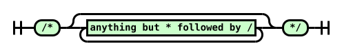

Diagram text: /\* anything but \* followed by / \*/

<a id="newline-diagram"></a>newline

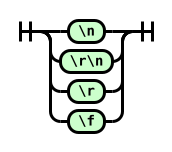

Diagram text: &#x5C;n &#x5C;r&#x5C;n &#x5C;r &#x5C;f

<a id="whitespace-diagram"></a>whitespace

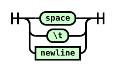

Diagram text: space &#x5C;t newline

<a id="hex-digit-diagram"></a>hex digit


Diagram text: 0-9 a-f or A-F

<a id="escape-diagram"></a>escape

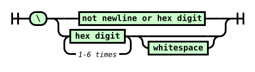

Diagram text: &#x5C; not newline or hex digit hex digit 1-6 times whitespace

<a id="ref-for-typedef-whitespace-token"></a>

<a id="whitespace-token-diagram"></a>[\<whitespace-token\>](#typedef-whitespace-token)


Diagram text: whitespace

<a id="ws*-diagram"></a>ws\*


Diagram text: \<whitespace-token\>

<a id="ref-for-typedef-ident-token①"></a>

<a id="ident-token-diagram"></a>[\<ident-token\>](#typedef-ident-token)

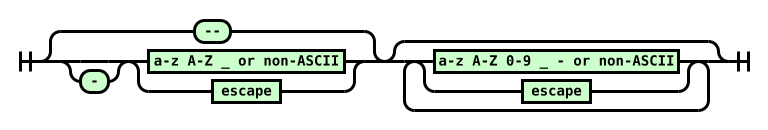

Diagram text: -- - a-z A-Z \_ or non-ASCII escape a-z A-Z 0-9 \_ - or non-ASCII escape

<a id="ref-for-typedef-function-token①"></a>

<a id="function-token-diagram"></a>[\<function-token\>](#typedef-function-token)


Diagram text: \<ident-token\> (

<a id="ref-for-typedef-at-keyword-token②"></a>

<a id="at-keyword-token-diagram"></a>[\<at-keyword-token\>](#typedef-at-keyword-token)


Diagram text: @ \<ident-token\>

<a id="ref-for-typedef-hash-token①"></a>

<a id="hash-token-diagram"></a>[\<hash-token\>](#typedef-hash-token)

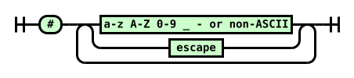

Diagram text: \# a-z A-Z 0-9 \_ - or non-ASCII escape

<a id="ref-for-typedef-string-token①"></a>

<a id="string-token-diagram"></a>[\<string-token\>](#typedef-string-token)

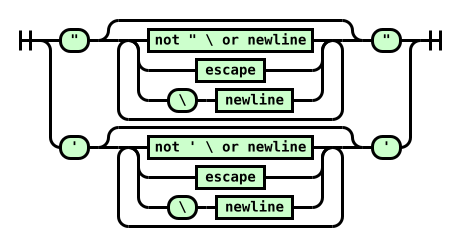

Diagram text: " not " &#x5C; or newline escape &#x5C; newline " ' not ' &#x5C; or newline escape &#x5C; newline '

<a id="ref-for-typedef-url-token①"></a>

<a id="url-token-diagram"></a>[\<url-token\>](#typedef-url-token)

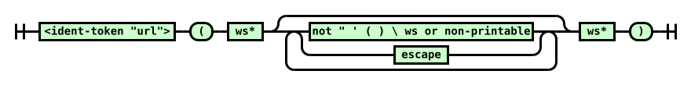

Diagram text: \<ident-token "url"\> ( ws\* not " ' ( ) &#x5C; ws or non-printable escape ws\* )

<a id="ref-for-typedef-number-token②"></a>

<a id="number-token-diagram"></a>[\<number-token\>](#typedef-number-token)

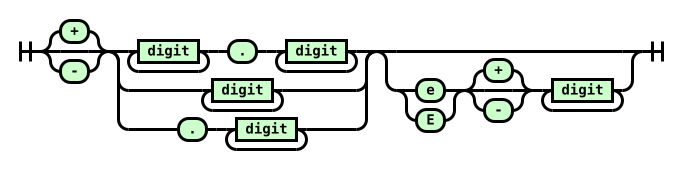

Diagram text: + - digit . digit digit . digit e E + - digit

<a id="ref-for-typedef-dimension-token③"></a>

<a id="dimension-token-diagram"></a>[\<dimension-token\>](#typedef-dimension-token)


Diagram text: \<number-token\> \<ident-token\>

<a id="ref-for-typedef-percentage-token①"></a>

<a id="percentage-token-diagram"></a>[\<percentage-token\>](#typedef-percentage-token)


Diagram text: \<number-token\> %

<a id="ref-for-typedef-cdo-token"></a>

<a id="CDO-token-diagram"></a>[\<CDO-token\>](#typedef-cdo-token)


Diagram text: \<!--

<a id="ref-for-typedef-cdc-token"></a>

<a id="CDC-token-diagram"></a>[\<CDC-token\>](#typedef-cdc-token)


Diagram text: --\>

### <a id="tokenizer-definitions"></a>4.2.  Definitions

This section defines several terms used during the tokenization phase.

<a id="next-input-code-point"></a>next input code point  
<a id="ref-for-input-stream"></a>

<a id="ref-for-code-point②①"></a>

The first [code point](https://infra.spec.whatwg.org/#code-point) in the [input stream](#input-stream) that has not yet been consumed.

<a id="current-input-code-point"></a>current input code point  
<a id="ref-for-code-point②②"></a>

The last [code point](https://infra.spec.whatwg.org/#code-point) to have been consumed.

<a id="reconsume-the-current-input-code-point"></a>reconsume the current input code point  
<a id="ref-for-next-input-code-point"></a>

<a id="ref-for-input-stream①"></a>

<a id="ref-for-current-input-code-point"></a>

Push the [current input code point](#current-input-code-point) back onto the front of the [input stream](#input-stream), so that the next time you are instructed to consume the [next input code point](#next-input-code-point), it will instead reconsume the <a id="ref-for-current-input-code-point①"></a>current input code point.

<a id="eof-code-point"></a>EOF code point  
<a id="ref-for-next-input-code-point①"></a>

<a id="ref-for-input-stream②"></a>

<a id="ref-for-code-point②③"></a>

A conceptual [code point](https://infra.spec.whatwg.org/#code-point) representing the end of the [input stream](#input-stream). Whenever the <a id="ref-for-input-stream③"></a>input stream is empty, the [next input code point](#next-input-code-point) is always an EOF code point.

<a id="digit"></a>digit  
<a id="ref-for-code-point②④"></a>

A [code point](https://infra.spec.whatwg.org/#code-point) between U+0030 DIGIT ZERO (0) and U+0039 DIGIT NINE (9) inclusive.

<a id="hex-digit"></a>hex digit  
<a id="ref-for-code-point②⑤"></a>

<a id="ref-for-digit"></a>

A [digit](#digit), or a [code point](https://infra.spec.whatwg.org/#code-point) between U+0041 LATIN CAPITAL LETTER A (A) and U+0046 LATIN CAPITAL LETTER F (F) inclusive, or a <a id="ref-for-code-point②⑥"></a>code point between U+0061 LATIN SMALL LETTER A (a) and U+0066 LATIN SMALL LETTER F (f) inclusive.

<a id="uppercase-letter"></a>uppercase letter  
<a id="ref-for-code-point②⑦"></a>

A [code point](https://infra.spec.whatwg.org/#code-point) between U+0041 LATIN CAPITAL LETTER A (A) and U+005A LATIN CAPITAL LETTER Z (Z) inclusive.

<a id="lowercase-letter"></a>lowercase letter  
<a id="ref-for-code-point②⑧"></a>

A [code point](https://infra.spec.whatwg.org/#code-point) between U+0061 LATIN SMALL LETTER A (a) and U+007A LATIN SMALL LETTER Z (z) inclusive.

<a id="letter"></a>letter  
<a id="ref-for-lowercase-letter"></a>

<a id="ref-for-uppercase-letter"></a>

An [uppercase letter](#uppercase-letter) or a [lowercase letter](#lowercase-letter).

<a id="non-ascii-code-point"></a>non-ASCII code point  
<a id="ref-for-code-point②⑨"></a>

A [code point](https://infra.spec.whatwg.org/#code-point) with a value equal to or greater than U+0080 \<control\>.

<a id="ident-start-code-point"></a>ident-start code point<a id="name-start-code-point"></a><a id="identifier-start-code-point"></a>  
<a id="ref-for-non-ascii-code-point"></a>

<a id="ref-for-letter"></a>

A [letter](#letter), a [non-ASCII code point](#non-ascii-code-point), or U+005F LOW LINE (\_).

<a id="ident-code-point"></a>ident code point<a id="name-code-point"></a><a id="identifier-code-point"></a>  
<a id="ref-for-digit①"></a>

<a id="ref-for-ident-start-code-point①"></a>

An [ident-start code point](#ident-start-code-point), a [digit](#digit), or U+002D HYPHEN-MINUS (-).

<a id="non-printable-code-point"></a>non-printable code point  
<a id="ref-for-code-point③⓪"></a>

A [code point](https://infra.spec.whatwg.org/#code-point) between U+0000 NULL and U+0008 BACKSPACE inclusive, or U+000B LINE TABULATION, or a <a id="ref-for-code-point③①"></a>code point between U+000E SHIFT OUT and U+001F INFORMATION SEPARATOR ONE inclusive, or U+007F DELETE.

<a id="newline"></a>newline  
U+000A LINE FEED. <strong data-conversion-semantic="note">Note:</strong> Note that U+000D CARRIAGE RETURN and U+000C FORM FEED are not included in this definition, as they are converted to U+000A LINE FEED during [preprocessing](#input-preprocessing).

<a id="whitespace"></a>whitespace  
<a id="ref-for-newline①"></a>

A [newline](#newline), U+0009 CHARACTER TABULATION, or U+0020 SPACE.

<a id="maximum-allowed-code-point"></a>maximum allowed code point  
<a id="ref-for-code-point③②"></a>

The greatest [code point](https://infra.spec.whatwg.org/#code-point) defined by Unicode: U+10FFFF.

<a id="ident-sequence"></a>ident sequence<a id="css-identifier"></a><a id="identifier"></a>  
<a id="ref-for-typedef-ident-token②"></a>

<a id="ref-for-code-point③③"></a>

A sequence of [code points](https://infra.spec.whatwg.org/#code-point) that has the same syntax as an [\<ident-token\>](#typedef-ident-token).

<a id="ref-for-typedef-at-keyword-token③"></a>

<a id="ref-for-typedef-hash-token②"></a>

<a id="ref-for-typedef-function-token②"></a>

<a id="ref-for-typedef-dimension-token④"></a>

<a id="ref-for-ident-sequence③"></a>

> <strong data-conversion-semantic="note">Note</strong>
>
> Note: The part of an [\<at-keyword-token\>](#typedef-at-keyword-token) after the "@", the part of a [\<hash-token\>](#typedef-hash-token) (with the "id" type flag) after the "#", the part of a [\<function-token\>](#typedef-function-token) before the "(", and the unit of a [\<dimension-token\>](#typedef-dimension-token) are all [ident sequences](#ident-sequence).

<a id="representation"></a>representation  
<a id="ref-for-consume-a-token②"></a>

<a id="ref-for-input-stream④"></a>

<a id="ref-for-representation"></a>

The [representation](#representation) of a token is the subsequence of the [input stream](#input-stream) consumed by the invocation of the [consume a token](#consume-a-token) algorithm that produced it. This is preserved for a few algorithms that rely on subtle details of the input text, which a simple "re-serialization" of the tokens might disturb.

<a id="ref-for-representation①"></a>

The [representation](#representation) is only consumed by internal algorithms, and never directly exposed, so it’s not actually required to preserve the exact text; equivalent methods, such as associating each token with offsets into the source text, also suffice.

<a id="ref-for-representation②"></a>

<a id="ref-for-typedef-urange"></a>

> <strong data-conversion-semantic="note">Note</strong>
>
> Note: In particular, the [representation](#representation) preserves details such as whether .009 was written as .009 or 9e-3, and whether a character was written literally or as a CSS escape. The former is necessary to properly parse [\<urange\>](#typedef-urange) productions; the latter is basically an accidental leak of the tokenizing abstraction, but allowed because it makes the impl easier to define.

If a token is ever produced by an algorithm directly, rather than thru the tokenization algorithm in this specification, its representation is the empty string.

### <a id="tokenizer-algorithms"></a>4.3.  Tokenizer Algorithms

<a id="ref-for-code-point③④"></a>

The algorithms defined in this section transform a stream of [code points](https://infra.spec.whatwg.org/#code-point) into a stream of tokens.

#### <a id="consume-token"></a>4.3.1.  Consume a token

<a id="ref-for-code-point③⑤"></a>

This section describes how to <a id="consume-a-token"></a>consume a token from a stream of [code points](https://infra.spec.whatwg.org/#code-point). It will return a single token of any type.

<a id="ref-for-consume-comments"></a>

[Consume comments](#consume-comments).

<a id="ref-for-next-input-code-point②"></a>

Consume the [next input code point](#next-input-code-point).

<a id="ref-for-whitespace①"></a>

[whitespace](#whitespace)

<a id="ref-for-typedef-whitespace-token①"></a>

<a id="ref-for-whitespace②"></a>

Consume as much [whitespace](#whitespace) as possible. Return a [\<whitespace-token\>](#typedef-whitespace-token).

U+0022 QUOTATION MARK (")

<a id="ref-for-consume-a-string-token"></a>

[Consume a string token](#consume-a-string-token) and return it.

U+0023 NUMBER SIGN (#)

<a id="ref-for-check-if-two-code-points-are-a-valid-escape"></a>

<a id="ref-for-ident-code-point①"></a>

<a id="ref-for-next-input-code-point③"></a>

If the [next input code point](#next-input-code-point) is an [ident code point](#ident-code-point) or the <a id="ref-for-next-input-code-point④"></a>next two input code points [are a valid escape](#check-if-two-code-points-are-a-valid-escape), then:

1.  <a id="ref-for-typedef-hash-token③"></a>

    Create a [\<hash-token\>](#typedef-hash-token).

2.  <a id="ref-for-typedef-hash-token④"></a>

    <a id="ref-for-check-if-three-code-points-would-start-an-ident-sequence"></a>

    <a id="ref-for-next-input-code-point⑤"></a>

    If the [next 3 input code points](#next-input-code-point) [would start an ident sequence](#check-if-three-code-points-would-start-an-ident-sequence), set the [\<hash-token\>](#typedef-hash-token)’s type flag to "id".

3.  <a id="ref-for-typedef-hash-token⑤"></a>

    <a id="ref-for-consume-an-ident-sequence"></a>

    [Consume an ident sequence](#consume-an-ident-sequence), and set the [\<hash-token\>](#typedef-hash-token)’s value to the returned string.

4.  <a id="ref-for-typedef-hash-token⑥"></a>

    Return the [\<hash-token\>](#typedef-hash-token).

<a id="ref-for-typedef-delim-token①"></a>

<a id="ref-for-current-input-code-point②"></a>

Otherwise, return a [\<delim-token\>](#typedef-delim-token) with its value set to the [current input code point](#current-input-code-point).

U+0027 APOSTROPHE (')

<a id="ref-for-consume-a-string-token①"></a>

[Consume a string token](#consume-a-string-token) and return it.

U+0028 LEFT PARENTHESIS (()

<a id="ref-for-tokendef-open-paren"></a>

Return a [\<(-token\>](#tokendef-open-paren).

U+0029 RIGHT PARENTHESIS ())

<a id="ref-for-tokendef-close-paren"></a>

Return a [\<)-token\>](#tokendef-close-paren).

U+002B PLUS SIGN (+)

<a id="ref-for-consume-a-numeric-token"></a>

<a id="ref-for-reconsume-the-current-input-code-point"></a>

<a id="ref-for-check-if-three-code-points-would-start-a-number"></a>

If the input stream [starts with a number](#check-if-three-code-points-would-start-a-number), [reconsume the current input code point](#reconsume-the-current-input-code-point), [consume a numeric token](#consume-a-numeric-token), and return it.

<a id="ref-for-typedef-delim-token②"></a>

<a id="ref-for-current-input-code-point③"></a>

Otherwise, return a [\<delim-token\>](#typedef-delim-token) with its value set to the [current input code point](#current-input-code-point).

U+002C COMMA (,)

<a id="ref-for-typedef-comma-token"></a>

Return a [\<comma-token\>](#typedef-comma-token).

U+002D HYPHEN-MINUS (-)

<a id="ref-for-consume-a-numeric-token①"></a>

<a id="ref-for-reconsume-the-current-input-code-point①"></a>

<a id="ref-for-check-if-three-code-points-would-start-a-number①"></a>

If the input stream [starts with a number](#check-if-three-code-points-would-start-a-number), [reconsume the current input code point](#reconsume-the-current-input-code-point), [consume a numeric token](#consume-a-numeric-token), and return it.

<a id="ref-for-next-input-code-point⑥"></a>

<a id="ref-for-typedef-cdc-token①"></a>

Otherwise, if the [next 2 input code points](#next-input-code-point) are U+002D HYPHEN-MINUS U+003E GREATER-THAN SIGN (-\>), consume them and return a [\<CDC-token\>](#typedef-cdc-token).

<a id="ref-for-check-if-three-code-points-would-start-an-ident-sequence①"></a>

<a id="ref-for-reconsume-the-current-input-code-point②"></a>

<a id="ref-for-consume-an-ident-like-token"></a>

Otherwise, if the input stream [starts with an ident sequence](#check-if-three-code-points-would-start-an-ident-sequence), [reconsume the current input code point](#reconsume-the-current-input-code-point), [consume an ident-like token](#consume-an-ident-like-token), and return it.

<a id="ref-for-typedef-delim-token③"></a>

<a id="ref-for-current-input-code-point④"></a>

Otherwise, return a [\<delim-token\>](#typedef-delim-token) with its value set to the [current input code point](#current-input-code-point).

U+002E FULL STOP (.)

<a id="ref-for-consume-a-numeric-token②"></a>

<a id="ref-for-reconsume-the-current-input-code-point③"></a>

<a id="ref-for-check-if-three-code-points-would-start-a-number②"></a>

If the input stream [starts with a number](#check-if-three-code-points-would-start-a-number), [reconsume the current input code point](#reconsume-the-current-input-code-point), [consume a numeric token](#consume-a-numeric-token), and return it.

<a id="ref-for-typedef-delim-token④"></a>

<a id="ref-for-current-input-code-point⑤"></a>

Otherwise, return a [\<delim-token\>](#typedef-delim-token) with its value set to the [current input code point](#current-input-code-point).

U+003A COLON (:)

<a id="ref-for-typedef-colon-token"></a>

Return a [\<colon-token\>](#typedef-colon-token).

U+003B SEMICOLON (;)

<a id="ref-for-typedef-semicolon-token①"></a>

Return a [\<semicolon-token\>](#typedef-semicolon-token).

U+003C LESS-THAN SIGN (\<)

<a id="ref-for-typedef-cdo-token①"></a>

<a id="ref-for-next-input-code-point⑦"></a>

If the [next 3 input code points](#next-input-code-point) are U+0021 EXCLAMATION MARK U+002D HYPHEN-MINUS U+002D HYPHEN-MINUS (!--), consume them and return a [\<CDO-token\>](#typedef-cdo-token).

<a id="ref-for-typedef-delim-token⑤"></a>

<a id="ref-for-current-input-code-point⑥"></a>

Otherwise, return a [\<delim-token\>](#typedef-delim-token) with its value set to the [current input code point](#current-input-code-point).

U+0040 COMMERCIAL AT (@)

<a id="ref-for-typedef-at-keyword-token④"></a>

<a id="ref-for-consume-an-ident-sequence①"></a>

<a id="ref-for-check-if-three-code-points-would-start-an-ident-sequence②"></a>

<a id="ref-for-next-input-code-point⑧"></a>

If the [next 3 input code points](#next-input-code-point) [would start an ident sequence](#check-if-three-code-points-would-start-an-ident-sequence), [consume an ident sequence](#consume-an-ident-sequence), create an [\<at-keyword-token\>](#typedef-at-keyword-token) with its value set to the returned value, and return it.

<a id="ref-for-typedef-delim-token⑥"></a>

<a id="ref-for-current-input-code-point⑦"></a>

Otherwise, return a [\<delim-token\>](#typedef-delim-token) with its value set to the [current input code point](#current-input-code-point).

U+005B LEFT SQUARE BRACKET (\[)

<a id="ref-for-tokendef-open-square"></a>

Return a [\<\[-token\>](#tokendef-open-square).

U+005C REVERSE SOLIDUS (&#x5C;)

<a id="ref-for-consume-an-ident-like-token①"></a>

<a id="ref-for-reconsume-the-current-input-code-point④"></a>

<a id="ref-for-check-if-two-code-points-are-a-valid-escape①"></a>

If the input stream [starts with a valid escape](#check-if-two-code-points-are-a-valid-escape), [reconsume the current input code point](#reconsume-the-current-input-code-point), [consume an ident-like token](#consume-an-ident-like-token), and return it.

<a id="ref-for-parse-error"></a>

<a id="ref-for-typedef-delim-token⑦"></a>

<a id="ref-for-current-input-code-point⑧"></a>

Otherwise, this is a [parse error](#parse-error). Return a [\<delim-token\>](#typedef-delim-token) with its value set to the [current input code point](#current-input-code-point).

U+005D RIGHT SQUARE BRACKET (\])

<a id="ref-for-tokendef-close-square"></a>

Return a [\<\]-token\>](#tokendef-close-square).

U+007B LEFT CURLY BRACKET ({)

<a id="ref-for-tokendef-open-curly①"></a>

Return a [\<{-token\>](#tokendef-open-curly).

U+007D RIGHT CURLY BRACKET (})

<a id="ref-for-tokendef-close-curly①"></a>

Return a [\<}-token\>](#tokendef-close-curly).

<a id="ref-for-digit②"></a>

[digit](#digit)

<a id="ref-for-consume-a-numeric-token③"></a>

<a id="ref-for-reconsume-the-current-input-code-point⑤"></a>

[Reconsume the current input code point](#reconsume-the-current-input-code-point), [consume a numeric token](#consume-a-numeric-token), and return it.

<a id="ref-for-ident-start-code-point②"></a>

[ident-start code point](#ident-start-code-point)

<a id="ref-for-consume-an-ident-like-token②"></a>

<a id="ref-for-reconsume-the-current-input-code-point⑥"></a>

[Reconsume the current input code point](#reconsume-the-current-input-code-point), [consume an ident-like token](#consume-an-ident-like-token), and return it.

EOF

<a id="ref-for-typedef-eof-token①"></a>

Return an [\<EOF-token\>](#typedef-eof-token).

anything else

<a id="ref-for-current-input-code-point⑨"></a>

<a id="ref-for-typedef-delim-token⑧"></a>

Return a [\<delim-token\>](#typedef-delim-token) with its value set to the [current input code point](#current-input-code-point).

#### <a id="consume-comment"></a>4.3.2.  Consume comments

<a id="ref-for-code-point③⑥"></a>

This section describes how to <a id="consume-comments"></a>consume comments from a stream of [code points](https://infra.spec.whatwg.org/#code-point). It returns nothing.

<a id="ref-for-next-input-code-point⑨"></a>

<a id="ref-for-code-point③⑦"></a>

If the [next two input code point](#next-input-code-point) are U+002F SOLIDUS (/) followed by a U+002A ASTERISK (\*), consume them and all following [code points](https://infra.spec.whatwg.org/#code-point) up to and including the first U+002A ASTERISK (\*) followed by a U+002F SOLIDUS (/), or up to an EOF code point. Return to the start of this step.

<a id="ref-for-parse-error①"></a>

If the preceding paragraph ended by consuming an EOF code point, this is a [parse error](#parse-error).

Return nothing.

#### <a id="consume-numeric-token"></a>4.3.3.  Consume a numeric token

<a id="ref-for-code-point③⑧"></a>

<a id="ref-for-typedef-number-token③"></a>

<a id="ref-for-typedef-percentage-token②"></a>

<a id="ref-for-typedef-dimension-token⑤"></a>

This section describes how to <a id="consume-a-numeric-token"></a>consume a numeric token from a stream of [code points](https://infra.spec.whatwg.org/#code-point). It returns either a [\<number-token\>](#typedef-number-token), [\<percentage-token\>](#typedef-percentage-token), or [\<dimension-token\>](#typedef-dimension-token).

<a id="ref-for-consume-a-number"></a>

[Consume a number](#consume-a-number) and let <var>number</var> be the result.

<a id="ref-for-next-input-code-point①⓪"></a>

<a id="ref-for-check-if-three-code-points-would-start-an-ident-sequence③"></a>

If the [next 3 input code points](#next-input-code-point) [would start an ident sequence](#check-if-three-code-points-would-start-an-ident-sequence), then:

1.  <a id="ref-for-typedef-dimension-token⑥"></a>

    Create a [\<dimension-token\>](#typedef-dimension-token) with the same value and type flag as <var>number</var>, and a unit set initially to the empty string.

2.  <a id="ref-for-typedef-dimension-token⑦"></a>

    <a id="ref-for-consume-an-ident-sequence②"></a>

    [Consume an ident sequence](#consume-an-ident-sequence). Set the [\<dimension-token\>](#typedef-dimension-token)’s unit to the returned value.

3.  <a id="ref-for-typedef-dimension-token⑧"></a>

    Return the [\<dimension-token\>](#typedef-dimension-token).

<a id="ref-for-next-input-code-point①①"></a>

<a id="ref-for-typedef-percentage-token③"></a>

Otherwise, if the [next input code point](#next-input-code-point) is U+0025 PERCENTAGE SIGN (%), consume it. Create a [\<percentage-token\>](#typedef-percentage-token) with the same value as <var>number</var>, and return it.

<a id="ref-for-typedef-number-token④"></a>

Otherwise, create a [\<number-token\>](#typedef-number-token) with the same value and type flag as <var>number</var>, and return it.

#### <a id="consume-ident-like-token"></a>4.3.4.  Consume an ident-like token

<a id="ref-for-code-point③⑨"></a>

<a id="ref-for-typedef-ident-token③"></a>

<a id="ref-for-typedef-function-token③"></a>

<a id="ref-for-typedef-url-token②"></a>

<a id="ref-for-typedef-bad-url-token"></a>

This section describes how to <a id="consume-an-ident-like-token"></a>consume an ident-like token from a stream of [code points](https://infra.spec.whatwg.org/#code-point). It returns an [\<ident-token\>](#typedef-ident-token), [\<function-token\>](#typedef-function-token), [\<url-token\>](#typedef-url-token), or [\<bad-url-token\>](#typedef-bad-url-token).

<a id="ref-for-consume-an-ident-sequence③"></a>

[Consume an ident sequence](#consume-an-ident-sequence), and let <var>string</var> be the result.

<a id="ref-for-ascii-case-insensitive"></a>

<a id="ref-for-next-input-code-point①②"></a>

<a id="ref-for-whitespace③"></a>

<a id="ref-for-typedef-function-token④"></a>

<a id="ref-for-consume-a-url-token"></a>

If <var>string</var>’s value is an [ASCII case-insensitive](https://infra.spec.whatwg.org/#ascii-case-insensitive) match for "url", and the [next input code point](#next-input-code-point) is U+0028 LEFT PARENTHESIS ((), consume it. While the <a id="ref-for-next-input-code-point①③"></a>next two input code points are [whitespace](#whitespace), consume the <a id="ref-for-next-input-code-point①④"></a>next input code point. If the <a id="ref-for-next-input-code-point①⑤"></a>next one or two input code points are U+0022 QUOTATION MARK ("), U+0027 APOSTROPHE ('), or <a id="ref-for-whitespace④"></a>whitespace followed by U+0022 QUOTATION MARK (") or U+0027 APOSTROPHE ('), then create a [\<function-token\>](#typedef-function-token) with its value set to <var>string</var> and return it. Otherwise, [consume a url token](#consume-a-url-token), and return it.

<a id="ref-for-next-input-code-point①⑥"></a>

<a id="ref-for-typedef-function-token⑤"></a>

Otherwise, if the [next input code point](#next-input-code-point) is U+0028 LEFT PARENTHESIS ((), consume it. Create a [\<function-token\>](#typedef-function-token) with its value set to <var>string</var> and return it.

<a id="ref-for-typedef-ident-token④"></a>

Otherwise, create an [\<ident-token\>](#typedef-ident-token) with its value set to <var>string</var> and return it.

#### <a id="consume-string-token"></a>4.3.5.  Consume a string token

<a id="ref-for-code-point④⓪"></a>

<a id="ref-for-typedef-string-token②"></a>

<a id="ref-for-typedef-bad-string-token"></a>

This section describes how to <a id="consume-a-string-token"></a>consume a string token from a stream of [code points](https://infra.spec.whatwg.org/#code-point). It returns either a [\<string-token\>](#typedef-string-token) or [\<bad-string-token\>](#typedef-bad-string-token).

<a id="ref-for-code-point④①"></a>

<a id="ref-for-current-input-code-point①⓪"></a>

This algorithm may be called with an <var>ending code point</var>, which denotes the [code point](https://infra.spec.whatwg.org/#code-point) that ends the string. If an <var>ending code point</var> is not specified, the [current input code point](#current-input-code-point) is used.

<a id="ref-for-typedef-string-token③"></a>

Initially create a [\<string-token\>](#typedef-string-token) with its value set to the empty string.

<a id="ref-for-next-input-code-point①⑦"></a>

Repeatedly consume the [next input code point](#next-input-code-point) from the stream:

<var>ending code point</var>

<a id="ref-for-typedef-string-token④"></a>

Return the [\<string-token\>](#typedef-string-token).

EOF

<a id="ref-for-typedef-string-token⑤"></a>

<a id="ref-for-parse-error②"></a>

This is a [parse error](#parse-error). Return the [\<string-token\>](#typedef-string-token).

<a id="ref-for-newline②"></a>

[newline](#newline)

<a id="ref-for-typedef-bad-string-token①"></a>

<a id="ref-for-reconsume-the-current-input-code-point⑦"></a>

<a id="ref-for-parse-error③"></a>

This is a [parse error](#parse-error). [Reconsume the current input code point](#reconsume-the-current-input-code-point), create a [\<bad-string-token\>](#typedef-bad-string-token), and return it.

U+005C REVERSE SOLIDUS (&#x5C;)

<a id="ref-for-next-input-code-point①⑧"></a>

If the [next input code point](#next-input-code-point) is EOF, do nothing.

<a id="ref-for-next-input-code-point①⑨"></a>

Otherwise, if the [next input code point](#next-input-code-point) is a newline, consume it.

<a id="ref-for-check-if-two-code-points-are-a-valid-escape②"></a>

<a id="ref-for-consume-an-escaped-code-point"></a>

<a id="ref-for-code-point④②"></a>

<a id="ref-for-typedef-string-token⑥"></a>

Otherwise, <strong data-conversion-semantic="note">Note:</strong> (the stream [starts with a valid escape](#check-if-two-code-points-are-a-valid-escape)) [consume an escaped code point](#consume-an-escaped-code-point) and append the returned [code point](https://infra.spec.whatwg.org/#code-point) to the [\<string-token\>](#typedef-string-token)’s value.

anything else

<a id="ref-for-typedef-string-token⑦"></a>

<a id="ref-for-current-input-code-point①①"></a>

Append the [current input code point](#current-input-code-point) to the [\<string-token\>](#typedef-string-token)’s value.

#### <a id="consume-url-token"></a>4.3.6.  Consume a url token

<a id="ref-for-code-point④③"></a>

<a id="ref-for-typedef-url-token③"></a>

<a id="ref-for-typedef-bad-url-token①"></a>

This section describes how to <a id="consume-a-url-token"></a>consume a url token from a stream of [code points](https://infra.spec.whatwg.org/#code-point). It returns either a [\<url-token\>](#typedef-url-token) or a [\<bad-url-token\>](#typedef-bad-url-token).

<a id="ref-for-typedef-function-token⑥"></a>

<a id="ref-for-consume-an-ident-like-token③"></a>

> <strong data-conversion-semantic="note">Note</strong>
>
> Note: This algorithm assumes that the initial "url(" has already been consumed. This algorithm also assumes that it’s being called to consume an "unquoted" value, like url(foo). A quoted value, like url("foo"), is parsed as a [\<function-token\>](#typedef-function-token). [Consume an ident-like token](#consume-an-ident-like-token) automatically handles this distinction; this algorithm shouldn’t be called directly otherwise.

1.  <a id="ref-for-typedef-url-token④"></a>

    Initially create a [\<url-token\>](#typedef-url-token) with its value set to the empty string.

2.  <a id="ref-for-whitespace⑤"></a>

    Consume as much [whitespace](#whitespace) as possible.

3.  <a id="ref-for-next-input-code-point②⓪"></a>

    Repeatedly consume the [next input code point](#next-input-code-point) from the stream:

    U+0029 RIGHT PARENTHESIS ())

    <a id="ref-for-typedef-url-token⑤"></a>

    Return the [\<url-token\>](#typedef-url-token).

    EOF

    <a id="ref-for-typedef-url-token⑥"></a>

    <a id="ref-for-parse-error④"></a>

    This is a [parse error](#parse-error). Return the [\<url-token\>](#typedef-url-token).

    <a id="ref-for-whitespace⑥"></a>

    [whitespace](#whitespace)

    <a id="ref-for-typedef-bad-url-token②"></a>

    <a id="ref-for-consume-the-remnants-of-a-bad-url"></a>

    <a id="ref-for-parse-error⑤"></a>

    <a id="ref-for-typedef-url-token⑦"></a>

    <a id="ref-for-next-input-code-point②①"></a>

    <a id="ref-for-whitespace⑦"></a>

    Consume as much [whitespace](#whitespace) as possible. If the [next input code point](#next-input-code-point) is U+0029 RIGHT PARENTHESIS ()) or EOF, consume it and return the [\<url-token\>](#typedef-url-token) (if EOF was encountered, this is a [parse error](#parse-error)); otherwise, [consume the remnants of a bad url](#consume-the-remnants-of-a-bad-url), create a [\<bad-url-token\>](#typedef-bad-url-token), and return it.

    U+0022 QUOTATION MARK (")

    U+0027 APOSTROPHE (')

    U+0028 LEFT PARENTHESIS (()

    <a id="ref-for-non-printable-code-point"></a>

    [non-printable code point](#non-printable-code-point)

    <a id="ref-for-typedef-bad-url-token③"></a>

    <a id="ref-for-consume-the-remnants-of-a-bad-url①"></a>

    <a id="ref-for-parse-error⑥"></a>

    This is a [parse error](#parse-error). [Consume the remnants of a bad url](#consume-the-remnants-of-a-bad-url), create a [\<bad-url-token\>](#typedef-bad-url-token), and return it.

    U+005C REVERSE SOLIDUS (&#x5C;)

    <a id="ref-for-typedef-url-token⑧"></a>

    <a id="ref-for-code-point④④"></a>

    <a id="ref-for-consume-an-escaped-code-point①"></a>

    <a id="ref-for-check-if-two-code-points-are-a-valid-escape③"></a>

    If the stream [starts with a valid escape](#check-if-two-code-points-are-a-valid-escape), [consume an escaped code point](#consume-an-escaped-code-point) and append the returned [code point](https://infra.spec.whatwg.org/#code-point) to the [\<url-token\>](#typedef-url-token)’s value.

    <a id="ref-for-parse-error⑦"></a>

    <a id="ref-for-consume-the-remnants-of-a-bad-url②"></a>

    <a id="ref-for-typedef-bad-url-token④"></a>

    Otherwise, this is a [parse error](#parse-error). [Consume the remnants of a bad url](#consume-the-remnants-of-a-bad-url), create a [\<bad-url-token\>](#typedef-bad-url-token), and return it.

    anything else

    <a id="ref-for-typedef-url-token⑨"></a>

    <a id="ref-for-current-input-code-point①②"></a>

    Append the [current input code point](#current-input-code-point) to the [\<url-token\>](#typedef-url-token)’s value.

#### <a id="consume-escaped-code-point"></a>4.3.7.  Consume an escaped code point

<a id="ref-for-code-point④⑤"></a>

This section describes how to <a id="consume-an-escaped-code-point"></a>consume an escaped code point. It assumes that the U+005C REVERSE SOLIDUS (&#x5C;) has already been consumed and that the next input code point has already been verified to be part of a valid escape. It will return a [code point](https://infra.spec.whatwg.org/#code-point).

<a id="ref-for-next-input-code-point②②"></a>

Consume the [next input code point](#next-input-code-point).

<a id="ref-for-hex-digit②"></a>

[hex digit](#hex-digit)

<a id="ref-for-code-point④⑥"></a>

<a id="ref-for-maximum-allowed-code-point"></a>

<a id="ref-for-surrogate①"></a>

<a id="ref-for-whitespace⑧"></a>

<a id="ref-for-next-input-code-point②③"></a>

<a id="ref-for-hex-digit③"></a>

Consume as many [hex digits](#hex-digit) as possible, but no more than 5. <strong data-conversion-semantic="note">Note:</strong> Note that this means 1-6 hex digits have been consumed in total. If the [next input code point](#next-input-code-point) is [whitespace](#whitespace), consume it as well. Interpret the <a id="ref-for-hex-digit④"></a>hex digits as a hexadecimal number. If this number is zero, or is for a [surrogate](https://infra.spec.whatwg.org/#surrogate), or is greater than the [maximum allowed code point](#maximum-allowed-code-point), return U+FFFD REPLACEMENT CHARACTER (�). Otherwise, return the [code point](https://infra.spec.whatwg.org/#code-point) with that value.

EOF

<a id="ref-for-parse-error⑧"></a>

This is a [parse error](#parse-error). Return U+FFFD REPLACEMENT CHARACTER (�).

anything else

<a id="ref-for-current-input-code-point①③"></a>

Return the [current input code point](#current-input-code-point).

#### <a id="starts-with-a-valid-escape"></a>4.3.8.  Check if two code points are a valid escape

<a id="ref-for-code-point④⑦"></a>

<a id="ref-for-current-input-code-point①④"></a>

<a id="ref-for-next-input-code-point②④"></a>

This section describes how to <a id="check-if-two-code-points-are-a-valid-escape"></a>check if two code points are a valid escape. The algorithm described here can be called explicitly with two [code points](https://infra.spec.whatwg.org/#code-point), or can be called with the input stream itself. In the latter case, the two <a id="ref-for-code-point④⑧"></a>code points in question are the [current input code point](#current-input-code-point) and the [next input code point](#next-input-code-point), in that order.

<a id="ref-for-code-point④⑨"></a>

> <strong data-conversion-semantic="note">Note</strong>
>
> Note: This algorithm will not consume any additional [code point](https://infra.spec.whatwg.org/#code-point).

<a id="ref-for-code-point⑤⓪"></a>

If the first [code point](https://infra.spec.whatwg.org/#code-point) is not U+005C REVERSE SOLIDUS (&#x5C;), return false.

<a id="ref-for-code-point⑤①"></a>

<a id="ref-for-newline③"></a>

Otherwise, if the second [code point](https://infra.spec.whatwg.org/#code-point) is a [newline](#newline), return false.

Otherwise, return true.

#### <a id="would-start-an-identifier"></a>4.3.9.  Check if three code points would start an ident sequence

<a id="ref-for-ident-sequence④"></a>

<a id="ref-for-code-point⑤②"></a>

<a id="ref-for-current-input-code-point①⑤"></a>

<a id="ref-for-next-input-code-point②⑤"></a>

This section describes how to <a id="check-if-three-code-points-would-start-an-ident-sequence"></a>check if three code points would start an [ident sequence](#ident-sequence)<a id="check-if-three-code-points-would-start-an-identifier"></a>. The algorithm described here can be called explicitly with three [code points](https://infra.spec.whatwg.org/#code-point), or can be called with the input stream itself. In the latter case, the three <a id="ref-for-code-point⑤③"></a>code points in question are the [current input code point](#current-input-code-point) and the [next two input code points](#next-input-code-point), in that order.

<a id="ref-for-code-point⑤④"></a>

> <strong data-conversion-semantic="note">Note</strong>
>
> Note: This algorithm will not consume any additional [code points](https://infra.spec.whatwg.org/#code-point).

<a id="ref-for-code-point⑤⑤"></a>

Look at the first [code point](https://infra.spec.whatwg.org/#code-point):

U+002D HYPHEN-MINUS

<a id="ref-for-check-if-two-code-points-are-a-valid-escape④"></a>

<a id="ref-for-ident-start-code-point③"></a>

<a id="ref-for-code-point⑤⑥"></a>

If the second [code point](https://infra.spec.whatwg.org/#code-point) is an [ident-start code point](#ident-start-code-point) or a U+002D HYPHEN-MINUS, or the second and third <a id="ref-for-code-point⑤⑦"></a>code points [are a valid escape](#check-if-two-code-points-are-a-valid-escape), return true. Otherwise, return false.

<a id="ref-for-ident-start-code-point④"></a>

[ident-start code point](#ident-start-code-point)

Return true.

U+005C REVERSE SOLIDUS (&#x5C;)

<a id="ref-for-check-if-two-code-points-are-a-valid-escape⑤"></a>

<a id="ref-for-code-point⑤⑧"></a>

If the first and second [code points](https://infra.spec.whatwg.org/#code-point) [are a valid escape](#check-if-two-code-points-are-a-valid-escape), return true. Otherwise, return false.

anything else

Return false.

#### <a id="starts-with-a-number"></a>4.3.10.  Check if three code points would start a number

<a id="ref-for-code-point⑤⑨"></a>

<a id="ref-for-current-input-code-point①⑥"></a>

<a id="ref-for-next-input-code-point②⑥"></a>

This section describes how to <a id="check-if-three-code-points-would-start-a-number"></a>check if three code points would start a number. The algorithm described here can be called explicitly with three [code points](https://infra.spec.whatwg.org/#code-point), or can be called with the input stream itself. In the latter case, the three <a id="ref-for-code-point⑥⓪"></a>code points in question are the [current input code point](#current-input-code-point) and the [next two input code points](#next-input-code-point), in that order.

<a id="ref-for-code-point⑥①"></a>

> <strong data-conversion-semantic="note">Note</strong>
>
> Note: This algorithm will not consume any additional [code points](https://infra.spec.whatwg.org/#code-point).

<a id="ref-for-code-point⑥②"></a>

Look at the first [code point](https://infra.spec.whatwg.org/#code-point):

U+002B PLUS SIGN (+)

U+002D HYPHEN-MINUS (-)

<a id="ref-for-digit③"></a>

<a id="ref-for-code-point⑥③"></a>

If the second [code point](https://infra.spec.whatwg.org/#code-point) is a [digit](#digit), return true.

<a id="ref-for-code-point⑥④"></a>

<a id="ref-for-digit④"></a>

Otherwise, if the second [code point](https://infra.spec.whatwg.org/#code-point) is a U+002E FULL STOP (.) and the third <a id="ref-for-code-point⑥⑤"></a>code point is a [digit](#digit), return true.

Otherwise, return false.

U+002E FULL STOP (.)

<a id="ref-for-digit⑤"></a>

<a id="ref-for-code-point⑥⑥"></a>

If the second [code point](https://infra.spec.whatwg.org/#code-point) is a [digit](#digit), return true. Otherwise, return false.

<a id="ref-for-digit⑥"></a>

[digit](#digit)

Return true.

anything else

Return false.

#### <a id="consume-name"></a>4.3.11.  Consume an ident sequence

<a id="ref-for-code-point⑥⑦"></a>

This section describes how to <a id="consume-an-ident-sequence"></a>consume an ident sequence<a id="consume-an-identifier"></a> from a stream of [code points](https://infra.spec.whatwg.org/#code-point). It returns a string containing the largest name that can be formed from adjacent <a id="ref-for-code-point⑥⑧"></a>code points in the stream, starting from the first.

<a id="ref-for-code-point⑥⑨"></a>

<a id="ref-for-typedef-ident-token⑤"></a>

<a id="ref-for-check-if-three-code-points-would-start-an-ident-sequence④"></a>

> <strong data-conversion-semantic="note">Note</strong>
>
> Note: This algorithm does not do the verification of the first few [code points](https://infra.spec.whatwg.org/#code-point) that are necessary to ensure the returned <a id="ref-for-code-point⑦⓪"></a>code points would constitute an [\<ident-token\>](#typedef-ident-token). If that is the intended use, ensure that the stream [starts with an ident sequence](#check-if-three-code-points-would-start-an-ident-sequence) before calling this algorithm.

Let <var>result</var> initially be an empty string.

<a id="ref-for-next-input-code-point②⑦"></a>

Repeatedly consume the [next input code point](#next-input-code-point) from the stream:

<a id="ref-for-ident-code-point②"></a>

[ident code point](#ident-code-point)

<a id="ref-for-code-point⑦①"></a>

Append the [code point](https://infra.spec.whatwg.org/#code-point) to <var>result</var>.

<a id="ref-for-check-if-two-code-points-are-a-valid-escape⑥"></a>

the stream [starts with a valid escape](#check-if-two-code-points-are-a-valid-escape)

<a id="ref-for-code-point⑦②"></a>

<a id="ref-for-consume-an-escaped-code-point②"></a>

[Consume an escaped code point](#consume-an-escaped-code-point). Append the returned [code point](https://infra.spec.whatwg.org/#code-point) to <var>result</var>.

anything else

<a id="ref-for-reconsume-the-current-input-code-point⑧"></a>

[Reconsume the current input code point](#reconsume-the-current-input-code-point). Return <var>result</var>.

#### <a id="consume-number"></a>4.3.12.  Consume a number

<a id="ref-for-code-point⑦③"></a>

This section describes how to <a id="consume-a-number"></a>consume a number from a stream of [code points](https://infra.spec.whatwg.org/#code-point). It returns a numeric <var>value</var>, and a <var>type</var> which is either "integer" or "number".

<a id="ref-for-code-point⑦④"></a>

<a id="ref-for-check-if-three-code-points-would-start-a-number③"></a>

> <strong data-conversion-semantic="note">Note</strong>
>
> Note: This algorithm does not do the verification of the first few [code points](https://infra.spec.whatwg.org/#code-point) that are necessary to ensure a number can be obtained from the stream. Ensure that the stream [starts with a number](#check-if-three-code-points-would-start-a-number) before calling this algorithm.

Execute the following steps in order:

1.  Initially set <var>type</var> to "integer". Let <var>repr</var> be the empty string.

2.  <a id="ref-for-next-input-code-point②⑧"></a>

    If the [next input code point](#next-input-code-point) is U+002B PLUS SIGN (+) or U+002D HYPHEN-MINUS (-), consume it and append it to <var>repr</var>.

3.  <a id="ref-for-digit⑦"></a>

    <a id="ref-for-next-input-code-point②⑨"></a>

    While the [next input code point](#next-input-code-point) is a [digit](#digit), consume it and append it to <var>repr</var>.

4.  <a id="ref-for-digit⑧"></a>

    <a id="ref-for-next-input-code-point③⓪"></a>

    If the [next 2 input code points](#next-input-code-point) are U+002E FULL STOP (.) followed by a [digit](#digit), then:

    1.  Consume them.

    2.  Append them to <var>repr</var>.

    3.  Set <var>type</var> to "number".

    4.  <a id="ref-for-digit⑨"></a>

        <a id="ref-for-next-input-code-point③①"></a>

        While the [next input code point](#next-input-code-point) is a [digit](#digit), consume it and append it to <var>repr</var>.

5.  <a id="ref-for-digit①⓪"></a>

    <a id="ref-for-next-input-code-point③②"></a>

    If the [next 2 or 3 input code points](#next-input-code-point) are U+0045 LATIN CAPITAL LETTER E (E) or U+0065 LATIN SMALL LETTER E (e), optionally followed by U+002D HYPHEN-MINUS (-) or U+002B PLUS SIGN (+), followed by a [digit](#digit), then:

    1.  Consume them.

    2.  Append them to <var>repr</var>.

    3.  Set <var>type</var> to "number".

    4.  <a id="ref-for-digit①①"></a>

        <a id="ref-for-next-input-code-point③③"></a>

        While the [next input code point](#next-input-code-point) is a [digit](#digit), consume it and append it to <var>repr</var>.

6.  <a id="ref-for-convert-a-string-to-a-number"></a>

    [Convert <var>repr</var> to a number](#convert-a-string-to-a-number), and set the <var>value</var> to the returned value.

7.  Return <var>value</var> and <var>type</var>.

#### <a id="convert-string-to-number"></a>4.3.13.  Convert a string to a number

This section describes how to <a id="convert-a-string-to-a-number"></a>convert a string to a number. It returns a number.

> <strong data-conversion-semantic="note">Note</strong>
>
> Note: This algorithm does not do any verification to ensure that the string contains only a number. Ensure that the string contains only a valid CSS number before calling this algorithm.

Divide the string into seven components, in order from left to right:

1.  A <b>sign</b>: a single U+002B PLUS SIGN (+) or U+002D HYPHEN-MINUS (-), or the empty string. Let <var>s</var> be the number -1 if the sign is U+002D HYPHEN-MINUS (-); otherwise, let <var>s</var> be the number 1.

2.  <a id="ref-for-digit①②"></a>

    An <b>integer part</b>: zero or more [digits](#digit). If there is at least one digit, let <var>i</var> be the number formed by interpreting the digits as a base-10 integer; otherwise, let <var>i</var> be the number 0.

3.  A <b>decimal point</b>: a single U+002E FULL STOP (.), or the empty string.

4.  <a id="ref-for-digit①③"></a>

    A <b>fractional part</b>: zero or more [digits](#digit). If there is at least one digit, let <var>f</var> be the number formed by interpreting the digits as a base-10 integer and <var>d</var> be the number of digits; otherwise, let <var>f</var> and <var>d</var> be the number 0.

5.  An <b>exponent indicator</b>: a single U+0045 LATIN CAPITAL LETTER E (E) or U+0065 LATIN SMALL LETTER E (e), or the empty string.

6.  An <b>exponent sign</b>: a single U+002B PLUS SIGN (+) or U+002D HYPHEN-MINUS (-), or the empty string. Let <var>t</var> be the number -1 if the sign is U+002D HYPHEN-MINUS (-); otherwise, let <var>t</var> be the number 1.

7.  <a id="ref-for-digit①④"></a>

    An <b>exponent</b>: zero or more [digits](#digit). If there is at least one digit, let <var>e</var> be the number formed by interpreting the digits as a base-10 integer; otherwise, let <var>e</var> be the number 0.

Return the number <code>s·(i + f·10<sup>-d</sup>)·10<sup>te</sup></code>.

#### <a id="consume-remnants-of-bad-url"></a>4.3.14.  Consume the remnants of a bad url

<a id="ref-for-code-point⑦⑤"></a>

<a id="ref-for-typedef-bad-url-token⑤"></a>

<a id="ref-for-typedef-url-token①⓪"></a>

This section describes how to <a id="consume-the-remnants-of-a-bad-url"></a>consume the remnants of a bad url from a stream of [code points](https://infra.spec.whatwg.org/#code-point), "cleaning up" after the tokenizer realizes that it’s in the middle of a [\<bad-url-token\>](#typedef-bad-url-token) rather than a [\<url-token\>](#typedef-url-token). It returns nothing; its sole use is to consume enough of the input stream to reach a recovery point where normal tokenizing can resume.

<a id="ref-for-next-input-code-point③④"></a>

Repeatedly consume the [next input code point](#next-input-code-point) from the stream:

U+0029 RIGHT PARENTHESIS ())

EOF

Return.

<a id="ref-for-check-if-two-code-points-are-a-valid-escape⑦"></a>

the input stream [starts with a valid escape](#check-if-two-code-points-are-a-valid-escape)

<a id="ref-for-typedef-bad-url-token⑥"></a>

<a id="ref-for-consume-an-escaped-code-point③"></a>

[Consume an escaped code point](#consume-an-escaped-code-point). <strong data-conversion-semantic="note">Note:</strong> This allows an escaped right parenthesis ("&#x5C;)") to be encountered without ending the [\<bad-url-token\>](#typedef-bad-url-token). This is otherwise identical to the "anything else" clause.

anything else

Do nothing.

## <a id="parsing"></a>5.  Parsing

The input to the parsing stage is a stream or list of tokens from the tokenization stage. The output depends on how the parser is invoked, as defined by the entry points listed later in this section. The parser output can consist of at-rules, qualified rules, and/or declarations.

The parser’s output is constructed according to the fundamental syntax of CSS, without regards for the validity of any specific item. Implementations may check the validity of items as they are returned by the various parser algorithms and treat the algorithm as returning nothing if the item was invalid according to the implementation’s own grammar knowledge, or may construct a full tree as specified and "clean up" afterwards by removing any invalid items.

The items that can appear in the tree are:

<a id="ref-for-at-rule①①"></a>

[at-rule](#at-rule)

<a id="ref-for-at-rule①②"></a>

An [at-rule](#at-rule) has a name, a prelude consisting of a list of component values, and an optional block consisting of a simple {} block.

> <strong data-conversion-semantic="note">Note</strong>
>
> Note: This specification places no limits on what an at-rule’s block may contain. Individual at-rules must define whether they accept a block, and if so, how to parse it (preferably using one of the parser algorithms or entry points defined in this specification).

<a id="qualified-rule"></a>qualified rule

A qualified rule has a prelude consisting of a list of component values, and a block consisting of a simple {} block.

<a id="ref-for-parse-a-list-of-declarations"></a>

> <strong data-conversion-semantic="note">Note</strong>
>
> Note: Most qualified rules will be style rules, where the prelude is a selector [\[SELECT\]](#biblio-select) and the block a [list of declarations](#parse-a-list-of-declarations).

<a id="declaration"></a>declaration

Conceptually, declarations are a particular instance of associating a property or descriptor name with a value. Syntactically, a declaration has a name, a value consisting of a list of component values, and an <var>important</var> flag which is initially unset.

<a id="ref-for-css-property"></a>

<a id="ref-for-qualified-rule④"></a>

<a id="ref-for-css-descriptor"></a>

<a id="ref-for-at-rule①③"></a>

Declarations are further categorized as <a id="css-property-declarations"></a>property declarations or <a id="css-descriptor-declarations"></a>descriptor declarations, with the former setting CSS [properties](https://www.w3.org/TR/css-cascade-5/#css-property) and appearing most often in [qualified rules](#qualified-rule) and the latter setting CSS [descriptors](#css-descriptor), which appear only in [at-rules](#at-rule). (This categorization does not occur at the Syntax level; instead, it is a product of where the declaration appears, and is defined by the respective specifications defining the given rule.)

<a id="component-value"></a>component value

<a id="ref-for-simple-block"></a>

<a id="ref-for-function"></a>

<a id="ref-for-preserved-tokens"></a>

A component value is one of the [preserved tokens](#preserved-tokens), a [function](#function), or a [simple block](#simple-block).

<a id="preserved-tokens"></a>preserved tokens

<a id="ref-for-tokendef-open-square①"></a>

<a id="ref-for-tokendef-open-paren①"></a>

<a id="ref-for-tokendef-open-curly②"></a>

<a id="ref-for-typedef-function-token⑦"></a>

Any token produced by the tokenizer except for [\<function-token\>](#typedef-function-token)s, [\<{-token\>](#tokendef-open-curly)s, [\<(-token\>](#tokendef-open-paren)s, and [\<\[-token\>](#tokendef-open-square)s.

<a id="ref-for-preserved-tokens①"></a>

> <strong data-conversion-semantic="note">Note</strong>
>
> Note: The non-[preserved tokens](#preserved-tokens) listed above are always consumed into higher-level objects, either functions or simple blocks, and so never appear in any parser output themselves.

<a id="ref-for-tokendef-close-curly②"></a>

<a id="ref-for-tokendef-close-paren①"></a>

<a id="ref-for-tokendef-close-square①"></a>

<a id="ref-for-typedef-bad-string-token②"></a>

<a id="ref-for-typedef-bad-url-token⑦"></a>

> <strong data-conversion-semantic="note">Note</strong>
>
> Note: The tokens [\<}-token\>](#tokendef-close-curly)s, [\<)-token\>](#tokendef-close-paren)s, [\<\]-token\>](#tokendef-close-square), [\<bad-string-token\>](#typedef-bad-string-token), and [\<bad-url-token\>](#typedef-bad-url-token) are always parse errors, but they are preserved in the token stream by this specification to allow other specs, such as Media Queries, to define more fine-grained error-handling than just dropping an entire declaration or block.

<a id="function"></a>function

A function has a name and a value consisting of a list of component values.

<a id="simple-block"></a>simple block

<a id="curly-block"></a>{}-block

<a id="square-block"></a>\[\]-block

<a id="paren-block"></a>()-block

<a id="ref-for-tokendef-open-curly③"></a>

<a id="ref-for-tokendef-open-paren②"></a>

<a id="ref-for-tokendef-open-square②"></a>

A simple block has an associated token (either a [\<\[-token\>](#tokendef-open-square), [\<(-token\>](#tokendef-open-paren), or [\<{-token\>](#tokendef-open-curly)) and a value consisting of a list of component values.

<a id="ref-for-curly-block"></a>

<a id="ref-for-square-block"></a>

<a id="ref-for-paren-block"></a>

<a id="ref-for-simple-block①"></a>

[{}-block](#curly-block), [\[\]-block](#square-block), and [()-block](#paren-block) refer specifically to a [simple block](#simple-block) with that corresponding associated token.

### <a id="parser-diagrams"></a>5.1.  Parser Railroad Diagrams

<em>This section is non-normative.</em>

This section presents an informative view of the parser, in the form of railroad diagrams.

These diagrams are <em>informative</em> and <em>incomplete</em>; they describe the grammar of "correct" stylesheets, but do not describe error-handling at all. They are provided solely to make it easier to get an intuitive grasp of the syntax.

<a id="stylesheet-diagram"></a>Stylesheet  
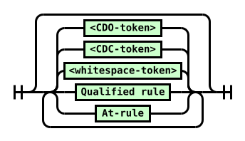

Diagram text: \<whitespace-token\> \<CDC-token\> \<CDO-token\> Qualified rule At-rule

<a id="rule-list-diagram"></a>Rule list  
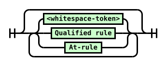

Diagram text: \<whitespace-token\> Qualified rule At-rule

<a id="at-rule-diagram"></a>At-rule  
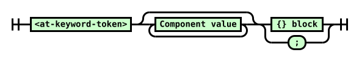

Diagram text: \<at-keyword-token\> Component value {} block ;

<a id="qualified-rule-diagram"></a>Qualified rule  


Diagram text: Component value {} block

<a id="declaration-list-diagram"></a>Declaration list  


Diagram text: ws\* Declaration ; Declaration list At-rule Declaration list

<a id="declaration-diagram"></a>Declaration  
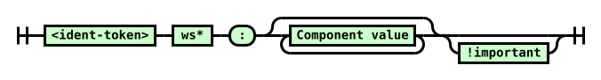

Diagram text: \<ident-token\> ws\* : Component value !important

<a id="!important-diagram"></a>!important  


Diagram text: ! ws\* \<ident-token "important"\> ws\*

<a id="component-value-diagram"></a>Component value  
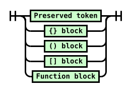

Diagram text: Preserved token {} block () block \[\] block Function block

<a id="{}-block-diagram"></a>{} block  
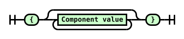

Diagram text: { Component value }

<a id="()-block-diagram"></a>() block  
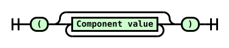

Diagram text: ( Component value )

<a id="[]-block-diagram"></a>\[\] block  


Diagram text: \[ Component value \]

<a id="function-block-diagram"></a>Function block  
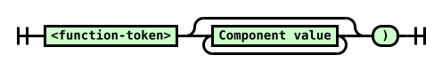

Diagram text: \<function-token\> Component value )

### <a id="parser-definitions"></a>5.2.  Definitions

<a id="current-input-token"></a>current input token

<a id="ref-for-component-value"></a>

The token or [component value](#component-value) currently being operated on, from the list of tokens produced by the tokenizer.

<a id="next-input-token"></a>next input token

<a id="ref-for-typedef-eof-token②"></a>

<a id="ref-for-next-input-token"></a>

<a id="ref-for-current-input-token"></a>

<a id="ref-for-component-value①"></a>

The token or [component value](#component-value) following the [current input token](#current-input-token) in the list of tokens produced by the tokenizer. If there isn’t a token following the <a id="ref-for-current-input-token①"></a>current input token, the [next input token](#next-input-token) is an [\<EOF-token\>](#typedef-eof-token).

<a id="ref-for-typedef-eof-token③"></a>

<a id="typedef-eof-token"></a>[\<EOF-token\>](#typedef-eof-token)

<a id="ref-for-typedef-eof-token④"></a>

<a id="ref-for-next-input-token①"></a>

A conceptual token representing the end of the list of tokens. Whenever the list of tokens is empty, the [next input token](#next-input-token) is always an [\<EOF-token\>](#typedef-eof-token).

<a id="consume-the-next-input-token"></a>consume the next input token

<a id="ref-for-next-input-token②"></a>

<a id="ref-for-current-input-token②"></a>

Let the [current input token](#current-input-token) be the current [next input token](#next-input-token), adjusting the <a id="ref-for-next-input-token③"></a>next input token accordingly.

<a id="reconsume-the-current-input-token"></a>reconsume the current input token

<a id="ref-for-current-input-token③"></a>

<a id="ref-for-consume-the-next-input-token"></a>

The next time an algorithm instructs you to [consume the next input token](#consume-the-next-input-token), instead do nothing (retain the [current input token](#current-input-token) unchanged).

### <a id="parser-entry-points"></a>5.3.  Parser Entry Points

The algorithms defined in this section produce high-level CSS objects from lists of CSS tokens.

The algorithms here are operate on a token stream as input, but for convenience can also be invoked with a number of other value types.

To <a id="normalize-into-a-token-stream"></a>normalize into a token stream a given <var>input</var>:

1.  If <var>input</var> is a list of CSS tokens, return <var>input</var>.

2.  If <var>input</var> is a list of CSS component values, return <var>input</var>.

    > <strong data-conversion-semantic="note">Note</strong>
    >
    > Note: The only difference between a list of tokens and a list of component values is that some objects that "contain" things, like functions or blocks, are a single entity in the component-value list, but are multiple entities in a token list. This makes no difference to any of the algorithms in this specification.

3.  <a id="ref-for-string"></a>

    <a id="ref-for-css-filter-code-points①"></a>

    <a id="ref-for-css-tokenize"></a>

    If <var>input</var> is a [string](https://infra.spec.whatwg.org/#string), then [filter code points](#css-filter-code-points) from <var>input</var>, [tokenize](#css-tokenize) the result, and return the final result.

4.  Assert: Only the preceding types should be passed as <var>input</var>.

> <strong data-conversion-semantic="note">Note</strong>
>
> Note: Other specs can define additional entry points for their own purposes.

> <strong data-conversion-semantic="note">Note</strong>
>
> The following notes should probably be translated into normative text in the relevant specs, hooking this spec’s terms:
>
> - <a id="ref-for-parse-a-stylesheet"></a>
>
>   "[Parse a stylesheet](#parse-a-stylesheet)" is intended to be the normal parser entry point, for parsing stylesheets.
>
> - <a id="ref-for-typedef-cdc-token②"></a>
>
>   <a id="ref-for-typedef-cdo-token②"></a>
>
>   <a id="ref-for-parse-a-stylesheet①"></a>
>
>   <a id="ref-for-at-ruledef-media②"></a>
>
>   <a id="ref-for-parse-a-list-of-rules"></a>
>
>   "[Parse a list of rules](#parse-a-list-of-rules)" is intended for the content of at-rules such as [@media](https://www.w3.org/TR/css3-conditional/#at-ruledef-media). It differs from "[Parse a stylesheet](#parse-a-stylesheet)" in the handling of [\<CDO-token\>](#typedef-cdo-token) and [\<CDC-token\>](#typedef-cdc-token).
>
> - <a id="ref-for-parse-a-rule"></a>
>
>   "[Parse a rule](#parse-a-rule)" is intended for use by the `CSSStyleSheet#insertRule` method, and similar functions which might exist, which parse text into a single rule.
>
> - <a id="ref-for-at-ruledef-supports"></a>
>
>   <a id="ref-for-parse-a-declaration"></a>
>
>   "[Parse a declaration](#parse-a-declaration)" is used in [@supports](https://www.w3.org/TR/css3-conditional/#at-ruledef-supports) conditions. [\[CSS3-CONDITIONAL\]](#biblio-css3-conditional)
>
> - <a id="ref-for-parse-a-list-of-declarations①"></a>
>
>   "[Parse a list of declarations](#parse-a-list-of-declarations)" is for the contents of a `style` attribute, which parses text into the contents of a single style rule.
>
> - <a id="ref-for-funcdef-attr"></a>
>
>   <a id="ref-for-parse-a-component-value"></a>
>
>   "[Parse a component value](#parse-a-component-value)" is for things that need to consume a single value, like the parsing rules for [attr()](https://www.w3.org/TR/css-values-3/#funcdef-attr).
>
> - <a id="ref-for-parse-a-list-of-component-values"></a>
>
>   "[Parse a list of component values](#parse-a-list-of-component-values)" is for the contents of presentational attributes, which parse text into a single declaration’s value, or for parsing a stand-alone selector [\[SELECT\]](#biblio-select) or list of Media Queries [\[MEDIAQ\]](#biblio-mediaq), as in [Selectors API](https://www.w3.org/TR/selectors-api/) or the `media` HTML attribute.

#### <a id="parse-grammar"></a>5.3.1.  Parse something according to a CSS grammar

<a id="ref-for-typedef-color"></a>

It is often desirable to parse a string or token list to see if it matches some CSS grammar, and if it does, to destructure it according to the grammar. This section provides a generic hook for this kind of operation. It should be invoked like "parse <var>foo</var> as a CSS [\<color\>](https://www.w3.org/TR/css-color-4/#typedef-color)", or similar.

<a id="ref-for-string-value"></a>

This algorithm returns either failure, if the input does not match the provided grammar, or the result of parsing the input according to the grammar, which is an unspecified structure corresponding to the provided grammar specification. The return value must only be interacted with by specification prose, where the representation ambiguity is not problematic. If it is meant to be exposed outside of spec language, the spec using the result must explicitly translate it into a well-specified representation, such as, for example, by invoking a CSS serialization algorithm (like "serialize as a CSS [\<string\>](https://www.w3.org/TR/css-values-4/#string-value) value").

<a id="ref-for-css-parse-a-comma-separated-list-according-to-a-css-grammar"></a>

> <strong data-conversion-semantic="note">Note</strong>
>
> Note: This algorithm, and [parse a comma-separated list according to a CSS grammar](#css-parse-a-comma-separated-list-according-to-a-css-grammar), are <em>usually</em> the only parsing algorithms other specs will want to call. The remaining parsing algorithms are meant mostly for [\[CSSOM\]](#biblio-cssom) and related "explicitly constructing CSS structures" cases. Consult the CSSWG for guidance first if you think you need to use one of the other algorithms.

<a id="ref-for-css-parse-something-according-to-a-css-grammar"></a>

To <a id="css-parse-something-according-to-a-css-grammar"></a>parse something according to a CSS grammar (aka simply [parse](#css-parse-something-according-to-a-css-grammar)) given an <var>input</var> and a CSS <var>grammar</var> production:

1.  <a id="ref-for-normalize-into-a-token-stream"></a>

    [Normalize](#normalize-into-a-token-stream) <var>input</var>, and set <var>input</var> to the result.

2.  <a id="ref-for-parse-a-list-of-component-values①"></a>

    [Parse a list of component values](#parse-a-list-of-component-values) from <var>input</var>, and let <var>result</var> be the return value.

3.  Attempt to match <var>result</var> against <var>grammar</var>. If this is successful, return the matched result; otherwise, return failure.

#### <a id="parse-comma-list"></a>5.3.2.  Parse A Comma-Separated List According To A CSS Grammar

<a id="ref-for-css-parse-something-according-to-a-css-grammar①"></a>

While one can definitely [parse](#css-parse-something-according-to-a-css-grammar) a value according to a grammar with commas in it, if <em>any</em> part of the value fails to parse, the entire thing doesn’t parse, and returns failure.

<a id="ref-for-attr-img-sizes"></a>

Sometimes that’s what’s desired (such as in list-valued CSS properties); other times, it’s better to let each comma-separated sub-part of the value parse separately, dealing with the parts that parse successfully one way, and the parts that fail to parse another way (typically ignoring them, such as in <code><a href="https://html.spec.whatwg.org/multipage/embedded-content.html#attr-img-sizes">&lt;img sizes&gt;</a></code>).

<a id="ref-for-css-parse-something-according-to-a-css-grammar②"></a>

This algorithm provides an easy hook to accomplish exactly that. It returns a list of values split by "top-level" commas, where each values is either failure (if it failed to parse) or the result of parsing (an unspecified structure, as described in the [parse](#css-parse-something-according-to-a-css-grammar) algorithm).

<a id="ref-for-css-parse-a-comma-separated-list-according-to-a-css-grammar①"></a>

To <a id="css-parse-a-comma-separated-list-according-to-a-css-grammar"></a>parse a comma-separated list according to a CSS grammar (aka [parse a list](#css-parse-a-comma-separated-list-according-to-a-css-grammar)) given an <var>input</var> and a CSS <var>grammar</var> production:

1.  <a id="ref-for-normalize-into-a-token-stream①"></a>

    [Normalize](#normalize-into-a-token-stream) <var>input</var>, and set <var>input</var> to the result.

2.  <a id="ref-for-list"></a>

    <a id="ref-for-typedef-whitespace-token②"></a>

    If <var>input</var> contains only [\<whitespace-token\>](#typedef-whitespace-token)s, return an empty [list](https://infra.spec.whatwg.org/#list).

3.  <a id="ref-for-parse-a-comma-separated-list-of-component-values"></a>

    [Parse a comma-separated list of component values](#parse-a-comma-separated-list-of-component-values) from <var>input</var>, and let <var>list</var> be the return value.

4.  <a id="ref-for-css-parse-something-according-to-a-css-grammar③"></a>

    <a id="ref-for-list-iterate"></a>

    [For each](https://infra.spec.whatwg.org/#list-iterate) <var>item</var> of <var>list</var>, replace <var>item</var> with the result of [parsing](#css-parse-something-according-to-a-css-grammar) <var>item</var> with <var>grammar</var>.

5.  Return <var>list</var>.

#### <a id="parse-stylesheet"></a>5.3.3.  Parse a stylesheet

<a id="ref-for-concept-url"></a>

To <a id="parse-a-stylesheet"></a>parse a stylesheet from an <var>input</var> given an optional [url](https://url.spec.whatwg.org/#concept-url) <var>location</var>:

1.  <a id="ref-for-css-decode-bytes"></a>

    If <var>input</var> is a byte stream for stylesheet, [decode bytes](#css-decode-bytes) from <var>input</var>, and set <var>input</var> to the result.

2.  <a id="ref-for-normalize-into-a-token-stream②"></a>

    [Normalize](#normalize-into-a-token-stream) <var>input</var>, and set <var>input</var> to the result.

3.  <a id="ref-for-concept-css-style-sheet-location"></a>

    Create a new stylesheet, with its [location](https://www.w3.org/TR/cssom-1/#concept-css-style-sheet-location) set to <var>location</var> (or null, if <var>location</var> was not passed).

4.  <a id="ref-for-consume-a-list-of-rules"></a>

    [Consume a list of rules](#consume-a-list-of-rules) from <var>input</var>, with the <var>top-level flag</var> set, and set the stylesheet’s value to the result.

5.  Return the stylesheet.

#### <a id="parse-list-of-rules"></a>5.3.4.  Parse a list of rules

To <a id="parse-a-list-of-rules"></a>parse a list of rules from <var>input</var>:

1.  <a id="ref-for-normalize-into-a-token-stream③"></a>

    [Normalize](#normalize-into-a-token-stream) <var>input</var>, and set <var>input</var> to the result.

2.  <a id="ref-for-consume-a-list-of-rules①"></a>

    [Consume a list of rules](#consume-a-list-of-rules) from the <var>input</var>, with the <var>top-level flag</var> unset.

3.  Return the returned list.

#### <a id="parse-rule"></a>5.3.5.  Parse a rule

To <a id="parse-a-rule"></a>parse a rule from <var>input</var>:

1.  <a id="ref-for-normalize-into-a-token-stream④"></a>

    [Normalize](#normalize-into-a-token-stream) <var>input</var>, and set <var>input</var> to the result.

2.  <a id="ref-for-consume-the-next-input-token①"></a>

    <a id="ref-for-typedef-whitespace-token③"></a>

    <a id="ref-for-next-input-token④"></a>

    While the [next input token](#next-input-token) from <var>input</var> is a [\<whitespace-token\>](#typedef-whitespace-token), [consume the next input token](#consume-the-next-input-token) from <var>input</var>.

3.  <a id="ref-for-typedef-eof-token⑤"></a>

    <a id="ref-for-next-input-token⑤"></a>

    If the [next input token](#next-input-token) from <var>input</var> is an [\<EOF-token\>](#typedef-eof-token), return a syntax error.

    <a id="ref-for-next-input-token⑥"></a>

    <a id="ref-for-typedef-at-keyword-token⑤"></a>

    <a id="ref-for-consume-an-at-rule"></a>

    Otherwise, if the [next input token](#next-input-token) from <var>input</var> is an [\<at-keyword-token\>](#typedef-at-keyword-token), [consume an at-rule](#consume-an-at-rule) from <var>input</var>, and let <var>rule</var> be the return value.

    <a id="ref-for-consume-a-qualified-rule"></a>

    Otherwise, [consume a qualified rule](#consume-a-qualified-rule) from <var>input</var> and let <var>rule</var> be the return value. If nothing was returned, return a syntax error.

4.  <a id="ref-for-consume-the-next-input-token②"></a>

    <a id="ref-for-typedef-whitespace-token④"></a>

    <a id="ref-for-next-input-token⑦"></a>

    While the [next input token](#next-input-token) from <var>input</var> is a [\<whitespace-token\>](#typedef-whitespace-token), [consume the next input token](#consume-the-next-input-token) from <var>input</var>.

5.  <a id="ref-for-typedef-eof-token⑥"></a>

    <a id="ref-for-next-input-token⑧"></a>

    If the [next input token](#next-input-token) from <var>input</var> is an [\<EOF-token\>](#typedef-eof-token), return <var>rule</var>. Otherwise, return a syntax error.

#### <a id="parse-declaration"></a>5.3.6.  Parse a declaration

<a id="ref-for-parse-a-list-of-declarations②"></a>

> <strong data-conversion-semantic="note">Note</strong>
>
> Note: Unlike "[Parse a list of declarations](#parse-a-list-of-declarations)", this parses only a declaration and not an at-rule.

To <a id="parse-a-declaration"></a>parse a declaration from <var>input</var>:

1.  <a id="ref-for-normalize-into-a-token-stream⑤"></a>

    [Normalize](#normalize-into-a-token-stream) <var>input</var>, and set <var>input</var> to the result.

2.  <a id="ref-for-consume-the-next-input-token③"></a>

    <a id="ref-for-typedef-whitespace-token⑤"></a>

    <a id="ref-for-next-input-token⑨"></a>

    While the [next input token](#next-input-token) from <var>input</var> is a [\<whitespace-token\>](#typedef-whitespace-token), [consume the next input token](#consume-the-next-input-token).

3.  <a id="ref-for-typedef-ident-token⑥"></a>

    <a id="ref-for-next-input-token①⓪"></a>

    If the [next input token](#next-input-token) from <var>input</var> is not an [\<ident-token\>](#typedef-ident-token), return a syntax error.

4.  <a id="ref-for-consume-a-declaration"></a>

    [Consume a declaration](#consume-a-declaration) from <var>input</var>. If anything was returned, return it. Otherwise, return a syntax error.

#### <a id="parse-style-blocks-contents"></a>5.3.7.  Parse a style block’s contents

<a id="ref-for-style-rule②"></a>

<a id="ref-for-at-rule①④"></a>

<a id="ref-for-at-ruledef-page①"></a>

<a id="ref-for-at-ruledef-keyframes"></a>

<a id="ref-for-parse-a-list-of-declarations③"></a>

> <strong data-conversion-semantic="note">Note</strong>
>
> Note: This algorithm parses the contents of [style rules](#style-rule), which need to allow <em>nested</em> style rules and other [at-rules](#at-rule). If you don’t need nested <a id="ref-for-style-rule③"></a>style rules, such as in [@page](https://www.w3.org/TR/css-page-3/#at-ruledef-page) or in [@keyframes](https://www.w3.org/TR/css-animations-1/#at-ruledef-keyframes) child rules, use [parse a list of declarations](#parse-a-list-of-declarations).

To <a id="parse-a-style-blocks-contents"></a>parse a style block’s contents from <var>input</var>:

1.  <a id="ref-for-normalize-into-a-token-stream⑥"></a>

    [Normalize](#normalize-into-a-token-stream) <var>input</var>, and set <var>input</var> to the result.

2.  <a id="ref-for-consume-a-style-blocks-contents"></a>

    [Consume a style block’s contents](#consume-a-style-blocks-contents) from <var>input</var>, and return the result.

#### <a id="parse-list-of-declarations"></a>5.3.8.  Parse a list of declarations

<a id="ref-for-at-ruledef-page②"></a>

> <strong data-conversion-semantic="note">Note</strong>
>
> Note: Despite the name, this actually parses a mixed list of declarations and at-rules, as CSS 2.1 does for [@page](https://www.w3.org/TR/css-page-3/#at-ruledef-page). Unexpected at-rules (which could be all of them, in a given context) are invalid and will be ignored by the consumer.

<a id="ref-for-style-rule④"></a>

<a id="ref-for-parse-a-style-blocks-contents"></a>

> <strong data-conversion-semantic="note">Note</strong>
>
> Note: This algorithm does not handle nested [style rules](#style-rule). If your use requires that, use [parse a style block’s contents](#parse-a-style-blocks-contents).

To <a id="parse-a-list-of-declarations"></a>parse a list of declarations from <var>input</var>:

1.  <a id="ref-for-normalize-into-a-token-stream⑦"></a>

    [Normalize](#normalize-into-a-token-stream) <var>input</var>, and set <var>input</var> to the result.

2.  <a id="ref-for-consume-a-list-of-declarations"></a>

    [Consume a list of declarations](#consume-a-list-of-declarations) from <var>input</var>, and return the result.

#### <a id="parse-component-value"></a>5.3.9.  Parse a component value

To <a id="parse-a-component-value"></a>parse a component value from <var>input</var>:

1.  <a id="ref-for-normalize-into-a-token-stream⑧"></a>

    [Normalize](#normalize-into-a-token-stream) <var>input</var>, and set <var>input</var> to the result.

2.  <a id="ref-for-consume-the-next-input-token④"></a>

    <a id="ref-for-typedef-whitespace-token⑥"></a>

    <a id="ref-for-next-input-token①①"></a>

    While the [next input token](#next-input-token) from <var>input</var> is a [\<whitespace-token\>](#typedef-whitespace-token), [consume the next input token](#consume-the-next-input-token) from <var>input</var>.

3.  <a id="ref-for-typedef-eof-token⑦"></a>

    <a id="ref-for-next-input-token①②"></a>

    If the [next input token](#next-input-token) from <var>input</var> is an [\<EOF-token\>](#typedef-eof-token), return a syntax error.

4.  <a id="ref-for-consume-a-component-value"></a>

    [Consume a component value](#consume-a-component-value) from <var>input</var> and let <var>value</var> be the return value.

5.  <a id="ref-for-consume-the-next-input-token⑤"></a>

    <a id="ref-for-typedef-whitespace-token⑦"></a>

    <a id="ref-for-next-input-token①③"></a>

    While the [next input token](#next-input-token) from <var>input</var> is a [\<whitespace-token\>](#typedef-whitespace-token), [consume the next input token](#consume-the-next-input-token).

6.  <a id="ref-for-typedef-eof-token⑧"></a>

    <a id="ref-for-next-input-token①④"></a>

    If the [next input token](#next-input-token) from <var>input</var> is an [\<EOF-token\>](#typedef-eof-token), return <var>value</var>. Otherwise, return a syntax error.

#### <a id="parse-list-of-component-values"></a>5.3.10.  Parse a list of component values

To <a id="parse-a-list-of-component-values"></a>parse a list of component values from <var>input</var>:

1.  <a id="ref-for-normalize-into-a-token-stream⑨"></a>

    [Normalize](#normalize-into-a-token-stream) <var>input</var>, and set <var>input</var> to the result.

2.  <a id="ref-for-typedef-eof-token⑨"></a>

    <a id="ref-for-consume-a-component-value①"></a>

    Repeatedly [consume a component value](#consume-a-component-value) from <var>input</var> until an [\<EOF-token\>](#typedef-eof-token) is returned, appending the returned values (except the final <a id="ref-for-typedef-eof-token①⓪"></a>\<EOF-token\>) into a list. Return the list.

#### <a id="parse-comma-separated-list-of-component-values"></a>5.3.11.  Parse a comma-separated list of component values

To <a id="parse-a-comma-separated-list-of-component-values"></a>parse a comma-separated list of component values from <var>input</var>:

1.  <a id="ref-for-normalize-into-a-token-stream①⓪"></a>

    [Normalize](#normalize-into-a-token-stream) <var>input</var>, and set <var>input</var> to the result.

2.  Let <var>list of cvls</var> be an initially empty list of component value lists.

3.  <a id="ref-for-typedef-comma-token①"></a>

    <a id="ref-for-typedef-eof-token①①"></a>

    <a id="ref-for-consume-a-component-value②"></a>

    Repeatedly [consume a component value](#consume-a-component-value) from <var>input</var> until an [\<EOF-token\>](#typedef-eof-token) or [\<comma-token\>](#typedef-comma-token) is returned, appending the returned values (except the final <a id="ref-for-typedef-eof-token①②"></a>\<EOF-token\> or <a id="ref-for-typedef-comma-token②"></a>\<comma-token\>) into a list. Append the list to <var>list of cvls</var>.

    <a id="ref-for-typedef-comma-token③"></a>

    If it was a [\<comma-token\>](#typedef-comma-token) that was returned, repeat this step.

4.  Return <var>list of cvls</var>.

### <a id="parser-algorithms"></a>5.4.  Parser Algorithms

The following algorithms comprise the parser. They are called by the parser entry points above.

<a id="ref-for-function①"></a>

<a id="ref-for-simple-block②"></a>

<a id="ref-for-typedef-eof-token①③"></a>

These algorithms may be called with a list of either tokens or of component values. (The difference being that some tokens are replaced by [functions](#function) and [simple blocks](#simple-block) in a list of component values.) Similar to how the input stream returned EOF code points to represent when it was empty during the tokenization stage, the lists in this stage must return an [\<EOF-token\>](#typedef-eof-token) when the next token is requested but they are empty.

<a id="ref-for-typedef-eof-token①④"></a>

An algorithm may be invoked with a specific list, in which case it consumes only that list (and when that list is exhausted, it begins returning [\<EOF-token\>](#typedef-eof-token)s). Otherwise, it is implicitly invoked with the same list as the invoking algorithm.

#### <a id="consume-list-of-rules"></a>5.4.1.  Consume a list of rules

To <a id="consume-a-list-of-rules"></a>consume a list of rules, given a <var>top-level flag</var>:

Create an initially empty list of rules.

<a id="ref-for-next-input-token①⑤"></a>

Repeatedly consume the [next input token](#next-input-token):

<a id="ref-for-typedef-whitespace-token⑧"></a>

[\<whitespace-token\>](#typedef-whitespace-token)

Do nothing.

<a id="ref-for-typedef-eof-token①⑤"></a>

[\<EOF-token\>](#typedef-eof-token)

Return the list of rules.

<a id="ref-for-typedef-cdo-token③"></a>

[\<CDO-token\>](#typedef-cdo-token)

<a id="ref-for-typedef-cdc-token③"></a>

[\<CDC-token\>](#typedef-cdc-token)

If the <var>top-level flag</var> is set, do nothing.

<a id="ref-for-reconsume-the-current-input-token"></a>

<a id="ref-for-consume-a-qualified-rule①"></a>

Otherwise, [reconsume the current input token](#reconsume-the-current-input-token). [Consume a qualified rule](#consume-a-qualified-rule). If anything is returned, append it to the list of rules.

<a id="ref-for-typedef-at-keyword-token⑥"></a>

[\<at-keyword-token\>](#typedef-at-keyword-token)

<a id="ref-for-consume-an-at-rule①"></a>

<a id="ref-for-reconsume-the-current-input-token①"></a>

[Reconsume the current input token](#reconsume-the-current-input-token). [Consume an at-rule](#consume-an-at-rule), and append the returned value to the list of rules.

anything else

<a id="ref-for-consume-a-qualified-rule②"></a>

<a id="ref-for-reconsume-the-current-input-token②"></a>

[Reconsume the current input token](#reconsume-the-current-input-token). [Consume a qualified rule](#consume-a-qualified-rule). If anything is returned, append it to the list of rules.

#### <a id="consume-at-rule"></a>5.4.2.  Consume an at-rule

To <a id="consume-an-at-rule"></a>consume an at-rule:

<a id="ref-for-consume-the-next-input-token⑥"></a>

<a id="ref-for-current-input-token④"></a>

<a id="ref-for-list①"></a>

[Consume the next input token](#consume-the-next-input-token). Create a new at-rule with its name set to the value of the [current input token](#current-input-token), its prelude initially set to an empty [list](https://infra.spec.whatwg.org/#list), and its value initially set to nothing.

<a id="ref-for-next-input-token①⑥"></a>

Repeatedly consume the [next input token](#next-input-token):

<a id="ref-for-typedef-semicolon-token②"></a>

[\<semicolon-token\>](#typedef-semicolon-token)

Return the at-rule.

<a id="ref-for-typedef-eof-token①⑥"></a>

[\<EOF-token\>](#typedef-eof-token)

<a id="ref-for-parse-error⑨"></a>

This is a [parse error](#parse-error). Return the at-rule.

<a id="ref-for-tokendef-open-curly④"></a>

[\<{-token\>](#tokendef-open-curly)

<a id="ref-for-consume-a-simple-block"></a>

[Consume a simple block](#consume-a-simple-block) and assign it to the at-rule’s block. Return the at-rule.

<a id="ref-for-tokendef-open-curly⑤"></a>

<a id="ref-for-simple-block③"></a>

[simple block](#simple-block) with an associated token of [\<{-token\>](#tokendef-open-curly)

Assign the block to the at-rule’s block. Return the at-rule.

anything else

<a id="ref-for-consume-a-component-value③"></a>

<a id="ref-for-reconsume-the-current-input-token③"></a>

[Reconsume the current input token](#reconsume-the-current-input-token). [Consume a component value](#consume-a-component-value). Append the returned value to the at-rule’s prelude.

#### <a id="consume-qualified-rule"></a>5.4.3.  Consume a qualified rule

To <a id="consume-a-qualified-rule"></a>consume a qualified rule:

<a id="ref-for-list②"></a>

Create a new qualified rule with its prelude initially set to an empty [list](https://infra.spec.whatwg.org/#list), and its value initially set to nothing.

<a id="ref-for-next-input-token①⑦"></a>

Repeatedly consume the [next input token](#next-input-token):

<a id="ref-for-typedef-eof-token①⑦"></a>

[\<EOF-token\>](#typedef-eof-token)

<a id="ref-for-parse-error①⓪"></a>

This is a [parse error](#parse-error). Return nothing.

<a id="ref-for-tokendef-open-curly⑥"></a>

[\<{-token\>](#tokendef-open-curly)

<a id="ref-for-consume-a-simple-block①"></a>

[Consume a simple block](#consume-a-simple-block) and assign it to the qualified rule’s block. Return the qualified rule.

<a id="ref-for-tokendef-open-curly⑦"></a>

<a id="ref-for-simple-block④"></a>

[simple block](#simple-block) with an associated token of [\<{-token\>](#tokendef-open-curly)

Assign the block to the qualified rule’s block. Return the qualified rule.

anything else

<a id="ref-for-consume-a-component-value④"></a>

<a id="ref-for-reconsume-the-current-input-token④"></a>

[Reconsume the current input token](#reconsume-the-current-input-token). [Consume a component value](#consume-a-component-value). Append the returned value to the qualified rule’s prelude.

#### <a id="consume-style-block"></a>5.4.4.  Consume a style block’s contents

To <a id="consume-a-style-blocks-contents"></a>consume a style block’s contents:

<a id="ref-for-list③"></a>

Create an initially empty [list](https://infra.spec.whatwg.org/#list) of declarations <var>decls</var>, and an initially empty <a id="ref-for-list④"></a>list of rules <var>rules</var>.

<a id="ref-for-next-input-token①⑧"></a>

Repeatedly consume the [next input token](#next-input-token):

<a id="ref-for-typedef-whitespace-token⑨"></a>

[\<whitespace-token\>](#typedef-whitespace-token)

<a id="ref-for-typedef-semicolon-token③"></a>

[\<semicolon-token\>](#typedef-semicolon-token)

Do nothing.

<a id="ref-for-typedef-eof-token①⑧"></a>

[\<EOF-token\>](#typedef-eof-token)

<a id="ref-for-list-extend"></a>

[Extend](https://infra.spec.whatwg.org/#list-extend) <var>decls</var> with <var>rules</var>, then return <var>decls</var>.

<a id="ref-for-typedef-at-keyword-token⑦"></a>

[\<at-keyword-token\>](#typedef-at-keyword-token)

<a id="ref-for-consume-an-at-rule②"></a>

<a id="ref-for-reconsume-the-current-input-token⑤"></a>

[Reconsume the current input token](#reconsume-the-current-input-token). [Consume an at-rule](#consume-an-at-rule), and append the result to <var>rules</var>.

<a id="ref-for-typedef-ident-token⑦"></a>

[\<ident-token\>](#typedef-ident-token)

<a id="ref-for-consume-a-declaration①"></a>

<a id="ref-for-consume-a-component-value⑤"></a>

<a id="ref-for-typedef-eof-token①⑨"></a>

<a id="ref-for-typedef-semicolon-token④"></a>

<a id="ref-for-next-input-token①⑨"></a>

<a id="ref-for-current-input-token⑤"></a>

Initialize a temporary list initially filled with the [current input token](#current-input-token). As long as the [next input token](#next-input-token) is anything other than a [\<semicolon-token\>](#typedef-semicolon-token) or [\<EOF-token\>](#typedef-eof-token), [consume a component value](#consume-a-component-value) and append it to the temporary list. [Consume a declaration](#consume-a-declaration) from the temporary list. If anything was returned, append it to <var>decls</var>.

<a id="ref-for-typedef-delim-token⑨"></a>

[\<delim-token\>](#typedef-delim-token) with a value of "&#x26;" (U+0026 AMPERSAND)

<a id="ref-for-consume-a-qualified-rule③"></a>

<a id="ref-for-reconsume-the-current-input-token⑥"></a>

[Reconsume the current input token](#reconsume-the-current-input-token). [Consume a qualified rule](#consume-a-qualified-rule). If anything was returned, append it to <var>rules</var>.

anything else

<a id="ref-for-consume-a-component-value⑥"></a>

<a id="ref-for-typedef-eof-token②⓪"></a>

<a id="ref-for-typedef-semicolon-token⑤"></a>

<a id="ref-for-next-input-token②⓪"></a>

<a id="ref-for-reconsume-the-current-input-token⑦"></a>

<a id="ref-for-parse-error①①"></a>

This is a [parse error](#parse-error). [Reconsume the current input token](#reconsume-the-current-input-token). As long as the [next input token](#next-input-token) is anything other than a [\<semicolon-token\>](#typedef-semicolon-token) or [\<EOF-token\>](#typedef-eof-token), [consume a component value](#consume-a-component-value) and throw away the returned value.

#### <a id="consume-list-of-declarations"></a>5.4.5.  Consume a list of declarations

To <a id="consume-a-list-of-declarations"></a>consume a list of declarations:

Create an initially empty list of declarations.

<a id="ref-for-next-input-token②①"></a>

Repeatedly consume the [next input token](#next-input-token):

<a id="ref-for-typedef-whitespace-token①⓪"></a>

[\<whitespace-token\>](#typedef-whitespace-token)

<a id="ref-for-typedef-semicolon-token⑥"></a>

[\<semicolon-token\>](#typedef-semicolon-token)

Do nothing.

<a id="ref-for-typedef-eof-token②①"></a>

[\<EOF-token\>](#typedef-eof-token)

Return the list of declarations.

<a id="ref-for-typedef-at-keyword-token⑧"></a>

[\<at-keyword-token\>](#typedef-at-keyword-token)

<a id="ref-for-consume-an-at-rule③"></a>

<a id="ref-for-reconsume-the-current-input-token⑧"></a>

[Reconsume the current input token](#reconsume-the-current-input-token). [Consume an at-rule](#consume-an-at-rule). Append the returned rule to the list of declarations.

<a id="ref-for-typedef-ident-token⑧"></a>

[\<ident-token\>](#typedef-ident-token)

<a id="ref-for-consume-a-declaration②"></a>

<a id="ref-for-consume-a-component-value⑦"></a>

<a id="ref-for-typedef-eof-token②②"></a>

<a id="ref-for-typedef-semicolon-token⑦"></a>

<a id="ref-for-next-input-token②②"></a>

<a id="ref-for-current-input-token⑥"></a>

Initialize a temporary list initially filled with the [current input token](#current-input-token). As long as the [next input token](#next-input-token) is anything other than a [\<semicolon-token\>](#typedef-semicolon-token) or [\<EOF-token\>](#typedef-eof-token), [consume a component value](#consume-a-component-value) and append it to the temporary list. [Consume a declaration](#consume-a-declaration) from the temporary list. If anything was returned, append it to the list of declarations.

anything else

<a id="ref-for-consume-a-component-value⑧"></a>

<a id="ref-for-typedef-eof-token②③"></a>

<a id="ref-for-typedef-semicolon-token⑧"></a>

<a id="ref-for-next-input-token②③"></a>

<a id="ref-for-reconsume-the-current-input-token⑨"></a>

<a id="ref-for-parse-error①②"></a>

This is a [parse error](#parse-error). [Reconsume the current input token](#reconsume-the-current-input-token). As long as the [next input token](#next-input-token) is anything other than a [\<semicolon-token\>](#typedef-semicolon-token) or [\<EOF-token\>](#typedef-eof-token), [consume a component value](#consume-a-component-value) and throw away the returned value.

#### <a id="consume-declaration"></a>5.4.6.  Consume a declaration

<a id="ref-for-next-input-token②④"></a>

<a id="ref-for-typedef-ident-token⑨"></a>

> <strong data-conversion-semantic="note">Note</strong>
>
> Note: This algorithm assumes that the [next input token](#next-input-token) has already been checked to be an [\<ident-token\>](#typedef-ident-token).

To <a id="consume-a-declaration"></a>consume a declaration:

<a id="ref-for-consume-the-next-input-token⑦"></a>

<a id="ref-for-current-input-token⑦"></a>

<a id="ref-for-list⑤"></a>

[Consume the next input token](#consume-the-next-input-token). Create a new declaration with its name set to the value of the [current input token](#current-input-token) and its value initially set to an empty [list](https://infra.spec.whatwg.org/#list).

1.  <a id="ref-for-consume-the-next-input-token⑧"></a>

    <a id="ref-for-typedef-whitespace-token①①"></a>

    <a id="ref-for-next-input-token②⑤"></a>

    While the [next input token](#next-input-token) is a [\<whitespace-token\>](#typedef-whitespace-token), [consume the next input token](#consume-the-next-input-token).

2.  <a id="ref-for-parse-error①③"></a>

    <a id="ref-for-typedef-colon-token①"></a>

    <a id="ref-for-next-input-token②⑥"></a>

    If the [next input token](#next-input-token) is anything other than a [\<colon-token\>](#typedef-colon-token), this is a [parse error](#parse-error). Return nothing.

    <a id="ref-for-consume-the-next-input-token⑨"></a>

    Otherwise, [consume the next input token](#consume-the-next-input-token).

3.  <a id="ref-for-consume-the-next-input-token①⓪"></a>

    <a id="ref-for-typedef-whitespace-token①②"></a>

    <a id="ref-for-next-input-token②⑦"></a>

    While the [next input token](#next-input-token) is a [\<whitespace-token\>](#typedef-whitespace-token), [consume the next input token](#consume-the-next-input-token).

4.  <a id="ref-for-consume-a-component-value⑨"></a>

    <a id="ref-for-typedef-eof-token②④"></a>

    <a id="ref-for-next-input-token②⑧"></a>

    As long as the [next input token](#next-input-token) is anything other than an [\<EOF-token\>](#typedef-eof-token), [consume a component value](#consume-a-component-value) and append it to the declaration’s value.

5.  <a id="ref-for-ascii-case-insensitive①"></a>

    <a id="ref-for-typedef-ident-token①⓪"></a>

    <a id="ref-for-typedef-delim-token①⓪"></a>

    <a id="ref-for-typedef-whitespace-token①③"></a>

    If the last two non-[\<whitespace-token\>](#typedef-whitespace-token)s in the declaration’s value are a [\<delim-token\>](#typedef-delim-token) with the value "!" followed by an [\<ident-token\>](#typedef-ident-token) with a value that is an [ASCII case-insensitive](https://infra.spec.whatwg.org/#ascii-case-insensitive) match for "important", remove them from the declaration’s value and set the declaration’s <var>important</var> flag to true.

6.  <a id="ref-for-list-remove"></a>

    <a id="ref-for-typedef-whitespace-token①④"></a>

    While the last token in the declaration’s value is a [\<whitespace-token\>](#typedef-whitespace-token), [remove](https://infra.spec.whatwg.org/#list-remove) that token.

7.  Return the declaration.

#### <a id="consume-component-value"></a>5.4.7.  Consume a component value

To <a id="consume-a-component-value"></a>consume a component value:

<a id="ref-for-consume-the-next-input-token①①"></a>

[Consume the next input token](#consume-the-next-input-token).

<a id="ref-for-current-input-token⑧"></a>

<a id="ref-for-tokendef-open-curly⑧"></a>

<a id="ref-for-tokendef-open-square③"></a>

<a id="ref-for-tokendef-open-paren③"></a>

<a id="ref-for-consume-a-simple-block②"></a>

If the [current input token](#current-input-token) is a [\<{-token\>](#tokendef-open-curly), [\<\[-token\>](#tokendef-open-square), or [\<(-token\>](#tokendef-open-paren), [consume a simple block](#consume-a-simple-block) and return it.

<a id="ref-for-current-input-token⑨"></a>

<a id="ref-for-typedef-function-token⑧"></a>

<a id="ref-for-consume-a-function"></a>

Otherwise, if the [current input token](#current-input-token) is a [\<function-token\>](#typedef-function-token), [consume a function](#consume-a-function) and return it.

<a id="ref-for-current-input-token①⓪"></a>

Otherwise, return the [current input token](#current-input-token).

#### <a id="consume-simple-block"></a>5.4.8.  Consume a simple block

<a id="ref-for-current-input-token①①"></a>

<a id="ref-for-tokendef-open-curly⑨"></a>

<a id="ref-for-tokendef-open-square④"></a>

<a id="ref-for-tokendef-open-paren④"></a>

> <strong data-conversion-semantic="note">Note</strong>
>
> Note: This algorithm assumes that the [current input token](#current-input-token) has already been checked to be an [\<{-token\>](#tokendef-open-curly), [\<\[-token\>](#tokendef-open-square), or [\<(-token\>](#tokendef-open-paren).

To <a id="consume-a-simple-block"></a>consume a simple block:

<a id="ref-for-current-input-token①②"></a>

<a id="ref-for-tokendef-open-square⑤"></a>

<a id="ref-for-ending-token"></a>

<a id="ref-for-tokendef-close-square②"></a>

The <a id="ending-token"></a>ending token is the mirror variant of the [current input token](#current-input-token). (E.g. if it was called with [\<\[-token\>](#tokendef-open-square), the [ending token](#ending-token) is [\<\]-token\>](#tokendef-close-square).)

<a id="ref-for-simple-block⑤"></a>

<a id="ref-for-current-input-token①③"></a>

<a id="ref-for-list⑥"></a>

Create a [simple block](#simple-block) with its associated token set to the [current input token](#current-input-token) and with its value initially set to an empty [list](https://infra.spec.whatwg.org/#list).

<a id="ref-for-next-input-token②⑨"></a>

Repeatedly consume the [next input token](#next-input-token) and process it as follows:

<a id="ref-for-ending-token①"></a>

[ending token](#ending-token)

Return the block.

<a id="ref-for-typedef-eof-token②⑤"></a>

[\<EOF-token\>](#typedef-eof-token)

<a id="ref-for-parse-error①④"></a>

This is a [parse error](#parse-error). Return the block.

anything else

<a id="ref-for-consume-a-component-value①⓪"></a>

<a id="ref-for-reconsume-the-current-input-token①⓪"></a>

[Reconsume the current input token](#reconsume-the-current-input-token). [Consume a component value](#consume-a-component-value) and append it to the value of the block.

<a id="ref-for-consume-a-list-of-declarations①"></a>

<a id="ref-for-consume-a-list-of-rules②"></a>

<a id="ref-for-typedef-declaration-list"></a>

<a id="ref-for-typedef-rule-list"></a>

<a id="ref-for-typedef-stylesheet"></a>

> <strong data-conversion-semantic="note">Note</strong>
>
> Note: CSS has an unfortunate syntactic ambiguity between blocks that can contain declarations and blocks that can contain qualified rules, so any "consume" algorithms that handle rules will initially use this more generic algorithm rather than the more specific [consume a list of declarations](#consume-a-list-of-declarations) or [consume a list of rules](#consume-a-list-of-rules) algorithms. These more specific algorithms are instead invoked when grammars are applied, depending on whether it contains a [\<declaration-list\>](#typedef-declaration-list) or a [\<rule-list\>](#typedef-rule-list)/[\<stylesheet\>](#typedef-stylesheet).

#### <a id="consume-function"></a>5.4.9.  Consume a function

<a id="ref-for-current-input-token①④"></a>

<a id="ref-for-typedef-function-token⑨"></a>

> <strong data-conversion-semantic="note">Note</strong>
>
> Note: This algorithm assumes that the [current input token](#current-input-token) has already been checked to be a [\<function-token\>](#typedef-function-token).

To <a id="consume-a-function"></a>consume a function:

<a id="ref-for-current-input-token①⑤"></a>

<a id="ref-for-list⑦"></a>

Create a function with its name equal to the value of the [current input token](#current-input-token) and with its value initially set to an empty [list](https://infra.spec.whatwg.org/#list).

<a id="ref-for-next-input-token③⓪"></a>

Repeatedly consume the [next input token](#next-input-token) and process it as follows:

<a id="ref-for-tokendef-close-paren②"></a>

[\<)-token\>](#tokendef-close-paren)

Return the function.

<a id="ref-for-typedef-eof-token②⑥"></a>

[\<EOF-token\>](#typedef-eof-token)

<a id="ref-for-parse-error①⑤"></a>

This is a [parse error](#parse-error). Return the function.

anything else

<a id="ref-for-consume-a-component-value①①"></a>

<a id="ref-for-reconsume-the-current-input-token①①"></a>

[Reconsume the current input token](#reconsume-the-current-input-token). [Consume a component value](#consume-a-component-value) and append the returned value to the function’s value.

## <a id="anb-microsyntax"></a>6.  The <var>An+B</var> microsyntax

<a id="ref-for-nth-child-pseudo"></a>

Several things in CSS, such as the [:nth-child()](https://www.w3.org/TR/selectors-4/#nth-child-pseudo) pseudoclass, need to indicate indexes in a list. The <var>An+B</var> microsyntax is useful for this, allowing an author to easily indicate single elements or all elements at regularly-spaced intervals in a list.

The <a id="anb"></a>An+B notation defines an integer step (<var>A</var>) and offset (<var>B</var>), and represents the <var>An+B</var>th elements in a list, for every positive integer or zero value of <var>n</var>, with the first element in the list having index 1 (not 0).

For values of <var>A</var> and <var>B</var> greater than 0, this effectively divides the list into groups of <var>A</var> elements (the last group taking the remainder), and selecting the <var>B</var>th element of each group.

The <var>An+B</var> notation also accepts the even and odd keywords, which have the same meaning as 2n and 2n+1, respectively.

> <strong data-conversion-semantic="example">Example</strong>
>
> <a id="example-0b8828eb"></a>
>
> Examples:
>
> ```text
> 2n+0   /* represents all of the even elements in the list */
> 
> even   /* same */
> 
> 4n+1   /* represents the 1st, 5th, 9th, 13th, etc. elements in the list */
> ```
The values of <var>A</var> and <var>B</var> can be negative, but only the positive results of <var>An+B</var>, for <var>n</var> ≥ 0, are used.

> <strong data-conversion-semantic="example">Example</strong>
>
> <a id="example-34cd21ee"></a>
>
> Example:
>
> ```text
> -1n+6   /* represents the first 6 elements of the list */
> 
> -4n+10  /* represents the 2nd, 6th, and 10th elements of the list */
> ```
If both <var>A</var> and <var>B</var> are 0, the pseudo-class represents no element in the list.

### <a id="anb-syntax"></a>6.1.  Informal Syntax Description

<em>This section is non-normative.</em>

<a id="ref-for-selectordef-adjacent"></a>

When <var>A</var> is 0, the <var>An</var> part may be omitted (unless the <var>B</var> part is already omitted). When <var>An</var> is not included and <var>B</var> is non-negative, the [+](https://www.w3.org/TR/selectors-4/#selectordef-adjacent) sign before <var>B</var> (when allowed) may also be omitted. In this case the syntax simplifies to just <var>B</var>.

> <strong data-conversion-semantic="example">Example</strong>
>
> <a id="example-335ba750"></a>
>
> Examples:
>
> ```text
> 0n+5   /* represents the 5th element in the list */
> 
> 5      /* same */
> ```
When <var>A</var> is 1 or -1, the `1` may be omitted from the rule.

> <strong data-conversion-semantic="example">Example</strong>
>
> <a id="example-5d33d659"></a>
>
> Examples:
>
> The following notations are therefore equivalent:
>
> ```text
> 1n+0   /* represents all elements in the list */
> 
> n+0    /* same */
> 
> n      /* same */
> ```
If <var>B</var> is 0, then every <var>A</var>th element is picked. In such a case, the <var>+B</var> (or <var>-B</var>) part may be omitted unless the <var>A</var> part is already omitted.

> <strong data-conversion-semantic="example">Example</strong>
>
> <a id="example-c62dcd18"></a>
>
> Examples:
>
> ```text
> 2n+0   /* represents every even element in the list */
> 
> 2n     /* same */
> ```
<a id="ref-for-selectordef-adjacent①"></a>

When B is negative, its minus sign replaces the [+](https://www.w3.org/TR/selectors-4/#selectordef-adjacent) sign.

> <strong data-conversion-semantic="example">Example</strong>
>
> <a id="example-3d25855e"></a>
>
> Valid example:
>
> ```text
> 3n-6
> ```
>
> Invalid example:
>
> ```text
> 3n + -6
> ```
<a id="ref-for-selectordef-adjacent②"></a>

Whitespace is permitted on either side of the [+](https://www.w3.org/TR/selectors-4/#selectordef-adjacent) or - that separates the <var>An</var> and <var>B</var> parts when both are present.

> <strong data-conversion-semantic="example">Example</strong>
>
> <a id="example-e61d78e8"></a>
>
> Valid Examples with white space:
>
> ```text
> 3n + 1
> 
> +3n - 2
> 
> -n+ 6
> 
> +6
> ```
>
> Invalid Examples with white space:
>
> ```text
> 3 n
> 
> + 2n
> 
> + 2
> ```
### <a id="the-anb-type"></a>6.2.  The `<an+b>` type

The <var>An+B</var> notation was originally defined using a slightly different tokenizer than the rest of CSS, resulting in a somewhat odd definition when expressed in terms of CSS tokens. This section describes how to recognize the <var>An+B</var> notation in terms of CSS tokens (thus defining the <var>&lt;an+b&gt;</var> type for CSS grammar purposes), and how to interpret the CSS tokens to obtain values for <var>A</var> and <var>B</var>.

The <var>&lt;an+b&gt;</var> type is defined (using the [Value Definition Syntax in the Values &#x26; Units spec](https://www.w3.org/TR/css3-values/#value-defs)) as:

<a id="anb-production"></a>

<a id="ref-for-mult-one-plus"></a>

<a id="ref-for-comb-one"></a>

<a id="ref-for-comb-one①"></a>

<a id="ref-for-comb-one②"></a>

<a id="ref-for-comb-one③"></a>

<a id="ref-for-mult-opt"></a>

<a id="ref-for-comb-one④"></a>

<a id="ref-for-comb-one⑤"></a>

<a id="ref-for-comb-one⑥"></a>

<a id="ref-for-mult-opt①"></a>

<a id="ref-for-comb-one⑦"></a>

<a id="ref-for-comb-one⑧"></a>

<a id="ref-for-comb-one⑨"></a>

<a id="ref-for-mult-opt②"></a>

<a id="ref-for-comb-one①⓪"></a>

<a id="ref-for-comb-one①①"></a>

<a id="ref-for-comb-one①②"></a>

<a id="ref-for-mult-opt③"></a>

<a id="ref-for-comb-one①③"></a>

<a id="ref-for-comb-one①④"></a>

<a id="ref-for-comb-one①⑤"></a>

<a id="ref-for-mult-opt④"></a>

<a id="ref-for-comb-one①⑥"></a>

<a id="ref-for-comb-one①⑦"></a>

<a id="ref-for-comb-one①⑧"></a>

```text
<an+b> =
  odd | even |
  <integer> |

  <n-dimension> |
  '+'?† n |
  -n |

  <ndashdigit-dimension> |
  '+'?† <ndashdigit-ident> |
  <dashndashdigit-ident> |

  <n-dimension> <signed-integer> |
  '+'?† n <signed-integer> |
  -n <signed-integer> |

  <ndash-dimension> <signless-integer> |
  '+'?† n- <signless-integer> |
  -n- <signless-integer> |

  <n-dimension> ['+' | '-'] <signless-integer>
  '+'?† n ['+' | '-'] <signless-integer> |
  -n ['+' | '-'] <signless-integer>
```
where:

- <a id="ref-for-ascii-case-insensitive②"></a>

  <a id="ref-for-typedef-dimension-token⑨"></a>

  <a id="typedef-n-dimension"></a>`<n-dimension>` is a [\<dimension-token\>](#typedef-dimension-token) with its type flag set to "integer", and a unit that is an [ASCII case-insensitive](https://infra.spec.whatwg.org/#ascii-case-insensitive) match for "n"

- <a id="ref-for-ascii-case-insensitive③"></a>

  <a id="ref-for-typedef-dimension-token①⓪"></a>

  <a id="typedef-ndash-dimension"></a>`<ndash-dimension>` is a [\<dimension-token\>](#typedef-dimension-token) with its type flag set to "integer", and a unit that is an [ASCII case-insensitive](https://infra.spec.whatwg.org/#ascii-case-insensitive) match for "n-"

- <a id="ref-for-digit①⑤"></a>

  <a id="ref-for-ascii-case-insensitive④"></a>

  <a id="ref-for-typedef-dimension-token①①"></a>

  <a id="typedef-ndashdigit-dimension"></a>`<ndashdigit-dimension>` is a [\<dimension-token\>](#typedef-dimension-token) with its type flag set to "integer", and a unit that is an [ASCII case-insensitive](https://infra.spec.whatwg.org/#ascii-case-insensitive) match for "n-\*", where "\*" is a series of one or more [digits](#digit)

- <a id="ref-for-digit①⑥"></a>

  <a id="ref-for-ascii-case-insensitive⑤"></a>

  <a id="ref-for-typedef-ident-token①①"></a>

  <a id="typedef-ndashdigit-ident"></a>`<ndashdigit-ident>` is an [\<ident-token\>](#typedef-ident-token) whose value is an [ASCII case-insensitive](https://infra.spec.whatwg.org/#ascii-case-insensitive) match for "n-\*", where "\*" is a series of one or more [digits](#digit)

- <a id="ref-for-digit①⑦"></a>

  <a id="ref-for-ascii-case-insensitive⑥"></a>

  <a id="ref-for-typedef-ident-token①②"></a>

  <a id="typedef-dashndashdigit-ident"></a>`<dashndashdigit-ident>` is an [\<ident-token\>](#typedef-ident-token) whose value is an [ASCII case-insensitive](https://infra.spec.whatwg.org/#ascii-case-insensitive) match for "-n-\*", where "\*" is a series of one or more [digits](#digit)

- <a id="ref-for-typedef-number-token⑤"></a>

  <a id="typedef-integer"></a>`<integer>` is a [\<number-token\>](#typedef-number-token) with its type flag set to "integer"

- <a id="ref-for-representation③"></a>

  <a id="ref-for-typedef-number-token⑥"></a>

  <a id="typedef-signed-integer"></a>`<signed-integer>` is a [\<number-token\>](#typedef-number-token) with its type flag set to "integer", and whose [representation](#representation) starts with "+" or "-"

- <a id="ref-for-digit①⑧"></a>

  <a id="ref-for-representation④"></a>

  <a id="ref-for-typedef-number-token⑦"></a>

  <a id="typedef-signless-integer"></a>`<signless-integer>` is a [\<number-token\>](#typedef-number-token) with its type flag set to "integer", and whose [representation](#representation) starts with a [digit](#digit)

<a id="anb-plus"></a> <sup>†</sup>: When a plus sign (+) precedes an ident starting with "n", as in the cases marked above, there must be no whitespace between the two tokens, or else the tokens do not match the above grammar. Whitespace is valid (and ignored) between any other two tokens.

The clauses of the production are interpreted as follows:

odd  
<var>A</var> is 2, <var>B</var> is 1.

even  
<var>A</var> is 2, <var>B</var> is 0.

<code><var>&lt;integer&gt;</var></code>  
<var>A</var> is 0, <var>B</var> is the integer’s value.

<code><var>&lt;n-dimension&gt;</var></code>  
`'+'? n`  
`-n`  
<var>A</var> is the dimension’s value, 1, or -1, respectively. <var>B</var> is 0.

<code><var>&lt;ndashdigit-dimension&gt;</var></code>  
<code>'+'? <var>&lt;ndashdigit-ident&gt;</var></code>  
<a id="ref-for-code-point⑦⑥"></a>

<var>A</var> is the dimension’s value or 1, respectively. <var>B</var> is the dimension’s unit or ident’s value, respectively, with the first [code point](https://infra.spec.whatwg.org/#code-point) removed and the remainder interpreted as a base-10 number. <strong data-conversion-semantic="note">Note:</strong> B is negative.

<code><var>&lt;dashndashdigit-ident&gt;</var></code>  
<a id="ref-for-code-point⑦⑦"></a>

<var>A</var> is -1. <var>B</var> is the ident’s value, with the first two [code points](https://infra.spec.whatwg.org/#code-point) removed and the remainder interpreted as a base-10 number. <strong data-conversion-semantic="note">Note:</strong> B is negative.

<code><var>&lt;n-dimension&gt;</var> <var>&lt;signed-integer&gt;</var></code>  
<code>'+'? n <var>&lt;signed-integer&gt;</var></code>  
<code>-n <var>&lt;signed-integer&gt;</var></code>  
<var>A</var> is the dimension’s value, 1, or -1, respectively. <var>B</var> is the integer’s value.

<code><var>&lt;ndash-dimension&gt;</var> <var>&lt;signless-integer&gt;</var></code>  
<code>'+'? n- <var>&lt;signless-integer&gt;</var></code>  
<code>-n- <var>&lt;signless-integer&gt;</var></code>  
<var>A</var> is the dimension’s value, 1, or -1, respectively. <var>B</var> is the negation of the integer’s value.

<code><var>&lt;n-dimension&gt;</var> &#x5B;'+' | '-'&#x5D; <var>&lt;signless-integer&gt;</var></code>  
<code>'+'? n &#x5B;'+' | '-'&#x5D; <var>&lt;signless-integer&gt;</var></code>  
<code>-n &#x5B;'+' | '-'&#x5D; <var>&lt;signless-integer&gt;</var></code>  
<var>A</var> is the dimension’s value, 1, or -1, respectively. <var>B</var> is the integer’s value. If a `'-'` was provided between the two, <var>B</var> is instead the negation of the integer’s value.

## <a id="urange"></a>7.  The Unicode-Range microsyntax

<a id="ref-for-descdef-font-face-unicode-range"></a>

<a id="ref-for-at-font-face-rule"></a>

Some constructs, such as the [unicode-range](https://www.w3.org/TR/css-fonts-4/#descdef-font-face-unicode-range) descriptor for the [@font-face](https://www.w3.org/TR/css-fonts-5/#at-font-face-rule) rule, need a way to describe one or more unicode code points. The <a id="typedef-urange"></a>\<urange\> production represents a range of one or more unicode code points.

<a id="ref-for-typedef-urange①"></a>

Informally, the [\<urange\>](#typedef-urange) production has three forms:

U+0001  
Defines a range consisting of a single code point, in this case the code point "1".

U+0001-00ff  
Defines a range of codepoints between the first and the second value inclusive, in this case the range between "1" and "ff" (255 in decimal) inclusive.

U+00??  
<a id="ref-for-hex-digit⑤"></a>

Defines a range of codepoints where the "?" characters range over all [hex digits](#hex-digit), in this case defining the same as the value U+0000-00ff.

In each form, a maximum of 6 digits is allowed for each hexadecimal number (if you treat "?" as a hexadecimal digit).

<a id="ref-for-typedef-urange②"></a>

### <a id="urange-syntax"></a>7.1.  The [\<urange\>](#typedef-urange) type

<a id="ref-for-typedef-urange③"></a>

<a id="ref-for-typedef-ident-token①③"></a>

The [\<urange\>](#typedef-urange) notation was originally defined as a primitive token in CSS, but it is used very rarely, and collides with legitimate [\<ident-token\>](#typedef-ident-token)s in confusing ways. This section describes how to recognize the <a id="ref-for-typedef-urange④"></a>\<urange\> notation in terms of existing CSS tokens, and how to interpret it as a range of unicode codepoints.

> <strong data-conversion-semantic="note">Note</strong>
>
> What are the confusing collisions?
>
> For example, in the CSS u + a { color: green; }, the intended meaning is that an `a` element following a `u` element should be colored green. Whitespace is not normally required between combinators and the surrounding selectors, so it <em>should</em> be equivalent to minify it to
>
> u+a{color:green;}.
>
> With any other combinator, the two pieces of CSS would be equivalent, but due to the previous existence of a specialized unicode-range token, the selector portion of the minified code now contains a unicode-range, not two idents and a combinator. It thus fails to match the Selectors grammar, and the rule is thrown out as invalid.
>
> (This example is taken from a real-world bug reported to Firefox.)

<a id="ref-for-typedef-urange⑤"></a>

> <strong data-conversion-semantic="note">Note</strong>
>
> Note: The syntax described here is intentionally very low-level, and geared toward implementors. Authors should instead read the informal syntax description in the previous section, as it contains all information necessary to use [\<urange\>](#typedef-urange), and is actually readable.

<a id="ref-for-typedef-urange⑥"></a>

The [\<urange\>](#typedef-urange) type is defined (using the [Value Definition Syntax in the Values &#x26; Units spec](https://www.w3.org/TR/css3-values/#value-defs)) as:

<a id="ref-for-typedef-urange⑦"></a>

<a id="ref-for-typedef-ident-token①④"></a>

<a id="ref-for-mult-zero-plus"></a>

<a id="ref-for-comb-one①⑨"></a>

<a id="ref-for-typedef-dimension-token①②"></a>

<a id="ref-for-mult-zero-plus①"></a>

<a id="ref-for-comb-one②⓪"></a>

<a id="ref-for-typedef-number-token⑧"></a>

<a id="ref-for-mult-zero-plus②"></a>

<a id="ref-for-comb-one②①"></a>

<a id="ref-for-typedef-number-token⑨"></a>

<a id="ref-for-typedef-dimension-token①③"></a>

<a id="ref-for-comb-one②②"></a>

<a id="ref-for-typedef-number-token①⓪"></a>

<a id="ref-for-typedef-number-token①①"></a>

<a id="ref-for-comb-one②③"></a>

<a id="ref-for-mult-one-plus①"></a>

```text
<urange> =
  u '+' <ident-token> '?'* |
  u <dimension-token> '?'* |
  u <number-token> '?'* |
  u <number-token> <dimension-token> |
  u <number-token> <number-token> |
  u '+' '?'+
```
In this production, no whitespace can occur between any of the tokens.

<a id="ref-for-typedef-urange⑧"></a>

The [\<urange\>](#typedef-urange) production represents a range of one or more contiguous unicode code points as a <var>start value</var> and an <var>end value</var>, which are non-negative integers. To interpret the production above into a range, execute the following steps in order:

1.  <a id="ref-for-representation⑤"></a>

    Skipping the first u token, concatenate the [representations](#representation) of all the tokens in the production together. Let this be <var>text</var>.

2.  <a id="ref-for-typedef-urange⑨"></a>

    If the first character of <var>text</var> is U+002B PLUS SIGN, consume it. Otherwise, this is an invalid [\<urange\>](#typedef-urange), and this algorithm must exit.

3.  <a id="ref-for-hex-digit⑥"></a>

    <a id="ref-for-code-point⑦⑧"></a>

    <a id="ref-for-typedef-urange①⓪"></a>

    Consume as many [hex digits](#hex-digit) from <var>text</var> as possible. then consume as many U+003F QUESTION MARK (?) [code points](https://infra.spec.whatwg.org/#code-point) as possible. If zero <a id="ref-for-code-point⑦⑨"></a>code points were consumed, or more than six <a id="ref-for-code-point⑧⓪"></a>code points were consumed, this is an invalid [\<urange\>](#typedef-urange), and this algorithm must exit.

    <a id="ref-for-code-point⑧①"></a>

    If any U+003F QUESTION MARK (?) [code points](https://infra.spec.whatwg.org/#code-point) were consumed, then:

    1.  <a id="ref-for-code-point⑧②"></a>

        <a id="ref-for-typedef-urange①①"></a>

        If there are any [code points](https://infra.spec.whatwg.org/#code-point) left in <var>text</var>, this is an invalid [\<urange\>](#typedef-urange), and this algorithm must exit.

    2.  <a id="ref-for-code-point⑧③"></a>

        Interpret the consumed [code points](https://infra.spec.whatwg.org/#code-point) as a hexadecimal number, with the U+003F QUESTION MARK (?) <a id="ref-for-code-point⑧④"></a>code points replaced by U+0030 DIGIT ZERO (0) <a id="ref-for-code-point⑧⑤"></a>code points. This is the <var>start value</var>.

    3.  <a id="ref-for-code-point⑧⑥"></a>

        Interpret the consumed [code points](https://infra.spec.whatwg.org/#code-point) as a hexadecimal number again, with the U+003F QUESTION MARK (?) <a id="ref-for-code-point⑧⑦"></a>code points replaced by U+0046 LATIN CAPITAL LETTER F (F) <a id="ref-for-code-point⑧⑧"></a>code points. This is the <var>end value</var>.

    4.  Exit this algorithm.

    <a id="ref-for-code-point⑧⑨"></a>

    Otherwise, interpret the consumed [code points](https://infra.spec.whatwg.org/#code-point) as a hexadecimal number. This is the <var>start value</var>.

4.  <a id="ref-for-code-point⑨⓪"></a>

    If there are no [code points](https://infra.spec.whatwg.org/#code-point) left in <var>text</var>, The <var>end value</var> is the same as the <var>start value</var>. Exit this algorithm.

5.  <a id="ref-for-code-point⑨①"></a>

    <a id="ref-for-typedef-urange①②"></a>

    If the next [code point](https://infra.spec.whatwg.org/#code-point) in <var>text</var> is U+002D HYPHEN-MINUS (-), consume it. Otherwise, this is an invalid [\<urange\>](#typedef-urange), and this algorithm must exit.

6.  <a id="ref-for-hex-digit⑦"></a>

    Consume as many [hex digits](#hex-digit) as possible from <var>text</var>.

    <a id="ref-for-hex-digit⑧"></a>

    <a id="ref-for-typedef-urange①③"></a>

    <a id="ref-for-code-point⑨②"></a>

    If zero [hex digits](#hex-digit) were consumed, or more than 6 <a id="ref-for-hex-digit⑨"></a>hex digits were consumed, this is an invalid [\<urange\>](#typedef-urange), and this algorithm must exit. If there are any [code points](https://infra.spec.whatwg.org/#code-point) left in <var>text</var>, this is an invalid <a id="ref-for-typedef-urange①④"></a>\<urange\>, and this algorithm must exit.

7.  <a id="ref-for-code-point⑨③"></a>

    Interpret the consumed [code points](https://infra.spec.whatwg.org/#code-point) as a hexadecimal number. This is the <var>end value</var>.

<a id="ref-for-typedef-urange①⑤"></a>

To determine what codepoints the [\<urange\>](#typedef-urange) represents:

1.  <a id="ref-for-maximum-allowed-code-point①"></a>

    <a id="ref-for-typedef-urange①⑥"></a>

    If <var>end value</var> is greater than the [maximum allowed code point](#maximum-allowed-code-point), the [\<urange\>](#typedef-urange) is invalid and a syntax error.

2.  <a id="ref-for-typedef-urange①⑦"></a>

    If <var>start value</var> is greater than <var>end value</var>, the [\<urange\>](#typedef-urange) is invalid and a syntax error.

3.  <a id="ref-for-typedef-urange①⑧"></a>

    Otherwise, the [\<urange\>](#typedef-urange) represents a contiguous range of codepoints from <var>start value</var> to <var>end value</var>, inclusive.

<a id="ref-for-typedef-urange①⑨"></a>

<a id="ref-for-number-value"></a>

<a id="ref-for-typedef-dimension"></a>

> <strong data-conversion-semantic="note">Note</strong>
>
> Note: The syntax of [\<urange\>](#typedef-urange) is intentionally fairly wide; its patterns capture every possible token sequence that the informal syntax can generate. However, it requires no whitespace between its constituent tokens, which renders it fairly safe to use in practice. Even grammars which have a <a id="ref-for-typedef-urange②⓪"></a>\<urange\> followed by a [\<number\>](https://www.w3.org/TR/css-values-4/#number-value) or [\<dimension\>](https://www.w3.org/TR/css-values-4/#typedef-dimension) (which might appear to be ambiguous if an author specifies the <a id="ref-for-typedef-urange②①"></a>\<urange\> with the ''u <a id="ref-for-number-value①"></a>\<number\>'' clause) are actually quite safe, as an author would have to intentionally separate the <a id="ref-for-typedef-urange②②"></a>\<urange\> and the <a id="ref-for-number-value②"></a>\<number\>/<a id="ref-for-typedef-dimension①"></a>\<dimension\> with a comment rather than whitespace for it to be ambiguous. Thus, while it’s <em>possible</em> for authors to write things that are parsed in confusing ways, the actual code they’d have to write to cause the confusion is, itself, confusing and rare.

## <a id="rule-defs"></a>8.  Defining Grammars for Rules and Other Values

The [Values](https://www.w3.org/TR/css3-values/) spec defines how to specify a grammar for properties. This section does the same, but for rules.

Just like in property grammars, the notation `<foo>` refers to the "foo" grammar term, assumed to be defined elsewhere. Substituting the `<foo>` for its definition results in a semantically identical grammar.

Several types of tokens are written literally, without quotes:

- <a id="ref-for-typedef-ident-token①⑤"></a>

  [\<ident-token\>](#typedef-ident-token)s (such as `auto`, `disc`, etc), which are simply written as their value.

- <a id="ref-for-typedef-at-keyword-token⑨"></a>

  [\<at-keyword-token\>](#typedef-at-keyword-token)s, which are written as an @ character followed by the token’s value, like `@media`.

- <a id="ref-for-typedef-function-token①⓪"></a>

  [\<function-token\>](#typedef-function-token)s, which are written as the function name followed by a ( character, like `translate(`.

- <a id="ref-for-tokendef-close-curly③"></a>

  <a id="ref-for-tokendef-open-curly①⓪"></a>

  <a id="ref-for-tokendef-close-paren③"></a>

  <a id="ref-for-tokendef-open-paren⑤"></a>

  <a id="ref-for-typedef-semicolon-token⑨"></a>

  <a id="ref-for-typedef-comma-token④"></a>

  <a id="ref-for-typedef-colon-token②"></a>

  The [\<colon-token\>](#typedef-colon-token) (written as `:`), [\<comma-token\>](#typedef-comma-token) (written as `,`), [\<semicolon-token\>](#typedef-semicolon-token) (written as `;`), [\<(-token\>](#tokendef-open-paren), [\<)-token\>](#tokendef-close-paren), [\<{-token\>](#tokendef-open-curly), and [\<}-token\>](#tokendef-close-curly)s.

<a id="ref-for-ascii-case-insensitive⑦"></a>

Tokens match if their value is a match for the value defined in the grammar. Unless otherwise specified, all matches are [ASCII case-insensitive](https://infra.spec.whatwg.org/#ascii-case-insensitive).

<a id="ref-for-escape-codepoint①"></a>

<a id="ref-for-typedef-ident-token①⑥"></a>

<a id="ref-for-typedef-function-token①①"></a>

<a id="ref-for-typedef-at-keyword-token①⓪"></a>

> <strong data-conversion-semantic="note">Note</strong>
>
> Note: Although it is possible, with [escaping](#escape-codepoint), to construct an [\<ident-token\>](#typedef-ident-token) whose value ends with `(` or starts with `@`, such a tokens is not a [\<function-token\>](#typedef-function-token) or an [\<at-keyword-token\>](#typedef-at-keyword-token) and does not match corresponding grammar definitions.

<a id="ref-for-typedef-delim-token①①"></a>

<a id="ref-for-code-point⑨④"></a>

<a id="ref-for-tokendef-open-square⑥"></a>

<a id="ref-for-tokendef-close-square③"></a>

<a id="ref-for-typedef-whitespace-token①⑤"></a>

[\<delim-token\>](#typedef-delim-token)s are written with their value enclosed in single quotes. For example, a <a id="ref-for-typedef-delim-token①②"></a>\<delim-token\> containing the "+" [code point](https://infra.spec.whatwg.org/#code-point) is written as `'+'`. Similarly, the [\<\[-token\>](#tokendef-open-square) and [\<\]-token\>](#tokendef-close-square)s must be written in single quotes, as they’re used by the syntax of the grammar itself to group clauses. [\<whitespace-token\>](#typedef-whitespace-token) is never indicated in the grammar; <a id="ref-for-typedef-whitespace-token①⑥"></a>\<whitespace-token\>s are allowed before, after, and between any two tokens, unless explicitly specified otherwise in prose definitions. (For example, if the prelude of a rule is a selector, whitespace is significant.)

When defining a function or a block, the ending token must be specified in the grammar, but if it’s not present in the eventual token stream, it still matches.

<a id="ref-for-funcdef-transform-translatex"></a>

> <strong data-conversion-semantic="example">Example</strong>
>
> <a id="example-84a0b91f"></a> For example, the syntax of the [translateX()](https://www.w3.org/TR/css-transforms-1/#funcdef-transform-translatex) function is:
>
> ```text
> translateX( <translation-value> )
> ```
>
> However, the stylesheet may end with the function unclosed, like:
>
> ```text
> .foo { transform: translate(50px
> ```
>
> The CSS parser parses this as a style rule containing one declaration, whose value is a function named "translate". This matches the above grammar, even though the ending token didn’t appear in the token stream, because by the time the parser is finished, the presence of the ending token is no longer possible to determine; all you have is the fact that there’s a block and a function.

<a id="ref-for-typedef-declaration-list①"></a>

<a id="ref-for-typedef-rule-list①"></a>

<a id="ref-for-typedef-stylesheet①"></a>

### <a id="declaration-rule-list"></a>8.1.  Defining Block Contents: the [\<declaration-list\>](#typedef-declaration-list), [\<rule-list\>](#typedef-rule-list), and [\<stylesheet\>](#typedef-stylesheet) productions

The CSS parser is agnostic as to the contents of blocks, such as those that come at the end of some at-rules. Defining the generic grammar of the blocks in terms of tokens is non-trivial, but there are dedicated and unambiguous algorithms defined for parsing this.

<a id="ref-for-style-rule⑤"></a>

<a id="ref-for-consume-a-style-blocks-contents①"></a>

The <a id="typedef-style-block"></a>\<style-block\> production represents the contents of a [style rule’s](#style-rule) block. It may only be used in grammars as the sole value in a block, and represents that the contents of the block must be parsed using the [consume a style block’s contents](#consume-a-style-blocks-contents) algorithm.

<a id="ref-for-consume-a-list-of-declarations②"></a>

The <a id="typedef-declaration-list"></a>\<declaration-list\> production represents a list of declarations. It may only be used in grammars as the sole value in a block, and represents that the contents of the block must be parsed using the [consume a list of declarations](#consume-a-list-of-declarations) algorithm.

<a id="ref-for-consume-a-list-of-rules③"></a>

Similarly, the <a id="typedef-rule-list"></a>\<rule-list\> production represents a list of rules, and may only be used in grammars as the sole value in a block. It represents that the contents of the block must be parsed using the [consume a list of rules](#consume-a-list-of-rules) algorithm.

<a id="ref-for-typedef-rule-list②"></a>

Finally, the <a id="typedef-stylesheet"></a>\<stylesheet\> production represents a list of rules. It is identical to [\<rule-list\>](#typedef-rule-list), except that blocks using it default to accepting all rules that aren’t otherwise limited to a particular context.

> <strong data-conversion-semantic="note">Note</strong>
>
> All four of these productions are pretty similar to each other, so this table summarizes what they accept and lists some example instances of each:
>
> <strong>Table 1 — structured row/cell transcription</strong>
>
> <strong>Row 1</strong>
>
> <strong>Column 1 (data cell):</strong>
>
> <strong>Column 2 (header cell):</strong>
>
> <a id="ref-for-declaration"></a>
>
> Allows [declarations](#declaration)
>
> <strong>Column 3 (header cell):</strong>
>
> <a id="ref-for-nested-style-rule"></a>
>
> Allows [nested style rules](https://www.w3.org/TR/css-nesting-1/#nested-style-rule)
>
> <strong>Column 4 (header cell):</strong>
>
> <a id="ref-for-qualified-rule⑤"></a>
>
> Allow arbitrary [qualified rules](#qualified-rule)
>
> <strong>Column 5 (header cell):</strong>
>
> <a id="ref-for-at-rule①⑤"></a>
>
> Allows [at-rules](#at-rule)
>
> <strong>Column 6 (header cell):</strong>
>
> Examples
>
> <strong>Row 2</strong>
>
> <strong>Column 1 (header cell):</strong>
>
> <a id="ref-for-typedef-style-block"></a>
>
> [\<style-block\>](#typedef-style-block)
>
> <strong>Column 2 (data cell):</strong>
>
> ✓
>
> <strong>Column 3 (data cell):</strong>
>
> ✓
>
> <strong>Column 4 (data cell):</strong>
>
> ✗
>
> <strong>Column 5 (data cell):</strong>
>
> ✓
>
> <strong>Column 6 (data cell):</strong>
>
> <a id="ref-for-nested-conditional-group-rules"></a>
>
> <a id="ref-for-at-ruledef-nest"></a>
>
> <a id="ref-for-style-rule⑥"></a>
>
> [style rules](#style-rule), [@nest](https://www.w3.org/TR/css-nesting-1/#at-ruledef-nest), [nested conditional group rules](https://www.w3.org/TR/css-nesting-1/#nested-conditional-group-rules)
>
> <strong>Row 3</strong>
>
> <strong>Column 1 (header cell):</strong>
>
> <a id="ref-for-typedef-declaration-list②"></a>
>
> [\<declaration-list\>](#typedef-declaration-list)
>
> <strong>Column 2 (data cell):</strong>
>
> ✓
>
> <strong>Column 3 (data cell):</strong>
>
> ✗
>
> <strong>Column 4 (data cell):</strong>
>
> ✗
>
> <strong>Column 5 (data cell):</strong>
>
> ✓
>
> <strong>Column 6 (data cell):</strong>
>
> <a id="ref-for-at-ruledef-keyframes①"></a>
>
> <a id="ref-for-at-ruledef-page③"></a>
>
> <a id="ref-for-at-ruledef-counter-style"></a>
>
> @font, [@counter-style](https://www.w3.org/TR/css-counter-styles-3/#at-ruledef-counter-style), [@page](https://www.w3.org/TR/css-page-3/#at-ruledef-page), [@keyframes](https://www.w3.org/TR/css-animations-1/#at-ruledef-keyframes) child rules
>
> <strong>Row 4</strong>
>
> <strong>Column 1 (header cell):</strong>
>
> <a id="ref-for-typedef-rule-list③"></a>
>
> [\<rule-list\>](#typedef-rule-list)
>
> <strong>Column 2 (data cell):</strong>
>
> ✗
>
> <strong>Column 3 (data cell):</strong>
>
> ✗
>
> <strong>Column 4 (data cell):</strong>
>
> ✓
>
> <strong>Column 5 (data cell):</strong>
>
> ✓
>
> <strong>Column 6 (data cell):</strong>
>
> <a id="ref-for-at-ruledef-font-feature-values"></a>
>
> <a id="ref-for-at-ruledef-keyframes②"></a>
>
> [@keyframes](https://www.w3.org/TR/css-animations-1/#at-ruledef-keyframes), [@font-feature-values](https://www.w3.org/TR/css-fonts-4/#at-ruledef-font-feature-values)
>
> <strong>Row 5</strong>
>
> <strong>Column 1 (header cell):</strong>
>
> <a id="ref-for-typedef-stylesheet②"></a>
>
> [\<stylesheet\>](#typedef-stylesheet)
>
> <strong>Column 2 (data cell):</strong>
>
> ✗
>
> <strong>Column 3 (data cell):</strong>
>
> ✗
>
> <strong>Column 4 (data cell):</strong>
>
> ✓
>
> <strong>Column 5 (data cell):</strong>
>
> ✓
>
> <strong>Column 6 (data cell):</strong>
>
> <a id="ref-for-conditional-group-rule"></a>
>
> stylesheets, non-nested [conditional group rules](https://www.w3.org/TR/css3-conditional/#conditional-group-rule)
>
> <a id="ref-for-at-rule①⑥"></a>
>
> <a id="ref-for-typedef-rule-list④"></a>
>
> If a given context is <em>only</em> intended to accept [at-rules](#at-rule), such as in @font-features-values, it doesn’t actually matter which production is used, but [\<rule-list\>](#typedef-rule-list) is preferred for its more straightforward name.

<a id="ref-for-at-font-face-rule①"></a>

> <strong data-conversion-semantic="example">Example</strong>
>
> <a id="example-c847c7cd"></a> For example, the [@font-face](https://www.w3.org/TR/css-fonts-5/#at-font-face-rule) rule is defined to have an empty prelude, and to contain a list of declarations. This is expressed with the following grammar:
>
> <a id="ref-for-typedef-declaration-list③"></a>
>
> ```text
> @font-face { <declaration-list> }
> ```
>
> This is a complete and sufficient definition of the rule’s grammar.
>
> <a id="ref-for-at-ruledef-keyframes③"></a>
>
> For another example, [@keyframes](https://www.w3.org/TR/css-animations-1/#at-ruledef-keyframes) rules are more complex, interpreting their prelude as a name and containing keyframes rules in their block Their grammar is:
>
> <a id="ref-for-typedef-keyframes-name"></a>
>
> <a id="ref-for-typedef-rule-list⑤"></a>
>
> ```text
> @keyframes <keyframes-name> { <rule-list> }
> ```
<a id="ref-for-typedef-style-block①"></a>

<a id="ref-for-typedef-declaration-list④"></a>

For rules that use [\<style-block\>](#typedef-style-block) or [\<declaration-list\>](#typedef-declaration-list), the spec for the rule must define which properties, descriptors, and/or at-rules are valid inside the rule; this may be as simple as saying "The @foo rule accepts the properties/descriptors defined in this specification/section.", and extension specs may simply say "The @foo rule additionally accepts the following properties/descriptors.". Any declarations or at-rules found inside the block that are not defined as valid must be removed from the rule’s value.

<a id="ref-for-typedef-style-block②"></a>

<a id="ref-for-typedef-declaration-list⑤"></a>

<a id="ref-for-important"></a>

<a id="ref-for-cascade"></a>

Within a [\<style-block\>](#typedef-style-block) or [\<declaration-list\>](#typedef-declaration-list), `!important` is automatically invalid on any descriptors. If the rule accepts properties, the spec for the rule must define whether the properties interact with the cascade, and with what specificity. If they don’t interact with the cascade, properties containing `!important` are automatically invalid; otherwise using `!important` is valid and causes the declaration to be [important](https://www.w3.org/TR/css-cascade-6/#important) for the purposes of the [cascade](https://www.w3.org/TR/css-cascade-6/#cascade). See [\[CSS-CASCADE-3\]](#biblio-css-cascade-3).

<a id="ref-for-at-font-face-rule②"></a>

> <strong data-conversion-semantic="example">Example</strong>
>
> <a id="example-69a4f873"></a> For example, the grammar for [@font-face](https://www.w3.org/TR/css-fonts-5/#at-font-face-rule) in the previous example must, in addition to what is written there, define that the allowed declarations are the descriptors defined in the Fonts spec.

<a id="ref-for-typedef-rule-list⑥"></a>

<a id="ref-for-typedef-declaration-list⑥"></a>

For rules that use [\<rule-list\>](#typedef-rule-list), the spec for the rule must define what types of rules are valid inside the rule, same as [\<declaration-list\>](#typedef-declaration-list), and unrecognized rules must similarly be removed from the rule’s value.

<a id="ref-for-at-ruledef-keyframes④"></a>

> <strong data-conversion-semantic="example">Example</strong>
>
> <a id="example-9f2a94f9"></a> For example, the grammar for [@keyframes](https://www.w3.org/TR/css-animations-1/#at-ruledef-keyframes) in the previous example must, in addition to what is written there, define that the only allowed rules are \<keyframe-rule\>s, which are defined as:
>
> <a id="ref-for-typedef-keyframe-selector"></a>
>
> <a id="ref-for-typedef-declaration-list⑦"></a>
>
> ```text
> <keyframe-rule> = <keyframe-selector> { <declaration-list> }
> ```
>
> <a id="ref-for-propdef-animation-timing-function"></a>
>
> Keyframe rules, then, must further define that they accept as declarations all animatable CSS properties, plus the [animation-timing-function](https://www.w3.org/TR/css-animations-1/#propdef-animation-timing-function) property, but that they do not interact with the cascade.

<a id="ref-for-typedef-stylesheet③"></a>

For rules that use [\<stylesheet\>](#typedef-stylesheet), all rules are allowed by default, but the spec for the rule may define what types of rules are <em>invalid</em> inside the rule.

<a id="ref-for-at-ruledef-media③"></a>

> <strong data-conversion-semantic="example">Example</strong>
>
> <a id="example-27685560"></a> For example, the [@media](https://www.w3.org/TR/css3-conditional/#at-ruledef-media) rule accepts anything that can be placed in a stylesheet, except more <a id="ref-for-at-ruledef-media④"></a>@media rules. As such, its grammar is:
>
> <a id="ref-for-typedef-media-query-list"></a>
>
> <a id="ref-for-typedef-stylesheet④"></a>
>
> ```text
> @media <media-query-list> { <stylesheet> }
> ```
>
> <a id="ref-for-typedef-stylesheet⑤"></a>
>
> <a id="ref-for-at-ruledef-media⑤"></a>
>
> It additionally defines a restriction that the [\<stylesheet\>](#typedef-stylesheet) can not contain [@media](https://www.w3.org/TR/css3-conditional/#at-ruledef-media) rules, which causes them to be dropped from the outer rule’s value if they appear.

<a id="ref-for-typedef-declaration-value"></a>

<a id="ref-for-typedef-any-value"></a>

### <a id="any-value"></a>8.2.  Defining Arbitrary Contents: the [\<declaration-value\>](#typedef-declaration-value) and [\<any-value\>](#typedef-any-value) productions

In some grammars, it is useful to accept any reasonable input in the grammar, and do more specific error-handling on the contents manually (rather than simply invalidating the construct, as grammar mismatches tend to do).

<a id="ref-for-custom-property"></a>

<a id="ref-for-typedef-general-enclosed"></a>

For example, [custom properties](https://www.w3.org/TR/css-variables-1/#custom-property) allow any reasonable value, as they can contain arbitrary pieces of other CSS properties, or be used for things that aren’t part of existing CSS at all. For another example, the [\<general-enclosed\>](https://www.w3.org/TR/mediaqueries-5/#typedef-general-enclosed) production in Media Queries defines the bounds of what future syntax MQs will allow, and uses special logic to deal with "unknown" values.

To aid in this, two additional productions are defined:

<a id="ref-for-typedef-bad-string-token③"></a>

<a id="ref-for-typedef-bad-url-token⑧"></a>

<a id="ref-for-tokendef-close-paren④"></a>

<a id="ref-for-tokendef-close-square④"></a>

<a id="ref-for-tokendef-close-curly④"></a>

<a id="ref-for-typedef-semicolon-token①⓪"></a>

<a id="ref-for-typedef-delim-token①③"></a>

The <a id="typedef-declaration-value"></a>\<declaration-value\> production matches <em>any</em> sequence of one or more tokens, so long as the sequence does not contain [\<bad-string-token\>](#typedef-bad-string-token), [\<bad-url-token\>](#typedef-bad-url-token), unmatched [\<)-token\>](#tokendef-close-paren), [\<\]-token\>](#tokendef-close-square), or [\<}-token\>](#tokendef-close-curly), or top-level [\<semicolon-token\>](#typedef-semicolon-token) tokens or [\<delim-token\>](#typedef-delim-token) tokens with a value of "!". It represents the entirety of what a valid declaration can have as its value.

<a id="ref-for-typedef-declaration-value①"></a>

<a id="ref-for-typedef-semicolon-token①①"></a>

<a id="ref-for-typedef-delim-token①④"></a>

The <a id="typedef-any-value"></a>\<any-value\> production is identical to [\<declaration-value\>](#typedef-declaration-value), but also allows top-level [\<semicolon-token\>](#typedef-semicolon-token) tokens and [\<delim-token\>](#typedef-delim-token) tokens with a value of "!". It represents the entirety of what valid CSS can be in any context.

## <a id="css-stylesheets"></a>9.  CSS stylesheets

<a id="ref-for-parse-a-stylesheet②"></a>

<a id="ref-for-qualified-rule⑥"></a>

<a id="ref-for-style-rule⑦"></a>

To <a id="parse-a-css-stylesheet"></a>parse a CSS stylesheet, first [parse a stylesheet](#parse-a-stylesheet). Interpret all of the resulting top-level [qualified rules](#qualified-rule) as [style rules](#style-rule), defined below.

<a id="ref-for-css-invalid"></a>

<a id="ref-for-parse-error①⑥"></a>

If any style rule is [invalid](#css-invalid), or any at-rule is not recognized or is invalid according to its grammar or context, it’s a [parse error](#parse-error). Discard that rule.

### <a id="style-rules"></a>9.1.  Style rules

<a id="ref-for-qualified-rule⑦"></a>

<a id="ref-for-selector-list"></a>

A <a id="style-rule"></a>style rule is a [qualified rule](#qualified-rule) that associates a [selector list](https://www.w3.org/TR/selectors-4/#selector-list) with a list of property declarations and possibly a list of nested rules. They are also called [rule sets](https://www.w3.org/TR/CSS2/syndata.html#rule-sets) in [\[CSS2\]](#biblio-css2). CSS Cascading and Inheritance [\[CSS-CASCADE-3\]](#biblio-css-cascade-3) defines how the declarations inside of style rules participate in the cascade.

<a id="ref-for-css-parse-something-according-to-a-css-grammar④"></a>

<a id="ref-for-typedef-selector-list"></a>

<a id="ref-for-css-invalid①"></a>

The prelude of the qualified rule is [parsed](#css-parse-something-according-to-a-css-grammar) as a [\<selector-list\>](https://www.w3.org/TR/selectors-4/#typedef-selector-list). If this returns failure, the entire style rule is [invalid](#css-invalid).

<a id="ref-for-parse-a-style-blocks-contents①"></a>

<a id="ref-for-css-invalid②"></a>

The content of the qualified rule’s block is parsed as a [style block’s contents](#parse-a-style-blocks-contents). Unless defined otherwise by another specification or a future level of this specification, at-rules in that list are [invalid](#css-invalid) and must be ignored.

<a id="ref-for-at-ruledef-nest①"></a>

<a id="ref-for-conditional-group-rule①"></a>

<a id="ref-for-style-rule⑧"></a>

> <strong data-conversion-semantic="note">Note</strong>
>
> Note: [\[CSS-NESTING-1\]](#biblio-css-nesting-1) defines that [@nest](https://www.w3.org/TR/css-nesting-1/#at-ruledef-nest) and [conditional group rules](https://www.w3.org/TR/css3-conditional/#conditional-group-rule) are allowed inside of [style rules](#style-rule).

<a id="ref-for-css-invalid③"></a>

<a id="ref-for-ascii-case-insensitive⑧"></a>

Declarations for an unknown CSS property or whose value does not match the syntax defined by the property are [invalid](#css-invalid) and must be ignored. The validity of the style rule’s contents have no effect on the validity of the style rule itself. Unless otherwise specified, property names are [ASCII case-insensitive](https://infra.spec.whatwg.org/#ascii-case-insensitive).

> <strong data-conversion-semantic="note">Note</strong>
>
> Note: The names of Custom Properties [\[CSS-VARIABLES\]](#biblio-css-variables) are case-sensitive.

<a id="ref-for-qualified-rule⑧"></a>

<a id="ref-for-style-rule⑨"></a>

[Qualified rules](#qualified-rule) at the top-level of a CSS stylesheet are [style rules](#style-rule). Qualified rules in other contexts may or may not be style rules, as defined by the context.

<a id="ref-for-at-ruledef-media⑥"></a>

<a id="ref-for-at-ruledef-keyframes⑤"></a>

> <strong data-conversion-semantic="example">Example</strong>
>
> <a id="example-4acffe04"></a> For example, qualified rules inside [@media](https://www.w3.org/TR/css3-conditional/#at-ruledef-media) rules [\[CSS3-CONDITIONAL\]](#biblio-css3-conditional) are style rules, but qualified rules inside [@keyframes](https://www.w3.org/TR/css-animations-1/#at-ruledef-keyframes) rules [\[CSS3-ANIMATIONS\]](#biblio-css3-animations) are not.

### <a id="at-rules"></a>9.2.  At-rules

<a id="ref-for-style-rule①⓪"></a>

An <a id="at-rule"></a>at-rule is a rule that begins with an at-keyword, and can thus be distinguished from [style rules](#style-rule) in the same context.

<a id="ref-for-at-rule①⑦"></a>

[At-rules](#at-rule) are used to:

- <a id="ref-for-conditional-group-rule②"></a>

  group and structure style rules and other at-rules such as in [conditional group rules](https://www.w3.org/TR/css3-conditional/#conditional-group-rule)

- <a id="ref-for-counter-style"></a>

  declare style information that is not associated with a particular element, such as defining [counter styles](https://www.w3.org/TR/css-counter-styles-3/#counter-style)

- manage syntactic constructs such as [imports](https://www.w3.org/TR/css-cascade-3/#at-import) and [namespaces](#biblio-css-namespaces-3) keyword mappings

- <a id="ref-for-style-rule①①"></a>

  and serve other miscellaneous purposes not served by a [style rule](#style-rule)

<a id="ref-for-curly-block①"></a>

<a id="ref-for-qualified-rule⑨"></a>

<a id="ref-for-at-rule①⑧"></a>

<a id="ref-for-declaration①"></a>

At-rules take many forms, depending on the specific rule and its purpose, but broadly speaking there are two kinds: <a id="statement-at-rule"></a>statement at-rules which are simpler constructs that end in a semicolon, and <a id="block-at-rule"></a>block at-rules which end in a [{}-block](#curly-block) that can contain nested [qualified rules](#qualified-rule), [at-rules](#at-rule), or [declarations](#declaration).

<a id="ref-for-block-at-rule"></a>

<a id="ref-for-at-rule①⑨"></a>

<a id="ref-for-qualified-rule①⓪"></a>

<a id="ref-for-css-descriptor-declarations"></a>

<a id="ref-for-css-property①"></a>

[Block at-rules](#block-at-rule) will typically contain a collection of (generic or [at-rule](#at-rule)–specific) <a id="ref-for-at-rule②⓪"></a>at-rules, [qualified rules](#qualified-rule), and/or [descriptor declarations](#css-descriptor-declarations) subject to limitations defined by the <a id="ref-for-at-rule②①"></a>at-rule. <a id="css-descriptor"></a>Descriptors are similar to [properties](https://www.w3.org/TR/css-cascade-5/#css-property) (and are declared with the same syntax) but are associated with a particular type of <a id="ref-for-at-rule②②"></a>at-rule rather than with elements and boxes in the tree.

<a id="ref-for-at-ruledef-charset②"></a>

### <a id="charset-rule"></a>9.3.  The [@charset](#at-ruledef-charset) Rule

<a id="ref-for-determine-the-fallback-encoding①"></a>

<a id="ref-for-at-rule②③"></a>

The algorithm used to [determine the fallback encoding](#determine-the-fallback-encoding) for a stylesheet looks for a specific byte sequence as the very first few bytes in the file, which has the syntactic form of an [at-rule](#at-rule) named "@charset".

<a id="ref-for-at-rule②④"></a>

<a id="ref-for-at-ruledef-charset③"></a>

However, there is no actual [at-rule](#at-rule) named <a id="at-ruledef-charset"></a>@charset. When a stylesheet is actually parsed, any occurrences of an [@charset](#at-ruledef-charset) rule must be treated as an unrecognized rule, and thus dropped as invalid when the stylesheet is grammar-checked.

<a id="ref-for-at-ruledef-charset④"></a>

> <strong data-conversion-semantic="note">Note</strong>
>
> Note: In CSS 2.1, [@charset](#at-ruledef-charset) was a valid rule. Some legacy specs may still refer to a <a id="ref-for-at-ruledef-charset⑤"></a>@charset rule, and explicitly talk about its presence in the stylesheet.

## <a id="serialization"></a>10.  Serialization

The tokenizer described in this specification does not produce tokens for comments, or otherwise preserve them in any way. Implementations may preserve the contents of comments and their location in the token stream. If they do, this preserved information must have no effect on the parsing step.

This specification does not define how to serialize CSS in general, leaving that task to the [\[CSSOM\]](#biblio-cssom) and individual feature specifications. In particular, the serialization of comments and whitespace is not defined.

<a id="ref-for-typedef-whitespace-token①⑦"></a>

The only requirement for serialization is that it must "round-trip" with parsing, that is, parsing the stylesheet must produce the same data structures as parsing, serializing, and parsing again, except for consecutive [\<whitespace-token\>](#typedef-whitespace-token)s, which may be collapsed into a single token.

> <strong data-conversion-semantic="note">Note</strong>
>
> Note: This exception can exist because CSS grammars always interpret any amount of whitespace as identical to a single space.

> <strong data-conversion-semantic="note">Note</strong>
>
> <a id="serialization-tables"></a> To satisfy this requirement:
>
> - <a id="ref-for-typedef-whitespace-token①⑧"></a>
>
>   <a id="ref-for-newline④"></a>
>
>   <a id="ref-for-typedef-delim-token①⑤"></a>
>
>   A [\<delim-token\>](#typedef-delim-token) containing U+005C REVERSE SOLIDUS (&#x5C;) must be serialized as U+005C REVERSE SOLIDUS followed by a [newline](#newline). (The tokenizer only ever emits such a token followed by a [\<whitespace-token\>](#typedef-whitespace-token) that starts with a newline.)
>
> - <a id="ref-for-typedef-hash-token⑦"></a>
>
>   A [\<hash-token\>](#typedef-hash-token) with the "unrestricted" type flag may not need as much escaping as the same token with the "id" type flag.
>
> - <a id="ref-for-typedef-dimension-token①④"></a>
>
>   The unit of a [\<dimension-token\>](#typedef-dimension-token) may need escaping to disambiguate with scientific notation.
>
> - For any consecutive pair of tokens, if the first token shows up in the row headings of the following table, and the second token shows up in the column headings, and there’s a ✗ in the cell denoted by the intersection of the chosen row and column, the pair of tokens must be serialized with a comment between them.
>
>   If the tokenizer preserves comments, the preserved comment should be used; otherwise, an empty comment (`/**/`) must be inserted. (Preserved comments may be reinserted even if the following tables don’t require a comment between two tokens.)
>
>   <a id="ref-for-typedef-delim-token①⑥"></a>
>
>   <a id="ref-for-tokendef-open-paren⑥"></a>
>
>   Single characters in the row and column headings represent a [\<delim-token\>](#typedef-delim-token) with that value, except for "`(`", which represents a [(-token](#tokendef-open-paren).
>
> |            |       |          |     |         |     |        |            |           |     |     |     |     |
> |------------|-------|----------|-----|---------|-----|--------|------------|-----------|-----|-----|-----|-----|
> |            | ident | function | url | bad url | \-  | number | percentage | dimension | CDC | (   | \*  | %   |
> | ident      | ✗     | ✗        | ✗   | ✗       | ✗   | ✗      | ✗          | ✗         | ✗   | ✗   |     |     |
> | at-keyword | ✗     | ✗        | ✗   | ✗       | ✗   | ✗      | ✗          | ✗         | ✗   |     |     |     |
> | hash       | ✗     | ✗        | ✗   | ✗       | ✗   | ✗      | ✗          | ✗         | ✗   |     |     |     |
> | dimension  | ✗     | ✗        | ✗   | ✗       | ✗   | ✗      | ✗          | ✗         | ✗   |     |     |     |
> | \#         | ✗     | ✗        | ✗   | ✗       | ✗   | ✗      | ✗          | ✗         | ✗   |     |     |     |
> | \-         | ✗     | ✗        | ✗   | ✗       | ✗   | ✗      | ✗          | ✗         | ✗   |     |     |     |
> | number     | ✗     | ✗        | ✗   | ✗       |     | ✗      | ✗          | ✗         | ✗   |     |     | ✗   |
> | @          | ✗     | ✗        | ✗   | ✗       | ✗   |        |            |           | ✗   |     |     |     |
> | .          |       |          |     |         |     | ✗      | ✗          | ✗         |     |     |     |     |
> | \+         |       |          |     |         |     | ✗      | ✗          | ✗         |     |     |     |     |
> | /          |       |          |     |         |     |        |            |           |     |     | ✗   |     |

### <a id="serializing-anb"></a>10.1.  Serializing <var>&lt;an+b&gt;</var>

<a id="ref-for-anb-production"></a>

To <a id="serialize-an-anb-value"></a>serialize an [\<an+b\>](#anb-production) value, with integer values <var>A</var> and <var>B</var>:

1.  If <var>A</var> is zero, return the serialization of <var>B</var>.

2.  <a id="ref-for-string①"></a>

    Otherwise, let <var>result</var> initially be an empty [string](https://infra.spec.whatwg.org/#string).

3.  <var>A</var> is `1`  
    Append "n" to <var>result</var>.

    <var>A</var> is `-1`  
    Append "-n" to <var>result</var>.

    <var>A</var> is non-zero  
    Serialize <var>A</var> and append it to <var>result</var>, then append "n" to <var>result</var>.

4.  <var>B</var> is greater than zero  
    Append "+" to <var>result</var>, then append the serialization of <var>B</var> to <var>result</var>.

    <var>B</var> is less than zero  
    Append the serialization of <var>B</var> to <var>result</var>.

5.  Return <var>result</var>.

## <a id="priv-sec"></a>11.  Privacy and Security Considerations

This specification introduces no new privacy concerns.

This specification improves security, in that CSS parsing is now unambiguously defined for all inputs.

Insofar as old parsers, such as whitelists/filters, parse differently from this specification, they are somewhat insecure, but the previous parsing specification left a lot of ambiguous corner cases which browsers interpreted differently, so those filters were potentially insecure already, and this specification does not worsen the situation.

## <a id="changes"></a>12.  Changes

<em>This section is non-normative.</em>

### <a id="changes-CR-20190716"></a>12.1.  Changes from the 16 August 2019 Candidate Recommendation

The following substantive changes were made:

- Added a new [§ 5.3.2 Parse A Comma-Separated List According To A CSS Grammar](#parse-comma-list) algorithm.

- <a id="ref-for-typedef-style-block③"></a>

  <a id="ref-for-style-rule①②"></a>

  Added a new [§ 5.3.7 Parse a style block’s contents](#parse-style-blocks-contents) algorithm and a corresponding [\<style-block\>](#typedef-style-block) production, and defined that [style rules](#style-rule) use it.

- <a id="ref-for-parse-a-stylesheet③"></a>

  Aligned [parse a stylesheet](#parse-a-stylesheet) with the Fetch-related shenanigans. (See [commit](https://github.com/w3c/csswg-drafts/commit/64becb59fe678760608a6f2a8d6bfb3a334500c9#diff-9d409f899ee6e2cc8cd87356d0e2a0ff739c5aa9663d83f49c951c379a38f1f6).)

  > <a id="ref-for-parse-a-stylesheet④"></a>
  >
  > <a id="ref-for-concept-url①"></a>
  >
  > To [parse a stylesheet](#parse-a-stylesheet) from an <var>input</var> <u>given an optional [url](https://url.spec.whatwg.org/#concept-url) <var>location</var></u> :
  >
  > 1.  ...
  >
  > 2.  <a id="ref-for-concept-css-style-sheet-location①"></a>
  >
  >     Create a new stylesheet <u>, with its [location](https://www.w3.org/TR/cssom-1/#concept-css-style-sheet-location) set to <var>location</var> (or null, if <var>location</var> was not passed).</u>
  >
  > 3.  ...

The following editorial changes were made:

- <a id="ref-for-at-rule②⑤"></a>

  <a id="ref-for-statement-at-rule"></a>

  <a id="ref-for-block-at-rule①"></a>

  <a id="ref-for-css-descriptor①"></a>

  Added [§ 9.2 At-rules](#at-rules) to provide definitions for [at-rules](#at-rule), [statement at-rules](#statement-at-rule), [block at-rules](#block-at-rule), and [descriptors](#css-descriptor). ([5633](https://github.com/w3c/csswg-drafts/issues/5633))

- <a id="ref-for-declaration②"></a>

  <a id="ref-for-css-property-declarations"></a>

  <a id="ref-for-css-descriptor-declarations①"></a>

  Improved the definition text for [declaration](#declaration), and added definitions for [property declarations](#css-property-declarations) and [descriptor declarations](#css-descriptor-declarations).

- <a id="ref-for-ident-sequence⑤"></a>

  Switched to consistently refer to [ident sequence](#ident-sequence), rather than sometimes using the term “name”.

- Explicitly named several of the pre-tokenizing processes, and explicitly referred to them in the parsing entry points (rather than relying on a blanket "do X at the start of these algorithms" statement).

- Added more entries to the "put a comment between them" table, to properly handle the fact that idents can now start with `--`. ([6874](https://github.com/w3c/csswg-drafts/pull/6874))

### <a id="changes-CR-20140220"></a>12.2.  Changes from the 20 February 2014 Candidate Recommendation

The following substantive changes were made:

- <a id="ref-for-typedef-urange②③"></a>

  Removed \<unicode-range-token\>, in favor of creating a [\<urange\>](#typedef-urange) production.

- <a id="ref-for-typedef-function-token①②"></a>

  <a id="ref-for-typedef-url-token①①"></a>

  url() functions that contain a string are now parsed as normal [\<function-token\>](#typedef-function-token)s. url() functions that contain "raw" URLs are still specially parsed as [\<url-token\>](#typedef-url-token)s.

- Fixed a bug in the "Consume a URL token" algorithm, where it didn’t consume the quote character starting a string before attempting to consume the string.

- Fixed a bug in several of the parser algorithms related to the current/next input token and things getting consumed early/late.

- Fix several bugs in the tokenization and parsing algorithms.

- <a id="ref-for-consume-a-token③"></a>

  <a id="ref-for-typedef-cdc-token④"></a>

  <a id="ref-for-typedef-ident-token①⑦"></a>

  Change the definition of ident-like tokens to allow "--" to start an ident. As part of this, rearrange the ordering of the clauses in the "-" step of [consume a token](#consume-a-token) so that [\<CDC-token\>](#typedef-cdc-token)s are recognized as such instead of becoming a -- [\<ident-token\>](#typedef-ident-token).

- <a id="ref-for-anb-production①"></a>

  Don’t serialize the digit in an [\<an+b\>](#anb-production) when A is 1 or -1.

- <a id="ref-for-representation⑥"></a>

  Define all tokens to have a [representation](#representation).

- <a id="ref-for-check-if-two-code-points-are-a-valid-escape⑧"></a>

  <a id="ref-for-typedef-delim-token①⑦"></a>

  Fixed minor bug in [check if two code points are a valid escape](#check-if-two-code-points-are-a-valid-escape)—a `\` followed by an EOF is now correctly reported as <em>not</em> a valid escape. A final `\` in a stylesheet now just emits itself as a [\<delim-token\>](#typedef-delim-token).

- @charset is no longer a valid CSS rule (there’s just an encoding declaration that <em>looks</em> like a rule named @charset)

- Trimmed whitespace from the beginning/ending of a declaration’s value during parsing.

- Removed the Selectors-specific tokens, per WG resolution.

- <a id="ref-for-surrogate②"></a>

  <a id="ref-for-scalar-value"></a>

  Filtered [surrogates](https://infra.spec.whatwg.org/#surrogate) from the input stream, per WG resolution. Now the entire specification operates only on [scalar values](https://infra.spec.whatwg.org/#scalar-value).

The following editorial changes were made:

- The "Consume a string token" algorithm was changed to allow calling it without specifying an explicit ending token, so that it uses the current input token instead. The three call-sites of the algorithm were changed to use that form.

- Minor editorial restructuring of algorithms.

- <a id="ref-for-css-parse-something-according-to-a-css-grammar⑤"></a>

  <a id="ref-for-parse-a-comma-separated-list-of-component-values①"></a>

  Added the [parse](#css-parse-something-according-to-a-css-grammar) and [parse a comma-separated list of component values](#parse-a-comma-separated-list-of-component-values) API entry points.

- <a id="ref-for-typedef-declaration-value②"></a>

  <a id="ref-for-typedef-any-value①"></a>

  Added the [\<declaration-value\>](#typedef-declaration-value) and [\<any-value\>](#typedef-any-value) productions.

- Removed "code point" and "surrogate code point" in favor of the identical definitions in the Infra Standard.

- Clarified on every range that they are inclusive.

- Added a column to the comment-insertion table to handle a number token appearing next to a "%" delim token.

[A Disposition of Comments is available.](https://github.com/w3c/csswg-drafts/milestone/5?closed=1)

### <a id="changes-WD-20131105"></a>12.3.  Changes from the 5 November 2013 Last Call Working Draft

- The [Serialization](#serialization) section has been rewritten to make only the "round-trip" requirement normative, and move the details of how to achieve it into a note. Some corner cases in these details have been fixed.

- [\[ENCODING\]](#biblio-encoding) has been added to the list of normative references. It was already referenced in normative text before, just not listed as such.

- <a id="ref-for-determine-the-fallback-encoding②"></a>

  In the algorithm to [determine the fallback encoding](#determine-the-fallback-encoding) of a stylesheet, limit the `@charset` byte sequence to 1024 bytes. This aligns with what HTML does for `<meta charset>` and makes sure the size of the sequence is bounded. This only makes a difference with leading or trailing whitespace in the encoding label:

  ```text
  @charset "   (lots of whitespace)   utf-8";
  ```
### <a id="changes-WD-20130919"></a>12.4.  Changes from the 19 September 2013 Working Draft

- <a id="ref-for-environment-encoding③"></a>

  The concept of [environment encoding](#environment-encoding) was added. The behavior does not change, but some of the definitions should be moved to the relevant specs.

### <a id="changes-css21"></a>12.5.  Changes from CSS 2.1 and Selectors Level 3

> <strong data-conversion-semantic="note">Note</strong>
>
> Note: The point of this spec is to match reality; changes from CSS2.1 are nearly always because CSS 2.1 specified something that doesn’t match actual browser behavior, or left something unspecified. If some detail doesn’t match browsers, please let me know as it’s almost certainly unintentional.

Changes in decoding from a byte stream:

- <a id="ref-for-at-ruledef-charset⑥"></a>

  Only detect [@charset](#at-ruledef-charset) rules in ASCII-compatible byte patterns.

- <a id="ref-for-at-ruledef-charset⑦"></a>

  Ignore [@charset](#at-ruledef-charset) rules that specify an ASCII-incompatible encoding, as that would cause the rule itself to not decode properly.

- Refer to [\[ENCODING\]](#biblio-encoding) rather than the IANA registry for character encodings.

Tokenization changes:

- <a id="ref-for-code-point⑨⑤"></a>

  Any U+0000 NULL [code point](https://infra.spec.whatwg.org/#code-point) in the CSS source is replaced with U+FFFD REPLACEMENT CHARACTER.

- Any hexadecimal escape sequence such as &#x5C;0 that evaluates to zero produce U+FFFD REPLACEMENT CHARACTER rather than U+0000 NULL.

- <a id="ref-for-typedef-delim-token①⑧"></a>

  <a id="ref-for-ident-code-point③"></a>

  <a id="ref-for-code-point⑨⑥"></a>

  <a id="ref-for-non-ascii-code-point①"></a>

  The definition of [non-ASCII code point](#non-ascii-code-point) was changed to be consistent with every definition of ASCII. This affects [code points](https://infra.spec.whatwg.org/#code-point) U+0080 to U+009F, which are now [ident code points](#ident-code-point) rather than [\<delim-token\>](#typedef-delim-token)s, like the rest of <a id="ref-for-non-ascii-code-point②"></a>non-ASCII code points.

- <a id="ref-for-typedef-ident-token①⑧"></a>

  Tokenization does not emit COMMENT or BAD_COMMENT tokens anymore. BAD_COMMENT is now considered the same as a normal token (not an error). [Serialization](#serialization) is responsible for inserting comments as necessary between tokens that need to be separated, e.g. two consecutive [\<ident-token\>](#typedef-ident-token)s.

- The \<unicode-range-token\> was removed, as it was low value and occasionally actively harmful. (u+a { font-weight: bold; } was an invalid selector, for example...)

  <a id="ref-for-typedef-urange②④"></a>

  Instead, a [\<urange\>](#typedef-urange) production was added, based on token patterns. It is technically looser than what 2.1 allowed (any number of digits and ? characters), but not in any way that should impact its use in practice.

- <a id="ref-for-typedef-url-token①②"></a>

  <a id="ref-for-typedef-string-token⑧"></a>

  Apply the [EOF error handling rule](https://www.w3.org/TR/CSS2/syndata.html#unexpected-eof) in the tokenizer and emit normal [\<string-token\>](#typedef-string-token) and [\<url-token\>](#typedef-url-token) rather than BAD_STRING or BAD_URI on EOF.

- <a id="ref-for-typedef-function-token①③"></a>

  <a id="ref-for-typedef-url-token①③"></a>

  <a id="ref-for-typedef-bad-url-token⑨"></a>

  The BAD_URI token (now [\<bad-url-token\>](#typedef-bad-url-token)) is "self-contained". In other words, once the tokenizer realizes it’s in a <a id="ref-for-typedef-bad-url-token①⓪"></a>\<bad-url-token\> rather than a [\<url-token\>](#typedef-url-token), it just seeks forward to look for the closing ), ignoring everything else. This behavior is simpler than treating it like a [\<function-token\>](#typedef-function-token) and paying attention to opened blocks and such. Only WebKit exhibits this behavior, but it doesn’t appear that we’ve gotten any compat bugs from it.

- <a id="ref-for-typedef-comma-token⑤"></a>

  The [\<comma-token\>](#typedef-comma-token) has been added.

- <a id="ref-for-typedef-delim-token①⑨"></a>

  <a id="ref-for-typedef-dimension-token①⑤"></a>

  <a id="ref-for-typedef-percentage-token④"></a>

  <a id="ref-for-typedef-number-token①②"></a>

  [\<number-token\>](#typedef-number-token), [\<percentage-token\>](#typedef-percentage-token), and [\<dimension-token\>](#typedef-dimension-token) have been changed to include the preceding +/- sign as part of their value (rather than as a separate [\<delim-token\>](#typedef-delim-token) that needs to be manually handled every time the token is mentioned in other specs). The only consequence of this is that comments can no longer be inserted between the sign and the number.

- Scientific notation is supported for numbers/percentages/dimensions to match SVG, per WG resolution.

- <a id="ref-for-surrogate③"></a>

  Hexadecimal escape for [surrogate](https://infra.spec.whatwg.org/#surrogate) now emit a replacement character rather than the surrogate. This allows implementations to safely use UTF-16 internally.

Parsing changes:

- <a id="ref-for-typedef-semicolon-token①②"></a>

  <a id="ref-for-at-ruledef-page④"></a>

  Any list of declarations now also accepts at-rules, like [@page](https://www.w3.org/TR/css-page-3/#at-ruledef-page), per WG resolution. This makes a difference in error handling even if no such at-rules are defined yet: an at-rule, valid or not, ends at a {} block without a [\<semicolon-token\>](#typedef-semicolon-token) and lets the next declaration begin.

- <a id="ref-for-tokendef-close-curly⑤"></a>

  The handling of some miscellaneous "special" tokens (like an unmatched [\<}-token\>](#tokendef-close-curly)) showing up in various places in the grammar has been specified with some reasonable behavior shown by at least one browser. Previously, stylesheets with those tokens in those places just didn’t match the stylesheet grammar at all, so their handling was totally undefined. Specifically:

  - <a id="ref-for-typedef-semicolon-token①③"></a>

    <a id="ref-for-typedef-at-keyword-token①①"></a>

    \[\] blocks, () blocks and functions can now contain {} blocks, [\<at-keyword-token\>](#typedef-at-keyword-token)s or [\<semicolon-token\>](#typedef-semicolon-token)s

  - Qualified rule preludes can now contain semicolons

  - <a id="ref-for-typedef-at-keyword-token①②"></a>

    Qualified rule and at-rule preludes can now contain [\<at-keyword-token\>](#typedef-at-keyword-token)s

<var>An+B</var> changes from Selectors Level 3 [\[SELECT\]](#biblio-select):

- The <var>An+B</var> microsyntax has now been formally defined in terms of CSS tokens, rather than with a separate tokenizer. This has resulted in minor differences:
  - <a id="ref-for-typedef-ident-token①⑨"></a>

    <a id="ref-for-typedef-dimension-token①⑥"></a>

    In some cases, minus signs or digits can be escaped (when they appear as part of the unit of a [\<dimension-token\>](#typedef-dimension-token) or [\<ident-token\>](#typedef-ident-token)).

## <a id="acknowledgments"></a> Acknowledgments

Thanks for feedback and contributions from Anne van Kesteren, David Baron, Elika J. Etemad (fantasai), Henri Sivonen, Johannes Koch, 呂康豪 (Kang-Hao Lu), Marc O’Morain, Raffaello Giulietti, Simon Pieter, Tyler Karaszewski, and Zack Weinberg.

## <a id="w3c-conformance"></a> Conformance

### <a id="w3c-conventions"></a> Document conventions

Conformance requirements are expressed with a combination of descriptive assertions and RFC 2119 terminology. The key words “MUST”, “MUST NOT”, “REQUIRED”, “SHALL”, “SHALL NOT”, “SHOULD”, “SHOULD NOT”, “RECOMMENDED”, “MAY”, and “OPTIONAL” in the normative parts of this document are to be interpreted as described in RFC 2119. However, for readability, these words do not appear in all uppercase letters in this specification.

All of the text of this specification is normative except sections explicitly marked as non-normative, examples, and notes. [\[RFC2119\]](#biblio-rfc2119)

Examples in this specification are introduced with the words “for example” or are set apart from the normative text with `class="example"`, like this:

> <strong data-conversion-semantic="example">Example</strong>
>
> <a id="w3c-example"></a>
>
> This is an example of an informative example.

Informative notes begin with the word “Note” and are set apart from the normative text with `class="note"`, like this:

> <strong data-conversion-semantic="note">Note</strong>
>
> Note, this is an informative note.

Advisements are normative sections styled to evoke special attention and are set apart from other normative text with `<strong class="advisement">`, like this: <strong data-conversion-semantic="advisement">Advisement:</strong> <strong> UAs MUST provide an accessible alternative. </strong>

### <a id="w3c-conformance-classes"></a> Conformance classes

Conformance to this specification is defined for three conformance classes:

style sheet  
A [CSS style sheet](https://www.w3.org/TR/CSS21/conform.html#style-sheet).

renderer  
A [UA](https://www.w3.org/TR/CSS21/conform.html#user-agent) that interprets the semantics of a style sheet and renders documents that use them.

authoring tool  
A [UA](https://www.w3.org/TR/CSS21/conform.html#user-agent) that writes a style sheet.

A style sheet is conformant to this specification if all of its statements that use syntax defined in this module are valid according to the generic CSS grammar and the individual grammars of each feature defined in this module.

A renderer is conformant to this specification if, in addition to interpreting the style sheet as defined by the appropriate specifications, it supports all the features defined by this specification by parsing them correctly and rendering the document accordingly. However, the inability of a UA to correctly render a document due to limitations of the device does not make the UA non-conformant. (For example, a UA is not required to render color on a monochrome monitor.)

An authoring tool is conformant to this specification if it writes style sheets that are syntactically correct according to the generic CSS grammar and the individual grammars of each feature in this module, and meet all other conformance requirements of style sheets as described in this module.

### <a id="w3c-partial"></a> Partial implementations

So that authors can exploit the forward-compatible parsing rules to assign fallback values, CSS renderers <strong>must</strong> treat as invalid (and [ignore as appropriate](https://www.w3.org/TR/CSS21/conform.html#ignore)) any at-rules, properties, property values, keywords, and other syntactic constructs for which they have no usable level of support. In particular, user agents <strong>must not</strong> selectively ignore unsupported component values and honor supported values in a single multi-value property declaration: if any value is considered invalid (as unsupported values must be), CSS requires that the entire declaration be ignored.

#### <a id="w3c-conform-future-proofing"></a> Implementations of Unstable and Proprietary Features

To avoid clashes with future stable CSS features, the CSSWG recommends [following best practices](https://www.w3.org/TR/CSS/#future-proofing) for the implementation of [unstable](https://www.w3.org/TR/CSS/#unstable) features and [proprietary extensions](https://www.w3.org/TR/CSS/#proprietary-extension) to CSS.

### <a id="w3c-testing"></a> Non-experimental implementations

Once a specification reaches the Candidate Recommendation stage, non-experimental implementations are possible, and implementors should release an unprefixed implementation of any CR-level feature they can demonstrate to be correctly implemented according to spec.

To establish and maintain the interoperability of CSS across implementations, the CSS Working Group requests that non-experimental CSS renderers submit an implementation report (and, if necessary, the testcases used for that implementation report) to the W3C before releasing an unprefixed implementation of any CSS features. Testcases submitted to W3C are subject to review and correction by the CSS Working Group.

Further information on submitting testcases and implementation reports can be found from on the CSS Working Group’s website at [https&#x3A;&#x2F;&#x2F;www&#x2E;w3&#x2E;org&#x2F;Style&#x2F;CSS&#x2F;Test&#x2F;](https://www.w3.org/Style/CSS/Test/)&#x2E; Questions should be directed to the [public-css-testsuite@w3.org](https://lists.w3.org/Archives/Public/public-css-testsuite) mailing list.

### <a id="w3c-cr-exit-criteria"></a> CR exit criteria

For this specification to be advanced to Proposed Recommendation, there must be at least two independent, interoperable implementations of each feature. Each feature may be implemented by a different set of products, there is no requirement that all features be implemented by a single product. For the purposes of this criterion, we define the following terms:

independent  
each implementation must be developed by a different party and cannot share, reuse, or derive from code used by another qualifying implementation. Sections of code that have no bearing on the implementation of this specification are exempt from this requirement.

interoperable  
passing the respective test case(s) in the official CSS test suite, or, if the implementation is not a Web browser, an equivalent test. Every relevant test in the test suite should have an equivalent test created if such a user agent (UA) is to be used to claim interoperability. In addition if such a UA is to be used to claim interoperability, then there must one or more additional UAs which can also pass those equivalent tests in the same way for the purpose of interoperability. The equivalent tests must be made publicly available for the purposes of peer review.

implementation  
a user agent which:

1.  implements the specification.
2.  is available to the general public. The implementation may be a shipping product or other publicly available version (i.e., beta version, preview release, or "nightly build"). Non-shipping product releases must have implemented the feature(s) for a period of at least one month in order to demonstrate stability.
3.  is not experimental (i.e., a version specifically designed to pass the test suite and is not intended for normal usage going forward).

The specification will remain Candidate Recommendation for at least six months.

## <a id="index"></a>Index

### <a id="index-defined-here"></a>Terms defined by this specification

- [\<an+b\>](#anb-production), in § 6.2
- [An+B](#anb), in § 6
- [\<any-value\>](#typedef-any-value), in § 8.2
- [are a valid escape](#check-if-two-code-points-are-a-valid-escape), in § 4.3.8
- [\<at-keyword-token\>](#typedef-at-keyword-token), in § 4
- [at-rule](#at-rule), in § 9.2
- [\<bad-string-token\>](#typedef-bad-string-token), in § 4
- [\<bad-url-token\>](#typedef-bad-url-token), in § 4
- [()-block](#paren-block), in § 5
- [\[\]-block](#square-block), in § 5
- [{}-block](#curly-block), in § 5
- [block at-rule](#block-at-rule), in § 9.2
- [\<CDC-token\>](#typedef-cdc-token), in § 4
- [\<CDO-token\>](#typedef-cdo-token), in § 4
- [@charset](#at-ruledef-charset), in § 9.3
- [check if three code points would start an ident sequence](#check-if-three-code-points-would-start-an-ident-sequence), in § 4.3.9
- [check if three code points would start a number](#check-if-three-code-points-would-start-a-number), in § 4.3.10
- [check if two code points are a valid escape](#check-if-two-code-points-are-a-valid-escape), in § 4.3.8
- [\<colon-token\>](#typedef-colon-token), in § 4
- [\<comma-token\>](#typedef-comma-token), in § 4
- [component value](#component-value), in § 5
- [consume a component value](#consume-a-component-value), in § 5.4.7
- [consume a declaration](#consume-a-declaration), in § 5.4.6
- [consume a function](#consume-a-function), in § 5.4.9
- [consume a list of declarations](#consume-a-list-of-declarations), in § 5.4.5
- [consume a list of rules](#consume-a-list-of-rules), in § 5.4.1
- [consume an at-rule](#consume-an-at-rule), in § 5.4.2
- [consume an escaped code point](#consume-an-escaped-code-point), in § 4.3.7
- [consume an ident-like token](#consume-an-ident-like-token), in § 4.3.4
- [consume an ident sequence](#consume-an-ident-sequence), in § 4.3.11
- [consume a number](#consume-a-number), in § 4.3.12
- [consume a numeric token](#consume-a-numeric-token), in § 4.3.3
- [consume a qualified rule](#consume-a-qualified-rule), in § 5.4.3
- [consume a simple block](#consume-a-simple-block), in § 5.4.8
- [consume a string token](#consume-a-string-token), in § 4.3.5
- [consume a style block’s contents](#consume-a-style-blocks-contents), in § 5.4.4
- [consume a token](#consume-a-token), in § 4.3.1
- [consume a url token](#consume-a-url-token), in § 4.3.6
- [consume comments](#consume-comments), in § 4.3.2
- [consume the next input token](#consume-the-next-input-token), in § 5.2
- [consume the remnants of a bad url](#consume-the-remnants-of-a-bad-url), in § 4.3.14
- [convert a string to a number](#convert-a-string-to-a-number), in § 4.3.13
- [CSS ident sequence](#ident-sequence), in § 4.2
- [current input code point](#current-input-code-point), in § 4.2
- [current input token](#current-input-token), in § 5.2
- [\<dashndashdigit-ident\>](#typedef-dashndashdigit-ident), in § 6.2
- [declaration](#declaration), in § 5
- [\<declaration-list\>](#typedef-declaration-list), in § 8.1
- [\<declaration-value\>](#typedef-declaration-value), in § 8.2
- [decode bytes](#css-decode-bytes), in § 3.2
- [\<delim-token\>](#typedef-delim-token), in § 4
- [descriptor](#css-descriptor), in § 9.2
- [descriptor declarations](#css-descriptor-declarations), in § 5
- [determine the fallback encoding](#determine-the-fallback-encoding), in § 3.2
- [digit](#digit), in § 4.2
- [\<dimension-token\>](#typedef-dimension-token), in § 4
- [ending token](#ending-token), in § 5.4.8
- [environment encoding](#environment-encoding), in § 3.2
- [EOF code point](#eof-code-point), in § 4.2
- [\<EOF-token\>](#typedef-eof-token), in § 5.2
- [escaping](#escape-codepoint), in § 2.1
- [filter code points](#css-filter-code-points), in § 3.3
- [filtered code points](#css-filter-code-points), in § 3.3
- [function](#function), in § 5
- [\<function-token\>](#typedef-function-token), in § 4
- [\<hash-token\>](#typedef-hash-token), in § 4
- [hex digit](#hex-digit), in § 4.2
- [ident code point](#ident-code-point), in § 4.2
- [ident sequence](#ident-sequence), in § 4.2
- [ident-start code point](#ident-start-code-point), in § 4.2
- [\<ident-token\>](#typedef-ident-token), in § 4
- [ignored](#css-ignored), in § 2.2
- [input stream](#input-stream), in § 3.3
- [\<integer\>](#typedef-integer), in § 6.2
- [invalid](#css-invalid), in § 2.2
- [letter](#letter), in § 4.2
- [lowercase letter](#lowercase-letter), in § 4.2
- [maximum allowed code point](#maximum-allowed-code-point), in § 4.2
- [name-start code point](#ident-start-code-point), in § 4.2
- [\<ndashdigit-dimension\>](#typedef-ndashdigit-dimension), in § 6.2
- [\<ndashdigit-ident\>](#typedef-ndashdigit-ident), in § 6.2
- [\<ndash-dimension\>](#typedef-ndash-dimension), in § 6.2
- [\<n-dimension\>](#typedef-n-dimension), in § 6.2
- [newline](#newline), in § 4.2
- [next input code point](#next-input-code-point), in § 4.2
- [next input token](#next-input-token), in § 5.2
- [non-ASCII code point](#non-ascii-code-point), in § 4.2
- [non-printable code point](#non-printable-code-point), in § 4.2
- [normalize](#normalize-into-a-token-stream), in § 5.3
- [normalize into a token stream](#normalize-into-a-token-stream), in § 5.3
- [\<number-token\>](#typedef-number-token), in § 4
- [parse](#css-parse-something-according-to-a-css-grammar), in § 5.3.1
- [parse a comma-separated list according to a CSS grammar](#css-parse-a-comma-separated-list-according-to-a-css-grammar), in § 5.3.2
- [parse a comma-separated list of component values](#parse-a-comma-separated-list-of-component-values), in § 5.3.11
- [parse a component value](#parse-a-component-value), in § 5.3.9
- [parse a CSS stylesheet](#parse-a-css-stylesheet), in § 9
- [parse a declaration](#parse-a-declaration), in § 5.3.6
- [parse a list](#css-parse-a-comma-separated-list-according-to-a-css-grammar), in § 5.3.2
- [parse a list of component values](#parse-a-list-of-component-values), in § 5.3.10
- [parse a list of declarations](#parse-a-list-of-declarations), in § 5.3.8
- [parse a list of rules](#parse-a-list-of-rules), in § 5.3.4
- [parse a rule](#parse-a-rule), in § 5.3.5
- [parse a style block’s contents](#parse-a-style-blocks-contents), in § 5.3.7
- [parse a stylesheet](#parse-a-stylesheet), in § 5.3.3
- [parse error](#parse-error), in § 3
- [parse something according to a CSS grammar](#css-parse-something-according-to-a-css-grammar), in § 5.3.1
- [parsing a list](#css-parse-a-comma-separated-list-according-to-a-css-grammar), in § 5.3.2
- [\<percentage-token\>](#typedef-percentage-token), in § 4
- [preserved tokens](#preserved-tokens), in § 5
- [property declarations](#css-property-declarations), in § 5
- [qualified rule](#qualified-rule), in § 5
- [reconsume the current input code point](#reconsume-the-current-input-code-point), in § 4.2
- [reconsume the current input token](#reconsume-the-current-input-token), in § 5.2
- [representation](#representation), in § 4.2
- [\<rule-list\>](#typedef-rule-list), in § 8.1
- [\<semicolon-token\>](#typedef-semicolon-token), in § 4
- [serialize an \<an+b\> value](#serialize-an-anb-value), in § 10.1
- [\<signed-integer\>](#typedef-signed-integer), in § 6.2
- [\<signless-integer\>](#typedef-signless-integer), in § 6.2
- [simple block](#simple-block), in § 5
- [starts with an ident sequence](#check-if-three-code-points-would-start-an-ident-sequence), in § 4.3.9
- [starts with a number](#check-if-three-code-points-would-start-a-number), in § 4.3.10
- [starts with a valid escape](#check-if-two-code-points-are-a-valid-escape), in § 4.3.8
- [start with an ident sequence](#check-if-three-code-points-would-start-an-ident-sequence), in § 4.3.9
- [start with a number](#check-if-three-code-points-would-start-a-number), in § 4.3.10
- [statement at-rule](#statement-at-rule), in § 9.2
- [\<string-token\>](#typedef-string-token), in § 4
- [\<style-block\>](#typedef-style-block), in § 8.1
- [style rule](#style-rule), in § 9.1
- [\<stylesheet\>](#typedef-stylesheet), in § 8.1
- [\<(-token\>](#tokendef-open-paren), in § 4
- [\<)-token\>](#tokendef-close-paren), in § 4
- [\<\[-token\>](#tokendef-open-square), in § 4
- [\<\]-token\>](#tokendef-close-square), in § 4
- [\<{-token\>](#tokendef-open-curly), in § 4
- [\<}-token\>](#tokendef-close-curly), in § 4
- [tokenization](#css-tokenize), in § 4
- [tokenize](#css-tokenize), in § 4
- [uppercase letter](#uppercase-letter), in § 4.2
- [\<urange\>](#typedef-urange), in § 7
- [\<url-token\>](#typedef-url-token), in § 4
- [whitespace](#whitespace), in § 4.2
- [\<whitespace-token\>](#typedef-whitespace-token), in § 4
- [would start an ident sequence](#check-if-three-code-points-would-start-an-ident-sequence), in § 4.3.9
- [would start a number](#check-if-three-code-points-would-start-a-number), in § 4.3.10

### <a id="index-defined-elsewhere"></a>Terms defined by reference

- \[css-cascade-5\] defines the following terms:
  - <a id="term-for-at-ruledef-import"></a>@import
  - <a id="term-for-css-property"></a>property
- \[css-cascade-6\] defines the following terms:
  - <a id="term-for-cascade"></a>cascade
  - <a id="term-for-important"></a>important
- \[css-color-4\] defines the following terms:
  - <a id="term-for-typedef-color"></a>\<color\>
  - <a id="term-for-valdef-color-blue"></a>blue
  - <a id="term-for-propdef-color"></a>color
- \[css-counter-styles-3\] defines the following terms:
  - <a id="term-for-at-ruledef-counter-style"></a>@counter-style
  - <a id="term-for-counter-style"></a>counter style
- \[css-fonts-4\] defines the following terms:
  - <a id="term-for-at-ruledef-font-feature-values"></a>@font-feature-values
  - <a id="term-for-descdef-font-face-unicode-range"></a>unicode-range
- \[css-fonts-5\] defines the following terms:
  - <a id="term-for-at-font-face-rule"></a>@font-face
- \[CSS-NESTING-1\] defines the following terms:
  - <a id="term-for-at-ruledef-nest"></a>@nest
  - <a id="term-for-nested-conditional-group-rules"></a>nested conditional group rules
  - <a id="term-for-nested-style-rule"></a>nested style rule
- \[css-page-3\] defines the following terms:
  - <a id="term-for-valdef-page-left"></a>:left
  - <a id="term-for-at-ruledef-page"></a>@page
- \[css-text-decor-3\] defines the following terms:
  - <a id="term-for-propdef-text-decoration"></a>text-decoration
  - <a id="term-for-valdef-text-decoration-line-underline"></a>underline
- \[css-transforms-1\] defines the following terms:
  - <a id="term-for-funcdef-transform-translatex"></a>translatex()
- \[css-values-3\] defines the following terms:
  - <a id="term-for-funcdef-attr"></a>attr()
- \[css-values-4\] defines the following terms:
  - <a id="term-for-mult-zero-plus"></a>\*
  - <a id="term-for-mult-one-plus"></a>+
  - <a id="term-for-typedef-dimension"></a>\<dimension\>
  - <a id="term-for-number-value"></a>\<number\>
  - <a id="term-for-string-value"></a>\<string\>
  - <a id="term-for-mult-opt"></a>?
  - <a id="term-for-funcdef-url"></a>url()
  - <a id="term-for-comb-one"></a>\|
- \[CSS-VARIABLES\] defines the following terms:
  - <a id="term-for-custom-property"></a>custom property
- \[CSS3-ANIMATIONS\] defines the following terms:
  - <a id="term-for-typedef-keyframe-selector"></a>\<keyframe-selector\>
  - <a id="term-for-typedef-keyframes-name"></a>\<keyframes-name\>
  - <a id="term-for-at-ruledef-keyframes"></a>@keyframes
  - <a id="term-for-propdef-animation-timing-function"></a>animation-timing-function
- \[CSS3-CONDITIONAL\] defines the following terms:
  - <a id="term-for-at-ruledef-media"></a>@media
  - <a id="term-for-at-ruledef-supports"></a>@supports
  - <a id="term-for-conditional-group-rule"></a>conditional group rule
- \[CSSOM\] defines the following terms:
  - <a id="term-for-concept-css-style-sheet-location"></a>location
- \[ENCODING\] defines the following terms:
  - <a id="term-for-decode"></a>decode
  - <a id="term-for-concept-encoding-get"></a>get an encoding
- \[HTML\] defines the following terms:
  - <a id="term-for-the-a-element"></a>a
  - <a id="term-for-the-p-element"></a>p
  - <a id="term-for-attr-img-sizes"></a>sizes
- \[INFRA\] defines the following terms:
  - <a id="term-for-ascii-case-insensitive"></a>ascii case-insensitive
  - <a id="term-for-code-point"></a>code point
  - <a id="term-for-list-extend"></a>extend
  - <a id="term-for-list-iterate"></a>for each
  - <a id="term-for-list"></a>list
  - <a id="term-for-list-remove"></a>remove
  - <a id="term-for-scalar-value"></a>scalar value
  - <a id="term-for-string"></a>string
  - <a id="term-for-surrogate"></a>surrogate
- \[mediaqueries-5\] defines the following terms:
  - <a id="term-for-typedef-general-enclosed"></a>\<general-enclosed\>
  - <a id="term-for-typedef-media-query-list"></a>\<media-query-list\>
- \[selectors-4\] defines the following terms:
  - <a id="term-for-selectordef-adjacent"></a>+
  - <a id="term-for-nth-child-pseudo"></a>:nth-child()
  - <a id="term-for-typedef-selector-list"></a>\<selector-list\>
  - <a id="term-for-selector-list"></a>selector list
- \[URL\] defines the following terms:
  - <a id="term-for-concept-url"></a>url

## <a id="references"></a>References

### <a id="normative"></a>Normative References

<a id="biblio-css-cascade-3"></a>\[CSS-CASCADE-3\]  
Elika Etemad; Tab Atkins Jr.. [CSS Cascading and Inheritance Level 3](https://www.w3.org/TR/css-cascade-3/). 11 February 2021. REC. URL: [https&#x3A;&#x2F;&#x2F;www&#x2E;w3&#x2E;org&#x2F;TR&#x2F;css-cascade-3&#x2F;](https://www.w3.org/TR/css-cascade-3/)

<a id="biblio-css-cascade-5"></a>\[CSS-CASCADE-5\]  
Elika Etemad; Miriam Suzanne; Tab Atkins Jr.. [CSS Cascading and Inheritance Level 5](https://www.w3.org/TR/css-cascade-5/). 3 December 2021. WD. URL: [https&#x3A;&#x2F;&#x2F;www&#x2E;w3&#x2E;org&#x2F;TR&#x2F;css-cascade-5&#x2F;](https://www.w3.org/TR/css-cascade-5/)

<a id="biblio-css-cascade-6"></a>\[CSS-CASCADE-6\]  
Elika Etemad; Miriam Suzanne; Tab Atkins Jr.. [CSS Cascading and Inheritance Level 6](https://www.w3.org/TR/css-cascade-6/). 21 December 2021. WD. URL: [https&#x3A;&#x2F;&#x2F;www&#x2E;w3&#x2E;org&#x2F;TR&#x2F;css-cascade-6&#x2F;](https://www.w3.org/TR/css-cascade-6/)

<a id="biblio-css-counter-styles-3"></a>\[CSS-COUNTER-STYLES-3\]  
Tab Atkins Jr.. [CSS Counter Styles Level 3](https://www.w3.org/TR/css-counter-styles-3/). 27 July 2021. CR. URL: [https&#x3A;&#x2F;&#x2F;www&#x2E;w3&#x2E;org&#x2F;TR&#x2F;css-counter-styles-3&#x2F;](https://www.w3.org/TR/css-counter-styles-3/)

<a id="biblio-css-page-3"></a>\[CSS-PAGE-3\]  
Elika Etemad; Simon Sapin. [CSS Paged Media Module Level 3](https://www.w3.org/TR/css-page-3/). 18 October 2018. WD. URL: [https&#x3A;&#x2F;&#x2F;www&#x2E;w3&#x2E;org&#x2F;TR&#x2F;css-page-3&#x2F;](https://www.w3.org/TR/css-page-3/)

<a id="biblio-css-values-4"></a>\[CSS-VALUES-4\]  
Tab Atkins Jr.; Elika Etemad. [CSS Values and Units Module Level 4](https://www.w3.org/TR/css-values-4/). 16 December 2021. WD. URL: [https&#x3A;&#x2F;&#x2F;www&#x2E;w3&#x2E;org&#x2F;TR&#x2F;css-values-4&#x2F;](https://www.w3.org/TR/css-values-4/)

<a id="biblio-css3-conditional"></a>\[CSS3-CONDITIONAL\]  
David Baron; Elika Etemad; Chris Lilley. [CSS Conditional Rules Module Level 3](https://www.w3.org/TR/css-conditional-3/). 8 December 2020. CR. URL: [https&#x3A;&#x2F;&#x2F;www&#x2E;w3&#x2E;org&#x2F;TR&#x2F;css-conditional-3&#x2F;](https://www.w3.org/TR/css-conditional-3/)

<a id="biblio-cssom"></a>\[CSSOM\]  
Daniel Glazman; Emilio Cobos Álvarez. [CSS Object Model (CSSOM)](https://www.w3.org/TR/cssom-1/). 26 August 2021. WD. URL: [https&#x3A;&#x2F;&#x2F;www&#x2E;w3&#x2E;org&#x2F;TR&#x2F;cssom-1&#x2F;](https://www.w3.org/TR/cssom-1/)

<a id="biblio-encoding"></a>\[ENCODING\]  
Anne van Kesteren. [Encoding Standard](https://encoding.spec.whatwg.org/). Living Standard. URL: [https&#x3A;&#x2F;&#x2F;encoding&#x2E;spec&#x2E;whatwg&#x2E;org&#x2F;](https://encoding.spec.whatwg.org/)

<a id="biblio-html"></a>\[HTML\]  
Ian Hickson. [HTML](https://whatwg.org/html). Living Standard. URL: [http&#x3A;&#x2F;&#x2F;whatwg&#x2E;org&#x2F;html](https://whatwg.org/html)

<a id="biblio-infra"></a>\[INFRA\]  
Anne van Kesteren; Domenic Denicola. [Infra Standard](https://infra.spec.whatwg.org/). Living Standard. URL: [https&#x3A;&#x2F;&#x2F;infra&#x2E;spec&#x2E;whatwg&#x2E;org&#x2F;](https://infra.spec.whatwg.org/)

<a id="biblio-rfc2119"></a>\[RFC2119\]  
S. Bradner. [Key words for use in RFCs to Indicate Requirement Levels](https://datatracker.ietf.org/doc/html/rfc2119). March 1997. Best Current Practice. URL: [https&#x3A;&#x2F;&#x2F;datatracker&#x2E;ietf&#x2E;org&#x2F;doc&#x2F;html&#x2F;rfc2119](https://datatracker.ietf.org/doc/html/rfc2119)

<a id="biblio-selectors-4"></a>\[SELECTORS-4\]  
Elika Etemad; Tab Atkins Jr.. [Selectors Level 4](https://www.w3.org/TR/selectors-4/). 21 November 2018. WD. URL: [https&#x3A;&#x2F;&#x2F;www&#x2E;w3&#x2E;org&#x2F;TR&#x2F;selectors-4&#x2F;](https://www.w3.org/TR/selectors-4/)

<a id="biblio-url"></a>\[URL\]  
Anne van Kesteren. [URL Standard](https://url.spec.whatwg.org/). Living Standard. URL: [https&#x3A;&#x2F;&#x2F;url&#x2E;spec&#x2E;whatwg&#x2E;org&#x2F;](https://url.spec.whatwg.org/)

### <a id="informative"></a>Informative References

<a id="biblio-css-color-4"></a>\[CSS-COLOR-4\]  
Tab Atkins Jr.; Chris Lilley; Lea Verou. [CSS Color Module Level 4](https://www.w3.org/TR/css-color-4/). 15 December 2021. WD. URL: [https&#x3A;&#x2F;&#x2F;www&#x2E;w3&#x2E;org&#x2F;TR&#x2F;css-color-4&#x2F;](https://www.w3.org/TR/css-color-4/)

<a id="biblio-css-fonts-4"></a>\[CSS-FONTS-4\]  
John Daggett; Myles Maxfield; Chris Lilley. [CSS Fonts Module Level 4](https://www.w3.org/TR/css-fonts-4/). 21 December 2021. WD. URL: [https&#x3A;&#x2F;&#x2F;www&#x2E;w3&#x2E;org&#x2F;TR&#x2F;css-fonts-4&#x2F;](https://www.w3.org/TR/css-fonts-4/)

<a id="biblio-css-fonts-5"></a>\[CSS-FONTS-5\]  
Myles Maxfield; Chris Lilley. [CSS Fonts Module Level 5](https://www.w3.org/TR/css-fonts-5/). 21 December 2021. WD. URL: [https&#x3A;&#x2F;&#x2F;www&#x2E;w3&#x2E;org&#x2F;TR&#x2F;css-fonts-5&#x2F;](https://www.w3.org/TR/css-fonts-5/)

<a id="biblio-css-namespaces-3"></a>\[CSS-NAMESPACES-3\]  
Elika Etemad. [CSS Namespaces Module Level 3](https://www.w3.org/TR/css-namespaces-3/). 20 March 2014. REC. URL: [https&#x3A;&#x2F;&#x2F;www&#x2E;w3&#x2E;org&#x2F;TR&#x2F;css-namespaces-3&#x2F;](https://www.w3.org/TR/css-namespaces-3/)

<a id="biblio-css-nesting-1"></a>\[CSS-NESTING-1\]  
Tab Atkins Jr.; Adam Argyle. [CSS Nesting Module](https://www.w3.org/TR/css-nesting-1/). 31 August 2021. WD. URL: [https&#x3A;&#x2F;&#x2F;www&#x2E;w3&#x2E;org&#x2F;TR&#x2F;css-nesting-1&#x2F;](https://www.w3.org/TR/css-nesting-1/)

<a id="biblio-css-text-decor-3"></a>\[CSS-TEXT-DECOR-3\]  
Elika Etemad; Koji Ishii. [CSS Text Decoration Module Level 3](https://www.w3.org/TR/css-text-decor-3/). 13 August 2019. CR. URL: [https&#x3A;&#x2F;&#x2F;www&#x2E;w3&#x2E;org&#x2F;TR&#x2F;css-text-decor-3&#x2F;](https://www.w3.org/TR/css-text-decor-3/)

<a id="biblio-css-transforms-1"></a>\[CSS-TRANSFORMS-1\]  
Simon Fraser; et al. [CSS Transforms Module Level 1](https://www.w3.org/TR/css-transforms-1/). 14 February 2019. CR. URL: [https&#x3A;&#x2F;&#x2F;www&#x2E;w3&#x2E;org&#x2F;TR&#x2F;css-transforms-1&#x2F;](https://www.w3.org/TR/css-transforms-1/)

<a id="biblio-css-values-3"></a>\[CSS-VALUES-3\]  
Tab Atkins Jr.; Elika Etemad. [CSS Values and Units Module Level 3](https://www.w3.org/TR/css-values-3/). 6 June 2019. CR. URL: [https&#x3A;&#x2F;&#x2F;www&#x2E;w3&#x2E;org&#x2F;TR&#x2F;css-values-3&#x2F;](https://www.w3.org/TR/css-values-3/)

<a id="biblio-css-variables"></a>\[CSS-VARIABLES\]  
Tab Atkins Jr.. [CSS Custom Properties for Cascading Variables Module Level 1](https://www.w3.org/TR/css-variables-1/). 11 November 2021. CR. URL: [https&#x3A;&#x2F;&#x2F;www&#x2E;w3&#x2E;org&#x2F;TR&#x2F;css-variables-1&#x2F;](https://www.w3.org/TR/css-variables-1/)

<a id="biblio-css2"></a>\[CSS2\]  
Bert Bos; et al. [Cascading Style Sheets Level 2 Revision 1 (CSS 2.1) Specification](https://www.w3.org/TR/CSS21/). 7 June 2011. REC. URL: [https&#x3A;&#x2F;&#x2F;www&#x2E;w3&#x2E;org&#x2F;TR&#x2F;CSS21&#x2F;](https://www.w3.org/TR/CSS21/)

<a id="biblio-css3-animations"></a>\[CSS3-ANIMATIONS\]  
Dean Jackson; et al. [CSS Animations Level 1](https://www.w3.org/TR/css-animations-1/). 11 October 2018. WD. URL: [https&#x3A;&#x2F;&#x2F;www&#x2E;w3&#x2E;org&#x2F;TR&#x2F;css-animations-1&#x2F;](https://www.w3.org/TR/css-animations-1/)

<a id="biblio-mediaq"></a>\[MEDIAQ\]  
Florian Rivoal; Tab Atkins Jr.. [Media Queries Level 4](https://www.w3.org/TR/mediaqueries-4/). 21 July 2020. CR. URL: [https&#x3A;&#x2F;&#x2F;www&#x2E;w3&#x2E;org&#x2F;TR&#x2F;mediaqueries-4&#x2F;](https://www.w3.org/TR/mediaqueries-4/)

<a id="biblio-mediaqueries-5"></a>\[MEDIAQUERIES-5\]  
Dean Jackson; et al. [Media Queries Level 5](https://www.w3.org/TR/mediaqueries-5/). 18 December 2021. WD. URL: [https&#x3A;&#x2F;&#x2F;www&#x2E;w3&#x2E;org&#x2F;TR&#x2F;mediaqueries-5&#x2F;](https://www.w3.org/TR/mediaqueries-5/)

<a id="biblio-select"></a>\[SELECT\]  
Tantek Çelik; et al. [Selectors Level 3](https://www.w3.org/TR/selectors-3/). 6 November 2018. REC. URL: [https&#x3A;&#x2F;&#x2F;www&#x2E;w3&#x2E;org&#x2F;TR&#x2F;selectors-3&#x2F;](https://www.w3.org/TR/selectors-3/)
