Attribution and reformatting notice added for Surgeist on 2026-10-03

This reformatted document accompanies Surgeist as software implementation support. The original English document at the source URL remains authoritative; this copy is not a new technical specification. Added labels and representation notes are non-normative. W3C is not responsible for content absent from the original, and this copy may contain formatting or hypertext errors.

This software or document includes material copied from or derived from [CSS Syntax Module Level 3](https://raw.githubusercontent.com/w3c/csswg-drafts/f971255463f01fb740e2a3a7ecfe83e319cddab9/css-syntax-3/Overview.bs).

The selected CSSWG repository licenses this document by its contributors under the [W3C Software and Document License](../licenses/w3c/software-license-2023.txt); its [exact repository license declaration](../licenses/w3c/csswg-drafts/LICENSE.md) is retained. No source copyright year is supplied by that declaration.

License: [W3C Software and Document License, 2023 version](../licenses/w3c/software-license-2023.txt). Changes are format conversion, visible semantic labels, local exact-snapshot links, and passive SVG/TeX representations as detailed in the [conversion report](CONVERSION-REPORT.md). Original source text, status, authorship, and legal notices remain below.

# Source provenance

Title: CSS Syntax Module Level 3

Source snapshot: https://raw.githubusercontent.com/w3c/csswg-drafts/f971255463f01fb740e2a3a7ecfe83e319cddab9/css-syntax-3/Overview.bs

Pinned source SHA-256: b3b69f509779b1af89d8f299e2b250f27f17896c2dd3d486665117073e6a32cf

Generated intermediate HTML SHA-256: f0823a9db0d843cf69fa443f6e587e255b9c0b637de21ab6bced10730adede58

Representation notes:
- Generated on 2026-10-03 from the exact pinned Bikeshed source with Bikeshed 7.1.3, then converted to Markdown. This is a generated rendering of that source, not an official publication or a captured historical rendering.
- The compiler used its bundled support-data manifest dated 2026-09-14 without updating it. External automatic link targets and generated bibliography descriptions come from that data; they do not establish historical versions of those external documents.
- Source headings, explicit anchors, normative prose, examples, metadata, and property-definition fields are retained. Compiler-inserted default property rows are omitted. Generated section numbers, cross-reference labels, and formatting are non-normative.
- 28 railroad diagrams were generated by the compiler and retained as passive local SVGs, each followed by its verbatim source railroad grammar.
- 28 inline SVG diagrams are retained as local passive SVG assets, with original geometry and visible source diagram text. Supporting assets are not reference documents.
- Source row-header labels in readable Markdown tables are bold; native HTML th/scope accessibility semantics are not expressible in GFM. Field/Definition headings, where used, are added non-normative presentation labels.
- Small semantic emphasis/subscript/superscript HTML is retained to avoid GFM intraword-delimiter and subscript rendering defects; website layout HTML is not retained.
- Canonically unstable or combining Unicode characters and escape-sensitive punctuation are shielded as numeric entities in prose/semantic inline HTML. Literal source code stays literal.

---

# CSS Syntax Module Level 3

## <a id="source-metadata"></a>Source metadata

Metadata copied from the pinned source. Editor’s Draft status and work status are those of the source, not a claim of publication or present-day status.


| Field            | Source value                                                                                                                                                                                                   |
|------------------|----------------------------------------------------------------------------------------------------------------------------------------------------------------------------------------------------------------|
| Shortname        | css-syntax                                                                                                                                                                                                     |
| Level            | 3                                                                                                                                                                                                              |
| Status           | ED                                                                                                                                                                                                             |
| Work Status      | Testing                                                                                                                                                                                                        |
| Group            | csswg                                                                                                                                                                                                          |
| ED               | https://drafts.csswg.org/css-syntax/                                                                                                                                                                           |
| TR               | https://www.w3.org/TR/css-syntax-3/                                                                                                                                                                            |
| Previous Version | https://www.w3.org/TR/2019/CR-css-syntax-3-20190716/                                                                                                                                                           |
| Previous Version | https://www.w3.org/TR/2014/CR-css-syntax-3-20140220/                                                                                                                                                           |
| Previous Version | https://www.w3.org/TR/2013/WD-css-syntax-3-20131105/                                                                                                                                                           |
| Previous Version | https://www.w3.org/TR/2013/WD-css-syntax-3-20130919/                                                                                                                                                           |
| Editor           | Tab Atkins Jr., Google, http://xanthir.com/contact/, w3cid 42199                                                                                                                                               |
| Editor           | Simon Sapin, Mozilla, http://exyr.org/about/, w3cid 58001                                                                                                                                                      |
| Abstract         | This module describes, in general terms, the basic structure and syntax of CSS stylesheets. It defines, in detail, the syntax and parsing of CSS - how to turn a stream of bytes into a meaningful stylesheet. |
| Ignored Terms    | \<keyframes-name\>, \<keyframe-rule\>, \<keyframe-selector\>, \<translation-value\>, \<media-query-list\>                                                                                                      |
| Ignored Vars     | +b, -b, foo                                                                                                                                                                                                    |


## <a id="intro"></a>1.  Introduction

<em>This section is not normative.</em>

This module defines the abstract syntax and parsing of CSS stylesheets and other things which use CSS syntax (such as the HTML `style` attribute).

<a id="ref-for-code-point"></a>

It defines algorithms for converting a stream of Unicode [code points](https://infra.spec.whatwg.org/#code-point) (in other words, text) into a stream of CSS tokens, and then further into CSS objects such as stylesheets, rules, and declarations.

### <a id="placement"></a>1.1.  Module interactions

This module defines the syntax and parsing of CSS stylesheets. It supersedes the lexical scanner and grammar defined in CSS 2.1.

## <a id="syntax-description"></a>2.  Description of CSS’s Syntax

<em>This section is not normative.</em>

<a id="ref-for-style-rule"></a>

<a id="ref-for-qualified-rule"></a>

<a id="ref-for-at-rule"></a>

A CSS document is a series of [style rules](#style-rule)—​which are [qualified rules](#qualified-rule) that apply styles to elements in a document—​and [at-rules](#at-rule)—​which define special processing rules or values for the CSS document.

<a id="ref-for-qualified-rule①"></a>

<a id="ref-for-style-rule①"></a>

A [qualified rule](#qualified-rule) starts with a prelude then has a {}-wrapped block containing a sequence of declarations. The meaning of the prelude varies based on the context that the rule appears in—​for [style rules](#style-rule), it’s a selector which specifies what elements the declarations will apply to. Each declaration has a name, followed by a colon and the declaration value. Declarations are separated by semicolons.

> <strong data-conversion-semantic="example">Example</strong>
>
> <a id="example-0ffd6a46"></a>
>
> A typical rule might look something like this:
>
> ```text
> p > a {
>   color: blue;
>   text-decoration: underline;
> }
> ```
>
> <a id="ref-for-the-a-element"></a>
>
> <a id="ref-for-the-p-element"></a>
>
> In the above rule, "`p > a`" is the selector, which, if the source document is HTML, selects any <code><a href="https://html.spec.whatwg.org/multipage/text-level-semantics.html#the-a-element">a</a></code> elements that are children of a <code><a href="https://html.spec.whatwg.org/multipage/grouping-content.html#the-p-element">p</a></code> element.
>
> <a id="ref-for-propdef-color"></a>
>
> <a id="ref-for-valdef-color-blue"></a>
>
> <a id="ref-for-propdef-text-decoration"></a>
>
> <a id="ref-for-valdef-text-decoration-line-underline"></a>
>
> "`color: blue`" is a declaration specifying that, for the elements that match the selector, their [color](https://drafts.csswg.org/css-color-4/#propdef-color) property should have the value [blue](https://drafts.csswg.org/css-color-4/#valdef-color-blue). Similarly, their [text-decoration](https://drafts.csswg.org/css-text-decor-3/#propdef-text-decoration) property should have the value [underline](https://drafts.csswg.org/css-text-decor-4/#valdef-text-decoration-line-underline).

<a id="ref-for-at-rule①"></a>

<a id="ref-for-code-point①"></a>

<a id="ref-for-qualified-rule②"></a>

[At-rules](#at-rule) are all different, but they have a basic structure in common. They start with an "@" [code point](https://infra.spec.whatwg.org/#code-point) followed by their name as a CSS keyword. Some <a id="ref-for-at-rule②"></a>at-rules are simple statements, with their name followed by more CSS values to specify their behavior, and finally ended by a semicolon. Others are blocks; they can have CSS values following their name, but they end with a {}-wrapped block, similar to a [qualified rule](#qualified-rule). Even the contents of these blocks are specific to the given <a id="ref-for-at-rule③"></a>at-rule: sometimes they contain a sequence of declarations, like a <a id="ref-for-qualified-rule③"></a>qualified rule; other times, they may contain additional blocks, or at-rules, or other structures altogether.

> <strong data-conversion-semantic="example">Example</strong>
>
> <a id="example-42888746"></a>
>
> <a id="ref-for-at-rule④"></a>
>
> Here are several examples of [at-rules](#at-rule) that illustrate the varied syntax they may contain.
>
> ```text
> @import "my-styles.css";
> ```
>
> <a id="ref-for-at-ruledef-import"></a>
>
> <a id="ref-for-at-rule⑤"></a>
>
> <a id="ref-for-funcdef-url"></a>
>
> The [@import](https://drafts.csswg.org/css-cascade-6/#at-ruledef-import) [at-rule](#at-rule) is a simple statement. After its name, it takes a single string or [url()](https://drafts.csswg.org/css-values-4/#funcdef-url) function to indicate the stylesheet that it should import.
>
> ```text
> @page :left {
>   margin-left: 4cm;
>   margin-right: 3cm;
> }
> ```
>
> <a id="ref-for-at-ruledef-page"></a>
>
> <a id="ref-for-at-rule⑥"></a>
>
> <a id="ref-for-valdef-page-left"></a>
>
> The [@page](https://drafts.csswg.org/css-page-3/#at-ruledef-page) [at-rule](#at-rule) consists of an optional page selector (the [:left](https://drafts.csswg.org/css-page-3/#valdef-page-left) pseudoclass), followed by a block of properties that apply to the page when printed. In this way, it’s very similar to a normal style rule, except that its properties don’t apply to any "element", but rather the page itself.
>
> ```text
> @media print {
>   body { font-size: 10pt }
> }
> ```
>
> <a id="ref-for-at-ruledef-media"></a>
>
> <a id="ref-for-at-rule⑦"></a>
>
> <a id="ref-for-media-type"></a>
>
> The [@media](https://drafts.csswg.org/css-conditional-3/#at-ruledef-media) [at-rule](#at-rule) begins with a [media type](https://drafts.csswg.org/mediaqueries-5/#media-type) and a list of optional media queries. Its block contains entire rules, which are only applied when the <a id="ref-for-at-ruledef-media①"></a>@medias conditions are fulfilled.

<a id="ref-for-at-rule⑧"></a>

<a id="ref-for-ident-sequence"></a>

<a id="ref-for-ident-start-code-point"></a>

<a id="ref-for-ident-code-point"></a>

<a id="ref-for-code-point②"></a>

<a id="ref-for-escape-codepoint"></a>

Property names and [at-rule](#at-rule) names are always [ident sequences](#ident-sequence), which have to start with an [ident-start code point](#ident-start-code-point), two hyphens, or a hyphen followed by an ident-start code point, and then can contain zero or more [ident code points](#ident-code-point). You can include any [code point](https://infra.spec.whatwg.org/#code-point) at all, even ones that CSS uses in its syntax, by [escaping](#escape-codepoint) it.

<a id="ref-for-at-rule⑨"></a>

The syntax of selectors is defined in the [Selectors spec](https://www.w3.org/TR/selectors/). Similarly, the syntax of the wide variety of CSS values is defined in the [Values &#x26; Units spec](https://www.w3.org/TR/css3-values/). The special syntaxes of individual [at-rules](#at-rule) can be found in the specs that define them.

### <a id="escaping"></a>2.1.  Escaping

<em>This section is not normative.</em>

<a id="ref-for-code-point③"></a>

<a id="ref-for-ident-sequence①"></a>

Any Unicode [code point](https://infra.spec.whatwg.org/#code-point) can be included in an [ident sequence](#ident-sequence) or quoted string by <a id="escape-codepoint"></a>escaping it. CSS escape sequences start with a backslash (&#x5C;), and continue with:

- <a id="ref-for-newline"></a>

  <a id="ref-for-hex-digit"></a>

  <a id="ref-for-code-point④"></a>

  Any Unicode [code point](https://infra.spec.whatwg.org/#code-point) that is not a [hex digits](#hex-digit) or a [newline](#newline). The escape sequence is replaced by that <a id="ref-for-code-point⑤"></a>code point.

- <a id="ref-for-code-point⑥"></a>

  <a id="ref-for-whitespace"></a>

  <a id="ref-for-hex-digit①"></a>

  Or one to six [hex digits](#hex-digit), followed by an optional [whitespace](#whitespace). The escape sequence is replaced by the Unicode [code point](https://infra.spec.whatwg.org/#code-point) whose value is given by the hexadecimal digits. This optional whitespace allow hexadecimal escape sequences to be followed by "real" hex digits.

  <a id="ref-for-ident-sequence②"></a>

  > <strong data-conversion-semantic="example">Example</strong>
  >
  > <a id="example-cc2d6518"></a> An [ident sequence](#ident-sequence) with the value "&#x26;B" could be written as &#x5C;26 B or &#x5C;000026B.

  > <strong data-conversion-semantic="note">Note</strong>
  >
  > A "real" space after the escape sequence must be doubled.

### <a id="error-handling"></a>2.2.  Error Handling

<em>This section is not normative.</em>

When errors occur in CSS, the parser attempts to recover gracefully, throwing away only the minimum amount of content before returning to parsing as normal. This is because errors aren’t always mistakes—​new syntax looks like an error to an old parser, and it’s useful to be able to add new syntax to the language without worrying about stylesheets that include it being completely broken in older UAs.

The precise error-recovery behavior is detailed in the parser itself, but it’s simple enough that a short description is fairly accurate.

- <a id="ref-for-typedef-at-keyword-token"></a>

  At the "top level" of a stylesheet, an [\<at-keyword-token\>](#typedef-at-keyword-token) starts an at-rule. Anything else starts a qualified rule, and is included in the rule’s prelude. This may produce an invalid selector, but that’s not the concern of the CSS parser—​at worst, it means the selector will match nothing.

- <a id="ref-for-tokendef-close-curly"></a>

  <a id="ref-for-tokendef-open-curly"></a>

  <a id="ref-for-typedef-semicolon-token"></a>

  Once an at-rule starts, nothing is invalid from the parser’s standpoint; it’s all part of the at-rule’s prelude. Encountering a [\<semicolon-token\>](#typedef-semicolon-token) ends the at-rule immediately, while encountering an opening curly-brace [\<{-token\>](#tokendef-open-curly) starts the at-rule’s body. The at-rule seeks forward, matching blocks (content surrounded by (), {}, or \[\]) until it finds a closing curly-brace [\<}-token\>](#tokendef-close-curly) that isn’t matched by anything else or inside of another block. The contents of the at-rule are then interpreted according to the at-rule’s own grammar.

- Qualified rules work similarly, except that semicolons don’t end them; instead, they are just taken in as part of the rule’s prelude. When the first {} block is found, the contents are always interpreted as a list of declarations.

- When interpreting a list of declarations, unknown syntax at any point causes the parser to throw away whatever declaration it’s currently building, and seek forward until it finds a semicolon (or the end of the block). It then starts fresh, trying to parse a declaration again.

- <a id="autoclosing"></a> If the stylesheet ends while any rule, declaration, function, string, etc. are still open, everything is automatically closed. This doesn’t make them invalid, though they may be incomplete and thus thrown away when they are verified against their grammar.

  <a id="ref-for-funcdef-transform-translatex"></a>

  > <strong data-conversion-semantic="example">Example</strong>
  >
  > <a id="example-84a0b91f"></a> For example, the syntax of the [translateX()](https://drafts.csswg.org/css-transforms-1/#funcdef-transform-translatex) function is:
  > ```text
  > translateX( <translation-value> )
  > ```
  >
  > However, the stylesheet may end with the function unclosed, like:
  >
  > ```text
  > .foo { transform: translate(50px
  > ```
  >
  > The CSS parser parses this as a style rule containing one declaration, whose value is a function named "translate". This matches the above grammar, even though the ending token didn’t appear in the token stream, because by the time the parser is finished, the presence of the ending token is no longer possible to determine; all you have is the fact that there’s a block and a function.

After each construct (declaration, style rule, at-rule) is parsed, the user agent checks it against its expected grammar. If it does not match the grammar, it’s <a id="css-invalid"></a>invalid, and gets <a id="css-ignored"></a>ignored by the UA, which treats it as if it wasn’t there at all.

## <a id="tokenizing-and-parsing"></a>3.  Tokenizing and Parsing CSS

User agents must use the parsing rules described in this specification to generate the [\[CSSOM\]](#biblio-cssom) trees from text/css resources. Together, these rules define what is referred to as the CSS parser.

This specification defines the parsing rules for CSS documents, whether they are syntactically correct or not. Certain points in the parsing algorithm are said to be <a id="parse-error"></a>parse errors. The error handling for parse errors is well-defined: user agents must either act as described below when encountering such problems, or must abort processing at the first error that they encounter for which they do not wish to apply the rules described below.

Conformance checkers must report at least one parse error condition to the user if one or more parse error conditions exist in the document and must not report parse error conditions if none exist in the document. Conformance checkers may report more than one parse error condition if more than one parse error condition exists in the document. Conformance checkers are not required to recover from parse errors, but if they do, they must recover in the same way as user agents.

### <a id="parsing-overview"></a>3.1.  Overview of the Parsing Model

<a id="ref-for-code-point⑦"></a>

The input to the CSS parsing process consists of a stream of Unicode [code points](https://infra.spec.whatwg.org/#code-point), which is passed through a tokenization stage followed by a tree construction stage. The output is a CSSStyleSheet object.

> <strong data-conversion-semantic="note">Note</strong>
>
> Note: Implementations that do not support scripting do not have to actually create a CSSOM CSSStyleSheet object, but the CSSOM tree in such cases is still used as the model for the rest of the specification.

### <a id="input-byte-stream"></a>3.2.  The input byte stream

<a id="ref-for-code-point⑧"></a>

When parsing a stylesheet, the stream of Unicode [code points](https://infra.spec.whatwg.org/#code-point) that comprises the input to the tokenization stage might be initially seen by the user agent as a stream of bytes (typically coming over the network or from the local file system). If so, the user agent must decode these bytes into <a id="ref-for-code-point⑨"></a>code points according to a particular character encoding.

<a id="ref-for-code-point①⓪"></a>

To <a id="css-decode-bytes"></a>decode a <var>stylesheet</var>’s stream of bytes into a stream of [code points](https://infra.spec.whatwg.org/#code-point):

1.  <a id="ref-for-determine-the-fallback-encoding"></a>

    [Determine the fallback encoding](#determine-the-fallback-encoding) of <var>stylesheet</var>, and let <var>fallback</var> be the result.

2.  <a id="ref-for-decode"></a>

    [Decode](https://encoding.spec.whatwg.org/#decode) <var>stylesheet</var>’s stream of bytes with fallback encoding <var>fallback</var>, and return the result.

<a id="ref-for-decode①"></a>

> <strong data-conversion-semantic="note">Note</strong>
>
> Note: The [decode](https://encoding.spec.whatwg.org/#decode) algorithm gives precedence to a byte order mark (BOM), and only uses the fallback when none is found.

To <a id="determine-the-fallback-encoding"></a>determine the fallback encoding of a <var>stylesheet</var>:

1.  <a id="ref-for-concept-encoding-get"></a>

    If HTTP or equivalent protocol provides an <var>encoding label</var> (e.g. via the charset parameter of the Content-Type header) for the <var>stylesheet</var>, [get an encoding](https://encoding.spec.whatwg.org/#concept-encoding-get) from <var>encoding label</var>. If that does not return failure, return it.

2.  Otherwise, check <var>stylesheet</var>’s byte stream. If the first 1024 bytes of the stream begin with the hex sequence

    ```text
    40 63 68 61 72 73 65 74 20 22 XX* 22 3B
    ```
    <a id="ref-for-concept-encoding-get①"></a>

    where each `XX` byte is a value between 0<sub>16</sub> and 21<sub>16</sub> inclusive or a value between 23<sub>16</sub> and 7F<sub>16</sub> inclusive, then [get an encoding](https://encoding.spec.whatwg.org/#concept-encoding-get) from a string formed out of the sequence of `XX` bytes, interpreted as `ASCII`.

    > <strong data-conversion-semantic="note">Note</strong>
    >
    > What does that byte sequence mean?
    > The byte sequence above, when decoded as ASCII, is the string "`@charset "…";`", where the "…" is the sequence of bytes corresponding to the encoding’s label.

    If the return value was `utf-16be` or `utf-16le`, return `utf-8`; if it was anything else except failure, return it.

    > <strong data-conversion-semantic="note">Note</strong>
    >
    > Why use utf-8 when the declaration says utf-16?
    > The bytes of the encoding declaration spell out “`@charset "…";`” in ASCII, but UTF-16 is not ASCII-compatible. Either you’ve typed in complete gibberish (like `䁣桡牳整•utf-16be∻`) to get the right bytes in the document, which we don’t want to encourage, or your document is actually in an ASCII-compatible encoding and your encoding declaration is lying.
    >
    > Either way, defaulting to UTF-8 is a decent answer.
    >
    > As well, this mimics the behavior of HTML’s `<meta charset>` attribute.

    <a id="ref-for-at-rule①⓪"></a>

    <a id="ref-for-at-ruledef-charset"></a>

    > <strong data-conversion-semantic="note">Note</strong>
    >
    > Note: Note that the syntax of an encoding declaration <em>looks like</em> the syntax of an [at-rule](#at-rule) named [@charset](#at-ruledef-charset), but no such rule actually exists, and the rules for how you can write it are much more restrictive than they would normally be for recognizing such a rule. A number of things you can do in CSS that would produce a valid <a id="ref-for-at-ruledef-charset①"></a>@charset rule (if one existed), such as using multiple spaces, comments, or single quotes, will cause the encoding declaration to not be recognized. This behavior keeps the encoding declaration as simple as possible, and thus maximizes the likelihood of it being implemented correctly.

3.  <a id="ref-for-environment-encoding"></a>

    Otherwise, if an [environment encoding](#environment-encoding) is provided by the referring document, return it.

4.  Otherwise, return `utf-8`.

> <strong data-conversion-semantic="note">Note</strong>
>
> Though UTF-8 is the default encoding for the web, and many newer web-based file formats assume or require UTF-8 encoding, CSS was created before it was clear which encoding would win, and thus can’t automatically assume the stylesheet is UTF-8.
>
> Stylesheet authors <em>should</em> author their stylesheets in UTF-8, and ensure that either an HTTP header (or equivalent method) declares the encoding of the stylesheet to be UTF-8, or that the referring document declares its encoding to be UTF-8. (In HTML, this is done by adding a `<meta charset=utf-8>` element to the head of the document.)
>
> If neither of these options are available, authors should begin the stylesheet with a UTF-8 BOM or the exact characters
>
> ```text
> @charset "utf-8";
> ```
Document languages that refer to CSS stylesheets that are decoded from bytes may define an <a id="environment-encoding"></a>environment encoding for each such stylesheet, which is used as a fallback when other encoding hints are not available or can not be used.

<a id="ref-for-environment-encoding①"></a>

The concept of [environment encoding](#environment-encoding) only exists for compatibility with legacy content. New formats and new linking mechanisms <b>should not</b> provide an <a id="ref-for-environment-encoding②"></a>environment encoding, so the stylesheet defaults to UTF-8 instead in the absence of more explicit information.

> <strong data-conversion-semantic="note">Note</strong>
>
> Note: [\[HTML\]](#biblio-html) defines [the environment encoding for `<link rel=stylesheet>`](https://html.spec.whatwg.org/multipage/links.html#link-type-stylesheet).

> <strong data-conversion-semantic="note">Note</strong>
>
> Note: [\[CSSOM\]](#biblio-cssom) defines [the environment encoding for `<xml-stylesheet?>`](https://drafts.csswg.org/cssom/#requirements-on-user-agents-implementing-the-xml-stylesheet-processing-instruction).

<a id="ref-for-at-ruledef-import①"></a>

> <strong data-conversion-semantic="note">Note</strong>
>
> Note: [\[CSS-CASCADE-3\]](#biblio-css-cascade-3) defines [the environment encoding for `@import`](https://drafts.csswg.org/css-cascade-6/#at-ruledef-import).

### <a id="input-preprocessing"></a>3.3.  Preprocessing the input stream

<a id="ref-for-css-filter-code-points"></a>

The <a id="input-stream"></a>input stream consists of the [filtered code points](#css-filter-code-points) pushed into it as the input byte stream is decoded.

<a id="ref-for-code-point①①"></a>

To <a id="css-filter-code-points"></a>filter code points from a stream of (unfiltered) [code points](https://infra.spec.whatwg.org/#code-point) <var>input</var>:

- <a id="ref-for-code-point①②"></a>

  Replace any U+000D CARRIAGE RETURN (CR) [code points](https://infra.spec.whatwg.org/#code-point), U+000C FORM FEED (FF) <a id="ref-for-code-point①③"></a>code points, or pairs of U+000D CARRIAGE RETURN (CR) followed by U+000A LINE FEED (LF) in <var>input</var> by a single U+000A LINE FEED (LF) <a id="ref-for-code-point①④"></a>code point.

- <a id="ref-for-code-point①⑤"></a>

  <a id="ref-for-surrogate"></a>

  Replace any U+0000 NULL or [surrogate](https://infra.spec.whatwg.org/#surrogate) [code points](https://infra.spec.whatwg.org/#code-point) in <var>input</var> with U+FFFD REPLACEMENT CHARACTER (�).

  <a id="ref-for-surrogate①"></a>

  <a id="ref-for-code-point①⑥"></a>

  > <strong data-conversion-semantic="note">Note</strong>
  >
  > Note: The only way to produce a [surrogate](https://infra.spec.whatwg.org/#surrogate) [code point](https://infra.spec.whatwg.org/#code-point) in CSS content is by directly assigning a `DOMString` with one in it via an OM operation.

## <a id="tokenization"></a>4.  Tokenization

<a id="ref-for-code-point①⑦"></a>

<a id="ref-for-tokenizer-consume-a-token"></a>

<a id="ref-for-typedef-eof-token"></a>

To <a id="css-tokenize"></a>tokenize a stream of [code points](https://infra.spec.whatwg.org/#code-point) into a stream of CSS tokens <var>input</var>, repeatedly [consume a token](#tokenizer-consume-a-token) from <var>input</var> until an [\<EOF-token\>](#typedef-eof-token) is reached, pushing each of the returned tokens into a stream.

<a id="ref-for-tokenizer-consume-a-token①"></a>

<a id="ref-for-code-point①⑧"></a>

> <strong data-conversion-semantic="note">Note</strong>
>
> Note: Each call to the [consume a token](#tokenizer-consume-a-token) algorithm returns a single token, so it can also be used "on-demand" to tokenize a stream of [code points](https://infra.spec.whatwg.org/#code-point) <em>during</em> parsing, if so desired.

The output of tokenization step is a stream of zero or more of the following tokens: <a id="typedef-ident-token"></a>\<ident-token\>, <a id="typedef-function-token"></a>\<function-token\>, <a id="typedef-at-keyword-token"></a>\<at-keyword-token\>, <a id="typedef-hash-token"></a>\<hash-token\>, <a id="typedef-string-token"></a>\<string-token\>, <a id="typedef-bad-string-token"></a>\<bad-string-token\>, <a id="typedef-url-token"></a>\<url-token\>, <a id="typedef-bad-url-token"></a>\<bad-url-token\>, <a id="typedef-delim-token"></a>\<delim-token\>, <a id="typedef-number-token"></a>\<number-token\>, <a id="typedef-percentage-token"></a>\<percentage-token\>, <a id="typedef-dimension-token"></a>\<dimension-token\>, <a id="typedef-unicode-range-token"></a>\<unicode-range-token\>, <a id="typedef-whitespace-token"></a>\<whitespace-token\>, <a id="typedef-cdo-token"></a>\<CDO-token\>, <a id="typedef-cdc-token"></a>\<CDC-token\>, <a id="typedef-colon-token"></a>\<colon-token\>, <a id="typedef-semicolon-token"></a>\<semicolon-token\>, <a id="typedef-comma-token"></a>\<comma-token\>, <a id="tokendef-open-square"></a>\<\[-token\>, <a id="tokendef-close-square"></a>\<\]-token\>, <a id="tokendef-open-paren"></a>\<(-token\>, <a id="tokendef-close-paren"></a>\<)-token\>, <a id="tokendef-open-curly"></a>\<{-token\>, and <a id="tokendef-close-curly"></a>\<}-token\>.

- <a id="ref-for-code-point①⑨"></a>

  <a id="ref-for-typedef-url-token"></a>

  <a id="ref-for-typedef-string-token"></a>

  <a id="ref-for-typedef-hash-token"></a>

  <a id="ref-for-typedef-at-keyword-token①"></a>

  <a id="ref-for-typedef-function-token"></a>

  <a id="ref-for-typedef-ident-token"></a>

  [\<ident-token\>](#typedef-ident-token), [\<function-token\>](#typedef-function-token), [\<at-keyword-token\>](#typedef-at-keyword-token), [\<hash-token\>](#typedef-hash-token), [\<string-token\>](#typedef-string-token), and [\<url-token\>](#typedef-url-token) have a value composed of zero or more [code points](https://infra.spec.whatwg.org/#code-point). Additionally, hash tokens have a type flag set to either "id" or "unrestricted". The type flag defaults to "unrestricted" if not otherwise set.

- <a id="ref-for-code-point②⓪"></a>

  <a id="ref-for-typedef-delim-token"></a>

  [\<delim-token\>](#typedef-delim-token) has a value composed of a single [code point](https://infra.spec.whatwg.org/#code-point).

- <a id="ref-for-typedef-dimension-token"></a>

  <a id="ref-for-typedef-percentage-token"></a>

  <a id="ref-for-typedef-number-token"></a>

  [\<number-token\>](#typedef-number-token), [\<percentage-token\>](#typedef-percentage-token), and [\<dimension-token\>](#typedef-dimension-token) have a numeric value, and an optional sign character set to either "+" or "-" (or nothing).

  <a id="ref-for-typedef-number-token①"></a>

  <a id="ref-for-typedef-dimension-token①"></a>

  <a id="ref-for-code-point②①"></a>

  [\<number-token\>](#typedef-number-token) and [\<dimension-token\>](#typedef-dimension-token) additionally have a type flag set to either "integer" or "number". The type flag defaults to "integer" if not otherwise set. <a id="ref-for-typedef-dimension-token②"></a>\<dimension-token\> additionally have a unit composed of one or more [code points](https://infra.spec.whatwg.org/#code-point).

- <a id="ref-for-typedef-unicode-range-token"></a>

  [\<unicode-range-token\>](#typedef-unicode-range-token) has a starting and ending code point. It represents an inclusive range of codepoints (including both the start and end). If the ending code point is before the starting code point, it represents an empty range.

> <strong data-conversion-semantic="note">Note</strong>
>
> Note: The type flag of hash tokens is used in the Selectors syntax [\[SELECT\]](#biblio-select). Only hash tokens with the "id" type are valid [ID selectors](https://www.w3.org/TR/selectors/#id-selectors).

### <a id="token-diagrams"></a>4.1.  Token Railroad Diagrams

<em>This section is non-normative.</em>

This section presents an informative view of the tokenizer, in the form of railroad diagrams. Railroad diagrams are more compact than an explicit parser, but often easier to read than an regular expression.

These diagrams are <em>informative</em> and <em>incomplete</em>; they describe the grammar of "correct" tokens, but do not describe error-handling at all. They are provided solely to make it easier to get an intuitive grasp of the syntax of each token.

Diagrams with names such as <em>&lt;foo-token&gt;</em> represent tokens. The rest are productions referred to by other diagrams.

<a id="comment-diagram"></a>comment

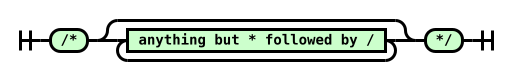

Diagram text: /\* anything but \* followed by / \*/

Source railroad grammar (verbatim from the pinned source):

```text

			T: /*
			Star:
				N: anything but * followed by /
			T: */
			
```
<a id="newline-diagram"></a>newline

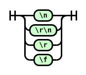

Diagram text: &#x5C;n &#x5C;r&#x5C;n &#x5C;r &#x5C;f

Source railroad grammar (verbatim from the pinned source):

```text

			Choice:
				T: \n
				T: \r\n
				T: \r
				T: \f
			
```
<a id="whitespace-diagram"></a>whitespace

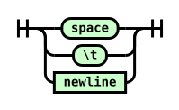

Diagram text: space &#x5C;t newline

Source railroad grammar (verbatim from the pinned source):

```text

			Choice:
				T: space
				T: \t
				N: newline
			
```
<a id="hex-digit-diagram"></a>hex digit


Diagram text: 0-9 a-f or A-F

Source railroad grammar (verbatim from the pinned source):

```text

			N: 0-9 a-f or A-F
			
```
<a id="escape-diagram"></a>escape

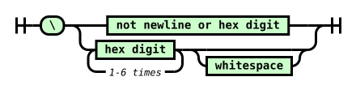

Diagram text: &#x5C; not newline or hex digit hex digit 1-6 times whitespace

Source railroad grammar (verbatim from the pinned source):

```text

			T: \
			Choice:
				N: not newline or hex digit
				Seq:
					Plus:
						N: hex digit
						C: 1-6 times
					Opt: skip
						N: whitespace
			
```
<a id="ref-for-typedef-whitespace-token"></a>

<a id="whitespace-token-diagram"></a>[\<whitespace-token\>](#typedef-whitespace-token)


Diagram text: whitespace

Source railroad grammar (verbatim from the pinned source):

```text

			Plus:
				N: whitespace
			
```
<a id="ws*-diagram"></a>ws\*


Diagram text: \<whitespace-token\>

Source railroad grammar (verbatim from the pinned source):

```text

			Star:
				N: <whitespace-token>
			
```
<a id="ref-for-typedef-ident-token①"></a>

<a id="ident-token-diagram"></a>[\<ident-token\>](#typedef-ident-token)

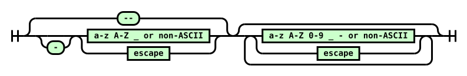

Diagram text: -- - a-z A-Z \_ or non-ASCII escape a-z A-Z 0-9 \_ - or non-ASCII escape

Source railroad grammar (verbatim from the pinned source):

```text

			Or: 1
				T: --
				Seq:
					Opt: skip
						T: -
					Or:
						N: a-z A-Z _ or non-ASCII
						N: escape
			Star:
				Or:
					N: a-z A-Z 0-9 _ - or non-ASCII
					N: escape
			
```
<a id="ref-for-typedef-function-token①"></a>

<a id="function-token-diagram"></a>[\<function-token\>](#typedef-function-token)


Diagram text: \<ident-token\> (

Source railroad grammar (verbatim from the pinned source):

```text

			N: <ident-token>
			T: (
			
```
<a id="ref-for-typedef-at-keyword-token②"></a>

<a id="at-keyword-token-diagram"></a>[\<at-keyword-token\>](#typedef-at-keyword-token)


Diagram text: @ \<ident-token\>

Source railroad grammar (verbatim from the pinned source):

```text

			T: @
			N: <ident-token>
			
```
<a id="ref-for-typedef-hash-token①"></a>

<a id="hash-token-diagram"></a>[\<hash-token\>](#typedef-hash-token)

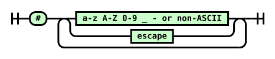

Diagram text: \# a-z A-Z 0-9 \_ - or non-ASCII escape

Source railroad grammar (verbatim from the pinned source):

```text

			T: #
			Plus:
				Choice:
					N:a-z A-Z 0-9 _ - or non-ASCII
					N: escape
			
```
<a id="ref-for-typedef-string-token①"></a>

<a id="string-token-diagram"></a>[\<string-token\>](#typedef-string-token)

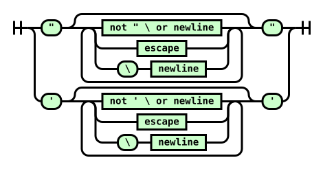

Diagram text: " not " &#x5C; or newline escape &#x5C; newline " ' not ' &#x5C; or newline escape &#x5C; newline '

Source railroad grammar (verbatim from the pinned source):

```text

			Choice:
				Seq:
					T: "
					Star:
						Choice:
							N: not " \ or newline
							N: escape
							Seq:
								T: \
								N: newline
					T: "
				Seq:
					T: '
					Star:
						Choice:
							N: not ' \ or newline
							N: escape
							Seq:
								T: \
								N: newline
					T: '
			
```
<a id="ref-for-typedef-url-token①"></a>

<a id="url-token-diagram"></a>[\<url-token\>](#typedef-url-token)

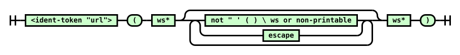

Diagram text: \<ident-token "url"\> ( ws\* not " ' ( ) &#x5C; ws or non-printable escape ws\* )

Source railroad grammar (verbatim from the pinned source):

```text

			N: <ident-token "url">
			T: (
			N: ws*
			Star:
				Choice:
					N: not " ' ( ) \ ws or non-printable
					N: escape
			N: ws*
			T: )
			
```
<a id="ref-for-typedef-number-token②"></a>

<a id="number-token-diagram"></a>[\<number-token\>](#typedef-number-token)

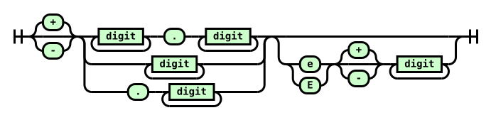

Diagram text: + - digit . digit digit . digit e E + - digit

Source railroad grammar (verbatim from the pinned source):

```text

			Choice: 1
				T: +
				Skip:
				T: -
			Choice:
				Seq:
					Plus:
						N: digit
					T: .
					Plus:
						N: digit
				Plus:
					N: digit
				Seq:
					T: .
					Plus:
						N: digit
			Opt: skip
				Seq:
					Choice:
						T: e
						T: E
					Choice: 1
						T: +
						S:
						T: -
					Plus:
						N: digit
			
```
<a id="ref-for-typedef-dimension-token③"></a>

<a id="dimension-token-diagram"></a>[\<dimension-token\>](#typedef-dimension-token)


Diagram text: \<number-token\> \<ident-token\>

Source railroad grammar (verbatim from the pinned source):

```text

			N: <number-token>
			N: <ident-token>
			
```
<a id="ref-for-typedef-percentage-token①"></a>

<a id="percentage-token-diagram"></a>[\<percentage-token\>](#typedef-percentage-token)


Diagram text: \<number-token\> %

Source railroad grammar (verbatim from the pinned source):

```text

			N: <number-token>
			T: %
			
```
<a id="ref-for-typedef-cdo-token"></a>

<a id="CDO-token-diagram"></a>[\<CDO-token\>](#typedef-cdo-token)


Diagram text: \<!--

Source railroad grammar (verbatim from the pinned source):

```text

			T: <!--
			
```
<a id="ref-for-typedef-cdc-token"></a>

<a id="CDC-token-diagram"></a>[\<CDC-token\>](#typedef-cdc-token)


Diagram text: --\>

Source railroad grammar (verbatim from the pinned source):

```text

			T: -->
			
```
<a id="ref-for-typedef-unicode-range-token①"></a>

<a id="unicode-range-token-diagram"></a>[\<unicode-range-token\>](#typedef-unicode-range-token)

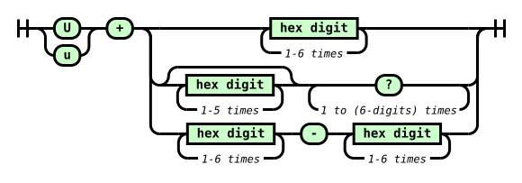

Diagram text: U u + hex digit 1-6 times hex digit 1-5 times ? 1 to (6-digits) times hex digit 1-6 times - hex digit 1-6 times

Source railroad grammar (verbatim from the pinned source):

```text

			Choice:
				T: U
				T: u
			T: +
			Choice:
				OneOrMore:
					N: hex digit
					C: 1-6 times
				Seq:
					ZeroOrMore:
						N: hex digit
						C: 1-5 times
					OneOrMore:
						T: ?
						C: 1 to (6-digits) times
				Seq:
					OneOrMore:
						N: hex digit
						C: 1-6 times
					T: -
					OneOrMore:
						N: hex digit
						C: 1-6 times
			
```
### <a id="tokenizer-definitions"></a>4.2.  Definitions

This section defines several terms used during the tokenization phase.

<a id="next-input-code-point"></a>next input code point  
<a id="ref-for-input-stream"></a>

<a id="ref-for-code-point②②"></a>

The first [code point](https://infra.spec.whatwg.org/#code-point) in the [input stream](#input-stream) that has not yet been consumed.

<a id="current-input-code-point"></a>current input code point  
<a id="ref-for-code-point②③"></a>

The last [code point](https://infra.spec.whatwg.org/#code-point) to have been consumed.

<a id="reconsume-the-current-input-code-point"></a>reconsume the current input code point  
<a id="ref-for-next-input-code-point"></a>

<a id="ref-for-input-stream①"></a>

<a id="ref-for-current-input-code-point"></a>

Push the [current input code point](#current-input-code-point) back onto the front of the [input stream](#input-stream), so that the next time you are instructed to consume the [next input code point](#next-input-code-point), it will instead reconsume the <a id="ref-for-current-input-code-point①"></a>current input code point.

<a id="eof-code-point"></a>EOF code point  
<a id="ref-for-next-input-code-point①"></a>

<a id="ref-for-input-stream②"></a>

<a id="ref-for-code-point②④"></a>

A conceptual [code point](https://infra.spec.whatwg.org/#code-point) representing the end of the [input stream](#input-stream). Whenever the <a id="ref-for-input-stream③"></a>input stream is empty, the [next input code point](#next-input-code-point) is always an EOF code point.

<a id="digit"></a>digit  
<a id="ref-for-code-point②⑤"></a>

A [code point](https://infra.spec.whatwg.org/#code-point) between U+0030 DIGIT ZERO (0) and U+0039 DIGIT NINE (9) inclusive.

<a id="hex-digit"></a>hex digit  
<a id="ref-for-code-point②⑥"></a>

<a id="ref-for-digit"></a>

A [digit](#digit), or a [code point](https://infra.spec.whatwg.org/#code-point) between U+0041 LATIN CAPITAL LETTER A (A) and U+0046 LATIN CAPITAL LETTER F (F) inclusive, or a <a id="ref-for-code-point②⑦"></a>code point between U+0061 LATIN SMALL LETTER A (a) and U+0066 LATIN SMALL LETTER F (f) inclusive.

<a id="uppercase-letter"></a>uppercase letter  
<a id="ref-for-code-point②⑧"></a>

A [code point](https://infra.spec.whatwg.org/#code-point) between U+0041 LATIN CAPITAL LETTER A (A) and U+005A LATIN CAPITAL LETTER Z (Z) inclusive.

<a id="lowercase-letter"></a>lowercase letter  
<a id="ref-for-code-point②⑨"></a>

A [code point](https://infra.spec.whatwg.org/#code-point) between U+0061 LATIN SMALL LETTER A (a) and U+007A LATIN SMALL LETTER Z (z) inclusive.

<a id="letter"></a>letter  
<a id="ref-for-lowercase-letter"></a>

<a id="ref-for-uppercase-letter"></a>

An [uppercase letter](#uppercase-letter) or a [lowercase letter](#lowercase-letter).

<a id="non-ascii-ident-code-point"></a>non-ASCII ident code point  
<a id="ref-for-code-point③⓪"></a>

A [code point](https://infra.spec.whatwg.org/#code-point) whose value is any of:

- U+00B7

- between U+00C0 and U+00D6

- between U+00D8 and U+00F6

- between U+00F8 and U+037D

- between U+037F and U+1FFF

- U+200C

- U+200D

- U+203F

- U+2040

- between U+2070 and U+218F

- between U+2C00 and U+2FEF

- between U+3001 and U+D7FF

- between U+F900 and U+FDCF

- between U+FDF0 and U+FFFD

- greater than or equal to U+10000

All of these ranges are inclusive.

> <strong data-conversion-semantic="note">Note</strong>
>
> Why these character, specifically?
> <a id="ref-for-valid-custom-element-name"></a>
>
> This matches the list of non-ASCII codepoints allowed to be used in HTML [valid custom element names](https://html.spec.whatwg.org/multipage/custom-elements.html#valid-custom-element-name). It excludes a number of characters that appear as whitespace, or that can cause rendering or parsing issues in some tools, such as the direction override codepoints.
>
> Note that this is a weaker set of restrictions than [UAX 31](https://unicode.org/reports/tr31/#Figure_Code_Point_Categories_for_Identifier_Parsing) recommends for identifiers (used by languages such as JavaScript to restrict their identifier syntax), allowing things such as starting an identifier with a combining character. Consistency with HTML custom element names (and thus, the ability to write selectors for all custom elements without having to use escapes) was considered valuable, and the set of characters restricted by HTML covers the "high value" restrictions well.
>
> These restrictions do not avoid all possible confusing renderings; mixing characters from LTR and RTL scripts can still result in unexpected visual transposition in most text editors, for example. Source text can contain the restricted characters in non-ident contexts, as well: most of them are completely valid in strings, for example. Even when used in a way that creates invalid CSS, the parsing errors they cause might be limited to something unimportant, while their effect on rendering the source text in code review tools might be significant and/or malicious. For more details on these sorts of "source text attacks", see [this Rust-lang blog post](https://blog.rust-lang.org/2021/11/01/cve-2021-42574.html) [(archived)](https://web.archive.org/web/20220323175009/https://blog.rust-lang.org/2021/11/01/cve-2021-42574.html).

<a id="ident-start-code-point"></a><a id="identifier-start-code-point"></a><a id="name-start-code-point"></a>ident-start code point  
<a id="ref-for-non-ascii-ident-code-point"></a>

<a id="ref-for-letter"></a>

A [letter](#letter), a [non-ASCII ident code point](#non-ascii-ident-code-point), or U+005F LOW LINE (\_).

<a id="ident-code-point"></a><a id="identifier-code-point"></a><a id="name-code-point"></a>ident code point  
<a id="ref-for-digit①"></a>

<a id="ref-for-ident-start-code-point①"></a>

An [ident-start code point](#ident-start-code-point), a [digit](#digit), or U+002D HYPHEN-MINUS (-).

<a id="non-printable-code-point"></a>non-printable code point  
<a id="ref-for-code-point③①"></a>

A [code point](https://infra.spec.whatwg.org/#code-point) between U+0000 NULL and U+0008 BACKSPACE inclusive, or U+000B LINE TABULATION, or a <a id="ref-for-code-point③②"></a>code point between U+000E SHIFT OUT and U+001F INFORMATION SEPARATOR ONE inclusive, or U+007F DELETE.

<a id="newline"></a>newline  
U+000A LINE FEED. <strong data-conversion-semantic="note">Note:</strong> Note that U+000D CARRIAGE RETURN and U+000C FORM FEED are not included in this definition, as they are converted to U+000A LINE FEED during [preprocessing](#input-preprocessing).

<a id="whitespace"></a>whitespace  
<a id="ref-for-newline①"></a>

A [newline](#newline), U+0009 CHARACTER TABULATION, or U+0020 SPACE.

<a id="maximum-allowed-code-point"></a>maximum allowed code point  
<a id="ref-for-code-point③③"></a>

The greatest [code point](https://infra.spec.whatwg.org/#code-point) defined by Unicode: U+10FFFF.

<a id="ident-sequence"></a><a id="identifier"></a><a id="css-identifier"></a>ident sequence  
<a id="ref-for-typedef-ident-token②"></a>

<a id="ref-for-code-point③④"></a>

A sequence of [code points](https://infra.spec.whatwg.org/#code-point) that has the same syntax as an [\<ident-token\>](#typedef-ident-token).

<a id="ref-for-typedef-at-keyword-token③"></a>

<a id="ref-for-typedef-hash-token②"></a>

<a id="ref-for-typedef-function-token②"></a>

<a id="ref-for-typedef-dimension-token④"></a>

<a id="ref-for-ident-sequence③"></a>

> <strong data-conversion-semantic="note">Note</strong>
>
> Note: The part of an [\<at-keyword-token\>](#typedef-at-keyword-token) after the "@", the part of a [\<hash-token\>](#typedef-hash-token) (with the "id" type flag) after the "#", the part of a [\<function-token\>](#typedef-function-token) before the "(", and the unit of a [\<dimension-token\>](#typedef-dimension-token) are all [ident sequences](#ident-sequence).

### <a id="tokenizer-algorithms"></a>4.3.  Tokenizer Algorithms

<a id="ref-for-code-point③⑤"></a>

The algorithms defined in this section transform a stream of [code points](https://infra.spec.whatwg.org/#code-point) into a stream of tokens.

#### <a id="consume-token"></a>4.3.1.  Consume a token

<a id="ref-for-code-point③⑥"></a>

This section describes how to <a id="tokenizer-consume-a-token"></a>consume a token from a stream of [code points](https://infra.spec.whatwg.org/#code-point). It additionally takes an optional boolean <var>unicode ranges allowed</var>, defaulting to false. It will return a single token of any type.

<a id="ref-for-consume-comments"></a>

[Consume comments](#consume-comments).

<a id="ref-for-next-input-code-point②"></a>

Consume the [next input code point](#next-input-code-point).

<a id="ref-for-whitespace①"></a>

[whitespace](#whitespace)

<a id="ref-for-typedef-whitespace-token①"></a>

<a id="ref-for-whitespace②"></a>

Consume as much [whitespace](#whitespace) as possible. Return a [\<whitespace-token\>](#typedef-whitespace-token).

U+0022 QUOTATION MARK (")

<a id="ref-for-consume-a-string-token"></a>

[Consume a string token](#consume-a-string-token) and return it.

U+0023 NUMBER SIGN (#)

<a id="ref-for-check-if-two-code-points-are-a-valid-escape"></a>

<a id="ref-for-ident-code-point①"></a>

<a id="ref-for-next-input-code-point③"></a>

If the [next input code point](#next-input-code-point) is an [ident code point](#ident-code-point) or the <a id="ref-for-next-input-code-point④"></a>next two input code points [are a valid escape](#check-if-two-code-points-are-a-valid-escape), then:

1.  <a id="ref-for-typedef-hash-token③"></a>

    Create a [\<hash-token\>](#typedef-hash-token).

2.  <a id="ref-for-typedef-hash-token④"></a>

    <a id="ref-for-check-if-three-code-points-would-start-an-ident-sequence"></a>

    <a id="ref-for-next-input-code-point⑤"></a>

    If the [next 3 input code points](#next-input-code-point) [would start an ident sequence](#check-if-three-code-points-would-start-an-ident-sequence), set the [\<hash-token\>](#typedef-hash-token)’s type flag to "id".

3.  <a id="ref-for-typedef-hash-token⑤"></a>

    <a id="ref-for-consume-an-ident-sequence"></a>

    [Consume an ident sequence](#consume-an-ident-sequence), and set the [\<hash-token\>](#typedef-hash-token)’s value to the returned string.

4.  <a id="ref-for-typedef-hash-token⑥"></a>

    Return the [\<hash-token\>](#typedef-hash-token).

<a id="ref-for-typedef-delim-token①"></a>

<a id="ref-for-current-input-code-point②"></a>

Otherwise, return a [\<delim-token\>](#typedef-delim-token) with its value set to the [current input code point](#current-input-code-point).

U+0027 APOSTROPHE (')

<a id="ref-for-consume-a-string-token①"></a>

[Consume a string token](#consume-a-string-token) and return it.

U+0028 LEFT PARENTHESIS (()

<a id="ref-for-tokendef-open-paren"></a>

Return a [\<(-token\>](#tokendef-open-paren).

U+0029 RIGHT PARENTHESIS ())

<a id="ref-for-tokendef-close-paren"></a>

Return a [\<)-token\>](#tokendef-close-paren).

U+002B PLUS SIGN (+)

<a id="ref-for-consume-a-numeric-token"></a>

<a id="ref-for-reconsume-the-current-input-code-point"></a>

<a id="ref-for-check-if-three-code-points-would-start-a-number"></a>

If the input stream [starts with a number](#check-if-three-code-points-would-start-a-number), [reconsume the current input code point](#reconsume-the-current-input-code-point), [consume a numeric token](#consume-a-numeric-token), and return it.

<a id="ref-for-typedef-delim-token②"></a>

<a id="ref-for-current-input-code-point③"></a>

Otherwise, return a [\<delim-token\>](#typedef-delim-token) with its value set to the [current input code point](#current-input-code-point).

U+002C COMMA (,)

<a id="ref-for-typedef-comma-token"></a>

Return a [\<comma-token\>](#typedef-comma-token).

U+002D HYPHEN-MINUS (-)

<a id="ref-for-consume-a-numeric-token①"></a>

<a id="ref-for-reconsume-the-current-input-code-point①"></a>

<a id="ref-for-check-if-three-code-points-would-start-a-number①"></a>

If the input stream [starts with a number](#check-if-three-code-points-would-start-a-number), [reconsume the current input code point](#reconsume-the-current-input-code-point), [consume a numeric token](#consume-a-numeric-token), and return it.

<a id="ref-for-next-input-code-point⑥"></a>

<a id="ref-for-typedef-cdc-token①"></a>

Otherwise, if the [next 2 input code points](#next-input-code-point) are U+002D HYPHEN-MINUS U+003E GREATER-THAN SIGN (-\>), consume them and return a [\<CDC-token\>](#typedef-cdc-token).

<a id="ref-for-check-if-three-code-points-would-start-an-ident-sequence①"></a>

<a id="ref-for-reconsume-the-current-input-code-point②"></a>

<a id="ref-for-consume-an-ident-like-token"></a>

Otherwise, if the input stream [starts with an ident sequence](#check-if-three-code-points-would-start-an-ident-sequence), [reconsume the current input code point](#reconsume-the-current-input-code-point), [consume an ident-like token](#consume-an-ident-like-token), and return it.

<a id="ref-for-typedef-delim-token③"></a>

<a id="ref-for-current-input-code-point④"></a>

Otherwise, return a [\<delim-token\>](#typedef-delim-token) with its value set to the [current input code point](#current-input-code-point).

U+002E FULL STOP (.)

<a id="ref-for-consume-a-numeric-token②"></a>

<a id="ref-for-reconsume-the-current-input-code-point③"></a>

<a id="ref-for-check-if-three-code-points-would-start-a-number②"></a>

If the input stream [starts with a number](#check-if-three-code-points-would-start-a-number), [reconsume the current input code point](#reconsume-the-current-input-code-point), [consume a numeric token](#consume-a-numeric-token), and return it.

<a id="ref-for-typedef-delim-token④"></a>

<a id="ref-for-current-input-code-point⑤"></a>

Otherwise, return a [\<delim-token\>](#typedef-delim-token) with its value set to the [current input code point](#current-input-code-point).

U+003A COLON (:)

<a id="ref-for-typedef-colon-token"></a>

Return a [\<colon-token\>](#typedef-colon-token).

U+003B SEMICOLON (;)

<a id="ref-for-typedef-semicolon-token①"></a>

Return a [\<semicolon-token\>](#typedef-semicolon-token).

U+003C LESS-THAN SIGN (\<)

<a id="ref-for-typedef-cdo-token①"></a>

<a id="ref-for-next-input-code-point⑦"></a>

If the [next 3 input code points](#next-input-code-point) are U+0021 EXCLAMATION MARK U+002D HYPHEN-MINUS U+002D HYPHEN-MINUS (!--), consume them and return a [\<CDO-token\>](#typedef-cdo-token).

<a id="ref-for-typedef-delim-token⑤"></a>

<a id="ref-for-current-input-code-point⑥"></a>

Otherwise, return a [\<delim-token\>](#typedef-delim-token) with its value set to the [current input code point](#current-input-code-point).

U+0040 COMMERCIAL AT (@)

<a id="ref-for-typedef-at-keyword-token④"></a>

<a id="ref-for-consume-an-ident-sequence①"></a>

<a id="ref-for-check-if-three-code-points-would-start-an-ident-sequence②"></a>

<a id="ref-for-next-input-code-point⑧"></a>

If the [next 3 input code points](#next-input-code-point) [would start an ident sequence](#check-if-three-code-points-would-start-an-ident-sequence), [consume an ident sequence](#consume-an-ident-sequence), create an [\<at-keyword-token\>](#typedef-at-keyword-token) with its value set to the returned value, and return it.

<a id="ref-for-typedef-delim-token⑥"></a>

<a id="ref-for-current-input-code-point⑦"></a>

Otherwise, return a [\<delim-token\>](#typedef-delim-token) with its value set to the [current input code point](#current-input-code-point).

U+005B LEFT SQUARE BRACKET (\[)

<a id="ref-for-tokendef-open-square"></a>

Return a [\<\[-token\>](#tokendef-open-square).

U+005C REVERSE SOLIDUS (&#x5C;)

<a id="ref-for-consume-an-ident-like-token①"></a>

<a id="ref-for-reconsume-the-current-input-code-point④"></a>

<a id="ref-for-check-if-two-code-points-are-a-valid-escape①"></a>

If the input stream [starts with a valid escape](#check-if-two-code-points-are-a-valid-escape), [reconsume the current input code point](#reconsume-the-current-input-code-point), [consume an ident-like token](#consume-an-ident-like-token), and return it.

<a id="ref-for-parse-error"></a>

<a id="ref-for-typedef-delim-token⑦"></a>

<a id="ref-for-current-input-code-point⑧"></a>

Otherwise, this is a [parse error](#parse-error). Return a [\<delim-token\>](#typedef-delim-token) with its value set to the [current input code point](#current-input-code-point).

U+005D RIGHT SQUARE BRACKET (\])

<a id="ref-for-tokendef-close-square"></a>

Return a [\<\]-token\>](#tokendef-close-square).

U+007B LEFT CURLY BRACKET ({)

<a id="ref-for-tokendef-open-curly③"></a>

Return a [\<{-token\>](#tokendef-open-curly).

U+007D RIGHT CURLY BRACKET (})

<a id="ref-for-tokendef-close-curly①"></a>

Return a [\<}-token\>](#tokendef-close-curly).

<a id="ref-for-digit②"></a>

[digit](#digit)

<a id="ref-for-consume-a-numeric-token③"></a>

<a id="ref-for-reconsume-the-current-input-code-point⑤"></a>

[Reconsume the current input code point](#reconsume-the-current-input-code-point), [consume a numeric token](#consume-a-numeric-token), and return it.

U+0055 LATIN CAPITAL LETTER U (U)

u+0075 LATIN LOWERCASE LETTER U (u)

<a id="ref-for-consume-a-unicode-range-token"></a>

<a id="ref-for-reconsume-the-current-input-code-point⑥"></a>

<a id="ref-for-check-if-three-code-points-would-start-a-unicode-range"></a>

If <var>unicode ranges allowed</var> is true and the input stream [would start a unicode-range](#check-if-three-code-points-would-start-a-unicode-range), [reconsume the current input code point](#reconsume-the-current-input-code-point), [consume a unicode-range token](#consume-a-unicode-range-token), and return it.

<a id="ref-for-reconsume-the-current-input-code-point⑦"></a>

<a id="ref-for-consume-an-ident-like-token②"></a>

Otherwise, [reconsume the current input code point](#reconsume-the-current-input-code-point), [consume an ident-like token](#consume-an-ident-like-token), and return it.

<a id="ref-for-ident-start-code-point②"></a>

[ident-start code point](#ident-start-code-point)

<a id="ref-for-consume-an-ident-like-token③"></a>

<a id="ref-for-reconsume-the-current-input-code-point⑧"></a>

[Reconsume the current input code point](#reconsume-the-current-input-code-point), [consume an ident-like token](#consume-an-ident-like-token), and return it.

EOF

<a id="ref-for-typedef-eof-token①"></a>

Return an [\<EOF-token\>](#typedef-eof-token).

anything else

<a id="ref-for-current-input-code-point⑨"></a>

<a id="ref-for-typedef-delim-token⑧"></a>

Return a [\<delim-token\>](#typedef-delim-token) with its value set to the [current input code point](#current-input-code-point).

#### <a id="consume-comment"></a>4.3.2.  Consume comments

<a id="ref-for-code-point③⑦"></a>

This section describes how to <a id="consume-comments"></a>consume comments from a stream of [code points](https://infra.spec.whatwg.org/#code-point). It returns nothing.

<a id="ref-for-next-input-code-point⑨"></a>

<a id="ref-for-code-point③⑧"></a>

If the [next two input code point](#next-input-code-point) are U+002F SOLIDUS (/) followed by a U+002A ASTERISK (\*), consume them and all following [code points](https://infra.spec.whatwg.org/#code-point) up to and including the first U+002A ASTERISK (\*) followed by a U+002F SOLIDUS (/), or up to an EOF code point. Return to the start of this step.

<a id="ref-for-parse-error①"></a>

If the preceding paragraph ended by consuming an EOF code point, this is a [parse error](#parse-error).

Return nothing.

#### <a id="consume-numeric-token"></a>4.3.3.  Consume a numeric token

<a id="ref-for-code-point③⑨"></a>

<a id="ref-for-typedef-number-token③"></a>

<a id="ref-for-typedef-percentage-token②"></a>

<a id="ref-for-typedef-dimension-token⑤"></a>

This section describes how to <a id="consume-a-numeric-token"></a>consume a numeric token from a stream of [code points](https://infra.spec.whatwg.org/#code-point). It returns either a [\<number-token\>](#typedef-number-token), [\<percentage-token\>](#typedef-percentage-token), or [\<dimension-token\>](#typedef-dimension-token).

<a id="ref-for-consume-a-number"></a>

[Consume a number](#consume-a-number) and let <var>number</var> be the result.

<a id="ref-for-next-input-code-point①⓪"></a>

<a id="ref-for-check-if-three-code-points-would-start-an-ident-sequence③"></a>

If the [next 3 input code points](#next-input-code-point) [would start an ident sequence](#check-if-three-code-points-would-start-an-ident-sequence), then:

1.  <a id="ref-for-typedef-dimension-token⑥"></a>

    Create a [\<dimension-token\>](#typedef-dimension-token) with the same value, type flag, and sign character as <var>number</var>, and a unit set initially to the empty string.

2.  <a id="ref-for-typedef-dimension-token⑦"></a>

    <a id="ref-for-consume-an-ident-sequence②"></a>

    [Consume an ident sequence](#consume-an-ident-sequence). Set the [\<dimension-token\>](#typedef-dimension-token)’s unit to the returned value.

3.  <a id="ref-for-typedef-dimension-token⑧"></a>

    Return the [\<dimension-token\>](#typedef-dimension-token).

<a id="ref-for-next-input-code-point①①"></a>

<a id="ref-for-typedef-percentage-token③"></a>

Otherwise, if the [next input code point](#next-input-code-point) is U+0025 PERCENTAGE SIGN (%), consume it. Create a [\<percentage-token\>](#typedef-percentage-token) with the same value and sign character as <var>number</var>, and return it.

<a id="ref-for-typedef-number-token④"></a>

Otherwise, create a [\<number-token\>](#typedef-number-token) with the same value, type flag, and sign character as <var>number</var>, and return it.

#### <a id="consume-ident-like-token"></a>4.3.4.  Consume an ident-like token

<a id="ref-for-code-point④⓪"></a>

<a id="ref-for-typedef-ident-token③"></a>

<a id="ref-for-typedef-function-token③"></a>

<a id="ref-for-typedef-url-token②"></a>

<a id="ref-for-typedef-bad-url-token"></a>

This section describes how to <a id="consume-an-ident-like-token"></a>consume an ident-like token from a stream of [code points](https://infra.spec.whatwg.org/#code-point). It returns an [\<ident-token\>](#typedef-ident-token), [\<function-token\>](#typedef-function-token), [\<url-token\>](#typedef-url-token), or [\<bad-url-token\>](#typedef-bad-url-token).

<a id="ref-for-consume-an-ident-sequence③"></a>

[Consume an ident sequence](#consume-an-ident-sequence), and let <var>string</var> be the result.

<a id="ref-for-ascii-case-insensitive"></a>

<a id="ref-for-next-input-code-point①②"></a>

<a id="ref-for-whitespace③"></a>

<a id="ref-for-typedef-function-token④"></a>

<a id="ref-for-consume-a-url-token"></a>

If <var>string</var>’s value is an [ASCII case-insensitive](https://infra.spec.whatwg.org/#ascii-case-insensitive) match for "url", and the [next input code point](#next-input-code-point) is U+0028 LEFT PARENTHESIS ((), consume it. While the <a id="ref-for-next-input-code-point①③"></a>next two input code points are [whitespace](#whitespace), consume the <a id="ref-for-next-input-code-point①④"></a>next input code point. If the <a id="ref-for-next-input-code-point①⑤"></a>next one or two input code points are U+0022 QUOTATION MARK ("), U+0027 APOSTROPHE ('), or <a id="ref-for-whitespace④"></a>whitespace followed by U+0022 QUOTATION MARK (") or U+0027 APOSTROPHE ('), then create a [\<function-token\>](#typedef-function-token) with its value set to <var>string</var> and return it. Otherwise, [consume a url token](#consume-a-url-token), and return it.

<a id="ref-for-next-input-code-point①⑥"></a>

<a id="ref-for-typedef-function-token⑤"></a>

Otherwise, if the [next input code point](#next-input-code-point) is U+0028 LEFT PARENTHESIS ((), consume it. Create a [\<function-token\>](#typedef-function-token) with its value set to <var>string</var> and return it.

<a id="ref-for-typedef-ident-token④"></a>

Otherwise, create an [\<ident-token\>](#typedef-ident-token) with its value set to <var>string</var> and return it.

#### <a id="consume-string-token"></a>4.3.5.  Consume a string token

<a id="ref-for-code-point④①"></a>

<a id="ref-for-typedef-string-token②"></a>

<a id="ref-for-typedef-bad-string-token"></a>

This section describes how to <a id="consume-a-string-token"></a>consume a string token from a stream of [code points](https://infra.spec.whatwg.org/#code-point). It returns either a [\<string-token\>](#typedef-string-token) or [\<bad-string-token\>](#typedef-bad-string-token).

<a id="ref-for-code-point④②"></a>

<a id="ref-for-current-input-code-point①⓪"></a>

This algorithm may be called with an <var>ending code point</var>, which denotes the [code point](https://infra.spec.whatwg.org/#code-point) that ends the string. If an <var>ending code point</var> is not specified, the [current input code point](#current-input-code-point) is used.

<a id="ref-for-typedef-string-token③"></a>

Initially create a [\<string-token\>](#typedef-string-token) with its value set to the empty string.

<a id="ref-for-next-input-code-point①⑦"></a>

Repeatedly consume the [next input code point](#next-input-code-point) from the stream:

<var>ending code point</var>

<a id="ref-for-typedef-string-token④"></a>

Return the [\<string-token\>](#typedef-string-token).

EOF

<a id="ref-for-typedef-string-token⑤"></a>

<a id="ref-for-parse-error②"></a>

This is a [parse error](#parse-error). Return the [\<string-token\>](#typedef-string-token).

<a id="ref-for-newline②"></a>

[newline](#newline)

<a id="ref-for-typedef-bad-string-token①"></a>

<a id="ref-for-reconsume-the-current-input-code-point⑨"></a>

<a id="ref-for-parse-error③"></a>

This is a [parse error](#parse-error). [Reconsume the current input code point](#reconsume-the-current-input-code-point), create a [\<bad-string-token\>](#typedef-bad-string-token), and return it.

U+005C REVERSE SOLIDUS (&#x5C;)

<a id="ref-for-next-input-code-point①⑧"></a>

If the [next input code point](#next-input-code-point) is EOF, do nothing.

<a id="ref-for-next-input-code-point①⑨"></a>

Otherwise, if the [next input code point](#next-input-code-point) is a newline, consume it.

<a id="ref-for-check-if-two-code-points-are-a-valid-escape②"></a>

<a id="ref-for-consume-an-escaped-code-point"></a>

<a id="ref-for-code-point④③"></a>

<a id="ref-for-typedef-string-token⑥"></a>

Otherwise, <strong data-conversion-semantic="note">Note:</strong> (the stream [starts with a valid escape](#check-if-two-code-points-are-a-valid-escape)) [consume an escaped code point](#consume-an-escaped-code-point) and append the returned [code point](https://infra.spec.whatwg.org/#code-point) to the [\<string-token\>](#typedef-string-token)’s value.

anything else

<a id="ref-for-typedef-string-token⑦"></a>

<a id="ref-for-current-input-code-point①①"></a>

Append the [current input code point](#current-input-code-point) to the [\<string-token\>](#typedef-string-token)’s value.

#### <a id="consume-url-token"></a>4.3.6.  Consume a url token

<a id="ref-for-code-point④④"></a>

<a id="ref-for-typedef-url-token③"></a>

<a id="ref-for-typedef-bad-url-token①"></a>

This section describes how to <a id="consume-a-url-token"></a>consume a url token from a stream of [code points](https://infra.spec.whatwg.org/#code-point). It returns either a [\<url-token\>](#typedef-url-token) or a [\<bad-url-token\>](#typedef-bad-url-token).

<a id="ref-for-typedef-function-token⑥"></a>

<a id="ref-for-consume-an-ident-like-token④"></a>

> <strong data-conversion-semantic="note">Note</strong>
>
> Note: This algorithm assumes that the initial "url(" has already been consumed. This algorithm also assumes that it’s being called to consume an "unquoted" value, like url(foo). A quoted value, like url("foo"), is parsed as a [\<function-token\>](#typedef-function-token). [Consume an ident-like token](#consume-an-ident-like-token) automatically handles this distinction; this algorithm shouldn’t be called directly otherwise.

1.  <a id="ref-for-typedef-url-token④"></a>

    Initially create a [\<url-token\>](#typedef-url-token) with its value set to the empty string.

2.  <a id="ref-for-whitespace⑤"></a>

    Consume as much [whitespace](#whitespace) as possible.

3.  <a id="ref-for-next-input-code-point②⓪"></a>

    Repeatedly consume the [next input code point](#next-input-code-point) from the stream:

    U+0029 RIGHT PARENTHESIS ())

    <a id="ref-for-typedef-url-token⑤"></a>

    Return the [\<url-token\>](#typedef-url-token).

    EOF

    <a id="ref-for-typedef-url-token⑥"></a>

    <a id="ref-for-parse-error④"></a>

    This is a [parse error](#parse-error). Return the [\<url-token\>](#typedef-url-token).

    <a id="ref-for-whitespace⑥"></a>

    [whitespace](#whitespace)

    <a id="ref-for-typedef-bad-url-token②"></a>

    <a id="ref-for-consume-the-remnants-of-a-bad-url"></a>

    <a id="ref-for-parse-error⑤"></a>

    <a id="ref-for-typedef-url-token⑦"></a>

    <a id="ref-for-next-input-code-point②①"></a>

    <a id="ref-for-whitespace⑦"></a>

    Consume as much [whitespace](#whitespace) as possible. If the [next input code point](#next-input-code-point) is U+0029 RIGHT PARENTHESIS ()) or EOF, consume it and return the [\<url-token\>](#typedef-url-token) (if EOF was encountered, this is a [parse error](#parse-error)); otherwise, [consume the remnants of a bad url](#consume-the-remnants-of-a-bad-url), create a [\<bad-url-token\>](#typedef-bad-url-token), and return it.

    U+0022 QUOTATION MARK (")

    U+0027 APOSTROPHE (')

    U+0028 LEFT PARENTHESIS (()

    <a id="ref-for-non-printable-code-point"></a>

    [non-printable code point](#non-printable-code-point)

    <a id="ref-for-typedef-bad-url-token③"></a>

    <a id="ref-for-consume-the-remnants-of-a-bad-url①"></a>

    <a id="ref-for-parse-error⑥"></a>

    This is a [parse error](#parse-error). [Consume the remnants of a bad url](#consume-the-remnants-of-a-bad-url), create a [\<bad-url-token\>](#typedef-bad-url-token), and return it.

    U+005C REVERSE SOLIDUS (&#x5C;)

    <a id="ref-for-typedef-url-token⑧"></a>

    <a id="ref-for-code-point④⑤"></a>

    <a id="ref-for-consume-an-escaped-code-point①"></a>

    <a id="ref-for-check-if-two-code-points-are-a-valid-escape③"></a>

    If the stream [starts with a valid escape](#check-if-two-code-points-are-a-valid-escape), [consume an escaped code point](#consume-an-escaped-code-point) and append the returned [code point](https://infra.spec.whatwg.org/#code-point) to the [\<url-token\>](#typedef-url-token)’s value.

    <a id="ref-for-parse-error⑦"></a>

    <a id="ref-for-consume-the-remnants-of-a-bad-url②"></a>

    <a id="ref-for-typedef-bad-url-token④"></a>

    Otherwise, this is a [parse error](#parse-error). [Consume the remnants of a bad url](#consume-the-remnants-of-a-bad-url), create a [\<bad-url-token\>](#typedef-bad-url-token), and return it.

    anything else

    <a id="ref-for-typedef-url-token⑨"></a>

    <a id="ref-for-current-input-code-point①②"></a>

    Append the [current input code point](#current-input-code-point) to the [\<url-token\>](#typedef-url-token)’s value.

#### <a id="consume-escaped-code-point"></a>4.3.7.  Consume an escaped code point

<a id="ref-for-code-point④⑥"></a>

This section describes how to <a id="consume-an-escaped-code-point"></a>consume an escaped code point. It assumes that the U+005C REVERSE SOLIDUS (&#x5C;) has already been consumed and that the next input code point has already been verified to be part of a valid escape. It will return a [code point](https://infra.spec.whatwg.org/#code-point).

<a id="ref-for-next-input-code-point②②"></a>

Consume the [next input code point](#next-input-code-point).

<a id="ref-for-hex-digit②"></a>

[hex digit](#hex-digit)

<a id="ref-for-code-point④⑦"></a>

<a id="ref-for-maximum-allowed-code-point"></a>

<a id="ref-for-surrogate②"></a>

<a id="ref-for-whitespace⑧"></a>

<a id="ref-for-next-input-code-point②③"></a>

<a id="ref-for-hex-digit③"></a>

Consume as many [hex digits](#hex-digit) as possible, but no more than 5. <strong data-conversion-semantic="note">Note:</strong> Note that this means 1-6 hex digits have been consumed in total. If the [next input code point](#next-input-code-point) is [whitespace](#whitespace), consume it as well. Interpret the <a id="ref-for-hex-digit④"></a>hex digits as a hexadecimal number. If this number is zero, or is for a [surrogate](https://infra.spec.whatwg.org/#surrogate), or is greater than the [maximum allowed code point](#maximum-allowed-code-point), return U+FFFD REPLACEMENT CHARACTER (�). Otherwise, return the [code point](https://infra.spec.whatwg.org/#code-point) with that value.

EOF

<a id="ref-for-parse-error⑧"></a>

This is a [parse error](#parse-error). Return U+FFFD REPLACEMENT CHARACTER (�).

anything else

<a id="ref-for-current-input-code-point①③"></a>

Return the [current input code point](#current-input-code-point).

#### <a id="starts-with-a-valid-escape"></a>4.3.8.  Check if two code points are a valid escape

<a id="ref-for-code-point④⑧"></a>

<a id="ref-for-current-input-code-point①④"></a>

<a id="ref-for-next-input-code-point②④"></a>

This section describes how to <a id="check-if-two-code-points-are-a-valid-escape"></a>check if two code points are a valid escape. The algorithm described here can be called explicitly with two [code points](https://infra.spec.whatwg.org/#code-point), or can be called with the input stream itself. In the latter case, the two <a id="ref-for-code-point④⑨"></a>code points in question are the [current input code point](#current-input-code-point) and the [next input code point](#next-input-code-point), in that order.

<a id="ref-for-code-point⑤⓪"></a>

> <strong data-conversion-semantic="note">Note</strong>
>
> Note: This algorithm will not consume any additional [code point](https://infra.spec.whatwg.org/#code-point).

<a id="ref-for-code-point⑤①"></a>

If the first [code point](https://infra.spec.whatwg.org/#code-point) is not U+005C REVERSE SOLIDUS (&#x5C;), return false.

<a id="ref-for-code-point⑤②"></a>

<a id="ref-for-newline③"></a>

Otherwise, if the second [code point](https://infra.spec.whatwg.org/#code-point) is a [newline](#newline), return false.

Otherwise, return true.

#### <a id="would-start-an-identifier"></a>4.3.9.  Check if three code points would start an ident sequence

<a id="ref-for-ident-sequence④"></a>

<a id="ref-for-code-point⑤③"></a>

<a id="ref-for-current-input-code-point①⑤"></a>

<a id="ref-for-next-input-code-point②⑤"></a>

This section describes how to <a id="check-if-three-code-points-would-start-an-ident-sequence"></a><a id="check-if-three-code-points-would-start-an-identifier"></a>check if three code points would start an [ident sequence](#ident-sequence). The algorithm described here can be called explicitly with three [code points](https://infra.spec.whatwg.org/#code-point), or can be called with the input stream itself. In the latter case, the three <a id="ref-for-code-point⑤④"></a>code points in question are the [current input code point](#current-input-code-point) and the [next two input code points](#next-input-code-point), in that order.

<a id="ref-for-code-point⑤⑤"></a>

> <strong data-conversion-semantic="note">Note</strong>
>
> Note: This algorithm will not consume any additional [code points](https://infra.spec.whatwg.org/#code-point).

<a id="ref-for-code-point⑤⑥"></a>

Look at the first [code point](https://infra.spec.whatwg.org/#code-point):

U+002D HYPHEN-MINUS

<a id="ref-for-check-if-two-code-points-are-a-valid-escape④"></a>

<a id="ref-for-ident-start-code-point③"></a>

<a id="ref-for-code-point⑤⑦"></a>

If the second [code point](https://infra.spec.whatwg.org/#code-point) is an [ident-start code point](#ident-start-code-point) or a U+002D HYPHEN-MINUS, or the second and third <a id="ref-for-code-point⑤⑧"></a>code points [are a valid escape](#check-if-two-code-points-are-a-valid-escape), return true. Otherwise, return false.

<a id="ref-for-ident-start-code-point④"></a>

[ident-start code point](#ident-start-code-point)

Return true.

U+005C REVERSE SOLIDUS (&#x5C;)

<a id="ref-for-check-if-two-code-points-are-a-valid-escape⑤"></a>

<a id="ref-for-code-point⑤⑨"></a>

If the first and second [code points](https://infra.spec.whatwg.org/#code-point) [are a valid escape](#check-if-two-code-points-are-a-valid-escape), return true. Otherwise, return false.

anything else

Return false.

#### <a id="starts-with-a-number"></a>4.3.10.  Check if three code points would start a number

<a id="ref-for-code-point⑥⓪"></a>

<a id="ref-for-current-input-code-point①⑥"></a>

<a id="ref-for-next-input-code-point②⑥"></a>

This section describes how to <a id="check-if-three-code-points-would-start-a-number"></a>check if three code points would start a number. The algorithm described here can be called explicitly with three [code points](https://infra.spec.whatwg.org/#code-point), or can be called with the input stream itself. In the latter case, the three <a id="ref-for-code-point⑥①"></a>code points in question are the [current input code point](#current-input-code-point) and the [next two input code points](#next-input-code-point), in that order.

<a id="ref-for-code-point⑥②"></a>

> <strong data-conversion-semantic="note">Note</strong>
>
> Note: This algorithm will not consume any additional [code points](https://infra.spec.whatwg.org/#code-point).

<a id="ref-for-code-point⑥③"></a>

Look at the first [code point](https://infra.spec.whatwg.org/#code-point):

U+002B PLUS SIGN (+)

U+002D HYPHEN-MINUS (-)

<a id="ref-for-digit③"></a>

<a id="ref-for-code-point⑥④"></a>

If the second [code point](https://infra.spec.whatwg.org/#code-point) is a [digit](#digit), return true.

<a id="ref-for-code-point⑥⑤"></a>

<a id="ref-for-digit④"></a>

Otherwise, if the second [code point](https://infra.spec.whatwg.org/#code-point) is a U+002E FULL STOP (.) and the third <a id="ref-for-code-point⑥⑥"></a>code point is a [digit](#digit), return true.

Otherwise, return false.

U+002E FULL STOP (.)

<a id="ref-for-digit⑤"></a>

<a id="ref-for-code-point⑥⑦"></a>

If the second [code point](https://infra.spec.whatwg.org/#code-point) is a [digit](#digit), return true. Otherwise, return false.

<a id="ref-for-digit⑥"></a>

[digit](#digit)

Return true.

anything else

Return false.

#### <a id="starts-a-unicode-range"></a>4.3.11.  Check if three code points would start a unicode-range

<a id="ref-for-code-point⑥⑧"></a>

<a id="ref-for-current-input-code-point①⑦"></a>

<a id="ref-for-next-input-code-point②⑦"></a>

This section describes how to <a id="check-if-three-code-points-would-start-a-unicode-range"></a>check if three code points would start a unicode-range. The algorithm described here can be called explicitly with three [code points](https://infra.spec.whatwg.org/#code-point), or can be called with the input stream itself. In the latter case, the three <a id="ref-for-code-point⑥⑨"></a>code points in question are the [current input code point](#current-input-code-point) and the [next two input code points](#next-input-code-point), in that order.

<a id="ref-for-code-point⑦⓪"></a>

> <strong data-conversion-semantic="note">Note</strong>
>
> Note: This algorithm will not consume any additional [code points](https://infra.spec.whatwg.org/#code-point).

If all of the following are true:

- The first code point is either U+0055 LATIN CAPITAL LETTER U (U) or U+0075 LATIN SMALL LETTER U (u)

- The second code point is U+002B PLUS SIGN (+).

- <a id="ref-for-hex-digit⑤"></a>

  The third code point is either U+003F QUESTION MARK (?) or a [hex digit](#hex-digit)

then return true.

Otherwise return false.

#### <a id="consume-name"></a>4.3.12.  Consume an ident sequence

<a id="ref-for-code-point⑦①"></a>

This section describes how to <a id="consume-an-ident-sequence"></a><a id="consume-an-identifier"></a>consume an ident sequence from a stream of [code points](https://infra.spec.whatwg.org/#code-point). It returns a string containing the largest name that can be formed from adjacent <a id="ref-for-code-point⑦②"></a>code points in the stream, starting from the first.

<a id="ref-for-code-point⑦③"></a>

<a id="ref-for-typedef-ident-token⑤"></a>

<a id="ref-for-check-if-three-code-points-would-start-an-ident-sequence④"></a>

> <strong data-conversion-semantic="note">Note</strong>
>
> Note: This algorithm does not do the verification of the first few [code points](https://infra.spec.whatwg.org/#code-point) that are necessary to ensure the returned <a id="ref-for-code-point⑦④"></a>code points would constitute an [\<ident-token\>](#typedef-ident-token). If that is the intended use, ensure that the stream [starts with an ident sequence](#check-if-three-code-points-would-start-an-ident-sequence) before calling this algorithm.

Let <var>result</var> initially be an empty string.

<a id="ref-for-next-input-code-point②⑧"></a>

Repeatedly consume the [next input code point](#next-input-code-point) from the stream:

<a id="ref-for-ident-code-point②"></a>

[ident code point](#ident-code-point)

<a id="ref-for-code-point⑦⑤"></a>

Append the [code point](https://infra.spec.whatwg.org/#code-point) to <var>result</var>.

<a id="ref-for-check-if-two-code-points-are-a-valid-escape⑥"></a>

the stream [starts with a valid escape](#check-if-two-code-points-are-a-valid-escape)

<a id="ref-for-code-point⑦⑥"></a>

<a id="ref-for-consume-an-escaped-code-point②"></a>

[Consume an escaped code point](#consume-an-escaped-code-point). Append the returned [code point](https://infra.spec.whatwg.org/#code-point) to <var>result</var>.

anything else

<a id="ref-for-reconsume-the-current-input-code-point①⓪"></a>

[Reconsume the current input code point](#reconsume-the-current-input-code-point). Return <var>result</var>.

#### <a id="consume-number"></a>4.3.13.  Consume a number

<a id="ref-for-code-point⑦⑦"></a>

This section describes how to <a id="consume-a-number"></a>consume a number from a stream of [code points](https://infra.spec.whatwg.org/#code-point). It returns a numeric <var>value</var>, a string <var>type</var> which is either "integer" or "number", and an optional <var>sign character</var> which is either "+", "-", or missing.

<a id="ref-for-code-point⑦⑧"></a>

<a id="ref-for-check-if-three-code-points-would-start-a-number③"></a>

> <strong data-conversion-semantic="note">Note</strong>
>
> Note: This algorithm does not do the verification of the first few [code points](https://infra.spec.whatwg.org/#code-point) that are necessary to ensure a number can be obtained from the stream. Ensure that the stream [starts with a number](#check-if-three-code-points-would-start-a-number) before calling this algorithm.

Execute the following steps in order:

1.  Let <var>type</var> be the string "integer". Let <var>number part</var> and <var>exponent part</var> be the empty string.

2.  <a id="ref-for-next-input-code-point②⑨"></a>

    If the [next input code point](#next-input-code-point) is U+002B PLUS SIGN (+) or U+002D HYPHEN-MINUS (-), consume it. Append it to <var>number part</var> and set <var>sign character</var> to it.

3.  <a id="ref-for-digit⑦"></a>

    <a id="ref-for-next-input-code-point③⓪"></a>

    While the [next input code point](#next-input-code-point) is a [digit](#digit), consume it and append it to <var>number part</var>.

4.  <a id="ref-for-digit⑧"></a>

    <a id="ref-for-next-input-code-point③①"></a>

    If the [next 2 input code points](#next-input-code-point) are U+002E FULL STOP (.) followed by a [digit](#digit), then:

    1.  <a id="ref-for-next-input-code-point③②"></a>

        Consume the [next input code point](#next-input-code-point) and append it to <var>number part</var>.

    2.  <a id="ref-for-digit⑨"></a>

        <a id="ref-for-next-input-code-point③③"></a>

        While the [next input code point](#next-input-code-point) is a [digit](#digit), consume it and append it to <var>number part</var>.

    3.  Set <var>type</var> to "number".

5.  <a id="ref-for-digit①⓪"></a>

    <a id="ref-for-next-input-code-point③④"></a>

    If the [next 2 or 3 input code points](#next-input-code-point) are U+0045 LATIN CAPITAL LETTER E (E) or U+0065 LATIN SMALL LETTER E (e), optionally followed by U+002D HYPHEN-MINUS (-) or U+002B PLUS SIGN (+), followed by a [digit](#digit), then:

    1.  <a id="ref-for-next-input-code-point③⑤"></a>

        Consume the [next input code point](#next-input-code-point).

    2.  <a id="ref-for-next-input-code-point③⑥"></a>

        If the [next input code point](#next-input-code-point) is "+" or "-", consume it and append it to <var>exponent part</var>.

    3.  <a id="ref-for-digit①①"></a>

        <a id="ref-for-next-input-code-point③⑦"></a>

        While the [next input code point](#next-input-code-point) is a [digit](#digit), consume it and append it to <var>exponent part</var>.

    4.  Set <var>type</var> to "number".

6.  Let <var>value</var> be the result of interpreting <var>number part</var> as a base-10 number.

    If <var>exponent part</var> is non-empty, interpret it as a base-10 integer, then raise 10 to the power of the result, multiply it by <var>value</var>, and set <var>value</var> to that result.

7.  Return <var>value</var>, <var>type</var>, and <var>sign character</var>.

#### <a id="consume-unicode-range-token"></a>4.3.14.  Consume a unicode-range token

<a id="ref-for-code-point⑦⑨"></a>

<a id="ref-for-typedef-unicode-range-token②"></a>

This section describes how to <a id="consume-a-unicode-range-token"></a>consume a unicode-range token from a stream of [code points](https://infra.spec.whatwg.org/#code-point). It returns a [\<unicode-range-token\>](#typedef-unicode-range-token).

<a id="ref-for-typedef-unicode-range-token③"></a>

<a id="ref-for-check-if-three-code-points-would-start-a-unicode-range①"></a>

> <strong data-conversion-semantic="note">Note</strong>
>
> Note: This algorithm does not do the verification of the first few code points that are necessary to ensure the returned code points would constitute an [\<unicode-range-token\>](#typedef-unicode-range-token). Ensure that the stream [would start a unicode-range](#check-if-three-code-points-would-start-a-unicode-range) before calling this algorithm.

<a id="ref-for-consume-the-value-of-a-unicode-range-descriptor"></a>

<a id="ref-for-descdef-font-face-unicode-range"></a>

> <strong data-conversion-semantic="note">Note</strong>
>
> Note: This token is not produced by the tokenizer under normal circumstances. This algorithm is only called during [consume the value of a unicode-range descriptor](#consume-the-value-of-a-unicode-range-descriptor), which itself is only called as a special case for parsing the [unicode-range](https://drafts.csswg.org/css-fonts-4/#descdef-font-face-unicode-range) descriptor; this single invocation in the entire language is due to a bad syntax design in early CSS.

1.  <a id="ref-for-next-input-code-point③⑧"></a>

    Consume the [next two input code points](#next-input-code-point) and discard them.

2.  <a id="ref-for-hex-digit⑥"></a>

    Consume as many [hex digits](#hex-digit) as possible, but no more than 6. If less than 6 hex digits were consumed, consume as many U+003F QUESTION MARK (?) code points as possible, but no more than enough to make the total of hex digits and U+003F QUESTION MARK (?) code points equal to 6.

    Let <var>first segment</var> be the consumed code points.

3.  If <var>first segment</var> contains any question mark code points, then:

    1.  <a id="ref-for-code-point⑧⓪"></a>

        Replace the question marks in <var>first segment</var> with U+0030 DIGIT ZERO (0) [code points](https://infra.spec.whatwg.org/#code-point), and interpret the result as a hexadecimal number. Let this be <var>start of range</var>.

    2.  <a id="ref-for-code-point⑧①"></a>

        Replace the question marks in <var>first segment</var> with U+0046 LATIN CAPITAL LETTER F (F) [code points](https://infra.spec.whatwg.org/#code-point), and interpret the result as a hexadecimal number. Let this be <var>end of range</var>.

    3.  <a id="ref-for-typedef-unicode-range-token④"></a>

        Return a new [\<unicode-range-token\>](#typedef-unicode-range-token) starting at <var>start of range</var> and ending at <var>end of range</var>.

4.  Otherwise, interpret <var>first segment</var> as a hexadecimal number, and let the result be <var>start of range</var>.

5.  <a id="ref-for-next-input-code-point③⑨"></a>

    <a id="ref-for-hex-digit⑦"></a>

    If the [next 2 input code points](#next-input-code-point) are U+002D HYPHEN-MINUS (-) followed by a [hex digit](#hex-digit), then:

    1.  <a id="ref-for-next-input-code-point④⓪"></a>

        Consume the [next input code point](#next-input-code-point).

    2.  <a id="ref-for-hex-digit⑧"></a>

        Consume as many [hex digits](#hex-digit) as possible, but no more than 6. Interpret the consumed code points as a hexadecimal number. Let this be <var>end of range</var>.

    3.  <a id="ref-for-typedef-unicode-range-token⑤"></a>

        Return a new [\<unicode-range-token\>](#typedef-unicode-range-token) starting at <var>start of range</var> and ending at <var>end of range</var>.

6.  <a id="ref-for-typedef-unicode-range-token⑥"></a>

    Otherwise, return a new [\<unicode-range-token\>](#typedef-unicode-range-token) both starting and ending at <var>start of range</var>.

#### <a id="consume-remnants-of-bad-url"></a>4.3.15.  Consume the remnants of a bad url

<a id="ref-for-code-point⑧②"></a>

<a id="ref-for-typedef-bad-url-token⑤"></a>

<a id="ref-for-typedef-url-token①⓪"></a>

This section describes how to <a id="consume-the-remnants-of-a-bad-url"></a>consume the remnants of a bad url from a stream of [code points](https://infra.spec.whatwg.org/#code-point), "cleaning up" after the tokenizer realizes that it’s in the middle of a [\<bad-url-token\>](#typedef-bad-url-token) rather than a [\<url-token\>](#typedef-url-token). It returns nothing; its sole use is to consume enough of the input stream to reach a recovery point where normal tokenizing can resume.

<a id="ref-for-next-input-code-point④①"></a>

Repeatedly consume the [next input code point](#next-input-code-point) from the stream:

U+0029 RIGHT PARENTHESIS ())

EOF

Return.

<a id="ref-for-check-if-two-code-points-are-a-valid-escape⑦"></a>

the input stream [starts with a valid escape](#check-if-two-code-points-are-a-valid-escape)

<a id="ref-for-typedef-bad-url-token⑥"></a>

<a id="ref-for-consume-an-escaped-code-point③"></a>

[Consume an escaped code point](#consume-an-escaped-code-point). <strong data-conversion-semantic="note">Note:</strong> This allows an escaped right parenthesis ("&#x5C;)") to be encountered without ending the [\<bad-url-token\>](#typedef-bad-url-token). This is otherwise identical to the "anything else" clause.

anything else

Do nothing.

## <a id="parsing"></a>5.  Parsing

<a id="ref-for-css-token-stream"></a>

The CSS parser converts a [token stream](#css-token-stream) (produced by the tokenization process, defined earlier in this spec) into one or more of several CSS constructs (depending on which parsing algorithm is invoked).

### <a id="parser-diagrams"></a>5.1.  Parser Railroad Diagrams

<em>This section is non-normative.</em>

This section presents an informative view of the parser, in the form of railroad diagrams.

These diagrams are <em>informative</em> and <em>incomplete</em>; they describe the grammar of "correct" stylesheets, but do not describe error-handling at all. They are provided solely to make it easier to get an intuitive grasp of the syntax.

<a id="stylesheet-diagram"></a>Stylesheet  
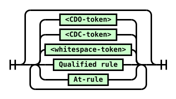

Diagram text: \<whitespace-token\> \<CDC-token\> \<CDO-token\> Qualified rule At-rule

Source railroad grammar (verbatim from the pinned source):

```text

			Star:
				Choice: 3
					N: <CDO-token>
					N: <CDC-token>
					N: <whitespace-token>
					N: Qualified rule
					N: At-rule
			
```
<a id="at-rule-diagram"></a>At-rule  
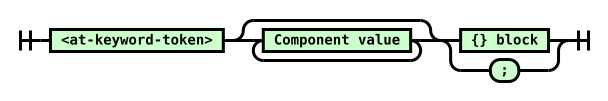

Diagram text: \<at-keyword-token\> Component value {} block ;

Source railroad grammar (verbatim from the pinned source):

```text

			N: <at-keyword-token>
			Star:
				N: Component value
			Choice:
				N: {} block
				T: ;
			
```
<a id="qualified-rule-diagram"></a>Qualified rule  
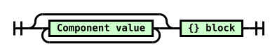

Diagram text: Component value {} block

Source railroad grammar (verbatim from the pinned source):

```text

			Star:
				N: Component value
			N: {} block
			
```
<a id="declaration-list-diagram"></a>{} block  
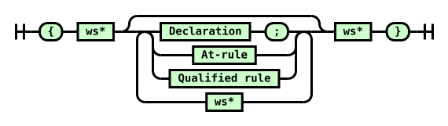

Diagram text: { ws\* Declaration ; At-rule Qualified rule ws\* ws\* }

Source railroad grammar (verbatim from the pinned source):

```text

			T: {
			N: ws*
			Star:
				Choice:
					Seq:
						N: Declaration
						T: ;
					N: At-rule
					N: Qualified rule
				N: ws*
			N: ws*
			T: }
			
```
<a id="declaration-diagram"></a>Declaration  
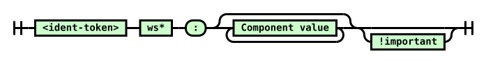

Diagram text: \<ident-token\> ws\* : Component value !important

Source railroad grammar (verbatim from the pinned source):

```text

			N: <ident-token>
			N: ws*
			T: :
			Star:
				N: Component value
			Opt: skip
				N: !important
			
```
<a id="!important-diagram"></a>!important  


Diagram text: ! ws\* \<ident-token "important"\> ws\*

Source railroad grammar (verbatim from the pinned source):

```text

			T: !
			N: ws*
			N: <ident-token "important">
			N: ws*
			
```
<a id="component-value-diagram"></a>Component value  
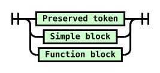

Diagram text: Preserved token Simple block Function block

Source railroad grammar (verbatim from the pinned source):

```text

			Choice:
				N: Preserved token
				N: Simple block
				N: Function block
			
```
<a id="simple-block-diagram"></a>Simple block  
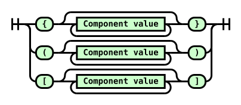

Diagram text: { Component value } ( Component value ) \[ Component value \]

Source railroad grammar (verbatim from the pinned source):

```text

			Choice:
				Seq:
					T: {
					Star:
						N: Component value
					T: }
				Seq:
					T: (
					Star:
						N: Component value
					T: )
				Seq:
					T: [
					Star:
						N: Component value
					T: ]
			
```
<a id="function-block-diagram"></a>Function block  
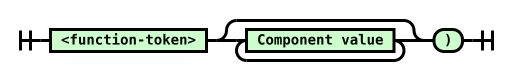

Diagram text: \<function-token\> Component value )

Source railroad grammar (verbatim from the pinned source):

```text

			N: <function-token>
			Star:
				N: Component value
			T: )
			
```
### <a id="css-tree"></a>5.2.  CSS Parsing Results

The result of parsing can be any of the following (or lists of these):

<a id="css-stylesheet"></a>stylesheet

<a id="ref-for-css-rule"></a>

A stylesheet has a list of [rules](#css-rule).

<a id="css-rule"></a>rule

<a id="ref-for-css-rule①"></a>

<a id="ref-for-at-rule①①"></a>

<a id="ref-for-qualified-rule④"></a>

A [rule](#css-rule) is either an [at-rule](#at-rule) or a [qualified rule](#qualified-rule).

<a id="ref-for-at-rule①②"></a>

[at-rule](#at-rule)

<a id="ref-for-statement-at-rule"></a>

<a id="ref-for-css-rule②"></a>

<a id="ref-for-declaration"></a>

<a id="ref-for-block-at-rule"></a>

<a id="ref-for-component-value"></a>

<a id="ref-for-string"></a>

<a id="ref-for-at-rule①③"></a>

An [at-rule](#at-rule) has a name which is a [string](https://infra.spec.whatwg.org/#string), a prelude consisting of a list of [component values](#component-value). [Block at-rules](#block-at-rule) (ending in a {}-block) will additionally have a list of [declarations](#declaration) and a list of child [rules](#css-rule). ([Statement at-rules](#statement-at-rule), ending in a semicolon, will not.)

<a id="qualified-rule"></a>qualified rule

A qualified rule has a prelude consisting of a list of component values, a list of declarations, and a list of child rules.

<a id="ref-for-css-property"></a>

> <strong data-conversion-semantic="note">Note</strong>
>
> Note: Most qualified rules will be style rules, where the prelude is a selector [\[selectors-4\]](#biblio-selectors-4) and its declarations are [properties](https://drafts.csswg.org/css-cascade-5/#css-property).

<a id="declaration"></a>declaration

<a id="ref-for-component-value①"></a>

<a id="ref-for-string①"></a>

A declaration has a name which is a [string](https://infra.spec.whatwg.org/#string), a value consisting of a list of [component values](#component-value), and an <var>important</var> flag which is initially unset. It also has an optional <var>original text</var> which is a <a id="ref-for-string②"></a>string (captured for only a few declarations).

<a id="ref-for-css-property①"></a>

<a id="ref-for-qualified-rule⑤"></a>

<a id="ref-for-css-descriptor"></a>

<a id="ref-for-at-rule①④"></a>

Declarations are further categorized as <a id="css-property-declarations"></a>property declarations or <a id="css-descriptor-declarations"></a>descriptor declarations, with the former setting CSS [properties](https://drafts.csswg.org/css-cascade-5/#css-property) and appearing most often in [qualified rules](#qualified-rule) and the latter setting CSS [descriptors](#css-descriptor), which appear only in [at-rules](#at-rule). (This categorization does not occur at the Syntax level; instead, it is a product of where the declaration appears, and is defined by the respective specifications defining the given rule.)

<a id="component-value"></a>component value

<a id="ref-for-simple-block"></a>

<a id="ref-for-function"></a>

<a id="ref-for-preserved-tokens"></a>

A component value is one of the [preserved tokens](#preserved-tokens), a [function](#function), or a [simple block](#simple-block).

<a id="preserved-tokens"></a>preserved tokens

<a id="ref-for-tokendef-open-square①"></a>

<a id="ref-for-tokendef-open-paren①"></a>

<a id="ref-for-tokendef-open-curly④"></a>

<a id="ref-for-typedef-function-token⑦"></a>

Any token produced by the tokenizer except for [\<function-token\>](#typedef-function-token)s, [\<{-token\>](#tokendef-open-curly)s, [\<(-token\>](#tokendef-open-paren)s, and [\<\[-token\>](#tokendef-open-square)s.

<a id="ref-for-preserved-tokens①"></a>

> <strong data-conversion-semantic="note">Note</strong>
>
> Note: The non-[preserved tokens](#preserved-tokens) listed above are always consumed into higher-level objects, either functions or simple blocks, and so never appear in any parser output themselves.

<a id="ref-for-tokendef-close-curly②"></a>

<a id="ref-for-tokendef-close-paren①"></a>

<a id="ref-for-tokendef-close-square①"></a>

<a id="ref-for-typedef-bad-string-token②"></a>

<a id="ref-for-typedef-bad-url-token⑦"></a>

> <strong data-conversion-semantic="note">Note</strong>
>
> Note: The tokens [\<}-token\>](#tokendef-close-curly)s, [\<)-token\>](#tokendef-close-paren)s, [\<\]-token\>](#tokendef-close-square), [\<bad-string-token\>](#typedef-bad-string-token), and [\<bad-url-token\>](#typedef-bad-url-token) are always parse errors, but they are preserved in the token stream by this specification to allow other specs, such as Media Queries, to define more fine-grained error-handling than just dropping an entire declaration or block.

<a id="function"></a>function

<a id="ref-for-component-value②"></a>

A function has a name and a value consisting of a list of [component values](#component-value).

<a id="simple-block"></a>simple block

<a id="curly-block"></a>{}-block

<a id="square-block"></a>\[\]-block

<a id="paren-block"></a>()-block

<a id="ref-for-tokendef-open-curly⑤"></a>

<a id="ref-for-tokendef-open-paren②"></a>

<a id="ref-for-tokendef-open-square②"></a>

A simple block has an associated token (either a [\<\[-token\>](#tokendef-open-square), [\<(-token\>](#tokendef-open-paren), or [\<{-token\>](#tokendef-open-curly)) and a value consisting of a list of component values.

<a id="ref-for-curly-block"></a>

<a id="ref-for-square-block"></a>

<a id="ref-for-paren-block"></a>

<a id="ref-for-simple-block①"></a>

[{}-block](#curly-block), [\[\]-block](#square-block), and [()-block](#paren-block) refer specifically to a [simple block](#simple-block) with that corresponding associated token.

### <a id="parser-definitions"></a>5.3.  Token Streams

<a id="ref-for-struct"></a>

<a id="ref-for-token-stream-tokens"></a>

<a id="ref-for-component-value③"></a>

<a id="ref-for-struct-item"></a>

A <a id="css-token-stream"></a>token stream is a [struct](https://infra.spec.whatwg.org/#struct) representing a stream of [tokens](#token-stream-tokens) and/or [component values](#component-value). It has the following [items](https://infra.spec.whatwg.org/#struct-item):

<a id="token-stream-tokens"></a>tokens  
<a id="ref-for-list"></a>

<a id="ref-for-token-stream-tokens①"></a>

<a id="ref-for-component-value④"></a>

A [list](https://infra.spec.whatwg.org/#list) of [tokens](#token-stream-tokens) and/or [component values](#component-value).

> <strong data-conversion-semantic="note">Note</strong>
>
> Note: This specification assumes, for simplicity, that the input stream has been fully tokenized before parsing begins. However, the parsing algorithms only use one token of "lookahead", so in practice tokenization and parsing can be done in lockstep.

<a id="token-stream-index"></a>index  
<a id="ref-for-token-stream-tokens②"></a>

An index into the [tokens](#token-stream-tokens), representing the progress of parsing. It starts at 0 initially.

<a id="ref-for-token-stream-mark"></a>

<a id="ref-for-token-stream-index"></a>

<a id="ref-for-token-stream-tokens③"></a>

> <strong data-conversion-semantic="note">Note</strong>
>
> Note: Aside from [marking](#token-stream-mark), the [index](#token-stream-index) never goes backwards. Thus the already-processed prefix of [tokens](#token-stream-tokens) can be eagerly discarded as it’s processed.

<a id="token-stream-marked-indexes"></a>marked indexes  
<a id="ref-for-stack"></a>

A [stack](https://infra.spec.whatwg.org/#stack) of index values, representing points that the parser might return to. It starts empty initially.

<a id="ref-for-css-token-stream①"></a>

<a id="ref-for-consume-a-declaration"></a>

CSS has a small number of places that require referencing the precise text that was parsed for a declaration’s value (not just what tokens were produced from that text). This is not explicitly described in the algorithmic structure here, but the [token stream](#css-token-stream) must, thus, have the ability to reproduce the original text of declarations on demand. See [consume a declaration](#consume-a-declaration) for details on when this is required.

<a id="ref-for-css-token-stream②"></a>

Several operations can be performed on a [token stream](#css-token-stream):

<a id="token-stream-next-token"></a>next token  
<a id="ref-for-token-stream-tokens④"></a>

<a id="ref-for-token-stream-index①"></a>

The item of [tokens](#token-stream-tokens) at [index](#token-stream-index).

<a id="ref-for-typedef-eof-token②"></a>

If that index would be out-of-bounds past the end of the list, it’s instead an [\<eof-token\>](#typedef-eof-token).

<a id="token-stream-empty"></a>empty  
<a id="ref-for-token-stream-empty"></a>

<a id="ref-for-token-stream-next-token"></a>

<a id="ref-for-typedef-eof-token③"></a>

A token stream is [empty](#token-stream-empty) if the [next token](#token-stream-next-token) is an [\<eof-token\>](#typedef-eof-token).

<a id="token-stream-consume-a-token"></a>consume a token  
<a id="ref-for-token-stream-next-token①"></a>

<a id="ref-for-token-stream-index②"></a>

Let <var>token</var> be the [next token](#token-stream-next-token). Increment [index](#token-stream-index), then return <var>token</var>.

<a id="token-stream-discard-a-token"></a>discard a token  
<a id="ref-for-css-token-stream③"></a>

<a id="ref-for-token-stream-empty①"></a>

<a id="ref-for-token-stream-index③"></a>

If the [token stream](#css-token-stream) is not [empty](#token-stream-empty), increment [index](#token-stream-index).

<a id="token-stream-mark"></a>mark  
<a id="ref-for-token-stream-index④"></a>

<a id="ref-for-token-stream-marked-indexes"></a>

Append [index](#token-stream-index) to [marked indexes](#token-stream-marked-indexes).

<a id="token-stream-restore-a-mark"></a>restore a mark  
<a id="ref-for-stack-pop"></a>

<a id="ref-for-token-stream-marked-indexes①"></a>

<a id="ref-for-token-stream-index⑤"></a>

[Pop](https://infra.spec.whatwg.org/#stack-pop) from [marked indexes](#token-stream-marked-indexes), and set [index](#token-stream-index) to the popped value.

<a id="token-stream-discard-a-mark"></a>discard a mark  
<a id="ref-for-stack-pop①"></a>

<a id="ref-for-token-stream-marked-indexes②"></a>

[Pop](https://infra.spec.whatwg.org/#stack-pop) from [marked indexes](#token-stream-marked-indexes), and do nothing with the popped value.

<a id="token-stream-discard-whitespace"></a>discard whitespace  
<a id="ref-for-token-stream-next-token②"></a>

<a id="ref-for-typedef-whitespace-token②"></a>

<a id="ref-for-token-stream-discard-a-token"></a>

While the [next token](#token-stream-next-token) is a [\<whitespace-token\>](#typedef-whitespace-token), [discard a token](#token-stream-discard-a-token).

<a id="token-stream-process"></a>process  
<a id="ref-for-token-stream-process"></a>

<a id="ref-for-token-stream-next-token③"></a>

To [process](#token-stream-process), given a following list of token types and associated actions, perform the action associated with the [next token](#token-stream-next-token). Repeat until one of the actions returns something, then return that.

<a id="ref-for-typedef-eof-token④"></a>

<a id="ref-for-css-token-stream④"></a>

An <a id="typedef-eof-token"></a>[\<eof-token\>](#typedef-eof-token) is a conceptual token, not actually produced by the tokenizer, used to indicate that the [token stream](#css-token-stream) has been exhausted.

### <a id="parser-entry-points"></a>5.4.  Parser Entry Points

The algorithms defined in this section produce high-level CSS objects from lists of CSS tokens.

The algorithms here operate on a token stream as input, but for convenience can also be invoked with a number of other value types.

To <a id="normalize-into-a-token-stream"></a>normalize into a token stream a given <var>input</var>:

1.  <a id="ref-for-css-token-stream⑤"></a>

    If <var>input</var> is already a [token stream](#css-token-stream), return it.

2.  <a id="ref-for-token-stream-tokens⑤"></a>

    <a id="ref-for-component-value⑤"></a>

    <a id="ref-for-css-token-stream⑥"></a>

    If <var>input</var> is a list of CSS [tokens](#token-stream-tokens) and/or [component values](#component-value), create a new [token stream](#css-token-stream) with <var>input</var> as its <a id="ref-for-token-stream-tokens⑥"></a>tokens, and return it.

3.  <a id="ref-for-string③"></a>

    <a id="ref-for-css-filter-code-points①"></a>

    <a id="ref-for-css-tokenize"></a>

    If <var>input</var> is a [string](https://infra.spec.whatwg.org/#string), then [filter code points](#css-filter-code-points) from <var>input</var>, [tokenize](#css-tokenize) the result, and return the stream of tokens.

4.  Assert: Only the preceding types should be passed as <var>input</var>.

> <strong data-conversion-semantic="note">Note</strong>
>
> Note: Other specs can define additional entry points for their own purposes.

> <strong data-conversion-semantic="note">Note</strong>
>
> The following notes should probably be translated into normative text in the relevant specs, hooking this spec’s terms:
>
> - <a id="ref-for-parse-a-stylesheet"></a>
>
>   "[Parse a stylesheet](#parse-a-stylesheet)" is intended to be the normal parser entry point, for parsing stylesheets.
>
> - <a id="ref-for-dom-cssstylesheet-replace"></a>
>
>   <a id="ref-for-parse-a-stylesheets-contents"></a>
>
>   "[Parse a stylesheet’s contents](#parse-a-stylesheets-contents)" is intended for use by the <code><a href="https://drafts.csswg.org/cssom-1/#dom-cssstylesheet-replace">CSSStyleSheet replace()</a></code> method, and similar, which parse text into the contents of an existing stylesheet.
>
> - <a id="ref-for-dom-cssstylesheet-insertrule"></a>
>
>   <a id="ref-for-parse-a-rule"></a>
>
>   "[Parse a rule](#parse-a-rule)" is intended for use by the <code><a href="https://drafts.csswg.org/cssom-1/#dom-cssstylesheet-insertrule">CSSStyleSheet insertRule()</a></code> method, and similar, which parse text into a single rule. `CSSStyleSheet#insertRule` method, and similar functions which might exist, which parse text into a single rule.
>
> - <a id="ref-for-at-ruledef-supports"></a>
>
>   <a id="ref-for-parse-a-declaration"></a>
>
>   "[Parse a declaration](#parse-a-declaration)" is used in [@supports](https://drafts.csswg.org/css-conditional-3/#at-ruledef-supports) conditions. [\[CSS3-CONDITIONAL\]](#biblio-css3-conditional)
>
> - <a id="ref-for-dom-cssstyledeclaration-csstext"></a>
>
>   <a id="ref-for-parse-a-blocks-contents"></a>
>
>   "[Parse a block’s contents](#parse-a-blocks-contents)" is intended for parsing the contents of any block in CSS (including things like the style attribute), and APIs such as <code><a href="https://drafts.csswg.org/cssom-1/#dom-cssstyledeclaration-csstext">the CSSStyleDeclaration cssText attribute</a></code>.
>
> - <a id="ref-for-funcdef-attr"></a>
>
>   <a id="ref-for-parse-a-component-value"></a>
>
>   "[Parse a component value](#parse-a-component-value)" is for things that need to consume a single value, like the parsing rules for [attr()](https://drafts.csswg.org/css-values-5/#funcdef-attr).
>
> - <a id="ref-for-parse-a-list-of-component-values"></a>
>
>   "[Parse a list of component values](#parse-a-list-of-component-values)" is for the contents of presentational attributes, which parse text into a single declaration’s value, or for parsing a stand-alone selector [\[SELECT\]](#biblio-select) or list of Media Queries [\[MEDIAQ\]](#biblio-mediaq), as in [Selectors API](https://www.w3.org/TR/selectors-api/) or the `media` HTML attribute.

#### <a id="parse-grammar"></a>5.4.1.  Parse something according to a CSS grammar

<a id="ref-for-typedef-color"></a>

It is often desirable to parse a string or token list to see if it matches some CSS grammar, and if it does, to destructure it according to the grammar. This section provides a generic hook for this kind of operation. It should be invoked like "parse <var>foo</var> as a CSS [\<color\>](https://drafts.csswg.org/css-color-5/#typedef-color)", or similar.

<a id="ref-for-string-value"></a>

This algorithm returns either failure, if the input does not match the provided grammar, or the result of parsing the input according to the grammar, which is an unspecified structure corresponding to the provided grammar specification. The return value must only be interacted with by specification prose, where the representation ambiguity is not problematic. If it is meant to be exposed outside of spec language, the spec using the result must explicitly translate it into a well-specified representation, such as, for example, by invoking a CSS serialization algorithm (like "serialize as a CSS [\<string\>](https://drafts.csswg.org/css-values-4/#string-value) value").

<a id="ref-for-css-parse-a-comma-separated-list-according-to-a-css-grammar"></a>

> <strong data-conversion-semantic="note">Note</strong>
>
> Note: This algorithm, and [parse a comma-separated list according to a CSS grammar](#css-parse-a-comma-separated-list-according-to-a-css-grammar), are <em>usually</em> the only parsing algorithms other specs will want to call. The remaining parsing algorithms are meant mostly for [\[CSSOM\]](#biblio-cssom) and related "explicitly constructing CSS structures" cases. Consult the CSSWG for guidance first if you think you need to use one of the other algorithms.

<a id="ref-for-css-parse-something-according-to-a-css-grammar"></a>

To <a id="css-parse-something-according-to-a-css-grammar"></a>parse something according to a CSS grammar (aka simply [parse](#css-parse-something-according-to-a-css-grammar)) given an <var>input</var> and a CSS <var>grammar</var> production:

1.  <a id="ref-for-normalize-into-a-token-stream"></a>

    [Normalize](#normalize-into-a-token-stream) <var>input</var>, and set <var>input</var> to the result.

2.  <a id="ref-for-parse-a-list-of-component-values①"></a>

    [Parse a list of component values](#parse-a-list-of-component-values) from <var>input</var>, and let <var>result</var> be the return value.

3.  Attempt to match <var>result</var> against <var>grammar</var>. If this is successful, return the matched result; otherwise, return failure.

#### <a id="parse-comma-list"></a>5.4.2.  Parse a comma-separated list according to a CSS grammar

<a id="ref-for-css-parse-something-according-to-a-css-grammar①"></a>

While one can definitely [parse](#css-parse-something-according-to-a-css-grammar) a value according to a grammar with commas in it, if <em>any</em> part of the value fails to parse, the entire thing doesn’t parse, and returns failure.

<a id="ref-for-attr-img-sizes"></a>

Sometimes that’s what’s desired (such as in list-valued CSS properties); other times, it’s better to let each comma-separated sub-part of the value parse separately, dealing with the parts that parse successfully one way, and the parts that fail to parse another way (typically ignoring them, such as in <code><a href="https://html.spec.whatwg.org/multipage/embedded-content.html#attr-img-sizes">&lt;img sizes&gt;</a></code>).

<a id="ref-for-css-parse-something-according-to-a-css-grammar②"></a>

This algorithm provides an easy hook to accomplish exactly that. It returns a list of values split by "top-level" commas, where each values is either failure (if it failed to parse) or the result of parsing (an unspecified structure, as described in the [parse](#css-parse-something-according-to-a-css-grammar) algorithm).

<a id="ref-for-css-parse-a-comma-separated-list-according-to-a-css-grammar①"></a>

To <a id="css-parse-a-comma-separated-list-according-to-a-css-grammar"></a>parse a comma-separated list according to a CSS grammar (aka [parse a list](#css-parse-a-comma-separated-list-according-to-a-css-grammar)) given an <var>input</var> and a CSS <var>grammar</var> production:

1.  <a id="ref-for-normalize-into-a-token-stream①"></a>

    [Normalize](#normalize-into-a-token-stream) <var>input</var>, and set <var>input</var> to the result.

2.  <a id="ref-for-list①"></a>

    <a id="ref-for-typedef-whitespace-token③"></a>

    If <var>input</var> contains only [\<whitespace-token\>](#typedef-whitespace-token)s, return an empty [list](https://infra.spec.whatwg.org/#list).

3.  <a id="ref-for-parse-a-comma-separated-list-of-component-values"></a>

    [Parse a comma-separated list of component values](#parse-a-comma-separated-list-of-component-values) from <var>input</var>, and let <var>list</var> be the return value.

4.  <a id="ref-for-css-parse-something-according-to-a-css-grammar③"></a>

    <a id="ref-for-list-iterate"></a>

    [For each](https://infra.spec.whatwg.org/#list-iterate) <var>item</var> of <var>list</var>, replace <var>item</var> with the result of [parsing](#css-parse-something-according-to-a-css-grammar) <var>item</var> with <var>grammar</var>.

5.  Return <var>list</var>.

#### <a id="parse-stylesheet"></a>5.4.3.  Parse a stylesheet

<a id="ref-for-concept-url"></a>

To <a id="parse-a-stylesheet"></a>parse a stylesheet from an <var>input</var> given an optional [url](https://url.spec.whatwg.org/#concept-url) <var>location</var>:

1.  <a id="ref-for-css-decode-bytes"></a>

    If <var>input</var> is a byte stream for a stylesheet, [decode bytes](#css-decode-bytes) from <var>input</var>, and set <var>input</var> to the result.

2.  <a id="ref-for-normalize-into-a-token-stream②"></a>

    [Normalize](#normalize-into-a-token-stream) <var>input</var>, and set <var>input</var> to the result.

3.  <a id="ref-for-concept-css-style-sheet-location"></a>

    Create a new stylesheet, with its [location](https://drafts.csswg.org/cssom-1/#concept-css-style-sheet-location) set to <var>location</var> (or null, if <var>location</var> was not passed).

4.  <a id="ref-for-consume-a-stylesheets-contents"></a>

    [Consume a stylesheet’s contents](#consume-a-stylesheets-contents) from <var>input</var>, and set the stylesheet’s rules to the result.

5.  Return the stylesheet.

#### <a id="parse-stylesheet-contents"></a>5.4.4. <a id="parse-list-of-rules"></a> Parse a stylesheet’s contents

To <a id="parse-a-stylesheets-contents"></a>parse a stylesheet’s contents from <var>input</var>:

1.  <a id="ref-for-normalize-into-a-token-stream③"></a>

    [Normalize](#normalize-into-a-token-stream) <var>input</var>, and set <var>input</var> to the result.

2.  <a id="ref-for-consume-a-stylesheets-contents①"></a>

    [Consume a stylesheet’s contents](#consume-a-stylesheets-contents) from <var>input</var>, and return the result.

#### <a id="parse-block-contents"></a>5.4.5. <a id="parse-list-of-declarations"></a> Parse a block’s contents

To <a id="parse-a-blocks-contents"></a>parse a block’s contents from <var>input</var>:

1.  <a id="ref-for-normalize-into-a-token-stream④"></a>

    [Normalize](#normalize-into-a-token-stream) <var>input</var>, and set <var>input</var> to the result.

2.  <a id="ref-for-consume-a-blocks-contents"></a>

    [Consume a block’s contents](#consume-a-blocks-contents) from <var>input</var>, and return the result.

#### <a id="parse-rule"></a>5.4.6.  Parse a rule

To <a id="parse-a-rule"></a>parse a rule from <var>input</var>:

1.  <a id="ref-for-normalize-into-a-token-stream⑤"></a>

    [Normalize](#normalize-into-a-token-stream) <var>input</var>, and set <var>input</var> to the result.

2.  <a id="ref-for-token-stream-discard-whitespace"></a>

    [Discard whitespace](#token-stream-discard-whitespace) from <var>input</var>.

3.  <a id="ref-for-typedef-eof-token⑤"></a>

    <a id="ref-for-token-stream-next-token④"></a>

    If the [next token](#token-stream-next-token) from <var>input</var> is an [\<EOF-token\>](#typedef-eof-token), return a syntax error.

    <a id="ref-for-token-stream-next-token⑤"></a>

    <a id="ref-for-typedef-at-keyword-token⑤"></a>

    <a id="ref-for-consume-an-at-rule"></a>

    Otherwise, if the [next token](#token-stream-next-token) from <var>input</var> is an [\<at-keyword-token\>](#typedef-at-keyword-token), [consume an at-rule](#consume-an-at-rule) from <var>input</var>, and let <var>rule</var> be the return value.

    <a id="ref-for-consume-a-qualified-rule"></a>

    <a id="ref-for-invalid-rule-error"></a>

    Otherwise, [consume a qualified rule](#consume-a-qualified-rule) from <var>input</var> and let <var>rule</var> be the return value. If nothing or an [invalid rule error](#invalid-rule-error) was returned, return a syntax error.

4.  <a id="ref-for-token-stream-discard-whitespace①"></a>

    [Discard whitespace](#token-stream-discard-whitespace) from <var>input</var>.

5.  <a id="ref-for-typedef-eof-token⑥"></a>

    <a id="ref-for-token-stream-next-token⑥"></a>

    If the [next token](#token-stream-next-token) from <var>input</var> is an [\<EOF-token\>](#typedef-eof-token), return <var>rule</var>. Otherwise, return a syntax error.

#### <a id="parse-declaration"></a>5.4.7.  Parse a declaration

<a id="ref-for-parse-a-list-of-declarations"></a>

> <strong data-conversion-semantic="note">Note</strong>
>
> Note: Unlike "[Parse a list of declarations](https://www.w3.org/TR/css-syntax-3/#parse-a-list-of-declarations)", this parses only a declaration and not an at-rule.

To <a id="parse-a-declaration"></a>parse a declaration from <var>input</var>:

1.  <a id="ref-for-normalize-into-a-token-stream⑥"></a>

    [Normalize](#normalize-into-a-token-stream) <var>input</var>, and set <var>input</var> to the result.

2.  <a id="ref-for-token-stream-discard-whitespace②"></a>

    [Discard whitespace](#token-stream-discard-whitespace) from <var>input</var>.

3.  <a id="ref-for-consume-a-declaration①"></a>

    [Consume a declaration](#consume-a-declaration) from <var>input</var>. If anything was returned, return it. Otherwise, return a syntax error.

#### <a id="parse-component-value"></a>5.4.8.  Parse a component value

To <a id="parse-a-component-value"></a>parse a component value from <var>input</var>:

1.  <a id="ref-for-normalize-into-a-token-stream⑦"></a>

    [Normalize](#normalize-into-a-token-stream) <var>input</var>, and set <var>input</var> to the result.

2.  <a id="ref-for-token-stream-discard-whitespace③"></a>

    [Discard whitespace](#token-stream-discard-whitespace) from <var>input</var>.

3.  <a id="ref-for-token-stream-empty②"></a>

    If <var>input</var> is [empty](#token-stream-empty), return a syntax error.

4.  <a id="ref-for-consume-a-component-value"></a>

    [Consume a component value](#consume-a-component-value) from <var>input</var> and let <var>value</var> be the return value.

5.  <a id="ref-for-token-stream-discard-whitespace④"></a>

    [Discard whitespace](#token-stream-discard-whitespace) from <var>input</var>.

6.  <a id="ref-for-token-stream-empty③"></a>

    If <var>input</var> is [empty](#token-stream-empty), return <var>value</var>. Otherwise, return a syntax error.

#### <a id="parse-list-of-component-values"></a>5.4.9.  Parse a list of component values

To <a id="parse-a-list-of-component-values"></a>parse a list of component values from <var>input</var>:

1.  <a id="ref-for-normalize-into-a-token-stream⑧"></a>

    [Normalize](#normalize-into-a-token-stream) <var>input</var>, and set <var>input</var> to the result.

2.  <a id="ref-for-consume-a-list-of-component-values"></a>

    [Consume a list of component values](#consume-a-list-of-component-values) from <var>input</var>, and return the result.

#### <a id="parse-comma-separated-list-of-component-values"></a>5.4.10.  Parse a comma-separated list of component values

To <a id="parse-a-comma-separated-list-of-component-values"></a>parse a comma-separated list of component values from <var>input</var>:

1.  <a id="ref-for-normalize-into-a-token-stream⑨"></a>

    [Normalize](#normalize-into-a-token-stream) <var>input</var>, and set <var>input</var> to the result.

2.  <a id="ref-for-list②"></a>

    Let <var>groups</var> be an empty [list](https://infra.spec.whatwg.org/#list).

3.  <a id="ref-for-token-stream-empty④"></a>

    While <var>input</var> is not [empty](#token-stream-empty):

    1.  <a id="ref-for-consume-a-list-of-component-values①"></a>

        <a id="ref-for-typedef-comma-token①"></a>

        [Consume a list of component values](#consume-a-list-of-component-values) from <var>input</var>, with [\<comma-token\>](#typedef-comma-token) as the stop token, and append the result to <var>groups</var>.

    2.  <a id="ref-for-token-stream-discard-a-token①"></a>

        [Discard a token](#token-stream-discard-a-token) from <var>input</var>.

4.  Return <var>groups</var>.

### <a id="parser-algorithms"></a>5.5.  Parser Algorithms

The following algorithms comprise the parser. They are called by the parser entry points above, and generally should not be called directly by other specifications.

Note that CSS parsing is case-sensitive, and checking the validity of constructs in a given context must be done <em>during</em> parsing in at least some circumstances. This specification intentionally does not specify <em>how</em> sufficient context should be passed around to enable validity-checking.

#### <a id="consume-stylesheet-contents"></a>5.5.1. <a id="consume-list-of-rules"></a> Consume a stylesheet’s contents

<a id="ref-for-css-token-stream⑦"></a>

To <a id="consume-a-stylesheets-contents"></a>consume a stylesheet’s contents from a [token stream](#css-token-stream) <var>input</var>:

<a id="ref-for-list③"></a>

Let <var>rules</var> be an initially empty [list](https://infra.spec.whatwg.org/#list) of rules.

<a id="ref-for-token-stream-process①"></a>

[Process](#token-stream-process) <var>input</var>:

<a id="ref-for-typedef-whitespace-token④"></a>

[\<whitespace-token\>](#typedef-whitespace-token)

<a id="ref-for-token-stream-discard-a-token②"></a>

[Discard a token](#token-stream-discard-a-token) from <var>input</var>.

<a id="ref-for-typedef-eof-token⑦"></a>

[\<EOF-token\>](#typedef-eof-token)

Return <var>rules</var>.

<a id="ref-for-typedef-cdo-token②"></a>

[\<CDO-token\>](#typedef-cdo-token)

<a id="ref-for-typedef-cdc-token②"></a>

[\<CDC-token\>](#typedef-cdc-token)

<a id="ref-for-token-stream-discard-a-token③"></a>

[Discard a token](#token-stream-discard-a-token) from <var>input</var>.

> <strong data-conversion-semantic="note">Note</strong>
>
> What’s this for?
>
> <a id="ref-for-the-style-element"></a>
>
> Back when CSS was first being introduced, the <code><a href="https://html.spec.whatwg.org/multipage/semantics.html#the-style-element">style</a></code> element was treated as an unknown element by older browsers. To avoid having its contents displayed in the page for these legacy browsers, it became common practice to wrap the stylesheet in an HTML comment, and newer browsers would simply ignore the HTML comment syntax. This requirement carries over to today, decades later.
>
> <a id="ref-for-script"></a>
>
> The same practice was done for <code><a href="https://html.spec.whatwg.org/multipage/scripting.html#script">script</a></code> elements, where HTML comment syntax is treated as a line comment in JS (similar to `//`) for the same reason.

<a id="ref-for-typedef-at-keyword-token⑥"></a>

[\<at-keyword-token\>](#typedef-at-keyword-token)

<a id="ref-for-consume-an-at-rule①"></a>

[Consume an at-rule](#consume-an-at-rule) from <var>input</var>. If anything is returned, append it to <var>rules</var>.

anything else

<a id="ref-for-css-rule③"></a>

<a id="ref-for-consume-a-qualified-rule①"></a>

[Consume a qualified rule](#consume-a-qualified-rule) from <var>input</var>. If a [rule](#css-rule) is returned, append it to <var>rules</var>.

#### <a id="consume-at-rule"></a>5.5.2.  Consume an at-rule

<a id="ref-for-css-token-stream⑧"></a>

To <a id="consume-an-at-rule"></a>consume an at-rule from a [token stream](#css-token-stream) <var>input</var>, given an optional bool <var>nested</var> (default false):

<a id="ref-for-token-stream-next-token⑦"></a>

<a id="ref-for-typedef-at-keyword-token⑦"></a>

Assert: The [next token](#token-stream-next-token) is an [\<at-keyword-token\>](#typedef-at-keyword-token).

<a id="ref-for-token-stream-consume-a-token"></a>

<a id="ref-for-at-rule①⑤"></a>

<a id="ref-for-list④"></a>

[Consume a token](#token-stream-consume-a-token) from <var>input</var>, and let <var>rule</var> be a new [at-rule](#at-rule) with its name set to the returned token’s value, its prelude initially set to an empty [list](https://infra.spec.whatwg.org/#list), and no declarations or child rules.

<a id="ref-for-token-stream-process②"></a>

[Process](#token-stream-process) <var>input</var>:

<a id="ref-for-typedef-semicolon-token②"></a>

[\<semicolon-token\>](#typedef-semicolon-token)

<a id="ref-for-typedef-eof-token⑧"></a>

[\<EOF-token\>](#typedef-eof-token)

<a id="ref-for-token-stream-discard-a-token④"></a>

[Discard a token](#token-stream-discard-a-token) from <var>input</var>. If <var>rule</var> is valid in the current context, return it; otherwise return nothing.

<a id="ref-for-tokendef-close-curly③"></a>

[\<}-token\>](#tokendef-close-curly)

If <var>nested</var> is true:

- If <var>rule</var> is valid in the current context, return it.

- Otherwise, return nothing.

<a id="ref-for-token-stream-consume-a-token①"></a>

Otherwise, [consume a token](#token-stream-consume-a-token) and append the result to <var>rule</var>’s prelude.

<a id="ref-for-tokendef-open-curly⑥"></a>

[\<{-token\>](#tokendef-open-curly)

<a id="ref-for-css-rule④"></a>

<a id="ref-for-consume-a-block"></a>

[Consume a block](#consume-a-block) from <var>input</var>, and assign the result to <var>rule</var>’s child [rules](#css-rule).

<a id="ref-for-list⑤"></a>

<a id="ref-for-declaration①"></a>

<a id="ref-for-nested-declarations-rule"></a>

> <strong data-conversion-semantic="note">Note</strong>
>
> Note: If the result contains [lists](https://infra.spec.whatwg.org/#list) of [declarations](#declaration), how they’re materialized in the CSSOM depends on the rule. Some turn them all into [nested declarations rules](https://drafts.csswg.org/css-nesting-1/#nested-declarations-rule), others will treat them all as declarations, and others will treat the first item differently from the rest.

If <var>rule</var> is valid in the current context, return it. Otherwise, return nothing.

anything else

<a id="ref-for-consume-a-component-value①"></a>

[Consume a component value](#consume-a-component-value) from <var>input</var> and append the returned value to <var>rule</var>’s prelude.

#### <a id="consume-qualified-rule"></a>5.5.3.  Consume a qualified rule

<a id="ref-for-css-token-stream⑨"></a>

<a id="ref-for-token-stream-tokens⑦"></a>

To <a id="consume-a-qualified-rule"></a>consume a qualified rule, from a [token stream](#css-token-stream) <var>input</var>, given an optional [token](#token-stream-tokens) <var>stop token</var> and an optional bool <var>nested</var> (default false):

<a id="ref-for-qualified-rule⑥"></a>

<a id="ref-for-list⑥"></a>

Let <var>rule</var> be a new [qualified rule](#qualified-rule) with its prelude, declarations, and child rules all initially set to empty [lists](https://infra.spec.whatwg.org/#list).

<a id="ref-for-token-stream-process③"></a>

[Process](#token-stream-process) <var>input</var>:

<a id="ref-for-typedef-eof-token⑨"></a>

[\<EOF-token\>](#typedef-eof-token)

<var>stop token</var> (if passed)

<a id="ref-for-parse-error⑨"></a>

This is a [parse error](#parse-error). Return nothing.

<a id="ref-for-tokendef-close-curly④"></a>

[\<}-token\>](#tokendef-close-curly)

<a id="ref-for-token-stream-consume-a-token②"></a>

<a id="ref-for-parse-error①⓪"></a>

This is a [parse error](#parse-error). If <var>nested</var> is true, return nothing. Otherwise, [consume a token](#token-stream-consume-a-token) and append the result to <var>rule</var>’s prelude.

<a id="ref-for-tokendef-open-curly⑦"></a>

[\<{-token\>](#tokendef-open-curly)

<a id="ref-for-typedef-colon-token①"></a>

<a id="ref-for-typedef-ident-token⑥"></a>

<a id="ref-for-typedef-whitespace-token⑤"></a>

If the first two non-[\<whitespace-token\>](#typedef-whitespace-token) values of <var>rule</var>’s prelude are an [\<ident-token\>](#typedef-ident-token) whose value starts with "--" followed by a [\<colon-token\>](#typedef-colon-token), then:

- <a id="ref-for-consume-the-remnants-of-a-bad-declaration"></a>

  If <var>nested</var> is true, [consume the remnants of a bad declaration](#consume-the-remnants-of-a-bad-declaration) from <var>input</var>, with <var>nested</var> set to true, and return nothing.

- <a id="ref-for-consume-a-block①"></a>

  If <var>nested</var> is false, [consume a block](#consume-a-block) from <var>input</var>, and return nothing.

> <strong data-conversion-semantic="note">Note</strong>
>
> What’s this check for?
>
> <a id="ref-for-declaration②"></a>
>
> <a id="ref-for-qualified-rule⑦"></a>
>
> [Declarations](#declaration) and [qualified rules](#qualified-rule) don’t <em>generally</em> overlap in their allowed syntax. No currently-defined CSS property allows {}-blocks in its value, so `foo:bar {};` is definitely a rule, and `foo: bar;` is definitely a property. Even if a future CSS property allows {}-blocks in its value, the allowed syntax is restricted to the {}-block being the whole value, such as `foo: {...};`, which is guaranteed to not be a valid rule, since the : doesn’t have an ident or function following it to mark it as a pseudo-class.
>
> This allows us to mix declarations and rules in the same context: we first try to parse something as a declaration, and if that doesn’t result in a valid declaration, we reparse it as a rule instead. An accidentally-invalid declaration will parse as a rule instead, but that’s fine: the parser will stop at the declaration’s ending semicolon and consider it an invalid rule. (Or in the case of a property containing a {}-block, will stop just \*before\* the semicolon, still considering it an invalid rule, and then the next attempt to parse something will throw out the lone semicolon as invalid.) So the total amount of tokens consumed is the same regardless.
>
> <a id="ref-for-custom-property"></a>
>
> <a id="ref-for-funcdef-var"></a>
>
> [Custom properties](https://drafts.csswg.org/css-variables-2/#custom-property), however, don’t have the CSSWG carefully vetting their syntax. Authors <em>can</em> write a custom property that takes a {}-block in its value, even combined with other things; if that custom property is then invalid (due to an invalidly-written [var()](https://drafts.csswg.org/css-variables-2/#funcdef-var) function, for example), when it’s reparsed as a rule it will stop early, at the {}-block. The remaining tokens of the custom property’s value will then get parsed as a fresh construct, potentially causing unexpected declarations or rules to be created.
>
> <a id="ref-for-custom-property①"></a>
>
> <a id="ref-for-qualified-rule⑧"></a>
>
> To avoid this (admittedly very niche) corner-case, we subtract the syntax of a [custom property](https://drafts.csswg.org/css-variables-2/#custom-property) from that of a [qualified rule](#qualified-rule); if you’re in a context that allows properties and rules to be mixed, and you somehow end up parsing a rule that looks like a <a id="ref-for-custom-property②"></a>custom property, you’ve messed up, and need to instead consume an entire custom property (all the way to the ending semicolon).
>
> (If we’re in a context that doesn’t allow properties, we just throw away the rule if it looks like a custom property. This ensures that `--foo:hover { color: blue; }` is consistently invalid everywhere, without potentially consuming a ton of a stylesheet looking for the non-existent ending semicolon.)

<a id="ref-for-consume-a-block②"></a>

<a id="ref-for-list⑦"></a>

<a id="ref-for-declaration③"></a>

<a id="ref-for-nested-declarations-rule①"></a>

<a id="ref-for-css-rule⑤"></a>

Otherwise, [consume a block](#consume-a-block) from <var>input</var>, and let <var>child rules</var> be the result. If the first item of <var>child rules</var> is a [list](https://infra.spec.whatwg.org/#list) of [declarations](#declaration), remove it from <var>child rules</var> and assign it to <var>rule</var>’s declarations. If any remaining items of <var>child rules</var> are <a id="ref-for-list⑧"></a>lists of <a id="ref-for-declaration④"></a>declarations, replace them with [nested declarations rules](https://drafts.csswg.org/css-nesting-1/#nested-declarations-rule) containing the <a id="ref-for-list⑨"></a>list as its sole child. Assign <var>child rules</var> to <var>rule</var>’s child [rules](#css-rule).

If <var>rule</var> is valid in the current context, return it; otherwise return an <a id="invalid-rule-error"></a>invalid rule error.

anything else

<a id="ref-for-consume-a-component-value②"></a>

[Consume a component value](#consume-a-component-value) from <var>input</var> and append the result to <var>rule</var>’s prelude.

#### <a id="consume-block"></a>5.5.4.  Consume a block

<a id="ref-for-css-token-stream①⓪"></a>

To <a id="consume-a-block"></a>consume a block, from a [token stream](#css-token-stream) <var>input</var>:

<a id="ref-for-token-stream-next-token⑧"></a>

<a id="ref-for-tokendef-open-curly⑧"></a>

Assert: The [next token](#token-stream-next-token) is a [\<{-token\>](#tokendef-open-curly).

<a id="ref-for-token-stream-discard-a-token⑤"></a>

<a id="ref-for-consume-a-blocks-contents①"></a>

[Discard a token](#token-stream-discard-a-token) from <var>input</var>. [Consume a block’s contents](#consume-a-blocks-contents) from <var>input</var> and let <var>rules</var> be the result. <a id="ref-for-token-stream-discard-a-token⑥"></a>Discard a token from <var>input</var>.

Return <var>rules</var>.

#### <a id="consume-block-contents"></a>5.5.5. <a id="consume-list-of-declarations"></a> Consume a block’s contents

<a id="ref-for-css-token-stream①①"></a>

To <a id="consume-a-blocks-contents"></a>consume a block’s contents from a [token stream](#css-token-stream) <var>input</var>:

<a id="ref-for-list①⓪"></a>

<a id="ref-for-css-rule⑥"></a>

<a id="ref-for-declaration⑤"></a>

<a id="ref-for-cssstyledeclaration"></a>

<a id="ref-for-cssnesteddeclarations"></a>

> <strong data-conversion-semantic="note">Note</strong>
>
> Note: This algorithm returns a [list](https://infra.spec.whatwg.org/#list), consisting of [rules](#css-rule) and <a id="ref-for-list①①"></a>lists of [declarations](#declaration). Depending on the parent context, a <a id="ref-for-list①②"></a>list of <a id="ref-for-declaration⑥"></a>declarations might be materialized in the CSSOM as either a <code><a href="https://drafts.csswg.org/cssom-1/#cssstyledeclaration">CSSStyleDeclaration</a></code>, or as a <code><a href="https://drafts.csswg.org/css-nesting-1/#cssnesteddeclarations">CSSNestedDeclarations</a></code> rule.

<a id="ref-for-list①③"></a>

<a id="ref-for-css-rule⑦"></a>

<a id="ref-for-declaration⑦"></a>

Let <var>rules</var> be an empty [list](https://infra.spec.whatwg.org/#list), containing either [rules](#css-rule) or <a id="ref-for-list①④"></a>lists of [declarations](#declaration).

<a id="ref-for-list①⑤"></a>

<a id="ref-for-declaration⑧"></a>

Let <var>decls</var> be an empty [list](https://infra.spec.whatwg.org/#list) of [declarations](#declaration).

<a id="ref-for-token-stream-process④"></a>

[Process](#token-stream-process) <var>input</var>:

<a id="ref-for-typedef-whitespace-token⑥"></a>

[\<whitespace-token\>](#typedef-whitespace-token)

<a id="ref-for-typedef-semicolon-token③"></a>

[\<semicolon-token\>](#typedef-semicolon-token)

<a id="ref-for-token-stream-discard-a-token⑦"></a>

[Discard a token](#token-stream-discard-a-token) from <var>input</var>.

<a id="ref-for-typedef-eof-token①⓪"></a>

[\<EOF-token\>](#typedef-eof-token)

<a id="ref-for-tokendef-close-curly⑤"></a>

[\<}-token\>](#tokendef-close-curly)

Return <var>rules</var>.

<a id="ref-for-typedef-at-keyword-token⑧"></a>

[\<at-keyword-token\>](#typedef-at-keyword-token)

<a id="ref-for-declaration⑨"></a>

<a id="ref-for-list①⑥"></a>

If <var>decls</var> is not empty, append it to <var>rules</var>, and set <var>decls</var> to a fresh empty [list](https://infra.spec.whatwg.org/#list) of [declarations](#declaration).

<a id="ref-for-consume-an-at-rule②"></a>

<a id="ref-for-css-rule⑧"></a>

[Consume an at-rule](#consume-an-at-rule) from <var>input</var>, with <var>nested</var> set to true. If a [rule](#css-rule) was returned, append it to <var>rules</var>.

anything else

<a id="ref-for-token-stream-mark①"></a>

[Mark](#token-stream-mark) <var>input</var>.

<a id="ref-for-consume-a-declaration②"></a>

<a id="ref-for-declaration①⓪"></a>

<a id="ref-for-token-stream-discard-a-mark"></a>

[Consume a declaration](#consume-a-declaration) from <var>input</var>, with <var>nested</var> set to true. If a [declaration](#declaration) was returned, append it to <var>decls</var>, and [discard a mark](#token-stream-discard-a-mark) from <var>input</var>.

<a id="ref-for-token-stream-restore-a-mark"></a>

<a id="ref-for-consume-a-qualified-rule②"></a>

<a id="ref-for-typedef-semicolon-token④"></a>

Otherwise, [restore a mark](#token-stream-restore-a-mark) from <var>input</var>, then [consume a qualified rule](#consume-a-qualified-rule) from <var>input</var>, with <var>nested</var> set to true, and [\<semicolon-token\>](#typedef-semicolon-token) as the <var>stop token</var>.

If nothing was returned

Do nothing

<a id="ref-for-invalid-rule-error①"></a>

If an [invalid rule error](#invalid-rule-error) was returned

<a id="ref-for-list①⑦"></a>

<a id="ref-for-declaration①①"></a>

If <var>decls</var> is not empty, append <var>decls</var> to <var>rules</var>, and set <var>decls</var> to a fresh empty [list](https://infra.spec.whatwg.org/#list) of [declarations](#declaration). (Otherwise, do nothing.)

<a id="ref-for-css-rule⑨"></a>

If a [rule](#css-rule) was returned

<a id="ref-for-list①⑧"></a>

<a id="ref-for-declaration①②"></a>

<a id="ref-for-css-rule①⓪"></a>

If <var>decls</var> is not empty, append <var>decls</var> to <var>rules</var>, and set <var>decls</var> to a fresh empty [list](https://infra.spec.whatwg.org/#list) of [declarations](#declaration). Append the [rule](#css-rule) to <var>rules</var>.

> <strong data-conversion-semantic="note">Note</strong>
>
> Implementation note
>
> This spec, as with many CSS specs, has been written to prioritize understandability over efficiency. A number of algorithms, notably the above "parse as a declaration, then parse as a rule" behavior can be fairly inefficient if implemented naively as described.
>
> However, the behavior has been carefully written to allow "early exits" as much as possible. In particular, and roughly in order of when the exit can occur:
>
> - <a id="ref-for-typedef-ident-token⑦"></a>
>
>   <a id="ref-for-typedef-colon-token②"></a>
>
>   If the first non-whitespace token isn’t an [\<ident-token\>](#typedef-ident-token) for a recognized property name (or a custom property name), you can immediately stop parsing as a declaration and reparse as a rule instead. If the <em>next</em> non-whitespace token isn’t a [\<colon-token\>](#typedef-colon-token), you can similarly immediately stop parsing as a declaration.
>
>   (That is, font+ ... is guaranteed to not be a property, nor is not-a-prop-name: ....)
>
> - If the first two non-whitespace tokens are a custom property name and a colon, it’s definitely a custom property and won’t ever produce a valid rule, so even if the custom property ends up invalid there’s no need to try and reparse as a rule.
>
>   (That is, --foo:hover {...} is guaranteed to be a custom property, not a rule.)
>
> - <a id="ref-for-tokendef-open-curly⑨"></a>
>
>   If the first three non-whitespace tokens are a valid property name, a colon, and anything other than a [\<{-token\>](#tokendef-open-curly), and then while parsing the declaration’s value you encounter a <a id="ref-for-tokendef-open-curly①"></a>\<{-token\>, you can immediately stop parsing as a declaration and reparse as a rule instead.
>
>   (That is, font:bar {... is guaranteed to be an invalid property.)
>
> - If you see a recognized property name, a colon, and a {}-block, but the first non-whitespace tokens following that block isn’t either immediately the final semicolon, or the !important followed by the semicolon, you can immediately stop parsing as a declaration and reparse as a rule instead.
>
>   <a id="ref-for-propdef-font"></a>
>
>   (That is, [font: {} bar ...](https://drafts.csswg.org/css-fonts-4/#propdef-font) is guaranteed to be an invalid property; you don’t need to keep parsing until you hit a semicolon.)
>
> Similarly, even tho the parsing requirements are specified to rely on checking the grammar of the declarations as you parse, a <em>generic</em> processor trying to implement a non-CSS language on top of the generic CSS <em>syntax</em> can still get away with just verifying that declarations start with an ident, a colon, and then either contain solely a {}-block or no {}-block at all. They’ll just spent a little more time on parsing than an implementation with grammar knowledge in cases like foo:hover ... {}, since they can’t early-exit on the first token.

#### <a id="consume-declaration"></a>5.5.6.  Consume a declaration

<a id="ref-for-css-token-stream①②"></a>

To <a id="consume-a-declaration"></a>consume a declaration from a [token stream](#css-token-stream) <var>input</var>, given an optional bool <var>nested</var> (default false):

<a id="ref-for-declaration①③"></a>

<a id="ref-for-list①⑨"></a>

Let <var>decl</var> be a new [declaration](#declaration), with an initially empty name and a value set to an empty [list](https://infra.spec.whatwg.org/#list).

1.  <a id="ref-for-token-stream-consume-a-token③"></a>

    <a id="ref-for-typedef-ident-token⑧"></a>

    <a id="ref-for-token-stream-next-token⑨"></a>

    If the [next token](#token-stream-next-token) is an [\<ident-token\>](#typedef-ident-token), [consume a token](#token-stream-consume-a-token) from <var>input</var> and set <var>decl</var>'s name to the token’s value.

    <a id="ref-for-consume-the-remnants-of-a-bad-declaration①"></a>

    Otherwise, [consume the remnants of a bad declaration](#consume-the-remnants-of-a-bad-declaration) from <var>input</var>, with <var>nested</var>, and return nothing.

2.  <a id="ref-for-token-stream-discard-whitespace⑤"></a>

    [Discard whitespace](#token-stream-discard-whitespace) from <var>input</var>.

3.  <a id="ref-for-token-stream-discard-a-token⑧"></a>

    <a id="ref-for-typedef-colon-token③"></a>

    <a id="ref-for-token-stream-next-token①⓪"></a>

    If the [next token](#token-stream-next-token) is a [\<colon-token\>](#typedef-colon-token), [discard a token](#token-stream-discard-a-token) from <var>input</var>.

    <a id="ref-for-consume-the-remnants-of-a-bad-declaration②"></a>

    Otherwise, [consume the remnants of a bad declaration](#consume-the-remnants-of-a-bad-declaration) from <var>input</var>, with <var>nested</var>, and return nothing.

4.  <a id="ref-for-token-stream-discard-whitespace⑥"></a>

    [Discard whitespace](#token-stream-discard-whitespace) from <var>input</var>.

5.  <a id="ref-for-typedef-semicolon-token⑤"></a>

    <a id="ref-for-consume-a-list-of-component-values②"></a>

    [Consume a list of component values](#consume-a-list-of-component-values) from <var>input</var>, with <var>nested</var>, and with [\<semicolon-token\>](#typedef-semicolon-token) as the stop token, and set <var>decl</var>’s value to the result.

6.  <a id="ref-for-ascii-case-insensitive①"></a>

    <a id="ref-for-typedef-ident-token⑨"></a>

    <a id="ref-for-typedef-delim-token⑨"></a>

    <a id="ref-for-typedef-whitespace-token⑦"></a>

    If the last two non-[\<whitespace-token\>](#typedef-whitespace-token)s in <var>decl</var>’s value are a [\<delim-token\>](#typedef-delim-token) with the value "!" followed by an [\<ident-token\>](#typedef-ident-token) with a value that is an [ASCII case-insensitive](https://infra.spec.whatwg.org/#ascii-case-insensitive) match for "important", remove them from <var>decl</var>’s value and set <var>decl</var>’s <var>important</var> flag.

7.  <a id="ref-for-list-remove"></a>

    <a id="ref-for-typedef-whitespace-token⑧"></a>

    While the last item in <var>decl</var>’s value is a [\<whitespace-token\>](#typedef-whitespace-token), [remove](https://infra.spec.whatwg.org/#list-remove) that token.

8.  <a id="ref-for-custom-property-name-string"></a>

    If <var>decl</var>’s name is a [custom property name string](https://drafts.css-houdini.org/css-typed-om-1/#custom-property-name-string), then set <var>decl</var>’s <var>original text</var> to the segment of the original source text string corresponding to the tokens of <var>decl</var>’s value.

    <a id="ref-for-simple-block②"></a>

    <a id="ref-for-tokendef-open-curly②"></a>

    <a id="ref-for-typedef-whitespace-token⑨"></a>

    Otherwise, if <var>decl</var>’s value contains a top-level [simple block](#simple-block) with an associated token of [\<{-token\>](#tokendef-open-curly), and also contains <em>any other</em> non-[\<whitespace-token\>](#typedef-whitespace-token) value, return nothing. (That is, a top-level {}-block is only allowed as the entire value of a non-custom property.)

    <a id="ref-for-ascii-case-insensitive②"></a>

    <a id="ref-for-consume-the-value-of-a-unicode-range-descriptor①"></a>

    <a id="ref-for-consume-a-list-of-component-values③"></a>

    Otherwise, if <var>decl</var>’s name is an [ASCII case-insensitive](https://infra.spec.whatwg.org/#ascii-case-insensitive) match for "unicode-range", [consume the value of a unicode-range descriptor](#consume-the-value-of-a-unicode-range-descriptor) from the segment of the original source text string corresponding to the tokens returned by the [consume a list of component values](#consume-a-list-of-component-values) call, and replace <var>decl</var>’s value with the result.

9.  If <var>decl</var> is valid in the current context, return it; otherwise return nothing.

<a id="ref-for-css-token-stream①③"></a>

To <a id="consume-the-remnants-of-a-bad-declaration"></a>consume the remnants of a bad declaration from a [token stream](#css-token-stream) <var>input</var>, given a bool <var>nested</var>:

<a id="ref-for-token-stream-process⑤"></a>

[Process](#token-stream-process) <var>input</var>:

<a id="ref-for-typedef-eof-token①①"></a>

[\<eof-token\>](#typedef-eof-token)

<a id="ref-for-typedef-semicolon-token⑥"></a>

[\<semicolon-token\>](#typedef-semicolon-token)

<a id="ref-for-token-stream-discard-a-token⑨"></a>

[Discard a token](#token-stream-discard-a-token) from <var>input</var>, and return nothing.

<a id="ref-for-tokendef-close-curly⑥"></a>

[\<}-token\>](#tokendef-close-curly)

<a id="ref-for-token-stream-discard-a-token①⓪"></a>

If <var>nested</var> is true, return nothing. Otherwise, [discard a token](#token-stream-discard-a-token).

anything else

<a id="ref-for-consume-a-component-value③"></a>

[Consume a component value](#consume-a-component-value) from <var>input</var>, and do nothing.

#### <a id="consume-list-of-components"></a>5.5.7.  Consume a list of component values

<a id="ref-for-css-token-stream①④"></a>

<a id="ref-for-token-stream-tokens⑧"></a>

To <a id="consume-a-list-of-component-values"></a>consume a list of component values from a [token stream](#css-token-stream) <var>input</var>, given an optional [token](#token-stream-tokens) <var>stop token</var> and an optional boolean <var>nested</var> (default false):

<a id="ref-for-list②⓪"></a>

<a id="ref-for-component-value⑥"></a>

Let <var>values</var> be an empty [list](https://infra.spec.whatwg.org/#list) of [component values](#component-value).

<a id="ref-for-token-stream-process⑥"></a>

[Process](#token-stream-process) <var>input</var>:

<a id="ref-for-typedef-eof-token①②"></a>

[\<eof-token\>](#typedef-eof-token)

<var>stop token</var> (if passed)

Return <var>values</var>.

<a id="ref-for-tokendef-close-curly⑦"></a>

[\<}-token\>](#tokendef-close-curly)

If <var>nested</var> is true, return <var>values</var>.

<a id="ref-for-parse-error①①"></a>

<a id="ref-for-token-stream-consume-a-token④"></a>

Otherwise, this is a [parse error](#parse-error). [Consume a token](#token-stream-consume-a-token) from <var>input</var> and append the result to <var>values</var>.

anything else

<a id="ref-for-consume-a-component-value④"></a>

[Consume a component value](#consume-a-component-value) from <var>input</var>, and append the result to <var>values</var>.

#### <a id="consume-component-value"></a>5.5.8.  Consume a component value

<a id="ref-for-css-token-stream①⑤"></a>

To <a id="consume-a-component-value"></a>consume a component value from a [token stream](#css-token-stream) <var>input</var>:

<a id="ref-for-token-stream-process⑦"></a>

[Process](#token-stream-process) <var>input</var>:

<a id="ref-for-tokendef-open-curly①⓪"></a>

[\<{-token\>](#tokendef-open-curly)

<a id="ref-for-tokendef-open-square③"></a>

[\<\[-token\>](#tokendef-open-square)

<a id="ref-for-tokendef-open-paren③"></a>

[\<(-token\>](#tokendef-open-paren)

<a id="ref-for-consume-a-simple-block"></a>

[Consume a simple block](#consume-a-simple-block) from <var>input</var> and return the result.

<a id="ref-for-typedef-function-token⑧"></a>

[\<function-token\>](#typedef-function-token)

<a id="ref-for-consume-a-function"></a>

[Consume a function](#consume-a-function) from <var>input</var> and return the result.

anything else

<a id="ref-for-token-stream-consume-a-token⑤"></a>

[Consume a token](#token-stream-consume-a-token) from <var>input</var> and return the result.

#### <a id="consume-simple-block"></a>5.5.9.  Consume a simple block

<a id="ref-for-css-token-stream①⑥"></a>

To <a id="consume-a-simple-block"></a>consume a simple block from a [token stream](#css-token-stream) <var>input</var>:

<a id="ref-for-token-stream-next-token①①"></a>

<a id="ref-for-tokendef-open-curly①①"></a>

<a id="ref-for-tokendef-open-square④"></a>

<a id="ref-for-tokendef-open-paren④"></a>

Assert: the [next token](#token-stream-next-token) of <var>input</var> is [\<{-token\>](#tokendef-open-curly), [\<\[-token\>](#tokendef-open-square), or [\<(-token\>](#tokendef-open-paren).

<a id="ref-for-token-stream-next-token①②"></a>

<a id="ref-for-tokendef-open-square⑤"></a>

<a id="ref-for-tokendef-close-square②"></a>

Let <var>ending token</var> be the mirror variant of the [next token](#token-stream-next-token). (E.g. if it was called with [\<\[-token\>](#tokendef-open-square), the <var>ending token</var> is [\<\]-token\>](#tokendef-close-square).)

<a id="ref-for-simple-block③"></a>

<a id="ref-for-token-stream-next-token①③"></a>

<a id="ref-for-list②①"></a>

Let <var>block</var> be a new [simple block](#simple-block) with its associated token set to the [next token](#token-stream-next-token) and with its value initially set to an empty [list](https://infra.spec.whatwg.org/#list).

<a id="ref-for-token-stream-discard-a-token①①"></a>

[Discard a token](#token-stream-discard-a-token) from <var>input</var>.

<a id="ref-for-token-stream-process⑧"></a>

[Process](#token-stream-process) <var>input</var>:

<a id="ref-for-typedef-eof-token①③"></a>

[\<eof-token\>](#typedef-eof-token)

<var>ending token</var>

<a id="ref-for-token-stream-discard-a-token①②"></a>

[Discard a token](#token-stream-discard-a-token) from <var>input</var>. Return <var>block</var>.

anything else

<a id="ref-for-consume-a-component-value⑤"></a>

[Consume a component value](#consume-a-component-value) from <var>input</var> and append the result to <var>block</var>’s value.

#### <a id="consume-function"></a>5.5.10.  Consume a function

<a id="ref-for-css-token-stream①⑦"></a>

To <a id="consume-a-function"></a>consume a function from a [token stream](#css-token-stream) <var>input</var>:

<a id="ref-for-token-stream-next-token①④"></a>

<a id="ref-for-typedef-function-token⑨"></a>

Assert: The [next token](#token-stream-next-token) is a [\<function-token\>](#typedef-function-token).

<a id="ref-for-token-stream-consume-a-token⑥"></a>

<a id="ref-for-list②②"></a>

[Consume a token](#token-stream-consume-a-token) from <var>input</var>, and let <var>function</var> be a new function with its name equal the returned token’s value, and a value set to an empty [list](https://infra.spec.whatwg.org/#list).

<a id="ref-for-token-stream-process⑨"></a>

[Process](#token-stream-process) <var>input</var>:

<a id="ref-for-typedef-eof-token①④"></a>

[\<eof-token\>](#typedef-eof-token)

<a id="ref-for-tokendef-close-paren②"></a>

[\<)-token\>](#tokendef-close-paren)

<a id="ref-for-token-stream-discard-a-token①③"></a>

[Discard a token](#token-stream-discard-a-token) from <var>input</var>. Return <var>function</var>.

anything else

<a id="ref-for-consume-a-component-value⑥"></a>

[Consume a component value](#consume-a-component-value) from <var>input</var> and append the result to <var>function</var>’s value.

<a id="ref-for-descdef-font-face-unicode-range①"></a>

#### <a id="consume-unicode-range-value"></a>5.5.11.  Consume a [unicode-range](https://drafts.csswg.org/css-fonts-4/#descdef-font-face-unicode-range) value

To <a id="consume-the-value-of-a-unicode-range-descriptor"></a>consume the value of a unicode-range descriptor from a string <var>input string</var>:

1.  <a id="ref-for-css-tokenize①"></a>

    Let <var>tokens</var> be the result of [tokenizing](#css-tokenize) <var>input string</var> with <var>unicode ranges allowed</var> set to true.

2.  <a id="ref-for-consume-a-list-of-component-values④"></a>

    [Consume a list of component values](#consume-a-list-of-component-values) from <var>tokens</var>, and return the result.

> <strong data-conversion-semantic="note">Note</strong>
>
> Note: The existence of this algorithm is due to a design mistake in early CSS. It should never be reproduced.

## <a id="anb-microsyntax"></a>6.  The <var>An+B</var> microsyntax

<a id="ref-for-nth-child-pseudo"></a>

Several things in CSS, such as the [:nth-child()](https://drafts.csswg.org/selectors-4/#nth-child-pseudo) pseudoclass, need to indicate indexes in a list. The <var>An+B</var> microsyntax is useful for this, allowing an author to easily indicate single elements or all elements at regularly-spaced intervals in a list.

The <a id="anb"></a>An+B notation defines an integer step (<var>A</var>) and offset (<var>B</var>), and represents the <var>An+B</var>th elements in a list, for every positive integer or zero value of <var>n</var>, with the first element in the list having index 1 (not 0).

For values of <var>A</var> and <var>B</var> greater than 0, this effectively divides the list into groups of <var>A</var> elements (the last group taking the remainder), and selecting the <var>B</var>th element of each group.

The <var>An+B</var> notation also accepts the even and odd keywords, which have the same meaning as 2n and 2n+1, respectively.

> <strong data-conversion-semantic="example">Example</strong>
>
> <a id="example-0b8828eb"></a>
>
> Examples:
>
> ```text
> 2n+0   /* represents all of the even elements in the list */
> even   /* same */
> 4n+1   /* represents the 1st, 5th, 9th, 13th, etc. elements in the list */
> ```
The values of <var>A</var> and <var>B</var> can be negative, but only the positive results of <var>An+B</var>, for <var>n</var> ≥ 0, are used.

> <strong data-conversion-semantic="example">Example</strong>
>
> <a id="example-34cd21ee"></a>
>
> Example:
>
> ```text
> -1n+6   /* represents the first 6 elements of the list */
> -4n+10  /* represents the 2nd, 6th, and 10th elements of the list */
> ```
If both <var>A</var> and <var>B</var> are 0, the pseudo-class represents no element in the list.

### <a id="anb-syntax"></a>6.1.  Informal Syntax Description

<em>This section is non-normative.</em>

<a id="ref-for-selectordef-adjacent"></a>

When <var>A</var> is 0, the <var>An</var> part may be omitted (unless the <var>B</var> part is already omitted). When <var>An</var> is not included and <var>B</var> is non-negative, the [+](https://drafts.csswg.org/selectors-4/#selectordef-adjacent) sign before <var>B</var> (when allowed) may also be omitted. In this case the syntax simplifies to just <var>B</var>.

> <strong data-conversion-semantic="example">Example</strong>
>
> <a id="example-335ba750"></a>
>
> Examples:
>
> ```text
> 0n+5   /* represents the 5th element in the list */
> 5      /* same */
> ```
When <var>A</var> is 1 or -1, the `1` may be omitted from the rule.

> <strong data-conversion-semantic="example">Example</strong>
>
> <a id="example-5d33d659"></a>
>
> Examples:
>
> The following notations are therefore equivalent:
>
> ```text
> 1n+0   /* represents all elements in the list */
> n+0    /* same */
> n      /* same */
> ```
If <var>B</var> is 0, then every <var>A</var>th element is picked. In such a case, the <var>+B</var> (or <var>-B</var>) part may be omitted unless the <var>A</var> part is already omitted.

> <strong data-conversion-semantic="example">Example</strong>
>
> <a id="example-c62dcd18"></a>
>
> Examples:
>
> ```text
> 2n+0   /* represents every even element in the list */
> 2n     /* same */
> ```
<a id="ref-for-selectordef-adjacent①"></a>

When B is negative, its minus sign replaces the [+](https://drafts.csswg.org/selectors-4/#selectordef-adjacent) sign.

> <strong data-conversion-semantic="example">Example</strong>
>
> <a id="example-3d25855e"></a>
>
> Valid example:
>
> ```text
> 3n-6
> ```
>
> Invalid example:
>
> ```text
> 3n + -6
> ```
<a id="ref-for-selectordef-adjacent②"></a>

Whitespace is permitted on either side of the [+](https://drafts.csswg.org/selectors-4/#selectordef-adjacent) or - that separates the <var>An</var> and <var>B</var> parts when both are present.

> <strong data-conversion-semantic="example">Example</strong>
>
> <a id="example-e61d78e8"></a>
>
> Valid Examples with white space:
>
> ```text
> 3n + 1
> +3n - 2
> -n+ 6
> +6
> ```
>
> Invalid Examples with white space:
>
> ```text
> 3 n
> + 2n
> + 2
> ```
### <a id="the-anb-type"></a>6.2.  The `<a-n-plus-b>` type

The <var>An+B</var> notation was originally defined using a slightly different tokenizer than the rest of CSS, resulting in a somewhat odd definition when expressed in terms of CSS tokens. This section describes how to recognize the <var>An+B</var> notation in terms of CSS tokens (thus defining the <var>&lt;a-n-plus-b&gt;</var> type for CSS grammar purposes), and how to interpret the CSS tokens to obtain values for <var>A</var> and <var>B</var>.

The <var>&lt;a-n-plus-b&gt;</var> type is defined (using the [Value Definition Syntax in the Values &#x26; Units spec](https://www.w3.org/TR/css3-values/#value-defs)) as:

<a id="anb-production"></a>

<a id="ref-for-comb-one"></a>

<a id="ref-for-comb-one①"></a>

<a id="ref-for-comb-one②"></a>

<a id="ref-for-comb-one③"></a>

<a id="ref-for-mult-opt"></a>

<a id="ref-for-comb-one④"></a>

<a id="ref-for-comb-one⑤"></a>

<a id="ref-for-comb-one⑥"></a>

<a id="ref-for-mult-opt①"></a>

<a id="ref-for-comb-one⑦"></a>

<a id="ref-for-comb-one⑧"></a>

<a id="ref-for-comb-one⑨"></a>

<a id="ref-for-mult-opt②"></a>

<a id="ref-for-comb-one①⓪"></a>

<a id="ref-for-comb-one①①"></a>

<a id="ref-for-comb-one①②"></a>

<a id="ref-for-mult-opt③"></a>

<a id="ref-for-comb-one①③"></a>

<a id="ref-for-comb-one①④"></a>

<a id="ref-for-comb-one①⑤"></a>

<a id="ref-for-comb-one①⑥"></a>

<a id="ref-for-mult-opt④"></a>

<a id="ref-for-comb-one①⑦"></a>

<a id="ref-for-comb-one①⑧"></a>

<a id="ref-for-comb-one①⑨"></a>

```text
<a-n-plus-b> =
  odd | even |
  <integer> |

  <n-dimension> |
  '+'?† n |
  -n |

  <ndashdigit-dimension> |
  '+'?† <ndashdigit-ident> |
  <dashndashdigit-ident> |

  <n-dimension> <signed-integer> |
  '+'?† n <signed-integer> |
  -n <signed-integer> |

  <ndash-dimension> <signless-integer> |
  '+'?† n- <signless-integer> |
  -n- <signless-integer> |

  <n-dimension> ['+' | '-'] <signless-integer> |
  '+'?† n ['+' | '-'] <signless-integer> |
  -n ['+' | '-'] <signless-integer>
```
where:

- <a id="ref-for-ascii-case-insensitive③"></a>

  <a id="ref-for-typedef-dimension-token⑨"></a>

  <a id="typedef-n-dimension"></a>`<n-dimension>` is a [\<dimension-token\>](#typedef-dimension-token) with its type flag set to "integer", and a unit that is an [ASCII case-insensitive](https://infra.spec.whatwg.org/#ascii-case-insensitive) match for "n"

- <a id="ref-for-ascii-case-insensitive④"></a>

  <a id="ref-for-typedef-dimension-token①⓪"></a>

  <a id="typedef-ndash-dimension"></a>`<ndash-dimension>` is a [\<dimension-token\>](#typedef-dimension-token) with its type flag set to "integer", and a unit that is an [ASCII case-insensitive](https://infra.spec.whatwg.org/#ascii-case-insensitive) match for "n-"

- <a id="ref-for-digit①②"></a>

  <a id="ref-for-ascii-case-insensitive⑤"></a>

  <a id="ref-for-typedef-dimension-token①①"></a>

  <a id="typedef-ndashdigit-dimension"></a>`<ndashdigit-dimension>` is a [\<dimension-token\>](#typedef-dimension-token) with its type flag set to "integer", and a unit that is an [ASCII case-insensitive](https://infra.spec.whatwg.org/#ascii-case-insensitive) match for "n-\*", where "\*" is a series of one or more [digits](#digit)

- <a id="ref-for-digit①③"></a>

  <a id="ref-for-ascii-case-insensitive⑥"></a>

  <a id="ref-for-typedef-ident-token①⓪"></a>

  <a id="typedef-ndashdigit-ident"></a>`<ndashdigit-ident>` is an [\<ident-token\>](#typedef-ident-token) whose value is an [ASCII case-insensitive](https://infra.spec.whatwg.org/#ascii-case-insensitive) match for "n-\*", where "\*" is a series of one or more [digits](#digit)

- <a id="ref-for-digit①④"></a>

  <a id="ref-for-ascii-case-insensitive⑦"></a>

  <a id="ref-for-typedef-ident-token①①"></a>

  <a id="typedef-dashndashdigit-ident"></a>`<dashndashdigit-ident>` is an [\<ident-token\>](#typedef-ident-token) whose value is an [ASCII case-insensitive](https://infra.spec.whatwg.org/#ascii-case-insensitive) match for "-n-\*", where "\*" is a series of one or more [digits](#digit)

- <a id="ref-for-typedef-number-token⑤"></a>

  <a id="typedef-integer"></a>`<integer>` is a [\<number-token\>](#typedef-number-token) with its type flag set to "integer"

- <a id="ref-for-typedef-number-token⑥"></a>

  <a id="typedef-signed-integer"></a>`<signed-integer>` is a [\<number-token\>](#typedef-number-token) with its type flag set to "integer", and a sign character

- <a id="ref-for-typedef-number-token⑦"></a>

  <a id="typedef-signless-integer"></a>`<signless-integer>` is a [\<number-token\>](#typedef-number-token) with its type flag set to "integer", and no sign character

<a id="anb-plus"></a> <sup>†</sup>: When a plus sign (+) precedes an ident starting with "n", as in the cases marked above, there must be no whitespace between the two tokens, or else the tokens do not match the above grammar. Whitespace is valid (and ignored) between any other two tokens.

The clauses of the production are interpreted as follows:

odd  
<var>A</var> is 2, <var>B</var> is 1.

even  
<var>A</var> is 2, <var>B</var> is 0.

<code><var>&lt;integer&gt;</var></code>  
<var>A</var> is 0, <var>B</var> is the integer’s value.

<code><var>&lt;n-dimension&gt;</var></code>  
`'+'? n`  
`-n`  
<var>A</var> is the dimension’s value, 1, or -1, respectively. <var>B</var> is 0.

<code><var>&lt;ndashdigit-dimension&gt;</var></code>  
<code>'+'? <var>&lt;ndashdigit-ident&gt;</var></code>  
<a id="ref-for-code-point⑧③"></a>

<var>A</var> is the dimension’s value or 1, respectively. <var>B</var> is the dimension’s unit or ident’s value, respectively, with the first [code point](https://infra.spec.whatwg.org/#code-point) removed and the remainder interpreted as a base-10 number. <strong data-conversion-semantic="note">Note:</strong> B is negative.

<code><var>&lt;dashndashdigit-ident&gt;</var></code>  
<a id="ref-for-code-point⑧④"></a>

<var>A</var> is -1. <var>B</var> is the ident’s value, with the first two [code points](https://infra.spec.whatwg.org/#code-point) removed and the remainder interpreted as a base-10 number. <strong data-conversion-semantic="note">Note:</strong> B is negative.

<code><var>&lt;n-dimension&gt;</var> <var>&lt;signed-integer&gt;</var></code>  
<code>'+'? n <var>&lt;signed-integer&gt;</var></code>  
<code>-n <var>&lt;signed-integer&gt;</var></code>  
<var>A</var> is the dimension’s value, 1, or -1, respectively. <var>B</var> is the integer’s value.

<code><var>&lt;ndash-dimension&gt;</var> <var>&lt;signless-integer&gt;</var></code>  
<code>'+'? n- <var>&lt;signless-integer&gt;</var></code>  
<code>-n- <var>&lt;signless-integer&gt;</var></code>  
<var>A</var> is the dimension’s value, 1, or -1, respectively. <var>B</var> is the negation of the integer’s value.

<code><var>&lt;n-dimension&gt;</var> &#x5B;'+' &#x7C; '-'&#x5D; <var>&lt;signless-integer&gt;</var></code>  
<code>'+'? n &#x5B;'+' &#x7C; '-'&#x5D; <var>&lt;signless-integer&gt;</var></code>  
<code>-n &#x5B;'+' &#x7C; '-'&#x5D; <var>&lt;signless-integer&gt;</var></code>  
<var>A</var> is the dimension’s value, 1, or -1, respectively. <var>B</var> is the integer’s value. If a `'-'` was provided between the two, <var>B</var> is instead the negation of the integer’s value.

## <a id="rule-defs"></a>7.  Defining Grammars for Rules and Other Values

[CSS Values 4 § 2 Value Definition Syntax](https://drafts.csswg.org/css-values-4/#value-defs) defines how to specify a grammar for properties and other CSS syntactic constructions.

<a id="ref-for-typedef-block-contents"></a>

<a id="ref-for-typedef-declaration-list"></a>

<a id="ref-for-typedef-qualified-rule-list"></a>

<a id="ref-for-typedef-declaration-rule-list"></a>

<a id="ref-for-typedef-rule-list"></a>

### <a id="block-contents"></a>7.1.  Defining Block Contents: the [\<block-contents\>](#typedef-block-contents), [\<declaration-list\>](#typedef-declaration-list), [\<qualified-rule-list\>](#typedef-qualified-rule-list), [\<declaration-rule-list\>](#typedef-declaration-rule-list), and [\<rule-list\>](#typedef-rule-list) productions

<a id="ref-for-consume-a-blocks-contents②"></a>

The CSS parser is agnostic as to the contents of blocks—​they’re all [parsed with the same algorithm](#consume-a-blocks-contents), and differentiate themselves solely by what constructs are valid.

When writing a rule grammar, <a id="typedef-block-contents"></a>\<block-contents\> represents this agnostic parsing. It must only be used as the sole value in a block, and represents that no restrictions are implicitly placed on what the block can contain.

<a id="ref-for-declaration①④"></a>

<a id="ref-for-css-property-declarations"></a>

Accompanying prose must define what is valid and invalid in this context. If any [declarations](#declaration) are valid, and are [property declarations](#css-property-declarations), it must define whether they interact with the cascade; if they do, it must define their specificity and how they use `!important`.

In many cases, however, a block can’t validly contain <em>any</em> constructs of a given type. To represent these cases more explicitly, the following productions may be used

- <a id="ref-for-declaration①⑤"></a>

  <a id="ref-for-at-rule①⑥"></a>

  <a id="ref-for-qualified-rule⑨"></a>

  <a id="typedef-declaration-list"></a>\<declaration-list\>: only [declarations](#declaration) are allowed; [at-rules](#at-rule) and [qualified rules](#qualified-rule) are automatically invalid.

- <a id="ref-for-qualified-rule①⓪"></a>

  <a id="ref-for-declaration①⑥"></a>

  <a id="ref-for-at-rule①⑦"></a>

  <a id="typedef-qualified-rule-list"></a>\<qualified-rule-list\>: only [qualified rules](#qualified-rule) are allowed; [declarations](#declaration) and [at-rules](#at-rule) are automatically invalid.

- <a id="ref-for-at-rule①⑧"></a>

  <a id="ref-for-declaration①⑦"></a>

  <a id="ref-for-qualified-rule①①"></a>

  <a id="typedef-at-rule-list"></a>\<at-rule-list\>: only [at-rules](#at-rule) are allowed; [declarations](#declaration) and [qualified rules](#qualified-rule) are automatically invalid.

- <a id="ref-for-declaration①⑧"></a>

  <a id="ref-for-at-rule①⑨"></a>

  <a id="ref-for-qualified-rule①②"></a>

  <a id="typedef-declaration-rule-list"></a>\<declaration-rule-list\>: [declarations](#declaration) and [at-rules](#at-rule) are allowed; [qualified rules](#qualified-rule) are automatically invalid.

- <a id="ref-for-qualified-rule①③"></a>

  <a id="ref-for-at-rule②⓪"></a>

  <a id="ref-for-declaration①⑨"></a>

  <a id="typedef-rule-list"></a>\<rule-list\>: [qualified rules](#qualified-rule) and [at-rules](#at-rule) are allowed; [declarations](#declaration) are automatically invalid.

<a id="ref-for-typedef-block-contents①"></a>

All of these are exactly equivalent to [\<block-contents\>](#typedef-block-contents) in terms of parsing, but the accompanying prose only has to define validity for the categories that aren’t automatically invalid.

> <strong data-conversion-semantic="example">Example</strong>
>
> <a id="example-6dc7b979"></a> Some examples of the various productions:
>
> - <a id="ref-for-at-ruledef-media②"></a>
>
>   <a id="ref-for-typedef-rule-list①"></a>
>
>   <a id="ref-for-typedef-block-contents②"></a>
>
>   A top-level [@media](https://drafts.csswg.org/css-conditional-3/#at-ruledef-media) uses [\<rule-list\>](#typedef-rule-list) for its block, while a nested one [\[CSS-NESTING-1\]](#biblio-css-nesting-1) uses [\<block-contents\>](#typedef-block-contents).
>
> - <a id="ref-for-style-rule②"></a>
>
>   <a id="ref-for-typedef-block-contents③"></a>
>
>   [Style rules](#style-rule) use [\<block-contents\>](#typedef-block-contents).
>
> - <a id="ref-for-at-font-face-rule"></a>
>
>   <a id="ref-for-typedef-declaration-list①"></a>
>
>   [@font-face](https://drafts.csswg.org/css-fonts-5/#at-font-face-rule) uses [\<declaration-list\>](#typedef-declaration-list).
>
> - <a id="ref-for-at-ruledef-page①"></a>
>
>   <a id="ref-for-typedef-declaration-rule-list①"></a>
>
>   [@page](https://drafts.csswg.org/css-page-3/#at-ruledef-page) uses [\<declaration-rule-list\>](#typedef-declaration-rule-list).
>
> - <a id="ref-for-at-ruledef-keyframes"></a>
>
>   <a id="ref-for-typedef-qualified-rule-list①"></a>
>
>   [@keyframes](https://drafts.csswg.org/css-animations-1/#at-ruledef-keyframes) uses [\<qualified-rule-list\>](#typedef-qualified-rule-list)

<a id="ref-for-at-font-face-rule①"></a>

> <strong data-conversion-semantic="example">Example</strong>
>
> <a id="example-92c1a511"></a> For example, the grammar for [@font-face](https://drafts.csswg.org/css-fonts-5/#at-font-face-rule) can be written as:
>
> <a id="ref-for-at-font-face-rule②"></a>
>
> <a id="ref-for-typedef-declaration-list②"></a>
>
> ```text
> <@font-face> = @font-face { <declaration-list> }
> ```
>
> <a id="ref-for-css-descriptor①"></a>
>
> and then accompanying prose defines the valid [descriptors](#css-descriptor) allowed in the block.
>
> <a id="ref-for-at-ruledef-keyframes①"></a>
>
> The grammar for [@keyframes](https://drafts.csswg.org/css-animations-1/#at-ruledef-keyframes) can be written as:
>
> <a id="ref-for-at-ruledef-keyframes②"></a>
>
> <a id="ref-for-typedef-qualified-rule-list②"></a>
>
> <a id="ref-for-typedef-keyframe-selector"></a>
>
> <a id="ref-for-typedef-declaration-list③"></a>
>
> ```text
> <@keyframes> = @keyframes { <qualified-rule-list> }
> <keyframe-rule> = <keyframe-selector> { <declaration-list> }
> ```
>
> <a id="ref-for-at-ruledef-keyframes③"></a>
>
> <a id="ref-for-propdef-animation-timing-function"></a>
>
> and then accompanying prose defines that only \<keyframe-rule\>s are allowed in [@keyframes](https://drafts.csswg.org/css-animations-1/#at-ruledef-keyframes), and that \<keyframe-rule\>s accept all animatable CSS properties, plus the [animation-timing-function](https://drafts.csswg.org/css-animations-1/#propdef-animation-timing-function) property, but they do not interact with the cascade.

<a id="ref-for-typedef-declaration-value"></a>

<a id="ref-for-typedef-any-value"></a>

### <a id="any-value"></a>7.2.  Defining Arbitrary Contents: the [\<declaration-value\>](#typedef-declaration-value) and [\<any-value\>](#typedef-any-value) productions

In some grammars, it is useful to accept any reasonable input in the grammar, and do more specific error-handling on the contents manually (rather than simply invalidating the construct, as grammar mismatches tend to do).

<a id="ref-for-custom-property③"></a>

<a id="ref-for-typedef-general-enclosed"></a>

For example, [custom properties](https://drafts.csswg.org/css-variables-2/#custom-property) allow any reasonable value, as they can contain arbitrary pieces of other CSS properties, or be used for things that aren’t part of existing CSS at all. For another example, the [\<general-enclosed\>](https://drafts.csswg.org/mediaqueries-5/#typedef-general-enclosed) production in Media Queries defines the bounds of what future syntax MQs will allow, and uses special logic to deal with "unknown" values.

To aid in this, two additional productions are defined:

<a id="ref-for-typedef-bad-string-token③"></a>

<a id="ref-for-typedef-bad-url-token⑧"></a>

<a id="ref-for-tokendef-close-paren③"></a>

<a id="ref-for-tokendef-close-square③"></a>

<a id="ref-for-tokendef-close-curly⑧"></a>

<a id="ref-for-typedef-semicolon-token⑦"></a>

<a id="ref-for-typedef-delim-token①⓪"></a>

The <a id="typedef-declaration-value"></a>\<declaration-value\> production matches <em>any</em> sequence of one or more tokens, so long as the sequence does not contain [\<bad-string-token\>](#typedef-bad-string-token), [\<bad-url-token\>](#typedef-bad-url-token), unmatched [\<)-token\>](#tokendef-close-paren), [\<\]-token\>](#tokendef-close-square), or [\<}-token\>](#tokendef-close-curly), or top-level [\<semicolon-token\>](#typedef-semicolon-token) tokens or [\<delim-token\>](#typedef-delim-token) tokens with a value of "!". It represents the entirety of what a valid declaration can have as its value.

<a id="ref-for-typedef-declaration-value①"></a>

<a id="ref-for-typedef-semicolon-token⑧"></a>

<a id="ref-for-typedef-delim-token①①"></a>

The <a id="typedef-any-value"></a>\<any-value\> production is identical to [\<declaration-value\>](#typedef-declaration-value), but also allows top-level [\<semicolon-token\>](#typedef-semicolon-token) tokens and [\<delim-token\>](#typedef-delim-token) tokens with a value of "!". It represents the entirety of what valid CSS can be in any context.

## <a id="css-stylesheets"></a>8.  CSS stylesheets

<a id="ref-for-parse-a-stylesheet①"></a>

<a id="ref-for-qualified-rule①④"></a>

<a id="ref-for-style-rule③"></a>

To <a id="parse-a-css-stylesheet"></a>parse a CSS stylesheet, first [parse a stylesheet](#parse-a-stylesheet). Interpret all of the resulting top-level [qualified rules](#qualified-rule) as [style rules](#style-rule), defined below.

<a id="ref-for-css-invalid"></a>

<a id="ref-for-parse-error①②"></a>

If any style rule is [invalid](#css-invalid), or any at-rule is not recognized or is invalid according to its grammar or context, it’s a [parse error](#parse-error). Discard that rule.

### <a id="style-rules"></a>8.1.  Style rules

<a id="ref-for-qualified-rule①⑤"></a>

<a id="ref-for-selector-list"></a>

A <a id="style-rule"></a>style rule is a [qualified rule](#qualified-rule) that associates a [selector list](https://drafts.csswg.org/selectors-4/#selector-list) with a list of property declarations and possibly a list of nested rules. They are also called [rule sets](https://www.w3.org/TR/CSS2/syndata.html#rule-sets) in [\[CSS2\]](#biblio-css2). CSS Cascading and Inheritance [\[CSS-CASCADE-3\]](#biblio-css-cascade-3) defines how the declarations inside of style rules participate in the cascade.

<a id="ref-for-css-parse-something-according-to-a-css-grammar④"></a>

<a id="ref-for-typedef-selector-list"></a>

<a id="ref-for-css-invalid①"></a>

The prelude of the qualified rule is [parsed](#css-parse-something-according-to-a-css-grammar) as a [\<selector-list\>](https://drafts.csswg.org/selectors-4/#typedef-selector-list). If this returns failure, the entire style rule is [invalid](#css-invalid).

<a id="ref-for-typedef-declaration-list④"></a>

<a id="ref-for-style-rule④"></a>

<a id="ref-for-css-invalid②"></a>

The content of the qualified rule’s block is parsed as a [\<declaration-list\>](#typedef-declaration-list). Qualified rules in this block are also [style rules](#style-rule). Unless defined otherwise by another specification or a future level of this specification, at-rules in that list are [invalid](#css-invalid) and must be ignored.

<a id="ref-for-conditional-group-rule"></a>

<a id="ref-for-at-rule②①"></a>

<a id="ref-for-style-rule⑤"></a>

> <strong data-conversion-semantic="note">Note</strong>
>
> Note: [\[CSS-NESTING-1\]](#biblio-css-nesting-1) defines that [conditional group rules](https://drafts.csswg.org/css-conditional-3/#conditional-group-rule) and some other [at-rules](#at-rule) are allowed inside of [style rules](#style-rule).

<a id="ref-for-css-invalid③"></a>

<a id="ref-for-ascii-case-insensitive⑧"></a>

Declarations for an unknown CSS property or whose value does not match the syntax defined by the property are [invalid](#css-invalid) and must be ignored. The validity of the style rule’s contents have no effect on the validity of the style rule itself. Unless otherwise specified, property names are [ASCII case-insensitive](https://infra.spec.whatwg.org/#ascii-case-insensitive).

> <strong data-conversion-semantic="note">Note</strong>
>
> Note: The names of Custom Properties [\[CSS-VARIABLES\]](#biblio-css-variables) are case-sensitive.

<a id="ref-for-qualified-rule①⑥"></a>

<a id="ref-for-style-rule⑥"></a>

[Qualified rules](#qualified-rule) at the top-level of a CSS stylesheet are [style rules](#style-rule). Qualified rules in other contexts may or may not be style rules, as defined by the context.

<a id="ref-for-at-ruledef-media③"></a>

<a id="ref-for-at-ruledef-keyframes④"></a>

> <strong data-conversion-semantic="example">Example</strong>
>
> <a id="example-4acffe04"></a> For example, qualified rules inside [@media](https://drafts.csswg.org/css-conditional-3/#at-ruledef-media) rules [\[CSS3-CONDITIONAL\]](#biblio-css3-conditional) are style rules, but qualified rules inside [@keyframes](https://drafts.csswg.org/css-animations-1/#at-ruledef-keyframes) rules [\[CSS3-ANIMATIONS\]](#biblio-css3-animations) are not.

### <a id="at-rules"></a>8.2.  At-rules

<a id="ref-for-style-rule⑦"></a>

An <a id="at-rule"></a>at-rule is a rule that begins with an at-keyword, and can thus be distinguished from [style rules](#style-rule) in the same context.

<a id="ref-for-at-rule②②"></a>

[At-rules](#at-rule) are used to:

- <a id="ref-for-conditional-group-rule①"></a>

  group and structure style rules and other at-rules such as in [conditional group rules](https://drafts.csswg.org/css-conditional-3/#conditional-group-rule)

- <a id="ref-for-counter-style"></a>

  declare style information that is not associated with a particular element, such as defining [counter styles](https://drafts.csswg.org/css-counter-styles-3/#counter-style)

- manage syntactic constructs such as [imports](https://drafts.csswg.org/css-cascade-3/#at-import) and [namespaces](#biblio-css-namespaces-3) keyword mappings

- <a id="ref-for-style-rule⑧"></a>

  and serve other miscellaneous purposes not served by a [style rule](#style-rule)

<a id="ref-for-curly-block①"></a>

<a id="ref-for-qualified-rule①⑦"></a>

<a id="ref-for-at-rule②③"></a>

<a id="ref-for-declaration②⓪"></a>

At-rules take many forms, depending on the specific rule and its purpose, but broadly speaking there are two kinds: <a id="statement-at-rule"></a>statement at-rules which are simpler constructs that end in a semicolon, and <a id="block-at-rule"></a>block at-rules which end in a [{}-block](#curly-block) that can contain nested [qualified rules](#qualified-rule), [at-rules](#at-rule), or [declarations](#declaration).

<a id="ref-for-block-at-rule①"></a>

<a id="ref-for-at-rule②④"></a>

<a id="ref-for-qualified-rule①⑧"></a>

<a id="ref-for-css-descriptor-declarations"></a>

<a id="ref-for-css-property②"></a>

[Block at-rules](#block-at-rule) will typically contain a collection of (generic or [at-rule](#at-rule)–specific) <a id="ref-for-at-rule②⑤"></a>at-rules, [qualified rules](#qualified-rule), and/or [descriptor declarations](#css-descriptor-declarations) subject to limitations defined by the <a id="ref-for-at-rule②⑥"></a>at-rule. <a id="css-descriptor"></a>Descriptors are similar to [properties](https://drafts.csswg.org/css-cascade-5/#css-property) (and are declared with the same syntax) but are associated with a particular type of <a id="ref-for-at-rule②⑦"></a>at-rule rather than with elements and boxes in the tree.

<a id="ref-for-at-ruledef-charset②"></a>

### <a id="charset-rule"></a>8.3.  The [@charset](#at-ruledef-charset) Rule

<a id="ref-for-determine-the-fallback-encoding①"></a>

<a id="ref-for-at-rule②⑧"></a>

The algorithm used to [determine the fallback encoding](#determine-the-fallback-encoding) for a stylesheet looks for a specific byte sequence as the very first few bytes in the file, which has the syntactic form of an [at-rule](#at-rule) named "@charset".

<a id="ref-for-at-rule②⑨"></a>

<a id="ref-for-at-ruledef-charset③"></a>

However, there is no actual [at-rule](#at-rule) named <a id="at-ruledef-charset"></a>@charset. When a stylesheet is actually parsed, any occurrences of an [@charset](#at-ruledef-charset) rule must be treated as an unrecognized rule, and thus dropped as invalid when the stylesheet is grammar-checked.

<a id="ref-for-at-ruledef-charset④"></a>

> <strong data-conversion-semantic="note">Note</strong>
>
> Note: In CSS 2.1, [@charset](#at-ruledef-charset) was a valid rule. Some legacy specs may still refer to a <a id="ref-for-at-ruledef-charset⑤"></a>@charset rule, and explicitly talk about its presence in the stylesheet.

## <a id="serialization"></a>9.  Serialization

The tokenizer described in this specification does not produce tokens for comments, or otherwise preserve them in any way. Implementations may preserve the contents of comments and their location in the token stream. If they do, this preserved information must have no effect on the parsing step.

This specification does not define how to serialize CSS in general, leaving that task to the [\[CSSOM\]](#biblio-cssom) and individual feature specifications. In particular, the serialization of comments and whitespace is not defined.

<a id="ref-for-typedef-whitespace-token①⓪"></a>

The only requirement for serialization is that it must "round-trip" with parsing, that is, parsing the stylesheet must produce the same data structures as parsing, serializing, and parsing again, except for consecutive [\<whitespace-token\>](#typedef-whitespace-token)s, which may be collapsed into a single token.

> <strong data-conversion-semantic="note">Note</strong>
>
> Note: This exception can exist because CSS grammars always interpret any amount of whitespace as identical to a single space.

> <strong data-conversion-semantic="note">Note</strong>
>
> <a id="serialization-tables"></a> To satisfy this requirement:
>
> - <a id="ref-for-typedef-whitespace-token①①"></a>
>
>   <a id="ref-for-newline④"></a>
>
>   <a id="ref-for-typedef-delim-token①②"></a>
>
>   A [\<delim-token\>](#typedef-delim-token) containing U+005C REVERSE SOLIDUS (&#x5C;) must be serialized as U+005C REVERSE SOLIDUS followed by a [newline](#newline). (The tokenizer only ever emits such a token followed by a [\<whitespace-token\>](#typedef-whitespace-token) that starts with a newline.)
>
> - <a id="ref-for-typedef-hash-token⑦"></a>
>
>   A [\<hash-token\>](#typedef-hash-token) with the "unrestricted" type flag may not need as much escaping as the same token with the "id" type flag.
>
> - <a id="ref-for-typedef-dimension-token①②"></a>
>
>   The unit of a [\<dimension-token\>](#typedef-dimension-token) may need escaping to disambiguate with scientific notation.
>
> - For any consecutive pair of tokens, if the first token shows up in the row headings of the following table, and the second token shows up in the column headings, and there’s a ✗ in the cell denoted by the intersection of the chosen row and column, the pair of tokens must be serialized with a comment between them.
>
>   If the tokenizer preserves comments, and there were comments originally between the token pair, the preserved comment(s) should be used; otherwise, an empty comment (`/**/`) must be inserted. (Preserved comments may be reinserted even if the following tables don’t require a comment between two tokens.)
>
>   <a id="ref-for-typedef-delim-token①③"></a>
>
>   <a id="ref-for-tokendef-open-paren⑤"></a>
>
>   Single characters in the row and column headings represent a [\<delim-token\>](#typedef-delim-token) with that value, except for "`(`", which represents a [(-token](#tokendef-open-paren).
>
> 
>
> |                     | ident | function | url | bad url | \-  | number | percentage | dimension | CDC | (   | \*  | %   |
> |---------------------|-------|----------|-----|---------|-----|--------|------------|-----------|-----|-----|-----|-----|
> | <strong>ident&#xA;&#x9;&#x9;&#x9;&#x9;&#xA;      </strong> | ✗     | ✗        | ✗   | ✗       | ✗   | ✗      | ✗          | ✗         | ✗   | ✗   |     |     |
> | <strong>at-keyword&#xA;&#x9;&#x9;&#x9;&#x9;&#xA;      </strong> | ✗     | ✗        | ✗   | ✗       | ✗   | ✗      | ✗          | ✗         | ✗   |     |     |     |
> | <strong>hash&#xA;&#x9;&#x9;&#x9;&#x9;&#xA;      </strong> | ✗     | ✗        | ✗   | ✗       | ✗   | ✗      | ✗          | ✗         | ✗   |     |     |     |
> | <strong>dimension&#xA;&#x9;&#x9;&#x9;&#x9;&#xA;      </strong> | ✗     | ✗        | ✗   | ✗       | ✗   | ✗      | ✗          | ✗         | ✗   |     |     |     |
> | <strong>#&#xA;&#x9;&#x9;&#x9;&#x9;&#xA;      </strong> | ✗     | ✗        | ✗   | ✗       | ✗   | ✗      | ✗          | ✗         | ✗   |     |     |     |
> | <strong>-&#xA;&#x9;&#x9;&#x9;&#x9;&#xA;      </strong> | ✗     | ✗        | ✗   | ✗       | ✗   | ✗      | ✗          | ✗         | ✗   |     |     |     |
> | <strong>number&#xA;&#x9;&#x9;&#x9;&#x9;&#xA;      </strong> | ✗     | ✗        | ✗   | ✗       |     | ✗      | ✗          | ✗         | ✗   |     |     | ✗   |
> | <strong>@&#xA;&#x9;&#x9;&#x9;&#x9;&#xA;      </strong> | ✗     | ✗        | ✗   | ✗       | ✗   |        |            |           | ✗   |     |     |     |
> | <strong>.&#xA;&#x9;&#x9;&#x9;&#x9;&#xA;      </strong> |       |          |     |         |     | ✗      | ✗          | ✗         |     |     |     |     |
> | <strong>+&#xA;&#x9;&#x9;&#x9;&#x9;&#xA;      </strong> |       |          |     |         |     | ✗      | ✗          | ✗         |     |     |     |     |
> | <strong>/&#xA;&#x9;&#x9;&#x9;&#x9;&#xA;      </strong> |       |          |     |         |     |        |            |           |     |     | ✗   |     |
>
> 

### <a id="serializing-anb"></a>9.1.  Serializing <var>&lt;a-n-plus-b&gt;</var>

<a id="ref-for-anb-production"></a>

To <a id="serialize-an-a-n-plus-b-value"></a>serialize an [\<a-n-plus-b\>](#anb-production) value, with integer values <var>A</var> and <var>B</var>:

1.  If <var>A</var> is zero, return the serialization of <var>B</var>.

2.  <a id="ref-for-string④"></a>

    Otherwise, let <var>result</var> initially be an empty [string](https://infra.spec.whatwg.org/#string).

3.  <var>A</var> is `1`  
    Append "n" to <var>result</var>.

    <var>A</var> is `-1`  
    Append "-n" to <var>result</var>.

    <var>A</var> is non-zero  
    Serialize <var>A</var> and append it to <var>result</var>, then append "n" to <var>result</var>.

4.  <var>B</var> is greater than zero  
    Append "+" to <var>result</var>, then append the serialization of <var>B</var> to <var>result</var>.

    <var>B</var> is less than zero  
    Append the serialization of <var>B</var> to <var>result</var>.

5.  Return <var>result</var>.

## <a id="privacy"></a>10.  Privacy Considerations

This specification introduces no new privacy concerns.

## <a id="security"></a>11.  Security Considerations

This specification improves security, in that CSS parsing is now unambiguously defined for all inputs.

Insofar as old parsers, such as whitelists/filters, parse differently from this specification, they are somewhat insecure, but the previous parsing specification left a lot of ambiguous corner cases which browsers interpreted differently, so those filters were potentially insecure already, and this specification does not worsen the situation.

## <a id="changes"></a>12.  Changes

<em>This section is non-normative.</em>

### <a id="changes-CR-20211224"></a>12.1.  Changes from the 24 December 2021 Candidate Recommendation Draft

The following substantive changes were made:

- Rename \<an+b\> to \<a-n-plus-b\> ([9473](https://github.com/w3c/csswg-drafts/issues/9473))

- Remove duplicate token stream creations ([PR 11129](https://github.com/w3c/csswg-drafts/pull/11129))

- Consolidate valdef syntax definition

- Retire @nest, introduce the 'nested declarations rule' ([10386](https://github.com/w3c/csswg-drafts/pull/10386))

- Change block-contents parsing to maintain relative order of interleaved declarations and rules. Add @nest to Nesting to represent them ([8738](https://github.com/w3c/csswg-drafts/issues/8738))

- Blocks are only allowed as the entire value of a property ([9317](https://github.com/w3c/csswg-drafts/issues/9317))

- Don’t apply the hungry custom-prop-lookalike behavior if you’re not in a context that allows properties in the first place ([9336](https://github.com/w3c/csswg-drafts/issues/9336))

- Clarified that surrogates can only be produced by directly assigning a DOMString containing one, via a CSS Object Model operation ([PR 7997](https://github.com/w3c/csswg-drafts/pull/7997))

- <a id="ref-for-non-ascii-code-point"></a>

  The definition of [non-ASCII code point](https://www.w3.org/TR/css-syntax-3/#non-ascii-code-point) was restricted to omit some potentially troublesome codepoints. ([7129](https://github.com/w3c/csswg-drafts/issues/7129))

- Defined the `<foo()>` and `<@foo>` productions. ([5728](https://github.com/w3c/csswg-drafts/issues/5728))

- Allow nested style rules. ([7961](https://github.com/w3c/csswg-drafts/issues/7961#issuecomment-1514955984)).

- <a id="ref-for-at-ruledef-media④"></a>

  As part of allowing Nesting, significantly rewrote the entire parsing section. Notably, removed "parse a list of rules" and "parse a list of declarations" in favor of "parse a stylesheet’s contents" and "parse a block’s contents". Only additional normative change is that semicolons trigger slightly different error-recovery now in some contexts, so that parsing of things like [@media](https://drafts.csswg.org/css-conditional-3/#at-ruledef-media) blocks is identical whether they’re nested or not. ([8834](https://github.com/w3c/csswg-drafts/issues/8834)).

- <a id="ref-for-descdef-font-face-unicode-range②"></a>

  Removed the attempt at a `<urange>` production in terms of existing tokens, instead relying on a special re-parse from source specifically when you’re parsing the [unicode-range](https://drafts.csswg.org/css-fonts-4/#descdef-font-face-unicode-range) descriptor. ([8835](https://github.com/w3c/csswg-drafts/issues/8835))

- Since the above removed the main need to preserve a token’s "representation" (the original string it was parsed from), removed the rest of the references to "representation" in the An+B section and instead just recorded the few bits of information necessary for that (whether or not the number had an explicit sign).

- <a id="ref-for-custom-property④"></a>

  Explicitly noted that some uses ([custom properties](https://drafts.csswg.org/css-variables-2/#custom-property), the unicode-range descriptor) require access to the original string of a declaration’s entire value, and marked where that occurs in the parser.

- <a id="ref-for-consume-a-blocks-contents③"></a>

  When [consuming a block’s contents](#consume-a-blocks-contents), rather than grouping all declarations together, regardless of where they appear relative to other rules, declarations now maintain their relative position wrt surrounding rules. It’s up to individual rules to determine what they actually do with that information.

### <a id="changes-CR-20190716"></a>12.2.  Changes from the 16 August 2019 Candidate Recommendation

The following substantive changes were made:

- Added a new [§ 5.4.2 Parse a comma-separated list according to a CSS grammar](#parse-comma-list) algorithm.

- <a id="ref-for-typedef-style-block"></a>

  <a id="ref-for-style-rule⑨"></a>

  Added a new "Parse a style block’s content" algorithm and a corresponding [\<style-block\>](https://www.w3.org/TR/css-syntax-3/#typedef-style-block) production, and defined that [style rules](#style-rule) use it.

- <a id="ref-for-parse-a-stylesheet②"></a>

  Aligned [parse a stylesheet](#parse-a-stylesheet) with the Fetch-related shenanigans. (See [commit](https://github.com/w3c/csswg-drafts/commit/64becb59fe678760608a6f2a8d6bfb3a334500c9#diff-9d409f899ee6e2cc8cd87356d0e2a0ff739c5aa9663d83f49c951c379a38f1f6).)

  > <a id="ref-for-parse-a-stylesheet③"></a>
  >
  > <a id="ref-for-concept-url①"></a>
  >
  > To [parse a stylesheet](#parse-a-stylesheet) from an <var>input</var> <u>given an optional [url](https://url.spec.whatwg.org/#concept-url) <var>location</var></u> :
  >
  > 1.  ...
  >
  > 2.  <a id="ref-for-concept-css-style-sheet-location①"></a>
  >
  >     Create a new stylesheet <u>, with its [location](https://drafts.csswg.org/cssom-1/#concept-css-style-sheet-location) set to <var>location</var> (or null, if <var>location</var> was not passed).</u>
  >
  > 3.  ...

The following editorial changes were made:

- <a id="ref-for-at-rule③⓪"></a>

  <a id="ref-for-statement-at-rule①"></a>

  <a id="ref-for-block-at-rule②"></a>

  <a id="ref-for-css-descriptor②"></a>

  Added [§ 8.2 At-rules](#at-rules) to provide definitions for [at-rules](#at-rule), [statement at-rules](#statement-at-rule), [block at-rules](#block-at-rule), and [descriptors](#css-descriptor). ([5633](https://github.com/w3c/csswg-drafts/issues/5633))

- <a id="ref-for-declaration②①"></a>

  <a id="ref-for-css-property-declarations①"></a>

  <a id="ref-for-css-descriptor-declarations①"></a>

  Improved the definition text for [declaration](#declaration), and added definitions for [property declarations](#css-property-declarations) and [descriptor declarations](#css-descriptor-declarations).

- <a id="ref-for-ident-sequence⑤"></a>

  Switched to consistently refer to [ident sequence](#ident-sequence), rather than sometimes using the term “name”.

- Explicitly named several of the pre-tokenizing processes, and explicitly referred to them in the parsing entry points (rather than relying on a blanket "do X at the start of these algorithms" statement).

- Added more entries to the "put a comment between them" table, to properly handle the fact that idents can now start with `--`. ([6874](https://github.com/w3c/csswg-drafts/pull/6874))

### <a id="changes-CR-20140220"></a>12.3.  Changes from the 20 February 2014 Candidate Recommendation

The following substantive changes were made:

- <a id="ref-for-typedef-unicode-range-token⑦"></a>

  <a id="ref-for-typedef-urange"></a>

  Removed [\<unicode-range-token\>](#typedef-unicode-range-token), in favor of creating a [\<urange\>](https://www.w3.org/TR/css-syntax-3/#typedef-urange) production.

- <a id="ref-for-typedef-function-token①⓪"></a>

  <a id="ref-for-typedef-url-token①①"></a>

  url() functions that contain a string are now parsed as normal [\<function-token\>](#typedef-function-token)s. url() functions that contain "raw" URLs are still specially parsed as [\<url-token\>](#typedef-url-token)s.

- Fixed a bug in the "Consume a URL token" algorithm, where it didn’t consume the quote character starting a string before attempting to consume the string.

- Fixed a bug in several of the parser algorithms related to the current/next token and things getting consumed early/late.

- Fix several bugs in the tokenization and parsing algorithms.

- <a id="ref-for-tokenizer-consume-a-token②"></a>

  <a id="ref-for-typedef-cdc-token③"></a>

  <a id="ref-for-typedef-ident-token①②"></a>

  Change the definition of ident-like tokens to allow "--" to start an ident. As part of this, rearrange the ordering of the clauses in the "-" step of [consume a token](#tokenizer-consume-a-token) so that [\<CDC-token\>](#typedef-cdc-token)s are recognized as such instead of becoming a -- [\<ident-token\>](#typedef-ident-token).

- <a id="ref-for-anb-production①"></a>

  Don’t serialize the digit in an [\<a-n-plus-b\>](#anb-production) when A is 1 or -1.

- Define all tokens to have a representation.

- <a id="ref-for-check-if-two-code-points-are-a-valid-escape⑧"></a>

  <a id="ref-for-typedef-delim-token①④"></a>

  Fixed minor bug in [check if two code points are a valid escape](#check-if-two-code-points-are-a-valid-escape)—​a `\` followed by an EOF is now correctly reported as <em>not</em> a valid escape. A final `\` in a stylesheet now just emits itself as a [\<delim-token\>](#typedef-delim-token).

- @charset is no longer a valid CSS rule (there’s just an encoding declaration that <em>looks</em> like a rule named @charset)

- Trimmed whitespace from the beginning/ending of a declaration’s value during parsing.

- Removed the Selectors-specific tokens, per WG resolution.

- <a id="ref-for-surrogate③"></a>

  <a id="ref-for-scalar-value"></a>

  Filtered [surrogates](https://infra.spec.whatwg.org/#surrogate) from the input stream, per WG resolution. Now the entire specification operates only on [scalar values](https://infra.spec.whatwg.org/#scalar-value).

The following editorial changes were made:

- The "Consume a string token" algorithm was changed to allow calling it without specifying an explicit ending token, so that it uses the current token instead. The three call-sites of the algorithm were changed to use that form.

- Minor editorial restructuring of algorithms.

- <a id="ref-for-css-parse-something-according-to-a-css-grammar⑤"></a>

  <a id="ref-for-parse-a-comma-separated-list-of-component-values①"></a>

  Added the [parse](#css-parse-something-according-to-a-css-grammar) and [parse a comma-separated list of component values](#parse-a-comma-separated-list-of-component-values) API entry points.

- <a id="ref-for-typedef-declaration-value②"></a>

  <a id="ref-for-typedef-any-value①"></a>

  Added the [\<declaration-value\>](#typedef-declaration-value) and [\<any-value\>](#typedef-any-value) productions.

- Removed "code point" and "surrogate code point" in favor of the identical definitions in the Infra Standard.

- Clarified on every range that they are inclusive.

- Added a column to the comment-insertion table to handle a number token appearing next to a "%" delim token.

[A Disposition of Comments is available.](https://github.com/w3c/csswg-drafts/milestone/5?closed=1)

### <a id="changes-WD-20131105"></a>12.4.  Changes from the 5 November 2013 Last Call Working Draft

- The [Serialization](#serialization) section has been rewritten to make only the "round-trip" requirement normative, and move the details of how to achieve it into a note. Some corner cases in these details have been fixed.

- [\[ENCODING\]](#biblio-encoding) has been added to the list of normative references. It was already referenced in normative text before, just not listed as such.

- <a id="ref-for-determine-the-fallback-encoding②"></a>

  In the algorithm to [determine the fallback encoding](#determine-the-fallback-encoding) of a stylesheet, limit the `@charset` byte sequence to 1024 bytes. This aligns with what HTML does for `<meta charset>` and makes sure the size of the sequence is bounded. This only makes a difference with leading or trailing whitespace in the encoding label:

  ```text
  @charset "   (lots of whitespace)   utf-8";
  ```
### <a id="changes-WD-20130919"></a>12.5.  Changes from the 19 September 2013 Working Draft

- <a id="ref-for-environment-encoding③"></a>

  The concept of [environment encoding](#environment-encoding) was added. The behavior does not change, but some of the definitions should be moved to the relevant specs.

### <a id="changes-css21"></a>12.6.  Changes from CSS 2.1 and Selectors Level 3

> <strong data-conversion-semantic="note">Note</strong>
>
> Note: The point of this spec is to match reality; changes from CSS2.1 are nearly always because CSS 2.1 specified something that doesn’t match actual browser behavior, or left something unspecified. If some detail doesn’t match browsers, please let me know as it’s almost certainly unintentional.

Changes in decoding from a byte stream:

- <a id="ref-for-at-ruledef-charset⑥"></a>

  Only detect [@charset](#at-ruledef-charset) rules in ASCII-compatible byte patterns.

- <a id="ref-for-at-ruledef-charset⑦"></a>

  Ignore [@charset](#at-ruledef-charset) rules that specify an ASCII-incompatible encoding, as that would cause the rule itself to not decode properly.

- Refer to [\[ENCODING\]](#biblio-encoding) rather than the IANA registry for character encodings.

Tokenization changes:

- <a id="ref-for-code-point⑧⑤"></a>

  Any U+0000 NULL [code point](https://infra.spec.whatwg.org/#code-point) in the CSS source is replaced with U+FFFD REPLACEMENT CHARACTER.

- Any hexadecimal escape sequence such as &#x5C;0 that evaluates to zero produce U+FFFD REPLACEMENT CHARACTER rather than U+0000 NULL.

- <a id="ref-for-valid-custom-element-name①"></a>

  <a id="ref-for-non-ascii-ident-code-point①"></a>

  The definition of [non-ASCII ident code point](#non-ascii-ident-code-point) was changed to be consistent with HTML’s [valid custom element names](https://html.spec.whatwg.org/multipage/custom-elements.html#valid-custom-element-name).

- <a id="ref-for-typedef-ident-token①③"></a>

  Tokenization does not emit COMMENT or BAD_COMMENT tokens anymore. BAD_COMMENT is now considered the same as a normal token (not an error). [Serialization](#serialization) is responsible for inserting comments as necessary between tokens that need to be separated, e.g. two consecutive [\<ident-token\>](#typedef-ident-token)s.

- <a id="ref-for-typedef-unicode-range-token⑧"></a>

  The [\<unicode-range-token\>](#typedef-unicode-range-token) was removed, as it was low value and occasionally actively harmful. (u+a { font-weight: bold; } was an invalid selector, for example...)

  <a id="ref-for-typedef-urange①"></a>

  Instead, a [\<urange\>](https://www.w3.org/TR/css-syntax-3/#typedef-urange) production was added, based on token patterns. It is technically looser than what 2.1 allowed (any number of digits and ? characters), but not in any way that should impact its use in practice.

- <a id="ref-for-typedef-url-token①②"></a>

  <a id="ref-for-typedef-string-token⑧"></a>

  Apply the [EOF error handling rule](https://www.w3.org/TR/CSS2/syndata.html#unexpected-eof) in the tokenizer and emit normal [\<string-token\>](#typedef-string-token) and [\<url-token\>](#typedef-url-token) rather than BAD_STRING or BAD_URI on EOF.

- <a id="ref-for-typedef-function-token①①"></a>

  <a id="ref-for-typedef-url-token①③"></a>

  <a id="ref-for-typedef-bad-url-token⑨"></a>

  The BAD_URI token (now [\<bad-url-token\>](#typedef-bad-url-token)) is "self-contained". In other words, once the tokenizer realizes it’s in a <a id="ref-for-typedef-bad-url-token①⓪"></a>\<bad-url-token\> rather than a [\<url-token\>](#typedef-url-token), it just seeks forward to look for the closing ), ignoring everything else. This behavior is simpler than treating it like a [\<function-token\>](#typedef-function-token) and paying attention to opened blocks and such. Only WebKit exhibits this behavior, but it doesn’t appear that we’ve gotten any compat bugs from it.

- <a id="ref-for-typedef-comma-token②"></a>

  The [\<comma-token\>](#typedef-comma-token) has been added.

- <a id="ref-for-typedef-delim-token①⑤"></a>

  <a id="ref-for-typedef-dimension-token①③"></a>

  <a id="ref-for-typedef-percentage-token④"></a>

  <a id="ref-for-typedef-number-token⑧"></a>

  [\<number-token\>](#typedef-number-token), [\<percentage-token\>](#typedef-percentage-token), and [\<dimension-token\>](#typedef-dimension-token) have been changed to include the preceding +/- sign as part of their value (rather than as a separate [\<delim-token\>](#typedef-delim-token) that needs to be manually handled every time the token is mentioned in other specs). The only consequence of this is that comments can no longer be inserted between the sign and the number.

- Scientific notation is supported for numbers/percentages/dimensions to match SVG, per WG resolution.

- <a id="ref-for-surrogate④"></a>

  Hexadecimal escape for [surrogate](https://infra.spec.whatwg.org/#surrogate) now emit a replacement character rather than the surrogate. This allows implementations to safely use UTF-16 internally.

Parsing changes:

- <a id="ref-for-typedef-semicolon-token⑨"></a>

  <a id="ref-for-at-ruledef-page②"></a>

  Any list of declarations now also accepts at-rules, like [@page](https://drafts.csswg.org/css-page-3/#at-ruledef-page), per WG resolution. This makes a difference in error handling even if no such at-rules are defined yet: an at-rule, valid or not, ends at a {} block without a [\<semicolon-token\>](#typedef-semicolon-token) and lets the next declaration begin.

- <a id="ref-for-tokendef-close-curly⑨"></a>

  The handling of some miscellaneous "special" tokens (like an unmatched [\<}-token\>](#tokendef-close-curly)) showing up in various places in the grammar has been specified with some reasonable behavior shown by at least one browser. Previously, stylesheets with those tokens in those places just didn’t match the stylesheet grammar at all, so their handling was totally undefined. Specifically:

  - <a id="ref-for-typedef-semicolon-token①⓪"></a>

    <a id="ref-for-typedef-at-keyword-token⑨"></a>

    \[\] blocks, () blocks and functions can now contain {} blocks, [\<at-keyword-token\>](#typedef-at-keyword-token)s or [\<semicolon-token\>](#typedef-semicolon-token)s

  - Qualified rule preludes can now contain semicolons

  - <a id="ref-for-typedef-at-keyword-token①⓪"></a>

    Qualified rule and at-rule preludes can now contain [\<at-keyword-token\>](#typedef-at-keyword-token)s

<var>An+B</var> changes from Selectors Level 3 [\[SELECT\]](#biblio-select):

- The <var>An+B</var> microsyntax has now been formally defined in terms of CSS tokens, rather than with a separate tokenizer. This has resulted in minor differences:
  - <a id="ref-for-typedef-ident-token①④"></a>

    <a id="ref-for-typedef-dimension-token①④"></a>

    In some cases, minus signs or digits can be escaped (when they appear as part of the unit of a [\<dimension-token\>](#typedef-dimension-token) or [\<ident-token\>](#typedef-ident-token)).

## <a id="acknowledgments"></a> Acknowledgments

Thanks for feedback and contributions from Anne van Kesteren, David Baron, Elika J. Etemad (fantasai), Henri Sivonen, Johannes Koch, 呂康豪 (Kang-Hao Lu), Marc O’Morain, Raffaello Giulietti, Simon Pieter, Tyler Karaszewski, and Zack Weinberg.

## <a id="references"></a>References

Generated bibliography: these reference descriptions and external auto-links were resolved using Bikeshed 7.1.3’s bundled data; they are not a historical capture of the linked specifications.

### <a id="normative"></a>Normative References

<a id="biblio-css-cascade-3"></a>\[CSS-CASCADE-3\]  
Elika Etemad; Tab Atkins Jr.. [CSS Cascading and Inheritance Level 3](https://drafts.csswg.org/css-cascade-3/). URL: [https&#x3A;&#x2F;&#x2F;drafts&#x2E;csswg&#x2E;org&#x2F;css-cascade-3&#x2F;](https://drafts.csswg.org/css-cascade-3/)

<a id="biblio-css-cascade-5"></a>\[CSS-CASCADE-5\]  
Elika Etemad; Miriam Suzanne; Tab Atkins Jr.. [CSS Cascading and Inheritance Level 5](https://drafts.csswg.org/css-cascade-5/). URL: [https&#x3A;&#x2F;&#x2F;drafts&#x2E;csswg&#x2E;org&#x2F;css-cascade-5&#x2F;](https://drafts.csswg.org/css-cascade-5/)

<a id="biblio-css-counter-styles-3"></a>\[CSS-COUNTER-STYLES-3\]  
Tab Atkins Jr.. [CSS Counter Styles Level 3](https://drafts.csswg.org/css-counter-styles/). URL: [https&#x3A;&#x2F;&#x2F;drafts&#x2E;csswg&#x2E;org&#x2F;css-counter-styles&#x2F;](https://drafts.csswg.org/css-counter-styles/)

<a id="biblio-css-fonts-4"></a>\[CSS-FONTS-4\]  
Chris Lilley. [CSS Fonts Module Level 4](https://drafts.csswg.org/css-fonts-4/). URL: [https&#x3A;&#x2F;&#x2F;drafts&#x2E;csswg&#x2E;org&#x2F;css-fonts-4&#x2F;](https://drafts.csswg.org/css-fonts-4/)

<a id="biblio-css-nesting-1"></a>\[CSS-NESTING-1\]  
Tab Atkins Jr.. [CSS Nesting Module Level 1](https://drafts.csswg.org/css-nesting/). URL: [https&#x3A;&#x2F;&#x2F;drafts&#x2E;csswg&#x2E;org&#x2F;css-nesting&#x2F;](https://drafts.csswg.org/css-nesting/)

<a id="biblio-css-page-3"></a>\[CSS-PAGE-3\]  
Elika Etemad. [CSS Paged Media Module Level 3](https://drafts.csswg.org/css-page-3/). URL: [https&#x3A;&#x2F;&#x2F;drafts&#x2E;csswg&#x2E;org&#x2F;css-page-3&#x2F;](https://drafts.csswg.org/css-page-3/)

<a id="biblio-css-syntax-3"></a>\[CSS-SYNTAX-3\]  
Tab Atkins Jr.; Simon Sapin. [CSS Syntax Module Level 3](https://drafts.csswg.org/css-syntax/). URL: [https&#x3A;&#x2F;&#x2F;drafts&#x2E;csswg&#x2E;org&#x2F;css-syntax&#x2F;](https://drafts.csswg.org/css-syntax/)

<a id="biblio-css-typed-om-1"></a>\[CSS-TYPED-OM-1\]  
Tab Atkins Jr.; François Remy. [CSS Typed OM Level 1](https://drafts.css-houdini.org/css-typed-om-1/). URL: [https&#x3A;&#x2F;&#x2F;drafts&#x2E;css-houdini&#x2E;org&#x2F;css-typed-om-1&#x2F;](https://drafts.css-houdini.org/css-typed-om-1/)

<a id="biblio-css-values-4"></a>\[CSS-VALUES-4\]  
Tab Atkins Jr.; Elika Etemad. [CSS Values and Units Module Level 4](https://drafts.csswg.org/css-values-4/). URL: [https&#x3A;&#x2F;&#x2F;drafts&#x2E;csswg&#x2E;org&#x2F;css-values-4&#x2F;](https://drafts.csswg.org/css-values-4/)

<a id="biblio-css-variables-2"></a>\[CSS-VARIABLES-2\]  
[CSS Custom Properties for Cascading Variables Module Level 2](https://drafts.csswg.org/css-variables-2/). Editor's Draft. URL: [https&#x3A;&#x2F;&#x2F;drafts&#x2E;csswg&#x2E;org&#x2F;css-variables-2&#x2F;](https://drafts.csswg.org/css-variables-2/)

<a id="biblio-css3-conditional"></a>\[CSS3-CONDITIONAL\]  
Chris Lilley; David Baron; Elika Etemad. [CSS Conditional Rules Module Level 3](https://drafts.csswg.org/css-conditional-3/). URL: [https&#x3A;&#x2F;&#x2F;drafts&#x2E;csswg&#x2E;org&#x2F;css-conditional-3&#x2F;](https://drafts.csswg.org/css-conditional-3/)

<a id="biblio-cssom"></a>\[CSSOM\]  
Daniel Glazman; Emilio Cobos Álvarez. [CSS Object Model (CSSOM)](https://drafts.csswg.org/cssom/). URL: [https&#x3A;&#x2F;&#x2F;drafts&#x2E;csswg&#x2E;org&#x2F;cssom&#x2F;](https://drafts.csswg.org/cssom/)

<a id="biblio-encoding"></a>\[ENCODING\]  
Anne van Kesteren. [Encoding Standard](https://encoding.spec.whatwg.org/). Living Standard. URL: [https&#x3A;&#x2F;&#x2F;encoding&#x2E;spec&#x2E;whatwg&#x2E;org&#x2F;](https://encoding.spec.whatwg.org/)

<a id="biblio-html"></a>\[HTML\]  
Anne van Kesteren; et al. [HTML Standard](https://html.spec.whatwg.org/multipage/). Living Standard. URL: [https&#x3A;&#x2F;&#x2F;html&#x2E;spec&#x2E;whatwg&#x2E;org&#x2F;multipage&#x2F;](https://html.spec.whatwg.org/multipage/)

<a id="biblio-infra"></a>\[INFRA\]  
Anne van Kesteren; Domenic Denicola. [Infra Standard](https://infra.spec.whatwg.org/). Living Standard. URL: [https&#x3A;&#x2F;&#x2F;infra&#x2E;spec&#x2E;whatwg&#x2E;org&#x2F;](https://infra.spec.whatwg.org/)

<a id="biblio-selectors-4"></a>\[SELECTORS-4\]  
Elika Etemad; Tab Atkins Jr.. [Selectors Level 4](https://drafts.csswg.org/selectors/). URL: [https&#x3A;&#x2F;&#x2F;drafts&#x2E;csswg&#x2E;org&#x2F;selectors&#x2F;](https://drafts.csswg.org/selectors/)

<a id="biblio-url"></a>\[URL\]  
Anne van Kesteren. [URL Standard](https://url.spec.whatwg.org/). Living Standard. URL: [https&#x3A;&#x2F;&#x2F;url&#x2E;spec&#x2E;whatwg&#x2E;org&#x2F;](https://url.spec.whatwg.org/)

### <a id="informative"></a>Non-Normative References

<a id="biblio-css-cascade-6"></a>\[CSS-CASCADE-6\]  
Elika Etemad; Miriam Suzanne; Tab Atkins Jr.. [CSS Cascading and Inheritance Level 6](https://drafts.csswg.org/css-cascade-6/). URL: [https&#x3A;&#x2F;&#x2F;drafts&#x2E;csswg&#x2E;org&#x2F;css-cascade-6&#x2F;](https://drafts.csswg.org/css-cascade-6/)

<a id="biblio-css-color-4"></a>\[CSS-COLOR-4\]  
Tab Atkins Jr.; Chris Lilley; Lea Verou. [CSS Color Module Level 4](https://drafts.csswg.org/css-color-4/). URL: [https&#x3A;&#x2F;&#x2F;drafts&#x2E;csswg&#x2E;org&#x2F;css-color-4&#x2F;](https://drafts.csswg.org/css-color-4/)

<a id="biblio-css-color-5"></a>\[CSS-COLOR-5\]  
Chris Lilley; Una Kravets; Lea Verou. [CSS Color Module Level 5](https://drafts.csswg.org/css-color-5/). URL: [https&#x3A;&#x2F;&#x2F;drafts&#x2E;csswg&#x2E;org&#x2F;css-color-5&#x2F;](https://drafts.csswg.org/css-color-5/)

<a id="biblio-css-fonts-5"></a>\[CSS-FONTS-5\]  
Chris Lilley. [CSS Fonts Module Level 5](https://drafts.csswg.org/css-fonts-5/). URL: [https&#x3A;&#x2F;&#x2F;drafts&#x2E;csswg&#x2E;org&#x2F;css-fonts-5&#x2F;](https://drafts.csswg.org/css-fonts-5/)

<a id="biblio-css-namespaces-3"></a>\[CSS-NAMESPACES-3\]  
Elika Etemad. [CSS Namespaces Module Level 3](https://drafts.csswg.org/css-namespaces/). URL: [https&#x3A;&#x2F;&#x2F;drafts&#x2E;csswg&#x2E;org&#x2F;css-namespaces&#x2F;](https://drafts.csswg.org/css-namespaces/)

<a id="biblio-css-text-decor-3"></a>\[CSS-TEXT-DECOR-3\]  
Elika Etemad; Koji Ishii. [CSS Text Decoration Module Level 3](https://drafts.csswg.org/css-text-decor-3/). URL: [https&#x3A;&#x2F;&#x2F;drafts&#x2E;csswg&#x2E;org&#x2F;css-text-decor-3&#x2F;](https://drafts.csswg.org/css-text-decor-3/)

<a id="biblio-css-text-decor-4"></a>\[CSS-TEXT-DECOR-4\]  
Elika Etemad; Koji Ishii. [CSS Text Decoration Module Level 4](https://drafts.csswg.org/css-text-decor-4/). URL: [https&#x3A;&#x2F;&#x2F;drafts&#x2E;csswg&#x2E;org&#x2F;css-text-decor-4&#x2F;](https://drafts.csswg.org/css-text-decor-4/)

<a id="biblio-css-transforms-1"></a>\[CSS-TRANSFORMS-1\]  
Simon Fraser; et al. [CSS Transforms Module Level 1](https://drafts.csswg.org/css-transforms/). URL: [https&#x3A;&#x2F;&#x2F;drafts&#x2E;csswg&#x2E;org&#x2F;css-transforms&#x2F;](https://drafts.csswg.org/css-transforms/)

<a id="biblio-css-values-5"></a>\[CSS-VALUES-5\]  
Tab Atkins Jr.; Elika Etemad; Miriam Suzanne. [CSS Values and Units Module Level 5](https://drafts.csswg.org/css-values-5/). URL: [https&#x3A;&#x2F;&#x2F;drafts&#x2E;csswg&#x2E;org&#x2F;css-values-5&#x2F;](https://drafts.csswg.org/css-values-5/)

<a id="biblio-css-variables"></a>\[CSS-VARIABLES\]  
Tab Atkins Jr.. [CSS Custom Properties for Cascading Variables Module Level 1](https://drafts.csswg.org/css-variables/). URL: [https&#x3A;&#x2F;&#x2F;drafts&#x2E;csswg&#x2E;org&#x2F;css-variables&#x2F;](https://drafts.csswg.org/css-variables/)

<a id="biblio-css2"></a>\[CSS2\]  
Bert Bos; et al. [Cascading Style Sheets Level 2 Revision 1 (CSS 2.1) Specification](https://drafts.csswg.org/css2/). URL: [https&#x3A;&#x2F;&#x2F;drafts&#x2E;csswg&#x2E;org&#x2F;css2&#x2F;](https://drafts.csswg.org/css2/)

<a id="biblio-css3-animations"></a>\[CSS3-ANIMATIONS\]  
David Baron; et al. [CSS Animations Level 1](https://drafts.csswg.org/css-animations/). URL: [https&#x3A;&#x2F;&#x2F;drafts&#x2E;csswg&#x2E;org&#x2F;css-animations&#x2F;](https://drafts.csswg.org/css-animations/)

<a id="biblio-mediaq"></a>\[MEDIAQ\]  
Tab Atkins Jr.; Florian Rivoal. [Media Queries Level 4](https://drafts.csswg.org/mediaqueries-4/). URL: [https&#x3A;&#x2F;&#x2F;drafts&#x2E;csswg&#x2E;org&#x2F;mediaqueries-4&#x2F;](https://drafts.csswg.org/mediaqueries-4/)

<a id="biblio-mediaqueries-5"></a>\[MEDIAQUERIES-5\]  
Tab Atkins Jr.; et al. [Media Queries Level 5](https://drafts.csswg.org/mediaqueries-5/). URL: [https&#x3A;&#x2F;&#x2F;drafts&#x2E;csswg&#x2E;org&#x2F;mediaqueries-5&#x2F;](https://drafts.csswg.org/mediaqueries-5/)

<a id="biblio-select"></a>\[SELECT\]  
Tantek Çelik; et al. [Selectors Level 3](https://drafts.csswg.org/selectors-3/). URL: [https&#x3A;&#x2F;&#x2F;drafts&#x2E;csswg&#x2E;org&#x2F;selectors-3&#x2F;](https://drafts.csswg.org/selectors-3/)

## <a id="source-linking-configuration"></a>Source linking configuration

Compiler configuration recorded in the pinned source; retained for provenance.

```text
spec:css-cascade-5; type:dfn; text:property
spec:css-color-4; type:property; text:color
spec:css-text-decor-3; type:property; text:text-decoration
spec:css-transforms-1; type:function; text:translatex()
spec:html; type:element;
	text:a
	text:style
	text:script
spec:infra; type:dfn;
	text:string
	text:list
```