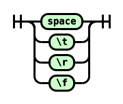
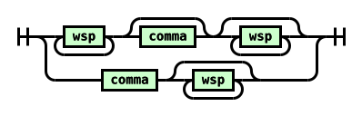
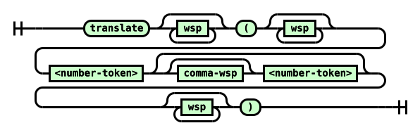
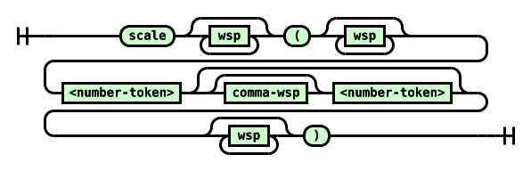
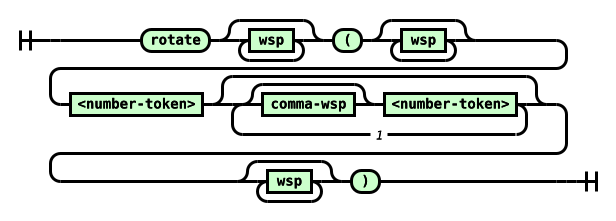
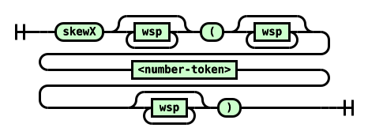
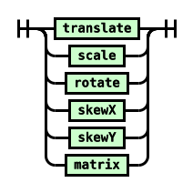
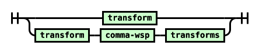

Attribution and reformatting notice added for Surgeist on 2026-10-03

This reformatted document accompanies Surgeist as software implementation support. The original English document at the source URL remains authoritative; this copy is not a new technical specification. Added labels and representation notes are non-normative. W3C is not responsible for content absent from the original, and this copy may contain formatting or hypertext errors.

This software or document includes material copied from or derived from [CSS Transforms Module Level 1](https://www.w3.org/TR/2019/CR-css-transforms-1-20190214/).

Original copyright notice: Copyright © 2019 W3C® (MIT, ERCIM, Keio, Beihang). W3C liability, trademark and permissive document license rules apply.

License: [W3C Software and Document License, 2015 version](../licenses/w3c/software-license-2015.txt). Changes are format conversion, visible semantic labels, local exact-snapshot links, and passive SVG/TeX representations as detailed in the [conversion report](CONVERSION-REPORT.md). Original source text, status, authorship, and legal notices remain below.

# Source provenance

Title: CSS Transforms Module Level 1

Source snapshot: https://www.w3.org/TR/2019/CR-css-transforms-1-20190214/

Snapshot SHA-256: 4672e86844bfbe7af670c6702e873a36aee5a925d7fa30f374b79e88a1e18351

Conversion: offline format conversion of the exact stored HTML; not a new specification or summary. Publication versions remain distinct. Source fragment identifiers are preserved as short HTML anchors. Original copyright and licensing text/links are retained where present in the source.

Representation notes:
- 11 inline SVG diagrams are retained as local passive SVG assets, with original geometry and visible source diagram text. Supporting assets are not reference documents.
- The 6 source tables are presented as readable Markdown tables or explicit labeled layouts: 6 ordinary table conversions. Source cell content, links and relationships are retained.
- Added table headings and layout labels are non-normative presentation aids. Source header/data roles and span models remain in the conversion checks; GFM cannot reproduce native HTML th/scope/rowspan/colspan accessibility semantics. Source row-header labels are bold where used in ordinary Markdown tables.
- Small semantic emphasis/subscript/superscript HTML is retained to avoid GFM intraword-delimiter and subscript rendering defects; website layout HTML is not retained.
- Canonically unstable or combining Unicode characters and escape-sensitive punctuation are shielded as numeric entities in prose/semantic inline HTML. Literal source code stays literal.
- Existing external image/media URLs are resolved against the pinned source. Assets are not downloaded or availability-tested; image-only formulas/diagrams still require their source resources.

---

# <a id="title"></a>CSS Transforms Module Level 1

[Copyright](https://www.w3.org/Consortium/Legal/ipr-notice#Copyright) © 2019 [W3C](https://www.w3.org/)<sup>®</sup> ([MIT](http://www.csail.mit.edu/), [ERCIM](http://www.ercim.eu/), [Keio](http://www.keio.ac.jp/), [Beihang](http://ev.buaa.edu.cn/)). W3C [liability](https://www.w3.org/Consortium/Legal/ipr-notice#Legal_Disclaimer), [trademark](https://www.w3.org/Consortium/Legal/ipr-notice#W3C_Trademarks) and [permissive document license](https://www.w3.org/Consortium/Legal/2015/copyright-software-and-document) rules apply.

## <a id="abstract"></a>Abstract

CSS transforms allows elements styled with CSS to be transformed in two-dimensional space. This specification is the convergence of the [CSS 2D Transforms](https://www.w3.org/TR/2009/WD-css3-2d-transforms-20090320/) and [SVG transforms](https://www.w3.org/TR/2009/WD-SVG-Transforms-20090320/) specifications.

[CSS](https://www.w3.org/TR/CSS/) is a language for describing the rendering of structured documents (such as HTML and XML) on screen, on paper, etc.

## <a id="status"></a>Status of this document

<em>This section describes the status of this document at the time of its publication.
		Other documents may supersede this document.
		A list of current W3C publications and the latest revision of this technical report
		can be found in the <a href="https://www.w3.org/TR/">W3C technical reports index at https&#58;//www&#46;w3&#46;org/TR/.</a></em>

This document was produced by the [CSS Working Group](https://www.w3.org/Style/CSS/members) as a Candidate Recommendation. This document is intended to become a W3C Recommendation. This document will remain a Candidate Recommendation at least until 14 May 2019 in order to ensure the opportunity for wide review.

[GitHub Issues](https://github.com/w3c/csswg-drafts/issues) are preferred for discussion of this specification. When filing an issue, please put the text “css-transforms” in the title, preferably like this: “\[css-transforms\] <i>…summary of comment…</i>”. All issues and comments are [archived](https://lists.w3.org/Archives/Public/public-css-archive/), and there is also a [historical archive](https://lists.w3.org/Archives/Public/www-style/).

A [preliminary implementation report](https://test.csswg.org/harness/results/css-transforms-1_dev/grouped/) is available.

Publication as a Candidate Recommendation does not imply endorsement by the W3C Membership. This is a draft document and may be updated, replaced or obsoleted by other documents at any time. It is inappropriate to cite this document as other than work in progress.

This document was produced by a group operating under the [W3C Patent Policy](https://www.w3.org/Consortium/Patent-Policy/). W3C maintains a [public list of any patent disclosures](https://www.w3.org/2004/01/pp-impl/32061/status) made in connection with the deliverables of the group; that page also includes instructions for disclosing a patent. An individual who has actual knowledge of a patent which the individual believes contains [Essential Claim(s)](https://www.w3.org/Consortium/Patent-Policy/#def-essential) must disclose the information in accordance with [section 6 of the W3C Patent Policy](https://www.w3.org/Consortium/Patent-Policy/#sec-Disclosure).

<a id="w3c_process_revision"></a>

This document is governed by the [1 February 2018 W3C Process Document](https://www.w3.org/2018/Process-20180201/).

For changes since the last draft, see the [Changes](#changes) section.

## <a id="intro"></a>1. Introduction

<em>This section is not normative.</em>

The CSS [visual formatting model](https://www.w3.org/TR/CSS2/visuren.html) describes a coordinate system within each element is positioned. Positions and sizes in this coordinate space can be thought of as being expressed in pixels, starting in the origin of point with positive values proceeding to the right and down.

<a id="ref-for-propdef-transform"></a>

This coordinate space can be modified with the [transform](#propdef-transform) property. Using transform, elements can be translated, rotated and scaled.

### <a id="module-interactions"></a>1.1. Module Interactions

<a id="ref-for-stacking-context"></a>

This module defines a set of CSS properties that affect the visual rendering of elements to which those properties are applied; these effects are applied after elements have been sized and positioned according to the [visual formatting model](https://www.w3.org/TR/CSS2/visuren.html) from [\[CSS2\]](#biblio-css2). Some values of these properties result in the creation of a [containing block](https://www.w3.org/TR/CSS2/visuren.html#containing-block), and/or the creation of a [stacking context](https://www.w3.org/TR/css3-positioning/#stacking-context).

<a id="ref-for-valdef-background-attachment-fixed"></a>

<a id="ref-for-propdef-background-attachment"></a>

Transforms affect the rendering of backgrounds on elements with a value of [fixed](https://www.w3.org/TR/css-backgrounds-3/#valdef-background-attachment-fixed) for the [background-attachment](https://www.w3.org/TR/css-backgrounds-3/#propdef-background-attachment) property, which is specified in [\[CSS3BG\]](#biblio-css3bg).

Transforms affect the client rectangles returned by the Element Interface Extensions [getClientRects()](https://www.w3.org/TR/cssom-view/#dom-element-getclientrects) and [getBoundingClientRect()](https://www.w3.org/TR/cssom-view/#dom-element-getboundingclientrect), which are specified in [\[CSSOM-VIEW\]](#biblio-cssom-view).

Transforms affect the computation of the [scrollable overflow region](https://www.w3.org/TR/css-overflow-3/#scrollable-overflow-region) as described by [\[CSS-OVERFLOW-3\]](#biblio-css-overflow-3).

### <a id="css-values"></a>1.2. CSS Values

This specification follows the [CSS property definition conventions](https://www.w3.org/TR/CSS21/about.html#property-defs) from [\[CSS2\]](#biblio-css2). Value types not defined in this specification are defined in CSS Values &#x26; Units [\[CSS-VALUES-3\]](#biblio-css-values-3). Other CSS modules may expand the definitions of these value types.

<a id="ref-for-css-wide-keywords"></a>

In addition to the property-specific values listed in their definitions, all properties defined in this specification also accept the [CSS-wide keywords](https://www.w3.org/TR/css-values-4/#css-wide-keywords) keywords as their property value. For readability they have not been repeated explicitly.

## <a id="terminology"></a>2. Terminology

When used in this specification, terms have the meanings assigned in this section.

<a id="transformable-element"></a>transformable element  
A transformable element is an element in one of these categories:

- all elements whose layout is governed by the CSS box model except for non-replaced inline boxes, table-column boxes, and table-column-group boxes [\[CSS2\]](#biblio-css2),

- <a id="ref-for-TermPaintServerElement"></a>

  <a id="ref-for-elementdef-clippath"></a>

  <a id="ref-for-TermRenderableElement"></a>

  <a id="ref-for-TermTextContentElement"></a>

  all SVG [paint server elements](https://www.w3.org/TR/svg2/painting.html#TermPaintServerElement), the [clipPath](https://www.w3.org/TR/css-masking-1/#elementdef-clippath) element and SVG [renderable elements](https://www.w3.org/TR/svg2/render.html#TermRenderableElement) with the exception of any descendant element of [text content elements](https://www.w3.org/TR/svg2/text.html#TermTextContentElement) [\[SVG2\]](#biblio-svg2).

<a id="transformed-element"></a>transformed element  
<a id="ref-for-propdef-transform①"></a>

An element with a computed value other than none for the [transform](#propdef-transform) property.

<a id="user-coordinate-system"></a>user coordinate system  
<a id="local-coordinate-system"></a>local coordinate system  
<a id="ref-for-reference-box"></a>

<a id="ref-for-propdef-transform-box"></a>

In general, a coordinate system defines locations and distances on the current canvas. The current local coordinate system (also user coordinate system) is the coordinate system that is currently active and which is used to define how coordinates and lengths are located and computed, respectively, on the current canvas. The current user coordinate system has its origin at the top-left of a [reference box](#reference-box) specified by the [transform-box](#propdef-transform-box) property. Percentage values are relative to the dimension of this reference box. One unit equals one CSS pixel.

<a id="transformation-matrix"></a>transformation matrix  
<a id="ref-for-propdef-transform②"></a>

<a id="ref-for-propdef-transform-origin"></a>

A matrix that defines the mathematical mapping from one coordinate system into another. It is computed from the values of the [transform](#propdef-transform) and [transform-origin](#propdef-transform-origin) properties as described [below](#transformation-matrix-computation).

<a id="current-transformation-matrix"></a>current transformation matrix (CTM)  
<a id="ref-for-local-coordinate-system"></a>

<a id="ref-for-TermViewportCoordinateSystem"></a>

A matrix that defines the mapping from the [local coordinate system](#local-coordinate-system) into the [viewport coordinate system](https://www.w3.org/TR/svg2/coords.html#TermViewportCoordinateSystem).

<a id="2d-matrix"></a>2D matrix  
A 3x2 transformation matrix, or a 4x4 matrix where the items m<sub>31</sub>, m<sub>32</sub>, m<sub>13</sub>, m<sub>23</sub>, m<sub>43</sub>, m<sub>14</sub>, m<sub>24</sub>, m<sub>34</sub> are equal to 0 and m<sub>33</sub>, m<sub>44</sub> are equal to 1.

<a id="identity-transform-function"></a>identity transform function  
A [transform function](#transform-functions) that is equivalent to a identity 4x4 matrix (see [Mathematical Description of Transform Functions](#mathematical-description)). Examples for identity transform functions are translate(0), translateX(0), translateY(0), scale(1), scaleX(1), scaleY(1), rotate(0), skew(0, 0), skewX(0), skewY(0) and matrix(1, 0, 0, 1, 0, 0).

<a id="post-multiply"></a>post-multiply  
<a id="post-multiplied"></a>post-multiplied  
Term <var>A</var> post-multiplied by term <var>B</var> is equal to <var>A</var> · <var>B</var>.

<a id="pre-multiply"></a>pre-multiply  
<a id="pre-multiplied"></a>pre-multiplied  
Term <var>A</var> pre-multiplied by term <var>B</var> is equal to <var>B</var> · <var>A</var>.

<a id="multiply"></a>multiply  
Multiply term <var>A</var> by term <var>B</var> is equal to <var>A</var> · <var>B</var>.

## <a id="transform-rendering"></a>3. The Transform Rendering Model

<em>This section is normative.</em>

<a id="ref-for-propdef-transform③"></a>

<a id="ref-for-local-coordinate-system①"></a>

<a id="ref-for-transformation-matrix"></a>

Specifying a value other than none for the [transform](#propdef-transform) property establishes a new [local coordinate system](#local-coordinate-system) at the element that it is applied to. The mapping from where the element would have rendered into that local coordinate system is given by the element’s [transformation matrix](#transformation-matrix).

<a id="ref-for-transformation-matrix①"></a>

<a id="ref-for-propdef-transform④"></a>

<a id="ref-for-propdef-transform-origin①"></a>

<a id="transformation-matrix-computation"></a> The [transformation matrix](#transformation-matrix) is computed from the [transform](#propdef-transform) and [transform-origin](#propdef-transform-origin) properties as follows:

1.  Start with the identity matrix.

2.  <a id="ref-for-propdef-transform-origin②"></a>

    Translate by the computed X and Y of [transform-origin](#propdef-transform-origin)

3.  <a id="ref-for-propdef-transform⑤"></a>

    Multiply by each of the transform functions in [transform](#propdef-transform) property from left to right

4.  <a id="ref-for-propdef-transform-origin③"></a>

    Translate by the negated computed X and Y values of [transform-origin](#propdef-transform-origin)

> <strong data-conversion-semantic="example">Example</strong>
>
> <a id="example-192d2b11"></a>
>
> <a id="ref-for-propdef-transform⑥"></a>
>
> An element has a [transform](#propdef-transform) property that is not none.
>
> ```text
> div {
>   transform-origin: 0 0;
>   transform: translate(-10px, -20px) scale(2) rotate(45deg);
> }
> ```
>
> <a id="ref-for-propdef-transform-origin④"></a>
>
> <a id="ref-for-transformation-matrix②"></a>
>
> <a id="ref-for-funcdef-transform-translate"></a>
>
> <a id="ref-for-funcdef-transform-scale"></a>
>
> <a id="ref-for-funcdef-transform-rotate"></a>
>
> <a id="ref-for-typedef-transform-function"></a>
>
> The [transform-origin](#propdef-transform-origin) property is set to 0 0 and can be omitted. The [transformation matrix](#transformation-matrix) <i>TM</i> gets computed by post-multying the [\<translate()\>](#funcdef-transform-translate), [\<scale()\>](#funcdef-transform-scale) and [\<rotate()\>](#funcdef-transform-rotate) [\<transform-function\>](#typedef-transform-function)s.
>
> 

<a id="ref-for-transformable-element"></a>

Transforms apply to [transformable elements](#transformable-element).

The coordinate space is a coordinate system with two axes: the X axis increases horizontally to the right; the Y axis increases vertically downwards.

Transformations are cumulative. That is, elements establish their local coordinate system within the coordinate system of their parent.

<a id="ref-for-local-coordinate-system②"></a>

<a id="ref-for-transformation-matrix③"></a>

To map a point <i>p<sub>local</sub></i> with the coordinate pair <i>x<sub>local</sub></i> and <i>y<sub>local</sub></i> from the [local coordinate system](#local-coordinate-system) of an element into the parent’s coordinate system, post-multiply the [transformation matrix](#transformation-matrix) <i>TM</i> of the element by <i>p<sub>local</sub></i>. The result is the mapped point <i>p<sub>parent</sub></i> with the coordinate pair <i>x<sub>parent</sub></i> and <i>y<sub>parent</sub></i> in the parent’s <a id="ref-for-local-coordinate-system③"></a>local coordinate system.


<a id="ref-for-propdef-transform⑦"></a>

<a id="ref-for-current-transformation-matrix"></a>

From the perspective of the user, an element effectively accumulates all the [transform](#propdef-transform) properties of its ancestors as well as any local transform applied to it. The accumulation of these transforms defines a [current transformation matrix](#current-transformation-matrix) (CTM) for the element.

<a id="ref-for-current-transformation-matrix①"></a>

<a id="ref-for-TermViewportCoordinateSystem①"></a>

<a id="ref-for-transformation-matrix④"></a>

<a id="current-transformation-matrix-computation"></a> The [current transformation matrix](#current-transformation-matrix) is computed by post-multiplying all transformation matrices starting from the [viewport coordinate system](https://www.w3.org/TR/svg2/coords.html#TermViewportCoordinateSystem) and ending with the [transformation matrix](#transformation-matrix) of an element.

<a id="ref-for-transformation-matrix⑤"></a>

> <strong data-conversion-semantic="example">Example</strong>
>
> <a id="example-63675dc3"></a> This example has multiple, nested elements in an SVG document. Some elements get transformed by a [transformation matrix](#transformation-matrix).
>
> ```text
> <svg xmlns="http://www.w3.org/2000/svg">
>   <g transform="translate(-10, 20)">
>     <g transform="scale(2)">
>       <rect width="200" height="200" transform="rotate(45)"/>
>     </g>
>   </g>
> </svg>
> ```
>
> - translate(-10, 20) computes to the transformation matrix <i>T1</i>
>
> - scale(2) computes to the transformation matrix <i>T2</i>
>
> - rotate(45) computes to the transformation matrix <i>T3</i>
>
> <a id="ref-for-elementdef-rect"></a>
>
> The CTM for the SVG [rect](https://www.w3.org/TR/svg2/shapes.html#elementdef-rect) element is the result of multiplying <i>T1</i>, <i>T2</i> and <i>T3</i> in order.
>
> 
>
> <a id="ref-for-local-coordinate-system④"></a>
>
> <a id="ref-for-elementdef-rect①"></a>
>
> <a id="ref-for-TermViewportCoordinateSystem②"></a>
>
> <a id="ref-for-current-transformation-matrix②"></a>
>
> To map a point <i>p<sub>local</sub></i> with the coordinate pair <i>x<sub>local</sub></i> and <i>y<sub>local</sub></i> from the [local coordinate system](#local-coordinate-system) of the SVG [rect](https://www.w3.org/TR/svg2/shapes.html#elementdef-rect) element into the [viewport coordinate system](https://www.w3.org/TR/svg2/coords.html#TermViewportCoordinateSystem), post-multiply the [current transformation matrix](#current-transformation-matrix) <i>CTM</i> of the element by <i>p<sub>local</sub></i>. The result is the mapped point <i>p<sub>viewport</sub></i> with the coordinate pair <i>x<sub>viewport</sub></i> and <i>y<sub>viewport</sub></i> in the <a id="ref-for-TermViewportCoordinateSystem③"></a>viewport coordinate system.
>
> 

> <strong data-conversion-semantic="note">Note</strong>
>
> Note: Transformations do affect the visual rendering, but have no affect on the CSS layout other than affecting overflow. Transforms are also taken into account when computing client rectangles exposed via the Element Interface Extensions, namely [getClientRects()](https://www.w3.org/TR/cssom-view/#dom-element-getclientrects) and [getBoundingClientRect()](https://www.w3.org/TR/cssom-view/#dom-element-getboundingclientrect), which are specified in [\[CSSOM-VIEW\]](#biblio-cssom-view).

> <strong data-conversion-semantic="example">Example</strong>
>
> <a id="example-76e5e4e0"></a>
>
> ```text
> div {
>     transform: translate(100px, 100px);
> }
> ```
>
> This transform moves the element by 100 pixels in both the X and Y directions.
>
> 

> <strong data-conversion-semantic="example">Example</strong>
>
> <a id="example-f319ce51"></a>
>
> ```text
> div {
>   height: 100px; width: 100px;
>   transform-origin: 50px 50px;
>   transform: rotate(45deg);
> }
> ```
>
> <a id="ref-for-propdef-transform-origin⑤"></a>
>
> The [transform-origin](#propdef-transform-origin) property moves the point of origin by 50 pixels in both the X and Y directions. The transform rotates the element clockwise by 45° about the point of origin. After all transform functions were applied, the translation of the origin gets translated back by -50 pixels in both the X and Y directions.
>
> 

> <strong data-conversion-semantic="example">Example</strong>
>
> <a id="example-cc93ebae"></a>
>
> ```text
> div {
>   height: 100px; width: 100px;
>   transform: translate(80px, 80px) scale(1.5, 1.5) rotate(45deg);
> }
> ```
>
> <a id="ref-for-the-div-element"></a>
>
> The visual appareance is as if the [div](https://html.spec.whatwg.org/multipage/grouping-content.html#the-div-element) element gets translated by 80px to the bottom left direction, then scaled up by 150% and finally rotated by 45°.
>
> <a id="ref-for-typedef-transform-function①"></a>
>
> <a id="ref-for-the-div-element①"></a>
>
> Each [\<transform-function\>](#typedef-transform-function) can get represented by a corresponding 4x4 matrix. To map a point from the coordinate space of the [div](https://html.spec.whatwg.org/multipage/grouping-content.html#the-div-element) box to the coordinate space of the parent element, these transforms get multiplied in the reverse order:
>
> 1.  <a id="ref-for-post-multiplied"></a>
>
>     The rotation matrix gets [post-multiplied](#post-multiplied) by the scale matrix.
>
> 2.  <a id="ref-for-post-multiplied①"></a>
>
>     The result of the previous multiplication is then [post-multiplied](#post-multiplied) by the translation matrix to create the accumulated transformation matrix.
>
> 3.  <a id="ref-for-pre-multiplied"></a>
>
>     Finally, the point to map gets [pre-multiplied](#pre-multiplied) with the accumulated transformation matrix.
>
> For more details see [The Transform Function Lists](#transform-function-lists).
>
> 
>
> > <strong data-conversion-semantic="note">Note</strong>
> >
> > Note: The identical rendering can be obtained by nesting elements with the equivalent transforms:
>
> ```text
> <div style="transform: translate(80px, 80px)">
>     <div style="transform: scale(1.5, 1.5)">
>         <div style="transform: rotate(45deg)"></div>
>     </div>
> </div>
> ```
<a id="ref-for-propdef-overflow"></a>

<a id="ref-for-valdef-overflow-scroll"></a>

<a id="ref-for-valdef-overflow-auto"></a>

For elements whose layout is governed by the CSS box model, the transform property does not affect the flow of the content surrounding the transformed element. However, the extent of the overflow area takes into account transformed elements. This behavior is similar to what happens when elements are offset via relative positioning. Therefore, if the value of the [overflow](https://www.w3.org/TR/css-overflow-3/#propdef-overflow) property is [scroll](https://www.w3.org/TR/css-overflow-3/#valdef-overflow-scroll) or [auto](https://www.w3.org/TR/css-overflow-3/#valdef-overflow-auto), scrollbars will appear as needed to see content that is transformed outside the visible area. Specifically, transforms can extend (but do not shrink) the size of the overflow area, which is computed as the union of the bounds of the elements before and after the application of transforms.

<a id="ref-for-propdef-transform⑧"></a>

<a id="ref-for-propdef-z-index"></a>

<a id="ref-for-valdef-z-index-auto"></a>

For elements whose layout is governed by the CSS box model, any value other than none for the [transform](#propdef-transform) property results in the creation of a stacking context. Implementations must paint the layer it creates, within its parent stacking context, at the same stacking order that would be used if it were a positioned element with [z-index: 0](https://www.w3.org/TR/css3-positioning/#propdef-z-index). If an element with a transform is positioned, the <a id="ref-for-propdef-z-index①"></a>z-index property applies as described in [\[CSS2\]](#biblio-css2), except that [auto](https://www.w3.org/TR/css3-positioning/#valdef-z-index-auto) is treated as 0 since a new stacking context is always created.

<a id="ref-for-propdef-transform⑨"></a>

For elements whose layout is governed by the CSS box model, any value other than none for the [transform](#propdef-transform) property also causes the element to establish a <a id="containing-block-for-all-descendants"></a>containing block for all descendants. Its padding box will be used to layout for all of its absolute-position descendants, fixed-position descendants, and descendant fixed background attachments.

<a id="ref-for-containing-block-for-all-descendants"></a>

> <strong data-conversion-semantic="example">Example</strong>
>
> <a id="example-02d1d5ba"></a> To demostrate the effect of [containing block for all descendants](#containing-block-for-all-descendants) on fixed-position descendants, the following code snippets should behave identically:
>
> ```text
> <style>
> #container {
>   width: 300px;
>   height: 200px;
>   border: 5px dashed black;
>   padding: 5px;
>   overflow: scroll;
> }
> 
> #bloat {
>   height: 1000px;
> }
> 
> #child {
>   right: 0;
>   bottom: 0;
>   width: 10%;
>   height: 10%;
>   background: green;
> }
> </style>
> 
> <div id="container" style="transform:translateX(5px);">
>   <div id="bloat"></div>
>   <div id="child" style="position:fixed;"></div>
> </div>
> ```
>
> versus
>
> ```text
> <div id="container" style="position:relative; z-index:0; left:5px;">
>   <div id="bloat"></div>
>   <div id="child" style="position:absolute;"></div>
> </div>
> ```
<a id="ref-for-valdef-background-attachment-fixed①"></a>

<a id="ref-for-propdef-background-attachment①"></a>

<a id="ref-for-valdef-background-attachment-scroll"></a>

[Fixed backgrounds](https://www.w3.org/TR/css-backgrounds-3/#valdef-background-attachment-fixed) on the root element are affected by any transform specified for that element. For all other elements that are effected by a transform (i.e. have a transform applied to them, or to any of their ancestor elements), a value of [fixed](https://www.w3.org/TR/css-backgrounds-3/#valdef-background-attachment-fixed) for the [background-attachment](https://www.w3.org/TR/css-backgrounds-3/#propdef-background-attachment) property is treated as if it had a value of [scroll](https://www.w3.org/TR/css-backgrounds-3/#valdef-background-attachment-scroll). The computed value of <a id="ref-for-propdef-background-attachment②"></a>background-attachment is not affected.

> <strong data-conversion-semantic="note">Note</strong>
>
> Note: If the root element is transformed, the transformation applies to the entire canvas, including any background specified for the root element. Since [the background painting area for the root element](https://www.w3.org/TR/css-backgrounds-3/#special-backgrounds) is the entire canvas, which is infinite, the transformation might cause parts of the background that were originally off-screen to appear. For example, if the root element’s background were repeating dots, and a transformation of scale(0.5) were specified on the root element, the dots would shrink to half their size, but there will be twice as many, so they still cover the whole viewport.

<a id="ref-for-propdef-transform①⓪"></a>

## <a id="transform-property"></a>4. The [transform](#propdef-transform) Property

<a id="ref-for-propdef-transform①①"></a>

A transformation is applied to the coordinate system an element renders into through the [transform](#propdef-transform) property. This property contains a list of [transform functions](#transform-functions). The final transformation value for a coordinate system is obtained by converting each function in the list to its corresponding matrix like defined in [Mathematical Description of Transform Functions](#mathematical-description), then multiplying the matrices.

| Field               | Definition                                                                                                                                  |
|---------------------|---------------------------------------------------------------------------------------------------------------------------------------------|
| <strong>Name:&#xA;      </strong> | <a id="propdef-transform"></a>transform                                                                                                                |
| <strong><a href="https://drafts.csswg.org/css-values/#value-defs">Value:</a>&#xA;      </strong> | <a id="ref-for-typedef-transform-list"></a><a id="ref-for-comb-one"></a>none [\|](https://www.w3.org/TR/css-values-4/#comb-one) [\<transform-list\>](#typedef-transform-list) |
| <strong><a href="https://drafts.csswg.org/css-cascade/#initial-values">Initial:</a>&#xA;      </strong> | none                                                                                                                                        |
| <strong>Applies to:&#xA;      </strong> | <a id="ref-for-transformable-element①"></a>[transformable elements](#transformable-element)                                                                         |
| <strong><a href="https://drafts.csswg.org/css-cascade/#inherited-property">Inherited:</a>&#xA;      </strong> | no                                                                                                                                          |
| <strong><a href="https://drafts.csswg.org/css-values/#percentages">Percentages:</a>&#xA;      </strong> | <a id="ref-for-reference-box①"></a>refer to the size of [reference box](#reference-box)                                                                     |
| <strong><a href="https://drafts.csswg.org/css-cascade/#computed">Computed value:</a>&#xA;      </strong> | as specified, but with lengths made absolute                                                                                                |
| <strong>Canonical order:&#xA;      </strong> | per grammar                                                                                                                                 |
| <strong><a href="https://drafts.csswg.org/web-animations/#animation-type">Animation type:</a>&#xA;      </strong> | transform list, see [interpolation rules](#interpolation-of-transforms)                                                                     |

Any computed value other than none for the transform affects containing block and stacking context, as described in [§3 The Transform Rendering Model](#transform-rendering).

<a id="typedef-transform-list"></a>

<a id="ref-for-typedef-transform-function②"></a>

<a id="ref-for-mult-one-plus"></a>

```text
<transform-list> = <transform-function>+
```
<a id="ref-for-typedef-transform-function③"></a>

### <a id="serialization-of-transform-functions"></a>4.1. Serialization of [\<transform-function\>](#typedef-transform-function)s

<a id="ref-for-typedef-transform-function④"></a>

<a id="ref-for-funcdef-calc"></a>

To serialize the [\<transform-function\>](#typedef-transform-function)s, serialize as per their individual grammars, in the order the grammars are written in, avoiding [\<calc()\>](https://www.w3.org/TR/css-values-4/#funcdef-calc) expressions where possible, avoiding <a id="ref-for-funcdef-calc①"></a>\<calc()\> transformations, omitting components when possible without changing the meaning, joining space-separated tokens with a single space, and following each serialized comma with a single space.

<a id="ref-for-typedef-transform-list①"></a>

### <a id="serialization-of-the-computed-value"></a>4.2. Serialization of the computed value of [\<transform-list\>](#typedef-transform-list)

<a id="ref-for-typedef-transform-list②"></a>

<a id="ref-for-funcdef-transform-matrix"></a>

A [\<transform-list\>](#typedef-transform-list) for the computed value is serialized to one [\<matrix()\>](#funcdef-transform-matrix) function by the following algorithm:

1.  Let <var>transform</var> be a 4x4 matrix initialized to the identity matrix. The elements <var> m11</var>, <var>m22</var>, <var>m33</var> and <var>m44</var> of <var>transform</var> must be set to 1 all other elements of <var>transform</var> must be set to 0.

2.  <a id="ref-for-typedef-transform-function⑤"></a>

    <a id="ref-for-typedef-transform-list③"></a>

    Post-multiply all [\<transform-function\>](#typedef-transform-function)s in [\<transform-list\>](#typedef-transform-list) to <var>transform</var>.

3.  <a id="ref-for-funcdef-transform-matrix①"></a>

    Serialize <var>transform</var> to a [\<matrix()\>](#funcdef-transform-matrix) function.

<a id="ref-for-propdef-transform-origin⑥"></a>

## <a id="transform-origin-property"></a>5. The [transform-origin](#propdef-transform-origin) Property

| Field               | Definition                                                                                                                                                                                                                                                                                                                                                                                                                                                                                                                                                                                                                                                                                                                                                                                                                                                                                                                                                                                                                                                                                                                                                                   |
|---------------------|------------------------------------------------------------------------------------------------------------------------------------------------------------------------------------------------------------------------------------------------------------------------------------------------------------------------------------------------------------------------------------------------------------------------------------------------------------------------------------------------------------------------------------------------------------------------------------------------------------------------------------------------------------------------------------------------------------------------------------------------------------------------------------------------------------------------------------------------------------------------------------------------------------------------------------------------------------------------------------------------------------------------------------------------------------------------------------------------------------------------------------------------------------------------------|
| <strong>Name:&#xA;      </strong> | <a id="propdef-transform-origin"></a>transform-origin                                                                                                                                                                                                                                                                                                                                                                                                                                                                                                                                                                                                                                                                                                                                                                                                                                                                                                                                                                                                                                                                                                                                          |
| <strong><a href="https://drafts.csswg.org/css-values/#value-defs">Value:</a>&#xA;      </strong> | <a id="ref-for-comb-all"></a><a id="ref-for-mult-opt"></a><a id="ref-for-length-value"></a><a id="ref-for-typedef-length-percentage"></a><a id="ref-for-comb-one①"></a>  \[ left [\|](https://www.w3.org/TR/css-values-4/#comb-one) center <a id="ref-for-comb-one②"></a>\| right <a id="ref-for-comb-one③"></a>\| top <a id="ref-for-comb-one④"></a>\| bottom <a id="ref-for-comb-one⑤"></a>\| [\<length-percentage\>](https://www.w3.org/TR/css-values-4/#typedef-length-percentage) \]<br> <a id="ref-for-comb-one⑥"></a>\| <br>  \[ left <a id="ref-for-comb-one⑦"></a>\| center <a id="ref-for-comb-one⑧"></a>\| right <a id="ref-for-comb-one⑨"></a>\| <a id="ref-for-typedef-length-percentage①"></a>\<length-percentage\> \]<br>  \[ top <a id="ref-for-comb-one①⓪"></a>\| center <a id="ref-for-comb-one①①"></a>\| bottom <a id="ref-for-comb-one①②"></a>\| <a id="ref-for-typedef-length-percentage②"></a>\<length-percentage\> \] [\<length\>](https://www.w3.org/TR/css3-values/#length-value)[?](https://www.w3.org/TR/css-values-4/#mult-opt)<br> <a id="ref-for-comb-one①③"></a>\|<br>  \[\[ center <a id="ref-for-comb-one①④"></a>\| left <a id="ref-for-comb-one①⑤"></a>\| right \] [&#x26;&#x26;](https://www.w3.org/TR/css-values-4/#comb-all) \[ center <a id="ref-for-comb-one①⑥"></a>\| top <a id="ref-for-comb-one①⑦"></a>\| bottom \]\] <a id="ref-for-length-value①"></a>\<length\><a id="ref-for-mult-opt①"></a>? |
| <strong><a href="https://drafts.csswg.org/css-cascade/#initial-values">Initial:</a>&#xA;      </strong> | 50% 50%                                                                                                                                                                                                                                                                                                                                                                                                                                                                                                                                                                                                                                                                                                                                                                                                                                                                                                                                                                                                                                                                                                                                                                      |
| <strong>Applies to:&#xA;      </strong> | <a id="ref-for-transformable-element②"></a>[transformable elements](#transformable-element)                                                                                                                                                                                                                                                                                                                                                                                                                                                                                                                                                                                                                                                                                                                                                                                                                                                                                                                                                                                                                                                                                                          |
| <strong><a href="https://drafts.csswg.org/css-cascade/#inherited-property">Inherited:</a>&#xA;      </strong> | no                                                                                                                                                                                                                                                                                                                                                                                                                                                                                                                                                                                                                                                                                                                                                                                                                                                                                                                                                                                                                                                                                                                                                                           |
| <strong><a href="https://drafts.csswg.org/css-values/#percentages">Percentages:</a>&#xA;      </strong> | <a id="ref-for-reference-box②"></a>refer to the size of [reference box](#reference-box)                                                                                                                                                                                                                                                                                                                                                                                                                                                                                                                                                                                                                                                                                                                                                                                                                                                                                                                                                                                                                                                                                                      |
| <strong><a href="https://drafts.csswg.org/css-cascade/#computed">Computed value:</a>&#xA;      </strong> | <a id="ref-for-propdef-background-position"></a>see [background-position](https://www.w3.org/TR/css-backgrounds-3/#propdef-background-position)                                                                                                                                                                                                                                                                                                                                                                                                                                                                                                                                                                                                                                                                                                                                                                                                                                                                                                                                                                                                                                                           |
| <strong>Canonical order:&#xA;      </strong> | per grammar                                                                                                                                                                                                                                                                                                                                                                                                                                                                                                                                                                                                                                                                                                                                                                                                                                                                                                                                                                                                                                                                                                                                                                  |
| <strong><a href="https://drafts.csswg.org/web-animations/#animation-type">Animation type:</a>&#xA;      </strong> | by computed value                                                                                                                                                                                                                                                                                                                                                                                                                                                                                                                                                                                                                                                                                                                                                                                                                                                                                                                                                                                                                                                                                                                                                            |

<a id="ref-for-propdef-transform①②"></a>

<a id="ref-for-propdef-transform-origin⑦"></a>

<a id="ref-for-transformation-matrix⑥"></a>

The values of the [transform](#propdef-transform) and [transform-origin](#propdef-transform-origin) properties are used to compute the [transformation matrix](#transformation-matrix), as described above.

<a id="ref-for-valdef-transform-origin-center"></a>

If only one value is specified, the second value is assumed to be [center](#valdef-transform-origin-center). If one or two values are specified, the third value is assumed to be 0px.

<a id="ref-for-valdef-transform-origin-center①"></a>

<a id="ref-for-length-value②"></a>

If two or more values are defined and either no value is a keyword, or the only used keyword is [center](#valdef-transform-origin-center), then the first value represents the horizontal position (or offset) and the second represents the vertical position (or offset). A third value always represents the Z position (or offset) and must be of type [\<length\>](https://www.w3.org/TR/css3-values/#length-value).

<a id="ref-for-typedef-length-percentage③"></a>

[\<length-percentage\>](https://www.w3.org/TR/css-values-4/#typedef-length-percentage)

<a id="ref-for-reference-box③"></a>

A percentage for the horizontal offset is relative to the width of the [reference box](#reference-box). A percentage for the vertical offset is relative to the height of the <a id="ref-for-reference-box④"></a>reference box. The value for the horizontal and vertical offset represent an offset from the top left corner of the <a id="ref-for-reference-box⑤"></a>reference box.

<a id="ref-for-length-value③"></a>

[\<length\>](https://www.w3.org/TR/css3-values/#length-value)

<a id="ref-for-reference-box⑥"></a>

A length value gives a fixed length as the offset. The value for the horizontal and vertical offset represent an offset from the top left corner of the [reference box](#reference-box).

<a id="valdef-transform-origin-top"></a>top

Computes to 0% for the vertical position.

<a id="valdef-transform-origin-right"></a>right

Computes to 100% for the horizontal position.

<a id="valdef-transform-origin-bottom"></a>bottom

Computes to 100% for the vertical position.

<a id="valdef-transform-origin-left"></a>left

Computes to 0% for the horizontal position.

<a id="valdef-transform-origin-center"></a>center

Computes to 50% (left 50%) for the horizontal position if the horizontal position is not otherwise specified, or 50% (top 50%) for the vertical position if it is.

<a id="ref-for-used-value"></a>

For SVG elements without associated CSS layout box the initial [used value](https://www.w3.org/TR/css-cascade-4/#used-value) is 0 0 as if the user agent style sheet contained:

```text
*:not(svg), *:not(foreignObject) > svg {
    transform-origin: 0 0;
}
```
<a id="ref-for-propdef-transform-origin⑧"></a>

<a id="ref-for-resolved-value-special-case-property"></a>

<a id="ref-for-propdef-height"></a>

The [transform-origin](#propdef-transform-origin) property is a [resolved value special case property](https://drafts.csswg.org/cssom-1/#resolved-value-special-case-property) like [height](https://www.w3.org/TR/CSS21/visudet.html#propdef-height). [\[CSSOM\]](#biblio-cssom)

<a id="ref-for-propdef-transform-box①"></a>

## <a id="transform-box"></a>6. Transform reference box: the [transform-box](#propdef-transform-box) property

| Field               | Definition                                                                                                                                                                                  |
|---------------------|---------------------------------------------------------------------------------------------------------------------------------------------------------------------------------------------|
| <strong>Name:&#xA;      </strong> | <a id="propdef-transform-box"></a>transform-box                                                                                                                                                            |
| <strong><a href="https://drafts.csswg.org/css-values/#value-defs">Value:</a>&#xA;      </strong> | <a id="ref-for-comb-one①⑧"></a>content-box [\|](https://www.w3.org/TR/css-values-4/#comb-one) border-box <a id="ref-for-comb-one①⑨"></a>\| fill-box <a id="ref-for-comb-one②⓪"></a>\| stroke-box <a id="ref-for-comb-one②①"></a>\| view-box |
| <strong><a href="https://drafts.csswg.org/css-cascade/#initial-values">Initial:</a>&#xA;      </strong> | view-box                                                                                                                                                                                    |
| <strong>Applies to:&#xA;      </strong> | <a id="ref-for-transformable-element③"></a>[transformable elements](#transformable-element)                                                                                                                         |
| <strong><a href="https://drafts.csswg.org/css-cascade/#inherited-property">Inherited:</a>&#xA;      </strong> | no                                                                                                                                                                                          |
| <strong><a href="https://drafts.csswg.org/css-values/#percentages">Percentages:</a>&#xA;      </strong> | N/A                                                                                                                                                                                         |
| <strong><a href="https://drafts.csswg.org/css-cascade/#computed">Computed value:</a>&#xA;      </strong> | specified keyword                                                                                                                                                                           |
| <strong>Canonical order:&#xA;      </strong> | per grammar                                                                                                                                                                                 |
| <strong><a href="https://drafts.csswg.org/web-animations/#animation-type">Animation type:</a>&#xA;      </strong> | discrete                                                                                                                                                                                    |

<a id="ref-for-propdef-transform①③"></a>

<a id="ref-for-propdef-transform-origin⑨"></a>

<a id="ref-for-reference-box⑦"></a>

All transformations defined by the [transform](#propdef-transform) and [transform-origin](#propdef-transform-origin) property are relative to the position and dimensions of the <a id="reference-box"></a>reference box of the element. The [reference box](#reference-box) is specified by one of the following:

<a id="valdef-transform-box-content-box"></a>content-box  
Uses the content box as reference box. The reference box of a table is the border box of its [table wrapper box](https://www.w3.org/TR/CSS21/tables.html#model), not its table box.

<a id="valdef-transform-box-border-box"></a>border-box  
Uses the border box as reference box. The reference box of a table is the border box of its [table wrapper box](https://www.w3.org/TR/CSS21/tables.html#model), not its table box.

<a id="valdef-transform-box-fill-box"></a>fill-box  
<a id="ref-for-TermObjectBoundingBox"></a>

Uses the [object bounding box](https://www.w3.org/TR/svg2/coords.html#TermObjectBoundingBox) as reference box.

<a id="valdef-transform-box-stroke-box"></a>stroke-box  
<a id="ref-for-TermStrokeBoundingBox"></a>

Uses the [stroke bounding box](https://www.w3.org/TR/svg2/coords.html#TermStrokeBoundingBox) as reference box.

<a id="valdef-transform-box-view-box"></a>view-box  
Uses the nearest [SVG viewport](https://www.w3.org/TR/SVG11/intro.html#TermSVGViewport) as reference box.

If a <code><a>viewBox</a></code> attribute is specified for the [SVG viewport](https://www.w3.org/TR/SVG11/intro.html#TermSVGViewport) creating element:

- The reference box is positioned at the origin of the coordinate system established by the <code><a>viewBox</a></code> attribute.

- The dimension of the reference box is set to the <em>width</em> and <em>height</em> values of the <code><a>viewBox</a></code> attribute.

<a id="ref-for-elementdef-pattern"></a>

<a id="ref-for-PatternElementPatternUnitsAttribute"></a>

For the SVG <code><a href="https://www.w3.org/TR/svg2/pservers.html#elementdef-pattern">pattern</a></code> element, the reference box gets defined by the <code><a href="https://www.w3.org/TR/SVG/pservers.html#PatternElementPatternUnitsAttribute">patternUnits</a></code> attribute [\[SVG2\]](#biblio-svg2).

<a id="ref-for-elementdef-linearGradient"></a>

<a id="ref-for-elementdef-radialGradient"></a>

<a id="ref-for-LinearGradientElementGradientUnitsAttribute"></a>

For the SVG [linearGradient](https://www.w3.org/TR/svg2/pservers.html#elementdef-linearGradient) and [radialGradient](https://www.w3.org/TR/svg2/pservers.html#elementdef-radialGradient) elements, the reference box gets defined by the <code><a href="https://www.w3.org/TR/SVG/pservers.html#LinearGradientElementGradientUnitsAttribute">gradientUnits</a></code> attribute [\[SVG2\]](#biblio-svg2).

<a id="ref-for-elementdef-clippath①"></a>

<a id="ref-for-element-attrdef-clippathunits"></a>

For the SVG [clipPath](https://www.w3.org/TR/css-masking-1/#elementdef-clippath) element, the reference box gets defined by the <code><a href="https://www.w3.org/TR/css-masking-1/#element-attrdef-clippathunits">clipPathUnits</a></code> attribute [\[CSS-MASKING\]](#biblio-css-masking).

<a id="ref-for-propdef-transform-origin①⓪"></a>

A reference box adds an additional offset to the origin specified by the [transform-origin](#propdef-transform-origin) property.

<a id="ref-for-used-value①"></a>

<a id="ref-for-valdef-transform-box-content-box"></a>

<a id="ref-for-valdef-transform-box-fill-box"></a>

<a id="ref-for-valdef-transform-box-border-box"></a>

<a id="ref-for-valdef-transform-box-stroke-box"></a>

For SVG elements without associated CSS layout box, the [used value](https://www.w3.org/TR/css-cascade-4/#used-value) for [content-box](#valdef-transform-box-content-box) is [fill-box](#valdef-transform-box-fill-box) and for [border-box](#valdef-transform-box-border-box) is [stroke-box](#valdef-transform-box-stroke-box).

<a id="ref-for-used-value②"></a>

<a id="ref-for-valdef-transform-box-fill-box①"></a>

<a id="ref-for-valdef-transform-box-content-box①"></a>

<a id="ref-for-valdef-transform-box-stroke-box①"></a>

<a id="ref-for-valdef-transform-box-view-box"></a>

<a id="ref-for-valdef-transform-box-border-box①"></a>

For elements with associated CSS layout box, the [used value](https://www.w3.org/TR/css-cascade-4/#used-value) for [fill-box](#valdef-transform-box-fill-box) is [content-box](#valdef-transform-box-content-box) and for [stroke-box](#valdef-transform-box-stroke-box) and [view-box](#valdef-transform-box-view-box) is [border-box](#valdef-transform-box-border-box).

<a id="ref-for-TransformAttribute"></a>

## <a id="svg-transform"></a>7. The SVG [transform](https://www.w3.org/TR/SVG11/coords.html#TransformAttribute) Attribute

### <a id="transform-attribute-specificity"></a>7.1. SVG presentation attributes

<a id="ref-for-propdef-transform-origin①①"></a>

<a id="ref-for-TermPresentationAttribute"></a>

The [transform-origin](#propdef-transform-origin) CSS property is also a [presentation attribute](https://www.w3.org/TR/svg2/styling.html#TermPresentationAttribute) and extends the list of existing <a id="ref-for-TermPresentationAttribute①"></a>presentation attributes [\[SVG2\]](#biblio-svg2).

<a id="ref-for-TransformAttribute①"></a>

<a id="ref-for-PatternElementPatternTransformAttribute"></a>

<a id="ref-for-LinearGradientElementGradientTransformAttribute"></a>

<a id="ref-for-TermPresentationAttribute②"></a>

<a id="ref-for-propdef-transform①④"></a>

SVG 2 defines the [transform](https://www.w3.org/TR/SVG11/coords.html#TransformAttribute), <code><a href="https://www.w3.org/TR/SVG11/pservers.html#PatternElementPatternTransformAttribute">patternTransform</a></code>, <code><a href="https://www.w3.org/TR/SVG11/pservers.html#LinearGradientElementGradientTransformAttribute">gradientTransform</a></code> attributes as [presentation attributes](https://www.w3.org/TR/svg2/styling.html#TermPresentationAttribute), represented by the CSS [transform](#propdef-transform) property [\[SVG2\]](#biblio-svg2).

<a id="ref-for-TermPresentationAttribute③"></a>

The participation in the CSS cascade is determined by the specificity of [presentation attributes](https://www.w3.org/TR/svg2/styling.html#TermPresentationAttribute) in the SVG specification. According to SVG, user agents conceptually insert a [new author style sheet](https://www.w3.org/TR/SVG/styling.html#PresentationAttributes) for presentation attributes, which is the first in the author style sheet collection [\[SVG2\]](#biblio-svg2).

<a id="ref-for-propdef-transform①⑤"></a>

<a id="ref-for-TransformAttribute②"></a>

> <strong data-conversion-semantic="example">Example</strong>
>
> <a id="example-ae528470"></a> This example shows the combination of the [transform](#propdef-transform) style property and the [transform](https://www.w3.org/TR/SVG11/coords.html#TransformAttribute) attribute.
>
> ```text
> <svg xmlns="http://www.w3.org/2000/svg">
>   <style>
>   .container {
>     transform: translate(100px, 100px);
>   }
>   </style>
> 
>   <g class="container" transform="translate(200 200)">
>     <rect width="100" height="100" fill="blue" />
>   </g>
> </svg>
> ```
>
> 
>
> <a id="ref-for-propdef-transform①⑥"></a>
>
> <a id="ref-for-TransformAttribute③"></a>
>
> Because of the participation to the CSS cascade, the [transform](#propdef-transform) style property overrides the [transform](https://www.w3.org/TR/SVG11/coords.html#TransformAttribute) attribute. Therefore the container gets translated by 100px in both the horizontal and the vertical directions, instead of 200px.

<a id="ref-for-TransformAttribute④"></a>

### <a id="svg-syntax"></a>7.2. Syntax of the SVG [transform](https://www.w3.org/TR/SVG11/coords.html#TransformAttribute) attribute

<a id="ref-for-TransformAttribute⑤"></a>

<a id="ref-for-PatternElementPatternTransformAttribute①"></a>

<a id="ref-for-LinearGradientElementGradientTransformAttribute①"></a>

<a id="ref-for-propdef-transform①⑦"></a>

<a id="ref-for-typedef-transform-function⑥"></a>

<a id="ref-for-funcdef-transform-translatex"></a>

<a id="ref-for-funcdef-transform-translatey"></a>

<a id="ref-for-funcdef-transform-scalex"></a>

<a id="ref-for-funcdef-transform-scaley"></a>

<a id="ref-for-funcdef-transform-skew"></a>

<a id="ref-for-PatternElementPatternTransformAttribute②"></a>

<a id="ref-for-LinearGradientElementGradientTransformAttribute②"></a>

For backwards compatibility reasons, the syntax of the [transform](https://www.w3.org/TR/SVG11/coords.html#TransformAttribute), <code><a href="https://www.w3.org/TR/SVG11/pservers.html#PatternElementPatternTransformAttribute">patternTransform</a></code>, <code><a href="https://www.w3.org/TR/SVG11/pservers.html#LinearGradientElementGradientTransformAttribute">gradientTransform</a></code> attributes differ from the syntax of the [transform](#propdef-transform) CSS property. For the attributes, there is no support for additional [\<transform-function\>](#typedef-transform-function)s defined for the CSS <a id="ref-for-propdef-transform①⑧"></a>transform property. Specifically, [\<translateX()\>](#funcdef-transform-translatex), [\<translateY()\>](#funcdef-transform-translatey), [\<scaleX()\>](#funcdef-transform-scalex), [\<scaleY()\>](#funcdef-transform-scaley) and [\<skew()\>](#funcdef-transform-skew) are not supported by the <a id="ref-for-TransformAttribute⑥"></a>transform, <code><a href="https://www.w3.org/TR/SVG11/pservers.html#PatternElementPatternTransformAttribute">patternTransform</a></code>, <code><a href="https://www.w3.org/TR/SVG11/pservers.html#LinearGradientElementGradientTransformAttribute">gradientTransform</a></code> attributes.

<a id="ref-for-TransformAttribute⑦"></a>

<a id="ref-for-PatternElementPatternTransformAttribute③"></a>

<a id="ref-for-LinearGradientElementGradientTransformAttribute③"></a>

The following list uses the Backus-Naur Form (BNF) to define values for the [transform](https://www.w3.org/TR/SVG11/coords.html#TransformAttribute), [patternTransform](https://www.w3.org/TR/SVG11/pservers.html#PatternElementPatternTransformAttribute) and [gradientTransform](https://www.w3.org/TR/SVG11/pservers.html#LinearGradientElementGradientTransformAttribute) attributes followed by an informative rail road diagram. The following notation is used:

- \*: 0 or more

- +: 1 or more

- ?: 0 or 1

- (): grouping

- \|: separates alternatives

- <a id="ref-for-letter"></a>

  double quotes surround literals. Literals consists of [letter](https://www.w3.org/TR/css-syntax-3/#letter)s [\[CSS-SYNTAX-3\]](#biblio-css-syntax-3), left parenthesis and right parenthesis.

- <a id="ref-for-typedef-number-token"></a>

  [\<number-token\>](https://www.w3.org/TR/css-syntax-3/#typedef-number-token) defined by the CSS Syntax module [\[CSS-SYNTAX-3\]](#biblio-css-syntax-3).

> <strong data-conversion-semantic="note">Note</strong>
>
> Note: The syntax reflects implemented behavior in user agents and differs from the syntax defined by SVG 1.1.

left parenthesis (  
U+0028 LEFT PARENTHESIS

right parenthesis )  
U+0029 RIGHT PARENTHESIS

<a id="svg-comma"></a>comma  
U+002C COMMA.

<a id="svg-wsp"></a>wsp  
Either a U+000A LINE FEED, U+000D CARRIAGE RETURN, U+0009 CHARACTER TABULATION, or U+0020 SPACE.



Diagram text: space space &#x5C;t &#x5C;t &#x5C;r &#x5C;r &#x5C;f &#x5C;f

<a id="svg-comma-wsp"></a>comma-wsp  
```text
(wsp+ comma? wsp*) | (comma wsp*)
```


Diagram text: wsp wsp comma comma wsp wsp comma comma wsp wsp

<a id="svg-translate"></a>translate  
```text
"translate" wsp* "(" wsp* number ( comma-wsp? number )? wsp* ")"
```


Diagram text: translate translate wsp wsp ( ( wsp wsp \<number-token\> \<number-token\> comma-wsp comma-wsp \<number-token\> \<number-token\> wsp wsp ) )

<a id="svg-scale"></a>scale  
```text
"scale" wsp* "(" wsp* number ( comma-wsp? number )? wsp* ")"
```


Diagram text: scale scale wsp wsp ( ( wsp wsp \<number-token\> \<number-token\> comma-wsp comma-wsp \<number-token\> \<number-token\> wsp wsp ) )

<a id="svg-rotate"></a>rotate  
```text
"rotate" wsp* "(" wsp* number ( comma-wsp? number comma-wsp? number )? wsp* ")"
```


Diagram text: rotate rotate wsp wsp ( ( wsp wsp \<number-token\> \<number-token\> comma-wsp comma-wsp \<number-token\> \<number-token\> 1 1 wsp wsp ) )

<a id="svg-skewX"></a>skewX  
```text
"skewY" wsp* "(" wsp* number wsp* ")"
```


Diagram text: skewX skewX wsp wsp ( ( wsp wsp \<number-token\> \<number-token\> wsp wsp ) )

<a id="svg-skewY"></a>skewY  
```text
"skewY" wsp* "(" wsp* number wsp* ")"
```


Diagram text: skewX skewX wsp wsp ( ( wsp wsp \<number-token\> \<number-token\> wsp wsp ) )

<a id="svg-matrix"></a>matrix  
```text
"matrix" wsp* "(" wsp*
    number comma-wsp?
    number comma-wsp?
    number comma-wsp?
    number comma-wsp?
    number comma-wsp?
    number wsp* ")"
  
```


Diagram text: matrix matrix wsp wsp ( ( wsp wsp \<number-token\> \<number-token\> comma-wsp comma-wsp \<number-token\> \<number-token\> 4 4 wsp wsp ) )

<a id="svg-transform-function"></a>transform  
```text
matrix
| translate
| scale
| rotate
| skewX
| skewY
  
```


Diagram text: translate translate scale scale rotate rotate skewX skewX skewY skewY matrix matrix

<a id="svg-transforms"></a>transforms  
```text
transform
| transform comma-wsp transforms
  
```


Diagram text: transform transform transform transform comma-wsp comma-wsp transforms transforms

<a id="svg-transform-list"></a>transform-list  
```text
wsp* transforms? wsp*
```


Diagram text: wsp wsp transforms transforms wsp wsp

### <a id="svg-transform-functions"></a>7.3. SVG transform functions

<a id="ref-for-TransformAttribute⑧"></a>

<a id="ref-for-PatternElementPatternTransformAttribute④"></a>

<a id="ref-for-LinearGradientElementGradientTransformAttribute④"></a>

<a id="ref-for-typedef-transform-function⑦"></a>

SVG transform functions of the [transform](https://www.w3.org/TR/SVG11/coords.html#TransformAttribute), <code><a href="https://www.w3.org/TR/SVG11/pservers.html#PatternElementPatternTransformAttribute">patternTransform</a></code>, <code><a href="https://www.w3.org/TR/SVG11/pservers.html#LinearGradientElementGradientTransformAttribute">gradientTransform</a></code> attributes defined by the syntax above are mapped to CSS [\<transform-function\>](#typedef-transform-function)s as follows:

<a id="term-matching"></a>

| SVG transform function | <a id="ref-for-typedef-transform-function⑧"></a>CSS [\<transform-function\>](#typedef-transform-function) | Additional notes                                                                                                                                                                                                            |
|------------------------|------------------------------------------------------------------------------|-----------------------------------------------------------------------------------------------------------------------------------------------------------------------------------------------------------------------------|
| <strong><a href="#svg-translate">translate</a>&#xA;      </strong>    | <a id="ref-for-funcdef-transform-translate①"></a>[\<translate()\>](#funcdef-transform-translate)           | <a id="ref-for-px"></a><a id="ref-for-length-value④"></a>Number values interpreted as CSS [\<length\>](https://www.w3.org/TR/css3-values/#length-value) types with [px](https://www.w3.org/TR/css-values-4/#px) units.                         |
| <strong><a href="#svg-scale">scale</a>&#xA;      </strong>    | <a id="ref-for-funcdef-transform-scale①"></a>[\<scale()\>](#funcdef-transform-scale)                   |                                                                                                                                                                                                                             |
| <strong><a href="#svg-rotate">rotate</a>&#xA;      </strong>    | <a id="ref-for-funcdef-transform-rotate①"></a>[\<rotate()\>](#funcdef-transform-rotate)                 | <a id="ref-for-deg"></a><a id="ref-for-angle-value"></a>Only single value version. Number value interpreted as CSS [\<angle\>](https://www.w3.org/TR/css3-values/#angle-value) type with [deg](https://www.w3.org/TR/css-values-4/#deg) unit. |
| <strong><a href="#svg-skewX">skewX</a>&#xA;      </strong>    | <a id="ref-for-funcdef-transform-skewx"></a>[\<skewX()\>](#funcdef-transform-skewx)                   | <a id="ref-for-deg①"></a><a id="ref-for-angle-value①"></a>Number value interpreted as CSS [\<angle\>](https://www.w3.org/TR/css3-values/#angle-value) type with [deg](https://www.w3.org/TR/css-values-4/#deg) unit.                            |
| <strong><a href="#svg-skewY">skewY</a>&#xA;      </strong>    | <a id="ref-for-funcdef-transform-skewy"></a>[\<skewY()\>](#funcdef-transform-skewy)                   | <a id="ref-for-deg②"></a><a id="ref-for-angle-value②"></a>Number value interpreted as CSS [\<angle\>](https://www.w3.org/TR/css3-values/#angle-value) type with [deg](https://www.w3.org/TR/css-values-4/#deg) unit.                            |
| <strong><a href="#svg-matrix">matrix</a>&#xA;      </strong>    | <a id="ref-for-funcdef-transform-matrix②"></a>[\<matrix()\>](#funcdef-transform-matrix)                 |                                                                                                                                                                                                                             |

<a id="ref-for-typedef-transform-function⑨"></a>

<a id="ref-for-length-value⑤"></a>

<a id="ref-for-px①"></a>

<a id="ref-for-angle-value③"></a>

<a id="ref-for-deg③"></a>

The SVG transform function [rotate](#svg-rotate) with 3 values can not be mapped to a corresponding CSS [\<transform-function\>](#typedef-transform-function). The 2 optional number values represent a horizontal translation value cx followed by a vertical translation value cy. Both number values get interpreted as CSS [\<length\>](https://www.w3.org/TR/css3-values/#length-value) types with [px](https://www.w3.org/TR/css-values-4/#px) units and define the origin for rotation. The behavior is equivalent to an initial translation by cx, cy, a rotation defined by the first number value interpreted as [\<angle\>](https://www.w3.org/TR/css3-values/#angle-value) type with [deg](https://www.w3.org/TR/css-values-4/#deg) unit followed by a translation by -cx, -cy.

<a id="ref-for-TransformAttribute⑨"></a>

<a id="ref-for-post-multiplied②"></a>

<a id="ref-for-funcdef-transform-matrix③"></a>

<a id="ref-for-typedef-transform-function①⓪"></a>

A [transform](https://www.w3.org/TR/SVG11/coords.html#TransformAttribute) attribute can be the start or end value of a CSS Transition. If the value of a <a id="ref-for-TransformAttribute①⓪"></a>transform attribute is the start or end value of a CSS Transition and the SVG [transform list](#svg-transform-list) contains at least one [rotate](#svg-rotate) transform function with 3 values, the individual SVG transform functions must get [post-multiplied](#post-multiplied) and the resulting matrix must get mapped to a [\<matrix()\>](#funcdef-transform-matrix) CSS [\<transform-function\>](#typedef-transform-function) and used as start/end value of the CSS Transition.

### <a id="svg-user-coordinate-space"></a>7.4. User coordinate space

<a id="ref-for-elementdef-pattern①"></a>

<a id="ref-for-PatternElementPatternTransformAttribute⑤"></a>

<a id="ref-for-propdef-transform①⑨"></a>

<a id="ref-for-PatternElementPatternUnitsAttribute①"></a>

For the <code><a href="https://www.w3.org/TR/svg2/pservers.html#elementdef-pattern">pattern</a></code> element, the <code><a href="https://www.w3.org/TR/SVG11/pservers.html#PatternElementPatternTransformAttribute">patternTransform</a></code> attribtue and [transform](#propdef-transform) property define an additional transformation in the pattern coordinate system. See <code><a href="https://www.w3.org/TR/SVG/pservers.html#PatternElementPatternUnitsAttribute">patternUnits</a></code> attribute for details [\[SVG2\]](#biblio-svg2).

<a id="ref-for-elementdef-linearGradient①"></a>

<a id="ref-for-elementdef-radialGradient①"></a>

<a id="ref-for-LinearGradientElementGradientTransformAttribute⑤"></a>

<a id="ref-for-propdef-transform②⓪"></a>

<a id="ref-for-LinearGradientElementGradientUnitsAttribute①"></a>

For the <code><a href="https://www.w3.org/TR/svg2/pservers.html#elementdef-linearGradient">linearGradient</a></code> and <code><a href="https://www.w3.org/TR/svg2/pservers.html#elementdef-radialGradient">radialGradient</a></code> elements, the <code><a href="https://www.w3.org/TR/SVG11/pservers.html#LinearGradientElementGradientTransformAttribute">gradientTransform</a></code> attribtue and [transform](#propdef-transform) property define an additional transformation in the gradient coordinate system. See <code><a href="https://www.w3.org/TR/SVG/pservers.html#LinearGradientElementGradientUnitsAttribute">gradientUnits</a></code> attribute for details [\[SVG2\]](#biblio-svg2).

<a id="ref-for-elementdef-clippath②"></a>

<a id="ref-for-TransformAttribute①①"></a>

<a id="ref-for-propdef-transform②①"></a>

<a id="ref-for-element-attrdef-clippathunits①"></a>

For the <code><a href="https://www.w3.org/TR/css-masking-1/#elementdef-clippath">clipPath</a></code> element, the [transform](https://www.w3.org/TR/SVG11/coords.html#TransformAttribute) attribtue and [transform](#propdef-transform) property define an additional transformation in the clipping path coordinate space. See <code><a href="https://www.w3.org/TR/css-masking-1/#element-attrdef-clippathunits">clipPathUnits</a></code> attribute for details [\[CSS-MASKING\]](#biblio-css-masking).

<a id="ref-for-transformable-element④"></a>

<a id="ref-for-TransformAttribute①②"></a>

<a id="ref-for-propdef-transform②②"></a>

<a id="ref-for-reference-box⑧"></a>

For all other [transformable elements](#transformable-element) the [transform](https://www.w3.org/TR/SVG11/coords.html#TransformAttribute) attribute and [transform](#propdef-transform) property define a transformation in the current user coordinate system of the parent. All percentage values of the <a id="ref-for-TransformAttribute①③"></a>transform attribute are relative to the element’s [reference box](#reference-box).

> <strong data-conversion-semantic="example">Example</strong>
>
> <a id="example-bb84e563"></a>
>
> <a id="ref-for-propdef-transform-origin①②"></a>
>
> <a id="ref-for-propdef-transform②③"></a>
>
> The [transform-origin](#propdef-transform-origin) property on the pattern in the following example specifies a 50% translation of the origin in the horizontal and vertical dimension. The [transform](#propdef-transform) property specifies a translation as well, but in absolute lengths.
>
> ```text
> <svg xmlns="http://www.w3.org/2000/svg">
>   <style>
>   pattern {
>     transform: rotate(45deg);
>     transform-origin: 50% 50%;
>   }
>   </style>
> 
>   <defs>
>   <pattern id="pattern-1">
>     <rect id="rect1" width="100" height="100" fill="blue" />
>   </pattern>
>   </defs>
> 
>   <rect width="200" height="200" fill="url(#pattern-1)" />
> </svg>
> ```
>
> <a id="ref-for-elementdef-pattern②"></a>
>
> <a id="ref-for-reference-box⑨"></a>
>
> <a id="ref-for-elementdef-rect②"></a>
>
> <a id="ref-for-propdef-transform-origin①③"></a>
>
> <a id="ref-for-elementdef-pattern③"></a>
>
> An SVG <code><a href="https://www.w3.org/TR/svg2/pservers.html#elementdef-pattern">pattern</a></code> element doesn’t have a bounding box. The [reference box](#reference-box) of the referencing <code><a href="https://www.w3.org/TR/svg2/shapes.html#elementdef-rect">rect</a></code> element is used instead to solve the relative values of the [transform-origin](#propdef-transform-origin) property. Therefore the point of origin will get translated by 100 pixels temporarily to rotate the user space of the <code><a href="https://www.w3.org/TR/svg2/pservers.html#elementdef-pattern">pattern</a></code> elements content.

<a id="ref-for-TransformAttribute①④"></a>

### <a id="transform-attribute-dom"></a>7.5. SVG DOM interface for the [transform](https://www.w3.org/TR/SVG11/coords.html#TransformAttribute) attribute

<a id="ref-for-TransformAttribute①⑤"></a>

<a id="ref-for-LinearGradientElementGradientTransformAttribute⑥"></a>

<a id="ref-for-PatternElementPatternTransformAttribute⑥"></a>

The SVG specification defines the "[SVGAnimatedTransformList](https://www.w3.org/TR/2011/REC-SVG11-20110816/coords.html#InterfaceSVGAnimatedTransformList)" interface in the SVG DOM to provide access to the animated and the base value of the SVG [transform](https://www.w3.org/TR/SVG11/coords.html#TransformAttribute), <code><a href="https://www.w3.org/TR/SVG11/pservers.html#LinearGradientElementGradientTransformAttribute">gradientTransform</a></code> and <code><a href="https://www.w3.org/TR/SVG11/pservers.html#PatternElementPatternTransformAttribute">patternTransform</a></code> attributes. To ensure backwards compatibility, this API must still be supported by user agents.

<a id="ref-for-TransformAttribute①⑥"></a>

<a id="ref-for-PatternElementPatternTransformAttribute⑦"></a>

<a id="ref-for-LinearGradientElementGradientTransformAttribute⑦"></a>

<code><a>baseVal</a></code> gives the author the possibility to access and modify the values of the SVG [transform](https://www.w3.org/TR/SVG11/coords.html#TransformAttribute), <code><a href="https://www.w3.org/TR/SVG11/pservers.html#PatternElementPatternTransformAttribute">patternTransform</a></code>, <code><a href="https://www.w3.org/TR/SVG11/pservers.html#LinearGradientElementGradientTransformAttribute">gradientTransform</a></code> attributes. To provide the necessary backwards compatibility to the SVG DOM, <code><a>baseVal</a></code> must reflect the values of this author style sheet. All modifications to SVG DOM objects of <code><a>baseVal</a></code> must affect this author style sheet immediately.

<a id="ref-for-propdef-transform②④"></a>

<code><a>animVal</a></code> represents the computed style of the [transform](#propdef-transform) property. Therefore it includes all applied [CSS3 Transitions](https://www.w3.org/TR/css3-transitions/), [CSS3 Animations](https://www.w3.org/TR/css3-animations/) or [SVG Animations](#svg-animation) if any of those are underway. The computed style and SVG DOM objects of <code><a>animVal</a></code> can not be modified.

## <a id="svg-animation"></a>8. SVG Animation

<a id="ref-for-AnimateElement"></a>

<a id="ref-for-SetElement"></a>

### <a id="svg-animate-element"></a>8.1. The <code><a href="https://www.w3.org/TR/SVG11/animate.html#AnimateElement">animate</a></code> and <code><a href="https://www.w3.org/TR/SVG11/animate.html#SetElement">set</a></code> element

<a id="ref-for-AnimateElement①"></a>

<a id="ref-for-SetElement①"></a>

<a id="ref-for-typedef-transform-list④"></a>

With this specification, the <code><a href="https://www.w3.org/TR/SVG11/animate.html#AnimateElement">animate</a></code> element and the <code><a href="https://www.w3.org/TR/SVG11/animate.html#SetElement">set</a></code> element can animate the data type [\<transform-list\>](#typedef-transform-list).

<a id="ref-for-post-multiplied③"></a>

<a id="ref-for-AnimateElement②"></a>

<a id="ref-for-typedef-transform-list⑤"></a>

The animation effect is [post-multiplied](#post-multiplied) to the underlying value for additive <code><a href="https://www.w3.org/TR/SVG11/animate.html#AnimateElement">animate</a></code> animations (see below) instead of added to the underlying value, due to the specific behavior of [\<transform-list\>](#typedef-transform-list) animations.

<var>From-to</var>, <var>from-by</var> and <var>by</var> animations are defined in SMIL to be equivalent to a corresponding <var>values</var> animation. However, <var>to</var> animations are a mixture of additive and non-additive behavior [\[SMIL3\]](#biblio-smil3).

<a id="ref-for-AnimateElement③"></a>

<a id="ref-for-post-multiplied④"></a>

<a id="ref-for-AnimateElement④"></a>

<var>To</var> animations on <code><a href="https://www.w3.org/TR/SVG11/animate.html#AnimateElement">animate</a></code> provide specific functionality to get a smooth change from the underlying value to the <var>to</var> attribute value, which conflicts mathematically with the requirement for additive transform animations to be [post-multiplied](#post-multiplied). As a consequence, the behavior of <var>to</var> animations for <code><a href="https://www.w3.org/TR/SVG11/animate.html#AnimateElement">animate</a></code> is undefined. Authors are suggested to use <var>from-to</var>, <var>from-by</var>, <var>by</var> or <var>values</var> animations to achieve any desired transform animation.

<a id="ref-for-AnimateElement⑤"></a>

<a id="ref-for-typedef-transform-list⑥"></a>

The value "paced" is undefined for the attribute <code><a>calcMode</a></code> on <code><a href="https://www.w3.org/TR/SVG11/animate.html#AnimateElement">animate</a></code> for animations of the data type [\<transform-list\>](#typedef-transform-list). If specified, UAs may choose the value "linear" instead. Future versions of this specification may define how paced animations can be performed on <a id="ref-for-typedef-transform-list⑦"></a>\<transform-list\>.

> <strong data-conversion-semantic="note">Note</strong>
>
> Note: The following paragraphs extend [Elements, attributes and properties that can be animated](https://www.w3.org/TR/SVG11/animate.html#complexDistances) [\[SVG11\]](#biblio-svg11).

<a id="ref-for-TransformAttribute①⑦"></a>

<a id="ref-for-PatternElementPatternTransformAttribute⑧"></a>

<a id="ref-for-LinearGradientElementGradientTransformAttribute⑧"></a>

<a id="ref-for-propdef-transform-origin①④"></a>

The introduced presentation attributes [transform](https://www.w3.org/TR/SVG11/coords.html#TransformAttribute), <code><a href="https://www.w3.org/TR/SVG11/pservers.html#PatternElementPatternTransformAttribute">patternTransform</a></code>, <code><a href="https://www.w3.org/TR/SVG11/pservers.html#LinearGradientElementGradientTransformAttribute">gradientTransform</a></code> and [transform-origin](#propdef-transform-origin) are animatable.

<a id="ref-for-typedef-transform-list⑧"></a>

<a id="ref-for-typedef-transform-function①①"></a>

<a id="ref-for-AnimateElement⑥"></a>

<a id="ref-for-SetElement②"></a>

With this specification the SVG basic data type [\<transform-list\>](#typedef-transform-list) is equivalent to a list of [\<transform-function\>](#typedef-transform-function)s. <a id="ref-for-typedef-transform-list⑨"></a>\<transform-list\> is animatable and additive. The data type can be animated using the SVG <code><a href="https://www.w3.org/TR/SVG11/animate.html#AnimateElement">animate</a></code> element and the SVG <code><a href="https://www.w3.org/TR/SVG11/animate.html#SetElement">set</a></code> element. SVG animations must run the same animation steps as described in section [Transitions and Animations between Transform Values](#interpolation-of-transforms).

| Data type           | Additive? | <a id="ref-for-AnimateElement⑦"></a><code><a href="https://www.w3.org/TR/SVG11/animate.html#AnimateElement">animate</a></code> | <a id="ref-for-SetElement③"></a><code><a href="https://www.w3.org/TR/SVG11/animate.html#SetElement">set</a></code> | <a id="ref-for-AnimateColorElement"></a><code><a href="https://www.w3.org/TR/SVG11/animate.html#AnimateColorElement">animateColor</a></code> | <a id="ref-for-AnimateTransformElement"></a><code><a href="https://www.w3.org/TR/SVG11/animate.html#AnimateTransformElement">animateTransform</a></code> | Notes                                                                                                                                                                       |
|---------------------|-----------|--------------------------------------|--------------------------------------|--------------------------------------|--------------------------------------|-----------------------------------------------------------------------------------------------------------------------------------------------------------------------------|
| <strong><span><a id="ref-for-typedef-transform-list①⓪"></a></span><a href="#typedef-transform-list">&lt;transform-list&gt;</a>&#xA;      </strong> | yes       | yes                                  | yes                                  | no                                   | yes                                  | <a id="ref-for-post-multiplied⑤"></a><a id="ref-for-AnimateTransformElement①"></a>Additive for <code><a href="https://www.w3.org/TR/SVG11/animate.html#AnimateTransformElement">animateTransform</a></code> means that a transformation is [post-multiplied](#post-multiplied) to the base set of transformations. |

Animatable data types

### <a id="neutral-element"></a>8.2. Neutral element for addition

Some animations require a neutral element for addition. For transform functions this is a scalar or a list of scalars of 0. Examples of neutral elements for transform functions are translate(0), scale(0), rotate(0), skewX(0), skewY(0).

> <strong data-conversion-semantic="note">Note</strong>
>
> Note: This paragraph focuses on the requirements of [\[SMIL\]](#biblio-smil) and the extension defined by [\[SVG11\]](#biblio-svg11). This specification does not provide definitions of neutral elements for the other transform functions than the functions listed above.

> <strong data-conversion-semantic="example">Example</strong>
>
> <a id="example-cdcd611e"></a>
>
> A <var>by</var> animation with a by value v<sub>b</sub> is equivalent to the same animation with a values list with 2 values, the neutral element for addition for the domain of the target attribute (denoted 0) and v<sub>b</sub>, and additive="sum". [\[SMIL3\]](#biblio-smil3)
>
> ```text
> <rect width="100" height="100">
>   <animateTransform attributeName="transform" attributeType="XML"
>     type="scale" by="1" dur="5s" fill="freeze"/>
> </rect>
> ```
>
> The neutral element for addition when performing a <var>by</var> animation with type="scale" is the value 0. Thus, performing the animation of the example above causes the rectangle to be invisible at time 0s (since the animated transform list value is scale(0)), and be scaled back to its original size at time 5s (since the animated transform list value is scale(1)).

### <a id="svg-attribute-name"></a>8.3. The SVG 1.1 '[attributeName](https://www.w3.org/TR/SVG11/animate.html#TargetAttributes)' attribute

<a id="ref-for-LinearGradientElementGradientTransformAttribute⑨"></a>

<a id="ref-for-PatternElementPatternTransformAttribute⑨"></a>

<a id="ref-for-propdef-transform②⑤"></a>

[SVG 1.1 Animation](https://www.w3.org/TR/SVG11/animate.html) defines the "[attributeName](https://www.w3.org/TR/SVG11/animate.html#TargetAttributes)" attribute to specify the name of the target attribute. For the presentation attributes <code><a href="https://www.w3.org/TR/SVG11/pservers.html#LinearGradientElementGradientTransformAttribute">gradientTransform</a></code> and <code><a href="https://www.w3.org/TR/SVG11/pservers.html#PatternElementPatternTransformAttribute">patternTransform</a></code> it will also be possible to use the value [transform](#propdef-transform). The same <a id="ref-for-propdef-transform②⑥"></a>transform property will get animated.

> <strong data-conversion-semantic="example">Example</strong>
>
> <a id="example-d0ce0589"></a>
>
> In this example the gradient transformation of the linear gradient gets animated.
>
> ```text
> <linearGradient gradientTransform="scale(2)">
>   <animate attributeName="gradientTransform" from="scale(2)" to="scale(4)"
>     dur="3s" additive="sum"/>
>   <animate attributeName="transform" from="translate(0, 0)" to="translate(100px, 100px)"
>     dur="3s" additive="sum"/>
> </linearGradient>
> ```
>
> <a id="ref-for-elementdef-linearGradient②"></a>
>
> <a id="ref-for-LinearGradientElementGradientTransformAttribute①⓪"></a>
>
> <a id="ref-for-AnimateElement⑧"></a>
>
> <a id="ref-for-LinearGradientElementGradientTransformAttribute①①"></a>
>
> <a id="ref-for-propdef-transform②⑦"></a>
>
> <a id="ref-for-LinearGradientElementGradientTransformAttribute①②"></a>
>
> The <code><a href="https://www.w3.org/TR/svg2/pservers.html#elementdef-linearGradient">linearGradient</a></code> element specifies the <code><a href="https://www.w3.org/TR/SVG11/pservers.html#LinearGradientElementGradientTransformAttribute">gradientTransform</a></code> presentation attribute. The two <code><a href="https://www.w3.org/TR/SVG11/animate.html#AnimateElement">animate</a></code> elements address the target attribute <code><a href="https://www.w3.org/TR/SVG11/pservers.html#LinearGradientElementGradientTransformAttribute">gradientTransform</a></code> and [transform](#propdef-transform). Even so all animations apply to the same gradient transformation by taking the value of the <code><a href="https://www.w3.org/TR/SVG11/pservers.html#LinearGradientElementGradientTransformAttribute">gradientTransform</a></code> presentation attribute, applying the scaling of the first animation and applying the translation of the second animation one after the other.

## <a id="transform-functions"></a>9. The Transform Functions

<a id="ref-for-propdef-transform②⑧"></a>

<a id="ref-for-zero-value"></a>

<a id="ref-for-reference-box①⓪"></a>

The value of the [transform](#propdef-transform) property is a list of <a id="typedef-transform-function"></a>\<transform-function\>. The set of allowed transform functions is given below. In the following functions, a [\<zero\>](https://www.w3.org/TR/css-values-4/#zero-value) behaves the same as 0deg ("unitless 0" angles are preserved for legacy compat). A percentage for horizontal translations is relative to the width of the [reference box](#reference-box). A percentage for vertical translations is relative to the height of the <a id="ref-for-reference-box①①"></a>reference box.

### <a id="two-d-transform-functions"></a>9.1. 2D Transform Functions

<a id="ref-for-mult-num-range"></a>

<a id="ref-for-comb-comma"></a>

<a id="ref-for-number-value"></a>

<a id="funcdef-transform-matrix"></a>matrix() = matrix( [\<number\>](https://www.w3.org/TR/css3-values/#number-value) \[[,](https://www.w3.org/TR/css-values-4/#comb-comma) <a id="ref-for-number-value①"></a>\<number\> \][{5,5}](https://www.w3.org/TR/css-values-4/#mult-num-range) )

specifies a 2D transformation in the form of a [transformation matrix](#MatrixDefined) of the six values a, b, c, d, e, f.

<a id="ref-for-mult-opt②"></a>

<a id="ref-for-comb-comma①"></a>

<a id="ref-for-typedef-length-percentage④"></a>

<a id="funcdef-transform-translate"></a>translate() = translate( [\<length-percentage\>](https://www.w3.org/TR/css-values-4/#typedef-length-percentage) \[[,](https://www.w3.org/TR/css-values-4/#comb-comma) <a id="ref-for-typedef-length-percentage⑤"></a>\<length-percentage\> \][?](https://www.w3.org/TR/css-values-4/#mult-opt) )

specifies a [2D translation](#TranslateDefined) by the vector \[tx, ty\], where tx is the first translation-value parameter and ty is the optional second translation-value parameter. If <em>&lt;ty&gt;</em> is not provided, ty has zero as a value.

<a id="ref-for-typedef-length-percentage⑥"></a>

<a id="funcdef-transform-translatex"></a>translateX() = translateX( [\<length-percentage\>](https://www.w3.org/TR/css-values-4/#typedef-length-percentage) )

specifies a [translation](#TranslateDefined) by the given amount in the X direction.

<a id="ref-for-typedef-length-percentage⑦"></a>

<a id="funcdef-transform-translatey"></a>translateY() = translateY( [\<length-percentage\>](https://www.w3.org/TR/css-values-4/#typedef-length-percentage) )

specifies a [translation](#TranslateDefined) by the given amount in the Y direction.

<a id="ref-for-mult-opt③"></a>

<a id="ref-for-comb-comma②"></a>

<a id="ref-for-number-value②"></a>

<a id="funcdef-transform-scale"></a>scale() = scale( [\<number\>](https://www.w3.org/TR/css3-values/#number-value) \[[,](https://www.w3.org/TR/css-values-4/#comb-comma) <a id="ref-for-number-value③"></a>\<number\> \][?](https://www.w3.org/TR/css-values-4/#mult-opt) )

specifies a [2D scale](#ScaleDefined) operation by the \[sx,sy\] scaling vector described by the 2 parameters. If the second parameter is not provided, it takes a value equal to the first. For example, scale(1, 1) would leave an element unchanged, while scale(2, 2) would cause it to appear twice as long in both the X and Y axes, or four times its typical geometric size.

<a id="ref-for-number-value④"></a>

<a id="funcdef-transform-scalex"></a>scaleX() = scaleX( [\<number\>](https://www.w3.org/TR/css3-values/#number-value) )

specifies a [2D scale](#ScaleDefined) operation using the \[sx,1\] scaling vector, where sx is given as the parameter.

<a id="ref-for-number-value⑤"></a>

<a id="funcdef-transform-scaley"></a>scaleY() = scaleY( [\<number\>](https://www.w3.org/TR/css3-values/#number-value) )

specifies a [2D scale](#ScaleDefined) operation using the \[1,sy\] scaling vector, where sy is given as the parameter.

<a id="ref-for-zero-value①"></a>

<a id="ref-for-comb-one②②"></a>

<a id="ref-for-angle-value④"></a>

<a id="funcdef-transform-rotate"></a>rotate() = rotate( \[ [\<angle\>](https://www.w3.org/TR/css3-values/#angle-value) [\|](https://www.w3.org/TR/css-values-4/#comb-one) [\<zero\>](https://www.w3.org/TR/css-values-4/#zero-value) \] )

<a id="ref-for-propdef-transform-origin①⑤"></a>

specifies a [2D rotation](#RotateDefined) by the angle specified in the parameter about the origin of the element, as defined by the [transform-origin](#propdef-transform-origin) property. For example, rotate(90deg) would cause elements to appear rotated one-quarter of a turn in the clockwise direction.

<a id="ref-for-mult-opt④"></a>

<a id="ref-for-comb-comma③"></a>

<a id="ref-for-zero-value②"></a>

<a id="ref-for-comb-one②③"></a>

<a id="ref-for-angle-value⑤"></a>

<a id="funcdef-transform-skew"></a>skew() = skew( \[ [\<angle\>](https://www.w3.org/TR/css3-values/#angle-value) [\|](https://www.w3.org/TR/css-values-4/#comb-one) [\<zero\>](https://www.w3.org/TR/css-values-4/#zero-value) \] \[[,](https://www.w3.org/TR/css-values-4/#comb-comma) \[ <a id="ref-for-angle-value⑥"></a>\<angle\> <a id="ref-for-comb-one②④"></a>\| <a id="ref-for-zero-value③"></a>\<zero\> \] \][?](https://www.w3.org/TR/css-values-4/#mult-opt) )

specifies a [2D skew](#SkewDefined) by \[ax,ay\] for X and Y. If the second parameter is not provided, it has a zero value.

<a id="ref-for-funcdef-transform-skew①"></a>

<a id="ref-for-funcdef-transform-skewx①"></a>

<a id="ref-for-funcdef-transform-skewy①"></a>

<strong data-conversion-semantic="advisement">Advisement:</strong> <strong> <a href="#funcdef-transform-skew">skew()</a> exists for compatibility reasons, and should not be used in new content. Use <a href="#funcdef-transform-skewx">skewX()</a> or <a href="#funcdef-transform-skewy">skewY()</a> instead, noting that the behavior of <span><span><a id="ref-for-funcdef-transform-skew②"></a></span>skew()</span> is different from multiplying <span><span><a id="ref-for-funcdef-transform-skewx②"></a></span>skewX()</span> with <span><span><a id="ref-for-funcdef-transform-skewy②"></a></span>skewY()</span>.</strong>

<a id="ref-for-zero-value④"></a>

<a id="ref-for-comb-one②⑤"></a>

<a id="ref-for-angle-value⑦"></a>

<a id="funcdef-transform-skewx"></a>skewX() = skewX( \[ [\<angle\>](https://www.w3.org/TR/css3-values/#angle-value) [\|](https://www.w3.org/TR/css-values-4/#comb-one) [\<zero\>](https://www.w3.org/TR/css-values-4/#zero-value) \] )

specifies a [2D skew transformation along the X axis](#SkewXDefined) by the given angle.

<a id="ref-for-zero-value⑤"></a>

<a id="ref-for-comb-one②⑥"></a>

<a id="ref-for-angle-value⑧"></a>

<a id="funcdef-transform-skewy"></a>skewY() = skewY( \[ [\<angle\>](https://www.w3.org/TR/css3-values/#angle-value) [\|](https://www.w3.org/TR/css-values-4/#comb-one) [\<zero\>](https://www.w3.org/TR/css-values-4/#zero-value) \] )

specifies a [2D skew transformation along the Y axis](#SkewYDefined) by the given angle.

### <a id="transform-primitives"></a>9.2. Transform function primitives and derivatives

Some transform functions can be represented by more generic transform functions. These transform functions are called derived transform functions, and the generic transform functions are called primitive transform functions. Two-dimensional primitives and their derived transform functions are:

<a id="ref-for-funcdef-transform-translate②"></a>

<a id="translate-primitive"></a>[translate()](#funcdef-transform-translate)

<a id="ref-for-funcdef-transform-translate③"></a>

<a id="ref-for-funcdef-transform-translatey①"></a>

<a id="ref-for-funcdef-transform-translatex①"></a>

for [\<translateX()\>](#funcdef-transform-translatex), [\<translateY()\>](#funcdef-transform-translatey) and [\<translate()\>](#funcdef-transform-translate).

<a id="ref-for-funcdef-transform-scale②"></a>

<a id="scale-primitive"></a>[scale()](#funcdef-transform-scale)

<a id="ref-for-funcdef-transform-scale③"></a>

<a id="ref-for-funcdef-transform-scaley①"></a>

<a id="ref-for-funcdef-transform-scalex①"></a>

for [\<scaleX()\>](#funcdef-transform-scalex), [\<scaleY()\>](#funcdef-transform-scaley) and [\<scale()\>](#funcdef-transform-scale).

## <a id="transform-function-lists"></a>10. The Transform Function Lists

<a id="ref-for-typedef-transform-function①②"></a>

If a list of [\<transform-function\>](#typedef-transform-function)s is provided, then the net effect is as if each transform function had been specified separately in the order provided.

<a id="ref-for-local-coordinate-system⑤"></a>

That is, in the absence of other styling that affects position and dimensions, a nested set of transforms is equivalent to a single list of transform functions, applied from the coordinate system of the ancestor to the [local coordinate system](#local-coordinate-system) of a given element. The resulting transform is the matrix multiplication of the list of transforms.

> <strong data-conversion-semantic="example">Example</strong>
>
> <a id="example-5633487a"></a> For example,
>
> ```text
> <div style="transform: translate(-10px, -20px) scale(2) rotate(45deg)"/>
> ```
>
> is functionally equivalent to:
>
> ```text
> <div style="transform: translate(-10px, -20px)" id="root">
>   <div style="transform: scale(2)">
>     <div style="transform: rotate(45deg)">
>     </div>
>   </div>
> </div>
> ```
<a id="ref-for-current-transformation-matrix③"></a>

If a transform function causes the [current transformation matrix](#current-transformation-matrix) of an object to be non-invertible, the object and its content do not get displayed.

> <strong data-conversion-semantic="example">Example</strong>
>
> <a id="example-116f6ceb"></a>
>
> The object in the following example gets scaled by 0.
>
> ```text
> <style>
> .box {
>   transform: scale(0);
> }
> </style>
> 
> <div class="box">
>   Not visible
> </div>
> ```
>
> The scaling causes a non-invertible CTM for the coordinate space of the div box. Therefore neither the div box, nor the text in it get displayed.

## <a id="interpolation-of-transforms"></a>11. Interpolation of Transforms

<a id="ref-for-interpolation"></a>

[Interpolation](https://www.w3.org/TR/css-values-4/#interpolation) of transform function lists is performed as follows:

- <a id="none-none-interpolation"></a> If both <var>V<sub>a</sub></var> and <var>V<sub>b</sub></var> are none:
  - <var>V<sub>result</sub></var> is none.
- <a id="transform-interpolation-length-fixup"></a> Treating none as a list of zero length, if <var>V<sub>a</sub></var> or <var>V<sub>b</sub></var> differ in length:
  - <a id="ref-for-identity-transform-function"></a>

    extend the shorter list to the length of the longer list, setting the function at each additional position to the [identity transform function](#identity-transform-function) matching the function at the corresponding position in the longer list. Both transform function lists are then interpolated following the next rule.

  > <strong data-conversion-semantic="example">Example</strong>
  >
  > <a id="example-fa107865"></a> For example, if <var>V<sub>a</sub></var> is scale(2) and <var>V<sub>b</sub></var> is none then the value scale(1) will be used for <var>V<sub>b</sub></var> and interpolation will proceed using the next rule. Similarly, if <var>V<sub>a</sub></var> is scale(1) and <var>V<sub>b</sub></var> is scale(2) rotate(50deg) then the interpolation will be performed as if <var>V<sub>a</sub></var> were scale(1) rotate(0).
- Let <var>V<sub>result</sub></var> be an empty list. Beginning at the start of <var>V<sub>a</sub></var> and <var>V<sub>b</sub></var>, compare the corresponding functions at each position:
  - While the functions have either the same name, or are derivatives of the same [primitive transform function](#transform-primitives), interpolate the corresponding pair of functions as described in [§12 Interpolation of primitives and derived transform functions](#interpolation-of-transform-functions) and append the result to <var>V<sub>result</sub></var>.

  - <a id="ref-for-interpolation①"></a>

    If the pair do not have a common name or [primitive transform function](#transform-primitives), post-multiply the remaining transform functions in each of <var>V<sub>a</sub></var> and <var>V<sub>b</sub></var> respectively to produce two 4x4 matrices. [Interpolate](https://www.w3.org/TR/css-values-4/#interpolation) these two matrices as described in [§13 Interpolation of Matrices](#matrix-interpolation), append the result to <var>V<sub>result</sub></var>, and cease iterating over <var>V<sub>a</sub></var> and <var>V<sub>b</sub></var>.

  > <strong data-conversion-semantic="example">Example</strong>
  >
  > <a id="example-9843605b"></a> For example, if <var>V<sub>a</sub></var> is rotate(0deg) scale(1) translate(20px) and <var>V<sub>b</sub></var> is rotate(270deg) translate(10px) scale(2), the rotate(0deg) and rotate(360deg) functions will be interpolated according to [§12 Interpolation of primitives and derived transform functions](#interpolation-of-transform-functions) while the remainder of each list—scale(1) translate(20px) and translate(10px) scale(2)—will first be converted to equivalent 4x4 matrices and then interpolated as described in [§13 Interpolation of Matrices](#matrix-interpolation).
  > A previous version of this specification did not attempt to interpolate matching pairs of transform functions unless all functions in the list matched. As a result, the two lists in this example would be interpolated using matrix interpolation only and the rotate(360deg) component of the second list would be lost.

In some cases, an animation might cause a transformation matrix to be singular or non-invertible. For example, an animation in which scale moves from 1 to -1. At the time when the matrix is in such a state, the transformed element is not rendered.

## <a id="interpolation-of-transform-functions"></a>12. Interpolation of primitives and derived transform functions

<a id="ref-for-funcdef-transform-matrix④"></a>

Two transform functions with the same name and the same number of arguments are interpolated numerically without a former conversion. The calculated value will be of the same transform function type with the same number of arguments. Special rules apply to [\<matrix()\>](#funcdef-transform-matrix).

> <strong data-conversion-semantic="example">Example</strong>
>
> <a id="example-1356eb1f"></a>
>
> The two transform functions translate(0) and translate(100px) are of the same type, have the same number of arguments and therefore can get interpolated numerically. translateX(100px) is not of the same type and translate(100px, 0) does not have the same number of arguments, therefore these transform functions can not get interpolated without a former conversion step.

Two different types of transform functions that share the same primitive, or transform functions of the same type with different number of arguments can be interpolated. Both transform functions need a former conversion to the common primitive first and get interpolated numerically afterwards. The computed value will be the primitive with the resulting interpolated arguments.

> <strong data-conversion-semantic="example">Example</strong>
>
> <a id="example-bd3fe5db"></a>
>
> <a id="ref-for-funcdef-transform-translate④"></a>
>
> The following example describes a transition from translateX(100px) to translateY(100px) in 3 seconds on hovering over the div box. Both transform functions derive from the same primitive [translate()](#funcdef-transform-translate) and therefore can be interpolated.
>
> ```text
> div {
>   transform: translateX(100px);
> }
> 
> div:hover {
>   transform: translateY(100px);
>   transition: transform 3s;
> }
> ```
>
> For the time of the transition both transform functions get transformed to the common primitive. translateX(100px) gets converted to translate(100px, 0) and translateY(100px) gets converted to translate(0, 100px). Both transform functions can then get interpolated numerically.

If both transform functions share a primitive in the two-dimensional space, both transform functions get converted to the two-dimensional primitive. If one or both transform functions are three-dimensional transform functions, the common three-dimensional primitive is used.

> <strong data-conversion-semantic="example">Example</strong>
>
> <a id="example-24abc2ae"></a>
>
> <a id="ref-for-funcdef-translate3d"></a>
>
> In this example a two-dimensional transform function gets animated to a three-dimensional transform function. The common primitive is [translate3d()](https://drafts.csswg.org/css-transforms-2/#funcdef-translate3d).
>
> ```text
> div {
>   transform: translateX(100px);
> }
> 
> div:hover {
>   transform: translateZ(100px);
>   transition: transform 3s;
> }
> ```
>
> First translateX(100px) gets converted to translate3d(100px, 0, 0) and translateZ(100px) to translate3d(0, 0, 100px) respectively. Then both converted transform functions get interpolated numerically.

## <a id="matrix-interpolation"></a>13. Interpolation of Matrices

When interpolating between two matrices, each matrix is decomposed into the corresponding translation, rotation, scale, skew. Each corresponding component of the decomposed matrices gets interpolated numerically and recomposed back to a matrix in a final step.

> <strong data-conversion-semantic="example">Example</strong>
>
> <a id="example-3a6b960d"></a> In the following example the element gets translated by 100 pixel in both the X and Y directions and rotated by 1170° on hovering. The initial transformation is 45°. With the usage of transition, an author might expect a animated, clockwise rotation by three and a quarter turns (1170°).
>
> ```text
> <style>
> div {
>   transform: rotate(45deg);
> }
> div:hover {
>   transform: translate(100px, 100px) rotate(1215deg);
>   transition: transform 3s;
> }
> </style>
> 
> <div></div>
> ```
>
> The number of transform functions on the source transform rotate(45deg) differs from the number of transform functions on the destination transform translate(100px, 100px) rotate(1125deg). According to the last rule of [Interpolation of Transforms](#interpolation-of-transforms), both transforms must be interpolated by matrix interpolation. With converting the transformation functions to matrices, the information about the three turns gets lost and the element gets rotated by just a quarter turn (90°).
>
> To achieve the three and a quarter turns for the example above, source and destination transforms must fulfill the third rule of [Interpolation of Transforms](#interpolation-of-transforms). Source transform could look like translate(0, 0) rotate(45deg) for a linear interpolation of the transform functions.

<a id="ref-for-2d-matrix"></a>

In the following we differ between the [interpolation of two 2D matrices](#interpolation-of-2d-matrices) and the interpolation of two matrices where at least one matrix is not a [2D matrix](#2d-matrix).

If one of the matrices for interpolation is non-invertible, the used animation function must fall-back to a discrete animation according to the rules of the respective animation specification.

### <a id="supporting-functions"></a>13.1. Supporting functions

The pseudo code in the next subsections make use of the following supporting functions:

```text
Supporting functions (point is a 3 component vector, matrix is a 4x4 matrix, vector is a 4 component vector):
  double  determinant(matrix)          returns the 4x4 determinant of the matrix
  matrix  inverse(matrix)              returns the inverse of the passed matrix
  matrix  transpose(matrix)            returns the transpose of the passed matrix
  point   multVecMatrix(point, matrix) multiplies the passed point by the passed matrix
                                       and returns the transformed point
  double  length(point)                returns the length of the passed vector
  point   normalize(point)             normalizes the length of the passed point to 1
  double  dot(point, point)            returns the dot product of the passed points
  double  sqrt(double)                 returns the root square of passed value
  double  max(double y, double x)      returns the bigger value of the two passed values
  double  dot(vector, vector)         returns the dot product of the passed vectors
  vector  multVector(vector, vector)  multiplies the passed vectors
  double  sqrt(double)                returns the root square of passed value
  double  max(double y, double x)     returns the bigger value of the two passed values
  double  min(double y, double x)     returns the smaller value of the two passed values
  double  cos(double)                 returns the cosines of passed value
  double  sin(double)                 returns the sine of passed value
  double  acos(double)                returns the inverse cosine of passed value
  double  abs(double)                  returns the absolute value of the passed value
  double  rad2deg(double)              transforms a value in radian to degree and returns it
  double  deg2rad(double)              transforms a value in degree to radian and returns it

Decomposition also makes use of the following function:
  point combine(point a, point b, double ascl, double bscl)
      result[0] = (ascl * a[0]) + (bscl * b[0])
      result[1] = (ascl * a[1]) + (bscl * b[1])
      result[2] = (ascl * a[2]) + (bscl * b[2])
      return result
```
### <a id="interpolation-of-2d-matrices"></a>13.2. Interpolation of 2D matrices

#### <a id="decomposing-a-2d-matrix"></a>13.2.1. Decomposing a 2D matrix

The pseudo code below is based upon the "unmatrix" method in "Graphics Gems II, edited by Jim Arvo".

Matrices in the pseudo code use the column-major order. The first index on a matrix entry represents the column and the second index represents the row.

```text
Input:  matrix      ; a 4x4 matrix
Output: translation ; a 2 component vector
        scale       ; a 2 component vector
        angle       ; rotation
        m11         ; 1,1 coordinate of 2x2 matrix
        m12         ; 1,2 coordinate of 2x2 matrix
        m21         ; 2,1 coordinate of 2x2 matrix
        m22         ; 2,2 coordinate of 2x2 matrix
Returns false if the matrix cannot be decomposed, true if it can


double row0x = matrix[0][0]
double row0y = matrix[0][1]
double row1x = matrix[1][0]
double row1y = matrix[1][1]

translate[0] = matrix[3][0]
translate[1] = matrix[3][1]

scale[0] = sqrt(row0x * row0x + row0y * row0y)
scale[1] = sqrt(row1x * row1x + row1y * row1y)

// If determinant is negative, one axis was flipped.
double determinant = row0x * row1y - row0y * row1x
if (determinant < 0)
    // Flip axis with minimum unit vector dot product.
    if (row0x < row1y)
        scale[0] = -scale[0]
    else
        scale[1] = -scale[1]

// Renormalize matrix to remove scale.
if (scale[0])
    row0x *= 1 / scale[0]
    row0y *= 1 / scale[0]
if (scale[1])
    row1x *= 1 / scale[1]
    row1y *= 1 / scale[1]

// Compute rotation and renormalize matrix.
angle = atan2(row0y, row0x);

if (angle)
    // Rotate(-angle) = [cos(angle), sin(angle), -sin(angle), cos(angle)]
    //                = [row0x, -row0y, row0y, row0x]
    // Thanks to the normalization above.
    double sn = -row0y
    double cs = row0x
    double m11 = row0x
    double m12 = row0y
    double m21 = row1x
    double m22 = row1y
    row0x = cs * m11 + sn * m21
    row0y = cs * m12 + sn * m22
    row1x = -sn * m11 + cs * m21
    row1y = -sn * m12 + cs * m22

m11 = row0x
m12 = row0y
m21 = row1x
m22 = row1y

// Convert into degrees because our rotation functions expect it.
angle = rad2deg(angle)

return true
```
#### <a id="interpolation-of-decomposed-2d-matrix-values"></a>13.2.2.  Interpolation of decomposed 2D matrix values 

Before two decomposed 2D matrix values can be interpolated, the following

```text
Input: translationA ; a 2 component vector
       scaleA       ; a 2 component vector
       angleA       ; rotation
       m11A         ; 1,1 coordinate of 2x2 matrix
       m12A         ; 1,2 coordinate of 2x2 matrix
       m21A         ; 2,1 coordinate of 2x2 matrix
       m22A         ; 2,2 coordinate of 2x2 matrix
       translationB ; a 2 component vector
       scaleB       ; a 2 component vector
       angleB       ; rotation
       m11B         ; 1,1 coordinate of 2x2 matrix
       m12B         ; 1,2 coordinate of 2x2 matrix
       m21B         ; 2,1 coordinate of 2x2 matrix
       m22B         ; 2,2 coordinate of 2x2 matrix


// If x-axis of one is flipped, and y-axis of the other,
// convert to an unflipped rotation.
if ((scaleA[0] < 0 && scaleB[1] < 0) || (scaleA[1] < 0 && scaleB[0] < 0))
    scaleA[0] = -scaleA[0]
    scaleA[1] = -scaleA[1]
    angleA += angleA < 0 ? 180 : -180

// Don’t rotate the long way around.
if (!angleA)
    angleA = 360
if (!angleB)
    angleB = 360

if (abs(angleA - angleB) > 180)
    if (angleA > angleB)
        angleA -= 360
    else
        angleB -= 360
```
Afterwards, each component of the decomposed values translation, scale, angle, m11 to m22 of the source matrix get linearly interpolated with each corresponding component of the destination matrix.

#### <a id="recomposing-to-a-2d-matrix"></a>13.2.3. Recomposing to a 2D matrix

After interpolation, the resulting values are used to transform the elements user space. One way to use these values is to recompose them into a 4x4 matrix. This can be done following the pseudo code below.

Matrices in the pseudo code use the column-major order. The first index on a matrix entry represents the column and the second index represents the row.

```text
Input:  translation ; a 2 component vector
        scale       ; a 2 component vector
        angle       ; rotation
        m11         ; 1,1 coordinate of 2x2 matrix
        m12         ; 1,2 coordinate of 2x2 matrix
        m21         ; 2,1 coordinate of 2x2 matrix
        m22         ; 2,2 coordinate of 2x2 matrix
Output: matrix      ; a 4x4 matrix initialized to identity matrix


matrix[0][0] = m11
matrix[0][1] = m12
matrix[1][0] = m21
matrix[1][1] = m22

// Translate matrix.
matrix[3][0] = translate[0] * m11 + translate[1] * m21
matrix[3][1] = translate[0] * m12 + translate[1] * m22

// Rotate matrix.
angle = deg2rad(angle);
double cosAngle = cos(angle);
double sinAngle = sin(angle);

// New temporary, identity initialized, 4x4 matrix rotateMatrix
rotateMatrix[0][0] = cosAngle
rotateMatrix[0][1] = sinAngle
rotateMatrix[1][0] = -sinAngle
rotateMatrix[1][1] = cosAngle

matrix = post-multiply(rotateMatrix, matrix)

// Scale matrix.
matrix[0][0] *= scale[0]
matrix[0][1] *= scale[0]
matrix[1][0] *= scale[1]
matrix[1][1] *= scale[1]
```
## <a id="mathematical-description"></a>14. Mathematical Description of Transform Functions

Mathematically, all transform functions can be represented as 4x4 transformation matrices of the following form:


One translation unit on a matrix is equivalent to 1 pixel in the local coordinate system of the element.

- <a id="MatrixDefined"></a>

  A 2D 3x2 matrix with six parameters <em>a</em>, <em>b</em>, <em>c</em>, <em>d</em>, <em>e</em> and <em>f</em> is equivalent to the matrix:

  

- <a id="TranslateDefined"></a>

  A 2D translation with the parameters <em>tx</em> and <em>ty</em> is equivalent to a 3D translation where <em>tz</em> has zero as a value.

- <a id="ScaleDefined"></a>

  A 2D scaling with the parameters <em>sx</em> and <em>sy</em> is equivalent to a 3D scale where <em>sz</em> has one as a value.

- <a id="RotateDefined"></a>

  A 2D rotation with the parameter <em>alpha</em> is equivalent to a 3D rotation with vector \[0,0,1\] and parameter <em>alpha</em>.

- <a id="SkewDefined"></a>

  A 2D skew like transformation with the parameters <em>alpha</em> and <em>beta</em> is equivalent to the matrix:

  

- <a id="SkewXDefined"></a>

  A 2D skew transformation along the X axis with the parameter <em>alpha</em> is equivalent to the matrix:

  

- <a id="SkewYDefined"></a>

  A 2D skew transformation along the Y axis with the parameter <em>beta</em> is equivalent to the matrix:

  

## <a id="priv-sec"></a>15. Privacy and Security Considerations

UAs must implement transform operations in a way attackers can not infer information and mount a timing attack.

A timing attack is a method of obtaining information about content that is otherwise protected, based on studying the amount of time it takes for an operation to occur.

At this point there are no information about potential privacy or security concerns specific to this specification.

## <a id="changes"></a>Changes

### <a id="WD20181130"></a>Since the [30 November 2018 Working Draft](https://www.w3.org/TR/2018/WD-css-transforms-1-20181130/)

- No substantive changes

- Boilerplate, styling updates for CR

### <a id="WD20171130"></a>Since the [30 November 2017 Working Draft](https://www.w3.org/TR/2017/WD-css-transforms-1-20171130/) 

- <a id="ref-for-PatternElementPatternTransformAttribute①⓪"></a>

  <a id="ref-for-LinearGradientElementGradientTransformAttribute①③"></a>

  <a id="ref-for-propdef-transform②⑨"></a>

  Remove specification text that makes [patternTransform](https://www.w3.org/TR/SVG11/pservers.html#PatternElementPatternTransformAttribute), [gradientTransform](https://www.w3.org/TR/SVG11/pservers.html#LinearGradientElementGradientTransformAttribute) presentation attributes representing the [transform](#propdef-transform) property. That is going to get specified by SVG 2 [\[SVG2\]](#biblio-svg2).

- Added [privacy and security](#priv-sec) section.

- <a id="ref-for-transformable-element⑤"></a>

  Use [\[SVG2\]](#biblio-svg2) definitions for [transformable elements](#transformable-element).

- <a id="ref-for-TransformAttribute①⑧"></a>

  <a id="ref-for-LinearGradientElementGradientTransformAttribute①④"></a>

  <a id="ref-for-PatternElementPatternTransformAttribute①①"></a>

  Added special syntax for [transform](https://www.w3.org/TR/SVG11/coords.html#TransformAttribute), <code><a href="https://www.w3.org/TR/SVG11/pservers.html#LinearGradientElementGradientTransformAttribute">gradientTransform</a></code> and <code><a href="https://www.w3.org/TR/SVG11/pservers.html#PatternElementPatternTransformAttribute">patternTransform</a></code> attributes.

- <a id="ref-for-post-multiply"></a>

  <a id="ref-for-pre-multiply"></a>

  Clarify multiplication order by using terms [post-multiply](#post-multiply) and [pre-multiply](#pre-multiply).

- Clarify index order of matrix entries in pseudo-code.

- Clarify multiplication order in recomposition pseudo-code.

- <a id="ref-for-propdef-transform③⓪"></a>

  Clarify behavior of [transform](#propdef-transform) on overflow area.

- Remove translateX(0), translateY(0), scaleX(0), scaleY(0) from the list of neutral elements.

- Remove any reference of 3D transformations of transform function definitions.

- <a id="ref-for-typedef-transform-list①①"></a>

  Specify interpolation between [\<transform-list\>](#typedef-transform-list)s to match lengths and avoid matrix interpolation for the common prefix of the two lists.

- <a id="ref-for-propdef-transform③①"></a>

  No [transform](#propdef-transform) on non-replaced inline boxes, table-column boxes, and table-column-group boxes.

- <a id="ref-for-elementdef-pattern④"></a>

  <a id="ref-for-elementdef-linearGradient③"></a>

  <a id="ref-for-elementdef-radialGradient②"></a>

  <a id="ref-for-elementdef-clippath③"></a>

  Define target coordinate space for transformations on <code><a href="https://www.w3.org/TR/svg2/pservers.html#elementdef-pattern">pattern</a></code>, <code><a href="https://www.w3.org/TR/svg2/pservers.html#elementdef-linearGradient">linearGradient</a></code>, <code><a href="https://www.w3.org/TR/svg2/pservers.html#elementdef-radialGradient">radialGradient</a></code> and <code><a href="https://www.w3.org/TR/css-masking-1/#elementdef-clippath">clipPath</a></code> elements.

- <a id="ref-for-funcdef-transform-rotate②"></a>

  Remove 3-value [\<rotate()\>](#funcdef-transform-rotate) from transform function primitives.

- <a id="ref-for-transformation-matrix⑦"></a>

  <a id="ref-for-current-transformation-matrix④"></a>

  Be more specific about computation of [transformation matrix](#transformation-matrix) and [current transformation matrix](#current-transformation-matrix).

- <a id="ref-for-elementdef-clippath④"></a>

  Define reference box for paint servers and <code><a href="https://www.w3.org/TR/css-masking-1/#elementdef-clippath">clipPath</a></code> element.

- Specify behavior of transform presentation attribute with 3-value-rotate as start or end value of a transition.

- <a id="ref-for-valdef-transform-box-stroke-box②"></a>

  <a id="ref-for-valdef-transform-box-content-box②"></a>

  <a id="ref-for-propdef-transform-box②"></a>

  Add [stroke-box](#valdef-transform-box-stroke-box) and [content-box](#valdef-transform-box-content-box) to [transform-box](#propdef-transform-box). Align box mapping behavior across all specifications.

- Editorial changes.

## <a id="acknowledgments"></a>Acknowledgments

The editors would like to thank Robert O’Callahan, Cameron McCormack, Tab Atkins, Gérard Talbot, L. David Baron, Rik Cabanier, Brian Birtles, Benoit Jacob, Ken Shoemake, Alan Gresley, Maciej Stochowiak, Sylvain Galineau, Rafal Pietrak, Shane Stephens, Matt Rakow, XiangHongAi, Fabio M. Costa, Nivesh Rajbhandari, Rebecca Hauck, Gregg Tavares, Graham Clift, Erik Dahlström, Alexander Zolotov, Amelia Bellamy-Royds and Boris Zbarsky for their careful reviews, comments, and corrections.

## <a id="conformance"></a> Conformance

### <a id="document-conventions"></a> Document conventions

Conformance requirements are expressed with a combination of descriptive assertions and RFC 2119 terminology. The key words “MUST”, “MUST NOT”, “REQUIRED”, “SHALL”, “SHALL NOT”, “SHOULD”, “SHOULD NOT”, “RECOMMENDED”, “MAY”, and “OPTIONAL” in the normative parts of this document are to be interpreted as described in RFC 2119. However, for readability, these words do not appear in all uppercase letters in this specification.

All of the text of this specification is normative except sections explicitly marked as non-normative, examples, and notes. [\[RFC2119\]](#biblio-rfc2119)

Examples in this specification are introduced with the words “for example” or are set apart from the normative text with `class="example"`, like this:

> <strong data-conversion-semantic="example">Example</strong>
>
> <a id="example-ae2b6bc0"></a>
>
> This is an example of an informative example.

Informative notes begin with the word “Note” and are set apart from the normative text with `class="note"`, like this:

> <strong data-conversion-semantic="note">Note</strong>
>
> Note, this is an informative note.

Advisements are normative sections styled to evoke special attention and are set apart from other normative text with `<strong class="advisement">`, like this: <strong data-conversion-semantic="advisement">Advisement:</strong> <strong> UAs MUST provide an accessible alternative. </strong>

### <a id="conform-classes"></a> Conformance classes

Conformance to this specification is defined for three conformance classes:

style sheet  
A [CSS style sheet](https://www.w3.org/TR/CSS2/conform.html#style-sheet).

renderer  
A [UA](https://www.w3.org/TR/CSS2/conform.html#user-agent) that interprets the semantics of a style sheet and renders documents that use them.

authoring tool  
A [UA](https://www.w3.org/TR/CSS2/conform.html#user-agent) that writes a style sheet.

A style sheet is conformant to this specification if all of its statements that use syntax defined in this module are valid according to the generic CSS grammar and the individual grammars of each feature defined in this module.

A renderer is conformant to this specification if, in addition to interpreting the style sheet as defined by the appropriate specifications, it supports all the features defined by this specification by parsing them correctly and rendering the document accordingly. However, the inability of a UA to correctly render a document due to limitations of the device does not make the UA non-conformant. (For example, a UA is not required to render color on a monochrome monitor.)

An authoring tool is conformant to this specification if it writes style sheets that are syntactically correct according to the generic CSS grammar and the individual grammars of each feature in this module, and meet all other conformance requirements of style sheets as described in this module.

### <a id="conform-responsible"></a> Requirements for Responsible Implementation of CSS

The following sections define several conformance requirements for implementing CSS responsibly, in a way that promotes interoperability in the present and future.

#### <a id="conform-partial"></a> Partial Implementations

So that authors can exploit the forward-compatible parsing rules to assign fallback values, <strong>CSS renderers <em>must</em> treat as invalid
        (and <a href="https://www.w3.org/TR/CSS2/conform.html#ignore">ignore as appropriate</a>)
        any at-rules, properties, property values, keywords, and other syntactic constructs
        for which they have no usable level of support</strong>. In particular, user agents <em>must not</em> selectively ignore unsupported property values and honor supported values in a single multi-value property declaration: if any value is considered invalid (as unsupported values must be), CSS requires that the entire declaration be ignored.

#### <a id="conform-future-proofing"></a> Implementations of Unstable and Proprietary Features

To avoid clashes with future stable CSS features, the CSSWG recommends [following best practices](https://www.w3.org/TR/CSS/#future-proofing) for the implementation of [unstable](https://www.w3.org/TR/CSS/#unstable) features and [proprietary extensions](https://www.w3.org/TR/CSS/#proprietary-extension) to CSS.

#### <a id="conform-testing"></a> Implementations of CR-level Features

Once a specification reaches the Candidate Recommendation stage, implementers should release an [unprefixed](https://www.w3.org/TR/CSS/#vendor-prefix) implementation of any CR-level feature they can demonstrate to be correctly implemented according to spec, and should avoid exposing a prefixed variant of that feature.

To establish and maintain the interoperability of CSS across implementations, the CSS Working Group requests that non-experimental CSS renderers submit an implementation report (and, if necessary, the testcases used for that implementation report) to the W3C before releasing an unprefixed implementation of any CSS features. Testcases submitted to W3C are subject to review and correction by the CSS Working Group.

Further information on submitting testcases and implementation reports can be found from on the CSS Working Group’s website at [https&#x3A;&#x2F;&#x2F;www&#x2E;w3&#x2E;org&#x2F;Style&#x2F;CSS&#x2F;Test&#x2F;](https://www.w3.org/Style/CSS/Test/)&#x2E; Questions should be directed to the [public-css-testsuite@w3.org](https://lists.w3.org/Archives/Public/public-css-testsuite) mailing list.

### <a id="cr-exit-criteria"></a> CR exit criteria

For this specification to be advanced to Proposed Recommendation, there must be at least two independent, interoperable implementations of each feature. Each feature may be implemented by a different set of products, there is no requirement that all features be implemented by a single product. For the purposes of this criterion, we define the following terms:

independent  
each implementation must be developed by a different party and cannot share, reuse, or derive from code used by another qualifying implementation. Sections of code that have no bearing on the implementation of this specification are exempt from this requirement.

interoperable  
passing the respective test case(s) in the official CSS test suite, or, if the implementation is not a Web browser, an equivalent test. Every relevant test in the test suite should have an equivalent test created if such a user agent (UA) is to be used to claim interoperability. In addition if such a UA is to be used to claim interoperability, then there must one or more additional UAs which can also pass those equivalent tests in the same way for the purpose of interoperability. The equivalent tests must be made publicly available for the purposes of peer review.

implementation  
a user agent which:

1.  implements the specification.
2.  is available to the general public. The implementation may be a shipping product or other publicly available version (i.e., beta version, preview release, or "nightly build"). Non-shipping product releases must have implemented the feature(s) for a period of at least one month in order to demonstrate stability.
3.  is not experimental (i.e., a version specifically designed to pass the test suite and is not intended for normal usage going forward).

The specification will remain Candidate Recommendation for at least six months.

## <a id="index"></a>Index

### <a id="index-defined-here"></a>Terms defined by this specification

- [2D matrix](#2d-matrix), in §2
- [border-box](#valdef-transform-box-border-box), in §6
- [bottom](#valdef-transform-origin-bottom), in §5
- [center](#valdef-transform-origin-center), in §5
- [containing block for all descendants](#containing-block-for-all-descendants), in §3
- [content-box](#valdef-transform-box-content-box), in §6
- [current transformation matrix](#current-transformation-matrix), in §2
- [fill-box](#valdef-transform-box-fill-box), in §6
- [identity transform function](#identity-transform-function), in §2
- [left](#valdef-transform-origin-left), in §5
- [local coordinate system](#local-coordinate-system), in §2
- [matrix()](#funcdef-transform-matrix), in §9.1
- [multiply](#multiply), in §2
- [post-multiplied](#post-multiplied), in §2
- [post-multiply](#post-multiply), in §2
- [pre-multiplied](#pre-multiplied), in §2
- [pre-multiply](#pre-multiply), in §2
- [reference box](#reference-box), in §6
- [right](#valdef-transform-origin-right), in §5
- [rotate()](#funcdef-transform-rotate), in §9.1
- [scale()](#funcdef-transform-scale), in §9.1
- [scaleX()](#funcdef-transform-scalex), in §9.1
- [scaleY()](#funcdef-transform-scaley), in §9.1
- [skew()](#funcdef-transform-skew), in §9.1
- [skewX()](#funcdef-transform-skewx), in §9.1
- [skewY()](#funcdef-transform-skewy), in §9.1
- [stroke-box](#valdef-transform-box-stroke-box), in §6
- [top](#valdef-transform-origin-top), in §5
- [transform](#propdef-transform), in §4
- [transformable element](#transformable-element), in §2
- [transformation matrix](#transformation-matrix), in §2
- [transform-box](#propdef-transform-box), in §6
- [transformed element](#transformed-element), in §2
- [\<transform-function\>](#typedef-transform-function), in §9
- [\<transform-list\>](#typedef-transform-list), in §4
- [transform-origin](#propdef-transform-origin), in §5
- [translate()](#funcdef-transform-translate), in §9.1
- [translateX()](#funcdef-transform-translatex), in §9.1
- [translateY()](#funcdef-transform-translatey), in §9.1
- [user coordinate system](#user-coordinate-system), in §2
- [view-box](#valdef-transform-box-view-box), in §6

### <a id="index-defined-elsewhere"></a>Terms defined by reference

- \[css-cascade-4\] defines the following terms:
  - <a id="term-for-used-value"></a>used value
- \[CSS-MASKING\] defines the following terms:
  - <a id="term-for-elementdef-clippath"></a>clippath
  - <a id="term-for-element-attrdef-clippathunits"></a>clippathunits
- \[CSS-OVERFLOW-3\] defines the following terms:
  - <a id="term-for-valdef-overflow-auto"></a>auto
  - <a id="term-for-propdef-overflow"></a>overflow
  - <a id="term-for-valdef-overflow-scroll"></a>scroll
- \[css-position-3\] defines the following terms:
  - <a id="term-for-valdef-z-index-auto"></a>auto
  - <a id="term-for-stacking-context"></a>stacking context
  - <a id="term-for-propdef-z-index"></a>z-index
- \[CSS-SYNTAX-3\] defines the following terms:
  - <a id="term-for-typedef-number-token"></a>\<number-token\>
  - <a id="term-for-letter"></a>letter
- \[css-transforms-2\] defines the following terms:
  - <a id="term-for-funcdef-translate3d"></a>translate3d()
- \[CSS-VALUES-3\] defines the following terms:
  - <a id="term-for-angle-value"></a>\<angle\>
  - <a id="term-for-length-value"></a>\<length\>
  - <a id="term-for-number-value"></a>\<number\>
- \[css-values-4\] defines the following terms:
  - <a id="term-for-comb-all"></a>&#x26;&#x26;
  - <a id="term-for-mult-one-plus"></a>+
  - <a id="term-for-comb-comma"></a>,
  - <a id="term-for-typedef-length-percentage"></a>\<length-percentage\>
  - <a id="term-for-zero-value"></a>\<zero\>
  - <a id="term-for-mult-opt"></a>?
  - <a id="term-for-funcdef-calc"></a>calc()
  - <a id="term-for-css-wide-keywords"></a>css-wide keywords
  - <a id="term-for-deg"></a>deg
  - <a id="term-for-interpolation"></a>interpolate
  - <a id="term-for-interpolation①"></a>interpolation
  - <a id="term-for-px"></a>px
  - <a id="term-for-mult-num-range"></a>{a,b}
  - <a id="term-for-comb-one"></a>\|
- \[CSS2\] defines the following terms:
  - <a id="term-for-propdef-height"></a>height
- \[CSS3BG\] defines the following terms:
  - <a id="term-for-propdef-background-attachment"></a>background-attachment
  - <a id="term-for-propdef-background-position"></a>background-position
  - <a id="term-for-valdef-background-attachment-fixed"></a>fixed
  - <a id="term-for-valdef-background-attachment-scroll"></a>scroll
- \[CSSOM\] defines the following terms:
  - <a id="term-for-resolved-value-special-case-property"></a>resolved value special case property
- \[HTML\] defines the following terms:
  - <a id="term-for-the-div-element"></a>div
- \[svg1.1\] defines the following terms:
  - <a id="term-for-LinearGradientElementGradientTransformAttribute"></a>gradienttransform
  - <a id="term-for-LinearGradientElementGradientUnitsAttribute"></a>gradientunits
  - <a id="term-for-PatternElementPatternTransformAttribute"></a>patterntransform
  - <a id="term-for-PatternElementPatternUnitsAttribute"></a>patternunits
  - <a id="term-for-TransformAttribute"></a>transform
- \[SVG11\] defines the following terms:
  - <a id="term-for-AnimateElement"></a>animate
  - <a id="term-for-AnimateColorElement"></a>animatecolor
  - <a id="term-for-AnimateTransformElement"></a>animatetransform
  - <a id="term-for-SetElement"></a>set
- \[SVG2\] defines the following terms:
  - <a id="term-for-elementdef-linearGradient"></a>lineargradient
  - <a id="term-for-TermObjectBoundingBox"></a>object bounding box
  - <a id="term-for-TermPaintServerElement"></a>paint server element
  - <a id="term-for-elementdef-pattern"></a>pattern
  - <a id="term-for-TermPresentationAttribute"></a>presentation attributes
  - <a id="term-for-elementdef-radialGradient"></a>radialgradient
  - <a id="term-for-elementdef-rect"></a>rect
  - <a id="term-for-TermRenderableElement"></a>renderable element
  - <a id="term-for-TermStrokeBoundingBox"></a>stroke bounding box
  - <a id="term-for-TermTextContentElement"></a>text content element
  - <a id="term-for-TermViewportCoordinateSystem"></a>viewport coordinate system

## <a id="references"></a>References

### <a id="normative"></a>Normative References

<a id="biblio-css-cascade-4"></a>\[CSS-CASCADE-4\]  
Elika Etemad; Tab Atkins Jr.. [CSS Cascading and Inheritance Level 4](https://www.w3.org/TR/css-cascade-4/). 28 August 2018. CR. URL: [https&#x3A;&#x2F;&#x2F;www&#x2E;w3&#x2E;org&#x2F;TR&#x2F;css-cascade-4&#x2F;](https://www.w3.org/TR/css-cascade-4/)

<a id="biblio-css-masking"></a>\[CSS-MASKING\]  
Dirk Schulze; Brian Birtles; Tab Atkins Jr.. [CSS Masking Module Level 1](https://www.w3.org/TR/css-masking-1/). 26 August 2014. CR. URL: [https&#x3A;&#x2F;&#x2F;www&#x2E;w3&#x2E;org&#x2F;TR&#x2F;css-masking-1&#x2F;](https://www.w3.org/TR/css-masking-1/)

<a id="biblio-css-overflow-3"></a>\[CSS-OVERFLOW-3\]  
David Baron; Elika Etemad; Florian Rivoal. [CSS Overflow Module Level 3](https://www.w3.org/TR/css-overflow-3/). 31 July 2018. WD. URL: [https&#x3A;&#x2F;&#x2F;www&#x2E;w3&#x2E;org&#x2F;TR&#x2F;css-overflow-3&#x2F;](https://www.w3.org/TR/css-overflow-3/)

<a id="biblio-css-position-3"></a>\[CSS-POSITION-3\]  
Rossen Atanassov; Arron Eicholz. [CSS Positioned Layout Module Level 3](https://www.w3.org/TR/css-position-3/). 17 May 2016. WD. URL: [https&#x3A;&#x2F;&#x2F;www&#x2E;w3&#x2E;org&#x2F;TR&#x2F;css-position-3&#x2F;](https://www.w3.org/TR/css-position-3/)

<a id="biblio-css-syntax-3"></a>\[CSS-SYNTAX-3\]  
Tab Atkins Jr.; Simon Sapin. [CSS Syntax Module Level 3](https://www.w3.org/TR/css-syntax-3/). 20 February 2014. CR. URL: [https&#x3A;&#x2F;&#x2F;www&#x2E;w3&#x2E;org&#x2F;TR&#x2F;css-syntax-3&#x2F;](https://www.w3.org/TR/css-syntax-3/)

<a id="biblio-css-values-3"></a>\[CSS-VALUES-3\]  
Tab Atkins Jr.; Elika Etemad. [CSS Values and Units Module Level 3](https://www.w3.org/TR/css-values-3/). 14 August 2018. CR. URL: [https&#x3A;&#x2F;&#x2F;www&#x2E;w3&#x2E;org&#x2F;TR&#x2F;css-values-3&#x2F;](https://www.w3.org/TR/css-values-3/)

<a id="biblio-css-values-4"></a>\[CSS-VALUES-4\]  
Tab Atkins Jr.; Elika Etemad. [CSS Values and Units Module Level 4](https://www.w3.org/TR/css-values-4/). 10 October 2018. WD. URL: [https&#x3A;&#x2F;&#x2F;www&#x2E;w3&#x2E;org&#x2F;TR&#x2F;css-values-4&#x2F;](https://www.w3.org/TR/css-values-4/)

<a id="biblio-css2"></a>\[CSS2\]  
Bert Bos; et al. [Cascading Style Sheets Level 2 Revision 1 (CSS 2.1) Specification](https://www.w3.org/TR/CSS2/). 7 June 2011. REC. URL: [https&#x3A;&#x2F;&#x2F;www&#x2E;w3&#x2E;org&#x2F;TR&#x2F;CSS2&#x2F;](https://www.w3.org/TR/CSS2/)

<a id="biblio-css3bg"></a>\[CSS3BG\]  
Bert Bos; Elika Etemad; Brad Kemper. [CSS Backgrounds and Borders Module Level 3](https://www.w3.org/TR/css-backgrounds-3/). 17 October 2017. CR. URL: [https&#x3A;&#x2F;&#x2F;www&#x2E;w3&#x2E;org&#x2F;TR&#x2F;css-backgrounds-3&#x2F;](https://www.w3.org/TR/css-backgrounds-3/)

<a id="biblio-cssom"></a>\[CSSOM\]  
Simon Pieters; Glenn Adams. [CSS Object Model (CSSOM)](https://www.w3.org/TR/cssom-1/). 17 March 2016. WD. URL: [https&#x3A;&#x2F;&#x2F;www&#x2E;w3&#x2E;org&#x2F;TR&#x2F;cssom-1&#x2F;](https://www.w3.org/TR/cssom-1/)

<a id="biblio-rfc2119"></a>\[RFC2119\]  
S. Bradner. [Key words for use in RFCs to Indicate Requirement Levels](https://tools.ietf.org/html/rfc2119). March 1997. Best Current Practice. URL: [https&#x3A;&#x2F;&#x2F;tools&#x2E;ietf&#x2E;org&#x2F;html&#x2F;rfc2119](https://tools.ietf.org/html/rfc2119)

<a id="biblio-svg11"></a>\[SVG11\]  
Erik Dahlström; et al. [Scalable Vector Graphics (SVG) 1.1 (Second Edition)](https://www.w3.org/TR/SVG11/). 16 August 2011. REC. URL: [https&#x3A;&#x2F;&#x2F;www&#x2E;w3&#x2E;org&#x2F;TR&#x2F;SVG11&#x2F;](https://www.w3.org/TR/SVG11/)

<a id="biblio-svg2"></a>\[SVG2\]  
Amelia Bellamy-Royds; et al. [Scalable Vector Graphics (SVG) 2](https://www.w3.org/TR/SVG2/). 4 October 2018. CR. URL: [https&#x3A;&#x2F;&#x2F;www&#x2E;w3&#x2E;org&#x2F;TR&#x2F;SVG2&#x2F;](https://www.w3.org/TR/SVG2/)

### <a id="informative"></a>Informative References

<a id="biblio-css-transforms-2"></a>\[CSS-TRANSFORMS-2\]  
CSS Transforms Module Level 2 URL: [https&#x3A;&#x2F;&#x2F;drafts&#x2E;csswg&#x2E;org&#x2F;css-transforms-2&#x2F;](https://drafts.csswg.org/css-transforms-2/)

<a id="biblio-cssom-view"></a>\[CSSOM-VIEW\]  
Simon Pieters. [CSSOM View Module](https://www.w3.org/TR/cssom-view-1/). 17 March 2016. WD. URL: [https&#x3A;&#x2F;&#x2F;www&#x2E;w3&#x2E;org&#x2F;TR&#x2F;cssom-view-1&#x2F;](https://www.w3.org/TR/cssom-view-1/)

<a id="biblio-html"></a>\[HTML\]  
Anne van Kesteren; et al. [HTML Standard](https://html.spec.whatwg.org/multipage/). Living Standard. URL: [https&#x3A;&#x2F;&#x2F;html&#x2E;spec&#x2E;whatwg&#x2E;org&#x2F;multipage&#x2F;](https://html.spec.whatwg.org/multipage/)

<a id="biblio-smil"></a>\[SMIL\]  
Philipp Hoschka. [Synchronized Multimedia Integration Language (SMIL 2.0) - \[Second Edition\]](https://www.w3.org/TR/SMIL/). 7 January 2005. REC. URL: [https&#x3A;&#x2F;&#x2F;www&#x2E;w3&#x2E;org&#x2F;TR&#x2F;SMIL&#x2F;](https://www.w3.org/TR/SMIL/)

<a id="biblio-smil3"></a>\[SMIL3\]  
Dick Bulterman. [Synchronized Multimedia Integration Language (SMIL 3.0)](https://www.w3.org/TR/SMIL3/). 1 December 2008. REC. URL: [https&#x3A;&#x2F;&#x2F;www&#x2E;w3&#x2E;org&#x2F;TR&#x2F;SMIL3&#x2F;](https://www.w3.org/TR/SMIL3/)

## <a id="property-index"></a>Property Index

| Name                | Value                                                                                                                                                                                                                                                                                                                  | Initial  | Applies to             | Inh. | %ages                              | Anim­ation type                          | Canonical order | Com­puted value                               |
|---------------------|------------------------------------------------------------------------------------------------------------------------------------------------------------------------------------------------------------------------------------------------------------------------------------------------------------------------|----------|------------------------|------|------------------------------------|-----------------------------------------|-----------------|----------------------------------------------|
| <strong><span><a id="ref-for-propdef-transform③②"></a></span><a href="#propdef-transform">transform</a>&#xA;      </strong> | none \| \<transform-list\>                                                                                                                                                                                                                                                                                             | none     | transformable elements | no   | refer to the size of reference box | transform list, see interpolation rules | per grammar     | as specified, but with lengths made absolute |
| <strong><span><a id="ref-for-propdef-transform-box③"></a></span><a href="#propdef-transform-box">transform-box</a>&#xA;      </strong> | content-box \| border-box \| fill-box \| stroke-box \| view-box                                                                                                                                                                                                                                                        | view-box | transformable elements | no   | N/A                                | discrete                                | per grammar     | specified keyword                            |
| <strong><span><a id="ref-for-propdef-transform-origin①⑥"></a></span><a href="#propdef-transform-origin">transform-origin</a>&#xA;      </strong> | \[ left \| center \| right \| top \| bottom \| \<length-percentage\> \] \|   \[ left \| center \| right \| \<length-percentage\> \]  \[ top \| center \| bottom \| \<length-percentage\> \] \<length\>? \|  \[\[ center \| left \| right \] &#x26;&#x26; \[ center \| top \| bottom \]\] \<length\>? | 50% 50%  | transformable elements | no   | refer to the size of reference box | by computed value                       | per grammar     | see background-position                      |

