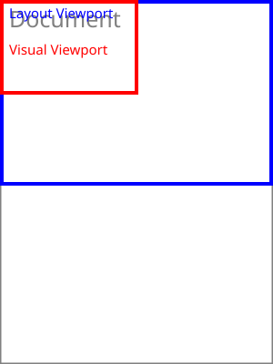

Attribution and reformatting notice added for Surgeist on 2026-10-03

This reformatted document accompanies Surgeist as software implementation support. The original English document at the source URL remains authoritative; this copy is not a new technical specification. Added labels and representation notes are non-normative. W3C is not responsible for content absent from the original, and this copy may contain formatting or hypertext errors.

This software or document includes material copied from or derived from [CSSOM View Module](https://www.w3.org/TR/2025/WD-cssom-view-1-20250916/).

Original copyright notice: Copyright © 2025 World Wide Web Consortium. W3C® liability, trademark and permissive document license rules apply.

License: [W3C Software and Document License, 2023 version](../licenses/w3c/software-license-2023.txt). Changes are format conversion, visible semantic labels, local exact-snapshot links, and passive SVG/TeX representations as detailed in the [conversion report](CONVERSION-REPORT.md). Original source text, status, authorship, and legal notices remain below.

# Source provenance

Title: CSSOM View Module

Source snapshot: https://www.w3.org/TR/2025/WD-cssom-view-1-20250916/

Snapshot SHA-256: 693b1c1fe7f72274217cc5c690bd15fe290adc78f080578fb6718e830c4c83b6

Conversion: offline format conversion of the exact stored HTML; not a new specification or summary. Publication versions remain distinct. Source fragment identifiers are preserved as short HTML anchors. Original copyright and licensing text/links are retained where present in the source.

Representation notes:
- 1 inline SVG diagrams are retained as local passive SVG assets, with original geometry and visible source diagram text. Supporting assets are not reference documents.
- The 4 source tables are presented as readable Markdown tables or explicit labeled layouts: 3 ordinary table conversions, 1 complex-table layout. Source cell content, links and relationships are retained.
- Added table headings and layout labels are non-normative presentation aids. Source header/data roles and span models remain in the conversion checks; GFM cannot reproduce native HTML th/scope/rowspan/colspan accessibility semantics. Source row-header labels are bold where used in ordinary Markdown tables.
- Small semantic emphasis/subscript/superscript HTML is retained to avoid GFM intraword-delimiter and subscript rendering defects; website layout HTML is not retained.
- Canonically unstable or combining Unicode characters and escape-sensitive punctuation are shielded as numeric entities in prose/semantic inline HTML. Literal source code stays literal.

---

# <a id="title"></a>CSSOM View Module

[Copyright](https://www.w3.org/policies/#copyright) © 2025 [World Wide Web Consortium](https://www.w3.org/). W3C<sup>®</sup> [liability](https://www.w3.org/policies/#Legal_Disclaimer), [trademark](https://www.w3.org/policies/#W3C_Trademarks) and [permissive document license](https://www.w3.org/copyright/software-license/) rules apply.

## <a id="abstract"></a>Abstract

The APIs introduced by this specification provide authors with a way to inspect and manipulate the visual view of a document. This includes getting the position of element layout boxes, obtaining the width of the viewport through script, and also scrolling an element.

[CSS](https://www.w3.org/TR/CSS/) is a language for describing the rendering of structured documents (such as HTML and XML) on screen, on paper, etc.

## <a id="sotd"></a>Status of this document

<em>This section describes the status of this document at the time of its publication.
	A list of current W3C publications
	and the latest revision of this technical report
	can be found in the <a href="https://www.w3.org/TR/">W3C standards and drafts index.</a></em>

This document was published by the [CSS Working Group](https://www.w3.org/groups/wg/css) as a <strong>Working Draft</strong> using the [Recommendation track](https://www.w3.org/policies/process/20250818/#recs-and-notes). Publication as a Working Draft does not imply endorsement by W3C and its Members.

This is a draft document and may be updated, replaced or obsoleted by other documents at any time. It is inappropriate to cite this document as other than a work in progress.

Please send feedback by [filing issues in GitHub](https://github.com/w3c/csswg-drafts/issues) (preferred), including the spec code “cssom-view” in the title, like this: “\[cssom-view\] <i>…summary of comment…</i>”. All issues and comments are [archived](https://lists.w3.org/Archives/Public/public-css-archive/). Alternately, feedback can be sent to the ([archived](https://lists.w3.org/Archives/Public/www-style/)) public mailing list [www-style@w3.org](mailto:www-style@w3.org?Subject=%5Bcssom-view%5D%20PUT%20SUBJECT%20HERE).

<a id="w3c_process_revision"></a>

This document is governed by the [18 August 2025 W3C Process Document](https://www.w3.org/policies/process/20250818/).

This document was produced by a group operating under the [W3C Patent Policy](https://www.w3.org/policies/patent-policy/20200915/). W3C maintains a [public list of any patent disclosures](https://www.w3.org/groups/wg/css/ipr) made in connection with the deliverables of the group; that page also includes instructions for disclosing a patent. An individual who has actual knowledge of a patent that the individual believes contains [Essential Claim(s)](https://www.w3.org/policies/patent-policy/20200915/#def-essential) must disclose the information in accordance with [section 6 of the W3C Patent Policy](https://www.w3.org/policies/patent-policy/20200915/#sec-Disclosure).

## <a id="background"></a>1. Background

Many of the features defined in this specification have been supported by browsers for a long period of time. The goal of this specification is to define these features in such a way that they can be implemented by all browsers in an interoperable manner. The specification also defines a some new features which allow for scroll customization.

Tests

Basic IDL tests

- [idlharness.html](https://wpt.fyi/results/css/cssom-view/idlharness.html) [(live test)](http://wpt.live/css/cssom-view/idlharness.html) [(source)](https://github.com/web-platform-tests/wpt/blob/master/css/cssom-view/idlharness.html)

------------------------------------------------------------------------

## <a id="terminology"></a>2. Terminology

Terminology used in this specification is from DOM, CSSOM and HTML. [\[DOM\]](#biblio-dom) [\[CSSOM\]](#biblio-cssom) [\[HTML\]](#biblio-html)

<a id="ref-for-the-body-element-2"></a>

An element <var>body</var> (which will be [the `body` element](https://html.spec.whatwg.org/multipage/dom.html#the-body-element-2)) is <a id="potentially-scrollable"></a>potentially scrollable if all of the following conditions are true:

- <a id="ref-for-box"></a>

  <var>body</var> has an associated [box](https://www.w3.org/TR/css-display-4/#box).

- <a id="ref-for-parent-element"></a>

  <a id="ref-for-propdef-overflow-x"></a>

  <a id="ref-for-propdef-overflow-y"></a>

  <a id="ref-for-valdef-overflow-visible"></a>

  <a id="ref-for-valdef-overflow-clip"></a>

  <var>body</var>’s [parent element](https://dom.spec.whatwg.org/#parent-element)’s computed value of the [overflow-x](https://www.w3.org/TR/css-overflow-3/#propdef-overflow-x) or [overflow-y](https://www.w3.org/TR/css-overflow-3/#propdef-overflow-y) properties is neither [visible](https://www.w3.org/TR/css-overflow-3/#valdef-overflow-visible) nor [clip](https://www.w3.org/TR/css-overflow-3/#valdef-overflow-clip).

- <a id="ref-for-propdef-overflow-x①"></a>

  <a id="ref-for-propdef-overflow-y①"></a>

  <a id="ref-for-valdef-overflow-visible①"></a>

  <a id="ref-for-valdef-overflow-clip①"></a>

  <var>body</var>’s computed value of the [overflow-x](https://www.w3.org/TR/css-overflow-3/#propdef-overflow-x) or [overflow-y](https://www.w3.org/TR/css-overflow-3/#propdef-overflow-y) properties is neither [visible](https://www.w3.org/TR/css-overflow-3/#valdef-overflow-visible) nor [clip](https://www.w3.org/TR/css-overflow-3/#valdef-overflow-clip).

<a id="ref-for-the-body-element"></a>

<a id="ref-for-potentially-scrollable"></a>

<a id="ref-for-scrolling-box"></a>

<a id="ref-for-propdef-overflow"></a>

<a id="ref-for-valdef-overflow-auto"></a>

> <strong data-conversion-semantic="note">Note</strong>
>
> Note: A <code><a href="https://html.spec.whatwg.org/multipage/sections.html#the-body-element">body</a></code> element that is [potentially scrollable](#potentially-scrollable) might not have a [scrolling box](#scrolling-box). For instance, it could have a used value of [overflow](https://www.w3.org/TR/css-overflow-3/#propdef-overflow) being [auto](https://www.w3.org/TR/css-overflow-3/#valdef-overflow-auto) but not have its content overflowing its content area.

<a id="ref-for-x1"></a>

<a id="ref-for-block-end"></a>

<a id="ref-for-inline-end"></a>

<a id="ref-for-scrolling-area-origin"></a>

<a id="ref-for-content-distribution-properties"></a>

A <a id="scrolling-box"></a>scrolling box of a [viewport](https://www.w3.org/TR/CSS2/visuren.html#x1) or element has two <a id="overflow-directions"></a>overflow directions, which are the [block-end](https://www.w3.org/TR/css-writing-modes-4/#block-end) and [inline-end](https://www.w3.org/TR/css-writing-modes-4/#inline-end) directions for that viewport or element. Note that the initial scroll position might not be aligned with the [scrolling area origin](#scrolling-area-origin) depending on the [content-distribution properties](https://www.w3.org/TR/css-align-3/#content-distribution-properties), see [CSS Box Alignment 3 § 5.3 Alignment Overflow and Scroll Containers](https://www.w3.org/TR/css-align-3/#overflow-scroll-position).

<a id="ref-for-x1①"></a>

<a id="ref-for-scrolling-box①"></a>

<a id="ref-for-overflow-directions"></a>

The term <a id="scrolling-area"></a>scrolling area refers to a box of a [viewport](https://www.w3.org/TR/CSS2/visuren.html#x1) or an element that has the following edges, depending on the <a id="ref-for-x1②"></a>viewport’s or element’s [scrolling box’s](#scrolling-box) [overflow directions](#overflow-directions).

<a id="ref-for-overflow-directions①"></a>**If the [overflow directions](#overflow-directions) are…**

**rightward and downward**

<a id="ref-for-x1③"></a>**For a [viewport](https://www.w3.org/TR/CSS2/visuren.html#x1)**

**top edge**  
<a id="ref-for-initial-containing-block"></a>The top edge of the [initial containing block](https://www.w3.org/TR/css-display-4/#initial-containing-block).

**right edge**  
<a id="ref-for-x1④"></a><a id="ref-for-margin-edge"></a><a id="ref-for-initial-containing-block①"></a>The right-most edge of the right edge of the [initial containing block](https://www.w3.org/TR/css-display-4/#initial-containing-block) and the right [margin edge](https://www.w3.org/TR/css-box-4/#margin-edge) of all of the [viewport’s](https://www.w3.org/TR/CSS2/visuren.html#x1) descendants' boxes.

**bottom edge**  
<a id="ref-for-x1⑤"></a><a id="ref-for-margin-edge①"></a><a id="ref-for-initial-containing-block②"></a>The bottom-most edge of the bottom edge of the [initial containing block](https://www.w3.org/TR/css-display-4/#initial-containing-block) and the bottom [margin edge](https://www.w3.org/TR/css-box-4/#margin-edge) of all of the [viewport’s](https://www.w3.org/TR/CSS2/visuren.html#x1) descendants' boxes.

**left edge**  
<a id="ref-for-initial-containing-block③"></a>The left edge of the [initial containing block](https://www.w3.org/TR/css-display-4/#initial-containing-block).

**For an element**

**top edge**  
<a id="ref-for-padding-edge"></a>The element’s top [padding edge](https://www.w3.org/TR/css-box-4/#padding-edge).

**right edge**  
<a id="ref-for-margin-edge②"></a><a id="ref-for-padding-edge①"></a>The right-most edge of the element’s right [padding edge](https://www.w3.org/TR/css-box-4/#padding-edge) and the right [margin edge](https://www.w3.org/TR/css-box-4/#margin-edge) of all of the element’s descendants' boxes, excluding boxes that have an ancestor of the element as their containing block.

**bottom edge**  
<a id="ref-for-margin-edge③"></a><a id="ref-for-padding-edge②"></a>The bottom-most edge of the element’s bottom [padding edge](https://www.w3.org/TR/css-box-4/#padding-edge) and the bottom [margin edge](https://www.w3.org/TR/css-box-4/#margin-edge) of all of the element’s descendants' boxes, excluding boxes that have an ancestor of the element as their containing block.

**left edge**  
<a id="ref-for-padding-edge③"></a>The element’s left [padding edge](https://www.w3.org/TR/css-box-4/#padding-edge).

**leftward and downward**

**For a viewport**

**top edge**  
<a id="ref-for-initial-containing-block④"></a>The top edge of the [initial containing block](https://www.w3.org/TR/css-display-4/#initial-containing-block).

**right edge**  
<a id="ref-for-initial-containing-block⑤"></a>The right edge of the [initial containing block](https://www.w3.org/TR/css-display-4/#initial-containing-block).

**bottom edge**  
<a id="ref-for-x1⑥"></a><a id="ref-for-margin-edge④"></a><a id="ref-for-initial-containing-block⑥"></a>The bottom-most edge of the bottom edge of the [initial containing block](https://www.w3.org/TR/css-display-4/#initial-containing-block) and the bottom [margin edge](https://www.w3.org/TR/css-box-4/#margin-edge) of all of the [viewport’s](https://www.w3.org/TR/CSS2/visuren.html#x1) descendants' boxes.

**left edge**  
<a id="ref-for-x1⑦"></a><a id="ref-for-margin-edge⑤"></a><a id="ref-for-initial-containing-block⑦"></a>The left-most edge of the left edge of the [initial containing block](https://www.w3.org/TR/css-display-4/#initial-containing-block) and the left [margin edge](https://www.w3.org/TR/css-box-4/#margin-edge) of all of the [viewport’s](https://www.w3.org/TR/CSS2/visuren.html#x1) descendants' boxes.

**For an element**

**top edge**  
<a id="ref-for-padding-edge④"></a>The element’s top [padding edge](https://www.w3.org/TR/css-box-4/#padding-edge).

**right edge**  
<a id="ref-for-padding-edge⑤"></a>The element’s right [padding edge](https://www.w3.org/TR/css-box-4/#padding-edge).

**bottom edge**  
<a id="ref-for-margin-edge⑥"></a><a id="ref-for-padding-edge⑥"></a>The bottom-most edge of the element’s bottom [padding edge](https://www.w3.org/TR/css-box-4/#padding-edge) and the bottom [margin edge](https://www.w3.org/TR/css-box-4/#margin-edge) of all of the element’s descendants' boxes, excluding boxes that have an ancestor of the element as their containing block.

**left edge**  
<a id="ref-for-margin-edge⑦"></a><a id="ref-for-padding-edge⑦"></a>The left-most edge of the element’s left [padding edge](https://www.w3.org/TR/css-box-4/#padding-edge) and the left [margin edge](https://www.w3.org/TR/css-box-4/#margin-edge) of all of the element’s descendants' boxes, excluding boxes that have an ancestor of the element as their containing block.

**leftward and upward**

**For a viewport**

**top edge**  
<a id="ref-for-x1⑧"></a><a id="ref-for-margin-edge⑧"></a><a id="ref-for-initial-containing-block⑧"></a>The top-most edge of the top edge of the [initial containing block](https://www.w3.org/TR/css-display-4/#initial-containing-block) and the top [margin edge](https://www.w3.org/TR/css-box-4/#margin-edge) of all of the [viewport’s](https://www.w3.org/TR/CSS2/visuren.html#x1) descendants' boxes.

**right edge**  
<a id="ref-for-initial-containing-block⑨"></a>The right edge of the [initial containing block](https://www.w3.org/TR/css-display-4/#initial-containing-block).

**bottom edge**  
<a id="ref-for-initial-containing-block①⓪"></a>The bottom edge of the [initial containing block](https://www.w3.org/TR/css-display-4/#initial-containing-block).

**left edge**  
<a id="ref-for-x1⑨"></a><a id="ref-for-margin-edge⑨"></a><a id="ref-for-initial-containing-block①①"></a>The left-most edge of the left edge of the [initial containing block](https://www.w3.org/TR/css-display-4/#initial-containing-block) and the left [margin edge](https://www.w3.org/TR/css-box-4/#margin-edge) of all of the [viewport’s](https://www.w3.org/TR/CSS2/visuren.html#x1) descendants' boxes.

**For an element**

**top edge**  
<a id="ref-for-margin-edge①⓪"></a><a id="ref-for-padding-edge⑧"></a>The top-most edge of the element’s top [padding edge](https://www.w3.org/TR/css-box-4/#padding-edge) and the top [margin edge](https://www.w3.org/TR/css-box-4/#margin-edge) of all of the element’s descendants' boxes, excluding boxes that have an ancestor of the element as their containing block.

**right edge**  
<a id="ref-for-padding-edge⑨"></a>The element’s right [padding edge](https://www.w3.org/TR/css-box-4/#padding-edge).

**bottom edge**  
<a id="ref-for-padding-edge①⓪"></a>The element’s bottom [padding edge](https://www.w3.org/TR/css-box-4/#padding-edge).

**left edge**  
<a id="ref-for-margin-edge①①"></a><a id="ref-for-padding-edge①①"></a>The left-most edge of the element’s left [padding edge](https://www.w3.org/TR/css-box-4/#padding-edge) and the left [margin edge](https://www.w3.org/TR/css-box-4/#margin-edge) of all of the element’s descendants' boxes, excluding boxes that have an ancestor of the element as their containing block.

**rightward and upward**

**For a viewport**

**top edge**  
<a id="ref-for-x1①⓪"></a><a id="ref-for-margin-edge①②"></a><a id="ref-for-initial-containing-block①②"></a>The top-most edge of the top edge of the [initial containing block](https://www.w3.org/TR/css-display-4/#initial-containing-block) and the top [margin edge](https://www.w3.org/TR/css-box-4/#margin-edge) of all of the [viewport’s](https://www.w3.org/TR/CSS2/visuren.html#x1) descendants' boxes.

**right edge**  
<a id="ref-for-x1①①"></a><a id="ref-for-margin-edge①③"></a><a id="ref-for-initial-containing-block①③"></a>The right-most edge of the right edge of the [initial containing block](https://www.w3.org/TR/css-display-4/#initial-containing-block) and the right [margin edge](https://www.w3.org/TR/css-box-4/#margin-edge) of all of the [viewport’s](https://www.w3.org/TR/CSS2/visuren.html#x1) descendants' boxes.

**bottom edge**  
<a id="ref-for-initial-containing-block①④"></a>The bottom edge of the [initial containing block](https://www.w3.org/TR/css-display-4/#initial-containing-block).

**left edge**  
<a id="ref-for-initial-containing-block①⑤"></a>The left edge of the [initial containing block](https://www.w3.org/TR/css-display-4/#initial-containing-block).

**For an element**

**top edge**  
<a id="ref-for-margin-edge①④"></a><a id="ref-for-padding-edge①②"></a>The top-most edge of the element’s top [padding edge](https://www.w3.org/TR/css-box-4/#padding-edge) and the top [margin edge](https://www.w3.org/TR/css-box-4/#margin-edge) of all of the element’s descendants' boxes, excluding boxes that have an ancestor of the element as their containing block.

**right edge**  
<a id="ref-for-margin-edge①⑤"></a><a id="ref-for-padding-edge①③"></a>The right-most edge of the element’s right [padding edge](https://www.w3.org/TR/css-box-4/#padding-edge) and the right [margin edge](https://www.w3.org/TR/css-box-4/#margin-edge) of all of the element’s descendants' boxes, excluding boxes that have an ancestor of the element as their containing block.

**bottom edge**  
<a id="ref-for-padding-edge①④"></a>The element’s bottom [padding edge](https://www.w3.org/TR/css-box-4/#padding-edge).

**left edge**  
<a id="ref-for-padding-edge①⑤"></a>The element’s left [padding edge](https://www.w3.org/TR/css-box-4/#padding-edge).

<a id="ref-for-scrolling-area"></a>

<a id="ref-for-initial-containing-block①⑥"></a>

<a id="ref-for-x1①②"></a>

The <a id="scrolling-area-origin"></a>origin of a [scrolling area](#scrolling-area) is the origin of the [initial containing block](https://www.w3.org/TR/css-display-4/#initial-containing-block) if the <a id="ref-for-scrolling-area①"></a>scrolling area is a [viewport](https://www.w3.org/TR/CSS2/visuren.html#x1), and otherwise the top left padding edge of the element when the element has its default scroll position. The x-coordinate increases rightwards, and the y-coordinate increases downwards.

The <a id="beginning-edges"></a>beginning edges of a particular set of edges of a box or element are the following edges:

<a id="ref-for-overflow-directions②"></a>

If the [overflow directions](#overflow-directions) are rightward and downward

The top and left edges.

<a id="ref-for-overflow-directions③"></a>

If the [overflow directions](#overflow-directions) are leftward and downward

The top and right edges.

<a id="ref-for-overflow-directions④"></a>

If the [overflow directions](#overflow-directions) are leftward and upward

The bottom and right edges.

<a id="ref-for-overflow-directions⑤"></a>

If the [overflow directions](#overflow-directions) are rightward and upward

The bottom and left edges.

The <a id="ending-edges"></a>ending edges of a particular set of edges of a box or element are the following edges:

<a id="ref-for-overflow-directions⑥"></a>

If the [overflow directions](#overflow-directions) are rightward and downward

The bottom and right edges.

<a id="ref-for-overflow-directions⑦"></a>

If the [overflow directions](#overflow-directions) are leftward and downward

The bottom and left edges.

<a id="ref-for-overflow-directions⑧"></a>

If the [overflow directions](#overflow-directions) are leftward and upward

The top and left edges.

<a id="ref-for-overflow-directions⑨"></a>

If the [overflow directions](#overflow-directions) are rightward and upward

The top and right edges.

<a id="ref-for-x1①③"></a>

<a id="ref-for-scrolling-area②"></a>

The <a id="visual-viewport"></a>visual viewport is a kind of [viewport](https://www.w3.org/TR/CSS2/visuren.html#x1) whose [scrolling area](#scrolling-area) is another <a id="ref-for-x1①④"></a>viewport, called the <a id="layout-viewport"></a>layout viewport.

<a id="ref-for-visual-viewport"></a>

<a id="ref-for-layout-viewport"></a>

<a id="ref-for-canvas"></a>

In addition to scrolling, the [visual viewport](#visual-viewport) may also apply a scale transform to its [layout viewport](#layout-viewport). This transform is applied to the [canvas](https://www.w3.org/TR/CSS2/intro.html#canvas) of the <a id="ref-for-layout-viewport①"></a>layout viewport and does not affect its internal coordinate space.

<a id="ref-for-reference-pixel"></a>

> <strong data-conversion-semantic="note">Note</strong>
>
> Note: The scale transform of the visual viewport is often referred to as "pinch-zoom". Conceptually, this transform changes the size of the CSS [reference pixel](https://www.w3.org/TR/css-values-4/#reference-pixel) but changes the size of the layout viewport proportionally so that it does not cause reflow of the page’s contents.

<a id="ref-for-visual-viewport①"></a>

The magnitude of the scale transform is known as the [visual viewport](#visual-viewport)’s <a id="scale-factor"></a>scale factor.

> <strong data-conversion-semantic="example">Example</strong>
>
> <a id="example-vvanimation"></a>
>
> This animation shows an example of a zoomed in visual viewport being "panned" around (for example, by a user performing a touch drag). The page is scaled so that the layout viewport is larger than the visual viewport.
>
> <a id="ref-for-viewport-perform-a-scroll"></a>
>
> A scroll delta is applied to the visual viewport first. When the visual viewport is at its extent, scroll delta will be applied to the layout viewport. This behavior is implemented by the [perform a scroll](#viewport-perform-a-scroll) steps.
>
> <a id="lv"></a>
>
> <a id="vv"></a>
>
> 
>
> Diagram text: Document Layout Viewport Visual Viewport
>
>   
> <a id="vvanimationBtn"></a>Toggle Animation

<a id="ref-for-visualviewport"></a>

<a id="ref-for-document"></a>

<a id="ref-for-concept-document-window"></a>

<a id="ref-for-window"></a>

<a id="ref-for-visualviewport①"></a>

<a id="ref-for-layout-viewport②"></a>

<a id="ref-for-window①"></a>

<a id="ref-for-x1①⑤"></a>

The <code><a href="#visualviewport">VisualViewport</a></code> object has an <a id="visualviewport-associated-document"></a>associated document, which is a <code><a href="https://dom.spec.whatwg.org/#document">Document</a></code> object. It is the [associated document](https://html.spec.whatwg.org/multipage/nav-history-apis.html#concept-document-window) of the owner <code><a href="https://html.spec.whatwg.org/multipage/nav-history-apis.html#window">Window</a></code> of <code><a href="#visualviewport">VisualViewport</a></code>. The [layout viewport](#layout-viewport) is the owner <code><a href="https://html.spec.whatwg.org/multipage/nav-history-apis.html#window">Window</a></code>’s [viewport](https://www.w3.org/TR/CSS2/visuren.html#x1).

<a id="ref-for-propdef-display"></a>

<a id="ref-for-valdef-display-table-column"></a>

<a id="ref-for-valdef-display-table-column-group"></a>

<a id="ref-for-box①"></a>

For the purpose of the requirements in this specification, elements that have a computed value of the [display](https://www.w3.org/TR/css-display-4/#propdef-display) property that is [table-column](https://www.w3.org/TR/css-display-4/#valdef-display-table-column) or [table-column-group](https://www.w3.org/TR/css-display-4/#valdef-display-table-column-group) must be considered to have an associated [box](https://www.w3.org/TR/css-display-4/#box) (the column or column group, respectively).

<a id="ref-for-box②"></a>

<a id="ref-for-propdef-display①"></a>

<a id="ref-for-elementdef-rect"></a>

The term <a id="svg-layout-box"></a>SVG layout box refers to a [box](https://www.w3.org/TR/css-display-4/#box) generated by an SVG element which does not correspond to a CSS-defined [display](https://www.w3.org/TR/css-display-4/#propdef-display) type. (Such as the <a id="ref-for-box③"></a>box generated by a <code><a href="https://www.w3.org/TR/SVG2/shapes.html#elementdef-rect">rect</a></code> element.)

The term <a id="transforms"></a>transforms refers to SVG transforms and CSS transforms. [\[SVG11\]](#biblio-svg11) [\[CSS-TRANSFORMS-1\]](#biblio-css-transforms-1)

When a method or an attribute is said to call another method or attribute, the user agent must invoke its internal API for that attribute or method so that e.g. the author can’t change the behavior by overriding attributes or methods with custom properties or functions in ECMAScript.

<a id="ref-for-string-is"></a>

Unless otherwise stated, all string comparisons use [is](https://infra.spec.whatwg.org/#string-is).

### <a id="css-pixels"></a>2.1. CSS pixels

<a id="ref-for-px"></a>

All coordinates and dimensions for the APIs defined in this specification are in [CSS pixels](https://www.w3.org/TR/css-values-4/#px), unless otherwise specified. [\[CSS-VALUES\]](#biblio-css-values)

<a id="ref-for-dom-window-matchmedia"></a>

> <strong data-conversion-semantic="note">Note</strong>
>
> Note: This does not apply to e.g. <code><a href="#dom-window-matchmedia">matchMedia()</a></code> as the units are explicitly given there.

### <a id="zooming"></a>2.2. Zooming

<a id="ref-for-scale-factor"></a>

There are two kinds of zoom, <a id="page-zoom"></a>page zoom which affects the size of the initial viewport, and the visual viewport [scale factor](#scale-factor) which acts like a magnifying glass and does not affect the initial viewport or actual viewport. [\[CSS-DEVICE-ADAPT\]](#biblio-css-device-adapt)

> <strong data-conversion-semantic="note">Note</strong>
>
> Note: The "scale factor" is often referred to as "pinch-zoom"; however, it can be affected through means other than pinch-zooming. e.g. The user agent may zooms in on a focused input element to make it legible.

### <a id="web-exposed-screen-information"></a>2.3. Web-exposed screen information

User agents may choose to hide information about the screen of the output device, in order to protect the user’s privacy. In order to do so in a consistent manner across APIs, this specification defines the following terms, each having a width and a height, the origin being the top left corner, and the x- and y-coordinates increase rightwards and downwards, respectively.

The <a id="web-exposed-screen-area"></a>Web-exposed screen area is one of the following:

- <a id="ref-for-px①"></a>

  The area of the output device, in [CSS pixels](https://www.w3.org/TR/css-values-4/#px).

- <a id="ref-for-x1①⑥"></a>

  <a id="ref-for-px②"></a>

  The area of the [viewport](https://www.w3.org/TR/CSS2/visuren.html#x1), in [CSS pixels](https://www.w3.org/TR/css-values-4/#px).

The <a id="web-exposed-available-screen-area"></a>Web-exposed available screen area is one of the following:

- <a id="ref-for-px③"></a>

  The available area of the rendering surface of the output device, in [CSS pixels](https://www.w3.org/TR/css-values-4/#px).

- <a id="ref-for-px④"></a>

  The area of the output device, in [CSS pixels](https://www.w3.org/TR/css-values-4/#px).

- <a id="ref-for-x1①⑦"></a>

  <a id="ref-for-px⑤"></a>

  The area of the [viewport](https://www.w3.org/TR/CSS2/visuren.html#x1), in [CSS pixels](https://www.w3.org/TR/css-values-4/#px).

## <a id="common-infrastructure"></a>3. Common Infrastructure

This specification depends on the WHATWG Infra standard. [\[INFRA\]](#biblio-infra)

### <a id="scrolling"></a>3.1. Scrolling

<a id="ref-for-scrolling-box②"></a>

<a id="ref-for-pseudo-element"></a>

When a user agent is to <a id="perform-a-scroll"></a>perform a scroll of a [scrolling box](#scrolling-box) <var>box</var>, to a given position <var>position</var>, an associated element or [pseudo-element](https://www.w3.org/TR/selectors-4/#pseudo-element) <var>element</var> and optionally a scroll behavior <var>behavior</var> (which is "`auto`" if omitted), the following steps must be run:

1.  <a id="ref-for-concept-smooth-scroll"></a>

    <a id="ref-for-smooth-scroll-aborted"></a>

    [Abort](#smooth-scroll-aborted) any ongoing [smooth scroll](#concept-smooth-scroll) for <var>box</var>.

2.  <a id="ref-for-concept-instant-scroll"></a>

    <a id="ref-for-eventdef-document-scrollend"></a>

    <a id="ref-for-concept-smooth-scroll①"></a>

    <a id="ref-for-propdef-scroll-behavior"></a>

    If the user agent honors the [scroll-behavior](https://www.w3.org/TR/css-overflow-3/#propdef-scroll-behavior) property and one of the following are true:

    - <a id="ref-for-valdef-scroll-behavior-smooth"></a>

      <a id="ref-for-propdef-scroll-behavior①"></a>

      <var>behavior</var> is "`auto`" and <var>element</var> is not null and its computed value of the [scroll-behavior](https://www.w3.org/TR/css-overflow-3/#propdef-scroll-behavior) property is [smooth](https://www.w3.org/TR/css-overflow-3/#valdef-scroll-behavior-smooth)

    - <var>behavior</var> is `smooth`

    ...then perform a [smooth scroll](#concept-smooth-scroll) of <var>box</var> to <var>position</var>. Once the position has finished updating, emit the [scrollend](#eventdef-document-scrollend) event. Otherwise, perform an [instant scroll](#concept-instant-scroll) of <var>box</var> to <var>position</var>. After an <a id="ref-for-concept-instant-scroll①"></a>instant scroll emit the <a id="ref-for-eventdef-document-scrollend①"></a>scrollend event.

    <a id="ref-for-concept-instant-scroll②"></a>

    > <strong data-conversion-semantic="note">Note</strong>
    >
    > Note: `behavior: "instant"` always performs an [instant scroll](#concept-instant-scroll) by this algorithm.

    <a id="ref-for-eventdef-document-scrollend②"></a>

    > <strong data-conversion-semantic="note">Note</strong>
    >
    > Note: If the scroll position did not change as a result of the user interaction or programmatic invocation, where no translations were applied as a result, then no [scrollend](#eventdef-document-scrollend) event fires because no scrolling occurred.

<a id="ref-for-x1①⑧"></a>

When a user agent is to <a id="viewport-perform-a-scroll"></a>perform a scroll of a [viewport](https://www.w3.org/TR/CSS2/visuren.html#x1) to a given position <var>position</var> and optionally a scroll behavior <var>behavior</var> (which is "`auto`" if omitted) it must perform a coordinated viewport scroll by following these steps:

1.  <a id="ref-for-x1①⑨"></a>

    <a id="ref-for-document①"></a>

    Let <var>doc</var> be the [viewport’s](https://www.w3.org/TR/CSS2/visuren.html#x1) associated <code><a href="https://dom.spec.whatwg.org/#document">Document</a></code>.

2.  <a id="ref-for-visualviewport②"></a>

    <a id="ref-for-visualviewport-associated-document"></a>

    Let <var>vv</var> be the <code><a href="#visualviewport">VisualViewport</a></code> whose [associated document](#visualviewport-associated-document) is <var>doc</var>.

3.  <a id="ref-for-x1②⓪"></a>

    <a id="ref-for-scrolling-box③"></a>

    <a id="ref-for-dom-visualviewport-width"></a>

    Let <var>maxX</var> be the difference between [viewport](https://www.w3.org/TR/CSS2/visuren.html#x1)’s [scrolling box](#scrolling-box)’s width and the value of <var>vv</var>’s [width](#dom-visualviewport-width) attribute.

4.  <a id="ref-for-x1②①"></a>

    <a id="ref-for-scrolling-box④"></a>

    <a id="ref-for-dom-visualviewport-height"></a>

    Let <var>maxY</var> be the difference between [viewport](https://www.w3.org/TR/CSS2/visuren.html#x1)’s [scrolling box](#scrolling-box)’s height and the value of <var>vv</var>’s [height](#dom-visualviewport-height) attribute.

5.  <a id="ref-for-dom-visualviewport-pageleft"></a>

    Let <var>dx</var> be the horizontal component of <var>position</var> - the value <var>vv</var>’s [pageLeft](#dom-visualviewport-pageleft) attribute

6.  <a id="ref-for-dom-visualviewport-pagetop"></a>

    Let <var>dy</var> be the vertical component of <var>position</var> - the value of <var>vv</var>’s [pageTop](#dom-visualviewport-pagetop) attribute

7.  <a id="ref-for-dom-visualviewport-offsetleft"></a>

    Let <var>visual x</var> be the value of <var>vv</var>’s [offsetLeft](#dom-visualviewport-offsetleft) attribute.

8.  <a id="ref-for-dom-visualviewport-offsettop"></a>

    Let <var>visual y</var> be the value of <var>vv</var>’s [offsetTop](#dom-visualviewport-offsettop) attribute.

9.  Let <var>visual dx</var> be min(<var>maxX</var>, max(0, <var>visual x</var> + <var>dx</var>)) - <var>visual x</var>.

10. Let <var>visual dy</var> be min(<var>maxY</var>, max(0, <var>visual y</var> + <var>dy</var>)) - <var>visual y</var>.

11. Let <var>layout dx</var> be <var>dx</var> - <var>visual dx</var>

12. Let <var>layout dy</var> be <var>dy</var> - <var>visual dy</var>

13. Let <var>element</var> be <var>doc</var>’s root element if there is one, null otherwise.

14. <a id="ref-for-perform-a-scroll"></a>

    <a id="ref-for-x1②②"></a>

    <a id="ref-for-scrolling-box⑤"></a>

    [Perform a scroll](#perform-a-scroll) of the [viewport](https://www.w3.org/TR/CSS2/visuren.html#x1)’s [scrolling box](#scrolling-box) to its current scroll position + (<var>layout dx</var>, <var>layout dy</var>) with <var>element</var> as the associated element, and <var>behavior</var> as the scroll behavior.

15. <a id="ref-for-perform-a-scroll①"></a>

    <a id="ref-for-scrolling-box⑥"></a>

    [Perform a scroll](#perform-a-scroll) of <var>vv</var>’s [scrolling box](#scrolling-box) to its current scroll position + (<var>visual dx</var>, <var>visual dy</var>) with <var>element</var> as the associated element, and <var>behavior</var> as the scroll behavior.

> <strong data-conversion-semantic="note">Note</strong>
>
> Note: Conceptually, the visual viewport is scrolled until it "bumps up" against the layout viewport edge and then "pushes" the layout viewport by applying the scroll delta to the layout viewport. However, the scrolls in the steps above are computed ahead of time and applied in the opposite order so that the layout viewport is scrolled before the visual viewport. This is done for historical reasons to ensure consistent scroll event ordering. See the [example above](#example-vvanimation) for a visual depiction.

> <strong data-conversion-semantic="example">Example</strong>
>
> <a id="example-ed07146f"></a> The user pinch-zooms into the document and ticks their mouse wheel, requesting the user agent scroll the document down by 50px. Because the document is pinch-zoomed in, the visual viewport has 20px of room to scroll. The user agent distributes the scroll by scrolling the visual viewport down by 20px and the layout viewport by 30px.

> <strong data-conversion-semantic="example">Example</strong>
>
> <a id="example-cb4be61c"></a> The user is viewing a document in a mobile user agent. The document focuses an offscreen text input element, showing a virtual keyboard which shrinks the visual viewport. The user agent must now bring the element into view in the visual viewport. The user agent scrolls the layout viewport so that the element is visible within it, then the visual viewport so that the element is visible to the user.

Scroll is <a id="scroll-completed"></a>completed when the scroll position has no more pending updates or translations and the user has completed their gesture. Scroll position updates include smooth or instant mouse wheel scrolling, keyboard scrolling, scroll-snap events, or other APIs and gestures which cause the scroll position to update and possibly interpolate. User gestures like touch panning or trackpad scrolling aren’t complete until pointers or keys have released.

<a id="ref-for-scrolling-box⑦"></a>

When a user agent is to perform a <a id="concept-smooth-scroll"></a>smooth scroll of a [scrolling box](#scrolling-box) <var>box</var> to <var>position</var>, it must update the scroll position of <var>box</var> in a user-agent-defined fashion over a user-agent-defined amount of time. When the scroll is <a id="smooth-scroll-completed"></a>completed, the scroll position of <var>box</var> must be <var>position</var>. The scroll can also be <a id="smooth-scroll-aborted"></a>aborted, either by an algorithm or by the user.

<a id="ref-for-scrolling-box⑧"></a>

When a user agent is to perform an <a id="concept-instant-scroll"></a>instant scroll of a [scrolling box](#scrolling-box) <var>box</var> to <var>position</var>, it must update the scroll position of <var>box</var> to <var>position</var>.

To <a id="scroll-to-the-beginning-of-the-document"></a>scroll to the beginning of the document for a document <var>document</var>, follow these steps:

1.  <a id="ref-for-x1②③"></a>

    Let <var>viewport</var> be the [viewport](https://www.w3.org/TR/CSS2/visuren.html#x1) that is associated with <var>document</var>.

2.  <a id="ref-for-scrolling-area③"></a>

    <a id="ref-for-beginning-edges"></a>

    Let <var>position</var> be the scroll position <var>viewport</var> would have by aligning the [beginning edges](#beginning-edges) of the [scrolling area](#scrolling-area) with the <a id="ref-for-beginning-edges①"></a>beginning edges of <var>viewport</var>.

3.  <a id="ref-for-concept-smooth-scroll②"></a>

    If <var>position</var> is the same as <var>viewport</var>’s current scroll position, and <var>viewport</var> does not have an ongoing [smooth scroll](#concept-smooth-scroll), abort these steps.

4.  <a id="ref-for-root-element"></a>

    <a id="ref-for-viewport-perform-a-scroll①"></a>

    [Perform a scroll](#viewport-perform-a-scroll) of <var>viewport</var> to <var>position</var>, and <var>document</var>’s [root element](https://www.w3.org/TR/css-display-4/#root-element) as the associated element, if there is one, or null otherwise.

> <strong data-conversion-semantic="note">Note</strong>
>
> Note: This algorithm is used when navigating to the `#top` fragment identifier, as defined in HTML. [\[HTML\]](#biblio-html)

Tests

- [interrupt-hidden-smooth-scroll.html](https://wpt.fyi/results/css/cssom-view/interrupt-hidden-smooth-scroll.html) [(live test)](http://wpt.live/css/cssom-view/interrupt-hidden-smooth-scroll.html) [(source)](https://github.com/web-platform-tests/wpt/blob/master/css/cssom-view/interrupt-hidden-smooth-scroll.html)
- [long_scroll_composited.html](https://wpt.fyi/results/css/cssom-view/long_scroll_composited.html) [(live test)](http://wpt.live/css/cssom-view/long_scroll_composited.html) [(source)](https://github.com/web-platform-tests/wpt/blob/master/css/cssom-view/long_scroll_composited.html)
- [scroll-back-to-initial-position.html](https://wpt.fyi/results/css/cssom-view/scroll-back-to-initial-position.html) [(live test)](http://wpt.live/css/cssom-view/scroll-back-to-initial-position.html) [(source)](https://github.com/web-platform-tests/wpt/blob/master/css/cssom-view/scroll-back-to-initial-position.html)
- [scrolling-no-browsing-context.html](https://wpt.fyi/results/css/cssom-view/scrolling-no-browsing-context.html) [(live test)](http://wpt.live/css/cssom-view/scrolling-no-browsing-context.html) [(source)](https://github.com/web-platform-tests/wpt/blob/master/css/cssom-view/scrolling-no-browsing-context.html)
- [scrolling-quirks-vs-nonquirks.html](https://wpt.fyi/results/css/cssom-view/scrolling-quirks-vs-nonquirks.html) [(live test)](http://wpt.live/css/cssom-view/scrolling-quirks-vs-nonquirks.html) [(source)](https://github.com/web-platform-tests/wpt/blob/master/css/cssom-view/scrolling-quirks-vs-nonquirks.html)
- [smooth-scroll-in-load-event.html](https://wpt.fyi/results/css/cssom-view/smooth-scroll-in-load-event.html) [(live test)](http://wpt.live/css/cssom-view/smooth-scroll-in-load-event.html) [(source)](https://github.com/web-platform-tests/wpt/blob/master/css/cssom-view/smooth-scroll-in-load-event.html)
- [smooth-scroll-nonstop.html](https://wpt.fyi/results/css/cssom-view/smooth-scroll-nonstop.html) [(live test)](http://wpt.live/css/cssom-view/smooth-scroll-nonstop.html) [(source)](https://github.com/web-platform-tests/wpt/blob/master/css/cssom-view/smooth-scroll-nonstop.html)

### <a id="webidl-values"></a>3.2. WebIDL values

When asked to <a id="normalize-non-finite-values"></a>normalize non-finite values for a value <var>x</var>, if <var>x</var> is one of the three special floating point literal values (`Infinity`, `-Infinity` or `NaN`), then <var>x</var> must be changed to the value `0`. [\[WEBIDL\]](#biblio-webidl)

<a id="ref-for-window②"></a>

## <a id="extensions-to-the-window-interface"></a>4. Extensions to the <code><a href="https://html.spec.whatwg.org/multipage/nav-history-apis.html#window">Window</a></code> Interface

<a id="enumdef-scrollbehavior"></a>

<a id="dom-scrollbehavior-auto"></a>

<a id="dom-scrollbehavior-instant"></a>

<a id="dom-scrollbehavior-smooth"></a>

<a id="dictdef-scrolloptions"></a>

<a id="ref-for-enumdef-scrollbehavior"></a>

<a id="dom-scrolloptions-behavior"></a>

<a id="dictdef-scrolltooptions"></a>

<a id="ref-for-dictdef-scrolloptions"></a>

<a id="ref-for-idl-unrestricted-double"></a>

<a id="dom-scrolltooptions-left"></a>

<a id="ref-for-idl-unrestricted-double①"></a>

<a id="dom-scrolltooptions-top"></a>

<a id="ref-for-window③"></a>

<a id="ref-for-NewObject"></a>

<a id="ref-for-mediaquerylist"></a>

<a id="ref-for-dom-window-matchmedia①"></a>

<a id="ref-for-cssomstring"></a>

<a id="dom-window-matchmedia-query-query"></a>

<a id="ref-for-SameObject"></a>

<a id="ref-for-Replaceable"></a>

<a id="ref-for-screen"></a>

<a id="ref-for-dom-window-screen"></a>

<a id="ref-for-SameObject①"></a>

<a id="ref-for-Replaceable①"></a>

<a id="ref-for-visualviewport③"></a>

<a id="ref-for-dom-window-visualviewport"></a>

<a id="ref-for-idl-undefined"></a>

<a id="ref-for-dom-window-moveto"></a>

<a id="ref-for-idl-long"></a>

<a id="dom-window-moveto-x-y-x"></a>

<a id="ref-for-idl-long①"></a>

<a id="dom-window-moveto-x-y-y"></a>

<a id="ref-for-idl-undefined①"></a>

<a id="ref-for-dom-window-moveby"></a>

<a id="ref-for-idl-long②"></a>

<a id="dom-window-moveby-x-y-x"></a>

<a id="ref-for-idl-long③"></a>

<a id="dom-window-moveby-x-y-y"></a>

<a id="ref-for-idl-undefined②"></a>

<a id="ref-for-dom-window-resizeto"></a>

<a id="ref-for-idl-long④"></a>

<a id="dom-window-resizeto-width-height-width"></a>

<a id="ref-for-idl-long⑤"></a>

<a id="dom-window-resizeto-width-height-height"></a>

<a id="ref-for-idl-undefined③"></a>

<a id="ref-for-dom-window-resizeby"></a>

<a id="ref-for-idl-long⑥"></a>

<a id="dom-window-resizeby-x-y-x"></a>

<a id="ref-for-idl-long⑦"></a>

<a id="dom-window-resizeby-x-y-y"></a>

<a id="ref-for-Replaceable②"></a>

<a id="ref-for-idl-long⑧"></a>

<a id="ref-for-dom-window-innerwidth"></a>

<a id="ref-for-Replaceable③"></a>

<a id="ref-for-idl-long⑨"></a>

<a id="ref-for-dom-window-innerheight"></a>

<a id="ref-for-Replaceable④"></a>

<a id="ref-for-idl-double"></a>

<a id="ref-for-dom-window-scrollx"></a>

<a id="ref-for-Replaceable⑤"></a>

<a id="ref-for-idl-double①"></a>

<a id="ref-for-dom-window-pagexoffset"></a>

<a id="ref-for-Replaceable⑥"></a>

<a id="ref-for-idl-double②"></a>

<a id="ref-for-dom-window-scrolly"></a>

<a id="ref-for-Replaceable⑦"></a>

<a id="ref-for-idl-double③"></a>

<a id="ref-for-dom-window-pageyoffset"></a>

<a id="ref-for-idl-undefined④"></a>

<a id="ref-for-dom-window-scroll"></a>

<a id="ref-for-dictdef-scrolltooptions"></a>

<a id="dom-window-scroll-options-options"></a>

<a id="ref-for-idl-undefined⑤"></a>

<a id="ref-for-dom-window-scroll①"></a>

<a id="ref-for-idl-unrestricted-double②"></a>

<a id="dom-window-scroll-x-y-x"></a>

<a id="ref-for-idl-unrestricted-double③"></a>

<a id="dom-window-scroll-x-y-y"></a>

<a id="ref-for-idl-undefined⑥"></a>

<a id="ref-for-dom-window-scrollto"></a>

<a id="ref-for-dictdef-scrolltooptions①"></a>

<a id="dom-window-scrollto-options-options"></a>

<a id="ref-for-idl-undefined⑦"></a>

<a id="ref-for-dom-window-scrollto①"></a>

<a id="ref-for-idl-unrestricted-double④"></a>

<a id="dom-window-scrollto-x-y-x"></a>

<a id="ref-for-idl-unrestricted-double⑤"></a>

<a id="dom-window-scrollto-x-y-y"></a>

<a id="ref-for-idl-undefined⑧"></a>

<a id="ref-for-dom-window-scrollby"></a>

<a id="ref-for-dictdef-scrolltooptions②"></a>

<a id="dom-window-scrollby-options-options"></a>

<a id="ref-for-idl-undefined⑨"></a>

<a id="ref-for-dom-window-scrollby①"></a>

<a id="ref-for-idl-unrestricted-double⑥"></a>

<a id="dom-window-scrollby-x-y-x"></a>

<a id="ref-for-idl-unrestricted-double⑦"></a>

<a id="dom-window-scrollby-x-y-y"></a>

<a id="ref-for-Replaceable⑧"></a>

<a id="ref-for-idl-long①⓪"></a>

<a id="ref-for-dom-window-screenx"></a>

<a id="ref-for-Replaceable⑨"></a>

<a id="ref-for-idl-long①①"></a>

<a id="ref-for-dom-window-screenleft"></a>

<a id="ref-for-Replaceable①⓪"></a>

<a id="ref-for-idl-long①②"></a>

<a id="ref-for-dom-window-screeny"></a>

<a id="ref-for-Replaceable①①"></a>

<a id="ref-for-idl-long①③"></a>

<a id="ref-for-dom-window-screentop"></a>

<a id="ref-for-Replaceable①②"></a>

<a id="ref-for-idl-long①④"></a>

<a id="ref-for-dom-window-outerwidth"></a>

<a id="ref-for-Replaceable①③"></a>

<a id="ref-for-idl-long①⑤"></a>

<a id="ref-for-dom-window-outerheight"></a>

<a id="ref-for-Replaceable①④"></a>

<a id="ref-for-idl-double④"></a>

<a id="ref-for-dom-window-devicepixelratio"></a>

```text
enum ScrollBehavior { "auto", "instant", "smooth" };

dictionary ScrollOptions {
    ScrollBehavior behavior = "auto";
};
dictionary ScrollToOptions : ScrollOptions {
    unrestricted double left;
    unrestricted double top;
};

partial interface Window {
    [NewObject] MediaQueryList matchMedia(CSSOMString query);
    [SameObject, Replaceable] readonly attribute Screen screen;
    [SameObject, Replaceable] readonly attribute VisualViewport? visualViewport;

    // browsing context
    undefined moveTo(long x, long y);
    undefined moveBy(long x, long y);
    undefined resizeTo(long width, long height);
    undefined resizeBy(long x, long y);

    // viewport
    [Replaceable] readonly attribute long innerWidth;
    [Replaceable] readonly attribute long innerHeight;

    // viewport scrolling
    [Replaceable] readonly attribute double scrollX;
    [Replaceable] readonly attribute double pageXOffset;
    [Replaceable] readonly attribute double scrollY;
    [Replaceable] readonly attribute double pageYOffset;
    undefined scroll(optional ScrollToOptions options = {});
    undefined scroll(unrestricted double x, unrestricted double y);
    undefined scrollTo(optional ScrollToOptions options = {});
    undefined scrollTo(unrestricted double x, unrestricted double y);
    undefined scrollBy(optional ScrollToOptions options = {});
    undefined scrollBy(unrestricted double x, unrestricted double y);

    // client
    [Replaceable] readonly attribute long screenX;
    [Replaceable] readonly attribute long screenLeft;
    [Replaceable] readonly attribute long screenY;
    [Replaceable] readonly attribute long screenTop;
    [Replaceable] readonly attribute long outerWidth;
    [Replaceable] readonly attribute long outerHeight;
    [Replaceable] readonly attribute double devicePixelRatio;
};
```
When the <a id="dom-window-matchmedia"></a><code>matchMedia(<var>query</var>)</code> method is invoked these steps must be run:

1.  <a id="ref-for-parse-a-media-query-list"></a>

    Let <var>parsed media query list</var> be the result of [parsing](https://www.w3.org/TR/cssom-1/#parse-a-media-query-list) <var>query</var>.

2.  <a id="ref-for-mediaquerylist-media-query-list"></a>

    <a id="ref-for-mediaquerylist-document"></a>

    <a id="ref-for-concept-document-window①"></a>

    <a id="ref-for-this"></a>

    <a id="ref-for-mediaquerylist①"></a>

    Return a new <code><a href="#mediaquerylist">MediaQueryList</a></code> object, with [this](https://webidl.spec.whatwg.org/#this)’s [associated `Document`](https://html.spec.whatwg.org/multipage/nav-history-apis.html#concept-document-window) as the [document](#mediaquerylist-document), with <var>parsed media query list</var> as its associated [media query list](#mediaquerylist-media-query-list).

Tests

- [matchMedia-display-none-iframe.html](https://wpt.fyi/results/css/cssom-view/matchMedia-display-none-iframe.html) [(live test)](http://wpt.live/css/cssom-view/matchMedia-display-none-iframe.html) [(source)](https://github.com/web-platform-tests/wpt/blob/master/css/cssom-view/matchMedia-display-none-iframe.html)
- [matchMedia.html](https://wpt.fyi/results/css/cssom-view/matchMedia.html) [(live test)](http://wpt.live/css/cssom-view/matchMedia.html) [(source)](https://github.com/web-platform-tests/wpt/blob/master/css/cssom-view/matchMedia.html)

<a id="ref-for-screen①"></a>

<a id="ref-for-window④"></a>

The <a id="dom-window-screen"></a>`screen` attribute must return the <code><a href="#screen">Screen</a></code> object associated with the <code><a href="https://html.spec.whatwg.org/multipage/nav-history-apis.html#window">Window</a></code> object.

<a id="ref-for-dom-window-screen①"></a>

<a id="ref-for-windowproxy"></a>

<a id="ref-for-document②"></a>

> <strong data-conversion-semantic="note">Note</strong>
>
> Note: Accessing <code><a href="#dom-window-screen">screen</a></code> through a <code><a href="https://html.spec.whatwg.org/multipage/nav-history-apis.html#windowproxy">WindowProxy</a></code> object might yield different results when the <code><a href="https://dom.spec.whatwg.org/#document">Document</a></code> is navigated.

<a id="ref-for-concept-document-window②"></a>

<a id="ref-for-fully-active"></a>

<a id="ref-for-visualviewport④"></a>

<a id="ref-for-window⑤"></a>

If the [associated document](https://html.spec.whatwg.org/multipage/nav-history-apis.html#concept-document-window) is [fully active](https://html.spec.whatwg.org/multipage/document-sequences.html#fully-active), the <a id="dom-window-visualviewport"></a>`visualViewport` attribute must return the <code><a href="#visualviewport">VisualViewport</a></code> object associated with the <code><a href="https://html.spec.whatwg.org/multipage/nav-history-apis.html#window">Window</a></code> object’s <a id="ref-for-concept-document-window③"></a>associated document. Otherwise, it must return null.

> <strong data-conversion-semantic="note">Note</strong>
>
> Note: the VisualViewport object is only returned and useful for a window whose Document is currently being presented. If a reference is retained to a VisualViewport whose associated Document is not being currently presented, the values in that VisualViewport must not reveal any information about the browsing context.

Tests

- [window-screen-height-immutable.html](https://wpt.fyi/results/css/cssom-view/window-screen-height-immutable.html) [(live test)](http://wpt.live/css/cssom-view/window-screen-height-immutable.html) [(source)](https://github.com/web-platform-tests/wpt/blob/master/css/cssom-view/window-screen-height-immutable.html)
- [window-screen-height.html](https://wpt.fyi/results/css/cssom-view/window-screen-height.html) [(live test)](http://wpt.live/css/cssom-view/window-screen-height.html) [(source)](https://github.com/web-platform-tests/wpt/blob/master/css/cssom-view/window-screen-height.html)
- [window-screen-width-immutable.html](https://wpt.fyi/results/css/cssom-view/window-screen-width-immutable.html) [(live test)](http://wpt.live/css/cssom-view/window-screen-width-immutable.html) [(source)](https://github.com/web-platform-tests/wpt/blob/master/css/cssom-view/window-screen-width-immutable.html)
- [window-screen-width.html](https://wpt.fyi/results/css/cssom-view/window-screen-width.html) [(live test)](http://wpt.live/css/cssom-view/window-screen-width.html) [(source)](https://github.com/web-platform-tests/wpt/blob/master/css/cssom-view/window-screen-width.html)

The <a id="dom-window-moveto"></a><code>moveTo(<var>x</var>, <var>y</var>)</code> method must follow these steps:

1.  Optionally, return.

2.  <a id="ref-for-this①"></a>

    <a id="ref-for-concept-relevant-global"></a>

    <a id="ref-for-window-bc"></a>

    Let <var>target</var> be [this](https://webidl.spec.whatwg.org/#this)’s [relevant global object](https://html.spec.whatwg.org/multipage/webappapis.html#concept-relevant-global)’s [browsing context](https://html.spec.whatwg.org/multipage/nav-history-apis.html#window-bc).

3.  <a id="ref-for-auxiliary-browsing-context"></a>

    If <var>target</var> is not an [auxiliary browsing context](https://html.spec.whatwg.org/multipage/document-sequences.html#auxiliary-browsing-context) that was created by a script (as opposed to by an action of the user), then return.

4.  Optionally, clamp <var>x</var> and <var>y</var> in a user-agent-defined manner so that the window does not move outside the available space.

5.  <a id="ref-for-px⑥"></a>

    Move <var>target</var>’s window such that the window’s top left corner is at coordinates (<var>x</var>, <var>y</var>) relative to the top left corner of the output device, measured in [CSS pixels](https://www.w3.org/TR/css-values-4/#px) of <var>target</var>. The positive axes are rightward and downward.

The <a id="dom-window-moveby"></a><code>moveBy(<var>x</var>, <var>y</var>)</code> method must follow these steps:

1.  Optionally, return.

2.  <a id="ref-for-this②"></a>

    <a id="ref-for-concept-relevant-global①"></a>

    <a id="ref-for-window-bc①"></a>

    Let <var>target</var> be [this](https://webidl.spec.whatwg.org/#this)’s [relevant global object](https://html.spec.whatwg.org/multipage/webappapis.html#concept-relevant-global)’s [browsing context](https://html.spec.whatwg.org/multipage/nav-history-apis.html#window-bc).

3.  <a id="ref-for-auxiliary-browsing-context①"></a>

    If <var>target</var> is not an [auxiliary browsing context](https://html.spec.whatwg.org/multipage/document-sequences.html#auxiliary-browsing-context) that was created by a script (as opposed to by an action of the user), then return.

4.  Optionally, clamp <var>x</var> and <var>y</var> in a user-agent-defined manner so that the window does not move outside the available space.

5.  <a id="ref-for-px⑦"></a>

    Move <var>target</var>’s window <var>x</var> [CSS pixels](https://www.w3.org/TR/css-values-4/#px) of <var>target</var> rightward and <var>y</var> <a id="ref-for-px⑧"></a>CSS pixels of <var>target</var> downward.

The <a id="dom-window-resizeto"></a><code>resizeTo(<var>width</var>, <var>height</var>)</code> method must follow these steps:

1.  Optionally, return.

2.  <a id="ref-for-this③"></a>

    <a id="ref-for-concept-relevant-global②"></a>

    <a id="ref-for-window-bc②"></a>

    Let <var>target</var> be [this](https://webidl.spec.whatwg.org/#this)’s [relevant global object](https://html.spec.whatwg.org/multipage/webappapis.html#concept-relevant-global)’s [browsing context](https://html.spec.whatwg.org/multipage/nav-history-apis.html#window-bc).

3.  <a id="ref-for-auxiliary-browsing-context②"></a>

    If <var>target</var> is not an [auxiliary browsing context](https://html.spec.whatwg.org/multipage/document-sequences.html#auxiliary-browsing-context) that was created by a script (as opposed to by an action of the user), then return.

4.  Optionally, clamp <var>width</var> and <var>height</var> in a user-agent-defined manner so that the window does not get too small or bigger than the available space.

5.  <a id="ref-for-px⑨"></a>

    Resize <var>target</var>’s window by moving its right and bottom edges such that the distance between the left and right edges of the viewport are <var>width</var> [CSS pixels](https://www.w3.org/TR/css-values-4/#px) of <var>target</var> and the distance between the top and bottom edges of the viewport are <var>height</var> <a id="ref-for-px①⓪"></a>CSS pixels of <var>target</var>.

6.  Optionally, move <var>target</var>’s window in a user-agent-defined manner so that it does not grow outside the available space.

Tests

- [resizeTo-negative.html](https://wpt.fyi/results/css/cssom-view/resizeTo-negative.html) [(live test)](http://wpt.live/css/cssom-view/resizeTo-negative.html) [(source)](https://github.com/web-platform-tests/wpt/blob/master/css/cssom-view/resizeTo-negative.html)

The <a id="dom-window-resizeby"></a><code>resizeBy(<var>x</var>, <var>y</var>)</code> method must follow these steps:

1.  Optionally, return.

2.  <a id="ref-for-this④"></a>

    <a id="ref-for-concept-relevant-global③"></a>

    <a id="ref-for-window-bc③"></a>

    Let <var>target</var> be [this](https://webidl.spec.whatwg.org/#this)’s [relevant global object](https://html.spec.whatwg.org/multipage/webappapis.html#concept-relevant-global)’s [browsing context](https://html.spec.whatwg.org/multipage/nav-history-apis.html#window-bc).

3.  <a id="ref-for-auxiliary-browsing-context③"></a>

    If <var>target</var> is not an [auxiliary browsing context](https://html.spec.whatwg.org/multipage/document-sequences.html#auxiliary-browsing-context) that was created by a script (as opposed to by an action of the user), then return.

4.  Optionally, clamp <var>x</var> and <var>y</var> in a user-agent-defined manner so that the window does not get too small or bigger than the available space.

5.  <a id="ref-for-px①①"></a>

    Resize <var>target</var>’s window by moving its right edge <var>x</var> [CSS pixels](https://www.w3.org/TR/css-values-4/#px) of <var>target</var> rightward and its bottom edge <var>y</var> <a id="ref-for-px①②"></a>CSS pixels of <var>target</var> downward.

6.  Optionally, move <var>target</var>’s window in a user-agent-defined manner so that it does not grow outside the available space.

<a id="ref-for-x1②④"></a>

The <a id="dom-window-innerwidth"></a>`innerWidth` attribute must return the [viewport](https://www.w3.org/TR/CSS2/visuren.html#x1) width including the size of a rendered scroll bar (if any), or zero if there is no <a id="ref-for-x1②⑤"></a>viewport.

> <strong data-conversion-semantic="example">Example</strong>
>
> <a id="example-daa56a22"></a> The following snippet shows how to obtain the width of the viewport:
>
> ```text
> var viewportWidth = innerWidth
> ```
<a id="ref-for-x1②⑥"></a>

The <a id="dom-window-innerheight"></a>`innerHeight` attribute must return the [viewport](https://www.w3.org/TR/CSS2/visuren.html#x1) height including the size of a rendered scroll bar (if any), or zero if there is no <a id="ref-for-x1②⑦"></a>viewport.

<a id="ref-for-initial-containing-block①⑦"></a>

<a id="ref-for-x1②⑧"></a>

The <a id="dom-window-scrollx"></a>`scrollX` attribute must return the x-coordinate, relative to the [initial containing block](https://www.w3.org/TR/css-display-4/#initial-containing-block) origin, of the left of the [viewport](https://www.w3.org/TR/CSS2/visuren.html#x1), or zero if there is no <a id="ref-for-x1②⑨"></a>viewport.

<a id="ref-for-dom-window-scrollx①"></a>

The <a id="dom-window-pagexoffset"></a>`pageXOffset` attribute must return the value returned by the <code><a href="#dom-window-scrollx">scrollX</a></code> attribute.

<a id="ref-for-initial-containing-block①⑧"></a>

<a id="ref-for-x1③⓪"></a>

The <a id="dom-window-scrolly"></a>`scrollY` attribute must return the y-coordinate, relative to the [initial containing block](https://www.w3.org/TR/css-display-4/#initial-containing-block) origin, of the top of the [viewport](https://www.w3.org/TR/CSS2/visuren.html#x1), or zero if there is no <a id="ref-for-x1③①"></a>viewport.

<a id="ref-for-dom-window-scrolly①"></a>

The <a id="dom-window-pageyoffset"></a>`pageYOffset` attribute must return the value returned by the <code><a href="#dom-window-scrolly">scrollY</a></code> attribute.

When the <a id="dom-window-scroll"></a>`scroll()` method is invoked these steps must be run:

1.  If invoked with one argument, follow these substeps:

    1.  Let <var>options</var> be the argument.

    2.  <a id="ref-for-dom-scrolltooptions-left"></a>

        <a id="ref-for-x1③②"></a>

        Let <var>x</var> be the value of the <code><a href="#dom-scrolltooptions-left">left</a></code> dictionary member of <var>options</var>, if present, or the [viewport’s](https://www.w3.org/TR/CSS2/visuren.html#x1) current scroll position on the x axis otherwise.

    3.  <a id="ref-for-dom-scrolltooptions-top"></a>

        <a id="ref-for-x1③③"></a>

        Let <var>y</var> be the value of the <code><a href="#dom-scrolltooptions-top">top</a></code> dictionary member of <var>options</var>, if present, or the [viewport’s](https://www.w3.org/TR/CSS2/visuren.html#x1) current scroll position on the y axis otherwise.

2.  If invoked with two arguments, follow these substeps:

    1.  <a id="ref-for-dfn-convert-ecmascript-to-idl-value"></a>

        <a id="ref-for-dictdef-scrolltooptions③"></a>

        Let <var>options</var> be null [converted](https://webidl.spec.whatwg.org/#dfn-convert-ecmascript-to-idl-value) to a <code><a href="#dictdef-scrolltooptions">ScrollToOptions</a></code> dictionary. [\[WEBIDL\]](#biblio-webidl)

    2.  Let <var>x</var> and <var>y</var> be the arguments, respectively.

3.  <a id="ref-for-normalize-non-finite-values"></a>

    [Normalize non-finite values](#normalize-non-finite-values) for <var>x</var> and <var>y</var>.

4.  <a id="ref-for-x1③④"></a>

    If there is no [viewport](https://www.w3.org/TR/CSS2/visuren.html#x1), abort these steps.

5.  <a id="ref-for-x1③⑤"></a>

    Let <var>viewport width</var> be the width of the [viewport](https://www.w3.org/TR/CSS2/visuren.html#x1) excluding the width of the scroll bar, if any.

6.  <a id="ref-for-x1③⑥"></a>

    Let <var>viewport height</var> be the height of the [viewport](https://www.w3.org/TR/CSS2/visuren.html#x1) excluding the height of the scroll bar, if any.

7.  <a id="ref-for-overflow-directions①⓪"></a>

    <a id="ref-for-x1③⑦"></a>

    If the [viewport](https://www.w3.org/TR/CSS2/visuren.html#x1) has rightward [overflow direction](#overflow-directions)

    <a id="ref-for-scrolling-area④"></a>

    <a id="ref-for-x1③⑧"></a>

    Let <var>x</var> be max(0, min(<var>x</var>, [viewport](https://www.w3.org/TR/CSS2/visuren.html#x1) [scrolling area](#scrolling-area) width - <var>viewport width</var>)).

    <a id="ref-for-overflow-directions①①"></a>

    <a id="ref-for-x1③⑨"></a>

    If the [viewport](https://www.w3.org/TR/CSS2/visuren.html#x1) has leftward [overflow direction](#overflow-directions)

    <a id="ref-for-scrolling-area⑤"></a>

    <a id="ref-for-x1④⓪"></a>

    Let <var>x</var> be min(0, max(<var>x</var>, <var>viewport width</var> - [viewport](https://www.w3.org/TR/CSS2/visuren.html#x1) [scrolling area](#scrolling-area) width)).

8.  <a id="ref-for-overflow-directions①②"></a>

    <a id="ref-for-x1④①"></a>

    If the [viewport](https://www.w3.org/TR/CSS2/visuren.html#x1) has downward [overflow direction](#overflow-directions)

    <a id="ref-for-scrolling-area⑥"></a>

    <a id="ref-for-x1④②"></a>

    Let <var>y</var> be max(0, min(<var>y</var>, [viewport](https://www.w3.org/TR/CSS2/visuren.html#x1) [scrolling area](#scrolling-area) height - <var>viewport height</var>)).

    <a id="ref-for-overflow-directions①③"></a>

    <a id="ref-for-x1④③"></a>

    If the [viewport](https://www.w3.org/TR/CSS2/visuren.html#x1) has upward [overflow direction](#overflow-directions)

    <a id="ref-for-scrolling-area⑦"></a>

    <a id="ref-for-x1④④"></a>

    Let <var>y</var> be min(0, max(<var>y</var>, <var>viewport height</var> - [viewport](https://www.w3.org/TR/CSS2/visuren.html#x1) [scrolling area](#scrolling-area) height)).

9.  <a id="ref-for-x1④⑤"></a>

    <a id="ref-for-scrolling-area⑧"></a>

    Let <var>position</var> be the scroll position the [viewport](https://www.w3.org/TR/CSS2/visuren.html#x1) would have by aligning the x-coordinate <var>x</var> of the <a id="ref-for-x1④⑥"></a>viewport [scrolling area](#scrolling-area) with the left of the <a id="ref-for-x1④⑦"></a>viewport and aligning the y-coordinate <var>y</var> of the <a id="ref-for-x1④⑧"></a>viewport <a id="ref-for-scrolling-area⑨"></a>scrolling area with the top of the <a id="ref-for-x1④⑨"></a>viewport.

10. <a id="ref-for-x1⑤⓪"></a>

    <a id="ref-for-concept-smooth-scroll③"></a>

    If <var>position</var> is the same as the [viewport’s](https://www.w3.org/TR/CSS2/visuren.html#x1) current scroll position, and the <a id="ref-for-x1⑤①"></a>viewport does not have an ongoing [smooth scroll](#concept-smooth-scroll), abort these steps.

11. <a id="ref-for-x1⑤②"></a>

    <a id="ref-for-document③"></a>

    Let <var>document</var> be the [viewport’s](https://www.w3.org/TR/CSS2/visuren.html#x1) associated <code><a href="https://dom.spec.whatwg.org/#document">Document</a></code>.

12. <a id="ref-for-viewport-perform-a-scroll②"></a>

    <a id="ref-for-x1⑤③"></a>

    <a id="ref-for-root-element①"></a>

    <a id="ref-for-dom-scrolloptions-behavior"></a>

    [Perform a scroll](#viewport-perform-a-scroll) of the [viewport](https://www.w3.org/TR/CSS2/visuren.html#x1) to <var>position</var>, <var>document</var>’s [root element](https://www.w3.org/TR/css-display-4/#root-element) as the associated element, if there is one, or null otherwise, and the scroll behavior being the value of the <code><a href="#dom-scrolloptions-behavior">behavior</a></code> dictionary member of <var>options</var>.

    <a id="ref-for-x1⑤④"></a>

    <a id="ref-for-viewport-perform-a-scroll③"></a>

    <a id="ref-for-scrolling-box⑨"></a>

    <a id="ref-for-perform-a-scroll②"></a>

    > <strong data-conversion-semantic="issue">Issue</strong>
    >
    > <a id="issue-1e98b401"></a> User agents do not agree whether this uses the (coordinated) [viewport](https://www.w3.org/TR/CSS2/visuren.html#x1) [perform a scroll](#viewport-perform-a-scroll) or the [scrolling box](#scrolling-box) [perform a scroll](#perform-a-scroll) on the layout viewport’s scrolling box.

Tests

- [add-background-attachment-fixed-during-smooth-scroll.html](https://wpt.fyi/results/css/cssom-view/add-background-attachment-fixed-during-smooth-scroll.html) [(live test)](http://wpt.live/css/cssom-view/add-background-attachment-fixed-during-smooth-scroll.html) [(source)](https://github.com/web-platform-tests/wpt/blob/master/css/cssom-view/add-background-attachment-fixed-during-smooth-scroll.html)
- [HTMLBody-ScrollArea_quirksmode.html](https://wpt.fyi/results/css/cssom-view/HTMLBody-ScrollArea_quirksmode.html) [(live test)](http://wpt.live/css/cssom-view/HTMLBody-ScrollArea_quirksmode.html) [(source)](https://github.com/web-platform-tests/wpt/blob/master/css/cssom-view/HTMLBody-ScrollArea_quirksmode.html)
- [window-scroll-arguments.html](https://wpt.fyi/results/css/cssom-view/window-scroll-arguments.html) [(live test)](http://wpt.live/css/cssom-view/window-scroll-arguments.html) [(source)](https://github.com/web-platform-tests/wpt/blob/master/css/cssom-view/window-scroll-arguments.html)

<a id="ref-for-dom-window-scroll②"></a>

When the <a id="dom-window-scrollto"></a>`scrollTo()` method is invoked, the user agent must act as if the <code><a href="#dom-window-scroll">scroll()</a></code> method was invoked with the same arguments.

Tests

- [background-change-during-smooth-scroll.html](https://wpt.fyi/results/css/cssom-view/background-change-during-smooth-scroll.html) [(live test)](http://wpt.live/css/cssom-view/background-change-during-smooth-scroll.html) [(source)](https://github.com/web-platform-tests/wpt/blob/master/css/cssom-view/background-change-during-smooth-scroll.html)
- [scrollTo-zoom.html](https://wpt.fyi/results/css/cssom-view/scrollTo-zoom.html) [(live test)](http://wpt.live/css/cssom-view/scrollTo-zoom.html) [(source)](https://github.com/web-platform-tests/wpt/blob/master/css/cssom-view/scrollTo-zoom.html)

When the <a id="dom-window-scrollby"></a>`scrollBy()` method is invoked, the user agent must run these steps:

1.  If invoked with two arguments, follow these substeps:

    1.  <a id="ref-for-dfn-convert-ecmascript-to-idl-value①"></a>

        <a id="ref-for-dictdef-scrolltooptions④"></a>

        Let <var>options</var> be null [converted](https://webidl.spec.whatwg.org/#dfn-convert-ecmascript-to-idl-value) to a <code><a href="#dictdef-scrolltooptions">ScrollToOptions</a></code> dictionary. [\[WEBIDL\]](#biblio-webidl)

    2.  Let <var>x</var> and <var>y</var> be the arguments, respectively.

    3.  <a id="ref-for-dom-scrolltooptions-left①"></a>

        Let the <code><a href="#dom-scrolltooptions-left">left</a></code> dictionary member of <var>options</var> have the value <var>x</var>.

    4.  <a id="ref-for-dom-scrolltooptions-top①"></a>

        Let the <code><a href="#dom-scrolltooptions-top">top</a></code> dictionary member of <var>options</var> have the value <var>y</var>.

2.  <a id="ref-for-normalize-non-finite-values①"></a>

    <a id="ref-for-dom-scrolltooptions-left②"></a>

    <a id="ref-for-dom-scrolltooptions-top②"></a>

    [Normalize non-finite values](#normalize-non-finite-values) for the <code><a href="#dom-scrolltooptions-left">left</a></code> and <code><a href="#dom-scrolltooptions-top">top</a></code> dictionary members of <var>options</var>.

3.  <a id="ref-for-dom-window-scrollx②"></a>

    <a id="ref-for-dom-scrolltooptions-left③"></a>

    Add the value of <code><a href="#dom-window-scrollx">scrollX</a></code> to the <code><a href="#dom-scrolltooptions-left">left</a></code> dictionary member.

4.  <a id="ref-for-dom-window-scrolly②"></a>

    <a id="ref-for-dom-scrolltooptions-top③"></a>

    Add the value of <code><a href="#dom-window-scrolly">scrollY</a></code> to the <code><a href="#dom-scrolltooptions-top">top</a></code> dictionary member.

5.  <a id="ref-for-dom-window-scroll③"></a>

    Act as if the <code><a href="#dom-window-scroll">scroll()</a></code> method was invoked with <var>options</var> as the only argument.

<a id="ref-for-web-exposed-screen-area"></a>

<a id="ref-for-px①③"></a>

The <a id="dom-window-screenx"></a>`screenX` and <a id="dom-window-screenleft"></a>`screenLeft` attributes must return the x-coordinate, relative to the origin of the [Web-exposed screen area](#web-exposed-screen-area), of the left of the client window as number of [CSS pixels](https://www.w3.org/TR/css-values-4/#px), or zero if there is no such thing.

Tests

- [screenLeftTop.html](https://wpt.fyi/results/css/cssom-view/screenLeftTop.html) [(live test)](http://wpt.live/css/cssom-view/screenLeftTop.html) [(source)](https://github.com/web-platform-tests/wpt/blob/master/css/cssom-view/screenLeftTop.html)

<a id="ref-for-web-exposed-screen-area①"></a>

<a id="ref-for-px①④"></a>

The <a id="dom-window-screeny"></a>`screenY` and <a id="dom-window-screentop"></a>`screenTop` attributes must return the y-coordinate, relative to the origin of the screen of the [Web-exposed screen area](#web-exposed-screen-area), of the top of the client window as number of [CSS pixels](https://www.w3.org/TR/css-values-4/#px), or zero if there is no such thing.

The <a id="dom-window-outerwidth"></a>`outerWidth` attribute must return the width of the client window. If there is no client window this attribute must return zero.

The <a id="dom-window-outerheight"></a>`outerHeight` attribute must return the height of the client window. If there is no client window this attribute must return zero.

The <a id="dom-window-devicepixelratio"></a>`devicePixelRatio` attribute must return the result of the following <a id="determine-the-device-pixel-ratio"></a>determine the device pixel ratio algorithm:

1.  If there is no output device, return 1 and abort these steps.

2.  <a id="ref-for-px①⑤"></a>

    <a id="ref-for-page-zoom"></a>

    <a id="ref-for-scale-factor①"></a>

    Let <var>CSS pixel size</var> be the size of a [CSS pixel](https://www.w3.org/TR/css-values-4/#px) at the current [page zoom](#page-zoom) and using a [scale factor](#scale-factor) of 1.0.

3.  Let <var>device pixel size</var> be the vertical size of a device pixel of the output device.

4.  Return the result of dividing <var>CSS pixel size</var> by <var>device pixel size</var>.

<a id="ref-for-dom-open"></a>

### <a id="the-features-argument-to-the-open()-method"></a>4.1. The <var>features</var> argument to the <code><a href="https://html.spec.whatwg.org/multipage/nav-history-apis.html#dom-open">open()</a></code> method

<a id="ref-for-dom-open①"></a>

HTML defines the <code><a href="https://html.spec.whatwg.org/multipage/nav-history-apis.html#dom-open">open()</a></code> method. This section defines behavior for position and size given in the <var>features</var> argument. [\[HTML\]](#biblio-html)

<a id="ref-for-ordered-map"></a>

To <a id="set-up-browsing-context-features"></a>set up browsing context features for a browsing context <var>target</var> given a [map](https://infra.spec.whatwg.org/#ordered-map) <var>tokenizedFeatures</var>:

1.  Let <var>x</var> be null.

2.  Let <var>y</var> be null.

3.  Let <var>width</var> be null.

4.  Let <var>height</var> be null.

5.  <a id="ref-for-supported-open-feature-name-left"></a>

    <a id="ref-for-map-exists"></a>

    If <var>tokenizedFeatures</var>\["[left](#supported-open-feature-name-left)"\] [exists](https://infra.spec.whatwg.org/#map-exists):

    1.  <a id="ref-for-rules-for-parsing-integers"></a>

        <a id="ref-for-supported-open-feature-name-left①"></a>

        Set <var>x</var> to the result of invoking the [rules for parsing integers](https://html.spec.whatwg.org/multipage/common-microsyntaxes.html#rules-for-parsing-integers) on <var>tokenizedFeatures</var>\["[left](#supported-open-feature-name-left)"\].

    2.  If <var>x</var> is an error, set <var>x</var> to 0.

    3.  <a id="ref-for-web-exposed-available-screen-area"></a>

        Optionally, clamp <var>x</var> in a user-agent-defined manner so that the window does not move outside the [Web-exposed available screen area](#web-exposed-available-screen-area).

    4.  <a id="ref-for-web-exposed-screen-area②"></a>

        <a id="ref-for-px①⑥"></a>

        Optionally, move <var>target</var>’s window such that the window’s left edge is at the horizontal coordinate <var>x</var> relative to the left edge of the [Web-exposed screen area](#web-exposed-screen-area), measured in [CSS pixels](https://www.w3.org/TR/css-values-4/#px) of <var>target</var>. The positive axis is rightward.

6.  <a id="ref-for-supported-open-feature-name-top"></a>

    <a id="ref-for-map-exists①"></a>

    If <var>tokenizedFeatures</var>\["[top](#supported-open-feature-name-top)"\] [exists](https://infra.spec.whatwg.org/#map-exists):

    1.  <a id="ref-for-rules-for-parsing-integers①"></a>

        <a id="ref-for-supported-open-feature-name-top①"></a>

        Set <var>y</var> to the result of invoking the [rules for parsing integers](https://html.spec.whatwg.org/multipage/common-microsyntaxes.html#rules-for-parsing-integers) on <var>tokenizedFeatures</var>\["[top](#supported-open-feature-name-top)"\].

    2.  If <var>y</var> is an error, set <var>y</var> to 0.

    3.  <a id="ref-for-web-exposed-available-screen-area①"></a>

        Optionally, clamp <var>y</var> in a user-agent-defined manner so that the window does not move outside the [Web-exposed available screen area](#web-exposed-available-screen-area).

    4.  <a id="ref-for-web-exposed-screen-area③"></a>

        <a id="ref-for-px①⑦"></a>

        Optionally, move <var>target</var>’s window such that the window’s top edge is at the vertical coordinate <var>y</var> relative to the top edge of the [Web-exposed screen area](#web-exposed-screen-area), measured in [CSS pixels](https://www.w3.org/TR/css-values-4/#px) of <var>target</var>. The positive axis is downward.

7.  <a id="ref-for-supported-open-feature-name-width"></a>

    <a id="ref-for-map-exists②"></a>

    If <var>tokenizedFeatures</var>\["[width](#supported-open-feature-name-width)"\] [exists](https://infra.spec.whatwg.org/#map-exists):

    1.  <a id="ref-for-rules-for-parsing-integers②"></a>

        <a id="ref-for-supported-open-feature-name-width①"></a>

        Set <var>width</var> to the result of invoking the [rules for parsing integers](https://html.spec.whatwg.org/multipage/common-microsyntaxes.html#rules-for-parsing-integers) on <var>tokenizedFeatures</var>\["[width](#supported-open-feature-name-width)"\].

    2.  If <var>width</var> is an error, set <var>width</var> to 0.

    3.  If <var>width</var> is not 0:

        1.  <a id="ref-for-web-exposed-available-screen-area②"></a>

            Optionally, clamp <var>width</var> in a user-agent-defined manner so that the window does not get too small or bigger than the [Web-exposed available screen area](#web-exposed-available-screen-area).

        2.  <a id="ref-for-px①⑧"></a>

            Optionally, size <var>target</var>’s window by moving its right edge such that the distance between the left and right edges of the viewport are <var>width</var> [CSS pixels](https://www.w3.org/TR/css-values-4/#px) of <var>target</var>.

        3.  <a id="ref-for-web-exposed-available-screen-area③"></a>

            Optionally, move <var>target</var>’s window in a user-agent-defined manner so that it does not grow outside the [Web-exposed available screen area](#web-exposed-available-screen-area).

8.  <a id="ref-for-supported-open-feature-name-height"></a>

    <a id="ref-for-map-exists③"></a>

    If <var>tokenizedFeatures</var>\["[height](#supported-open-feature-name-height)"\] [exists](https://infra.spec.whatwg.org/#map-exists):

    1.  <a id="ref-for-rules-for-parsing-integers③"></a>

        <a id="ref-for-supported-open-feature-name-height①"></a>

        Set <var>height</var> to the result of invoking the [rules for parsing integers](https://html.spec.whatwg.org/multipage/common-microsyntaxes.html#rules-for-parsing-integers) on <var>tokenizedFeatures</var>\["[height](#supported-open-feature-name-height)"\].

    2.  If <var>height</var> is an error, set <var>height</var> to 0.

    3.  If <var>height</var> is not 0:

        1.  <a id="ref-for-web-exposed-available-screen-area④"></a>

            Optionally, clamp <var>height</var> in a user-agent-defined manner so that the window does not get too small or bigger than the [Web-exposed available screen area](#web-exposed-available-screen-area).

        2.  <a id="ref-for-px①⑨"></a>

            Optionally, size <var>target</var>’s window by moving its bottom edge such that the distance between the top and bottom edges of the viewport are <var>height</var> [CSS pixels](https://www.w3.org/TR/css-values-4/#px) of <var>target</var>.

        3.  <a id="ref-for-web-exposed-available-screen-area⑤"></a>

            Optionally, move <var>target</var>’s window in a user-agent-defined manner so that it does not grow outside the [Web-exposed available screen area](#web-exposed-available-screen-area).

A <a id="supported-open-feature-name"></a>supported `open()` feature name is one of the following:

<a id="supported-open-feature-name-width"></a>width  
The width of the viewport.

<a id="supported-open-feature-name-height"></a>height  
The height of the viewport.

<a id="supported-open-feature-name-left"></a>left  
The left position of the window.

<a id="supported-open-feature-name-top"></a>top  
The top position of the window.

<a id="ref-for-mediaquerylist②"></a>

### <a id="the-mediaquerylist-interface"></a>4.2. The <code><a href="#mediaquerylist">MediaQueryList</a></code> Interface

<a id="ref-for-event-loop"></a>

This section integrates with the [event loop](https://html.spec.whatwg.org/multipage/webappapis.html#event-loop) defined in HTML. [\[HTML\]](#biblio-html)

<a id="ref-for-mediaquerylist③"></a>

A <code><a href="#mediaquerylist">MediaQueryList</a></code> object has an associated <a id="mediaquerylist-media-query-list"></a>media query list and an associated <a id="mediaquerylist-document"></a>document set on creation.

<a id="ref-for-mediaquerylist④"></a>

<a id="ref-for-serialize-a-media-query-list"></a>

<a id="ref-for-mediaquerylist-media-query-list①"></a>

A <code><a href="#mediaquerylist">MediaQueryList</a></code> object has an associated <a id="mediaquerylist-media"></a>media which is the [serialized](https://www.w3.org/TR/cssom-1/#serialize-a-media-query-list) form of the associated [media query list](#mediaquerylist-media-query-list).

<a id="ref-for-mediaquerylist⑤"></a>

<a id="ref-for-mediaquerylist-media-query-list②"></a>

<a id="ref-for-mediaquerylist-document①"></a>

A <code><a href="#mediaquerylist">MediaQueryList</a></code> object has an associated <a id="mediaquerylist-matches-state"></a>matches state which is true if the associated [media query list](#mediaquerylist-media-query-list) matches the state of the [document](#mediaquerylist-document), and false otherwise.

<a id="ref-for-document④"></a>

When asked to <a id="evaluate-media-queries-and-report-changes"></a>evaluate media queries and report changes for a <code><a href="https://dom.spec.whatwg.org/#document">Document</a></code> <var>doc</var>, run these steps:

1.  <a id="ref-for-mediaquerylist⑥"></a>

    <a id="ref-for-mediaquerylist-document②"></a>

    For each <code><a href="#mediaquerylist">MediaQueryList</a></code> object <var>target</var> that has <var>doc</var> as its [document](#mediaquerylist-document), in the order they were created, oldest first, run these substeps:

    1.  <a id="ref-for-dom-mediaquerylistevent-matches"></a>

        <a id="ref-for-dom-mediaquerylist-media"></a>

        <a id="ref-for-dom-event-istrusted"></a>

        <a id="ref-for-mediaquerylistevent"></a>

        <a id="ref-for-eventdef-mediaquerylist-change"></a>

        <a id="ref-for-concept-event-fire"></a>

        <a id="ref-for-mediaquerylist-matches-state"></a>

        If <var>target</var>’s [matches state](#mediaquerylist-matches-state) has changed since the last time these steps were run, [fire an event](https://dom.spec.whatwg.org/#concept-event-fire) named [change](#eventdef-mediaquerylist-change) at <var>target</var> using <code><a href="#mediaquerylistevent">MediaQueryListEvent</a></code>, with its <code><a href="https://dom.spec.whatwg.org/#dom-event-istrusted">isTrusted</a></code> attribute initialized to true, its <code><a href="#dom-mediaquerylist-media">media</a></code> attribute initialized to <var>target</var>’s media, and its <code><a href="#dom-mediaquerylistevent-matches">matches</a></code> attribute initialized to <var>target</var>’s <a id="ref-for-mediaquerylist-matches-state①"></a>matches state.

> <strong data-conversion-semantic="example">Example</strong>
>
> <a id="example-5ecb609e"></a> A simple piece of code that detects changes in the orientation of the viewport can be written as follows:
>
> ```text
> function handleOrientationChange(event) {
>     if(event.matches) // landscape
>         …
>     else
>         …
> }
> var mql = matchMedia("(orientation:landscape)");
> mql.onchange = handleOrientationChange;
> ```
<a id="ref-for-Exposed"></a>

<a id="mediaquerylist"></a>

<a id="ref-for-eventtarget"></a>

<a id="ref-for-cssomstring①"></a>

<a id="ref-for-dom-mediaquerylist-media①"></a>

<a id="ref-for-idl-boolean"></a>

<a id="ref-for-dom-mediaquerylist-matches"></a>

<a id="ref-for-idl-undefined①⓪"></a>

<a id="ref-for-dom-mediaquerylist-addlistener"></a>

<a id="ref-for-callbackdef-eventlistener"></a>

<a id="dom-mediaquerylist-addlistener-callback-callback"></a>

<a id="ref-for-idl-undefined①①"></a>

<a id="ref-for-dom-mediaquerylist-removelistener"></a>

<a id="ref-for-callbackdef-eventlistener①"></a>

<a id="dom-mediaquerylist-removelistener-callback-callback"></a>

<a id="ref-for-eventhandler"></a>

<a id="ref-for-dom-mediaquerylist-onchange"></a>

```text
[Exposed=Window]
interface MediaQueryList : EventTarget {
  readonly attribute CSSOMString media;
  readonly attribute boolean matches;
  undefined addListener(EventListener? callback);
  undefined removeListener(EventListener? callback);
           attribute EventHandler onchange;
};
```
The <a id="dom-mediaquerylist-media"></a>`media` attribute must return the associated media.

<a id="ref-for-mediaquerylist-matches-state②"></a>

The <a id="dom-mediaquerylist-matches"></a>`matches` attribute must return the associated [matches state](#mediaquerylist-matches-state).

The <a id="dom-mediaquerylist-addlistener"></a><code>addListener(<var>callback</var>)</code> method, when invoked, must run these steps:

1.  <a id="ref-for-add-an-event-listener"></a>

    <a id="ref-for-this⑤"></a>

    <a id="ref-for-concept-event-listener"></a>

    <a id="ref-for-event-listener-type"></a>

    <a id="ref-for-event-listener-callback"></a>

    [Add an event listener](https://dom.spec.whatwg.org/#add-an-event-listener) with [this](https://webidl.spec.whatwg.org/#this) and an [event listener](https://dom.spec.whatwg.org/#concept-event-listener) whose [type](https://dom.spec.whatwg.org/#event-listener-type) is `change`, and [callback](https://dom.spec.whatwg.org/#event-listener-callback) is <var>callback</var>.

The <a id="dom-mediaquerylist-removelistener"></a><code>removeListener(<var>callback</var>)</code> method, when invoked, must run these steps:

1.  <a id="ref-for-this⑥"></a>

    <a id="ref-for-eventtarget-event-listener-list"></a>

    <a id="ref-for-list-contain"></a>

    <a id="ref-for-concept-event-listener①"></a>

    <a id="ref-for-event-listener-type①"></a>

    <a id="ref-for-event-listener-callback①"></a>

    <a id="ref-for-event-listener-capture"></a>

    <a id="ref-for-remove-an-event-listener"></a>

    If [this](https://webidl.spec.whatwg.org/#this)’s [event listener list](https://dom.spec.whatwg.org/#eventtarget-event-listener-list) [contains](https://infra.spec.whatwg.org/#list-contain) an [event listener](https://dom.spec.whatwg.org/#concept-event-listener) whose [type](https://dom.spec.whatwg.org/#event-listener-type) is `change`, [callback](https://dom.spec.whatwg.org/#event-listener-callback) is <var>callback</var>, and [capture](https://dom.spec.whatwg.org/#event-listener-capture) is false, then [remove an event listener](https://dom.spec.whatwg.org/#remove-an-event-listener) with <a id="ref-for-this⑦"></a>this and that <a id="ref-for-concept-event-listener②"></a>event listener.

<a id="ref-for-dom-mediaquerylist-addlistener①"></a>

<a id="ref-for-dom-mediaquerylist-removelistener①"></a>

<a id="ref-for-dom-mediaquerylist-addlistener②"></a>

<a id="ref-for-dom-mediaquerylist-removelistener②"></a>

<a id="ref-for-dom-eventtarget-addeventlistener"></a>

<a id="ref-for-dom-eventtarget-removeeventlistener"></a>

<a id="ref-for-mediaquerylist⑦"></a>

> <strong data-conversion-semantic="note">Note</strong>
>
> Note: This specification initially had a custom callback mechanism with <code><a href="#dom-mediaquerylist-addlistener">addListener()</a></code> and <code><a href="#dom-mediaquerylist-removelistener">removeListener()</a></code>, and the callback was invoked with the associated media query list as argument. Now the normal event mechanism is used instead. For backwards compatibility, the <code><a href="#dom-mediaquerylist-addlistener">addListener()</a></code> and <code><a href="#dom-mediaquerylist-removelistener">removeListener()</a></code> methods are basically aliases for <code><a href="https://dom.spec.whatwg.org/#dom-eventtarget-addeventlistener">addEventListener()</a></code> and <code><a href="https://dom.spec.whatwg.org/#dom-eventtarget-removeeventlistener">removeEventListener()</a></code>, respectively, and the `change` event masquerades as a <code><a href="#mediaquerylist">MediaQueryList</a></code>.

<a id="ref-for-event-handlers"></a>

<a id="ref-for-event-handler-event-type"></a>

<a id="ref-for-event-handler-idl-attributes"></a>

<a id="ref-for-mediaquerylist⑧"></a>

The following are the [event handlers](https://html.spec.whatwg.org/multipage/webappapis.html#event-handlers) (and their corresponding [event handler event types](https://html.spec.whatwg.org/multipage/webappapis.html#event-handler-event-type)) that must be supported, as [event handler IDL attributes](https://html.spec.whatwg.org/multipage/webappapis.html#event-handler-idl-attributes), by all objects implementing the <code><a href="#mediaquerylist">MediaQueryList</a></code> interface:

| <a id="ref-for-event-handlers①"></a>[Event handler](https://html.spec.whatwg.org/multipage/webappapis.html#event-handlers) | <a id="ref-for-event-handler-event-type①"></a>[Event handler event type](https://html.spec.whatwg.org/multipage/webappapis.html#event-handler-event-type) |
|-----------------------------------------------------------------------------------------------------------|--------------------------------------------------------------------------------------------------------------------------------|
| <a id="dom-mediaquerylist-onchange"></a><code>onchange</code>                                                                      | <a id="ref-for-eventdef-mediaquerylist-change①"></a>[change](#eventdef-mediaquerylist-change)                                                                   |

Tests

- [MediaQueryList-addListener-handleEvent.html](https://wpt.fyi/results/css/cssom-view/MediaQueryList-addListener-handleEvent.html) [(live test)](http://wpt.live/css/cssom-view/MediaQueryList-addListener-handleEvent.html) [(source)](https://github.com/web-platform-tests/wpt/blob/master/css/cssom-view/MediaQueryList-addListener-handleEvent.html)
- [MediaQueryList-addListener-removeListener.html](https://wpt.fyi/results/css/cssom-view/MediaQueryList-addListener-removeListener.html) [(live test)](http://wpt.live/css/cssom-view/MediaQueryList-addListener-removeListener.html) [(source)](https://github.com/web-platform-tests/wpt/blob/master/css/cssom-view/MediaQueryList-addListener-removeListener.html)
- [MediaQueryList-change-event-matches-value.html](https://wpt.fyi/results/css/cssom-view/MediaQueryList-change-event-matches-value.html) [(live test)](http://wpt.live/css/cssom-view/MediaQueryList-change-event-matches-value.html) [(source)](https://github.com/web-platform-tests/wpt/blob/master/css/cssom-view/MediaQueryList-change-event-matches-value.html)
- [MediaQueryList-extends-EventTarget-interop.html](https://wpt.fyi/results/css/cssom-view/MediaQueryList-extends-EventTarget-interop.html) [(live test)](http://wpt.live/css/cssom-view/MediaQueryList-extends-EventTarget-interop.html) [(source)](https://github.com/web-platform-tests/wpt/blob/master/css/cssom-view/MediaQueryList-extends-EventTarget-interop.html)
- [MediaQueryList-extends-EventTarget.html](https://wpt.fyi/results/css/cssom-view/MediaQueryList-extends-EventTarget.html) [(live test)](http://wpt.live/css/cssom-view/MediaQueryList-extends-EventTarget.html) [(source)](https://github.com/web-platform-tests/wpt/blob/master/css/cssom-view/MediaQueryList-extends-EventTarget.html)
- [MediaQueryListEvent.html](https://wpt.fyi/results/css/cssom-view/MediaQueryListEvent.html) [(live test)](http://wpt.live/css/cssom-view/MediaQueryListEvent.html) [(source)](https://github.com/web-platform-tests/wpt/blob/master/css/cssom-view/MediaQueryListEvent.html)

<a id="ref-for-Exposed①"></a>

<a id="mediaquerylistevent"></a>

<a id="ref-for-event"></a>

<a id="dom-mediaquerylistevent-mediaquerylistevent"></a>

<a id="ref-for-cssomstring②"></a>

<a id="dom-mediaquerylistevent-mediaquerylistevent-type-eventinitdict-type"></a>

<a id="ref-for-dictdef-mediaquerylisteventinit"></a>

<a id="dom-mediaquerylistevent-mediaquerylistevent-type-eventinitdict-eventinitdict"></a>

<a id="ref-for-cssomstring③"></a>

<a id="ref-for-dom-mediaquerylistevent-media"></a>

<a id="ref-for-idl-boolean①"></a>

<a id="ref-for-dom-mediaquerylistevent-matches①"></a>

<a id="dictdef-mediaquerylisteventinit"></a>

<a id="ref-for-dictdef-eventinit"></a>

<a id="ref-for-cssomstring④"></a>

<a id="dom-mediaquerylisteventinit-media"></a>

<a id="ref-for-idl-boolean②"></a>

<a id="dom-mediaquerylisteventinit-matches"></a>

```text
[Exposed=Window]
interface MediaQueryListEvent : Event {
  constructor(CSSOMString type, optional MediaQueryListEventInit eventInitDict = {});
  readonly attribute CSSOMString media;
  readonly attribute boolean matches;
};

dictionary MediaQueryListEventInit : EventInit {
  CSSOMString media = "";
  boolean matches = false;
};
```
The <a id="dom-mediaquerylistevent-media"></a>`media` attribute must return the value it was initialized to.

The <a id="dom-mediaquerylistevent-matches"></a>`matches` attribute must return the value it was initialized to.

#### <a id="mediaquerylist-event-summary"></a>4.2.1. Event summary

<i>This section is non-normative.</i>

| Event                                | Interface                            | Interesting targets                  | Description                                                                                                                           |
|--------------------------------------|--------------------------------------|--------------------------------------|---------------------------------------------------------------------------------------------------------------------------------------|
| <a id="eventdef-mediaquerylist-change"></a><code>change</code> | <a id="ref-for-mediaquerylistevent①"></a><code><a href="#mediaquerylistevent">MediaQueryListEvent</a></code> | <a id="ref-for-mediaquerylist⑨"></a><code><a href="#mediaquerylist">MediaQueryList</a></code> | <a id="ref-for-mediaquerylist-matches-state③"></a><a id="ref-for-mediaquerylist①⓪"></a>Fired at the <code><a href="#mediaquerylist">MediaQueryList</a></code> when the [matches state](#mediaquerylist-matches-state) changes. |

<a id="ref-for-screen②"></a>

### <a id="the-screen-interface"></a>4.3. The <code><a href="#screen">Screen</a></code> Interface

<a id="ref-for-screen③"></a>

As its name suggests, the <code><a href="#screen">Screen</a></code> interface represents information about the screen of the output device.

<a id="ref-for-Exposed②"></a>

<a id="screen"></a>

<a id="ref-for-idl-long①⑥"></a>

<a id="ref-for-dom-screen-availwidth"></a>

<a id="ref-for-idl-long①⑦"></a>

<a id="ref-for-dom-screen-availheight"></a>

<a id="ref-for-idl-long①⑧"></a>

<a id="ref-for-dom-screen-width"></a>

<a id="ref-for-idl-long①⑨"></a>

<a id="ref-for-dom-screen-height"></a>

<a id="ref-for-idl-unsigned-long"></a>

<a id="ref-for-dom-screen-colordepth"></a>

<a id="ref-for-idl-unsigned-long①"></a>

<a id="ref-for-dom-screen-pixeldepth"></a>

```text
[Exposed=Window]
interface Screen {
  readonly attribute long availWidth;
  readonly attribute long availHeight;
  readonly attribute long width;
  readonly attribute long height;
  readonly attribute unsigned long colorDepth;
  readonly attribute unsigned long pixelDepth;
};
```
<a id="ref-for-web-exposed-available-screen-area⑥"></a>

The <a id="dom-screen-availwidth"></a>`availWidth` attribute must return the width of the [Web-exposed available screen area](#web-exposed-available-screen-area).

<a id="ref-for-web-exposed-available-screen-area⑦"></a>

The <a id="dom-screen-availheight"></a>`availHeight` attribute must return the height of the [Web-exposed available screen area](#web-exposed-available-screen-area).

<a id="ref-for-web-exposed-screen-area④"></a>

The <a id="dom-screen-width"></a>`width` attribute must return the width of the [Web-exposed screen area](#web-exposed-screen-area).

<a id="ref-for-web-exposed-screen-area⑤"></a>

The <a id="dom-screen-height"></a>`height` attribute must return the height of the [Web-exposed screen area](#web-exposed-screen-area).

<a id="ref-for-descdef-media-color"></a>

The <a id="dom-screen-colordepth"></a>`colorDepth` and <a id="dom-screen-pixeldepth"></a>`pixelDepth` attributes should return the number of bits allocated to colors for a pixel in the output device, excluding the alpha channel. If the user agent is not able to return the number of bits used by the output device, it should return the closest estimation such as, for example, the number of bits used by the frame buffer sent to the display or any internal representation that would be the closest to the value the output device would use. The user agent must return a value for these attributes at least equal to the value of the [color](https://www.w3.org/TR/mediaqueries-5/#descdef-media-color) media feature multiplied by three. If the different color components are not represented with the same number of bits, the returned value may be greater than three times the value of the <a id="ref-for-descdef-media-color①"></a>color media feature. If the user agent does not know the color depth or does not want to return it for privacy considerations, it should return 24.

<a id="ref-for-dom-screen-colordepth①"></a>

<a id="ref-for-dom-screen-pixeldepth①"></a>

> <strong data-conversion-semantic="note">Note</strong>
>
> Note: The <code><a href="#dom-screen-colordepth">colorDepth</a></code> and <code><a href="#dom-screen-pixeldepth">pixelDepth</a></code> attributes return the same value for compatibility reasons.

> <strong data-conversion-semantic="note">Note</strong>
>
> Note: Some non-conforming implementations are known to return 32 instead of 24.

Tests

- [cssom-view-window-screen-interface.html](https://wpt.fyi/results/css/cssom-view/cssom-view-window-screen-interface.html) [(live test)](http://wpt.live/css/cssom-view/cssom-view-window-screen-interface.html) [(source)](https://github.com/web-platform-tests/wpt/blob/master/css/cssom-view/cssom-view-window-screen-interface.html)
- [screen-detached-frame.html](https://wpt.fyi/results/css/cssom-view/screen-detached-frame.html) [(live test)](http://wpt.live/css/cssom-view/screen-detached-frame.html) [(source)](https://github.com/web-platform-tests/wpt/blob/master/css/cssom-view/screen-detached-frame.html)
- [Screen-pixelDepth-Screen-colorDepth001.html](https://wpt.fyi/results/css/cssom-view/Screen-pixelDepth-Screen-colorDepth001.html) [(live test)](http://wpt.live/css/cssom-view/Screen-pixelDepth-Screen-colorDepth001.html) [(source)](https://github.com/web-platform-tests/wpt/blob/master/css/cssom-view/Screen-pixelDepth-Screen-colorDepth001.html)

<a id="ref-for-document⑤"></a>

## <a id="extensions-to-the-document-interface"></a>5. Extensions to the <code><a href="https://dom.spec.whatwg.org/#document">Document</a></code> Interface

<a id="ref-for-document⑥"></a>

<a id="ref-for-element"></a>

<a id="ref-for-dom-document-elementfrompoint"></a>

<a id="ref-for-idl-double⑤"></a>

<a id="dom-document-elementfrompoint-x-y-x"></a>

<a id="ref-for-idl-double⑥"></a>

<a id="dom-document-elementfrompoint-x-y-y"></a>

<a id="ref-for-idl-sequence"></a>

<a id="ref-for-element①"></a>

<a id="ref-for-dom-document-elementsfrompoint"></a>

<a id="ref-for-idl-double⑦"></a>

<a id="dom-document-elementsfrompoint-x-y-x"></a>

<a id="ref-for-idl-double⑧"></a>

<a id="dom-document-elementsfrompoint-x-y-y"></a>

<a id="ref-for-caretposition"></a>

<a id="ref-for-dom-document-caretpositionfrompoint"></a>

<a id="ref-for-idl-double⑨"></a>

<a id="dom-document-caretpositionfrompoint-x-y-options-x"></a>

<a id="ref-for-idl-double①⓪"></a>

<a id="dom-document-caretpositionfrompoint-x-y-options-y"></a>

<a id="ref-for-dictdef-caretpositionfrompointoptions"></a>

<a id="dom-document-caretpositionfrompoint-x-y-options-options"></a>

<a id="ref-for-element②"></a>

<a id="ref-for-dom-document-scrollingelement"></a>

<a id="dictdef-caretpositionfrompointoptions"></a>

<a id="ref-for-idl-sequence①"></a>

<a id="ref-for-shadowroot"></a>

<a id="dom-caretpositionfrompointoptions-shadowroots"></a>

```text
partial interface Document {
  Element? elementFromPoint(double x, double y);
  sequence<Element> elementsFromPoint(double x, double y);
  CaretPosition? caretPositionFromPoint(double x, double y, optional CaretPositionFromPointOptions options = {});
  readonly attribute Element? scrollingElement;
};

dictionary CaretPositionFromPointOptions {
  sequence<ShadowRoot> shadowRoots = [];
};
```
The <a id="dom-document-elementfrompoint"></a><code>elementFromPoint(<var>x</var>, <var>y</var>)</code> method must follow these steps:

1.  <a id="ref-for-x1⑤⑤"></a>

    If either argument is negative, <var>x</var> is greater than the [viewport](https://www.w3.org/TR/CSS2/visuren.html#x1) width excluding the size of a rendered scroll bar (if any), or <var>y</var> is greater than the <a id="ref-for-x1⑤⑥"></a>viewport height excluding the size of a rendered scroll bar (if any), or there is no <a id="ref-for-x1⑤⑦"></a>viewport associated with the document, return null and terminate these steps.

2.  <a id="ref-for-box④"></a>

    <a id="ref-for-x1⑤⑧"></a>

    <a id="ref-for-transforms"></a>

    If there is a [box](https://www.w3.org/TR/css-display-4/#box) in the [viewport](https://www.w3.org/TR/CSS2/visuren.html#x1) that would be a target for hit testing at coordinates <var>x</var>,<var>y</var>, when applying the [transforms](#transforms) that apply to the descendants of the <a id="ref-for-x1⑤⑨"></a>viewport, return the associated element and terminate these steps.

3.  <a id="ref-for-root-element②"></a>

    If the document has a [root element](https://www.w3.org/TR/css-display-4/#root-element), return the <a id="ref-for-root-element③"></a>root element and terminate these steps.

4.  Return null.

<a id="ref-for-dom-document-elementfrompoint①"></a>

<a id="ref-for-propdef-pointer-events"></a>

> <strong data-conversion-semantic="note">Note</strong>
>
> Note: The <code><a href="#dom-document-elementfrompoint">elementFromPoint()</a></code> method does not necessarily return the top-most painted element. For instance, an element can be excluded from being a target for hit testing by using the [pointer-events](https://drafts.csswg.org/css-ui-4/#propdef-pointer-events) CSS property.

Tests

- [elementFromPoint-001.html](https://wpt.fyi/results/css/cssom-view/elementFromPoint-001.html) [(live test)](http://wpt.live/css/cssom-view/elementFromPoint-001.html) [(source)](https://github.com/web-platform-tests/wpt/blob/master/css/cssom-view/elementFromPoint-001.html)
- [elementFromPoint-002.html](https://wpt.fyi/results/css/cssom-view/elementFromPoint-002.html) [(live test)](http://wpt.live/css/cssom-view/elementFromPoint-002.html) [(source)](https://github.com/web-platform-tests/wpt/blob/master/css/cssom-view/elementFromPoint-002.html)
- [elementFromPoint-003.html](https://wpt.fyi/results/css/cssom-view/elementFromPoint-003.html) [(live test)](http://wpt.live/css/cssom-view/elementFromPoint-003.html) [(source)](https://github.com/web-platform-tests/wpt/blob/master/css/cssom-view/elementFromPoint-003.html)
- [elementFromPoint-dynamic-anon-box.html](https://wpt.fyi/results/css/cssom-view/elementFromPoint-dynamic-anon-box.html) [(live test)](http://wpt.live/css/cssom-view/elementFromPoint-dynamic-anon-box.html) [(source)](https://github.com/web-platform-tests/wpt/blob/master/css/cssom-view/elementFromPoint-dynamic-anon-box.html)
- [elementFromPoint-ellipsis-in-inline-box.html](https://wpt.fyi/results/css/cssom-view/elementFromPoint-ellipsis-in-inline-box.html) [(live test)](http://wpt.live/css/cssom-view/elementFromPoint-ellipsis-in-inline-box.html) [(source)](https://github.com/web-platform-tests/wpt/blob/master/css/cssom-view/elementFromPoint-ellipsis-in-inline-box.html)
- [elementFromPoint-float-in-relative.html](https://wpt.fyi/results/css/cssom-view/elementFromPoint-float-in-relative.html) [(live test)](http://wpt.live/css/cssom-view/elementFromPoint-float-in-relative.html) [(source)](https://github.com/web-platform-tests/wpt/blob/master/css/cssom-view/elementFromPoint-float-in-relative.html)
- [elementFromPoint-float-in-table.html](https://wpt.fyi/results/css/cssom-view/elementFromPoint-float-in-table.html) [(live test)](http://wpt.live/css/cssom-view/elementFromPoint-float-in-table.html) [(source)](https://github.com/web-platform-tests/wpt/blob/master/css/cssom-view/elementFromPoint-float-in-table.html)
- [elementFromPoint-list-001.html](https://wpt.fyi/results/css/cssom-view/elementFromPoint-list-001.html) [(live test)](http://wpt.live/css/cssom-view/elementFromPoint-list-001.html) [(source)](https://github.com/web-platform-tests/wpt/blob/master/css/cssom-view/elementFromPoint-list-001.html)
- [elementFromPoint-mixed-font-sizes.html](https://wpt.fyi/results/css/cssom-view/elementFromPoint-mixed-font-sizes.html) [(live test)](http://wpt.live/css/cssom-view/elementFromPoint-mixed-font-sizes.html) [(source)](https://github.com/web-platform-tests/wpt/blob/master/css/cssom-view/elementFromPoint-mixed-font-sizes.html)
- [elementFromPoint-parameters.html](https://wpt.fyi/results/css/cssom-view/elementFromPoint-parameters.html) [(live test)](http://wpt.live/css/cssom-view/elementFromPoint-parameters.html) [(source)](https://github.com/web-platform-tests/wpt/blob/master/css/cssom-view/elementFromPoint-parameters.html)
- [elementFromPoint-subpixel.html](https://wpt.fyi/results/css/cssom-view/elementFromPoint-subpixel.html) [(live test)](http://wpt.live/css/cssom-view/elementFromPoint-subpixel.html) [(source)](https://github.com/web-platform-tests/wpt/blob/master/css/cssom-view/elementFromPoint-subpixel.html)
- [elementFromPoint-visibility-hidden-resizer.html](https://wpt.fyi/results/css/cssom-view/elementFromPoint-visibility-hidden-resizer.html) [(live test)](http://wpt.live/css/cssom-view/elementFromPoint-visibility-hidden-resizer.html) [(source)](https://github.com/web-platform-tests/wpt/blob/master/css/cssom-view/elementFromPoint-visibility-hidden-resizer.html)
- [elementFromPoint.html](https://wpt.fyi/results/css/cssom-view/elementFromPoint.html) [(live test)](http://wpt.live/css/cssom-view/elementFromPoint.html) [(source)](https://github.com/web-platform-tests/wpt/blob/master/css/cssom-view/elementFromPoint.html)
- [elementFromPosition.html](https://wpt.fyi/results/css/cssom-view/elementFromPosition.html) [(live test)](http://wpt.live/css/cssom-view/elementFromPosition.html) [(source)](https://github.com/web-platform-tests/wpt/blob/master/css/cssom-view/elementFromPosition.html)
- [negativeMargins.html](https://wpt.fyi/results/css/cssom-view/negativeMargins.html) [(live test)](http://wpt.live/css/cssom-view/negativeMargins.html) [(source)](https://github.com/web-platform-tests/wpt/blob/master/css/cssom-view/negativeMargins.html)

The <a id="dom-document-elementsfrompoint"></a><code>elementsFromPoint(<var>x</var>, <var>y</var>)</code> method must follow these steps:

1.  Let <var>sequence</var> be a new empty sequence.

2.  <a id="ref-for-x1⑥⓪"></a>

    If either argument is negative, <var>x</var> is greater than the [viewport](https://www.w3.org/TR/CSS2/visuren.html#x1) width excluding the size of a rendered scroll bar (if any), or <var>y</var> is greater than the <a id="ref-for-x1⑥①"></a>viewport height excluding the size of a rendered scroll bar (if any), or there is no <a id="ref-for-x1⑥②"></a>viewport associated with the document, return <var>sequence</var> and terminate these steps.

3.  <a id="ref-for-box⑤"></a>

    <a id="ref-for-x1⑥③"></a>

    <a id="ref-for-transforms①"></a>

    For each [box](https://www.w3.org/TR/css-display-4/#box) in the [viewport](https://www.w3.org/TR/CSS2/visuren.html#x1), in paint order, starting with the topmost box, that would be a target for hit testing at coordinates <var>x</var>,<var>y</var> even if nothing would be overlapping it, when applying the [transforms](#transforms) that apply to the descendants of the <a id="ref-for-x1⑥④"></a>viewport, append the associated element to <var>sequence</var>.

4.  <a id="ref-for-root-element④"></a>

    If the document has a [root element](https://www.w3.org/TR/css-display-4/#root-element), and the last item in <var>sequence</var> is not the <a id="ref-for-root-element⑤"></a>root element, append the <a id="ref-for-root-element⑥"></a>root element to <var>sequence</var>.

5.  Return <var>sequence</var>.

Tests

- [elementsFromPoint-iframes.html](https://wpt.fyi/results/css/cssom-view/elementsFromPoint-iframes.html) [(live test)](http://wpt.live/css/cssom-view/elementsFromPoint-iframes.html) [(source)](https://github.com/web-platform-tests/wpt/blob/master/css/cssom-view/elementsFromPoint-iframes.html)
- [elementsFromPoint-inline-htb-ltr.html](https://wpt.fyi/results/css/cssom-view/elementsFromPoint-inline-htb-ltr.html) [(live test)](http://wpt.live/css/cssom-view/elementsFromPoint-inline-htb-ltr.html) [(source)](https://github.com/web-platform-tests/wpt/blob/master/css/cssom-view/elementsFromPoint-inline-htb-ltr.html)
- [elementsFromPoint-inline-htb-rtl.html](https://wpt.fyi/results/css/cssom-view/elementsFromPoint-inline-htb-rtl.html) [(live test)](http://wpt.live/css/cssom-view/elementsFromPoint-inline-htb-rtl.html) [(source)](https://github.com/web-platform-tests/wpt/blob/master/css/cssom-view/elementsFromPoint-inline-htb-rtl.html)
- [elementsFromPoint-inline-vlr-ltr.html](https://wpt.fyi/results/css/cssom-view/elementsFromPoint-inline-vlr-ltr.html) [(live test)](http://wpt.live/css/cssom-view/elementsFromPoint-inline-vlr-ltr.html) [(source)](https://github.com/web-platform-tests/wpt/blob/master/css/cssom-view/elementsFromPoint-inline-vlr-ltr.html)
- [elementsFromPoint-inline-vlr-rtl.html](https://wpt.fyi/results/css/cssom-view/elementsFromPoint-inline-vlr-rtl.html) [(live test)](http://wpt.live/css/cssom-view/elementsFromPoint-inline-vlr-rtl.html) [(source)](https://github.com/web-platform-tests/wpt/blob/master/css/cssom-view/elementsFromPoint-inline-vlr-rtl.html)
- [elementsFromPoint-inline-vrl-ltr.html](https://wpt.fyi/results/css/cssom-view/elementsFromPoint-inline-vrl-ltr.html) [(live test)](http://wpt.live/css/cssom-view/elementsFromPoint-inline-vrl-ltr.html) [(source)](https://github.com/web-platform-tests/wpt/blob/master/css/cssom-view/elementsFromPoint-inline-vrl-ltr.html)
- [elementsFromPoint-inline-vrl-rtl.html](https://wpt.fyi/results/css/cssom-view/elementsFromPoint-inline-vrl-rtl.html) [(live test)](http://wpt.live/css/cssom-view/elementsFromPoint-inline-vrl-rtl.html) [(source)](https://github.com/web-platform-tests/wpt/blob/master/css/cssom-view/elementsFromPoint-inline-vrl-rtl.html)
- [elementsFromPoint-invalid-cases.html](https://wpt.fyi/results/css/cssom-view/elementsFromPoint-invalid-cases.html) [(live test)](http://wpt.live/css/cssom-view/elementsFromPoint-invalid-cases.html) [(source)](https://github.com/web-platform-tests/wpt/blob/master/css/cssom-view/elementsFromPoint-invalid-cases.html)
- [elementsFromPoint-shadowroot.html](https://wpt.fyi/results/css/cssom-view/elementsFromPoint-shadowroot.html) [(live test)](http://wpt.live/css/cssom-view/elementsFromPoint-shadowroot.html) [(source)](https://github.com/web-platform-tests/wpt/blob/master/css/cssom-view/elementsFromPoint-shadowroot.html)
- [elementsFromPoint-simple.html](https://wpt.fyi/results/css/cssom-view/elementsFromPoint-simple.html) [(live test)](http://wpt.live/css/cssom-view/elementsFromPoint-simple.html) [(source)](https://github.com/web-platform-tests/wpt/blob/master/css/cssom-view/elementsFromPoint-simple.html)
- [elementsFromPoint-svg-text.html](https://wpt.fyi/results/css/cssom-view/elementsFromPoint-svg-text.html) [(live test)](http://wpt.live/css/cssom-view/elementsFromPoint-svg-text.html) [(source)](https://github.com/web-platform-tests/wpt/blob/master/css/cssom-view/elementsFromPoint-svg-text.html)
- [elementsFromPoint-svg.html](https://wpt.fyi/results/css/cssom-view/elementsFromPoint-svg.html) [(live test)](http://wpt.live/css/cssom-view/elementsFromPoint-svg.html) [(source)](https://github.com/web-platform-tests/wpt/blob/master/css/cssom-view/elementsFromPoint-svg.html)
- [elementsFromPoint-table.html](https://wpt.fyi/results/css/cssom-view/elementsFromPoint-table.html) [(live test)](http://wpt.live/css/cssom-view/elementsFromPoint-table.html) [(source)](https://github.com/web-platform-tests/wpt/blob/master/css/cssom-view/elementsFromPoint-table.html)
- [elementsFromPoint.html](https://wpt.fyi/results/css/cssom-view/elementsFromPoint.html) [(live test)](http://wpt.live/css/cssom-view/elementsFromPoint.html) [(source)](https://github.com/web-platform-tests/wpt/blob/master/css/cssom-view/elementsFromPoint.html)

The <a id="dom-document-caretpositionfrompoint"></a><code>caretPositionFromPoint(<var>x</var>, <var>y</var>, <var>options</var>)</code> method must return the result of running these steps:

1.  <a id="ref-for-x1⑥⑤"></a>

    If there is no [viewport](https://www.w3.org/TR/CSS2/visuren.html#x1) associated with the document, return null.

2.  <a id="ref-for-x1⑥⑥"></a>

    If either argument is negative, <var>x</var> is greater than the [viewport](https://www.w3.org/TR/CSS2/visuren.html#x1) width excluding the size of a rendered scroll bar (if any), <var>y</var> is greater than the <a id="ref-for-x1⑥⑦"></a>viewport height excluding the size of a rendered scroll bar (if any) return null.

3.  <a id="ref-for-x1⑥⑧"></a>

    <a id="ref-for-transforms②"></a>

    If at the coordinates <var>x</var>,<var>y</var> in the [viewport](https://www.w3.org/TR/CSS2/visuren.html#x1) no text insertion point indicator would have been inserted when applying the [transforms](#transforms) that apply to the descendants of the <a id="ref-for-x1⑥⑨"></a>viewport, return null.

4.  <a id="ref-for-x1⑦⓪"></a>

    <a id="ref-for-transforms③"></a>

    <a id="ref-for-caret-position"></a>

    If at the coordinates <var>x</var>,<var>y</var> in the [viewport](https://www.w3.org/TR/CSS2/visuren.html#x1) a text insertion point indicator would have been inserted in a text entry widget which is also a replaced element, when applying the [transforms](#transforms) that apply to the descendants of the <a id="ref-for-x1⑦①"></a>viewport, return a [caret position](#caret-position) with its properties set as follows:

    <a id="ref-for-caret-node"></a>

    [caret node](#caret-node)

    The node corresponding to the text entry widget.

    <a id="ref-for-caret-offset"></a>

    [caret offset](#caret-offset)

    The amount of 16-bit units to the left of where the text insertion point indicator would have inserted.

5.  Otherwise:

    1.  <a id="ref-for-tuple"></a>

        <a id="ref-for-concept-node"></a>

        <a id="ref-for-transforms④"></a>

        <a id="ref-for-x1⑦②"></a>

        Let <var>caretPosition</var> be a [tuple](https://infra.spec.whatwg.org/#tuple) consisting of a <var>caretPositionNode</var> (a [node](https://dom.spec.whatwg.org/#concept-node)) and a <var>caretPositionOffset</var> (a non-negative integer) for the position where the text insertion point indicator would have been inserted when applying the [transforms](#transforms) that apply to the descendants of the [viewport](https://www.w3.org/TR/CSS2/visuren.html#x1).

    2.  Let <var>startNode</var> be the <var>caretPositionNode</var> of the <var>caretPosition</var>, and let <var>startOffset</var> be the <var>caretPositionOffset</var> of the <var>caretPosition</var>.

    3.  <a id="ref-for-boundary-point-node"></a>

        <a id="ref-for-concept-tree-root"></a>

        <a id="ref-for-shadow-root"></a>

        <a id="ref-for-concept-shadow-including-inclusive-ancestor"></a>

        <a id="ref-for-dom-caretpositionfrompointoptions-shadowroots"></a>

        While <var>startNode</var> is a [node](https://dom.spec.whatwg.org/#boundary-point-node), <var>startNode</var>’s [root](https://dom.spec.whatwg.org/#concept-tree-root) is a [shadow root](https://www.w3.org/TR/css-scoping-1/#shadow-root), and <var>startNode</var>’s <a id="ref-for-concept-tree-root①"></a>root is not a [shadow-including inclusive ancestor](https://dom.spec.whatwg.org/#concept-shadow-including-inclusive-ancestor) of any of <var>options</var>\["<code><a href="#dom-caretpositionfrompointoptions-shadowroots">shadowRoots</a></code>"\], repeat these steps:

        1.  <a id="ref-for-concept-tree-index"></a>

            <a id="ref-for-concept-tree-root②"></a>

            <a id="ref-for-concept-documentfragment-host"></a>

            Set <var>startOffset</var> to [index](https://dom.spec.whatwg.org/#concept-tree-index) of <var>startNode</var>’s [root](https://dom.spec.whatwg.org/#concept-tree-root)’s [host](https://dom.spec.whatwg.org/#concept-documentfragment-host).

        2.  <a id="ref-for-concept-tree-root③"></a>

            <a id="ref-for-concept-documentfragment-host①"></a>

            <a id="ref-for-concept-tree-parent"></a>

            Set <var>startNode</var> to <var>startNode</var>’s [root](https://dom.spec.whatwg.org/#concept-tree-root)’s [host](https://dom.spec.whatwg.org/#concept-documentfragment-host)’s [parent](https://dom.spec.whatwg.org/#concept-tree-parent).

    4.  <a id="ref-for-caret-position①"></a>

        Return a [caret position](#caret-position) with its properties set as follows:

        1.  <a id="ref-for-caret-node①"></a>

            [caret node](#caret-node) is set to <var>startNode</var>.

        2.  <a id="ref-for-caret-offset①"></a>

            [caret offset](#caret-offset) is set to <var>startOffset</var>.

<a id="ref-for-caret-position②"></a>

<a id="ref-for-live"></a>

> <strong data-conversion-semantic="note">Note</strong>
>
> Note: This [caret position](#caret-position) is not [live](https://html.spec.whatwg.org/multipage/infrastructure.html#live).

<a id="ref-for-dom-document-elementfrompoint②"></a>

<a id="ref-for-dom-document-caretpositionfrompoint①"></a>

> <strong data-conversion-semantic="note">Note</strong>
>
> Note: The specifics of hit testing are out of scope of this specification and therefore the exact details of <code><a href="#dom-document-elementfrompoint">elementFromPoint()</a></code> and <code><a href="#dom-document-caretpositionfrompoint">caretPositionFromPoint()</a></code> are therefore too. Hit testing will hopefully be defined in a future revision of CSS or HTML.

The <a id="dom-document-scrollingelement"></a>`scrollingElement` attribute, on getting, must run these steps:

1.  <a id="ref-for-document⑦"></a>

    <a id="ref-for-concept-document-quirks"></a>

    If the <code><a href="https://dom.spec.whatwg.org/#document">Document</a></code> is in [quirks mode](https://dom.spec.whatwg.org/#concept-document-quirks), follow these substeps:

    1.  <a id="ref-for-the-body-element-2①"></a>

        <a id="ref-for-potentially-scrollable①"></a>

        If [the `body` element](https://html.spec.whatwg.org/multipage/dom.html#the-body-element-2) exists, and it is not [potentially scrollable](#potentially-scrollable), return <a id="ref-for-the-body-element-2②"></a>the `body` element and abort these steps.

        <a id="ref-for-the-body-element-2③"></a>

        For this purpose, a value of overflow:clip on the [the `body` element](https://html.spec.whatwg.org/multipage/dom.html#the-body-element-2)’s parent element must be treated as overflow:hidden.

    2.  Return null and abort these steps.

2.  <a id="ref-for-root-element⑦"></a>

    If there is a [root element](https://www.w3.org/TR/css-display-4/#root-element), return the <a id="ref-for-root-element⑧"></a>root element and abort these steps.

3.  Return null.

<a id="ref-for-concept-document-quirks①"></a>

<a id="ref-for-dom-element-scrolltop"></a>

<a id="ref-for-dom-element-scrollleft"></a>

<a id="ref-for-dom-document-scrollingelement①"></a>

<a id="ref-for-the-body-element-2④"></a>

> <strong data-conversion-semantic="note">Note</strong>
>
> Note: For non-conforming user agents that always use the [quirks mode](https://dom.spec.whatwg.org/#concept-document-quirks) behavior for <code><a href="#dom-element-scrolltop">scrollTop</a></code> and <code><a href="#dom-element-scrollleft">scrollLeft</a></code>, the <code><a href="#dom-document-scrollingelement">scrollingElement</a></code> attribute is expected to also always return [the `body` element](https://html.spec.whatwg.org/multipage/dom.html#the-body-element-2) (or null if it does not exist). This API exists so that Web developers can use it to get the right element to use for scrolling APIs, without making assumptions about a particular user agent’s behavior or having to invoke a scroll to see which element scrolls the viewport.

<a id="ref-for-the-body-element-2⑤"></a>

> <strong data-conversion-semantic="note">Note</strong>
>
> Note: [the `body` element](https://html.spec.whatwg.org/multipage/dom.html#the-body-element-2) is different from HTML’s `document.body` in that the latter can return a `frameset` element.

Tests

- [scroll-overflow-clip-quirks-001.html](https://wpt.fyi/results/css/cssom-view/scroll-overflow-clip-quirks-001.html) [(live test)](http://wpt.live/css/cssom-view/scroll-overflow-clip-quirks-001.html) [(source)](https://github.com/web-platform-tests/wpt/blob/master/css/cssom-view/scroll-overflow-clip-quirks-001.html)
- [scroll-overflow-clip-quirks-002.html](https://wpt.fyi/results/css/cssom-view/scroll-overflow-clip-quirks-002.html) [(live test)](http://wpt.live/css/cssom-view/scroll-overflow-clip-quirks-002.html) [(source)](https://github.com/web-platform-tests/wpt/blob/master/css/cssom-view/scroll-overflow-clip-quirks-002.html)
- [scrollingElement-quirks-dynamic-001.html](https://wpt.fyi/results/css/cssom-view/scrollingElement-quirks-dynamic-001.html) [(live test)](http://wpt.live/css/cssom-view/scrollingElement-quirks-dynamic-001.html) [(source)](https://github.com/web-platform-tests/wpt/blob/master/css/cssom-view/scrollingElement-quirks-dynamic-001.html)
- [scrollingElement-quirks-dynamic-002.html](https://wpt.fyi/results/css/cssom-view/scrollingElement-quirks-dynamic-002.html) [(live test)](http://wpt.live/css/cssom-view/scrollingElement-quirks-dynamic-002.html) [(source)](https://github.com/web-platform-tests/wpt/blob/master/css/cssom-view/scrollingElement-quirks-dynamic-002.html)
- [scrollingElement.html](https://wpt.fyi/results/css/cssom-view/scrollingElement.html) [(live test)](http://wpt.live/css/cssom-view/scrollingElement.html) [(source)](https://github.com/web-platform-tests/wpt/blob/master/css/cssom-view/scrollingElement.html)

<a id="ref-for-caretposition①"></a>

### <a id="the-caretposition-interface"></a>5.1. The <code><a href="#caretposition">CaretPosition</a></code> Interface

<a id="ref-for-caretposition②"></a>

A <a id="caret-position"></a>caret position gives the position of a text insertion point indicator. It always has an associated <a id="caret-node"></a>caret node and <a id="caret-offset"></a>caret offset. It is represented by a <code><a href="#caretposition">CaretPosition</a></code> object.

<a id="ref-for-Exposed③"></a>

<a id="caretposition"></a>

<a id="ref-for-node"></a>

<a id="ref-for-dom-caretposition-offsetnode"></a>

<a id="ref-for-idl-unsigned-long②"></a>

<a id="ref-for-dom-caretposition-offset"></a>

<a id="ref-for-NewObject①"></a>

<a id="ref-for-domrect"></a>

<a id="ref-for-dom-caretposition-getclientrect"></a>

```text
[Exposed=Window]
interface CaretPosition {
  readonly attribute Node offsetNode;
  readonly attribute unsigned long offset;
  [NewObject] DOMRect? getClientRect();
};
```
<a id="ref-for-caret-node②"></a>

The <a id="dom-caretposition-offsetnode"></a>`offsetNode` attribute must return the [caret node](#caret-node).

<a id="ref-for-caret-offset②"></a>

The <a id="dom-caretposition-offset"></a>`offset` attribute must return the [caret offset](#caret-offset).

The <a id="dom-caretposition-getclientrect"></a>`getClientRect()` method must follow these steps, aborting on the first step that returns a value:

1.  <a id="ref-for-caret-node③"></a>

    <a id="ref-for-scaled"></a>

    <a id="ref-for-domrect①"></a>

    <a id="ref-for-caret-offset③"></a>

    <a id="ref-for-transforms⑤"></a>

    If [caret node](#caret-node) is a text entry widget that is a replaced element, and that is in the document, return a [scaled](https://drafts.csswg.org/css-viewport/#scaled) <code><a href="https://www.w3.org/TR/geometry-1/#domrect">DOMRect</a></code> object for the caret in the widget as represented by the [caret offset](#caret-offset) value. The [transforms](#transforms) that apply to the element and its ancestors are applied.

2.  Otherwise:

    1.  <a id="ref-for-range"></a>

        <a id="ref-for-concept-range-start-node"></a>

        <a id="ref-for-concept-range-end-node"></a>

        <a id="ref-for-caret-node④"></a>

        <a id="ref-for-concept-range-start-offset"></a>

        <a id="ref-for-concept-range-end-offset"></a>

        <a id="ref-for-caret-offset④"></a>

        Let <var>caretRange</var> be a collapsed <code><a href="https://dom.spec.whatwg.org/#range">Range</a></code> object whose [start node](https://dom.spec.whatwg.org/#concept-range-start-node) and [end node](https://dom.spec.whatwg.org/#concept-range-end-node) are set to [caret node](#caret-node), and whose [start offset](https://dom.spec.whatwg.org/#concept-range-start-offset) and [end offset](https://dom.spec.whatwg.org/#concept-range-end-offset) are set to [caret offset](#caret-offset).

    2.  <a id="ref-for-domrect②"></a>

        <a id="ref-for-dom-range-getboundingclientrect"></a>

        Return the <code><a href="https://www.w3.org/TR/geometry-1/#domrect">DOMRect</a></code> object which is the result of invoking the <code><a href="#dom-range-getboundingclientrect">getBoundingClientRect()</a></code> method on <var>caretRange</var>.

<a id="ref-for-domrect③"></a>

<a id="ref-for-live①"></a>

> <strong data-conversion-semantic="note">Note</strong>
>
> Note: This <code><a href="https://www.w3.org/TR/geometry-1/#domrect">DOMRect</a></code> object is not [live](https://html.spec.whatwg.org/multipage/infrastructure.html#live).

Tests

- [CaretPosition-001.html](https://wpt.fyi/results/css/cssom-view/CaretPosition-001.html) [(live test)](http://wpt.live/css/cssom-view/CaretPosition-001.html) [(source)](https://github.com/web-platform-tests/wpt/blob/master/css/cssom-view/CaretPosition-001.html)

<a id="ref-for-element③"></a>

## <a id="extension-to-the-element-interface"></a>6.  Extensions to the <code><a href="https://dom.spec.whatwg.org/#element">Element</a></code> Interface

<a id="enumdef-scrolllogicalposition"></a>

<a id="dom-scrolllogicalposition-start"></a>

<a id="dom-scrolllogicalposition-center"></a>

<a id="dom-scrolllogicalposition-end"></a>

<a id="dom-scrolllogicalposition-nearest"></a>

<a id="dictdef-scrollintoviewoptions"></a>

<a id="ref-for-dictdef-scrolloptions①"></a>

<a id="ref-for-enumdef-scrolllogicalposition"></a>

<a id="dom-scrollintoviewoptions-block"></a>

<a id="ref-for-enumdef-scrolllogicalposition①"></a>

<a id="dom-scrollintoviewoptions-inline"></a>

<a id="ref-for-enumdef-scrollintoviewcontainer"></a>

<a id="dom-scrollintoviewoptions-container"></a>

<a id="enumdef-scrollintoviewcontainer"></a>

<a id="dom-scrollintoviewcontainer-all"></a>

<a id="dom-scrollintoviewcontainer-nearest"></a>

<a id="dictdef-checkvisibilityoptions"></a>

<a id="ref-for-idl-boolean③"></a>

<a id="dom-checkvisibilityoptions-checkopacity"></a>

<a id="ref-for-idl-boolean④"></a>

<a id="dom-checkvisibilityoptions-checkvisibilitycss"></a>

<a id="ref-for-idl-boolean⑤"></a>

<a id="dom-checkvisibilityoptions-contentvisibilityauto"></a>

<a id="ref-for-idl-boolean⑥"></a>

<a id="dom-checkvisibilityoptions-opacityproperty"></a>

<a id="ref-for-idl-boolean⑦"></a>

<a id="dom-checkvisibilityoptions-visibilityproperty"></a>

<a id="ref-for-element④"></a>

<a id="ref-for-domrectlist"></a>

<a id="ref-for-dom-element-getclientrects"></a>

<a id="ref-for-NewObject②"></a>

<a id="ref-for-domrect④"></a>

<a id="ref-for-dom-element-getboundingclientrect"></a>

<a id="ref-for-idl-boolean⑧"></a>

<a id="ref-for-dom-element-checkvisibility"></a>

<a id="ref-for-dictdef-checkvisibilityoptions"></a>

<a id="dom-element-checkvisibility-options-options"></a>

<a id="ref-for-idl-undefined①②"></a>

<a id="ref-for-dom-element-scrollintoview"></a>

<a id="ref-for-idl-boolean⑨"></a>

<a id="ref-for-dictdef-scrollintoviewoptions"></a>

<a id="dom-element-scrollintoview-arg-arg"></a>

<a id="ref-for-idl-undefined①③"></a>

<a id="ref-for-dom-element-scroll"></a>

<a id="ref-for-dictdef-scrolltooptions⑤"></a>

<a id="dom-element-scroll-options-options"></a>

<a id="ref-for-idl-undefined①④"></a>

<a id="ref-for-dom-element-scroll①"></a>

<a id="ref-for-idl-unrestricted-double⑧"></a>

<a id="dom-element-scroll-x-y-x"></a>

<a id="ref-for-idl-unrestricted-double⑨"></a>

<a id="dom-element-scroll-x-y-y"></a>

<a id="ref-for-idl-undefined①⑤"></a>

<a id="ref-for-dom-element-scrollto"></a>

<a id="ref-for-dictdef-scrolltooptions⑥"></a>

<a id="dom-element-scrollto-options-options"></a>

<a id="ref-for-idl-undefined①⑥"></a>

<a id="ref-for-dom-element-scrollto①"></a>

<a id="ref-for-idl-unrestricted-double①⓪"></a>

<a id="dom-element-scrollto-x-y-x"></a>

<a id="ref-for-idl-unrestricted-double①①"></a>

<a id="dom-element-scrollto-x-y-y"></a>

<a id="ref-for-idl-undefined①⑦"></a>

<a id="ref-for-dom-element-scrollby"></a>

<a id="ref-for-dictdef-scrolltooptions⑦"></a>

<a id="dom-element-scrollby-options-options"></a>

<a id="ref-for-idl-undefined①⑧"></a>

<a id="ref-for-dom-element-scrollby①"></a>

<a id="ref-for-idl-unrestricted-double①②"></a>

<a id="dom-element-scrollby-x-y-x"></a>

<a id="ref-for-idl-unrestricted-double①③"></a>

<a id="dom-element-scrollby-x-y-y"></a>

<a id="ref-for-idl-unrestricted-double①④"></a>

<a id="ref-for-dom-element-scrolltop①"></a>

<a id="ref-for-idl-unrestricted-double①⑤"></a>

<a id="ref-for-dom-element-scrollleft①"></a>

<a id="ref-for-idl-long②⓪"></a>

<a id="ref-for-dom-element-scrollwidth"></a>

<a id="ref-for-idl-long②①"></a>

<a id="ref-for-dom-element-scrollheight"></a>

<a id="ref-for-idl-long②②"></a>

<a id="ref-for-dom-element-clienttop"></a>

<a id="ref-for-idl-long②③"></a>

<a id="ref-for-dom-element-clientleft"></a>

<a id="ref-for-idl-long②④"></a>

<a id="ref-for-dom-element-clientwidth"></a>

<a id="ref-for-idl-long②⑤"></a>

<a id="ref-for-dom-element-clientheight"></a>

<a id="ref-for-idl-double①①"></a>

<a id="ref-for-dom-element-currentcsszoom"></a>

```text
enum ScrollLogicalPosition { "start", "center", "end", "nearest" };
dictionary ScrollIntoViewOptions : ScrollOptions {
  ScrollLogicalPosition block = "start";
  ScrollLogicalPosition inline = "nearest";
  ScrollIntoViewContainer container = "all";
};

enum ScrollIntoViewContainer { "all", "nearest" };

dictionary CheckVisibilityOptions {
    boolean checkOpacity = false;
    boolean checkVisibilityCSS = false;
    boolean contentVisibilityAuto = false;
    boolean opacityProperty = false;
    boolean visibilityProperty = false;
};

partial interface Element {
  DOMRectList getClientRects();
  [NewObject] DOMRect getBoundingClientRect();

  boolean checkVisibility(optional CheckVisibilityOptions options = {});

  undefined scrollIntoView(optional (boolean or ScrollIntoViewOptions) arg = {});
  undefined scroll(optional ScrollToOptions options = {});
  undefined scroll(unrestricted double x, unrestricted double y);
  undefined scrollTo(optional ScrollToOptions options = {});
  undefined scrollTo(unrestricted double x, unrestricted double y);
  undefined scrollBy(optional ScrollToOptions options = {});
  undefined scrollBy(unrestricted double x, unrestricted double y);
  attribute unrestricted double scrollTop;
  attribute unrestricted double scrollLeft;
  readonly attribute long scrollWidth;
  readonly attribute long scrollHeight;
  readonly attribute long clientTop;
  readonly attribute long clientLeft;
  readonly attribute long clientWidth;
  readonly attribute long clientHeight;
  readonly attribute double currentCSSZoom;
};
```
<a id="ref-for-dom-checkvisibilityoptions-checkopacity"></a>

<a id="ref-for-dom-checkvisibilityoptions-checkvisibilitycss"></a>

<a id="ref-for-dom-checkvisibilityoptions-opacityproperty"></a>

<a id="ref-for-dom-checkvisibilityoptions-visibilityproperty"></a>

> <strong data-conversion-semantic="note">Note</strong>
>
> Note: The <code><a href="#dom-checkvisibilityoptions-checkopacity">checkOpacity</a></code> and <code><a href="#dom-checkvisibilityoptions-checkvisibilitycss">checkVisibilityCSS</a></code> properties are historical names. These properties have aliases that match the new naming scheme, namely <code><a href="#dom-checkvisibilityoptions-opacityproperty">opacityProperty</a></code> and <code><a href="#dom-checkvisibilityoptions-visibilityproperty">visibilityProperty</a></code>.

The <a id="dom-element-getclientrects"></a>`getClientRects()` method, when invoked, must return the result of the following algorithm:

1.  <a id="ref-for-box⑥"></a>

    <a id="ref-for-domrectlist①"></a>

    If the element on which it was invoked does not have an associated [box](https://www.w3.org/TR/css-display-4/#box) return an empty <code><a href="https://www.w3.org/TR/geometry-1/#domrectlist">DOMRectList</a></code> object and stop this algorithm.

2.  <a id="ref-for-svg-layout-box"></a>

    <a id="ref-for-scaled①"></a>

    <a id="ref-for-domrectlist②"></a>

    <a id="ref-for-domrect⑤"></a>

    <a id="ref-for-transforms⑥"></a>

    If the element has an associated [SVG layout box](#svg-layout-box) return a [scaled](https://drafts.csswg.org/css-viewport/#scaled) <code><a href="https://www.w3.org/TR/geometry-1/#domrectlist">DOMRectList</a></code> object containing a single <code><a href="https://www.w3.org/TR/geometry-1/#domrect">DOMRect</a></code> object that describes the bounding box of the element as defined by the SVG specification, applying the [transforms](#transforms) that apply to the element and its ancestors.

3.  <a id="ref-for-domrectlist③"></a>

    <a id="ref-for-domrect⑥"></a>

    <a id="ref-for-box-fragment"></a>

    Return a <code><a href="https://www.w3.org/TR/geometry-1/#domrectlist">DOMRectList</a></code> object containing <code><a href="https://www.w3.org/TR/geometry-1/#domrect">DOMRect</a></code> objects in content order, one for each [box fragment](https://www.w3.org/TR/css-break-4/#box-fragment), describing its border area (including those with a height or width of zero) with the following constraints:

    - <a id="ref-for-transforms⑦"></a>

      Apply the [transforms](#transforms) that apply to the element and its ancestors.

    - <a id="ref-for-propdef-display②"></a>

      <a id="ref-for-valdef-display-table"></a>

      <a id="ref-for-valdef-display-inline-table"></a>

      If the element on which the method was invoked has a computed value for the [display](https://www.w3.org/TR/css-display-4/#propdef-display) property of [table](https://www.w3.org/TR/css-display-4/#valdef-display-table) or [inline-table](https://www.w3.org/TR/css-display-4/#valdef-display-inline-table) include both the table box and the caption box, if any, but not the anonymous container box.

    - <a id="ref-for-anonymous"></a>

      <a id="ref-for-block-box"></a>

      Replace each [anonymous](https://www.w3.org/TR/css-display-4/#anonymous) [block box](https://www.w3.org/TR/css-display-4/#block-box) with its child box(es) and repeat this until no anonymous block boxes are left in the final list.

<a id="ref-for-domrect⑦"></a>

<a id="ref-for-dom-element-getclientrects①"></a>

<a id="ref-for-live②"></a>

> <strong data-conversion-semantic="note">Note</strong>
>
> Note: The <code><a href="https://www.w3.org/TR/geometry-1/#domrect">DOMRect</a></code> objects returned by <code><a href="#dom-element-getclientrects">getClientRects()</a></code> are not [live](https://html.spec.whatwg.org/multipage/infrastructure.html#live).

Tests

- [cssom-getClientRects-002.html](https://wpt.fyi/results/css/cssom-view/cssom-getClientRects-002.html) [(live test)](http://wpt.live/css/cssom-view/cssom-getClientRects-002.html) [(source)](https://github.com/web-platform-tests/wpt/blob/master/css/cssom-view/cssom-getClientRects-002.html)
- [cssom-getClientRects.html](https://wpt.fyi/results/css/cssom-view/cssom-getClientRects.html) [(live test)](http://wpt.live/css/cssom-view/cssom-getClientRects.html) [(source)](https://github.com/web-platform-tests/wpt/blob/master/css/cssom-view/cssom-getClientRects.html)
- [DOMRectList.html](https://wpt.fyi/results/css/cssom-view/DOMRectList.html) [(live test)](http://wpt.live/css/cssom-view/DOMRectList.html) [(source)](https://github.com/web-platform-tests/wpt/blob/master/css/cssom-view/DOMRectList.html)
- [getClientRects-br-htb-ltr.html](https://wpt.fyi/results/css/cssom-view/getClientRects-br-htb-ltr.html) [(live test)](http://wpt.live/css/cssom-view/getClientRects-br-htb-ltr.html) [(source)](https://github.com/web-platform-tests/wpt/blob/master/css/cssom-view/getClientRects-br-htb-ltr.html)
- [getClientRects-br-htb-rtl.html](https://wpt.fyi/results/css/cssom-view/getClientRects-br-htb-rtl.html) [(live test)](http://wpt.live/css/cssom-view/getClientRects-br-htb-rtl.html) [(source)](https://github.com/web-platform-tests/wpt/blob/master/css/cssom-view/getClientRects-br-htb-rtl.html)
- [getClientRects-br-vlr-ltr.html](https://wpt.fyi/results/css/cssom-view/getClientRects-br-vlr-ltr.html) [(live test)](http://wpt.live/css/cssom-view/getClientRects-br-vlr-ltr.html) [(source)](https://github.com/web-platform-tests/wpt/blob/master/css/cssom-view/getClientRects-br-vlr-ltr.html)
- [getClientRects-br-vlr-rtl.html](https://wpt.fyi/results/css/cssom-view/getClientRects-br-vlr-rtl.html) [(live test)](http://wpt.live/css/cssom-view/getClientRects-br-vlr-rtl.html) [(source)](https://github.com/web-platform-tests/wpt/blob/master/css/cssom-view/getClientRects-br-vlr-rtl.html)
- [getClientRects-br-vrl-ltr.html](https://wpt.fyi/results/css/cssom-view/getClientRects-br-vrl-ltr.html) [(live test)](http://wpt.live/css/cssom-view/getClientRects-br-vrl-ltr.html) [(source)](https://github.com/web-platform-tests/wpt/blob/master/css/cssom-view/getClientRects-br-vrl-ltr.html)
- [getClientRects-br-vrl-rtl.html](https://wpt.fyi/results/css/cssom-view/getClientRects-br-vrl-rtl.html) [(live test)](http://wpt.live/css/cssom-view/getClientRects-br-vrl-rtl.html) [(source)](https://github.com/web-platform-tests/wpt/blob/master/css/cssom-view/getClientRects-br-vrl-rtl.html)
- [getClientRects-inline-atomic-child.html](https://wpt.fyi/results/css/cssom-view/getClientRects-inline-atomic-child.html) [(live test)](http://wpt.live/css/cssom-view/getClientRects-inline-atomic-child.html) [(source)](https://github.com/web-platform-tests/wpt/blob/master/css/cssom-view/getClientRects-inline-atomic-child.html)
- [getClientRects-inline-inline-child.html](https://wpt.fyi/results/css/cssom-view/getClientRects-inline-inline-child.html) [(live test)](http://wpt.live/css/cssom-view/getClientRects-inline-inline-child.html) [(source)](https://github.com/web-platform-tests/wpt/blob/master/css/cssom-view/getClientRects-inline-inline-child.html)
- [getClientRects-inline.html](https://wpt.fyi/results/css/cssom-view/getClientRects-inline.html) [(live test)](http://wpt.live/css/cssom-view/getClientRects-inline.html) [(source)](https://github.com/web-platform-tests/wpt/blob/master/css/cssom-view/getClientRects-inline.html)
- [getClientRects-zoom.html](https://wpt.fyi/results/css/cssom-view/getClientRects-zoom.html) [(live test)](http://wpt.live/css/cssom-view/getClientRects-zoom.html) [(source)](https://github.com/web-platform-tests/wpt/blob/master/css/cssom-view/getClientRects-zoom.html)
- [historical.html](https://wpt.fyi/results/css/cssom-view/historical.html) [(live test)](http://wpt.live/css/cssom-view/historical.html) [(source)](https://github.com/web-platform-tests/wpt/blob/master/css/cssom-view/historical.html)
- [ttwf-js-cssomview-getclientrects-length.html](https://wpt.fyi/results/css/cssom-view/ttwf-js-cssomview-getclientrects-length.html) [(live test)](http://wpt.live/css/cssom-view/ttwf-js-cssomview-getclientrects-length.html) [(source)](https://github.com/web-platform-tests/wpt/blob/master/css/cssom-view/ttwf-js-cssomview-getclientrects-length.html)

<a id="ref-for-element-get-the-bounding-box"></a>

The <a id="dom-element-getboundingclientrect"></a>`getBoundingClientRect()` method, when invoked on an element <var>element</var>, must return the result of [getting the bounding box](#element-get-the-bounding-box) for <var>element</var>.

To <a id="element-get-the-bounding-box"></a>get the bounding box for <var>element</var>, run the following steps:

1.  <a id="ref-for-dom-element-getclientrects②"></a>

    Let <var>list</var> be the result of invoking <code><a href="#dom-element-getclientrects">getClientRects()</a></code> on <var>element</var>.

2.  <a id="ref-for-domrect⑧"></a>

    <a id="ref-for-dom-domrect-x"></a>

    <a id="ref-for-dom-domrect-y"></a>

    <a id="ref-for-dom-domrect-width"></a>

    <a id="ref-for-dom-domrect-height"></a>

    If the <var>list</var> is empty return a <code><a href="https://www.w3.org/TR/geometry-1/#domrect">DOMRect</a></code> object whose <code><a href="https://www.w3.org/TR/geometry-1/#dom-domrect-x">x</a></code>, <code><a href="https://www.w3.org/TR/geometry-1/#dom-domrect-y">y</a></code>, <code><a href="https://www.w3.org/TR/geometry-1/#dom-domrect-width">width</a></code> and <code><a href="https://www.w3.org/TR/geometry-1/#dom-domrect-height">height</a></code> members are zero.

3.  If all rectangles in <var>list</var> have zero width or height, return the first rectangle in <var>list</var>.

4.  <a id="ref-for-domrect⑨"></a>

    Otherwise, return a <code><a href="https://www.w3.org/TR/geometry-1/#domrect">DOMRect</a></code> object describing the smallest rectangle that includes all of the rectangles in <var>list</var> of which the height or width is not zero.

<a id="ref-for-domrect①⓪"></a>

<a id="ref-for-dom-element-getboundingclientrect①"></a>

<a id="ref-for-live③"></a>

> <strong data-conversion-semantic="note">Note</strong>
>
> Note: The <code><a href="https://www.w3.org/TR/geometry-1/#domrect">DOMRect</a></code> object returned by <code><a href="#dom-element-getboundingclientrect">getBoundingClientRect()</a></code> is not [live](https://html.spec.whatwg.org/multipage/infrastructure.html#live).

> <strong data-conversion-semantic="example">Example</strong>
>
> <a id="example-1ac22791"></a> The following snippet gets the dimensions of the first `div` element in a document:
>
> ```text
> var example = document.getElementsByTagName("div")[0].getBoundingClientRect();
> var exampleWidth = example.width;
> var exampleHeight = example.height;
> ```
Tests

- [cssom-getBoundingClientRect-001.html](https://wpt.fyi/results/css/cssom-view/cssom-getBoundingClientRect-001.html) [(live test)](http://wpt.live/css/cssom-view/cssom-getBoundingClientRect-001.html) [(source)](https://github.com/web-platform-tests/wpt/blob/master/css/cssom-view/cssom-getBoundingClientRect-001.html)
- [cssom-getBoundingClientRect-002.html](https://wpt.fyi/results/css/cssom-view/cssom-getBoundingClientRect-002.html) [(live test)](http://wpt.live/css/cssom-view/cssom-getBoundingClientRect-002.html) [(source)](https://github.com/web-platform-tests/wpt/blob/master/css/cssom-view/cssom-getBoundingClientRect-002.html)
- [cssom-getBoundingClientRect-003.html](https://wpt.fyi/results/css/cssom-view/cssom-getBoundingClientRect-003.html) [(live test)](http://wpt.live/css/cssom-view/cssom-getBoundingClientRect-003.html) [(source)](https://github.com/web-platform-tests/wpt/blob/master/css/cssom-view/cssom-getBoundingClientRect-003.html)
- [cssom-getBoundingClientRect-vertical-rl.html](https://wpt.fyi/results/css/cssom-view/cssom-getBoundingClientRect-vertical-rl.html) [(live test)](http://wpt.live/css/cssom-view/cssom-getBoundingClientRect-vertical-rl.html) [(source)](https://github.com/web-platform-tests/wpt/blob/master/css/cssom-view/cssom-getBoundingClientRect-vertical-rl.html)
- [getBoundingClientRect-empty-inline.html](https://wpt.fyi/results/css/cssom-view/getBoundingClientRect-empty-inline.html) [(live test)](http://wpt.live/css/cssom-view/getBoundingClientRect-empty-inline.html) [(source)](https://github.com/web-platform-tests/wpt/blob/master/css/cssom-view/getBoundingClientRect-empty-inline.html)
- [getBoundingClientRect-newline.html](https://wpt.fyi/results/css/cssom-view/getBoundingClientRect-newline.html) [(live test)](http://wpt.live/css/cssom-view/getBoundingClientRect-newline.html) [(source)](https://github.com/web-platform-tests/wpt/blob/master/css/cssom-view/getBoundingClientRect-newline.html)
- [getBoundingClientRect-scroll.html](https://wpt.fyi/results/css/cssom-view/getBoundingClientRect-scroll.html) [(live test)](http://wpt.live/css/cssom-view/getBoundingClientRect-scroll.html) [(source)](https://github.com/web-platform-tests/wpt/blob/master/css/cssom-view/getBoundingClientRect-scroll.html)
- [getBoundingClientRect-shy.html](https://wpt.fyi/results/css/cssom-view/getBoundingClientRect-shy.html) [(live test)](http://wpt.live/css/cssom-view/getBoundingClientRect-shy.html) [(source)](https://github.com/web-platform-tests/wpt/blob/master/css/cssom-view/getBoundingClientRect-shy.html)
- [getBoundingClientRect-svg.html](https://wpt.fyi/results/css/cssom-view/getBoundingClientRect-svg.html) [(live test)](http://wpt.live/css/cssom-view/getBoundingClientRect-svg.html) [(source)](https://github.com/web-platform-tests/wpt/blob/master/css/cssom-view/getBoundingClientRect-svg.html)
- [getBoundingClientRect-zoom.html](https://wpt.fyi/results/css/cssom-view/getBoundingClientRect-zoom.html) [(live test)](http://wpt.live/css/cssom-view/getBoundingClientRect-zoom.html) [(source)](https://github.com/web-platform-tests/wpt/blob/master/css/cssom-view/getBoundingClientRect-zoom.html)
- [GetBoundingRect.html](https://wpt.fyi/results/css/cssom-view/GetBoundingRect.html) [(live test)](http://wpt.live/css/cssom-view/GetBoundingRect.html) [(source)](https://github.com/web-platform-tests/wpt/blob/master/css/cssom-view/GetBoundingRect.html)

<a id="ref-for-dom-element-checkvisibility①"></a>

<a id="ref-for-box-tree"></a>

Note: The <code><a href="#dom-element-checkvisibility">checkVisibility()</a></code> method provides a set of simple checks for whether an element is potentially "visible". It defaults to a very simple and straightforward method based on the [box tree](https://www.w3.org/TR/css-display-4/#box-tree), but allows for several additional checks to be opted into, depending on what precise notion of "visibility" is desired.

The <a id="dom-element-checkvisibility"></a><code>checkVisibility(<var>options</var>)</code> method must run these steps, when called on an element <var>this</var>:

1.  <a id="ref-for-box⑦"></a>

    If <var>this</var> does not have an associated [box](https://www.w3.org/TR/css-display-4/#box), return false.

2.  <a id="ref-for-flat-tree"></a>

    <a id="ref-for-propdef-content-visibility"></a>

    If an ancestor of <var>this</var> in the [flat tree](https://drafts.csswg.org/css-scoping-1/#flat-tree) has [content-visibility: hidden](https://www.w3.org/TR/css-contain-2/#propdef-content-visibility), return false.

3.  <a id="ref-for-dom-checkvisibilityoptions-opacityproperty①"></a>

    <a id="ref-for-dom-checkvisibilityoptions-checkopacity①"></a>

    <a id="ref-for-flat-tree①"></a>

    <a id="ref-for-propdef-opacity"></a>

    If either the <code><a href="#dom-checkvisibilityoptions-opacityproperty">opacityProperty</a></code> or the <code><a href="#dom-checkvisibilityoptions-checkopacity">checkOpacity</a></code> dictionary members of <var>options</var> are true, and <var>this</var>, or an ancestor of <var>this</var> in the [flat tree](https://drafts.csswg.org/css-scoping-1/#flat-tree), has a computed [opacity](https://www.w3.org/TR/css-color-4/#propdef-opacity) value of 0, return false.

4.  <a id="ref-for-dom-checkvisibilityoptions-visibilityproperty①"></a>

    <a id="ref-for-dom-checkvisibilityoptions-checkvisibilitycss①"></a>

    <a id="ref-for-invisible"></a>

    If either the <code><a href="#dom-checkvisibilityoptions-visibilityproperty">visibilityProperty</a></code> or the <code><a href="#dom-checkvisibilityoptions-checkvisibilitycss">checkVisibilityCSS</a></code> dictionary members of <var>options</var> are true, and <var>this</var> is [invisible](https://www.w3.org/TR/css-display-4/#invisible), return false.

5.  <a id="ref-for-dom-checkvisibilityoptions-contentvisibilityauto"></a>

    <a id="ref-for-flat-tree②"></a>

    <a id="ref-for-skips-its-contents"></a>

    <a id="ref-for-propdef-content-visibility①"></a>

    If the <code><a href="#dom-checkvisibilityoptions-contentvisibilityauto">contentVisibilityAuto</a></code> dictionary member of <var>options</var> is true and an ancestor of <var>this</var> in the [flat tree](https://drafts.csswg.org/css-scoping-1/#flat-tree) [skips its contents](https://www.w3.org/TR/css-contain-2/#skips-its-contents) due to [content-visibility: auto](https://www.w3.org/TR/css-contain-2/#propdef-content-visibility), return false.

6.  Return true.

Tests

- [checkVisibility.html](https://wpt.fyi/results/css/cssom-view/checkVisibility.html) [(live test)](http://wpt.live/css/cssom-view/checkVisibility.html) [(source)](https://github.com/web-platform-tests/wpt/blob/master/css/cssom-view/checkVisibility.html)

The <a id="dom-element-scrollintoview"></a><code>scrollIntoView(<var>arg</var>)</code> method must run these steps:

1.  Let <var>behavior</var> be "`auto`".

2.  Let <var>block</var> be "`start`".

3.  Let <var>inline</var> be "`nearest`".

4.  Let <var>container</var> be `null`.

5.  <a id="ref-for-dictdef-scrollintoviewoptions①"></a>

    If <var>arg</var> is a <code><a href="#dictdef-scrollintoviewoptions">ScrollIntoViewOptions</a></code> dictionary, then:

    1.  <a id="ref-for-dom-scrolloptions-behavior①"></a>

        Set <var>behavior</var> to the <code><a href="#dom-scrolloptions-behavior">behavior</a></code> dictionary member of <var>options</var>.

    2.  <a id="ref-for-dom-scrollintoviewoptions-block"></a>

        Set <var>block</var> to the <code><a href="#dom-scrollintoviewoptions-block">block</a></code> dictionary member of <var>options</var>.

    3.  <a id="ref-for-dom-scrollintoviewoptions-inline"></a>

        Set <var>inline</var> to the <code><a href="#dom-scrollintoviewoptions-inline">inline</a></code> dictionary member of <var>options</var>.

    4.  <a id="ref-for-dom-scrollintoviewoptions-container"></a>

        If the <code><a href="#dom-scrollintoviewoptions-container">container</a></code> dictionary member of <var>options</var> is "`nearest`", set <var>container</var> to the element.

6.  Otherwise, if <var>arg</var> is false, then set <var>block</var> to "`end`".

7.  <a id="ref-for-box⑧"></a>

    If the element does not have any associated [box](https://www.w3.org/TR/css-display-4/#box), or is not available to user-agent features, then return.

8.  <a id="ref-for-scroll-a-target-into-view"></a>

    [Scroll the element into view](#scroll-a-target-into-view) with <var>behavior</var>, <var>block</var>, <var>inline</var>, and <var>container</var>.

9.  Optionally perform some other action that brings the element to the user’s attention.

> <strong data-conversion-semantic="example">Example</strong>
>
> <a id="example-19ed236b"></a> A component can use scrollIntoView to scroll content of interest into the specified alignment:
>
> ```text
> <style>
>     .scroller { overflow: auto; scroll-padding: 8px; }
>     .slide { scroll-margin: 16px; scroll-snap-align: center; }
> </style>
> <div class="carousel">
>     <div class="slides scroller">
>         <div id="s1" class="slide">
>         <div id="s2" class="slide">
>         <div id="s3" class="slide">
>     </div>
>     <div class="markers">
>         <button data-target="s1">1</button>
>         <button data-target="s2">2</button>
>         <button data-target="s3">3</button>
>     </div>
> </div>
> <script>
>     document.querySelector('.markers').addEventListener('click', (evt) => {
>         const target = document.getElementById(evt.target.dataset.target);
>         if (!target) return;
>         // scrollIntoView correctly aligns target item respecting scroll-snap-align,
>         // scroll-margin, and the scroll container’s scroll-padding.
>         target.scrollIntoView({
>             // Only scroll the nearest scroll container.
>             container: 'nearest',
>             behavior: 'smooth'
>         });
>     });
> </script>
> ```
Tests

- [scrollIntoView-align-scrollport-covering-child.html](https://wpt.fyi/results/css/cssom-view/scrollIntoView-align-scrollport-covering-child.html) [(live test)](http://wpt.live/css/cssom-view/scrollIntoView-align-scrollport-covering-child.html) [(source)](https://github.com/web-platform-tests/wpt/blob/master/css/cssom-view/scrollIntoView-align-scrollport-covering-child.html)
- [scrollIntoView-container.html](https://wpt.fyi/results/css/cssom-view/scrollIntoView-container.html) [(live test)](http://wpt.live/css/cssom-view/scrollIntoView-container.html) [(source)](https://github.com/web-platform-tests/wpt/blob/master/css/cssom-view/scrollIntoView-container.html)
- [scrollintoview-containingblock-chain.html](https://wpt.fyi/results/css/cssom-view/scrollintoview-containingblock-chain.html) [(live test)](http://wpt.live/css/cssom-view/scrollintoview-containingblock-chain.html) [(source)](https://github.com/web-platform-tests/wpt/blob/master/css/cssom-view/scrollintoview-containingblock-chain.html)
- [scrollIntoView-fixed-outside-of-viewport.html](https://wpt.fyi/results/css/cssom-view/scrollIntoView-fixed-outside-of-viewport.html) [(live test)](http://wpt.live/css/cssom-view/scrollIntoView-fixed-outside-of-viewport.html) [(source)](https://github.com/web-platform-tests/wpt/blob/master/css/cssom-view/scrollIntoView-fixed-outside-of-viewport.html)
- [scrollIntoView-fixed.html](https://wpt.fyi/results/css/cssom-view/scrollIntoView-fixed.html) [(live test)](http://wpt.live/css/cssom-view/scrollIntoView-fixed.html) [(source)](https://github.com/web-platform-tests/wpt/blob/master/css/cssom-view/scrollIntoView-fixed.html)
- [scrollIntoView-horizontal-partially-visible.html](https://wpt.fyi/results/css/cssom-view/scrollIntoView-horizontal-partially-visible.html) [(live test)](http://wpt.live/css/cssom-view/scrollIntoView-horizontal-partially-visible.html) [(source)](https://github.com/web-platform-tests/wpt/blob/master/css/cssom-view/scrollIntoView-horizontal-partially-visible.html)
- [scrollIntoView-horizontal-tb-writing-mode-and-rtl-direction.html](https://wpt.fyi/results/css/cssom-view/scrollIntoView-horizontal-tb-writing-mode-and-rtl-direction.html) [(live test)](http://wpt.live/css/cssom-view/scrollIntoView-horizontal-tb-writing-mode-and-rtl-direction.html) [(source)](https://github.com/web-platform-tests/wpt/blob/master/css/cssom-view/scrollIntoView-horizontal-tb-writing-mode-and-rtl-direction.html)
- [scrollIntoView-horizontal-tb-writing-mode.html](https://wpt.fyi/results/css/cssom-view/scrollIntoView-horizontal-tb-writing-mode.html) [(live test)](http://wpt.live/css/cssom-view/scrollIntoView-horizontal-tb-writing-mode.html) [(source)](https://github.com/web-platform-tests/wpt/blob/master/css/cssom-view/scrollIntoView-horizontal-tb-writing-mode.html)
- [scrollIntoView-inline-image.html](https://wpt.fyi/results/css/cssom-view/scrollIntoView-inline-image.html) [(live test)](http://wpt.live/css/cssom-view/scrollIntoView-inline-image.html) [(source)](https://github.com/web-platform-tests/wpt/blob/master/css/cssom-view/scrollIntoView-inline-image.html)
- [scrollIntoView-multiple-nested.html](https://wpt.fyi/results/css/cssom-view/scrollIntoView-multiple-nested.html) [(live test)](http://wpt.live/css/cssom-view/scrollIntoView-multiple-nested.html) [(source)](https://github.com/web-platform-tests/wpt/blob/master/css/cssom-view/scrollIntoView-multiple-nested.html)
- [scrollIntoView-multiple.html](https://wpt.fyi/results/css/cssom-view/scrollIntoView-multiple.html) [(live test)](http://wpt.live/css/cssom-view/scrollIntoView-multiple.html) [(source)](https://github.com/web-platform-tests/wpt/blob/master/css/cssom-view/scrollIntoView-multiple.html)
- [scrollIntoView-scrolling-container.html](https://wpt.fyi/results/css/cssom-view/scrollIntoView-scrolling-container.html) [(live test)](http://wpt.live/css/cssom-view/scrollIntoView-scrolling-container.html) [(source)](https://github.com/web-platform-tests/wpt/blob/master/css/cssom-view/scrollIntoView-scrolling-container.html)
- [scrollIntoView-scrollMargin.html](https://wpt.fyi/results/css/cssom-view/scrollIntoView-scrollMargin.html) [(live test)](http://wpt.live/css/cssom-view/scrollIntoView-scrollMargin.html) [(source)](https://github.com/web-platform-tests/wpt/blob/master/css/cssom-view/scrollIntoView-scrollMargin.html)
- [scrollIntoView-scrollPadding.html](https://wpt.fyi/results/css/cssom-view/scrollIntoView-scrollPadding.html) [(live test)](http://wpt.live/css/cssom-view/scrollIntoView-scrollPadding.html) [(source)](https://github.com/web-platform-tests/wpt/blob/master/css/cssom-view/scrollIntoView-scrollPadding.html)
- [scrollIntoView-shadow.html](https://wpt.fyi/results/css/cssom-view/scrollIntoView-shadow.html) [(live test)](http://wpt.live/css/cssom-view/scrollIntoView-shadow.html) [(source)](https://github.com/web-platform-tests/wpt/blob/master/css/cssom-view/scrollIntoView-shadow.html)
- [scrollIntoView-should-treat-slot-as-scroll-container.html](https://wpt.fyi/results/css/cssom-view/scrollIntoView-should-treat-slot-as-scroll-container.html) [(live test)](http://wpt.live/css/cssom-view/scrollIntoView-should-treat-slot-as-scroll-container.html) [(source)](https://github.com/web-platform-tests/wpt/blob/master/css/cssom-view/scrollIntoView-should-treat-slot-as-scroll-container.html)
- [scrollIntoView-sideways-lr-writing-mode-and-rtl-direction.html](https://wpt.fyi/results/css/cssom-view/scrollIntoView-sideways-lr-writing-mode-and-rtl-direction.html) [(live test)](http://wpt.live/css/cssom-view/scrollIntoView-sideways-lr-writing-mode-and-rtl-direction.html) [(source)](https://github.com/web-platform-tests/wpt/blob/master/css/cssom-view/scrollIntoView-sideways-lr-writing-mode-and-rtl-direction.html)
- [scrollIntoView-sideways-lr-writing-mode.html](https://wpt.fyi/results/css/cssom-view/scrollIntoView-sideways-lr-writing-mode.html) [(live test)](http://wpt.live/css/cssom-view/scrollIntoView-sideways-lr-writing-mode.html) [(source)](https://github.com/web-platform-tests/wpt/blob/master/css/cssom-view/scrollIntoView-sideways-lr-writing-mode.html)
- [scrollIntoView-sideways-rl-writing-mode-and-rtl-direction.html](https://wpt.fyi/results/css/cssom-view/scrollIntoView-sideways-rl-writing-mode-and-rtl-direction.html) [(live test)](http://wpt.live/css/cssom-view/scrollIntoView-sideways-rl-writing-mode-and-rtl-direction.html) [(source)](https://github.com/web-platform-tests/wpt/blob/master/css/cssom-view/scrollIntoView-sideways-rl-writing-mode-and-rtl-direction.html)
- [scrollIntoView-sideways-rl-writing-mode.html](https://wpt.fyi/results/css/cssom-view/scrollIntoView-sideways-rl-writing-mode.html) [(live test)](http://wpt.live/css/cssom-view/scrollIntoView-sideways-rl-writing-mode.html) [(source)](https://github.com/web-platform-tests/wpt/blob/master/css/cssom-view/scrollIntoView-sideways-rl-writing-mode.html)
- [scrollIntoView-smooth.html](https://wpt.fyi/results/css/cssom-view/scrollIntoView-smooth.html) [(live test)](http://wpt.live/css/cssom-view/scrollIntoView-smooth.html) [(source)](https://github.com/web-platform-tests/wpt/blob/master/css/cssom-view/scrollIntoView-smooth.html)
- [scrollIntoView-stuck.tentative.html](https://wpt.fyi/results/css/cssom-view/scrollIntoView-stuck.tentative.html) [(live test)](http://wpt.live/css/cssom-view/scrollIntoView-stuck.tentative.html) [(source)](https://github.com/web-platform-tests/wpt/blob/master/css/cssom-view/scrollIntoView-stuck.tentative.html)
- [scrollIntoView-svg-shape.html](https://wpt.fyi/results/css/cssom-view/scrollIntoView-svg-shape.html) [(live test)](http://wpt.live/css/cssom-view/scrollIntoView-svg-shape.html) [(source)](https://github.com/web-platform-tests/wpt/blob/master/css/cssom-view/scrollIntoView-svg-shape.html)
- [scrollIntoView-vertical-lr-writing-mode-and-rtl-direction.html](https://wpt.fyi/results/css/cssom-view/scrollIntoView-vertical-lr-writing-mode-and-rtl-direction.html) [(live test)](http://wpt.live/css/cssom-view/scrollIntoView-vertical-lr-writing-mode-and-rtl-direction.html) [(source)](https://github.com/web-platform-tests/wpt/blob/master/css/cssom-view/scrollIntoView-vertical-lr-writing-mode-and-rtl-direction.html)
- [scrollIntoView-vertical-lr-writing-mode.html](https://wpt.fyi/results/css/cssom-view/scrollIntoView-vertical-lr-writing-mode.html) [(live test)](http://wpt.live/css/cssom-view/scrollIntoView-vertical-lr-writing-mode.html) [(source)](https://github.com/web-platform-tests/wpt/blob/master/css/cssom-view/scrollIntoView-vertical-lr-writing-mode.html)
- [scrollIntoView-vertical-rl-writing-mode.html](https://wpt.fyi/results/css/cssom-view/scrollIntoView-vertical-rl-writing-mode.html) [(live test)](http://wpt.live/css/cssom-view/scrollIntoView-vertical-rl-writing-mode.html) [(source)](https://github.com/web-platform-tests/wpt/blob/master/css/cssom-view/scrollIntoView-vertical-rl-writing-mode.html)
- [scrollintoview-zero-height-item.html](https://wpt.fyi/results/css/cssom-view/scrollintoview-zero-height-item.html) [(live test)](http://wpt.live/css/cssom-view/scrollintoview-zero-height-item.html) [(source)](https://github.com/web-platform-tests/wpt/blob/master/css/cssom-view/scrollintoview-zero-height-item.html)
- [scrollintoview.html](https://wpt.fyi/results/css/cssom-view/scrollintoview.html) [(live test)](http://wpt.live/css/cssom-view/scrollintoview.html) [(source)](https://github.com/web-platform-tests/wpt/blob/master/css/cssom-view/scrollintoview.html)
- [smooth-scrollIntoView-with-smooth-fragment-scroll.html](https://wpt.fyi/results/css/cssom-view/smooth-scrollIntoView-with-smooth-fragment-scroll.html) [(live test)](http://wpt.live/css/cssom-view/smooth-scrollIntoView-with-smooth-fragment-scroll.html) [(source)](https://github.com/web-platform-tests/wpt/blob/master/css/cssom-view/smooth-scrollIntoView-with-smooth-fragment-scroll.html)
- [smooth-scrollIntoView-with-unrelated-gesture-scroll.html](https://wpt.fyi/results/css/cssom-view/smooth-scrollIntoView-with-unrelated-gesture-scroll.html) [(live test)](http://wpt.live/css/cssom-view/smooth-scrollIntoView-with-unrelated-gesture-scroll.html) [(source)](https://github.com/web-platform-tests/wpt/blob/master/css/cssom-view/smooth-scrollIntoView-with-unrelated-gesture-scroll.html)
- [visual-scrollIntoView-001.html](https://wpt.fyi/results/css/cssom-view/visual-scrollIntoView-001.html) [(live test)](http://wpt.live/css/cssom-view/visual-scrollIntoView-001.html) [(source)](https://github.com/web-platform-tests/wpt/blob/master/css/cssom-view/visual-scrollIntoView-001.html)
- [visual-scrollIntoView-002.html](https://wpt.fyi/results/css/cssom-view/visual-scrollIntoView-002.html) [(live test)](http://wpt.live/css/cssom-view/visual-scrollIntoView-002.html) [(source)](https://github.com/web-platform-tests/wpt/blob/master/css/cssom-view/visual-scrollIntoView-002.html)
- [visual-scrollIntoView-003.html](https://wpt.fyi/results/css/cssom-view/visual-scrollIntoView-003.html) [(live test)](http://wpt.live/css/cssom-view/visual-scrollIntoView-003.html) [(source)](https://github.com/web-platform-tests/wpt/blob/master/css/cssom-view/visual-scrollIntoView-003.html)

The <a id="dom-element-scroll"></a>`scroll()` method must run these steps:

1.  If invoked with one argument, follow these substeps:

    1.  Let <var>options</var> be the argument.

    2.  <a id="ref-for-normalize-non-finite-values②"></a>

        <a id="ref-for-dom-scrolltooptions-left④"></a>

        <a id="ref-for-dom-scrolltooptions-top④"></a>

        [Normalize non-finite values](#normalize-non-finite-values) for <code><a href="#dom-scrolltooptions-left">left</a></code> and <code><a href="#dom-scrolltooptions-top">top</a></code> dictionary members of <var>options</var>, if present.

    3.  <a id="ref-for-dom-scrolltooptions-left⑤"></a>

        Let <var>x</var> be the value of the <code><a href="#dom-scrolltooptions-left">left</a></code> dictionary member of <var>options</var>, if present, or the element’s current scroll position on the x axis otherwise.

    4.  <a id="ref-for-dom-scrolltooptions-top⑤"></a>

        Let <var>y</var> be the value of the <code><a href="#dom-scrolltooptions-top">top</a></code> dictionary member of <var>options</var>, if present, or the element’s current scroll position on the y axis otherwise.

2.  If invoked with two arguments, follow these substeps:

    1.  <a id="ref-for-dfn-convert-ecmascript-to-idl-value②"></a>

        <a id="ref-for-dictdef-scrolltooptions⑧"></a>

        Let <var>options</var> be null [converted](https://webidl.spec.whatwg.org/#dfn-convert-ecmascript-to-idl-value) to a <code><a href="#dictdef-scrolltooptions">ScrollToOptions</a></code> dictionary. [\[WEBIDL\]](#biblio-webidl)

    2.  Let <var>x</var> and <var>y</var> be the arguments, respectively.

    3.  <a id="ref-for-normalize-non-finite-values③"></a>

        [Normalize non-finite values](#normalize-non-finite-values) for <var>x</var> and <var>y</var>.

    4.  <a id="ref-for-dom-scrolltooptions-left⑥"></a>

        Let the <code><a href="#dom-scrolltooptions-left">left</a></code> dictionary member of <var>options</var> have the value <var>x</var>.

    5.  <a id="ref-for-dom-scrolltooptions-top⑥"></a>

        Let the <code><a href="#dom-scrolltooptions-top">top</a></code> dictionary member of <var>options</var> have the value <var>y</var>.

3.  <a id="ref-for-concept-node-document"></a>

    Let <var>document</var> be the element’s [node document](https://dom.spec.whatwg.org/#concept-node-document).

4.  <a id="ref-for-nav-document"></a>

    If <var>document</var> is not the [active document](https://html.spec.whatwg.org/multipage/document-sequences.html#nav-document), terminate these steps.

5.  <a id="ref-for-dom-document-defaultview"></a>

    Let <var>window</var> be the value of <var>document</var>’s <code><a href="https://html.spec.whatwg.org/multipage/nav-history-apis.html#dom-document-defaultview">defaultView</a></code> attribute.

6.  If <var>window</var> is null, terminate these steps.

7.  <a id="ref-for-root-element⑨"></a>

    <a id="ref-for-concept-document-quirks②"></a>

    If the element is the [root element](https://www.w3.org/TR/css-display-4/#root-element) and <var>document</var> is in [quirks mode](https://dom.spec.whatwg.org/#concept-document-quirks), terminate these steps.

8.  <a id="ref-for-root-element①⓪"></a>

    <a id="ref-for-dom-window-scroll④"></a>

    <a id="ref-for-dom-window-scrollx③"></a>

    If the element is the [root element](https://www.w3.org/TR/css-display-4/#root-element) invoke <code><a href="#dom-window-scroll">scroll()</a></code> on <var>window</var> with <code><a href="#dom-window-scrollx">scrollX</a></code> on <var>window</var> as first argument and <var>y</var> as second argument, and terminate these steps.

9.  <a id="ref-for-the-body-element-2⑥"></a>

    <a id="ref-for-concept-document-quirks③"></a>

    <a id="ref-for-potentially-scrollable②"></a>

    <a id="ref-for-dom-window-scroll⑤"></a>

    If the element is [the `body` element](https://html.spec.whatwg.org/multipage/dom.html#the-body-element-2), <var>document</var> is in [quirks mode](https://dom.spec.whatwg.org/#concept-document-quirks), and the element is not [potentially scrollable](#potentially-scrollable), invoke <code><a href="#dom-window-scroll">scroll()</a></code> on <var>window</var> with <var>options</var> as the only argument, and terminate these steps.

10. <a id="ref-for-box⑨"></a>

    <a id="ref-for-scrolling-box①⓪"></a>

    If the element does not have any associated [box](https://www.w3.org/TR/css-display-4/#box), the element has no associated [scrolling box](#scrolling-box), or the element has no overflow, terminate these steps.

11. <a id="ref-for-scroll-an-element"></a>

    <a id="ref-for-dom-scrolloptions-behavior②"></a>

    [Scroll the element](#scroll-an-element) to <var>x</var>,<var>y</var>, with the scroll behavior being the value of the <code><a href="#dom-scrolloptions-behavior">behavior</a></code> dictionary member of <var>options</var>.

<a id="ref-for-dom-element-scroll②"></a>

When the <a id="dom-element-scrollto"></a>`scrollTo()` method is invoked, the user agent must act as if the <code><a href="#dom-element-scroll">scroll()</a></code> method was invoked with the same arguments.

When the <a id="dom-element-scrollby"></a>`scrollBy()` method is invoked, the user agent must run these steps:

1.  If invoked with one argument, follow these substeps:

    1.  Let <var>options</var> be the argument.

    2.  <a id="ref-for-normalize-non-finite-values④"></a>

        <a id="ref-for-dom-scrolltooptions-left⑦"></a>

        <a id="ref-for-dom-scrolltooptions-top⑦"></a>

        [Normalize non-finite values](#normalize-non-finite-values) for <code><a href="#dom-scrolltooptions-left">left</a></code> and <code><a href="#dom-scrolltooptions-top">top</a></code> dictionary members of <var>options</var>, if present.

2.  If invoked with two arguments, follow these substeps:

    1.  <a id="ref-for-dfn-convert-ecmascript-to-idl-value③"></a>

        <a id="ref-for-dictdef-scrolltooptions⑨"></a>

        Let <var>options</var> be null [converted](https://webidl.spec.whatwg.org/#dfn-convert-ecmascript-to-idl-value) to a <code><a href="#dictdef-scrolltooptions">ScrollToOptions</a></code> dictionary. [\[WEBIDL\]](#biblio-webidl)

    2.  Let <var>x</var> and <var>y</var> be the arguments, respectively.

    3.  <a id="ref-for-normalize-non-finite-values⑤"></a>

        [Normalize non-finite values](#normalize-non-finite-values) for <var>x</var> and <var>y</var>.

    4.  <a id="ref-for-dom-scrolltooptions-left⑧"></a>

        Let the <code><a href="#dom-scrolltooptions-left">left</a></code> dictionary member of <var>options</var> have the value <var>x</var>.

    5.  <a id="ref-for-dom-scrolltooptions-top⑧"></a>

        Let the <code><a href="#dom-scrolltooptions-top">top</a></code> dictionary member of <var>options</var> have the value <var>y</var>.

3.  <a id="ref-for-dom-element-scrollleft②"></a>

    <a id="ref-for-dom-scrolltooptions-left⑨"></a>

    Add the value of <code><a href="#dom-element-scrollleft">scrollLeft</a></code> to the <code><a href="#dom-scrolltooptions-left">left</a></code> dictionary member.

4.  <a id="ref-for-dom-element-scrolltop②"></a>

    <a id="ref-for-dom-scrolltooptions-top⑨"></a>

    Add the value of <code><a href="#dom-element-scrolltop">scrollTop</a></code> to the <code><a href="#dom-scrolltooptions-top">top</a></code> dictionary member.

5.  <a id="ref-for-dom-element-scroll③"></a>

    Act as if the <code><a href="#dom-element-scroll">scroll()</a></code> method was invoked with <var>options</var> as the only argument.

Tests

- [window-scrollBy-display-change.html](https://wpt.fyi/results/css/cssom-view/window-scrollBy-display-change.html) [(live test)](http://wpt.live/css/cssom-view/window-scrollBy-display-change.html) [(source)](https://github.com/web-platform-tests/wpt/blob/master/css/cssom-view/window-scrollBy-display-change.html)

The <a id="dom-element-scrolltop"></a>`scrollTop` attribute, on getting, must return the result of running these steps:

1.  <a id="ref-for-concept-node-document①"></a>

    Let <var>document</var> be the element’s [node document](https://dom.spec.whatwg.org/#concept-node-document).

2.  <a id="ref-for-nav-document①"></a>

    If <var>document</var> is not the [active document](https://html.spec.whatwg.org/multipage/document-sequences.html#nav-document), return zero and terminate these steps.

3.  <a id="ref-for-dom-document-defaultview①"></a>

    Let <var>window</var> be the value of <var>document</var>’s <code><a href="https://html.spec.whatwg.org/multipage/nav-history-apis.html#dom-document-defaultview">defaultView</a></code> attribute.

4.  If <var>window</var> is null, return zero and terminate these steps.

5.  <a id="ref-for-root-element①①"></a>

    <a id="ref-for-concept-document-quirks④"></a>

    If the element is the [root element](https://www.w3.org/TR/css-display-4/#root-element) and <var>document</var> is in [quirks mode](https://dom.spec.whatwg.org/#concept-document-quirks), return zero and terminate these steps.

6.  <a id="ref-for-root-element①②"></a>

    <a id="ref-for-dom-window-scrolly③"></a>

    If the element is the [root element](https://www.w3.org/TR/css-display-4/#root-element) return the value of <code><a href="#dom-window-scrolly">scrollY</a></code> on <var>window</var>.

7.  <a id="ref-for-the-body-element-2⑦"></a>

    <a id="ref-for-concept-document-quirks⑤"></a>

    <a id="ref-for-potentially-scrollable③"></a>

    <a id="ref-for-dom-window-scrolly④"></a>

    If the element is [the `body` element](https://html.spec.whatwg.org/multipage/dom.html#the-body-element-2), <var>document</var> is in [quirks mode](https://dom.spec.whatwg.org/#concept-document-quirks), and the element is not [potentially scrollable](#potentially-scrollable), return the value of <code><a href="#dom-window-scrolly">scrollY</a></code> on <var>window</var>.

8.  <a id="ref-for-box①⓪"></a>

    If the element does not have any associated [box](https://www.w3.org/TR/css-display-4/#box), return zero and terminate these steps.

9.  <a id="ref-for-scrolling-area①⓪"></a>

    <a id="ref-for-padding-edge①⑥"></a>

    Return the y-coordinate of the [scrolling area](#scrolling-area) at the alignment point with the top of the [padding edge](https://www.w3.org/TR/css-box-4/#padding-edge) of the element.

<a id="ref-for-dom-element-scrolltop③"></a>

When setting the <code><a href="#dom-element-scrolltop">scrollTop</a></code> attribute these steps must be run:

1.  Let <var>y</var> be the given value.

2.  <a id="ref-for-normalize-non-finite-values⑥"></a>

    [Normalize non-finite values](#normalize-non-finite-values) for <var>y</var>.

3.  <a id="ref-for-concept-node-document②"></a>

    Let <var>document</var> be the element’s [node document](https://dom.spec.whatwg.org/#concept-node-document).

4.  <a id="ref-for-nav-document②"></a>

    If <var>document</var> is not the [active document](https://html.spec.whatwg.org/multipage/document-sequences.html#nav-document), terminate these steps.

5.  <a id="ref-for-dom-document-defaultview②"></a>

    Let <var>window</var> be the value of <var>document</var>’s <code><a href="https://html.spec.whatwg.org/multipage/nav-history-apis.html#dom-document-defaultview">defaultView</a></code> attribute.

6.  If <var>window</var> is null, terminate these steps.

7.  <a id="ref-for-root-element①③"></a>

    <a id="ref-for-concept-document-quirks⑥"></a>

    If the element is the [root element](https://www.w3.org/TR/css-display-4/#root-element) and <var>document</var> is in [quirks mode](https://dom.spec.whatwg.org/#concept-document-quirks), terminate these steps.

8.  <a id="ref-for-root-element①④"></a>

    <a id="ref-for-dom-window-scroll⑥"></a>

    <a id="ref-for-dom-window-scrollx④"></a>

    If the element is the [root element](https://www.w3.org/TR/css-display-4/#root-element) invoke <code><a href="#dom-window-scroll">scroll()</a></code> on <var>window</var> with <code><a href="#dom-window-scrollx">scrollX</a></code> on <var>window</var> as first argument and <var>y</var> as second argument, and terminate these steps.

9.  <a id="ref-for-the-body-element-2⑧"></a>

    <a id="ref-for-concept-document-quirks⑦"></a>

    <a id="ref-for-potentially-scrollable④"></a>

    <a id="ref-for-dom-window-scroll⑦"></a>

    <a id="ref-for-dom-window-scrollx⑤"></a>

    If the element is [the `body` element](https://html.spec.whatwg.org/multipage/dom.html#the-body-element-2), <var>document</var> is in [quirks mode](https://dom.spec.whatwg.org/#concept-document-quirks), and the element is not [potentially scrollable](#potentially-scrollable), invoke <code><a href="#dom-window-scroll">scroll()</a></code> on <var>window</var> with <code><a href="#dom-window-scrollx">scrollX</a></code> as first argument and <var>y</var> as second argument, and terminate these steps.

10. <a id="ref-for-box①①"></a>

    <a id="ref-for-scrolling-box①①"></a>

    If the element does not have any associated [box](https://www.w3.org/TR/css-display-4/#box), the element has no associated [scrolling box](#scrolling-box), or the element has no overflow, terminate these steps.

11. <a id="ref-for-scroll-an-element①"></a>

    <a id="ref-for-dom-element-scrollleft③"></a>

    [Scroll the element](#scroll-an-element) to <code><a href="#dom-element-scrollleft">scrollLeft</a></code>,<var>y</var>, with the scroll behavior being "`auto`".

Tests

- [dom-element-scroll.html](https://wpt.fyi/results/css/cssom-view/dom-element-scroll.html) [(live test)](http://wpt.live/css/cssom-view/dom-element-scroll.html) [(source)](https://github.com/web-platform-tests/wpt/blob/master/css/cssom-view/dom-element-scroll.html)
- [elementScroll-002.html](https://wpt.fyi/results/css/cssom-view/elementScroll-002.html) [(live test)](http://wpt.live/css/cssom-view/elementScroll-002.html) [(source)](https://github.com/web-platform-tests/wpt/blob/master/css/cssom-view/elementScroll-002.html)
- [elementScroll.html](https://wpt.fyi/results/css/cssom-view/elementScroll.html) [(live test)](http://wpt.live/css/cssom-view/elementScroll.html) [(source)](https://github.com/web-platform-tests/wpt/blob/master/css/cssom-view/elementScroll.html)
- [scroll-no-layout-box.html](https://wpt.fyi/results/css/cssom-view/scroll-no-layout-box.html) [(live test)](http://wpt.live/css/cssom-view/scroll-no-layout-box.html) [(source)](https://github.com/web-platform-tests/wpt/blob/master/css/cssom-view/scroll-no-layout-box.html)
- [scroll-offsets-fractional-zoom.html](https://wpt.fyi/results/css/cssom-view/scroll-offsets-fractional-zoom.html) [(live test)](http://wpt.live/css/cssom-view/scroll-offsets-fractional-zoom.html) [(source)](https://github.com/web-platform-tests/wpt/blob/master/css/cssom-view/scroll-offsets-fractional-zoom.html)
- [scroll-zoom.html](https://wpt.fyi/results/css/cssom-view/scroll-zoom.html) [(live test)](http://wpt.live/css/cssom-view/scroll-zoom.html) [(source)](https://github.com/web-platform-tests/wpt/blob/master/css/cssom-view/scroll-zoom.html)
- [scrollTop-display-change.html](https://wpt.fyi/results/css/cssom-view/scrollTop-display-change.html) [(live test)](http://wpt.live/css/cssom-view/scrollTop-display-change.html) [(source)](https://github.com/web-platform-tests/wpt/blob/master/css/cssom-view/scrollTop-display-change.html)
- [table-scroll-props.html](https://wpt.fyi/results/css/cssom-view/table-scroll-props.html) [(live test)](http://wpt.live/css/cssom-view/table-scroll-props.html) [(source)](https://github.com/web-platform-tests/wpt/blob/master/css/cssom-view/table-scroll-props.html)

The <a id="dom-element-scrollleft"></a>`scrollLeft` attribute, on getting, must return the result of running these steps:

1.  <a id="ref-for-concept-node-document③"></a>

    Let <var>document</var> be the element’s [node document](https://dom.spec.whatwg.org/#concept-node-document).

2.  <a id="ref-for-nav-document③"></a>

    If <var>document</var> is not the [active document](https://html.spec.whatwg.org/multipage/document-sequences.html#nav-document), return zero and terminate these steps.

3.  <a id="ref-for-dom-document-defaultview③"></a>

    Let <var>window</var> be the value of <var>document</var>’s <code><a href="https://html.spec.whatwg.org/multipage/nav-history-apis.html#dom-document-defaultview">defaultView</a></code> attribute.

4.  If <var>window</var> is null, return zero and terminate these steps.

5.  <a id="ref-for-root-element①⑤"></a>

    <a id="ref-for-concept-document-quirks⑧"></a>

    If the element is the [root element](https://www.w3.org/TR/css-display-4/#root-element) and <var>document</var> is in [quirks mode](https://dom.spec.whatwg.org/#concept-document-quirks), return zero and terminate these steps.

6.  <a id="ref-for-root-element①⑥"></a>

    <a id="ref-for-dom-window-scrollx⑥"></a>

    If the element is the [root element](https://www.w3.org/TR/css-display-4/#root-element) return the value of <code><a href="#dom-window-scrollx">scrollX</a></code> on <var>window</var>.

7.  <a id="ref-for-the-body-element-2⑨"></a>

    <a id="ref-for-concept-document-quirks⑨"></a>

    <a id="ref-for-potentially-scrollable⑤"></a>

    <a id="ref-for-dom-window-scrollx⑦"></a>

    If the element is [the `body` element](https://html.spec.whatwg.org/multipage/dom.html#the-body-element-2), <var>document</var> is in [quirks mode](https://dom.spec.whatwg.org/#concept-document-quirks), and the element is not [potentially scrollable](#potentially-scrollable), return the value of <code><a href="#dom-window-scrollx">scrollX</a></code> on <var>window</var>.

8.  <a id="ref-for-box①②"></a>

    If the element does not have any associated [box](https://www.w3.org/TR/css-display-4/#box), return zero and terminate these steps.

9.  <a id="ref-for-scrolling-area①①"></a>

    <a id="ref-for-padding-edge①⑦"></a>

    Return the x-coordinate of the [scrolling area](#scrolling-area) at the alignment point with the left of the [padding edge](https://www.w3.org/TR/css-box-4/#padding-edge) of the element.

<a id="ref-for-dom-element-scrollleft④"></a>

When setting the <code><a href="#dom-element-scrollleft">scrollLeft</a></code> attribute these steps must be run:

1.  Let <var>x</var> be the given value.

2.  <a id="ref-for-normalize-non-finite-values⑦"></a>

    [Normalize non-finite values](#normalize-non-finite-values) for <var>x</var>.

3.  <a id="ref-for-concept-node-document④"></a>

    Let <var>document</var> be the element’s [node document](https://dom.spec.whatwg.org/#concept-node-document).

4.  <a id="ref-for-nav-document④"></a>

    If <var>document</var> is not the [active document](https://html.spec.whatwg.org/multipage/document-sequences.html#nav-document), terminate these steps.

5.  <a id="ref-for-dom-document-defaultview④"></a>

    Let <var>window</var> be the value of <var>document</var>’s <code><a href="https://html.spec.whatwg.org/multipage/nav-history-apis.html#dom-document-defaultview">defaultView</a></code> attribute.

6.  If <var>window</var> is null, terminate these steps.

7.  <a id="ref-for-root-element①⑦"></a>

    <a id="ref-for-concept-document-quirks①⓪"></a>

    If the element is the [root element](https://www.w3.org/TR/css-display-4/#root-element) and <var>document</var> is in [quirks mode](https://dom.spec.whatwg.org/#concept-document-quirks), terminate these steps.

8.  <a id="ref-for-root-element①⑧"></a>

    <a id="ref-for-dom-window-scroll⑧"></a>

    <a id="ref-for-dom-window-scrolly⑤"></a>

    If the element is the [root element](https://www.w3.org/TR/css-display-4/#root-element) invoke <code><a href="#dom-window-scroll">scroll()</a></code> on <var>window</var> with <var>x</var> as first argument and <code><a href="#dom-window-scrolly">scrollY</a></code> on <var>window</var> as second argument, and terminate these steps.

9.  <a id="ref-for-the-body-element-2①⓪"></a>

    <a id="ref-for-concept-document-quirks①①"></a>

    <a id="ref-for-potentially-scrollable⑥"></a>

    <a id="ref-for-dom-window-scroll⑨"></a>

    <a id="ref-for-dom-window-scrolly⑥"></a>

    If the element is [the `body` element](https://html.spec.whatwg.org/multipage/dom.html#the-body-element-2), <var>document</var> is in [quirks mode](https://dom.spec.whatwg.org/#concept-document-quirks), and the element is not [potentially scrollable](#potentially-scrollable), invoke <code><a href="#dom-window-scroll">scroll()</a></code> on <var>window</var> with <var>x</var> as first argument and <code><a href="#dom-window-scrolly">scrollY</a></code> on <var>window</var> as second argument, and terminate these steps.

10. <a id="ref-for-box①③"></a>

    <a id="ref-for-scrolling-box①②"></a>

    If the element does not have any associated [box](https://www.w3.org/TR/css-display-4/#box), the element has no associated [scrolling box](#scrolling-box), or the element has no overflow, terminate these steps.

11. <a id="ref-for-scroll-an-element②"></a>

    <a id="ref-for-dom-element-scrolltop④"></a>

    [Scroll the element](#scroll-an-element) to <var>x</var>,<code><a href="#dom-element-scrolltop">scrollTop</a></code>, with the scroll behavior being "`auto`".

Tests

- [scrollLeft-of-scroller-with-wider-scrollbar.html](https://wpt.fyi/results/css/cssom-view/scrollLeft-of-scroller-with-wider-scrollbar.html) [(live test)](http://wpt.live/css/cssom-view/scrollLeft-of-scroller-with-wider-scrollbar.html) [(source)](https://github.com/web-platform-tests/wpt/blob/master/css/cssom-view/scrollLeft-of-scroller-with-wider-scrollbar.html)
- [scrollLeftTop.html](https://wpt.fyi/results/css/cssom-view/scrollLeftTop.html) [(live test)](http://wpt.live/css/cssom-view/scrollLeftTop.html) [(source)](https://github.com/web-platform-tests/wpt/blob/master/css/cssom-view/scrollLeftTop.html)

The <a id="dom-element-scrollwidth"></a>`scrollWidth` attribute must return the result of running these steps:

1.  <a id="ref-for-concept-node-document⑤"></a>

    Let <var>document</var> be the element’s [node document](https://dom.spec.whatwg.org/#concept-node-document).

2.  <a id="ref-for-nav-document⑤"></a>

    If <var>document</var> is not the [active document](https://html.spec.whatwg.org/multipage/document-sequences.html#nav-document), return zero and terminate these steps.

3.  <a id="ref-for-x1⑦③"></a>

    Let <var>viewport width</var> be the width of the [viewport](https://www.w3.org/TR/CSS2/visuren.html#x1) excluding the width of the scroll bar, if any, or zero if there is no <a id="ref-for-x1⑦④"></a>viewport.

4.  <a id="ref-for-root-element①⑨"></a>

    <a id="ref-for-concept-document-quirks①②"></a>

    <a id="ref-for-x1⑦⑤"></a>

    <a id="ref-for-scrolling-area①②"></a>

    If the element is the [root element](https://www.w3.org/TR/css-display-4/#root-element) and <var>document</var> is not in [quirks mode](https://dom.spec.whatwg.org/#concept-document-quirks) return max([viewport](https://www.w3.org/TR/CSS2/visuren.html#x1) [scrolling area](#scrolling-area) width, <var>viewport width</var>).

5.  <a id="ref-for-the-body-element-2①①"></a>

    <a id="ref-for-concept-document-quirks①③"></a>

    <a id="ref-for-potentially-scrollable⑦"></a>

    <a id="ref-for-x1⑦⑥"></a>

    <a id="ref-for-scrolling-area①③"></a>

    If the element is [the `body` element](https://html.spec.whatwg.org/multipage/dom.html#the-body-element-2), <var>document</var> is in [quirks mode](https://dom.spec.whatwg.org/#concept-document-quirks) and the element is not [potentially scrollable](#potentially-scrollable), return max([viewport](https://www.w3.org/TR/CSS2/visuren.html#x1) [scrolling area](#scrolling-area) width, <var>viewport width</var>).

6.  <a id="ref-for-box①④"></a>

    If the element does not have any associated [box](https://www.w3.org/TR/css-display-4/#box) return zero and terminate these steps.

7.  <a id="ref-for-scrolling-area①④"></a>

    Return the width of the element’s [scrolling area](#scrolling-area).

Tests

- [pt-to-px-width.html](https://wpt.fyi/results/css/cssom-view/pt-to-px-width.html) [(live test)](http://wpt.live/css/cssom-view/pt-to-px-width.html) [(source)](https://github.com/web-platform-tests/wpt/blob/master/css/cssom-view/pt-to-px-width.html)
- [scrollWidthHeight-contain-layout.html](https://wpt.fyi/results/css/cssom-view/scrollWidthHeight-contain-layout.html) [(live test)](http://wpt.live/css/cssom-view/scrollWidthHeight-contain-layout.html) [(source)](https://github.com/web-platform-tests/wpt/blob/master/css/cssom-view/scrollWidthHeight-contain-layout.html)
- [scrollWidthHeight-negative-margin-001.html](https://wpt.fyi/results/css/cssom-view/scrollWidthHeight-negative-margin-001.html) [(live test)](http://wpt.live/css/cssom-view/scrollWidthHeight-negative-margin-001.html) [(source)](https://github.com/web-platform-tests/wpt/blob/master/css/cssom-view/scrollWidthHeight-negative-margin-001.html)
- [scrollWidthHeight-negative-margin-002.html](https://wpt.fyi/results/css/cssom-view/scrollWidthHeight-negative-margin-002.html) [(live test)](http://wpt.live/css/cssom-view/scrollWidthHeight-negative-margin-002.html) [(source)](https://github.com/web-platform-tests/wpt/blob/master/css/cssom-view/scrollWidthHeight-negative-margin-002.html)
- [scrollWidthHeight-overflow-visible-margin-collapsing.html](https://wpt.fyi/results/css/cssom-view/scrollWidthHeight-overflow-visible-margin-collapsing.html) [(live test)](http://wpt.live/css/cssom-view/scrollWidthHeight-overflow-visible-margin-collapsing.html) [(source)](https://github.com/web-platform-tests/wpt/blob/master/css/cssom-view/scrollWidthHeight-overflow-visible-margin-collapsing.html)
- [scrollWidthHeight-overflow-visible-negative-margins.html](https://wpt.fyi/results/css/cssom-view/scrollWidthHeight-overflow-visible-negative-margins.html) [(live test)](http://wpt.live/css/cssom-view/scrollWidthHeight-overflow-visible-negative-margins.html) [(source)](https://github.com/web-platform-tests/wpt/blob/master/css/cssom-view/scrollWidthHeight-overflow-visible-negative-margins.html)
- [scrollWidthHeight.xht](https://wpt.fyi/results/css/cssom-view/scrollWidthHeight.xht) [(live test)](http://wpt.live/css/cssom-view/scrollWidthHeight.xht) [(source)](https://github.com/web-platform-tests/wpt/blob/master/css/cssom-view/scrollWidthHeight.xht)
- [scrollWidthHeightWhenNotScrollable.xht](https://wpt.fyi/results/css/cssom-view/scrollWidthHeightWhenNotScrollable.xht) [(live test)](http://wpt.live/css/cssom-view/scrollWidthHeightWhenNotScrollable.xht) [(source)](https://github.com/web-platform-tests/wpt/blob/master/css/cssom-view/scrollWidthHeightWhenNotScrollable.xht)

The <a id="dom-element-scrollheight"></a>`scrollHeight` attribute must return the result of running these steps:

1.  <a id="ref-for-concept-node-document⑥"></a>

    Let <var>document</var> be the element’s [node document](https://dom.spec.whatwg.org/#concept-node-document).

2.  <a id="ref-for-nav-document⑥"></a>

    If <var>document</var> is not the [active document](https://html.spec.whatwg.org/multipage/document-sequences.html#nav-document), return zero and terminate these steps.

3.  <a id="ref-for-x1⑦⑦"></a>

    Let <var>viewport height</var> be the height of the [viewport](https://www.w3.org/TR/CSS2/visuren.html#x1) excluding the height of the scroll bar, if any, or zero if there is no <a id="ref-for-x1⑦⑧"></a>viewport.

4.  <a id="ref-for-root-element②⓪"></a>

    <a id="ref-for-concept-document-quirks①④"></a>

    <a id="ref-for-x1⑦⑨"></a>

    <a id="ref-for-scrolling-area①⑤"></a>

    If the element is the [root element](https://www.w3.org/TR/css-display-4/#root-element) and <var>document</var> is not in [quirks mode](https://dom.spec.whatwg.org/#concept-document-quirks) return max([viewport](https://www.w3.org/TR/CSS2/visuren.html#x1) [scrolling area](#scrolling-area) height, <var>viewport height</var>).

5.  <a id="ref-for-the-body-element-2①②"></a>

    <a id="ref-for-concept-document-quirks①⑤"></a>

    <a id="ref-for-potentially-scrollable⑧"></a>

    <a id="ref-for-x1⑧⓪"></a>

    <a id="ref-for-scrolling-area①⑥"></a>

    If the element is [the `body` element](https://html.spec.whatwg.org/multipage/dom.html#the-body-element-2), <var>document</var> is in [quirks mode](https://dom.spec.whatwg.org/#concept-document-quirks) and the element is not [potentially scrollable](#potentially-scrollable), return max([viewport](https://www.w3.org/TR/CSS2/visuren.html#x1) [scrolling area](#scrolling-area) height, <var>viewport height</var>).

6.  <a id="ref-for-box①⑤"></a>

    If the element does not have any associated [box](https://www.w3.org/TR/css-display-4/#box) return zero and terminate these steps.

7.  <a id="ref-for-scrolling-area①⑦"></a>

    Return the height of the element’s [scrolling area](#scrolling-area).

The <a id="dom-element-clienttop"></a>`clientTop` attribute must run these steps:

1.  <a id="ref-for-box①⑥"></a>

    If the element has no associated [box](https://www.w3.org/TR/css-display-4/#box) or if the <a id="ref-for-box①⑦"></a>box is inline, return zero.

2.  <a id="ref-for-unscaled"></a>

    <a id="ref-for-propdef-border-top-width"></a>

    <a id="ref-for-padding-edge①⑧"></a>

    <a id="ref-for-border-edge"></a>

    <a id="ref-for-transforms⑧"></a>

    Return the [unscaled](https://drafts.csswg.org/css-viewport/#unscaled) computed value of the [border-top-width](https://www.w3.org/TR/css-borders-4/#propdef-border-top-width) property plus the height of any scrollbar rendered between the top [padding edge](https://www.w3.org/TR/css-box-4/#padding-edge) and the top [border edge](https://www.w3.org/TR/css-box-4/#border-edge), ignoring any [transforms](#transforms) that apply to the element and its ancestors.

Tests

- [client-props-inline-list-item.html](https://wpt.fyi/results/css/cssom-view/client-props-inline-list-item.html) [(live test)](http://wpt.live/css/cssom-view/client-props-inline-list-item.html) [(source)](https://github.com/web-platform-tests/wpt/blob/master/css/cssom-view/client-props-inline-list-item.html)
- [client-props-input.html](https://wpt.fyi/results/css/cssom-view/client-props-input.html) [(live test)](http://wpt.live/css/cssom-view/client-props-input.html) [(source)](https://github.com/web-platform-tests/wpt/blob/master/css/cssom-view/client-props-input.html)
- [client-props-root.html](https://wpt.fyi/results/css/cssom-view/client-props-root.html) [(live test)](http://wpt.live/css/cssom-view/client-props-root.html) [(source)](https://github.com/web-platform-tests/wpt/blob/master/css/cssom-view/client-props-root.html)
- [client-props-zoom.html](https://wpt.fyi/results/css/cssom-view/client-props-zoom.html) [(live test)](http://wpt.live/css/cssom-view/client-props-zoom.html) [(source)](https://github.com/web-platform-tests/wpt/blob/master/css/cssom-view/client-props-zoom.html)
- [outer-svg.html](https://wpt.fyi/results/css/cssom-view/outer-svg.html) [(live test)](http://wpt.live/css/cssom-view/outer-svg.html) [(source)](https://github.com/web-platform-tests/wpt/blob/master/css/cssom-view/outer-svg.html)
- [table-client-props.html](https://wpt.fyi/results/css/cssom-view/table-client-props.html) [(live test)](http://wpt.live/css/cssom-view/table-client-props.html) [(source)](https://github.com/web-platform-tests/wpt/blob/master/css/cssom-view/table-client-props.html)

The <a id="dom-element-clientleft"></a>`clientLeft` attribute must run these steps:

1.  <a id="ref-for-box①⑧"></a>

    If the element has no associated [box](https://www.w3.org/TR/css-display-4/#box) or if the <a id="ref-for-box①⑨"></a>box is inline, return zero.

2.  <a id="ref-for-unscaled①"></a>

    <a id="ref-for-propdef-border-left-width"></a>

    <a id="ref-for-padding-edge①⑨"></a>

    <a id="ref-for-border-edge①"></a>

    <a id="ref-for-transforms⑨"></a>

    Return the [unscaled](https://drafts.csswg.org/css-viewport/#unscaled) computed value of the [border-left-width](https://www.w3.org/TR/css-borders-4/#propdef-border-left-width) property plus the width of any scrollbar rendered between the left [padding edge](https://www.w3.org/TR/css-box-4/#padding-edge) and the left [border edge](https://www.w3.org/TR/css-box-4/#border-edge), ignoring any [transforms](#transforms) that apply to the element and its ancestors.

The <a id="dom-element-clientwidth"></a>`clientWidth` attribute must run these steps:

1.  <a id="ref-for-box②⓪"></a>

    If the element has no associated [box](https://www.w3.org/TR/css-display-4/#box) or if the <a id="ref-for-box②①"></a>box is inline, return zero.

2.  <a id="ref-for-root-element②①"></a>

    <a id="ref-for-concept-node-document⑦"></a>

    <a id="ref-for-concept-document-quirks①⑥"></a>

    <a id="ref-for-the-body-element-2①③"></a>

    <a id="ref-for-x1⑧①"></a>

    If the element is the [root element](https://www.w3.org/TR/css-display-4/#root-element) and the element’s [node document](https://dom.spec.whatwg.org/#concept-node-document) is not in [quirks mode](https://dom.spec.whatwg.org/#concept-document-quirks), or if the element is [the `body` element](https://html.spec.whatwg.org/multipage/dom.html#the-body-element-2) and the element’s <a id="ref-for-concept-node-document⑧"></a>node document <em>is</em> in <a id="ref-for-concept-document-quirks①⑦"></a>quirks mode, return the [viewport](https://www.w3.org/TR/CSS2/visuren.html#x1) width excluding the size of a rendered scroll bar (if any).

3.  <a id="ref-for-unscaled②"></a>

    <a id="ref-for-padding-edge②⓪"></a>

    <a id="ref-for-border-edge②"></a>

    <a id="ref-for-transforms①⓪"></a>

    Return the [unscaled](https://drafts.csswg.org/css-viewport/#unscaled) width of the [padding edge](https://www.w3.org/TR/css-box-4/#padding-edge) excluding the width of any rendered scrollbar between the <a id="ref-for-padding-edge②①"></a>padding edge and the [border edge](https://www.w3.org/TR/css-box-4/#border-edge), ignoring any [transforms](#transforms) or that apply to the element and its ancestors.

The <a id="dom-element-clientheight"></a>`clientHeight` attribute must run these steps:

1.  <a id="ref-for-box②②"></a>

    If the element has no associated [box](https://www.w3.org/TR/css-display-4/#box) or if the <a id="ref-for-box②③"></a>box is inline, return zero.

2.  <a id="ref-for-root-element②②"></a>

    <a id="ref-for-concept-node-document⑨"></a>

    <a id="ref-for-concept-document-quirks①⑧"></a>

    <a id="ref-for-the-body-element-2①④"></a>

    <a id="ref-for-x1⑧②"></a>

    If the element is the [root element](https://www.w3.org/TR/css-display-4/#root-element) and the element’s [node document](https://dom.spec.whatwg.org/#concept-node-document) is not in [quirks mode](https://dom.spec.whatwg.org/#concept-document-quirks), or if the element is [the `body` element](https://html.spec.whatwg.org/multipage/dom.html#the-body-element-2) and the element’s <a id="ref-for-concept-node-document①⓪"></a>node document <em>is</em> in <a id="ref-for-concept-document-quirks①⑨"></a>quirks mode, return the [viewport](https://www.w3.org/TR/CSS2/visuren.html#x1) height excluding the size of a rendered scroll bar (if any).

3.  <a id="ref-for-unscaled③"></a>

    <a id="ref-for-padding-edge②②"></a>

    <a id="ref-for-border-edge③"></a>

    <a id="ref-for-transforms①①"></a>

    Return the [unscaled](https://drafts.csswg.org/css-viewport/#unscaled) height of the [padding edge](https://www.w3.org/TR/css-box-4/#padding-edge) excluding the height of any rendered scrollbar between the <a id="ref-for-padding-edge②③"></a>padding edge and the [border edge](https://www.w3.org/TR/css-box-4/#border-edge), ignoring any [transforms](#transforms) that apply to the element and its ancestors.

<a id="ref-for-effective-zoom"></a>

<a id="ref-for-being-rendered"></a>

The <a id="dom-element-currentcsszoom"></a>`currentCSSZoom` attribute must return the [effective zoom](https://drafts.csswg.org/css-viewport/#effective-zoom) of the element, or 1.0 if the element isn’t [being rendered](https://html.spec.whatwg.org/multipage/rendering.html#being-rendered).

Tests

- [Element-currentCSSZoom.html](https://wpt.fyi/results/css/cssom-view/Element-currentCSSZoom.html) [(live test)](http://wpt.live/css/cssom-view/Element-currentCSSZoom.html) [(source)](https://github.com/web-platform-tests/wpt/blob/master/css/cssom-view/Element-currentCSSZoom.html)
- [table-border-collapse-client-width-height.html](https://wpt.fyi/results/css/cssom-view/table-border-collapse-client-width-height.html) [(live test)](http://wpt.live/css/cssom-view/table-border-collapse-client-width-height.html) [(source)](https://github.com/web-platform-tests/wpt/blob/master/css/cssom-view/table-border-collapse-client-width-height.html)
- [table-border-separate-client-width-height.html](https://wpt.fyi/results/css/cssom-view/table-border-separate-client-width-height.html) [(live test)](http://wpt.live/css/cssom-view/table-border-separate-client-width-height.html) [(source)](https://github.com/web-platform-tests/wpt/blob/master/css/cssom-view/table-border-separate-client-width-height.html)
- [table-with-border-client-width-height.html](https://wpt.fyi/results/css/cssom-view/table-with-border-client-width-height.html) [(live test)](http://wpt.live/css/cssom-view/table-with-border-client-width-height.html) [(source)](https://github.com/web-platform-tests/wpt/blob/master/css/cssom-view/table-with-border-client-width-height.html)

<a id="ref-for-element⑤"></a>

### <a id="element-scrolling-members"></a>6.1. <code><a href="https://dom.spec.whatwg.org/#element">Element</a></code> Scrolling Members

<a id="ref-for-concept-element"></a>

<a id="ref-for-pseudo-element①"></a>

<a id="ref-for-concept-range"></a>

<a id="ref-for-scrolling-box①③"></a>

To <a id="determine-the-scroll-into-view-position"></a>determine the scroll-into-view position of a <var>target</var>, which is an [Element](https://dom.spec.whatwg.org/#concept-element), [pseudo-element](https://www.w3.org/TR/selectors-4/#pseudo-element), or [Range](https://dom.spec.whatwg.org/#concept-range), with a scroll behavior <var>behavior</var>, a block flow direction position <var>block</var>, an inline base direction position <var>inline</var>, and a [scrolling box](#scrolling-box) <var>scrolling box</var>, run the following steps:

1.  <a id="ref-for-dom-element-getboundingclientrect②"></a>

    <a id="ref-for-concept-element①"></a>

    <a id="ref-for-dom-range-getboundingclientrect①"></a>

    <a id="ref-for-concept-range①"></a>

    Let <var>target bounding border box</var> be the box represented by the return value of invoking Element’s <code><a href="#dom-element-getboundingclientrect">getBoundingClientRect()</a></code>, if <var>target</var> is an [Element](https://dom.spec.whatwg.org/#concept-element), or Range’s <code><a href="#dom-range-getboundingclientrect">getBoundingClientRect()</a></code>, if <var>target</var> is a [Range](https://dom.spec.whatwg.org/#concept-range).

2.  <a id="ref-for-beginning-edges②"></a>

    <a id="ref-for-block-flow-direction"></a>

    Let <var>scrolling box edge A</var> be the [beginning edge](#beginning-edges) in the [block flow direction](https://www.w3.org/TR/css-writing-modes-4/#block-flow-direction) of <var>scrolling box</var>, and let <var>element edge A</var> be <var>target bounding border box</var>’s edge on the same physical side as that of <var>scrolling box edge A</var>.

3.  <a id="ref-for-ending-edges"></a>

    <a id="ref-for-block-flow-direction①"></a>

    Let <var>scrolling box edge B</var> be the [ending edge](#ending-edges) in the [block flow direction](https://www.w3.org/TR/css-writing-modes-4/#block-flow-direction) of <var>scrolling box</var>, and let <var>element edge B</var> be <var>target bounding border box</var>’s edge on the same physical side as that of <var>scrolling box edge B</var>.

4.  <a id="ref-for-beginning-edges③"></a>

    <a id="ref-for-inline-base-direction"></a>

    Let <var>scrolling box edge C</var> be the [beginning edge](#beginning-edges) in the [inline base direction](https://www.w3.org/TR/css-writing-modes-4/#inline-base-direction) of <var>scrolling box</var>, and let <var>element edge C</var> be <var>target bounding border box</var>’s edge on the same physical side as that of <var>scrolling box edge C</var>.

5.  <a id="ref-for-ending-edges①"></a>

    <a id="ref-for-inline-base-direction①"></a>

    Let <var>scrolling box edge D</var> be the [ending edge](#ending-edges) in the [inline base direction](https://www.w3.org/TR/css-writing-modes-4/#inline-base-direction) of <var>scrolling box</var>, and let <var>element edge D</var> be <var>target bounding border box</var>’s edge on the same physical side as that of <var>scrolling box edge D</var>.

6.  Let <var>element height</var> be the distance between <var>element edge A</var> and <var>element edge B</var>.

7.  Let <var>scrolling box height</var> be the distance between <var>scrolling box edge A</var> and <var>scrolling box edge B</var>.

8.  Let <var>element width</var> be the distance between <var>element edge C</var> and <var>element edge D</var>.

9.  Let <var>scrolling box width</var> be the distance between <var>scrolling box edge C</var> and <var>scrolling box edge D</var>.

10. Let <var>position</var> be the scroll position <var>scrolling box</var> would have by following these steps:

    1.  If <var>block</var> is "`start`", then align <var>element edge A</var> with <var>scrolling box edge A</var>.

    2.  Otherwise, if <var>block</var> is "`end`", then align <var>element edge B</var> with <var>scrolling box edge B</var>.

    3.  <a id="ref-for-block-flow-direction②"></a>

        Otherwise, if <var>block</var> is "`center`", then align the center of <var>target bounding border box</var> with the center of <var>scrolling box</var> in <var>scrolling box</var>’s [block flow direction](https://www.w3.org/TR/css-writing-modes-4/#block-flow-direction).

    4.  Otherwise, <var>block</var> is "`nearest`":

        If <var>element edge A</var> and <var>element edge B</var> are both outside <var>scrolling box edge A</var> and <var>scrolling box edge B</var>  
        Do nothing.

        If <var>element edge A</var> is outside <var>scrolling box edge A</var> and <var>element height</var> is less than <var>scrolling box height</var>  
        If <var>element edge B</var> is outside <var>scrolling box edge B</var> and <var>element height</var> is greater than <var>scrolling box height</var>  
        Align <var>element edge A</var> with <var>scrolling box edge A</var>.

        If <var>element edge A</var> is outside <var>scrolling box edge A</var> and <var>element height</var> is greater than <var>scrolling box height</var>  
        If <var>element edge B</var> is outside <var>scrolling box edge B</var> and <var>element height</var> is less than <var>scrolling box height</var>  
        Align <var>element edge B</var> with <var>scrolling box edge B</var>.

    5.  If <var>inline</var> is "`start`", then align <var>element edge C</var> with <var>scrolling box edge C</var>.

    6.  Otherwise, if <var>inline</var> is "`end`", then align <var>element edge D</var> with <var>scrolling box edge D</var>.

    7.  <a id="ref-for-inline-base-direction②"></a>

        Otherwise, if <var>inline</var> is "`center`", then align the center of <var>target bounding border box</var> with the center of <var>scrolling box</var> in <var>scrolling box</var>’s [inline base direction](https://www.w3.org/TR/css-writing-modes-4/#inline-base-direction).

    8.  Otherwise, <var>inline</var> is "`nearest`":

        If <var>element edge C</var> and <var>element edge D</var> are both outside <var>scrolling box edge C</var> and <var>scrolling box edge D</var>  
        Do nothing.

        If <var>element edge C</var> is outside <var>scrolling box edge C</var> and <var>element width</var> is less than <var>scrolling box width</var>  
        If <var>element edge D</var> is outside <var>scrolling box edge D</var> and <var>element width</var> is greater than <var>scrolling box width</var>  
        Align <var>element edge C</var> with <var>scrolling box edge C</var>.

        If <var>element edge C</var> is outside <var>scrolling box edge C</var> and <var>element width</var> is greater than <var>scrolling box width</var>  
        If <var>element edge D</var> is outside <var>scrolling box edge D</var> and <var>element width</var> is less than <var>scrolling box width</var>  
        Align <var>element edge D</var> with <var>scrolling box edge D</var>.

    9.  <a id="ref-for-concept-element②"></a>

        <a id="ref-for-scroll-snap-position"></a>

        <a id="ref-for-scroll-snap"></a>

        <a id="ref-for-scroll-container"></a>

        <a id="ref-for-scroll-snap-container"></a>

        <a id="ref-for-propdef-scroll-snap-type"></a>

        If <var>target</var> is an [Element](https://dom.spec.whatwg.org/#concept-element), and the target element defines some [scroll snap positions](https://www.w3.org/TR/css-scroll-snap-1/#scroll-snap-position), then the user agent must [scroll snap](https://www.w3.org/TR/css-scroll-snap-1/#scroll-snap) the resulting <var>position</var> to one of that element’s <a id="ref-for-scroll-snap-position①"></a>scroll snap positions if its nearest [scroll container](https://www.w3.org/TR/css-overflow-3/#scroll-container) is a [scroll snap container](https://www.w3.org/TR/css-scroll-snap-1/#scroll-snap-container). The user agent <em>may</em> also do this even when the <a id="ref-for-scroll-container①"></a>scroll container has [scroll-snap-type: none](https://www.w3.org/TR/css-scroll-snap-1/#propdef-scroll-snap-type).

    10. Return <var>position</var>.

<a id="ref-for-concept-element③"></a>

<a id="ref-for-pseudo-element②"></a>

<a id="ref-for-concept-range②"></a>

<a id="ref-for-concept-attribute-element"></a>

To <a id="scroll-a-target-into-view"></a>scroll a target into view <var>target</var>, which is an [Element](https://dom.spec.whatwg.org/#concept-element), [pseudo-element](https://www.w3.org/TR/selectors-4/#pseudo-element), or [Range](https://dom.spec.whatwg.org/#concept-range), with a scroll behavior <var>behavior</var>, a block flow direction position <var>block</var>, an inline base direction position <var>inline</var>, and an optional containing [Element](https://dom.spec.whatwg.org/#concept-attribute-element) to stop scrolling after reaching <var>container</var>, means to run these steps:

1.  <a id="ref-for-x1⑧③"></a>

    <a id="ref-for-scrolling-box①④"></a>

    For each ancestor element or [viewport](https://www.w3.org/TR/CSS2/visuren.html#x1) that establishes a [scrolling box](#scrolling-box) <var>scrolling box</var>, in order of innermost to outermost <a id="ref-for-scrolling-box①⑤"></a>scrolling box, run these substeps:

    1.  <a id="ref-for-document⑧"></a>

        <a id="ref-for-same-origin"></a>

        <a id="ref-for-document⑨"></a>

        <a id="ref-for-x1⑧④"></a>

        If the <code><a href="https://dom.spec.whatwg.org/#document">Document</a></code> associated with <var>target</var> is not [same origin](https://html.spec.whatwg.org/multipage/browsers.html#same-origin) with the <code><a href="https://dom.spec.whatwg.org/#document">Document</a></code> associated with the element or [viewport](https://www.w3.org/TR/CSS2/visuren.html#x1) associated with <var>scrolling box</var>, terminate these steps.

    2.  <a id="ref-for-determine-the-scroll-into-view-position"></a>

        Let <var>position</var> be the scroll position resulting from running the steps to [determine the scroll-into-view position](#determine-the-scroll-into-view-position) of <var>target</var> with <var>behavior</var> as the <var>scroll behavior</var>, <var>block</var> as the <var>block flow position</var>, <var>inline</var> as the <var>inline base direction position</var> and <var>scrolling box</var> as the <var>scrolling box</var>.

    3.  <a id="ref-for-concept-smooth-scroll④"></a>

        If <var>position</var> is not the same as <var>scrolling box</var>’s current scroll position, or <var>scrolling box</var> has an ongoing [smooth scroll](#concept-smooth-scroll),

        1.  If <var>scrolling box</var> is associated with an element

            <a id="ref-for-perform-a-scroll③"></a>

            [Perform a scroll](#perform-a-scroll) of the element’s <var>scrolling box</var> to <var>position</var>, with the element as the associated element and <var>behavior</var> as the scroll behavior.

            <a id="ref-for-x1⑧⑤"></a>

            If <var>scrolling box</var> is associated with a [viewport](https://www.w3.org/TR/CSS2/visuren.html#x1)

            1.  <a id="ref-for-x1⑧⑥"></a>

                <a id="ref-for-document①⓪"></a>

                Let <var>document</var> be the [viewport’s](https://www.w3.org/TR/CSS2/visuren.html#x1) associated <code><a href="https://dom.spec.whatwg.org/#document">Document</a></code>.

            2.  <a id="ref-for-root-element②③"></a>

                Let <var>root element</var> be <var>document</var>’s [root element](https://www.w3.org/TR/css-display-4/#root-element), if there is one, or null otherwise.

            3.  <a id="ref-for-viewport-perform-a-scroll④"></a>

                <a id="ref-for-x1⑧⑦"></a>

                [Perform a scroll](#viewport-perform-a-scroll) of the [viewport](https://www.w3.org/TR/CSS2/visuren.html#x1) to <var>position</var>, with <var>root element</var> as the associated element and <var>behavior</var> as the scroll behavior.

    4.  <a id="ref-for-concept-shadow-including-inclusive-ancestor①"></a>

        <a id="ref-for-x1⑧⑧"></a>

        <a id="ref-for-concept-document"></a>

        If <var>container</var> is not null and either <var>scrolling box</var> is a [shadow-including inclusive ancestor](https://dom.spec.whatwg.org/#concept-shadow-including-inclusive-ancestor) of <var>container</var> or is a [viewport](https://www.w3.org/TR/CSS2/visuren.html#x1) whose [document](https://dom.spec.whatwg.org/#concept-document) is a <a id="ref-for-concept-shadow-including-inclusive-ancestor②"></a>shadow-including inclusive ancestor of <var>container</var>, abort the rest of these steps.

<a id="ref-for-pseudo-element③"></a>

To <a id="scroll-an-element"></a>scroll an element (or [pseudo-element](https://www.w3.org/TR/selectors-4/#pseudo-element)) <var>element</var> to <var>x</var>,<var>y</var> optionally with a scroll behavior <var>behavior</var> (which is "`auto`" if omitted) means to:

1.  <a id="ref-for-scrolling-box①⑥"></a>

    Let <var>box</var> be <var>element</var>’s associated [scrolling box](#scrolling-box).

2.  <a id="ref-for-overflow-directions①④"></a>

    If <var>box</var> has rightward [overflow direction](#overflow-directions)

    <a id="ref-for-padding-edge②④"></a>

    <a id="ref-for-scrolling-area①⑧"></a>

    Let <var>x</var> be max(0, min(<var>x</var>, <var>element</var> [scrolling area](#scrolling-area) width - <var>element</var> [padding edge](https://www.w3.org/TR/css-box-4/#padding-edge) width)).

    <a id="ref-for-overflow-directions①⑤"></a>

    If <var>box</var> has leftward [overflow direction](#overflow-directions)

    <a id="ref-for-scrolling-area①⑨"></a>

    <a id="ref-for-padding-edge②⑤"></a>

    Let <var>x</var> be min(0, max(<var>x</var>, <var>element</var> [padding edge](https://www.w3.org/TR/css-box-4/#padding-edge) width - <var>element</var> [scrolling area](#scrolling-area) width)).

3.  <a id="ref-for-overflow-directions①⑥"></a>

    If <var>box</var> has downward [overflow direction](#overflow-directions)

    <a id="ref-for-padding-edge②⑥"></a>

    <a id="ref-for-scrolling-area②⓪"></a>

    Let <var>y</var> be max(0, min(<var>y</var>, <var>element</var> [scrolling area](#scrolling-area) height - <var>element</var> [padding edge](https://www.w3.org/TR/css-box-4/#padding-edge) height)).

    <a id="ref-for-overflow-directions①⑦"></a>

    If <var>box</var> has upward [overflow direction](#overflow-directions)

    <a id="ref-for-scrolling-area②①"></a>

    <a id="ref-for-padding-edge②⑦"></a>

    Let <var>y</var> be min(0, max(<var>y</var>, <var>element</var> [padding edge](https://www.w3.org/TR/css-box-4/#padding-edge) height - <var>element</var> [scrolling area](#scrolling-area) height)).

4.  <a id="ref-for-scrolling-area②②"></a>

    Let <var>position</var> be the scroll position <var>box</var> would have by aligning [scrolling area](#scrolling-area) x-coordinate <var>x</var> with the left of <var>box</var> and aligning <a id="ref-for-scrolling-area②③"></a>scrolling area y-coordinate <var>y</var> with the top of <var>box</var>.

5.  <a id="ref-for-concept-smooth-scroll⑤"></a>

    If <var>position</var> is the same as <var>box</var>’s current scroll position, and <var>box</var> does not have an ongoing [smooth scroll](#concept-smooth-scroll), abort these steps.

6.  <a id="ref-for-perform-a-scroll④"></a>

    [Perform a scroll](#perform-a-scroll) of <var>box</var> to <var>position</var>, <var>element</var> as the associated element and <var>behavior</var> as the scroll behavior.

<a id="ref-for-htmlelement"></a>

## <a id="extensions-to-the-htmlelement-interface"></a>7. Extensions to the <code><a href="https://html.spec.whatwg.org/multipage/dom.html#htmlelement">HTMLElement</a></code> Interface

<a id="ref-for-htmlelement①"></a>

<a id="ref-for-element⑥"></a>

<a id="ref-for-dom-htmlelement-scrollparent"></a>

<a id="ref-for-element⑦"></a>

<a id="ref-for-dom-htmlelement-offsetparent"></a>

<a id="ref-for-idl-long②⑥"></a>

<a id="ref-for-dom-htmlelement-offsettop"></a>

<a id="ref-for-idl-long②⑦"></a>

<a id="ref-for-dom-htmlelement-offsetleft"></a>

<a id="ref-for-idl-long②⑧"></a>

<a id="ref-for-dom-htmlelement-offsetwidth"></a>

<a id="ref-for-idl-long②⑨"></a>

<a id="ref-for-dom-htmlelement-offsetheight"></a>

```text
partial interface HTMLElement {
  readonly attribute Element? scrollParent;
  readonly attribute Element? offsetParent;
  readonly attribute long offsetTop;
  readonly attribute long offsetLeft;
  readonly attribute long offsetWidth;
  readonly attribute long offsetHeight;
};
```
The <a id="dom-htmlelement-scrollparent"></a>`scrollParent` attribute must return the result of running these steps:

1.  If any of the following holds true, return null and terminate this algorithm:

    - <a id="ref-for-box②④"></a>

      The element does not have an associated [box](https://www.w3.org/TR/css-display-4/#box).

    - <a id="ref-for-root-element②④"></a>

      The element is the [root element](https://www.w3.org/TR/css-display-4/#root-element).

    - <a id="ref-for-the-body-element-2①⑤"></a>

      The element is [the `body` element](https://html.spec.whatwg.org/multipage/dom.html#the-body-element-2).

    - <a id="ref-for-propdef-position"></a>

      <a id="ref-for-valdef-position-fixed"></a>

      <a id="ref-for-containing-block"></a>

      The element’s computed value of the [position](https://www.w3.org/TR/css-position-3/#propdef-position) property is [fixed](https://www.w3.org/TR/css-position-3/#valdef-position-fixed) and no ancestor establishes a fixed position [containing block](https://www.w3.org/TR/css-display-4/#containing-block).

2.  <a id="ref-for-containing-block①"></a>

    <a id="ref-for-flat-tree③"></a>

    Let <var>ancestor</var> be the [containing block](https://www.w3.org/TR/css-display-4/#containing-block) of the element in the [flat tree](https://drafts.csswg.org/css-scoping-1/#flat-tree) and repeat these substeps:

    1.  <a id="ref-for-initial-containing-block①⑨"></a>

        <a id="ref-for-dom-document-scrollingelement②"></a>

        <a id="ref-for-concept-closed-shadow-hidden"></a>

        If <var>ancestor</var> is the [initial containing block](https://www.w3.org/TR/css-display-4/#initial-containing-block), return the <code><a href="#dom-document-scrollingelement">scrollingElement</a></code> for the element’s document if it is not [closed-shadow-hidden](https://dom.spec.whatwg.org/#concept-closed-shadow-hidden) from the element, otherwise return null.

    2.  <a id="ref-for-concept-closed-shadow-hidden①"></a>

        <a id="ref-for-scroll-container②"></a>

        If <var>ancestor</var> is not [closed-shadow-hidden](https://dom.spec.whatwg.org/#concept-closed-shadow-hidden) from the element, and is a [scroll container](https://www.w3.org/TR/css-overflow-3/#scroll-container), terminate this algorithm and return <var>ancestor</var>.

    3.  <a id="ref-for-propdef-position①"></a>

        <a id="ref-for-valdef-position-fixed①"></a>

        <a id="ref-for-containing-block②"></a>

        If the computed value of the [position](https://www.w3.org/TR/css-position-3/#propdef-position) property of <var>ancestor</var> is [fixed](https://www.w3.org/TR/css-position-3/#valdef-position-fixed), and no ancestor establishes a fixed position [containing block](https://www.w3.org/TR/css-display-4/#containing-block), terminate this algorithm and return null.

    4.  <a id="ref-for-containing-block③"></a>

        <a id="ref-for-flat-tree④"></a>

        Let <var>ancestor</var> be the [containing block](https://www.w3.org/TR/css-display-4/#containing-block) of <var>ancestor</var> in the [flat tree](https://drafts.csswg.org/css-scoping-1/#flat-tree).

Tests

- [scrollParent-shadow-tree.html](https://wpt.fyi/results/css/cssom-view/scrollParent-shadow-tree.html) [(live test)](http://wpt.live/css/cssom-view/scrollParent-shadow-tree.html) [(source)](https://github.com/web-platform-tests/wpt/blob/master/css/cssom-view/scrollParent-shadow-tree.html)
- [scrollParent.html](https://wpt.fyi/results/css/cssom-view/scrollParent.html) [(live test)](http://wpt.live/css/cssom-view/scrollParent.html) [(source)](https://github.com/web-platform-tests/wpt/blob/master/css/cssom-view/scrollParent.html)

The <a id="dom-htmlelement-offsetparent"></a>`offsetParent` attribute must return the result of running these steps:

1.  If any of the following holds true return null and terminate this algorithm:

    - <a id="ref-for-box②⑤"></a>

      The element does not have an associated [box](https://www.w3.org/TR/css-display-4/#box).

    - <a id="ref-for-root-element②⑤"></a>

      The element is the [root element](https://www.w3.org/TR/css-display-4/#root-element).

    - <a id="ref-for-the-body-element-2①⑥"></a>

      The element is [the `body` element](https://html.spec.whatwg.org/multipage/dom.html#the-body-element-2).

    - <a id="ref-for-propdef-position②"></a>

      <a id="ref-for-valdef-position-fixed②"></a>

      <a id="ref-for-containing-block④"></a>

      The element’s computed value of the [position](https://www.w3.org/TR/css-position-3/#propdef-position) property is [fixed](https://www.w3.org/TR/css-position-3/#valdef-position-fixed) and no ancestor establishes a fixed position [containing block](https://www.w3.org/TR/css-display-4/#containing-block).

2.  <a id="ref-for-flat-tree⑤"></a>

    Let <var>ancestor</var> be the parent of the element in the [flat tree](https://drafts.csswg.org/css-scoping-1/#flat-tree) and repeat these substeps:

    1.  <a id="ref-for-concept-closed-shadow-hidden②"></a>

        <a id="ref-for-propdef-position③"></a>

        <a id="ref-for-valdef-position-fixed③"></a>

        <a id="ref-for-containing-block⑤"></a>

        If <var>ancestor</var> is [closed-shadow-hidden](https://dom.spec.whatwg.org/#concept-closed-shadow-hidden) from the element, its computed value of the [position](https://www.w3.org/TR/css-position-3/#propdef-position) property is [fixed](https://www.w3.org/TR/css-position-3/#valdef-position-fixed), and no ancestor establishes a fixed position [containing block](https://www.w3.org/TR/css-display-4/#containing-block), terminate this algorithm and return null.

    2.  <a id="ref-for-concept-closed-shadow-hidden③"></a>

        If <var>ancestor</var> is not [closed-shadow-hidden](https://dom.spec.whatwg.org/#concept-closed-shadow-hidden) from the element and satisfies at least one of the following, terminate this algorithm and return <var>ancestor</var>.

        - <a id="ref-for-containing-block⑥"></a>

          The element is in a fixed position [containing block](https://www.w3.org/TR/css-display-4/#containing-block), and <var>ancestor</var> is a containing block for fixed-positioned descendants.

        - <a id="ref-for-containing-block⑦"></a>

          The element is not in a fixed position [containing block](https://www.w3.org/TR/css-display-4/#containing-block), and:

          - <var>ancestor</var> is a containing block of absolutely-positioned descendants (regardless of whether there are any absolutely-positioned descendants).

          - <a id="ref-for-the-body-element-2①⑦"></a>

            It is [the `body` element](https://html.spec.whatwg.org/multipage/dom.html#the-body-element-2).

          - <a id="ref-for-propdef-position④"></a>

            <a id="ref-for-valdef-position-static"></a>

            <a id="ref-for-html-elements"></a>

            The computed value of the [position](https://www.w3.org/TR/css-position-3/#propdef-position) property of the element is [static](https://www.w3.org/TR/css-position-3/#valdef-position-static) and the ancestor is one of the following [HTML elements](https://html.spec.whatwg.org/multipage/infrastructure.html#html-elements): `td`, `th`, or `table`.

        - <a id="ref-for-effective-zoom①"></a>

          The element has a different [effective zoom](https://drafts.csswg.org/css-viewport/#effective-zoom) than <var>ancestor</var>.

    3.  <a id="ref-for-flat-tree⑥"></a>

        If there is no more parent of <var>ancestor</var> in the [flat tree](https://drafts.csswg.org/css-scoping-1/#flat-tree), terminate this algorithm and return null.

    4.  <a id="ref-for-flat-tree⑦"></a>

        Let <var>ancestor</var> be the parent of <var>ancestor</var> in the [flat tree](https://drafts.csswg.org/css-scoping-1/#flat-tree).

Tests

- [offsetParent_element_test.html](https://wpt.fyi/results/css/cssom-view/offsetParent_element_test.html) [(live test)](http://wpt.live/css/cssom-view/offsetParent_element_test.html) [(source)](https://github.com/web-platform-tests/wpt/blob/master/css/cssom-view/offsetParent_element_test.html)
- [offsetParent-block-in-inline.html](https://wpt.fyi/results/css/cssom-view/offsetParent-block-in-inline.html) [(live test)](http://wpt.live/css/cssom-view/offsetParent-block-in-inline.html) [(source)](https://github.com/web-platform-tests/wpt/blob/master/css/cssom-view/offsetParent-block-in-inline.html)
- [offsetParent-fixed.html](https://wpt.fyi/results/css/cssom-view/offsetParent-fixed.html) [(live test)](http://wpt.live/css/cssom-view/offsetParent-fixed.html) [(source)](https://github.com/web-platform-tests/wpt/blob/master/css/cssom-view/offsetParent-fixed.html)

The <a id="dom-htmlelement-offsettop"></a>`offsetTop` attribute must return the result of running these steps:

1.  <a id="ref-for-the-body-element-2①⑧"></a>

    <a id="ref-for-box②⑥"></a>

    If the element is [the `body` element](https://html.spec.whatwg.org/multipage/dom.html#the-body-element-2) or does not have any associated [box](https://www.w3.org/TR/css-display-4/#box) return zero and terminate this algorithm.

2.  <a id="ref-for-dom-htmlelement-offsetparent①"></a>

    <a id="ref-for-unscaled④"></a>

    <a id="ref-for-border-edge④"></a>

    <a id="ref-for-box②⑦"></a>

    <a id="ref-for-initial-containing-block②⓪"></a>

    <a id="ref-for-transforms①②"></a>

    If the <code><a href="#dom-htmlelement-offsetparent">offsetParent</a></code> of the element is null return the [unscaled](https://drafts.csswg.org/css-viewport/#unscaled) y-coordinate of the top [border edge](https://www.w3.org/TR/css-box-4/#border-edge) of the first [box](https://www.w3.org/TR/css-display-4/#box) associated with the element, relative to the [initial containing block](https://www.w3.org/TR/css-display-4/#initial-containing-block) origin, ignoring any [transforms](#transforms)that apply to the element and its ancestors and terminate this algorithm.

3.  <a id="ref-for-unscaled⑤"></a>

    <a id="ref-for-padding-edge②⑧"></a>

    <a id="ref-for-box②⑧"></a>

    <a id="ref-for-dom-htmlelement-offsetparent②"></a>

    <a id="ref-for-border-edge⑤"></a>

    <a id="ref-for-initial-containing-block②①"></a>

    <a id="ref-for-transforms①③"></a>

    Return the [unscaled](https://drafts.csswg.org/css-viewport/#unscaled) result of subtracting the y-coordinate of the top [padding edge](https://www.w3.org/TR/css-box-4/#padding-edge) of the first [box](https://www.w3.org/TR/css-display-4/#box) associated with the <code><a href="#dom-htmlelement-offsetparent">offsetParent</a></code> of the element from the y-coordinate of the top [border edge](https://www.w3.org/TR/css-box-4/#border-edge) of the first <a id="ref-for-box②⑨"></a>box associated with the element, relative to the [initial containing block](https://www.w3.org/TR/css-display-4/#initial-containing-block) origin, ignoring any [transforms](#transforms) that apply to the element and its ancestors.

    <a id="ref-for-box③⓪"></a>

    > <strong data-conversion-semantic="note">Note</strong>
    >
    > Note: An inline element that consists of multiple line boxes will only have its first [box](https://www.w3.org/TR/css-display-4/#box) considered.

Tests

- [offsetTop-offsetLeft-nested-offsetParents.html](https://wpt.fyi/results/css/cssom-view/offsetTop-offsetLeft-nested-offsetParents.html) [(live test)](http://wpt.live/css/cssom-view/offsetTop-offsetLeft-nested-offsetParents.html) [(source)](https://github.com/web-platform-tests/wpt/blob/master/css/cssom-view/offsetTop-offsetLeft-nested-offsetParents.html)
- [offsetTop-offsetLeft-with-zoom.html](https://wpt.fyi/results/css/cssom-view/offsetTop-offsetLeft-with-zoom.html) [(live test)](http://wpt.live/css/cssom-view/offsetTop-offsetLeft-with-zoom.html) [(source)](https://github.com/web-platform-tests/wpt/blob/master/css/cssom-view/offsetTop-offsetLeft-with-zoom.html)
- [offsetTopLeft-border-box.html](https://wpt.fyi/results/css/cssom-view/offsetTopLeft-border-box.html) [(live test)](http://wpt.live/css/cssom-view/offsetTopLeft-border-box.html) [(source)](https://github.com/web-platform-tests/wpt/blob/master/css/cssom-view/offsetTopLeft-border-box.html)
- [offsetTopLeft-empty-inline-offset.html](https://wpt.fyi/results/css/cssom-view/offsetTopLeft-empty-inline-offset.html) [(live test)](http://wpt.live/css/cssom-view/offsetTopLeft-empty-inline-offset.html) [(source)](https://github.com/web-platform-tests/wpt/blob/master/css/cssom-view/offsetTopLeft-empty-inline-offset.html)
- [offsetTopLeft-empty-inline.html](https://wpt.fyi/results/css/cssom-view/offsetTopLeft-empty-inline.html) [(live test)](http://wpt.live/css/cssom-view/offsetTopLeft-empty-inline.html) [(source)](https://github.com/web-platform-tests/wpt/blob/master/css/cssom-view/offsetTopLeft-empty-inline.html)
- [offsetTopLeft-inline.html](https://wpt.fyi/results/css/cssom-view/offsetTopLeft-inline.html) [(live test)](http://wpt.live/css/cssom-view/offsetTopLeft-inline.html) [(source)](https://github.com/web-platform-tests/wpt/blob/master/css/cssom-view/offsetTopLeft-inline.html)
- [offsetTopLeft-leading-space-inline.html](https://wpt.fyi/results/css/cssom-view/offsetTopLeft-leading-space-inline.html) [(live test)](http://wpt.live/css/cssom-view/offsetTopLeft-leading-space-inline.html) [(source)](https://github.com/web-platform-tests/wpt/blob/master/css/cssom-view/offsetTopLeft-leading-space-inline.html)
- [offsetTopLeft-table-caption.html](https://wpt.fyi/results/css/cssom-view/offsetTopLeft-table-caption.html) [(live test)](http://wpt.live/css/cssom-view/offsetTopLeft-table-caption.html) [(source)](https://github.com/web-platform-tests/wpt/blob/master/css/cssom-view/offsetTopLeft-table-caption.html)
- [offsetTopLeft-trailing-space-inline.html](https://wpt.fyi/results/css/cssom-view/offsetTopLeft-trailing-space-inline.html) [(live test)](http://wpt.live/css/cssom-view/offsetTopLeft-trailing-space-inline.html) [(source)](https://github.com/web-platform-tests/wpt/blob/master/css/cssom-view/offsetTopLeft-trailing-space-inline.html)
- [offsetTopLeftInScrollableParent.html](https://wpt.fyi/results/css/cssom-view/offsetTopLeftInScrollableParent.html) [(live test)](http://wpt.live/css/cssom-view/offsetTopLeftInScrollableParent.html) [(source)](https://github.com/web-platform-tests/wpt/blob/master/css/cssom-view/offsetTopLeftInScrollableParent.html)
- [table-offset-props.html](https://wpt.fyi/results/css/cssom-view/table-offset-props.html) [(live test)](http://wpt.live/css/cssom-view/table-offset-props.html) [(source)](https://github.com/web-platform-tests/wpt/blob/master/css/cssom-view/table-offset-props.html)

The <a id="dom-htmlelement-offsetleft"></a>`offsetLeft` attribute must return the result of running these steps:

1.  <a id="ref-for-the-body-element-2①⑨"></a>

    <a id="ref-for-box③①"></a>

    If the element is [the `body` element](https://html.spec.whatwg.org/multipage/dom.html#the-body-element-2) or does not have any associated [box](https://www.w3.org/TR/css-display-4/#box) return zero and terminate this algorithm.

2.  <a id="ref-for-dom-htmlelement-offsetparent③"></a>

    <a id="ref-for-unscaled⑥"></a>

    <a id="ref-for-border-edge⑥"></a>

    <a id="ref-for-box③②"></a>

    <a id="ref-for-initial-containing-block②②"></a>

    <a id="ref-for-transforms①④"></a>

    If the <code><a href="#dom-htmlelement-offsetparent">offsetParent</a></code> of the element is null return the [unscaled](https://drafts.csswg.org/css-viewport/#unscaled) x-coordinate of the left [border edge](https://www.w3.org/TR/css-box-4/#border-edge) of the first [box](https://www.w3.org/TR/css-display-4/#box) associated with the element, relative to the [initial containing block](https://www.w3.org/TR/css-display-4/#initial-containing-block) origin, ignoring any [transforms](#transforms) that apply to the element and its ancestors, and terminate this algorithm.

3.  <a id="ref-for-unscaled⑦"></a>

    <a id="ref-for-padding-edge②⑨"></a>

    <a id="ref-for-box③③"></a>

    <a id="ref-for-dom-htmlelement-offsetparent④"></a>

    <a id="ref-for-border-edge⑦"></a>

    <a id="ref-for-initial-containing-block②③"></a>

    <a id="ref-for-transforms①⑤"></a>

    Return the [unscaled](https://drafts.csswg.org/css-viewport/#unscaled) result of subtracting the x-coordinate of the left [padding edge](https://www.w3.org/TR/css-box-4/#padding-edge) of the first [box](https://www.w3.org/TR/css-display-4/#box) associated with the <code><a href="#dom-htmlelement-offsetparent">offsetParent</a></code> of the element from the x-coordinate of the left [border edge](https://www.w3.org/TR/css-box-4/#border-edge) of the first <a id="ref-for-box③④"></a>box associated with the element, relative to the [initial containing block](https://www.w3.org/TR/css-display-4/#initial-containing-block) origin, ignoring any [transforms](#transforms) that apply to the element and its ancestors.

The <a id="dom-htmlelement-offsetwidth"></a>`offsetWidth` attribute must return the result of running these steps:

1.  <a id="ref-for-box③⑤"></a>

    If the element does not have any associated [box](https://www.w3.org/TR/css-display-4/#box) return zero and terminate this algorithm.

2.  <a id="ref-for-unscaled⑧"></a>

    <a id="ref-for-border-box"></a>

    <a id="ref-for-principal-box"></a>

    <a id="ref-for-transforms①⑥"></a>

    Return the [unscaled](https://drafts.csswg.org/css-viewport/#unscaled) width of the axis-aligned bounding box of the [border boxes](https://www.w3.org/TR/css-box-4/#border-box) of all fragments generated by the element’s [principal box](https://www.w3.org/TR/css-display-4/#principal-box), ignoring any [transforms](#transforms) that apply to the element and its ancestors.

    <a id="ref-for-principal-box①"></a>

    <a id="ref-for-inline-level-box"></a>

    <a id="ref-for-block-level"></a>

    If the element’s [principal box](https://www.w3.org/TR/css-display-4/#principal-box) is an [inline-level box](https://www.w3.org/TR/css-display-4/#inline-level-box) which was "split" by a [block-level](https://www.w3.org/TR/css-display-4/#block-level) descendant, also include fragments generated by the <a id="ref-for-block-level①"></a>block-level descendants, unless they are zero width or height.

Tests

- [htmlelement-offset-width-001.html](https://wpt.fyi/results/css/cssom-view/htmlelement-offset-width-001.html) [(live test)](http://wpt.live/css/cssom-view/htmlelement-offset-width-001.html) [(source)](https://github.com/web-platform-tests/wpt/blob/master/css/cssom-view/htmlelement-offset-width-001.html)

The <a id="dom-htmlelement-offsetheight"></a>`offsetHeight` attribute must return the result of running these steps:

1.  <a id="ref-for-box③⑥"></a>

    If the element does not have any associated [box](https://www.w3.org/TR/css-display-4/#box) return zero and terminate this algorithm.

2.  <a id="ref-for-unscaled⑨"></a>

    <a id="ref-for-border-box①"></a>

    <a id="ref-for-principal-box②"></a>

    <a id="ref-for-transforms①⑦"></a>

    Return the [unscaled](https://drafts.csswg.org/css-viewport/#unscaled) height of the axis-aligned bounding box of the [border boxes](https://www.w3.org/TR/css-box-4/#border-box) of all fragments generated by the element’s [principal box](https://www.w3.org/TR/css-display-4/#principal-box), ignoring any [transforms](#transforms) that apply to the element and its ancestors.

    <a id="ref-for-principal-box③"></a>

    <a id="ref-for-inline-level-box①"></a>

    <a id="ref-for-block-level②"></a>

    If the element’s [principal box](https://www.w3.org/TR/css-display-4/#principal-box) is an [inline-level box](https://www.w3.org/TR/css-display-4/#inline-level-box) which was "split" by a [block-level](https://www.w3.org/TR/css-display-4/#block-level) descendant, also include fragments generated by the <a id="ref-for-block-level③"></a>block-level descendants, unless they are zero width or height.

<a id="ref-for-htmlimageelement"></a>

## <a id="extensions-to-the-htmlimageelement-interface"></a>8. Extensions to the <code><a href="https://html.spec.whatwg.org/multipage/embedded-content.html#htmlimageelement">HTMLImageElement</a></code> Interface

<a id="ref-for-htmlimageelement①"></a>

<a id="ref-for-idl-long③⓪"></a>

<a id="ref-for-dom-htmlimageelement-x"></a>

<a id="ref-for-idl-long③①"></a>

<a id="ref-for-dom-htmlimageelement-y"></a>

```text
partial interface HTMLImageElement {
  readonly attribute long x;
  readonly attribute long y;
};
```
<a id="ref-for-scaled②"></a>

<a id="ref-for-border-edge⑧"></a>

<a id="ref-for-box③⑦"></a>

<a id="ref-for-initial-containing-block②④"></a>

<a id="ref-for-transforms①⑧"></a>

The <a id="dom-htmlimageelement-x"></a>`x` attribute, on getting, must return the [scaled](https://drafts.csswg.org/css-viewport/#scaled) x-coordinate of the left [border edge](https://www.w3.org/TR/css-box-4/#border-edge) of the first [box](https://www.w3.org/TR/css-display-4/#box) associated with the element, relative to the [initial containing block](https://www.w3.org/TR/css-display-4/#initial-containing-block) origin, ignoring any [transforms](#transforms) that apply to the element and its ancestors, or zero if there is no <a id="ref-for-box③⑧"></a>box.

<a id="ref-for-scaled③"></a>

<a id="ref-for-border-edge⑨"></a>

<a id="ref-for-box③⑨"></a>

<a id="ref-for-initial-containing-block②⑤"></a>

<a id="ref-for-transforms①⑨"></a>

The <a id="dom-htmlimageelement-y"></a>`y` attribute, on getting, must return the [scaled](https://drafts.csswg.org/css-viewport/#scaled) y-coordinate of the top [border edge](https://www.w3.org/TR/css-box-4/#border-edge) of the first [box](https://www.w3.org/TR/css-display-4/#box) associated with the element, relative to the [initial containing block](https://www.w3.org/TR/css-display-4/#initial-containing-block) origin, ignoring any [transforms](#transforms) that apply to the element and its ancestors, or zero if there is no <a id="ref-for-box④⓪"></a>box.

Tests

- [cssom-view-img-attributes-001.html](https://wpt.fyi/results/css/cssom-view/cssom-view-img-attributes-001.html) [(live test)](http://wpt.live/css/cssom-view/cssom-view-img-attributes-001.html) [(source)](https://github.com/web-platform-tests/wpt/blob/master/css/cssom-view/cssom-view-img-attributes-001.html)
- [image-x-y-zoom.html](https://wpt.fyi/results/css/cssom-view/image-x-y-zoom.html) [(live test)](http://wpt.live/css/cssom-view/image-x-y-zoom.html) [(source)](https://github.com/web-platform-tests/wpt/blob/master/css/cssom-view/image-x-y-zoom.html)
- [HTMLImageElement-x-and-y-ignore-transforms.html](https://wpt.fyi/results/css/cssom-view/HTMLImageElement-x-and-y-ignore-transforms.html) [(live test)](http://wpt.live/css/cssom-view/HTMLImageElement-x-and-y-ignore-transforms.html) [(source)](https://github.com/web-platform-tests/wpt/blob/master/css/cssom-view/HTMLImageElement-x-and-y-ignore-transforms.html)

<a id="ref-for-range①"></a>

## <a id="extensions-to-the-range-interface"></a>9. Extensions to the <code><a href="https://dom.spec.whatwg.org/#range">Range</a></code> Interface

<a id="ref-for-range②"></a>

<a id="ref-for-domrectlist④"></a>

<a id="ref-for-dom-range-getclientrects"></a>

<a id="ref-for-NewObject③"></a>

<a id="ref-for-domrect①①"></a>

<a id="ref-for-dom-range-getboundingclientrect②"></a>

```text
partial interface Range {
  DOMRectList getClientRects();
  [NewObject] DOMRect getBoundingClientRect();
};
```
<a id="ref-for-domrectlist⑤"></a>

<a id="ref-for-domrectlist⑥"></a>

<a id="ref-for-domrect①②"></a>

The <a id="dom-range-getclientrects"></a>`getClientRects()` method, when invoked, must return an empty <code><a href="https://www.w3.org/TR/geometry-1/#domrectlist">DOMRectList</a></code> object if the range is not in the document and otherwise a <code><a href="https://www.w3.org/TR/geometry-1/#domrectlist">DOMRectList</a></code> object containing a list of <code><a href="https://www.w3.org/TR/geometry-1/#domrect">DOMRect</a></code> objects in content order that matches the following constraints:

- <a id="ref-for-dom-element-getclientrects③"></a>

  For each element selected by the range, whose parent is not selected by the range, include the border areas returned by invoking <code><a href="#dom-element-getclientrects">getClientRects()</a></code> on the element.

- <a id="ref-for-text"></a>

  <a id="ref-for-scaled④"></a>

  <a id="ref-for-domrect①③"></a>

  <a id="ref-for-domrect①④"></a>

  <a id="ref-for-typographic-character-unit"></a>

  <a id="ref-for-domrect①⑤"></a>

  <a id="ref-for-transforms②⓪"></a>

  For each <code><a href="https://dom.spec.whatwg.org/#text">Text</a></code> node selected or partially selected by the range (including when the boundary-points are identical), include [scaled](https://drafts.csswg.org/css-viewport/#scaled) <code><a href="https://www.w3.org/TR/geometry-1/#domrect">DOMRect</a></code> object (for the part that is selected, not the whole line box). The bounds of these <code><a href="https://www.w3.org/TR/geometry-1/#domrect">DOMRect</a></code> objects are computed using font metrics; thus, for horizontal writing, the vertical dimension of each box is determined by the font ascent and descent, and the horizontal dimension by the text advance width. If the range covers a partial [typographic character unit](https://www.w3.org/TR/css-text-4/#typographic-character-unit) (e.g. half a surrogate pair or part of a grapheme cluster), the full <a id="ref-for-typographic-character-unit①"></a>typographic character unit must be included for the purpose of computing the bounds of the relevant <code><a href="https://www.w3.org/TR/geometry-1/#domrect">DOMRect</a></code>. [\[CSS-TEXT-3\]](#biblio-css-text-3) The [transforms](#transforms) that apply to the ancestors are applied.

<a id="ref-for-domrect①⑥"></a>

<a id="ref-for-dom-range-getclientrects①"></a>

<a id="ref-for-live④"></a>

> <strong data-conversion-semantic="note">Note</strong>
>
> Note: The <code><a href="https://www.w3.org/TR/geometry-1/#domrect">DOMRect</a></code> objects returned by <code><a href="#dom-range-getclientrects">getClientRects()</a></code> are not [live](https://html.spec.whatwg.org/multipage/infrastructure.html#live).

Tests

- [range-bounding-client-rect-with-nested-text.html](https://wpt.fyi/results/css/cssom-view/range-bounding-client-rect-with-nested-text.html) [(live test)](http://wpt.live/css/cssom-view/range-bounding-client-rect-with-nested-text.html) [(source)](https://github.com/web-platform-tests/wpt/blob/master/css/cssom-view/range-bounding-client-rect-with-nested-text.html)
- [range-client-rects-surrogate-indexing.html](https://wpt.fyi/results/css/cssom-view/range-client-rects-surrogate-indexing.html) [(live test)](http://wpt.live/css/cssom-view/range-client-rects-surrogate-indexing.html) [(source)](https://github.com/web-platform-tests/wpt/blob/master/css/cssom-view/range-client-rects-surrogate-indexing.html)

The <a id="dom-range-getboundingclientrect"></a>`getBoundingClientRect()` method, when invoked, must return the result of the following algorithm:

1.  <a id="ref-for-dom-range-getclientrects②"></a>

    Let <var>list</var> be the result of invoking <code><a href="#dom-range-getclientrects">getClientRects()</a></code> on the same range this method was invoked on.

2.  <a id="ref-for-domrect①⑦"></a>

    <a id="ref-for-dom-domrect-x①"></a>

    <a id="ref-for-dom-domrect-y①"></a>

    <a id="ref-for-dom-domrect-width①"></a>

    <a id="ref-for-dom-domrect-height①"></a>

    If <var>list</var> is empty return a <code><a href="https://www.w3.org/TR/geometry-1/#domrect">DOMRect</a></code> object whose <code><a href="https://www.w3.org/TR/geometry-1/#dom-domrect-x">x</a></code>, <code><a href="https://www.w3.org/TR/geometry-1/#dom-domrect-y">y</a></code>, <code><a href="https://www.w3.org/TR/geometry-1/#dom-domrect-width">width</a></code> and <code><a href="https://www.w3.org/TR/geometry-1/#dom-domrect-height">height</a></code> members are zero.

3.  If all rectangles in <var>list</var> have zero width or height, return the first rectangle in <var>list</var>.

4.  <a id="ref-for-domrect①⑧"></a>

    Otherwise, return a <code><a href="https://www.w3.org/TR/geometry-1/#domrect">DOMRect</a></code> object describing the smallest rectangle that includes all of the rectangles in <var>list</var> of which the height or width is not zero.

<a id="ref-for-domrect①⑨"></a>

<a id="ref-for-dom-range-getboundingclientrect③"></a>

<a id="ref-for-live⑤"></a>

> <strong data-conversion-semantic="note">Note</strong>
>
> Note: The <code><a href="https://www.w3.org/TR/geometry-1/#domrect">DOMRect</a></code> object returned by <code><a href="#dom-range-getboundingclientrect">getBoundingClientRect()</a></code> is not [live](https://html.spec.whatwg.org/multipage/infrastructure.html#live).

Tests

- [range-bounding-client-rect-with-display-contents.html](https://wpt.fyi/results/css/cssom-view/range-bounding-client-rect-with-display-contents.html) [(live test)](http://wpt.live/css/cssom-view/range-bounding-client-rect-with-display-contents.html) [(source)](https://github.com/web-platform-tests/wpt/blob/master/css/cssom-view/range-bounding-client-rect-with-display-contents.html)

<a id="ref-for-mouseevent"></a>

## <a id="extensions-to-the-mouseevent-interface"></a>10. Extensions to the <code><a href="https://www.w3.org/TR/uievents/#mouseevent">MouseEvent</a></code> Interface

> <strong data-conversion-semantic="issue">Issue</strong>
>
> <a id="issue-6025106e"></a> The object IDL fragment redefines some members. Can we resolve this somehow?

<a id="ref-for-mouseevent①"></a>

<a id="ref-for-idl-double①②"></a>

<a id="ref-for-dom-mouseevent-screenx"></a>

<a id="ref-for-idl-double①③"></a>

<a id="ref-for-dom-mouseevent-screeny"></a>

<a id="ref-for-idl-double①④"></a>

<a id="ref-for-dom-mouseevent-pagex"></a>

<a id="ref-for-idl-double①⑤"></a>

<a id="ref-for-dom-mouseevent-pagey"></a>

<a id="ref-for-idl-double①⑥"></a>

<a id="ref-for-dom-mouseevent-clientx"></a>

<a id="ref-for-idl-double①⑦"></a>

<a id="ref-for-dom-mouseevent-clienty"></a>

<a id="ref-for-idl-double①⑧"></a>

<a id="ref-for-dom-mouseevent-x"></a>

<a id="ref-for-idl-double①⑨"></a>

<a id="ref-for-dom-mouseevent-y"></a>

<a id="ref-for-idl-double②⓪"></a>

<a id="ref-for-dom-mouseevent-offsetx"></a>

<a id="ref-for-idl-double②①"></a>

<a id="ref-for-dom-mouseevent-offsety"></a>

<a id="ref-for-dictdef-mouseeventinit"></a>

<a id="ref-for-idl-double②②"></a>

<a id="dom-mouseeventinit-screenx"></a>

<a id="ref-for-idl-double②③"></a>

<a id="dom-mouseeventinit-screeny"></a>

<a id="ref-for-idl-double②④"></a>

<a id="dom-mouseeventinit-clientx"></a>

<a id="ref-for-idl-double②⑤"></a>

<a id="dom-mouseeventinit-clienty"></a>

```text
partial interface MouseEvent {
  readonly attribute double screenX;
  readonly attribute double screenY;
  readonly attribute double pageX;
  readonly attribute double pageY;
  readonly attribute double clientX;
  readonly attribute double clientY;
  readonly attribute double x;
  readonly attribute double y;
  readonly attribute double offsetX;
  readonly attribute double offsetY;
};

partial dictionary MouseEventInit {
  double screenX = 0.0;
  double screenY = 0.0;
  double clientX = 0.0;
  double clientY = 0.0;
};
```
Tests

- [mouseEvent.html](https://wpt.fyi/results/css/cssom-view/mouseEvent.html) [(live test)](http://wpt.live/css/cssom-view/mouseEvent.html) [(source)](https://github.com/web-platform-tests/wpt/blob/master/css/cssom-view/mouseEvent.html)

<a id="ref-for-web-exposed-screen-area⑥"></a>

The <a id="dom-mouseevent-screenx"></a>`screenX` attribute must return the x-coordinate of the position where the event occurred relative to the origin of the [Web-exposed screen area](#web-exposed-screen-area).

<a id="ref-for-web-exposed-screen-area⑦"></a>

The <a id="dom-mouseevent-screeny"></a>`screenY` attribute must return the y-coordinate of the position where the event occurred relative to the origin of the [Web-exposed screen area](#web-exposed-screen-area).

The <a id="dom-mouseevent-pagex"></a>`pageX` attribute must follow these steps:

1.  <a id="ref-for-dispatch-flag"></a>

    <a id="ref-for-initial-containing-block②⑥"></a>

    If the event’s [dispatch flag](https://dom.spec.whatwg.org/#dispatch-flag) is set, return the horizontal coordinate of the position where the event occurred relative to the origin of the [initial containing block](https://www.w3.org/TR/css-display-4/#initial-containing-block) and terminate these steps.

2.  <a id="ref-for-dom-window-scrollx⑧"></a>

    <a id="ref-for-window⑥"></a>

    Let <var>offset</var> be the value of the <code><a href="#dom-window-scrollx">scrollX</a></code> attribute of the event’s associated <code><a href="https://html.spec.whatwg.org/multipage/nav-history-apis.html#window">Window</a></code> object, if there is one, or zero otherwise.

3.  <a id="ref-for-dom-mouseevent-clientx①"></a>

    Return the sum of <var>offset</var> and the value of the event’s <code><a href="#dom-mouseevent-clientx">clientX</a></code> attribute.

The <a id="dom-mouseevent-pagey"></a>`pageY` attribute must follow these steps:

1.  <a id="ref-for-dispatch-flag①"></a>

    <a id="ref-for-initial-containing-block②⑦"></a>

    If the event’s [dispatch flag](https://dom.spec.whatwg.org/#dispatch-flag) is set, return the vertical coordinate of the position where the event occurred relative to the origin of the [initial containing block](https://www.w3.org/TR/css-display-4/#initial-containing-block) and terminate these steps.

2.  <a id="ref-for-dom-window-scrolly⑦"></a>

    <a id="ref-for-window⑦"></a>

    Let <var>offset</var> be the value of the <code><a href="#dom-window-scrolly">scrollY</a></code> attribute of the event’s associated <code><a href="https://html.spec.whatwg.org/multipage/nav-history-apis.html#window">Window</a></code> object, if there is one, or zero otherwise.

3.  <a id="ref-for-dom-mouseevent-clienty①"></a>

    Return the sum of <var>offset</var> and the value of the event’s <code><a href="#dom-mouseevent-clienty">clientY</a></code> attribute.

<a id="ref-for-x1⑧⑨"></a>

The <a id="dom-mouseevent-clientx"></a>`clientX` attribute must return the x-coordinate of the position where the event occurred relative to the origin of the [viewport](https://www.w3.org/TR/CSS2/visuren.html#x1).

<a id="ref-for-x1⑨⓪"></a>

The <a id="dom-mouseevent-clienty"></a>`clientY` attribute must return the y-coordinate of the position where the event occurred relative to the origin of the [viewport](https://www.w3.org/TR/CSS2/visuren.html#x1).

<a id="ref-for-dom-mouseevent-clientx②"></a>

The <a id="dom-mouseevent-x"></a>`x` attribute must return the value of <code><a href="#dom-mouseevent-clientx">clientX</a></code>.

<a id="ref-for-dom-mouseevent-clienty②"></a>

The <a id="dom-mouseevent-y"></a>`y` attribute must return the value of <code><a href="#dom-mouseevent-clienty">clientY</a></code>.

The <a id="dom-mouseevent-offsetx"></a>`offsetX` attribute must follow these steps:

1.  <a id="ref-for-dispatch-flag②"></a>

    <a id="ref-for-padding-edge③⓪"></a>

    <a id="ref-for-transforms②①"></a>

    If the event’s [dispatch flag](https://dom.spec.whatwg.org/#dispatch-flag) is set, return the x-coordinate of the position where the event occurred relative to the origin of the [padding edge](https://www.w3.org/TR/css-box-4/#padding-edge) of the target node, ignoring the [transforms](#transforms) that apply to the element and its ancestors, and terminate these steps.

2.  <a id="ref-for-dom-mouseevent-pagex①"></a>

    Return the value of the event’s <code><a href="#dom-mouseevent-pagex">pageX</a></code> attribute.

Tests

- [mouseEvent-offsetXY-svg.html](https://wpt.fyi/results/css/cssom-view/mouseEvent-offsetXY-svg.html) [(live test)](http://wpt.live/css/cssom-view/mouseEvent-offsetXY-svg.html) [(source)](https://github.com/web-platform-tests/wpt/blob/master/css/cssom-view/mouseEvent-offsetXY-svg.html)

The <a id="dom-mouseevent-offsety"></a>`offsetY` attribute must follow these steps:

1.  <a id="ref-for-dispatch-flag③"></a>

    <a id="ref-for-padding-edge③①"></a>

    <a id="ref-for-transforms②②"></a>

    If the event’s [dispatch flag](https://dom.spec.whatwg.org/#dispatch-flag) is set, return the y-coordinate of the position where the event occurred relative to the origin of the [padding edge](https://www.w3.org/TR/css-box-4/#padding-edge) of the target node, ignoring the [transforms](#transforms) that apply to the element and its ancestors, and terminate these steps.

2.  <a id="ref-for-dom-mouseevent-pagey①"></a>

    Return the value of the event’s <code><a href="#dom-mouseevent-pagey">pageY</a></code> attribute.

## <a id="geometry"></a>11. Geometry

<a id="ref-for-geometryutils"></a>

### <a id="the-geometryutils-interface"></a>11.1. The <code><a href="#geometryutils">GeometryUtils</a></code> Interface

<a id="enumdef-cssboxtype"></a>

<a id="dom-cssboxtype-margin"></a>

<a id="dom-cssboxtype-border"></a>

<a id="dom-cssboxtype-padding"></a>

<a id="dom-cssboxtype-content"></a>

<a id="dictdef-boxquadoptions"></a>

<a id="ref-for-enumdef-cssboxtype"></a>

<a id="dom-boxquadoptions-box"></a>

<a id="ref-for-typedefdef-geometrynode"></a>

<a id="dom-boxquadoptions-relativeto"></a>

<a id="dictdef-convertcoordinateoptions"></a>

<a id="ref-for-enumdef-cssboxtype①"></a>

<a id="dom-convertcoordinateoptions-frombox"></a>

<a id="ref-for-enumdef-cssboxtype②"></a>

<a id="dom-convertcoordinateoptions-tobox"></a>

<a id="geometryutils"></a>

<a id="ref-for-idl-sequence②"></a>

<a id="ref-for-domquad"></a>

<a id="ref-for-dom-geometryutils-getboxquads"></a>

<a id="ref-for-dictdef-boxquadoptions"></a>

<a id="dom-geometryutils-getboxquads-options-options"></a>

<a id="ref-for-domquad①"></a>

<a id="ref-for-dom-geometryutils-convertquadfromnode"></a>

<a id="ref-for-dictdef-domquadinit"></a>

<a id="dom-geometryutils-convertquadfromnode-quad-from-options-quad"></a>

<a id="ref-for-typedefdef-geometrynode①"></a>

<a id="dom-geometryutils-convertquadfromnode-quad-from-options-from"></a>

<a id="ref-for-dictdef-convertcoordinateoptions"></a>

<a id="dom-geometryutils-convertquadfromnode-quad-from-options-options"></a>

<a id="ref-for-domquad②"></a>

<a id="ref-for-dom-geometryutils-convertrectfromnode"></a>

<a id="ref-for-domrectreadonly"></a>

<a id="dom-geometryutils-convertrectfromnode-rect-from-options-rect"></a>

<a id="ref-for-typedefdef-geometrynode②"></a>

<a id="dom-geometryutils-convertrectfromnode-rect-from-options-from"></a>

<a id="ref-for-dictdef-convertcoordinateoptions①"></a>

<a id="dom-geometryutils-convertrectfromnode-rect-from-options-options"></a>

<a id="ref-for-dompoint"></a>

<a id="ref-for-dom-geometryutils-convertpointfromnode"></a>

<a id="ref-for-dictdef-dompointinit"></a>

<a id="dom-geometryutils-convertpointfromnode-point-from-options-point"></a>

<a id="ref-for-typedefdef-geometrynode③"></a>

<a id="dom-geometryutils-convertpointfromnode-point-from-options-from"></a>

<a id="ref-for-dictdef-convertcoordinateoptions②"></a>

<a id="dom-geometryutils-convertpointfromnode-point-from-options-options"></a>

<a id="ref-for-text①"></a>

<a id="ref-for-geometryutils①"></a>

<a id="ref-for-element⑧"></a>

<a id="ref-for-geometryutils②"></a>

<a id="ref-for-csspseudoelement"></a>

<a id="ref-for-geometryutils③"></a>

<a id="ref-for-document①①"></a>

<a id="ref-for-geometryutils④"></a>

<a id="ref-for-text②"></a>

<a id="ref-for-element⑨"></a>

<a id="ref-for-csspseudoelement①"></a>

<a id="ref-for-document①②"></a>

<a id="typedefdef-geometrynode"></a>

```text
enum CSSBoxType { "margin", "border", "padding", "content" };
dictionary BoxQuadOptions {
  CSSBoxType box = "border";
  GeometryNode relativeTo; // XXX default document (i.e. viewport)
};

dictionary ConvertCoordinateOptions {
  CSSBoxType fromBox = "border";
  CSSBoxType toBox = "border";
};

interface mixin GeometryUtils {
  sequence<DOMQuad> getBoxQuads(optional BoxQuadOptions options = {});
  DOMQuad convertQuadFromNode(DOMQuadInit quad, GeometryNode from, optional ConvertCoordinateOptions options = {});
  DOMQuad convertRectFromNode(DOMRectReadOnly rect, GeometryNode from, optional ConvertCoordinateOptions options = {});
  DOMPoint convertPointFromNode(DOMPointInit point, GeometryNode from, optional ConvertCoordinateOptions options = {}); // XXX z,w turns into 0
};

Text includes GeometryUtils; // like Range
Element includes GeometryUtils;
CSSPseudoElement includes GeometryUtils;
Document includes GeometryUtils;

typedef (Text or Element or CSSPseudoElement or Document) GeometryNode;
```
The <a id="dom-geometryutils-getboxquads"></a><code>getBoxQuads(<var>options</var>)</code> method must run the following steps:

1.  <a id="issue-33d3f260"></a>
    > <strong data-conversion-semantic="issue">Issue</strong>
    >
    > DOM order
    > p1 = top left even in RTL
    >
    > scale to 0 means divide by zero, return 0x0
    >
    > cross-frames not allowed, throw WrongDocumentError?
    >
    > points are flattened (3d transform), z=0. like getClientRect
    >
    > test block in inline
    >
    > pseudo-elements before/after are children of the element
    >
    > viewport boxes are all the same

Tests

- [cssom-getBoxQuads-001.html](https://wpt.fyi/results/css/cssom-view/cssom-getBoxQuads-001.html) [(live test)](http://wpt.live/css/cssom-view/cssom-getBoxQuads-001.html) [(source)](https://github.com/web-platform-tests/wpt/blob/master/css/cssom-view/cssom-getBoxQuads-001.html)
- [cssom-getBoxQuads-002.html](https://wpt.fyi/results/css/cssom-view/cssom-getBoxQuads-002.html) [(live test)](http://wpt.live/css/cssom-view/cssom-getBoxQuads-002.html) [(source)](https://github.com/web-platform-tests/wpt/blob/master/css/cssom-view/cssom-getBoxQuads-002.html)

The <a id="dom-geometryutils-convertquadfromnode"></a><code>convertQuadFromNode(<var>quad</var>, <var>from</var>, <var>options</var>)</code> method must run the following steps:

1.  <strong data-conversion-semantic="issue">Issue</strong>
    >
    > <a id="issue-2f43b42f"></a>...

The <a id="dom-geometryutils-convertrectfromnode"></a><code>convertRectFromNode(<var>rect</var>, <var>from</var>, <var>options</var>)</code> method must run the following steps:

1.  <strong data-conversion-semantic="issue">Issue</strong>
    >
    > <a id="issue-2f43b42f①"></a>...

The <a id="dom-geometryutils-convertpointfromnode"></a><code>convertPointFromNode(<var>point</var>, <var>from</var>, <var>options</var>)</code> method must run the following steps:

1.  <strong data-conversion-semantic="issue">Issue</strong>
    >
    > <a id="issue-2f43b42f②"></a>...

## <a id="visualViewport"></a>12. VisualViewport

<a id="ref-for-visualviewport⑤"></a>

### <a id="the-visualviewport-interface"></a>12.1. The <code><a href="#visualviewport">VisualViewport</a></code> Interface

<a id="ref-for-Exposed④"></a>

<a id="visualviewport"></a>

<a id="ref-for-eventtarget①"></a>

<a id="ref-for-idl-double②⑥"></a>

<a id="ref-for-dom-visualviewport-offsetleft①"></a>

<a id="ref-for-idl-double②⑦"></a>

<a id="ref-for-dom-visualviewport-offsettop①"></a>

<a id="ref-for-idl-double②⑧"></a>

<a id="ref-for-dom-visualviewport-pageleft①"></a>

<a id="ref-for-idl-double②⑨"></a>

<a id="ref-for-dom-visualviewport-pagetop①"></a>

<a id="ref-for-idl-double③⓪"></a>

<a id="ref-for-dom-visualviewport-width①"></a>

<a id="ref-for-idl-double③①"></a>

<a id="ref-for-dom-visualviewport-height①"></a>

<a id="ref-for-idl-double③②"></a>

<a id="ref-for-dom-visualviewport-scale"></a>

<a id="ref-for-eventhandler①"></a>

<a id="ref-for-dom-visualviewport-onresize"></a>

<a id="ref-for-eventhandler②"></a>

<a id="ref-for-dom-visualviewport-onscroll"></a>

<a id="ref-for-eventhandler③"></a>

<a id="ref-for-dom-visualviewport-onscrollend"></a>

```text
[Exposed=Window]
interface VisualViewport : EventTarget {
  readonly attribute double offsetLeft;
  readonly attribute double offsetTop;

  readonly attribute double pageLeft;
  readonly attribute double pageTop;

  readonly attribute double width;
  readonly attribute double height;

  readonly attribute double scale;

  attribute EventHandler onresize;
  attribute EventHandler onscroll;
  attribute EventHandler onscrollend;
};
```
The <a id="dom-visualviewport-offsetleft"></a>`offsetLeft` attribute must run these steps:

1.  <a id="ref-for-visual-viewport②"></a>

    <a id="ref-for-visualviewport-associated-document①"></a>

    <a id="ref-for-fully-active①"></a>

    If the [visual viewport](#visual-viewport)’s [associated document](#visualviewport-associated-document) is not [fully active](https://html.spec.whatwg.org/multipage/document-sequences.html#fully-active), return 0.

2.  <a id="ref-for-visual-viewport③"></a>

    <a id="ref-for-layout-viewport③"></a>

    Otherwise, return the offset of the left edge of the [visual viewport](#visual-viewport) from the left edge of the [layout viewport](#layout-viewport).

The <a id="dom-visualviewport-offsettop"></a>`offsetTop` attribute must run these steps:

1.  <a id="ref-for-visual-viewport④"></a>

    <a id="ref-for-visualviewport-associated-document②"></a>

    <a id="ref-for-fully-active②"></a>

    If the [visual viewport](#visual-viewport)’s [associated document](#visualviewport-associated-document) is not [fully active](https://html.spec.whatwg.org/multipage/document-sequences.html#fully-active), return 0.

2.  <a id="ref-for-visual-viewport⑤"></a>

    <a id="ref-for-layout-viewport④"></a>

    Otherwise, return the offset of the top edge of the [visual viewport](#visual-viewport) from the top edge of the [layout viewport](#layout-viewport).

The <a id="dom-visualviewport-pageleft"></a>`pageLeft` attribute must run these steps:

1.  <a id="ref-for-visual-viewport⑥"></a>

    <a id="ref-for-visualviewport-associated-document③"></a>

    <a id="ref-for-fully-active③"></a>

    If the [visual viewport](#visual-viewport)’s [associated document](#visualviewport-associated-document) is not [fully active](https://html.spec.whatwg.org/multipage/document-sequences.html#fully-active), return 0.

2.  <a id="ref-for-visual-viewport⑦"></a>

    <a id="ref-for-initial-containing-block②⑧"></a>

    <a id="ref-for-layout-viewport⑤"></a>

    <a id="ref-for-concept-document①"></a>

    Otherwise, return the offset of the left edge of the [visual viewport](#visual-viewport) from the left edge of the [initial containing block](https://www.w3.org/TR/css-display-4/#initial-containing-block) of the [layout viewport](#layout-viewport)’s [document](https://dom.spec.whatwg.org/#concept-document).

The <a id="dom-visualviewport-pagetop"></a>`pageTop` attribute must run these steps:

1.  <a id="ref-for-visual-viewport⑧"></a>

    <a id="ref-for-visualviewport-associated-document④"></a>

    <a id="ref-for-fully-active④"></a>

    If the [visual viewport](#visual-viewport)’s [associated document](#visualviewport-associated-document) is not [fully active](https://html.spec.whatwg.org/multipage/document-sequences.html#fully-active), return 0.

2.  <a id="ref-for-visual-viewport⑨"></a>

    <a id="ref-for-initial-containing-block②⑨"></a>

    <a id="ref-for-layout-viewport⑥"></a>

    <a id="ref-for-concept-document②"></a>

    Otherwise, return the offset of the top edge of the [visual viewport](#visual-viewport) from the top edge of the [initial containing block](https://www.w3.org/TR/css-display-4/#initial-containing-block) of the [layout viewport](#layout-viewport)’s [document](https://dom.spec.whatwg.org/#concept-document).

The <a id="dom-visualviewport-width"></a>`width` attribute must run these steps:

1.  <a id="ref-for-visual-viewport①⓪"></a>

    <a id="ref-for-visualviewport-associated-document⑤"></a>

    <a id="ref-for-fully-active⑤"></a>

    If the [visual viewport](#visual-viewport)’s [associated document](#visualviewport-associated-document) is not [fully active](https://html.spec.whatwg.org/multipage/document-sequences.html#fully-active), return 0.

2.  <a id="ref-for-visual-viewport①①"></a>

    <a id="ref-for-classic-scrollbars"></a>

    Otherwise, return the width of the [visual viewport](#visual-viewport) excluding the width of any rendered vertical [classic scrollbar](https://www.w3.org/TR/css-overflow-3/#classic-scrollbars) that is fixed to the visual viewport.

<a id="ref-for-page-zoom①"></a>

<a id="ref-for-scale-factor②"></a>

> <strong data-conversion-semantic="note">Note</strong>
>
> Note: Since this value is returned in CSS pixels, the value will decrease in magnitude if either [page zoom](#page-zoom) or the [scale factor](#scale-factor) is increased.

> <strong data-conversion-semantic="note">Note</strong>
>
> Note: A scrollbar that is fixed to the visual viewport is one that does not change size or location as the visual viewport is zoomed and panned. Because this value is in CSS pixels, when excluding the scrollbar width the UA must account for how large the scrollbar is as measured in CSS pixels. That is, the amount excluded decreases when zooming in and increases when zooming out.

The <a id="dom-visualviewport-height"></a>`height` attribute must run these steps:

1.  <a id="ref-for-visual-viewport①②"></a>

    <a id="ref-for-visualviewport-associated-document⑥"></a>

    <a id="ref-for-fully-active⑥"></a>

    If the [visual viewport](#visual-viewport)’s [associated document](#visualviewport-associated-document) is not [fully active](https://html.spec.whatwg.org/multipage/document-sequences.html#fully-active), return 0.

2.  <a id="ref-for-visual-viewport①③"></a>

    <a id="ref-for-classic-scrollbars①"></a>

    Otherwise, return the height of the [visual viewport](#visual-viewport) excluding the height of any rendered horizontal [classic scrollbar](https://www.w3.org/TR/css-overflow-3/#classic-scrollbars) that is fixed to the visual viewport.

The <a id="dom-visualviewport-scale"></a>`scale` attribute must run these steps:

1.  <a id="ref-for-visual-viewport①④"></a>

    <a id="ref-for-visualviewport-associated-document⑦"></a>

    <a id="ref-for-fully-active⑦"></a>

    If the [visual viewport](#visual-viewport)’s [associated document](#visualviewport-associated-document) is not [fully active](https://html.spec.whatwg.org/multipage/document-sequences.html#fully-active), return 0 and abort these steps.

2.  If there is no output device, return 1 and abort these steps.

3.  <a id="ref-for-visual-viewport①⑤"></a>

    <a id="ref-for-scale-factor③"></a>

    Otherwise, return the [visual viewport](#visual-viewport)’s [scale factor](#scale-factor).

<a id="ref-for-event-handler-idl-attributes①"></a>

<a id="ref-for-eventdef-window-resize"></a>

<a id="dom-visualviewport-onresize"></a>`onresize` is the [event handler IDL attribute](https://html.spec.whatwg.org/multipage/webappapis.html#event-handler-idl-attributes) for the [resize](#eventdef-window-resize) event.

<a id="ref-for-event-handler-idl-attributes②"></a>

<a id="ref-for-eventdef-document-scroll"></a>

<a id="dom-visualviewport-onscroll"></a>`onscroll` is the [event handler IDL attribute](https://html.spec.whatwg.org/multipage/webappapis.html#event-handler-idl-attributes) for the [scroll](#eventdef-document-scroll) event.

<a id="ref-for-event-handler-idl-attributes③"></a>

<a id="ref-for-eventdef-document-scrollend③"></a>

<a id="dom-visualviewport-onscrollend"></a>`onscrollend` is the [event handler IDL attribute](https://html.spec.whatwg.org/multipage/webappapis.html#event-handler-idl-attributes) for the [scrollend](#eventdef-document-scrollend) event.

## <a id="events"></a>13. Events

### <a id="resizing-viewports"></a>13.1. Resizing viewports

<a id="ref-for-event-loop①"></a>

This section integrates with the [event loop](https://html.spec.whatwg.org/multipage/webappapis.html#event-loop) defined in HTML. [\[HTML\]](#biblio-html)

<a id="ref-for-document①③"></a>

When asked to <a id="document-run-the-resize-steps"></a>run the resize steps for a <code><a href="https://dom.spec.whatwg.org/#document">Document</a></code> <var>doc</var>, run these steps:

1.  <a id="ref-for-x1⑨①"></a>

    <a id="ref-for-concept-event-fire①"></a>

    <a id="ref-for-eventdef-window-resize①"></a>

    <a id="ref-for-window⑧"></a>

    If <var>doc</var>’s [viewport](https://www.w3.org/TR/CSS2/visuren.html#x1) has had its width or height changed (e.g. as a result of the user resizing the browser window, or changing page zoom, or an `iframe` element’s dimensions are changed) since the last time these steps were run, [fire an event](https://dom.spec.whatwg.org/#concept-event-fire) named [resize](#eventdef-window-resize) at the <code><a href="https://html.spec.whatwg.org/multipage/nav-history-apis.html#window">Window</a></code> object associated with <var>doc</var>.

2.  <a id="ref-for-visualviewport⑥"></a>

    <a id="ref-for-dom-visualviewport-scale①"></a>

    <a id="ref-for-dom-visualviewport-width②"></a>

    <a id="ref-for-dom-visualviewport-height②"></a>

    <a id="ref-for-concept-event-fire②"></a>

    <a id="ref-for-eventdef-window-resize②"></a>

    <a id="ref-for-visualviewport⑦"></a>

    If the <code><a href="#visualviewport">VisualViewport</a></code> associated with <var>doc</var> has had its [scale](#dom-visualviewport-scale), [width](#dom-visualviewport-width), or [height](#dom-visualviewport-height) properties changed since the last time these steps were run, [fire an event](https://dom.spec.whatwg.org/#concept-event-fire) named [resize](#eventdef-window-resize) at the <code><a href="#visualviewport">VisualViewport</a></code>.

Tests

- [resize-event-on-initial-layout-001.html](https://wpt.fyi/results/css/cssom-view/resize-event-on-initial-layout-001.html) [(live test)](http://wpt.live/css/cssom-view/resize-event-on-initial-layout-001.html) [(source)](https://github.com/web-platform-tests/wpt/blob/master/css/cssom-view/resize-event-on-initial-layout-001.html)
- [resize-event-on-initial-layout-002.html](https://wpt.fyi/results/css/cssom-view/resize-event-on-initial-layout-002.html) [(live test)](http://wpt.live/css/cssom-view/resize-event-on-initial-layout-002.html) [(source)](https://github.com/web-platform-tests/wpt/blob/master/css/cssom-view/resize-event-on-initial-layout-002.html)

### <a id="scrolling-events"></a>13.2. Scrolling

<a id="ref-for-event-loop②"></a>

This section integrates with the [event loop](https://html.spec.whatwg.org/multipage/webappapis.html#event-loop) defined in HTML. [\[HTML\]](#biblio-html)

<a id="ref-for-document①④"></a>

Each <code><a href="https://dom.spec.whatwg.org/#document">Document</a></code> has an associated list of <a id="document-pending-scroll-event-targets"></a>pending scroll event targets, initially empty.

<a id="ref-for-document①⑤"></a>

Each <code><a href="https://dom.spec.whatwg.org/#document">Document</a></code> has an associated list of <a id="document-pending-scrollend-event-targets"></a>pending scrollend event targets, initially empty.

<a id="ref-for-x1⑨②"></a>

Whenever a [viewport](https://www.w3.org/TR/CSS2/visuren.html#x1) gets scrolled (whether in response to user interaction or by an API), the user agent must run these steps:

1.  <a id="ref-for-x1⑨③"></a>

    <a id="ref-for-document①⑥"></a>

    Let <var>doc</var> be the [viewport’s](https://www.w3.org/TR/CSS2/visuren.html#x1) associated <code><a href="https://dom.spec.whatwg.org/#document">Document</a></code>.

2.  <a id="ref-for-scroll-snap-container①"></a>

    <a id="ref-for-document-update-scrollsnapchanging-targets"></a>

    <a id="ref-for-eventual-snap-target"></a>

    If <var>doc</var> is a [snap container](https://www.w3.org/TR/css-scroll-snap-1/#scroll-snap-container), run the steps to [update scrollsnapchanging targets](https://www.w3.org/TR/css-scroll-snap-2/#document-update-scrollsnapchanging-targets) for <var>doc</var> with <var>doc</var>’s [eventual snap target](https://www.w3.org/TR/css-scroll-snap-2/#eventual-snap-target) in the block axis as newBlockTarget and <var>doc</var>’s <a id="ref-for-eventual-snap-target①"></a>eventual snap target in the inline axis as newInlineTarget.

3.  <a id="ref-for-document-pending-scroll-event-targets"></a>

    If <var>doc</var> is already in <var>doc</var>’s [pending scroll event targets](#document-pending-scroll-event-targets), abort these steps.

4.  <a id="ref-for-document-pending-scroll-event-targets①"></a>

    Append <var>doc</var> to <var>doc</var>’s [pending scroll event targets](#document-pending-scroll-event-targets).

Whenever an element gets scrolled (whether in response to user interaction or by an API), the user agent must run these steps:

1.  <a id="ref-for-concept-node-document①①"></a>

    Let <var>doc</var> be the element’s [node document](https://dom.spec.whatwg.org/#concept-node-document).

2.  <a id="ref-for-scroll-snap-container②"></a>

    <a id="ref-for-document-update-scrollsnapchanging-targets①"></a>

    <a id="ref-for-eventual-snap-target②"></a>

    If the element is a [snap container](https://www.w3.org/TR/css-scroll-snap-1/#scroll-snap-container), run the steps to [update scrollsnapchanging targets](https://www.w3.org/TR/css-scroll-snap-2/#document-update-scrollsnapchanging-targets) for the element with the element’s [eventual snap target](https://www.w3.org/TR/css-scroll-snap-2/#eventual-snap-target) in the block axis as newBlockTarget and the element’s <a id="ref-for-eventual-snap-target③"></a>eventual snap target in the inline axis as newInlineTarget.

3.  <a id="ref-for-document-pending-scroll-event-targets②"></a>

    If the element is already in <var>doc</var>’s [pending scroll event targets](#document-pending-scroll-event-targets), abort these steps.

4.  <a id="ref-for-document-pending-scroll-event-targets③"></a>

    Append the element to <var>doc</var>’s [pending scroll event targets](#document-pending-scroll-event-targets).

<a id="ref-for-visual-viewport①⑥"></a>

Whenever a [visual viewport](#visual-viewport) gets scrolled (whether in response to user interaction or by an API), the user agent must run these steps:

1.  <a id="ref-for-visualviewport⑧"></a>

    Let <var>vv</var> be the <code><a href="#visualviewport">VisualViewport</a></code> object that was scrolled.

2.  <a id="ref-for-visualviewport-associated-document⑧"></a>

    Let <var>doc</var> be <var>vv</var>’s [associated document](#visualviewport-associated-document).

3.  <a id="ref-for-document-pending-scroll-event-targets④"></a>

    If <var>vv</var> is already in <var>doc</var>’s [pending scroll event targets](#document-pending-scroll-event-targets), abort these steps.

4.  <a id="ref-for-document-pending-scroll-event-targets⑤"></a>

    Append <var>vv</var> to <var>doc</var>’s [pending scroll event targets](#document-pending-scroll-event-targets).

<a id="ref-for-document①⑦"></a>

When asked to <a id="document-run-the-scroll-steps"></a>run the scroll steps for a <code><a href="https://dom.spec.whatwg.org/#document">Document</a></code> <var>doc</var>, run these steps:

1.  <a id="ref-for-document-dispatch-pending-scrollsnapchanging-events"></a>

    Run the steps to [dispatch pending scrollsnapchanging events](https://www.w3.org/TR/css-scroll-snap-2/#document-dispatch-pending-scrollsnapchanging-events) for <var>doc</var>.

2.  <a id="ref-for-document-pending-scroll-event-targets⑥"></a>

    For each item <var>target</var> in <var>doc</var>’s [pending scroll event targets](#document-pending-scroll-event-targets), in the order they were added to the list, run these substeps:

    1.  <a id="ref-for-document①⑧"></a>

        <a id="ref-for-concept-event-fire③"></a>

        <a id="ref-for-eventdef-document-scroll①"></a>

        If <var>target</var> is a <code><a href="https://dom.spec.whatwg.org/#document">Document</a></code>, [fire an event](https://dom.spec.whatwg.org/#concept-event-fire) named [scroll](#eventdef-document-scroll) that bubbles at <var>target</var>.

    2.  <a id="ref-for-concept-event-fire④"></a>

        <a id="ref-for-eventdef-document-scroll②"></a>

        Otherwise, [fire an event](https://dom.spec.whatwg.org/#concept-event-fire) named [scroll](#eventdef-document-scroll) at <var>target</var>.

3.  <a id="ref-for-document-pending-scroll-event-targets⑦"></a>

    Empty <var>doc</var>’s [pending scroll event targets](#document-pending-scroll-event-targets).

4.  <a id="ref-for-document-dispatch-pending-scrollsnapchange-events"></a>

    Run the steps to [dispatch pending scrollsnapchange events](https://www.w3.org/TR/css-scroll-snap-2/#document-dispatch-pending-scrollsnapchange-events) for <var>doc</var>.

<a id="ref-for-scroll-completed"></a>

Whenever scrolling is [completed](#scroll-completed), the user agent must run these steps:

> <strong data-conversion-semantic="issue">Issue</strong>
>
> <a id="issue-5cebf624"></a> In what order are scrollend events dispatched? Ordered based on scroll start or scroll completion?

1.  For each scrolling box <var>box</var> that was scrolled:

    1.  <a id="ref-for-x1⑨④"></a>

        <a id="ref-for-document①⑨"></a>

        <a id="ref-for-visualviewport⑨"></a>

        <a id="ref-for-visualviewport①⓪"></a>

        <a id="ref-for-visualviewport-associated-document⑨"></a>

        <a id="ref-for-visualviewport①①"></a>

        <a id="ref-for-concept-node-document①②"></a>

        If <var>box</var> belongs to a [viewport](https://www.w3.org/TR/CSS2/visuren.html#x1), let <var>doc</var> be the <a id="ref-for-x1⑨⑤"></a>viewport’s associated <code><a href="https://dom.spec.whatwg.org/#document">Document</a></code> and <var>target</var> be the <a id="ref-for-x1⑨⑥"></a>viewport. If <var>box</var> belongs to a <code><a href="#visualviewport">VisualViewport</a></code>, let <var>doc</var> be the <code><a href="#visualviewport">VisualViewport</a></code>’s [associated document](#visualviewport-associated-document) and <var>target</var> be the <code><a href="#visualviewport">VisualViewport</a></code>. Otherwise, <var>box</var> belongs to an element and let <var>doc</var> be the element’s [node document](https://dom.spec.whatwg.org/#concept-node-document) and <var>target</var> be the element.

    2.  <a id="ref-for-scroll-snap-container③"></a>

        <a id="ref-for-document-update-scrollsnapchange-targets"></a>

        If <var>box</var> belongs to a [snap container](https://www.w3.org/TR/css-scroll-snap-1/#scroll-snap-container), <var>snapcontainer</var>, run the [update scrollsnapchange targets](https://www.w3.org/TR/css-scroll-snap-2/#document-update-scrollsnapchange-targets) steps for <var>snapcontainer</var>.

    3.  <a id="ref-for-document-pending-scrollend-event-targets"></a>

        If <var>target</var> is already in <var>doc</var>’s [pending scrollend event targets](#document-pending-scrollend-event-targets), abort these steps.

    4.  <a id="ref-for-document-pending-scrollend-event-targets①"></a>

        Append <var>target</var> to <var>doc</var>’s [pending scrollend event targets](#document-pending-scrollend-event-targets).

2.  Run the steps to dispatch pending scrollsnapchange targets for <var>doc</var>.

3.  <a id="ref-for-document-pending-scrollend-event-targets②"></a>

    For each item <var>target</var> in <var>doc</var>’s [pending scrollend event targets](#document-pending-scrollend-event-targets), in the order they were added to the list, run these substeps:

    1.  <a id="ref-for-document②⓪"></a>

        <a id="ref-for-concept-event-fire⑤"></a>

        <a id="ref-for-eventdef-document-scrollend④"></a>

        If <var>target</var> is a <code><a href="https://dom.spec.whatwg.org/#document">Document</a></code>, [fire an event](https://dom.spec.whatwg.org/#concept-event-fire) named [scrollend](#eventdef-document-scrollend) that bubbles at <var>target</var>.

    2.  <a id="ref-for-concept-event-fire⑥"></a>

        <a id="ref-for-eventdef-document-scrollend⑤"></a>

        Otherwise, [fire an event](https://dom.spec.whatwg.org/#concept-event-fire) named [scrollend](#eventdef-document-scrollend) at <var>target</var>.

4.  <a id="ref-for-document-pending-scrollend-event-targets③"></a>

    Empty <var>doc</var>’s [pending scrollend event targets](#document-pending-scrollend-event-targets).

### <a id="event-summary"></a>13.3. Event summary

<i>This section is non-normative.</i>

| Event                                | Interface                            | Interesting targets                                                                  | Description                                                                                                                                                                                                                                                                                                                                                                                               |
|--------------------------------------|--------------------------------------|--------------------------------------------------------------------------------------|-----------------------------------------------------------------------------------------------------------------------------------------------------------------------------------------------------------------------------------------------------------------------------------------------------------------------------------------------------------------------------------------------------------|
| <a id="eventdef-window-resize"></a><code>resize</code> | <a id="ref-for-event①"></a><code><a href="https://dom.spec.whatwg.org/#event">Event</a></code> | <a id="ref-for-visualviewport①②"></a><a id="ref-for-window⑨"></a><code><a href="https://html.spec.whatwg.org/multipage/nav-history-apis.html#window">Window</a></code>, <code><a href="#visualviewport">VisualViewport</a></code>           | <a id="ref-for-layout-viewport⑦"></a><a id="ref-for-visual-viewport①⑦"></a><a id="ref-for-visualviewport①③"></a><a id="ref-for-x1⑨⑦"></a><a id="ref-for-window①⓪"></a>Fired at the <code><a href="https://html.spec.whatwg.org/multipage/nav-history-apis.html#window">Window</a></code> when the [viewport](https://www.w3.org/TR/CSS2/visuren.html#x1) is resized. Fired at <code><a href="#visualviewport">VisualViewport</a></code> when the [visual viewport](#visual-viewport) is resized or the [layout viewport](#layout-viewport) is scaled.                                                        |
| <a id="eventdef-document-scroll"></a><code>scroll</code> | <a id="ref-for-event②"></a><code><a href="https://dom.spec.whatwg.org/#event">Event</a></code> | <a id="ref-for-document②①"></a><a id="ref-for-visualviewport①④"></a><code><a href="#visualviewport">VisualViewport</a></code>, <code><a href="https://dom.spec.whatwg.org/#document">Document</a></code>, elements | <a id="ref-for-x1⑨⑧"></a><a id="ref-for-visualviewport①⑥"></a><a id="ref-for-document②②"></a><a id="ref-for-visualviewport①⑤"></a>Fired at the <code><a href="#visualviewport">VisualViewport</a></code>, <code><a href="https://dom.spec.whatwg.org/#document">Document</a></code> or element when the <code><a href="#visualviewport">VisualViewport</a></code>, [viewport](https://www.w3.org/TR/CSS2/visuren.html#x1), or element is scrolled, respectively.                                                                                                                                        |
| <a id="eventdef-document-scrollend"></a><code>scrollend</code> | <a id="ref-for-event③"></a><code><a href="https://dom.spec.whatwg.org/#event">Event</a></code> | <a id="ref-for-visualviewport①⑦"></a><a id="ref-for-document②③"></a><code><a href="https://dom.spec.whatwg.org/#document">Document</a></code>, elements, <code><a href="#visualviewport">VisualViewport</a></code> | <a id="ref-for-x1⑨⑨"></a><a id="ref-for-visualviewport①⑨"></a><a id="ref-for-scroll-completed①"></a><a id="ref-for-document②④"></a><a id="ref-for-visualviewport①⑧"></a>Fired at the <code><a href="#visualviewport">VisualViewport</a></code>, <code><a href="https://dom.spec.whatwg.org/#document">Document</a></code>, or element when a scroll is [completed](#scroll-completed): the <code><a href="#visualviewport">VisualViewport</a></code>, [viewport](https://www.w3.org/TR/CSS2/visuren.html#x1), or element has been scrolled, the scroll sequence has ended and any scroll offset changes have been applied. |

## <a id="post-layout-snapshot"></a>14. Post-Layout State Snapshotting

Some CSS features use post-layout state, like scroll position, as input to the next style and layout update.

<a id="ref-for-document②⑤"></a>

When asked to <a id="run-snapshot-post-layout-state-steps"></a>run snapshot post-layout state steps for a <code><a href="https://dom.spec.whatwg.org/#document">Document</a></code> <var>doc</var>, run these steps:

1.  For each CSS feature that needs to snapshot post-layout state, take a snapshot of the relevant state in <var>doc</var>.

<a id="ref-for-document②⑥"></a>

The state that is snapshot is defined in other specifications. These steps must not invalidate <var>doc</var> or any other <code><a href="https://dom.spec.whatwg.org/#document">Document</a></code>s in such a way that other post-layout snapshotting steps can observe that such snapshotting happened. It follows that the order of which such snapshotting takes place must not matter.

## <a id="privacy"></a>15. Privacy Considerations

<a id="ref-for-screen④"></a>

The <code><a href="#screen">Screen</a></code> interface exposes information about the user’s display configuration, which maybe be used as input to fingerprinting algorithms. User agents may choose to hide or quantize information about the screen size or configuration, in order to protect the user’s privacy.

<a id="ref-for-mouseevent②"></a>

<code><a href="https://www.w3.org/TR/uievents/#mouseevent">MouseEvent</a></code> contains information about the screen-relative coordinates of the event. User agents may set these properties to values that obscure the actual screen-relative location of the event, in order to protect the user’s privacy.

## <a id="security"></a>16. Security Considerations

No new security considerations have been reported on this specification.

## <a id="changes"></a>17. Changes

This section documents some of the changes between publications of this specification. This section is not exhaustive. Bug fixes and editorial changes are generally not listed.

### <a id="changes-2016-03-17"></a> Changes since the [17 March 2016 Working Draft](https://www.w3.org/TR/2016/WD-cssom-view-1-20160317/)

- Added Simon Fraser and Emilio Cobos Álvarez as current editors and moved Simon Pieters to former editors.

- <a id="ref-for-dom-range-getclientrects③"></a>

  <a id="ref-for-typographic-character-unit②"></a>

  Clarified how <code><a href="#dom-range-getclientrects">getClientRects()</a></code> handles [typographic character unit](https://www.w3.org/TR/css-text-4/#typographic-character-unit)s.

- <a id="ref-for-dom-element-getboundingclientrect③"></a>

  <a id="ref-for-element①⓪"></a>

  <a id="ref-for-dom-range-getboundingclientrect④"></a>

  <a id="ref-for-range③"></a>

  Changed how <code><a href="#dom-element-getboundingclientrect">getBoundingClientRect()</a></code> of <code><a href="https://dom.spec.whatwg.org/#element">Element</a></code> and <code><a href="#dom-range-getboundingclientrect">getBoundingClientRect()</a></code> of <code><a href="https://dom.spec.whatwg.org/#range">Range</a></code> handle empty rectangles.

- <a id="ref-for-dom-htmlelement-offsetparent⑤"></a>

  Changed definition of <code><a href="#dom-htmlelement-offsetparent">offsetParent</a></code> for Shadow DOM.

- <a id="ref-for-screen⑤"></a>

  Allowed UAs to lie about <code><a href="#screen">Screen</a></code> properties for privacy reasons.

- <a id="ref-for-dom-screen-colordepth②"></a>

  <a id="ref-for-dom-screen-pixeldepth②"></a>

  Changed <code><a href="#dom-screen-colordepth">colorDepth</a></code> and <code><a href="#dom-screen-pixeldepth">pixelDepth</a></code> to return real values.

- Changed 'CSS pixels' to refer to [\[CSS-VALUES\]](#biblio-css-values).

- <a id="ref-for-dictdef-scrollintoviewoptions②"></a>

  <a id="ref-for-dom-element-scrollintoview①"></a>

  Changed default values for <code><a href="#dictdef-scrollintoviewoptions">ScrollIntoViewOptions</a></code> to `start` and `nearest` and slightly changed behavior of <code><a href="#dom-element-scrollintoview">scrollIntoView()</a></code>

- <a id="ref-for-dom-window-screenleft①"></a>

  <a id="ref-for-dom-window-screentop①"></a>

  <a id="ref-for-dom-window-screenx①"></a>

  <a id="ref-for-dom-window-screeny①"></a>

  Added <code><a href="#dom-window-screenleft">screenLeft</a></code> and <code><a href="#dom-window-screentop">screenTop</a></code> as aliases for <code><a href="#dom-window-screenx">screenX</a></code> and <code><a href="#dom-window-screeny">screenY</a></code>.

- <a id="ref-for-block-end①"></a>

  <a id="ref-for-inline-end①"></a>

  Defined overflow directions in terms of [block-end](https://www.w3.org/TR/css-writing-modes-4/#block-end) and [inline-end](https://www.w3.org/TR/css-writing-modes-4/#inline-end).

- <a id="ref-for-dom-window-resizeto①"></a>

  Renamed the arguments to <code><a href="#dom-window-resizeto">resizeTo()</a></code> to be <var>width</var> and <var>height</var>

- <a id="ref-for-propdef-scroll-behavior②"></a>

  Added script-triggered scroll-snap to list of scrolls affected by [scroll-behavior](https://www.w3.org/TR/css-overflow-3/#propdef-scroll-behavior).

- Fixed a logical error in the Terminology section.

- Added the "Security Considerations" and "Privacy Considerations" sections

- <a id="ref-for-propdef-scroll-behavior③"></a>

  Moved the [scroll-behavior](https://www.w3.org/TR/css-overflow-3/#propdef-scroll-behavior) property to [\[CSS-OVERFLOW-3\]](#biblio-css-overflow-3)

- <a id="ref-for-dom-htmlelement-offsetwidth①"></a>

  <a id="ref-for-dom-htmlelement-offsetheight①"></a>

  Adjusted the algorithm for <code><a href="#dom-htmlelement-offsetwidth">offsetWidth</a></code> and <code><a href="#dom-htmlelement-offsetheight">offsetHeight</a></code>.

- <a id="ref-for-dom-element-checkvisibility②"></a>

  <a id="ref-for-element①①"></a>

  Added <code><a href="#dom-element-checkvisibility">checkVisibility()</a></code> method to <code><a href="https://dom.spec.whatwg.org/#element">Element</a></code>.

- <a id="ref-for-eventdef-document-scrollend⑥"></a>

  Moved the [scrollend](#eventdef-document-scrollend) event from [WICG overscroll-scrollend-events](https://wicg.github.io/overscroll-scrollend-events/) to [\[CSSOM-VIEW-1\]](#biblio-cssom-view-1) and added details for handling them.

- <a id="ref-for-dom-element-getboundingclientrect④"></a>

  Added a "get the bounding box" algorithm to <code><a href="#dom-element-getboundingclientrect">getBoundingClientRect()</a></code>.

- <a id="ref-for-visualviewport②⓪"></a>

  Introduced the <code><a href="#visualviewport">VisualViewport</a></code> API and related concepts.

- <a id="ref-for-range④"></a>

  Extended scroll into view algorithm to also work on <code><a href="https://dom.spec.whatwg.org/#range">Ranges</a></code>.

- <a id="ref-for-propdef-zoom"></a>

  Clarified whether scaled or unscaled dimensions are returned by various APIs in relation to the [zoom](https://drafts.csswg.org/css-viewport/#propdef-zoom) property.

- Took scroll snapping and scroll target into account for various scrolling APIs.

- <a id="ref-for-dom-element-currentcsszoom①"></a>

  <a id="ref-for-element①②"></a>

  Added <code><a href="#dom-element-currentcsszoom">currentCSSZoom</a></code> attribute to <code><a href="https://dom.spec.whatwg.org/#element">Element</a></code>.

- <a id="ref-for-dom-document-caretpositionfrompoint②"></a>

  Added options parameter to <code><a href="#dom-document-caretpositionfrompoint">caretPositionFromPoint()</a></code> method.

- Removed caret range concept from CaretPosition interface.

- Defined post-layout snapshotting.

- Made the various scrolling algorithms accept a pseudo-element.

- <a id="ref-for-dictdef-scrollintoviewoptions③"></a>

  Added container option to <code><a href="#dictdef-scrollintoviewoptions">ScrollIntoViewOptions</a></code>.

- <a id="ref-for-dom-htmlelement-scrollparent①"></a>

  Added the <code><a href="#dom-htmlelement-scrollparent">scrollParent</a></code> attribute.

- <a id="ref-for-scale-factor④"></a>

  Pinch zoom got renamed to [scale factor](#scale-factor).

### <a id="changes-2013-12-17"></a> Changes since the [17 December 2013 Working Draft](https://www.w3.org/TR/2013/WD-cssom-view-20131217/)

- <a id="ref-for-dom-element-scrollintoview②"></a>

  <a id="ref-for-element①③"></a>

  The <code><a href="#dom-element-scrollintoview">scrollIntoView()</a></code> method on <code><a href="https://dom.spec.whatwg.org/#element">Element</a></code> was changed and extended.

- <a id="ref-for-dom-element-scrolltop⑤"></a>

  <a id="ref-for-dom-element-scrollleft⑤"></a>

  <a id="ref-for-element①④"></a>

  <a id="ref-for-dom-element-scroll④"></a>

  <a id="ref-for-dom-element-scrollto②"></a>

  <a id="ref-for-dom-element-scrollby②"></a>

  The <code><a href="#dom-element-scrolltop">scrollTop</a></code> and <code><a href="#dom-element-scrollleft">scrollLeft</a></code> IDL attributes on <code><a href="https://dom.spec.whatwg.org/#element">Element</a></code> changed to no longer take an object; the <code><a href="#dom-element-scroll">scroll()</a></code>, <code><a href="#dom-element-scrollto">scrollTo()</a></code> and <code><a href="#dom-element-scrollby">scrollBy()</a></code> methods were added instead.

- <a id="ref-for-dom-element-scrollwidth①"></a>

  <a id="ref-for-dom-element-scrollheight①"></a>

  <a id="ref-for-dom-element-clienttop①"></a>

  <a id="ref-for-dom-element-clientleft①"></a>

  <a id="ref-for-dom-element-clientwidth①"></a>

  <a id="ref-for-dom-element-clientheight①"></a>

  <a id="ref-for-element①⑤"></a>

  The <code><a href="#dom-element-scrollwidth">scrollWidth</a></code>, <code><a href="#dom-element-scrollheight">scrollHeight</a></code>, <code><a href="#dom-element-clienttop">clientTop</a></code>, <code><a href="#dom-element-clientleft">clientLeft</a></code>, <code><a href="#dom-element-clientwidth">clientWidth</a></code> and <code><a href="#dom-element-clientheight">clientHeight</a></code> IDL attributes on <code><a href="https://dom.spec.whatwg.org/#element">Element</a></code> were changed back to return integers.

- The `DOMRectList` interface was removed.

- <a id="ref-for-dom-document-scrollingelement③"></a>

  <a id="ref-for-document②⑦"></a>

  The <code><a href="#dom-document-scrollingelement">scrollingElement</a></code> IDL attribute on <code><a href="https://dom.spec.whatwg.org/#document">Document</a></code> was added.

- <a id="ref-for-window①①"></a>

  Some readonly attributes on <code><a href="https://html.spec.whatwg.org/multipage/nav-history-apis.html#window">Window</a></code> were annotated with `[Replaceable]` IDL extended attribute.

- <a id="ref-for-mediaquerylist①①"></a>

  <a id="ref-for-eventdef-document-scroll③"></a>

  <a id="ref-for-eventdef-window-resize③"></a>

  <a id="ref-for-event-loop③"></a>

  <code><a href="#mediaquerylist">MediaQueryList</a></code>, [scroll](#eventdef-document-scroll) event and [resize](#eventdef-window-resize) event are integrated with the [event loop](https://html.spec.whatwg.org/multipage/webappapis.html#event-loop) in HTML so they are synchronized with animation frames.

- <a id="ref-for-propdef-scroll-behavior④"></a>

  <a id="ref-for-valdef-scroll-behavior-auto"></a>

  The `instant` value of [scroll-behavior](https://www.w3.org/TR/css-overflow-3/#propdef-scroll-behavior) was renamed to [auto](https://www.w3.org/TR/css-overflow-3/#valdef-scroll-behavior-auto).

- <a id="ref-for-dom-element-scrollleft⑥"></a>

  <a id="ref-for-element①⑥"></a>

  The origin of <code><a href="#dom-element-scrollleft">scrollLeft</a></code> on <code><a href="https://dom.spec.whatwg.org/#element">Element</a></code> was changed (for RTL).

- <a id="ref-for-dom-element-scrollintoview③"></a>

  <a id="ref-for-element①⑦"></a>

  <a id="ref-for-dom-window-scroll①⓪"></a>

  <a id="ref-for-dom-window-scrollto②"></a>

  <a id="ref-for-dom-window-scrollby②"></a>

  <a id="ref-for-window①②"></a>

  The <code><a href="#dom-element-scrollintoview">scrollIntoView()</a></code> method on <code><a href="https://dom.spec.whatwg.org/#element">Element</a></code> and <code><a href="#dom-window-scroll">scroll()</a></code>, <code><a href="#dom-window-scrollto">scrollTo()</a></code> and <code><a href="#dom-window-scrollby">scrollBy()</a></code> methods on <code><a href="https://html.spec.whatwg.org/multipage/nav-history-apis.html#window">Window</a></code> take the relevant dictionary as the first argument.

- <a id="ref-for-mediaquerylist①②"></a>

  <a id="ref-for-dom-mediaquerylist-addlistener③"></a>

  The <code><a href="#mediaquerylist">MediaQueryList</a></code> interface was changed to use regular event API and define <code><a href="#dom-mediaquerylist-addlistener">addListener()</a></code> in terms of that.

- Added "Change History" section.

- Moved Glenn Adams to former editors.

### <a id="changes-2011-08-04"></a> Changes since the [04 August 2011 Working Draft](https://www.w3.org/TR/2011/WD-cssom-view-20110804/)

- Added Simon Pieters and Glenn Adams as editors and moved Anne van Kesteren to former editors.

- <a id="ref-for-propdef-scroll-behavior⑤"></a>

  Introduced [scroll-behavior](https://www.w3.org/TR/css-overflow-3/#propdef-scroll-behavior) CSS property.

- <a id="ref-for-block-flow-direction③"></a>

  <a id="ref-for-inline-base-direction③"></a>

  Added [Block flow direction](https://www.w3.org/TR/css-writing-modes-4/#block-flow-direction) and [inline base direction](https://www.w3.org/TR/css-writing-modes-4/#inline-base-direction) from [\[CSS-WRITING-MODES-3\]](#biblio-css-writing-modes-3) to terminology.

- Added section about zooming.

- <a id="ref-for-dom-window-moveto①"></a>

  <a id="ref-for-dom-window-moveby①"></a>

  <a id="ref-for-dom-window-resizeto②"></a>

  <a id="ref-for-dom-window-resizeby①"></a>

  <a id="ref-for-window①③"></a>

  Added <code><a href="#dom-window-moveto">moveTo()</a></code>, <code><a href="#dom-window-moveby">moveBy()</a></code>, <code><a href="#dom-window-resizeto">resizeTo()</a></code>, and <code><a href="#dom-window-resizeby">resizeBy()</a></code> methods to <code><a href="https://html.spec.whatwg.org/multipage/nav-history-apis.html#window">Window</a></code>.

- <a id="ref-for-dom-window-devicepixelratio①"></a>

  <a id="ref-for-window①④"></a>

  Added <code><a href="#dom-window-devicepixelratio">devicePixelRatio</a></code> attribute to <code><a href="https://html.spec.whatwg.org/multipage/nav-history-apis.html#window">Window</a></code>.

- <a id="ref-for-dictdef-scrolloptions②"></a>

  Introduced <code><a href="#dictdef-scrolloptions">ScrollOptions</a></code> dictionary and added an options parameter to scrolling methods.

- <a id="ref-for-dom-window-devicepixelratio②"></a>

  <a id="ref-for-window①⑤"></a>

  Added <code><a href="#dom-window-devicepixelratio">devicePixelRatio</a></code> attribute to <code><a href="https://html.spec.whatwg.org/multipage/nav-history-apis.html#window">Window</a></code>.

- <a id="ref-for-dom-open②"></a>

  Added features parameter to <code><a href="https://html.spec.whatwg.org/multipage/nav-history-apis.html#dom-open">open()</a></code> method.

- <a id="ref-for-dom-document-elementsfrompoint①"></a>

  <a id="ref-for-document②⑧"></a>

  Added <code><a href="#dom-document-elementsfrompoint">elementsFromPoint()</a></code> method to <code><a href="https://dom.spec.whatwg.org/#document">Document</a></code>.

- <a id="ref-for-dom-caretposition-getclientrect①"></a>

  <a id="ref-for-caretposition③"></a>

  Added <code><a href="#dom-caretposition-getclientrect">getClientRect()</a></code> method to <code><a href="#caretposition">CaretPosition</a></code>.

- <a id="ref-for-geometryutils⑤"></a>

  Introduced initial draft of <code><a href="#geometryutils">GeometryUtils</a></code> interface.

- <a id="ref-for-dom-window-innerwidth①"></a>

  <a id="ref-for-dom-window-innerheight①"></a>

  <a id="ref-for-valdef-line-style-double"></a>

  Changed <code><a href="#dom-window-innerwidth">innerWidth</a></code>, <code><a href="#dom-window-innerheight">innerHeight</a></code>, etc. to use [double](https://www.w3.org/TR/css-backgrounds-3/#valdef-line-style-double).

- <a id="ref-for-transforms②③"></a>

  CSS [transforms](#transforms) are now acknowledged.

- <a id="ref-for-domrect②⓪"></a>

  Replaced `ClientRect` by <code><a href="https://www.w3.org/TR/geometry-1/#domrect">DOMRect</a></code>.

- <a id="ref-for-eventdef-document-scroll④"></a>

  <a id="ref-for-eventdef-window-resize④"></a>

  Defined the firing behavior of [scroll](#eventdef-document-scroll) and [resize](#eventdef-window-resize) events.

- <a id="ref-for-dom-screen-colordepth③"></a>

  <a id="ref-for-dom-screen-pixeldepth③"></a>

  Changed <code><a href="#dom-screen-colordepth">colorDepth</a></code> and <code><a href="#dom-screen-pixeldepth">pixelDepth</a></code> to always return 24.

### <a id="changes-2009-08-04"></a> Changes since the [04 August 2009 Working Draft](https://www.w3.org/TR/2009/WD-cssom-view-20090804/)

- Removed redundant definition of terminology of other specifications, explicitly defining units (e.g. CSS pixels) and content/document content distinction.

- <a id="ref-for-mediaquerylist①③"></a>

  Introduced <code><a href="#mediaquerylist">MediaQueryList</a></code> interface.

- <a id="ref-for-window①⑥"></a>

  <a id="ref-for-dom-window-matchmedia②"></a>

  <a id="ref-for-mediaquerylist①④"></a>

  Moved the `matchMedium()` method of the `Media` to the <code><a href="https://html.spec.whatwg.org/multipage/nav-history-apis.html#window">Window</a></code> interface, renamed it to <code><a href="#dom-window-matchmedia">matchMedia()</a></code>, and changed its return type to <code><a href="#mediaquerylist">MediaQueryList</a></code>.

- Removed the `AbstractView` and `Media` interfaces.

- <a id="ref-for-dom-document-elementfrompoint③"></a>

  <a id="ref-for-document②⑨"></a>

  Removed the `DocumentView` interface and moved methods <code><a href="#dom-document-elementfrompoint">elementFromPoint()</a></code> and `caretRangeFromPoint()` to the <code><a href="https://dom.spec.whatwg.org/#document">Document</a></code> interface.

- <a id="ref-for-dom-document-caretpositionfrompoint③"></a>

  Renamed the `caretRangeFromPoint()` method to <code><a href="#dom-document-caretpositionfrompoint">caretPositionFromPoint()</a></code>.

- <a id="ref-for-caretposition④"></a>

  <a id="ref-for-dom-document-caretpositionfrompoint④"></a>

  Introduced <code><a href="#caretposition">CaretPosition</a></code> interface and changed the return type of <code><a href="#dom-document-caretpositionfrompoint">caretPositionFromPoint()</a></code> to CaretPosition.

- <a id="ref-for-dom-element-scrollintoview④"></a>

  <a id="ref-for-element①⑧"></a>

  Added the <code><a href="#dom-element-scrollintoview">scrollIntoView()</a></code> method to the <code><a href="https://dom.spec.whatwg.org/#element">Element</a></code> interface.

### <a id="changes-2008-02-22"></a> Changes since the [22 February 2008 Working Draft](https://www.w3.org/TR/2008/WD-cssom-view-20080222/)

- Removed the `WindowView` interface and moved its attributes and methods to an `AbstractView` and inheriting `ScreenView` interface.

- Added the `document` IDL attribute to `AbstractView`.

- <a id="ref-for-dom-window-scroll①①"></a>

  <a id="ref-for-dom-window-scrollto③"></a>

  <a id="ref-for-dom-window-scrollby③"></a>

  Added the <code><a href="#dom-window-scroll">scroll()</a></code>, <code><a href="#dom-window-scrollto">scrollTo()</a></code>, and <code><a href="#dom-window-scrollby">scrollBy()</a></code> methods to the `ScreenView` interface.

- <a id="ref-for-element①⑨"></a>

  <a id="ref-for-htmlelement②"></a>

  Removed the `ElementView` interface and moved its attributes and methods to the <code><a href="https://dom.spec.whatwg.org/#element">Element</a></code> and <code><a href="https://html.spec.whatwg.org/multipage/dom.html#htmlelement">HTMLElement</a></code> interfaces.

- <a id="ref-for-dom-document-defaultview⑤"></a>

  Added the <code><a href="https://html.spec.whatwg.org/multipage/nav-history-apis.html#dom-document-defaultview">defaultView</a></code> IDL attribute and `caretRangeFromPoint()` method to the `DocumentView` interface.

- <a id="ref-for-range⑤"></a>

  Removed `RangeView` interface and instead directly extended the <code><a href="https://dom.spec.whatwg.org/#range">Range</a></code> interface.

- <a id="ref-for-mouseevent③"></a>

  Removed the `MouseEventView` interface and instead directly extended the <code><a href="https://www.w3.org/TR/uievents/#mouseevent">MouseEvent</a></code> interface.

- Renamed the `TextRectangleList` interface to `ClientRectList` and turned the `item()` method into an indexed getter.

- Renamed the `TextRectangle` interface to `ClientRect` and added the `width` and `height` attributes.

## <a id="acks"></a>18. Acknowledgements

The editors would like to thank Alan Stearns, Alexey Feldgendler, Antonio Gomes, Björn Höhrmann, Boris Zbarsky, Chris Rebert, Corey Farwell, Dan Bates, David Vest, Elliott Sprehn, Garrett Smith, Henrik Andersson, Hallvord R. M. Steen, Kang-Hao Lu, Koji Ishii, Leif Arne Storset, Luiz Agostini, Maciej Stachowiak, Michael Dyck, Mike Wilson, Morten Stenshorne, Olli Pettay, Pavel Curtis, Peter-Paul Koch, Rachel Kmetz, Rick Byers, Robert O’Callahan, Sam Weinig, Scott Johnson, Sebastian Zartner, Stewart Brodie, Sylvain Galineau, Tab Atkins, Tarquin Wilton-Jones, Thomas Moore, Thomas Shinnick, and Xiaomei Ji for their contributions to this document.

Special thanks to the Microsoft employees who first implemented many of the features specified in this draft, which were first widely deployed by the Windows Internet Explorer browser.

## <a id="w3c-conformance"></a> Conformance

### <a id="w3c-conventions"></a> Document conventions

Conformance requirements are expressed with a combination of descriptive assertions and RFC 2119 terminology. The key words “MUST”, “MUST NOT”, “REQUIRED”, “SHALL”, “SHALL NOT”, “SHOULD”, “SHOULD NOT”, “RECOMMENDED”, “MAY”, and “OPTIONAL” in the normative parts of this document are to be interpreted as described in RFC 2119. However, for readability, these words do not appear in all uppercase letters in this specification.

All of the text of this specification is normative except sections explicitly marked as non-normative, examples, and notes. [\[RFC2119\]](#biblio-rfc2119)

Examples in this specification are introduced with the words “for example” or are set apart from the normative text with `class="example"`, like this:

> <strong data-conversion-semantic="example">Example</strong>
>
> <a id="w3c-example"></a>
>
> This is an example of an informative example.

Informative notes begin with the word “Note” and are set apart from the normative text with `class="note"`, like this:

> <strong data-conversion-semantic="note">Note</strong>
>
> Note, this is an informative note.

Advisements are normative sections styled to evoke special attention and are set apart from other normative text with `<strong class="advisement">`, like this: <strong data-conversion-semantic="advisement">Advisement:</strong> <strong> UAs MUST provide an accessible alternative. </strong>

Tests

Tests relating to the content of this specification may be documented in “Tests” blocks like this one. Any such block is non-normative.

------------------------------------------------------------------------

### <a id="w3c-conformance-classes"></a> Conformance classes

Conformance to this specification is defined for three conformance classes:

style sheet  
A [CSS style sheet](https://www.w3.org/TR/CSS21/conform.html#style-sheet).

renderer  
A [UA](https://www.w3.org/TR/CSS21/conform.html#user-agent) that interprets the semantics of a style sheet and renders documents that use them.

authoring tool  
A [UA](https://www.w3.org/TR/CSS21/conform.html#user-agent) that writes a style sheet.

A style sheet is conformant to this specification if all of its statements that use syntax defined in this module are valid according to the generic CSS grammar and the individual grammars of each feature defined in this module.

A renderer is conformant to this specification if, in addition to interpreting the style sheet as defined by the appropriate specifications, it supports all the features defined by this specification by parsing them correctly and rendering the document accordingly. However, the inability of a UA to correctly render a document due to limitations of the device does not make the UA non-conformant. (For example, a UA is not required to render color on a monochrome monitor.)

An authoring tool is conformant to this specification if it writes style sheets that are syntactically correct according to the generic CSS grammar and the individual grammars of each feature in this module, and meet all other conformance requirements of style sheets as described in this module.

### <a id="w3c-partial"></a> Partial implementations

So that authors can exploit the forward-compatible parsing rules to assign fallback values, CSS renderers <strong>must</strong> treat as invalid (and [ignore as appropriate](https://www.w3.org/TR/CSS21/conform.html#ignore)) any at-rules, properties, property values, keywords, and other syntactic constructs for which they have no usable level of support. In particular, user agents <strong>must not</strong> selectively ignore unsupported component values and honor supported values in a single multi-value property declaration: if any value is considered invalid (as unsupported values must be), CSS requires that the entire declaration be ignored.

#### <a id="w3c-conform-future-proofing"></a> Implementations of Unstable and Proprietary Features

To avoid clashes with future stable CSS features, the CSSWG recommends [following best practices](https://www.w3.org/TR/CSS/#future-proofing) for the implementation of [unstable](https://www.w3.org/TR/CSS/#unstable) features and [proprietary extensions](https://www.w3.org/TR/CSS/#proprietary-extension) to CSS.

### <a id="w3c-testing"></a> Non-experimental implementations

Once a specification reaches the Candidate Recommendation stage, non-experimental implementations are possible, and implementors should release an unprefixed implementation of any CR-level feature they can demonstrate to be correctly implemented according to spec.

To establish and maintain the interoperability of CSS across implementations, the CSS Working Group requests that non-experimental CSS renderers submit an implementation report (and, if necessary, the testcases used for that implementation report) to the W3C before releasing an unprefixed implementation of any CSS features. Testcases submitted to W3C are subject to review and correction by the CSS Working Group.

Further information on submitting testcases and implementation reports can be found from on the CSS Working Group’s website at [https&#x3A;&#x2F;&#x2F;www&#x2E;w3&#x2E;org&#x2F;Style&#x2F;CSS&#x2F;Test&#x2F;](https://www.w3.org/Style/CSS/Test/)&#x2E; Questions should be directed to the [public-css-testsuite@w3.org](https://lists.w3.org/Archives/Public/public-css-testsuite) mailing list.

## <a id="index"></a>Index

### <a id="index-defined-here"></a>Terms defined by this specification

- [addListener(callback)](#dom-mediaquerylist-addlistener), in § 4.2
- ["all"](#dom-scrollintoviewcontainer-all), in § 6
- [associated document](#visualviewport-associated-document), in § 2
- ["auto"](#dom-scrollbehavior-auto), in § 4
- [availHeight](#dom-screen-availheight), in § 4.3
- [availWidth](#dom-screen-availwidth), in § 4.3
- [beginning edges](#beginning-edges), in § 2
- [behavior](#dom-scrolloptions-behavior), in § 4
- [block](#dom-scrollintoviewoptions-block), in § 6
- ["border"](#dom-cssboxtype-border), in § 11.1
- [box](#dom-boxquadoptions-box), in § 11.1
- [BoxQuadOptions](#dictdef-boxquadoptions), in § 11.1
- [caret node](#caret-node), in § 5.1
- [caret offset](#caret-offset), in § 5.1
- [caret position](#caret-position), in § 5.1
- [CaretPosition](#caretposition), in § 5.1
- [CaretPositionFromPointOptions](#dictdef-caretpositionfrompointoptions), in § 5
- [caretPositionFromPoint(x, y)](#dom-document-caretpositionfrompoint), in § 5
- [caretPositionFromPoint(x, y, options)](#dom-document-caretpositionfrompoint), in § 5
- ["center"](#dom-scrolllogicalposition-center), in § 6
- [change](#eventdef-mediaquerylist-change), in § 4.2.1
- [checkOpacity](#dom-checkvisibilityoptions-checkopacity), in § 6
- [checkVisibility()](#dom-element-checkvisibility), in § 6
- [checkVisibilityCSS](#dom-checkvisibilityoptions-checkvisibilitycss), in § 6
- [checkVisibility(options)](#dom-element-checkvisibility), in § 6
- [CheckVisibilityOptions](#dictdef-checkvisibilityoptions), in § 6
- [clientHeight](#dom-element-clientheight), in § 6
- [clientLeft](#dom-element-clientleft), in § 6
- [clientTop](#dom-element-clienttop), in § 6
- [clientWidth](#dom-element-clientwidth), in § 6
- clientX
  - [attribute for MouseEvent](#dom-mouseevent-clientx), in § 10
  - [dict-member for MouseEventInit](#dom-mouseeventinit-clientx), in § 10
- clientY
  - [attribute for MouseEvent](#dom-mouseevent-clienty), in § 10
  - [dict-member for MouseEventInit](#dom-mouseeventinit-clienty), in § 10
- [colorDepth](#dom-screen-colordepth), in § 4.3
- [constructor(type)](#dom-mediaquerylistevent-mediaquerylistevent), in § 4.2
- [constructor(type, eventInitDict)](#dom-mediaquerylistevent-mediaquerylistevent), in § 4.2
- [container](#dom-scrollintoviewoptions-container), in § 6
- ["content"](#dom-cssboxtype-content), in § 11.1
- [contentVisibilityAuto](#dom-checkvisibilityoptions-contentvisibilityauto), in § 6
- [ConvertCoordinateOptions](#dictdef-convertcoordinateoptions), in § 11.1
- [convertPointFromNode(point, from)](#dom-geometryutils-convertpointfromnode), in § 11.1
- [convertPointFromNode(point, from, options)](#dom-geometryutils-convertpointfromnode), in § 11.1
- [convertQuadFromNode(quad, from)](#dom-geometryutils-convertquadfromnode), in § 11.1
- [convertQuadFromNode(quad, from, options)](#dom-geometryutils-convertquadfromnode), in § 11.1
- [convertRectFromNode(rect, from)](#dom-geometryutils-convertrectfromnode), in § 11.1
- [convertRectFromNode(rect, from, options)](#dom-geometryutils-convertrectfromnode), in § 11.1
- [CSSBoxType](#enumdef-cssboxtype), in § 11.1
- [currentCSSZoom](#dom-element-currentcsszoom), in § 6
- [determine the device pixel ratio](#determine-the-device-pixel-ratio), in § 4
- [determine the scroll-into-view position](#determine-the-scroll-into-view-position), in § 6.1
- [devicePixelRatio](#dom-window-devicepixelratio), in § 4
- [document](#mediaquerylist-document), in § 4.2
- [elementFromPoint(x, y)](#dom-document-elementfrompoint), in § 5
- [elementsFromPoint(x, y)](#dom-document-elementsfrompoint), in § 5
- ["end"](#dom-scrolllogicalposition-end), in § 6
- [ending edges](#ending-edges), in § 2
- [evaluate media queries and report changes](#evaluate-media-queries-and-report-changes), in § 4.2
- [fromBox](#dom-convertcoordinateoptions-frombox), in § 11.1
- [GeometryNode](#typedefdef-geometrynode), in § 11.1
- [GeometryUtils](#geometryutils), in § 11.1
- getBoundingClientRect()
  - [method for Element](#dom-element-getboundingclientrect), in § 6
  - [method for Range](#dom-range-getboundingclientrect), in § 9
- [getBoxQuads()](#dom-geometryutils-getboxquads), in § 11.1
- [getBoxQuads(options)](#dom-geometryutils-getboxquads), in § 11.1
- [getClientRect()](#dom-caretposition-getclientrect), in § 5.1
- getClientRects()
  - [method for Element](#dom-element-getclientrects), in § 6
  - [method for Range](#dom-range-getclientrects), in § 9
- [get the bounding box](#element-get-the-bounding-box), in § 6
- height
  - [attribute for Screen](#dom-screen-height), in § 4.3
  - [attribute for VisualViewport](#dom-visualviewport-height), in § 12.1
  - [dfn for supported open() feature name](#supported-open-feature-name-height), in § 4.1
- [inline](#dom-scrollintoviewoptions-inline), in § 6
- [innerHeight](#dom-window-innerheight), in § 4
- [innerWidth](#dom-window-innerwidth), in § 4
- ["instant"](#dom-scrollbehavior-instant), in § 4
- [instant scroll](#concept-instant-scroll), in § 3.1
- [layout viewport](#layout-viewport), in § 2
- left
  - [dfn for supported open() feature name](#supported-open-feature-name-left), in § 4.1
  - [dict-member for ScrollToOptions](#dom-scrolltooptions-left), in § 4
- ["margin"](#dom-cssboxtype-margin), in § 11.1
- matches
  - [attribute for MediaQueryList](#dom-mediaquerylist-matches), in § 4.2
  - [attribute for MediaQueryListEvent](#dom-mediaquerylistevent-matches), in § 4.2
  - [dict-member for MediaQueryListEventInit](#dom-mediaquerylisteventinit-matches), in § 4.2
- [matches state](#mediaquerylist-matches-state), in § 4.2
- [matchMedia(query)](#dom-window-matchmedia), in § 4
- media
  - [attribute for MediaQueryList](#dom-mediaquerylist-media), in § 4.2
  - [attribute for MediaQueryListEvent](#dom-mediaquerylistevent-media), in § 4.2
  - [dfn for MediaQueryList](#mediaquerylist-media), in § 4.2
  - [dict-member for MediaQueryListEventInit](#dom-mediaquerylisteventinit-media), in § 4.2
- [media query list](#mediaquerylist-media-query-list), in § 4.2
- [MediaQueryList](#mediaquerylist), in § 4.2
- [MediaQueryListEvent](#mediaquerylistevent), in § 4.2
- [MediaQueryListEventInit](#dictdef-mediaquerylisteventinit), in § 4.2
- [MediaQueryListEvent(type)](#dom-mediaquerylistevent-mediaquerylistevent), in § 4.2
- [MediaQueryListEvent(type, eventInitDict)](#dom-mediaquerylistevent-mediaquerylistevent), in § 4.2
- [moveBy(x, y)](#dom-window-moveby), in § 4
- [moveTo(x, y)](#dom-window-moveto), in § 4
- "nearest"
  - [enum-value for ScrollIntoViewContainer](#dom-scrollintoviewcontainer-nearest), in § 6
  - [enum-value for ScrollLogicalPosition](#dom-scrolllogicalposition-nearest), in § 6
- [normalize non-finite values](#normalize-non-finite-values), in § 3.2
- [offset](#dom-caretposition-offset), in § 5.1
- [offsetHeight](#dom-htmlelement-offsetheight), in § 7
- offsetLeft
  - [attribute for HTMLElement](#dom-htmlelement-offsetleft), in § 7
  - [attribute for VisualViewport](#dom-visualviewport-offsetleft), in § 12.1
- [offsetNode](#dom-caretposition-offsetnode), in § 5.1
- [offsetParent](#dom-htmlelement-offsetparent), in § 7
- offsetTop
  - [attribute for HTMLElement](#dom-htmlelement-offsettop), in § 7
  - [attribute for VisualViewport](#dom-visualviewport-offsettop), in § 12.1
- [offsetWidth](#dom-htmlelement-offsetwidth), in § 7
- [offsetX](#dom-mouseevent-offsetx), in § 10
- [offsetY](#dom-mouseevent-offsety), in § 10
- [onchange](#dom-mediaquerylist-onchange), in § 4.2
- [onresize](#dom-visualviewport-onresize), in § 12.1
- [onscroll](#dom-visualviewport-onscroll), in § 12.1
- [onscrollend](#dom-visualviewport-onscrollend), in § 12.1
- [opacityProperty](#dom-checkvisibilityoptions-opacityproperty), in § 6
- [outerHeight](#dom-window-outerheight), in § 4
- [outerWidth](#dom-window-outerwidth), in § 4
- [overflow directions](#overflow-directions), in § 2
- ["padding"](#dom-cssboxtype-padding), in § 11.1
- [pageLeft](#dom-visualviewport-pageleft), in § 12.1
- [pageTop](#dom-visualviewport-pagetop), in § 12.1
- [pageX](#dom-mouseevent-pagex), in § 10
- [pageXOffset](#dom-window-pagexoffset), in § 4
- [pageY](#dom-mouseevent-pagey), in § 10
- [pageYOffset](#dom-window-pageyoffset), in § 4
- [page zoom](#page-zoom), in § 2.2
- [pending scrollend event targets](#document-pending-scrollend-event-targets), in § 13.2
- [pending scroll event targets](#document-pending-scroll-event-targets), in § 13.2
- perform a scroll
  - [definition of](#perform-a-scroll), in § 3.1
  - [dfn for viewport](#viewport-perform-a-scroll), in § 3.1
- [pixelDepth](#dom-screen-pixeldepth), in § 4.3
- [potentially scrollable](#potentially-scrollable), in § 2
- [relativeTo](#dom-boxquadoptions-relativeto), in § 11.1
- [removeListener(callback)](#dom-mediaquerylist-removelistener), in § 4.2
- [resize](#eventdef-window-resize), in § 13.3
- [resizeBy(x, y)](#dom-window-resizeby), in § 4
- [resizeTo(width, height)](#dom-window-resizeto), in § 4
- [run snapshot post-layout state steps](#run-snapshot-post-layout-state-steps), in § 14
- [run the resize steps](#document-run-the-resize-steps), in § 13.1
- [run the scroll steps](#document-run-the-scroll-steps), in § 13.2
- [scale](#dom-visualviewport-scale), in § 12.1
- [scale factor](#scale-factor), in § 2
- [Screen](#screen), in § 4.3
- [screen](#dom-window-screen), in § 4
- [screenLeft](#dom-window-screenleft), in § 4
- [screenTop](#dom-window-screentop), in § 4
- screenX
  - [attribute for MouseEvent](#dom-mouseevent-screenx), in § 10
  - [attribute for Window](#dom-window-screenx), in § 4
  - [dict-member for MouseEventInit](#dom-mouseeventinit-screenx), in § 10
- screenY
  - [attribute for MouseEvent](#dom-mouseevent-screeny), in § 10
  - [attribute for Window](#dom-window-screeny), in § 4
  - [dict-member for MouseEventInit](#dom-mouseeventinit-screeny), in § 10
- [scroll](#eventdef-document-scroll), in § 13.3
- scroll()
  - [method for Element](#dom-element-scroll), in § 6
  - [method for Window](#dom-window-scroll), in § 4
- [scroll an element](#scroll-an-element), in § 6.1
- [scroll a target into view](#scroll-a-target-into-view), in § 6.1
- [ScrollBehavior](#enumdef-scrollbehavior), in § 4
- scrollBy()
  - [method for Element](#dom-element-scrollby), in § 6
  - [method for Window](#dom-window-scrollby), in § 4
- scrollBy(options)
  - [method for Element](#dom-element-scrollby), in § 6
  - [method for Window](#dom-window-scrollby), in § 4
- scrollBy(x, y)
  - [method for Element](#dom-element-scrollby), in § 6
  - [method for Window](#dom-window-scrollby), in § 4
- [scroll completed](#scroll-completed), in § 3.1
- [scrollend](#eventdef-document-scrollend), in § 13.3
- [scrollHeight](#dom-element-scrollheight), in § 6
- [scrolling area](#scrolling-area), in § 2
- [scrolling area origin](#scrolling-area-origin), in § 2
- [scrolling box](#scrolling-box), in § 2
- [scrollingElement](#dom-document-scrollingelement), in § 5
- [scrollIntoView()](#dom-element-scrollintoview), in § 6
- [scrollIntoView(arg)](#dom-element-scrollintoview), in § 6
- [ScrollIntoViewContainer](#enumdef-scrollintoviewcontainer), in § 6
- [ScrollIntoViewOptions](#dictdef-scrollintoviewoptions), in § 6
- [scrollLeft](#dom-element-scrollleft), in § 6
- [ScrollLogicalPosition](#enumdef-scrolllogicalposition), in § 6
- scroll(options)
  - [method for Element](#dom-element-scroll), in § 6
  - [method for Window](#dom-window-scroll), in § 4
- [ScrollOptions](#dictdef-scrolloptions), in § 4
- [scrollParent](#dom-htmlelement-scrollparent), in § 7
- scrollTo()
  - [method for Element](#dom-element-scrollto), in § 6
  - [method for Window](#dom-window-scrollto), in § 4
- scrollTo(options)
  - [method for Element](#dom-element-scrollto), in § 6
  - [method for Window](#dom-window-scrollto), in § 4
- [ScrollToOptions](#dictdef-scrolltooptions), in § 4
- [scrollTop](#dom-element-scrolltop), in § 6
- [scroll to the beginning of the document](#scroll-to-the-beginning-of-the-document), in § 3.1
- scrollTo(x, y)
  - [method for Element](#dom-element-scrollto), in § 6
  - [method for Window](#dom-window-scrollto), in § 4
- [scrollWidth](#dom-element-scrollwidth), in § 6
- [scrollX](#dom-window-scrollx), in § 4
- scroll(x, y)
  - [method for Element](#dom-element-scroll), in § 6
  - [method for Window](#dom-window-scroll), in § 4
- [scrollY](#dom-window-scrolly), in § 4
- [set up browsing context features](#set-up-browsing-context-features), in § 4.1
- [shadowRoots](#dom-caretpositionfrompointoptions-shadowroots), in § 5
- ["smooth"](#dom-scrollbehavior-smooth), in § 4
- [smooth scroll](#concept-smooth-scroll), in § 3.1
- [smooth scroll aborted](#smooth-scroll-aborted), in § 3.1
- [smooth scroll completed](#smooth-scroll-completed), in § 3.1
- ["start"](#dom-scrolllogicalposition-start), in § 6
- [supported open() feature name](#supported-open-feature-name), in § 4.1
- [SVG layout box](#svg-layout-box), in § 2
- [toBox](#dom-convertcoordinateoptions-tobox), in § 11.1
- top
  - [dfn for supported open() feature name](#supported-open-feature-name-top), in § 4.1
  - [dict-member for ScrollToOptions](#dom-scrolltooptions-top), in § 4
- [transforms](#transforms), in § 2
- [visibilityProperty](#dom-checkvisibilityoptions-visibilityproperty), in § 6
- [visual viewport](#visual-viewport), in § 2
- [VisualViewport](#visualviewport), in § 12.1
- [visualViewport](#dom-window-visualviewport), in § 4
- [Web-exposed available screen area](#web-exposed-available-screen-area), in § 2.3
- [Web-exposed screen area](#web-exposed-screen-area), in § 2.3
- width
  - [attribute for Screen](#dom-screen-width), in § 4.3
  - [attribute for VisualViewport](#dom-visualviewport-width), in § 12.1
  - [dfn for supported open() feature name](#supported-open-feature-name-width), in § 4.1
- x
  - [attribute for HTMLImageElement](#dom-htmlimageelement-x), in § 8
  - [attribute for MouseEvent](#dom-mouseevent-x), in § 10
- y
  - [attribute for HTMLImageElement](#dom-htmlimageelement-y), in § 8
  - [attribute for MouseEvent](#dom-mouseevent-y), in § 10

### <a id="index-defined-elsewhere"></a>Terms defined by reference

- \[CSS-ALIGN-3\] defines the following terms:
  - <a id="c4db3a90"></a>content-distribution properties
- \[CSS-BACKGROUNDS-3\] defines the following terms:
  - <a id="c8bef32f"></a>double
- \[CSS-BORDERS-4\] defines the following terms:
  - <a id="93181695"></a>border-left-width
  - <a id="0d0e7279"></a>border-top-width
- \[CSS-BOX-4\] defines the following terms:
  - <a id="85c399c0"></a>border box
  - <a id="3e6781f5"></a>border edge
  - <a id="16ff1cf8"></a>margin edge
  - <a id="093a0ff1"></a>padding edge
- \[CSS-BREAK-4\] defines the following terms:
  - <a id="d65c0e81"></a>box fragment
- \[CSS-COLOR-4\] defines the following terms:
  - <a id="3b7558dc"></a>opacity
- \[CSS-CONTAIN-2\] defines the following terms:
  - <a id="fe28a9e7"></a>content-visibility
  - <a id="0830f093"></a>skips its contents
- \[CSS-DEVICE-ADAPT\] defines the following terms:
  - <a id="c628f0f9"></a>effective zoom
  - <a id="ffec47cc"></a>scaled
  - <a id="6cb219a5"></a>unscaled
  - <a id="f733c1ef"></a>zoom
- \[CSS-DISPLAY-4\] defines the following terms:
  - <a id="409c2774"></a>anonymous
  - <a id="45f9eae9"></a>block box
  - <a id="a015488b"></a>block-level
  - <a id="95bf6f06"></a>box
  - <a id="2a8247fa"></a>box tree
  - <a id="0923db9e"></a>containing block
  - <a id="e8c16097"></a>display
  - <a id="d1ebdd75"></a>initial containing block
  - <a id="febab3e8"></a>inline-level box
  - <a id="38e3f81d"></a>inline-table
  - <a id="41ea97d0"></a>invisible
  - <a id="7a605ac8"></a>principal box
  - <a id="143ef105"></a>root element
  - <a id="b9611667"></a>table
  - <a id="d49e9025"></a>table-column
  - <a id="6531a92c"></a>table-column-group
- \[CSS-OVERFLOW-3\] defines the following terms:
  - <a id="0bcf441e"></a>auto (for overflow)
  - <a id="928d2fd2"></a>auto (for scroll-behavior)
  - <a id="8c8a4ef6"></a>classic scrollbars
  - <a id="d9b4880c"></a>clip
  - <a id="add377f4"></a>overflow
  - <a id="4ed1ab05"></a>overflow-x
  - <a id="e55d9f25"></a>overflow-y
  - <a id="a3cabdb1"></a>scroll container
  - <a id="3c986031"></a>scroll-behavior
  - <a id="640ad472"></a>smooth
  - <a id="855a7562"></a>visible
- \[CSS-POSITION-3\] defines the following terms:
  - <a id="2c8d43ae"></a>fixed
  - <a id="b8c34db8"></a>position
  - <a id="35f1d972"></a>static
- \[CSS-PSEUDO-4\] defines the following terms:
  - <a id="b81d0a11"></a>CSSPseudoElement
- \[CSS-SCOPING-1\] defines the following terms:
  - <a id="22109b0e"></a>flat tree
  - <a id="1cb7d18d"></a>shadow root
- \[CSS-SCROLL-SNAP-1\] defines the following terms:
  - <a id="f6ae3416"></a>scroll snap
  - <a id="552105cb"></a>scroll snap container
  - <a id="a2df9ed1"></a>scroll snap position
  - <a id="b8bb50c6"></a>scroll-snap-type
- \[CSS-SCROLL-SNAP-2\] defines the following terms:
  - <a id="e745345f"></a>dispatch pending scrollsnapchange events
  - <a id="b4730cf4"></a>dispatch pending scrollsnapchanging events
  - <a id="7b3943b9"></a>eventual snap target
  - <a id="b2f49b24"></a>update scrollsnapchange targets
  - <a id="ad0faacb"></a>update scrollsnapchanging targets
- \[CSS-TEXT-4\] defines the following terms:
  - <a id="24e3d3d6"></a>typographic character unit
- \[CSS-UI-4\] defines the following terms:
  - <a id="73bc6606"></a>pointer-events
- \[CSS-VALUES-4\] defines the following terms:
  - <a id="20730c34"></a>px
  - <a id="7b1d1bd7"></a>reference pixel
- \[CSS-WRITING-MODES-4\] defines the following terms:
  - <a id="ddf25d36"></a>block flow direction
  - <a id="83d2ef35"></a>block-end
  - <a id="9933fc3f"></a>inline base direction
  - <a id="4da3b716"></a>inline-end
- \[CSS2\] defines the following terms:
  - <a id="0a714736"></a>canvas
  - <a id="e12287dd"></a>viewport
- \[CSSOM\] defines the following terms:
  - <a id="9d357000"></a>CSSOMString
  - <a id="1fb3951a"></a>parse a media query list
  - <a id="ef60063d"></a>serialize a media query list
- \[CSSOM-VIEW-1\] defines the following terms:
  - <a id="1e59aeeb"></a>MouseEventInit
- \[DOM\] defines the following terms:
  - <a id="85394472"></a>Document
  - <a id="296f3551"></a>Element
  - <a id="129bdae8"></a>Event
  - <a id="44a7708c"></a>EventInit
  - <a id="d30f4c38"></a>EventListener
  - <a id="2bc0cdf4"></a>EventTarget
  - <a id="96c16e60"></a>Node
  - <a id="d2bd0bce"></a>Range
  - <a id="1cd7ff31"></a>ShadowRoot
  - <a id="597088f0"></a>Text
  - <a id="f99bafb9"></a>add an event listener
  - <a id="6cf6f82f"></a>addEventListener(type, callback)
  - <a id="622d9f0e"></a>callback
  - <a id="ea5623a4"></a>capture
  - <a id="5a54d362"></a>closed-shadow-hidden
  - <a id="092f2e0b"></a>dispatch flag
  - <a id="a973e0fe"></a>document
  - <a id="27d9b7ea"></a>element
  - <a id="d03d8a56"></a>element (for Attr)
  - <a id="3edd98b4"></a>end node
  - <a id="203b148b"></a>end offset
  - <a id="06950d36"></a>event listener
  - <a id="4ebbec71"></a>event listener list
  - <a id="5fd23811"></a>fire an event
  - <a id="5d233601"></a>host
  - <a id="563932dc"></a>index
  - <a id="838900a7"></a>isTrusted
  - <a id="d462b34f"></a>node
  - <a id="5216e1a0"></a>node document
  - <a id="2ef14d2e"></a>nodes
  - <a id="d729a9ff"></a>parent
  - <a id="5afeceea"></a>parent element
  - <a id="fd11cdcd"></a>quirks mode
  - <a id="8044ee41"></a>range
  - <a id="95d8b94a"></a>remove an event listener
  - <a id="201c3eff"></a>removeEventListener(type, callback)
  - <a id="f7960529"></a>root
  - <a id="3d6a3d36"></a>shadow-including inclusive ancestor
  - <a id="6c88f67e"></a>start node
  - <a id="683b1507"></a>start offset
  - <a id="071eb852"></a>type
- \[GEOMETRY-1\] defines the following terms:
  - <a id="1f8ab40d"></a>DOMPoint
  - <a id="09dd3a01"></a>DOMPointInit
  - <a id="dd7bda5d"></a>DOMQuad
  - <a id="c15c0f75"></a>DOMQuadInit
  - <a id="d11c73d6"></a>DOMRect
  - <a id="0e55765a"></a>DOMRectList
  - <a id="224fa1d7"></a>DOMRectReadOnly
  - <a id="b904c22d"></a>height
  - <a id="c7cb8568"></a>width
  - <a id="68298a62"></a>x
  - <a id="56bab0ff"></a>y
- \[HTML\] defines the following terms:
  - <a id="f0951476"></a>EventHandler
  - <a id="b08d0bb2"></a>HTMLElement
  - <a id="c5891539"></a>HTMLImageElement
  - <a id="5d7209e9"></a>Window
  - <a id="94039a0c"></a>WindowProxy
  - <a id="35972864"></a>active document
  - <a id="3349d69f"></a>associated Document
  - <a id="58ebefde"></a>auxiliary browsing context
  - <a id="f8434dee"></a>being rendered
  - <a id="2f0492ac"></a>body
  - <a id="6d88ab2e"></a>browsing context
  - <a id="2e95db1d"></a>defaultView
  - <a id="6a5a59a0"></a>event handler
  - <a id="9d386f55"></a>event handler event type
  - <a id="03675365"></a>event handler IDL attribute
  - <a id="c6d19e56"></a>event loop
  - <a id="0e3ba9f8"></a>fully active
  - <a id="49a64d88"></a>HTML elements
  - <a id="ef662a55"></a>live
  - <a id="f449d4f8"></a>open(url, target, features)
  - <a id="e99bd18e"></a>relevant global object
  - <a id="d773d0d1"></a>rules for parsing integers
  - <a id="7393da89"></a>same origin
  - <a id="c51ad875"></a>the body element
- \[INFRA\] defines the following terms:
  - <a id="ae8def21"></a>contain
  - <a id="1243a891"></a>exist
  - <a id="7a87d819"></a>is
  - <a id="3fca5a9e"></a>map
  - <a id="0e8de730"></a>tuple
- \[MEDIAQUERIES-5\] defines the following terms:
  - <a id="3073846b"></a>color
- \[SELECTORS-4\] defines the following terms:
  - <a id="4d06fa38"></a>pseudo-element
- \[SVG2\] defines the following terms:
  - <a id="6937861c"></a>rect
- \[UIEVENTS\] defines the following terms:
  - <a id="f104202c"></a>MouseEvent
- \[WEBIDL\] defines the following terms:
  - <a id="889e932f"></a>Exposed
  - <a id="c807e273"></a>NewObject
  - <a id="01d5a451"></a>Replaceable
  - <a id="a5c91173"></a>SameObject
  - <a id="5372cca8"></a>boolean
  - <a id="cadf5fe9"></a>converted to an IDL value
  - <a id="8c800cdf"></a>double
  - <a id="f8de33a3"></a>long
  - <a id="9cce47fd"></a>sequence
  - <a id="4013a022"></a>this
  - <a id="5f90bbfb"></a>undefined
  - <a id="11e0b87f"></a>unrestricted double
  - <a id="e97a9688"></a>unsigned long

## <a id="references"></a>References

### <a id="normative"></a>Normative References

<a id="biblio-css-align-3"></a>\[CSS-ALIGN-3\]  
Elika Etemad; Tab Atkins Jr.. [CSS Box Alignment Module Level 3](https://www.w3.org/TR/css-align-3/). 11 March 2025. WD. URL: [https&#x3A;&#x2F;&#x2F;www&#x2E;w3&#x2E;org&#x2F;TR&#x2F;css-align-3&#x2F;](https://www.w3.org/TR/css-align-3/)

<a id="biblio-css-backgrounds-3"></a>\[CSS-BACKGROUNDS-3\]  
Elika Etemad; Brad Kemper. [CSS Backgrounds and Borders Module Level 3](https://www.w3.org/TR/css-backgrounds-3/). 11 March 2024. CRD. URL: [https&#x3A;&#x2F;&#x2F;www&#x2E;w3&#x2E;org&#x2F;TR&#x2F;css-backgrounds-3&#x2F;](https://www.w3.org/TR/css-backgrounds-3/)

<a id="biblio-css-borders-4"></a>\[CSS-BORDERS-4\]  
Elika Etemad; et al. [CSS Borders and Box Decorations Module Level 4](https://www.w3.org/TR/css-borders-4/). 22 July 2025. FPWD. URL: [https&#x3A;&#x2F;&#x2F;www&#x2E;w3&#x2E;org&#x2F;TR&#x2F;css-borders-4&#x2F;](https://www.w3.org/TR/css-borders-4/)

<a id="biblio-css-box-4"></a>\[CSS-BOX-4\]  
Elika Etemad. [CSS Box Model Module Level 4](https://www.w3.org/TR/css-box-4/). 4 August 2024. WD. URL: [https&#x3A;&#x2F;&#x2F;www&#x2E;w3&#x2E;org&#x2F;TR&#x2F;css-box-4&#x2F;](https://www.w3.org/TR/css-box-4/)

<a id="biblio-css-break-4"></a>\[CSS-BREAK-4\]  
Rossen Atanassov; Elika Etemad. [CSS Fragmentation Module Level 4](https://www.w3.org/TR/css-break-4/). 18 December 2018. FPWD. URL: [https&#x3A;&#x2F;&#x2F;www&#x2E;w3&#x2E;org&#x2F;TR&#x2F;css-break-4&#x2F;](https://www.w3.org/TR/css-break-4/)

<a id="biblio-css-color-4"></a>\[CSS-COLOR-4\]  
Chris Lilley; Tab Atkins Jr.; Lea Verou. [CSS Color Module Level 4](https://www.w3.org/TR/css-color-4/). 24 April 2025. CRD. URL: [https&#x3A;&#x2F;&#x2F;www&#x2E;w3&#x2E;org&#x2F;TR&#x2F;css-color-4&#x2F;](https://www.w3.org/TR/css-color-4/)

<a id="biblio-css-contain-2"></a>\[CSS-CONTAIN-2\]  
Tab Atkins Jr.; Florian Rivoal; Vladimir Levin. [CSS Containment Module Level 2](https://www.w3.org/TR/css-contain-2/). 17 September 2022. WD. URL: [https&#x3A;&#x2F;&#x2F;www&#x2E;w3&#x2E;org&#x2F;TR&#x2F;css-contain-2&#x2F;](https://www.w3.org/TR/css-contain-2/)

<a id="biblio-css-device-adapt"></a>\[CSS-DEVICE-ADAPT\]  
Florian Rivoal; Emilio Cobos Álvarez. [CSS Viewport Module Level 1](https://www.w3.org/TR/css-viewport-1/). 25 January 2024. FPWD. URL: [https&#x3A;&#x2F;&#x2F;www&#x2E;w3&#x2E;org&#x2F;TR&#x2F;css-viewport-1&#x2F;](https://www.w3.org/TR/css-viewport-1/)

<a id="biblio-css-display-4"></a>\[CSS-DISPLAY-4\]  
Elika Etemad; Tab Atkins Jr.. [CSS Display Module Level 4](https://www.w3.org/TR/css-display-4/). 19 December 2024. FPWD. URL: [https&#x3A;&#x2F;&#x2F;www&#x2E;w3&#x2E;org&#x2F;TR&#x2F;css-display-4&#x2F;](https://www.w3.org/TR/css-display-4/)

<a id="biblio-css-overflow-3"></a>\[CSS-OVERFLOW-3\]  
Elika Etemad; Florian Rivoal. [CSS Overflow Module Level 3](https://www.w3.org/TR/css-overflow-3/). 29 March 2023. WD. URL: [https&#x3A;&#x2F;&#x2F;www&#x2E;w3&#x2E;org&#x2F;TR&#x2F;css-overflow-3&#x2F;](https://www.w3.org/TR/css-overflow-3/)

<a id="biblio-css-position-3"></a>\[CSS-POSITION-3\]  
Elika Etemad; Tab Atkins Jr.. [CSS Positioned Layout Module Level 3](https://www.w3.org/TR/css-position-3/). 11 March 2025. WD. URL: [https&#x3A;&#x2F;&#x2F;www&#x2E;w3&#x2E;org&#x2F;TR&#x2F;css-position-3&#x2F;](https://www.w3.org/TR/css-position-3/)

<a id="biblio-css-pseudo-4"></a>\[CSS-PSEUDO-4\]  
Elika Etemad; Alan Stearns. [CSS Pseudo-Elements Module Level 4](https://www.w3.org/TR/css-pseudo-4/). 27 June 2025. WD. URL: [https&#x3A;&#x2F;&#x2F;www&#x2E;w3&#x2E;org&#x2F;TR&#x2F;css-pseudo-4&#x2F;](https://www.w3.org/TR/css-pseudo-4/)

<a id="biblio-css-scoping-1"></a>\[CSS-SCOPING-1\]  
Tab Atkins Jr.; Elika Etemad. [CSS Scoping Module Level 1](https://www.w3.org/TR/css-scoping-1/). 3 April 2014. FPWD. URL: [https&#x3A;&#x2F;&#x2F;www&#x2E;w3&#x2E;org&#x2F;TR&#x2F;css-scoping-1&#x2F;](https://www.w3.org/TR/css-scoping-1/)

<a id="biblio-css-scroll-snap-1"></a>\[CSS-SCROLL-SNAP-1\]  
Matt Rakow; et al. [CSS Scroll Snap Module Level 1](https://www.w3.org/TR/css-scroll-snap-1/). 11 March 2021. CR. URL: [https&#x3A;&#x2F;&#x2F;www&#x2E;w3&#x2E;org&#x2F;TR&#x2F;css-scroll-snap-1&#x2F;](https://www.w3.org/TR/css-scroll-snap-1/)

<a id="biblio-css-scroll-snap-2"></a>\[CSS-SCROLL-SNAP-2\]  
Elika Etemad; Tab Atkins Jr.; Adam Argyle. [CSS Scroll Snap Module Level 2](https://www.w3.org/TR/css-scroll-snap-2/). 23 July 2024. FPWD. URL: [https&#x3A;&#x2F;&#x2F;www&#x2E;w3&#x2E;org&#x2F;TR&#x2F;css-scroll-snap-2&#x2F;](https://www.w3.org/TR/css-scroll-snap-2/)

<a id="biblio-css-text-3"></a>\[CSS-TEXT-3\]  
Elika Etemad; Koji Ishii; Florian Rivoal. [CSS Text Module Level 3](https://www.w3.org/TR/css-text-3/). 30 September 2024. CRD. URL: [https&#x3A;&#x2F;&#x2F;www&#x2E;w3&#x2E;org&#x2F;TR&#x2F;css-text-3&#x2F;](https://www.w3.org/TR/css-text-3/)

<a id="biblio-css-text-4"></a>\[CSS-TEXT-4\]  
Elika Etemad; et al. [CSS Text Module Level 4](https://www.w3.org/TR/css-text-4/). 29 May 2024. WD. URL: [https&#x3A;&#x2F;&#x2F;www&#x2E;w3&#x2E;org&#x2F;TR&#x2F;css-text-4&#x2F;](https://www.w3.org/TR/css-text-4/)

<a id="biblio-css-transforms-1"></a>\[CSS-TRANSFORMS-1\]  
Simon Fraser; et al. [CSS Transforms Module Level 1](https://www.w3.org/TR/css-transforms-1/). 14 February 2019. CR. URL: [https&#x3A;&#x2F;&#x2F;www&#x2E;w3&#x2E;org&#x2F;TR&#x2F;css-transforms-1&#x2F;](https://www.w3.org/TR/css-transforms-1/)

<a id="biblio-css-values"></a>\[CSS-VALUES\]  
Tab Atkins Jr.; Elika Etemad. [CSS Values and Units Module Level 3](https://www.w3.org/TR/css-values-3/). 22 March 2024. CRD. URL: [https&#x3A;&#x2F;&#x2F;www&#x2E;w3&#x2E;org&#x2F;TR&#x2F;css-values-3&#x2F;](https://www.w3.org/TR/css-values-3/)

<a id="biblio-css-values-4"></a>\[CSS-VALUES-4\]  
Tab Atkins Jr.; Elika Etemad. [CSS Values and Units Module Level 4](https://www.w3.org/TR/css-values-4/). 12 March 2024. WD. URL: [https&#x3A;&#x2F;&#x2F;www&#x2E;w3&#x2E;org&#x2F;TR&#x2F;css-values-4&#x2F;](https://www.w3.org/TR/css-values-4/)

<a id="biblio-css-writing-modes-4"></a>\[CSS-WRITING-MODES-4\]  
Elika Etemad; Koji Ishii. [CSS Writing Modes Level 4](https://www.w3.org/TR/css-writing-modes-4/). 30 July 2019. CR. URL: [https&#x3A;&#x2F;&#x2F;www&#x2E;w3&#x2E;org&#x2F;TR&#x2F;css-writing-modes-4&#x2F;](https://www.w3.org/TR/css-writing-modes-4/)

<a id="biblio-css2"></a>\[CSS2\]  
Bert Bos; et al. [Cascading Style Sheets Level 2 Revision 1 (CSS 2.1) Specification](https://www.w3.org/TR/CSS2/). 7 June 2011. REC. URL: [https&#x3A;&#x2F;&#x2F;www&#x2E;w3&#x2E;org&#x2F;TR&#x2F;CSS2&#x2F;](https://www.w3.org/TR/CSS2/)

<a id="biblio-cssom"></a>\[CSSOM\]  
Daniel Glazman; Emilio Cobos Álvarez. [CSS Object Model (CSSOM)](https://www.w3.org/TR/cssom-1/). 26 August 2021. WD. URL: [https&#x3A;&#x2F;&#x2F;www&#x2E;w3&#x2E;org&#x2F;TR&#x2F;cssom-1&#x2F;](https://www.w3.org/TR/cssom-1/)

<a id="biblio-cssom-view-1"></a>\[CSSOM-VIEW-1\]  
Simon Pieters. [CSSOM View Module](https://www.w3.org/TR/cssom-view-1/). 17 March 2016. WD. URL: [https&#x3A;&#x2F;&#x2F;www&#x2E;w3&#x2E;org&#x2F;TR&#x2F;cssom-view-1&#x2F;](https://www.w3.org/TR/cssom-view-1/)

<a id="biblio-dom"></a>\[DOM\]  
Anne van Kesteren. [DOM Standard](https://dom.spec.whatwg.org/). Living Standard. URL: [https&#x3A;&#x2F;&#x2F;dom&#x2E;spec&#x2E;whatwg&#x2E;org&#x2F;](https://dom.spec.whatwg.org/)

<a id="biblio-geometry-1"></a>\[GEOMETRY-1\]  
Simon Pieters; Chris Harrelson. [Geometry Interfaces Module Level 1](https://www.w3.org/TR/geometry-1/). 4 December 2018. CR. URL: [https&#x3A;&#x2F;&#x2F;www&#x2E;w3&#x2E;org&#x2F;TR&#x2F;geometry-1&#x2F;](https://www.w3.org/TR/geometry-1/)

<a id="biblio-html"></a>\[HTML\]  
Anne van Kesteren; et al. [HTML Standard](https://html.spec.whatwg.org/multipage/). Living Standard. URL: [https&#x3A;&#x2F;&#x2F;html&#x2E;spec&#x2E;whatwg&#x2E;org&#x2F;multipage&#x2F;](https://html.spec.whatwg.org/multipage/)

<a id="biblio-infra"></a>\[INFRA\]  
Anne van Kesteren; Domenic Denicola. [Infra Standard](https://infra.spec.whatwg.org/). Living Standard. URL: [https&#x3A;&#x2F;&#x2F;infra&#x2E;spec&#x2E;whatwg&#x2E;org&#x2F;](https://infra.spec.whatwg.org/)

<a id="biblio-mediaqueries-5"></a>\[MEDIAQUERIES-5\]  
Dean Jackson; et al. [Media Queries Level 5](https://www.w3.org/TR/mediaqueries-5/). 18 December 2021. WD. URL: [https&#x3A;&#x2F;&#x2F;www&#x2E;w3&#x2E;org&#x2F;TR&#x2F;mediaqueries-5&#x2F;](https://www.w3.org/TR/mediaqueries-5/)

<a id="biblio-rfc2119"></a>\[RFC2119\]  
S. Bradner. [Key words for use in RFCs to Indicate Requirement Levels](https://datatracker.ietf.org/doc/html/rfc2119). March 1997. Best Current Practice. URL: [https&#x3A;&#x2F;&#x2F;datatracker&#x2E;ietf&#x2E;org&#x2F;doc&#x2F;html&#x2F;rfc2119](https://datatracker.ietf.org/doc/html/rfc2119)

<a id="biblio-selectors-4"></a>\[SELECTORS-4\]  
Elika Etemad; Tab Atkins Jr.. [Selectors Level 4](https://www.w3.org/TR/selectors-4/). 11 November 2022. WD. URL: [https&#x3A;&#x2F;&#x2F;www&#x2E;w3&#x2E;org&#x2F;TR&#x2F;selectors-4&#x2F;](https://www.w3.org/TR/selectors-4/)

<a id="biblio-svg11"></a>\[SVG11\]  
Erik Dahlström; et al. [Scalable Vector Graphics (SVG) 1.1 (Second Edition)](https://www.w3.org/TR/SVG11/). 16 August 2011. REC. URL: [https&#x3A;&#x2F;&#x2F;www&#x2E;w3&#x2E;org&#x2F;TR&#x2F;SVG11&#x2F;](https://www.w3.org/TR/SVG11/)

<a id="biblio-svg2"></a>\[SVG2\]  
Amelia Bellamy-Royds; et al. [Scalable Vector Graphics (SVG) 2](https://www.w3.org/TR/SVG2/). 4 October 2018. CR. URL: [https&#x3A;&#x2F;&#x2F;www&#x2E;w3&#x2E;org&#x2F;TR&#x2F;SVG2&#x2F;](https://www.w3.org/TR/SVG2/)

<a id="biblio-uievents"></a>\[UIEVENTS\]  
Gary Kacmarcik; Travis Leithead. [UI Events](https://www.w3.org/TR/uievents/). 7 September 2024. WD. URL: [https&#x3A;&#x2F;&#x2F;www&#x2E;w3&#x2E;org&#x2F;TR&#x2F;uievents&#x2F;](https://www.w3.org/TR/uievents/)

<a id="biblio-webidl"></a>\[WEBIDL\]  
Edgar Chen; Timothy Gu. [Web IDL Standard](https://webidl.spec.whatwg.org/). Living Standard. URL: [https&#x3A;&#x2F;&#x2F;webidl&#x2E;spec&#x2E;whatwg&#x2E;org&#x2F;](https://webidl.spec.whatwg.org/)

### <a id="informative"></a>Informative References

<a id="biblio-css-ui-4"></a>\[CSS-UI-4\]  
Florian Rivoal. [CSS Basic User Interface Module Level 4](https://www.w3.org/TR/css-ui-4/). 16 March 2021. WD. URL: [https&#x3A;&#x2F;&#x2F;www&#x2E;w3&#x2E;org&#x2F;TR&#x2F;css-ui-4&#x2F;](https://www.w3.org/TR/css-ui-4/)

<a id="biblio-css-writing-modes-3"></a>\[CSS-WRITING-MODES-3\]  
Elika Etemad; Koji Ishii. [CSS Writing Modes Level 3](https://www.w3.org/TR/css-writing-modes-3/). 10 December 2019. REC. URL: [https&#x3A;&#x2F;&#x2F;www&#x2E;w3&#x2E;org&#x2F;TR&#x2F;css-writing-modes-3&#x2F;](https://www.w3.org/TR/css-writing-modes-3/)

## <a id="idl-index"></a>IDL Index

```text
enum ScrollBehavior { "auto", "instant", "smooth" };

dictionary ScrollOptions {
    ScrollBehavior behavior = "auto";
};
dictionary ScrollToOptions : ScrollOptions {
    unrestricted double left;
    unrestricted double top;
};

partial interface Window {
    [NewObject] MediaQueryList matchMedia(CSSOMString query);
    [SameObject, Replaceable] readonly attribute Screen screen;
    [SameObject, Replaceable] readonly attribute VisualViewport? visualViewport;

    // browsing context
    undefined moveTo(long x, long y);
    undefined moveBy(long x, long y);
    undefined resizeTo(long width, long height);
    undefined resizeBy(long x, long y);

    // viewport
    [Replaceable] readonly attribute long innerWidth;
    [Replaceable] readonly attribute long innerHeight;

    // viewport scrolling
    [Replaceable] readonly attribute double scrollX;
    [Replaceable] readonly attribute double pageXOffset;
    [Replaceable] readonly attribute double scrollY;
    [Replaceable] readonly attribute double pageYOffset;
    undefined scroll(optional ScrollToOptions options = {});
    undefined scroll(unrestricted double x, unrestricted double y);
    undefined scrollTo(optional ScrollToOptions options = {});
    undefined scrollTo(unrestricted double x, unrestricted double y);
    undefined scrollBy(optional ScrollToOptions options = {});
    undefined scrollBy(unrestricted double x, unrestricted double y);

    // client
    [Replaceable] readonly attribute long screenX;
    [Replaceable] readonly attribute long screenLeft;
    [Replaceable] readonly attribute long screenY;
    [Replaceable] readonly attribute long screenTop;
    [Replaceable] readonly attribute long outerWidth;
    [Replaceable] readonly attribute long outerHeight;
    [Replaceable] readonly attribute double devicePixelRatio;
};

[Exposed=Window]
interface MediaQueryList : EventTarget {
  readonly attribute CSSOMString media;
  readonly attribute boolean matches;
  undefined addListener(EventListener? callback);
  undefined removeListener(EventListener? callback);
           attribute EventHandler onchange;
};

[Exposed=Window]
interface MediaQueryListEvent : Event {
  constructor(CSSOMString type, optional MediaQueryListEventInit eventInitDict = {});
  readonly attribute CSSOMString media;
  readonly attribute boolean matches;
};

dictionary MediaQueryListEventInit : EventInit {
  CSSOMString media = "";
  boolean matches = false;
};

[Exposed=Window]
interface Screen {
  readonly attribute long availWidth;
  readonly attribute long availHeight;
  readonly attribute long width;
  readonly attribute long height;
  readonly attribute unsigned long colorDepth;
  readonly attribute unsigned long pixelDepth;
};

partial interface Document {
  Element? elementFromPoint(double x, double y);
  sequence<Element> elementsFromPoint(double x, double y);
  CaretPosition? caretPositionFromPoint(double x, double y, optional CaretPositionFromPointOptions options = {});
  readonly attribute Element? scrollingElement;
};

dictionary CaretPositionFromPointOptions {
  sequence<ShadowRoot> shadowRoots = [];
};

[Exposed=Window]
interface CaretPosition {
  readonly attribute Node offsetNode;
  readonly attribute unsigned long offset;
  [NewObject] DOMRect? getClientRect();
};

enum ScrollLogicalPosition { "start", "center", "end", "nearest" };
dictionary ScrollIntoViewOptions : ScrollOptions {
  ScrollLogicalPosition block = "start";
  ScrollLogicalPosition inline = "nearest";
  ScrollIntoViewContainer container = "all";
};

enum ScrollIntoViewContainer { "all", "nearest" };

dictionary CheckVisibilityOptions {
    boolean checkOpacity = false;
    boolean checkVisibilityCSS = false;
    boolean contentVisibilityAuto = false;
    boolean opacityProperty = false;
    boolean visibilityProperty = false;
};

partial interface Element {
  DOMRectList getClientRects();
  [NewObject] DOMRect getBoundingClientRect();

  boolean checkVisibility(optional CheckVisibilityOptions options = {});

  undefined scrollIntoView(optional (boolean or ScrollIntoViewOptions) arg = {});
  undefined scroll(optional ScrollToOptions options = {});
  undefined scroll(unrestricted double x, unrestricted double y);
  undefined scrollTo(optional ScrollToOptions options = {});
  undefined scrollTo(unrestricted double x, unrestricted double y);
  undefined scrollBy(optional ScrollToOptions options = {});
  undefined scrollBy(unrestricted double x, unrestricted double y);
  attribute unrestricted double scrollTop;
  attribute unrestricted double scrollLeft;
  readonly attribute long scrollWidth;
  readonly attribute long scrollHeight;
  readonly attribute long clientTop;
  readonly attribute long clientLeft;
  readonly attribute long clientWidth;
  readonly attribute long clientHeight;
  readonly attribute double currentCSSZoom;
};

partial interface HTMLElement {
  readonly attribute Element? scrollParent;
  readonly attribute Element? offsetParent;
  readonly attribute long offsetTop;
  readonly attribute long offsetLeft;
  readonly attribute long offsetWidth;
  readonly attribute long offsetHeight;
};

partial interface HTMLImageElement {
  readonly attribute long x;
  readonly attribute long y;
};

partial interface Range {
  DOMRectList getClientRects();
  [NewObject] DOMRect getBoundingClientRect();
};

partial interface MouseEvent {
  readonly attribute double screenX;
  readonly attribute double screenY;
  readonly attribute double pageX;
  readonly attribute double pageY;
  readonly attribute double clientX;
  readonly attribute double clientY;
  readonly attribute double x;
  readonly attribute double y;
  readonly attribute double offsetX;
  readonly attribute double offsetY;
};

partial dictionary MouseEventInit {
  double screenX = 0.0;
  double screenY = 0.0;
  double clientX = 0.0;
  double clientY = 0.0;
};

enum CSSBoxType { "margin", "border", "padding", "content" };
dictionary BoxQuadOptions {
  CSSBoxType box = "border";
  GeometryNode relativeTo; // XXX default document (i.e. viewport)
};

dictionary ConvertCoordinateOptions {
  CSSBoxType fromBox = "border";
  CSSBoxType toBox = "border";
};

interface mixin GeometryUtils {
  sequence<DOMQuad> getBoxQuads(optional BoxQuadOptions options = {});
  DOMQuad convertQuadFromNode(DOMQuadInit quad, GeometryNode from, optional ConvertCoordinateOptions options = {});
  DOMQuad convertRectFromNode(DOMRectReadOnly rect, GeometryNode from, optional ConvertCoordinateOptions options = {});
  DOMPoint convertPointFromNode(DOMPointInit point, GeometryNode from, optional ConvertCoordinateOptions options = {}); // XXX z,w turns into 0
};

Text includes GeometryUtils; // like Range
Element includes GeometryUtils;
CSSPseudoElement includes GeometryUtils;
Document includes GeometryUtils;

typedef (Text or Element or CSSPseudoElement or Document) GeometryNode;

[Exposed=Window]
interface VisualViewport : EventTarget {
  readonly attribute double offsetLeft;
  readonly attribute double offsetTop;

  readonly attribute double pageLeft;
  readonly attribute double pageTop;

  readonly attribute double width;
  readonly attribute double height;

  readonly attribute double scale;

  attribute EventHandler onresize;
  attribute EventHandler onscroll;
  attribute EventHandler onscrollend;
};

```
## <a id="issues-index"></a>Issues Index

> <strong data-conversion-semantic="issue">Issue</strong>
>
> User agents do not agree whether this uses the (coordinated) [viewport](https://www.w3.org/TR/CSS2/visuren.html#x1) [perform a scroll](#viewport-perform-a-scroll) or the [scrolling box](#scrolling-box) [perform a scroll](#perform-a-scroll) on the layout viewport’s scrolling box. [↵](#issue-1e98b401)

> <strong data-conversion-semantic="issue">Issue</strong>
>
> The object IDL fragment redefines some members. Can we resolve this somehow? [↵](#issue-6025106e)

> <strong data-conversion-semantic="issue">Issue</strong>
>
> DOM order
>
> p1 = top left even in RTL
>
> scale to 0 means divide by zero, return 0x0
>
> cross-frames not allowed, throw WrongDocumentError?
>
> points are flattened (3d transform), z=0. like getClientRect
>
> test block in inline
>
> pseudo-elements before/after are children of the element
>
> viewport boxes are all the same
>
> [↵](#issue-33d3f260)

> <strong data-conversion-semantic="issue">Issue</strong>
>
> ... [↵](#issue-2f43b42f)

> <strong data-conversion-semantic="issue">Issue</strong>
>
> ... [↵](#issue-2f43b42f%E2%91%A0)

> <strong data-conversion-semantic="issue">Issue</strong>
>
> ... [↵](#issue-2f43b42f%E2%91%A1)

> <strong data-conversion-semantic="issue">Issue</strong>
>
> In what order are scrollend events dispatched? Ordered based on scroll start or scroll completion? [↵](#issue-5cebf624)

CanIUse

<b>Support:</b>Android Browser3+Baidu Browser13.52+Blackberry Browser10+Chrome9+Chrome for Android139+Edge12+Firefox6+Firefox for Android142+IE10+IE Mobile10+KaiOS Browser2.5+Opera12.1+Opera MiniAllOpera Mobile12.1+QQ Browser14.9+Safari5.1+Safari on iOS5.0+Samsung Internet4+UC Browser for Android15.5+

Source: [caniuse.com](https://caniuse.com/#feat=matchmedia) as of 2025-09-11

CanIUse

<b>Support:</b>Android Browser2.1+Baidu Browser13.52+Blackberry Browser7+Chrome4+Chrome for Android139+Edge12+Firefox18+Firefox for Android142+IE11+IE Mobile11+KaiOS Browser2.5+Opera11.6+Opera MiniAllOpera Mobile12+QQ Browser14.9+Safari3.1+Safari on iOS3.2+Samsung Internet4+UC Browser for Android15.5+

Source: [caniuse.com](https://caniuse.com/#feat=devicepixelratio) as of 2025-09-11

CanIUse

<b>Support:</b>Android Browser2.3+Baidu Browser13.52+Blackberry Browser7+Chrome15+Chrome for Android139+Edge12+Firefox3+Firefox for Android142+IE6+IE Mobile10+KaiOS Browser2.5+Opera11+Opera MiniAllOpera Mobile12+QQ Browser14.9+Safari5+Safari on iOS4.0+Samsung Internet4+UC Browser for Android15.5+

Source: [caniuse.com](https://caniuse.com/#feat=element-from-point) as of 2025-09-11

CanIUse

<b>Support:</b>Android Browser139+Baidu Browser13.52+Blackberry BrowserNoneChrome44+Chrome for Android139+Edge14+Firefox48+Firefox for Android142+IENoneIE MobileNoneKaiOS Browser2.5+Opera31+Opera MiniNoneOpera Mobile80+QQ Browser14.9+Safari9+Safari on iOS9.0+Samsung Internet4+UC Browser for Android15.5+

Source: [caniuse.com](https://caniuse.com/#feat=document-scrollingelement) as of 2025-09-11

CanIUse

<b>Support:</b>Android Browser139+Baidu Browser13.52+Blackberry BrowserNoneChrome61+Chrome for Android139+Edge79+Firefox36+Firefox for Android142+IENoneIE MobileNoneKaiOS Browser2.5+Opera48+Opera MiniNoneOpera Mobile80+QQ Browser14.9+Safari14+Safari on iOS14.5+Samsung Internet8.2+UC Browser for Android15.5+

Source: [caniuse.com](https://caniuse.com/#feat=element-scroll-methods) as of 2025-09-11

CanIUse

<b>Support:</b>Android Browser2.3+Baidu Browser13.52+Blackberry Browser7+Chrome4+Chrome for Android139+Edge12+Firefox12+Firefox for Android142+IE9+IE Mobile10+KaiOS Browser2.5+Opera10.6+Opera MiniAllOpera Mobile11+QQ Browser14.9+Safari4+Safari on iOS4.0+Samsung Internet4+UC Browser for Android15.5+

Source: [caniuse.com](https://caniuse.com/#feat=getboundingclientrect) as of 2025-09-11

CanIUse

<b>Support:</b>Android Browser139+Baidu Browser13.52+Blackberry Browser (limited)7+Chrome61+Chrome for Android139+Edge79+Firefox36+Firefox for Android142+IE (limited)8+IE Mobile (limited)10+KaiOS Browser2.5+Opera48+Opera MiniNoneOpera Mobile80+QQ Browser14.9+Safari16.0+Safari on iOS16.0+Samsung Internet8.2+UC Browser for Android15.5+

Source: [caniuse.com](https://caniuse.com/#feat=scrollintoview) as of 2025-09-11
