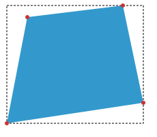

Attribution and reformatting notice added for Surgeist on 2026-10-03

This reformatted document accompanies Surgeist as software implementation support. The original English document at the source URL remains authoritative; this copy is not a new technical specification. Added labels and representation notes are non-normative. W3C is not responsible for content absent from the original, and this copy may contain formatting or hypertext errors.

This software or document includes material copied from or derived from [Geometry Interfaces Module Level 1](https://www.w3.org/TR/2025/CRD-geometry-1-20251204/).

Original copyright notice: Copyright © 2025 World Wide Web Consortium. W3C® liability, trademark and permissive document license rules apply.

License: [W3C Software and Document License, 2023 version](../licenses/w3c/software-license-2023.txt). Changes are format conversion, visible semantic labels, local exact-snapshot links, and passive SVG/TeX representations as detailed in the [conversion report](CONVERSION-REPORT.md). Original source text, status, authorship, and legal notices remain below.

# Source provenance

Title: Geometry Interfaces Module Level 1

Source snapshot: https://www.w3.org/TR/2025/CRD-geometry-1-20251204/

Snapshot SHA-256: 2d406c87fb2580570c6f46b458e347de464d963fd196e4797a1c19c1a4d95c09

Conversion: offline format conversion of the exact stored HTML; not a new specification or summary. Publication versions remain distinct. Source fragment identifiers are preserved as short HTML anchors. Original copyright and licensing text/links are retained where present in the source.

Representation notes:
- 1 inline SVG diagrams are retained as local passive SVG assets, with original geometry and visible source diagram text. Supporting assets are not reference documents.
- 2 MathML expressions are represented as portable fenced TeX. Independent round-trip checks cover mathematical tokens, matrix shape/order, scripts, fractions and root structure; exact source MathML is retained in verification metadata. Visual equivalence is not certified.
- Small semantic emphasis/subscript/superscript HTML is retained to avoid GFM intraword-delimiter and subscript rendering defects; website layout HTML is not retained.
- Canonically unstable or combining Unicode characters and escape-sensitive punctuation are shielded as numeric entities in prose/semantic inline HTML. Literal source code stays literal.

---

# <a id="title"></a>Geometry Interfaces Module Level 1

[Copyright](https://www.w3.org/policies/#copyright) © 2025 [World Wide Web Consortium](https://www.w3.org/). W3C<sup>®</sup> [liability](https://www.w3.org/policies/#Legal_Disclaimer), [trademark](https://www.w3.org/policies/#W3C_Trademarks) and [permissive document license](https://www.w3.org/copyright/software-license/) rules apply.

## <a id="abstract"></a>Abstract

This specification provides basic geometric interfaces to represent points, rectangles, quadrilaterals and transformation matrices that can be used by other modules or specifications.

[CSS](https://www.w3.org/TR/CSS/) is a language for describing the rendering of structured documents (such as HTML and XML) on screen, on paper, etc.

## <a id="sotd"></a>Status of this document

<em>This section describes the status of this document at the time of its publication.
	A list of current W3C publications
	and the latest revision of this technical report
	can be found in the <a href="https://www.w3.org/TR/">W3C standards and drafts index.</a></em>

This document was published by the [CSS Working Group](https://www.w3.org/groups/wg/css) as a <strong>Candidate Recommendation Draft</strong> using the [Recommendation track](https://www.w3.org/policies/process/20250818/#recs-and-notes). Publication as a Candidate Recommendation does not imply endorsement by W3C and its Members. A Candidate Recommendation Draft integrates changes from the previous Candidate Recommendation that the Working Group intends to include in a subsequent Candidate Recommendation Snapshot.

This is a draft document and may be updated, replaced or obsoleted by other documents at any time. It is inappropriate to cite this document as other than a work in progress.

Please send feedback by [filing issues in GitHub](https://github.com/w3c/csswg-drafts/issues) (preferred), including the spec code “geometry” in the title, like this: “\[geometry\] <i>…summary of comment…</i>”. All issues and comments are [archived](https://lists.w3.org/Archives/Public/public-css-archive/). Alternately, feedback can be sent to the ([archived](https://lists.w3.org/Archives/Public/www-style/)) public mailing list [www-style@w3.org](mailto:www-style@w3.org?Subject=%5Bgeometry%5D%20PUT%20SUBJECT%20HERE).

<a id="w3c_process_revision"></a>

This document is governed by the [18 August 2025 W3C Process Document](https://www.w3.org/policies/process/20250818/).

This document was produced by a group operating under the [W3C Patent Policy](https://www.w3.org/policies/patent-policy/20200915/). W3C maintains a [public list of any patent disclosures](https://www.w3.org/groups/wg/css/ipr) made in connection with the deliverables of the group; that page also includes instructions for disclosing a patent. An individual who has actual knowledge of a patent that the individual believes contains [Essential Claim(s)](https://www.w3.org/policies/patent-policy/20200915/#def-essential) must disclose the information in accordance with [section 6 of the W3C Patent Policy](https://www.w3.org/policies/patent-policy/20200915/#sec-Disclosure).

## <a id="intro"></a>1. Introduction

<em>This section is non-normative.</em>

This specification describes several geometry interfaces for the representation of points, rectangles, quadrilaterals and transformation matrices with the dimension of 3x2 and 4x4.

<a id="ref-for-svgpoint"></a>

<a id="ref-for-svgrect"></a>

<a id="ref-for-svgmatrix"></a>

The SVG interfaces <code><a href="#svgpoint">SVGPoint</a></code>, <code><a href="#svgrect">SVGRect</a></code> and <code><a href="#svgmatrix">SVGMatrix</a></code> are aliasing the here defined interfaces in favor for common interfaces used by SVG, Canvas 2D Context and CSS Transforms. [\[SVG11\]](#biblio-svg11) [\[HTML\]](#biblio-html) [\[CSS3-TRANSFORMS\]](#biblio-css3-transforms)

Tests

- [idlharness.any.js](https://wpt.fyi/results/css/geometry/idlharness.any.js) [(live test)](http://wpt.live/css/geometry/idlharness.any.js) [(source)](https://github.com/web-platform-tests/wpt/blob/master/css/geometry/idlharness.any.js)
- [spec-examples.html](https://wpt.fyi/results/css/geometry/spec-examples.html) [(live test)](http://wpt.live/css/geometry/spec-examples.html) [(source)](https://github.com/web-platform-tests/wpt/blob/master/css/geometry/spec-examples.html)

## <a id="DOMPoint"></a>2. The DOMPoint interfaces

A 2D or a 3D <a id="point"></a>point can be represented by the following WebIDL interfaces:

<a id="ref-for-Exposed"></a>

<a id="ref-for-serializable"></a>

<a id="dompointreadonly"></a>

<a id="ref-for-dom-dompointreadonly-dompointreadonly"></a>

<a id="ref-for-idl-unrestricted-double"></a>

<a id="dom-dompointreadonly-dompointreadonly-x-y-z-w-x"></a>

<a id="ref-for-idl-unrestricted-double①"></a>

<a id="dom-dompointreadonly-dompointreadonly-x-y-z-w-y"></a>

<a id="ref-for-idl-unrestricted-double②"></a>

<a id="dom-dompointreadonly-dompointreadonly-x-y-z-w-z"></a>

<a id="ref-for-idl-unrestricted-double③"></a>

<a id="dom-dompointreadonly-dompointreadonly-x-y-z-w-w"></a>

<a id="ref-for-NewObject"></a>

<a id="ref-for-dompointreadonly"></a>

<a id="ref-for-dom-dompointreadonly-frompoint"></a>

<a id="ref-for-dictdef-dompointinit"></a>

<a id="dom-dompointreadonly-frompoint-other-other"></a>

<a id="ref-for-idl-unrestricted-double④"></a>

<a id="ref-for-dom-dompointreadonly-x"></a>

<a id="ref-for-idl-unrestricted-double⑤"></a>

<a id="ref-for-dom-dompointreadonly-y"></a>

<a id="ref-for-idl-unrestricted-double⑥"></a>

<a id="ref-for-dom-dompointreadonly-z"></a>

<a id="ref-for-idl-unrestricted-double⑦"></a>

<a id="ref-for-dom-dompointreadonly-w"></a>

<a id="ref-for-NewObject①"></a>

<a id="ref-for-dompoint"></a>

<a id="ref-for-dom-dompointreadonly-matrixtransform"></a>

<a id="ref-for-dictdef-dommatrixinit"></a>

<a id="dom-dompointreadonly-matrixtransform-matrix-matrix"></a>

<a id="ref-for-Default"></a>

<a id="ref-for-idl-object"></a>

<a id="dom-dompointreadonly-tojson"></a>

<a id="ref-for-Exposed①"></a>

<a id="ref-for-serializable①"></a>

<a id="ref-for-LegacyWindowAlias"></a>

<a id="svgpoint"></a>

<a id="dompoint"></a>

<a id="ref-for-dompointreadonly①"></a>

<a id="ref-for-dom-dompoint-dompoint"></a>

<a id="ref-for-idl-unrestricted-double⑧"></a>

<a id="dom-dompoint-dompoint-x-y-z-w-x"></a>

<a id="ref-for-idl-unrestricted-double⑨"></a>

<a id="dom-dompoint-dompoint-x-y-z-w-y"></a>

<a id="ref-for-idl-unrestricted-double①⓪"></a>

<a id="dom-dompoint-dompoint-x-y-z-w-z"></a>

<a id="ref-for-idl-unrestricted-double①①"></a>

<a id="dom-dompoint-dompoint-x-y-z-w-w"></a>

<a id="ref-for-NewObject②"></a>

<a id="ref-for-dompoint①"></a>

<a id="ref-for-dom-dompoint-frompoint"></a>

<a id="ref-for-dictdef-dompointinit①"></a>

<a id="dom-dompoint-frompoint-other-other"></a>

<a id="ref-for-idl-unrestricted-double①②"></a>

<a id="ref-for-dom-dompointreadonly-x①"></a>

<a id="ref-for-idl-unrestricted-double①③"></a>

<a id="ref-for-dom-dompointreadonly-y①"></a>

<a id="ref-for-idl-unrestricted-double①④"></a>

<a id="ref-for-dom-dompointreadonly-z①"></a>

<a id="ref-for-idl-unrestricted-double①⑤"></a>

<a id="ref-for-dom-dompointreadonly-w①"></a>

<a id="dictdef-dompointinit"></a>

<a id="ref-for-idl-unrestricted-double①⑥"></a>

<a id="dom-dompointinit-x"></a>

<a id="ref-for-idl-unrestricted-double①⑦"></a>

<a id="dom-dompointinit-y"></a>

<a id="ref-for-idl-unrestricted-double①⑧"></a>

<a id="dom-dompointinit-z"></a>

<a id="ref-for-idl-unrestricted-double①⑨"></a>

<a id="dom-dompointinit-w"></a>

```text
[Exposed=(Window,Worker),
 Serializable]
interface DOMPointReadOnly {
    constructor(optional unrestricted double x = 0, optional unrestricted double y = 0,
            optional unrestricted double z = 0, optional unrestricted double w = 1);

    [NewObject] static DOMPointReadOnly fromPoint(optional DOMPointInit other = {});

    readonly attribute unrestricted double x;
    readonly attribute unrestricted double y;
    readonly attribute unrestricted double z;
    readonly attribute unrestricted double w;

    [NewObject] DOMPoint matrixTransform(optional DOMMatrixInit matrix = {});

    [Default] object toJSON();
};

[Exposed=(Window,Worker),
 Serializable,
 LegacyWindowAlias=SVGPoint]
interface DOMPoint : DOMPointReadOnly {
    constructor(optional unrestricted double x = 0, optional unrestricted double y = 0,
            optional unrestricted double z = 0, optional unrestricted double w = 1);

    [NewObject] static DOMPoint fromPoint(optional DOMPointInit other = {});

    inherit attribute unrestricted double x;
    inherit attribute unrestricted double y;
    inherit attribute unrestricted double z;
    inherit attribute unrestricted double w;
};

dictionary DOMPointInit {
    unrestricted double x = 0;
    unrestricted double y = 0;
    unrestricted double z = 0;
    unrestricted double w = 1;
};
```
<a id="ref-for-dompointreadonly②"></a>

<a id="ref-for-dompointreadonly③"></a>

<a id="ref-for-dompoint②"></a>

The following algorithms assume that <code><a href="#dompointreadonly">DOMPointReadOnly</a></code> objects have the internal member variables <a id="point-x-coordinate"></a>x coordinate, <a id="point-y-coordinate"></a>y coordinate, <a id="point-z-coordinate"></a>z coordinate and <a id="point-w-perspective"></a>w perspective. <code><a href="#dompointreadonly">DOMPointReadOnly</a></code> as well as the inheriting interface <code><a href="#dompoint">DOMPoint</a></code> must be able to access and set the value of these variables.

<a id="ref-for-dompointreadonly④"></a>

An interface returning an <code><a href="#dompointreadonly">DOMPointReadOnly</a></code> object by an attribute or function may be able to modify internal member variable values. Such an interface must specify this ability explicitly in prose.

Internal member variables must not be exposed in any way.

The <a id="dom-dompointreadonly-dompointreadonly"></a><code>DOMPointReadOnly(<var>x</var>, <var>y</var>, <var>z</var>, <var>w</var>)</code> and <a id="dom-dompoint-dompoint"></a><code>DOMPoint(<var>x</var>, <var>y</var>, <var>z</var>, <var>w</var>)</code> constructors, when invoked, must run the following steps:

1.  <a id="ref-for-dompointreadonly⑤"></a>

    <a id="ref-for-dompoint③"></a>

    Let <var>point</var> be a new <code><a href="#dompointreadonly">DOMPointReadOnly</a></code> or <code><a href="#dompoint">DOMPoint</a></code> object as appropriate.

2.  <a id="ref-for-point-x-coordinate"></a>

    <a id="ref-for-point-y-coordinate"></a>

    <a id="ref-for-point-z-coordinate"></a>

    <a id="ref-for-point-w-perspective"></a>

    Set <var>point</var>’s variables [x coordinate](#point-x-coordinate) to <var>x</var>, [y coordinate](#point-y-coordinate) to <var>y</var>, [z coordinate](#point-z-coordinate) to <var>z</var> and [w perspective](#point-w-perspective) to <var>w</var>.

3.  Return <var>point</var>.

Tests

- [DOMPoint-001.html](https://wpt.fyi/results/css/geometry/DOMPoint-001.html) [(live test)](http://wpt.live/css/geometry/DOMPoint-001.html) [(source)](https://github.com/web-platform-tests/wpt/blob/master/css/geometry/DOMPoint-001.html)

<a id="ref-for-dompointreadonly⑥"></a>

<a id="ref-for-create-a-dompointreadonly-from-the-dictionary"></a>

The <a id="dom-dompointreadonly-frompoint"></a><code>fromPoint(<var>other</var>)</code> static method on <code><a href="#dompointreadonly">DOMPointReadOnly</a></code> must [create a `DOMPointReadOnly` from the dictionary](#create-a-dompointreadonly-from-the-dictionary) <var>other</var>.

<a id="ref-for-dompoint④"></a>

<a id="ref-for-create-a-dompoint-from-the-dictionary"></a>

The <a id="dom-dompoint-frompoint"></a><code>fromPoint(<var>other</var>)</code> static method on <code><a href="#dompoint">DOMPoint</a></code> must [create a `DOMPoint` from the dictionary](#create-a-dompoint-from-the-dictionary) <var>other</var>.

To <a id="create-a-dompointreadonly-from-the-dictionary"></a>create a `DOMPointReadOnly` from a dictionary <var>other</var>, or to <a id="create-a-dompoint-from-the-dictionary"></a>create a `DOMPoint` from a dictionary <var>other</var>, follow these steps:

1.  <a id="ref-for-dompointreadonly⑦"></a>

    <a id="ref-for-dompoint⑤"></a>

    Let <var>point</var> be a new <code><a href="#dompointreadonly">DOMPointReadOnly</a></code> or <code><a href="#dompoint">DOMPoint</a></code> as appropriate.

2.  <a id="ref-for-point-x-coordinate①"></a>

    <a id="ref-for-dom-dompointinit-x"></a>

    <a id="ref-for-point-y-coordinate①"></a>

    <a id="ref-for-dom-dompointinit-y"></a>

    <a id="ref-for-point-z-coordinate①"></a>

    <a id="ref-for-dom-dompointinit-z"></a>

    <a id="ref-for-point-w-perspective①"></a>

    <a id="ref-for-dom-dompointinit-w"></a>

    Set <var>point</var>’s variables [x coordinate](#point-x-coordinate) to <var>other</var>’s <code><a href="#dom-dompointinit-x">x</a></code> dictionary member, [y coordinate](#point-y-coordinate) to <var>other</var>’s <code><a href="#dom-dompointinit-y">y</a></code> dictionary member, [z coordinate](#point-z-coordinate) to <var>other</var>’s <code><a href="#dom-dompointinit-z">z</a></code> dictionary member and [w perspective](#point-w-perspective) to <var>other</var>’s <code><a href="#dom-dompointinit-w">w</a></code> dictionary member.

3.  Return <var>point</var>.

<a id="ref-for-point-x-coordinate②"></a>

<a id="ref-for-dompoint⑥"></a>

<a id="ref-for-dom-dompointreadonly-x②"></a>

The <a id="dom-dompointreadonly-x"></a>`x` attribute, on getting, must return the [x coordinate](#point-x-coordinate) value. For the <code><a href="#dompoint">DOMPoint</a></code> interface, setting the <code><a href="#dom-dompointreadonly-x">x</a></code> attribute must set the <a id="ref-for-point-x-coordinate③"></a>x coordinate to the new value.

<a id="ref-for-point-y-coordinate②"></a>

<a id="ref-for-dompoint⑦"></a>

<a id="ref-for-dom-dompointreadonly-y②"></a>

The <a id="dom-dompointreadonly-y"></a>`y` attribute, on getting, must return the [y coordinate](#point-y-coordinate) value. For the <code><a href="#dompoint">DOMPoint</a></code> interface, setting the <code><a href="#dom-dompointreadonly-y">y</a></code> attribute must set the <a id="ref-for-point-y-coordinate③"></a>y coordinate to the new value.

<a id="ref-for-point-z-coordinate②"></a>

<a id="ref-for-dompoint⑧"></a>

<a id="ref-for-dom-dompointreadonly-z②"></a>

The <a id="dom-dompointreadonly-z"></a>`z` attribute, on getting, must return the [z coordinate](#point-z-coordinate) value. For the <code><a href="#dompoint">DOMPoint</a></code> interface, setting the <code><a href="#dom-dompointreadonly-z">z</a></code> attribute must set the <a id="ref-for-point-z-coordinate③"></a>z coordinate to the new value.

<a id="ref-for-point-w-perspective②"></a>

<a id="ref-for-dompoint⑨"></a>

<a id="ref-for-dom-dompointreadonly-w②"></a>

The <a id="dom-dompointreadonly-w"></a>`w` attribute, on getting, must return the [w perspective](#point-w-perspective) value. For the <code><a href="#dompoint">DOMPoint</a></code> interface, setting the <code><a href="#dom-dompointreadonly-w">w</a></code> attribute must set the <a id="ref-for-point-w-perspective③"></a>w perspective to the new value.

The <a id="dom-dompointreadonly-matrixtransform"></a><code>matrixTransform(<var>matrix</var>)</code> method, when invoked, must run the following steps:

1.  <a id="ref-for-create-a-dommatrix-from-the-dictionary"></a>

    Let <var>matrixObject</var> be the result of invoking [create a `DOMMatrix` from the dictionary](#create-a-dommatrix-from-the-dictionary) <var>matrix</var>.

2.  <a id="ref-for-transform-a-point-with-a-matrix"></a>

    Return the result of invoking [transform a point with a matrix](#transform-a-point-with-a-matrix), given the current point and <var>matrixObject</var>. The current point does not get modified.

<a id="ref-for-dom-dompointreadonly-matrixtransform①"></a>

<a id="ref-for-dompoint①⓪"></a>

<a id="ref-for-dommatrix"></a>

> <strong data-conversion-semantic="example">Example</strong>
>
> <a id="example-81a83758"></a> In this example the method <code><a href="#dom-dompointreadonly-matrixtransform">matrixTransform()</a></code> on a <code><a href="#dompoint">DOMPoint</a></code> instance is called with a <code><a href="#dommatrix">DOMMatrix</a></code> instance as argument.
>
> ```text
> var point = new DOMPoint(5, 4);
> var matrix = new DOMMatrix([2, 0, 0, 2, 10, 10]);
> var transformedPoint = point.matrixTransform(matrix);
> ```
>
> <a id="ref-for-dompoint①①"></a>
>
> <a id="ref-for-point-x-coordinate④"></a>
>
> <a id="ref-for-point-y-coordinate④"></a>
>
> <a id="ref-for-dompoint①②"></a>
>
> The <var>point</var> variable is set to a new <code><a href="#dompoint">DOMPoint</a></code> object with [x coordinate](#point-x-coordinate) initialized to 5 and [y coordinate](#point-y-coordinate) initialized to 4. This new <code><a href="#dompoint">DOMPoint</a></code> is now scaled and the translated by <var>matrix</var>. This resulting <var>transformedPoint</var> has the <a id="ref-for-point-x-coordinate⑤"></a>x coordinate 20 and <a id="ref-for-point-y-coordinate⑤"></a>y coordinate 18.

Tests

- [DOMPoint-002.html](https://wpt.fyi/results/css/geometry/DOMPoint-002.html) [(live test)](http://wpt.live/css/geometry/DOMPoint-002.html) [(source)](https://github.com/web-platform-tests/wpt/blob/master/css/geometry/DOMPoint-002.html)

### <a id="transforming-a-point-with-a-matrix"></a>2.1. Transforming a point with a matrix

<a id="ref-for-point"></a>

<a id="ref-for-matrix"></a>

To <a id="transform-a-point-with-a-matrix"></a>transform a [point](#point) with a [matrix](#matrix), given <var>point</var> and <var>matrix</var>:

1.  <a id="ref-for-point-x-coordinate⑥"></a>

    Let <var>x</var> be <var>point</var>’s [x coordinate](#point-x-coordinate).

2.  <a id="ref-for-point-y-coordinate⑥"></a>

    Let <var>y</var> be <var>point</var>’s [y coordinate](#point-y-coordinate).

3.  <a id="ref-for-point-z-coordinate④"></a>

    Let <var>z</var> be <var>point</var>’s [z coordinate](#point-z-coordinate).

4.  <a id="ref-for-point-w-perspective④"></a>

    Let <var>w</var> be <var>point</var>’s [w perspective](#point-w-perspective).

5.  Let <var>pointVector</var> be a new column vector with the elements being <var>x</var>, <var>y</var>, <var>z</var>, and <var>w</var>, respectively.

    <strong>Mathematical expression 1</strong>

    TeX transcription (renderer-independent source notation):

    ``` language-tex
    \begin{bmatrix}
    x \\
    y \\
    z \\
    w
    \end{bmatrix}
    ```

    Source mathematical tokens: x y z w

6.  <a id="ref-for-pre-multiply"></a>

    Set <var>pointVector</var> to <var>pointVector</var> [pre-multiplied](#pre-multiply) by <var>matrix</var>.

7.  <a id="ref-for-dompoint①③"></a>

    Let <var>transformedPoint</var> be a new <code><a href="#dompoint">DOMPoint</a></code> object.

8.  <a id="ref-for-point-x-coordinate⑦"></a>

    Set <var>transformedPoint</var>’s [x coordinate](#point-x-coordinate) to <var>pointVector</var>’s first element.

9.  <a id="ref-for-point-y-coordinate⑦"></a>

    Set <var>transformedPoint</var>’s [y coordinate](#point-y-coordinate) to <var>pointVector</var>’s second element.

10. <a id="ref-for-point-z-coordinate⑤"></a>

    Set <var>transformedPoint</var>’s [z coordinate](#point-z-coordinate) to <var>pointVector</var>’s third element.

11. <a id="ref-for-point-w-perspective⑤"></a>

    Set <var>transformedPoint</var>’s [w perspective](#point-w-perspective) to <var>pointVector</var>’s fourth element.

12. Return <var>transformedPoint</var>.

<a id="ref-for-matrix-is-2d"></a>

<a id="ref-for-point-z-coordinate⑥"></a>

<a id="ref-for-point-w-perspective⑥"></a>

> <strong data-conversion-semantic="note">Note</strong>
>
> Note: If <var>matrix</var>’s [is 2D](#matrix-is-2d) is true, <var>point</var>’s [z coordinate](#point-z-coordinate) is 0 or -0, and <var>point</var>’s [w perspective](#point-w-perspective) is 1, then this is a 2D transformation. Otherwise this is a 3D transformation.

## <a id="DOMRect"></a>3. The DOMRect interfaces

<a id="ref-for-domrectreadonly"></a>

Objects implementing the <code><a href="#domrectreadonly">DOMRectReadOnly</a></code> interface represent a <a id="rectangle"></a>rectangle.

<a id="ref-for-rectangle"></a>

[Rectangles](#rectangle) have the following properties:

<a id="rectangle-origin"></a>origin  
<a id="ref-for-rectangle-width-dimension"></a>

<a id="ref-for-rectangle-height-dimension"></a>

When the rectangle has a non-negative [width dimension](#rectangle-width-dimension), the rectangle’s horizontal origin is the left edge; otherwise, it is the right edge. Similarly, when the rectangle has a non-negative [height dimension](#rectangle-height-dimension), the rectangle’s vertical origin is the top edge; otherwise, it is the bottom edge.

<a id="rectangle-x-coordinate"></a>x coordinate  
<a id="ref-for-rectangle-origin"></a>

The horizontal distance between the viewport’s left edge and the rectangle’s [origin](#rectangle-origin).

<a id="rectangle-y-coordinate"></a>y coordinate  
<a id="ref-for-rectangle-origin①"></a>

The vertical distance between the viewport’s top edge and the rectangle’s [origin](#rectangle-origin).

<a id="rectangle-width-dimension"></a>width dimension  
The width of the rectangle. Can be negative.

<a id="rectangle-height-dimension"></a>height dimension  
The height of the rectangle. Can be negative.

<a id="ref-for-Exposed②"></a>

<a id="ref-for-serializable②"></a>

<a id="domrectreadonly"></a>

<a id="ref-for-dom-domrectreadonly-domrectreadonly"></a>

<a id="ref-for-idl-unrestricted-double②⓪"></a>

<a id="dom-domrectreadonly-domrectreadonly-x-y-width-height-x"></a>

<a id="ref-for-idl-unrestricted-double②①"></a>

<a id="dom-domrectreadonly-domrectreadonly-x-y-width-height-y"></a>

<a id="ref-for-idl-unrestricted-double②②"></a>

<a id="dom-domrectreadonly-domrectreadonly-x-y-width-height-width"></a>

<a id="ref-for-idl-unrestricted-double②③"></a>

<a id="dom-domrectreadonly-domrectreadonly-x-y-width-height-height"></a>

<a id="ref-for-NewObject③"></a>

<a id="ref-for-domrectreadonly①"></a>

<a id="ref-for-dom-domrectreadonly-fromrect"></a>

<a id="ref-for-dictdef-domrectinit"></a>

<a id="dom-domrectreadonly-fromrect-other-other"></a>

<a id="ref-for-idl-unrestricted-double②④"></a>

<a id="dom-domrectreadonly-x"></a>

<a id="ref-for-idl-unrestricted-double②⑤"></a>

<a id="dom-domrectreadonly-y"></a>

<a id="ref-for-idl-unrestricted-double②⑥"></a>

<a id="dom-domrectreadonly-width"></a>

<a id="ref-for-idl-unrestricted-double②⑦"></a>

<a id="dom-domrectreadonly-height"></a>

<a id="ref-for-idl-unrestricted-double②⑧"></a>

<a id="dom-domrectreadonly-top"></a>

<a id="ref-for-idl-unrestricted-double②⑨"></a>

<a id="dom-domrectreadonly-right"></a>

<a id="ref-for-idl-unrestricted-double③⓪"></a>

<a id="dom-domrectreadonly-bottom"></a>

<a id="ref-for-idl-unrestricted-double③①"></a>

<a id="dom-domrectreadonly-left"></a>

<a id="ref-for-Default①"></a>

<a id="ref-for-idl-object①"></a>

<a id="dom-domrectreadonly-tojson"></a>

<a id="ref-for-Exposed③"></a>

<a id="ref-for-serializable③"></a>

<a id="ref-for-LegacyWindowAlias①"></a>

<a id="svgrect"></a>

<a id="domrect"></a>

<a id="ref-for-domrectreadonly②"></a>

<a id="ref-for-dom-domrect-domrect"></a>

<a id="ref-for-idl-unrestricted-double③②"></a>

<a id="dom-domrect-domrect-x-y-width-height-x"></a>

<a id="ref-for-idl-unrestricted-double③③"></a>

<a id="dom-domrect-domrect-x-y-width-height-y"></a>

<a id="ref-for-idl-unrestricted-double③④"></a>

<a id="dom-domrect-domrect-x-y-width-height-width"></a>

<a id="ref-for-idl-unrestricted-double③⑤"></a>

<a id="dom-domrect-domrect-x-y-width-height-height"></a>

<a id="ref-for-NewObject④"></a>

<a id="ref-for-domrect"></a>

<a id="ref-for-dom-domrect-fromrect"></a>

<a id="ref-for-dictdef-domrectinit①"></a>

<a id="dom-domrect-fromrect-other-other"></a>

<a id="ref-for-idl-unrestricted-double③⑥"></a>

<a id="dom-domrect-x"></a>

<a id="ref-for-idl-unrestricted-double③⑦"></a>

<a id="dom-domrect-y"></a>

<a id="ref-for-idl-unrestricted-double③⑧"></a>

<a id="dom-domrect-width"></a>

<a id="ref-for-idl-unrestricted-double③⑨"></a>

<a id="dom-domrect-height"></a>

<a id="dictdef-domrectinit"></a>

<a id="ref-for-idl-unrestricted-double④⓪"></a>

<a id="dom-domrectinit-x"></a>

<a id="ref-for-idl-unrestricted-double④①"></a>

<a id="dom-domrectinit-y"></a>

<a id="ref-for-idl-unrestricted-double④②"></a>

<a id="dom-domrectinit-width"></a>

<a id="ref-for-idl-unrestricted-double④③"></a>

<a id="dom-domrectinit-height"></a>

```text
[Exposed=(Window,Worker),
 Serializable]
interface DOMRectReadOnly {
    constructor(optional unrestricted double x = 0, optional unrestricted double y = 0,
            optional unrestricted double width = 0, optional unrestricted double height = 0);

    [NewObject] static DOMRectReadOnly fromRect(optional DOMRectInit other = {});

    readonly attribute unrestricted double x;
    readonly attribute unrestricted double y;
    readonly attribute unrestricted double width;
    readonly attribute unrestricted double height;
    readonly attribute unrestricted double top;
    readonly attribute unrestricted double right;
    readonly attribute unrestricted double bottom;
    readonly attribute unrestricted double left;

    [Default] object toJSON();
};

[Exposed=(Window,Worker),
 Serializable,
 LegacyWindowAlias=SVGRect]
interface DOMRect : DOMRectReadOnly {
    constructor(optional unrestricted double x = 0, optional unrestricted double y = 0,
            optional unrestricted double width = 0, optional unrestricted double height = 0);

    [NewObject] static DOMRect fromRect(optional DOMRectInit other = {});

    inherit attribute unrestricted double x;
    inherit attribute unrestricted double y;
    inherit attribute unrestricted double width;
    inherit attribute unrestricted double height;
};

dictionary DOMRectInit {
    unrestricted double x = 0;
    unrestricted double y = 0;
    unrestricted double width = 0;
    unrestricted double height = 0;
};
```
<a id="ref-for-domrectreadonly③"></a>

<a id="ref-for-rectangle-x-coordinate"></a>

<a id="ref-for-rectangle-y-coordinate"></a>

<a id="ref-for-rectangle-width-dimension①"></a>

<a id="ref-for-rectangle-height-dimension①"></a>

<a id="ref-for-domrectreadonly④"></a>

<a id="ref-for-domrect①"></a>

The following algorithms assume that <code><a href="#domrectreadonly">DOMRectReadOnly</a></code> objects have the internal member variables [x coordinate](#rectangle-x-coordinate), [y coordinate](#rectangle-y-coordinate), [width dimension](#rectangle-width-dimension) and [height dimension](#rectangle-height-dimension). <code><a href="#domrectreadonly">DOMRectReadOnly</a></code> as well as the inheriting interface <code><a href="#domrect">DOMRect</a></code> must be able to access and set the value of these variables.

<a id="ref-for-domrectreadonly⑤"></a>

An interface returning an <code><a href="#domrectreadonly">DOMRectReadOnly</a></code> object by an attribute or function may be able to modify internal member variable values. Such an interface must specify this ability explicitly in prose.

Internal member variables must not be exposed in any way.

The <a id="dom-domrectreadonly-domrectreadonly"></a><code>DOMRectReadOnly(<var>x</var>, <var>y</var>, <var>width</var>, <var>height</var>)</code> and <a id="dom-domrect-domrect"></a><code>DOMRect(<var>x</var>, <var>y</var>, <var>width</var>, <var>height</var>)</code> constructors, when invoked, must run the following steps:

1.  <a id="ref-for-domrectreadonly⑥"></a>

    <a id="ref-for-domrect②"></a>

    Let <var>rect</var> be a new <code><a href="#domrectreadonly">DOMRectReadOnly</a></code> or <code><a href="#domrect">DOMRect</a></code> object as appropriate.

2.  <a id="ref-for-rectangle-x-coordinate①"></a>

    <a id="ref-for-rectangle-y-coordinate①"></a>

    <a id="ref-for-rectangle-width-dimension②"></a>

    <a id="ref-for-rectangle-height-dimension②"></a>

    Set <var>rect</var>’s variables [x coordinate](#rectangle-x-coordinate) to <var>x</var>, [y coordinate](#rectangle-y-coordinate) to <var>y</var>, [width dimension](#rectangle-width-dimension) to <var>width</var> and [height dimension](#rectangle-height-dimension) to <var>height</var>.

3.  Return <var>rect</var>.

<a id="ref-for-domrectreadonly⑦"></a>

<a id="ref-for-create-a-domrectreadonly-from-the-dictionary"></a>

The <a id="dom-domrectreadonly-fromrect"></a><code>fromRect(<var>other</var>)</code> static method on <code><a href="#domrectreadonly">DOMRectReadOnly</a></code> must [create a `DOMRectReadOnly` from the dictionary](#create-a-domrectreadonly-from-the-dictionary) <var>other</var>.

<a id="ref-for-domrect③"></a>

<a id="ref-for-create-a-domrect-from-the-dictionary"></a>

The <a id="dom-domrect-fromrect"></a><code>fromRect(<var>other</var>)</code> static method on <code><a href="#domrect">DOMRect</a></code> must [create a `DOMRect` from the dictionary](#create-a-domrect-from-the-dictionary) <var>other</var>.

To <a id="create-a-domrectreadonly-from-the-dictionary"></a>create a `DOMRectReadOnly` from a dictionary <var>other</var>, or to <a id="create-a-domrect-from-the-dictionary"></a>create a `DOMRect` from a dictionary <var>other</var>, follow these steps:

1.  <a id="ref-for-domrectreadonly⑧"></a>

    <a id="ref-for-domrect④"></a>

    Let <var>rect</var> be a new <code><a href="#domrectreadonly">DOMRectReadOnly</a></code> or <code><a href="#domrect">DOMRect</a></code> as appropriate.

2.  <a id="ref-for-rectangle-x-coordinate②"></a>

    <a id="ref-for-dom-domrectinit-x"></a>

    <a id="ref-for-rectangle-y-coordinate②"></a>

    <a id="ref-for-dom-domrectinit-y"></a>

    <a id="ref-for-rectangle-width-dimension③"></a>

    <a id="ref-for-dom-domrectinit-width"></a>

    <a id="ref-for-rectangle-height-dimension③"></a>

    <a id="ref-for-dom-domrectinit-height"></a>

    Set <var>rect</var>’s variables [x coordinate](#rectangle-x-coordinate) to <var>other</var>’s <code><a href="#dom-domrectinit-x">x</a></code> dictionary member, [y coordinate](#rectangle-y-coordinate) to <var>other</var>’s <code><a href="#dom-domrectinit-y">y</a></code> dictionary member, [width dimension](#rectangle-width-dimension) to <var>other</var>’s <code><a href="#dom-domrectinit-width">width</a></code> dictionary member and [height dimension](#rectangle-height-dimension) to <var>other</var>’s <code><a href="#dom-domrectinit-height">height</a></code> dictionary member.

3.  Return <var>rect</var>.

<a id="ref-for-rectangle-x-coordinate③"></a>

<a id="ref-for-domrect⑤"></a>

<a id="ref-for-dom-domrect-x"></a>

The <a id="dom-domrectreadonly-domrect-x"></a>`x` attribute, on getting, must return the [x coordinate](#rectangle-x-coordinate) value. For the <code><a href="#domrect">DOMRect</a></code> interface, setting the <code><a href="#dom-domrect-x">x</a></code> attribute must set the <a id="ref-for-rectangle-x-coordinate④"></a>x coordinate to the new value.

<a id="ref-for-rectangle-y-coordinate③"></a>

<a id="ref-for-domrect⑥"></a>

<a id="ref-for-dom-domrect-y"></a>

The <a id="dom-domrectreadonly-domrect-y"></a>`y` attribute, on getting, it must return the [y coordinate](#rectangle-y-coordinate) value. For the <code><a href="#domrect">DOMRect</a></code> interface, setting the <code><a href="#dom-domrect-y">y</a></code> attribute must set the <a id="ref-for-rectangle-y-coordinate④"></a>y coordinate to the new value.

<a id="ref-for-rectangle-width-dimension④"></a>

<a id="ref-for-domrect⑦"></a>

<a id="ref-for-dom-domrect-width"></a>

The <a id="dom-domrectreadonly-domrect-width"></a>`width` attribute, on getting, must return the [width dimension](#rectangle-width-dimension) value. For the <code><a href="#domrect">DOMRect</a></code> interface, setting the <code><a href="#dom-domrect-width">width</a></code> attribute must set the <a id="ref-for-rectangle-width-dimension⑤"></a>width dimension to the new value.

<a id="ref-for-rectangle-height-dimension④"></a>

<a id="ref-for-domrect⑧"></a>

<a id="ref-for-dom-domrect-height"></a>

The <a id="dom-domrectreadonly-domrect-height"></a>`height` attribute, on getting, must return the [height dimension](#rectangle-height-dimension) value. For the <code><a href="#domrect">DOMRect</a></code> interface, setting the <code><a href="#dom-domrect-height">height</a></code> attribute must set the <a id="ref-for-rectangle-height-dimension⑤"></a>height dimension value to the new value.

<a id="ref-for-nan-safe-minimum"></a>

<a id="ref-for-rectangle-y-coordinate⑤"></a>

<a id="ref-for-rectangle-height-dimension⑥"></a>

The <a id="dom-domrectreadonly-domrect-top"></a>`top` attribute, on getting, must return the [NaN-safe minimum](#nan-safe-minimum) of the [y coordinate](#rectangle-y-coordinate) and the sum of the <a id="ref-for-rectangle-y-coordinate⑥"></a>y coordinate and the [height dimension](#rectangle-height-dimension).

<a id="ref-for-nan-safe-maximum"></a>

<a id="ref-for-rectangle-x-coordinate⑤"></a>

<a id="ref-for-rectangle-width-dimension⑥"></a>

The <a id="dom-domrectreadonly-domrect-right"></a>`right` attribute, on getting, must return the [NaN-safe maximum](#nan-safe-maximum) of the [x coordinate](#rectangle-x-coordinate) and the sum of the <a id="ref-for-rectangle-x-coordinate⑥"></a>x coordinate and the [width dimension](#rectangle-width-dimension).

<a id="ref-for-nan-safe-maximum①"></a>

<a id="ref-for-rectangle-y-coordinate⑦"></a>

<a id="ref-for-rectangle-height-dimension⑦"></a>

The <a id="dom-domrectreadonly-domrect-bottom"></a>`bottom` attribute, on getting, must return the [NaN-safe maximum](#nan-safe-maximum) of the [y coordinate](#rectangle-y-coordinate) and the sum of the <a id="ref-for-rectangle-y-coordinate⑧"></a>y coordinate and the [height dimension](#rectangle-height-dimension).

<a id="ref-for-nan-safe-minimum①"></a>

<a id="ref-for-rectangle-x-coordinate⑦"></a>

<a id="ref-for-rectangle-width-dimension⑦"></a>

The <a id="dom-domrectreadonly-domrect-left"></a>`left` attribute, on getting, must return the [NaN-safe minimum](#nan-safe-minimum) of the [x coordinate](#rectangle-x-coordinate) and the sum of the <a id="ref-for-rectangle-x-coordinate⑧"></a>x coordinate and the [width dimension](#rectangle-width-dimension).

Tests

- [DOMRect-001.html](https://wpt.fyi/results/css/geometry/DOMRect-001.html) [(live test)](http://wpt.live/css/geometry/DOMRect-001.html) [(source)](https://github.com/web-platform-tests/wpt/blob/master/css/geometry/DOMRect-001.html)
- [DOMRect-002.html](https://wpt.fyi/results/css/geometry/DOMRect-002.html) [(live test)](http://wpt.live/css/geometry/DOMRect-002.html) [(source)](https://github.com/web-platform-tests/wpt/blob/master/css/geometry/DOMRect-002.html)
- [DOMRect-nan.html](https://wpt.fyi/results/css/geometry/DOMRect-nan.html) [(live test)](http://wpt.live/css/geometry/DOMRect-nan.html) [(source)](https://github.com/web-platform-tests/wpt/blob/master/css/geometry/DOMRect-nan.html)

## <a id="DOMRectList"></a>4. The DOMRectList interface

<a id="ref-for-Exposed④"></a>

<a id="domrectlist"></a>

<a id="ref-for-idl-unsigned-long"></a>

<a id="ref-for-dom-domrectlist-length"></a>

<a id="ref-for-domrect⑨"></a>

<a id="ref-for-dom-domrectlist-item"></a>

<a id="ref-for-idl-unsigned-long①"></a>

<a id="dom-domrectlist-item-index-index"></a>

```text
[Exposed=Window]
interface DOMRectList {
    readonly attribute unsigned long length;
    getter DOMRect? item(unsigned long index);
};
```
<a id="ref-for-domrect①⓪"></a>

The <a id="dom-domrectlist-length"></a>`length` attribute must return the total number of <code><a href="#domrect">DOMRect</a></code> objects associated with the object.

<a id="ref-for-domrect①①"></a>

<a id="ref-for-domrectlist"></a>

<a id="ref-for-domrect①②"></a>

The <a id="dom-domrectlist-item"></a><code>item(<var>index</var>)</code> method, when invoked, must return null when <var>index</var> is greater than or equal to the number of <code><a href="#domrect">DOMRect</a></code> objects associated with the <code><a href="#domrectlist">DOMRectList</a></code>. Otherwise, the <code><a href="#domrect">DOMRect</a></code> object at <var>index</var> must be returned. Indices are zero-based.

<a id="ref-for-domrectlist①"></a>

<a id="ref-for-domrectlist②"></a>

<strong data-conversion-semantic="advisement">Advisement:</strong> <strong> <code><a href="#domrectlist">DOMRectList</a></code> only exists for compatibility with legacy Web content. When specifying a
new API, <code><a href="#domrectlist">DOMRectList</a></code> must not be used. Use <code>sequence&lt;DOMRect&gt;</code> instead. <a href="#biblio-webidl" title="Web IDL Standard">&#x5B;WEBIDL&#x5D;</a></strong>

Tests

- [DOMRectList.html](https://wpt.fyi/results/css/geometry/DOMRectList.html) [(live test)](http://wpt.live/css/geometry/DOMRectList.html) [(source)](https://github.com/web-platform-tests/wpt/blob/master/css/geometry/DOMRectList.html)

## <a id="DOMQuad"></a>5. The DOMQuad interface

<a id="ref-for-domquad"></a>

Objects implementing the <code><a href="#domquad">DOMQuad</a></code> interface represents a <a id="quadrilateral"></a>quadrilateral.

<a id="ref-for-Exposed⑤"></a>

<a id="ref-for-serializable④"></a>

<a id="domquad"></a>

<a id="ref-for-dom-domquad-domquad"></a>

<a id="ref-for-dictdef-dompointinit②"></a>

<a id="dom-domquad-domquad-p1-p2-p3-p4-p1"></a>

<a id="ref-for-dictdef-dompointinit③"></a>

<a id="dom-domquad-domquad-p1-p2-p3-p4-p2"></a>

<a id="ref-for-dictdef-dompointinit④"></a>

<a id="dom-domquad-domquad-p1-p2-p3-p4-p3"></a>

<a id="ref-for-dictdef-dompointinit⑤"></a>

<a id="dom-domquad-domquad-p1-p2-p3-p4-p4"></a>

<a id="ref-for-NewObject⑤"></a>

<a id="ref-for-domquad①"></a>

<a id="ref-for-dom-domquad-fromrect"></a>

<a id="ref-for-dictdef-domrectinit②"></a>

<a id="dom-domquad-fromrect-other-other"></a>

<a id="ref-for-NewObject⑥"></a>

<a id="ref-for-domquad②"></a>

<a id="ref-for-dom-domquad-fromquad"></a>

<a id="ref-for-dictdef-domquadinit"></a>

<a id="dom-domquad-fromquad-other-other"></a>

<a id="ref-for-SameObject"></a>

<a id="ref-for-dompoint①④"></a>

<a id="ref-for-dom-domquad-p1"></a>

<a id="ref-for-SameObject①"></a>

<a id="ref-for-dompoint①⑤"></a>

<a id="ref-for-dom-domquad-p2"></a>

<a id="ref-for-SameObject②"></a>

<a id="ref-for-dompoint①⑥"></a>

<a id="ref-for-dom-domquad-p3"></a>

<a id="ref-for-SameObject③"></a>

<a id="ref-for-dompoint①⑦"></a>

<a id="ref-for-dom-domquad-p4"></a>

<a id="ref-for-NewObject⑦"></a>

<a id="ref-for-domrect①③"></a>

<a id="ref-for-dom-domquad-getbounds"></a>

<a id="ref-for-Default②"></a>

<a id="ref-for-idl-object②"></a>

<a id="dom-domquad-tojson"></a>

<a id="dictdef-domquadinit"></a>

<a id="ref-for-dictdef-dompointinit⑥"></a>

<a id="dom-domquadinit-p1"></a>

<a id="ref-for-dictdef-dompointinit⑦"></a>

<a id="dom-domquadinit-p2"></a>

<a id="ref-for-dictdef-dompointinit⑧"></a>

<a id="dom-domquadinit-p3"></a>

<a id="ref-for-dictdef-dompointinit⑨"></a>

<a id="dom-domquadinit-p4"></a>

```text
[Exposed=(Window,Worker),
 Serializable]
interface DOMQuad {
    constructor(optional DOMPointInit p1 = {}, optional DOMPointInit p2 = {},
            optional DOMPointInit p3 = {}, optional DOMPointInit p4 = {});

    [NewObject] static DOMQuad fromRect(optional DOMRectInit other = {});
    [NewObject] static DOMQuad fromQuad(optional DOMQuadInit other = {});

    [SameObject] readonly attribute DOMPoint p1;
    [SameObject] readonly attribute DOMPoint p2;
    [SameObject] readonly attribute DOMPoint p3;
    [SameObject] readonly attribute DOMPoint p4;
    [NewObject] DOMRect getBounds();

    [Default] object toJSON();
};

dictionary DOMQuadInit {
  DOMPointInit p1;
  DOMPointInit p2;
  DOMPointInit p3;
  DOMPointInit p4;
};
```
<a id="ref-for-domquad③"></a>

<a id="ref-for-dompoint①⑧"></a>

<a id="ref-for-domquad④"></a>

<a id="ref-for-dompoint①⑨"></a>

The following algorithms assume that <code><a href="#domquad">DOMQuad</a></code> objects have the internal member variables <a id="quadrilateral-point-1"></a>point 1, <a id="quadrilateral-point-2"></a>point 2, <a id="quadrilateral-point-3"></a>point 3, and <a id="quadrilateral-point-4"></a>point 4, which are <code><a href="#dompoint">DOMPoint</a></code> objects. <code><a href="#domquad">DOMQuad</a></code> must be able to access and set the value of these variables. The author can modify these <code><a href="#dompoint">DOMPoint</a></code> objects, which directly affects the quadrilateral.

<a id="ref-for-domquad⑤"></a>

An interface returning a <code><a href="#domquad">DOMQuad</a></code> object by an attribute or function may be able to modify internal member variable values. Such an interface must specify this ability explicitly in prose.

Internal member variables must not be exposed in any way.

The <a id="dom-domquad-domquad"></a><code>DOMQuad(<var>p1</var>, <var>p2</var>, <var>p3</var>, <var>p4</var>)</code> constructor, when invoked, must run the following steps:

1.  <a id="ref-for-dompoint②⓪"></a>

    Let <var>point1</var> be a new <code><a href="#dompoint">DOMPoint</a></code> object with its attributes set to the values of the namesake dictionary members in <var>p1</var>.

2.  <a id="ref-for-dompoint②①"></a>

    Let <var>point2</var> be a new <code><a href="#dompoint">DOMPoint</a></code> object with its attributes set to the values of the namesake dictionary members in <var>p2</var>.

3.  <a id="ref-for-dompoint②②"></a>

    Let <var>point3</var> be a new <code><a href="#dompoint">DOMPoint</a></code> object with its attributes set to the values of the namesake dictionary members in <var>p3</var>.

4.  <a id="ref-for-dompoint②③"></a>

    Let <var>point4</var> be a new <code><a href="#dompoint">DOMPoint</a></code> object with its attributes set to the values of the namesake dictionary members in <var>p4</var>.

5.  <a id="ref-for-domquad⑥"></a>

    <a id="ref-for-quadrilateral-point-1"></a>

    <a id="ref-for-quadrilateral-point-2"></a>

    <a id="ref-for-quadrilateral-point-3"></a>

    <a id="ref-for-quadrilateral-point-4"></a>

    Return a new <code><a href="#domquad">DOMQuad</a></code> with [point 1](#quadrilateral-point-1) set to <var>point1</var>, [point 2](#quadrilateral-point-2) set to <var>point2</var>, [point 3](#quadrilateral-point-3) set to <var>point3</var> and [point 4](#quadrilateral-point-4) set to <var>point4</var>.

<a id="ref-for-dompoint②④"></a>

<a id="ref-for-dompointreadonly⑧"></a>

> <strong data-conversion-semantic="note">Note</strong>
>
> Note: It is possible to pass <code><a href="#dompoint">DOMPoint</a></code>/<code><a href="#dompointreadonly">DOMPointReadOnly</a></code> arguments as well. The passed arguments will be transformed to the correct object type internally following the WebIDL rules. [\[WEBIDL\]](#biblio-webidl)

<a id="ref-for-domquad⑦"></a>

<a id="ref-for-create-a-domquad-from-the-domrectinit-dictionary"></a>

The <a id="dom-domquad-fromrect"></a><code>fromRect(<var>other</var>)</code> static method on <code><a href="#domquad">DOMQuad</a></code> must [create a `DOMQuad` from the `DOMRectInit` dictionary](#create-a-domquad-from-the-domrectinit-dictionary) <var>other</var>.

To <a id="create-a-domquad-from-the-domrectinit-dictionary"></a>create a `DOMQuad` from a `DOMRectInit` dictionary <var>other</var>, follow these steps:

1.  <a id="ref-for-dom-domrectinit-x①"></a>

    <a id="ref-for-dom-domrectinit-y①"></a>

    <a id="ref-for-dom-domrectinit-width①"></a>

    <a id="ref-for-dom-domrectinit-height①"></a>

    Let <var>x</var>, <var>y</var>, <var>width</var> and <var>height</var> be the value of <var>other</var>’s <code><a href="#dom-domrectinit-x">x</a></code>, <code><a href="#dom-domrectinit-y">y</a></code>, <code><a href="#dom-domrectinit-width">width</a></code> and <code><a href="#dom-domrectinit-height">height</a></code> dictionary members, respectively.

2.  <a id="ref-for-dompoint②⑤"></a>

    <a id="ref-for-point-x-coordinate⑧"></a>

    <a id="ref-for-point-y-coordinate⑧"></a>

    <a id="ref-for-point-z-coordinate⑦"></a>

    <a id="ref-for-point-w-perspective⑦"></a>

    Let <var>point1</var> be a new <code><a href="#dompoint">DOMPoint</a></code> object with [x coordinate](#point-x-coordinate) set to <var>x</var>, [y coordinate](#point-y-coordinate) set to <var>y</var>, [z coordinate](#point-z-coordinate) set to 0 and [w perspective](#point-w-perspective) set to 1.

3.  <a id="ref-for-dompoint②⑥"></a>

    <a id="ref-for-point-x-coordinate⑨"></a>

    <a id="ref-for-point-y-coordinate⑨"></a>

    <a id="ref-for-point-z-coordinate⑧"></a>

    <a id="ref-for-point-w-perspective⑧"></a>

    Let <var>point2</var> be a new <code><a href="#dompoint">DOMPoint</a></code> object with [x coordinate](#point-x-coordinate) set to <var>x</var> + <var>width</var>, [y coordinate](#point-y-coordinate) set to <var>y</var>, [z coordinate](#point-z-coordinate) set to 0 and [w perspective](#point-w-perspective) set to 1.

4.  <a id="ref-for-dompoint②⑦"></a>

    <a id="ref-for-point-x-coordinate①⓪"></a>

    <a id="ref-for-point-y-coordinate①⓪"></a>

    <a id="ref-for-point-z-coordinate⑨"></a>

    <a id="ref-for-point-w-perspective⑨"></a>

    Let <var>point3</var> be a new <code><a href="#dompoint">DOMPoint</a></code> object with [x coordinate](#point-x-coordinate) set to <var>x</var> + <var>width</var>, [y coordinate](#point-y-coordinate) set to <var>y</var> + <var>height</var>, [z coordinate](#point-z-coordinate) set to 0 and [w perspective](#point-w-perspective) set to 1.

5.  <a id="ref-for-dompoint②⑧"></a>

    <a id="ref-for-point-x-coordinate①①"></a>

    <a id="ref-for-point-y-coordinate①①"></a>

    <a id="ref-for-point-z-coordinate①⓪"></a>

    <a id="ref-for-point-w-perspective①⓪"></a>

    Let <var>point4</var> be a new <code><a href="#dompoint">DOMPoint</a></code> object with [x coordinate](#point-x-coordinate) set to <var>x</var>, [y coordinate](#point-y-coordinate) set to <var>y</var> + <var>height</var>, [z coordinate](#point-z-coordinate) set to 0 and [w perspective](#point-w-perspective) set to 1.

6.  <a id="ref-for-domquad⑧"></a>

    <a id="ref-for-quadrilateral-point-1①"></a>

    <a id="ref-for-quadrilateral-point-2①"></a>

    <a id="ref-for-quadrilateral-point-3①"></a>

    <a id="ref-for-quadrilateral-point-4①"></a>

    Return a new <code><a href="#domquad">DOMQuad</a></code> with [point 1](#quadrilateral-point-1) set to <var>point1</var>, [point 2](#quadrilateral-point-2) set to <var>point2</var>, [point 3](#quadrilateral-point-3) set to <var>point3</var> and [point 4](#quadrilateral-point-4) set to <var>point4</var>.

<a id="ref-for-domquad⑨"></a>

<a id="ref-for-create-a-domquad-from-the-domquadinit-dictionary"></a>

The <a id="dom-domquad-fromquad"></a><code>fromQuad(<var>other</var>)</code> static method on <code><a href="#domquad">DOMQuad</a></code> must [create a `DOMQuad` from the `DOMQuadInit` dictionary](#create-a-domquad-from-the-domquadinit-dictionary) <var>other</var>.

To <a id="create-a-domquad-from-the-domquadinit-dictionary"></a>create a `DOMQuad` from a `DOMQuadInit` dictionary <var>other</var>, follow these steps:

1.  <a id="ref-for-create-a-dompoint-from-the-dictionary①"></a>

    <a id="ref-for-dom-domquadinit-p1"></a>

    Let <var>point1</var> be the result of invoking [create a `DOMPoint` from the dictionary](#create-a-dompoint-from-the-dictionary) <code><a href="#dom-domquadinit-p1">p1</a></code> dictionary member of <var>other</var>, if it exists.

2.  <a id="ref-for-create-a-dompoint-from-the-dictionary②"></a>

    <a id="ref-for-dom-domquadinit-p2"></a>

    Let <var>point2</var> be the result of invoking [create a `DOMPoint` from the dictionary](#create-a-dompoint-from-the-dictionary) <code><a href="#dom-domquadinit-p2">p2</a></code> dictionary member of <var>other</var>, if it exists.

3.  <a id="ref-for-create-a-dompoint-from-the-dictionary③"></a>

    <a id="ref-for-dom-domquadinit-p3"></a>

    Let <var>point3</var> be the result of invoking [create a `DOMPoint` from the dictionary](#create-a-dompoint-from-the-dictionary) <code><a href="#dom-domquadinit-p3">p3</a></code> dictionary member of <var>other</var>, if it exists.

4.  <a id="ref-for-create-a-dompoint-from-the-dictionary④"></a>

    <a id="ref-for-dom-domquadinit-p4"></a>

    Let <var>point4</var> be the result of invoking [create a `DOMPoint` from the dictionary](#create-a-dompoint-from-the-dictionary) <code><a href="#dom-domquadinit-p4">p4</a></code> dictionary member of <var>other</var>, if it exists.

5.  <a id="ref-for-domquad①⓪"></a>

    <a id="ref-for-quadrilateral-point-1②"></a>

    <a id="ref-for-quadrilateral-point-2②"></a>

    <a id="ref-for-quadrilateral-point-3②"></a>

    <a id="ref-for-quadrilateral-point-4②"></a>

    Return a new <code><a href="#domquad">DOMQuad</a></code> with [point 1](#quadrilateral-point-1) set to <var>point1</var>, [point 2](#quadrilateral-point-2) set to <var>point2</var>, [point 3](#quadrilateral-point-3) set to <var>point3</var> and [point 4](#quadrilateral-point-4) set to <var>point4</var>.

<a id="ref-for-quadrilateral-point-1③"></a>

The <a id="dom-domquad-p1"></a>`p1` attribute must return [point 1](#quadrilateral-point-1).

<a id="ref-for-quadrilateral-point-2③"></a>

The <a id="dom-domquad-p2"></a>`p2` attribute must return [point 2](#quadrilateral-point-2).

<a id="ref-for-quadrilateral-point-3③"></a>

The <a id="dom-domquad-p3"></a>`p3` attribute must return [point 3](#quadrilateral-point-3).

<a id="ref-for-quadrilateral-point-4③"></a>

The <a id="dom-domquad-p4"></a>`p4` attribute must return [point 4](#quadrilateral-point-4).

The <a id="dom-domquad-getbounds"></a>`getBounds()` method, when invoked, must run the following algorithm:

1.  <a id="ref-for-domrect①④"></a>

    Let <var>bounds</var> be a <code><a href="#domrect">DOMRect</a></code> object.

2.  <a id="ref-for-nan-safe-minimum②"></a>

    <a id="ref-for-quadrilateral-point-1④"></a>

    <a id="ref-for-point-x-coordinate①②"></a>

    <a id="ref-for-quadrilateral-point-2④"></a>

    <a id="ref-for-quadrilateral-point-3④"></a>

    <a id="ref-for-quadrilateral-point-4④"></a>

    Let <var>left</var> be the [NaN-safe minimum](#nan-safe-minimum) of [point 1](#quadrilateral-point-1)’s [x coordinate](#point-x-coordinate), [point 2](#quadrilateral-point-2)’s <a id="ref-for-point-x-coordinate①③"></a>x coordinate, [point 3](#quadrilateral-point-3)’s <a id="ref-for-point-x-coordinate①④"></a>x coordinate and [point 4](#quadrilateral-point-4)’s <a id="ref-for-point-x-coordinate①⑤"></a>x coordinate.

3.  <a id="ref-for-nan-safe-minimum③"></a>

    <a id="ref-for-quadrilateral-point-1⑤"></a>

    <a id="ref-for-point-y-coordinate①②"></a>

    <a id="ref-for-quadrilateral-point-2⑤"></a>

    <a id="ref-for-quadrilateral-point-3⑤"></a>

    <a id="ref-for-quadrilateral-point-4⑤"></a>

    Let <var>top</var> be the [NaN-safe minimum](#nan-safe-minimum) of [point 1](#quadrilateral-point-1)’s [y coordinate](#point-y-coordinate), [point 2](#quadrilateral-point-2)’s <a id="ref-for-point-y-coordinate①③"></a>y coordinate, [point 3](#quadrilateral-point-3)’s <a id="ref-for-point-y-coordinate①④"></a>y coordinate and [point 4](#quadrilateral-point-4)’s <a id="ref-for-point-y-coordinate①⑤"></a>y coordinate.

4.  <a id="ref-for-nan-safe-maximum②"></a>

    <a id="ref-for-quadrilateral-point-1⑥"></a>

    <a id="ref-for-point-x-coordinate①⑥"></a>

    <a id="ref-for-quadrilateral-point-2⑥"></a>

    <a id="ref-for-quadrilateral-point-3⑥"></a>

    <a id="ref-for-quadrilateral-point-4⑥"></a>

    Let <var>right</var> be the [NaN-safe maximum](#nan-safe-maximum) of [point 1](#quadrilateral-point-1)’s [x coordinate](#point-x-coordinate), [point 2](#quadrilateral-point-2)’s <a id="ref-for-point-x-coordinate①⑦"></a>x coordinate, [point 3](#quadrilateral-point-3)’s <a id="ref-for-point-x-coordinate①⑧"></a>x coordinate and [point 4](#quadrilateral-point-4)’s <a id="ref-for-point-x-coordinate①⑨"></a>x coordinate.

5.  <a id="ref-for-nan-safe-maximum③"></a>

    <a id="ref-for-quadrilateral-point-1⑦"></a>

    <a id="ref-for-point-y-coordinate①⑥"></a>

    <a id="ref-for-quadrilateral-point-2⑦"></a>

    <a id="ref-for-quadrilateral-point-3⑦"></a>

    <a id="ref-for-quadrilateral-point-4⑦"></a>

    Let <var>bottom</var> be the [NaN-safe maximum](#nan-safe-maximum) of [point 1](#quadrilateral-point-1)’s [y coordinate](#point-y-coordinate), [point 2](#quadrilateral-point-2)’s <a id="ref-for-point-y-coordinate①⑦"></a>y coordinate, [point 3](#quadrilateral-point-3)’s <a id="ref-for-point-y-coordinate①⑧"></a>y coordinate and [point 4](#quadrilateral-point-4)’s <a id="ref-for-point-y-coordinate①⑨"></a>y coordinate.

6.  <a id="ref-for-rectangle-x-coordinate⑨"></a>

    <a id="ref-for-rectangle-y-coordinate⑨"></a>

    <a id="ref-for-rectangle-width-dimension⑧"></a>

    <a id="ref-for-rectangle-height-dimension⑧"></a>

    Set [x coordinate](#rectangle-x-coordinate) of <var>bounds</var> to <var>left</var>, [y coordinate](#rectangle-y-coordinate) of <var>bounds</var> to <var>top</var>, [width dimension](#rectangle-width-dimension) of <var>bounds</var> to <var>right</var> - <var>left</var> and [height dimension](#rectangle-height-dimension) of <var>bounds</var> to <var>bottom</var> - <var>top</var>.

7.  Return <var>bounds</var>.

Tests

- [DOMQuad-001.html](https://wpt.fyi/results/css/geometry/DOMQuad-001.html) [(live test)](http://wpt.live/css/geometry/DOMQuad-001.html) [(source)](https://github.com/web-platform-tests/wpt/blob/master/css/geometry/DOMQuad-001.html)
- [DOMQuad-002.html](https://wpt.fyi/results/css/geometry/DOMQuad-002.html) [(live test)](http://wpt.live/css/geometry/DOMQuad-002.html) [(source)](https://github.com/web-platform-tests/wpt/blob/master/css/geometry/DOMQuad-002.html)
- [DOMQuad-nan.html](https://wpt.fyi/results/css/geometry/DOMQuad-nan.html) [(live test)](http://wpt.live/css/geometry/DOMQuad-nan.html) [(source)](https://github.com/web-platform-tests/wpt/blob/master/css/geometry/DOMQuad-nan.html)

<a id="ref-for-domquad①①"></a>

<a id="ref-for-dompoint②⑨"></a>

<a id="ref-for-dictdef-dompointinit①⓪"></a>

> <strong data-conversion-semantic="example">Example</strong>
>
> <a id="example-9bbe24bd"></a> In this example the <code><a href="#domquad">DOMQuad</a></code> constructor is called with arguments of type <code><a href="#dompoint">DOMPoint</a></code> and <code><a href="#dictdef-dompointinit">DOMPointInit</a></code>. Both arguments are accepted and can be used.
>
> ```text
> var point = new DOMPoint(2, 0);
> var quad1 = new DOMQuad(point, {x: 12, y: 0}, {x: 12, y: 10}, {x: 2, y: 10});
> ```
>
> <a id="ref-for-domquad①②"></a>
>
> <a id="ref-for-domquad①③"></a>
>
> The attribute values of the resulting <code><a href="#domquad">DOMQuad</a></code> <var>quad1</var> above are also equivalent to the attribute values of the following <code><a href="#domquad">DOMQuad</a></code> <var>quad2</var>:
>
> ```text
> var rect = new DOMRect(2, 0, 10, 10);
> var quad2 = DOMQuad.fromRect(rect);
> ```
> <strong data-conversion-semantic="example">Example</strong>
>
> <a id="example-b13b531b"></a> This is an example of an irregular quadrilateral:
>
> ```text
> new DOMQuad({x: 40, y: 25}, {x: 180, y: 8}, {x: 210, y: 150}, {x: 10, y: 180});
> ```
>
> 
>
> <a id="ref-for-domquad①④"></a>
>
> <a id="ref-for-dompoint③⓪"></a>
>
> <a id="ref-for-dom-domquad-p1①"></a>
>
> <a id="ref-for-dom-domquad-p4①"></a>
>
> <a id="ref-for-dom-domquad-getbounds①"></a>
>
> <a id="ref-for-domquad①⑤"></a>
>
> An irregular quadrilateral represented by a <code><a href="#domquad">DOMQuad</a></code>. The four red colored circles represent the <code><a href="#dompoint">DOMPoint</a></code> attributes <code><a href="#dom-domquad-p1">p1</a></code> to <code><a href="#dom-domquad-p4">p4</a></code>. The dashed rectangle represents the bounding rectangle returned by the <code><a href="#dom-domquad-getbounds">getBounds()</a></code> method of the <code><a href="#domquad">DOMQuad</a></code>.

## <a id="DOMMatrix"></a>6. The DOMMatrix interfaces

<a id="ref-for-dommatrix①"></a>

<a id="ref-for-dommatrixreadonly"></a>

The <code><a href="#dommatrix">DOMMatrix</a></code> and <code><a href="#dommatrixreadonly">DOMMatrixReadOnly</a></code> interfaces each represent a mathematical <a id="matrix"></a>matrix with the purpose of describing transformations in a graphical context. The following sections describe the details of the interface.

<strong>Mathematical expression 2</strong>

TeX transcription (renderer-independent source notation):

``` language-tex
\begin{bmatrix}
m_{11} & m_{21} & m_{31} & m_{41} \\
m_{12} & m_{22} & m_{32} & m_{42} \\
m_{13} & m_{23} & m_{33} & m_{43} \\
m_{14} & m_{24} & m_{34} & m_{44}
\end{bmatrix}
```

Source mathematical tokens: m 11 m 21 m 31 m 41 m 12 m 22 m 32 m 42 m 13 m 23 m 33 m 43 m 14 m 24 m 34 m 44

A <a id="4x4-abstract-matrix"></a>4x4 abstract matrix with items <var>m<sub>11</sub></var> to <var>m<sub>44</sub></var>.

In the following sections, terms have the following meaning:

<a id="post-multiply"></a>post-multiply  
Term <var>A</var> post-multiplied by term <var>B</var> is equal to <var>A</var> · <var>B</var>.

<a id="pre-multiply"></a>pre-multiply  
Term <var>A</var> pre-multiplied by term <var>B</var> is equal to <var>B</var> · <var>A</var>.

<a id="multiply"></a>multiply  
Multiply term <var>A</var> by term <var>B</var> is equal to <var>A</var> · <var>B</var>.

<a id="ref-for-Exposed⑥"></a>

<a id="ref-for-serializable⑤"></a>

<a id="dommatrixreadonly"></a>

<a id="ref-for-dom-dommatrixreadonly-dommatrixreadonly"></a>

<a id="ref-for-idl-DOMString"></a>

<a id="ref-for-idl-sequence"></a>

<a id="ref-for-idl-unrestricted-double④④"></a>

<a id="dom-dommatrixreadonly-dommatrixreadonly-init-init"></a>

<a id="ref-for-NewObject⑧"></a>

<a id="ref-for-dommatrixreadonly①"></a>

<a id="ref-for-dom-dommatrixreadonly-frommatrix"></a>

<a id="ref-for-dictdef-dommatrixinit①"></a>

<a id="dom-dommatrixreadonly-frommatrix-other-other"></a>

<a id="ref-for-NewObject⑨"></a>

<a id="ref-for-dommatrixreadonly②"></a>

<a id="ref-for-dom-dommatrixreadonly-fromfloat32array"></a>

<a id="ref-for-idl-Float32Array"></a>

<a id="dom-dommatrixreadonly-fromfloat32array-array32-array32"></a>

<a id="ref-for-NewObject①⓪"></a>

<a id="ref-for-dommatrixreadonly③"></a>

<a id="ref-for-dom-dommatrixreadonly-fromfloat64array"></a>

<a id="ref-for-idl-Float64Array"></a>

<a id="dom-dommatrixreadonly-fromfloat64array-array64-array64"></a>

<a id="ref-for-idl-unrestricted-double④⑤"></a>

<a id="ref-for-dom-dommatrixreadonly-a"></a>

<a id="ref-for-idl-unrestricted-double④⑥"></a>

<a id="ref-for-dom-dommatrixreadonly-b"></a>

<a id="ref-for-idl-unrestricted-double④⑦"></a>

<a id="ref-for-dom-dommatrixreadonly-c"></a>

<a id="ref-for-idl-unrestricted-double④⑧"></a>

<a id="ref-for-dom-dommatrixreadonly-d"></a>

<a id="ref-for-idl-unrestricted-double④⑨"></a>

<a id="ref-for-dom-dommatrixreadonly-e"></a>

<a id="ref-for-idl-unrestricted-double⑤⓪"></a>

<a id="ref-for-dom-dommatrixreadonly-f"></a>

<a id="ref-for-idl-unrestricted-double⑤①"></a>

<a id="ref-for-dom-dommatrixreadonly-m11"></a>

<a id="ref-for-idl-unrestricted-double⑤②"></a>

<a id="ref-for-dom-dommatrixreadonly-m12"></a>

<a id="ref-for-idl-unrestricted-double⑤③"></a>

<a id="ref-for-dom-dommatrixreadonly-m13"></a>

<a id="ref-for-idl-unrestricted-double⑤④"></a>

<a id="ref-for-dom-dommatrixreadonly-m14"></a>

<a id="ref-for-idl-unrestricted-double⑤⑤"></a>

<a id="ref-for-dom-dommatrixreadonly-m21"></a>

<a id="ref-for-idl-unrestricted-double⑤⑥"></a>

<a id="ref-for-dom-dommatrixreadonly-m22"></a>

<a id="ref-for-idl-unrestricted-double⑤⑦"></a>

<a id="ref-for-dom-dommatrixreadonly-m23"></a>

<a id="ref-for-idl-unrestricted-double⑤⑧"></a>

<a id="ref-for-dom-dommatrixreadonly-m24"></a>

<a id="ref-for-idl-unrestricted-double⑤⑨"></a>

<a id="ref-for-dom-dommatrixreadonly-m31"></a>

<a id="ref-for-idl-unrestricted-double⑥⓪"></a>

<a id="ref-for-dom-dommatrixreadonly-m32"></a>

<a id="ref-for-idl-unrestricted-double⑥①"></a>

<a id="ref-for-dom-dommatrixreadonly-m33"></a>

<a id="ref-for-idl-unrestricted-double⑥②"></a>

<a id="ref-for-dom-dommatrixreadonly-m34"></a>

<a id="ref-for-idl-unrestricted-double⑥③"></a>

<a id="ref-for-dom-dommatrixreadonly-m41"></a>

<a id="ref-for-idl-unrestricted-double⑥④"></a>

<a id="ref-for-dom-dommatrixreadonly-m42"></a>

<a id="ref-for-idl-unrestricted-double⑥⑤"></a>

<a id="ref-for-dom-dommatrixreadonly-m43"></a>

<a id="ref-for-idl-unrestricted-double⑥⑥"></a>

<a id="ref-for-dom-dommatrixreadonly-m44"></a>

<a id="ref-for-idl-boolean"></a>

<a id="ref-for-dom-dommatrixreadonly-is2d"></a>

<a id="ref-for-idl-boolean①"></a>

<a id="ref-for-dom-dommatrixreadonly-isidentity"></a>

<a id="ref-for-NewObject①①"></a>

<a id="ref-for-dommatrix②"></a>

<a id="ref-for-dom-dommatrixreadonly-translate"></a>

<a id="ref-for-idl-unrestricted-double⑥⑦"></a>

<a id="dom-dommatrixreadonly-translate-tx-ty-tz-tx"></a>

<a id="ref-for-idl-unrestricted-double⑥⑧"></a>

<a id="dom-dommatrixreadonly-translate-tx-ty-tz-ty"></a>

<a id="ref-for-idl-unrestricted-double⑥⑨"></a>

<a id="dom-dommatrixreadonly-translate-tx-ty-tz-tz"></a>

<a id="ref-for-NewObject①②"></a>

<a id="ref-for-dommatrix③"></a>

<a id="ref-for-dom-dommatrixreadonly-scale"></a>

<a id="ref-for-idl-unrestricted-double⑦⓪"></a>

<a id="dom-dommatrixreadonly-scale-scalex-scaley-scalez-originx-originy-originz-scalex"></a>

<a id="ref-for-idl-unrestricted-double⑦①"></a>

<a id="dom-dommatrixreadonly-scale-scalex-scaley-scalez-originx-originy-originz-scaley"></a>

<a id="ref-for-idl-unrestricted-double⑦②"></a>

<a id="dom-dommatrixreadonly-scale-scalex-scaley-scalez-originx-originy-originz-scalez"></a>

<a id="ref-for-idl-unrestricted-double⑦③"></a>

<a id="dom-dommatrixreadonly-scale-scalex-scaley-scalez-originx-originy-originz-originx"></a>

<a id="ref-for-idl-unrestricted-double⑦④"></a>

<a id="dom-dommatrixreadonly-scale-scalex-scaley-scalez-originx-originy-originz-originy"></a>

<a id="ref-for-idl-unrestricted-double⑦⑤"></a>

<a id="dom-dommatrixreadonly-scale-scalex-scaley-scalez-originx-originy-originz-originz"></a>

<a id="ref-for-NewObject①③"></a>

<a id="ref-for-dommatrix④"></a>

<a id="ref-for-dom-dommatrixreadonly-scalenonuniform"></a>

<a id="ref-for-idl-unrestricted-double⑦⑥"></a>

<a id="dom-dommatrixreadonly-scalenonuniform-scalex-scaley-scalex"></a>

<a id="ref-for-idl-unrestricted-double⑦⑦"></a>

<a id="dom-dommatrixreadonly-scalenonuniform-scalex-scaley-scaley"></a>

<a id="ref-for-NewObject①④"></a>

<a id="ref-for-dommatrix⑤"></a>

<a id="ref-for-dom-dommatrixreadonly-scale3d"></a>

<a id="ref-for-idl-unrestricted-double⑦⑧"></a>

<a id="dom-dommatrixreadonly-scale3d-scale-originx-originy-originz-scale"></a>

<a id="ref-for-idl-unrestricted-double⑦⑨"></a>

<a id="dom-dommatrixreadonly-scale3d-scale-originx-originy-originz-originx"></a>

<a id="ref-for-idl-unrestricted-double⑧⓪"></a>

<a id="dom-dommatrixreadonly-scale3d-scale-originx-originy-originz-originy"></a>

<a id="ref-for-idl-unrestricted-double⑧①"></a>

<a id="dom-dommatrixreadonly-scale3d-scale-originx-originy-originz-originz"></a>

<a id="ref-for-NewObject①⑤"></a>

<a id="ref-for-dommatrix⑥"></a>

<a id="ref-for-dom-dommatrixreadonly-rotate"></a>

<a id="ref-for-idl-unrestricted-double⑧②"></a>

<a id="dom-dommatrixreadonly-rotate-rotx-roty-rotz-rotx"></a>

<a id="ref-for-idl-unrestricted-double⑧③"></a>

<a id="dom-dommatrixreadonly-rotate-rotx-roty-rotz-roty"></a>

<a id="ref-for-idl-unrestricted-double⑧④"></a>

<a id="dom-dommatrixreadonly-rotate-rotx-roty-rotz-rotz"></a>

<a id="ref-for-NewObject①⑥"></a>

<a id="ref-for-dommatrix⑦"></a>

<a id="ref-for-dom-dommatrixreadonly-rotatefromvector"></a>

<a id="ref-for-idl-unrestricted-double⑧⑤"></a>

<a id="dom-dommatrixreadonly-rotatefromvector-x-y-x"></a>

<a id="ref-for-idl-unrestricted-double⑧⑥"></a>

<a id="dom-dommatrixreadonly-rotatefromvector-x-y-y"></a>

<a id="ref-for-NewObject①⑦"></a>

<a id="ref-for-dommatrix⑧"></a>

<a id="ref-for-dom-dommatrixreadonly-rotateaxisangle"></a>

<a id="ref-for-idl-unrestricted-double⑧⑦"></a>

<a id="dom-dommatrixreadonly-rotateaxisangle-x-y-z-angle-x"></a>

<a id="ref-for-idl-unrestricted-double⑧⑧"></a>

<a id="dom-dommatrixreadonly-rotateaxisangle-x-y-z-angle-y"></a>

<a id="ref-for-idl-unrestricted-double⑧⑨"></a>

<a id="dom-dommatrixreadonly-rotateaxisangle-x-y-z-angle-z"></a>

<a id="ref-for-idl-unrestricted-double⑨⓪"></a>

<a id="dom-dommatrixreadonly-rotateaxisangle-x-y-z-angle-angle"></a>

<a id="ref-for-NewObject①⑧"></a>

<a id="ref-for-dommatrix⑨"></a>

<a id="ref-for-dom-dommatrixreadonly-skewx"></a>

<a id="ref-for-idl-unrestricted-double⑨①"></a>

<a id="dom-dommatrixreadonly-skewx-sx-sx"></a>

<a id="ref-for-NewObject①⑨"></a>

<a id="ref-for-dommatrix①⓪"></a>

<a id="ref-for-dom-dommatrixreadonly-skewy"></a>

<a id="ref-for-idl-unrestricted-double⑨②"></a>

<a id="dom-dommatrixreadonly-skewy-sy-sy"></a>

<a id="ref-for-NewObject②⓪"></a>

<a id="ref-for-dommatrix①①"></a>

<a id="ref-for-dom-dommatrixreadonly-multiply"></a>

<a id="ref-for-dictdef-dommatrixinit②"></a>

<a id="dom-dommatrixreadonly-multiply-other-other"></a>

<a id="ref-for-NewObject②①"></a>

<a id="ref-for-dommatrix①②"></a>

<a id="ref-for-dom-dommatrixreadonly-flipx"></a>

<a id="ref-for-NewObject②②"></a>

<a id="ref-for-dommatrix①③"></a>

<a id="ref-for-dom-dommatrixreadonly-flipy"></a>

<a id="ref-for-NewObject②③"></a>

<a id="ref-for-dommatrix①④"></a>

<a id="ref-for-dom-dommatrixreadonly-inverse"></a>

<a id="ref-for-NewObject②④"></a>

<a id="ref-for-dompoint③①"></a>

<a id="ref-for-dom-dommatrixreadonly-transformpoint"></a>

<a id="ref-for-dictdef-dompointinit①①"></a>

<a id="dom-dommatrixreadonly-transformpoint-point-point"></a>

<a id="ref-for-NewObject②⑤"></a>

<a id="ref-for-idl-Float32Array①"></a>

<a id="ref-for-dom-dommatrixreadonly-tofloat32array"></a>

<a id="ref-for-NewObject②⑥"></a>

<a id="ref-for-idl-Float64Array①"></a>

<a id="ref-for-dom-dommatrixreadonly-tofloat64array"></a>

<a id="ref-for-Exposed⑦"></a>

<a id="ref-for-dommatrixreadonly-stringification-behavior"></a>

<a id="ref-for-Default③"></a>

<a id="ref-for-idl-object③"></a>

<a id="dom-dommatrixreadonly-tojson"></a>

<a id="ref-for-Exposed⑧"></a>

<a id="ref-for-serializable⑥"></a>

<a id="ref-for-LegacyWindowAlias②"></a>

<a id="svgmatrix"></a>

<a id="webkitcssmatrix"></a>

<a id="dommatrix"></a>

<a id="ref-for-dommatrixreadonly④"></a>

<a id="ref-for-dom-dommatrix-dommatrix"></a>

<a id="ref-for-idl-DOMString①"></a>

<a id="ref-for-idl-sequence①"></a>

<a id="ref-for-idl-unrestricted-double⑨③"></a>

<a id="dom-dommatrix-dommatrix-init-init"></a>

<a id="ref-for-NewObject②⑦"></a>

<a id="ref-for-dommatrix①⑤"></a>

<a id="ref-for-dom-dommatrix-frommatrix"></a>

<a id="ref-for-dictdef-dommatrixinit③"></a>

<a id="dom-dommatrix-frommatrix-other-other"></a>

<a id="ref-for-NewObject②⑧"></a>

<a id="ref-for-dommatrix①⑥"></a>

<a id="ref-for-dom-dommatrix-fromfloat32array"></a>

<a id="ref-for-idl-Float32Array②"></a>

<a id="dom-dommatrix-fromfloat32array-array32-array32"></a>

<a id="ref-for-NewObject②⑨"></a>

<a id="ref-for-dommatrix①⑦"></a>

<a id="ref-for-dom-dommatrix-fromfloat64array"></a>

<a id="ref-for-idl-Float64Array②"></a>

<a id="dom-dommatrix-fromfloat64array-array64-array64"></a>

<a id="ref-for-idl-unrestricted-double⑨④"></a>

<a id="ref-for-dom-dommatrixreadonly-a①"></a>

<a id="ref-for-idl-unrestricted-double⑨⑤"></a>

<a id="ref-for-dom-dommatrixreadonly-b①"></a>

<a id="ref-for-idl-unrestricted-double⑨⑥"></a>

<a id="ref-for-dom-dommatrixreadonly-c①"></a>

<a id="ref-for-idl-unrestricted-double⑨⑦"></a>

<a id="ref-for-dom-dommatrixreadonly-d①"></a>

<a id="ref-for-idl-unrestricted-double⑨⑧"></a>

<a id="ref-for-dom-dommatrixreadonly-e①"></a>

<a id="ref-for-idl-unrestricted-double⑨⑨"></a>

<a id="ref-for-dom-dommatrixreadonly-f①"></a>

<a id="ref-for-idl-unrestricted-double①⓪⓪"></a>

<a id="ref-for-dom-dommatrixreadonly-m11①"></a>

<a id="ref-for-idl-unrestricted-double①⓪①"></a>

<a id="ref-for-dom-dommatrixreadonly-m12①"></a>

<a id="ref-for-idl-unrestricted-double①⓪②"></a>

<a id="ref-for-dom-dommatrixreadonly-m13①"></a>

<a id="ref-for-idl-unrestricted-double①⓪③"></a>

<a id="ref-for-dom-dommatrixreadonly-m14①"></a>

<a id="ref-for-idl-unrestricted-double①⓪④"></a>

<a id="ref-for-dom-dommatrixreadonly-m21①"></a>

<a id="ref-for-idl-unrestricted-double①⓪⑤"></a>

<a id="ref-for-dom-dommatrixreadonly-m22①"></a>

<a id="ref-for-idl-unrestricted-double①⓪⑥"></a>

<a id="ref-for-dom-dommatrixreadonly-m23①"></a>

<a id="ref-for-idl-unrestricted-double①⓪⑦"></a>

<a id="ref-for-dom-dommatrixreadonly-m24①"></a>

<a id="ref-for-idl-unrestricted-double①⓪⑧"></a>

<a id="ref-for-dom-dommatrixreadonly-m31①"></a>

<a id="ref-for-idl-unrestricted-double①⓪⑨"></a>

<a id="ref-for-dom-dommatrixreadonly-m32①"></a>

<a id="ref-for-idl-unrestricted-double①①⓪"></a>

<a id="ref-for-dom-dommatrixreadonly-m33①"></a>

<a id="ref-for-idl-unrestricted-double①①①"></a>

<a id="ref-for-dom-dommatrixreadonly-m34①"></a>

<a id="ref-for-idl-unrestricted-double①①②"></a>

<a id="ref-for-dom-dommatrixreadonly-m41①"></a>

<a id="ref-for-idl-unrestricted-double①①③"></a>

<a id="ref-for-dom-dommatrixreadonly-m42①"></a>

<a id="ref-for-idl-unrestricted-double①①④"></a>

<a id="ref-for-dom-dommatrixreadonly-m43①"></a>

<a id="ref-for-idl-unrestricted-double①①⑤"></a>

<a id="ref-for-dom-dommatrixreadonly-m44①"></a>

<a id="ref-for-dommatrix①⑧"></a>

<a id="ref-for-dom-dommatrix-multiplyself"></a>

<a id="ref-for-dictdef-dommatrixinit④"></a>

<a id="dom-dommatrix-multiplyself-other-other"></a>

<a id="ref-for-dommatrix①⑨"></a>

<a id="ref-for-dom-dommatrix-premultiplyself"></a>

<a id="ref-for-dictdef-dommatrixinit⑤"></a>

<a id="dom-dommatrix-premultiplyself-other-other"></a>

<a id="ref-for-dommatrix②⓪"></a>

<a id="ref-for-dom-dommatrix-translateself"></a>

<a id="ref-for-idl-unrestricted-double①①⑥"></a>

<a id="dom-dommatrix-translateself-tx-ty-tz-tx"></a>

<a id="ref-for-idl-unrestricted-double①①⑦"></a>

<a id="dom-dommatrix-translateself-tx-ty-tz-ty"></a>

<a id="ref-for-idl-unrestricted-double①①⑧"></a>

<a id="dom-dommatrix-translateself-tx-ty-tz-tz"></a>

<a id="ref-for-dommatrix②①"></a>

<a id="ref-for-dom-dommatrix-scaleself"></a>

<a id="ref-for-idl-unrestricted-double①①⑨"></a>

<a id="dom-dommatrix-scaleself-scalex-scaley-scalez-originx-originy-originz-scalex"></a>

<a id="ref-for-idl-unrestricted-double①②⓪"></a>

<a id="dom-dommatrix-scaleself-scalex-scaley-scalez-originx-originy-originz-scaley"></a>

<a id="ref-for-idl-unrestricted-double①②①"></a>

<a id="dom-dommatrix-scaleself-scalex-scaley-scalez-originx-originy-originz-scalez"></a>

<a id="ref-for-idl-unrestricted-double①②②"></a>

<a id="dom-dommatrix-scaleself-scalex-scaley-scalez-originx-originy-originz-originx"></a>

<a id="ref-for-idl-unrestricted-double①②③"></a>

<a id="dom-dommatrix-scaleself-scalex-scaley-scalez-originx-originy-originz-originy"></a>

<a id="ref-for-idl-unrestricted-double①②④"></a>

<a id="dom-dommatrix-scaleself-scalex-scaley-scalez-originx-originy-originz-originz"></a>

<a id="ref-for-dommatrix②②"></a>

<a id="ref-for-dom-dommatrix-scale3dself"></a>

<a id="ref-for-idl-unrestricted-double①②⑤"></a>

<a id="dom-dommatrix-scale3dself-scale-originx-originy-originz-scale"></a>

<a id="ref-for-idl-unrestricted-double①②⑥"></a>

<a id="dom-dommatrix-scale3dself-scale-originx-originy-originz-originx"></a>

<a id="ref-for-idl-unrestricted-double①②⑦"></a>

<a id="dom-dommatrix-scale3dself-scale-originx-originy-originz-originy"></a>

<a id="ref-for-idl-unrestricted-double①②⑧"></a>

<a id="dom-dommatrix-scale3dself-scale-originx-originy-originz-originz"></a>

<a id="ref-for-dommatrix②③"></a>

<a id="ref-for-dom-dommatrix-rotateself"></a>

<a id="ref-for-idl-unrestricted-double①②⑨"></a>

<a id="dom-dommatrix-rotateself-rotx-roty-rotz-rotx"></a>

<a id="ref-for-idl-unrestricted-double①③⓪"></a>

<a id="dom-dommatrix-rotateself-rotx-roty-rotz-roty"></a>

<a id="ref-for-idl-unrestricted-double①③①"></a>

<a id="dom-dommatrix-rotateself-rotx-roty-rotz-rotz"></a>

<a id="ref-for-dommatrix②④"></a>

<a id="ref-for-dom-dommatrix-rotatefromvectorself"></a>

<a id="ref-for-idl-unrestricted-double①③②"></a>

<a id="dom-dommatrix-rotatefromvectorself-x-y-x"></a>

<a id="ref-for-idl-unrestricted-double①③③"></a>

<a id="dom-dommatrix-rotatefromvectorself-x-y-y"></a>

<a id="ref-for-dommatrix②⑤"></a>

<a id="ref-for-dom-dommatrix-rotateaxisangleself"></a>

<a id="ref-for-idl-unrestricted-double①③④"></a>

<a id="dom-dommatrix-rotateaxisangleself-x-y-z-angle-x"></a>

<a id="ref-for-idl-unrestricted-double①③⑤"></a>

<a id="dom-dommatrix-rotateaxisangleself-x-y-z-angle-y"></a>

<a id="ref-for-idl-unrestricted-double①③⑥"></a>

<a id="dom-dommatrix-rotateaxisangleself-x-y-z-angle-z"></a>

<a id="ref-for-idl-unrestricted-double①③⑦"></a>

<a id="dom-dommatrix-rotateaxisangleself-x-y-z-angle-angle"></a>

<a id="ref-for-dommatrix②⑥"></a>

<a id="ref-for-dom-dommatrix-skewxself"></a>

<a id="ref-for-idl-unrestricted-double①③⑧"></a>

<a id="dom-dommatrix-skewxself-sx-sx"></a>

<a id="ref-for-dommatrix②⑦"></a>

<a id="ref-for-dom-dommatrix-skewyself"></a>

<a id="ref-for-idl-unrestricted-double①③⑨"></a>

<a id="dom-dommatrix-skewyself-sy-sy"></a>

<a id="ref-for-dommatrix②⑧"></a>

<a id="ref-for-dom-dommatrix-invertself"></a>

<a id="ref-for-Exposed⑨"></a>

<a id="ref-for-dommatrix②⑨"></a>

<a id="ref-for-dom-dommatrix-setmatrixvalue"></a>

<a id="ref-for-idl-DOMString②"></a>

<a id="dom-dommatrix-setmatrixvalue-transformlist-transformlist"></a>

<a id="dictdef-dommatrix2dinit"></a>

<a id="ref-for-idl-unrestricted-double①④⓪"></a>

<a id="dom-dommatrix2dinit-a"></a>

<a id="ref-for-idl-unrestricted-double①④①"></a>

<a id="dom-dommatrix2dinit-b"></a>

<a id="ref-for-idl-unrestricted-double①④②"></a>

<a id="dom-dommatrix2dinit-c"></a>

<a id="ref-for-idl-unrestricted-double①④③"></a>

<a id="dom-dommatrix2dinit-d"></a>

<a id="ref-for-idl-unrestricted-double①④④"></a>

<a id="dom-dommatrix2dinit-e"></a>

<a id="ref-for-idl-unrestricted-double①④⑤"></a>

<a id="dom-dommatrix2dinit-f"></a>

<a id="ref-for-idl-unrestricted-double①④⑥"></a>

<a id="dom-dommatrix2dinit-m11"></a>

<a id="ref-for-idl-unrestricted-double①④⑦"></a>

<a id="dom-dommatrix2dinit-m12"></a>

<a id="ref-for-idl-unrestricted-double①④⑧"></a>

<a id="dom-dommatrix2dinit-m21"></a>

<a id="ref-for-idl-unrestricted-double①④⑨"></a>

<a id="dom-dommatrix2dinit-m22"></a>

<a id="ref-for-idl-unrestricted-double①⑤⓪"></a>

<a id="dom-dommatrix2dinit-m41"></a>

<a id="ref-for-idl-unrestricted-double①⑤①"></a>

<a id="dom-dommatrix2dinit-m42"></a>

<a id="dictdef-dommatrixinit"></a>

<a id="ref-for-dictdef-dommatrix2dinit"></a>

<a id="ref-for-idl-unrestricted-double①⑤②"></a>

<a id="dom-dommatrixinit-m13"></a>

<a id="ref-for-idl-unrestricted-double①⑤③"></a>

<a id="dom-dommatrixinit-m14"></a>

<a id="ref-for-idl-unrestricted-double①⑤④"></a>

<a id="dom-dommatrixinit-m23"></a>

<a id="ref-for-idl-unrestricted-double①⑤⑤"></a>

<a id="dom-dommatrixinit-m24"></a>

<a id="ref-for-idl-unrestricted-double①⑤⑥"></a>

<a id="dom-dommatrixinit-m31"></a>

<a id="ref-for-idl-unrestricted-double①⑤⑦"></a>

<a id="dom-dommatrixinit-m32"></a>

<a id="ref-for-idl-unrestricted-double①⑤⑧"></a>

<a id="dom-dommatrixinit-m33"></a>

<a id="ref-for-idl-unrestricted-double①⑤⑨"></a>

<a id="dom-dommatrixinit-m34"></a>

<a id="ref-for-idl-unrestricted-double①⑥⓪"></a>

<a id="dom-dommatrixinit-m43"></a>

<a id="ref-for-idl-unrestricted-double①⑥①"></a>

<a id="dom-dommatrixinit-m44"></a>

<a id="ref-for-idl-boolean②"></a>

<a id="dom-dommatrixinit-is2d"></a>

```text
[Exposed=(Window,Worker),
 Serializable]
interface DOMMatrixReadOnly {
    constructor(optional (DOMString or sequence<unrestricted double>) init);

    [NewObject] static DOMMatrixReadOnly fromMatrix(optional DOMMatrixInit other = {});
    [NewObject] static DOMMatrixReadOnly fromFloat32Array(Float32Array array32);
    [NewObject] static DOMMatrixReadOnly fromFloat64Array(Float64Array array64);

    // These attributes are simple aliases for certain elements of the 4x4 matrix
    readonly attribute unrestricted double a;
    readonly attribute unrestricted double b;
    readonly attribute unrestricted double c;
    readonly attribute unrestricted double d;
    readonly attribute unrestricted double e;
    readonly attribute unrestricted double f;

    readonly attribute unrestricted double m11;
    readonly attribute unrestricted double m12;
    readonly attribute unrestricted double m13;
    readonly attribute unrestricted double m14;
    readonly attribute unrestricted double m21;
    readonly attribute unrestricted double m22;
    readonly attribute unrestricted double m23;
    readonly attribute unrestricted double m24;
    readonly attribute unrestricted double m31;
    readonly attribute unrestricted double m32;
    readonly attribute unrestricted double m33;
    readonly attribute unrestricted double m34;
    readonly attribute unrestricted double m41;
    readonly attribute unrestricted double m42;
    readonly attribute unrestricted double m43;
    readonly attribute unrestricted double m44;

    readonly attribute boolean is2D;
    readonly attribute boolean isIdentity;

    // Immutable transform methods
    [NewObject] DOMMatrix translate(optional unrestricted double tx = 0,
                                    optional unrestricted double ty = 0,
                                    optional unrestricted double tz = 0);
    [NewObject] DOMMatrix scale(optional unrestricted double scaleX = 1,
                                optional unrestricted double scaleY,
                                optional unrestricted double scaleZ = 1,
                                optional unrestricted double originX = 0,
                                optional unrestricted double originY = 0,
                                optional unrestricted double originZ = 0);
    [NewObject] DOMMatrix scaleNonUniform(optional unrestricted double scaleX = 1,
                                          optional unrestricted double scaleY = 1);
    [NewObject] DOMMatrix scale3d(optional unrestricted double scale = 1,
                                  optional unrestricted double originX = 0,
                                  optional unrestricted double originY = 0,
                                  optional unrestricted double originZ = 0);
    [NewObject] DOMMatrix rotate(optional unrestricted double rotX = 0,
                                 optional unrestricted double rotY,
                                 optional unrestricted double rotZ);
    [NewObject] DOMMatrix rotateFromVector(optional unrestricted double x = 0,
                                           optional unrestricted double y = 0);
    [NewObject] DOMMatrix rotateAxisAngle(optional unrestricted double x = 0,
                                          optional unrestricted double y = 0,
                                          optional unrestricted double z = 0,
                                          optional unrestricted double angle = 0);
    [NewObject] DOMMatrix skewX(optional unrestricted double sx = 0);
    [NewObject] DOMMatrix skewY(optional unrestricted double sy = 0);
    [NewObject] DOMMatrix multiply(optional DOMMatrixInit other = {});
    [NewObject] DOMMatrix flipX();
    [NewObject] DOMMatrix flipY();
    [NewObject] DOMMatrix inverse();

    [NewObject] DOMPoint transformPoint(optional DOMPointInit point = {});
    [NewObject] Float32Array toFloat32Array();
    [NewObject] Float64Array toFloat64Array();

    [Exposed=Window] stringifier;
    [Default] object toJSON();
};

[Exposed=(Window,Worker),
 Serializable,
 LegacyWindowAlias=(SVGMatrix,WebKitCSSMatrix)]
interface DOMMatrix : DOMMatrixReadOnly {
    constructor(optional (DOMString or sequence<unrestricted double>) init);

    [NewObject] static DOMMatrix fromMatrix(optional DOMMatrixInit other = {});
    [NewObject] static DOMMatrix fromFloat32Array(Float32Array array32);
    [NewObject] static DOMMatrix fromFloat64Array(Float64Array array64);

    // These attributes are simple aliases for certain elements of the 4x4 matrix
    inherit attribute unrestricted double a;
    inherit attribute unrestricted double b;
    inherit attribute unrestricted double c;
    inherit attribute unrestricted double d;
    inherit attribute unrestricted double e;
    inherit attribute unrestricted double f;

    inherit attribute unrestricted double m11;
    inherit attribute unrestricted double m12;
    inherit attribute unrestricted double m13;
    inherit attribute unrestricted double m14;
    inherit attribute unrestricted double m21;
    inherit attribute unrestricted double m22;
    inherit attribute unrestricted double m23;
    inherit attribute unrestricted double m24;
    inherit attribute unrestricted double m31;
    inherit attribute unrestricted double m32;
    inherit attribute unrestricted double m33;
    inherit attribute unrestricted double m34;
    inherit attribute unrestricted double m41;
    inherit attribute unrestricted double m42;
    inherit attribute unrestricted double m43;
    inherit attribute unrestricted double m44;

    // Mutable transform methods
    DOMMatrix multiplySelf(optional DOMMatrixInit other = {});
    DOMMatrix preMultiplySelf(optional DOMMatrixInit other = {});
    DOMMatrix translateSelf(optional unrestricted double tx = 0,
                            optional unrestricted double ty = 0,
                            optional unrestricted double tz = 0);
    DOMMatrix scaleSelf(optional unrestricted double scaleX = 1,
                        optional unrestricted double scaleY,
                        optional unrestricted double scaleZ = 1,
                        optional unrestricted double originX = 0,
                        optional unrestricted double originY = 0,
                        optional unrestricted double originZ = 0);
    DOMMatrix scale3dSelf(optional unrestricted double scale = 1,
                          optional unrestricted double originX = 0,
                          optional unrestricted double originY = 0,
                          optional unrestricted double originZ = 0);
    DOMMatrix rotateSelf(optional unrestricted double rotX = 0,
                         optional unrestricted double rotY,
                         optional unrestricted double rotZ);
    DOMMatrix rotateFromVectorSelf(optional unrestricted double x = 0,
                                   optional unrestricted double y = 0);
    DOMMatrix rotateAxisAngleSelf(optional unrestricted double x = 0,
                                  optional unrestricted double y = 0,
                                  optional unrestricted double z = 0,
                                  optional unrestricted double angle = 0);
    DOMMatrix skewXSelf(optional unrestricted double sx = 0);
    DOMMatrix skewYSelf(optional unrestricted double sy = 0);
    DOMMatrix invertSelf();

    [Exposed=Window] DOMMatrix setMatrixValue(DOMString transformList);
};

dictionary DOMMatrix2DInit {
    unrestricted double a;
    unrestricted double b;
    unrestricted double c;
    unrestricted double d;
    unrestricted double e;
    unrestricted double f;
    unrestricted double m11;
    unrestricted double m12;
    unrestricted double m21;
    unrestricted double m22;
    unrestricted double m41;
    unrestricted double m42;
};

dictionary DOMMatrixInit : DOMMatrix2DInit {
    unrestricted double m13 = 0;
    unrestricted double m14 = 0;
    unrestricted double m23 = 0;
    unrestricted double m24 = 0;
    unrestricted double m31 = 0;
    unrestricted double m32 = 0;
    unrestricted double m33 = 1;
    unrestricted double m34 = 0;
    unrestricted double m43 = 0;
    unrestricted double m44 = 1;
    boolean is2D;
};
```
<a id="ref-for-dommatrixreadonly⑤"></a>

<a id="ref-for-matrix-is-2d①"></a>

<a id="ref-for-dommatrixreadonly⑥"></a>

<a id="ref-for-dommatrix③⓪"></a>

The following algorithms assume that <code><a href="#dommatrixreadonly">DOMMatrixReadOnly</a></code> objects have the internal member variables <a id="matrix-m11-element"></a>m11 element, <a id="matrix-m12-element"></a>m12 element, <a id="matrix-m13-element"></a>m13 element, <a id="matrix-m14-element"></a>m14 element, <a id="matrix-m21-element"></a>m21 element, <a id="matrix-m22-element"></a>m22 element, <a id="matrix-m23-element"></a>m23 element, <a id="matrix-m24-element"></a>m24 element, <a id="matrix-m31-element"></a>m31 element, <a id="matrix-m32-element"></a>m32 element, <a id="matrix-m33-element"></a>m33 element, <a id="matrix-m34-element"></a>m34 element, <a id="matrix-m41-element"></a>m41 element, <a id="matrix-m42-element"></a>m42 element, <a id="matrix-m43-element"></a>m43 element, <a id="matrix-m44-element"></a>m44 element and [is 2D](#matrix-is-2d). <code><a href="#dommatrixreadonly">DOMMatrixReadOnly</a></code> as well as the inheriting interface <code><a href="#dommatrix">DOMMatrix</a></code> must be able to access and set the value of these variables.

<a id="ref-for-dommatrixreadonly⑦"></a>

An interface returning an <code><a href="#dommatrixreadonly">DOMMatrixReadOnly</a></code> object by an attribute or function may be able to modify internal member variable values. Such an interface must specify this ability explicitly in prose.

Internal member variables must not be exposed in any way.

<a id="ref-for-dommatrix③①"></a>

<a id="ref-for-dommatrixreadonly⑧"></a>

The <code><a href="#dommatrix">DOMMatrix</a></code> and <code><a href="#dommatrixreadonly">DOMMatrixReadOnly</a></code> interfaces replace the `SVGMatrix` interface from SVG. [\[SVG11\]](#biblio-svg11)

Tests

- [WebKitCSSMatrix.html](https://wpt.fyi/results/css/geometry/WebKitCSSMatrix.html) [(live test)](http://wpt.live/css/geometry/WebKitCSSMatrix.html) [(source)](https://github.com/web-platform-tests/wpt/blob/master/css/geometry/WebKitCSSMatrix.html)
- [WebKitCSSMatrix.worker.js](https://wpt.fyi/results/css/geometry/WebKitCSSMatrix.worker.js) [(live test)](http://wpt.live/css/geometry/WebKitCSSMatrix.worker.js) [(source)](https://github.com/web-platform-tests/wpt/blob/master/css/geometry/WebKitCSSMatrix.worker.js)

### <a id="dommatrixinit-dictionary"></a>6.1. DOMMatrix2DInit and DOMMatrixInit dictionaries

<a id="ref-for-dictdef-dommatrix2dinit①"></a>

<a id="ref-for-dictdef-dommatrixinit⑥"></a>

To <a id="matrix-validate-and-fixup-2d"></a>validate and fixup (2D) a <code><a href="#dictdef-dommatrix2dinit">DOMMatrix2DInit</a></code> or <code><a href="#dictdef-dommatrixinit">DOMMatrixInit</a></code> dictionary <var>dict</var>, run the following steps:

1.  <a id="ref-for-exceptiondef-typeerror"></a>

    If if at least one of the following conditions are true for <var>dict</var>, then throw a <code><a href="https://webidl.spec.whatwg.org/#exceptiondef-typeerror">TypeError</a></code> exception and abort these steps.

    - <a id="ref-for-dom-dommatrix2dinit-a"></a>

      <a id="ref-for-dom-dommatrix2dinit-m11"></a>

      <a id="ref-for-sec-samevaluezero"></a>

      <a id="ref-for-dom-dommatrix2dinit-a①"></a>

      <a id="ref-for-dom-dommatrix2dinit-m11①"></a>

      <code><a href="#dom-dommatrix2dinit-a">a</a></code> and <code><a href="#dom-dommatrix2dinit-m11">m11</a></code> are both present and [SameValueZero](https://tc39.github.io/ecma262/#sec-samevaluezero)(<code><a href="#dom-dommatrix2dinit-a">a</a></code>, <code><a href="#dom-dommatrix2dinit-m11">m11</a></code>) is `false`.

    - <a id="ref-for-dom-dommatrix2dinit-b"></a>

      <a id="ref-for-dom-dommatrix2dinit-m12"></a>

      <a id="ref-for-sec-samevaluezero①"></a>

      <a id="ref-for-dom-dommatrix2dinit-b①"></a>

      <a id="ref-for-dom-dommatrix2dinit-m12①"></a>

      <code><a href="#dom-dommatrix2dinit-b">b</a></code> and <code><a href="#dom-dommatrix2dinit-m12">m12</a></code> are both present and [SameValueZero](https://tc39.github.io/ecma262/#sec-samevaluezero)(<code><a href="#dom-dommatrix2dinit-b">b</a></code>, <code><a href="#dom-dommatrix2dinit-m12">m12</a></code>) is `false`.

    - <a id="ref-for-dom-dommatrix2dinit-c"></a>

      <a id="ref-for-dom-dommatrix2dinit-m21"></a>

      <a id="ref-for-sec-samevaluezero②"></a>

      <a id="ref-for-dom-dommatrix2dinit-c①"></a>

      <a id="ref-for-dom-dommatrix2dinit-m21①"></a>

      <code><a href="#dom-dommatrix2dinit-c">c</a></code> and <code><a href="#dom-dommatrix2dinit-m21">m21</a></code> are both present and [SameValueZero](https://tc39.github.io/ecma262/#sec-samevaluezero)(<code><a href="#dom-dommatrix2dinit-c">c</a></code>, <code><a href="#dom-dommatrix2dinit-m21">m21</a></code>) is `false`.

    - <a id="ref-for-dom-dommatrix2dinit-d"></a>

      <a id="ref-for-dom-dommatrix2dinit-m22"></a>

      <a id="ref-for-sec-samevaluezero③"></a>

      <a id="ref-for-dom-dommatrix2dinit-d①"></a>

      <a id="ref-for-dom-dommatrix2dinit-m22①"></a>

      <code><a href="#dom-dommatrix2dinit-d">d</a></code> and <code><a href="#dom-dommatrix2dinit-m22">m22</a></code> are both present and [SameValueZero](https://tc39.github.io/ecma262/#sec-samevaluezero)(<code><a href="#dom-dommatrix2dinit-d">d</a></code>, <code><a href="#dom-dommatrix2dinit-m22">m22</a></code>) is `false`.

    - <a id="ref-for-dom-dommatrix2dinit-e"></a>

      <a id="ref-for-dom-dommatrix2dinit-m41"></a>

      <a id="ref-for-sec-samevaluezero④"></a>

      <a id="ref-for-dom-dommatrix2dinit-e①"></a>

      <a id="ref-for-dom-dommatrix2dinit-m41①"></a>

      <code><a href="#dom-dommatrix2dinit-e">e</a></code> and <code><a href="#dom-dommatrix2dinit-m41">m41</a></code> are both present and [SameValueZero](https://tc39.github.io/ecma262/#sec-samevaluezero)(<code><a href="#dom-dommatrix2dinit-e">e</a></code>, <code><a href="#dom-dommatrix2dinit-m41">m41</a></code>) is `false`.

    - <a id="ref-for-dom-dommatrix2dinit-f"></a>

      <a id="ref-for-dom-dommatrix2dinit-m42"></a>

      <a id="ref-for-sec-samevaluezero⑤"></a>

      <a id="ref-for-dom-dommatrix2dinit-f①"></a>

      <a id="ref-for-dom-dommatrix2dinit-m42①"></a>

      <code><a href="#dom-dommatrix2dinit-f">f</a></code> and <code><a href="#dom-dommatrix2dinit-m42">m42</a></code> are both present and [SameValueZero](https://tc39.github.io/ecma262/#sec-samevaluezero)(<code><a href="#dom-dommatrix2dinit-f">f</a></code>, <code><a href="#dom-dommatrix2dinit-m42">m42</a></code>) is `false`.

2.  <a id="ref-for-dom-dommatrix2dinit-m11②"></a>

    <a id="ref-for-dom-dommatrix2dinit-a②"></a>

    <a id="ref-for-dom-dommatrix2dinit-a③"></a>

    If <code><a href="#dom-dommatrix2dinit-m11">m11</a></code> is not present then set it to the value of member <code><a href="#dom-dommatrix2dinit-a">a</a></code>, or value 1 if <code><a href="#dom-dommatrix2dinit-a">a</a></code> is also not present.

3.  <a id="ref-for-dom-dommatrix2dinit-m12②"></a>

    <a id="ref-for-dom-dommatrix2dinit-b②"></a>

    <a id="ref-for-dom-dommatrix2dinit-b③"></a>

    If <code><a href="#dom-dommatrix2dinit-m12">m12</a></code> is not present then set it to the value of member <code><a href="#dom-dommatrix2dinit-b">b</a></code>, or value 0 if <code><a href="#dom-dommatrix2dinit-b">b</a></code> is also not present.

4.  <a id="ref-for-dom-dommatrix2dinit-m21②"></a>

    <a id="ref-for-dom-dommatrix2dinit-c②"></a>

    <a id="ref-for-dom-dommatrix2dinit-c③"></a>

    If <code><a href="#dom-dommatrix2dinit-m21">m21</a></code> is not present then set it to the value of member <code><a href="#dom-dommatrix2dinit-c">c</a></code>, or value 0 if <code><a href="#dom-dommatrix2dinit-c">c</a></code> is also not present.

5.  <a id="ref-for-dom-dommatrix2dinit-m22②"></a>

    <a id="ref-for-dom-dommatrix2dinit-d②"></a>

    <a id="ref-for-dom-dommatrix2dinit-d③"></a>

    If <code><a href="#dom-dommatrix2dinit-m22">m22</a></code> is not present then set it to the value of member <code><a href="#dom-dommatrix2dinit-d">d</a></code>, or value 1 if <code><a href="#dom-dommatrix2dinit-d">d</a></code> is also not present.

6.  <a id="ref-for-dom-dommatrix2dinit-m41②"></a>

    <a id="ref-for-dom-dommatrix2dinit-e②"></a>

    <a id="ref-for-dom-dommatrix2dinit-e③"></a>

    If <code><a href="#dom-dommatrix2dinit-m41">m41</a></code> is not present then set it to the value of member <code><a href="#dom-dommatrix2dinit-e">e</a></code>, or value 0 if <code><a href="#dom-dommatrix2dinit-e">e</a></code> is also not present.

7.  <a id="ref-for-dom-dommatrix2dinit-m42②"></a>

    <a id="ref-for-dom-dommatrix2dinit-f②"></a>

    <a id="ref-for-dom-dommatrix2dinit-f③"></a>

    If <code><a href="#dom-dommatrix2dinit-m42">m42</a></code> is not present then set it to the value of member <code><a href="#dom-dommatrix2dinit-f">f</a></code>, or value 0 if <code><a href="#dom-dommatrix2dinit-f">f</a></code> is also not present.

<a id="ref-for-sec-samevaluezero⑥"></a>

<a id="ref-for-valdef-calc-nan"></a>

> <strong data-conversion-semantic="note">Note</strong>
>
> Note: The [SameValueZero](https://tc39.github.io/ecma262/#sec-samevaluezero) comparison algorithm returns `true` for two [NaN](https://www.w3.org/TR/css-values-4/#valdef-calc-nan) values, and also for 0 and -0. [\[ECMA-262\]](#biblio-ecma-262)

<a id="ref-for-dictdef-dommatrixinit⑦"></a>

To <a id="matrix-validate-and-fixup"></a>validate and fixup a <code><a href="#dictdef-dommatrixinit">DOMMatrixInit</a></code> dictionary <var>dict</var>, run the following steps:

1.  <a id="ref-for-matrix-validate-and-fixup-2d"></a>

    [Validate and fixup (2D)](#matrix-validate-and-fixup-2d) <var>dict</var>.

2.  <a id="ref-for-dom-dommatrixinit-is2d"></a>

    <a id="ref-for-dom-dommatrixinit-m13"></a>

    <a id="ref-for-dom-dommatrixinit-m14"></a>

    <a id="ref-for-dom-dommatrixinit-m23"></a>

    <a id="ref-for-dom-dommatrixinit-m24"></a>

    <a id="ref-for-dom-dommatrixinit-m31"></a>

    <a id="ref-for-dom-dommatrixinit-m32"></a>

    <a id="ref-for-dom-dommatrixinit-m34"></a>

    <a id="ref-for-dom-dommatrixinit-m43"></a>

    <a id="ref-for-dom-dommatrixinit-m33"></a>

    <a id="ref-for-dom-dommatrixinit-m44"></a>

    <a id="ref-for-exceptiondef-typeerror①"></a>

    If <code><a href="#dom-dommatrixinit-is2d">is2D</a></code> is `true` and: at least one of <code><a href="#dom-dommatrixinit-m13">m13</a></code>, <code><a href="#dom-dommatrixinit-m14">m14</a></code>, <code><a href="#dom-dommatrixinit-m23">m23</a></code>, <code><a href="#dom-dommatrixinit-m24">m24</a></code>, <code><a href="#dom-dommatrixinit-m31">m31</a></code>, <code><a href="#dom-dommatrixinit-m32">m32</a></code>, <code><a href="#dom-dommatrixinit-m34">m34</a></code>, <code><a href="#dom-dommatrixinit-m43">m43</a></code> are present with a value other than 0 or -0, or at least one of <code><a href="#dom-dommatrixinit-m33">m33</a></code>, <code><a href="#dom-dommatrixinit-m44">m44</a></code> are present with a value other than 1, then throw a <code><a href="https://webidl.spec.whatwg.org/#exceptiondef-typeerror">TypeError</a></code> exception and abort these steps.

3.  <a id="ref-for-dom-dommatrixinit-is2d①"></a>

    <a id="ref-for-dom-dommatrixinit-m13①"></a>

    <a id="ref-for-dom-dommatrixinit-m14①"></a>

    <a id="ref-for-dom-dommatrixinit-m23①"></a>

    <a id="ref-for-dom-dommatrixinit-m24①"></a>

    <a id="ref-for-dom-dommatrixinit-m31①"></a>

    <a id="ref-for-dom-dommatrixinit-m32①"></a>

    <a id="ref-for-dom-dommatrixinit-m34①"></a>

    <a id="ref-for-dom-dommatrixinit-m43①"></a>

    <a id="ref-for-dom-dommatrixinit-m33①"></a>

    <a id="ref-for-dom-dommatrixinit-m44①"></a>

    <a id="ref-for-dom-dommatrixinit-is2d②"></a>

    If <code><a href="#dom-dommatrixinit-is2d">is2D</a></code> is not present and at least one of <code><a href="#dom-dommatrixinit-m13">m13</a></code>, <code><a href="#dom-dommatrixinit-m14">m14</a></code>, <code><a href="#dom-dommatrixinit-m23">m23</a></code>, <code><a href="#dom-dommatrixinit-m24">m24</a></code>, <code><a href="#dom-dommatrixinit-m31">m31</a></code>, <code><a href="#dom-dommatrixinit-m32">m32</a></code>, <code><a href="#dom-dommatrixinit-m34">m34</a></code>, <code><a href="#dom-dommatrixinit-m43">m43</a></code> are present with a value other than 0 or -0, or at least one of <code><a href="#dom-dommatrixinit-m33">m33</a></code>, <code><a href="#dom-dommatrixinit-m44">m44</a></code> are present with a value other than 1, set <code><a href="#dom-dommatrixinit-is2d">is2D</a></code> to `false`.

4.  <a id="ref-for-dom-dommatrixinit-is2d③"></a>

    If <code><a href="#dom-dommatrixinit-is2d">is2D</a></code> is still not present, set it to `true`.

Tests

- [DOMMatrix2DInit-validate-fixup.html](https://wpt.fyi/results/css/geometry/DOMMatrix2DInit-validate-fixup.html) [(live test)](http://wpt.live/css/geometry/DOMMatrix2DInit-validate-fixup.html) [(source)](https://github.com/web-platform-tests/wpt/blob/master/css/geometry/DOMMatrix2DInit-validate-fixup.html)
- [DOMMatrixInit-validate-fixup.html](https://wpt.fyi/results/css/geometry/DOMMatrixInit-validate-fixup.html) [(live test)](http://wpt.live/css/geometry/DOMMatrixInit-validate-fixup.html) [(source)](https://github.com/web-platform-tests/wpt/blob/master/css/geometry/DOMMatrixInit-validate-fixup.html)

### <a id="dommatrix-parse"></a>6.2. Parsing a string into an abstract matrix

<a id="ref-for-4x4-abstract-matrix"></a>

To <a id="parse-a-string-into-an-abstract-matrix"></a>parse a string into an abstract matrix, given a string <var>transformList</var>, means to run the following steps. It will either return a [4x4 abstract matrix](#4x4-abstract-matrix) and a boolean <var>2dTransform</var>, or failure.

1.  If <var>transformList</var> is the empty string, set it to the string "

    ```text
    matrix(1, 0, 0,
    1, 0, 0)
    ```
    ".

2.  <a id="ref-for-css-parse-something-according-to-a-css-grammar"></a>

    <a id="ref-for-propdef-transform"></a>

    <a id="ref-for-typedef-transform-list"></a>

    <a id="ref-for-typedef-transform-function"></a>

    <a id="ref-for-length-value"></a>

    <a id="ref-for-absolute-length"></a>

    [Parse](https://www.w3.org/TR/css-syntax-3/#css-parse-something-according-to-a-css-grammar) <var>transformList</var> into <var>parsedValue</var> given the grammar for the CSS [transform](https://www.w3.org/TR/css-transforms-1/#propdef-transform) property. The result will be a [\<transform-list\>](https://www.w3.org/TR/css-transforms-1/#typedef-transform-list), the keyword none, or failure. If <var>parsedValue</var> is failure, or any [\<transform-function\>](https://www.w3.org/TR/css-transforms-2/#typedef-transform-function) has [\<length\>](https://www.w3.org/TR/css-values-4/#length-value) values without [absolute length](https://www.w3.org/TR/css-values-4/#absolute-length) units, or any keyword other than none is used, then return failure. [\[CSS3-SYNTAX\]](#biblio-css3-syntax) [\[CSS3-TRANSFORMS\]](#biblio-css3-transforms)

3.  <a id="ref-for-typedef-transform-list①"></a>

    If <var>parsedValue</var> is none, set <var>parsedValue</var> to a [\<transform-list\>](https://www.w3.org/TR/css-transforms-1/#typedef-transform-list) containing a single identity matrix.

4.  Let <var>2dTransform</var> track the 2D/3D dimension status of <var>parsedValue</var>.

    If <var>parsedValue</var> consists of any [three-dimensional transform functions](https://drafts.csswg.org/css-transforms-1/#transform-primitives)  
    Set <var>2dTransform</var> to `false`.

    Otherwise  
    Set <var>2dTransform</var> to `true`.

5.  <a id="ref-for-typedef-transform-function①"></a>

    <a id="ref-for-4x4-abstract-matrix①"></a>

    Transform all [\<transform-function\>](https://www.w3.org/TR/css-transforms-2/#typedef-transform-function)s to [4x4 abstract matrices](#4x4-abstract-matrix) by following the “[Mathematical Description of Transform Functions](https://drafts.csswg.org/css-transforms-1/#mathematical-description)”. [\[CSS3-TRANSFORMS\]](#biblio-css3-transforms)

6.  <a id="ref-for-4x4-abstract-matrix②"></a>

    <a id="ref-for-post-multiply"></a>

    Let <var>matrix</var> be a [4x4 abstract matrix](#4x4-abstract-matrix) as shown in the initial figure of this section. [Post-multiply](#post-multiply) all matrices from left to right and set <var>matrix</var> to this product.

7.  Return <var>matrix</var> and <var>2dTransform</var>.

### <a id="dommatrix-create"></a>6.3. Creating DOMMatrixReadOnly and DOMMatrix objects

<a id="ref-for-dommatrixreadonly⑨"></a>

<a id="ref-for-dommatrix③②"></a>

To <a id="create-a-2d-matrix"></a>create a 2d matrix of type <var>type</var> being either <code><a href="#dommatrixreadonly">DOMMatrixReadOnly</a></code> or <code><a href="#dommatrix">DOMMatrix</a></code>, with a sequence <var>init</var> of 6 elements, follow these steps:

1.  Let <var>matrix</var> be a new instance of <var>type</var>.

2.  <a id="ref-for-matrix-m11-element"></a>

    <a id="ref-for-matrix-m12-element"></a>

    <a id="ref-for-matrix-m21-element"></a>

    <a id="ref-for-matrix-m22-element"></a>

    <a id="ref-for-matrix-m41-element"></a>

    <a id="ref-for-matrix-m42-element"></a>

    Set [m11 element](#matrix-m11-element), [m12 element](#matrix-m12-element), [m21 element](#matrix-m21-element), [m22 element](#matrix-m22-element), [m41 element](#matrix-m41-element) and [m42 element](#matrix-m42-element) to the values of <var>init</var> in order starting with the first value.

3.  <a id="ref-for-matrix-m13-element"></a>

    <a id="ref-for-matrix-m14-element"></a>

    <a id="ref-for-matrix-m23-element"></a>

    <a id="ref-for-matrix-m24-element"></a>

    <a id="ref-for-matrix-m31-element"></a>

    <a id="ref-for-matrix-m32-element"></a>

    <a id="ref-for-matrix-m34-element"></a>

    <a id="ref-for-matrix-m43-element"></a>

    Set [m13 element](#matrix-m13-element), [m14 element](#matrix-m14-element), [m23 element](#matrix-m23-element), [m24 element](#matrix-m24-element), [m31 element](#matrix-m31-element), [m32 element](#matrix-m32-element), [m34 element](#matrix-m34-element), and [m43 element](#matrix-m43-element) to 0.

4.  <a id="ref-for-matrix-m33-element"></a>

    <a id="ref-for-matrix-m44-element"></a>

    Set [m33 element](#matrix-m33-element) and [m44 element](#matrix-m44-element) to 1.

5.  <a id="ref-for-matrix-is-2d②"></a>

    Set [is 2D](#matrix-is-2d) to `true`.

6.  Return <var>matrix</var>

<a id="ref-for-dommatrixreadonly①⓪"></a>

<a id="ref-for-dommatrix③③"></a>

To <a id="create-a-3d-matrix"></a>create a 3d matrix with <var>type</var> being either <code><a href="#dommatrixreadonly">DOMMatrixReadOnly</a></code> or <code><a href="#dommatrix">DOMMatrix</a></code>, with a sequence <var>init</var> of 16 elements, follow these steps:

1.  Let <var>matrix</var> be a new instance of <var>type</var>.

2.  <a id="ref-for-matrix-m11-element①"></a>

    <a id="ref-for-matrix-m44-element①"></a>

    Set [m11 element](#matrix-m11-element) to [m44 element](#matrix-m44-element) to the values of <var>init</var> in column-major order.

3.  <a id="ref-for-matrix-is-2d③"></a>

    Set [is 2D](#matrix-is-2d) to `false`.

4.  Return <var>matrix</var>

The <a id="dom-dommatrixreadonly-dommatrixreadonly"></a><code>DOMMatrixReadOnly(<var>init</var>)</code> and the <a id="dom-dommatrix-dommatrix"></a><code>DOMMatrix(<var>init</var>)</code> constructors must follow these steps:

If <var>init</var> is omitted

<a id="ref-for-create-a-2d-matrix"></a>

<a id="ref-for-dommatrixreadonly①①"></a>

<a id="ref-for-dommatrix③④"></a>

Return the result of invoking [create a 2d matrix](#create-a-2d-matrix) of type <code><a href="#dommatrixreadonly">DOMMatrixReadOnly</a></code> or <code><a href="#dommatrix">DOMMatrix</a></code> as appropriate, with the sequence \[1, 0, 0, 1, 0, 0\].

<a id="ref-for-idl-DOMString③"></a>

If <var>init</var> is a <code><a href="https://webidl.spec.whatwg.org/#idl-DOMString">DOMString</a></code>

1.  <a id="ref-for-current-global-object"></a>

    <a id="ref-for-window"></a>

    <a id="ref-for-exceptiondef-typeerror②"></a>

    If [current global object](https://html.spec.whatwg.org/multipage/webappapis.html#current-global-object) is not a <code><a href="https://html.spec.whatwg.org/multipage/nav-history-apis.html#window">Window</a></code> object, then throw a <code><a href="https://webidl.spec.whatwg.org/#exceptiondef-typeerror">TypeError</a></code> exception.

2.  <a id="ref-for-parse-a-string-into-an-abstract-matrix"></a>

    <a id="ref-for-syntaxerror"></a>

    <a id="ref-for-idl-DOMException"></a>

    [Parse <var>init</var> into an abstract matrix](#parse-a-string-into-an-abstract-matrix), and let <var>matrix</var> and <var>2dTransform</var> be the result. If the result is failure, then throw a "<code><a href="https://webidl.spec.whatwg.org/#syntaxerror">SyntaxError</a></code>" <code><a href="https://webidl.spec.whatwg.org/#idl-DOMException">DOMException</a></code>.

3.  If <var>2dTransform</var> is `true`  
    <a id="ref-for-create-a-2d-matrix①"></a>

    <a id="ref-for-dommatrixreadonly①②"></a>

    <a id="ref-for-dommatrix③⑤"></a>

    Return the result of invoking [create a 2d matrix](#create-a-2d-matrix) of type <code><a href="#dommatrixreadonly">DOMMatrixReadOnly</a></code> or <code><a href="#dommatrix">DOMMatrix</a></code> as appropriate, with a sequence of numbers, the values being the elements <var>m11</var>, <var>m12</var>, <var>m21</var>, <var>m22</var>, <var>m41</var> and <var>m42</var> of <var>matrix</var>.

    Otherwise  
    <a id="ref-for-create-a-3d-matrix"></a>

    <a id="ref-for-dommatrixreadonly①③"></a>

    <a id="ref-for-dommatrix③⑥"></a>

    Return the result of invoking [create a 3d matrix](#create-a-3d-matrix) of type <code><a href="#dommatrixreadonly">DOMMatrixReadOnly</a></code> or <code><a href="#dommatrix">DOMMatrix</a></code> as appropriate, with a sequence of numbers, the values being the 16 elements of <var>matrix</var>.

If <var>init</var> is a sequence with 6 elements

<a id="ref-for-create-a-2d-matrix②"></a>

<a id="ref-for-dommatrixreadonly①④"></a>

<a id="ref-for-dommatrix③⑦"></a>

Return the result of invoking [create a 2d matrix](#create-a-2d-matrix) of type <code><a href="#dommatrixreadonly">DOMMatrixReadOnly</a></code> or <code><a href="#dommatrix">DOMMatrix</a></code> as appropriate, with the sequence <var>init</var>.

If <var>init</var> is a sequence with 16 elements

<a id="ref-for-create-a-3d-matrix①"></a>

<a id="ref-for-dommatrixreadonly①⑤"></a>

<a id="ref-for-dommatrix③⑧"></a>

Return the result of invoking [create a 3d matrix](#create-a-3d-matrix) of type <code><a href="#dommatrixreadonly">DOMMatrixReadOnly</a></code> or <code><a href="#dommatrix">DOMMatrix</a></code> as appropriate, with the sequence <var>init</var>.

Otherwise

<a id="ref-for-exceptiondef-typeerror③"></a>

Throw a <code><a href="https://webidl.spec.whatwg.org/#exceptiondef-typeerror">TypeError</a></code> exception.

Tests

- [DOMMatrix-001.html](https://wpt.fyi/results/css/geometry/DOMMatrix-001.html) [(live test)](http://wpt.live/css/geometry/DOMMatrix-001.html) [(source)](https://github.com/web-platform-tests/wpt/blob/master/css/geometry/DOMMatrix-001.html)

<a id="ref-for-dommatrixreadonly①⑥"></a>

<a id="ref-for-create-a-dommatrixreadonly-from-the-dictionary"></a>

The <a id="dom-dommatrixreadonly-frommatrix"></a><code>fromMatrix(<var>other</var>)</code> static method on <code><a href="#dommatrixreadonly">DOMMatrixReadOnly</a></code> must [create a `DOMMatrixReadOnly` from the dictionary](#create-a-dommatrixreadonly-from-the-dictionary) <var>other</var>.

<a id="ref-for-dommatrix③⑨"></a>

<a id="ref-for-create-a-dommatrix-from-the-dictionary①"></a>

The <a id="dom-dommatrix-frommatrix"></a><code>fromMatrix(<var>other</var>)</code> static method on <code><a href="#dommatrix">DOMMatrix</a></code> must [create a `DOMMatrix` from the dictionary](#create-a-dommatrix-from-the-dictionary) <var>other</var>.

To <a id="create-a-dommatrixreadonly-from-the-2d-dictionary"></a>create a `DOMMatrixReadOnly` from a 2D dictionary <var>other</var> or to <a id="create-a-dommatrix-from-the-2d-dictionary"></a>create a `DOMMatrix` from a 2D dictionary <var>other</var>, follow these steps:

1.  <a id="ref-for-matrix-validate-and-fixup-2d①"></a>

    [Validate and fixup (2D)](#matrix-validate-and-fixup-2d) <var>other</var>.

2.  <a id="ref-for-create-a-2d-matrix③"></a>

    <a id="ref-for-dommatrixreadonly①⑦"></a>

    <a id="ref-for-dommatrix④⓪"></a>

    <a id="ref-for-dom-dommatrix2dinit-m11③"></a>

    <a id="ref-for-dom-dommatrix2dinit-m12③"></a>

    <a id="ref-for-dom-dommatrix2dinit-m21③"></a>

    <a id="ref-for-dom-dommatrix2dinit-m22③"></a>

    <a id="ref-for-dom-dommatrix2dinit-m41③"></a>

    <a id="ref-for-dom-dommatrix2dinit-m42③"></a>

    Return the result of invoking [create a 2d matrix](#create-a-2d-matrix) of type <code><a href="#dommatrixreadonly">DOMMatrixReadOnly</a></code> or <code><a href="#dommatrix">DOMMatrix</a></code> as appropriate, with a sequence of numbers, the values being the 6 elements <code><a href="#dom-dommatrix2dinit-m11">m11</a></code>, <code><a href="#dom-dommatrix2dinit-m12">m12</a></code>, <code><a href="#dom-dommatrix2dinit-m21">m21</a></code>, <code><a href="#dom-dommatrix2dinit-m22">m22</a></code>, <code><a href="#dom-dommatrix2dinit-m41">m41</a></code> and <code><a href="#dom-dommatrix2dinit-m42">m42</a></code> of <var>other</var> in the given order.

To <a id="create-a-dommatrixreadonly-from-the-dictionary"></a>create a `DOMMatrixReadOnly` from a dictionary <var>other</var> or to <a id="create-a-dommatrix-from-the-dictionary"></a>create a `DOMMatrix` from a dictionary <var>other</var>, follow these steps:

1.  <a id="ref-for-matrix-validate-and-fixup"></a>

    [Validate and fixup](#matrix-validate-and-fixup) <var>other</var>.

2.  <a id="ref-for-dom-dommatrixinit-is2d④"></a>

    If the <code><a href="#dom-dommatrixinit-is2d">is2D</a></code> dictionary member of <var>other</var> is `true`

    <a id="ref-for-create-a-2d-matrix④"></a>

    <a id="ref-for-dommatrixreadonly①⑧"></a>

    <a id="ref-for-dommatrix④①"></a>

    <a id="ref-for-dom-dommatrix2dinit-m11④"></a>

    <a id="ref-for-dom-dommatrix2dinit-m12④"></a>

    <a id="ref-for-dom-dommatrix2dinit-m21④"></a>

    <a id="ref-for-dom-dommatrix2dinit-m22④"></a>

    <a id="ref-for-dom-dommatrix2dinit-m41④"></a>

    <a id="ref-for-dom-dommatrix2dinit-m42④"></a>

    Return the result of invoking [create a 2d matrix](#create-a-2d-matrix) of type <code><a href="#dommatrixreadonly">DOMMatrixReadOnly</a></code> or <code><a href="#dommatrix">DOMMatrix</a></code> as appropriate, with a sequence of numbers, the values being the 6 elements <code><a href="#dom-dommatrix2dinit-m11">m11</a></code>, <code><a href="#dom-dommatrix2dinit-m12">m12</a></code>, <code><a href="#dom-dommatrix2dinit-m21">m21</a></code>, <code><a href="#dom-dommatrix2dinit-m22">m22</a></code>, <code><a href="#dom-dommatrix2dinit-m41">m41</a></code> and <code><a href="#dom-dommatrix2dinit-m42">m42</a></code> of <var>other</var> in the given order.

    Otherwise

    <a id="ref-for-create-a-3d-matrix②"></a>

    <a id="ref-for-dommatrixreadonly①⑨"></a>

    <a id="ref-for-dommatrix④②"></a>

    <a id="ref-for-dom-dommatrix2dinit-m11⑤"></a>

    <a id="ref-for-dom-dommatrix2dinit-m12⑤"></a>

    <a id="ref-for-dom-dommatrixinit-m13②"></a>

    <a id="ref-for-dom-dommatrixinit-m44②"></a>

    Return the result of invoking [create a 3d matrix](#create-a-3d-matrix) of type <code><a href="#dommatrixreadonly">DOMMatrixReadOnly</a></code> or <code><a href="#dommatrix">DOMMatrix</a></code> as appropriate, with a sequence of numbers, the values being the 16 elements <code><a href="#dom-dommatrix2dinit-m11">m11</a></code>, <code><a href="#dom-dommatrix2dinit-m12">m12</a></code>, <code><a href="#dom-dommatrixinit-m13">m13</a></code>, ..., <code><a href="#dom-dommatrixinit-m44">m44</a></code> of <var>other</var> in the given order.

<a id="ref-for-dommatrixreadonly②⓪"></a>

<a id="ref-for-dommatrix④③"></a>

The <a id="dom-dommatrixreadonly-fromfloat32array"></a><code>fromFloat32Array(<var>array32</var>)</code> static method on <code><a href="#dommatrixreadonly">DOMMatrixReadOnly</a></code> and the <a id="dom-dommatrix-fromfloat32array"></a><code>fromFloat32Array(<var>array32</var>)</code> static method on <code><a href="#dommatrix">DOMMatrix</a></code> must follow these steps:

If <var>array32</var> has 6 elements  
<a id="ref-for-create-a-2d-matrix⑤"></a>

<a id="ref-for-dommatrixreadonly②①"></a>

<a id="ref-for-dommatrix④④"></a>

Return the result of invoking [create a 2d matrix](#create-a-2d-matrix) of type <code><a href="#dommatrixreadonly">DOMMatrixReadOnly</a></code> or <code><a href="#dommatrix">DOMMatrix</a></code> as appropriate, with a sequence of numbers taking the values from <var>array32</var> in the provided order.

If <var>array32</var> has 16 elements  
<a id="ref-for-create-a-3d-matrix③"></a>

<a id="ref-for-dommatrixreadonly②②"></a>

<a id="ref-for-dommatrix④⑤"></a>

Return the result of invoking [create a 3d matrix](#create-a-3d-matrix) of type <code><a href="#dommatrixreadonly">DOMMatrixReadOnly</a></code> or <code><a href="#dommatrix">DOMMatrix</a></code> as appropriate, with a sequence of numbers taking the values from <var>array32</var> in the provided order.

Otherwise  
<a id="ref-for-exceptiondef-typeerror④"></a>

Throw a <code><a href="https://webidl.spec.whatwg.org/#exceptiondef-typeerror">TypeError</a></code> exception.

<a id="ref-for-dommatrixreadonly②③"></a>

<a id="ref-for-dommatrix④⑥"></a>

The <a id="dom-dommatrixreadonly-fromfloat64array"></a><code>fromFloat64Array(<var>array64</var>)</code> static method on <code><a href="#dommatrixreadonly">DOMMatrixReadOnly</a></code> and the <a id="dom-dommatrix-fromfloat64array"></a><code>fromFloat64Array(<var>array64</var>)</code> static method on <code><a href="#dommatrix">DOMMatrix</a></code> must follow these steps:

If <var>array64</var> has 6 elements  
<a id="ref-for-create-a-2d-matrix⑥"></a>

<a id="ref-for-dommatrixreadonly②④"></a>

<a id="ref-for-dommatrix④⑦"></a>

Return the result of invoking [create a 2d matrix](#create-a-2d-matrix) of type <code><a href="#dommatrixreadonly">DOMMatrixReadOnly</a></code> or <code><a href="#dommatrix">DOMMatrix</a></code> as appropriate, with a sequence of numbers taking the values from <var>array64</var> in the provided order.

If <var>array32</var> has 16 elements  
<a id="ref-for-create-a-3d-matrix④"></a>

<a id="ref-for-dommatrixreadonly②⑤"></a>

<a id="ref-for-dommatrix④⑧"></a>

Return the result of invoking [create a 3d matrix](#create-a-3d-matrix) of type <code><a href="#dommatrixreadonly">DOMMatrixReadOnly</a></code> or <code><a href="#dommatrix">DOMMatrix</a></code> as appropriate, with a sequence of numbers taking the values from <var>array64</var> in the provided order.

Otherwise  
<a id="ref-for-exceptiondef-typeerror⑤"></a>

Throw a <code><a href="https://webidl.spec.whatwg.org/#exceptiondef-typeerror">TypeError</a></code> exception.

### <a id="dommatrix-attributes"></a>6.4. DOMMatrix attributes

<a id="ref-for-dom-dommatrixreadonly-m11②"></a>

<a id="ref-for-dom-dommatrixreadonly-m44②"></a>

The following attributes <code><a href="#dom-dommatrixreadonly-m11">m11</a></code> to <code><a href="#dom-dommatrixreadonly-m44">m44</a></code> correspond to the 16 items of the matrix interfaces.

<a id="ref-for-matrix-m11-element②"></a>

<a id="ref-for-dommatrix④⑨"></a>

<a id="ref-for-dom-dommatrixreadonly-m11③"></a>

<a id="ref-for-dom-dommatrixreadonly-a②"></a>

The <a id="dom-dommatrixreadonly-m11"></a>`m11` and <a id="dom-dommatrixreadonly-a"></a>`a` attributes, on getting, must return the [m11 element](#matrix-m11-element) value. For the <code><a href="#dommatrix">DOMMatrix</a></code> interface, setting the <code><a href="#dom-dommatrixreadonly-m11">m11</a></code> or the <code><a href="#dom-dommatrixreadonly-a">a</a></code> attribute must set the <a id="ref-for-matrix-m11-element③"></a>m11 element to the new value.

<a id="ref-for-matrix-m12-element①"></a>

<a id="ref-for-dommatrix⑤⓪"></a>

<a id="ref-for-dom-dommatrixreadonly-m12②"></a>

<a id="ref-for-dom-dommatrixreadonly-b②"></a>

The <a id="dom-dommatrixreadonly-m12"></a>`m12` and <a id="dom-dommatrixreadonly-b"></a>`b` attributes, on getting, must return the [m12 element](#matrix-m12-element) value. For the <code><a href="#dommatrix">DOMMatrix</a></code> interface, setting the <code><a href="#dom-dommatrixreadonly-m12">m12</a></code> or the <code><a href="#dom-dommatrixreadonly-b">b</a></code> attribute must set the <a id="ref-for-matrix-m12-element②"></a>m12 element to the new value.

<a id="ref-for-matrix-m13-element①"></a>

<a id="ref-for-dommatrix⑤①"></a>

<a id="ref-for-dom-dommatrixreadonly-m13②"></a>

<a id="ref-for-matrix-is-2d④"></a>

The <a id="dom-dommatrixreadonly-m13"></a>`m13` attribute, on getting, must return the [m13 element](#matrix-m13-element) value. For the <code><a href="#dommatrix">DOMMatrix</a></code> interface, setting the <code><a href="#dom-dommatrixreadonly-m13">m13</a></code> attribute must set the <a id="ref-for-matrix-m13-element②"></a>m13 element to the new value and, if the new value is not 0 or -0, set [is 2D](#matrix-is-2d) to `false`.

<a id="ref-for-matrix-m14-element①"></a>

<a id="ref-for-dommatrix⑤②"></a>

<a id="ref-for-dom-dommatrixreadonly-m14②"></a>

<a id="ref-for-matrix-is-2d⑤"></a>

The <a id="dom-dommatrixreadonly-m14"></a>`m14` attribute, on getting, must return the [m14 element](#matrix-m14-element) value. For the <code><a href="#dommatrix">DOMMatrix</a></code> interface, setting the <code><a href="#dom-dommatrixreadonly-m14">m14</a></code> attribute must set the <a id="ref-for-matrix-m14-element②"></a>m14 element to the new value and, if the new value is not 0 or -0, set [is 2D](#matrix-is-2d) to `false`.

<a id="ref-for-matrix-m21-element①"></a>

<a id="ref-for-dommatrix⑤③"></a>

<a id="ref-for-dom-dommatrixreadonly-m21②"></a>

<a id="ref-for-dom-dommatrixreadonly-c②"></a>

The <a id="dom-dommatrixreadonly-m21"></a>`m21` and <a id="dom-dommatrixreadonly-c"></a>`c` attributes, on getting, must return the [m21 element](#matrix-m21-element) value. For the <code><a href="#dommatrix">DOMMatrix</a></code> interface, setting the <code><a href="#dom-dommatrixreadonly-m21">m21</a></code> or the <code><a href="#dom-dommatrixreadonly-c">c</a></code> attribute must set the <a id="ref-for-matrix-m21-element②"></a>m21 element to the new value.

<a id="ref-for-matrix-m22-element①"></a>

<a id="ref-for-dommatrix⑤④"></a>

<a id="ref-for-dom-dommatrixreadonly-m22②"></a>

<a id="ref-for-dom-dommatrixreadonly-d②"></a>

The <a id="dom-dommatrixreadonly-m22"></a>`m22` and <a id="dom-dommatrixreadonly-d"></a>`d` attributes, on getting, must return the [m22 element](#matrix-m22-element) value. For the <code><a href="#dommatrix">DOMMatrix</a></code> interface, setting the <code><a href="#dom-dommatrixreadonly-m22">m22</a></code> or the <code><a href="#dom-dommatrixreadonly-d">d</a></code> attribute must set the <a id="ref-for-matrix-m22-element②"></a>m22 element to the new value.

<a id="ref-for-matrix-m23-element①"></a>

<a id="ref-for-dommatrix⑤⑤"></a>

<a id="ref-for-dom-dommatrixreadonly-m23②"></a>

<a id="ref-for-matrix-is-2d⑥"></a>

The <a id="dom-dommatrixreadonly-m23"></a>`m23` attribute, on getting, must return the [m23 element](#matrix-m23-element) value. For the <code><a href="#dommatrix">DOMMatrix</a></code> interface, setting the <code><a href="#dom-dommatrixreadonly-m23">m23</a></code> attribute must set the <a id="ref-for-matrix-m23-element②"></a>m23 element to the new value and, if the new value is not 0 or -0, set [is 2D](#matrix-is-2d) to `false`.

<a id="ref-for-matrix-m24-element①"></a>

<a id="ref-for-dommatrix⑤⑥"></a>

<a id="ref-for-dom-dommatrixreadonly-m24②"></a>

<a id="ref-for-matrix-is-2d⑦"></a>

The <a id="dom-dommatrixreadonly-m24"></a>`m24` attribute, on getting, must return the [m24 element](#matrix-m24-element) value. For the <code><a href="#dommatrix">DOMMatrix</a></code> interface, setting the <code><a href="#dom-dommatrixreadonly-m24">m24</a></code> attribute must set the <a id="ref-for-matrix-m24-element②"></a>m24 element to the new value and, if the new value is not 0 or -0, set [is 2D](#matrix-is-2d) to `false`.

<a id="ref-for-matrix-m31-element①"></a>

<a id="ref-for-dommatrix⑤⑦"></a>

<a id="ref-for-dom-dommatrixreadonly-m31②"></a>

<a id="ref-for-matrix-is-2d⑧"></a>

The <a id="dom-dommatrixreadonly-m31"></a>`m31` attribute, on getting, must return the [m31 element](#matrix-m31-element) value. For the <code><a href="#dommatrix">DOMMatrix</a></code> interface, setting the <code><a href="#dom-dommatrixreadonly-m31">m31</a></code> attribute must set the <a id="ref-for-matrix-m31-element②"></a>m31 element to the new value and, if the new value is not 0 or -0, set [is 2D](#matrix-is-2d) to `false`.

<a id="ref-for-matrix-m32-element①"></a>

<a id="ref-for-dommatrix⑤⑧"></a>

<a id="ref-for-dom-dommatrixreadonly-m32②"></a>

<a id="ref-for-matrix-is-2d⑨"></a>

The <a id="dom-dommatrixreadonly-m32"></a>`m32` attribute, on getting, must return the [m32 element](#matrix-m32-element) value. For the <code><a href="#dommatrix">DOMMatrix</a></code> interface, setting the <code><a href="#dom-dommatrixreadonly-m32">m32</a></code> attribute must set the <a id="ref-for-matrix-m32-element②"></a>m32 element to the new value and, if the new value is not 0 or -0, set [is 2D](#matrix-is-2d) to `false`.

<a id="ref-for-matrix-m33-element①"></a>

<a id="ref-for-dommatrix⑤⑨"></a>

<a id="ref-for-dom-dommatrixreadonly-m33②"></a>

<a id="ref-for-matrix-is-2d①⓪"></a>

The <a id="dom-dommatrixreadonly-m33"></a>`m33` attribute, on getting, must return the [m33 element](#matrix-m33-element) value. For the <code><a href="#dommatrix">DOMMatrix</a></code> interface, setting the <code><a href="#dom-dommatrixreadonly-m33">m33</a></code> attribute must set the <a id="ref-for-matrix-m33-element②"></a>m33 element to the new value and, if the new value is not 1, set [is 2D](#matrix-is-2d) to `false`.

<a id="ref-for-matrix-m34-element①"></a>

<a id="ref-for-dommatrix⑥⓪"></a>

<a id="ref-for-dom-dommatrixreadonly-m34②"></a>

<a id="ref-for-matrix-is-2d①①"></a>

The <a id="dom-dommatrixreadonly-m34"></a>`m34` attribute, on getting, must return the [m34 element](#matrix-m34-element) value. For the <code><a href="#dommatrix">DOMMatrix</a></code> interface, setting the <code><a href="#dom-dommatrixreadonly-m34">m34</a></code> attribute must set the <a id="ref-for-matrix-m34-element②"></a>m34 element to the new value and, if the new value is not 0 or -0, set [is 2D](#matrix-is-2d) to `false`.

<a id="ref-for-matrix-m41-element①"></a>

<a id="ref-for-dommatrix⑥①"></a>

<a id="ref-for-dom-dommatrixreadonly-m41②"></a>

<a id="ref-for-dom-dommatrixreadonly-e②"></a>

The <a id="dom-dommatrixreadonly-m41"></a>`m41` and <a id="dom-dommatrixreadonly-e"></a>`e` attributes, on getting, must return the [m41 element](#matrix-m41-element) value. For the <code><a href="#dommatrix">DOMMatrix</a></code> interface, setting the <code><a href="#dom-dommatrixreadonly-m41">m41</a></code> or the <code><a href="#dom-dommatrixreadonly-e">e</a></code> attribute must set the <a id="ref-for-matrix-m41-element②"></a>m41 element to the new value.

<a id="ref-for-matrix-m42-element①"></a>

<a id="ref-for-dommatrix⑥②"></a>

<a id="ref-for-dom-dommatrixreadonly-m42②"></a>

<a id="ref-for-dom-dommatrixreadonly-f②"></a>

The <a id="dom-dommatrixreadonly-m42"></a>`m42` and <a id="dom-dommatrixreadonly-f"></a>`f` attributes, on getting, must return the [m42 element](#matrix-m42-element) value. For the <code><a href="#dommatrix">DOMMatrix</a></code> interface, setting the <code><a href="#dom-dommatrixreadonly-m42">m42</a></code> or the <code><a href="#dom-dommatrixreadonly-f">f</a></code> attribute must set the <a id="ref-for-matrix-m42-element②"></a>m42 element to the new value.

<a id="ref-for-matrix-m43-element①"></a>

<a id="ref-for-dommatrix⑥③"></a>

<a id="ref-for-dom-dommatrixreadonly-m43②"></a>

<a id="ref-for-matrix-is-2d①②"></a>

The <a id="dom-dommatrixreadonly-m43"></a>`m43` attribute, on getting, must return the [m43 element](#matrix-m43-element) value. For the <code><a href="#dommatrix">DOMMatrix</a></code> interface, setting the <code><a href="#dom-dommatrixreadonly-m43">m43</a></code> attribute must set the <a id="ref-for-matrix-m43-element②"></a>m43 element to the new value and, if the new value is not 0 or -0, set [is 2D](#matrix-is-2d) to `false`.

<a id="ref-for-matrix-m44-element②"></a>

<a id="ref-for-dommatrix⑥④"></a>

<a id="ref-for-dom-dommatrixreadonly-m44③"></a>

<a id="ref-for-matrix-is-2d①③"></a>

The <a id="dom-dommatrixreadonly-m44"></a>`m44` attribute, on getting, must return the [m44 element](#matrix-m44-element) value. For the <code><a href="#dommatrix">DOMMatrix</a></code> interface, setting the <code><a href="#dom-dommatrixreadonly-m44">m44</a></code> attribute must set the <a id="ref-for-matrix-m44-element③"></a>m44 element to the new value and, if the new value is not 1, set [is 2D](#matrix-is-2d) to `false`.

<a id="ref-for-dom-dommatrixreadonly-a③"></a>

<a id="ref-for-dom-dommatrixreadonly-f③"></a>

> <strong data-conversion-semantic="note">Note</strong>
>
> The following attributes <code><a href="#dom-dommatrixreadonly-a">a</a></code> to <code><a href="#dom-dommatrixreadonly-f">f</a></code> correspond to the 2D components of the matrix interfaces.
>
> <a id="ref-for-dom-dommatrixreadonly-a④"></a>
>
> <a id="ref-for-dom-dommatrixreadonly-m11④"></a>
>
> The <code><a href="#dom-dommatrixreadonly-a">a</a></code> attribute is an alias to the <code><a href="#dom-dommatrixreadonly-m11">m11</a></code> attribute.
>
> <a id="ref-for-dom-dommatrixreadonly-b③"></a>
>
> <a id="ref-for-dom-dommatrixreadonly-m12③"></a>
>
> The <code><a href="#dom-dommatrixreadonly-b">b</a></code> attribute is an alias to the <code><a href="#dom-dommatrixreadonly-m12">m12</a></code> attribute.
>
> <a id="ref-for-dom-dommatrixreadonly-c③"></a>
>
> <a id="ref-for-dom-dommatrixreadonly-m21③"></a>
>
> The <code><a href="#dom-dommatrixreadonly-c">c</a></code> attribute is an alias to the <code><a href="#dom-dommatrixreadonly-m21">m21</a></code> attribute.
>
> <a id="ref-for-dom-dommatrixreadonly-d③"></a>
>
> <a id="ref-for-dom-dommatrixreadonly-m22③"></a>
>
> The <code><a href="#dom-dommatrixreadonly-d">d</a></code> attribute is an alias to the <code><a href="#dom-dommatrixreadonly-m22">m22</a></code> attribute.
>
> <a id="ref-for-dom-dommatrixreadonly-e③"></a>
>
> <a id="ref-for-dom-dommatrixreadonly-m41③"></a>
>
> The <code><a href="#dom-dommatrixreadonly-e">e</a></code> attribute is an alias to the <code><a href="#dom-dommatrixreadonly-m41">m41</a></code> attribute.
>
> <a id="ref-for-dom-dommatrixreadonly-f④"></a>
>
> <a id="ref-for-dom-dommatrixreadonly-m42③"></a>
>
> The <code><a href="#dom-dommatrixreadonly-f">f</a></code> attribute is an alias to the <code><a href="#dom-dommatrixreadonly-m42">m42</a></code> attribute.

Tests

- [DOMMatrix-a-f-alias.html](https://wpt.fyi/results/css/geometry/DOMMatrix-a-f-alias.html) [(live test)](http://wpt.live/css/geometry/DOMMatrix-a-f-alias.html) [(source)](https://github.com/web-platform-tests/wpt/blob/master/css/geometry/DOMMatrix-a-f-alias.html)
- [DOMMatrix-attributes.html](https://wpt.fyi/results/css/geometry/DOMMatrix-attributes.html) [(live test)](http://wpt.live/css/geometry/DOMMatrix-attributes.html) [(source)](https://github.com/web-platform-tests/wpt/blob/master/css/geometry/DOMMatrix-attributes.html)

<a id="ref-for-dommatrixreadonly②⑥"></a>

The following attributes provide status information about <code><a href="#dommatrixreadonly">DOMMatrixReadOnly</a></code>.

<a id="ref-for-matrix-is-2d①④"></a>

The <a id="dom-dommatrixreadonly-is2d"></a>`is2D` attribute must return the value of [is 2D](#matrix-is-2d).

<a id="ref-for-matrix-m12-element③"></a>

<a id="ref-for-matrix-m13-element③"></a>

<a id="ref-for-matrix-m14-element③"></a>

<a id="ref-for-matrix-m21-element③"></a>

<a id="ref-for-matrix-m23-element③"></a>

<a id="ref-for-matrix-m24-element③"></a>

<a id="ref-for-matrix-m31-element③"></a>

<a id="ref-for-matrix-m32-element③"></a>

<a id="ref-for-matrix-m34-element③"></a>

<a id="ref-for-matrix-m41-element③"></a>

<a id="ref-for-matrix-m42-element③"></a>

<a id="ref-for-matrix-m43-element③"></a>

<a id="ref-for-matrix-m11-element④"></a>

<a id="ref-for-matrix-m22-element③"></a>

<a id="ref-for-matrix-m33-element③"></a>

<a id="ref-for-matrix-m44-element④"></a>

The <a id="dom-dommatrixreadonly-isidentity"></a>`isIdentity` attribute must return `true` if [m12 element](#matrix-m12-element), [m13 element](#matrix-m13-element), [m14 element](#matrix-m14-element), [m21 element](#matrix-m21-element), [m23 element](#matrix-m23-element), [m24 element](#matrix-m24-element), [m31 element](#matrix-m31-element), [m32 element](#matrix-m32-element), [m34 element](#matrix-m34-element), [m41 element](#matrix-m41-element), [m42 element](#matrix-m42-element), [m43 element](#matrix-m43-element) are 0 or -0 and [m11 element](#matrix-m11-element), [m22 element](#matrix-m22-element), [m33 element](#matrix-m33-element), [m44 element](#matrix-m44-element) are 1. Otherwise it must return `false`.

<a id="ref-for-dommatrixreadonly②⑦"></a>

Every <code><a href="#dommatrixreadonly">DOMMatrixReadOnly</a></code> object must be flagged with a boolean <a id="matrix-is-2d"></a>is 2D. This flag indicates that:

1.  The current matrix was initialized as a 2D matrix. See individual [creators](#dommatrix-create) for more details.

2.  <a id="ref-for-matrix-is-2d①⑤"></a>

    Only 2D transformation operations were applied. Each [mutable](#mutable-transformation-methods) or [immutable transformation method](#immutable-transformation-methods) defines if [is 2D](#matrix-is-2d) must be set to `false`.

<a id="ref-for-matrix-is-2d①⑥"></a>

<a id="ref-for-dommatrix⑥⑤"></a>

<a id="ref-for-dom-dommatrix-setmatrixvalue①"></a>

> <strong data-conversion-semantic="note">Note</strong>
>
> Note: [Is 2D](#matrix-is-2d) can never be set to `true` when it was set to `false` before on a <code><a href="#dommatrix">DOMMatrix</a></code> object with the exception of calling the <code><a href="#dom-dommatrix-setmatrixvalue">setMatrixValue()</a></code> method.

### <a id="immutable-transformation-methods"></a>6.5. Immutable transformation methods

<a id="ref-for-dommatrix⑥⑥"></a>

The following methods do not modify the current matrix and return a new <code><a href="#dommatrix">DOMMatrix</a></code> object.

<a id="dom-dommatrixreadonly-translate"></a><code>translate(<var>tx</var>, <var>ty</var>, <var>tz</var>)</code>  
1.  Let <var>result</var> be the resulting matrix initialized to the values of the current matrix.

2.  <a id="ref-for-dom-dommatrix-translateself①"></a>

    Perform a <code><a href="#dom-dommatrix-translateself">translateSelf()</a></code> transformation on <var>result</var> with the arguments <var>tx</var>, <var>ty</var>, <var>tz</var>.

3.  Return <var>result</var>.

The current matrix is not modified.

<a id="dom-dommatrixreadonly-scale"></a><code>scale(<var>scaleX</var>, <var>scaleY</var>, <var>scaleZ</var>, <var>originX</var>, <var>originY</var>, <var>originZ</var>)</code>  
1.  If <var>scaleY</var> is missing, set <var>scaleY</var> to the value of <var>scaleX</var>.

2.  Let <var>result</var> be the resulting matrix initialized to the values of the current matrix.

3.  <a id="ref-for-dom-dommatrix-scaleself①"></a>

    Perform a <code><a href="#dom-dommatrix-scaleself">scaleSelf()</a></code> transformation on <var>result</var> with the arguments <var>scaleX</var>, <var>scaleY</var>, <var>scaleZ</var>, <var>originX</var>, <var>originY</var>, <var>originZ</var>.

4.  Return <var>result</var>.

The current matrix is not modified.

<a id="dom-dommatrixreadonly-scalenonuniform"></a><code>scaleNonUniform(<var>scaleX</var>, <var>scaleY</var>)</code>  
<a id="ref-for-svgmatrix①"></a>

<a id="ref-for-dom-dommatrixreadonly-scale①"></a>

> <strong data-conversion-semantic="note">Note</strong>
>
> Note: Supported for legacy reasons to be compatible with <code><a href="#svgmatrix">SVGMatrix</a></code> as defined in SVG 1.1 [\[SVG11\]](#biblio-svg11). Authors are encouraged to use <code><a href="#dom-dommatrixreadonly-scale">scale()</a></code> instead.

1.  Let <var>result</var> be the resulting matrix initialized to the values of the current matrix.

2.  <a id="ref-for-dom-dommatrix-scaleself②"></a>

    Perform a <code><a href="#dom-dommatrix-scaleself">scaleSelf()</a></code> transformation on <var>result</var> with the arguments <var>scaleX</var>, <var>scaleY</var>, <i>1</i>, <i>0</i>, <i>0</i>, <i>0</i>.

3.  Return <var>result</var>.

The current matrix is not modified.

<a id="dom-dommatrixreadonly-scale3d"></a><code>scale3d(<var>scale</var>, <var>originX</var>, <var>originY</var>, <var>originZ</var>)</code>  
1.  Let <var>result</var> be the resulting matrix initialized to the values of the current matrix.

2.  <a id="ref-for-dom-dommatrix-scale3dself①"></a>

    Perform a <code><a href="#dom-dommatrix-scale3dself">scale3dSelf()</a></code> transformation on <var>result</var> with the arguments <var>scale</var>, <var>originX</var>, <var>originY</var>, <var>originZ</var>.

3.  Return <var>result</var>.

The current matrix is not modified.

<a id="dom-dommatrixreadonly-rotate"></a><code>rotate(<var>rotX</var>, <var>rotY</var>, <var>rotZ</var>)</code>  
1.  Let <var>result</var> be the resulting matrix initialized to the values of the current matrix.

2.  <a id="ref-for-dom-dommatrix-rotateself①"></a>

    Perform a <code><a href="#dom-dommatrix-rotateself">rotateSelf()</a></code> transformation on <var>result</var> with the arguments <var>rotX</var>, <var>rotY</var>, <var>rotZ</var>.

3.  Return <var>result</var>.

The current matrix is not modified.

<a id="dom-dommatrixreadonly-rotatefromvector"></a><code>rotateFromVector(<var>x</var>, <var>y</var>)</code>  
1.  Let <var>result</var> be the resulting matrix initialized to the values of the current matrix.

2.  <a id="ref-for-dom-dommatrix-rotatefromvectorself①"></a>

    Perform a <code><a href="#dom-dommatrix-rotatefromvectorself">rotateFromVectorSelf()</a></code> transformation on <var>result</var> with the arguments <var>x</var>, <var>y</var>.

3.  Return <var>result</var>.

The current matrix is not modified.

<a id="dom-dommatrixreadonly-rotateaxisangle"></a><code>rotateAxisAngle(<var>x</var>, <var>y</var>, <var>z</var>, <var>angle</var>)</code>  
1.  Let <var>result</var> be the resulting matrix initialized to the values of the current matrix.

2.  <a id="ref-for-dom-dommatrix-rotateaxisangleself①"></a>

    Perform a <code><a href="#dom-dommatrix-rotateaxisangleself">rotateAxisAngleSelf()</a></code> transformation on <var>result</var> with the arguments <var>x</var>, <var>y</var>, <var>z</var>, <var>angle</var>.

3.  Return <var>result</var>.

The current matrix is not modified.

<a id="dom-dommatrixreadonly-skewx"></a><code>skewX(<var>sx</var>)</code>  
1.  Let <var>result</var> be the resulting matrix initialized to the values of the current matrix.

2.  <a id="ref-for-dom-dommatrix-skewxself①"></a>

    Perform a <code><a href="#dom-dommatrix-skewxself">skewXSelf()</a></code> transformation on <var>result</var> with the argument <var>sx</var>.

3.  Return <var>result</var>.

The current matrix is not modified.

<a id="dom-dommatrixreadonly-skewy"></a><code>skewY(<var>sy</var>)</code>  
1.  Let <var>result</var> be the resulting matrix initialized to the values of the current matrix.

2.  <a id="ref-for-dom-dommatrix-skewyself①"></a>

    Perform a <code><a href="#dom-dommatrix-skewyself">skewYSelf()</a></code> transformation on <var>result</var> with the argument <var>sy</var>.

3.  Return <var>result</var>.

The current matrix is not modified.

<a id="dom-dommatrixreadonly-multiply"></a><code>multiply(<var>other</var>)</code>  
1.  Let <var>result</var> be the resulting matrix initialized to the values of the current matrix.

2.  <a id="ref-for-dom-dommatrix-multiplyself①"></a>

    Perform a <code><a href="#dom-dommatrix-multiplyself">multiplySelf()</a></code> transformation on <var>result</var> with the argument <var>other</var>.

3.  Return <var>result</var>.

The current matrix is not modified.

<a id="dom-dommatrixreadonly-flipx"></a>`flipX()`  
1.  Let <var>result</var> be the resulting matrix initialized to the values of the current matrix.

2.  <a id="ref-for-post-multiply①"></a>

    [Post-multiply](#post-multiply) <var>result</var> with

    ```text
    new DOMMatrix([-1, 0, 0, 1, 0,
    0])
    ```
    .

3.  Return <var>result</var>.

The current matrix is not modified.

<a id="dom-dommatrixreadonly-flipy"></a>`flipY()`  
1.  Let <var>result</var> be the resulting matrix initialized to the values of the current matrix.

2.  <a id="ref-for-post-multiply②"></a>

    [Post-multiply](#post-multiply) <var>result</var> with

    ```text
    new DOMMatrix([1, 0, 0, -1, 0,
    0])
    ```
    .

3.  Return <var>result</var>.

The current matrix is not modified.

<a id="dom-dommatrixreadonly-inverse"></a>`inverse()`  
1.  Let <var>result</var> be the resulting matrix initialized to the values of the current matrix.

2.  <a id="ref-for-dom-dommatrix-invertself①"></a>

    Perform a <code><a href="#dom-dommatrix-invertself">invertSelf()</a></code> transformation on <var>result</var>.

3.  Return <var>result</var>.

The current matrix is not modified.

Tests

- [DOMMatrix-002.html](https://wpt.fyi/results/css/geometry/DOMMatrix-002.html) [(live test)](http://wpt.live/css/geometry/DOMMatrix-002.html) [(source)](https://github.com/web-platform-tests/wpt/blob/master/css/geometry/DOMMatrix-002.html)
- [DOMMatrix-newobject.html](https://wpt.fyi/results/css/geometry/DOMMatrix-newobject.html) [(live test)](http://wpt.live/css/geometry/DOMMatrix-newobject.html) [(source)](https://github.com/web-platform-tests/wpt/blob/master/css/geometry/DOMMatrix-newobject.html)

The following methods do not modify the current matrix.

<a id="dom-dommatrixreadonly-transformpoint"></a><code>transformPoint(<var>point</var>)</code>  
<a id="ref-for-create-a-dompoint-from-the-dictionary⑤"></a>

<a id="ref-for-transform-a-point-with-a-matrix①"></a>

Let <var>pointObject</var> be the result of invoking [create a `DOMPoint` from the dictionary](#create-a-dompoint-from-the-dictionary) <var>point</var>. Return the result of invoking [transform a point with a matrix](#transform-a-point-with-a-matrix), given <var>pointObject</var> and the current matrix. The passed argument does not get modified.

<a id="dom-dommatrixreadonly-tofloat32array"></a>`toFloat32Array()`  
<a id="ref-for-dom-dommatrixreadonly-m11⑤"></a>

<a id="ref-for-dom-dommatrixreadonly-m44④"></a>

<a id="ref-for-idl-Float32Array③"></a>

Returns the serialized 16 elements <code><a href="#dom-dommatrixreadonly-m11">m11</a></code> to <code><a href="#dom-dommatrixreadonly-m44">m44</a></code> of the current matrix in column-major order as <code><a href="https://webidl.spec.whatwg.org/#idl-Float32Array">Float32Array</a></code>.

<a id="dom-dommatrixreadonly-tofloat64array"></a>`toFloat64Array()`  
<a id="ref-for-dom-dommatrixreadonly-m11⑥"></a>

<a id="ref-for-dom-dommatrixreadonly-m44⑤"></a>

<a id="ref-for-idl-Float64Array③"></a>

Returns the serialized 16 elements <code><a href="#dom-dommatrixreadonly-m11">m11</a></code> to <code><a href="#dom-dommatrixreadonly-m44">m44</a></code> of the current matrix in column-major order as <code><a href="https://webidl.spec.whatwg.org/#idl-Float64Array">Float64Array</a></code>.

<a id="dommatrixreadonly-stringification-behavior"></a>stringification behavior  
1.  <a id="ref-for-matrix-m11-element⑤"></a>

    <a id="ref-for-matrix-m44-element⑤"></a>

    <a id="ref-for-invalidstateerror"></a>

    <a id="ref-for-idl-DOMException①"></a>

    If one or more of [m11 element](#matrix-m11-element) through [m44 element](#matrix-m44-element) are a non-finite value, then throw an "<code><a href="https://webidl.spec.whatwg.org/#invalidstateerror">InvalidStateError</a></code>" <code><a href="https://webidl.spec.whatwg.org/#idl-DOMException">DOMException</a></code>.

    <a id="ref-for-valdef-calc-nan①"></a>

    <a id="ref-for-valdef-calc-infinity"></a>

    > <strong data-conversion-semantic="note">Note</strong>
    >
    > Note: The CSS syntax cannot represent [NaN](https://www.w3.org/TR/css-values-4/#valdef-calc-nan) or [Infinity](https://www.w3.org/TR/css-values-4/#valdef-calc-infinity) values.

2.  Let <var>string</var> be the empty string.

3.  <a id="ref-for-matrix-is-2d①⑦"></a>

    If [is 2D](#matrix-is-2d) is `true`, then:

    1.  Append "`matrix(`" to <var>string</var>.

    2.  <a id="ref-for-sec-algorithm-conventions"></a>

        <a id="ref-for-sec-tostring"></a>

        <a id="ref-for-matrix-m11-element⑥"></a>

        Append [!](https://tc39.github.io/ecma262/#sec-algorithm-conventions) [ToString](https://tc39.github.io/ecma262/#sec-tostring)([m11 element](#matrix-m11-element)) to <var>string</var>.

    3.  Append "` ,  `" to <var>string</var>.

    4.  <a id="ref-for-sec-algorithm-conventions①"></a>

        <a id="ref-for-sec-tostring①"></a>

        <a id="ref-for-matrix-m12-element④"></a>

        Append [!](https://tc39.github.io/ecma262/#sec-algorithm-conventions) [ToString](https://tc39.github.io/ecma262/#sec-tostring)([m12 element](#matrix-m12-element)) to <var>string</var>.

    5.  Append "` ,  `" to <var>string</var>.

    6.  <a id="ref-for-sec-algorithm-conventions②"></a>

        <a id="ref-for-sec-tostring②"></a>

        <a id="ref-for-matrix-m21-element④"></a>

        Append [!](https://tc39.github.io/ecma262/#sec-algorithm-conventions) [ToString](https://tc39.github.io/ecma262/#sec-tostring)([m21 element](#matrix-m21-element)) to <var>string</var>.

    7.  Append "` ,  `" to <var>string</var>.

    8.  <a id="ref-for-sec-algorithm-conventions③"></a>

        <a id="ref-for-sec-tostring③"></a>

        <a id="ref-for-matrix-m22-element④"></a>

        Append [!](https://tc39.github.io/ecma262/#sec-algorithm-conventions) [ToString](https://tc39.github.io/ecma262/#sec-tostring)([m22 element](#matrix-m22-element)) to <var>string</var>.

    9.  Append "` ,  `" to <var>string</var>.

    10. <a id="ref-for-sec-algorithm-conventions④"></a>

        <a id="ref-for-sec-tostring④"></a>

        <a id="ref-for-matrix-m41-element④"></a>

        Append [!](https://tc39.github.io/ecma262/#sec-algorithm-conventions) [ToString](https://tc39.github.io/ecma262/#sec-tostring)([m41 element](#matrix-m41-element)) to <var>string</var>.

    11. Append "` ,  `" to <var>string</var>.

    12. <a id="ref-for-sec-algorithm-conventions⑤"></a>

        <a id="ref-for-sec-tostring⑤"></a>

        <a id="ref-for-matrix-m42-element④"></a>

        Append [!](https://tc39.github.io/ecma262/#sec-algorithm-conventions) [ToString](https://tc39.github.io/ecma262/#sec-tostring)([m42 element](#matrix-m42-element)) to <var>string</var>.

    13. Append "`)`" to <var>string</var>.

    <a id="ref-for-funcdef-transform-matrix"></a>

    > <strong data-conversion-semantic="note">Note</strong>
    >
    > Note: The string will be in the form of a a CSS Transforms [\<matrix()\>](https://www.w3.org/TR/css-transforms-1/#funcdef-transform-matrix) function. [\[CSS3-TRANSFORMS\]](#biblio-css3-transforms)

4.  Otherwise:

    1.  Append "`matrix3d(`" to <var>string</var>.

    2.  <a id="ref-for-sec-algorithm-conventions⑥"></a>

        <a id="ref-for-sec-tostring⑥"></a>

        <a id="ref-for-matrix-m11-element⑦"></a>

        Append [!](https://tc39.github.io/ecma262/#sec-algorithm-conventions) [ToString](https://tc39.github.io/ecma262/#sec-tostring)([m11 element](#matrix-m11-element)) to <var>string</var>.

    3.  Append "` ,  `" to <var>string</var>.

    4.  <a id="ref-for-sec-algorithm-conventions⑦"></a>

        <a id="ref-for-sec-tostring⑦"></a>

        <a id="ref-for-matrix-m12-element⑤"></a>

        Append [!](https://tc39.github.io/ecma262/#sec-algorithm-conventions) [ToString](https://tc39.github.io/ecma262/#sec-tostring)([m12 element](#matrix-m12-element)) to <var>string</var>.

    5.  Append "` ,  `" to <var>string</var>.

    6.  <a id="ref-for-sec-algorithm-conventions⑧"></a>

        <a id="ref-for-sec-tostring⑧"></a>

        <a id="ref-for-matrix-m13-element④"></a>

        Append [!](https://tc39.github.io/ecma262/#sec-algorithm-conventions) [ToString](https://tc39.github.io/ecma262/#sec-tostring)([m13 element](#matrix-m13-element)) to <var>string</var>.

    7.  Append "` ,  `" to <var>string</var>.

    8.  <a id="ref-for-sec-algorithm-conventions⑨"></a>

        <a id="ref-for-sec-tostring⑨"></a>

        <a id="ref-for-matrix-m14-element④"></a>

        Append [!](https://tc39.github.io/ecma262/#sec-algorithm-conventions) [ToString](https://tc39.github.io/ecma262/#sec-tostring)([m14 element](#matrix-m14-element)) to <var>string</var>.

    9.  Append "` ,  `" to <var>string</var>.

    10. <a id="ref-for-sec-algorithm-conventions①⓪"></a>

        <a id="ref-for-sec-tostring①⓪"></a>

        <a id="ref-for-matrix-m21-element⑤"></a>

        Append [!](https://tc39.github.io/ecma262/#sec-algorithm-conventions) [ToString](https://tc39.github.io/ecma262/#sec-tostring)([m21 element](#matrix-m21-element)) to <var>string</var>.

    11. Append "` ,  `" to <var>string</var>.

    12. <a id="ref-for-sec-algorithm-conventions①①"></a>

        <a id="ref-for-sec-tostring①①"></a>

        <a id="ref-for-matrix-m22-element⑤"></a>

        Append [!](https://tc39.github.io/ecma262/#sec-algorithm-conventions) [ToString](https://tc39.github.io/ecma262/#sec-tostring)([m22 element](#matrix-m22-element)) to <var>string</var>.

    13. Append "` ,  `" to <var>string</var>.

    14. <a id="ref-for-sec-algorithm-conventions①②"></a>

        <a id="ref-for-sec-tostring①②"></a>

        <a id="ref-for-matrix-m23-element④"></a>

        Append [!](https://tc39.github.io/ecma262/#sec-algorithm-conventions) [ToString](https://tc39.github.io/ecma262/#sec-tostring)([m23 element](#matrix-m23-element)) to <var>string</var>.

    15. Append "` ,  `" to <var>string</var>.

    16. <a id="ref-for-sec-algorithm-conventions①③"></a>

        <a id="ref-for-sec-tostring①③"></a>

        <a id="ref-for-matrix-m24-element④"></a>

        Append [!](https://tc39.github.io/ecma262/#sec-algorithm-conventions) [ToString](https://tc39.github.io/ecma262/#sec-tostring)([m24 element](#matrix-m24-element)) to <var>string</var>.

    17. Append "` ,  `" to <var>string</var>.

    18. <a id="ref-for-sec-algorithm-conventions①④"></a>

        <a id="ref-for-sec-tostring①④"></a>

        <a id="ref-for-matrix-m41-element⑤"></a>

        Append [!](https://tc39.github.io/ecma262/#sec-algorithm-conventions) [ToString](https://tc39.github.io/ecma262/#sec-tostring)([m41 element](#matrix-m41-element)) to <var>string</var>.

    19. Append "` ,  `" to <var>string</var>.

    20. <a id="ref-for-sec-algorithm-conventions①⑤"></a>

        <a id="ref-for-sec-tostring①⑤"></a>

        <a id="ref-for-matrix-m42-element⑤"></a>

        Append [!](https://tc39.github.io/ecma262/#sec-algorithm-conventions) [ToString](https://tc39.github.io/ecma262/#sec-tostring)([m42 element](#matrix-m42-element)) to <var>string</var>.

    21. Append "` ,  `" to <var>string</var>.

    22. <a id="ref-for-sec-algorithm-conventions①⑥"></a>

        <a id="ref-for-sec-tostring①⑥"></a>

        <a id="ref-for-matrix-m43-element④"></a>

        Append [!](https://tc39.github.io/ecma262/#sec-algorithm-conventions) [ToString](https://tc39.github.io/ecma262/#sec-tostring)([m43 element](#matrix-m43-element)) to <var>string</var>.

    23. Append "` ,  `" to <var>string</var>.

    24. <a id="ref-for-sec-algorithm-conventions①⑦"></a>

        <a id="ref-for-sec-tostring①⑦"></a>

        <a id="ref-for-matrix-m44-element⑥"></a>

        Append [!](https://tc39.github.io/ecma262/#sec-algorithm-conventions) [ToString](https://tc39.github.io/ecma262/#sec-tostring)([m44 element](#matrix-m44-element)) to <var>string</var>.

    25. Append "`)`" to <var>string</var>.

    <a id="ref-for-funcdef-matrix3d"></a>

    > <strong data-conversion-semantic="note">Note</strong>
    >
    > Note: The string will be in the form of a a CSS Transforms [\<matrix3d()\>](https://www.w3.org/TR/css-transforms-2/#funcdef-matrix3d) function. [\[CSS3-TRANSFORMS\]](#biblio-css3-transforms)

5.  Return <var>string</var>.

Tests

- [DOMMatrix-stringifier.html](https://wpt.fyi/results/css/geometry/DOMMatrix-stringifier.html) [(live test)](http://wpt.live/css/geometry/DOMMatrix-stringifier.html) [(source)](https://github.com/web-platform-tests/wpt/blob/master/css/geometry/DOMMatrix-stringifier.html)

Tests

- [DOMMatrix-003.html](https://wpt.fyi/results/css/geometry/DOMMatrix-003.html) [(live test)](http://wpt.live/css/geometry/DOMMatrix-003.html) [(source)](https://github.com/web-platform-tests/wpt/blob/master/css/geometry/DOMMatrix-003.html)

> <strong data-conversion-semantic="example">Example</strong>
>
> <a id="example-c07c5bc8"></a> In this example, a matrix is created and several 2D transformation methods are called:
>
> ```text
> var matrix = new DOMMatrix();
> matrix.scaleSelf(2);
> matrix.translateSelf(20,20);
> console.assert(matrix.toString() ===
>                 "matrix(2, 0, 0, 2, 40, 40)");
> ```
> <strong data-conversion-semantic="example">Example</strong>
>
> <a id="example-92755fec"></a> In the following example, a matrix is created and several 3D transformation methods are called:
>
> ```text
> var matrix = new DOMMatrix();
> matrix.scale3dSelf(2);
> console.assert(matrix.toString() ===
>                 "matrix3d(2, 0, 0, 0, 0, 2, 0, 0, 0, 0, 2, 0, 0, 0, 0, 1)");
> ```
>
> For 3D operations, the stringifier returns a string representing a 3D matrix.

> <strong data-conversion-semantic="example">Example</strong>
>
> <a id="example-733d794b"></a> This example will throw an exception because there are non-finite values in the matrix.
>
> ```text
> var matrix = new DOMMatrix([NaN, NaN, NaN, NaN, NaN, NaN, NaN, NaN, NaN, NaN, NaN, NaN, NaN, NaN, NaN, NaN]);
> var string = matrix + " Batman!";
> ```
### <a id="mutable-transformation-methods"></a>6.6. Mutable transformation methods

The following methods modify the current matrix, so that each method returns the matrix where it was invoked on. The primary benefit of this is allowing content creators to chain method calls.

> <strong data-conversion-semantic="example">Example</strong>
>
> <a id="example-15e8ec9d"></a> The following code example:
>
> ```text
> var matrix = new DOMMatrix();
> matrix.translateSelf(20, 20);
> matrix.scaleSelf(2);
> matrix.translateSelf(-20, -20);
> ```
>
> is equivalent to:
>
> ```text
> var matrix = new DOMMatrix();
> matrix.translateSelf(20, 20).scaleSelf(2).translateSelf(-20, -20);
> ```
<a id="ref-for-dommatrix⑥⑦"></a>

> <strong data-conversion-semantic="note">Note</strong>
>
> Note: Authors who use chained method calls are advised to use mutable transformation methods to avoid unnecessary memory allocations due to creation of intermediate <code><a href="#dommatrix">DOMMatrix</a></code> objects in user agents.

<a id="dom-dommatrix-multiplyself"></a><code>multiplySelf(<var>other</var>)</code>  
1.  <a id="ref-for-create-a-dommatrix-from-the-dictionary②"></a>

    Let <var>otherObject</var> be the result of invoking [create a `DOMMatrix` from the dictionary](#create-a-dommatrix-from-the-dictionary) <var>other</var>.

2.  The <var>otherObject</var> matrix gets post-multiplied to the current matrix.

3.  <a id="ref-for-matrix-is-2d①⑧"></a>

    If [is 2D](#matrix-is-2d) of <var>otherObject</var> is `false`, set <a id="ref-for-matrix-is-2d①⑨"></a>is 2D of the current matrix to `false`.

4.  Return the current matrix.

<a id="dom-dommatrix-premultiplyself"></a><code>preMultiplySelf(<var>other</var>)</code>  
1.  <a id="ref-for-create-a-dommatrix-from-the-dictionary③"></a>

    Let <var>otherObject</var> be the result of invoking [create a `DOMMatrix` from the dictionary](#create-a-dommatrix-from-the-dictionary) <var>other</var>.

2.  The <var>otherObject</var> matrix gets pre-multiplied to the current matrix.

3.  <a id="ref-for-matrix-is-2d②⓪"></a>

    If [is 2D](#matrix-is-2d) of <var>otherObject</var> is `false`, set <a id="ref-for-matrix-is-2d②①"></a>is 2D of the current matrix to `false`.

4.  Return the current matrix.

<a id="dom-dommatrix-translateself"></a><code>translateSelf(<var>tx</var>, <var>ty</var>, <var>tz</var>)</code>  
1.  <a id="ref-for-post-multiply③"></a>

    [Post-multiply](#post-multiply) a translation transformation on the current matrix. The 3D translation matrix is [described](https://drafts.csswg.org/css-transforms-1/#TranslateDefined) in CSS Transforms. [\[CSS3-TRANSFORMS\]](#biblio-css3-transforms)

2.  <a id="ref-for-matrix-is-2d②②"></a>

    If <var>tz</var> is specified and not 0 or -0, set [is 2D](#matrix-is-2d) of the current matrix to `false`.

3.  Return the current matrix.

<a id="dom-dommatrix-scaleself"></a><code>scaleSelf(<var>scaleX</var>, <var>scaleY</var>, <var>scaleZ</var>, <var>originX</var>, <var>originY</var>, <var>originZ</var>)</code>  
1.  <a id="ref-for-dom-dommatrix-translateself②"></a>

    Perform a <code><a href="#dom-dommatrix-translateself">translateSelf()</a></code> transformation on the current matrix with the arguments <var>originX</var>, <var>originY</var>, <var>originZ</var>.

2.  If <var>scaleY</var> is missing, set <var>scaleY</var> to the value of <var>scaleX</var>.

3.  <a id="ref-for-post-multiply④"></a>

    [Post-multiply](#post-multiply) a non-uniform scale transformation on the current matrix. The 3D scale matrix is [described](https://drafts.csswg.org/css-transforms-1/#ScaleDefined) in CSS Transforms with <var>sx</var> = <var>scaleX</var>, <var>sy</var> = <var>scaleY</var> and <var>sz</var> = <var>scaleZ</var>. [\[CSS3-TRANSFORMS\]](#biblio-css3-transforms)

4.  Negate <var>originX</var>, <var>originY</var> and <var>originZ</var>.

5.  <a id="ref-for-dom-dommatrix-translateself③"></a>

    Perform a <code><a href="#dom-dommatrix-translateself">translateSelf()</a></code> transformation on the current matrix with the arguments <var>originX</var>, <var>originY</var>, <var>originZ</var>.

6.  <a id="ref-for-matrix-is-2d②③"></a>

    If <var>scaleZ</var> is not 1, set [is 2D](#matrix-is-2d) of the current matrix to `false`.

7.  Return the current matrix.

<a id="dom-dommatrix-scale3dself"></a><code>scale3dSelf(<var>scale</var>, <var>originX</var>, <var>originY</var>, <var>originZ</var>)</code>  
1.  <a id="ref-for-dom-dommatrix-translateself④"></a>

    Apply a <code><a href="#dom-dommatrix-translateself">translateSelf()</a></code> transformation to the current matrix with the arguments <var>originX</var>, <var>originY</var>, <var>originZ</var>.

2.  <a id="ref-for-post-multiply⑤"></a>

    <a id="ref-for-dom-dommatrixreadonly-m11⑦"></a>

    <a id="ref-for-dom-dommatrixreadonly-m22④"></a>

    <a id="ref-for-dom-dommatrixreadonly-m33③"></a>

    [Post-multiply](#post-multiply) a uniform 3D scale transformation (<code><a href="#dom-dommatrixreadonly-m11">m11</a></code> = <code><a href="#dom-dommatrixreadonly-m22">m22</a></code> = <code><a href="#dom-dommatrixreadonly-m33">m33</a></code> = <var>scale</var>) on the current matrix. The 3D scale matrix is [described](https://drafts.csswg.org/css-transforms-1/#ScaleDefined) in CSS Transforms with <var>sx</var> = <var>sy</var> = <var>sz</var> = <var>scale</var>. [\[CSS3-TRANSFORMS\]](#biblio-css3-transforms)

3.  <a id="ref-for-dom-dommatrix-translateself⑤"></a>

    Apply a <code><a href="#dom-dommatrix-translateself">translateSelf()</a></code> transformation to the current matrix with the arguments -<var>originX</var>, -<var>originY</var>, -<var>originZ</var>.

4.  <a id="ref-for-matrix-is-2d②④"></a>

    If <var>scale</var> is not 1, set [is 2D](#matrix-is-2d) of the current matrix to `false`.

5.  Return the current matrix.

<a id="dom-dommatrix-rotateself"></a><code>rotateSelf(<var>rotX</var>, <var>rotY</var>, <var>rotZ</var>)</code>  
1.  If <var>rotY</var> and <var>rotZ</var> are both missing, set <var>rotZ</var> to the value of <var>rotX</var> and set <var>rotX</var> and <var>rotY</var> to 0.

2.  If <var>rotY</var> is still missing, set <var>rotY</var> to 0.

3.  If <var>rotZ</var> is still missing, set <var>rotZ</var> to 0.

4.  <a id="ref-for-matrix-is-2d②⑤"></a>

    If <var>rotX</var> or <var>rotY</var> are not 0 or -0, set [is 2D](#matrix-is-2d) of the current matrix to `false`.

5.  <a id="ref-for-post-multiply⑥"></a>

    [Post-multiply](#post-multiply) a rotation transformation on the current matrix around the vector 0, 0, 1 by the specified rotation <var>rotZ</var> in degrees. The 3D rotation matrix is [described](https://drafts.csswg.org/css-transforms-1/#RotateDefined) in CSS Transforms with <var>alpha</var> = <var>rotZ</var> in degrees. [\[CSS3-TRANSFORMS\]](#biblio-css3-transforms)

6.  <a id="ref-for-post-multiply⑦"></a>

    [Post-multiply](#post-multiply) a rotation transformation on the current matrix around the vector 0, 1, 0 by the specified rotation <var>rotY</var> in degrees. The 3D rotation matrix is [described](https://drafts.csswg.org/css-transforms-1/#RotateDefined) in CSS Transforms with <var>alpha</var> = <var>rotY</var> in degrees. [\[CSS3-TRANSFORMS\]](#biblio-css3-transforms)

7.  <a id="ref-for-post-multiply⑧"></a>

    [Post-multiply](#post-multiply) a rotation transformation on the current matrix around the vector 1, 0, 0 by the specified rotation <var>rotX</var> in degrees. The 3D rotation matrix is [described](https://drafts.csswg.org/css-transforms-1/#RotateDefined) in CSS Transforms with <var>alpha</var> = <var>rotX</var> in degrees. [\[CSS3-TRANSFORMS\]](#biblio-css3-transforms)

8.  Return the current matrix.

<a id="dom-dommatrix-rotatefromvectorself"></a><code>rotateFromVectorSelf(<var>x</var>, <var>y</var>)</code>  
1.  <a id="ref-for-post-multiply⑨"></a>

    [Post-multiply](#post-multiply) a rotation transformation on the current matrix. The rotation angle is determined by the angle between the vector (1,0)<sup>T</sup> and (<var>x</var>,<var>y</var>)<sup>T</sup> in the clockwise direction. If <var>x</var> and <var>y</var> should both be 0 or -0, the angle is specified as 0. The 2D rotation matrix is [described](https://drafts.csswg.org/css-transforms-1/#RotateDefined) in CSS Transforms where `alpha` is the angle between the vector (1,0)<sup>T</sup> and (<var>x</var>,<var>y</var>)<sup>T</sup> in degrees. [\[CSS3-TRANSFORMS\]](#biblio-css3-transforms)

2.  Return the current matrix.

<a id="dom-dommatrix-rotateaxisangleself"></a><code>rotateAxisAngleSelf(<var>x</var>, <var>y</var>, <var>z</var>, <var>angle</var>)</code>  
1.  <a id="ref-for-post-multiply①⓪"></a>

    [Post-multiply](#post-multiply) a rotation transformation on the current matrix around the specified vector <var>x</var>, <var>y</var>, <var>z</var> by the specified rotation <var>angle</var> in degrees. The 3D rotation matrix is [described](https://drafts.csswg.org/css-transforms-1/#RotateDefined) in CSS Transforms with <var>alpha</var> = <var>angle</var> in degrees. [\[CSS3-TRANSFORMS\]](#biblio-css3-transforms)

2.  <a id="ref-for-matrix-is-2d②⑥"></a>

    If <var>x</var> or <var>y</var> are not 0 or -0, set [is 2D](#matrix-is-2d) of the current matrix to `false`.

3.  Return the current matrix.

<a id="dom-dommatrix-skewxself"></a><code>skewXSelf(<var>sx</var>)</code>  
1.  <a id="ref-for-post-multiply①①"></a>

    [Post-multiply](#post-multiply) a skewX transformation on the current matrix by the specified angle <var>sx</var> in degrees. The 2D skewX matrix is [described](https://drafts.csswg.org/css-transforms-1/#SkewXDefined) in CSS Transforms with <var>alpha</var> = <var>sx</var> in degrees. [\[CSS3-TRANSFORMS\]](#biblio-css3-transforms)

2.  Return the current matrix.

<a id="dom-dommatrix-skewyself"></a><code>skewYSelf(<var>sy</var>)</code>  
1.  <a id="ref-for-post-multiply①②"></a>

    [Post-multiply](#post-multiply) a skewX transformation on the current matrix by the specified angle <var>sy</var> in degrees. The 2D skewY matrix is [described](https://drafts.csswg.org/css-transforms-1/#SkewYDefined) in CSS Transforms with <var>beta</var> = <var>sy</var> in degrees. [\[CSS3-TRANSFORMS\]](#biblio-css3-transforms)

2.  Return the current matrix.

<a id="dom-dommatrix-invertself"></a>`invertSelf()`  
1.  Invert the current matrix.

2.  <a id="ref-for-valdef-calc-nan②"></a>

    <a id="ref-for-matrix-is-2d②⑦"></a>

    If the current matrix is not invertible set all attributes to [NaN](https://www.w3.org/TR/css-values-4/#valdef-calc-nan) and set [is 2D](#matrix-is-2d) to `false`.

3.  Return the current matrix.

Tests

- [DOMMatrix-invert-invertible.html](https://wpt.fyi/results/css/geometry/DOMMatrix-invert-invertible.html) [(live test)](http://wpt.live/css/geometry/DOMMatrix-invert-invertible.html) [(source)](https://github.com/web-platform-tests/wpt/blob/master/css/geometry/DOMMatrix-invert-invertible.html)
- [DOMMatrix-invert-non-invertible.html](https://wpt.fyi/results/css/geometry/DOMMatrix-invert-non-invertible.html) [(live test)](http://wpt.live/css/geometry/DOMMatrix-invert-non-invertible.html) [(source)](https://github.com/web-platform-tests/wpt/blob/master/css/geometry/DOMMatrix-invert-non-invertible.html)
- [DOMMatrix-invert-preserves-2d.html](https://wpt.fyi/results/css/geometry/DOMMatrix-invert-preserves-2d.html) [(live test)](http://wpt.live/css/geometry/DOMMatrix-invert-preserves-2d.html) [(source)](https://github.com/web-platform-tests/wpt/blob/master/css/geometry/DOMMatrix-invert-preserves-2d.html)
- [DOMMatrix-invertSelf.html](https://wpt.fyi/results/css/geometry/DOMMatrix-invertSelf.html) [(live test)](http://wpt.live/css/geometry/DOMMatrix-invertSelf.html) [(source)](https://github.com/web-platform-tests/wpt/blob/master/css/geometry/DOMMatrix-invertSelf.html)

<a id="dom-dommatrix-setmatrixvalue"></a><code>setMatrixValue(<var>transformList</var>)</code>  
1.  <a id="ref-for-parse-a-string-into-an-abstract-matrix①"></a>

    <a id="ref-for-syntaxerror①"></a>

    <a id="ref-for-idl-DOMException②"></a>

    [Parse <var>transformList</var> into an abstract matrix](#parse-a-string-into-an-abstract-matrix), and let <var>matrix</var> and <var>2dTransform</var> be the result. If the result is failure, then throw a "<code><a href="https://webidl.spec.whatwg.org/#syntaxerror">SyntaxError</a></code>" <code><a href="https://webidl.spec.whatwg.org/#idl-DOMException">DOMException</a></code>.

2.  <a id="ref-for-matrix-is-2d②⑧"></a>

    Set [is 2D](#matrix-is-2d) to the value of <var>2dTransform</var>.

3.  <a id="ref-for-matrix-m11-element⑧"></a>

    <a id="ref-for-matrix-m44-element⑦"></a>

    Set [m11 element](#matrix-m11-element) through [m44 element](#matrix-m44-element) to the element values of <var>matrix</var> in column-major order.

4.  Return the current matrix.

Tests

- [DOMMatrix-css-string.worker.js](https://wpt.fyi/results/css/geometry/DOMMatrix-css-string.worker.js) [(live test)](http://wpt.live/css/geometry/DOMMatrix-css-string.worker.js) [(source)](https://github.com/web-platform-tests/wpt/blob/master/css/geometry/DOMMatrix-css-string.worker.js)

## <a id="structured-serialization"></a>7. <a id="cloning"></a>Structured serialization

<a id="ref-for-dompointreadonly⑨"></a>

<a id="ref-for-dompoint③②"></a>

<a id="ref-for-domrectreadonly⑨"></a>

<a id="ref-for-domrect①⑤"></a>

<a id="ref-for-domquad①⑥"></a>

<a id="ref-for-dommatrixreadonly②⑧"></a>

<a id="ref-for-dommatrix⑥⑧"></a>

<a id="ref-for-serializable-objects"></a>

<code><a href="#dompointreadonly">DOMPointReadOnly</a></code>, <code><a href="#dompoint">DOMPoint</a></code>, <code><a href="#domrectreadonly">DOMRectReadOnly</a></code>, <code><a href="#domrect">DOMRect</a></code>, <code><a href="#domquad">DOMQuad</a></code>, <code><a href="#dommatrixreadonly">DOMMatrixReadOnly</a></code>, and <code><a href="#dommatrix">DOMMatrix</a></code> objects are [serializable objects](https://html.spec.whatwg.org/multipage/structured-data.html#serializable-objects). [\[HTML\]](#biblio-html)

<a id="ref-for-serialization-steps"></a>

<a id="ref-for-dompointreadonly①⓪"></a>

<a id="ref-for-dompoint③③"></a>

The [serialization steps](https://html.spec.whatwg.org/multipage/structured-data.html#serialization-steps) for <code><a href="#dompointreadonly">DOMPointReadOnly</a></code> and <code><a href="#dompoint">DOMPoint</a></code>, given <var>value</var> and <var>serialized</var>, are:

1.  <a id="ref-for-point-x-coordinate②⓪"></a>

    Set <var>serialized</var>.\[\[X\]\] to <var>value</var>’s [x coordinate](#point-x-coordinate).

2.  <a id="ref-for-point-y-coordinate②⓪"></a>

    Set <var>serialized</var>.\[\[Y\]\] to <var>value</var>’s [y coordinate](#point-y-coordinate).

3.  <a id="ref-for-point-z-coordinate①①"></a>

    Set <var>serialized</var>.\[\[Z\]\] to <var>value</var>’s [z coordinate](#point-z-coordinate).

4.  <a id="ref-for-point-w-perspective①①"></a>

    Set <var>serialized</var>.\[\[W\]\] to <var>value</var>’s [w perspective](#point-w-perspective).

<a id="ref-for-deserialization-steps"></a>

Their [deserialization steps](https://html.spec.whatwg.org/multipage/structured-data.html#deserialization-steps), given <var>serialized</var> and <var>value</var>, are:

1.  <a id="ref-for-point-x-coordinate②①"></a>

    Set <var>value</var>’s [x coordinate](#point-x-coordinate) to <var>serialized</var>.\[\[X\]\].

2.  <a id="ref-for-point-y-coordinate②①"></a>

    Set <var>value</var>’s [y coordinate](#point-y-coordinate) to <var>serialized</var>.\[\[Y\]\].

3.  <a id="ref-for-point-z-coordinate①②"></a>

    Set <var>value</var>’s [z coordinate](#point-z-coordinate) to <var>serialized</var>.\[\[Z\]\].

4.  <a id="ref-for-point-w-perspective①②"></a>

    Set <var>value</var>’s [w perspective](#point-w-perspective) to <var>serialized</var>.\[\[W\]\].

<a id="ref-for-serialization-steps①"></a>

<a id="ref-for-domrectreadonly①⓪"></a>

<a id="ref-for-domrect①⑥"></a>

The [serialization steps](https://html.spec.whatwg.org/multipage/structured-data.html#serialization-steps) for <code><a href="#domrectreadonly">DOMRectReadOnly</a></code> and <code><a href="#domrect">DOMRect</a></code>, given <var>value</var> and <var>serialized</var>, are:

1.  <a id="ref-for-rectangle-x-coordinate①⓪"></a>

    Set <var>serialized</var>.\[\[X\]\] to <var>value</var>’s [x coordinate](#rectangle-x-coordinate).

2.  <a id="ref-for-rectangle-y-coordinate①⓪"></a>

    Set <var>serialized</var>.\[\[Y\]\] to <var>value</var>’s [y coordinate](#rectangle-y-coordinate).

3.  <a id="ref-for-rectangle-width-dimension⑨"></a>

    Set <var>serialized</var>.\[\[Width\]\] to <var>value</var>’s [width dimension](#rectangle-width-dimension).

4.  <a id="ref-for-rectangle-height-dimension⑨"></a>

    Set <var>serialized</var>.\[\[Height\]\] to <var>value</var>’s [height dimension](#rectangle-height-dimension).

<a id="ref-for-deserialization-steps①"></a>

Their [deserialization steps](https://html.spec.whatwg.org/multipage/structured-data.html#deserialization-steps), given <var>serialized</var> and <var>value</var>, are:

1.  <a id="ref-for-rectangle-x-coordinate①①"></a>

    Set <var>value</var>’s [x coordinate](#rectangle-x-coordinate) to <var>serialized</var>.\[\[X\]\].

2.  <a id="ref-for-rectangle-y-coordinate①①"></a>

    Set <var>value</var>’s [y coordinate](#rectangle-y-coordinate) to <var>serialized</var>.\[\[Y\]\].

3.  <a id="ref-for-rectangle-width-dimension①⓪"></a>

    Set <var>value</var>’s [width dimension](#rectangle-width-dimension) to <var>serialized</var>.\[\[Width\]\].

4.  <a id="ref-for-rectangle-height-dimension①⓪"></a>

    Set <var>value</var>’s [height dimension](#rectangle-height-dimension) to <var>serialized</var>.\[\[Height\]\].

<a id="ref-for-serialization-steps②"></a>

<a id="ref-for-domquad①⑦"></a>

The [serialization steps](https://html.spec.whatwg.org/multipage/structured-data.html#serialization-steps) for <code><a href="#domquad">DOMQuad</a></code>, given <var>value</var> and <var>serialized</var>, are:

1.  <a id="ref-for-sub-serialization"></a>

    <a id="ref-for-quadrilateral-point-1⑧"></a>

    Set <var>serialized</var>.\[\[P1\]\] to the [sub-serialization](https://html.spec.whatwg.org/multipage/structured-data.html#sub-serialization) of <var>value</var>’s [point 1](#quadrilateral-point-1).

2.  <a id="ref-for-sub-serialization①"></a>

    <a id="ref-for-quadrilateral-point-2⑧"></a>

    Set <var>serialized</var>.\[\[P2\]\] to the [sub-serialization](https://html.spec.whatwg.org/multipage/structured-data.html#sub-serialization) of <var>value</var>’s [point 2](#quadrilateral-point-2).

3.  <a id="ref-for-sub-serialization②"></a>

    <a id="ref-for-quadrilateral-point-3⑧"></a>

    Set <var>serialized</var>.\[\[P3\]\] to the [sub-serialization](https://html.spec.whatwg.org/multipage/structured-data.html#sub-serialization) of <var>value</var>’s [point 3](#quadrilateral-point-3).

4.  <a id="ref-for-sub-serialization③"></a>

    <a id="ref-for-quadrilateral-point-4⑧"></a>

    Set <var>serialized</var>.\[\[P4\]\] to the [sub-serialization](https://html.spec.whatwg.org/multipage/structured-data.html#sub-serialization) of <var>value</var>’s [point 4](#quadrilateral-point-4).

<a id="ref-for-deserialization-steps②"></a>

Their [deserialization steps](https://html.spec.whatwg.org/multipage/structured-data.html#deserialization-steps), given <var>serialized</var> and <var>value</var>, are:

1.  <a id="ref-for-quadrilateral-point-1⑨"></a>

    <a id="ref-for-sub-deserialization"></a>

    Set <var>value</var>’s [point 1](#quadrilateral-point-1) to the [sub-deserialization](https://html.spec.whatwg.org/multipage/structured-data.html#sub-deserialization) of <var>serialized</var>.\[\[P1\]\].

2.  <a id="ref-for-quadrilateral-point-2⑨"></a>

    <a id="ref-for-sub-deserialization①"></a>

    Set <var>value</var>’s [point 2](#quadrilateral-point-2) to the [sub-deserialization](https://html.spec.whatwg.org/multipage/structured-data.html#sub-deserialization) of <var>serialized</var>.\[\[P2\]\].

3.  <a id="ref-for-quadrilateral-point-3⑨"></a>

    <a id="ref-for-sub-deserialization②"></a>

    Set <var>value</var>’s [point 3](#quadrilateral-point-3) to the [sub-deserialization](https://html.spec.whatwg.org/multipage/structured-data.html#sub-deserialization) of <var>serialized</var>.\[\[P3\]\].

4.  <a id="ref-for-quadrilateral-point-4⑨"></a>

    <a id="ref-for-sub-deserialization③"></a>

    Set <var>value</var>’s [point 4](#quadrilateral-point-4) to the [sub-deserialization](https://html.spec.whatwg.org/multipage/structured-data.html#sub-deserialization) of <var>serialized</var>.\[\[P4\]\].

<a id="ref-for-serialization-steps③"></a>

<a id="ref-for-dommatrixreadonly②⑨"></a>

<a id="ref-for-dommatrix⑥⑨"></a>

The [serialization steps](https://html.spec.whatwg.org/multipage/structured-data.html#serialization-steps) for <code><a href="#dommatrixreadonly">DOMMatrixReadOnly</a></code> and <code><a href="#dommatrix">DOMMatrix</a></code>, given <var>value</var> and <var>serialized</var>, are:

1.  <a id="ref-for-matrix-is-2d②⑨"></a>

    If <var>value</var>’s [is 2D](#matrix-is-2d) is `true`:

    1.  <a id="ref-for-matrix-m11-element⑨"></a>

        Set <var>serialized</var>.\[\[M11\]\] to <var>value</var>’s [m11 element](#matrix-m11-element).

    2.  <a id="ref-for-matrix-m12-element⑥"></a>

        Set <var>serialized</var>.\[\[M12\]\] to <var>value</var>’s [m12 element](#matrix-m12-element).

    3.  <a id="ref-for-matrix-m21-element⑥"></a>

        Set <var>serialized</var>.\[\[M21\]\] to <var>value</var>’s [m21 element](#matrix-m21-element).

    4.  <a id="ref-for-matrix-m22-element⑥"></a>

        Set <var>serialized</var>.\[\[M22\]\] to <var>value</var>’s [m22 element](#matrix-m22-element).

    5.  <a id="ref-for-matrix-m41-element⑥"></a>

        Set <var>serialized</var>.\[\[M41\]\] to <var>value</var>’s [m41 element](#matrix-m41-element).

    6.  <a id="ref-for-matrix-m42-element⑥"></a>

        Set <var>serialized</var>.\[\[M42\]\] to <var>value</var>’s [m42 element](#matrix-m42-element).

    7.  Set <var>serialized</var>.\[\[Is2D\]\] to `true`.

    <a id="ref-for-dommatrix⑦⓪"></a>

    <a id="ref-for-dommatrixreadonly③⓪"></a>

    <a id="ref-for-matrix-m13-element⑤"></a>

    > <strong data-conversion-semantic="note">Note</strong>
    >
    > Note: It is possible for a 2D <code><a href="#dommatrix">DOMMatrix</a></code> or <code><a href="#dommatrixreadonly">DOMMatrixReadOnly</a></code> to have -0 for some of the other elements, e.g., the [m13 element](#matrix-m13-element), which will not be roundtripped by this algorithm.

2.  Otherwise:

    1.  <a id="ref-for-matrix-m11-element①⓪"></a>

        Set <var>serialized</var>.\[\[M11\]\] to <var>value</var>’s [m11 element](#matrix-m11-element).

    2.  <a id="ref-for-matrix-m12-element⑦"></a>

        Set <var>serialized</var>.\[\[M12\]\] to <var>value</var>’s [m12 element](#matrix-m12-element).

    3.  <a id="ref-for-matrix-m13-element⑥"></a>

        Set <var>serialized</var>.\[\[M13\]\] to <var>value</var>’s [m13 element](#matrix-m13-element).

    4.  <a id="ref-for-matrix-m14-element⑤"></a>

        Set <var>serialized</var>.\[\[M14\]\] to <var>value</var>’s [m14 element](#matrix-m14-element).

    5.  <a id="ref-for-matrix-m21-element⑦"></a>

        Set <var>serialized</var>.\[\[M21\]\] to <var>value</var>’s [m21 element](#matrix-m21-element).

    6.  <a id="ref-for-matrix-m22-element⑦"></a>

        Set <var>serialized</var>.\[\[M22\]\] to <var>value</var>’s [m22 element](#matrix-m22-element).

    7.  <a id="ref-for-matrix-m23-element⑤"></a>

        Set <var>serialized</var>.\[\[M23\]\] to <var>value</var>’s [m23 element](#matrix-m23-element).

    8.  <a id="ref-for-matrix-m24-element⑤"></a>

        Set <var>serialized</var>.\[\[M24\]\] to <var>value</var>’s [m24 element](#matrix-m24-element).

    9.  <a id="ref-for-matrix-m31-element④"></a>

        Set <var>serialized</var>.\[\[M31\]\] to <var>value</var>’s [m31 element](#matrix-m31-element).

    10. <a id="ref-for-matrix-m32-element④"></a>

        Set <var>serialized</var>.\[\[M32\]\] to <var>value</var>’s [m32 element](#matrix-m32-element).

    11. <a id="ref-for-matrix-m33-element④"></a>

        Set <var>serialized</var>.\[\[M33\]\] to <var>value</var>’s [m33 element](#matrix-m33-element).

    12. <a id="ref-for-matrix-m34-element④"></a>

        Set <var>serialized</var>.\[\[M34\]\] to <var>value</var>’s [m34 element](#matrix-m34-element).

    13. <a id="ref-for-matrix-m41-element⑦"></a>

        Set <var>serialized</var>.\[\[M41\]\] to <var>value</var>’s [m41 element](#matrix-m41-element).

    14. <a id="ref-for-matrix-m42-element⑦"></a>

        Set <var>serialized</var>.\[\[M42\]\] to <var>value</var>’s [m42 element](#matrix-m42-element).

    15. <a id="ref-for-matrix-m43-element⑤"></a>

        Set <var>serialized</var>.\[\[M43\]\] to <var>value</var>’s [m43 element](#matrix-m43-element).

    16. <a id="ref-for-matrix-m44-element⑧"></a>

        Set <var>serialized</var>.\[\[M44\]\] to <var>value</var>’s [m44 element](#matrix-m44-element).

    17. Set <var>serialized</var>.\[\[Is2D\]\] to `false`.

    <a id="ref-for-deserialization-steps③"></a>

    Their [deserialization steps](https://html.spec.whatwg.org/multipage/structured-data.html#deserialization-steps), given <var>serialized</var> and <var>value</var>, are:

    1.  If <var>serialized</var>.\[\[Is2D\]\] is `true`:

        1.  <a id="ref-for-matrix-m11-element①①"></a>

            Set <var>value</var>’s [m11 element](#matrix-m11-element) to <var>serialized</var>.\[\[M11\]\].

        2.  <a id="ref-for-matrix-m12-element⑧"></a>

            Set <var>value</var>’s [m12 element](#matrix-m12-element) to <var>serialized</var>.\[\[M12\]\].

        3.  <a id="ref-for-matrix-m13-element⑦"></a>

            Set <var>value</var>’s [m13 element](#matrix-m13-element) to 0.

        4.  <a id="ref-for-matrix-m14-element⑥"></a>

            Set <var>value</var>’s [m14 element](#matrix-m14-element) to 0.

        5.  <a id="ref-for-matrix-m21-element⑧"></a>

            Set <var>value</var>’s [m21 element](#matrix-m21-element) to <var>serialized</var>.\[\[M21\]\].

        6.  <a id="ref-for-matrix-m22-element⑧"></a>

            Set <var>value</var>’s [m22 element](#matrix-m22-element) to <var>serialized</var>.\[\[M22\]\].

        7.  <a id="ref-for-matrix-m23-element⑥"></a>

            Set <var>value</var>’s [m23 element](#matrix-m23-element) to 0.

        8.  <a id="ref-for-matrix-m24-element⑥"></a>

            Set <var>value</var>’s [m24 element](#matrix-m24-element) to 0.

        9.  <a id="ref-for-matrix-m31-element⑤"></a>

            Set <var>value</var>’s [m31 element](#matrix-m31-element) to 0.

        10. <a id="ref-for-matrix-m32-element⑤"></a>

            Set <var>value</var>’s [m32 element](#matrix-m32-element) to 0.

        11. <a id="ref-for-matrix-m33-element⑤"></a>

            Set <var>value</var>’s [m33 element](#matrix-m33-element) to 1.

        12. <a id="ref-for-matrix-m34-element⑤"></a>

            Set <var>value</var>’s [m34 element](#matrix-m34-element) to 0.

        13. <a id="ref-for-matrix-m41-element⑧"></a>

            Set <var>value</var>’s [m41 element](#matrix-m41-element) to <var>serialized</var>.\[\[M41\]\].

        14. <a id="ref-for-matrix-m42-element⑧"></a>

            Set <var>value</var>’s [m42 element](#matrix-m42-element) to <var>serialized</var>.\[\[M42\]\].

        15. <a id="ref-for-matrix-m43-element⑥"></a>

            Set <var>value</var>’s [m43 element](#matrix-m43-element) to 0.

        16. <a id="ref-for-matrix-m44-element⑨"></a>

            Set <var>value</var>’s [m44 element](#matrix-m44-element) to 1.

        17. <a id="ref-for-matrix-is-2d③⓪"></a>

            Set <var>value</var>’s [is 2D](#matrix-is-2d) to `true`.

    2.  Otherwise:

        1.  <a id="ref-for-matrix-m11-element①②"></a>

            Set <var>value</var>’s [m11 element](#matrix-m11-element) to <var>serialized</var>.\[\[M11\]\].

        2.  <a id="ref-for-matrix-m12-element⑨"></a>

            Set <var>value</var>’s [m12 element](#matrix-m12-element) to <var>serialized</var>.\[\[M12\]\].

        3.  <a id="ref-for-matrix-m13-element⑧"></a>

            Set <var>value</var>’s [m13 element](#matrix-m13-element) to <var>serialized</var>.\[\[M13\]\].

        4.  <a id="ref-for-matrix-m14-element⑦"></a>

            Set <var>value</var>’s [m14 element](#matrix-m14-element) to <var>serialized</var>.\[\[M14\]\].

        5.  <a id="ref-for-matrix-m21-element⑨"></a>

            Set <var>value</var>’s [m21 element](#matrix-m21-element) to <var>serialized</var>.\[\[M21\]\].

        6.  <a id="ref-for-matrix-m22-element⑨"></a>

            Set <var>value</var>’s [m22 element](#matrix-m22-element) to <var>serialized</var>.\[\[M22\]\].

        7.  <a id="ref-for-matrix-m23-element⑦"></a>

            Set <var>value</var>’s [m23 element](#matrix-m23-element) to <var>serialized</var>.\[\[M23\]\].

        8.  <a id="ref-for-matrix-m24-element⑦"></a>

            Set <var>value</var>’s [m24 element](#matrix-m24-element) to <var>serialized</var>.\[\[M24\]\].

        9.  <a id="ref-for-matrix-m31-element⑥"></a>

            Set <var>value</var>’s [m31 element](#matrix-m31-element) to <var>serialized</var>.\[\[M31\]\].

        10. <a id="ref-for-matrix-m32-element⑥"></a>

            Set <var>value</var>’s [m32 element](#matrix-m32-element) to <var>serialized</var>.\[\[M32\]\].

        11. <a id="ref-for-matrix-m33-element⑥"></a>

            Set <var>value</var>’s [m33 element](#matrix-m33-element) to <var>serialized</var>.\[\[M33\]\].

        12. <a id="ref-for-matrix-m34-element⑥"></a>

            Set <var>value</var>’s [m34 element](#matrix-m34-element) to <var>serialized</var>.\[\[M34\]\].

        13. <a id="ref-for-matrix-m41-element⑨"></a>

            Set <var>value</var>’s [m41 element](#matrix-m41-element) to <var>serialized</var>.\[\[M41\]\].

        14. <a id="ref-for-matrix-m42-element⑨"></a>

            Set <var>value</var>’s [m42 element](#matrix-m42-element) to <var>serialized</var>.\[\[M42\]\].

        15. <a id="ref-for-matrix-m43-element⑦"></a>

            Set <var>value</var>’s [m43 element](#matrix-m43-element) to <var>serialized</var>.\[\[M43\]\].

        16. <a id="ref-for-matrix-m44-element①⓪"></a>

            Set <var>value</var>’s [m44 element](#matrix-m44-element) to <var>serialized</var>.\[\[M44\]\].

        17. <a id="ref-for-matrix-is-2d③①"></a>

            Set <var>value</var>’s [is 2D](#matrix-is-2d) to `false`.

Tests

- [structured-serialization.html](https://wpt.fyi/results/css/geometry/structured-serialization.html) [(live test)](http://wpt.live/css/geometry/structured-serialization.html) [(source)](https://github.com/web-platform-tests/wpt/blob/master/css/geometry/structured-serialization.html)

## <a id="security"></a>8. Security Considerations

<a id="ref-for-dommatrix⑦①"></a>

<a id="ref-for-dommatrixreadonly③①"></a>

The <code><a href="#dommatrix">DOMMatrix</a></code> and <code><a href="#dommatrixreadonly">DOMMatrixReadOnly</a></code> interfaces have entry-points to parsing a string with CSS syntax. Therefore the [security considerations](https://drafts.csswg.org/css-syntax/#security) of the CSS Syntax specification apply. [\[CSS3-SYNTAX\]](#biblio-css3-syntax)

> <strong data-conversion-semantic="example">Example</strong>
>
> <a id="example-2f98d29f"></a> This could potentially be used to exploit bugs in the CSS parser in a user agent.

There are no other known security or privacy impacts of the interfaces defined in this specification. However, other specifications that have APIs that use the interfaces defined in this specification could potentially introduce security or privacy issues.

## <a id="priv-sec"></a>9. Privacy Considerations

<a id="ref-for-dom-element-getboundingclientrect"></a>

<a id="ref-for-domrect①⑦"></a>

> <strong data-conversion-semantic="example">Example</strong>
>
> <a id="example-8bb3622b"></a> For example, the <code><a href="https://www.w3.org/TR/cssom-view-1/#dom-element-getboundingclientrect">getBoundingClientRect()</a></code> API defined in CSSOM View returns a <code><a href="#domrect">DOMRect</a></code> that could be used to measure the size of an inline element containing some text of a particular font, which exposes information about whether the user has that font installed. That information, if used to test many common fonts, can then be personally-identifiable information. [\[CSSOM-VIEW\]](#biblio-cssom-view)

## <a id="historical"></a>10. Historical

<em>This section is non-normative.</em>

The interfaces in this specification are intended to replace earlier similar interfaces found in various specifications as well as proprietary interfaces found in some user agents. This section attempts to enumerate these interfaces.

### <a id="historical-cssom-view"></a>10.1. CSSOM View

<a id="ref-for-domrect①⑧"></a>

Earlier revisions of CSSOM View defined a `ClientRect` interface, which is replaced by <code><a href="#domrect">DOMRect</a></code>. Implementations conforming to this specification will not support `ClientRect`. [\[CSSOM-VIEW\]](#biblio-cssom-view)

### <a id="historical-svg"></a>10.2. SVG

<a id="ref-for-svgpoint①"></a>

<a id="ref-for-svgrect①"></a>

<a id="ref-for-svgmatrix②"></a>

<a id="ref-for-dompoint③④"></a>

<a id="ref-for-domrect①⑨"></a>

<a id="ref-for-dommatrix⑦②"></a>

Earlier revisions of SVG defined <code><a href="#svgpoint">SVGPoint</a></code>, <code><a href="#svgrect">SVGRect</a></code>, <code><a href="#svgmatrix">SVGMatrix</a></code>, which are defined in this specifications as aliases to <code><a href="#dompoint">DOMPoint</a></code>, <code><a href="#domrect">DOMRect</a></code>, <code><a href="#dommatrix">DOMMatrix</a></code>, respectively. [\[SVG11\]](#biblio-svg11)

### <a id="historical-non-standard"></a>10.3. Non-standard

Some user agents supported a `WebKitPoint` interface. Implementations conforming to this specification will not support `WebKitPoint`.

<a id="ref-for-webkitcssmatrix"></a>

<a id="ref-for-dommatrix⑦③"></a>

Several user agents supported a <code><a href="#webkitcssmatrix">WebKitCSSMatrix</a></code> interface, which is also widely used on the Web. It is defined in this specification as an alias to <code><a href="#dommatrix">DOMMatrix</a></code>.

Some user agents supported a `MSCSSMatrix` interface. Implementations conforming to this specification will not support `MSCSSMatrix`.

Tests

- [historical.html](https://wpt.fyi/results/css/geometry/historical.html) [(live test)](http://wpt.live/css/geometry/historical.html) [(source)](https://github.com/web-platform-tests/wpt/blob/master/css/geometry/historical.html)

## <a id="conventions"></a>Document conventions

<a id="ref-for-idl-unrestricted-double①⑥②"></a>

The <a id="nan-safe-minimum"></a>NaN-safe minimum of a non-empty list of <code><a href="https://webidl.spec.whatwg.org/#idl-unrestricted-double">unrestricted double</a></code> values is NaN if any member of the list is NaN, or the minimum of the list otherwise.

<a id="ref-for-idl-unrestricted-double①⑥③"></a>

Analogously, the <a id="nan-safe-maximum"></a>NaN-safe maximum of a non-empty list of <code><a href="https://webidl.spec.whatwg.org/#idl-unrestricted-double">unrestricted double</a></code> values is NaN if any member of the list is NaN, or the maximum of the list otherwise.

## <a id="changes"></a>Changes since last publication

<em>This section is non-normative.</em>

The following changes were made since the [4 December 2018 Candidate Recommendation](https://www.w3.org/TR/2018/CR-geometry-1-20181204/).

- Clarified that column vectors are pre-multiplied by matrices [\#294](https://github.com/w3c/fxtf-drafts/issues/294), [\#359](https://github.com/w3c/fxtf-drafts/issues/359)

- Defined minimum and maximum as preferring NaN [\#222](https://github.com/w3c/fxtf-drafts/issues/222)

- Used new WebIDL constructor definition

- Added default dictionary value

- Added \[NewObject\] to matrixTransform, to align with prose description

- Removed redundant originZ check [\#350](https://github.com/w3c/fxtf-drafts/issues/350)

- Added explicit \[Exposed\] to DOMRectList

- Added Web Platform Tests coverage

The following changes were made since the [25 November 2014 Candidate Recommendation](https://www.w3.org/TR/2014/CR-geometry-1-20141125/).

- <a id="ref-for-dommatrix⑦④"></a>

  <a id="ref-for-webkitcssmatrix①"></a>

  Changed the interfaces to generally use specific static operations for construction instead of using overloaded constructors, and made the interfaces more consistent. However, <code><a href="#dommatrix">DOMMatrix</a></code> still uses an overloaded constructor for compatibility with <code><a href="#webkitcssmatrix">WebKitCSSMatrix</a></code>.

- <a id="ref-for-dictdef-dommatrixinit⑧"></a>

  Introduced the <code><a href="#dictdef-dommatrixinit">DOMMatrixInit</a></code> dictionary.

- Added JSON serializers for the interfaces.

- <a id="ref-for-dommatrixreadonly③②"></a>

  <a id="ref-for-dommatrix⑦⑤"></a>

  <a id="ref-for-webkitcssmatrix②"></a>

  Changed <code><a href="#dommatrixreadonly">DOMMatrixReadOnly</a></code> and <code><a href="#dommatrix">DOMMatrix</a></code> to be compatible with <code><a href="#webkitcssmatrix">WebKitCSSMatrix</a></code>:

  - <a id="ref-for-dom-dommatrixreadonly-rotate①"></a>

    <a id="ref-for-dom-dommatrix-rotateself②"></a>

    Changed <code><a href="#dom-dommatrixreadonly-rotate">rotate()</a></code> and <code><a href="#dom-dommatrix-rotateself">rotateSelf()</a></code> arguments from `(angle, originX, originY)` to `(rotX, rotY, rotZ)`.

  - <a id="ref-for-dom-dommatrixreadonly-scale②"></a>

    <a id="ref-for-dom-dommatrix-scaleself③"></a>

    Changed the <code><a href="#dom-dommatrixreadonly-scale">scale()</a></code> and <code><a href="#dom-dommatrix-scaleself">scaleSelf()</a></code> methods to be more like the previous `scaleNonUniform()`/`scaleNonUniformSelf()` methods, and dropped the `scaleNonUniformSelf()` method. Keep support for `scaleNonUniform()` for legacy reasons.

  - <a id="ref-for-dommatrix⑦⑥"></a>

    <a id="ref-for-dommatrixreadonly③③"></a>

    <a id="ref-for-dom-dommatrix-setmatrixvalue②"></a>

    Made all arguments optional for <code><a href="#dommatrix">DOMMatrix</a></code>/<code><a href="#dommatrixreadonly">DOMMatrixReadOnly</a></code> methods, except for <code><a href="#dom-dommatrix-setmatrixvalue">setMatrixValue()</a></code>.

  - Added no-argument constructor.

  - <a id="ref-for-webkitcssmatrix③"></a>

    <a id="ref-for-dommatrix⑦⑦"></a>

    Defined <code><a href="#webkitcssmatrix">WebKitCSSMatrix</a></code> to be a legacy window alias for <code><a href="#dommatrix">DOMMatrix</a></code>.

- <a id="ref-for-dommatrix⑦⑧"></a>

  <a id="ref-for-dommatrixreadonly③④"></a>

  In workers, <code><a href="#dommatrix">DOMMatrix</a></code> and <code><a href="#dommatrixreadonly">DOMMatrixReadOnly</a></code> do not support parsing or stringifying with CSS syntax.

- Defined structured serialization of the interfaces.

- <a id="ref-for-domquad①⑧"></a>

  <a id="ref-for-dom-domquad-getbounds②"></a>

  The live `bounds` attribute on <code><a href="#domquad">DOMQuad</a></code> was replaced with a non-live <code><a href="#dom-domquad-getbounds">getBounds()</a></code> method. The "associated bounding rectangle" concept was also removed.

- <a id="ref-for-dommatrix⑦⑨"></a>

  <a id="ref-for-dommatrixreadonly③⑤"></a>

  Changed the string parser for <code><a href="#dommatrix">DOMMatrix</a></code> and <code><a href="#dommatrixreadonly">DOMMatrixReadOnly</a></code> to use CSS rules instead of SVG rules.

- <a id="ref-for-dommatrix⑧⓪"></a>

  <a id="ref-for-dommatrixreadonly③⑥"></a>

  <a id="ref-for-sec-tostring①⑧"></a>

  The stringifier for <code><a href="#dommatrix">DOMMatrix</a></code> and <code><a href="#dommatrixreadonly">DOMMatrixReadOnly</a></code> now throws if there are non-finite values, and otherwise uses the [ToString](https://tc39.github.io/ecma262/#sec-tostring) algorithm. [\[ECMA-262\]](#biblio-ecma-262)

- Made comparisons treat 0 and -0 as equal throughout.

- Added [§ 9 Privacy Considerations](#priv-sec) and [§ 10 Historical](#historical) sections.

The following changes were made since the [18 September 2014 Working Draft](https://www.w3.org/TR/2014/WD-geometry-1-20140918/).

- <a id="ref-for-dompointreadonly①①"></a>

  <a id="ref-for-dompoint③⑤"></a>

  <a id="ref-for-domrectreadonly①①"></a>

  <a id="ref-for-domrect②⓪"></a>

  <a id="ref-for-domquad①⑨"></a>

  <a id="ref-for-dommatrixreadonly③⑦"></a>

  <a id="ref-for-dommatrix⑧①"></a>

  <a id="ref-for-window①"></a>

  <a id="ref-for-worker"></a>

  Exposed <code><a href="#dompointreadonly">DOMPointReadOnly</a></code>, <code><a href="#dompoint">DOMPoint</a></code>, <code><a href="#domrectreadonly">DOMRectReadOnly</a></code>, <code><a href="#domrect">DOMRect</a></code>, <code><a href="#domquad">DOMQuad</a></code>, <code><a href="#dommatrixreadonly">DOMMatrixReadOnly</a></code> and <code><a href="#dommatrix">DOMMatrix</a></code> to <code><a href="https://html.spec.whatwg.org/multipage/nav-history-apis.html#window">Window</a></code> and <code><a href="https://html.spec.whatwg.org/multipage/workers.html#worker">Worker</a></code>. Defined cloning of the interface.

The following changes were made since the [26 June 2014 Last Call Public Working Draft](https://www.w3.org/TR/2014/WD-geometry-1-20140626/).

- <a id="ref-for-dompointreadonly①②"></a>

  <code><a href="#dompointreadonly">DOMPointReadOnly</a></code> got a constructor taking 4 arguments.

- <a id="ref-for-domrectreadonly①②"></a>

  <code><a href="#domrectreadonly">DOMRectReadOnly</a></code> got a constructor taking 4 arguments.

- <a id="ref-for-dommatrixreadonly③⑧"></a>

  <code><a href="#dommatrixreadonly">DOMMatrixReadOnly</a></code> got a constructor taking a sequence of numbers as argument.

- <a id="ref-for-domrectlist③"></a>

  <code><a href="#domrectlist">DOMRectList</a></code> turned to an ArrayClass. The interfaces can just be used for legacy interfaces.

- <a id="ref-for-domrectlist④"></a>

  Put <code><a href="#domrectlist">DOMRectList</a></code> on at-Risk awaiting browser feedback.

- All interfaces are described in the sense of internal elements to describe the read-only/writable and inheriting behavior.

- <a id="ref-for-indexsizeerror"></a>

  <a id="ref-for-exceptiondef-typeerror⑥"></a>

  Replace <code><a href="https://webidl.spec.whatwg.org/#indexsizeerror">IndexSizeError</a></code> exception with <code><a href="https://webidl.spec.whatwg.org/#exceptiondef-typeerror">TypeError</a></code>.

The following changes were made since the [22 May 2014 First Public Working Draft](https://www.w3.org/TR/2014/WD-geometry-1-20140522/).

- <a id="ref-for-dom-dommatrix-translateself⑥"></a>

  Renamed mutable transformation methods \*By to \*Self. (E.g. `translateBy()` got renamed to <code><a href="#dom-dommatrix-translateself">translateSelf()</a></code>.)

- <a id="ref-for-dom-dommatrix-invertself②"></a>

  Renamed `invert()` to <code><a href="#dom-dommatrix-invertself">invertSelf()</a></code>.

- <a id="ref-for-dom-dommatrix-setmatrixvalue③"></a>

  <a id="ref-for-idl-DOMString④"></a>

  Added <code><a href="#dom-dommatrix-setmatrixvalue">setMatrixValue()</a></code> which takes a transformation list as <code><a href="https://webidl.spec.whatwg.org/#idl-DOMString">DOMString</a></code>.

- <a id="ref-for-dom-dommatrixreadonly-is2d①"></a>

  <a id="ref-for-dom-dommatrixreadonly-isidentity①"></a>

  <code><a href="#dom-dommatrixreadonly-is2d">is2D</a></code> and <code><a href="#dom-dommatrixreadonly-isidentity">isIdentity</a></code> are read-only attributes now.

- <a id="ref-for-dommatrixreadonly③⑨"></a>

  <a id="ref-for-dom-dommatrixreadonly-is2d②"></a>

  <code><a href="#dommatrixreadonly">DOMMatrixReadOnly</a></code> gets flagged to track 3D transformation and attribute settings for <code><a href="#dom-dommatrixreadonly-is2d">is2D</a></code>.

- <a id="ref-for-dom-dommatrix-invertself③"></a>

  <a id="ref-for-dom-dommatrixreadonly-inverse①"></a>

  <code><a href="#dom-dommatrix-invertself">invertSelf()</a></code> and <code><a href="#dom-dommatrixreadonly-inverse">inverse()</a></code> do not throw exceptions anymore.

## <a id="acknowledgments"></a>Acknowledgments

The editors would like to thank Robert O’Callahan for contributing to this specification. Many thanks to Dean Jackson for his initial proposal of DOMMatrix. Thanks to Adenilson Cavalcanti, Benoit Jacob, Boris Zbarsky, Brian Birtles, Cameron McCormack, Domenic Denicola, Kari Pihkala, Max Vujovic, Mike Taylor, Peter Hall, Philip Jägenstedt, Simon Fraser, and Timothy Loh for their careful reviews, comments, and corrections.

## <a id="w3c-conformance"></a> Conformance

### <a id="w3c-conventions"></a> Document conventions

Conformance requirements are expressed with a combination of descriptive assertions and RFC 2119 terminology. The key words “MUST”, “MUST NOT”, “REQUIRED”, “SHALL”, “SHALL NOT”, “SHOULD”, “SHOULD NOT”, “RECOMMENDED”, “MAY”, and “OPTIONAL” in the normative parts of this document are to be interpreted as described in RFC 2119. However, for readability, these words do not appear in all uppercase letters in this specification.

All of the text of this specification is normative except sections explicitly marked as non-normative, examples, and notes. [\[RFC2119\]](#biblio-rfc2119)

Examples in this specification are introduced with the words “for example” or are set apart from the normative text with `class="example"`, like this:

> <strong data-conversion-semantic="example">Example</strong>
>
> <a id="w3c-example"></a>
>
> This is an example of an informative example.

Informative notes begin with the word “Note” and are set apart from the normative text with `class="note"`, like this:

> <strong data-conversion-semantic="note">Note</strong>
>
> Note, this is an informative note.

Advisements are normative sections styled to evoke special attention and are set apart from other normative text with `<strong class="advisement">`, like this: <strong data-conversion-semantic="advisement">Advisement:</strong> <strong> UAs MUST provide an accessible alternative. </strong>

Tests

Tests relating to the content of this specification may be documented in “Tests” blocks like this one. Any such block is non-normative.

------------------------------------------------------------------------

### <a id="w3c-conformance-classes"></a> Conformance classes

Conformance to this specification is defined for three conformance classes:

style sheet  
A [CSS style sheet](https://www.w3.org/TR/CSS21/conform.html#style-sheet).

renderer  
A [UA](https://www.w3.org/TR/CSS21/conform.html#user-agent) that interprets the semantics of a style sheet and renders documents that use them.

authoring tool  
A [UA](https://www.w3.org/TR/CSS21/conform.html#user-agent) that writes a style sheet.

A style sheet is conformant to this specification if all of its statements that use syntax defined in this module are valid according to the generic CSS grammar and the individual grammars of each feature defined in this module.

A renderer is conformant to this specification if, in addition to interpreting the style sheet as defined by the appropriate specifications, it supports all the features defined by this specification by parsing them correctly and rendering the document accordingly. However, the inability of a UA to correctly render a document due to limitations of the device does not make the UA non-conformant. (For example, a UA is not required to render color on a monochrome monitor.)

An authoring tool is conformant to this specification if it writes style sheets that are syntactically correct according to the generic CSS grammar and the individual grammars of each feature in this module, and meet all other conformance requirements of style sheets as described in this module.

### <a id="w3c-partial"></a> Partial implementations

So that authors can exploit the forward-compatible parsing rules to assign fallback values, CSS renderers <strong>must</strong> treat as invalid (and [ignore as appropriate](https://www.w3.org/TR/CSS21/conform.html#ignore)) any at-rules, properties, property values, keywords, and other syntactic constructs for which they have no usable level of support. In particular, user agents <strong>must not</strong> selectively ignore unsupported component values and honor supported values in a single multi-value property declaration: if any value is considered invalid (as unsupported values must be), CSS requires that the entire declaration be ignored.

#### <a id="w3c-conform-future-proofing"></a> Implementations of Unstable and Proprietary Features

To avoid clashes with future stable CSS features, the CSSWG recommends [following best practices](https://www.w3.org/TR/CSS/#future-proofing) for the implementation of [unstable](https://www.w3.org/TR/CSS/#unstable) features and [proprietary extensions](https://www.w3.org/TR/CSS/#proprietary-extension) to CSS.

### <a id="w3c-testing"></a> Non-experimental implementations

Once a specification reaches the Candidate Recommendation stage, non-experimental implementations are possible, and implementors should release an unprefixed implementation of any CR-level feature they can demonstrate to be correctly implemented according to spec.

To establish and maintain the interoperability of CSS across implementations, the CSS Working Group requests that non-experimental CSS renderers submit an implementation report (and, if necessary, the testcases used for that implementation report) to the W3C before releasing an unprefixed implementation of any CSS features. Testcases submitted to W3C are subject to review and correction by the CSS Working Group.

Further information on submitting testcases and implementation reports can be found from on the CSS Working Group’s website at [https&#x3A;&#x2F;&#x2F;www&#x2E;w3&#x2E;org&#x2F;Style&#x2F;CSS&#x2F;Test&#x2F;](https://www.w3.org/Style/CSS/Test/)&#x2E; Questions should be directed to the [public-css-testsuite@w3.org](https://lists.w3.org/Archives/Public/public-css-testsuite) mailing list.

### <a id="w3c-cr-exit-criteria"></a> CR exit criteria

For this specification to be advanced to Proposed Recommendation, there must be at least two independent, interoperable implementations of each feature. Each feature may be implemented by a different set of products, there is no requirement that all features be implemented by a single product. For the purposes of this criterion, we define the following terms:

independent  
each implementation must be developed by a different party and cannot share, reuse, or derive from code used by another qualifying implementation. Sections of code that have no bearing on the implementation of this specification are exempt from this requirement.

interoperable  
passing the respective test case(s) in the official CSS test suite, or, if the implementation is not a Web browser, an equivalent test. Every relevant test in the test suite should have an equivalent test created if such a user agent (UA) is to be used to claim interoperability. In addition if such a UA is to be used to claim interoperability, then there must one or more additional UAs which can also pass those equivalent tests in the same way for the purpose of interoperability. The equivalent tests must be made publicly available for the purposes of peer review.

implementation  
a user agent which:

1.  implements the specification.
2.  is available to the general public. The implementation may be a shipping product or other publicly available version (i.e., beta version, preview release, or "nightly build"). Non-shipping product releases must have implemented the feature(s) for a period of at least one month in order to demonstrate stability.
3.  is not experimental (i.e., a version specifically designed to pass the test suite and is not intended for normal usage going forward).

The specification will remain Candidate Recommendation for at least six months.

## <a id="index"></a>Index

### <a id="index-defined-here"></a>Terms defined by this specification

- [4x4 abstract matrix](#4x4-abstract-matrix), in § 6
- a
  - [attribute for DOMMatrixReadOnly, DOMMatrix](#dom-dommatrixreadonly-a), in § 6.4
  - [dict-member for DOMMatrix2DInit](#dom-dommatrix2dinit-a), in § 6
- b
  - [attribute for DOMMatrixReadOnly, DOMMatrix](#dom-dommatrixreadonly-b), in § 6.4
  - [dict-member for DOMMatrix2DInit](#dom-dommatrix2dinit-b), in § 6
- bottom
  - [attribute for DOMRectReadOnly](#dom-domrectreadonly-bottom), in § 3
  - [attribute for DOMRectReadOnly DOMRect](#dom-domrectreadonly-domrect-bottom), in § 3
- c
  - [attribute for DOMMatrixReadOnly, DOMMatrix](#dom-dommatrixreadonly-c), in § 6.4
  - [dict-member for DOMMatrix2DInit](#dom-dommatrix2dinit-c), in § 6
- constructor()
  - [constructor for DOMMatrix](#dom-dommatrix-dommatrix), in § 6.3
  - [constructor for DOMMatrixReadOnly](#dom-dommatrixreadonly-dommatrixreadonly), in § 6.3
  - [constructor for DOMPoint](#dom-dompoint-dompoint), in § 2
  - [constructor for DOMPointReadOnly](#dom-dompointreadonly-dompointreadonly), in § 2
  - [constructor for DOMQuad](#dom-domquad-domquad), in § 5
  - [constructor for DOMRect](#dom-domrect-domrect), in § 3
  - [constructor for DOMRectReadOnly](#dom-domrectreadonly-domrectreadonly), in § 3
- constructor(init)
  - [constructor for DOMMatrix](#dom-dommatrix-dommatrix), in § 6.3
  - [constructor for DOMMatrixReadOnly](#dom-dommatrixreadonly-dommatrixreadonly), in § 6.3
- [constructor(p1)](#dom-domquad-domquad), in § 5
- [constructor(p1, p2)](#dom-domquad-domquad), in § 5
- [constructor(p1, p2, p3)](#dom-domquad-domquad), in § 5
- [constructor(p1, p2, p3, p4)](#dom-domquad-domquad), in § 5
- constructor(x)
  - [constructor for DOMPoint](#dom-dompoint-dompoint), in § 2
  - [constructor for DOMPointReadOnly](#dom-dompointreadonly-dompointreadonly), in § 2
  - [constructor for DOMRect](#dom-domrect-domrect), in § 3
  - [constructor for DOMRectReadOnly](#dom-domrectreadonly-domrectreadonly), in § 3
- constructor(x, y)
  - [constructor for DOMPoint](#dom-dompoint-dompoint), in § 2
  - [constructor for DOMPointReadOnly](#dom-dompointreadonly-dompointreadonly), in § 2
  - [constructor for DOMRect](#dom-domrect-domrect), in § 3
  - [constructor for DOMRectReadOnly](#dom-domrectreadonly-domrectreadonly), in § 3
- constructor(x, y, width)
  - [constructor for DOMRect](#dom-domrect-domrect), in § 3
  - [constructor for DOMRectReadOnly](#dom-domrectreadonly-domrectreadonly), in § 3
- constructor(x, y, width, height)
  - [constructor for DOMRect](#dom-domrect-domrect), in § 3
  - [constructor for DOMRectReadOnly](#dom-domrectreadonly-domrectreadonly), in § 3
- constructor(x, y, z)
  - [constructor for DOMPoint](#dom-dompoint-dompoint), in § 2
  - [constructor for DOMPointReadOnly](#dom-dompointreadonly-dompointreadonly), in § 2
- constructor(x, y, z, w)
  - [constructor for DOMPoint](#dom-dompoint-dompoint), in § 2
  - [constructor for DOMPointReadOnly](#dom-dompointreadonly-dompointreadonly), in § 2
- [create a 2d matrix](#create-a-2d-matrix), in § 6.3
- [create a 3d matrix](#create-a-3d-matrix), in § 6.3
- [create a DOMMatrix from the 2D dictionary](#create-a-dommatrix-from-the-2d-dictionary), in § 6.3
- [create a DOMMatrix from the dictionary](#create-a-dommatrix-from-the-dictionary), in § 6.3
- [create a DOMMatrixReadOnly from the 2D dictionary](#create-a-dommatrixreadonly-from-the-2d-dictionary), in § 6.3
- [create a DOMMatrixReadOnly from the dictionary](#create-a-dommatrixreadonly-from-the-dictionary), in § 6.3
- [create a DOMPoint from the dictionary](#create-a-dompoint-from-the-dictionary), in § 2
- [create a DOMPointReadOnly from the dictionary](#create-a-dompointreadonly-from-the-dictionary), in § 2
- [create a DOMQuad from the DOMQuadInit dictionary](#create-a-domquad-from-the-domquadinit-dictionary), in § 5
- [create a DOMQuad from the DOMRectInit dictionary](#create-a-domquad-from-the-domrectinit-dictionary), in § 5
- [create a DOMRect from the dictionary](#create-a-domrect-from-the-dictionary), in § 3
- [create a DOMRectReadOnly from the dictionary](#create-a-domrectreadonly-from-the-dictionary), in § 3
- d
  - [attribute for DOMMatrixReadOnly, DOMMatrix](#dom-dommatrixreadonly-d), in § 6.4
  - [dict-member for DOMMatrix2DInit](#dom-dommatrix2dinit-d), in § 6
- [DOMMatrix](#dommatrix), in § 6
- [DOMMatrix()](#dom-dommatrix-dommatrix), in § 6.3
- [DOMMatrix2DInit](#dictdef-dommatrix2dinit), in § 6
- [DOMMatrix(init)](#dom-dommatrix-dommatrix), in § 6.3
- [DOMMatrixInit](#dictdef-dommatrixinit), in § 6
- [DOMMatrixReadOnly](#dommatrixreadonly), in § 6
- [DOMMatrixReadOnly()](#dom-dommatrixreadonly-dommatrixreadonly), in § 6.3
- [DOMMatrixReadOnly(init)](#dom-dommatrixreadonly-dommatrixreadonly), in § 6.3
- [DOMPoint](#dompoint), in § 2
- [DOMPoint()](#dom-dompoint-dompoint), in § 2
- [DOMPointInit](#dictdef-dompointinit), in § 2
- [DOMPointReadOnly](#dompointreadonly), in § 2
- [DOMPointReadOnly()](#dom-dompointreadonly-dompointreadonly), in § 2
- [DOMPointReadOnly(x)](#dom-dompointreadonly-dompointreadonly), in § 2
- [DOMPointReadOnly(x, y)](#dom-dompointreadonly-dompointreadonly), in § 2
- [DOMPointReadOnly(x, y, z)](#dom-dompointreadonly-dompointreadonly), in § 2
- [DOMPointReadOnly(x, y, z, w)](#dom-dompointreadonly-dompointreadonly), in § 2
- [DOMPoint(x)](#dom-dompoint-dompoint), in § 2
- [DOMPoint(x, y)](#dom-dompoint-dompoint), in § 2
- [DOMPoint(x, y, z)](#dom-dompoint-dompoint), in § 2
- [DOMPoint(x, y, z, w)](#dom-dompoint-dompoint), in § 2
- [DOMQuad](#domquad), in § 5
- [DOMQuad()](#dom-domquad-domquad), in § 5
- [DOMQuadInit](#dictdef-domquadinit), in § 5
- [DOMQuad(p1)](#dom-domquad-domquad), in § 5
- [DOMQuad(p1, p2)](#dom-domquad-domquad), in § 5
- [DOMQuad(p1, p2, p3)](#dom-domquad-domquad), in § 5
- [DOMQuad(p1, p2, p3, p4)](#dom-domquad-domquad), in § 5
- [DOMRect](#domrect), in § 3
- [DOMRect()](#dom-domrect-domrect), in § 3
- [DOMRectInit](#dictdef-domrectinit), in § 3
- [DOMRectList](#domrectlist), in § 4
- [DOMRectReadOnly](#domrectreadonly), in § 3
- [DOMRectReadOnly()](#dom-domrectreadonly-domrectreadonly), in § 3
- [DOMRectReadOnly(x)](#dom-domrectreadonly-domrectreadonly), in § 3
- [DOMRectReadOnly(x, y)](#dom-domrectreadonly-domrectreadonly), in § 3
- [DOMRectReadOnly(x, y, width)](#dom-domrectreadonly-domrectreadonly), in § 3
- [DOMRectReadOnly(x, y, width, height)](#dom-domrectreadonly-domrectreadonly), in § 3
- [DOMRect(x)](#dom-domrect-domrect), in § 3
- [DOMRect(x, y)](#dom-domrect-domrect), in § 3
- [DOMRect(x, y, width)](#dom-domrect-domrect), in § 3
- [DOMRect(x, y, width, height)](#dom-domrect-domrect), in § 3
- e
  - [attribute for DOMMatrixReadOnly, DOMMatrix](#dom-dommatrixreadonly-e), in § 6.4
  - [dict-member for DOMMatrix2DInit](#dom-dommatrix2dinit-e), in § 6
- f
  - [attribute for DOMMatrixReadOnly, DOMMatrix](#dom-dommatrixreadonly-f), in § 6.4
  - [dict-member for DOMMatrix2DInit](#dom-dommatrix2dinit-f), in § 6
- [flipX()](#dom-dommatrixreadonly-flipx), in § 6.5
- [flipY()](#dom-dommatrixreadonly-flipy), in § 6.5
- fromFloat32Array(array32)
  - [method for DOMMatrix](#dom-dommatrix-fromfloat32array), in § 6.3
  - [method for DOMMatrixReadOnly](#dom-dommatrixreadonly-fromfloat32array), in § 6.3
- fromFloat64Array(array64)
  - [method for DOMMatrix](#dom-dommatrix-fromfloat64array), in § 6.3
  - [method for DOMMatrixReadOnly](#dom-dommatrixreadonly-fromfloat64array), in § 6.3
- fromMatrix()
  - [method for DOMMatrix](#dom-dommatrix-frommatrix), in § 6.3
  - [method for DOMMatrixReadOnly](#dom-dommatrixreadonly-frommatrix), in § 6.3
- fromMatrix(other)
  - [method for DOMMatrix](#dom-dommatrix-frommatrix), in § 6.3
  - [method for DOMMatrixReadOnly](#dom-dommatrixreadonly-frommatrix), in § 6.3
- fromPoint()
  - [method for DOMPoint](#dom-dompoint-frompoint), in § 2
  - [method for DOMPointReadOnly](#dom-dompointreadonly-frompoint), in § 2
- fromPoint(other)
  - [method for DOMPoint](#dom-dompoint-frompoint), in § 2
  - [method for DOMPointReadOnly](#dom-dompointreadonly-frompoint), in § 2
- [fromQuad()](#dom-domquad-fromquad), in § 5
- [fromQuad(other)](#dom-domquad-fromquad), in § 5
- fromRect()
  - [method for DOMQuad](#dom-domquad-fromrect), in § 5
  - [method for DOMRect](#dom-domrect-fromrect), in § 3
  - [method for DOMRectReadOnly](#dom-domrectreadonly-fromrect), in § 3
- fromRect(other)
  - [method for DOMQuad](#dom-domquad-fromrect), in § 5
  - [method for DOMRect](#dom-domrect-fromrect), in § 3
  - [method for DOMRectReadOnly](#dom-domrectreadonly-fromrect), in § 3
- [getBounds()](#dom-domquad-getbounds), in § 5
- height
  - [attribute for DOMRect](#dom-domrect-height), in § 3
  - [attribute for DOMRectReadOnly](#dom-domrectreadonly-height), in § 3
  - [attribute for DOMRectReadOnly DOMRect](#dom-domrectreadonly-domrect-height), in § 3
  - [dict-member for DOMRectInit](#dom-domrectinit-height), in § 3
- [height dimension](#rectangle-height-dimension), in § 3
- [inverse()](#dom-dommatrixreadonly-inverse), in § 6.5
- [invertSelf()](#dom-dommatrix-invertself), in § 6.6
- [is 2D](#matrix-is-2d), in § 6.4
- is2D
  - [attribute for DOMMatrixReadOnly](#dom-dommatrixreadonly-is2d), in § 6.4
  - [dict-member for DOMMatrixInit](#dom-dommatrixinit-is2d), in § 6
- [isIdentity](#dom-dommatrixreadonly-isidentity), in § 6.4
- [item(index)](#dom-domrectlist-item), in § 4
- left
  - [attribute for DOMRectReadOnly](#dom-domrectreadonly-left), in § 3
  - [attribute for DOMRectReadOnly DOMRect](#dom-domrectreadonly-domrect-left), in § 3
- [length](#dom-domrectlist-length), in § 4
- m11
  - [attribute for DOMMatrixReadOnly, DOMMatrix](#dom-dommatrixreadonly-m11), in § 6.4
  - [dict-member for DOMMatrix2DInit](#dom-dommatrix2dinit-m11), in § 6
- [m11 element](#matrix-m11-element), in § 6
- m12
  - [attribute for DOMMatrixReadOnly, DOMMatrix](#dom-dommatrixreadonly-m12), in § 6.4
  - [dict-member for DOMMatrix2DInit](#dom-dommatrix2dinit-m12), in § 6
- [m12 element](#matrix-m12-element), in § 6
- m13
  - [attribute for DOMMatrixReadOnly, DOMMatrix](#dom-dommatrixreadonly-m13), in § 6.4
  - [dict-member for DOMMatrixInit](#dom-dommatrixinit-m13), in § 6
- [m13 element](#matrix-m13-element), in § 6
- m14
  - [attribute for DOMMatrixReadOnly, DOMMatrix](#dom-dommatrixreadonly-m14), in § 6.4
  - [dict-member for DOMMatrixInit](#dom-dommatrixinit-m14), in § 6
- [m14 element](#matrix-m14-element), in § 6
- m21
  - [attribute for DOMMatrixReadOnly, DOMMatrix](#dom-dommatrixreadonly-m21), in § 6.4
  - [dict-member for DOMMatrix2DInit](#dom-dommatrix2dinit-m21), in § 6
- [m21 element](#matrix-m21-element), in § 6
- m22
  - [attribute for DOMMatrixReadOnly, DOMMatrix](#dom-dommatrixreadonly-m22), in § 6.4
  - [dict-member for DOMMatrix2DInit](#dom-dommatrix2dinit-m22), in § 6
- [m22 element](#matrix-m22-element), in § 6
- m23
  - [attribute for DOMMatrixReadOnly, DOMMatrix](#dom-dommatrixreadonly-m23), in § 6.4
  - [dict-member for DOMMatrixInit](#dom-dommatrixinit-m23), in § 6
- [m23 element](#matrix-m23-element), in § 6
- m24
  - [attribute for DOMMatrixReadOnly, DOMMatrix](#dom-dommatrixreadonly-m24), in § 6.4
  - [dict-member for DOMMatrixInit](#dom-dommatrixinit-m24), in § 6
- [m24 element](#matrix-m24-element), in § 6
- m31
  - [attribute for DOMMatrixReadOnly, DOMMatrix](#dom-dommatrixreadonly-m31), in § 6.4
  - [dict-member for DOMMatrixInit](#dom-dommatrixinit-m31), in § 6
- [m31 element](#matrix-m31-element), in § 6
- m32
  - [attribute for DOMMatrixReadOnly, DOMMatrix](#dom-dommatrixreadonly-m32), in § 6.4
  - [dict-member for DOMMatrixInit](#dom-dommatrixinit-m32), in § 6
- [m32 element](#matrix-m32-element), in § 6
- m33
  - [attribute for DOMMatrixReadOnly, DOMMatrix](#dom-dommatrixreadonly-m33), in § 6.4
  - [dict-member for DOMMatrixInit](#dom-dommatrixinit-m33), in § 6
- [m33 element](#matrix-m33-element), in § 6
- m34
  - [attribute for DOMMatrixReadOnly, DOMMatrix](#dom-dommatrixreadonly-m34), in § 6.4
  - [dict-member for DOMMatrixInit](#dom-dommatrixinit-m34), in § 6
- [m34 element](#matrix-m34-element), in § 6
- m41
  - [attribute for DOMMatrixReadOnly, DOMMatrix](#dom-dommatrixreadonly-m41), in § 6.4
  - [dict-member for DOMMatrix2DInit](#dom-dommatrix2dinit-m41), in § 6
- [m41 element](#matrix-m41-element), in § 6
- m42
  - [attribute for DOMMatrixReadOnly, DOMMatrix](#dom-dommatrixreadonly-m42), in § 6.4
  - [dict-member for DOMMatrix2DInit](#dom-dommatrix2dinit-m42), in § 6
- [m42 element](#matrix-m42-element), in § 6
- m43
  - [attribute for DOMMatrixReadOnly, DOMMatrix](#dom-dommatrixreadonly-m43), in § 6.4
  - [dict-member for DOMMatrixInit](#dom-dommatrixinit-m43), in § 6
- [m43 element](#matrix-m43-element), in § 6
- m44
  - [attribute for DOMMatrixReadOnly, DOMMatrix](#dom-dommatrixreadonly-m44), in § 6.4
  - [dict-member for DOMMatrixInit](#dom-dommatrixinit-m44), in § 6
- [m44 element](#matrix-m44-element), in § 6
- [matrix](#matrix), in § 6
- [matrixTransform()](#dom-dompointreadonly-matrixtransform), in § 2
- [matrixTransform(matrix)](#dom-dompointreadonly-matrixtransform), in § 2
- [multiply](#multiply), in § 6
- [multiply()](#dom-dommatrixreadonly-multiply), in § 6.5
- [multiply(other)](#dom-dommatrixreadonly-multiply), in § 6.5
- [multiplySelf()](#dom-dommatrix-multiplyself), in § 6.6
- [multiplySelf(other)](#dom-dommatrix-multiplyself), in § 6.6
- [NaN-safe maximum](#nan-safe-maximum), in § Unnumbered section
- [NaN-safe minimum](#nan-safe-minimum), in § Unnumbered section
- [origin](#rectangle-origin), in § 3
- p1
  - [attribute for DOMQuad](#dom-domquad-p1), in § 5
  - [dict-member for DOMQuadInit](#dom-domquadinit-p1), in § 5
- p2
  - [attribute for DOMQuad](#dom-domquad-p2), in § 5
  - [dict-member for DOMQuadInit](#dom-domquadinit-p2), in § 5
- p3
  - [attribute for DOMQuad](#dom-domquad-p3), in § 5
  - [dict-member for DOMQuadInit](#dom-domquadinit-p3), in § 5
- p4
  - [attribute for DOMQuad](#dom-domquad-p4), in § 5
  - [dict-member for DOMQuadInit](#dom-domquadinit-p4), in § 5
- [parse a string into an abstract matrix](#parse-a-string-into-an-abstract-matrix), in § 6.2
- [point](#point), in § 2
- [point 1](#quadrilateral-point-1), in § 5
- [point 2](#quadrilateral-point-2), in § 5
- [point 3](#quadrilateral-point-3), in § 5
- [point 4](#quadrilateral-point-4), in § 5
- [post-multiply](#post-multiply), in § 6
- [pre-multiply](#pre-multiply), in § 6
- [preMultiplySelf()](#dom-dommatrix-premultiplyself), in § 6.6
- [preMultiplySelf(other)](#dom-dommatrix-premultiplyself), in § 6.6
- [quadrilateral](#quadrilateral), in § 5
- [rectangle](#rectangle), in § 3
- right
  - [attribute for DOMRectReadOnly](#dom-domrectreadonly-right), in § 3
  - [attribute for DOMRectReadOnly DOMRect](#dom-domrectreadonly-domrect-right), in § 3
- [rotate()](#dom-dommatrixreadonly-rotate), in § 6.5
- [rotateAxisAngle()](#dom-dommatrixreadonly-rotateaxisangle), in § 6.5
- [rotateAxisAngleSelf()](#dom-dommatrix-rotateaxisangleself), in § 6.6
- [rotateAxisAngleSelf(x)](#dom-dommatrix-rotateaxisangleself), in § 6.6
- [rotateAxisAngleSelf(x, y)](#dom-dommatrix-rotateaxisangleself), in § 6.6
- [rotateAxisAngleSelf(x, y, z)](#dom-dommatrix-rotateaxisangleself), in § 6.6
- [rotateAxisAngleSelf(x, y, z, angle)](#dom-dommatrix-rotateaxisangleself), in § 6.6
- [rotateAxisAngle(x)](#dom-dommatrixreadonly-rotateaxisangle), in § 6.5
- [rotateAxisAngle(x, y)](#dom-dommatrixreadonly-rotateaxisangle), in § 6.5
- [rotateAxisAngle(x, y, z)](#dom-dommatrixreadonly-rotateaxisangle), in § 6.5
- [rotateAxisAngle(x, y, z, angle)](#dom-dommatrixreadonly-rotateaxisangle), in § 6.5
- [rotateFromVector()](#dom-dommatrixreadonly-rotatefromvector), in § 6.5
- [rotateFromVectorSelf()](#dom-dommatrix-rotatefromvectorself), in § 6.6
- [rotateFromVectorSelf(x)](#dom-dommatrix-rotatefromvectorself), in § 6.6
- [rotateFromVectorSelf(x, y)](#dom-dommatrix-rotatefromvectorself), in § 6.6
- [rotateFromVector(x)](#dom-dommatrixreadonly-rotatefromvector), in § 6.5
- [rotateFromVector(x, y)](#dom-dommatrixreadonly-rotatefromvector), in § 6.5
- [rotate(rotX)](#dom-dommatrixreadonly-rotate), in § 6.5
- [rotate(rotX, rotY)](#dom-dommatrixreadonly-rotate), in § 6.5
- [rotate(rotX, rotY, rotZ)](#dom-dommatrixreadonly-rotate), in § 6.5
- [rotateSelf()](#dom-dommatrix-rotateself), in § 6.6
- [rotateSelf(rotX)](#dom-dommatrix-rotateself), in § 6.6
- [rotateSelf(rotX, rotY)](#dom-dommatrix-rotateself), in § 6.6
- [rotateSelf(rotX, rotY, rotZ)](#dom-dommatrix-rotateself), in § 6.6
- [scale()](#dom-dommatrixreadonly-scale), in § 6.5
- [scale3d()](#dom-dommatrixreadonly-scale3d), in § 6.5
- [scale3d(scale)](#dom-dommatrixreadonly-scale3d), in § 6.5
- [scale3d(scale, originX)](#dom-dommatrixreadonly-scale3d), in § 6.5
- [scale3d(scale, originX, originY)](#dom-dommatrixreadonly-scale3d), in § 6.5
- [scale3d(scale, originX, originY, originZ)](#dom-dommatrixreadonly-scale3d), in § 6.5
- [scale3dSelf()](#dom-dommatrix-scale3dself), in § 6.6
- [scale3dSelf(scale)](#dom-dommatrix-scale3dself), in § 6.6
- [scale3dSelf(scale, originX)](#dom-dommatrix-scale3dself), in § 6.6
- [scale3dSelf(scale, originX, originY)](#dom-dommatrix-scale3dself), in § 6.6
- [scale3dSelf(scale, originX, originY, originZ)](#dom-dommatrix-scale3dself), in § 6.6
- [scaleNonUniform()](#dom-dommatrixreadonly-scalenonuniform), in § 6.5
- [scaleNonUniform(scaleX)](#dom-dommatrixreadonly-scalenonuniform), in § 6.5
- [scaleNonUniform(scaleX, scaleY)](#dom-dommatrixreadonly-scalenonuniform), in § 6.5
- [scale(scaleX)](#dom-dommatrixreadonly-scale), in § 6.5
- [scale(scaleX, scaleY)](#dom-dommatrixreadonly-scale), in § 6.5
- [scale(scaleX, scaleY, scaleZ)](#dom-dommatrixreadonly-scale), in § 6.5
- [scale(scaleX, scaleY, scaleZ, originX)](#dom-dommatrixreadonly-scale), in § 6.5
- [scale(scaleX, scaleY, scaleZ, originX, originY)](#dom-dommatrixreadonly-scale), in § 6.5
- [scale(scaleX, scaleY, scaleZ, originX, originY, originZ)](#dom-dommatrixreadonly-scale), in § 6.5
- [scaleSelf()](#dom-dommatrix-scaleself), in § 6.6
- [scaleSelf(scaleX)](#dom-dommatrix-scaleself), in § 6.6
- [scaleSelf(scaleX, scaleY)](#dom-dommatrix-scaleself), in § 6.6
- [scaleSelf(scaleX, scaleY, scaleZ)](#dom-dommatrix-scaleself), in § 6.6
- [scaleSelf(scaleX, scaleY, scaleZ, originX)](#dom-dommatrix-scaleself), in § 6.6
- [scaleSelf(scaleX, scaleY, scaleZ, originX, originY)](#dom-dommatrix-scaleself), in § 6.6
- [scaleSelf(scaleX, scaleY, scaleZ, originX, originY, originZ)](#dom-dommatrix-scaleself), in § 6.6
- [setMatrixValue(transformList)](#dom-dommatrix-setmatrixvalue), in § 6.6
- [skewX()](#dom-dommatrixreadonly-skewx), in § 6.5
- [skewXSelf()](#dom-dommatrix-skewxself), in § 6.6
- [skewXSelf(sx)](#dom-dommatrix-skewxself), in § 6.6
- [skewX(sx)](#dom-dommatrixreadonly-skewx), in § 6.5
- [skewY()](#dom-dommatrixreadonly-skewy), in § 6.5
- [skewYSelf()](#dom-dommatrix-skewyself), in § 6.6
- [skewYSelf(sy)](#dom-dommatrix-skewyself), in § 6.6
- [skewY(sy)](#dom-dommatrixreadonly-skewy), in § 6.5
- [stringificationbehavior](#dommatrixreadonly-stringification-behavior), in § 6.5
- [SVGMatrix](#svgmatrix), in § 6
- [SVGPoint](#svgpoint), in § 2
- [SVGRect](#svgrect), in § 3
- [toFloat32Array()](#dom-dommatrixreadonly-tofloat32array), in § 6.5
- [toFloat64Array()](#dom-dommatrixreadonly-tofloat64array), in § 6.5
- toJSON()
  - [method for DOMMatrixReadOnly](#dom-dommatrixreadonly-tojson), in § 6
  - [method for DOMPointReadOnly](#dom-dompointreadonly-tojson), in § 2
  - [method for DOMQuad](#dom-domquad-tojson), in § 5
  - [method for DOMRectReadOnly](#dom-domrectreadonly-tojson), in § 3
- top
  - [attribute for DOMRectReadOnly](#dom-domrectreadonly-top), in § 3
  - [attribute for DOMRectReadOnly DOMRect](#dom-domrectreadonly-domrect-top), in § 3
- [transform a point with a matrix](#transform-a-point-with-a-matrix), in § 2.1
- [transformPoint()](#dom-dommatrixreadonly-transformpoint), in § 6.5
- [transformPoint(point)](#dom-dommatrixreadonly-transformpoint), in § 6.5
- [translate()](#dom-dommatrixreadonly-translate), in § 6.5
- [translateSelf()](#dom-dommatrix-translateself), in § 6.6
- [translateSelf(tx)](#dom-dommatrix-translateself), in § 6.6
- [translateSelf(tx, ty)](#dom-dommatrix-translateself), in § 6.6
- [translateSelf(tx, ty, tz)](#dom-dommatrix-translateself), in § 6.6
- [translate(tx)](#dom-dommatrixreadonly-translate), in § 6.5
- [translate(tx, ty)](#dom-dommatrixreadonly-translate), in § 6.5
- [translate(tx, ty, tz)](#dom-dommatrixreadonly-translate), in § 6.5
- [validate and fixup](#matrix-validate-and-fixup), in § 6.1
- [validate and fixup (2D)](#matrix-validate-and-fixup-2d), in § 6.1
- w
  - [attribute for DOMPointReadOnly, DOMPoint](#dom-dompointreadonly-w), in § 2
  - [dict-member for DOMPointInit](#dom-dompointinit-w), in § 2
- [WebKitCSSMatrix](#webkitcssmatrix), in § 6
- width
  - [attribute for DOMRect](#dom-domrect-width), in § 3
  - [attribute for DOMRectReadOnly](#dom-domrectreadonly-width), in § 3
  - [attribute for DOMRectReadOnly DOMRect](#dom-domrectreadonly-domrect-width), in § 3
  - [dict-member for DOMRectInit](#dom-domrectinit-width), in § 3
- [width dimension](#rectangle-width-dimension), in § 3
- [w perspective](#point-w-perspective), in § 2
- x
  - [attribute for DOMPointReadOnly, DOMPoint](#dom-dompointreadonly-x), in § 2
  - [attribute for DOMRect](#dom-domrect-x), in § 3
  - [attribute for DOMRectReadOnly](#dom-domrectreadonly-x), in § 3
  - [attribute for DOMRectReadOnly DOMRect](#dom-domrectreadonly-domrect-x), in § 3
  - [dict-member for DOMPointInit](#dom-dompointinit-x), in § 2
  - [dict-member for DOMRectInit](#dom-domrectinit-x), in § 3
- x coordinate
  - [dfn for point](#point-x-coordinate), in § 2
  - [dfn for rectangle](#rectangle-x-coordinate), in § 3
- y
  - [attribute for DOMPointReadOnly, DOMPoint](#dom-dompointreadonly-y), in § 2
  - [attribute for DOMRect](#dom-domrect-y), in § 3
  - [attribute for DOMRectReadOnly](#dom-domrectreadonly-y), in § 3
  - [attribute for DOMRectReadOnly DOMRect](#dom-domrectreadonly-domrect-y), in § 3
  - [dict-member for DOMPointInit](#dom-dompointinit-y), in § 2
  - [dict-member for DOMRectInit](#dom-domrectinit-y), in § 3
- y coordinate
  - [dfn for point](#point-y-coordinate), in § 2
  - [dfn for rectangle](#rectangle-y-coordinate), in § 3
- z
  - [attribute for DOMPointReadOnly, DOMPoint](#dom-dompointreadonly-z), in § 2
  - [dict-member for DOMPointInit](#dom-dompointinit-z), in § 2
- [z coordinate](#point-z-coordinate), in § 2

### <a id="index-defined-elsewhere"></a>Terms defined by reference

- \[CSS-TRANSFORMS-2\] defines the following terms:
  - <a id="c43222a2"></a>\<transform-function\>
  - <a id="6be55714"></a>matrix3d()
- \[CSS-VALUES-4\] defines the following terms:
  - <a id="98ddb9b0"></a>\<length\>
  - <a id="923cd51f"></a>absolute length
  - <a id="f7826991"></a>infinity
  - <a id="b9babad7"></a>NaN
- \[CSS3-SYNTAX\] defines the following terms:
  - <a id="67800454"></a>parse
- \[CSS3-TRANSFORMS\] defines the following terms:
  - <a id="76b6d2eb"></a>\<transform-list\>
  - <a id="c2647302"></a>matrix()
  - <a id="e7c6bf78"></a>transform
- \[CSSOM-VIEW\] defines the following terms:
  - <a id="9f97cd15"></a>getBoundingClientRect()
- \[ECMA-262\] defines the following terms:
  - <a id="b5eaabb9"></a>!
  - <a id="9690c230"></a>SameValueZero
  - <a id="cc865e2c"></a>ToString
- \[HTML\] defines the following terms:
  - <a id="eb5c4be3"></a>Serializable
  - <a id="5d7209e9"></a>Window
  - <a id="bfc1c271"></a>Worker
  - <a id="ce3d2bbb"></a>current global object
  - <a id="888d7c65"></a>deserialization steps
  - <a id="0a422d04"></a>serializable object
  - <a id="f32dc6c1"></a>serialization steps
  - <a id="c187d599"></a>sub-deserialization
  - <a id="d76ab844"></a>sub-serialization
- \[WEBIDL\] defines the following terms:
  - <a id="dca2de17"></a>DOMException
  - <a id="8855a9aa"></a>DOMString
  - <a id="f4531911"></a>Default
  - <a id="889e932f"></a>Exposed
  - <a id="0a296dfe"></a>Float32Array
  - <a id="f6ac79fb"></a>Float64Array
  - <a id="c9dac9f9"></a>IndexSizeError
  - <a id="797018a7"></a>InvalidStateError
  - <a id="cdb15a77"></a>LegacyWindowAlias
  - <a id="c807e273"></a>NewObject
  - <a id="a5c91173"></a>SameObject
  - <a id="be2d2b4c"></a>SyntaxError
  - <a id="82ca3efc"></a>TypeError
  - <a id="5372cca8"></a>boolean
  - <a id="efd1ec5d"></a>object
  - <a id="9cce47fd"></a>sequence
  - <a id="11e0b87f"></a>unrestricted double
  - <a id="e97a9688"></a>unsigned long

## <a id="references"></a>References

### <a id="normative"></a>Normative References

<a id="biblio-css-transforms-2"></a>\[CSS-TRANSFORMS-2\]  
Tab Atkins Jr.; et al. [CSS Transforms Module Level 2](https://www.w3.org/TR/css-transforms-2/). 9 November 2021. WD. URL: [https&#x3A;&#x2F;&#x2F;www&#x2E;w3&#x2E;org&#x2F;TR&#x2F;css-transforms-2&#x2F;](https://www.w3.org/TR/css-transforms-2/)

<a id="biblio-css-values-4"></a>\[CSS-VALUES-4\]  
Tab Atkins Jr.; Elika Etemad. [CSS Values and Units Module Level 4](https://www.w3.org/TR/css-values-4/). 12 March 2024. WD. URL: [https&#x3A;&#x2F;&#x2F;www&#x2E;w3&#x2E;org&#x2F;TR&#x2F;css-values-4&#x2F;](https://www.w3.org/TR/css-values-4/)

<a id="biblio-css3-syntax"></a>\[CSS3-SYNTAX\]  
Tab Atkins Jr.; Simon Sapin. [CSS Syntax Module Level 3](https://www.w3.org/TR/css-syntax-3/). 24 December 2021. CRD. URL: [https&#x3A;&#x2F;&#x2F;www&#x2E;w3&#x2E;org&#x2F;TR&#x2F;css-syntax-3&#x2F;](https://www.w3.org/TR/css-syntax-3/)

<a id="biblio-css3-transforms"></a>\[CSS3-TRANSFORMS\]  
Simon Fraser; et al. [CSS Transforms Module Level 1](https://www.w3.org/TR/css-transforms-1/). 14 February 2019. CR. URL: [https&#x3A;&#x2F;&#x2F;www&#x2E;w3&#x2E;org&#x2F;TR&#x2F;css-transforms-1&#x2F;](https://www.w3.org/TR/css-transforms-1/)

<a id="biblio-ecma-262"></a>\[ECMA-262\]  
[ECMAScript Language Specification](https://tc39.es/ecma262/multipage/). URL: [https&#x3A;&#x2F;&#x2F;tc39&#x2E;es&#x2F;ecma262&#x2F;multipage&#x2F;](https://tc39.es/ecma262/multipage/)

<a id="biblio-html"></a>\[HTML\]  
Anne van Kesteren; et al. [HTML Standard](https://html.spec.whatwg.org/multipage/). Living Standard. URL: [https&#x3A;&#x2F;&#x2F;html&#x2E;spec&#x2E;whatwg&#x2E;org&#x2F;multipage&#x2F;](https://html.spec.whatwg.org/multipage/)

<a id="biblio-rfc2119"></a>\[RFC2119\]  
S. Bradner. [Key words for use in RFCs to Indicate Requirement Levels](https://datatracker.ietf.org/doc/html/rfc2119). March 1997. Best Current Practice. URL: [https&#x3A;&#x2F;&#x2F;datatracker&#x2E;ietf&#x2E;org&#x2F;doc&#x2F;html&#x2F;rfc2119](https://datatracker.ietf.org/doc/html/rfc2119)

<a id="biblio-webidl"></a>\[WEBIDL\]  
Edgar Chen; Timothy Gu. [Web IDL Standard](https://webidl.spec.whatwg.org/). Living Standard. URL: [https&#x3A;&#x2F;&#x2F;webidl&#x2E;spec&#x2E;whatwg&#x2E;org&#x2F;](https://webidl.spec.whatwg.org/)

### <a id="informative"></a>Informative References

<a id="biblio-cssom-view"></a>\[CSSOM-VIEW\]  
Simon Fraser; Emilio Cobos Álvarez. [CSSOM View Module](https://www.w3.org/TR/cssom-view-1/). 16 September 2025. WD. URL: [https&#x3A;&#x2F;&#x2F;www&#x2E;w3&#x2E;org&#x2F;TR&#x2F;cssom-view-1&#x2F;](https://www.w3.org/TR/cssom-view-1/)

<a id="biblio-svg11"></a>\[SVG11\]  
Erik Dahlström; et al. [Scalable Vector Graphics (SVG) 1.1 (Second Edition)](https://www.w3.org/TR/SVG11/). 16 August 2011. REC. URL: [https&#x3A;&#x2F;&#x2F;www&#x2E;w3&#x2E;org&#x2F;TR&#x2F;SVG11&#x2F;](https://www.w3.org/TR/SVG11/)

## <a id="idl-index"></a>IDL Index

```text
[Exposed=(Window,Worker),
 Serializable]
interface DOMPointReadOnly {
    constructor(optional unrestricted double x = 0, optional unrestricted double y = 0,
            optional unrestricted double z = 0, optional unrestricted double w = 1);

    [NewObject] static DOMPointReadOnly fromPoint(optional DOMPointInit other = {});

    readonly attribute unrestricted double x;
    readonly attribute unrestricted double y;
    readonly attribute unrestricted double z;
    readonly attribute unrestricted double w;

    [NewObject] DOMPoint matrixTransform(optional DOMMatrixInit matrix = {});

    [Default] object toJSON();
};

[Exposed=(Window,Worker),
 Serializable,
 LegacyWindowAlias=SVGPoint]
interface DOMPoint : DOMPointReadOnly {
    constructor(optional unrestricted double x = 0, optional unrestricted double y = 0,
            optional unrestricted double z = 0, optional unrestricted double w = 1);

    [NewObject] static DOMPoint fromPoint(optional DOMPointInit other = {});

    inherit attribute unrestricted double x;
    inherit attribute unrestricted double y;
    inherit attribute unrestricted double z;
    inherit attribute unrestricted double w;
};

dictionary DOMPointInit {
    unrestricted double x = 0;
    unrestricted double y = 0;
    unrestricted double z = 0;
    unrestricted double w = 1;
};

[Exposed=(Window,Worker),
 Serializable]
interface DOMRectReadOnly {
    constructor(optional unrestricted double x = 0, optional unrestricted double y = 0,
            optional unrestricted double width = 0, optional unrestricted double height = 0);

    [NewObject] static DOMRectReadOnly fromRect(optional DOMRectInit other = {});

    readonly attribute unrestricted double x;
    readonly attribute unrestricted double y;
    readonly attribute unrestricted double width;
    readonly attribute unrestricted double height;
    readonly attribute unrestricted double top;
    readonly attribute unrestricted double right;
    readonly attribute unrestricted double bottom;
    readonly attribute unrestricted double left;

    [Default] object toJSON();
};

[Exposed=(Window,Worker),
 Serializable,
 LegacyWindowAlias=SVGRect]
interface DOMRect : DOMRectReadOnly {
    constructor(optional unrestricted double x = 0, optional unrestricted double y = 0,
            optional unrestricted double width = 0, optional unrestricted double height = 0);

    [NewObject] static DOMRect fromRect(optional DOMRectInit other = {});

    inherit attribute unrestricted double x;
    inherit attribute unrestricted double y;
    inherit attribute unrestricted double width;
    inherit attribute unrestricted double height;
};

dictionary DOMRectInit {
    unrestricted double x = 0;
    unrestricted double y = 0;
    unrestricted double width = 0;
    unrestricted double height = 0;
};

[Exposed=Window]
interface DOMRectList {
    readonly attribute unsigned long length;
    getter DOMRect? item(unsigned long index);
};

[Exposed=(Window,Worker),
 Serializable]
interface DOMQuad {
    constructor(optional DOMPointInit p1 = {}, optional DOMPointInit p2 = {},
            optional DOMPointInit p3 = {}, optional DOMPointInit p4 = {});

    [NewObject] static DOMQuad fromRect(optional DOMRectInit other = {});
    [NewObject] static DOMQuad fromQuad(optional DOMQuadInit other = {});

    [SameObject] readonly attribute DOMPoint p1;
    [SameObject] readonly attribute DOMPoint p2;
    [SameObject] readonly attribute DOMPoint p3;
    [SameObject] readonly attribute DOMPoint p4;
    [NewObject] DOMRect getBounds();

    [Default] object toJSON();
};

dictionary DOMQuadInit {
  DOMPointInit p1;
  DOMPointInit p2;
  DOMPointInit p3;
  DOMPointInit p4;
};

[Exposed=(Window,Worker),
 Serializable]
interface DOMMatrixReadOnly {
    constructor(optional (DOMString or sequence<unrestricted double>) init);

    [NewObject] static DOMMatrixReadOnly fromMatrix(optional DOMMatrixInit other = {});
    [NewObject] static DOMMatrixReadOnly fromFloat32Array(Float32Array array32);
    [NewObject] static DOMMatrixReadOnly fromFloat64Array(Float64Array array64);

    // These attributes are simple aliases for certain elements of the 4x4 matrix
    readonly attribute unrestricted double a;
    readonly attribute unrestricted double b;
    readonly attribute unrestricted double c;
    readonly attribute unrestricted double d;
    readonly attribute unrestricted double e;
    readonly attribute unrestricted double f;

    readonly attribute unrestricted double m11;
    readonly attribute unrestricted double m12;
    readonly attribute unrestricted double m13;
    readonly attribute unrestricted double m14;
    readonly attribute unrestricted double m21;
    readonly attribute unrestricted double m22;
    readonly attribute unrestricted double m23;
    readonly attribute unrestricted double m24;
    readonly attribute unrestricted double m31;
    readonly attribute unrestricted double m32;
    readonly attribute unrestricted double m33;
    readonly attribute unrestricted double m34;
    readonly attribute unrestricted double m41;
    readonly attribute unrestricted double m42;
    readonly attribute unrestricted double m43;
    readonly attribute unrestricted double m44;

    readonly attribute boolean is2D;
    readonly attribute boolean isIdentity;

    // Immutable transform methods
    [NewObject] DOMMatrix translate(optional unrestricted double tx = 0,
                                    optional unrestricted double ty = 0,
                                    optional unrestricted double tz = 0);
    [NewObject] DOMMatrix scale(optional unrestricted double scaleX = 1,
                                optional unrestricted double scaleY,
                                optional unrestricted double scaleZ = 1,
                                optional unrestricted double originX = 0,
                                optional unrestricted double originY = 0,
                                optional unrestricted double originZ = 0);
    [NewObject] DOMMatrix scaleNonUniform(optional unrestricted double scaleX = 1,
                                          optional unrestricted double scaleY = 1);
    [NewObject] DOMMatrix scale3d(optional unrestricted double scale = 1,
                                  optional unrestricted double originX = 0,
                                  optional unrestricted double originY = 0,
                                  optional unrestricted double originZ = 0);
    [NewObject] DOMMatrix rotate(optional unrestricted double rotX = 0,
                                 optional unrestricted double rotY,
                                 optional unrestricted double rotZ);
    [NewObject] DOMMatrix rotateFromVector(optional unrestricted double x = 0,
                                           optional unrestricted double y = 0);
    [NewObject] DOMMatrix rotateAxisAngle(optional unrestricted double x = 0,
                                          optional unrestricted double y = 0,
                                          optional unrestricted double z = 0,
                                          optional unrestricted double angle = 0);
    [NewObject] DOMMatrix skewX(optional unrestricted double sx = 0);
    [NewObject] DOMMatrix skewY(optional unrestricted double sy = 0);
    [NewObject] DOMMatrix multiply(optional DOMMatrixInit other = {});
    [NewObject] DOMMatrix flipX();
    [NewObject] DOMMatrix flipY();
    [NewObject] DOMMatrix inverse();

    [NewObject] DOMPoint transformPoint(optional DOMPointInit point = {});
    [NewObject] Float32Array toFloat32Array();
    [NewObject] Float64Array toFloat64Array();

    [Exposed=Window] stringifier;
    [Default] object toJSON();
};

[Exposed=(Window,Worker),
 Serializable,
 LegacyWindowAlias=(SVGMatrix,WebKitCSSMatrix)]
interface DOMMatrix : DOMMatrixReadOnly {
    constructor(optional (DOMString or sequence<unrestricted double>) init);

    [NewObject] static DOMMatrix fromMatrix(optional DOMMatrixInit other = {});
    [NewObject] static DOMMatrix fromFloat32Array(Float32Array array32);
    [NewObject] static DOMMatrix fromFloat64Array(Float64Array array64);

    // These attributes are simple aliases for certain elements of the 4x4 matrix
    inherit attribute unrestricted double a;
    inherit attribute unrestricted double b;
    inherit attribute unrestricted double c;
    inherit attribute unrestricted double d;
    inherit attribute unrestricted double e;
    inherit attribute unrestricted double f;

    inherit attribute unrestricted double m11;
    inherit attribute unrestricted double m12;
    inherit attribute unrestricted double m13;
    inherit attribute unrestricted double m14;
    inherit attribute unrestricted double m21;
    inherit attribute unrestricted double m22;
    inherit attribute unrestricted double m23;
    inherit attribute unrestricted double m24;
    inherit attribute unrestricted double m31;
    inherit attribute unrestricted double m32;
    inherit attribute unrestricted double m33;
    inherit attribute unrestricted double m34;
    inherit attribute unrestricted double m41;
    inherit attribute unrestricted double m42;
    inherit attribute unrestricted double m43;
    inherit attribute unrestricted double m44;

    // Mutable transform methods
    DOMMatrix multiplySelf(optional DOMMatrixInit other = {});
    DOMMatrix preMultiplySelf(optional DOMMatrixInit other = {});
    DOMMatrix translateSelf(optional unrestricted double tx = 0,
                            optional unrestricted double ty = 0,
                            optional unrestricted double tz = 0);
    DOMMatrix scaleSelf(optional unrestricted double scaleX = 1,
                        optional unrestricted double scaleY,
                        optional unrestricted double scaleZ = 1,
                        optional unrestricted double originX = 0,
                        optional unrestricted double originY = 0,
                        optional unrestricted double originZ = 0);
    DOMMatrix scale3dSelf(optional unrestricted double scale = 1,
                          optional unrestricted double originX = 0,
                          optional unrestricted double originY = 0,
                          optional unrestricted double originZ = 0);
    DOMMatrix rotateSelf(optional unrestricted double rotX = 0,
                         optional unrestricted double rotY,
                         optional unrestricted double rotZ);
    DOMMatrix rotateFromVectorSelf(optional unrestricted double x = 0,
                                   optional unrestricted double y = 0);
    DOMMatrix rotateAxisAngleSelf(optional unrestricted double x = 0,
                                  optional unrestricted double y = 0,
                                  optional unrestricted double z = 0,
                                  optional unrestricted double angle = 0);
    DOMMatrix skewXSelf(optional unrestricted double sx = 0);
    DOMMatrix skewYSelf(optional unrestricted double sy = 0);
    DOMMatrix invertSelf();

    [Exposed=Window] DOMMatrix setMatrixValue(DOMString transformList);
};

dictionary DOMMatrix2DInit {
    unrestricted double a;
    unrestricted double b;
    unrestricted double c;
    unrestricted double d;
    unrestricted double e;
    unrestricted double f;
    unrestricted double m11;
    unrestricted double m12;
    unrestricted double m21;
    unrestricted double m22;
    unrestricted double m41;
    unrestricted double m42;
};

dictionary DOMMatrixInit : DOMMatrix2DInit {
    unrestricted double m13 = 0;
    unrestricted double m14 = 0;
    unrestricted double m23 = 0;
    unrestricted double m24 = 0;
    unrestricted double m31 = 0;
    unrestricted double m32 = 0;
    unrestricted double m33 = 1;
    unrestricted double m34 = 0;
    unrestricted double m43 = 0;
    unrestricted double m44 = 1;
    boolean is2D;
};

```
CanIUse

<b>Support:</b>Android Browser (limited)4+Baidu Browser (limited)13.52+Blackberry Browser (limited)10+Chrome (limited)8+Chrome for Android (limited)142+Edge (limited)12+Firefox (limited)33+Firefox for Android (limited)144+IE (limited)10+IE Mobile (limited)10+KaiOS Browser (limited)2.5+Opera (limited)15+Opera MiniNoneOpera Mobile (limited)80+QQ Browser (limited)14.9+Safari (limited)5+Safari on iOS (limited)5.0+Samsung Internet (limited)4+UC Browser for Android (limited)15.5+

Source: [caniuse.com](https://caniuse.com/#feat=dommatrix) as of 2025-11-24
