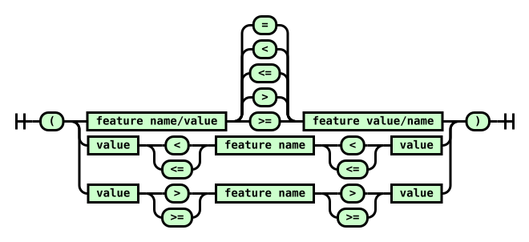

Attribution and reformatting notice added for Surgeist on 2026-10-03

This reformatted document accompanies Surgeist as software implementation support. The original English document at the source URL remains authoritative; this copy is not a new technical specification. Added labels and representation notes are non-normative. W3C is not responsible for content absent from the original, and this copy may contain formatting or hypertext errors.

This software or document includes material copied from or derived from [Media Queries Level 5](https://www.w3.org/TR/2026/WD-mediaqueries-5-20260219/).

Original copyright notice: Copyright © 2026 World Wide Web Consortium. W3C® liability, trademark and permissive document license rules apply.

License: [W3C Software and Document License, 2023 version](../licenses/w3c/software-license-2023.txt). Changes are format conversion, visible semantic labels, local exact-snapshot links, and passive SVG/TeX representations as detailed in the [conversion report](CONVERSION-REPORT.md). Original source text, status, authorship, and legal notices remain below.

# Source provenance

Title: Media Queries Level 5

Source snapshot: https://www.w3.org/TR/2026/WD-mediaqueries-5-20260219/

Snapshot SHA-256: 9e761f96f6a9935591264b470bdf5e4c1b5b15874c376b9de70e670171671c95

Conversion: offline format conversion of the exact stored HTML; not a new specification or summary. Publication versions remain distinct. Source fragment identifiers are preserved as short HTML anchors. Original copyright and licensing text/links are retained where present in the source.

Representation notes:
- 4 inline SVG diagrams are retained as local passive SVG assets, with original geometry and visible source diagram text. Supporting assets are not reference documents.
- 40 complex or multi-paragraph tables are structured Markdown row/cell transcriptions with explicit header/data roles and row/column spans; no raw HTML tables remain.
- Small semantic emphasis/subscript/superscript HTML is retained to avoid GFM intraword-delimiter and subscript rendering defects; website layout HTML is not retained.
- Canonically unstable or combining Unicode characters and escape-sensitive punctuation are shielded as numeric entities in prose/semantic inline HTML. Literal source code stays literal.

---

# <a id="title"></a>Media Queries Level 5

[Copyright](https://www.w3.org/policies/#copyright) © 2026 [World Wide Web Consortium](https://www.w3.org/). W3C<sup>®</sup> [liability](https://www.w3.org/policies/#Legal_Disclaimer), [trademark](https://www.w3.org/policies/#W3C_Trademarks) and [permissive document license](https://www.w3.org/copyright/software-license/) rules apply.

## <a id="abstract"></a>Abstract

<a id="ref-for-media-query"></a>

[Media Queries](#media-query) allow authors to test and query values or features of the user agent or display device, independent of the document being rendered. They are used in the CSS @media rule to conditionally apply styles to a document, and in various other contexts and languages, such as HTML and JavaScript.

Media Queries Level 5 describes the mechanism and syntax of media queries, media types, and media features. It extends and supersedes the features defined in Media Queries Level 4.

[CSS](https://www.w3.org/TR/CSS/) is a language for describing the rendering of structured documents (such as HTML and XML) on screen, on paper, etc.

## <a id="sotd"></a>Status of this document

<em>This section describes the status of this document at the time of its publication.
	A list of current W3C publications
	and the latest revision of this technical report
	can be found in the <a href="https://www.w3.org/TR/">W3C standards and drafts index.</a></em>

This document was published by the [CSS Working Group](https://www.w3.org/groups/wg/css) as a <strong>Working Draft</strong> using the [Recommendation track](https://www.w3.org/policies/process/20250818/#recs-and-notes). Publication as a Working Draft does not imply endorsement by W3C and its Members.

This is a draft document and may be updated, replaced or obsoleted by other documents at any time. It is inappropriate to cite this document as other than a work in progress.

Please send feedback by [filing issues in GitHub](https://github.com/w3c/csswg-drafts/issues) (preferred), including the spec code “mediaqueries” in the title, like this: “\[mediaqueries\] <i>…summary of comment…</i>”. All issues and comments are [archived](https://lists.w3.org/Archives/Public/public-css-archive/). Alternately, feedback can be sent to the ([archived](https://lists.w3.org/Archives/Public/www-style/)) public mailing list [www-style@w3.org](mailto:www-style@w3.org?Subject=%5Bmediaqueries%5D%20PUT%20SUBJECT%20HERE).

<a id="w3c_process_revision"></a>

This document is governed by the [18 August 2025 W3C Process Document](https://www.w3.org/policies/process/20250818/).

This document was produced by a group operating under the [W3C Patent Policy](https://www.w3.org/policies/patent-policy/20200915/). W3C maintains a [public list of any patent disclosures](https://www.w3.org/groups/wg/css/ipr) made in connection with the deliverables of the group; that page also includes instructions for disclosing a patent. An individual who has actual knowledge of a patent that the individual believes contains [Essential Claim(s)](https://www.w3.org/policies/patent-policy/20200915/#def-essential) must disclose the information in accordance with [section 6 of the W3C Patent Policy](https://www.w3.org/policies/patent-policy/20200915/#sec-Disclosure).

The following features are at-risk, and may be dropped during the CR period:

- <a id="ref-for-descdef-media-update"></a>

  The [update](#descdef-media-update) media feature

“At-risk” is a W3C Process term-of-art, and does not necessarily imply that the feature is in danger of being dropped or delayed. It means that the WG believes the feature may have difficulty being interoperably implemented in a timely manner, and marking it as such allows the WG to drop the feature if necessary when transitioning to the Proposed Rec stage, without having to publish a new Candidate Rec without the feature first.

## <a id="intro"></a>1.  Introduction

<em>This section is not normative.</em>

<a id="ref-for-media-type"></a>

In 1997, HTML4 [\[HTML401\]](#biblio-html401) defined a mechanism to support media-dependent style sheets, tailored for different [media types](#media-type). For example, a document may use different style sheets for screen and for print. In HTML, this can be written as:

> <strong data-conversion-semantic="example">Example</strong>
>
> <a id="example-f12a7f15"></a>
>
> ```text
> <link rel="stylesheet" type="text/css" media="screen" href="style.css">
> <link rel="stylesheet" type="text/css" media="print" href="print.css">
> ```
<a id="ref-for-at-ruledef-media"></a>

<a id="ref-for-at-ruledef-import"></a>

CSS adapted and extended this functionality with its [@media](https://www.w3.org/TR/css-conditional-3/#at-ruledef-media) and [@import](https://www.w3.org/TR/css-cascade-5/#at-ruledef-import) rules, adding the ability to query the value of individual features:

<a id="ref-for-media-type①"></a>

> <strong data-conversion-semantic="example">Example</strong>
>
> <a id="example-23ee34e2"></a> Inside a CSS style sheet, one can declare that sections apply to certain [media types](#media-type):
>
> ```text
> @media screen {
>   * { font-family: sans-serif }
> }
> ```
>
> Similarly, stylesheets can be conditionally imported based on media queries:
>
> ```text
> @import "print-styles.css" print;
> ```
<a id="ref-for-media-query①"></a>

[Media queries](#media-query) can be used with HTML, XHTML, XML [\[xml-stylesheet\]](#biblio-xml-stylesheet) and the @import and @media rules of CSS.

> <strong data-conversion-semantic="example">Example</strong>
>
> <a id="example-b1c63ddf"></a> Here is the same example written in HTML, XHTML, XML, @import and @media:
>
> ```text
> <link media="screen and (color), projection and (color)"
>       rel="stylesheet" href="example.css">
> 
> <link media="screen and (color), projection and (color)"
>       rel="stylesheet" href="example.css" />
> 
> <?xml-stylesheet media="screen and (color), projection and (color)"
>                  rel="stylesheet" href="example.css" ?>
> 
> @import url(example.css) screen and (color), projection and (color);
> 
> @media screen and (color), projection and (color) { … }
> ```
### <a id="placement"></a>1.1.  Module interactions

This module extends and supersedes [\[MEDIAQUERIES-4\]](#biblio-mediaqueries-4) and its predecessor [\[MEDIAQUERIES-3\]](#biblio-mediaqueries-3), which themselves built upon and replaced [CSS 2 § 7 Media types](https://www.w3.org/TR/CSS2/media.html#q7.0).

### <a id="values"></a>1.2.  Values

<a id="ref-for-integer-value"></a>

<a id="ref-for-number-value"></a>

<a id="ref-for-resolution-value"></a>

Value types not defined in this specification, such as [\<integer\>](https://www.w3.org/TR/css-values-4/#integer-value), [\<number\>](https://www.w3.org/TR/css-values-4/#number-value) or [\<resolution\>](https://www.w3.org/TR/css-values-4/#resolution-value), are defined in [\[CSS-VALUES-4\]](#biblio-css-values-4). Other CSS modules may expand the definitions of these value types.

### <a id="units"></a>1.3.  Units

The units used in media queries are the same as in other parts of CSS, as defined in [\[CSS-VALUES-4\]](#biblio-css-values-4). For example, the pixel unit represents CSS pixels and not physical pixels.

<a id="ref-for-relative-length"></a>

<a id="ref-for-initial-value"></a>

[Relative length](https://www.w3.org/TR/css-values-4/#relative-length) units in media queries are based on the [initial value](https://www.w3.org/TR/css-cascade-5/#initial-value), which means that units are never based on results of declarations.

<a id="ref-for-em"></a>

<a id="ref-for-initial-value①"></a>

<a id="ref-for-propdef-font-size"></a>

> <strong data-conversion-semantic="note">Note</strong>
>
> Note: For example, in HTML, the [em](https://www.w3.org/TR/css-values-4/#em) unit is relative to the [initial value](https://www.w3.org/TR/css-cascade-5/#initial-value) of [font-size](https://www.w3.org/TR/css-fonts-4/#propdef-font-size), defined by the user agent or the user’s preferences, not any styling on the page. Note that this will also take into account additional restrictions the user might apply, such as minimum font sizes.

Tests

- [relative-units-001.html](https://wpt.fyi/results/css/mediaqueries/relative-units-001.html) [(live test)](http://wpt.live/css/mediaqueries/relative-units-001.html) [(source)](https://github.com/web-platform-tests/wpt/blob/master/css/mediaqueries/relative-units-001.html)
- [relative-units-002.html](https://wpt.fyi/results/css/mediaqueries/relative-units-002.html) [(live test)](http://wpt.live/css/mediaqueries/relative-units-002.html) [(source)](https://github.com/web-platform-tests/wpt/blob/master/css/mediaqueries/relative-units-002.html)
- [relative-units-003.html](https://wpt.fyi/results/css/mediaqueries/relative-units-003.html) [(live test)](http://wpt.live/css/mediaqueries/relative-units-003.html) [(source)](https://github.com/web-platform-tests/wpt/blob/master/css/mediaqueries/relative-units-003.html)
- [relative-units-004.html](https://wpt.fyi/results/css/mediaqueries/relative-units-004.html) [(live test)](http://wpt.live/css/mediaqueries/relative-units-004.html) [(source)](https://github.com/web-platform-tests/wpt/blob/master/css/mediaqueries/relative-units-004.html)
- [relative-units-005.html](https://wpt.fyi/results/css/mediaqueries/relative-units-005.html) [(live test)](http://wpt.live/css/mediaqueries/relative-units-005.html) [(source)](https://github.com/web-platform-tests/wpt/blob/master/css/mediaqueries/relative-units-005.html)

## <a id="media"></a>2.  Media Queries

<a id="ref-for-media-query②"></a>

A <a id="media-query"></a>media query is a method of testing certain aspects of the user agent or device that the document is being displayed in. [Media queries](#media-query) are (almost) always independent of the contents of the document, its styling, or any other internal aspect; they’re only dependent on “external” information unless another feature explicitly specifies that it affects the resolution of Media Queries.

<a id="ref-for-media-query③"></a>

<a id="ref-for-media-query-modifier"></a>

<a id="ref-for-media-type②"></a>

<a id="ref-for-media-feature"></a>

The syntax of a [media query](#media-query) consists of an optional [media query modifier](#media-query-modifier), an optional [media type](#media-type), and zero or more [media features](#media-feature):


Diagram text: media condition only not media type and media condition

<a id="ref-for-media-query④"></a>

A [media query](#media-query) is a logical expression that is either true or false. A media query is true if:

- <a id="ref-for-media-type③"></a>

  the [media type](#media-type), if specified, matches the media type of the device where the user agent is running, and

- <a id="ref-for-media-condition"></a>

  the [media condition](#media-condition) is true.

Statements regarding media queries in this section assume the [syntax section](#mq-syntax) is followed. Media queries that do not conform to the syntax are discussed in [§ 3.2 Error Handling](#error-handling). I.e. the syntax takes precedence over requirements in this section.

> <strong data-conversion-semantic="example">Example</strong>
>
> <a id="example-724d1b7b"></a> Here is a simple example written in HTML:
>
> ```text
> <link rel="stylesheet" media="screen and (color)" href="example.css" />
> ```
>
> <a id="ref-for-valdef-media-screen"></a>
>
> This example expresses that a certain style sheet (`example.css`) applies to devices of a certain media type ([screen](#valdef-media-screen)) with certain feature (it must be a color screen).
>
> Here is the same media query written in an @import-rule in CSS:
>
> ```text
> @import url(example.css) screen and (color);
> ```
<a id="ref-for-media-query⑤"></a>

User agents must re-evaluate [media queries](#media-query) in response to changes in the user environment that they’re aware of, for example if the device is tiled from landscape to portrait orientation, and change the behavior of any constructs dependent on those <a id="ref-for-media-query⑥"></a>media queries accordingly.

Unless another feature explicitly specifies that it affects the resolution of Media Queries, it is never necessary to apply a style sheet in order to evaluate expressions.

Tests

- media-queries-001.xht (visual test) [(source)](https://github.com/web-platform-tests/wpt/blob/master/css/mediaqueries/media-queries-001.xht)
- media-queries-002.xht (visual test) [(source)](https://github.com/web-platform-tests/wpt/blob/master/css/mediaqueries/media-queries-002.xht)
- media-queries-003.xht (visual test) [(source)](https://github.com/web-platform-tests/wpt/blob/master/css/mediaqueries/media-queries-003.xht)
- [mq-calc-001.html](https://wpt.fyi/results/css/mediaqueries/mq-calc-001.html) [(live test)](http://wpt.live/css/mediaqueries/mq-calc-001.html) [(source)](https://github.com/web-platform-tests/wpt/blob/master/css/mediaqueries/mq-calc-001.html)
- [mq-calc-002.html](https://wpt.fyi/results/css/mediaqueries/mq-calc-002.html) [(live test)](http://wpt.live/css/mediaqueries/mq-calc-002.html) [(source)](https://github.com/web-platform-tests/wpt/blob/master/css/mediaqueries/mq-calc-002.html)
- [mq-calc-003.html](https://wpt.fyi/results/css/mediaqueries/mq-calc-003.html) [(live test)](http://wpt.live/css/mediaqueries/mq-calc-003.html) [(source)](https://github.com/web-platform-tests/wpt/blob/master/css/mediaqueries/mq-calc-003.html)
- [mq-calc-004.html](https://wpt.fyi/results/css/mediaqueries/mq-calc-004.html) [(live test)](http://wpt.live/css/mediaqueries/mq-calc-004.html) [(source)](https://github.com/web-platform-tests/wpt/blob/master/css/mediaqueries/mq-calc-004.html)
- [mq-calc-005.html](https://wpt.fyi/results/css/mediaqueries/mq-calc-005.html) [(live test)](http://wpt.live/css/mediaqueries/mq-calc-005.html) [(source)](https://github.com/web-platform-tests/wpt/blob/master/css/mediaqueries/mq-calc-005.html)
- [mq-calc-006.html](https://wpt.fyi/results/css/mediaqueries/mq-calc-006.html) [(live test)](http://wpt.live/css/mediaqueries/mq-calc-006.html) [(source)](https://github.com/web-platform-tests/wpt/blob/master/css/mediaqueries/mq-calc-006.html)
- [mq-calc-007.html](https://wpt.fyi/results/css/mediaqueries/mq-calc-007.html) [(live test)](http://wpt.live/css/mediaqueries/mq-calc-007.html) [(source)](https://github.com/web-platform-tests/wpt/blob/master/css/mediaqueries/mq-calc-007.html)
- [mq-calc-008.html](https://wpt.fyi/results/css/mediaqueries/mq-calc-008.html) [(live test)](http://wpt.live/css/mediaqueries/mq-calc-008.html) [(source)](https://github.com/web-platform-tests/wpt/blob/master/css/mediaqueries/mq-calc-008.html)
- [mq-calc-resolution.html](https://wpt.fyi/results/css/mediaqueries/mq-calc-resolution.html) [(live test)](http://wpt.live/css/mediaqueries/mq-calc-resolution.html) [(source)](https://github.com/web-platform-tests/wpt/blob/master/css/mediaqueries/mq-calc-resolution.html)
- [mq-calc-sign-function-001.html](https://wpt.fyi/results/css/mediaqueries/mq-calc-sign-function-001.html) [(live test)](http://wpt.live/css/mediaqueries/mq-calc-sign-function-001.html) [(source)](https://github.com/web-platform-tests/wpt/blob/master/css/mediaqueries/mq-calc-sign-function-001.html)
- [mq-calc-sign-function-002.html](https://wpt.fyi/results/css/mediaqueries/mq-calc-sign-function-002.html) [(live test)](http://wpt.live/css/mediaqueries/mq-calc-sign-function-002.html) [(source)](https://github.com/web-platform-tests/wpt/blob/master/css/mediaqueries/mq-calc-sign-function-002.html)
- [mq-calc-sign-function-003.html](https://wpt.fyi/results/css/mediaqueries/mq-calc-sign-function-003.html) [(live test)](http://wpt.live/css/mediaqueries/mq-calc-sign-function-003.html) [(source)](https://github.com/web-platform-tests/wpt/blob/master/css/mediaqueries/mq-calc-sign-function-003.html)
- [mq-calc-sign-function-004.html](https://wpt.fyi/results/css/mediaqueries/mq-calc-sign-function-004.html) [(live test)](http://wpt.live/css/mediaqueries/mq-calc-sign-function-004.html) [(source)](https://github.com/web-platform-tests/wpt/blob/master/css/mediaqueries/mq-calc-sign-function-004.html)
- [mq-calc-sign-function-005.html](https://wpt.fyi/results/css/mediaqueries/mq-calc-sign-function-005.html) [(live test)](http://wpt.live/css/mediaqueries/mq-calc-sign-function-005.html) [(source)](https://github.com/web-platform-tests/wpt/blob/master/css/mediaqueries/mq-calc-sign-function-005.html)
- [mq-calc-sign-function-006.html](https://wpt.fyi/results/css/mediaqueries/mq-calc-sign-function-006.html) [(live test)](http://wpt.live/css/mediaqueries/mq-calc-sign-function-006.html) [(source)](https://github.com/web-platform-tests/wpt/blob/master/css/mediaqueries/mq-calc-sign-function-006.html)
- [mq-dynamic-empty-children.html](https://wpt.fyi/results/css/mediaqueries/mq-dynamic-empty-children.html) [(live test)](http://wpt.live/css/mediaqueries/mq-dynamic-empty-children.html) [(source)](https://github.com/web-platform-tests/wpt/blob/master/css/mediaqueries/mq-dynamic-empty-children.html)
- [test_media_queries.html](https://wpt.fyi/results/css/mediaqueries/test_media_queries.html) [(live test)](http://wpt.live/css/mediaqueries/test_media_queries.html) [(source)](https://github.com/web-platform-tests/wpt/blob/master/css/mediaqueries/test_media_queries.html)

### <a id="mq-list"></a>2.1.  Combining Media Queries

<a id="ref-for-media-query⑦"></a>

Several [media queries](#media-query) can be combined into a comma-separated <a id="media-query-list"></a>media query list.


Diagram text: media query ,

<a id="ref-for-media-query-list"></a>

<a id="ref-for-media-query⑧"></a>

A [media query list](#media-query-list) is true if <em>any</em> of its component [media queries](#media-query) are true, and false only if <em>all</em> of its component <a id="ref-for-media-query⑨"></a>media queries are false.

<a id="ref-for-media-query-list①"></a>

<a id="ref-for-media-type④"></a>

<a id="ref-for-valdef-media-screen①"></a>

<a id="ref-for-valdef-media-projection"></a>

> <strong data-conversion-semantic="example">Example</strong>
>
> <a id="example-75a76747"></a> For example, the following [media query list](#media-query-list) is true if either the [media type](#media-type) is [screen](#valdef-media-screen) and it’s a color device, <strong>or</strong> the <a id="ref-for-media-type⑤"></a>media type is [projection](#valdef-media-projection) and it’s a color device:
>
> ```text
> @media screen and (color), projection and (color) { … }
> ```
<a id="ref-for-media-query-list②"></a>

An empty [media query list](#media-query-list) evaluates to true.

> <strong data-conversion-semantic="example">Example</strong>
>
> <a id="example-6f06ee45"></a> For example, these are equivalent:
>
> ```text
> @media all { … }
> @media { … }
> ```
### <a id="mq-prefix"></a>2.2.  Media Query Modifiers

<a id="ref-for-media-query①⓪"></a>

A [media query](#media-query) may optionally be prefixed by a single <a id="media-query-modifier"></a>media query modifier, which is a single keyword which alters the meaning of the following <a id="ref-for-media-query①①"></a>media query.

<a id="ref-for-valdef-media-not"></a>

#### <a id="mq-not"></a>2.2.1.  Negating a Media Query: the [not](#valdef-media-not) keyword

<a id="ref-for-media-query①②"></a>

<a id="ref-for-valdef-media-not①"></a>

An individual [media query](#media-query) can have its result negated by prefixing it with the keyword <a id="valdef-media-not"></a>not. If the <a id="ref-for-media-query①③"></a>media query would normally evaluate to true, prefixing it with [not](#valdef-media-not) makes it evaluate to false, and vice versa.

<a id="ref-for-media-type⑥"></a>

> <strong data-conversion-semantic="example">Example</strong>
>
> <a id="example-b5a260cd"></a> For example, the following will apply to everything except color-capable screens. Note that the entire media query is negated, not just the [media type](#media-type).
>
> ```text
> <link rel="stylesheet" media="not screen and (color)" href="example.css" />
> ```
<a id="ref-for-valdef-media-only"></a>

#### <a id="mq-only"></a>2.2.2.  Hiding a Media Query From Legacy user agents: the [only](#valdef-media-only) keyword

<a id="ref-for-media-query①④"></a>

<a id="ref-for-media-type⑦"></a>

<a id="ref-for-media-feature①"></a>

<a id="ref-for-valdef-media-screen②"></a>

The concept of [media queries](#media-query) originates from HTML4 [\[HTML401\]](#biblio-html401). That specification only defined [media types](#media-type), but had a forward-compatible syntax that accommodated the addition of future concepts like [media features](#media-feature): it would consume the characters of a <a id="ref-for-media-query①⑤"></a>media query up to the first non-alphanumeric character, and interpret that as a <a id="ref-for-media-type⑧"></a>media type, ignoring the rest. For example, the <a id="ref-for-media-query①⑥"></a>media query screen and (color) would be truncated to just [screen](#valdef-media-screen).

<a id="ref-for-media-feature②"></a>

<a id="ref-for-media-query①⑦"></a>

<a id="ref-for-media-type⑨"></a>

Unfortunately, this means that legacy user agents using this error-handling behavior will ignore any [media features](#media-feature) in a [media query](#media-query), even if they’re far more important than the [media type](#media-type) in the query. This can result in styles accidentally being applied in inappropriate situations.

<a id="ref-for-media-query①⑧"></a>

<a id="ref-for-valdef-media-only①"></a>

<a id="ref-for-media-type①⓪"></a>

To hide these [media queries](#media-query) from legacy user agents, the <a id="ref-for-media-query①⑨"></a>media query can be prefixed with the keyword <a id="valdef-media-only"></a>only. The [only](#valdef-media-only) keyword <strong>has no effect</strong> on the <a id="ref-for-media-query②⓪"></a>media query’s result, but will cause the <a id="ref-for-media-query②①"></a>media query to be parsed by legacy user agents as specifying the unknown [media type](#media-type) “only”, and thus be ignored.

<a id="ref-for-valdef-media-screen③"></a>

<a id="ref-for-media-type①①"></a>

> <strong data-conversion-semantic="example">Example</strong>
>
> <a id="example-88774f15"></a> In this example, the stylesheet specified by the `<link>` element will not be used by legacy user agents, even if they would normally match the [screen](#valdef-media-screen) [media type](#media-type).
>
> ```text
> <link rel="stylesheet" media="only screen and (color)" href="example.css" />
> ```
<a id="ref-for-valdef-media-only②"></a>

<a id="ref-for-media-type①②"></a>

<a id="ref-for-media-query②②"></a>

<a id="ref-for-media-feature③"></a>

<a id="ref-for-media-query-modifier①"></a>

<a id="ref-for-valdef-media-not②"></a>

> <strong data-conversion-semantic="note">Note</strong>
>
> Note: Note that the [only](#valdef-media-only) keyword can only be used before a [media type](#media-type). A [media query](#media-query) consisting only of [media features](#media-feature), or one with another [media query modifier](#media-query-modifier) like [not](#valdef-media-not), will be treated as false by legacy user agents automatically.

<a id="ref-for-valdef-media-only③"></a>

> <strong data-conversion-semantic="note">Note</strong>
>
> Note: At the time of publishing this specification, such legacy user agents are extremely rare, and so using the [only](#valdef-media-only) modifier is rarely, if ever, necessary.

### <a id="media-types"></a>2.3.  Media Types

<a id="ref-for-media-type①③"></a>

A <a id="media-type"></a>media type is a broad category of user-agent devices on which a document may be displayed. The original set of [media types](#media-type) were defined in HTML4, for the `media` attribute on `<link>` elements.

<a id="ref-for-media-type①④"></a>

<a id="ref-for-valdef-media-screen④"></a>

<a id="ref-for-valdef-media-handheld"></a>

<a id="ref-for-valdef-media-tty"></a>

<a id="ref-for-valdef-media-tv"></a>

<a id="ref-for-media-feature④"></a>

<a id="ref-for-descdef-media-grid"></a>

<a id="ref-for-descdef-media-scan"></a>

Unfortunately, [media types](#media-type) have proven insufficient as a way of discriminating between devices with different styling needs. Some categories which were originally quite distinct, such as [screen](#valdef-media-screen) and [handheld](#valdef-media-handheld), have blended significantly in the years since their invention. Others, such as [tty](#valdef-media-tty) or [tv](#valdef-media-tv), expose useful differences from the norm of a full-featured computer monitor, and so are potentially useful to target with different styling, but the definition of <a id="ref-for-media-type①⑤"></a>media types as mutually exclusive makes it difficult to use them in a reasonable manner; instead, their exclusive aspects are better expressed as [media features](#media-feature) such as [grid](#descdef-media-grid) or [scan](#descdef-media-scan).

<a id="ref-for-media-type①⑥"></a>

<a id="ref-for-media-query②③"></a>

As such, the following [media types](#media-type) are defined for use in [media queries](#media-query):

<a id="valdef-media-all"></a>all  
Matches all devices.

<a id="valdef-media-print"></a>print  
Matches printers, and devices intended to reproduce a printed display, such as a web browser showing a document in “Print Preview”.

<a id="valdef-media-screen"></a>screen  
<a id="ref-for-valdef-media-print"></a>

Matches all devices that aren’t matched by [print](#valdef-media-print).

<a id="ref-for-media-type①⑦"></a>

<a id="ref-for-media-feature⑤"></a>

In addition, the following <strong>deprecated</strong> [media types](#media-type) are defined. Authors must not use these <a id="ref-for-media-type①⑧"></a>media types; instead, it is recommended that they select appropriate [media features](#media-feature) that better represent the aspect of the device that they are attempting to style against.

<a id="ref-for-media-type①⑨"></a>

User agents must recognize the following [media types](#media-type) as valid, but must make them match nothing.

- <a id="valdef-media-tty"></a>tty
- <a id="valdef-media-tv"></a>tv
- <a id="valdef-media-projection"></a>projection
- <a id="valdef-media-handheld"></a>handheld
- <a id="valdef-media-braille"></a>braille
- <a id="valdef-media-embossed"></a>embossed
- <a id="valdef-media-aural"></a>aural
- <a id="valdef-media-speech"></a>speech

<a id="ref-for-media-feature⑥"></a>

> <strong data-conversion-semantic="note">Note</strong>
>
> Note: It is expected that all of the media types will also be deprecated in time, as appropriate [media features](#media-feature) are defined which capture their important differences.

Tests

- [mq-deprecated-001.html](https://wpt.fyi/results/css/mediaqueries/mq-deprecated-001.html) [(live test)](http://wpt.live/css/mediaqueries/mq-deprecated-001.html) [(source)](https://github.com/web-platform-tests/wpt/blob/master/css/mediaqueries/mq-deprecated-001.html)

### <a id="mq-features"></a>2.4.  Media Features

<a id="ref-for-media-type②⓪"></a>

A <a id="media-feature"></a>media feature is a more fine-grained test than [media types](#media-type), testing a single, specific feature of the user agent or display device.

<a id="ref-for-media-feature⑦"></a>

Syntactically, [media features](#media-feature) resemble CSS properties: they consist of a feature name, a colon, and a value to test for. They may also be written in boolean form as just a feature name, or in range form with a comparison operator.


Diagram text: ( feature name : feature value feature name range form (see below) )

There are, however, several important differences between properties and media features:

- Properties are used to give information about how to present a document. Media features are used to describe requirements of the output device.

- Media features are always wrapped in parentheses and combined with the and or or keywords, like (color) and (min-width: 600px), rather than being separated with semicolons.

- <a id="ref-for-media-feature⑧"></a>

  <a id="ref-for-descdef-media-color"></a>

  <a id="ref-for-boolean-context"></a>

  A media feature may be given with <em>only</em> its name (omitting the colon and value) to evaluate the feature in a [boolean context](#boolean-context). This is a convenient shorthand for features that have a reasonable value representing 0 or “none”. For example, (color) is true if the [color](#descdef-media-color) [media feature](#media-feature) is non-zero.

- <a id="ref-for-range-context"></a>

  <a id="ref-for-media-feature⑨"></a>

  [Media features](#media-feature) with “range” type can be written in a [range context](#range-context), which uses standard mathematical comparison operators rather than a colon, or have their feature names [prefixed with “min-” or “max-”](#mq-min-max).

- <a id="ref-for-media-feature①⓪"></a>

  Properties sometimes accept complex values, e.g., calculations that involve several other values. [Media features](#media-feature) only accept single values: one keyword, one number, etc.

<a id="ref-for-media-feature①①"></a>

If a [media feature](#media-feature) references a concept which does not exist on the device where the UA is running (for example, speech UAs do not have a concept of “width”), the <a id="ref-for-media-feature①②"></a>media feature must always evaluate to false.

<a id="ref-for-descdef-media-device-aspect-ratio"></a>

<a id="ref-for-valdef-media-speech"></a>

> <strong data-conversion-semantic="example">Example</strong>
>
> <a id="example-b561f02b"></a> The media feature [device-aspect-ratio](#descdef-media-device-aspect-ratio) only applies to visual devices. On an [speech](#valdef-media-speech) device, expressions involving <a id="ref-for-descdef-media-device-aspect-ratio①"></a>device-aspect-ratio will therefore always be false:
>
> ```text
> <link media="speech and (device-aspect-ratio: 16/9)"
>       rel="stylesheet" href="example.css">
> ```
#### <a id="mq-ranges"></a>2.4.1.  Media Feature Types: “range” and “discrete”

Every media feature defines its “type” as either “range” or “discrete” in its definition table.

<a id="ref-for-descdef-media-pointer"></a>

“Discrete” media features, like [pointer](#descdef-media-pointer) take their values from a set. The values may be keywords or boolean numbers (0 and 1), but the common factor is that there’s no intrinsic “order” to them—​none of the values are “less than” or “greater than” each other.

<a id="ref-for-descdef-media-width"></a>

“Range” media features like [width](#descdef-media-width), on the other hand, take their values from a range. Any two values can be compared to see which is lesser and which is greater.

<a id="ref-for-media-feature①③"></a>

<a id="ref-for-range-context①"></a>

The only significant difference between the two types is that “range” [media features](#media-feature) can be evaluated in a [range context](#range-context) and accept “min-” and “max-” prefixes on their name. Doing either of these changes the meaning of the feature—​rather than the <a id="ref-for-media-feature①④"></a>media feature being true when the feature exactly matches the given value, it matches when the feature is greater than/less than/equal to the given value.

<a id="ref-for-media-feature①⑤"></a>

> <strong data-conversion-semantic="example">Example</strong>
>
> <a id="example-92fc9072"></a> A (width \>= 600px) [media feature](#media-feature) is true when the viewport’s width is 600px <em>or more</em>.
>
> On the other hand, (width: 600px) by itself is only true when the viewport’s width is <em>exactly</em> 600px. If it’s less or greater than 600px, it’ll be false.

#### <a id="mq-boolean-context"></a>2.4.2.  Evaluating Media Features in a Boolean Context

<a id="ref-for-media-feature①⑥"></a>

While [media features](#media-feature) normally have a syntax similar to CSS properties, they can also be written more simply as just the feature name, like (color).

<a id="ref-for-media-feature①⑦"></a>

<a id="ref-for-typedef-dimension"></a>

<a id="ref-for-valdef-media-update-none"></a>

When written like this, the [media feature](#media-feature) is evaluated in a <a id="boolean-context"></a>boolean context. If the feature would be true for any value <em>other than</em> the number 0, a [\<dimension\>](https://www.w3.org/TR/css-values-4/#typedef-dimension) with the value 0, the keyword [none](#valdef-media-update-none), or a value explicitly defined by that media feature to evaluate as false in a boolean context, the <a id="ref-for-media-feature①⑧"></a>media feature evaluates to true. Otherwise, it evaluates to false.

<a id="ref-for-media-feature①⑨"></a>

> <strong data-conversion-semantic="example">Example</strong>
>
> <a id="example-f4e46a51"></a> Some [media features](#media-feature) are designed to be written like this.
>
> <a id="ref-for-descdef-media-update①"></a>
>
> For example, [update](#descdef-media-update) is typically written as (update) to test if any kind of updating is available, or not (update) to check for the opposite.
>
> It can still be given an explicit value as well, with (update: fast) or (update: slow) equal to (update), and (update: none) equal to not (update).

<a id="ref-for-media-feature②⓪"></a>

<a id="ref-for-descdef-media-width①"></a>

<a id="ref-for-boolean-context①"></a>

<a id="ref-for-descdef-media-color①"></a>

> <strong data-conversion-semantic="example">Example</strong>
>
> <a id="example-b4366ae2"></a> Some numeric [media features](#media-feature), like [width](#descdef-media-width), are rarely if ever useful to evaluate in a [boolean context](#boolean-context), as their values are almost always greater than zero. Others, like [color](#descdef-media-color), have meaningful zero values: (color) is identical to (color \> 0), indicating that the device is capable of displaying color at all.

<a id="ref-for-media-feature②①"></a>

<a id="ref-for-boolean-context②"></a>

> <strong data-conversion-semantic="example">Example</strong>
>
> <a id="example-9591e2ed"></a> Only some of the [media features](#media-feature) that accept keywords are meaningful in a [boolean context](#boolean-context).
>
> <a id="ref-for-descdef-media-pointer①"></a>
>
> <a id="ref-for-valdef-media-pointer-none"></a>
>
> For example, (pointer) is useful, as [pointer](#descdef-media-pointer) has a [none](#valdef-media-pointer-none) value to indicate there’s no pointing device at all on the device. On the other hand, (scan) is just always true or always false (depending on whether it applies at all to the device), as there’s no value that means “false”.

#### <a id="mq-range-context"></a>2.4.3.  Evaluating Media Features in a Range Context

<a id="ref-for-media-feature②②"></a>

[Media features](#media-feature) with a “range” type can be alternately written in a <a id="range-context"></a>range context that takes advantage of the fact that their values are ordered, using ordinary mathematical comparison operators:



Diagram text: ( feature name/value \> \<= \< = \>= feature value/name value \< \<= feature name \< \<= value value \> \>= feature name \> \>= value )

> <strong data-conversion-semantic="note">Note</strong>
>
> Note: This syntax is new to Level 4 of Mediaqueries, and thus is not as widely supported at the moment as the min-/max- prefixes.

The basic form, consisting of a feature name, a comparison operator, and a value, returns true if the relationship is true.

> <strong data-conversion-semantic="example">Example</strong>
>
> <a id="example-fc928617"></a> For example, (height \> 600px) (or (600px \< height)) returns true if the viewport height is greater than 600px.

The remaining forms, with the feature name nested between two value comparisons, returns true if both comparisons are true.

> <strong data-conversion-semantic="example">Example</strong>
>
> <a id="example-ef30a3ee"></a> For example, (400px \< width \< 1000px) returns true if the viewport width is between 400px and 1000px (but not equal to either).

Some media features with a "range" type are said to be <a id="false-in-the-negative-range"></a>false in the negative range. This means that negative values are valid and must be parsed, and that querying whether the media feature is equal to, less than, or less or equal than any such negative value must evaluate to false. Querying whether the media feature is greater, or greater or equal, than a negative value evaluates to true if the relationship is true.

<a id="ref-for-descdef-media-resolution"></a>

<a id="ref-for-descdef-media-width②"></a>

> <strong data-conversion-semantic="note">Note</strong>
>
> Note: If negative values had been rejected at parse time instead, they would be treated as unknown based on the error handling rules. However, in reality, whether a device’s [resolution](#descdef-media-resolution) is -300dpi is not unknown, it is known to be false. Similarly, for any visual device, the [width](#descdef-media-width) of the targeted display area is known to be greater than -200px The above rule reflects that, making intuition match what UAs do.

> <strong data-conversion-semantic="example">Example</strong>
>
> <a id="example-d3333f79"></a> The following examples result in a green background on all visual devices:
>
> ```text
> @media not (width <= -100px) {
>   body { background: green; }
> }
> ```
>
> ```text
> @media (height > -100px) {
>   body { background: green; }
> }
> ```
>
> ```text
> @media not (resolution: -300dpi) {
>   body { background: green; }
> }
> ```
<a id="ref-for-media-query②④"></a>

> <strong data-conversion-semantic="advisement">Advisement</strong>
>
> This is a behavior change compared to Media Queries Level 3 [\[MEDIAQUERIES-3\]](#biblio-mediaqueries-3), where negative values on these properties caused a syntax error. In level 3, syntax errors—including forbidden values—resulted in the entire [media query](#media-query) being false, rather than the unknown treatment defined in this level. Implementations updating from level 3 should make sure to change the handling of negative values for the relevant properties when they add support for the richer syntax defined in [§ 2.5 Combining Media Features](#media-conditions), to avoid introducing unintended semantics.

Tests

- [mq-negative-range-001.html](https://wpt.fyi/results/css/mediaqueries/mq-negative-range-001.html) [(live test)](http://wpt.live/css/mediaqueries/mq-negative-range-001.html) [(source)](https://github.com/web-platform-tests/wpt/blob/master/css/mediaqueries/mq-negative-range-001.html)
- [mq-negative-range-002.html](https://wpt.fyi/results/css/mediaqueries/mq-negative-range-002.html) [(live test)](http://wpt.live/css/mediaqueries/mq-negative-range-002.html) [(source)](https://github.com/web-platform-tests/wpt/blob/master/css/mediaqueries/mq-negative-range-002.html)

#### <a id="mq-min-max"></a>2.4.4.  Using “min-” and “max-” Prefixes On Range Features

<a id="ref-for-media-feature②③"></a>

Rather than evaluating a “range” type [media feature](#media-feature) in a range context, as described above, the feature may be written as a normal <a id="ref-for-media-feature②④"></a>media feature, but with a “min-” or “max-” prefix on the feature name.

<a id="ref-for-range-context②"></a>

This is equivalent to evaluating the feature in a [range context](#range-context), as follows:

- Using a “min-” prefix on a feature name is equivalent to using the “\>=” operator. For example, (min-height: 600px) is equivalent to (height \>= 600px).
- Using a “max-” prefix on a feature name is equivalent to using the “\<=” operator. For example, (max-width: 40em) is equivalent to (width \<= 40em).

> <strong data-conversion-semantic="note">Note</strong>
>
> Note: because “min-” and “max-” both equate to range comparisons that <strong>include</strong> the value, they may be limiting in certain situations.

> <strong data-conversion-semantic="example">Example</strong>
>
> <a id="example-69e2181d"></a> For instance, authors trying to define different styles based on a breakpoint in the viewport width using “min-” and “max-” would generally offset the values they’re comparing, to ensure that both queries don’t evaluate to true simultaneously. Assuming the breakpoint is at 320px, authors would conceptually use:
>
> ```text
> @media (max-width: 320px) { /* styles for viewports <= 320px */ }
> @media (min-width: 321px) { /* styles for viewports >= 321px */ }
> ```
>
> While this ensures that the two sets of styles don’t apply simultaneously when the viewport width is 320px, it does not take into account the possibility of fractional viewport sizes which can occur as a result of non-integer pixel densities (e.g. on high-dpi displays or as a result of zooming/scaling). Any viewport widths that fall between 320px and 321px will result in none of the styles being applied.
>
> One approach to work around this problem is to increase the precision of the values used for the comparison. Using the example above, changing the second comparison value to 320.01px significantly reduces the chance that a viewport width on a device would fall between the cracks.
>
> ```text
> @media (max-width: 320px) { /* styles for viewports <= 320px */ }
> @media (min-width: 320.01px) { /* styles for viewports >= 320.01px */ }
> ```
>
> <a id="ref-for-range-context③"></a>
>
> However, in these situations, [range context](#range-context) queries (which are not limited to “\>=” and “\<=” comparisons) offer a more appropriate solution:
>
> ```text
> @media (width <= 320px) { /* styles for viewports <= 320px */ }
> @media (width > 320px) { /* styles for viewports > 320px */ }
> ```
<a id="ref-for-media-feature②⑤"></a>

“Discrete” type properties do not accept “min-” or “max-” prefixes. Adding such a prefix to a “discrete” type [media feature](#media-feature) simply results in an unknown feature name.

<a id="ref-for-descdef-media-grid①"></a>

<a id="ref-for-media-feature②⑥"></a>

> <strong data-conversion-semantic="example">Example</strong>
>
> <a id="example-d539f038"></a> For example, (min-grid: 1) is invalid, because [grid](#descdef-media-grid) is a “discrete” [media feature](#media-feature), and so doesn’t accept the prefixes. (Even though the <a id="ref-for-descdef-media-grid②"></a>grid <a id="ref-for-media-feature②⑦"></a>media feature appears to be numeric, as it accepts the values 0 and 1.)

<a id="ref-for-media-feature②⑧"></a>

<a id="ref-for-boolean-context③"></a>

Attempting to evaluate a min/max prefixed [media feature](#media-feature) in a [boolean context](#boolean-context) is invalid and a syntax error.

### <a id="media-conditions"></a>2.5.  Combining Media Features

<a id="ref-for-media-feature②⑨"></a>

Multiple [media features](#media-feature) can be combined together into a <a id="media-condition"></a>media condition using full boolean algebra (not, and, or).

- <a id="ref-for-valdef-media-not③"></a>

  Any media feature can be negated by placing [not](#valdef-media-not) before it. For example, not (color) inverts the meaning of (color)—​since (color) matches a device with any kind of color display, not (color) matches a device <em>without</em> any kind of color display.

- Two or more media features can be chained together, such that the query is only true if <em>all</em> of the media features are true, by placing and between them. For example, (width \< 600px) and (height \< 600px) only matches devices whose screens are smaller than 600px wide in both dimensions.

- Alternately, two or more media features can be chained together, such that the query is true if <em>any</em> of the media features are true, by placing or between them. For example, (update: slow) or (hover: none) matches if the device is slow to update the screen (such as an e-reader) <em>or</em> the primary pointing device has no hover capability, perhaps indicating that one should use a layout that displays more information rather than compactly hiding it until the user hovers.

- <a id="ref-for-media-condition①"></a>

  [Media conditions](#media-condition) can be grouped by wrapping them in parentheses () which can then be nested within a condition the same as a single media query. For example, (not (color)) or (hover) is true on devices that are monochrome and/or that have hover capabilities. If one instead wanted to query for a device that was monochrome and <em>didn’t</em> have hover capabilities, it must instead be written as not ((color) or (hover)) (or, equivalently, as (not (color)) and (not (hover))).

<a id="ref-for-valdef-media-not④"></a>

It is <em>invalid</em> to mix and and or and [not](#valdef-media-not) at the same “level” of a media query. For example, (color) and (pointer) or (hover) is illegal, as it’s unclear what was meant. Instead, parentheses can be used to group things using a particular joining keyword, yielding either (color) and ((pointer) or (hover)) or ((color) and (pointer)) or (hover). These two have very different meanings: if only (hover) is true, the first one evaluates to false but the second evaluates to true.

Tests

- [negation-001.html](https://wpt.fyi/results/css/mediaqueries/negation-001.html) [(live test)](http://wpt.live/css/mediaqueries/negation-001.html) [(source)](https://github.com/web-platform-tests/wpt/blob/master/css/mediaqueries/negation-001.html)
- [negation-002.html](https://wpt.fyi/results/css/mediaqueries/negation-002.html) [(live test)](http://wpt.live/css/mediaqueries/negation-002.html) [(source)](https://github.com/web-platform-tests/wpt/blob/master/css/mediaqueries/negation-002.html)

## <a id="mq-syntax"></a>3.  Syntax

Informal descriptions of the media query syntax appear in the prose and railroad diagrams in previous sections. The formal media query syntax is described in this section, with the rule/property grammar syntax defined in [\[CSS-SYNTAX-3\]](#biblio-css-syntax-3) and [\[CSS-VALUES-4\]](#biblio-css-values-4).

<a id="ref-for-parse-a-comma-separated-list-of-component-values"></a>

<a id="ref-for-typedef-media-query"></a>

To parse a <a id="typedef-media-query-list"></a>\<media-query-list\> production, [parse a comma-separated list of component values](https://www.w3.org/TR/css-syntax-3/#parse-a-comma-separated-list-of-component-values), then parse each entry in the returned list as a [\<media-query\>](#typedef-media-query). Its value is the list of <a id="ref-for-typedef-media-query①"></a>\<media-query\>s so produced.

<a id="ref-for-typedef-media-query-list"></a>

<a id="ref-for-media-query-list③"></a>

> <strong data-conversion-semantic="note">Note</strong>
>
> Note: This explicit definition of [\<media-query-list\>](#typedef-media-query-list) parsing is necessary to make the error-recovery behavior of [media query lists](#media-query-list) well-defined.

<a id="ref-for-typedef-media-query-list①"></a>

> <strong data-conversion-semantic="note">Note</strong>
>
> Note: This definition of [\<media-query-list\>](#typedef-media-query-list) parsing intentionally accepts an empty list.

<a id="ref-for-ascii-case-insensitive"></a>

> <strong data-conversion-semantic="note">Note</strong>
>
> Note: As per [\[CSS-SYNTAX-3\]](#biblio-css-syntax-3), tokens are [ASCII case-insensitive](https://infra.spec.whatwg.org/#ascii-case-insensitive).

<a id="typedef-media-query"></a>

<a id="ref-for-typedef-media-condition"></a>

<a id="ref-for-typedef-media-type"></a>

<a id="ref-for-typedef-media-condition-without-or"></a>

<a id="typedef-media-type"></a>

<a id="ref-for-typedef-ident"></a>

<a id="typedef-media-condition"></a>

<a id="ref-for-typedef-media-not"></a>

<a id="ref-for-typedef-media-in-parens"></a>

<a id="ref-for-typedef-media-and"></a>

<a id="ref-for-typedef-media-or"></a>

<a id="typedef-media-condition-without-or"></a>

<a id="ref-for-typedef-media-not①"></a>

<a id="ref-for-typedef-media-in-parens①"></a>

<a id="ref-for-typedef-media-and①"></a>

<a id="typedef-media-not"></a>

<a id="ref-for-typedef-media-in-parens②"></a>

<a id="typedef-media-and"></a>

<a id="ref-for-typedef-media-in-parens③"></a>

<a id="typedef-media-or"></a>

<a id="ref-for-typedef-media-in-parens④"></a>

<a id="typedef-media-in-parens"></a>

<a id="ref-for-typedef-media-condition①"></a>

<a id="ref-for-typedef-media-feature"></a>

<a id="ref-for-typedef-general-enclosed"></a>

<a id="typedef-media-feature"></a>

<a id="ref-for-typedef-mf-plain"></a>

<a id="ref-for-typedef-mf-boolean"></a>

<a id="ref-for-typedef-mf-range"></a>

<a id="typedef-mf-plain"></a>

<a id="ref-for-typedef-mf-name"></a>

<a id="ref-for-typedef-mf-value"></a>

<a id="typedef-mf-boolean"></a>

<a id="ref-for-typedef-mf-name①"></a>

<a id="typedef-mf-range"></a>

<a id="ref-for-typedef-mf-name②"></a>

<a id="ref-for-typedef-mf-comparison"></a>

<a id="ref-for-typedef-mf-value①"></a>

<a id="ref-for-typedef-mf-value②"></a>

<a id="ref-for-typedef-mf-comparison①"></a>

<a id="ref-for-typedef-mf-name③"></a>

<a id="ref-for-typedef-mf-value③"></a>

<a id="ref-for-typedef-mf-lt"></a>

<a id="ref-for-typedef-mf-name④"></a>

<a id="ref-for-typedef-mf-lt①"></a>

<a id="ref-for-typedef-mf-value④"></a>

<a id="ref-for-typedef-mf-value⑤"></a>

<a id="ref-for-typedef-mf-gt"></a>

<a id="ref-for-typedef-mf-name⑤"></a>

<a id="ref-for-typedef-mf-gt①"></a>

<a id="ref-for-typedef-mf-value⑥"></a>

<a id="typedef-mf-name"></a>

<a id="ref-for-typedef-ident①"></a>

<a id="typedef-mf-value"></a>

<a id="ref-for-number-value①"></a>

<a id="ref-for-typedef-dimension①"></a>

<a id="ref-for-typedef-ident②"></a>

<a id="ref-for-ratio-value"></a>

<a id="typedef-mf-lt"></a>

<a id="typedef-mf-gt"></a>

<a id="typedef-mf-eq"></a>

<a id="typedef-mf-comparison"></a>

<a id="ref-for-typedef-mf-lt②"></a>

<a id="ref-for-typedef-mf-gt②"></a>

<a id="ref-for-typedef-mf-eq"></a>

<a id="typedef-general-enclosed"></a>

<a id="ref-for-typedef-function-token"></a>

<a id="ref-for-typedef-any-value"></a>

<a id="ref-for-typedef-any-value①"></a>

```text
<media-query> = <media-condition>
             | [ not | only ]? <media-type> [ and <media-condition-without-or> ]?
<media-type> = <ident>

<media-condition> = <media-not> | <media-in-parens> [ <media-and>* | <media-or>* ]
<media-condition-without-or> = <media-not> | <media-in-parens> <media-and>*
<media-not> = not <media-in-parens>
<media-and> = and <media-in-parens>
<media-or> = or <media-in-parens>
<media-in-parens> = ( <media-condition> ) | <media-feature> | <general-enclosed>

<media-feature> = ( [ <mf-plain> | <mf-boolean> | <mf-range> ] )
<mf-plain> = <mf-name> : <mf-value>
<mf-boolean> = <mf-name>
<mf-range> = <mf-name> <mf-comparison> <mf-value>
           | <mf-value> <mf-comparison> <mf-name>
           | <mf-value> <mf-lt> <mf-name> <mf-lt> <mf-value>
           | <mf-value> <mf-gt> <mf-name> <mf-gt> <mf-value>
<mf-name> = <ident>
<mf-value> = <number> | <dimension> | <ident> | <ratio>
<mf-lt> = '<' '='?
<mf-gt> = '>' '='?
<mf-eq> = '='
<mf-comparison> = <mf-lt> | <mf-gt> | <mf-eq>

<general-enclosed> = [ <function-token> <any-value>? ) ] | [ ( <any-value>? ) ]
```
<a id="ref-for-typedef-media-type①"></a>

<a id="ref-for-valdef-media-only④"></a>

<a id="ref-for-valdef-media-not⑤"></a>

The [\<media-type\>](#typedef-media-type) production does not include the keywords [only](#valdef-media-only), [not](#valdef-media-not), and, or, and layer.

<a id="ref-for-cascade-layers"></a>

> <strong data-conversion-semantic="note">Note</strong>
>
> Note: The exclusion of layer is because it would otherwise be ambiguous when when used in the `@import url(…) layer;` syntax for the sake of [cascade layers](https://www.w3.org/TR/css-cascade-5/#cascade-layers). See [\[CSS-CASCADE-5\]](#biblio-css-cascade-5).

<a id="ref-for-typedef-delim-token"></a>

No whitespace is allowed between the “\<” or “\>” [\<delim-token\>](https://www.w3.org/TR/css-syntax-3/#typedef-delim-token)s and the following “=” <a id="ref-for-typedef-delim-token①"></a>\<delim-token\>, if it’s present.

<a id="ref-for-valdef-media-not⑥"></a>

<a id="ref-for-typedef-function-token①"></a>

> <strong data-conversion-semantic="note">Note</strong>
>
> Note: Whitespace is required between a [not](#valdef-media-not), and, or or keyword and the following ( character, because without it that would instead parse as a [\<function-token\>](https://www.w3.org/TR/css-syntax-3/#typedef-function-token). This is not made explicitly invalid because it’s already covered by the above grammar. It’s fine to have whitespace between a ) and a following keyword, however.

<a id="ref-for-typedef-media-in-parens⑤"></a>

<a id="ref-for-typedef-general-enclosed①"></a>

<a id="ref-for-typedef-general-enclosed②"></a>

When parsing the [\<media-in-parens\>](#typedef-media-in-parens) production, the [\<general-enclosed\>](#typedef-general-enclosed) branch must only be chosen if the input does not match either of the preceding branches. <strong data-conversion-semantic="note">Note:</strong> [\<general-enclosed\>](#typedef-general-enclosed) exists to allow for future expansion of the grammar in a reasonably compatible way.

Tests

- [match-media-parsing.html](https://wpt.fyi/results/css/mediaqueries/match-media-parsing.html) [(live test)](http://wpt.live/css/mediaqueries/match-media-parsing.html) [(source)](https://github.com/web-platform-tests/wpt/blob/master/css/mediaqueries/match-media-parsing.html)
- [mq-case-insensitive-001.html](https://wpt.fyi/results/css/mediaqueries/mq-case-insensitive-001.html) [(live test)](http://wpt.live/css/mediaqueries/mq-case-insensitive-001.html) [(source)](https://github.com/web-platform-tests/wpt/blob/master/css/mediaqueries/mq-case-insensitive-001.html)
- [mq-range-001.html](https://wpt.fyi/results/css/mediaqueries/mq-range-001.html) [(live test)](http://wpt.live/css/mediaqueries/mq-range-001.html) [(source)](https://github.com/web-platform-tests/wpt/blob/master/css/mediaqueries/mq-range-001.html)
- [mq-unknown-feature-custom-property.html](https://wpt.fyi/results/css/mediaqueries/mq-unknown-feature-custom-property.html) [(live test)](http://wpt.live/css/mediaqueries/mq-unknown-feature-custom-property.html) [(source)](https://github.com/web-platform-tests/wpt/blob/master/css/mediaqueries/mq-unknown-feature-custom-property.html)

### <a id="evaluating"></a>3.1.  Evaluating Media Queries

<a id="ref-for-typedef-media-condition②"></a>

<a id="ref-for-typedef-media-condition-without-or①"></a>

Each of the major subexpression of [\<media-condition\>](#typedef-media-condition) or [\<media-condition-without-or\>](#typedef-media-condition-without-or) is associated with a boolean result, as follows:

<a id="ref-for-typedef-media-condition③"></a>

[\<media-condition\>](#typedef-media-condition)

<a id="ref-for-typedef-media-condition-without-or②"></a>

[\<media-condition-without-or\>](#typedef-media-condition-without-or)

The result is the result of the child subexpression.

<a id="ref-for-typedef-media-in-parens⑥"></a>

[\<media-in-parens\>](#typedef-media-in-parens)

The result is the result of the child term.

<a id="ref-for-typedef-media-not②"></a>

[\<media-not\>](#typedef-media-not)

<a id="ref-for-typedef-media-in-parens⑦"></a>

The result is the negation of the [\<media-in-parens\>](#typedef-media-in-parens) term. The negation of unknown is unknown.

<a id="ref-for-typedef-media-and②"></a>

<a id="ref-for-typedef-media-in-parens⑧"></a>

[\<media-in-parens\>](#typedef-media-in-parens) [\<media-and\>](#typedef-media-and)\*

<a id="ref-for-typedef-media-and③"></a>

<a id="ref-for-typedef-media-in-parens⑨"></a>

The result is true if the [\<media-in-parens\>](#typedef-media-in-parens) child term and all of the <a id="ref-for-typedef-media-in-parens①⓪"></a>\<media-in-parens\> children of the [\<media-and\>](#typedef-media-and) child terms are true, false if at least one of these <a id="ref-for-typedef-media-in-parens①①"></a>\<media-in-parens\> terms are false, and unknown otherwise.

<a id="ref-for-typedef-media-or①"></a>

<a id="ref-for-typedef-media-in-parens①②"></a>

[\<media-in-parens\>](#typedef-media-in-parens) [\<media-or\>](#typedef-media-or)\*

<a id="ref-for-typedef-media-or②"></a>

<a id="ref-for-typedef-media-in-parens①③"></a>

The result is false if the [\<media-in-parens\>](#typedef-media-in-parens) child term and all of the <a id="ref-for-typedef-media-in-parens①④"></a>\<media-in-parens\> children of the [\<media-or\>](#typedef-media-or) child terms are false, true if at least one of these <a id="ref-for-typedef-media-in-parens①⑤"></a>\<media-in-parens\> terms are true, and unknown otherwise.

<a id="ref-for-typedef-general-enclosed③"></a>

[\<general-enclosed\>](#typedef-general-enclosed)

The result is unknown.

<a id="ref-for-typedef-general-enclosed④"></a>

<a id="ref-for-typedef-media-condition④"></a>

Authors must not use [\<general-enclosed\>](#typedef-general-enclosed) in their stylesheets. <strong data-conversion-semantic="note">Note:</strong> It exists only for future-compatibility, so that new syntax additions do not invalidate too much of a [\<media-condition\>](#typedef-media-condition) in older user agents.

<a id="ref-for-typedef-media-feature①"></a>

[\<media-feature\>](#typedef-media-feature)

The result is the result of evaluating the specified media feature.

If the result of any of the above productions is used in any context that expects a two-valued boolean, “unknown” must be converted to “false”.

<a id="ref-for-media-query②⑤"></a>

<a id="ref-for-at-ruledef-media①"></a>

> <strong data-conversion-semantic="note">Note</strong>
>
> Note: This means that, for example, when a [media query](#media-query) is used in a [@media](https://www.w3.org/TR/css-conditional-3/#at-ruledef-media) rule, if it resolves to “unknown” it’s treated as “false” and fails to match.

> <strong data-conversion-semantic="note">Note</strong>
>
> Media Queries use a three-value logic where terms can be “true”, “false”, or “unknown”. Specifically, it uses the [Kleene 3-valued logic](https://en.wikipedia.org/wiki/Three-valued_logic#Kleene_and_Priest_logics). In this logic, “unknown” means “either true or false, but we’re not sure which yet”.
>
> In general, an unknown value showing up in a formula will cause the formula to be unknown as well, as substituting “true” for the unknown will give the formula a different result than substituting “false”. The only way to eliminate an unknown value is to use it in a formula that will give the same result whether the unknown is replaced with a true or false value. This occurs when you have “false AND unknown” (evaluates to false regardless) and “true OR unknown” (evaluates to true regardless).
>
> <a id="ref-for-typedef-general-enclosed⑤"></a>
>
> <a id="ref-for-media-query②⑥"></a>
>
> This logic was adopted because [\<general-enclosed\>](#typedef-general-enclosed) needs to be assigned a truth value. In standard boolean logic, the only reasonable value is “false”, but this means that not unknown(function) is true, which can be confusing and unwanted. Kleene’s 3-valued logic ensures that unknown things will prevent a [media query](#media-query) from matching, unless their value is irrelevant to the final result.

### <a id="error-handling"></a>3.2.  Error Handling

A media query that does not match the grammar in the previous section must be replaced by not all during parsing.

<a id="ref-for-media-query-list④"></a>

<a id="ref-for-media-query②⑦"></a>

> <strong data-conversion-semantic="note">Note</strong>
>
> Note: Note that a grammar mismatch does <strong>not</strong> wipe out an entire [media query list](#media-query-list), just the problematic [media query](#media-query). The parsing behavior defined above automatically recovers at the next top-level comma.

> <strong data-conversion-semantic="example">Example</strong>
>
> <a id="example-bc6a6750"></a>
>
> ```text
> @media (example, all,), speech { /* only applicable to speech devices */ }
> @media &test, speech           { /* only applicable to speech devices */ }
> ```
>
> <a id="ref-for-media-query-list⑤"></a>
>
> <a id="ref-for-valdef-media-speech①"></a>
>
> Both of the above [media query lists](#media-query-list) are turned into not all, speech during parsing, which has the same truth value as just [speech](#valdef-media-speech).
>
> <a id="ref-for-media-query②⑧"></a>
>
> Note that error-recovery only happens at the top-level of a [media query](#media-query); anything inside of an invalid parenthesized block will just get turned into not all as a group. For example:
>
> ```text
> @media (example, speech { /* rules for speech devices */ }
> ```
>
> <a id="ref-for-media-query②⑨"></a>
>
> Because the parenthesized block is unclosed, it will contain the entire rest of the stylesheet from that point (unless it happens to encounter an unmatched “)” character somewhere in the stylesheet), and turn the entire thing into a not all [media query](#media-query).

<a id="ref-for-typedef-media-type②"></a>

An unknown [\<media-type\>](#typedef-media-type) must be treated as not matching.

<a id="ref-for-media-type②①"></a>

> <strong data-conversion-semantic="example">Example</strong>
>
> <a id="example-2b46833d"></a> For example, the media query unknown is false, as unknown is an unknown [media type](#media-type).
>
> <a id="ref-for-valdef-media-not⑦"></a>
>
> But not unknown is true, as the [not](#valdef-media-not) negates the false media type.

<a id="ref-for-typedef-media-type③"></a>

<a id="ref-for-media-type②②"></a>

> <strong data-conversion-semantic="example">Example</strong>
>
> <a id="example-45dbfecd"></a> Remember that some keywords aren’t allowed as [\<media-type\>](#typedef-media-type)s and cause parsing to fail entirely: the media query or and (color) is turned into not all during parsing, rather than just treating the or as an unknown [media type](#media-type).

<a id="ref-for-typedef-mf-name⑥"></a>

<a id="ref-for-typedef-mf-value⑦"></a>

<a id="ref-for-media-feature③⓪"></a>

<a id="ref-for-typedef-media-query②"></a>

An unknown [\<mf-name\>](#typedef-mf-name) or [\<mf-value\>](#typedef-mf-value), or a feature value which does not match the value syntax for that [media feature](#media-feature), results in the value “unknown”. A [\<media-query\>](#typedef-media-query) whose value is “unknown” must be replaced with not all.

> <strong data-conversion-semantic="example">Example</strong>
>
> <a id="example-d129d027"></a>
>
> ```text
> <link media="screen and (max-weight: 3kg) and (color), (color)"rel="stylesheet" href="example.css" />
> ```
>
> <a id="ref-for-media-feature③①"></a>
>
> <a id="ref-for-media-query-list⑥"></a>
>
> As max-weight is an unknown [media feature](#media-feature), this [media query list](#media-query-list) is turned into not all, (color), which is equivalent to just (color).

> <strong data-conversion-semantic="example">Example</strong>
>
> <a id="example-e8d8bc30"></a>
>
> ```text
> @media (min-orientation:portrait) { … }
> ```
>
> <a id="ref-for-descdef-media-orientation"></a>
>
> <a id="ref-for-media-feature③②"></a>
>
> The [orientation](#descdef-media-orientation) feature does not accept prefixes, so this is considered an unknown [media feature](#media-feature), and turned into not all.

<a id="ref-for-descdef-media-color②"></a>

> <strong data-conversion-semantic="example">Example</strong>
>
> <a id="example-951a2717"></a> The media query (color:20example) specifies an unknown value for the [color](#descdef-media-color) media feature and is therefore turned into not all.

<a id="ref-for-media-query③⓪"></a>

> <strong data-conversion-semantic="note">Note</strong>
>
> Note that [media queries](#media-query) are also subject to the parsing rules of the host language. For example, take the following CSS snippet:
>
> ```text
> @media test;,all { body { background:lime } }
> ```
>
> <a id="ref-for-at-ruledef-media②"></a>
>
> <a id="ref-for-media-query③①"></a>
>
> The media query test;,all is, parsed by itself, equivalent to not all, all, which is always true. However, CSS’s parsing rules cause the [@media](https://www.w3.org/TR/css-conditional-3/#at-ruledef-media) rule, and thus the [media query](#media-query), to end at the semicolon. The remainder of the text is treated as a style rule with an invalid selector and contents.

Tests

- [duplicate-media-stylesheet-crash.html](https://wpt.fyi/results/css/mediaqueries/duplicate-media-stylesheet-crash.html) [(live test)](http://wpt.live/css/mediaqueries/duplicate-media-stylesheet-crash.html) [(source)](https://github.com/web-platform-tests/wpt/blob/master/css/mediaqueries/duplicate-media-stylesheet-crash.html)
- [mq-invalid-media-type-001.html](https://wpt.fyi/results/css/mediaqueries/mq-invalid-media-type-001.html) [(live test)](http://wpt.live/css/mediaqueries/mq-invalid-media-type-001.html) [(source)](https://github.com/web-platform-tests/wpt/blob/master/css/mediaqueries/mq-invalid-media-type-001.html)
- [mq-invalid-media-type-002.html](https://wpt.fyi/results/css/mediaqueries/mq-invalid-media-type-002.html) [(live test)](http://wpt.live/css/mediaqueries/mq-invalid-media-type-002.html) [(source)](https://github.com/web-platform-tests/wpt/blob/master/css/mediaqueries/mq-invalid-media-type-002.html)
- [mq-invalid-media-type-003.html](https://wpt.fyi/results/css/mediaqueries/mq-invalid-media-type-003.html) [(live test)](http://wpt.live/css/mediaqueries/mq-invalid-media-type-003.html) [(source)](https://github.com/web-platform-tests/wpt/blob/master/css/mediaqueries/mq-invalid-media-type-003.html)
- [mq-invalid-media-type-004.html](https://wpt.fyi/results/css/mediaqueries/mq-invalid-media-type-004.html) [(live test)](http://wpt.live/css/mediaqueries/mq-invalid-media-type-004.html) [(source)](https://github.com/web-platform-tests/wpt/blob/master/css/mediaqueries/mq-invalid-media-type-004.html)
- [mq-invalid-media-type-005.html](https://wpt.fyi/results/css/mediaqueries/mq-invalid-media-type-005.html) [(live test)](http://wpt.live/css/mediaqueries/mq-invalid-media-type-005.html) [(source)](https://github.com/web-platform-tests/wpt/blob/master/css/mediaqueries/mq-invalid-media-type-005.html)
- [mq-invalid-media-type-006.html](https://wpt.fyi/results/css/mediaqueries/mq-invalid-media-type-006.html) [(live test)](http://wpt.live/css/mediaqueries/mq-invalid-media-type-006.html) [(source)](https://github.com/web-platform-tests/wpt/blob/master/css/mediaqueries/mq-invalid-media-type-006.html)
- [mq-invalid-media-type-layer-001.html](https://wpt.fyi/results/css/mediaqueries/mq-invalid-media-type-layer-001.html) [(live test)](http://wpt.live/css/mediaqueries/mq-invalid-media-type-layer-001.html) [(source)](https://github.com/web-platform-tests/wpt/blob/master/css/mediaqueries/mq-invalid-media-type-layer-001.html)
- [mq-invalid-media-type-layer-002.html](https://wpt.fyi/results/css/mediaqueries/mq-invalid-media-type-layer-002.html) [(live test)](http://wpt.live/css/mediaqueries/mq-invalid-media-type-layer-002.html) [(source)](https://github.com/web-platform-tests/wpt/blob/master/css/mediaqueries/mq-invalid-media-type-layer-002.html)

## <a id="mf-viewport-characteristics"></a>4. <a id="mf-dimensions"></a> Viewport/Page Characteristics Media Features

<a id="ref-for-descdef-media-width③"></a>

### <a id="width"></a>4.1.  Width: the [width](#descdef-media-width) feature

<strong>Table 1 — structured row/cell transcription</strong>

<strong>Row 1</strong>

<strong>Column 1 (header cell):</strong>

Name:

<strong>Column 2 (data cell):</strong>

<a id="descdef-media-width"></a>width

<strong>Row 2</strong>

<strong>Column 1 (header cell):</strong>

For:

<strong>Column 2 (data cell):</strong>

<a id="ref-for-at-ruledef-media③"></a>

[@media](https://www.w3.org/TR/css-conditional-3/#at-ruledef-media)

<strong>Row 3</strong>

<strong>Column 1 (header cell):</strong>

Value:

<strong>Column 2 (data cell):</strong>

<a id="ref-for-length-value"></a>

[\<length\>](https://www.w3.org/TR/css-values-4/#length-value)

<strong>Row 4</strong>

<strong>Column 1 (header cell):</strong>

Type:

<strong>Column 2 (data cell):</strong>

range

<a id="ref-for-descdef-media-width④"></a>

<a id="ref-for-continuous-media"></a>

<a id="ref-for-paged-media"></a>

The [width](#descdef-media-width) media feature describes the width of the targeted display area of the output device. For [continuous media](#continuous-media), this is the width of the viewport (as described by CSS2, section 9.1.1 [\[CSS2\]](#biblio-css2)) including the size of a rendered scroll bar (if any). For [paged media](#paged-media), this is the width of the page box (as described by CSS2, section 13.2 \[CSS2\]).

<a id="ref-for-length-value①"></a>

[\<length\>](https://www.w3.org/TR/css-values-4/#length-value)s are interpreted according to [§ 1.3 Units](#units).

<a id="ref-for-descdef-media-width⑤"></a>

<a id="ref-for-false-in-the-negative-range"></a>

[width](#descdef-media-width) is [false in the negative range](#false-in-the-negative-range).

> <strong data-conversion-semantic="example">Example</strong>
>
> <a id="example-3ef57809"></a> For example, this media query expresses that the style sheet is used on printed output wider than 25cm:
>
> ```text
> <link rel="stylesheet" media="print and (min-width: 25cm)" href="http://…" />
> ```
> <strong data-conversion-semantic="example">Example</strong>
>
> <a id="example-462c5899"></a> This media query expresses that the style sheet is used on devices with viewport (the part of the screen/paper where the document is rendered) widths between 400 and 700 pixels:
>
> ```text
> @media (400px <= width <= 700px) { … }
> ```
> <strong data-conversion-semantic="example">Example</strong>
>
> <a id="example-fab3f079"></a> This media query expresses that style sheet is used if the width of the viewport is greater than 20em.
>
> ```text
> @media (min-width: 20em) { … }
> ```
>
> <a id="ref-for-em①"></a>
>
> <a id="ref-for-initial-value②"></a>
>
> <a id="ref-for-propdef-font-size①"></a>
>
> The [em](https://www.w3.org/TR/css-values-4/#em) value is relative to the [initial value](https://www.w3.org/TR/css-cascade-5/#initial-value) of [font-size](https://www.w3.org/TR/css-fonts-4/#propdef-font-size).

Tests

- [media-query-matches-in-iframe.html](https://wpt.fyi/results/css/mediaqueries/media-query-matches-in-iframe.html) [(live test)](http://wpt.live/css/mediaqueries/media-query-matches-in-iframe.html) [(source)](https://github.com/web-platform-tests/wpt/blob/master/css/mediaqueries/media-query-matches-in-iframe.html)
- [min-width-001.xht](https://wpt.fyi/results/css/mediaqueries/min-width-001.xht) [(live test)](http://wpt.live/css/mediaqueries/min-width-001.xht) [(source)](https://github.com/web-platform-tests/wpt/blob/master/css/mediaqueries/min-width-001.xht)
- [min-width-tables-001.html](https://wpt.fyi/results/css/mediaqueries/min-width-tables-001.html) [(live test)](http://wpt.live/css/mediaqueries/min-width-tables-001.html) [(source)](https://github.com/web-platform-tests/wpt/blob/master/css/mediaqueries/min-width-tables-001.html)
- [viewport-script-dynamic.html](https://wpt.fyi/results/css/mediaqueries/viewport-script-dynamic.html) [(live test)](http://wpt.live/css/mediaqueries/viewport-script-dynamic.html) [(source)](https://github.com/web-platform-tests/wpt/blob/master/css/mediaqueries/viewport-script-dynamic.html)

<a id="ref-for-descdef-media-height"></a>

### <a id="height"></a>4.2.  Height: the [height](#descdef-media-height) feature

<strong>Table 2 — structured row/cell transcription</strong>

<strong>Row 1</strong>

<strong>Column 1 (header cell):</strong>

Name:

<strong>Column 2 (data cell):</strong>

<a id="descdef-media-height"></a>height

<strong>Row 2</strong>

<strong>Column 1 (header cell):</strong>

For:

<strong>Column 2 (data cell):</strong>

<a id="ref-for-at-ruledef-media④"></a>

[@media](https://www.w3.org/TR/css-conditional-3/#at-ruledef-media)

<strong>Row 3</strong>

<strong>Column 1 (header cell):</strong>

Value:

<strong>Column 2 (data cell):</strong>

<a id="ref-for-length-value②"></a>

[\<length\>](https://www.w3.org/TR/css-values-4/#length-value)

<strong>Row 4</strong>

<strong>Column 1 (header cell):</strong>

Type:

<strong>Column 2 (data cell):</strong>

range

<a id="ref-for-descdef-media-height①"></a>

<a id="ref-for-continuous-media①"></a>

<a id="ref-for-paged-media①"></a>

The [height](#descdef-media-height) media feature describes the height of the targeted display area of the output device. For [continuous media](#continuous-media), this is the height of the viewport including the size of a rendered scroll bar (if any). For [paged media](#paged-media), this is the height of the page box.

<a id="ref-for-length-value③"></a>

[\<length\>](https://www.w3.org/TR/css-values-4/#length-value)s are interpreted according to [§ 1.3 Units](#units).

<a id="ref-for-descdef-media-height②"></a>

<a id="ref-for-false-in-the-negative-range①"></a>

[height](#descdef-media-height) is [false in the negative range](#false-in-the-negative-range).

<a id="ref-for-descdef-media-aspect-ratio"></a>

### <a id="aspect-ratio"></a>4.3.  Aspect-Ratio: the [aspect-ratio](#descdef-media-aspect-ratio) feature

<strong>Table 3 — structured row/cell transcription</strong>

<strong>Row 1</strong>

<strong>Column 1 (header cell):</strong>

Name:

<strong>Column 2 (data cell):</strong>

<a id="descdef-media-aspect-ratio"></a>aspect-ratio

<strong>Row 2</strong>

<strong>Column 1 (header cell):</strong>

For:

<strong>Column 2 (data cell):</strong>

<a id="ref-for-at-ruledef-media⑤"></a>

[@media](https://www.w3.org/TR/css-conditional-3/#at-ruledef-media)

<strong>Row 3</strong>

<strong>Column 1 (header cell):</strong>

Value:

<strong>Column 2 (data cell):</strong>

<a id="ref-for-ratio-value①"></a>

[\<ratio\>](https://www.w3.org/TR/css-values-4/#ratio-value)

<strong>Row 4</strong>

<strong>Column 1 (header cell):</strong>

Type:

<strong>Column 2 (data cell):</strong>

range

<a id="ref-for-descdef-media-aspect-ratio①"></a>

<a id="ref-for-descdef-media-width⑥"></a>

<a id="ref-for-descdef-media-height③"></a>

The [aspect-ratio](#descdef-media-aspect-ratio) media feature is defined as the ratio of the value of the [width](#descdef-media-width) media feature to the value of the [height](#descdef-media-height) media feature.

Tests

- [aspect-ratio-006.html](https://wpt.fyi/results/css/mediaqueries/aspect-ratio-006.html) [(live test)](http://wpt.live/css/mediaqueries/aspect-ratio-006.html) [(source)](https://github.com/web-platform-tests/wpt/blob/master/css/mediaqueries/aspect-ratio-006.html)
- [aspect-ratio-005.html](https://wpt.fyi/results/css/mediaqueries/aspect-ratio-005.html) [(live test)](http://wpt.live/css/mediaqueries/aspect-ratio-005.html) [(source)](https://github.com/web-platform-tests/wpt/blob/master/css/mediaqueries/aspect-ratio-005.html)
- [aspect-ratio-004.html](https://wpt.fyi/results/css/mediaqueries/aspect-ratio-004.html) [(live test)](http://wpt.live/css/mediaqueries/aspect-ratio-004.html) [(source)](https://github.com/web-platform-tests/wpt/blob/master/css/mediaqueries/aspect-ratio-004.html)
- [aspect-ratio-003.html](https://wpt.fyi/results/css/mediaqueries/aspect-ratio-003.html) [(live test)](http://wpt.live/css/mediaqueries/aspect-ratio-003.html) [(source)](https://github.com/web-platform-tests/wpt/blob/master/css/mediaqueries/aspect-ratio-003.html)
- [aspect-ratio-002.html](https://wpt.fyi/results/css/mediaqueries/aspect-ratio-002.html) [(live test)](http://wpt.live/css/mediaqueries/aspect-ratio-002.html) [(source)](https://github.com/web-platform-tests/wpt/blob/master/css/mediaqueries/aspect-ratio-002.html)
- [aspect-ratio-001.html](https://wpt.fyi/results/css/mediaqueries/aspect-ratio-001.html) [(live test)](http://wpt.live/css/mediaqueries/aspect-ratio-001.html) [(source)](https://github.com/web-platform-tests/wpt/blob/master/css/mediaqueries/aspect-ratio-001.html)
- [aspect-ratio-serialization.html](https://wpt.fyi/results/css/mediaqueries/aspect-ratio-serialization.html) [(live test)](http://wpt.live/css/mediaqueries/aspect-ratio-serialization.html) [(source)](https://github.com/web-platform-tests/wpt/blob/master/css/mediaqueries/aspect-ratio-serialization.html)

<a id="ref-for-descdef-media-orientation①"></a>

### <a id="orientation"></a>4.4.  Orientation: the [orientation](#descdef-media-orientation) feature

<strong>Table 4 — structured row/cell transcription</strong>

<strong>Row 1</strong>

<strong>Column 1 (header cell):</strong>

Name:

<strong>Column 2 (data cell):</strong>

<a id="descdef-media-orientation"></a>orientation

<strong>Row 2</strong>

<strong>Column 1 (header cell):</strong>

For:

<strong>Column 2 (data cell):</strong>

<a id="ref-for-at-ruledef-media⑥"></a>

[@media](https://www.w3.org/TR/css-conditional-3/#at-ruledef-media)

<strong>Row 3</strong>

<strong>Column 1 (header cell):</strong>

Value:

<strong>Column 2 (data cell):</strong>

<a id="ref-for-comb-one"></a>

portrait [\|](https://www.w3.org/TR/css-values-4/#comb-one) landscape

<strong>Row 4</strong>

<strong>Column 1 (header cell):</strong>

Type:

<strong>Column 2 (data cell):</strong>

discrete

<a id="valdef-media-orientation-portrait"></a>portrait  
<a id="ref-for-descdef-media-width⑦"></a>

<a id="ref-for-descdef-media-height④"></a>

<a id="ref-for-valdef-media-orientation-portrait"></a>

<a id="ref-for-descdef-media-orientation②"></a>

The [orientation](#descdef-media-orientation) media feature is [portrait](#valdef-media-orientation-portrait) when the value of the [height](#descdef-media-height) media feature is greater than or equal to the value of the [width](#descdef-media-width) media feature.

<a id="valdef-media-orientation-landscape"></a>landscape  
<a id="ref-for-valdef-media-orientation-landscape"></a>

<a id="ref-for-descdef-media-orientation③"></a>

Otherwise [orientation](#descdef-media-orientation) is [landscape](#valdef-media-orientation-landscape).

> <strong data-conversion-semantic="example">Example</strong>
>
> <a id="example-cd688c88"></a> The following media query tests for “portrait” orientation, like a phone held upright.
>
> ```text
> @media (orientation:portrait) { … }
> ```
<a id="ref-for-descdef-media-overflow-block"></a>

### <a id="mf-overflow-block"></a>4.5.  Block-Axis Overflow: the [overflow-block](#descdef-media-overflow-block) feature

<strong>Table 5 — structured row/cell transcription</strong>

<strong>Row 1</strong>

<strong>Column 1 (header cell):</strong>

Name:

<strong>Column 2 (data cell):</strong>

<a id="descdef-media-overflow-block"></a>overflow-block

<strong>Row 2</strong>

<strong>Column 1 (header cell):</strong>

For:

<strong>Column 2 (data cell):</strong>

<a id="ref-for-at-ruledef-media⑦"></a>

[@media](https://www.w3.org/TR/css-conditional-3/#at-ruledef-media)

<strong>Row 3</strong>

<strong>Column 1 (header cell):</strong>

Value:

<strong>Column 2 (data cell):</strong>

<a id="ref-for-comb-one①"></a>

none [\|](https://www.w3.org/TR/css-values-4/#comb-one) scroll <a id="ref-for-comb-one②"></a>\| paged

<strong>Row 4</strong>

<strong>Column 1 (header cell):</strong>

Type:

<strong>Column 2 (data cell):</strong>

discrete

<a id="ref-for-descdef-media-overflow-block①"></a>

<a id="ref-for-block-axis"></a>

The [overflow-block](#descdef-media-overflow-block) media feature describes the behavior of the device when content overflows the initial containing block in the [block axis](https://www.w3.org/TR/css-writing-modes-4/#block-axis).

<a id="valdef-media-overflow-block-none"></a>none  
<a id="ref-for-block-axis①"></a>

There is no affordance for overflow in the [block axis](https://www.w3.org/TR/css-writing-modes-4/#block-axis); any overflowing content is simply not displayed. Examples: billboards

<a id="valdef-media-overflow-block-scroll"></a>scroll  
<a id="ref-for-block-axis②"></a>

Overflowing content in the [block axis](https://www.w3.org/TR/css-writing-modes-4/#block-axis) is exposed by allowing users to scroll to it. Examples: computer screens

<a id="valdef-media-overflow-block-paged"></a>paged  
<a id="ref-for-block-axis③"></a>

Content is broken up into discrete pages; content that overflows one page in the [block axis](https://www.w3.org/TR/css-writing-modes-4/#block-axis) is displayed on the following page. Examples: printers, ebook readers

<a id="ref-for-valdef-media-overflow-block-none"></a>

<a id="ref-for-valdef-media-overflow-block-scroll"></a>

<a id="ref-for-valdef-media-overflow-block-paged"></a>

Media that match [none](#valdef-media-overflow-block-none) or [scroll](#valdef-media-overflow-block-scroll) are said to be <a id="continuous-media"></a>continuous media, while those that match [paged](#valdef-media-overflow-block-paged) are said to be <a id="paged-media"></a>paged media

<a id="ref-for-continuous-media②"></a>

<a id="ref-for-paged-media②"></a>

> <strong data-conversion-semantic="note">Note</strong>
>
> Note: Additional values for this media feature may be added in the future to describe classes of user agents with a hybrid behavior combining aspects of [continuous](#continuous-media) and [paged media](#paged-media). For example, the Presto layout engine (now discontinued) shipped with a semi-paginated presentation-mode behavior similar to continuous except that it honored forced page breaks. Not knowing of any currently-shipping user agent with this type of behavior, the Working Group has decided not to add such a value in this level to avoid mischaracterizing any such user agent. Anyone implementing a user agent not adequately described by any of the values specified above is encouraged to contact the Working Group so that extensions to this media feature may be considered.

Tests

- [overflow-media-features.html](https://wpt.fyi/results/css/mediaqueries/overflow-media-features.html) [(live test)](http://wpt.live/css/mediaqueries/overflow-media-features.html) [(source)](https://github.com/web-platform-tests/wpt/blob/master/css/mediaqueries/overflow-media-features.html)

<a id="ref-for-descdef-media-overflow-inline"></a>

### <a id="mf-overflow-inline"></a>4.6.  Inline-Axis Overflow: the [overflow-inline](#descdef-media-overflow-inline) feature

<strong>Table 6 — structured row/cell transcription</strong>

<strong>Row 1</strong>

<strong>Column 1 (header cell):</strong>

Name:

<strong>Column 2 (data cell):</strong>

<a id="descdef-media-overflow-inline"></a>overflow-inline

<strong>Row 2</strong>

<strong>Column 1 (header cell):</strong>

For:

<strong>Column 2 (data cell):</strong>

<a id="ref-for-at-ruledef-media⑧"></a>

[@media](https://www.w3.org/TR/css-conditional-3/#at-ruledef-media)

<strong>Row 3</strong>

<strong>Column 1 (header cell):</strong>

Value:

<strong>Column 2 (data cell):</strong>

<a id="ref-for-comb-one③"></a>

none [\|](https://www.w3.org/TR/css-values-4/#comb-one) scroll

<strong>Row 4</strong>

<strong>Column 1 (header cell):</strong>

Type:

<strong>Column 2 (data cell):</strong>

discrete

<a id="ref-for-descdef-media-overflow-inline①"></a>

<a id="ref-for-inline-axis"></a>

The [overflow-inline](#descdef-media-overflow-inline) media feature describes the behavior of the device when content overflows the initial containing block in the [inline axis](https://www.w3.org/TR/css-writing-modes-4/#inline-axis).

<a id="valdef-media-overflow-inline-none"></a>none  
<a id="ref-for-inline-axis①"></a>

There is no affordance for overflow in the [inline axis](https://www.w3.org/TR/css-writing-modes-4/#inline-axis); any overflowing content is simply not displayed.

<a id="valdef-media-overflow-inline-scroll"></a>scroll  
<a id="ref-for-inline-axis②"></a>

Overflowing content in the [inline axis](https://www.w3.org/TR/css-writing-modes-4/#inline-axis) is exposed by allowing users to scroll to it.

<a id="ref-for-valdef-media-overflow-block-paged①"></a>

<a id="ref-for-descdef-media-overflow-inline②"></a>

> <strong data-conversion-semantic="note">Note</strong>
>
> Note: There are no known implementations of paged overflow of inline-overflowing content, and the very concept doesn’t seem to make much sense, so there is intentionally no [paged](#valdef-media-overflow-block-paged) value for [overflow-inline](#descdef-media-overflow-inline).

<a id="ref-for-descdef-media-horizontal-viewport-segments"></a>

### <a id="mf-horizontal-viewport-segments"></a>4.7.  Horizontal Viewport Segments: the [horizontal-viewport-segments](#descdef-media-horizontal-viewport-segments) feature

<strong>Table 7 — structured row/cell transcription</strong>

<strong>Row 1</strong>

<strong>Column 1 (header cell):</strong>

Name:

<strong>Column 2 (data cell):</strong>

<a id="descdef-media-horizontal-viewport-segments"></a>horizontal-viewport-segments

<strong>Row 2</strong>

<strong>Column 1 (header cell):</strong>

For:

<strong>Column 2 (data cell):</strong>

<a id="ref-for-at-ruledef-media⑨"></a>

[@media](https://www.w3.org/TR/css-conditional-3/#at-ruledef-media)

<strong>Row 3</strong>

<strong>Column 1 (header cell):</strong>

Value:

<strong>Column 2 (data cell):</strong>

<a id="ref-for-integer-value①"></a>

[\<integer\>](https://www.w3.org/TR/css-values-4/#integer-value)

<strong>Row 4</strong>

<strong>Column 1 (header cell):</strong>

Type:

<strong>Column 2 (data cell):</strong>

range

<a id="ref-for-descdef-media-horizontal-viewport-segments①"></a>

The [horizontal-viewport-segments](#descdef-media-horizontal-viewport-segments) media feature describes the number of logical segments of the viewport in the horizontal direction.

<a id="ref-for-descdef-media-horizontal-viewport-segments②"></a>

<a id="ref-for-false-in-the-negative-range②"></a>

The [horizontal-viewport-segments](#descdef-media-horizontal-viewport-segments) media feature is [false in the negative range](#false-in-the-negative-range).

When the viewport is split by one or more hardware features (such as a fold or a hinge between separate displays) that act as a logical divider, segments are the regions of the viewport that can be treated as logically distinct by the page.

<a id="ref-for-descdef-media-vertical-viewport-segments"></a>

### <a id="mf-vertical-viewport-segments"></a>4.8.  Vertical Viewport Segments: the [vertical-viewport-segments](#descdef-media-vertical-viewport-segments) feature

<strong>Table 8 — structured row/cell transcription</strong>

<strong>Row 1</strong>

<strong>Column 1 (header cell):</strong>

Name:

<strong>Column 2 (data cell):</strong>

<a id="descdef-media-vertical-viewport-segments"></a>vertical-viewport-segments

<strong>Row 2</strong>

<strong>Column 1 (header cell):</strong>

For:

<strong>Column 2 (data cell):</strong>

<a id="ref-for-at-ruledef-media①⓪"></a>

[@media](https://www.w3.org/TR/css-conditional-3/#at-ruledef-media)

<strong>Row 3</strong>

<strong>Column 1 (header cell):</strong>

Value:

<strong>Column 2 (data cell):</strong>

<a id="ref-for-integer-value②"></a>

[\<integer\>](https://www.w3.org/TR/css-values-4/#integer-value)

<strong>Row 4</strong>

<strong>Column 1 (header cell):</strong>

Type:

<strong>Column 2 (data cell):</strong>

range

<a id="ref-for-descdef-media-vertical-viewport-segments①"></a>

The [vertical-viewport-segments](#descdef-media-vertical-viewport-segments) media feature describes the number of logical segments of the viewport in the vertical direction.

<a id="ref-for-descdef-media-vertical-viewport-segments②"></a>

<a id="ref-for-false-in-the-negative-range③"></a>

The [vertical-viewport-segments](#descdef-media-vertical-viewport-segments) media feature is [false in the negative range](#false-in-the-negative-range).

> <strong data-conversion-semantic="example">Example</strong>
>
> <a id="example-3f07f45a"></a> This media query detects a viewport that has exactly two segments that are side-by-side.
>
> ```text
> @media (horizontal-viewport-segments: 2) and (vertical-viewport-segments: 1) { … }
> ```
<a id="ref-for-descdef-media-display-mode"></a>

### <a id="display-modes"></a>4.9.  Display Modes: the [display-mode](#descdef-media-display-mode) media feature

<strong>Table 9 — structured row/cell transcription</strong>

<strong>Row 1</strong>

<strong>Column 1 (header cell):</strong>

Name:

<strong>Column 2 (data cell):</strong>

<a id="descdef-media-display-mode"></a>display-mode

<strong>Row 2</strong>

<strong>Column 1 (header cell):</strong>

For:

<strong>Column 2 (data cell):</strong>

<a id="ref-for-at-ruledef-media①①"></a>

[@media](https://www.w3.org/TR/css-conditional-3/#at-ruledef-media)

<strong>Row 3</strong>

<strong>Column 1 (header cell):</strong>

Value:

<strong>Column 2 (data cell):</strong>

<a id="ref-for-comb-one④"></a>

fullscreen [\|](https://www.w3.org/TR/css-values-4/#comb-one) standalone <a id="ref-for-comb-one⑤"></a>\| minimal-ui <a id="ref-for-comb-one⑥"></a>\| browser <a id="ref-for-comb-one⑦"></a>\| picture-in-picture

<strong>Row 4</strong>

<strong>Column 1 (header cell):</strong>

Type:

<strong>Column 2 (data cell):</strong>

discrete

<a id="ref-for-descdef-media-display-mode①"></a>

<a id="ref-for-browsing-context"></a>

<a id="ref-for-display-mode"></a>

<a id="ref-for-top-level-browsing-context"></a>

The [display-mode](#descdef-media-display-mode) media feature describes the mode in which the current [browsing context](https://html.spec.whatwg.org/multipage/document-sequences.html#browsing-context) is currently being presented to the end user. In child browsing contexts, the [display mode](https://www.w3.org/TR/mediaqueries-5/#display-mode) must match that of the [top-level browsing context](https://html.spec.whatwg.org/multipage/document-sequences.html#top-level-browsing-context).

<a id="ref-for-display-mode①"></a>

<a id="ref-for-dfn-application-context"></a>

This feature is primarily used to determine which [display mode](https://www.w3.org/TR/mediaqueries-5/#display-mode) the user agent has applied to an [application context](https://www.w3.org/TR/appmanifest/#dfn-application-context). As such, the values of this feature correspond to the <a id="ref-for-display-mode②"></a>display modes defined in [\[APPMANIFEST\]](#biblio-appmanifest). However, it can also be used in non-application contexts to determine whether the viewport is in other modes, such as fullscreen or picture-in-picture.

<a id="valdef-media-display-mode-fullscreen"></a>fullscreen  
<a id="ref-for-dom-element-requestfullscreen"></a>

<a id="ref-for-dfn-manifest"></a>

<a id="ref-for-display-mode-fullscreen"></a>

The browsing context is displayed with browser UI elements hidden and takes up the entirety of the available display area. The fullscreen context may have been caused by the [fullscreen](https://www.w3.org/TR/mediaqueries-5/#display-mode-fullscreen) display mode in the [application manifest](https://www.w3.org/TR/appmanifest/#dfn-manifest), by the <code><a href="https://fullscreen.spec.whatwg.org/#dom-element-requestfullscreen">requestFullscreen()</a></code> method of the [Fullscreen API](#biblio-fullscreen), or through some other means (such as the user manually activating fullscreen mode using the user agent’s built-in controls).

<a id="ref-for-display-mode-fullscreen①"></a>

Corresponds to the [fullscreen](https://www.w3.org/TR/mediaqueries-5/#display-mode-fullscreen) display mode.

<a id="valdef-media-display-mode-standalone"></a>standalone  
<a id="ref-for-dfn-application-context①"></a>

<a id="ref-for-display-mode-standalone"></a>

The [standalone](https://www.w3.org/TR/mediaqueries-5/#display-mode-standalone) display mode is in use. Only applicable in an [application context](https://www.w3.org/TR/appmanifest/#dfn-application-context).

<a id="valdef-media-display-mode-minimal-ui"></a>minimal-ui  
<a id="ref-for-dfn-application-context②"></a>

<a id="ref-for-display-mode-minimal-ui"></a>

The [minimal-ui](https://www.w3.org/TR/mediaqueries-5/#display-mode-minimal-ui) display mode is in use. Only applicable in an [application context](https://www.w3.org/TR/appmanifest/#dfn-application-context).

<a id="valdef-media-display-mode-browser"></a>browser  
<a id="ref-for-dfn-application-context③"></a>

The browsing context is displayed using the platform-specific convention for opening hyperlinks in the user agent (e.g., in a browser tab or web browser window with controls such as an address bar). This should be used for non-[application contexts](https://www.w3.org/TR/appmanifest/#dfn-application-context) where no other display mode is appropriate.

<a id="ref-for-display-mode-browser"></a>

Corresponds to the [browser](https://www.w3.org/TR/mediaqueries-5/#display-mode-browser) display mode.

<a id="valdef-media-display-mode-picture-in-picture"></a>picture-in-picture  
This mode allows users to continue consuming media while they interact with other sites or applications on their device. The browsing context is displayed in a floating and always-on-top window. A user agent may include other platform specific UI elements, such as "back-to-tab" and "site information" buttons or whatever is customary on the platform and user agent.

<a id="ref-for-dfn-manifest①"></a>

<a id="ref-for-display-mode-standalone①"></a>

<a id="ref-for-display-mode③"></a>

> <strong data-conversion-semantic="example">Example</strong>
>
> <a id="example-40352c0e"></a> For example, the [application manifest](https://www.w3.org/TR/appmanifest/#dfn-manifest) can request the [standalone](https://www.w3.org/TR/mediaqueries-5/#display-mode-standalone) [display mode](https://www.w3.org/TR/mediaqueries-5/#display-mode) as follows:
>
> ```json
> {
>   "display": "standalone"
> }
> ```
>
> <a id="ref-for-display-mode-standalone②"></a>
>
> This media query can be used to determine whether the user agent has actually applied the [standalone](https://www.w3.org/TR/mediaqueries-5/#display-mode-standalone) mode:
>
> ```css
> @media (display-mode: standalone) { … }
> ```
>
> <a id="ref-for-descdef-media-display-mode②"></a>
>
> The user agent could set [display-mode](#descdef-media-display-mode) to any of the other values, depending on the actual mode currently in use.

<a id="ref-for-display-mode-fullscreen②"></a>

<a id="ref-for-display-mode④"></a>

> <strong data-conversion-semantic="note">Note</strong>
>
> The [fullscreen](https://www.w3.org/TR/mediaqueries-5/#display-mode-fullscreen) [display mode](https://www.w3.org/TR/mediaqueries-5/#display-mode) is distinct from the [Fullscreen API](#biblio-fullscreen).
>
> <a id="ref-for-valdef-media-display-mode-fullscreen"></a>
>
> <a id="ref-for-descdef-media-display-mode③"></a>
>
> <a id="ref-for-selectordef-fullscreen"></a>
>
> <a id="ref-for-pseudo-class"></a>
>
> <a id="ref-for-dom-element-requestfullscreen①"></a>
>
> The [fullscreen](#valdef-media-display-mode-fullscreen) value for [display-mode](#descdef-media-display-mode) is not directly related to the CSS [:fullscreen](https://www.w3.org/TR/selectors-4/#selectordef-fullscreen) [pseudo-class](https://www.w3.org/TR/selectors-4/#pseudo-class). The <a id="ref-for-selectordef-fullscreen①"></a>:fullscreen pseudo-class matches an element exclusively when that element is put into the fullscreen element stack. However, a side effect of calling the <code><a href="https://fullscreen.spec.whatwg.org/#dom-element-requestfullscreen">requestFullscreen()</a></code> method on an element using the [Fullscreen API](#biblio-fullscreen) can be that the browser enters a fullscreen mode at the OS-level, in which case both <a id="ref-for-selectordef-fullscreen②"></a>:fullscreen and (display-mode: fullscreen) will match.
>
> <a id="ref-for-selectordef-fullscreen③"></a>
>
> > <strong data-conversion-semantic="example">Example</strong>
> >
> > <a id="example-e10044b3"></a> On some platforms, it is possible for a user—​or a [Web Application Manifest](#biblio-appmanifest)—​to put a web application into fullscreen without invoking the [Fullscreen API](#biblio-fullscreen). When this happens, the [:fullscreen](https://www.w3.org/TR/selectors-4/#selectordef-fullscreen) pseudo-class will not match, but (display-mode: fullscreen) will match. This is exemplified in CSS code below:
> >
> > ```css
> > /* applies when the viewport is fullscreen */
> > @media (display-mode: fullscreen) { … }
> > 
> > /* applies when an element is fullscreen */
> > #game:fullscreen { … }
> > ```
<a id="ref-for-display-mode⑤"></a>

> <strong data-conversion-semantic="note">Note</strong>
>
> Note: Additional values for this media feature may be added in the future to match new [display modes](https://www.w3.org/TR/mediaqueries-5/#display-mode) added to [\[APPMANIFEST\]](#biblio-appmanifest).

Tests

- [display-mode.html](https://wpt.fyi/results/css/mediaqueries/display-mode.html) [(live test)](http://wpt.live/css/mediaqueries/display-mode.html) [(source)](https://github.com/web-platform-tests/wpt/blob/master/css/mediaqueries/display-mode.html)

## <a id="mf-display-quality"></a>5.  Display Quality Media Features

<a id="ref-for-descdef-media-resolution①"></a>

### <a id="resolution"></a>5.1.  Display Resolution: the [resolution](#descdef-media-resolution) feature

<strong>Table 10 — structured row/cell transcription</strong>

<strong>Row 1</strong>

<strong>Column 1 (header cell):</strong>

Name:

<strong>Column 2 (data cell):</strong>

<a id="descdef-media-resolution"></a>resolution

<strong>Row 2</strong>

<strong>Column 1 (header cell):</strong>

For:

<strong>Column 2 (data cell):</strong>

<a id="ref-for-at-ruledef-media①②"></a>

[@media](https://www.w3.org/TR/css-conditional-3/#at-ruledef-media)

<strong>Row 3</strong>

<strong>Column 1 (header cell):</strong>

Value:

<strong>Column 2 (data cell):</strong>

<a id="ref-for-comb-one⑧"></a>

<a id="ref-for-resolution-value①"></a>

[\<resolution\>](https://www.w3.org/TR/css-values-4/#resolution-value) [\|](https://www.w3.org/TR/css-values-4/#comb-one) infinite

<strong>Row 4</strong>

<strong>Column 1 (header cell):</strong>

Type:

<strong>Column 2 (data cell):</strong>

range

<a id="ref-for-descdef-media-resolution②"></a>

<a id="ref-for-page-zoom"></a>

<a id="ref-for-scale-factor"></a>

The [resolution](#descdef-media-resolution) media feature describes the resolution of the output device, i.e. the density of the pixels, taking into account the [page zoom](https://www.w3.org/TR/cssom-view-1/#page-zoom) but assuming a [scale factor](https://www.w3.org/TR/cssom-view-1/#scale-factor) of 1.0.

<a id="ref-for-descdef-media-resolution③"></a>

<a id="ref-for-false-in-the-negative-range④"></a>

The [resolution](#descdef-media-resolution) media feature is [false in the negative range](#false-in-the-negative-range)

<a id="ref-for-descdef-media-resolution④"></a>

When querying media with non-square pixels, [resolution](#descdef-media-resolution) queries the density in the vertical dimension.

For printers, this corresponds to the screening resolution (the resolution for printing dots of arbitrary color). Printers might have a different resolution for grayscale printing.

<a id="ref-for-range-context④"></a>

<a id="ref-for-valdef-media-resolution-infinite"></a>

<a id="ref-for-resolution-value②"></a>

For output mediums that have no physical constraints on resolution (such as outputting to vector graphics), this feature must match the <a id="valdef-media-resolution-infinite"></a>infinite value. For the purpose of evaluating this media feature in the [range context](#range-context), [infinite](#valdef-media-resolution-infinite) must be treated as larger than any possible [\<resolution\>](https://www.w3.org/TR/css-values-4/#resolution-value). (That is, a query like (resolution \> 1000dpi) will be true for an <a id="ref-for-valdef-media-resolution-infinite①"></a>infinite media.)

<a id="ref-for-px"></a>

> <strong data-conversion-semantic="example">Example</strong>
>
> <a id="example-4141fdad"></a> This media query simply detects “high-resolution” screens (those with a hardware pixel to CSS [px](https://www.w3.org/TR/css-values-4/#px) ratio of at least 2):
>
> ```text
> @media (resolution >= 2dppx)
> ```
<a id="ref-for-in"></a>

> <strong data-conversion-semantic="example">Example</strong>
>
> <a id="example-618117ac"></a> For example, this media query expresses that a style sheet is used on devices with resolution greater than 300 dots per CSS [in](https://www.w3.org/TR/css-values-4/#in):
>
> ```text
> @media print and (min-resolution: 300dpi) { … }
> ```
>
> <a id="ref-for-cm"></a>
>
> This media query is equivalent, but uses the CSS [cm](https://www.w3.org/TR/css-values-4/#cm) unit:
>
> ```text
> @media print and (min-resolution: 118dpcm) { … }
> ```
<a id="ref-for-resolution-value③"></a>

> <strong data-conversion-semantic="note">Note</strong>
>
> [\<resolution\>](https://www.w3.org/TR/css-values-4/#resolution-value) does not refer to the number of device pixels per physical length unit, but the number of device pixels per css unit. This mapping is done by the user agent, so it is always known to the user agent.
>
> If the user agent either has no knowledge of the geometry of physical pixels, or knows about the geometry physical pixels and they are (close enough to) square, it would not map a different number of device pixels per css pixels along each axis, and the would therefore be no difference between the vertical and horizontal resolution.
>
> Otherwise, if the UA chooses to map a different number along each axis, this would be to respond to physical pixels not being square either. How the UA comes to this knowledge is out of scope, but having enough information to take this decision, it can invert the mapping should the device be rotated 90 degrees.

<a id="ref-for-descdef-media-scan①"></a>

### <a id="scan"></a>5.2.  Display Type: the [scan](#descdef-media-scan) feature

<strong>Table 11 — structured row/cell transcription</strong>

<strong>Row 1</strong>

<strong>Column 1 (header cell):</strong>

Name:

<strong>Column 2 (data cell):</strong>

<a id="descdef-media-scan"></a>scan

<strong>Row 2</strong>

<strong>Column 1 (header cell):</strong>

For:

<strong>Column 2 (data cell):</strong>

<a id="ref-for-at-ruledef-media①③"></a>

[@media](https://www.w3.org/TR/css-conditional-3/#at-ruledef-media)

<strong>Row 3</strong>

<strong>Column 1 (header cell):</strong>

Value:

<strong>Column 2 (data cell):</strong>

<a id="ref-for-comb-one⑨"></a>

interlace [\|](https://www.w3.org/TR/css-values-4/#comb-one) progressive

<strong>Row 4</strong>

<strong>Column 1 (header cell):</strong>

Type:

<strong>Column 2 (data cell):</strong>

discrete

<a id="ref-for-descdef-media-scan②"></a>

The [scan](#descdef-media-scan) media feature describes the scanning process of some output devices.

<a id="valdef-media-scan-interlace"></a>interlace  
CRT and some types of plasma TV screens used “interlaced” rendering, where video frames alternated between specifying only the “even” lines on the screen and only the “odd” lines, exploiting various automatic mental image-correction abilities to produce smooth motion. This allowed them to simulate a higher FPS broadcast at half the bandwidth cost.

When displaying on interlaced screens, authors should avoid very fast movement across the screen to avoid “combing”, and should ensure that details on the screen are wider than 1px to avoid [“twitter”](https://en.wikipedia.org/wiki/Interlaced_video#Interline_twitter).

<a id="valdef-media-scan-progressive"></a>progressive  
A screen using “progressive” rendering displays each screen fully, and needs no special treatment.

Most modern screens, and all computer screens, use progressive rendering.

<a id="ref-for-descdef-media-scan③"></a>

> <strong data-conversion-semantic="example">Example</strong>
>
> <a id="example-3db7de6d"></a> For example, the “feet” of letters in serif fonts are very small features that can provoke “twitter” on interlaced devices. The [scan](#descdef-media-scan) media feature can be used to detect this, and use an alternative font with less chance of “twitter”:
>
> ```text
> @media (scan: interlace) { body { font-family: sans-serif; } }
> ```
> <strong data-conversion-semantic="note">Note</strong>
>
> Note: At the time of writing, all known implementations match `scan: progressive` rather than `scan: interlace`.

<a id="ref-for-descdef-media-grid③"></a>

### <a id="grid"></a>5.3.  Detecting Console Displays: the [grid](#descdef-media-grid) feature

<strong>Table 12 — structured row/cell transcription</strong>

<strong>Row 1</strong>

<strong>Column 1 (header cell):</strong>

Name:

<strong>Column 2 (data cell):</strong>

<a id="descdef-media-grid"></a>grid

<strong>Row 2</strong>

<strong>Column 1 (header cell):</strong>

For:

<strong>Column 2 (data cell):</strong>

<a id="ref-for-at-ruledef-media①④"></a>

[@media](https://www.w3.org/TR/css-conditional-3/#at-ruledef-media)

<strong>Row 3</strong>

<strong>Column 1 (header cell):</strong>

Value:

<strong>Column 2 (data cell):</strong>

<a id="ref-for-typedef-mq-boolean"></a>

[\<mq-boolean\>](#typedef-mq-boolean)

<strong>Row 4</strong>

<strong>Column 1 (header cell):</strong>

Type:

<strong>Column 2 (data cell):</strong>

discrete

<a id="ref-for-descdef-media-grid④"></a>

The [grid](#descdef-media-grid) media feature is used to query whether the output device is grid or bitmap. If the output device is grid-based (e.g., a “tty” terminal, or a phone display with only one fixed font), the value will be 1. Otherwise, the value will be 0.

<a id="ref-for-integer-value③"></a>

<a id="ref-for-typedef-mq-boolean①"></a>

The <a id="typedef-mq-boolean"></a>\<mq-boolean\> value type is an [\<integer\>](https://www.w3.org/TR/css-values-4/#integer-value) with the value 0 or 1. Any other integer value is invalid. <strong data-conversion-semantic="note">Note:</strong> Note that -0 is always equivalent to 0 in CSS, and so is also accepted as a valid [\<mq-boolean\>](#typedef-mq-boolean) value.

<a id="ref-for-typedef-mq-boolean②"></a>

> <strong data-conversion-semantic="note">Note</strong>
>
> Note: The [\<mq-boolean\>](#typedef-mq-boolean) type exists only for legacy purposes. If this feature were being designed today, it would instead use proper named keywords for its values.

> <strong data-conversion-semantic="example">Example</strong>
>
> <a id="example-07e10c7e"></a> Here is an example that detects a narrow console screen:
>
> ```text
> @media (grid) and (max-width: 15em) { … }
> ```
> <strong data-conversion-semantic="note">Note</strong>
>
> Note: At the time of writing, all known implementations match `grid: 0` rather than `grid: 1`.

<a id="ref-for-descdef-media-update②"></a>

### <a id="update"></a>5.4.  Display Update Frequency: the [update](#descdef-media-update) feature

<strong>Table 13 — structured row/cell transcription</strong>

<strong>Row 1</strong>

<strong>Column 1 (header cell):</strong>

Name:

<strong>Column 2 (data cell):</strong>

<a id="descdef-media-update"></a>update

<strong>Row 2</strong>

<strong>Column 1 (header cell):</strong>

For:

<strong>Column 2 (data cell):</strong>

<a id="ref-for-at-ruledef-media①⑤"></a>

[@media](https://www.w3.org/TR/css-conditional-3/#at-ruledef-media)

<strong>Row 3</strong>

<strong>Column 1 (header cell):</strong>

Value:

<strong>Column 2 (data cell):</strong>

<a id="ref-for-comb-one①⓪"></a>

none [\|](https://www.w3.org/TR/css-values-4/#comb-one) slow <a id="ref-for-comb-one①①"></a>\| fast

<strong>Row 4</strong>

<strong>Column 1 (header cell):</strong>

Type:

<strong>Column 2 (data cell):</strong>

discrete

<a id="ref-for-descdef-media-update③"></a>

The [update](#descdef-media-update) media feature is used to query the ability of the output device to modify the appearance of content once it has been rendered. It accepts the following values:

<a id="valdef-media-update-none"></a>none  
Once it has been rendered, the layout can no longer be updated. Example: documents printed on paper.

<a id="valdef-media-update-slow"></a>slow  
The layout may change dynamically according to the usual rules of CSS, but the output device is not able to render or display changes quickly enough for them to be perceived as a smooth animation. Example: E-ink screens or severely under-powered devices.

<a id="valdef-media-update-fast"></a>fast  
The layout may change dynamically according to the usual rules of CSS, and the output device is not unusually constrained in speed, so regularly-updating things like CSS Animations can be used. Example: computer screens.

> <strong data-conversion-semantic="example">Example</strong>
>
> <a id="example-57cc8bd6"></a> For example, if a page styles its links to only add underlines on hover, it may want to always display underlines when printed:
>
> ```text
> @media (update) {
>   a { text-decoration: none; }
>   a:hover, a:focus { text-decoration: underline; }
> }
> /* In non-updating UAs, the links get their default underline at all times. */
> ```
Tests

- [update-media-feature.html](https://wpt.fyi/results/css/mediaqueries/update-media-feature.html) [(live test)](http://wpt.live/css/mediaqueries/update-media-feature.html) [(source)](https://github.com/web-platform-tests/wpt/blob/master/css/mediaqueries/update-media-feature.html)

<a id="ref-for-descdef-media-environment-blending"></a>

### <a id="environment-blending"></a>5.5. <a id="mf-environment"></a> Detecting the display technology: the [environment-blending](#descdef-media-environment-blending) feature

<strong>Table 14 — structured row/cell transcription</strong>

<strong>Row 1</strong>

<strong>Column 1 (header cell):</strong>

Name:

<strong>Column 2 (data cell):</strong>

<a id="descdef-media-environment-blending"></a>environment-blending

<strong>Row 2</strong>

<strong>Column 1 (header cell):</strong>

For:

<strong>Column 2 (data cell):</strong>

<a id="ref-for-at-ruledef-media①⑥"></a>

[@media](https://www.w3.org/TR/css-conditional-3/#at-ruledef-media)

<strong>Row 3</strong>

<strong>Column 1 (header cell):</strong>

Value:

<strong>Column 2 (data cell):</strong>

<a id="ref-for-comb-one①②"></a>

opaque [\|](https://www.w3.org/TR/css-values-4/#comb-one) additive <a id="ref-for-comb-one①③"></a>\| subtractive

<strong>Row 4</strong>

<strong>Column 1 (header cell):</strong>

Type:

<strong>Column 2 (data cell):</strong>

discrete

<a id="ref-for-descdef-media-environment-blending①"></a>

The [environment-blending](#descdef-media-environment-blending) media feature is used to query the characteristics of the user’s display so the author can adjust the style of the document. An author might choose to adjust the visuals and/or layout of the page depending on the display technology to increase the appeal or improve legibility.

The following values are valid:

<a id="valdef-media-environment-blending-opaque"></a>opaque  
The document is rendered on an opaque medium, such as a traditional monitor or paper. Black is dark and white is 100% light.

<a id="valdef-media-environment-blending-additive"></a>additive  
The display blends the colors of the canvas with the real world using additive mixing. Black is fully transparent and white is 100% light.

For example: a head-up display in a car.

<a id="valdef-media-environment-blending-subtractive"></a>subtractive  
The display blends the colors of the canvas with the real world using subtractive mixing. White is fully transparent and dark colors have the most contrast.

For example: an LCD display embedded in a bathroom mirror.

<a id="ref-for-valdef-media-environment-blending-subtractive"></a>

> <strong data-conversion-semantic="issue">Issue</strong>
>
> <a id="issue-c4eeab17"></a> Is there a need for the [subtractive](#valdef-media-environment-blending-subtractive) value?

> <strong data-conversion-semantic="example">Example</strong>
>
> <a id="example-2182c0e2"></a>
>
> ```text
> body { background-color: white; }
> p { color: black; }
> 
> @media(environment-blending: additive) {
>   body { background-color: black; }
>   p { color: white; font-size: 16px; font-weight: 1000; }
> }
> ```
## <a id="mf-colors"></a>6.  Color Media Features

<a id="ref-for-descdef-media-color③"></a>

### <a id="color"></a>6.1.  Color Depth: the [color](#descdef-media-color) feature

<strong>Table 15 — structured row/cell transcription</strong>

<strong>Row 1</strong>

<strong>Column 1 (header cell):</strong>

Name:

<strong>Column 2 (data cell):</strong>

<a id="descdef-media-color"></a>color

<strong>Row 2</strong>

<strong>Column 1 (header cell):</strong>

For:

<strong>Column 2 (data cell):</strong>

<a id="ref-for-at-ruledef-media①⑦"></a>

[@media](https://www.w3.org/TR/css-conditional-3/#at-ruledef-media)

<strong>Row 3</strong>

<strong>Column 1 (header cell):</strong>

Value:

<strong>Column 2 (data cell):</strong>

<a id="ref-for-integer-value④"></a>

[\<integer\>](https://www.w3.org/TR/css-values-4/#integer-value)

<strong>Row 4</strong>

<strong>Column 1 (header cell):</strong>

Type:

<strong>Column 2 (data cell):</strong>

range

<a id="ref-for-descdef-media-color④"></a>

The [color](#descdef-media-color) media feature describes the number of bits per color component of the output device. If the device is not a color device, the value is zero.

<a id="ref-for-descdef-media-color⑤"></a>

<a id="ref-for-false-in-the-negative-range⑤"></a>

[color](#descdef-media-color) is [false in the negative range](#false-in-the-negative-range).

> <strong data-conversion-semantic="example">Example</strong>
>
> <a id="example-8d42e196"></a> For example, these two media queries express that a style sheet applies to all color devices:
>
> ```text
> @media (color) { … }
> @media (min-color: 1) { … }
> ```
> <strong data-conversion-semantic="example">Example</strong>
>
> <a id="example-f33339f9"></a> This media query expresses that a style sheet applies to color devices with at least 8 bits per color component:
>
> ```text
> @media (color >= 8) { … }
> ```
If different color components are represented by different number of bits, the smallest number is used.

<a id="ref-for-descdef-media-color⑥"></a>

> <strong data-conversion-semantic="example">Example</strong>
>
> <a id="example-d1c7ceef"></a> For instance, if an 8-bit color system represents the red component with 3 bits, the green component with 3 bits, and the blue component with 2 bits, the [color](#descdef-media-color) media feature will have a value of 2.

In a device with indexed colors, the minimum number of bits per color component in the lookup table is used.

<a id="ref-for-descdef-media-color-gamut"></a>

> <strong data-conversion-semantic="note">Note</strong>
>
> Note: The described functionality is only able to describe color capabilities at a superficial level. [color-gamut](#descdef-media-color-gamut), is generally more relevant to authors’ needs. If further functionality is required, RFC2879 [\[RFC2879\]](#biblio-rfc2879) provides more specific media features which may be supported at a later stage.

<a id="ref-for-descdef-media-color-index"></a>

### <a id="color-index"></a>6.2.  Paletted Color Screens: the [color-index](#descdef-media-color-index) feature

<strong>Table 16 — structured row/cell transcription</strong>

<strong>Row 1</strong>

<strong>Column 1 (header cell):</strong>

Name:

<strong>Column 2 (data cell):</strong>

<a id="descdef-media-color-index"></a>color-index

<strong>Row 2</strong>

<strong>Column 1 (header cell):</strong>

For:

<strong>Column 2 (data cell):</strong>

<a id="ref-for-at-ruledef-media①⑧"></a>

[@media](https://www.w3.org/TR/css-conditional-3/#at-ruledef-media)

<strong>Row 3</strong>

<strong>Column 1 (header cell):</strong>

Value:

<strong>Column 2 (data cell):</strong>

<a id="ref-for-integer-value⑤"></a>

[\<integer\>](https://www.w3.org/TR/css-values-4/#integer-value)

<strong>Row 4</strong>

<strong>Column 1 (header cell):</strong>

Type:

<strong>Column 2 (data cell):</strong>

range

<a id="ref-for-descdef-media-color-index①"></a>

The [color-index](#descdef-media-color-index) media feature describes the number of entries in the color lookup table of the output device. If the device does not use a color lookup table, the value is zero.

<a id="ref-for-descdef-media-color-index②"></a>

<a id="ref-for-false-in-the-negative-range⑥"></a>

[color-index](#descdef-media-color-index) is [false in the negative range](#false-in-the-negative-range).

> <strong data-conversion-semantic="example">Example</strong>
>
> <a id="example-d0764fe1"></a> For example, here are two ways to express that a style sheet applies to all color index devices:
>
> ```text
> @media (color-index) { … }
> @media (color-index >= 1) { … }
> ```
> <strong data-conversion-semantic="example">Example</strong>
>
> <a id="example-0fec94ea"></a> This media query expresses that a style sheet applies to a color index device with 256 or more entries:
>
> ```text
> <?xml-stylesheet media="(min-color-index: 256)"
>   href="http://www.example.com/…" ?>
> ```
<a id="ref-for-descdef-media-monochrome"></a>

### <a id="monochrome"></a>6.3.  Monochrome Screens: the [monochrome](#descdef-media-monochrome) feature

<strong>Table 17 — structured row/cell transcription</strong>

<strong>Row 1</strong>

<strong>Column 1 (header cell):</strong>

Name:

<strong>Column 2 (data cell):</strong>

<a id="descdef-media-monochrome"></a>monochrome

<strong>Row 2</strong>

<strong>Column 1 (header cell):</strong>

For:

<strong>Column 2 (data cell):</strong>

<a id="ref-for-at-ruledef-media①⑨"></a>

[@media](https://www.w3.org/TR/css-conditional-3/#at-ruledef-media)

<strong>Row 3</strong>

<strong>Column 1 (header cell):</strong>

Value:

<strong>Column 2 (data cell):</strong>

<a id="ref-for-integer-value⑥"></a>

[\<integer\>](https://www.w3.org/TR/css-values-4/#integer-value)

<strong>Row 4</strong>

<strong>Column 1 (header cell):</strong>

Type:

<strong>Column 2 (data cell):</strong>

range

<a id="ref-for-descdef-media-monochrome①"></a>

The [monochrome](#descdef-media-monochrome) media feature describes the number of bits per pixel in a monochrome frame buffer. If the device is not a monochrome device, the output device value will be 0.

<a id="ref-for-descdef-media-monochrome②"></a>

<a id="ref-for-false-in-the-negative-range⑦"></a>

[monochrome](#descdef-media-monochrome) is [false in the negative range](#false-in-the-negative-range).

> <strong data-conversion-semantic="example">Example</strong>
>
> <a id="example-fa837be6"></a> For example, this is how to express that a style sheet applies to all monochrome devices:
>
> ```text
> @media (monochrome) { … }
> ```
> <strong data-conversion-semantic="example">Example</strong>
>
> <a id="example-83e2c204"></a> Express that a style sheet applies to monochrome devices with more than 2 bits per pixels:
>
> ```text
> @media (monochrome >= 2) { … }
> ```
> <strong data-conversion-semantic="example">Example</strong>
>
> <a id="example-60bef5a3"></a> Express that there is one style sheet for color pages and another for monochrome:
>
> ```text
> <link rel="stylesheet" media="print and (color)" href="http://…" />
> <link rel="stylesheet" media="print and (monochrome)" href="http://…" />
> ```
<a id="ref-for-descdef-media-color-gamut①"></a>

### <a id="color-gamut"></a>6.4.  Color Display Quality: the [color-gamut](#descdef-media-color-gamut) feature

<strong>Table 18 — structured row/cell transcription</strong>

<strong>Row 1</strong>

<strong>Column 1 (header cell):</strong>

Name:

<strong>Column 2 (data cell):</strong>

<a id="descdef-media-color-gamut"></a>color-gamut

<strong>Row 2</strong>

<strong>Column 1 (header cell):</strong>

For:

<strong>Column 2 (data cell):</strong>

<a id="ref-for-at-ruledef-media②⓪"></a>

[@media](https://www.w3.org/TR/css-conditional-3/#at-ruledef-media)

<strong>Row 3</strong>

<strong>Column 1 (header cell):</strong>

Value:

<strong>Column 2 (data cell):</strong>

<a id="ref-for-comb-one①④"></a>

srgb [\|](https://www.w3.org/TR/css-values-4/#comb-one) p3 <a id="ref-for-comb-one①⑤"></a>\| rec2020

<strong>Row 4</strong>

<strong>Column 1 (header cell):</strong>

Type:

<strong>Column 2 (data cell):</strong>

discrete

<a id="ref-for-descdef-media-color-gamut②"></a>

The [color-gamut](#descdef-media-color-gamut) media feature describes the approximate range of colors that are supported by the UA and output device. That is, if the UA receives content with colors in the specified space it can cause the output device to render the appropriate color, or something appropriately close enough.

> <strong data-conversion-semantic="note">Note</strong>
>
> Note: The query uses approximate ranges for a few reasons. Firstly, there are a lot of differences in display hardware. For example, a device might claim to support "Rec. 2020", but actually renders a significantly lower range of the full gamut. Secondly, there are a lot of different color ranges that different devices support, and enumerating them all would be tedious. In most cases the author does not need to know the exact capabilities of the display, just whether it is better than sRGB, or significantly better than sRGB. That way they can serve appropriate images, tagged with color profiles, to the user.

<a id="valdef-media-color-gamut-srgb"></a>srgb  
The UA and output device can support approximately the sRGB gamut or more.

> <strong data-conversion-semantic="note">Note</strong>
>
> Note: It is expected that the vast majority of color displays will be able to return true to a query of this type.

<a id="valdef-media-color-gamut-p3"></a>p3  
The UA and output device can support approximately the gamut specified by the Display P3 [\[Display-P3\]](#biblio-display-p3) Color Space or more.

<a id="ref-for-valdef-media-color-gamut-p3"></a>

<a id="ref-for-valdef-media-color-gamut-srgb"></a>

> <strong data-conversion-semantic="note">Note</strong>
>
> Note: The [p3](#valdef-media-color-gamut-p3) gamut is larger than and includes the [srgb](#valdef-media-color-gamut-srgb) gamut.

<a id="valdef-media-color-gamut-rec2020"></a>rec2020  
The UA and output device can support approximately the gamut specified by the ITU-R Recommendation BT.2020 Color Space or more.

<a id="ref-for-valdef-media-color-gamut-rec2020"></a>

<a id="ref-for-valdef-media-color-gamut-p3①"></a>

> <strong data-conversion-semantic="note">Note</strong>
>
> Note: The [rec2020](#valdef-media-color-gamut-rec2020) gamut is larger than and includes the [p3](#valdef-media-color-gamut-p3) gamut.

The following table lists the primary colors of these color spaces in terms of their color space chromaticity coordinates, as defined in [\[COLORIMETRY\]](#biblio-colorimetry).

<strong>Table 19 — structured row/cell transcription</strong>

<strong>Row 1</strong>

<strong>Column 1 (header cell; row span 3):</strong>

Color Space

<strong>Column 2 (header cell; row span 2, column span 2):</strong>

White Point

<strong>Column 4 (header cell; column span 6):</strong>

Primaries

<strong>Row 2</strong>

<strong>Column 4 (header cell; column span 2):</strong>

Red

<strong>Column 6 (header cell; column span 2):</strong>

Green

<strong>Column 8 (header cell; column span 2):</strong>

Blue

<strong>Row 3</strong>

<strong>Column 2 (header cell):</strong>

x<sub>W</sub>

<strong>Column 3 (header cell):</strong>

y<sub>W</sub>

<strong>Column 4 (header cell):</strong>

x<sub>R</sub>

<strong>Column 5 (header cell):</strong>

y<sub>R</sub>

<strong>Column 6 (header cell):</strong>

x<sub>G</sub>

<strong>Column 7 (header cell):</strong>

y<sub>G</sub>

<strong>Column 8 (header cell):</strong>

x<sub>B</sub>

<strong>Column 9 (header cell):</strong>

y<sub>B</sub>

<strong>Row 4</strong>

<strong>Column 1 (data cell):</strong>

srgb

<strong>Column 2 (data cell):</strong>

0.3127

<strong>Column 3 (data cell):</strong>

0.3290

<strong>Column 4 (data cell):</strong>

0.640

<strong>Column 5 (data cell):</strong>

0.330

<strong>Column 6 (data cell):</strong>

0.300

<strong>Column 7 (data cell):</strong>

0.600

<strong>Column 8 (data cell):</strong>

0.150

<strong>Column 9 (data cell):</strong>

0.060

<strong>Row 5</strong>

<strong>Column 1 (data cell):</strong>

p3

<strong>Column 2 (data cell):</strong>

0.3127

<strong>Column 3 (data cell):</strong>

0.3290

<strong>Column 4 (data cell):</strong>

0.680

<strong>Column 5 (data cell):</strong>

0.320

<strong>Column 6 (data cell):</strong>

0.265

<strong>Column 7 (data cell):</strong>

0.690

<strong>Column 8 (data cell):</strong>

0.150

<strong>Column 9 (data cell):</strong>

0.060

<strong>Row 6</strong>

<strong>Column 1 (data cell):</strong>

rec2020

<strong>Column 2 (data cell):</strong>

0.3127

<strong>Column 3 (data cell):</strong>

0.3290

<strong>Column 4 (data cell):</strong>

0.708

<strong>Column 5 (data cell):</strong>

0.292

<strong>Column 6 (data cell):</strong>

0.170

<strong>Column 7 (data cell):</strong>

0.797

<strong>Column 8 (data cell):</strong>

0.131

<strong>Column 9 (data cell):</strong>

0.046

> <strong data-conversion-semantic="note">Note</strong>
>
> Note: The table above does not contains enough information to fully describe the color spaces, but is sufficient to determine whether an output device approximately covers their respective gamuts. See [\[SRGB\]](#biblio-srgb) for more information on sRGB, [\[Display-P3\]](#biblio-display-p3) for more information on Display P3, and [\[ITU-R-BT-2020-2\]](#biblio-itu-r-bt-2020-2) for more information on ITU-R Recommendation BT.2020.

> <strong data-conversion-semantic="example">Example</strong>
>
> <a id="example-602686e6"></a> For example, this media query applies when the display supports colors in the range of Display P3:
>
> ```css
> @media (color-gamut: p3) { … }
> ```
> <strong data-conversion-semantic="note">Note</strong>
>
> Note: An output device can return true for multiple values of this media feature, if its full output gamut is large enough, or one gamut is a subset of another supported gamut. As a result, this feature is best used in an "ascending" fashion—​set a base value when (color-gamut: srgb) is true, then override it if (color-gamut: p3) is true, etc.

<a id="ref-for-valdef-media-color-gamut-srgb①"></a>

> <strong data-conversion-semantic="note">Note</strong>
>
> Note: Some output devices, such as monochrome displays, cannot support even the [srgb](#valdef-media-color-gamut-srgb) gamut. To test for these devices, you can use this feature in a negated boolean-context fashion: not (color-gamut).

Tests

- [mq-gamut-001.html](https://wpt.fyi/results/css/mediaqueries/mq-gamut-001.html) [(live test)](http://wpt.live/css/mediaqueries/mq-gamut-001.html) [(source)](https://github.com/web-platform-tests/wpt/blob/master/css/mediaqueries/mq-gamut-001.html)
- [mq-gamut-002.html](https://wpt.fyi/results/css/mediaqueries/mq-gamut-002.html) [(live test)](http://wpt.live/css/mediaqueries/mq-gamut-002.html) [(source)](https://github.com/web-platform-tests/wpt/blob/master/css/mediaqueries/mq-gamut-002.html)
- [mq-gamut-003.html](https://wpt.fyi/results/css/mediaqueries/mq-gamut-003.html) [(live test)](http://wpt.live/css/mediaqueries/mq-gamut-003.html) [(source)](https://github.com/web-platform-tests/wpt/blob/master/css/mediaqueries/mq-gamut-003.html)
- [mq-gamut-004.html](https://wpt.fyi/results/css/mediaqueries/mq-gamut-004.html) [(live test)](http://wpt.live/css/mediaqueries/mq-gamut-004.html) [(source)](https://github.com/web-platform-tests/wpt/blob/master/css/mediaqueries/mq-gamut-004.html)
- [mq-gamut-005.html](https://wpt.fyi/results/css/mediaqueries/mq-gamut-005.html) [(live test)](http://wpt.live/css/mediaqueries/mq-gamut-005.html) [(source)](https://github.com/web-platform-tests/wpt/blob/master/css/mediaqueries/mq-gamut-005.html)

<a id="ref-for-descdef-media-dynamic-range"></a>

### <a id="dynamic-range"></a>6.5.  Dynamic Range: the [dynamic-range](#descdef-media-dynamic-range) feature

<strong>Table 20 — structured row/cell transcription</strong>

<strong>Row 1</strong>

<strong>Column 1 (header cell):</strong>

Name:

<strong>Column 2 (data cell):</strong>

<a id="descdef-media-dynamic-range"></a>dynamic-range

<strong>Row 2</strong>

<strong>Column 1 (header cell):</strong>

For:

<strong>Column 2 (data cell):</strong>

<a id="ref-for-at-ruledef-media②①"></a>

[@media](https://www.w3.org/TR/css-conditional-3/#at-ruledef-media)

<strong>Row 3</strong>

<strong>Column 1 (header cell):</strong>

Value:

<strong>Column 2 (data cell):</strong>

<a id="ref-for-comb-one①⑥"></a>

standard [\|](https://www.w3.org/TR/css-values-4/#comb-one) high

<strong>Row 4</strong>

<strong>Column 1 (header cell):</strong>

Type:

<strong>Column 2 (data cell):</strong>

discrete

<a id="ref-for-descdef-media-dynamic-range①"></a>

[dynamic-range](#descdef-media-dynamic-range) represents the combination of max brightness, color depth, and contrast ratio that are supported by the user agent and output device.

<a id="valdef-media-dynamic-range-high"></a>high  
The user agent and the output device fulfill all of the following criteria:

- <a id="ref-for-peak-brightness-high-peak-brightness"></a>

  they support a [high peak brightness](#peak-brightness-high-peak-brightness)

- <a id="ref-for-contrast-ratio-high-contrast-ratio"></a>

  they support a [high contrast ratio](#contrast-ratio-high-contrast-ratio)

- the color depth is greater than 24 bit or 8 bit per color component of RGB

> <strong data-conversion-semantic="note">Note</strong>
>
> Note: Some devices have high dynamic range capabilities that are not always on, and that need to be activated (sometimes programmatically, sometimes by the user, sometimes based on the content). This media feature does not test whether such a mode is active, just whether the device is capable of high dynamic range visuals.

<a id="valdef-media-dynamic-range-standard"></a>standard  
This value matches on any visual device, and not on devices lacking visual capabilities.

<a id="ref-for-valdef-media-dynamic-range-high"></a>

<a id="ref-for-valdef-media-dynamic-range-standard"></a>

> <strong data-conversion-semantic="note">Note</strong>
>
> Note: More than one value of this media feature can match simultaneously: a user agent matching [high](#valdef-media-dynamic-range-high) will also match [standard](#valdef-media-dynamic-range-standard).

#### <a id="contrast-brightness-of-display"></a>6.5.1.  Determining contrast and brightness of display

<a id="peak-brightness"></a>Peak brightness refers to how bright the brightest point a light-emitting device such as an LCD screen can produce, or in the case of a light reflective device such as paper or e-ink, the point at which it least absorbs light.

<a id="ref-for-peak-brightness"></a>

> <strong data-conversion-semantic="note">Note</strong>
>
> Note: Some devices can only produce their [peak brightness](#peak-brightness) for brief periods of time or on a small portion of their surface at any given time.

The <a id="contrast-ratio"></a>contrast ratio is the ratio of the luminance of the brightest color to that of the darkest color that the system is capable of producing.

<a id="ref-for-contrast-ratio"></a>

<a id="ref-for-peak-brightness①"></a>

<a id="ref-for-peak-brightness-high-peak-brightness①"></a>

<a id="ref-for-contrast-ratio-high-contrast-ratio①"></a>

This specification does not define precise ways by which these qualities can be measured; it also lets the user agent determine what counts as a <a id="contrast-ratio-high-contrast-ratio"></a>high [contrast ratio](#contrast-ratio) and as a <a id="peak-brightness-high-peak-brightness"></a>high [peak brightness](#peak-brightness). User agents must nonetheless attempt to conform to the following intent: a device capable of [high peak brightness](#peak-brightness-high-peak-brightness) can display “brighter than white” highlights, and a simultaneous ability to do so while also presenting deep blacks (rather than an overall bright but washed out image) is indicative of a [high contrast ratio](#contrast-ratio-high-contrast-ratio).

<a id="ref-for-descdef-media-dynamic-range②"></a>

<a id="ref-for-descdef-media-video-dynamic-range"></a>

> <strong data-conversion-semantic="note">Note</strong>
>
> Note: The determination for [dynamic-range](#descdef-media-dynamic-range) and [video-dynamic-range](#descdef-media-video-dynamic-range) will be vary depending on the user agent, but is expected to have broadly dependable semantics.

Tests

- [dynamic-range.html](https://wpt.fyi/results/css/mediaqueries/dynamic-range.html) [(live test)](http://wpt.live/css/mediaqueries/dynamic-range.html) [(source)](https://github.com/web-platform-tests/wpt/blob/master/css/mediaqueries/dynamic-range.html)

<a id="ref-for-descdef-media-inverted-colors"></a>

### <a id="inverted"></a>6.6.  Detecting inverted colors on the display: the [inverted-colors](#descdef-media-inverted-colors) feature

<strong>Table 21 — structured row/cell transcription</strong>

<strong>Row 1</strong>

<strong>Column 1 (header cell):</strong>

Name:

<strong>Column 2 (data cell):</strong>

<a id="descdef-media-inverted-colors"></a>inverted-colors

<strong>Row 2</strong>

<strong>Column 1 (header cell):</strong>

For:

<strong>Column 2 (data cell):</strong>

<a id="ref-for-at-ruledef-media②②"></a>

[@media](https://www.w3.org/TR/css-conditional-3/#at-ruledef-media)

<strong>Row 3</strong>

<strong>Column 1 (header cell):</strong>

Value:

<strong>Column 2 (data cell):</strong>

<a id="ref-for-comb-one①⑦"></a>

none [\|](https://www.w3.org/TR/css-values-4/#comb-one) inverted

<strong>Row 4</strong>

<strong>Column 1 (header cell):</strong>

Type:

<strong>Column 2 (data cell):</strong>

discrete

<a id="ref-for-descdef-media-inverted-colors①"></a>

The [inverted-colors](#descdef-media-inverted-colors) media feature indicates whether the content is displayed normally, or whether colors have been inverted.

> <strong data-conversion-semantic="note">Note</strong>
>
> Note: This is an indication that the user agent or underlying operating system has forcibly inverted all colors, not a request to do so. This is sometimes provided as a simple accessibility feature, allowing users to switch between light-on-dark and dark-on-light text. However, this has unpleasant side effects, such as inverting pictures, or turning shadows into highlights, which reduce the readability of the content.

<a id="valdef-media-inverted-colors-none"></a>none  
Colors are displayed normally.

<a id="valdef-media-inverted-colors-inverted"></a>inverted  
All pixels within the displayed area have been inverted.

This value must not match if the user agent has done some kind of content aware inversion such as one that preserves the images.

> <strong data-conversion-semantic="note">Note</strong>
>
> Note: This is because the goal of this media feature is to enable authors to mitigate the undesirable effects of the non content aware approach that invert <em>all</em> the pixels. If the author were to take counter measures even in the content-aware cases, their counter measures and the UA’s would be at risk of cancelling each other.

> <strong data-conversion-semantic="example">Example</strong>
>
> <a id="example-8c530671"></a> Depending on their style sheet, authors may wish to invert images and videos:
>
> ```css
> @media (inverted-colors) {
>   img:not(picture > img), picture, video {
>     filter: invert(100%);
>   }
> }
> ```
>
> Authors may also invert images injected via CSS (such as backgrounds), or disable shadows:
>
> ```css
> @media (inverted-colors) {
>   * {
>     text-shadow: none !important;
>     box-shadow: none !important;
>   }
> }
> ```
Tests

- [inverted-colors.html](https://wpt.fyi/results/css/mediaqueries/inverted-colors.html) [(live test)](http://wpt.live/css/mediaqueries/inverted-colors.html) [(source)](https://github.com/web-platform-tests/wpt/blob/master/css/mediaqueries/inverted-colors.html)

## <a id="mf-interaction"></a>7.  Interaction Media Features

The “interaction” media features reflect various aspects of how the user interacts with the page.

<a id="ref-for-descdef-media-pointer②"></a>

<a id="ref-for-descdef-media-hover"></a>

> <strong data-conversion-semantic="note">Note</strong>
>
> Typical examples of devices matching combinations of [pointer](#descdef-media-pointer) and [hover](#descdef-media-hover):
>
> <strong>Table 22 — structured row/cell transcription</strong>
>
> <strong>Row 1</strong>
>
> <strong>Column 1 (data cell):</strong>
>
> <strong>Column 2 (header cell):</strong>
>
> <a id="ref-for-descdef-media-pointer③"></a>
>
> [pointer: none](#descdef-media-pointer)
>
> <strong>Column 3 (header cell):</strong>
>
> <a id="ref-for-descdef-media-pointer④"></a>
>
> [pointer: coarse](#descdef-media-pointer)
>
> <strong>Column 4 (header cell):</strong>
>
> <a id="ref-for-descdef-media-pointer⑤"></a>
>
> [pointer: fine](#descdef-media-pointer)
>
> <strong>Row 2</strong>
>
> <strong>Column 1 (header cell; scope row):</strong>
>
> <a id="ref-for-descdef-media-hover①"></a>
>
> [hover: none](#descdef-media-hover)
>
> <strong>Column 2 (data cell):</strong>
>
> keyboard-only controls, sequential/spatial (d-pad) focus navigation
>
> <strong>Column 3 (data cell):</strong>
>
> smartphones, touch screens
>
> <strong>Column 4 (data cell):</strong>
>
> basic stylus digitizers (Cintiq, Wacom, etc)
>
> <strong>Row 3</strong>
>
> <strong>Column 1 (header cell; scope row):</strong>
>
> <a id="ref-for-descdef-media-hover②"></a>
>
> [hover: hover](#descdef-media-hover)
>
> <strong>Column 2 (data cell):</strong>
>
> <strong>Column 3 (data cell):</strong>
>
> Nintendo Wii controller, Kinect
>
> <strong>Column 4 (data cell):</strong>
>
> mouse, touch pad, advanced stylus digitizers (Surface, Samsung Note, Wacom Intuos Pro, etc)

<a id="ref-for-descdef-media-pointer⑥"></a>

<a id="ref-for-descdef-media-hover③"></a>

<a id="ref-for-descdef-media-any-pointer"></a>

<a id="ref-for-descdef-media-any-hover"></a>

The [pointer](#descdef-media-pointer) and [hover](#descdef-media-hover) features relate to the characteristics of the “primary” pointing device, while [any-pointer](#descdef-media-any-pointer) and [any-hover](#descdef-media-any-hover) can be used to query the properties of all potentially available pointing devices.

> <strong data-conversion-semantic="note">Note</strong>
>
> Note: While this specification does not define how user agents should decide what the “primary” pointing device is, the expectation is that user agents should make this determination by combining knowledge about the device/environment they are running on, the number and type of pointing devices available, and a notion of which of these is generally and/or currently being used. In situations where the primary input mechanism for a device is not a pointing device, but there is a secondary – and less frequently used – input that is a pointing devices, the user agent may decide to treat the non-pointing device as the primary (resulting in 'pointer: none'). user agents may also decide to dynamically change what type of pointing device is deemed to be primary, in response to changes in the user environment or in the way the user is interacting with the UA.

<a id="ref-for-descdef-media-pointer⑦"></a>

<a id="ref-for-descdef-media-hover④"></a>

<a id="ref-for-descdef-media-any-pointer①"></a>

<a id="ref-for-descdef-media-any-hover①"></a>

> <strong data-conversion-semantic="note">Note</strong>
>
> Note: The [pointer](#descdef-media-pointer), [hover](#descdef-media-hover), [any-pointer](#descdef-media-any-pointer) and [any-hover](#descdef-media-any-hover) features only relate to the characteristics, or the complete absence, of pointing devices, and can not be used to detect the presence of non-pointing device input mechanisms such as keyboards. Authors should take into account the potential presence of non-pointing device inputs, regardless of which values are matched when querying these features.

<a id="ref-for-descdef-media-pointer⑧"></a>

<a id="ref-for-descdef-media-hover⑤"></a>

<a id="ref-for-descdef-media-any-pointer②"></a>

<a id="ref-for-descdef-media-any-hover②"></a>

> <strong data-conversion-semantic="note">Note</strong>
>
> While [pointer](#descdef-media-pointer) and [hover](#descdef-media-hover) can be used to design the main style and interaction mode of the page to suit the primary input mechanism (based on the characteristics, or complete absence, of the primary pointing device), authors should strongly consider using [any-pointer](#descdef-media-any-pointer) and [any-hover](#descdef-media-any-hover) to take into account all possible types of pointing devices that have been detected.

<a id="ref-for-descdef-media-pointer⑨"></a>

### <a id="pointer"></a>7.1.  Pointing Device Quality: the [pointer](#descdef-media-pointer) feature

<strong>Table 23 — structured row/cell transcription</strong>

<strong>Row 1</strong>

<strong>Column 1 (header cell):</strong>

Name:

<strong>Column 2 (data cell):</strong>

<a id="descdef-media-pointer"></a>pointer

<strong>Row 2</strong>

<strong>Column 1 (header cell):</strong>

For:

<strong>Column 2 (data cell):</strong>

<a id="ref-for-at-ruledef-media②③"></a>

[@media](https://www.w3.org/TR/css-conditional-3/#at-ruledef-media)

<strong>Row 3</strong>

<strong>Column 1 (header cell):</strong>

Value:

<strong>Column 2 (data cell):</strong>

<a id="ref-for-comb-one①⑧"></a>

none [\|](https://www.w3.org/TR/css-values-4/#comb-one) coarse <a id="ref-for-comb-one①⑨"></a>\| fine

<strong>Row 4</strong>

<strong>Column 1 (header cell):</strong>

Type:

<strong>Column 2 (data cell):</strong>

discrete

<a id="ref-for-descdef-media-pointer①⓪"></a>

<a id="ref-for-descdef-media-any-pointer③"></a>

The [pointer](#descdef-media-pointer) media feature is used to query the presence and accuracy of a pointing device such as a mouse. If multiple pointing devices are present, the <a id="ref-for-descdef-media-pointer①①"></a>pointer media feature must reflect the characteristics of the “primary” pointing device, as determined by the user agent. (To query the capabilities of <em>any</em> available pointing devices, see the [any-pointer](#descdef-media-any-pointer) media feature.)

<a id="valdef-media-pointer-none"></a>none  
The primary input mechanism of the device does not include a pointing device.

<a id="valdef-media-pointer-coarse"></a>coarse  
The primary input mechanism of the device includes a pointing device of limited accuracy. Examples include touchscreens and motion-detection sensors (like the Kinect peripheral for the Xbox.)

<a id="valdef-media-pointer-fine"></a>fine  
The primary input mechanism of the device includes an accurate pointing device. Examples include mice, touchpads, and drawing styluses.

<a id="ref-for-valdef-media-pointer-coarse"></a>

<a id="ref-for-valdef-media-pointer-fine"></a>

Both [coarse](#valdef-media-pointer-coarse) and [fine](#valdef-media-pointer-fine) indicate the presence of a pointing device, but differ in accuracy. A pointing device with which it would be difficult or impossible to reliably pick one of several small adjacent targets at a zoom factor of 1 would qualify as <a id="ref-for-valdef-media-pointer-coarse①"></a>coarse. Changing the zoom level does not affect the value of this media feature.

<a id="ref-for-valdef-media-pointer-coarse②"></a>

> <strong data-conversion-semantic="note">Note</strong>
>
> Note: As the UA may provide the user with the ability to zoom, or as secondary pointing devices may have a different accuracy, the user may be able to perform accurate clicks even if the value of this media feature is [coarse](#valdef-media-pointer-coarse). This media feature does not indicate that the user will never be able to click accurately, only that it is inconvenient for them to do so. Authors are expected to react to a value of <a id="ref-for-valdef-media-pointer-coarse③"></a>coarse by designing pages that do not rely on accurate clicking to be operated.

<a id="ref-for-valdef-media-pointer-fine①"></a>

<a id="ref-for-valdef-media-pointer-coarse④"></a>

<a id="ref-for-valdef-media-pointer-none①"></a>

<a id="ref-for-descdef-media-any-pointer④"></a>

For accessibility reasons, even on devices whose pointing device can be described as [fine](#valdef-media-pointer-fine), the UA may give a value of [coarse](#valdef-media-pointer-coarse) or [none](#valdef-media-pointer-none) to this media query, to indicate that the user has difficulties manipulating the pointing device accurately or at all. In addition, even if the primary pointing device has <a id="ref-for-valdef-media-pointer-fine②"></a>fine pointing accuracy, there may be additional <a id="ref-for-valdef-media-pointer-coarse⑤"></a>coarse pointing devices available to the user. Authors may wish to query the [any-pointer](#descdef-media-any-pointer) media feature to take these other <a id="ref-for-valdef-media-pointer-coarse⑥"></a>coarse potential pointing devices into account.

> <strong data-conversion-semantic="example">Example</strong>
>
> <a id="example-44af24a9"></a>
>
> ```text
> /* Make radio buttons and check boxes larger if we have an inaccurate primary pointing device */
> @media (pointer:coarse) {
>   input[type="checkbox"], input[type="radio"] {
>     min-width:30px;
>     min-height:40px;
>     background:transparent;
>   }
> }
> ```
<a id="ref-for-descdef-media-hover⑥"></a>

### <a id="hover"></a>7.2.  Hover Capability: the [hover](#descdef-media-hover) feature

<strong>Table 24 — structured row/cell transcription</strong>

<strong>Row 1</strong>

<strong>Column 1 (header cell):</strong>

Name:

<strong>Column 2 (data cell):</strong>

<a id="descdef-media-hover"></a>hover

<strong>Row 2</strong>

<strong>Column 1 (header cell):</strong>

For:

<strong>Column 2 (data cell):</strong>

<a id="ref-for-at-ruledef-media②④"></a>

[@media](https://www.w3.org/TR/css-conditional-3/#at-ruledef-media)

<strong>Row 3</strong>

<strong>Column 1 (header cell):</strong>

Value:

<strong>Column 2 (data cell):</strong>

<a id="ref-for-comb-one②⓪"></a>

none [\|](https://www.w3.org/TR/css-values-4/#comb-one) hover

<strong>Row 4</strong>

<strong>Column 1 (header cell):</strong>

Type:

<strong>Column 2 (data cell):</strong>

discrete

<a id="ref-for-descdef-media-hover⑦"></a>

<a id="ref-for-descdef-media-any-hover③"></a>

The [hover](#descdef-media-hover) media feature is used to query the user’s ability to hover over elements on the page with the primary pointing device. If a device has multiple pointing devices, the <a id="ref-for-descdef-media-hover⑧"></a>hover media feature must reflect the characteristics of the “primary” pointing device, as determined by the user agent. (To query the capabilities of <em>any</em> available pointing devices, see the [any-hover](#descdef-media-any-hover) media feature.)

<a id="valdef-media-hover-none"></a>none  
Indicates that the primary pointing device can’t hover, or that there is no pointing device. Examples include touchscreens and screens that use a basic drawing stylus.

<a id="ref-for-descdef-media-hover⑨"></a>

Pointing devices that can hover, but for which doing so is inconvenient and not part of the normal way they are used, also match this value. For example, a touchscreen where a long press is treated as hovering would match [hover: none](#descdef-media-hover).

<a id="valdef-media-hover-hover"></a>hover  
Indicates that the primary pointing device can easily hover over parts of the page. Examples include mice and devices that physically point at the screen, like the Nintendo Wii controller.

<a id="ref-for-descdef-media-hover①⓪"></a>

<a id="ref-for-media-feature③③"></a>

> <strong data-conversion-semantic="example">Example</strong>
>
> <a id="example-642a0d2c"></a> For example, on a touch screen device that can also be controlled by an optional mouse, the [hover](#descdef-media-hover) [media feature](#media-feature) should match <a id="ref-for-descdef-media-hover①①"></a>hover: none, as the primary pointing device (the touch screen) does not allow the user to hover.
>
> <a id="ref-for-hover-pseudo"></a>
>
> <a id="ref-for-pseudo-class①"></a>
>
> However, despite this, the optional mouse does allow users to hover. Authors should therefore be careful not to assume that the [:hover](https://www.w3.org/TR/selectors-4/#hover-pseudo) [pseudo-class](https://www.w3.org/TR/selectors-4/#pseudo-class) will never match on a device where 'hover:none' is true, but they should design layouts that do not depend on hovering to be fully usable.

<a id="ref-for-descdef-media-hover①②"></a>

For accessibility reasons, even on devices that do support hovering, the UA may give a value of [hover: none](#descdef-media-hover) to this media query, to opt into layouts that work well without hovering. Note that even if the primary input mechanism has 'hover: hover' capability, there may be additional input mechanisms available to the user that do not provide hover capabilities.

> <strong data-conversion-semantic="example">Example</strong>
>
> <a id="example-46b96c8f"></a>
>
> ```text
> /* Only use a hover-activated drop down menu on devices that can conveniently hover. */
> @media (hover) {
>   .menu > li        {display:inline-block;}
>   .menu ul          {display:none; position:absolute;}
>   .menu li:hover ul {display:block; list-style:none; padding:0;}
>   /* ... */
> }
> ```
<a id="ref-for-descdef-media-any-pointer⑤"></a>

<a id="ref-for-descdef-media-any-hover④"></a>

### <a id="any-input"></a>7.3.  All Available Interaction Capabilities: the [any-pointer](#descdef-media-any-pointer) and [any-hover](#descdef-media-any-hover) features

<strong>Table 25 — structured row/cell transcription</strong>

<strong>Row 1</strong>

<strong>Column 1 (header cell):</strong>

Name:

<strong>Column 2 (data cell):</strong>

<a id="descdef-media-any-pointer"></a>any-pointer

<strong>Row 2</strong>

<strong>Column 1 (header cell):</strong>

For:

<strong>Column 2 (data cell):</strong>

<a id="ref-for-at-ruledef-media②⑤"></a>

[@media](https://www.w3.org/TR/css-conditional-3/#at-ruledef-media)

<strong>Row 3</strong>

<strong>Column 1 (header cell):</strong>

Value:

<strong>Column 2 (data cell):</strong>

<a id="ref-for-comb-one②①"></a>

none [\|](https://www.w3.org/TR/css-values-4/#comb-one) coarse <a id="ref-for-comb-one②②"></a>\| fine

<strong>Row 4</strong>

<strong>Column 1 (header cell):</strong>

Type:

<strong>Column 2 (data cell):</strong>

discrete

<strong>Table 26 — structured row/cell transcription</strong>

<strong>Row 1</strong>

<strong>Column 1 (header cell):</strong>

Name:

<strong>Column 2 (data cell):</strong>

<a id="descdef-media-any-hover"></a>any-hover

<strong>Row 2</strong>

<strong>Column 1 (header cell):</strong>

For:

<strong>Column 2 (data cell):</strong>

<a id="ref-for-at-ruledef-media②⑥"></a>

[@media](https://www.w3.org/TR/css-conditional-3/#at-ruledef-media)

<strong>Row 3</strong>

<strong>Column 1 (header cell):</strong>

Value:

<strong>Column 2 (data cell):</strong>

<a id="ref-for-comb-one②③"></a>

none [\|](https://www.w3.org/TR/css-values-4/#comb-one) hover

<strong>Row 4</strong>

<strong>Column 1 (header cell):</strong>

Type:

<strong>Column 2 (data cell):</strong>

discrete

<a id="ref-for-descdef-media-any-pointer⑥"></a>

<a id="ref-for-descdef-media-any-hover⑤"></a>

<a id="ref-for-descdef-media-pointer①②"></a>

<a id="ref-for-descdef-media-hover①③"></a>

The [any-pointer](#descdef-media-any-pointer) and [any-hover](#descdef-media-any-hover) media features are identical to the [pointer](#descdef-media-pointer) and [hover](#descdef-media-hover) media features, but they correspond to the union of capabilities of all the pointing devices available to the user. In the case of <a id="ref-for-descdef-media-any-pointer⑦"></a>any-pointer, more than one of the values can match, if different pointing devices have different characteristics.

<a id="ref-for-descdef-media-any-pointer⑧"></a>

<a id="ref-for-descdef-media-any-hover⑥"></a>

<a id="ref-for-valdef-media-pointer-none②"></a>

[any-pointer](#descdef-media-any-pointer) and [any-hover](#descdef-media-any-hover) must only match none if <em>all</em> of the pointing devices would match [none](#valdef-media-pointer-none) for the corresponding query, or there are no pointing devices at all.

<a id="ref-for-descdef-media-any-pointer⑨"></a>

> <strong data-conversion-semantic="note">Note</strong>
>
> [any-pointer](#descdef-media-any-pointer) is used to query the presence and accuracy of pointing devices. It does not take into account any additional non-pointing device inputs, and can not be used to test for the presence of other input mechanisms, such as d-pads or keyboard-only controls, that don’t move an on-screen pointer. 'any-pointer:none' will only evaluate to true if there are no pointing devices at all present.

> <strong data-conversion-semantic="example">Example</strong>
>
> <a id="example-acccb04d"></a> On a traditional desktop environment with a mouse and keyboard, 'any-pointer:none' will be false (due to the presence of the mouse), even though a non-pointer input (the keyboard) is also present.

<a id="ref-for-descdef-media-any-hover⑦"></a>

> <strong data-conversion-semantic="note">Note</strong>
>
> 'any-hover:none' will only evaluate to true if there are no pointing devices, or if all the pointing devices present lack hover capabilities. As such, it should be understood as a query to test if any hover-capable pointing devices are present, rather than whether or not any of the pointing devices is hover-incapable. The latter scenario can currently not be determined using [any-hover](#descdef-media-any-hover) or any other interaction media feature. Additionally, it does not take into account any non-pointing device inputs, such as d-pads or keyboard-only controls, which by their very nature are also not hover-capable.

> <strong data-conversion-semantic="example">Example</strong>
>
> <a id="example-3ebf158a"></a> On a touch-enabled laptop with a mouse and a touchscreen, 'any-hover:none' will evaluate to false (due to the presence of the hover-capable mouse), even though a non-hover-capable pointing device (the touchscreen) is also present. It is currently not possible to provide different styles for cases where different pointing devices have different hover capabilities.

<a id="ref-for-descdef-media-any-hover⑧"></a>

<a id="ref-for-descdef-media-any-pointer①⓪"></a>

> <strong data-conversion-semantic="note">Note</strong>
>
> Designing a page that relies on hovering or accurate pointing only because [any-hover](#descdef-media-any-hover) or [any-pointer](#descdef-media-any-pointer) indicate that at least one of the available input mechanisms has these capabilities is likely to result in a poor experience. However, authors may use this information to inform their decision about the style and functionality they wish to provide based on any additional pointing devices that are available to the user.

> <strong data-conversion-semantic="example">Example</strong>
>
> <a id="example-45cc4e7d"></a> A number of smart TVs come with a way to control an on-screen cursor, but it is often fairly basic controller which is difficult to operate accurately.
>
> <a id="ref-for-valdef-media-pointer-coarse⑦"></a>
>
> <a id="ref-for-descdef-media-pointer①③"></a>
>
> <a id="ref-for-descdef-media-any-pointer①①"></a>
>
> A browser in such a smart TV would have [coarse](#valdef-media-pointer-coarse) as the value of both [pointer](#descdef-media-pointer) and [any-pointer](#descdef-media-any-pointer), allowing authors to provide a layout with large and easy to reach click targets.
>
> <a id="ref-for-descdef-media-pointer①④"></a>
>
> <a id="ref-for-valdef-media-pointer-coarse⑧"></a>
>
> <a id="ref-for-descdef-media-any-pointer①②"></a>
>
> <a id="ref-for-valdef-media-pointer-fine③"></a>
>
> The user may also have paired a Bluetooth mouse with the TV, and occasionally use it for extra convenience, but this mouse is not the main way the TV is operated. [pointer](#descdef-media-pointer) still matches [coarse](#valdef-media-pointer-coarse), while [any-pointer](#descdef-media-any-pointer) now both matches <a id="ref-for-valdef-media-pointer-coarse⑨"></a>coarse and [fine](#valdef-media-pointer-fine).
>
> Switching to small click targets based on the fact that (any-pointer: fine) is now true would not be appropriate. It would not only surprise the user by providing an experience out of line with what they expect on a TV, but may also be quite inconvenient: the mouse, not being the primary way to control the TV, may be out of reach, hidden under one of the cushions on the sofa...
>
> By contrast, consider scrolling on the same TV. Scrollbars are difficult to manipulate without an accurate pointing device. Having prepared an alternative way to indicate that there is more content to be seen based on (pointer: coarse) being true, an author may want to still show the scrollbars in addition if (any-pointer: fine) is true, or to hide them altogether to reduce visual clutter if (any-pointer: fine) is false.

<a id="ref-for-descdef-media-nav-controls"></a>

### <a id="nav-controls"></a>7.4.  Detecting UA-supplied navigation controls: the [nav-controls](#descdef-media-nav-controls) feature

<strong>Table 27 — structured row/cell transcription</strong>

<strong>Row 1</strong>

<strong>Column 1 (header cell):</strong>

Name:

<strong>Column 2 (data cell):</strong>

<a id="descdef-media-nav-controls"></a>nav-controls

<strong>Row 2</strong>

<strong>Column 1 (header cell):</strong>

For:

<strong>Column 2 (data cell):</strong>

<a id="ref-for-at-ruledef-media②⑦"></a>

[@media](https://www.w3.org/TR/css-conditional-3/#at-ruledef-media)

<strong>Row 3</strong>

<strong>Column 1 (header cell):</strong>

Value:

<strong>Column 2 (data cell):</strong>

<a id="ref-for-comb-one②④"></a>

none [\|](https://www.w3.org/TR/css-values-4/#comb-one) back

<strong>Row 4</strong>

<strong>Column 1 (header cell):</strong>

Type:

<strong>Column 2 (data cell):</strong>

discrete

<a id="ref-for-descdef-media-nav-controls①"></a>

<a id="ref-for-obviously-discoverable"></a>

The [nav-controls](#descdef-media-nav-controls) media features allows authors to know whether the user agent is providing [obviously discoverable](#obviously-discoverable) navigation controls as part of its user interface.

> <strong data-conversion-semantic="note">Note</strong>
>
> Note: Traditional browsers typically do provide such controls and web pages typically have not needed to concern themselves with that, but in some contexts, web applications are run through so-called web-views, which do not always feature a full-fledged user interface. It is thus useful for authors to know what is being supplied by the user agent, so that they can consider whether they need to provide an easily discovered alternative.

In this context, <a id="obviously-discoverable"></a>obviously discoverable refers to controls which are either directly visible in the user interface, such as buttons, or some other form of control which is typical of the user interface of that device and trivially identifiable by the user. In the case of visual user interfaces, this would typically a <em>visible</em> control, although it could be something else in the case of an audio or tactile user interface. Importantly, this is not about keyboard shortcuts or gestures; as convenient as these can be, these are not obviously discoverable by just looking at (in the case of a visual UI) the user agent.

The following values are valid:

<a id="valdef-media-nav-controls-none"></a>none  
<a id="ref-for-obviously-discoverable①"></a>

The user agent does not have any [obviously discoverable](#obviously-discoverable) navigation controls, and in particular none that cause the user agent to move back to the page’s previous [session history entry](https://html.spec.whatwg.org/multipage/browsing-the-web.html#session-history-entry).

<a id="valdef-media-nav-controls-back"></a>back  
<a id="ref-for-obviously-discoverable②"></a>

The user agent provides navigation controls, including at least an [obviously discoverable](#obviously-discoverable) control causing the user agent to move back to the page’s previous [session history entry](https://html.spec.whatwg.org/multipage/browsing-the-web.html#session-history-entry) (typically, a “back” button).

> <strong data-conversion-semantic="example">Example</strong>
>
> <a id="example-a7700c44"></a> Authors can include a back button in their web application, and then conditionally hide it if the user agent already offers that functionality:
>
> ```text
> @media (nav-controls: back) {
>   #back-button {
>     display: none;
>   }
> }
> ```
>
> <a id="ref-for-boolean-context④"></a>
>
> As this media feature can be used in a [boolean context](#boolean-context), the same example can be written with shorter syntax:
>
> ```text
> @media (nav-controls) {
>   #back-button {
>     display: none;
>   }
> }
> ```
>
> <a id="ref-for-valdef-media-nav-controls-back"></a>
>
> <a id="ref-for-descdef-media-nav-controls②"></a>
>
> > <strong data-conversion-semantic="note">Note</strong>
> >
> > Note: Theoretically, the two are not strictly equivalent, as there could be new values in a future extension of this media feature other than [back](#valdef-media-nav-controls-back) that could match when <a id="ref-for-valdef-media-nav-controls-back①"></a>back doesn’t. In that case, using the [nav-controls](#descdef-media-nav-controls) feature in a boolean context could be misleading. However, given that navigation back is arguably the most fundamental navigation operation, the CSS Working Group does not anticipate user interfaces with explicit navigation controls but no back button, so this problem is not expected to occur in practice.

<a id="ref-for-obviously-discoverable③"></a>

Whether [obviously discoverable](#obviously-discoverable) controls are active does not impact the evaluation of this media feature.

> <strong data-conversion-semantic="example">Example</strong>
>
> <a id="example-22154102"></a> If there is no previous [session history entry](https://html.spec.whatwg.org/multipage/browsing-the-web.html#session-history-entry) for the page, a user agent with a “back” button could toggle it to a disabled state that cannot be interacted with until there actually is history that can be navigated back to. In such a case, `@media (nav-controls: back) { … }` would still be expected to match.

## <a id="video-prefixed-features"></a>8. Video Prefixed Features

Some user agents, including many TVs, render video and graphics in two separate "planes" (bi-plane) with distinct screen characteristics. A set of video-prefixed features is provided to describe the video plane.

<a id="ref-for-descdef-media-video-color-gamut"></a>

<a id="ref-for-descdef-media-video-dynamic-range①"></a>

Any bi-plane implementation must return values based on the video plane for the following features: [video-color-gamut](#descdef-media-video-color-gamut); [video-dynamic-range](#descdef-media-video-dynamic-range). All other features must return values based on the graphics plane.

Non bi-plane implementations must return the same values for video-prefixed features and their non-prefixed counterparts.

<a id="ref-for-descdef-media-video-color-gamut①"></a>

### <a id="video-color-gamut"></a>8.1.  Video Color Display Quality: the [video-color-gamut](#descdef-media-video-color-gamut) feature

<strong>Table 28 — structured row/cell transcription</strong>

<strong>Row 1</strong>

<strong>Column 1 (header cell):</strong>

Name:

<strong>Column 2 (data cell):</strong>

<a id="descdef-media-video-color-gamut"></a>video-color-gamut

<strong>Row 2</strong>

<strong>Column 1 (header cell):</strong>

For:

<strong>Column 2 (data cell):</strong>

<a id="ref-for-at-ruledef-media②⑧"></a>

[@media](https://www.w3.org/TR/css-conditional-3/#at-ruledef-media)

<strong>Row 3</strong>

<strong>Column 1 (header cell):</strong>

Value:

<strong>Column 2 (data cell):</strong>

<a id="ref-for-comb-one②⑤"></a>

srgb [\|](https://www.w3.org/TR/css-values-4/#comb-one) p3 <a id="ref-for-comb-one②⑥"></a>\| rec2020

<strong>Row 4</strong>

<strong>Column 1 (header cell):</strong>

Type:

<strong>Column 2 (data cell):</strong>

discrete

<a id="ref-for-descdef-media-video-color-gamut②"></a>

The [video-color-gamut](#descdef-media-video-color-gamut) media feature describes the approximate range of colors that are supported by the UA and output device’s video plane. That is, if the UA receives content with colors in the specified space it can cause the output device to render the appropriate color, or something appropriately close enough.

<a id="ref-for-descdef-media-color-gamut③"></a>

Value and color space definitions are the same as [color-gamut](#descdef-media-color-gamut).

<a id="ref-for-descdef-media-video-dynamic-range②"></a>

### <a id="video-dynamic-range"></a>8.2.  Video Dynamic Range: the [video-dynamic-range](#descdef-media-video-dynamic-range) feature

<strong>Table 29 — structured row/cell transcription</strong>

<strong>Row 1</strong>

<strong>Column 1 (header cell):</strong>

Name:

<strong>Column 2 (data cell):</strong>

<a id="descdef-media-video-dynamic-range"></a>video-dynamic-range

<strong>Row 2</strong>

<strong>Column 1 (header cell):</strong>

For:

<strong>Column 2 (data cell):</strong>

<a id="ref-for-at-ruledef-media②⑨"></a>

[@media](https://www.w3.org/TR/css-conditional-3/#at-ruledef-media)

<strong>Row 3</strong>

<strong>Column 1 (header cell):</strong>

Value:

<strong>Column 2 (data cell):</strong>

<a id="ref-for-comb-one②⑦"></a>

standard [\|](https://www.w3.org/TR/css-values-4/#comb-one) high

<strong>Row 4</strong>

<strong>Column 1 (header cell):</strong>

Type:

<strong>Column 2 (data cell):</strong>

discrete

<a id="ref-for-descdef-media-video-dynamic-range③"></a>

[video-dynamic-range](#descdef-media-video-dynamic-range) represents the combination of max brightness, color depth, and contrast ratio that are supported by the UA and output device’s video plane.

Supported values are the same as [dynamic-range](#dynamic-range).

## <a id="mf-scripting"></a>9.  Scripting Media Features

<a id="ref-for-descdef-media-scripting"></a>

### <a id="scripting"></a>9.1.  Scripting Support: the [scripting](#descdef-media-scripting) feature

<strong>Table 30 — structured row/cell transcription</strong>

<strong>Row 1</strong>

<strong>Column 1 (header cell):</strong>

Name:

<strong>Column 2 (data cell):</strong>

<a id="descdef-media-scripting"></a>scripting

<strong>Row 2</strong>

<strong>Column 1 (header cell):</strong>

For:

<strong>Column 2 (data cell):</strong>

<a id="ref-for-at-ruledef-media③⓪"></a>

[@media](https://www.w3.org/TR/css-conditional-3/#at-ruledef-media)

<strong>Row 3</strong>

<strong>Column 1 (header cell):</strong>

Value:

<strong>Column 2 (data cell):</strong>

<a id="ref-for-comb-one②⑧"></a>

none [\|](https://www.w3.org/TR/css-values-4/#comb-one) initial-only <a id="ref-for-comb-one②⑨"></a>\| enabled

<strong>Row 4</strong>

<strong>Column 1 (header cell):</strong>

Type:

<strong>Column 2 (data cell):</strong>

discrete

<a id="ref-for-descdef-media-scripting①"></a>

The [scripting](#descdef-media-scripting) media feature is used to query whether scripting languages, such as JavaScript, are supported on the current document.

<a id="valdef-media-scripting-enabled"></a>enabled  
Indicates that the user agent supports scripting of the page, and that scripting in the current document is enabled for the lifetime of the document.

<a id="valdef-media-scripting-initial-only"></a>initial-only  
Indicates that the user agent supports scripting of the page, and that scripting in the current document is enabled during the initial page load, but is not supported afterwards. Examples are printed pages, or pre-rendering network proxies that render a page on a server and send a nearly-static version of the page to the user.

<a id="ref-for-valdef-media-scripting-initial-only"></a>

> <strong data-conversion-semantic="issue">Issue</strong>
>
> <a id="issue-168bd904"></a> Should there be an explicit minimum threshold to meet before a UA is allowed to claim [initial-only](#valdef-media-scripting-initial-only)? Having one would mean authors would know what they can depend on, and could tailor their scripts accordingly. On the other hand, pinpointing that threshold is difficult: if it is set too low, the scripting facilities that authors can depend on may be to constrained to be practical, even though actual UAs may potentially all support significantly more. But trying to set it higher may cause us to exclude UAs that do support scripting at loading time, but restrict it in some cases based on complex heuristics. For instance, conservative definitions likely include at least running all inline scripts and firing the DOMContentLoaded event. But it does not seem useful for authors to constrain themselves to this if most (or maybe all) <a id="ref-for-valdef-media-scripting-initial-only①"></a>initial-only UAs also load external scripts (including async and defer) and fire the load event. On the other hand, requiring external scripts to be loaded and the load event to be fired could exclude UAs like Opera mini, which typically do run them, but may decide not to based on timeouts and other heuristics. [\[Issue \#503\]](https://github.com/w3c/csswg-drafts/issues/503)

<a id="valdef-media-scripting-none"></a>none  
Indicates that the user agent will not run scripts for this document; either it doesn’t support a scripting language, or the support isn’t active for the current document.

<a id="ref-for-descdef-media-scripting②"></a>

<a id="ref-for-valdef-media-scripting-enabled"></a>

<a id="ref-for-valdef-media-scripting-initial-only②"></a>

<a id="ref-for-valdef-media-scripting-none"></a>

Some user agents have the ability to turn off scripting support on a per script basis or per domain basis, allowing some, but not all, scripts to run in a particular document. The [scripting](#descdef-media-scripting) media feature does not allow fine grained detection of which script is allowed to run. In this scenario, the value of the <a id="ref-for-descdef-media-scripting③"></a>scripting media feature should be [enabled](#valdef-media-scripting-enabled) or [initial-only](#valdef-media-scripting-initial-only) if scripts originating on the same domain as the document are allowed to run, and [none](#valdef-media-scripting-none) otherwise.

> <strong data-conversion-semantic="note">Note</strong>
>
> Note: A future level of CSS may extend this media feature to allow fine-grained detection of which script is allowed to run.

Tests

- [scripting-print-noscript.html](https://wpt.fyi/results/css/mediaqueries/scripting-print-noscript.html) [(live test)](http://wpt.live/css/mediaqueries/scripting-print-noscript.html) [(source)](https://github.com/web-platform-tests/wpt/blob/master/css/mediaqueries/scripting-print-noscript.html)
- [scripting-print-script.html](https://wpt.fyi/results/css/mediaqueries/scripting-print-script.html) [(live test)](http://wpt.live/css/mediaqueries/scripting-print-script.html) [(source)](https://github.com/web-platform-tests/wpt/blob/master/css/mediaqueries/scripting-print-script.html)
- [scripting.html](https://wpt.fyi/results/css/mediaqueries/scripting.html) [(live test)](http://wpt.live/css/mediaqueries/scripting.html) [(source)](https://github.com/web-platform-tests/wpt/blob/master/css/mediaqueries/scripting.html)

## <a id="custom-mq"></a>10.  Custom Media Queries

<a id="ref-for-at-ruledef-import①"></a>

When designing documents that use media queries, the same media query may be used in multiple places, such as to qualify multiple [@import](https://www.w3.org/TR/css-cascade-5/#at-ruledef-import) statements. Repeating the same media query multiple times is an editing hazard; an author making a change must edit every copy in the same way, or suffer from difficult-to-find bugs in their CSS.

<a id="ref-for-custom-media-query"></a>

To help ameliorate this, this specification defines a method of defining [custom media queries](#custom-media-query), which are simply-named aliases for longer and more complex media queries. In this way, a media query used in multiple places can instead be assigned to a <a id="ref-for-custom-media-query①"></a>custom media query, which can be used everywhere, and editing the media query requires touching only one line of code.

<a id="ref-for-at-ruledef-custom-media"></a>

A <a id="custom-media-query"></a>custom media query is defined with the [@custom-media](#at-ruledef-custom-media) rule:

<a id="at-ruledef-custom-media"></a>

<a id="ref-for-typedef-extension-name"></a>

<a id="ref-for-typedef-media-query-list②"></a>

<a id="ref-for-comb-one③⓪"></a>

<a id="ref-for-comb-one③①"></a>

```text
@custom-media = @custom-media <extension-name> [ <media-query-list> | true | false ] ;
```
Tests

- [at-custom-media-basic.html](https://wpt.fyi/results/css/mediaqueries/at-custom-media-basic.html) [(live test)](http://wpt.live/css/mediaqueries/at-custom-media-basic.html) [(source)](https://github.com/web-platform-tests/wpt/blob/master/css/mediaqueries/at-custom-media-basic.html)
- [at-custom-media-parsing.html](https://wpt.fyi/results/css/mediaqueries/at-custom-media-parsing.html) [(live test)](http://wpt.live/css/mediaqueries/at-custom-media-parsing.html) [(source)](https://github.com/web-platform-tests/wpt/blob/master/css/mediaqueries/at-custom-media-parsing.html)

<a id="ref-for-typedef-extension-name①"></a>

<a id="ref-for-media-feature③④"></a>

<a id="ref-for-boolean-context⑤"></a>

<a id="ref-for-range-context⑤"></a>

<a id="ref-for-typedef-media-query-list③"></a>

<a id="ref-for-custom-media-query②"></a>

The [\<extension-name\>](https://drafts.csswg.org/css-extensions-1/#typedef-extension-name) can then be used in a [media feature](#media-feature). It <strong>must</strong> be used in a [boolean context](#boolean-context); using them in a normal or [range context](#range-context) is a syntax error. If a [\<media-query-list\>](#typedef-media-query-list) is given, the [custom media query](#custom-media-query) evaluates to true if the <a id="ref-for-typedef-media-query-list④"></a>\<media-query-list\> it represents evaluates to true, and false otherwise. If <a id="valdef-custom-media-true"></a>true or <a id="valdef-custom-media-false"></a>false is given, the <a id="ref-for-custom-media-query③"></a>custom media query evaluates to true or false, respectively.

<a id="ref-for-custom-media-query④"></a>

> <strong data-conversion-semantic="example">Example</strong>
>
> <a id="example-532b0adb"></a> The [custom media query](#custom-media-query) is evaluated logically, not treated as a textual substitution. Take the following code snippet for instance:
>
> ```text
> /* --modern targets modern devices that support color or hover */
> @custom-media --modern (color), (hover);
> 
> @media (--modern) and (width > 1024px) {
>   .a { color: green; }
> }
> ```
>
> It is equivalent to:
>
> ```text
> @media ((color) or (hover)) and (width > 1024px) {
>   .a { color: green; }
> }
> ```
>
> Processing it as if it meant the following would be incorrect:
>
> ```text
> @media (color), (hover) and (width > 1024px) {
>   .a { color: green; }
> }
> ```
<a id="ref-for-at-ruledef-custom-media①"></a>

<a id="ref-for-custom-media-query⑤"></a>

A [@custom-media](#at-ruledef-custom-media) rule can refer to other [custom media queries](#custom-media-query). However, loops are forbidden, and a <a id="ref-for-custom-media-query⑥"></a>custom media query must not be defined in terms of itself or of another <a id="ref-for-custom-media-query⑦"></a>custom media query that directly or indirectly refers to it. Any such attempt of defining a <a id="ref-for-custom-media-query⑧"></a>custom media query with a circular dependency must cause all the <a id="ref-for-custom-media-query⑨"></a>custom media queries in the loop to fail to be defined.

<a id="ref-for-at-ruledef-custom-media②"></a>

<a id="ref-for-typedef-extension-name②"></a>

If multiple [@custom-media](#at-ruledef-custom-media) rules declare the same [\<extension-name\>](https://drafts.csswg.org/css-extensions-1/#typedef-extension-name), the truth value is based on the last one alone, ignoring all previous declarations of the same <a id="ref-for-typedef-extension-name③"></a>\<extension-name\>.

<a id="ref-for-media-feature③⑤"></a>

> <strong data-conversion-semantic="note">Note</strong>
>
> Note: For error handling purposes, an undefined [media feature](#media-feature) is different from a <a id="ref-for-media-feature③⑥"></a>media feature that evaluates to false. See [Media Queries 4 § 3.2 Error Handling](https://www.w3.org/TR/mediaqueries-4/#error-handling) for details.

> <strong data-conversion-semantic="example">Example</strong>
>
> <a id="example-c280b211"></a> For example, if a responsive site uses a particular breakpoint in several places, it can alias that with a reasonable name:
>
> ```text
> @custom-media --narrow-window (max-width: 30em);
> 
> @media (--narrow-window) {
>   /* narrow window styles */
> }
> @media (--narrow-window) and (script) {
>   /* special styles for when script is allowed */
> }
> /* etc */
> ```
### <a id="script-custom-mq"></a>10.1.  Script-based Custom Media Queries

> <strong data-conversion-semantic="issue">Issue</strong>
>
> <a id="issue-bab99524"></a> Define a map of names to values for JS. Values can be either a MediaQueryList object or a boolean, in which case it’s treated identically to the above, or can be a number or a string, in which case it’s treated like a normal MQ, and can use the normal or range context syntax. Like:
>
> ```text
> <script>
> CSS.customMedia.set('--foo', 5);
> </script>
> <style>
> @media (_foo: 5) { ... }
> @media (_foo < 10) { ... }
> </style>
> ```
## <a id="custom-mq-cssom"></a>11.  CSSOM

<a id="ref-for-csscustommediarule"></a>

<a id="ref-for-at-ruledef-custom-media③"></a>

The <code><a href="#csscustommediarule">CSSCustomMediaRule</a></code> interface represents a [@custom-media](#at-ruledef-custom-media) rule.

<a id="ref-for-medialist"></a>

<a id="ref-for-idl-boolean"></a>

<a id="typedefdef-custommediaquery"></a>

<a id="ref-for-Exposed"></a>

<a id="csscustommediarule"></a>

<a id="ref-for-cssrule"></a>

<a id="ref-for-cssomstring"></a>

<a id="ref-for-dom-csscustommediarule-name"></a>

<a id="ref-for-typedefdef-custommediaquery"></a>

<a id="ref-for-dom-csscustommediarule-query"></a>

```text
typedef (MediaList or boolean) CustomMediaQuery;

[Exposed=Window]
interface CSSCustomMediaRule : CSSRule {
  readonly attribute CSSOMString name;
  readonly attribute CustomMediaQuery query;
};
```
<a id="ref-for-cssomstring①"></a>

<a id="dom-csscustommediarule-name"></a>`name`, of type [CSSOMString](https://www.w3.org/TR/cssom-1/#cssomstring), readonly

<a id="ref-for-at-ruledef-custom-media④"></a>

<a id="ref-for-typedef-extension-name④"></a>

Returns a CSSOMString representing the [\<extension-name\>](https://drafts.csswg.org/css-extensions-1/#typedef-extension-name) of the [@custom-media](#at-ruledef-custom-media) rule.

<a id="ref-for-typedefdef-custommediaquery①"></a>

<a id="dom-csscustommediarule-query"></a>`query`, of type [CustomMediaQuery](#typedefdef-custommediaquery), readonly

<a id="ref-for-typedefdef-custommediaquery②"></a>

<a id="ref-for-custom-media-query①⓪"></a>

Represents the value of the [custom media query](#custom-media-query). The returned <code><a href="#typedefdef-custommediaquery">CustomMediaQuery</a></code> will be one of the following:

- <a id="ref-for-typedef-media-query-list⑤"></a>

  <a id="ref-for-medialist①"></a>

  A <code><a href="https://www.w3.org/TR/cssom-1/#medialist">MediaList</a></code> object, if the rule was defined with a [\<media-query-list\>](#typedef-media-query-list).

- <a id="ref-for-valdef-custom-media-true"></a>

  The boolean true, if the rule was defined with the value [true](#valdef-custom-media-true).

- <a id="ref-for-valdef-custom-media-false"></a>

  The boolean false, if the rule was defined with the value [false](#valdef-custom-media-false).

Tests

- [at-custom-media-cssom.html](https://wpt.fyi/results/css/mediaqueries/at-custom-media-cssom.html) [(live test)](http://wpt.live/css/mediaqueries/at-custom-media-cssom.html) [(source)](https://github.com/web-platform-tests/wpt/blob/master/css/mediaqueries/at-custom-media-cssom.html)

## <a id="mf-user-preferences"></a>12.  User Preference Media Features

<a id="ref-for-descdef-media-prefers-reduced-motion"></a>

### <a id="prefers-reduced-motion"></a>12.1.  Detecting the desire for less motion on the page: the [prefers-reduced-motion](#descdef-media-prefers-reduced-motion) feature

<strong>Table 31 — structured row/cell transcription</strong>

<strong>Row 1</strong>

<strong>Column 1 (header cell):</strong>

Name:

<strong>Column 2 (data cell):</strong>

<a id="descdef-media-prefers-reduced-motion"></a>prefers-reduced-motion

<strong>Row 2</strong>

<strong>Column 1 (header cell):</strong>

For:

<strong>Column 2 (data cell):</strong>

<a id="ref-for-at-ruledef-media③①"></a>

[@media](https://www.w3.org/TR/css-conditional-3/#at-ruledef-media)

<strong>Row 3</strong>

<strong>Column 1 (header cell):</strong>

Value:

<strong>Column 2 (data cell):</strong>

<a id="ref-for-comb-one③②"></a>

no-preference [\|](https://www.w3.org/TR/css-values-4/#comb-one) reduce

<strong>Row 4</strong>

<strong>Column 1 (header cell):</strong>

Type:

<strong>Column 2 (data cell):</strong>

discrete

<a id="ref-for-descdef-media-prefers-reduced-motion①"></a>

The [prefers-reduced-motion](#descdef-media-prefers-reduced-motion) media feature is used to detect if the user has requested the system minimize the amount of non-essential motion it uses.

<a id="valdef-media-prefers-reduced-motion-no-preference"></a>no-preference  
<a id="ref-for-boolean-context⑥"></a>

Indicates that the user has made no preference known to the system. This keyword value evaluates as false in the [boolean context](#boolean-context).

<a id="valdef-media-prefers-reduced-motion-reduce"></a>reduce  
Indicates that user has notified the system that they prefer an interface that removes or replaces the types of motion-based animation that either trigger discomfort for those with vestibular motion sensitivity, or distraction for those with attention deficits.

Tests

- [prefers-reduced-motion.html](https://wpt.fyi/results/css/mediaqueries/prefers-reduced-motion.html) [(live test)](http://wpt.live/css/mediaqueries/prefers-reduced-motion.html) [(source)](https://github.com/web-platform-tests/wpt/blob/master/css/mediaqueries/prefers-reduced-motion.html)

<a id="ref-for-descdef-media-prefers-reduced-transparency"></a>

### <a id="prefers-reduced-transparency"></a>12.2.  Detecting the desire for reduced transparency on the page: the [prefers-reduced-transparency](#descdef-media-prefers-reduced-transparency) feature

<strong>Table 32 — structured row/cell transcription</strong>

<strong>Row 1</strong>

<strong>Column 1 (header cell):</strong>

Name:

<strong>Column 2 (data cell):</strong>

<a id="descdef-media-prefers-reduced-transparency"></a>prefers-reduced-transparency

<strong>Row 2</strong>

<strong>Column 1 (header cell):</strong>

For:

<strong>Column 2 (data cell):</strong>

<a id="ref-for-at-ruledef-media③②"></a>

[@media](https://www.w3.org/TR/css-conditional-3/#at-ruledef-media)

<strong>Row 3</strong>

<strong>Column 1 (header cell):</strong>

Value:

<strong>Column 2 (data cell):</strong>

<a id="ref-for-comb-one③③"></a>

no-preference [\|](https://www.w3.org/TR/css-values-4/#comb-one) reduce

<strong>Row 4</strong>

<strong>Column 1 (header cell):</strong>

Type:

<strong>Column 2 (data cell):</strong>

discrete

<a id="ref-for-descdef-media-prefers-reduced-transparency①"></a>

The [prefers-reduced-transparency](#descdef-media-prefers-reduced-transparency) media feature is used to detect if the user has requested the system minimize the amount of transparent or translucent layer effects it uses.

<a id="valdef-media-prefers-reduced-transparency-no-preference"></a>no-preference  
<a id="ref-for-boolean-context⑦"></a>

Indicates that the user has made no preference known to the system. This keyword value evaluates as false in the [boolean context](#boolean-context).

<a id="valdef-media-prefers-reduced-transparency-reduce"></a>reduce  
Indicates that user has notified the system that they prefer an interface that minimizes the amount of transparent or translucent layer effects.

> <strong data-conversion-semantic="issue">Issue</strong>
>
> <a id="issue-34934443"></a> How does this interact with preferences around e.g. pattern fills and backgrounds? They’re not about transparency, but they also interfere with shape recognition.

Tests

- [prefers-reduced-transparency.html](https://wpt.fyi/results/css/mediaqueries/prefers-reduced-transparency.html) [(live test)](http://wpt.live/css/mediaqueries/prefers-reduced-transparency.html) [(source)](https://github.com/web-platform-tests/wpt/blob/master/css/mediaqueries/prefers-reduced-transparency.html)

<a id="ref-for-descdef-media-prefers-contrast"></a>

### <a id="prefers-contrast"></a>12.3.  Detecting the desire for increased or decreased color contrast from elements on the page: the [prefers-contrast](#descdef-media-prefers-contrast) feature

<strong>Table 33 — structured row/cell transcription</strong>

<strong>Row 1</strong>

<strong>Column 1 (header cell):</strong>

Name:

<strong>Column 2 (data cell):</strong>

<a id="descdef-media-prefers-contrast"></a>prefers-contrast

<strong>Row 2</strong>

<strong>Column 1 (header cell):</strong>

For:

<strong>Column 2 (data cell):</strong>

<a id="ref-for-at-ruledef-media③③"></a>

[@media](https://www.w3.org/TR/css-conditional-3/#at-ruledef-media)

<strong>Row 3</strong>

<strong>Column 1 (header cell):</strong>

Value:

<strong>Column 2 (data cell):</strong>

<a id="ref-for-comb-one③④"></a>

no-preference [\|](https://www.w3.org/TR/css-values-4/#comb-one) less <a id="ref-for-comb-one③⑤"></a>\| more <a id="ref-for-comb-one③⑥"></a>\| custom

<strong>Row 4</strong>

<strong>Column 1 (header cell):</strong>

Type:

<strong>Column 2 (data cell):</strong>

discrete

<a id="ref-for-descdef-media-prefers-contrast①"></a>

The [prefers-contrast](#descdef-media-prefers-contrast) media feature is used to detect if the user has requested more or less contrast in the page. This could be responded to, for example, by adjusting the contrast ratio between adjacent colors, or by changing how much elements stand out visually, such as by adjusting their borders.

<a id="valdef-media-prefers-contrast-no-preference"></a>no-preference  
<a id="ref-for-boolean-context⑧"></a>

Indicates that the user has made no preference known to the system. This keyword value evaluates as false in the [boolean context](#boolean-context).

<a id="valdef-media-prefers-contrast-less"></a>less  
Indicates that user has notified the system that they prefer an interface that has a lower level of contrast.

<a id="valdef-media-prefers-contrast-more"></a>more  
Indicates that user has notified the system that they prefer an interface that has a higher level of contrast.

<a id="valdef-media-prefers-contrast-custom"></a>custom  
<a id="ref-for-valdef-media-prefers-contrast-less"></a>

<a id="ref-for-valdef-media-prefers-contrast-more"></a>

Indicates that the user has indicated wanting a specific set of colors to be used, but the contrast implied by these particular colors is such that neither [more](#valdef-media-prefers-contrast-more) nor [less](#valdef-media-prefers-contrast-less) match.

<a id="ref-for-forced-colors-mode"></a>

> <strong data-conversion-semantic="note">Note</strong>
>
> Note: This value will match for users of [forced colors mode](https://www.w3.org/TR/css-color-adjust-1/#forced-colors-mode) who have picked a palette that is neither particularly high nor low contrast. See [§ 12.4 Detecting Forced Colors Mode: the forced-colors feature](#forced-colors).

> <strong data-conversion-semantic="example">Example</strong>
>
> <a id="example-fd710249"></a> A user calling for cyan text over a rust background is not—​at least in terms of luminosity—​expressing a need for particularly high or low contrast, but this is not a lack of a preference either.

<a id="ref-for-descdef-media-prefers-contrast②"></a>

> <strong data-conversion-semantic="note">Note</strong>
>
> Note: Authors can respond to specific user preferences for more or less contrast using [prefers-contrast: more](#descdef-media-prefers-contrast) or <a id="ref-for-descdef-media-prefers-contrast③"></a>prefers-contrast: less, as appropriate.
>
> Using an unqualified `@media (prefers-contrast) { … }` to apply high contrast styles is incorrect and user-hostile, as it would also impose high contrast styles to people who have requested the exact opposite.
>
> <a id="ref-for-valdef-media-prefers-contrast-more①"></a>
>
> <a id="ref-for-valdef-media-prefers-contrast-less①"></a>
>
> <a id="ref-for-descdef-media-prefers-contrast④"></a>
>
> <a id="ref-for-boolean-context⑨"></a>
>
> <a id="ref-for-forced-colors-mode①"></a>
>
> However, it is also common to reduce visual clutter and color complexity in response to both high and low contrast preferences. In that case, it is appropriate to use `@media (prefers-contrast) { … }` without specifying [more](#valdef-media-prefers-contrast-more) or [less](#valdef-media-prefers-contrast-less), to do things like replacing background images with plain colors, turning off decorative gradients, or replacing border images or box shadows with simple solid borders. As [prefers-contrast: custom](#descdef-media-prefers-contrast)—​like <a id="ref-for-descdef-media-prefers-contrast⑤"></a>prefers-contrast: more or <a id="ref-for-descdef-media-prefers-contrast⑥"></a>prefers-contrast: less—​evaluates to true in a [boolean context](#boolean-context), such simplifications would also benefit users of [forced colors mode](https://www.w3.org/TR/css-color-adjust-1/#forced-colors-mode), even when their colors of choice do not result in a particularly high or low contrast. This is desirable, as the reduced palette enforced by <a id="ref-for-forced-colors-mode②"></a>forced colors mode calls for some visual simplification of the page.

> <strong data-conversion-semantic="example">Example</strong>
>
> <a id="example-e956a9d7"></a> Preference for more or less contrast may arise from a variety of different situations. Here are some examples:
>
> - Many users have difficulty reading text that has a small difference in contrast to the text background and would prefer a larger contrast.
> - People suffering from migraine may find strongly contrasting pages to be visually painful and would prefer a low contrast.
> - Some people with dyslexia find high contrast text hard to read, as they feel that the letters shine / sparkle as if backlit by too bright a light, and find low contrast to be more comfortable.
> - Environmental factors may also lead a user to prefer more or less contrast. See also [§ 12.7 Automatic handling of User Preferences](#auto-pref).
>
> > <strong data-conversion-semantic="issue">Issue</strong>
> >
> > <a id="issue-819b41af"></a> This list should be refined and expanded.

Tests

- [prefers-contrast.html](https://wpt.fyi/results/css/mediaqueries/prefers-contrast.html) [(live test)](http://wpt.live/css/mediaqueries/prefers-contrast.html) [(source)](https://github.com/web-platform-tests/wpt/blob/master/css/mediaqueries/prefers-contrast.html)

<a id="ref-for-descdef-media-forced-colors"></a>

### <a id="forced-colors"></a>12.4.  Detecting Forced Colors Mode: the [forced-colors](#descdef-media-forced-colors) feature

<strong>Table 34 — structured row/cell transcription</strong>

<strong>Row 1</strong>

<strong>Column 1 (header cell):</strong>

Name:

<strong>Column 2 (data cell):</strong>

<a id="descdef-media-forced-colors"></a>forced-colors

<strong>Row 2</strong>

<strong>Column 1 (header cell):</strong>

For:

<strong>Column 2 (data cell):</strong>

<a id="ref-for-at-ruledef-media③④"></a>

[@media](https://www.w3.org/TR/css-conditional-3/#at-ruledef-media)

<strong>Row 3</strong>

<strong>Column 1 (header cell):</strong>

Value:

<strong>Column 2 (data cell):</strong>

<a id="ref-for-comb-one③⑦"></a>

none [\|](https://www.w3.org/TR/css-values-4/#comb-one) active

<strong>Row 4</strong>

<strong>Column 1 (header cell):</strong>

Type:

<strong>Column 2 (data cell):</strong>

discrete

<a id="valdef-media-forced-colors-active"></a>active  
<a id="ref-for-forced-colors-mode③"></a>

Indicates that [forced colors mode](https://www.w3.org/TR/css-color-adjust-1/#forced-colors-mode) is active: the user agent enforces a user-chosen limited color palette on the page, The UA will provide the color palette to authors through the CSS system color keywords. See [CSS Color Adjustment 1 § 3 Forced Color Palettes](https://www.w3.org/TR/css-color-adjust-1/#forced) for details.

> <strong data-conversion-semantic="advisement">Advisement</strong>
>
> This does <em>not</em> necessarily indicate a preference for more contrast. The colors have been forcibly adjusted to match the preference of the user, but that preference can be for less or more contrast, or some other arrangement that is neither particularly low or high contrast.

<a id="ref-for-descdef-media-forced-colors①"></a>

<a id="ref-for-descdef-media-prefers-contrast⑦"></a>

In addition to [forced-colors: active](#descdef-media-forced-colors), the user agent must also match one of [prefers-contrast: more](#descdef-media-prefers-contrast) or <a id="ref-for-descdef-media-prefers-contrast⑧"></a>prefers-contrast: less if it can determine that the forced color palette chosen by the user has a particularly high or low contrast, and must make <a id="ref-for-descdef-media-prefers-contrast⑨"></a>prefers-contrast: custom match otherwise.

<a id="ref-for-descdef-media-prefers-color-scheme"></a>

Similarly, if the forced color palette chosen by the user fits within one of the color schemes described by [prefers-color-scheme](#descdef-media-prefers-color-scheme), the corresponding value must also match.

<a id="valdef-media-forced-colors-none"></a>none  
<a id="ref-for-forced-colors-mode④"></a>

[Forced colors mode](https://www.w3.org/TR/css-color-adjust-1/#forced-colors-mode) is not active.

<a id="ref-for-forced-colors-mode⑤"></a>

<a id="ref-for-css-system-colors"></a>

> <strong data-conversion-semantic="example">Example</strong>
>
> <a id="example-44ff2aad"></a> When [forced colors mode](https://www.w3.org/TR/css-color-adjust-1/#forced-colors-mode) is active, the only colors that are available to the author are [system colors](https://drafts.csswg.org/css-color-4/#css-system-colors). The user agent will enforce this limited palette automatically, but the author may choose a different way of using these colors, using the forced-colors media feature to detect when it is appropriate to do so.

Tests

- [forced-colors.html](https://wpt.fyi/results/css/mediaqueries/forced-colors.html) [(live test)](http://wpt.live/css/mediaqueries/forced-colors.html) [(source)](https://github.com/web-platform-tests/wpt/blob/master/css/mediaqueries/forced-colors.html)

<a id="ref-for-descdef-media-prefers-color-scheme①"></a>

### <a id="prefers-color-scheme"></a>12.5.  Detecting the desire for light or dark color schemes: the [prefers-color-scheme](#descdef-media-prefers-color-scheme) feature

<strong>Table 35 — structured row/cell transcription</strong>

<strong>Row 1</strong>

<strong>Column 1 (header cell):</strong>

Name:

<strong>Column 2 (data cell):</strong>

<a id="descdef-media-prefers-color-scheme"></a>prefers-color-scheme

<strong>Row 2</strong>

<strong>Column 1 (header cell):</strong>

For:

<strong>Column 2 (data cell):</strong>

<a id="ref-for-at-ruledef-media③⑤"></a>

[@media](https://www.w3.org/TR/css-conditional-3/#at-ruledef-media)

<strong>Row 3</strong>

<strong>Column 1 (header cell):</strong>

Value:

<strong>Column 2 (data cell):</strong>

<a id="ref-for-comb-one③⑧"></a>

light [\|](https://www.w3.org/TR/css-values-4/#comb-one) dark

<strong>Row 4</strong>

<strong>Column 1 (header cell):</strong>

Type:

<strong>Column 2 (data cell):</strong>

discrete

<a id="ref-for-descdef-media-prefers-color-scheme②"></a>

The [prefers-color-scheme](#descdef-media-prefers-color-scheme) media feature reflects the user’s desire that the page use a light or dark color theme.

<a id="valdef-media-prefers-color-scheme-light"></a>light  
Indicates that user has expressed the preference for a page that has a light theme (dark text on light background), or has not expressed an active preference (and thus should receive the "web default" of a light theme).

<a id="valdef-media-prefers-color-scheme-dark"></a>dark  
Indicates that user has expressed the preference for a page that has a dark theme (light text on dark background).

> <strong data-conversion-semantic="note">Note</strong>
>
> Note: The values for this feature might be expanded in the future (to express a more active preference for light color schemes, or preferences for other types of color schemes like "sepia"). As such, the most future-friendly way to use this media feature is by negation such as (prefers-color-scheme: dark) and (not (prefers-color-scheme: dark)), which ensures that new values fall into at least one of the styling blocks.

The method by which the user expresses their preference can vary. It might be a system-wide setting exposed by the Operating System, or a setting controlled by the user agent.

<a id="ref-for-descdef-media-prefers-color-scheme③"></a>

> <strong data-conversion-semantic="note">Note</strong>
>
> Note: User preferences can also vary by medium. For example, a user may prefer dark themes on a glowing screen, but light themes when printing (to save ink and/or because inked text on blank paper prints better than blank letterforms knocked out of an inked background). UAs are expected to take such variances into consideration so that [prefers-color-scheme](#descdef-media-prefers-color-scheme) reflects preferences appropriate to the medium rather than preferences taken out of context.

<a id="ref-for-used-color-scheme"></a>

If evaluated in an embedded SVG document using the "Secure Animated" embedding mode, the preferred color scheme must reflect the value of the [used color scheme](https://www.w3.org/TR/css-color-adjust-1/#used-color-scheme) on the embedding node in the embedding document.

> <strong data-conversion-semantic="note">Note</strong>
>
> Why do this?
>
> While the outermost document needs to get the user’s preference directly, it’s more useful for an embedded document to use the color scheme of its surrounding embedding context, so it matches the surrounding content.
>
> However, this enables communication from the embedding document to the embedded document, so it’s currently restricted to SVG’s using the "Secure Animated" mode, which can’t load external resources or run script, and thus can’t respond to the color scheme in any way observable to the outside world.
>
> Whether or not to do similar for iframes, and under what conditions, is being discussed in [Issue 7213](https://github.com/w3c/csswg-drafts/issues/7213/).

<a id="ref-for-valdef-media-prefers-color-scheme-light"></a>

> <strong data-conversion-semantic="note">Note</strong>
>
> This feature, like the other prefers-\* features, previously had a no-preference value to indicate an author not expressing an active preference. However, user agents converged on expressing the "default" behavior as a [light](#valdef-media-prefers-color-scheme-light) preference, and never matching no-preference.
>
> If a future user agent wishes to expose a difference between "no preference" and "really wants a light display", please contact the CSSWG to discuss this.

Tests

- [prefers-color-scheme-svg-as-image.html](https://wpt.fyi/results/css/mediaqueries/prefers-color-scheme-svg-as-image.html) [(live test)](http://wpt.live/css/mediaqueries/prefers-color-scheme-svg-as-image.html) [(source)](https://github.com/web-platform-tests/wpt/blob/master/css/mediaqueries/prefers-color-scheme-svg-as-image.html)
- [prefers-color-scheme-svg-image-normal-with-meta-dark.html](https://wpt.fyi/results/css/mediaqueries/prefers-color-scheme-svg-image-normal-with-meta-dark.html) [(live test)](http://wpt.live/css/mediaqueries/prefers-color-scheme-svg-image-normal-with-meta-dark.html) [(source)](https://github.com/web-platform-tests/wpt/blob/master/css/mediaqueries/prefers-color-scheme-svg-image-normal-with-meta-dark.html)
- [prefers-color-scheme-svg-image-normal-with-meta-light.html](https://wpt.fyi/results/css/mediaqueries/prefers-color-scheme-svg-image-normal-with-meta-light.html) [(live test)](http://wpt.live/css/mediaqueries/prefers-color-scheme-svg-image-normal-with-meta-light.html) [(source)](https://github.com/web-platform-tests/wpt/blob/master/css/mediaqueries/prefers-color-scheme-svg-image-normal-with-meta-light.html)
- [prefers-color-scheme-svg-image-normal.html](https://wpt.fyi/results/css/mediaqueries/prefers-color-scheme-svg-image-normal.html) [(live test)](http://wpt.live/css/mediaqueries/prefers-color-scheme-svg-image-normal.html) [(source)](https://github.com/web-platform-tests/wpt/blob/master/css/mediaqueries/prefers-color-scheme-svg-image-normal.html)
- [prefers-color-scheme-svg-image.html](https://wpt.fyi/results/css/mediaqueries/prefers-color-scheme-svg-image.html) [(live test)](http://wpt.live/css/mediaqueries/prefers-color-scheme-svg-image.html) [(source)](https://github.com/web-platform-tests/wpt/blob/master/css/mediaqueries/prefers-color-scheme-svg-image.html)
- [prefers-color-scheme.html](https://wpt.fyi/results/css/mediaqueries/prefers-color-scheme.html) [(live test)](http://wpt.live/css/mediaqueries/prefers-color-scheme.html) [(source)](https://github.com/web-platform-tests/wpt/blob/master/css/mediaqueries/prefers-color-scheme.html)

<a id="ref-for-descdef-media-prefers-reduced-data"></a>

### <a id="prefers-reduced-data"></a>12.6.  Detecting the desire for reduced data usage when loading a page: the [prefers-reduced-data](#descdef-media-prefers-reduced-data) feature

> <strong data-conversion-semantic="issue">Issue</strong>
>
> <a id="issue-c3553cd5"></a> This feature may be an undesired source of fingerprinting, with a bias towards low income with limited data. [\[Issue \#10076\]](https://github.com/w3c/csswg-drafts/issues/10076)

<strong>Table 36 — structured row/cell transcription</strong>

<strong>Row 1</strong>

<strong>Column 1 (header cell):</strong>

Name:

<strong>Column 2 (data cell):</strong>

<a id="descdef-media-prefers-reduced-data"></a>prefers-reduced-data

<strong>Row 2</strong>

<strong>Column 1 (header cell):</strong>

For:

<strong>Column 2 (data cell):</strong>

<a id="ref-for-at-ruledef-media③⑥"></a>

[@media](https://www.w3.org/TR/css-conditional-3/#at-ruledef-media)

<strong>Row 3</strong>

<strong>Column 1 (header cell):</strong>

Value:

<strong>Column 2 (data cell):</strong>

<a id="ref-for-comb-one③⑨"></a>

no-preference [\|](https://www.w3.org/TR/css-values-4/#comb-one) reduce

<strong>Row 4</strong>

<strong>Column 1 (header cell):</strong>

Type:

<strong>Column 2 (data cell):</strong>

discrete

<a id="ref-for-descdef-media-prefers-reduced-data①"></a>

The [prefers-reduced-data](#descdef-media-prefers-reduced-data) media feature is used to detect if the user has a preference for being served alternate content that uses less data for the page to be rendered.

<a id="valdef-media-prefers-reduced-data-no-preference"></a>no-preference  
<a id="ref-for-boolean-context①⓪"></a>

Indicates that the user has made no preference known to the system. This keyword value evaluates as false in the [boolean context](#boolean-context).

<a id="valdef-media-prefers-reduced-data-reduce"></a>reduce  
Indicates that user has expressed the preference for lightweight alternate content.

The method by which the user expresses their preference can vary. It might be a system-wide setting exposed by the Operating System, or a setting controlled by the user agent. User agents may consider setting this based on the same user or system preference as they use to set the [Save-Data](https://wicg.github.io/savedata/) HTTP request header.

> <strong data-conversion-semantic="note">Note</strong>
>
> Note: User agents are encouraged to use their own user centered discretion when handling a toggle of this value, whether it’s toggled post page load or during page load. A primary goal could be to not download unnecessary data. Consider, if a page is already loaded with high quality assets and the user changes their preference to reduced, the page could perhaps not update the document right away, instead wait for an explicit page reload invocation from the user. Consider also, if a page is taking a long time to download and a user changes their preference to reduced, this could be a nice point to save the user’s bandwidth and immediately switch to downloading smaller assets. User agents are free to implement logic as they see appropriate for situations like these, and also ought to be aware the situations exist.

> <strong data-conversion-semantic="example">Example</strong>
>
> <a id="example-b1599633"></a> For example, a site could honour the preference of a user who has turned on data-saving mode by serving a smaller image.
>
> ```text
> .image {
>   background-image: url("images/heavy.jpg");
> }
> 
> @media (prefers-reduced-data: reduce) {
>   /* Save-Data: On */
>   .image {
>     background-image: url("images/light.jpg");
>   }
> }
> ```
Tests

- [prefers-reduced-data.html](https://wpt.fyi/results/css/mediaqueries/prefers-reduced-data.html) [(live test)](http://wpt.live/css/mediaqueries/prefers-reduced-data.html) [(source)](https://github.com/web-platform-tests/wpt/blob/master/css/mediaqueries/prefers-reduced-data.html)

### <a id="auto-pref"></a>12.7.  Automatic handling of User Preferences

User agents may have explicit settings allowing users to indicate their preferences or may make the determination based on settings in the underlying operating system. User agents may also automatically infer the preferences of the user based on knowledge about the device, the environment, etc. In such case, it is recommended that they also offer a way for users to opt out of or override the automatically determined preferences.

<a id="ref-for-valdef-media-prefers-color-scheme-light①"></a>

<a id="ref-for-valdef-media-prefers-color-scheme-dark"></a>

> <strong data-conversion-semantic="example">Example</strong>
>
> <a id="example-e4f5c435"></a> In addition to allowing users to explicitly choose between a preference for a [light](#valdef-media-prefers-color-scheme-light) or [dark](#valdef-media-prefers-color-scheme-dark) color scheme, a user agent could have a mode where the determination is automatically made based on the current time, expressing a preference for <a id="ref-for-valdef-media-prefers-color-scheme-dark①"></a>dark between sunset and dawn.

> <strong data-conversion-semantic="example">Example</strong>
>
> <a id="example-ed3f92b7"></a> Depending on the type of display used, changes in the ambient light level may make the reading experience difficult or uncomfortable.
>
> <a id="ref-for-descdef-media-prefers-contrast①⓪"></a>
>
> <a id="ref-for-valdef-media-prefers-contrast-more②"></a>
>
> For instance, liquid crystal displays can be washed out and very hard to read in brightly lit environments. A device with such a screen and with an ambient light sensor could automatically switch [prefers-contrast](#descdef-media-prefers-contrast) to [more](#valdef-media-prefers-contrast-more) when it detects conditions that would make the screen difficult to read. A user agent on a device with an e-ink display would not make the same adjustment, as such displays remain readable in bright daylight.
>
> <a id="ref-for-descdef-media-prefers-contrast①①"></a>
>
> <a id="ref-for-valdef-media-prefers-contrast-less②"></a>
>
> <a id="ref-for-descdef-media-prefers-color-scheme④"></a>
>
> <a id="ref-for-valdef-media-prefers-color-scheme-dark②"></a>
>
> In the opposite situation, user agents running of device with a light-emitting screen (LCD, OLED, etc.) and an ambient light sensor could automatically switch [prefers-contrast](#descdef-media-prefers-contrast) to [less](#valdef-media-prefers-contrast-less) and [prefers-color-scheme](#descdef-media-prefers-color-scheme) to [dark](#valdef-media-prefers-color-scheme-dark) when used in a dim environment where excessive contrast and brightness would be distracting or uncomfortable to the reader.

<a id="ref-for-descdef-media-prefers-reduced-data②"></a>

<a id="ref-for-valdef-media-prefers-reduced-data-reduce"></a>

> <strong data-conversion-semantic="example">Example</strong>
>
> <a id="example-b48ea7e3"></a> A user agent could automatically switch between [prefers-reduced-data: no-preference](#descdef-media-prefers-reduced-data) and [reduce](#valdef-media-prefers-reduced-data-reduce) depending on whether the network connection in use allows for unlimited data or is on a metered plan.

## <a id="script-control-user-prefs"></a>13.  Script Control of User Preferences

<a id="ref-for-preferencemanager"></a>

It is common for website authors to want to respect the user’s system preferences while also allowing those preferences to be overridden. To help with this, this specification defines a way for authors to override the [§ 12 User Preference Media Features](#mf-user-preferences) using the <code><a href="#preferencemanager">PreferenceManager</a></code> interface.

This override allows the preference to integrate with various platform features that are affected by these preferences.

<a id="ref-for-navigator"></a>

### <a id="navigator-interface"></a>13.1.  Extensions to the <code><a href="https://html.spec.whatwg.org/multipage/system-state.html#navigator">Navigator</a></code> interface

<a id="ref-for-Exposed①"></a>

<a id="ref-for-SecureContext"></a>

<a id="ref-for-navigator①"></a>

<a id="ref-for-SameObject"></a>

<a id="ref-for-preferencemanager①"></a>

<a id="dom-navigator-preferences"></a>

```text
[Exposed=Window, SecureContext]
partial interface Navigator {
	[SameObject] readonly attribute PreferenceManager preferences;
};
```
<a id="ref-for-dom-navigator-preferences"></a>

#### <a id="preferences-attribute"></a>13.1.1.  <code><a href="#dom-navigator-preferences">preferences</a></code> attribute

<a id="ref-for-dom-navigator-preferences①"></a>

<a id="ref-for-preferencemanager②"></a>

When getting the <code><a href="#dom-navigator-preferences">preferences</a></code> attribute always return the same instance of the <code><a href="#preferencemanager">PreferenceManager</a></code> object.

<a id="ref-for-preferencemanager③"></a>

#### <a id="preference-manager"></a>13.1.2. <code><a href="#preferencemanager">PreferenceManager</a></code> interface

<a id="ref-for-Exposed②"></a>

<a id="ref-for-SecureContext①"></a>

<a id="preferencemanager"></a>

<a id="ref-for-preferenceobject"></a>

<a id="dom-preferencemanager-colorscheme"></a>

<a id="ref-for-preferenceobject①"></a>

<a id="dom-preferencemanager-contrast"></a>

<a id="ref-for-preferenceobject②"></a>

<a id="dom-preferencemanager-reducedmotion"></a>

<a id="ref-for-preferenceobject③"></a>

<a id="dom-preferencemanager-reducedtransparency"></a>

<a id="ref-for-preferenceobject④"></a>

<a id="dom-preferencemanager-reduceddata"></a>

```text
[Exposed=Window, SecureContext]
interface PreferenceManager {
	readonly attribute PreferenceObject colorScheme;
	readonly attribute PreferenceObject contrast;
	readonly attribute PreferenceObject reducedMotion;
	readonly attribute PreferenceObject reducedTransparency;
	readonly attribute PreferenceObject reducedData;
};
```
<a id="ref-for-dom-preferencemanager-colorscheme"></a>

#### <a id="color-scheme-attribute"></a>13.1.3.  <code><a href="#dom-preferencemanager-colorscheme">colorScheme</a></code> attribute

<a id="ref-for-dom-preferencemanager-colorscheme①"></a>

<a id="ref-for-preferenceobject⑤"></a>

The <code><a href="#dom-preferencemanager-colorscheme">colorScheme</a></code> attribute is a <code><a href="#preferenceobject">PreferenceObject</a></code> used to override the user’s preference for the color scheme of the site. This is modeled after the [§ 12.5 Detecting the desire for light or dark color schemes: the prefers-color-scheme feature](#prefers-color-scheme).

The <a id="get-valid-values-for-colorscheme"></a>get valid values for colorScheme algorithm, when invoked, must run these steps:

1.  <a id="ref-for-idl-sequence"></a>

    Let <var>validValues</var> be a new empty [sequence](https://webidl.spec.whatwg.org/#idl-sequence).

2.  <a id="ref-for-valdef-media-prefers-color-scheme-light②"></a>

    Add [light](#valdef-media-prefers-color-scheme-light) to <var>validValues</var>.

3.  <a id="ref-for-valdef-media-prefers-color-scheme-dark③"></a>

    Add [dark](#valdef-media-prefers-color-scheme-dark) to <var>validValues</var>.

4.  Return <var>validValues</var>.

If an override is set for this preference:

- <a id="ref-for-concept-document-origin"></a>

  The user agent MUST use this override for the [§ 12.5 Detecting the desire for light or dark color schemes: the prefers-color-scheme feature](#prefers-color-scheme) in all stylesheets applied to an [origin](https://dom.spec.whatwg.org/#concept-document-origin) including the UA style sheet.

- The user agent MUST also use this override when queried via \`matchMedia()\` from [CSSOM View § 4 Extensions to the Window Interface](https://www.w3.org/TR/cssom-view-1/#extensions-to-the-window-interface).

- <a id="ref-for-used-color-scheme①"></a>

  The user agent MUST also use this override when calculating the [used color scheme](https://www.w3.org/TR/css-color-adjust-1/#used-color-scheme).

- The user agent MUST also use this override when sending [User Preference Media Features Client Hints Headers § 2.5 Sec-CH-Prefers-Color-Scheme](https://wicg.github.io/user-preference-media-features-headers/#sec-ch-prefers-color-scheme).

- The user agent MUST also use this override for any UA features that are normally affected by [§ 12.5 Detecting the desire for light or dark color schemes: the prefers-color-scheme feature](#prefers-color-scheme).

<a id="ref-for-dom-preferencemanager-contrast"></a>

#### <a id="contrast-attribute"></a>13.1.4.  <code><a href="#dom-preferencemanager-contrast">contrast</a></code> attribute

<a id="ref-for-dom-preferencemanager-contrast①"></a>

<a id="ref-for-preferenceobject⑥"></a>

The <code><a href="#dom-preferencemanager-contrast">contrast</a></code> attribute is a <code><a href="#preferenceobject">PreferenceObject</a></code> used to override the user’s preference for the contrast of the site. This is modeled after the [§ 12.3 Detecting the desire for increased or decreased color contrast from elements on the page: the prefers-contrast feature](#prefers-contrast).

The <a id="get-valid-values-for-contrast"></a>get valid values for contrast algorithm, when invoked, must run these steps:

1.  <a id="ref-for-idl-sequence①"></a>

    Let <var>validValues</var> be a new empty [sequence](https://webidl.spec.whatwg.org/#idl-sequence).

2.  <a id="ref-for-valdef-media-prefers-contrast-more③"></a>

    Add [more](#valdef-media-prefers-contrast-more) to <var>validValues</var>.

3.  <a id="ref-for-valdef-media-prefers-contrast-less③"></a>

    Add [less](#valdef-media-prefers-contrast-less) to <var>validValues</var>.

4.  <a id="ref-for-valdef-media-prefers-contrast-no-preference"></a>

    Add [no-preference](#valdef-media-prefers-contrast-no-preference) to <var>validValues</var>.

5.  Return <var>validValues</var>.

If an override is set for this preference:

- <a id="ref-for-concept-document-origin①"></a>

  The user agent MUST use this override for the [§ 12.3 Detecting the desire for increased or decreased color contrast from elements on the page: the prefers-contrast feature](#prefers-contrast) in all stylesheets applied to an [origin](https://dom.spec.whatwg.org/#concept-document-origin) including the UA style sheet.

- The user agent MUST also use this override when queried via \`matchMedia()\` from [CSSOM View § 4 Extensions to the Window Interface](https://www.w3.org/TR/cssom-view-1/#extensions-to-the-window-interface).

- The user agent MUST also use this override when sending [User Preference Media Features Client Hints Headers § 2.3 Sec-CH-Prefers-Contrast](https://wicg.github.io/user-preference-media-features-headers/#sec-ch-prefers-contrast).

- The user agent MUST also use this override for any UA features that are normally affected by [§ 12.3 Detecting the desire for increased or decreased color contrast from elements on the page: the prefers-contrast feature](#prefers-contrast).

<a id="ref-for-valdef-media-prefers-contrast-custom"></a>

> <strong data-conversion-semantic="note">Note</strong>
>
> Note: Unlike the media feature this preference is NOT able to be set to [custom](#valdef-media-prefers-contrast-custom) as this is tightly coupled to the [§ 12.4 Detecting Forced Colors Mode: the forced-colors feature](#forced-colors).

<a id="ref-for-dom-preferencemanager-reducedmotion"></a>

#### <a id="reduced-motion-attribute"></a>13.1.5.  <code><a href="#dom-preferencemanager-reducedmotion">reducedMotion</a></code> attribute

<a id="ref-for-dom-preferencemanager-reducedmotion①"></a>

<a id="ref-for-preferenceobject⑦"></a>

The <code><a href="#dom-preferencemanager-reducedmotion">reducedMotion</a></code> attribute is a <code><a href="#preferenceobject">PreferenceObject</a></code> used to override the user’s preference for reduced motion on the site. This is modeled after the [§ 12.1 Detecting the desire for less motion on the page: the prefers-reduced-motion feature](#prefers-reduced-motion).

The <a id="get-valid-values-for-reducedmotion"></a>get valid values for reducedMotion algorithm, when invoked, must run these steps:

1.  <a id="ref-for-idl-sequence②"></a>

    Let <var>validValues</var> be a new empty [sequence](https://webidl.spec.whatwg.org/#idl-sequence).

2.  <a id="ref-for-valdef-media-prefers-reduced-motion-reduce"></a>

    Add [reduce](#valdef-media-prefers-reduced-motion-reduce) to <var>validValues</var>.

3.  <a id="ref-for-valdef-media-prefers-reduced-motion-no-preference"></a>

    Add [no-preference](#valdef-media-prefers-reduced-motion-no-preference) to <var>validValues</var>.

4.  Return <var>validValues</var>.

If an override is set for this preference:

- <a id="ref-for-concept-document-origin②"></a>

  The user agent MUST use this override for the [§ 12.1 Detecting the desire for less motion on the page: the prefers-reduced-motion feature](#prefers-reduced-motion) in all stylesheets applied to an [origin](https://dom.spec.whatwg.org/#concept-document-origin) including the UA style sheet.

- The user agent MUST also use this override when queried via \`matchMedia()\` from [CSSOM View § 4 Extensions to the Window Interface](https://www.w3.org/TR/cssom-view-1/#extensions-to-the-window-interface).

- The user agent MUST also use this override when sending [User Preference Media Features Client Hints Headers § 2.1 Sec-CH-Prefers-Reduced-Motion](https://wicg.github.io/user-preference-media-features-headers/#sec-ch-prefers-reduced-motion).

- The user agent MUST also use this override for any UA features that are normally affected by [§ 12.1 Detecting the desire for less motion on the page: the prefers-reduced-motion feature](#prefers-reduced-motion).

> <strong data-conversion-semantic="note">Note</strong>
>
> Note: An example of a UA feature that is affected by this preference could be disabling smooth scrolling, or pausing marquee elements.

<a id="ref-for-dom-preferencemanager-reducedtransparency"></a>

#### <a id="reduced-transparency-attribute"></a>13.1.6.  <code><a href="#dom-preferencemanager-reducedtransparency">reducedTransparency</a></code> attribute

<a id="ref-for-dom-preferencemanager-reducedtransparency①"></a>

<a id="ref-for-preferenceobject⑧"></a>

The <code><a href="#dom-preferencemanager-reducedtransparency">reducedTransparency</a></code> attribute is a <code><a href="#preferenceobject">PreferenceObject</a></code> used to override the user’s preference for reduced transparency on the site. This is modeled after the [§ 12.2 Detecting the desire for reduced transparency on the page: the prefers-reduced-transparency feature](#prefers-reduced-transparency).

The <a id="get-valid-values-for-reducedtransparency"></a>get valid values for reducedTransparency algorithm, when invoked, must run these steps:

1.  <a id="ref-for-idl-sequence③"></a>

    Let <var>validValues</var> be a new empty [sequence](https://webidl.spec.whatwg.org/#idl-sequence).

2.  <a id="ref-for-valdef-media-prefers-reduced-transparency-reduce"></a>

    Add [reduce](#valdef-media-prefers-reduced-transparency-reduce) to <var>validValues</var>.

3.  <a id="ref-for-valdef-media-prefers-reduced-transparency-no-preference"></a>

    Add [no-preference](#valdef-media-prefers-reduced-transparency-no-preference) to <var>validValues</var>.

4.  Return <var>validValues</var>.

If an override is set for this preference:

- <a id="ref-for-concept-document-origin③"></a>

  The user agent MUST use this override for the [§ 12.2 Detecting the desire for reduced transparency on the page: the prefers-reduced-transparency feature](#prefers-reduced-transparency) in all stylesheets applied to an [origin](https://dom.spec.whatwg.org/#concept-document-origin) including the UA style sheet.

- The user agent MUST also use this override when queried via \`matchMedia()\` from [CSSOM View § 4 Extensions to the Window Interface](https://www.w3.org/TR/cssom-view-1/#extensions-to-the-window-interface).

- The user agent MUST also use this override when sending [User Preference Media Features Client Hints Headers § 2.2 Sec-CH-Prefers-Reduced-Transparency](https://wicg.github.io/user-preference-media-features-headers/#sec-ch-prefers-reduced-transparency).

- The user agent MUST also use this override for any UA features that are normally affected by [§ 12.2 Detecting the desire for reduced transparency on the page: the prefers-reduced-transparency feature](#prefers-reduced-transparency).

<a id="ref-for-dom-preferencemanager-reduceddata"></a>

#### <a id="reduced-data-attribute"></a>13.1.7.  <code><a href="#dom-preferencemanager-reduceddata">reducedData</a></code> attribute

<a id="ref-for-dom-preferencemanager-reduceddata①"></a>

<a id="ref-for-preferenceobject⑨"></a>

The <code><a href="#dom-preferencemanager-reduceddata">reducedData</a></code> attribute is a <code><a href="#preferenceobject">PreferenceObject</a></code> used to override the user’s preference for reduced data usage on the site. This is modeled after the [§ 12.6 Detecting the desire for reduced data usage when loading a page: the prefers-reduced-data feature](#prefers-reduced-data).

The <a id="get-valid-values-for-reduceddata"></a>get valid values for reducedData algorithm, when invoked, must run these steps:

1.  <a id="ref-for-idl-sequence④"></a>

    Let <var>validValues</var> be a new empty [sequence](https://webidl.spec.whatwg.org/#idl-sequence).

2.  <a id="ref-for-valdef-media-prefers-reduced-data-reduce①"></a>

    Add [reduce](#valdef-media-prefers-reduced-data-reduce) to <var>validValues</var>.

3.  <a id="ref-for-valdef-media-prefers-reduced-data-no-preference"></a>

    Add [no-preference](#valdef-media-prefers-reduced-data-no-preference) to <var>validValues</var>.

4.  Return <var>validValues</var>.

If an override is set for this preference:

- <a id="ref-for-concept-document-origin④"></a>

  The user agent MUST use this override for the [§ 12.6 Detecting the desire for reduced data usage when loading a page: the prefers-reduced-data feature](#prefers-reduced-data) in all stylesheets applied to an [origin](https://dom.spec.whatwg.org/#concept-document-origin) including the UA style sheet.

- The user agent MUST also use this override when queried via \`matchMedia()\` from [CSSOM View § 4 Extensions to the Window Interface](https://www.w3.org/TR/cssom-view-1/#extensions-to-the-window-interface).

- The user agent MUST also use this override when sending [Save Data API § 2.1.1 Save-Data Request Header Field](https://wicg.github.io/savedata/#save-data-request-header-field).

- The user agent MUST also use this override when calculating the [Save Data API § 2.1 saveData attribute](https://wicg.github.io/savedata/#savedata-attribute).

- The user agent MUST also use this override for any UA features that are normally affected by [§ 12.6 Detecting the desire for reduced data usage when loading a page: the prefers-reduced-data feature](#prefers-reduced-data).

<a id="ref-for-preferenceobject①⓪"></a>

#### <a id="preference-object-interface"></a>13.1.8.  <code><a href="#preferenceobject">PreferenceObject</a></code> interface

<a id="ref-for-Exposed③"></a>

<a id="ref-for-SecureContext②"></a>

<a id="preferenceobject"></a>

<a id="ref-for-eventtarget"></a>

<a id="ref-for-idl-DOMString"></a>

<a id="ref-for-dom-preferenceobject-override"></a>

<a id="ref-for-idl-DOMString①"></a>

<a id="ref-for-dom-preferenceobject-value"></a>

<a id="ref-for-idl-frozen-array"></a>

<a id="ref-for-idl-DOMString②"></a>

<a id="ref-for-dom-preferenceobject-validvalues"></a>

<a id="ref-for-idl-undefined"></a>

<a id="ref-for-dom-preferenceobject-clearoverride"></a>

<a id="ref-for-idl-promise"></a>

<a id="ref-for-idl-undefined①"></a>

<a id="ref-for-dom-preferenceobject-requestoverride"></a>

<a id="ref-for-idl-DOMString③"></a>

<a id="dom-preferenceobject-requestoverride-value-value"></a>

<a id="ref-for-eventhandler"></a>

<a id="ref-for-dom-preferenceobject-onchange"></a>

```text
[Exposed=Window, SecureContext]
interface PreferenceObject : EventTarget {
	readonly attribute DOMString? override;
	readonly attribute DOMString value;
	readonly attribute FrozenArray<DOMString> validValues;

	undefined clearOverride();
	Promise<undefined> requestOverride(DOMString? value);

	attribute EventHandler onchange;
};
```
<a id="ref-for-dom-preferenceobject-override①"></a>

##### <a id="override-attribute"></a>13.1.8.1.  <code><a href="#dom-preferenceobject-override">override</a></code> attribute

The <a id="dom-preferenceobject-override"></a>`override` attribute, when accessed, must run these steps:

1.  Let <var>preference</var> be the preference object’s name.

2.  Let <var>override</var> be null.

3.  If an override for <var>preference</var> exists, set <var>override</var> to the value of that override.

4.  Return <var>override</var>.

<a id="ref-for-dom-preferenceobject-value①"></a>

##### <a id="preference-value-attribute"></a>13.1.8.2.  <code><a href="#dom-preferenceobject-value">value</a></code> attribute

The <a id="dom-preferenceobject-value"></a>`value` attribute, when accessed, must run these steps:

1.  Let <var>preference</var> be the preference object’s name.

2.  Let <var>value</var> be null.

3.  If an override for <var>preference</var> exists, set <var>value</var> to the value of that override.

4.  If <var>value</var> is null, set <var>value</var> to the UA value of the preference.

5.  Return <var>value</var>.

<a id="ref-for-dom-preferenceobject-validvalues①"></a>

##### <a id="valid-values-attribute"></a>13.1.8.3.  <code><a href="#dom-preferenceobject-validvalues">validValues</a></code> attribute

The <a id="dom-preferenceobject-validvalues"></a>`validValues` attribute, when accessed, must run these steps:

1.  Let <var>preference</var> be the preference object’s name.

2.  Switch on <var>preference</var>:

    <a id="ref-for-dom-preferencemanager-colorscheme②"></a>

    "<code><a href="#dom-preferencemanager-colorscheme">colorScheme</a></code>"

    <a id="ref-for-get-valid-values-for-colorscheme"></a>

    Return the result of [get valid values for colorScheme](#get-valid-values-for-colorscheme).

    <a id="ref-for-dom-preferencemanager-contrast②"></a>

    "<code><a href="#dom-preferencemanager-contrast">contrast</a></code>"

    <a id="ref-for-get-valid-values-for-contrast"></a>

    Return the result of [get valid values for contrast](#get-valid-values-for-contrast).

    <a id="ref-for-dom-preferencemanager-reducedmotion②"></a>

    "<code><a href="#dom-preferencemanager-reducedmotion">reducedMotion</a></code>"

    <a id="ref-for-get-valid-values-for-reducedmotion"></a>

    Return the result of [get valid values for reducedMotion](#get-valid-values-for-reducedmotion).

    <a id="ref-for-dom-preferencemanager-reducedtransparency②"></a>

    "<code><a href="#dom-preferencemanager-reducedtransparency">reducedTransparency</a></code>"

    <a id="ref-for-get-valid-values-for-reducedtransparency"></a>

    Return the result of [get valid values for reducedTransparency](#get-valid-values-for-reducedtransparency).

    <a id="ref-for-dom-preferencemanager-reduceddata②"></a>

    "<code><a href="#dom-preferencemanager-reduceddata">reducedData</a></code>"

    <a id="ref-for-get-valid-values-for-reduceddata"></a>

    Return the result of [get valid values for reducedData](#get-valid-values-for-reduceddata).

<a id="ref-for-dom-preferenceobject-onchange①"></a>

##### <a id="onchange-attribute"></a>13.1.8.4.  <code><a href="#dom-preferenceobject-onchange">onchange</a></code> event handler attribute

<a id="ref-for-event-handler-idl-attributes"></a>

<a id="ref-for-dom-preferenceobject-onchange②"></a>

<a id="ref-for-event-handlers"></a>

<a id="ref-for-event-handler-event-type"></a>

The <a id="dom-preferenceobject-onchange"></a>`onchange` attribute is an [event handler IDL attribute](https://html.spec.whatwg.org/multipage/webappapis.html#event-handler-idl-attributes) for the <code><a href="#dom-preferenceobject-onchange">onchange</a></code> [event handler](https://html.spec.whatwg.org/multipage/webappapis.html#event-handlers), whose [event handler event type](https://html.spec.whatwg.org/multipage/webappapis.html#event-handler-event-type) is <a id="preferenceobject-change"></a>change.

<a id="ref-for-user-agent"></a>

<a id="ref-for-preferenceobject①①"></a>

<a id="ref-for-preferenceobject①②"></a>

Whenever the [user agent](https://infra.spec.whatwg.org/#user-agent) is aware that the state of a <code><a href="#preferenceobject">PreferenceObject</a></code> instance <var>value</var> has changed, it runs the <a id="preferenceobject-preferenceobject-update-steps"></a><code><a href="#preferenceobject">PreferenceObject</a></code> update steps:

1.  <a id="ref-for-preferenceobject①③"></a>

    Let <var>preference</var> be the <code><a href="#preferenceobject">PreferenceObject</a></code> object that <var>value</var> is associated with.

2.  <a id="ref-for-this"></a>

    <a id="ref-for-concept-relevant-global"></a>

    <a id="ref-for-window"></a>

    If [this](https://webidl.spec.whatwg.org/#this)’s [relevant global object](https://html.spec.whatwg.org/multipage/webappapis.html#concept-relevant-global) is a <code><a href="https://html.spec.whatwg.org/multipage/nav-history-apis.html#window">Window</a></code> object, then:

    1.  <a id="ref-for-concept-relevant-global①"></a>

        <a id="ref-for-concept-document-window"></a>

        Let <var>document</var> be <var>preference</var>’s [relevant global object](https://html.spec.whatwg.org/multipage/webappapis.html#concept-relevant-global)’s [associated Document](https://html.spec.whatwg.org/multipage/nav-history-apis.html#concept-document-window).

    2.  <a id="ref-for-fully-active"></a>

        If <var>document</var> is null or <var>document</var> is not [fully active](https://html.spec.whatwg.org/multipage/document-sequences.html#fully-active), terminate this algorithm.

3.  <a id="ref-for-concept-event-fire"></a>

    [Fire an event](https://dom.spec.whatwg.org/#concept-event-fire) named `change` at <var>preference</var>.

<a id="ref-for-dom-preferenceobject-requestoverride①"></a>

##### <a id="request-override-method"></a>13.1.8.5.  <code><a href="#dom-preferenceobject-requestoverride">requestOverride()</a></code> method

The <a id="dom-preferenceobject-requestoverride"></a>`requestOverride(value)` method, when invoked, must run these steps:

1.  <a id="ref-for-a-new-promise"></a>

    Let <var>result</var> be [a new promise](https://webidl.spec.whatwg.org/#a-new-promise).

2.  Let <var>allowed</var> be false.

3.  Set <var>allowed</var> to the result of executing a UA defined algorithm for deciding whether the request is allowed.

4.  <a id="ref-for-a-promise-rejected-with"></a>

    <a id="ref-for-notallowederror"></a>

    <a id="ref-for-idl-DOMException"></a>

    If <var>allowed</var> is false, return [a promise rejected with](https://webidl.spec.whatwg.org/#a-promise-rejected-with) a "<code><a href="https://webidl.spec.whatwg.org/#notallowederror">NotAllowedError</a></code>" <code><a href="https://webidl.spec.whatwg.org/#idl-DOMException">DOMException</a></code>.

5.  Let <var>value</var> be the method’s argument.

6.  <a id="ref-for-a-new-promise①"></a>

    Let <var>result</var> be [a new promise](https://webidl.spec.whatwg.org/#a-new-promise).

7.  If <var>value</var> is null or the empty string:

    1.  <a id="ref-for-dom-preferenceobject-clearoverride①"></a>

        Run <code><a href="#dom-preferenceobject-clearoverride">clearOverride</a></code>.

    2.  <a id="ref-for-resolve"></a>

        [Resolve](https://webidl.spec.whatwg.org/#resolve) and return <var>result</var>.

8.  Let <var>currentValue</var> be the preference object’s <var>value</var>.

9.  Let <var>validValues</var> be null.

10. Switch on <var>preference</var>:

    <a id="ref-for-dom-preferencemanager-colorscheme③"></a>

    "<code><a href="#dom-preferencemanager-colorscheme">colorScheme</a></code>"

    <a id="ref-for-get-valid-values-for-colorscheme①"></a>

    Set <var>validValues</var> to the result of [get valid values for colorScheme](#get-valid-values-for-colorscheme).

    <a id="ref-for-dom-preferencemanager-contrast③"></a>

    "<code><a href="#dom-preferencemanager-contrast">contrast</a></code>"

    <a id="ref-for-get-valid-values-for-contrast①"></a>

    Set <var>validValues</var> to the result of [get valid values for contrast](#get-valid-values-for-contrast).

    <a id="ref-for-dom-preferencemanager-reducedmotion③"></a>

    "<code><a href="#dom-preferencemanager-reducedmotion">reducedMotion</a></code>"

    <a id="ref-for-get-valid-values-for-reducedmotion①"></a>

    Set <var>validValues</var> to the result of [get valid values for reducedMotion](#get-valid-values-for-reducedmotion).

    <a id="ref-for-dom-preferencemanager-reducedtransparency③"></a>

    "<code><a href="#dom-preferencemanager-reducedtransparency">reducedTransparency</a></code>"

    <a id="ref-for-get-valid-values-for-reducedtransparency①"></a>

    Set <var>validValues</var> to the result of [get valid values for reducedTransparency](#get-valid-values-for-reducedtransparency).

    <a id="ref-for-dom-preferencemanager-reduceddata③"></a>

    "<code><a href="#dom-preferencemanager-reduceddata">reducedData</a></code>"

    <a id="ref-for-get-valid-values-for-reduceddata①"></a>

    Set <var>validValues</var> to the result of [get valid values for reducedData](#get-valid-values-for-reduceddata).

11. If <var>value</var> is not in <var>validValues</var>:

    1.  <a id="ref-for-reject"></a>

        <a id="ref-for-exceptiondef-typeerror"></a>

        <a id="ref-for-idl-DOMException①"></a>

        [Reject](https://webidl.spec.whatwg.org/#reject) <var>result</var> with a "<code><a href="https://webidl.spec.whatwg.org/#exceptiondef-typeerror">TypeError</a></code>" <code><a href="https://webidl.spec.whatwg.org/#idl-DOMException">DOMException</a></code>.

    2.  Return <var>result</var>.

12. Let <var>previousOverride</var> be null.

13. If an override for <var>preference</var> exists, set <var>previousOverride</var> to the value of that override.

14. If <var>value</var> is different from <var>previousOverride</var>:

    1.  Set the preference override for <var>preference</var> to <var>value</var>.

15. If <var>previousOverride</var> is null, then:

    1.  If <var>value</var> is the same as <var>currentValue</var>, then:

        1.  <a id="ref-for-concept-event-fire①"></a>

            <a id="ref-for-this①"></a>

            [Fire an event](https://dom.spec.whatwg.org/#concept-event-fire) named `change` at [this](https://webidl.spec.whatwg.org/#this).

16. <a id="ref-for-resolve①"></a>

    [Resolve](https://webidl.spec.whatwg.org/#resolve) and return <var>result</var>.

> <strong data-conversion-semantic="issue">Issue</strong>
>
> <a id="issue-1e7d2733"></a> This algorithm needs more detail on what exactly setting the preference override does.

> <strong data-conversion-semantic="issue">Issue</strong>
>
> <a id="issue-42b17e45"></a> Is TypeError correct here?

> <strong data-conversion-semantic="note">Note</strong>
>
> Note: The \`change\` event is fired when the computed value changes, but when a new override is set it is also fired if the value hasn’t changed.

<a id="ref-for-dom-preferenceobject-clearoverride②"></a>

##### <a id="clear-override-method"></a>13.1.8.6.  <code><a href="#dom-preferenceobject-clearoverride">clearOverride()</a></code> method

The <a id="dom-preferenceobject-clearoverride"></a>`clearOverride()` method, when invoked, must run these steps:

1.  Let <var>preference</var> be the preference object’s name.

2.  Let <var>override</var> be null.

3.  If an override for <var>preference</var> exists, set <var>override</var> to the value of that override.

4.  If <var>override</var> is null, then return.

5.  Clear the override for <var>preference</var>.

6.  Let <var>newValue</var> be the preference object’s value.

7.  If <var>newValue</var> is equal to <var>override</var>, then:

8.  <a id="ref-for-concept-event-fire②"></a>

    <a id="ref-for-this②"></a>

    [Fire an event](https://dom.spec.whatwg.org/#concept-event-fire) named `change` at [this](https://webidl.spec.whatwg.org/#this).

> <strong data-conversion-semantic="note">Note</strong>
>
> Note: The \`change\` event is fired when the computed value changes, but when an override is cleared it is also fired if the value hasn’t changed.

## <a id="mf-deprecated"></a> Appendix A: Deprecated Media Features

<a id="ref-for-media-feature③⑦"></a>

The following [media features](#media-feature) are <strong>deprecated</strong>. They are kept for backward compatibility, but are not appropriate for newly written style sheets. Authors must not use them. User agents must support them as specified.

<a id="ref-for-descdef-media-width⑧"></a>

<a id="ref-for-descdef-media-height⑤"></a>

<a id="ref-for-descdef-media-aspect-ratio②"></a>

<a id="ref-for-media-feature③⑧"></a>

<a id="ref-for-descdef-media-device-width"></a>

<a id="ref-for-descdef-media-device-height"></a>

<a id="ref-for-descdef-media-device-aspect-ratio②"></a>

> <strong data-conversion-semantic="note">Note</strong>
>
> To query for the size of the viewport (or the page box on page media), the [width](#descdef-media-width), [height](#descdef-media-height) and [aspect-ratio](#descdef-media-aspect-ratio) [media features](#media-feature) should be used, rather than [device-width](#descdef-media-device-width), [device-height](#descdef-media-device-height) and [device-aspect-ratio](#descdef-media-device-aspect-ratio), which refer to the physical size of the device regardless of how much space is available for the document being laid out. The device-\* <a id="ref-for-media-feature③⑨"></a>media features are also sometimes used as a proxy to detect mobile devices. Instead, authors should use <a id="ref-for-media-feature④⓪"></a>media features that better represent the aspect of the device that they are attempting to style against.

### <a id="device-width"></a> device-width

<strong>Table 37 — structured row/cell transcription</strong>

<strong>Row 1</strong>

<strong>Column 1 (header cell):</strong>

Name:

<strong>Column 2 (data cell):</strong>

<a id="descdef-media-device-width"></a>device-width

<strong>Row 2</strong>

<strong>Column 1 (header cell):</strong>

For:

<strong>Column 2 (data cell):</strong>

<a id="ref-for-at-ruledef-media③⑦"></a>

[@media](https://www.w3.org/TR/css-conditional-3/#at-ruledef-media)

<strong>Row 3</strong>

<strong>Column 1 (header cell):</strong>

Value:

<strong>Column 2 (data cell):</strong>

<a id="ref-for-length-value④"></a>

[\<length\>](https://www.w3.org/TR/css-values-4/#length-value)

<strong>Row 4</strong>

<strong>Column 1 (header cell):</strong>

Type:

<strong>Column 2 (data cell):</strong>

range

<a id="ref-for-descdef-media-device-width①"></a>

<a id="ref-for-continuous-media③"></a>

<a id="ref-for-web-exposed-screen-area"></a>

<a id="ref-for-paged-media③"></a>

The [device-width](#descdef-media-device-width) media feature describes the width of the rendering surface of the output device. For [continuous media](#continuous-media), this is the width of the [Web-exposed screen area](https://www.w3.org/TR/cssom-view-1/#web-exposed-screen-area). For [paged media](#paged-media), this is the width of the page sheet size.

<a id="ref-for-descdef-media-device-width②"></a>

<a id="ref-for-false-in-the-negative-range⑧"></a>

[device-width](#descdef-media-device-width) is [false in the negative range](#false-in-the-negative-range).

> <strong data-conversion-semantic="example">Example</strong>
>
> <a id="example-4b4397c6"></a>
>
> ```text
> @media (device-width < 800px) { … }
> ```
>
> <a id="ref-for-px①"></a>
>
> In the example above, the style sheet will apply only to screens less than 800px in length. The [px](https://www.w3.org/TR/css-values-4/#px) unit is of the logical kind, as described in the [Units](#units) section.

> <strong data-conversion-semantic="note">Note</strong>
>
> Note: If a device can be used in multiple orientations, such as portrait and landscape, the device-\* media features reflect the current orientation.

### <a id="device-height"></a> device-height

<strong>Table 38 — structured row/cell transcription</strong>

<strong>Row 1</strong>

<strong>Column 1 (header cell):</strong>

Name:

<strong>Column 2 (data cell):</strong>

<a id="descdef-media-device-height"></a>device-height

<strong>Row 2</strong>

<strong>Column 1 (header cell):</strong>

For:

<strong>Column 2 (data cell):</strong>

<a id="ref-for-at-ruledef-media③⑧"></a>

[@media](https://www.w3.org/TR/css-conditional-3/#at-ruledef-media)

<strong>Row 3</strong>

<strong>Column 1 (header cell):</strong>

Value:

<strong>Column 2 (data cell):</strong>

<a id="ref-for-length-value⑤"></a>

[\<length\>](https://www.w3.org/TR/css-values-4/#length-value)

<strong>Row 4</strong>

<strong>Column 1 (header cell):</strong>

Type:

<strong>Column 2 (data cell):</strong>

range

<a id="ref-for-descdef-media-device-height①"></a>

<a id="ref-for-continuous-media④"></a>

<a id="ref-for-web-exposed-screen-area①"></a>

<a id="ref-for-paged-media④"></a>

The [device-height](#descdef-media-device-height) media feature describes the height of the rendering surface of the output device. For [continuous media](#continuous-media), this is the height of the [Web-exposed screen area](https://www.w3.org/TR/cssom-view-1/#web-exposed-screen-area). For [paged media](#paged-media), this is the height of the page sheet size.

<a id="ref-for-descdef-media-device-height②"></a>

<a id="ref-for-false-in-the-negative-range⑨"></a>

[device-height](#descdef-media-device-height) is [false in the negative range](#false-in-the-negative-range).

> <strong data-conversion-semantic="example">Example</strong>
>
> <a id="example-c05b0263"></a>
>
> ```text
> <link rel="stylesheet" media="(device-height > 600px)" />
> ```
>
> <a id="ref-for-px②"></a>
>
> In the example above, the style sheet will apply only to screens taller than 600 vertical pixels. Note that the definition of the [px](https://www.w3.org/TR/css-values-4/#px) unit is the same as in other parts of CSS.

### <a id="device-aspect-ratio"></a> device-aspect-ratio

<strong>Table 39 — structured row/cell transcription</strong>

<strong>Row 1</strong>

<strong>Column 1 (header cell):</strong>

Name:

<strong>Column 2 (data cell):</strong>

<a id="descdef-media-device-aspect-ratio"></a>device-aspect-ratio

<strong>Row 2</strong>

<strong>Column 1 (header cell):</strong>

For:

<strong>Column 2 (data cell):</strong>

<a id="ref-for-at-ruledef-media③⑨"></a>

[@media](https://www.w3.org/TR/css-conditional-3/#at-ruledef-media)

<strong>Row 3</strong>

<strong>Column 1 (header cell):</strong>

Value:

<strong>Column 2 (data cell):</strong>

<a id="ref-for-ratio-value②"></a>

[\<ratio\>](https://www.w3.org/TR/css-values-4/#ratio-value)

<strong>Row 4</strong>

<strong>Column 1 (header cell):</strong>

Type:

<strong>Column 2 (data cell):</strong>

range

<a id="ref-for-descdef-media-device-aspect-ratio③"></a>

<a id="ref-for-descdef-media-device-width③"></a>

<a id="ref-for-descdef-media-device-height③"></a>

The [device-aspect-ratio](#descdef-media-device-aspect-ratio) media feature is defined as the ratio of the value of the [device-width](#descdef-media-device-width) media feature to the value of the [device-height](#descdef-media-device-height) media feature.

> <strong data-conversion-semantic="example">Example</strong>
>
> <a id="example-b60c3a77"></a> For example, if a screen device with square pixels has 1280 horizontal pixels and 720 vertical pixels (commonly referred to as “16:9”), the following media queries will all match the device:
>
> ```text
> @media (device-aspect-ratio: 16/9) { … }
> @media (device-aspect-ratio: 32/18) { … }
> @media (device-aspect-ratio: 1280/720) { … }
> @media (device-aspect-ratio: 2560/1440) { … }
> ```
Tests

- [device-aspect-ratio-002.html](https://wpt.fyi/results/css/mediaqueries/device-aspect-ratio-002.html) [(live test)](http://wpt.live/css/mediaqueries/device-aspect-ratio-002.html) [(source)](https://github.com/web-platform-tests/wpt/blob/master/css/mediaqueries/device-aspect-ratio-002.html)
- [device-aspect-ratio-003.html](https://wpt.fyi/results/css/mediaqueries/device-aspect-ratio-003.html) [(live test)](http://wpt.live/css/mediaqueries/device-aspect-ratio-003.html) [(source)](https://github.com/web-platform-tests/wpt/blob/master/css/mediaqueries/device-aspect-ratio-003.html)
- [device-aspect-ratio-004.html](https://wpt.fyi/results/css/mediaqueries/device-aspect-ratio-004.html) [(live test)](http://wpt.live/css/mediaqueries/device-aspect-ratio-004.html) [(source)](https://github.com/web-platform-tests/wpt/blob/master/css/mediaqueries/device-aspect-ratio-004.html)
- [device-aspect-ratio-006.html](https://wpt.fyi/results/css/mediaqueries/device-aspect-ratio-006.html) [(live test)](http://wpt.live/css/mediaqueries/device-aspect-ratio-006.html) [(source)](https://github.com/web-platform-tests/wpt/blob/master/css/mediaqueries/device-aspect-ratio-006.html)

## <a id="changes"></a> Changes

<em>This section is not normative.</em>

### <a id="changes-since-2021-12-12"></a> Changes Since the 18 December 2021 Working Draft

In addition to editorial changes and minor clarifications, the following changes and additions were made to this module since the [2021-12-18 Working Draft](https://www.w3.org/TR/2021/WD-mediaqueries-5-20211218/):

- <a id="ref-for-descdef-media-display-mode④"></a>

  Moved 'display mode' definition back to [\[APPMANIFEST\]](#biblio-appmanifest) ([display-mode](#descdef-media-display-mode) media feature remains here). (See [Issue 7306](https://github.com/w3c/csswg-drafts/issues/7306))

- Established a normative reference for [\[Display-P3\]](#biblio-display-p3)

- <a id="ref-for-cascade-layers①"></a>

  Disallowed use of layer as a media type, rather than merely treat it as an unknown one, for compatibility with [cascade layers](https://www.w3.org/TR/css-cascade-5/#cascade-layers).

- <a id="ref-for-descdef-media-prefers-reduced-motion②"></a>

  Clarified intent of [prefers-reduced-motion](#descdef-media-prefers-reduced-motion)

- <a id="ref-for-used-color-scheme②"></a>

  <a id="ref-for-descdef-media-prefers-color-scheme⑤"></a>

  Made embedded SVGs use the [used color scheme](https://www.w3.org/TR/css-color-adjust-1/#used-color-scheme) of the embedding node for [prefers-color-scheme](#descdef-media-prefers-color-scheme).

- Added further discussion of fingerprinting vectors.

- <a id="ref-for-descdef-media-inverted-colors②"></a>

  Removed the user agent style sheet rule for [inverted-colors](#descdef-media-inverted-colors) to avoid problems related to semi-transparent images.

- <a id="ref-for-valdef-media-display-mode-picture-in-picture"></a>

  <a id="ref-for-descdef-media-display-mode⑤"></a>

  Added [picture-in-picture](#valdef-media-display-mode-picture-in-picture) value to [display-mode](#descdef-media-display-mode) media feature.

- Added Luke Warlow as an editor.

- Merged the Web Preferences API into this specification.

- <a id="ref-for-csscustommediarule①"></a>

  Defined <code><a href="#csscustommediarule">CSSCustomMediaRule</a></code> interface.

### <a id="changes-since-2020-07-31"></a><a id="descdef-media-video-resolution"></a><a id="video-resolution"></a><a id="descdef-media-video-height"></a><a id="video-height"></a><a id="descdef-media-video-width"></a><a id="video-width"></a> Changes Since the 2020-07-31 Working Draft

In addition to editorial changes and minor clarifications, the following changes and additions were made to this module since the [2020-07-31 Working Draft](https://www.w3.org/TR/2020/WD-mediaqueries-5-20200731/):

- Adopted 'display mode' definition and media feature from [\[APPMANIFEST\]](#biblio-appmanifest). (See [Issue 6343](https://github.com/w3c/csswg-drafts/issues/6343))

- Dropped the media features what were meant to query about the geometry of the video plane in [bi-plane implementations](#video-prefixed-features): `video-width`, `video-height`, and `video-resolution`. (See [Issue 5044](https://github.com/w3c/csswg-drafts/issues/5044))

- <a id="ref-for-descdef-media-prefers-contrast①②"></a>

  <a id="ref-for-valdef-media-prefers-contrast-more④"></a>

  Renamed [prefers-contrast](#descdef-media-prefers-contrast) values `high` and `low` to [more](#valdef-media-prefers-contrast-more) and prefers-contrast less. (See [Issue 2943](https://github.com/w3c/csswg-drafts/issues/2942))

- <a id="ref-for-descdef-media-prefers-contrast①③"></a>

  <a id="ref-for-descdef-media-forced-colors②"></a>

  <a id="ref-for-valdef-media-prefers-contrast-custom①"></a>

  Reworked the interaction between [prefers-contrast](#descdef-media-prefers-contrast) and [forced-colors](#descdef-media-forced-colors), retiring `prefers-contrast: forced` and introducing [custom](#valdef-media-prefers-contrast-custom). (See [Issue 5433](https://github.com/w3c/csswg-drafts/issues/5433)) and [Issue 6036](https://github.com/w3c/csswg-drafts/issues/6036))

- <a id="ref-for-descdef-media-horizontal-viewport-segments③"></a>

  <a id="ref-for-descdef-media-vertical-viewport-segments③"></a>

  Added the [horizontal-viewport-segments](#descdef-media-horizontal-viewport-segments) and [vertical-viewport-segments](#descdef-media-vertical-viewport-segments) media feature. (See [Issue 6234](https://github.com/w3c/csswg-drafts/issues/6234))

- <a id="ref-for-descdef-media-nav-controls③"></a>

  Added the [nav-controls](#descdef-media-nav-controls) media feature. (See [Issue 6234](https://github.com/w3c/csswg-drafts/issues/6234))

- <a id="ref-for-descdef-media-dynamic-range③"></a>

  Made it possible for multiple values of [dynamic-range](#descdef-media-dynamic-range) to match at the same time. (See [Issue 6793](https://github.com/w3c/csswg-drafts/issues/6793))

### <a id="changes-since-2020-07-15"></a> Changes Since the 2020-07-15 Working Draft

The following additions were made to this module since the [2020-07-15 Working Draft](https://www.w3.org/TR/2020/WD-mediaqueries-5-20200715/):

- <a id="ref-for-descdef-media-inverted-colors③"></a>

  Added a UA style sheet rule for [inverted-colors](#descdef-media-inverted-colors).

- <a id="ref-for-descdef-media-prefers-contrast①④"></a>

  Added the [prefers-contrast: forced](#descdef-media-prefers-contrast) value.

- Removed the `light-level` media feature as it is redundant with prefers-contrast and prefers-color-scheme; add examples of how these media features may be automatically inferred by the user agent based on the same factors `light-level` was expected to respond to.

### <a id="changes-since-2020-06-03"></a> Changes Since the 2020-06-03 Working Draft

The following additions were made to this module since the [2020-06-03 Working Draft](https://www.w3.org/TR/2020/WD-mediaqueries-5-20200603/):

- Merged the content of level 4 into this specification. It previously was maintained as a delta over level 4.
- Made a few editorial tweaks.

### <a id="changes-since-2020-03-18"></a> Changes Since the 2020-03-18 Working Draft

The following additions were made to this module since the [2020-03-18 Working Draft](https://www.w3.org/TR/2020/WD-mediaqueries-5-20200318/):

- <a id="ref-for-descdef-media-dynamic-range④"></a>

  Added video-\* and [dynamic-range](#descdef-media-dynamic-range) media features

- Removed 'prefers-color-scheme: no-preference'

### <a id="changes-since-fpwd"></a> Changes Since the First Public Working Draft

The following additions were made to this module since the [2020-03-03 First Public Working Draft](https://www.w3.org/TR/2020/WD-mediaqueries-5-20200303/):

- Highlighted some known issues inline in the document.

### <a id="changes-for-fpwd"></a> Changes for FPWD (since the Media Queries Level 4)

The following additions were made to create the First Public Working Draft of this module, since the [Media Queries Level 4](https://www.w3.org/TR/mediaqueries-4/):

- <a id="ref-for-descdef-media-inverted-colors④"></a>

  Reinstated the `light-level`, [inverted-colors](#descdef-media-inverted-colors), and Custom Media Queries sections from earlier Media Queries Level 4 drafts.

- <a id="ref-for-descdef-media-forced-colors③"></a>

  <a id="ref-for-descdef-media-prefers-color-scheme⑥"></a>

  <a id="ref-for-descdef-media-prefers-contrast①⑤"></a>

  <a id="ref-for-descdef-media-prefers-reduced-transparency②"></a>

  <a id="ref-for-descdef-media-prefers-reduced-motion③"></a>

  Added [prefers-reduced-motion](#descdef-media-prefers-reduced-motion), [prefers-reduced-transparency](#descdef-media-prefers-reduced-transparency), [prefers-contrast](#descdef-media-prefers-contrast), [prefers-color-scheme](#descdef-media-prefers-color-scheme), and [forced-colors](#descdef-media-forced-colors) media features.

### <a id="changes-L4"></a> Changes Since Media Queries Level 4

The following additions were made to this module since the [Media Queries Level 4](https://www.w3.org/TR/mediaqueries-4/):

- <a id="ref-for-descdef-media-environment-blending②"></a>

  <a id="ref-for-descdef-media-horizontal-viewport-segments④"></a>

  <a id="ref-for-descdef-media-vertical-viewport-segments④"></a>

  <a id="ref-for-descdef-media-display-mode⑥"></a>

  <a id="ref-for-descdef-media-dynamic-range⑤"></a>

  <a id="ref-for-descdef-media-inverted-colors⑤"></a>

  <a id="ref-for-descdef-media-nav-controls④"></a>

  <a id="ref-for-descdef-media-scripting④"></a>

  <a id="ref-for-media-feature④①"></a>

  Added [environment-blending](#descdef-media-environment-blending), [horizontal-viewport-segments](#descdef-media-horizontal-viewport-segments), [vertical-viewport-segments](#descdef-media-vertical-viewport-segments), [display-mode](#descdef-media-display-mode), [dynamic-range](#descdef-media-dynamic-range), [inverted-colors](#descdef-media-inverted-colors), [nav-controls](#descdef-media-nav-controls), and [scripting](#descdef-media-scripting) [media features](#media-feature).

- <a id="ref-for-descdef-media-prefers-reduced-motion④"></a>

  <a id="ref-for-descdef-media-prefers-reduced-transparency③"></a>

  <a id="ref-for-descdef-media-prefers-contrast①⑥"></a>

  <a id="ref-for-descdef-media-forced-colors④"></a>

  <a id="ref-for-descdef-media-prefers-color-scheme⑦"></a>

  <a id="ref-for-descdef-media-prefers-reduced-data③"></a>

  <a id="ref-for-preferencemanager④"></a>

  <a id="ref-for-dom-navigator-preferences②"></a>

  Added [prefers-reduced-motion](#descdef-media-prefers-reduced-motion), [prefers-reduced-transparency](#descdef-media-prefers-reduced-transparency), [prefers-contrast](#descdef-media-prefers-contrast), [forced-colors](#descdef-media-forced-colors), [prefers-color-scheme](#descdef-media-prefers-color-scheme), and [prefers-reduced-data](#descdef-media-prefers-reduced-data) [User Preference Media Features](#mf-user-preferences) including script control via the <code><a href="#preferencemanager">PreferenceManager</a></code> interface and related <code><a href="#dom-navigator-preferences">preferences</a></code> attribute.

- <a id="ref-for-descdef-media-video-color-gamut③"></a>

  <a id="ref-for-descdef-media-video-dynamic-range④"></a>

  Added [video-color-gamut](#descdef-media-video-color-gamut) and [video-dynamic-range](#descdef-media-video-dynamic-range) [Video Prefixed Features](#video-prefixed-features).

- Added [Custom Media Queries](#custom-mq).

- Allowed media features to define their own values that evaluate to false.

## <a id="acknowledgments"></a> Acknowledgments

<em>This section is not normative.</em>

This specification is the product of the W3C Working Group on Cascading Style Sheets.

Comments from Adam Argyle, Amelia Bellamy-Royds, Andreas Lind, Andres Galante, Arve Bersvendsen, Björn Höhrmann, Chen Hui Jing, Chris Lilley, Chris Rebert, Christian Biesinger, Christoph Päper, Elika J. Etemad (fantasai), Emilio Cobos Álvarez, François Remy, Frédéric Wang, Fuqiao Xue, Greg Whitworth, Ian Pouncey, James Craig, Jay Harris, Jinfeng Ma, Kivi Shapiro, L. David Baron, Masataka Yakura, Matt Giuca, Melinda Grant, Michael Smith, Nicholas C. Zakas Patrick H. Lauke, Philipp Hoschka, Rick Byers, Rijk van Geijtenbeek, Rik Cabanier, Roger Gimson, Rossen Atanassov, Sam Sneddon, Sigurd Lerstad, Simon Kissane, Simon Pieters, Stephen Chenney, Steven Pemberton, Susan Lesch, Tantek Çelik, Thomas Wisniewski, Vi Nguyen, Xidorn Quan, Yves Lafon, akklesed, and 張俊芝 improved this specification.

## <a id="privacy"></a>Privacy Considerations

<em>This section is not normative.</em>

> <strong data-conversion-semantic="issue">Issue</strong>
>
> <a id="issue-d67229a5"></a> this section is [incomplete](https://github.com/w3c/csswg-drafts/issues?q=is%3Aopen+is%3Aissue+label%3Amediaqueries-5+label%3Aprivacy-tracker)

Many media features enable fingerprinting of users based on the display and interaction characteristics of their device:

- <a id="ref-for-descdef-media-color⑦"></a>

  <a id="ref-for-descdef-media-color-index③"></a>

  <a id="ref-for-descdef-media-monochrome③"></a>

  <a id="ref-for-descdef-media-color-gamut④"></a>

  <a id="ref-for-descdef-media-dynamic-range⑥"></a>

  [Colors](#mf-colors): [color](#descdef-media-color), [color-index](#descdef-media-color-index), [monochrome](#descdef-media-monochrome), [color-gamut](#descdef-media-color-gamut) and [dynamic-range](#descdef-media-dynamic-range)

- <a id="ref-for-descdef-media-aspect-ratio③"></a>

  <a id="ref-for-descdef-media-orientation④"></a>

  <a id="ref-for-descdef-media-horizontal-viewport-segments⑤"></a>

  <a id="ref-for-descdef-media-vertical-viewport-segments⑤"></a>

  [Viewport characteristics](#mf-viewport-characteristics): [aspect-ratio](#descdef-media-aspect-ratio), [orientation](#descdef-media-orientation), [horizontal-viewport-segments](#descdef-media-horizontal-viewport-segments) and [vertical-viewport-segments](#descdef-media-vertical-viewport-segments)

- <a id="ref-for-descdef-media-resolution⑤"></a>

  <a id="ref-for-descdef-media-scan④"></a>

  <a id="ref-for-descdef-media-grid⑤"></a>

  <a id="ref-for-descdef-media-update④"></a>

  <a id="ref-for-descdef-media-environment-blending③"></a>

  [Display quality](#mf-display-quality): [resolution](#descdef-media-resolution), [scan](#descdef-media-scan), [grid](#descdef-media-grid), [update](#descdef-media-update) and [environment-blending](#descdef-media-environment-blending)

- <a id="ref-for-descdef-media-pointer①⑤"></a>

  <a id="ref-for-descdef-media-hover①④"></a>

  <a id="ref-for-descdef-media-any-pointer①③"></a>

  <a id="ref-for-descdef-media-any-hover⑨"></a>

  [Interaction devices](#mf-interaction): [pointer](#descdef-media-pointer), [hover](#descdef-media-hover), [any-pointer](#descdef-media-any-pointer) and [any-hover](#descdef-media-any-hover).

<a id="ref-for-descdef-media-environment-blending④"></a>

The [environment-blending](#descdef-media-environment-blending) feature is of particular concern because it suggests <em>where</em> a user may be located, and is likely present in a small set of devices. Uncommon device properties are stronger fingerprinting features because they help segment devices into smaller sets.

Media features that reflect operating system preferences are a fingerprinting risk because such preferences are correlated with characteristics of the user themselves:

- <a id="ref-for-descdef-media-prefers-reduced-data④"></a>

  The [prefers-reduced-data](#descdef-media-prefers-reduced-data) media feature may be correlated with low income and limited data.

- <a id="ref-for-descdef-media-prefers-reduced-motion⑤"></a>

  <a id="ref-for-descdef-media-prefers-color-scheme⑧"></a>

  <a id="ref-for-descdef-media-prefers-reduced-transparency④"></a>

  <a id="ref-for-descdef-media-forced-colors⑤"></a>

  <a id="ref-for-descdef-media-inverted-colors⑥"></a>

  The [prefers-reduced-motion](#descdef-media-prefers-reduced-motion), [prefers-color-scheme](#descdef-media-prefers-color-scheme), [prefers-reduced-transparency](#descdef-media-prefers-reduced-transparency), [forced-colors](#descdef-media-forced-colors) and [inverted-colors](#descdef-media-inverted-colors) queries reflect affordances for a range of special needs.

Properties dependent on one of the above media queries may be accessed by script:

- <a id="a906a4190"></a>

  Colors and other property values may be directly accessed through computed style, though user agents may elect to return constants for some colors (see, for example, [CSS Color 4](https://drafts.csswg.org/css-color-4/#css-system-colors)).

- Layout affecting properties (such as font size) influence lengths, positions and sizes available to script.

User agents may disable these media features when users have expressed sensitivity to tracking. Alternatively, user agents may limit the combination of features within a single page to reduce the fingerprinting power of the page.

<a id="ref-for-preferencemanager⑤"></a>

<a id="ref-for-media-feature④②"></a>

The <code><a href="#preferencemanager">PreferenceManager</a></code> object allows querying some user-preference [media features](#media-feature). This is not a privacy leak, as that information is already trivially available by using <a id="ref-for-media-feature④③"></a>media features themselves.

<a id="ref-for-preferencemanager⑥"></a>

<a id="ref-for-media-feature④④"></a>

The <code><a href="#preferencemanager">PreferenceManager</a></code> object also allows overriding these user-preference [media features](#media-feature); this is also neither a privacy nor accessibility regression, as the <a id="ref-for-media-feature④⑤"></a>media features were already ignorable by simply not querying them.

## <a id="security"></a>Security Considerations

<em>This section is not normative.</em>

> <strong data-conversion-semantic="issue">Issue</strong>
>
> <a id="issue-d67229a5①"></a> this section is [incomplete](https://github.com/w3c/csswg-drafts/issues?q=is%3Aopen+is%3Aissue+label%3Amediaqueries-5+label%3Asecurity-tracker+)

<a id="ref-for-descdef-media-display-mode⑦"></a>

<a id="ref-for-dfn-manifest②"></a>

<a id="ref-for-dfn-display"></a>

The [display-mode](#descdef-media-display-mode) media feature allows an origin access to aspects of a user’s local computing environment and, particularly when used together with an [application manifest](https://www.w3.org/TR/appmanifest/#dfn-manifest) [display](https://www.w3.org/TR/appmanifest/#dfn-display) member [\[APPMANIFEST\]](#biblio-appmanifest), allows an origin some measure of control over a user agent’s native UI. Through a CSS media query, a script can know the display mode of a web application. An attacker could, in such a case, exploit the fact that an application is being displayed in fullscreen to mimic the user interface of another application.

## <a id="w3c-conformance"></a> Conformance

### <a id="w3c-conventions"></a> Document conventions

Conformance requirements are expressed with a combination of descriptive assertions and RFC 2119 terminology. The key words “MUST”, “MUST NOT”, “REQUIRED”, “SHALL”, “SHALL NOT”, “SHOULD”, “SHOULD NOT”, “RECOMMENDED”, “MAY”, and “OPTIONAL” in the normative parts of this document are to be interpreted as described in RFC 2119. However, for readability, these words do not appear in all uppercase letters in this specification.

All of the text of this specification is normative except sections explicitly marked as non-normative, examples, and notes. [\[RFC2119\]](#biblio-rfc2119)

Examples in this specification are introduced with the words “for example” or are set apart from the normative text with `class="example"`, like this:

> <strong data-conversion-semantic="example">Example</strong>
>
> <a id="w3c-example"></a>
>
> This is an example of an informative example.

Informative notes begin with the word “Note” and are set apart from the normative text with `class="note"`, like this:

> <strong data-conversion-semantic="note">Note</strong>
>
> Note, this is an informative note.

Advisements are normative sections styled to evoke special attention and are set apart from other normative text with `<strong class="advisement">`, like this: <strong data-conversion-semantic="advisement">Advisement:</strong> <strong> UAs MUST provide an accessible alternative. </strong>

Tests

Tests relating to the content of this specification may be documented in “Tests” blocks like this one. Any such block is non-normative.

------------------------------------------------------------------------

### <a id="w3c-conformance-classes"></a> Conformance classes

Conformance to this specification is defined for three conformance classes:

style sheet  
A [CSS style sheet](https://www.w3.org/TR/CSS21/conform.html#style-sheet).

renderer  
A [UA](https://www.w3.org/TR/CSS21/conform.html#user-agent) that interprets the semantics of a style sheet and renders documents that use them.

authoring tool  
A [UA](https://www.w3.org/TR/CSS21/conform.html#user-agent) that writes a style sheet.

A style sheet is conformant to this specification if all of its statements that use syntax defined in this module are valid according to the generic CSS grammar and the individual grammars of each feature defined in this module.

A renderer is conformant to this specification if, in addition to interpreting the style sheet as defined by the appropriate specifications, it supports all the features defined by this specification by parsing them correctly and rendering the document accordingly. However, the inability of a UA to correctly render a document due to limitations of the device does not make the UA non-conformant. (For example, a UA is not required to render color on a monochrome monitor.)

An authoring tool is conformant to this specification if it writes style sheets that are syntactically correct according to the generic CSS grammar and the individual grammars of each feature in this module, and meet all other conformance requirements of style sheets as described in this module.

### <a id="w3c-partial"></a> Partial implementations

So that authors can exploit the forward-compatible parsing rules to assign fallback values, CSS renderers <strong>must</strong> treat as invalid (and [ignore as appropriate](https://www.w3.org/TR/CSS21/conform.html#ignore)) any at-rules, properties, property values, keywords, and other syntactic constructs for which they have no usable level of support. In particular, user agents <strong>must not</strong> selectively ignore unsupported component values and honor supported values in a single multi-value property declaration: if any value is considered invalid (as unsupported values must be), CSS requires that the entire declaration be ignored.

#### <a id="w3c-conform-future-proofing"></a> Implementations of Unstable and Proprietary Features

To avoid clashes with future stable CSS features, the CSSWG recommends [following best practices](https://www.w3.org/TR/CSS/#future-proofing) for the implementation of [unstable](https://www.w3.org/TR/CSS/#unstable) features and [proprietary extensions](https://www.w3.org/TR/CSS/#proprietary-extension) to CSS.

### <a id="w3c-testing"></a> Non-experimental implementations

Once a specification reaches the Candidate Recommendation stage, non-experimental implementations are possible, and implementors should release an unprefixed implementation of any CR-level feature they can demonstrate to be correctly implemented according to spec.

To establish and maintain the interoperability of CSS across implementations, the CSS Working Group requests that non-experimental CSS renderers submit an implementation report (and, if necessary, the testcases used for that implementation report) to the W3C before releasing an unprefixed implementation of any CSS features. Testcases submitted to W3C are subject to review and correction by the CSS Working Group.

Further information on submitting testcases and implementation reports can be found from on the CSS Working Group’s website at [https&#x3A;&#x2F;&#x2F;www&#x2E;w3&#x2E;org&#x2F;Style&#x2F;CSS&#x2F;Test&#x2F;](https://www.w3.org/Style/CSS/Test/)&#x2E; Questions should be directed to the [public-css-testsuite@w3.org](https://lists.w3.org/Archives/Public/public-css-testsuite) mailing list.

## <a id="index"></a>Index

### <a id="index-defined-here"></a>Terms defined by this specification

- [active](#valdef-media-forced-colors-active), in § 12.4
- [additive](#valdef-media-environment-blending-additive), in § 5.5
- [all](#valdef-media-all), in § 2.3
- [any-hover](#descdef-media-any-hover), in § 7.3
- [any-pointer](#descdef-media-any-pointer), in § 7.3
- [aspect-ratio](#descdef-media-aspect-ratio), in § 4.3
- [aural](#valdef-media-aural), in § 2.3
- [back](#valdef-media-nav-controls-back), in § 7.4
- [boolean context](#boolean-context), in § 2.4.2
- [braille](#valdef-media-braille), in § 2.3
- [browser](#valdef-media-display-mode-browser), in § 4.9
- [change](#preferenceobject-change), in § 13.1.8.4
- [clearOverride()](#dom-preferenceobject-clearoverride), in § 13.1.8.6
- [coarse](#valdef-media-pointer-coarse), in § 7.1
- [color](#descdef-media-color), in § 6.1
- [color-gamut](#descdef-media-color-gamut), in § 6.4
- [color-index](#descdef-media-color-index), in § 6.2
- [colorScheme](#dom-preferencemanager-colorscheme), in § 13.1.2
- [continuous media](#continuous-media), in § 4.5
- [contrast](#dom-preferencemanager-contrast), in § 13.1.2
- [contrast ratio](#contrast-ratio), in § 6.5.1
- [CSSCustomMediaRule](#csscustommediarule), in § 11
- [custom](#valdef-media-prefers-contrast-custom), in § 12.3
- [@custom-media](#at-ruledef-custom-media), in § 10
- [custom media query](#custom-media-query), in § 10
- [CustomMediaQuery](#typedefdef-custommediaquery), in § 11
- [dark](#valdef-media-prefers-color-scheme-dark), in § 12.5
- [device-aspect-ratio](#descdef-media-device-aspect-ratio), in § Unnumbered section
- [device-height](#descdef-media-device-height), in § Unnumbered section
- [device-width](#descdef-media-device-width), in § Unnumbered section
- [display-mode](#descdef-media-display-mode), in § 4.9
- [dynamic-range](#descdef-media-dynamic-range), in § 6.5
- [embossed](#valdef-media-embossed), in § 2.3
- [enabled](#valdef-media-scripting-enabled), in § 9.1
- [environment-blending](#descdef-media-environment-blending), in § 5.5
- [false](#valdef-custom-media-false), in § 10
- [false in the negative range](#false-in-the-negative-range), in § 2.4.3
- [fast](#valdef-media-update-fast), in § 5.4
- [fine](#valdef-media-pointer-fine), in § 7.1
- [forced-colors](#descdef-media-forced-colors), in § 12.4
- [fullscreen](#valdef-media-display-mode-fullscreen), in § 4.9
- [\<general-enclosed\>](#typedef-general-enclosed), in § 3
- [get valid values for colorScheme](#get-valid-values-for-colorscheme), in § 13.1.3
- [get valid values for contrast](#get-valid-values-for-contrast), in § 13.1.4
- [get valid values for reducedData](#get-valid-values-for-reduceddata), in § 13.1.7
- [get valid values for reducedMotion](#get-valid-values-for-reducedmotion), in § 13.1.5
- [get valid values for reducedTransparency](#get-valid-values-for-reducedtransparency), in § 13.1.6
- [grid](#descdef-media-grid), in § 5.3
- [handheld](#valdef-media-handheld), in § 2.3
- [height](#descdef-media-height), in § 4.2
- [high](#valdef-media-dynamic-range-high), in § 6.5
- [high contrast ratio](#contrast-ratio-high-contrast-ratio), in § 6.5.1
- [high peak brightness](#peak-brightness-high-peak-brightness), in § 6.5.1
- [horizontal-viewport-segments](#descdef-media-horizontal-viewport-segments), in § 4.7
- hover
  - [descriptor for @media](#descdef-media-hover), in § 7.2
  - [value for @media/hover](#valdef-media-hover-hover), in § 7.2
- [infinite](#valdef-media-resolution-infinite), in § 5.1
- [initial-only](#valdef-media-scripting-initial-only), in § 9.1
- [interlace](#valdef-media-scan-interlace), in § 5.2
- [inverted](#valdef-media-inverted-colors-inverted), in § 6.6
- [inverted-colors](#descdef-media-inverted-colors), in § 6.6
- [landscape](#valdef-media-orientation-landscape), in § 4.4
- [less](#valdef-media-prefers-contrast-less), in § 12.3
- [light](#valdef-media-prefers-color-scheme-light), in § 12.5
- [\<media-and\>](#typedef-media-and), in § 3
- [\<media-condition\>](#typedef-media-condition), in § 3
- [media condition](#media-condition), in § 2.5
- [\<media-condition-without-or\>](#typedef-media-condition-without-or), in § 3
- [\<media-feature\>](#typedef-media-feature), in § 3
- [media feature](#media-feature), in § 2.4
- [\<media-in-parens\>](#typedef-media-in-parens), in § 3
- [\<media-not\>](#typedef-media-not), in § 3
- [\<media-or\>](#typedef-media-or), in § 3
- [\<media-query\>](#typedef-media-query), in § 3
- [media query](#media-query), in § 2
- [\<media-query-list\>](#typedef-media-query-list), in § 3
- [media query list](#media-query-list), in § 2.1
- [media query modifier](#media-query-modifier), in § 2.2
- [\<media-type\>](#typedef-media-type), in § 3
- [media type](#media-type), in § 2.3
- [\<mf-boolean\>](#typedef-mf-boolean), in § 3
- [\<mf-comparison\>](#typedef-mf-comparison), in § 3
- [\<mf-eq\>](#typedef-mf-eq), in § 3
- [\<mf-gt\>](#typedef-mf-gt), in § 3
- [\<mf-lt\>](#typedef-mf-lt), in § 3
- [\<mf-name\>](#typedef-mf-name), in § 3
- [\<mf-plain\>](#typedef-mf-plain), in § 3
- [\<mf-range\>](#typedef-mf-range), in § 3
- [\<mf-value\>](#typedef-mf-value), in § 3
- [minimal-ui](#valdef-media-display-mode-minimal-ui), in § 4.9
- [monochrome](#descdef-media-monochrome), in § 6.3
- [more](#valdef-media-prefers-contrast-more), in § 12.3
- [\<mq-boolean\>](#typedef-mq-boolean), in § 5.3
- [name](#dom-csscustommediarule-name), in § 11
- [nav-controls](#descdef-media-nav-controls), in § 7.4
- none
  - [value for @media/forced-colors](#valdef-media-forced-colors-none), in § 12.4
  - [value for @media/hover](#valdef-media-hover-none), in § 7.2
  - [value for @media/inverted-colors](#valdef-media-inverted-colors-none), in § 6.6
  - [value for @media/nav-controls](#valdef-media-nav-controls-none), in § 7.4
  - [value for @media/overflow-block](#valdef-media-overflow-block-none), in § 4.5
  - [value for @media/overflow-inline](#valdef-media-overflow-inline-none), in § 4.6
  - [value for @media/pointer](#valdef-media-pointer-none), in § 7.1
  - [value for @media/scripting](#valdef-media-scripting-none), in § 9.1
  - [value for @media/update](#valdef-media-update-none), in § 5.4
- no-preference
  - [value for @media/prefers-contrast](#valdef-media-prefers-contrast-no-preference), in § 12.3
  - [value for @media/prefers-reduced-data](#valdef-media-prefers-reduced-data-no-preference), in § 12.6
  - [value for @media/prefers-reduced-motion](#valdef-media-prefers-reduced-motion-no-preference), in § 12.1
  - [value for @media/prefers-reduced-transparency](#valdef-media-prefers-reduced-transparency-no-preference), in § 12.2
- [not](#valdef-media-not), in § 2.2.1
- [obviously discoverable](#obviously-discoverable), in § 7.4
- [onchange](#dom-preferenceobject-onchange), in § 13.1.8.4
- [only](#valdef-media-only), in § 2.2.2
- [opaque](#valdef-media-environment-blending-opaque), in § 5.5
- [orientation](#descdef-media-orientation), in § 4.4
- [overflow-block](#descdef-media-overflow-block), in § 4.5
- [overflow-inline](#descdef-media-overflow-inline), in § 4.6
- [override](#dom-preferenceobject-override), in § 13.1.8.1
- [p3](#valdef-media-color-gamut-p3), in § 6.4
- [paged](#valdef-media-overflow-block-paged), in § 4.5
- [paged media](#paged-media), in § 4.5
- [Peak brightness](#peak-brightness), in § 6.5.1
- [picture-in-picture](#valdef-media-display-mode-picture-in-picture), in § 4.9
- [pointer](#descdef-media-pointer), in § 7.1
- [portrait](#valdef-media-orientation-portrait), in § 4.4
- [PreferenceManager](#preferencemanager), in § 13.1.2
- [PreferenceObject](#preferenceobject), in § 13.1.8
- [PreferenceObject update steps](#preferenceobject-preferenceobject-update-steps), in § 13.1.8.4
- [preferences](#dom-navigator-preferences), in § 13.1
- [prefers-color-scheme](#descdef-media-prefers-color-scheme), in § 12.5
- [prefers-contrast](#descdef-media-prefers-contrast), in § 12.3
- [prefers-reduced-data](#descdef-media-prefers-reduced-data), in § 12.6
- [prefers-reduced-motion](#descdef-media-prefers-reduced-motion), in § 12.1
- [prefers-reduced-transparency](#descdef-media-prefers-reduced-transparency), in § 12.2
- [print](#valdef-media-print), in § 2.3
- [progressive](#valdef-media-scan-progressive), in § 5.2
- [projection](#valdef-media-projection), in § 2.3
- [query](#dom-csscustommediarule-query), in § 11
- [range context](#range-context), in § 2.4.3
- [rec2020](#valdef-media-color-gamut-rec2020), in § 6.4
- reduce
  - [value for @media/prefers-reduced-data](#valdef-media-prefers-reduced-data-reduce), in § 12.6
  - [value for @media/prefers-reduced-motion](#valdef-media-prefers-reduced-motion-reduce), in § 12.1
  - [value for @media/prefers-reduced-transparency](#valdef-media-prefers-reduced-transparency-reduce), in § 12.2
- [reducedData](#dom-preferencemanager-reduceddata), in § 13.1.2
- [reducedMotion](#dom-preferencemanager-reducedmotion), in § 13.1.2
- [reducedTransparency](#dom-preferencemanager-reducedtransparency), in § 13.1.2
- [requestOverride(value)](#dom-preferenceobject-requestoverride), in § 13.1.8.5
- [resolution](#descdef-media-resolution), in § 5.1
- [scan](#descdef-media-scan), in § 5.2
- [screen](#valdef-media-screen), in § 2.3
- [scripting](#descdef-media-scripting), in § 9.1
- scroll
  - [value for @media/overflow-block](#valdef-media-overflow-block-scroll), in § 4.5
  - [value for @media/overflow-inline](#valdef-media-overflow-inline-scroll), in § 4.6
- [slow](#valdef-media-update-slow), in § 5.4
- [speech](#valdef-media-speech), in § 2.3
- [srgb](#valdef-media-color-gamut-srgb), in § 6.4
- [standalone](#valdef-media-display-mode-standalone), in § 4.9
- [standard](#valdef-media-dynamic-range-standard), in § 6.5
- [subtractive](#valdef-media-environment-blending-subtractive), in § 5.5
- [true](#valdef-custom-media-true), in § 10
- [tty](#valdef-media-tty), in § 2.3
- [tv](#valdef-media-tv), in § 2.3
- [update](#descdef-media-update), in § 5.4
- [validValues](#dom-preferenceobject-validvalues), in § 13.1.8.3
- [value](#dom-preferenceobject-value), in § 13.1.8.2
- [vertical-viewport-segments](#descdef-media-vertical-viewport-segments), in § 4.8
- [video-color-gamut](#descdef-media-video-color-gamut), in § 8.1
- [video-dynamic-range](#descdef-media-video-dynamic-range), in § 8.2
- [width](#descdef-media-width), in § 4.1

### <a id="index-defined-elsewhere"></a>Terms defined by reference

- \[APPMANIFEST\] defines the following terms:
  - <a id="aea8353f"></a>application context
  - <a id="c94c1bc9"></a>application manifest
  - <a id="666504f3"></a>display
- \[CSS-CASCADE-5\] defines the following terms:
  - <a id="3eef835e"></a>@import
  - <a id="5b7444b2"></a>cascade layers
  - <a id="6b448e93"></a>initial value
- \[CSS-COLOR-4\] defines the following terms:
  - <a id="75ffc4f4"></a>system colors
- \[CSS-COLOR-ADJUST-1\] defines the following terms:
  - <a id="51e4fdb6"></a>forced colors mode
  - <a id="a55c0dec"></a>used color scheme
- \[CSS-CONDITIONAL-3\] defines the following terms:
  - <a id="4397147f"></a>@media
- \[CSS-EXTENSIONS-1\] defines the following terms:
  - <a id="e9f46f56"></a>\<extension-name\>
- \[CSS-FONTS-4\] defines the following terms:
  - <a id="297dfe3a"></a>font-size
- \[CSS-SYNTAX-3\] defines the following terms:
  - <a id="4920620f"></a>\<any-value\>
  - <a id="f9309bf7"></a>\<delim-token\>
  - <a id="a6331414"></a>\<function-token\>
  - <a id="073ee1d9"></a>parse a comma-separated list of component values
- \[CSS-VALUES-4\] defines the following terms:
  - <a id="51ba8407"></a>\<dimension\>
  - <a id="dcecfc13"></a>\<ident\>
  - <a id="d73c993d"></a>\<integer\>
  - <a id="98ddb9b0"></a>\<length\>
  - <a id="61bb5e44"></a>\<number\>
  - <a id="ee68e69a"></a>\<ratio\>
  - <a id="9108b09d"></a>\<resolution\>
  - <a id="0f4112dc"></a>cm
  - <a id="eefce2af"></a>em
  - <a id="b2919015"></a>in
  - <a id="20730c34"></a>px
  - <a id="5d6143d2"></a>relative length
  - <a id="4eb9d37e"></a>\|
- \[CSS-WRITING-MODES-4\] defines the following terms:
  - <a id="b8dade0f"></a>block axis
  - <a id="a6eb24bb"></a>inline axis
- \[CSSOM-1\] defines the following terms:
  - <a id="9d357000"></a>CSSOMString
  - <a id="0f78dbdd"></a>CSSRule
  - <a id="0cfd25f1"></a>MediaList
- \[CSSOM-VIEW-1\] defines the following terms:
  - <a id="0496c9ed"></a>page zoom
  - <a id="66946fda"></a>scale factor
  - <a id="793a0b0d"></a>web-exposed screen area
- \[DOM\] defines the following terms:
  - <a id="2bc0cdf4"></a>EventTarget
  - <a id="5fd23811"></a>fire an event
  - <a id="c62cd7cf"></a>origin
- \[FULLSCREEN\] defines the following terms:
  - <a id="bcdb6841"></a>requestFullscreen()
- \[HTML\] defines the following terms:
  - <a id="f0951476"></a>EventHandler
  - <a id="be0c27b2"></a>Navigator
  - <a id="5d7209e9"></a>Window
  - <a id="3349d69f"></a>associated Document
  - <a id="0d0390b4"></a>browsing context
  - <a id="6a5a59a0"></a>event handler
  - <a id="9d386f55"></a>event handler event type
  - <a id="03675365"></a>event handler IDL attribute
  - <a id="0e3ba9f8"></a>fully active
  - <a id="e99bd18e"></a>relevant global object
  - <a id="ae2a6342"></a>top-level browsing context
- \[INFRA\] defines the following terms:
  - <a id="7f9469b5"></a>ASCII case-insensitive
  - <a id="6d19ac93"></a>user agent
- \[MEDIAQUERIES-5\] defines the following terms:
  - <a id="895e7813"></a>browser
  - <a id="e0474ed0"></a>display mode
  - <a id="d29eda28"></a>fullscreen
  - <a id="20fd83af"></a>minimal-ui
  - <a id="9ffe62ec"></a>standalone
- \[SELECTORS-4\] defines the following terms:
  - <a id="3753b8eb"></a>:fullscreen
  - <a id="b725b7bc"></a>:hover
  - <a id="f6cdcdf7"></a>pseudo-class
- \[WEBIDL\] defines the following terms:
  - <a id="dca2de17"></a>DOMException
  - <a id="8855a9aa"></a>DOMString
  - <a id="889e932f"></a>Exposed
  - <a id="dcf5fafa"></a>FrozenArray
  - <a id="ba556545"></a>NotAllowedError
  - <a id="bdbd19d1"></a>Promise
  - <a id="a5c91173"></a>SameObject
  - <a id="b75bb3bd"></a>SecureContext
  - <a id="82ca3efc"></a>TypeError
  - <a id="dacde8b5"></a>a new promise
  - <a id="d0b4a948"></a>a promise rejected with
  - <a id="5372cca8"></a>boolean
  - <a id="b262501e"></a>reject
  - <a id="3b90bdcd"></a>resolve
  - <a id="9cce47fd"></a>sequence
  - <a id="4013a022"></a>this
  - <a id="5f90bbfb"></a>undefined

## <a id="references"></a>References

### <a id="normative"></a>Normative References

<a id="biblio-appmanifest"></a>\[APPMANIFEST\]  
Marcos Caceres; et al. [Web Application Manifest](https://www.w3.org/TR/appmanifest/). 29 January 2026. WD. URL: [https&#x3A;&#x2F;&#x2F;www&#x2E;w3&#x2E;org&#x2F;TR&#x2F;appmanifest&#x2F;](https://www.w3.org/TR/appmanifest/)

<a id="biblio-colorimetry"></a>\[COLORIMETRY\]  
[Colorimetry, Fourth Edition. CIE 015:2018](http://www.cie.co.at/publications/colorimetry-4th-edition). 2018. URL: [http&#x3A;&#x2F;&#x2F;www&#x2E;cie&#x2E;co&#x2E;at&#x2F;publications&#x2F;colorimetry-4th-edition](http://www.cie.co.at/publications/colorimetry-4th-edition)

<a id="biblio-css-cascade-5"></a>\[CSS-CASCADE-5\]  
Elika Etemad; Miriam Suzanne; Tab Atkins Jr.. [CSS Cascading and Inheritance Level 5](https://www.w3.org/TR/css-cascade-5/). 13 January 2022. CR. URL: [https&#x3A;&#x2F;&#x2F;www&#x2E;w3&#x2E;org&#x2F;TR&#x2F;css-cascade-5&#x2F;](https://www.w3.org/TR/css-cascade-5/)

<a id="biblio-css-color-adjust-1"></a>\[CSS-COLOR-ADJUST-1\]  
Elika Etemad; et al. [CSS Color Adjustment Module Level 1](https://www.w3.org/TR/css-color-adjust-1/). 16 December 2025. CR. URL: [https&#x3A;&#x2F;&#x2F;www&#x2E;w3&#x2E;org&#x2F;TR&#x2F;css-color-adjust-1&#x2F;](https://www.w3.org/TR/css-color-adjust-1/)

<a id="biblio-css-conditional-3"></a>\[CSS-CONDITIONAL-3\]  
Chris Lilley; David Baron; Elika Etemad. [CSS Conditional Rules Module Level 3](https://www.w3.org/TR/css-conditional-3/). 15 August 2024. CRD. URL: [https&#x3A;&#x2F;&#x2F;www&#x2E;w3&#x2E;org&#x2F;TR&#x2F;css-conditional-3&#x2F;](https://www.w3.org/TR/css-conditional-3/)

<a id="biblio-css-extensions-1"></a>\[CSS-EXTENSIONS-1\]  
[CSS Extensions Module Level 1](https://drafts.csswg.org/css-extensions-1/). Editor's Draft. URL: [https&#x3A;&#x2F;&#x2F;drafts&#x2E;csswg&#x2E;org&#x2F;css-extensions-1&#x2F;](https://drafts.csswg.org/css-extensions-1/)

<a id="biblio-css-syntax-3"></a>\[CSS-SYNTAX-3\]  
Tab Atkins Jr.; Simon Sapin. [CSS Syntax Module Level 3](https://www.w3.org/TR/css-syntax-3/). 24 December 2021. CRD. URL: [https&#x3A;&#x2F;&#x2F;www&#x2E;w3&#x2E;org&#x2F;TR&#x2F;css-syntax-3&#x2F;](https://www.w3.org/TR/css-syntax-3/)

<a id="biblio-css-values-4"></a>\[CSS-VALUES-4\]  
Tab Atkins Jr.; Elika Etemad. [CSS Values and Units Module Level 4](https://www.w3.org/TR/css-values-4/). 12 March 2024. WD. URL: [https&#x3A;&#x2F;&#x2F;www&#x2E;w3&#x2E;org&#x2F;TR&#x2F;css-values-4&#x2F;](https://www.w3.org/TR/css-values-4/)

<a id="biblio-css-writing-modes-4"></a>\[CSS-WRITING-MODES-4\]  
Elika Etemad; Koji Ishii. [CSS Writing Modes Level 4](https://www.w3.org/TR/css-writing-modes-4/). 30 July 2019. CR. URL: [https&#x3A;&#x2F;&#x2F;www&#x2E;w3&#x2E;org&#x2F;TR&#x2F;css-writing-modes-4&#x2F;](https://www.w3.org/TR/css-writing-modes-4/)

<a id="biblio-css2"></a>\[CSS2\]  
Bert Bos; et al. [Cascading Style Sheets Level 2 Revision 1 (CSS 2.1) Specification](https://www.w3.org/TR/CSS2/). 7 June 2011. REC. URL: [https&#x3A;&#x2F;&#x2F;www&#x2E;w3&#x2E;org&#x2F;TR&#x2F;CSS2&#x2F;](https://www.w3.org/TR/CSS2/)

<a id="biblio-cssom-1"></a>\[CSSOM-1\]  
Daniel Glazman; Emilio Cobos Álvarez. [CSS Object Model (CSSOM)](https://www.w3.org/TR/cssom-1/). 26 August 2021. WD. URL: [https&#x3A;&#x2F;&#x2F;www&#x2E;w3&#x2E;org&#x2F;TR&#x2F;cssom-1&#x2F;](https://www.w3.org/TR/cssom-1/)

<a id="biblio-cssom-view-1"></a>\[CSSOM-VIEW-1\]  
Simon Fraser; Emilio Cobos Álvarez. [CSSOM View Module](https://www.w3.org/TR/cssom-view-1/). 16 September 2025. WD. URL: [https&#x3A;&#x2F;&#x2F;www&#x2E;w3&#x2E;org&#x2F;TR&#x2F;cssom-view-1&#x2F;](https://www.w3.org/TR/cssom-view-1/)

<a id="biblio-dom"></a>\[DOM\]  
Anne van Kesteren. [DOM Standard](https://dom.spec.whatwg.org/). Living Standard. URL: [https&#x3A;&#x2F;&#x2F;dom&#x2E;spec&#x2E;whatwg&#x2E;org&#x2F;](https://dom.spec.whatwg.org/)

<a id="biblio-fullscreen"></a>\[FULLSCREEN\]  
Philip Jägenstedt. [Fullscreen API Standard](https://fullscreen.spec.whatwg.org/). Living Standard. URL: [https&#x3A;&#x2F;&#x2F;fullscreen&#x2E;spec&#x2E;whatwg&#x2E;org&#x2F;](https://fullscreen.spec.whatwg.org/)

<a id="biblio-html"></a>\[HTML\]  
Anne van Kesteren; et al. [HTML Standard](https://html.spec.whatwg.org/multipage/). Living Standard. URL: [https&#x3A;&#x2F;&#x2F;html&#x2E;spec&#x2E;whatwg&#x2E;org&#x2F;multipage&#x2F;](https://html.spec.whatwg.org/multipage/)

<a id="biblio-infra"></a>\[INFRA\]  
Anne van Kesteren; Domenic Denicola. [Infra Standard](https://infra.spec.whatwg.org/). Living Standard. URL: [https&#x3A;&#x2F;&#x2F;infra&#x2E;spec&#x2E;whatwg&#x2E;org&#x2F;](https://infra.spec.whatwg.org/)

<a id="biblio-mediaqueries-3"></a>\[MEDIAQUERIES-3\]  
Florian Rivoal. [Media Queries Level 3](https://www.w3.org/TR/mediaqueries-3/). 21 May 2024. REC. URL: [https&#x3A;&#x2F;&#x2F;www&#x2E;w3&#x2E;org&#x2F;TR&#x2F;mediaqueries-3&#x2F;](https://www.w3.org/TR/mediaqueries-3/)

<a id="biblio-mediaqueries-4"></a>\[MEDIAQUERIES-4\]  
Florian Rivoal; Tab Atkins Jr.. [Media Queries Level 4](https://www.w3.org/TR/mediaqueries-4/). 25 December 2021. CRD. URL: [https&#x3A;&#x2F;&#x2F;www&#x2E;w3&#x2E;org&#x2F;TR&#x2F;mediaqueries-4&#x2F;](https://www.w3.org/TR/mediaqueries-4/)

<a id="biblio-mediaqueries-5"></a>\[MEDIAQUERIES-5\]  
Dean Jackson; et al. [Media Queries Level 5](https://www.w3.org/TR/mediaqueries-5/). 18 December 2021. WD. URL: [https&#x3A;&#x2F;&#x2F;www&#x2E;w3&#x2E;org&#x2F;TR&#x2F;mediaqueries-5&#x2F;](https://www.w3.org/TR/mediaqueries-5/)

<a id="biblio-rfc2119"></a>\[RFC2119\]  
S. Bradner. [Key words for use in RFCs to Indicate Requirement Levels](https://datatracker.ietf.org/doc/html/rfc2119). March 1997. Best Current Practice. URL: [https&#x3A;&#x2F;&#x2F;datatracker&#x2E;ietf&#x2E;org&#x2F;doc&#x2F;html&#x2F;rfc2119](https://datatracker.ietf.org/doc/html/rfc2119)

<a id="biblio-savedata"></a>\[SAVEDATA\]  
[Save Data API](https://wicg.github.io/savedata/). Editor's Draft. URL: [https&#x3A;&#x2F;&#x2F;wicg&#x2E;github&#x2E;io&#x2F;savedata&#x2F;](https://wicg.github.io/savedata/)

<a id="biblio-user-preference-media-features-headers"></a>\[USER-PREFERENCE-MEDIA-FEATURES-HEADERS\]  
[User Preference Media Features Client Hints Headers](https://wicg.github.io/user-preference-media-features-headers/). Draft Community Group Report. URL: [https&#x3A;&#x2F;&#x2F;wicg&#x2E;github&#x2E;io&#x2F;user-preference-media-features-headers&#x2F;](https://wicg.github.io/user-preference-media-features-headers/)

<a id="biblio-webidl"></a>\[WEBIDL\]  
Edgar Chen; Timothy Gu. [Web IDL Standard](https://webidl.spec.whatwg.org/). Living Standard. URL: [https&#x3A;&#x2F;&#x2F;webidl&#x2E;spec&#x2E;whatwg&#x2E;org&#x2F;](https://webidl.spec.whatwg.org/)

### <a id="informative"></a>Informative References

<a id="biblio-css-color-4"></a>\[CSS-COLOR-4\]  
Chris Lilley; Tab Atkins Jr.; Lea Verou. [CSS Color Module Level 4](https://www.w3.org/TR/css-color-4/). 24 April 2025. CRD. URL: [https&#x3A;&#x2F;&#x2F;www&#x2E;w3&#x2E;org&#x2F;TR&#x2F;css-color-4&#x2F;](https://www.w3.org/TR/css-color-4/)

<a id="biblio-css-fonts-4"></a>\[CSS-FONTS-4\]  
Chris Lilley. [CSS Fonts Module Level 4](https://www.w3.org/TR/css-fonts-4/). 1 February 2024. WD. URL: [https&#x3A;&#x2F;&#x2F;www&#x2E;w3&#x2E;org&#x2F;TR&#x2F;css-fonts-4&#x2F;](https://www.w3.org/TR/css-fonts-4/)

<a id="biblio-display-p3"></a>\[Display-P3\]  
A; et al. [Display P3](https://www.color.org/chardata/rgb/DisplayP3.xalter). 2022-02. URL: [https&#x3A;&#x2F;&#x2F;www&#x2E;color&#x2E;org&#x2F;chardata&#x2F;rgb&#x2F;DisplayP3&#x2E;xalter](https://www.color.org/chardata/rgb/DisplayP3.xalter)

<a id="biblio-html401"></a>\[HTML401\]  
Dave Raggett; Arnaud Le Hors; Ian Jacobs. [HTML 4.01 Specification](https://www.w3.org/TR/html401/). 27 March 2018. REC. URL: [https&#x3A;&#x2F;&#x2F;www&#x2E;w3&#x2E;org&#x2F;TR&#x2F;html401&#x2F;](https://www.w3.org/TR/html401/)

<a id="biblio-itu-r-bt-2020-2"></a>\[ITU-R-BT-2020-2\]  
[Parameter values for ultra-high definition television systems for production and international programme exchange](https://www.itu.int/rec/R-REC-BT.2020/en). October 2015. URL: [https&#x3A;&#x2F;&#x2F;www&#x2E;itu&#x2E;int&#x2F;rec&#x2F;R-REC-BT&#x2E;2020&#x2F;en](https://www.itu.int/rec/R-REC-BT.2020/en)

<a id="biblio-rfc2879"></a>\[RFC2879\]  
G. Klyne; L. McIntyre. [Content Feature Schema for Internet Fax (V2)](https://www.rfc-editor.org/rfc/rfc2879). August 2000. Proposed Standard. URL: [https&#x3A;&#x2F;&#x2F;www&#x2E;rfc-editor&#x2E;org&#x2F;rfc&#x2F;rfc2879](https://www.rfc-editor.org/rfc/rfc2879)

<a id="biblio-selectors-4"></a>\[SELECTORS-4\]  
Elika Etemad; Tab Atkins Jr.. [Selectors Level 4](https://www.w3.org/TR/selectors-4/). 22 January 2026. WD. URL: [https&#x3A;&#x2F;&#x2F;www&#x2E;w3&#x2E;org&#x2F;TR&#x2F;selectors-4&#x2F;](https://www.w3.org/TR/selectors-4/)

<a id="biblio-srgb"></a>\[SRGB\]  
[Multimedia systems and equipment - Colour measurement and management - Part 2-1: Colour management - Default RGB colour space - sRGB](https://webstore.iec.ch/publication/6169). URL: [https&#x3A;&#x2F;&#x2F;webstore&#x2E;iec&#x2E;ch&#x2F;publication&#x2F;6169](https://webstore.iec.ch/publication/6169)

<a id="biblio-xml-stylesheet"></a>\[XML-STYLESHEET\]  
James Clark; Simon Pieters; Henry Thompson. [Associating Style Sheets with XML documents 1.0 (Second Edition)](https://www.w3.org/TR/xml-stylesheet/). 28 October 2010. REC. URL: [https&#x3A;&#x2F;&#x2F;www&#x2E;w3&#x2E;org&#x2F;TR&#x2F;xml-stylesheet&#x2F;](https://www.w3.org/TR/xml-stylesheet/)

## <a id="property-index"></a>Property Index

No properties defined.

<a id="ref-for-at-ruledef-media④⓪"></a>

### <a id="media-descriptor-table"></a>[@media](https://www.w3.org/TR/css-conditional-3/#at-ruledef-media) Descriptors

<strong>Table 40 — structured row/cell transcription</strong>

<strong>Row 1</strong>

<strong>Column 1 (header cell; scope col):</strong>

Name

<strong>Column 2 (header cell; scope col):</strong>

Value

<strong>Column 3 (header cell; scope col):</strong>

Initial

<strong>Column 4 (header cell; scope col):</strong>

Type

<strong>Row 2</strong>

<strong>Column 1 (header cell; scope row):</strong>

<a id="ref-for-descdef-media-any-hover①⓪"></a>

[any-hover](#descdef-media-any-hover)

<strong>Column 2 (data cell):</strong>

none \| hover

<strong>Column 3 (data cell):</strong>

<strong>Column 4 (data cell):</strong>

discrete

<strong>Row 3</strong>

<strong>Column 1 (header cell; scope row):</strong>

<a id="ref-for-descdef-media-any-pointer①④"></a>

[any-pointer](#descdef-media-any-pointer)

<strong>Column 2 (data cell):</strong>

none \| coarse \| fine

<strong>Column 3 (data cell):</strong>

<strong>Column 4 (data cell):</strong>

discrete

<strong>Row 4</strong>

<strong>Column 1 (header cell; scope row):</strong>

<a id="ref-for-descdef-media-aspect-ratio④"></a>

[aspect-ratio](#descdef-media-aspect-ratio)

<strong>Column 2 (data cell):</strong>

\<ratio\>

<strong>Column 3 (data cell):</strong>

<strong>Column 4 (data cell):</strong>

range

<strong>Row 5</strong>

<strong>Column 1 (header cell; scope row):</strong>

<a id="ref-for-descdef-media-color⑧"></a>

[color](#descdef-media-color)

<strong>Column 2 (data cell):</strong>

\<integer\>

<strong>Column 3 (data cell):</strong>

<strong>Column 4 (data cell):</strong>

range

<strong>Row 6</strong>

<strong>Column 1 (header cell; scope row):</strong>

<a id="ref-for-descdef-media-color-gamut⑤"></a>

[color-gamut](#descdef-media-color-gamut)

<strong>Column 2 (data cell):</strong>

srgb \| p3 \| rec2020

<strong>Column 3 (data cell):</strong>

<strong>Column 4 (data cell):</strong>

discrete

<strong>Row 7</strong>

<strong>Column 1 (header cell; scope row):</strong>

<a id="ref-for-descdef-media-color-index④"></a>

[color-index](#descdef-media-color-index)

<strong>Column 2 (data cell):</strong>

\<integer\>

<strong>Column 3 (data cell):</strong>

<strong>Column 4 (data cell):</strong>

range

<strong>Row 8</strong>

<strong>Column 1 (header cell; scope row):</strong>

<a id="ref-for-descdef-media-device-aspect-ratio④"></a>

[device-aspect-ratio](#descdef-media-device-aspect-ratio)

<strong>Column 2 (data cell):</strong>

\<ratio\>

<strong>Column 3 (data cell):</strong>

<strong>Column 4 (data cell):</strong>

range

<strong>Row 9</strong>

<strong>Column 1 (header cell; scope row):</strong>

<a id="ref-for-descdef-media-device-height④"></a>

[device-height](#descdef-media-device-height)

<strong>Column 2 (data cell):</strong>

\<length\>

<strong>Column 3 (data cell):</strong>

<strong>Column 4 (data cell):</strong>

range

<strong>Row 10</strong>

<strong>Column 1 (header cell; scope row):</strong>

<a id="ref-for-descdef-media-device-width④"></a>

[device-width](#descdef-media-device-width)

<strong>Column 2 (data cell):</strong>

\<length\>

<strong>Column 3 (data cell):</strong>

<strong>Column 4 (data cell):</strong>

range

<strong>Row 11</strong>

<strong>Column 1 (header cell; scope row):</strong>

<a id="ref-for-descdef-media-display-mode⑧"></a>

[display-mode](#descdef-media-display-mode)

<strong>Column 2 (data cell):</strong>

fullscreen \| standalone \| minimal-ui \| browser \| picture-in-picture

<strong>Column 3 (data cell):</strong>

<strong>Column 4 (data cell):</strong>

discrete

<strong>Row 12</strong>

<strong>Column 1 (header cell; scope row):</strong>

<a id="ref-for-descdef-media-dynamic-range⑦"></a>

[dynamic-range](#descdef-media-dynamic-range)

<strong>Column 2 (data cell):</strong>

standard \| high

<strong>Column 3 (data cell):</strong>

<strong>Column 4 (data cell):</strong>

discrete

<strong>Row 13</strong>

<strong>Column 1 (header cell; scope row):</strong>

<a id="ref-for-descdef-media-environment-blending⑤"></a>

[environment-blending](#descdef-media-environment-blending)

<strong>Column 2 (data cell):</strong>

opaque \| additive \| subtractive

<strong>Column 3 (data cell):</strong>

<strong>Column 4 (data cell):</strong>

discrete

<strong>Row 14</strong>

<strong>Column 1 (header cell; scope row):</strong>

<a id="ref-for-descdef-media-forced-colors⑥"></a>

[forced-colors](#descdef-media-forced-colors)

<strong>Column 2 (data cell):</strong>

none \| active

<strong>Column 3 (data cell):</strong>

<strong>Column 4 (data cell):</strong>

discrete

<strong>Row 15</strong>

<strong>Column 1 (header cell; scope row):</strong>

<a id="ref-for-descdef-media-grid⑥"></a>

[grid](#descdef-media-grid)

<strong>Column 2 (data cell):</strong>

\<mq-boolean\>

<strong>Column 3 (data cell):</strong>

<strong>Column 4 (data cell):</strong>

discrete

<strong>Row 16</strong>

<strong>Column 1 (header cell; scope row):</strong>

<a id="ref-for-descdef-media-height⑥"></a>

[height](#descdef-media-height)

<strong>Column 2 (data cell):</strong>

\<length\>

<strong>Column 3 (data cell):</strong>

<strong>Column 4 (data cell):</strong>

range

<strong>Row 17</strong>

<strong>Column 1 (header cell; scope row):</strong>

<a id="ref-for-descdef-media-horizontal-viewport-segments⑥"></a>

[horizontal-viewport-segments](#descdef-media-horizontal-viewport-segments)

<strong>Column 2 (data cell):</strong>

\<integer\>

<strong>Column 3 (data cell):</strong>

<strong>Column 4 (data cell):</strong>

range

<strong>Row 18</strong>

<strong>Column 1 (header cell; scope row):</strong>

<a id="ref-for-descdef-media-hover①⑤"></a>

[hover](#descdef-media-hover)

<strong>Column 2 (data cell):</strong>

none \| hover

<strong>Column 3 (data cell):</strong>

<strong>Column 4 (data cell):</strong>

discrete

<strong>Row 19</strong>

<strong>Column 1 (header cell; scope row):</strong>

<a id="ref-for-descdef-media-inverted-colors⑦"></a>

[inverted-colors](#descdef-media-inverted-colors)

<strong>Column 2 (data cell):</strong>

none \| inverted

<strong>Column 3 (data cell):</strong>

<strong>Column 4 (data cell):</strong>

discrete

<strong>Row 20</strong>

<strong>Column 1 (header cell; scope row):</strong>

<a id="ref-for-descdef-media-monochrome④"></a>

[monochrome](#descdef-media-monochrome)

<strong>Column 2 (data cell):</strong>

\<integer\>

<strong>Column 3 (data cell):</strong>

<strong>Column 4 (data cell):</strong>

range

<strong>Row 21</strong>

<strong>Column 1 (header cell; scope row):</strong>

<a id="ref-for-descdef-media-nav-controls⑤"></a>

[nav-controls](#descdef-media-nav-controls)

<strong>Column 2 (data cell):</strong>

none \| back

<strong>Column 3 (data cell):</strong>

<strong>Column 4 (data cell):</strong>

discrete

<strong>Row 22</strong>

<strong>Column 1 (header cell; scope row):</strong>

<a id="ref-for-descdef-media-orientation⑤"></a>

[orientation](#descdef-media-orientation)

<strong>Column 2 (data cell):</strong>

portrait \| landscape

<strong>Column 3 (data cell):</strong>

<strong>Column 4 (data cell):</strong>

discrete

<strong>Row 23</strong>

<strong>Column 1 (header cell; scope row):</strong>

<a id="ref-for-descdef-media-overflow-block②"></a>

[overflow-block](#descdef-media-overflow-block)

<strong>Column 2 (data cell):</strong>

none \| scroll \| paged

<strong>Column 3 (data cell):</strong>

<strong>Column 4 (data cell):</strong>

discrete

<strong>Row 24</strong>

<strong>Column 1 (header cell; scope row):</strong>

<a id="ref-for-descdef-media-overflow-inline③"></a>

[overflow-inline](#descdef-media-overflow-inline)

<strong>Column 2 (data cell):</strong>

none \| scroll

<strong>Column 3 (data cell):</strong>

<strong>Column 4 (data cell):</strong>

discrete

<strong>Row 25</strong>

<strong>Column 1 (header cell; scope row):</strong>

<a id="ref-for-descdef-media-pointer①⑥"></a>

[pointer](#descdef-media-pointer)

<strong>Column 2 (data cell):</strong>

none \| coarse \| fine

<strong>Column 3 (data cell):</strong>

<strong>Column 4 (data cell):</strong>

discrete

<strong>Row 26</strong>

<strong>Column 1 (header cell; scope row):</strong>

<a id="ref-for-descdef-media-prefers-color-scheme⑨"></a>

[prefers-color-scheme](#descdef-media-prefers-color-scheme)

<strong>Column 2 (data cell):</strong>

light \| dark

<strong>Column 3 (data cell):</strong>

<strong>Column 4 (data cell):</strong>

discrete

<strong>Row 27</strong>

<strong>Column 1 (header cell; scope row):</strong>

<a id="ref-for-descdef-media-prefers-contrast①⑦"></a>

[prefers-contrast](#descdef-media-prefers-contrast)

<strong>Column 2 (data cell):</strong>

no-preference \| less \| more \| custom

<strong>Column 3 (data cell):</strong>

<strong>Column 4 (data cell):</strong>

discrete

<strong>Row 28</strong>

<strong>Column 1 (header cell; scope row):</strong>

<a id="ref-for-descdef-media-prefers-reduced-data⑤"></a>

[prefers-reduced-data](#descdef-media-prefers-reduced-data)

<strong>Column 2 (data cell):</strong>

no-preference \| reduce

<strong>Column 3 (data cell):</strong>

<strong>Column 4 (data cell):</strong>

discrete

<strong>Row 29</strong>

<strong>Column 1 (header cell; scope row):</strong>

<a id="ref-for-descdef-media-prefers-reduced-motion⑥"></a>

[prefers-reduced-motion](#descdef-media-prefers-reduced-motion)

<strong>Column 2 (data cell):</strong>

no-preference \| reduce

<strong>Column 3 (data cell):</strong>

<strong>Column 4 (data cell):</strong>

discrete

<strong>Row 30</strong>

<strong>Column 1 (header cell; scope row):</strong>

<a id="ref-for-descdef-media-prefers-reduced-transparency⑤"></a>

[prefers-reduced-transparency](#descdef-media-prefers-reduced-transparency)

<strong>Column 2 (data cell):</strong>

no-preference \| reduce

<strong>Column 3 (data cell):</strong>

<strong>Column 4 (data cell):</strong>

discrete

<strong>Row 31</strong>

<strong>Column 1 (header cell; scope row):</strong>

<a id="ref-for-descdef-media-resolution⑥"></a>

[resolution](#descdef-media-resolution)

<strong>Column 2 (data cell):</strong>

\<resolution\> \| infinite

<strong>Column 3 (data cell):</strong>

<strong>Column 4 (data cell):</strong>

range

<strong>Row 32</strong>

<strong>Column 1 (header cell; scope row):</strong>

<a id="ref-for-descdef-media-scan⑤"></a>

[scan](#descdef-media-scan)

<strong>Column 2 (data cell):</strong>

interlace \| progressive

<strong>Column 3 (data cell):</strong>

<strong>Column 4 (data cell):</strong>

discrete

<strong>Row 33</strong>

<strong>Column 1 (header cell; scope row):</strong>

<a id="ref-for-descdef-media-scripting⑤"></a>

[scripting](#descdef-media-scripting)

<strong>Column 2 (data cell):</strong>

none \| initial-only \| enabled

<strong>Column 3 (data cell):</strong>

<strong>Column 4 (data cell):</strong>

discrete

<strong>Row 34</strong>

<strong>Column 1 (header cell; scope row):</strong>

<a id="ref-for-descdef-media-update⑤"></a>

[update](#descdef-media-update)

<strong>Column 2 (data cell):</strong>

none \| slow \| fast

<strong>Column 3 (data cell):</strong>

<strong>Column 4 (data cell):</strong>

discrete

<strong>Row 35</strong>

<strong>Column 1 (header cell; scope row):</strong>

<a id="ref-for-descdef-media-vertical-viewport-segments⑥"></a>

[vertical-viewport-segments](#descdef-media-vertical-viewport-segments)

<strong>Column 2 (data cell):</strong>

\<integer\>

<strong>Column 3 (data cell):</strong>

<strong>Column 4 (data cell):</strong>

range

<strong>Row 36</strong>

<strong>Column 1 (header cell; scope row):</strong>

<a id="ref-for-descdef-media-video-color-gamut④"></a>

[video-color-gamut](#descdef-media-video-color-gamut)

<strong>Column 2 (data cell):</strong>

srgb \| p3 \| rec2020

<strong>Column 3 (data cell):</strong>

<strong>Column 4 (data cell):</strong>

discrete

<strong>Row 37</strong>

<strong>Column 1 (header cell; scope row):</strong>

<a id="ref-for-descdef-media-video-dynamic-range⑤"></a>

[video-dynamic-range](#descdef-media-video-dynamic-range)

<strong>Column 2 (data cell):</strong>

standard \| high

<strong>Column 3 (data cell):</strong>

<strong>Column 4 (data cell):</strong>

discrete

<strong>Row 38</strong>

<strong>Column 1 (header cell; scope row):</strong>

<a id="ref-for-descdef-media-width⑨"></a>

[width](#descdef-media-width)

<strong>Column 2 (data cell):</strong>

\<length\>

<strong>Column 3 (data cell):</strong>

<strong>Column 4 (data cell):</strong>

range

## <a id="idl-index"></a>IDL Index

```text
typedef (MediaList or boolean) CustomMediaQuery;

[Exposed=Window]
interface CSSCustomMediaRule : CSSRule {
  readonly attribute CSSOMString name;
  readonly attribute CustomMediaQuery query;
};

[Exposed=Window, SecureContext]
partial interface Navigator {
	[SameObject] readonly attribute PreferenceManager preferences;
};

[Exposed=Window, SecureContext]
interface PreferenceManager {
	readonly attribute PreferenceObject colorScheme;
	readonly attribute PreferenceObject contrast;
	readonly attribute PreferenceObject reducedMotion;
	readonly attribute PreferenceObject reducedTransparency;
	readonly attribute PreferenceObject reducedData;
};

[Exposed=Window, SecureContext]
interface PreferenceObject : EventTarget {
	readonly attribute DOMString? override;
	readonly attribute DOMString value;
	readonly attribute FrozenArray<DOMString> validValues;

	undefined clearOverride();
	Promise<undefined> requestOverride(DOMString? value);

	attribute EventHandler onchange;
};

```
## <a id="issues-index"></a>Issues Index

> <strong data-conversion-semantic="issue">Issue</strong>
>
> Is there a need for the [subtractive](#valdef-media-environment-blending-subtractive) value? [↵](#issue-c4eeab17)

> <strong data-conversion-semantic="issue">Issue</strong>
>
> Should there be an explicit minimum threshold to meet before a UA is allowed to claim [initial-only](#valdef-media-scripting-initial-only)? Having one would mean authors would know what they can depend on, and could tailor their scripts accordingly. On the other hand, pinpointing that threshold is difficult: if it is set too low, the scripting facilities that authors can depend on may be to constrained to be practical, even though actual UAs may potentially all support significantly more. But trying to set it higher may cause us to exclude UAs that do support scripting at loading time, but restrict it in some cases based on complex heuristics. For instance, conservative definitions likely include at least running all inline scripts and firing the DOMContentLoaded event. But it does not seem useful for authors to constrain themselves to this if most (or maybe all) initial-only UAs also load external scripts (including async and defer) and fire the load event. On the other hand, requiring external scripts to be loaded and the load event to be fired could exclude UAs like Opera mini, which typically do run them, but may decide not to based on timeouts and other heuristics. [\[Issue \#503\]](https://github.com/w3c/csswg-drafts/issues/503) [↵](#issue-168bd904)

> <strong data-conversion-semantic="issue">Issue</strong>
>
> Define a map of names to values for JS. Values can be either a MediaQueryList object or a boolean, in which case it’s treated identically to the above, or can be a number or a string, in which case it’s treated like a normal MQ, and can use the normal or range context syntax. Like:
>
> ```text
> <script>
> CSS.customMedia.set('--foo', 5);
> </script>
> <style>
> @media (_foo: 5) { ... }
> @media (_foo < 10) { ... }
> </style>
> ```
>
> [↵](#issue-bab99524)

> <strong data-conversion-semantic="issue">Issue</strong>
>
> How does this interact with preferences around e.g. pattern fills and backgrounds? They’re not about transparency, but they also interfere with shape recognition. [↵](#issue-34934443)

> <strong data-conversion-semantic="issue">Issue</strong>
>
> This list should be refined and expanded. [↵](#issue-819b41af)

> <strong data-conversion-semantic="issue">Issue</strong>
>
> This feature may be an undesired source of fingerprinting, with a bias towards low income with limited data. [\[Issue \#10076\]](https://github.com/w3c/csswg-drafts/issues/10076) [↵](#issue-c3553cd5)

> <strong data-conversion-semantic="issue">Issue</strong>
>
> This algorithm needs more detail on what exactly setting the preference override does. [↵](#issue-1e7d2733)

> <strong data-conversion-semantic="issue">Issue</strong>
>
> Is TypeError correct here? [↵](#issue-42b17e45)

> <strong data-conversion-semantic="issue">Issue</strong>
>
> this section is [incomplete](https://github.com/w3c/csswg-drafts/issues?q=is%3Aopen+is%3Aissue+label%3Amediaqueries-5+label%3Aprivacy-tracker) [↵](#issue-d67229a5)

> <strong data-conversion-semantic="issue">Issue</strong>
>
> this section is [incomplete](https://github.com/w3c/csswg-drafts/issues?q=is%3Aopen+is%3Aissue+label%3Amediaqueries-5+label%3Asecurity-tracker+) [↵](#issue-d67229a5%E2%91%A0)
